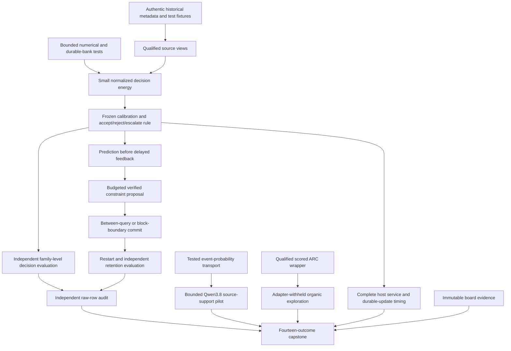
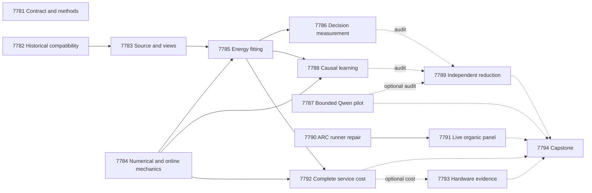

# Carnot Research Roadmap v677: Executable evidence and causal memory

**Created:** 2026-09-27  
**Milestone:** 2026.09.677  
**Title:** Rollover-safe evidence, calibrated decisions, and causal memory writes  
**Status:** Proposed; not activated  
**Supersedes:** 2026.09.676, Exp7767–Exp7780  
**Previous design:** [Preserved V676](research-roadmap-v676-preserved-20260927.md)  
**Contract:** exactly **14 tasks, exp7781 through exp7794**, in the order below, across **four phases**.  
**Requirement:** REQ-REPORT-V677-PLAN; SCENARIO-REPORT-V677-PLAN.

## What V676 proved

V676 completed its queue. It did not complete its proposed scientific tests.
The completed archive currently ends at V675. The active roster, actual
artifacts and conductor log provide the V676 dispositions below.

| Experiments | Evidence | Implication |
|---|---|---|
| 7767 | Contract qualified as `circular_positive` | Reuse its reader. Administrative agreement does not gate science. |
| 7768 | Disqualified: five affected V675 capstone tests could not resolve historical authority after roadmap rollover; formatting also failed | Repair authentic historical test inputs. Its 138/138 changed-module coverage does not erase failed consumer tests. |
| 7769 | Disqualified: functional tests passed in 167.7 seconds; coverage child terminated at 900.1 seconds and saved no data | Locate the slow test before changing execution. Preserve assertions while splitting coverage into bounded runs. |
| 7770 | Disqualified: full-suite receipt still fails on eighteen collection errors, despite focused CPU checks | Preserve this requirement and verdict. A new scoped producer cannot retroactively qualify it. |
| 7771–7774, 7777–7778 | Six scientific deliverables absent after pre-gates or retired-upstream skips | No static, online, Qwen, ARC or service effect was measured. Gate receipts are not scientific producers. |
| 7775 | Correctly blocked on absent decision and learning producers | Missing science is a terminal external block. |
| 7776 | Disqualified: one test file needs formatting; sixteen tests in it lack spec references | Fix those exact defects before the unchanged ARC comparison. |
| 7779 | Immutable history recovered, but required full-suite failure disqualified the artifact | Historical evidence can be read directly; readiness cannot be inherited. |
| 7780 | Disqualified: module 109/109 covered, CLI 32/133; combined coverage 58% | Exercise actual CLI branches. A tested pure reducer does not cover its orchestration. |

Eight artifacts were produced: one circular contract result, six disqualified
results and one blocked audit. Conductor `OK` indicates task completion, not
scientific qualification. Old verdicts remain unchanged.

The eighteen logged collection failures have concrete causes: fourteen legacy
model-registry lookups, one empty legacy-model selection and three missing
module imports. The historical metadata must be restored without changing the
current Qwen3.8 mandate. Collection success alone will not imply suite success.

## Three biggest gaps to the PRD vision

1. **FR-12: source evidence is not yet a useful calibrated decision.**
   Complete windows and finite energy models exist. V676 supplied no qualified
   natural comparison. Measure source dependence, Brier score and decision cost
   against matched controls. An energy minimum is not a semantic certificate.
2. **FR-11: updates have not demonstrated retained causal improvement.**
   The durable bank has fixture evidence. No current natural stream proves that
   admitted constraints improve later decisions after restart. Add a matched
   write-timing control and immutable state during each query.
3. **FR-09/10 and NFR-01: reliable experiments do not yet survive routine
   milestone rollover or support complete service-cost claims.** Fix historical
   inputs and bounded validation first. Measure all host work before selecting
   a hardware target. Keep live ARC discovery independently qualified.

## Research used before design

The [V677 reference review](../../research-references.md#v677-planning-review--2026-09-27-recorded-before-design)
was written before these tasks. It covers all eight requested areas and all
six secondary sources. It records review depth and limitations.

- [CCHD, June 2026](https://arxiv.org/html/2606.08158v1) supplies separate
  consistency and label-preservation constraints. Exp7785 tests their transfer
  to unchanged-byte evidence views, with ordinary augmentation and source-erased
  controls. It does not reproduce the paper's back-translation pipeline.
- [Structural versus semantic decoding, September 2026](https://arxiv.org/html/2609.23742v1)
  motivates separate syntax and meaning measurements in Exp7787. The small-model
  result does not establish performance for the mandated 27B model.
- [Memoir, July 2026](https://arxiv.org/html/2607.20792v1) motivates the matched
  write-boundary comparison in Exp7788. Its fixed-budget penalty is evidence
  to test timing, not proof that Carnot memory updates fail.
- [Capacity-constrained delayed feedback, June 2026](https://arxiv.org/html/2606.11711v1)
  motivates explicit pending capacity and label-release clocks. Its convex
  regret theorem does not apply automatically to predicate admission.
- [Corrected confidence audit v3, August 2026](https://arxiv.org/abs/2608.10008v3)
  motivates explicit source-support risk against generic confidence.

EBT and ARM–EBM remain energy-model foundations. KAN grid adaptation and analog
KAN hardware remain deferred leads. Sparse Boltzmann FPGA work and Extropic
Z1T inform complete preparation/transfer/readout accounting in Exp7792–7793.
None reopens the retired generic external-text scorer or frozen certificate
head. Generator training, a new KAN arm, diffusion decoding and new board
bring-up are deferred until their actual prerequisites justify them.

Semantic Scholar browser access failed, but bounded direct HTTPS succeeded:
20 EBT citation rows with another page, and eight ARM–EBM rows without one.
Citation coverage remains partial for EBT. OpenReview supplied the published
EBT paper and a separate under-review submission. GitHub trending was cached;
Hugging Face was used for discovery. Kona and Extropic claims remain vendor
claims. No new local hardware access was established.

## Architecture



Labels never enter public feature selection. Every query pins an immutable
bank/model version. Feedback can change later queries only. Fixture truth is
circular evidence; natural annotation evaluation is separate. All 640 source
families are historically exposed development data, not fresh generalization.

## Phase 1 — Repair and qualify reusable prerequisites

**Exp7781–Exp7784.** Exp7781 binds fourteen tasks, stores immutable authority
snapshots and ingests adopted methods. It does not gate science. Exp7782 repairs
historical compatibility and test ownership. Exp7783 consumes its historical
fixture receipt. Numerical/online qualification, Exp7784, runs independently.

Repair eighteen collection nodes and five stale V675 capstone nodes without
skips, dummy modules or weakened assertions. Recover missing implementation
from authentic Git history or implement its original tested specification.
Keep the current registry and legacy comparator metadata separate. Retain
unresolved errors explicitly. Old full-suite contracts remain unmet until their
actual commands pass; full collection is a different field.

Source qualification keeps fit256, tune64, policy64, online_update96,
online_admission64, evaluation64 and retention32. It retains complete answer
sentences, 132 label-free features, duplicate-group priors and the null window.
View A contains singles and adjacent triples; B contains singles and adjacent
pairs. Both retain every source sentence. Each permits 128 windows and sixteen
answer units. An invalid/over-budget family stays in every arm with risk 0.5,
Brier 0.25 and escalation cost 0.25. Temperature does not alter this fallback.
Output-error spans do not locate gold source evidence. Unknown sentence labels
add no local-label loss. Joint-premise tests establish input reachability only.

Exp7784 first identifies the slow coverage node. It may cache equivalent JAX
shapes or separate nested orchestration, but must preserve numerical semantics
and every assertion. Coverage shards have unique private data files and bounded
children; all exits must pass before combining 100% changed-module coverage.
The task qualifies all nine heads, real gradients, normalization, dual constraints,
serialization, the natural-head adapter and durable bank behavior. It adds a
queued-commit switch with an immutable query version. No natural labels open.

## Phase 2 — Measure calibrated, source-dependent decisions

**Exp7785–Exp7787.** The energy comparison uses qualified source and numerical
receipts. The independent Qwen pilot has its own CPU validation before capture.

The nine arms remain `response_set`, `local_set`, `augmented_set`,
`constrained_set`, `augmented_mlp`, `constrained_mlp`, `local_logistic`,
`source_erased_constrained_set` and `complete_static_constrained_set`.
This is a new fixed-budget pilot: seeds 67701/67702/67703, learning rate 0.01,
sixteen epochs, 27 fits. It does not claim completion of V676's unexecuted
90-fit protocol. No evaluation-driven budget or arm reduction is allowed.
Natural fitting stops at 3,000 seconds with checkpoints and honest incomplete
rows. Parameter count, including sixteen static predicates and duals, is <=4096.
MLPs use width sixteen; logistic is linear. Matched heads consume the same
per-sentence features and combine sentence support with the same product rule.

Local loss is response NLL plus mean known-sentence NLL. Augmentation averages
supervised loss over A/B. Constrained heads additionally use symmetric Bernoulli
KL/2 tolerance 0.01 and alternate-view CE tolerance 0.70. Dual step is 0.01,
projected to [0,10]. Probabilities clip to [1e-6,1-1e-6]. These are registered
local choices. Low agreement loss alone cannot prove semantic accuracy.

Deployment averages A/B response risks before one temperature on that risk's
logit. Canonical heads use A; logistic averages features before prediction.
Temperature uses the existing tune-only fixed grid in [0.25,4]. Policy64 checks
a fixed cost rule: accept=5p, reject=1-p, escalate=0.25; ties escalate. All head
and policy hashes freeze before evaluation labels open.

Exp7786 evaluates all 64 evaluation families. Average seed metrics inside each
family before 10,000 paired-family bootstrap draws. Independent N is 64.
Primary contrasts compare constrained_set with augmented_set, constrained_mlp
and local_logistic. Useful decisions require cost reduction >=0.02 with
lower95>0, Brier improvement lower95>0, coverage >=0.20, and all six paired
cost/Brier tests passing Holm correction at 0.05. Source value also requires
positive Brier lower95 against the trained erased-source control. Report
fit-prevalence and always-escalate references. All-escalate or imprecise results
are qualified nulls when execution is valid.

Exp7787 uses the same 24 exposed families as Exp7759. Both prompts receive
identical complete source/answer bytes and JSON grammar. Generic confidence
converts to unsupported risk with 1-p. The other prompt asks whether at least
one original answer claim lacks source support. The output field is `probability`.
The task's new REQ-VERIFY-7787 defines its complete affected test closure before
capture. It may reuse low-level helpers, but cannot inherit Exp7770 readiness
or weaken that historical entrypoint's full-suite requirement. Any inherited
entrypoint still owes its original checks.

Use `unsloth/Qwen3.8-27B-GGUF`, real CUDA offload and one fixed seed. Two canaries
allow 32 output tokens each; the 48 panel calls allow 256 each. Maximum output
budget is 12,352 tokens. Capture is capped at 1,800 seconds, each call at 90.
The class is `model_bounded_generation`, with the 10-second authenticity floor.
Malformed or truncated outputs remain in denominators as p=0.5 and escalation.
Useful pilot evidence requires >=90% parse coverage in each arm, positive
lower95 cost/Brier improvement and no new false accepts. N=24 is exploratory.
Schema success, semantic success and model provenance have separate fields.

## Phase 3 — Test retained learning and live exploration

**Exp7788–Exp7791.** Learning gates on current heads and online mechanics.
Exp7789 independently audits raw rows even if producers are missing or null.
The ARC branch has a separate validation repair and unchanged comparison.

Exp7788 uses five arms: between-query adaptive, block-boundary delayed-commit
adaptive, frozen, complete-static and delayed shuffled feedback. Each uses
three matched seeds. The first, second, third and fifth start from constrained_set;
complete-static uses its separately fitted sixteen-predicate checkpoint.
Eight blocks each contain twelve update and eight one-use admission families.
Feedback for b arrives at the start of b+1. Pending custody is twelve update
labels plus eight sealed admission labels. Overflow and duplicate feedback
must not mutate state. Predictions reach durable storage before labels open.

Allow eight proposals total, one per block, from sixteen existing grammar
members. Candidate fitting uses only arrived update labels. Each admission
block opens once. Admission requires Brier improvement >=0.01 and no added
false accept. It is an operational rule, not a statistical significance test.
Between-query updates commit before the next query. The delayed arm stages
accepted changes until the following block boundary. Both keep state fixed
within a query and use identical eligible-label clocks and compute ceilings.
Log proposal and commit times separately. Restart after block four with staged
commits, model, bank, queue, credits and RNG intact. Drain final feedback and
commits before final freeze. Never import fixture-trained weights.

Primary retained-learning evidence requires adaptive improvement over frozen
and complete-static in Brier and cost, lower95>0, cost reduction >=0.02, and
four Holm-corrected tests at 0.05. Retention32 requires Brier degradation
upper95<=0.02 and no added false accepts. At least one admitted predicate must
change a later decision. Shuffled feedback must not reproduce the benefit.
Write timing is a secondary ablation. Report a no-admission null honestly.

Exp7790 repairs the exact Ruff/spec failures in the selector test file. Each
assertion must map to real behavior requirements. It qualifies actual SDK
transitions through `make_carnot_agent`, counter divergence, selector activation,
supervisor outcomes and owned-child termination. Run the applicable CPU checks
from E2E-009/011/013 and offline E3 SDK smoke before opening readiness.

Exp7791 retains cd82, dc22, lf52, m0r0, sk48, tn36, sb26 and sc25, seeds 67501
and 67502, and arms off/total-seen/organic-seen. Withhold adapters and stored
routes; disable all LLM tiers. No game-source reading or offline solution
construction is allowed. Each of 48 episodes has 2,000 actions and 75 seconds;
stop launches at 3,900 seconds. Retain censored and unstarted rows.
Use the installed SDK score formula and human baseline actions under both
RESET charging conventions. Average seeds within game, N=8. Enumerate all
256 sign assignments for each paired test and Holm-correct both control
contrasts. Continuation requires positive lower95 scores against both controls
under both conventions, adjusted p<=0.05, no lost baseline winning seed and
<=10% action regression on shared wins. Missing pairs forbid a broad benefit.
All discovered progress requires `live_agent_self_discovery`. Registry-known
levels earn no new solve credit. Public exposure prevents a hidden-score claim.

## Phase 4 — Measure service cost and decide continuation

**Exp7792–Exp7794.** Cost measurement needs current qualified heads and online
mechanics. It includes ingestion, byte handling, windows, features, normalization,
calibration, decision and serialization. Measure batch sizes 1/8/32, ten warmups
per arm/size and thirty paired timed blocks. Compare constrained_set,
constrained_mlp and local_logistic with randomized within-block order.
Keep cold start separate. Charge complete updates through fsync and acknowledgement.
Measure timing with private fixture state; learning value comes from Exp7788.

Exp7793 accounts for every attached board from immutable historical evidence.
It runs even if service data are absent. Its current pure reducer must pass its
complete affected scope. It preserves Exp7779's failed full-suite requirement.
No repeated physical-board probe is scheduled without changed prerequisites.
An unresolved historical digest remains unresolved. Current mutable prose must
not replace old source bytes. Exp7792's fractions inform Amdahl bounds only
when qualified. A projected speedup never counts as a measured backend result.

Exp7794 accounts for all fourteen tasks, including its own disposition without
hashing its not-yet-written output as an input. It exercises the CLI branches
missed by Exp7780. It independently reduces scientific gates and runs the stable
publication G1–G4 reader. Existing FoVer publication evidence stays separate.
External missing evidence is `blocked`; only unfinished owned work is `partial`.

## Dependencies and gate contract



Solid arrows are conductor gates. Dotted arrows are evidence reads that must
also work when inputs are absent, blocked or null. Each gated upstream requires
its named readiness score(s)=1, `flagged_adversarial=false`, and verdict class
in `null`, `circular_positive`, `positive`. Exact fields appear in the machine
contract below and in each producer's REQUIRED ARTIFACT FIELDS. No gate refers
to a retired upstream or requires a positive scientific effect to admit a null.

## Hardware requirements and acquisition relevance

| Scope | Resource and bound | Requirement or acquisition consequence |
|---|---|---|
| Compatibility, methods, audits | Existing CPU, private temporary disk, 25–65 min/task | No new hardware. Historical metadata lookup must not load old models. |
| Source, fitting and learning | Existing CPU/JAX, cached padded features, <=4096 trainable parameters/head | Reuse system memory. Measure compile/update cost before assigning a GPU or NPU. |
| Qwen event pilot | Cached approximately 16 GB GGUF; one available RTX 3090 24 GB with verified CUDA offload | Two 3090s are available in project inventory. Use one model; no dual-model dispatch. Verify current free memory and template at runtime. |
| ARC panel | CPU SDK, forty-eight bounded owned children, one active episode at a time | No model load. Preserve all scheduled rows within the 3,900-second launch window. |
| Complete service | CPU timing with thread counts and contention recorded | Accelerated energy alone is subject to measured Amdahl limits. No NFR-01 claim from a microkernel. |
| KV260 | Authenticated historical fabric scope, k_max<=5 | Future live work uses SSH to `kria`; no host storage precondition. No new synthesis/flash task here. |
| PolarFire | Authenticated Linux CPU dispatch evidence | Do not label it fabric acceleration. |
| GateMate | Preserved `0xffffffff` physical/JTAG blocker | Requires changed cable/power/port evidence; repeating software probes has no new premise. |
| NPU, TSU, analog KAN | Unqualified local access/toolchain or unavailable hardware | Keep wishlist entries; no purchase, install or efficiency claim based on vendor estimates. |

The hardware path for learning is CPU counters and durable state, batched
small-head math on GPU/Rust, and eventual FPGA predicate matching. Exp7792
must measure the part each could accelerate. The long-term 100x target is a
research target, not a result established by this milestone.

## Execution, validity and stopping rules

Each prompt requires phase and long-call progress, <=60-second loop heartbeats,
and no silence gap >=600 seconds. Files longer than about 200 lines are written
in <=150-line tool-call chunks, with progress between calls. Supervisors poll
and terminate owned children only. Estimates include validation; no task may
pad duration to meet a substrate floor.

Only Exp7787 invokes an LLM. It declares the mandated model and bounded class.
Full generation would use a 60-second floor; load/embedding-only work a 2-second
floor. This plan does neither. CPU/aggregation tasks use empty MODEL_SPECS and
record actual work separately from cited historical models.

All prompts specify spec-first/test-first work, complete affected checks, 100%
changed-module coverage, lint/types/spec traceability, real entrypoint E2E,
cold reduction, adversarial verification and strict row consistency. Validation
fixtures use private temporary directories. Historical fixtures use authentic
immutable inputs. No historical requirement, assertion or result may be removed.
New scoped contracts do not turn old failed full-suite contracts into passes.

Each comparative task emits per-unit rows. All blocked outcomes contain
`gate_check_summary` with failed fields and observed values. `verdict_class` is
a closed enum; circular fixture results cannot become positive science. Every
retry has complete prior_failures entries and `retire_if_same_verdict: true`.
There is no operator override in this plan. A repeated verdict retires its scope.
Schema/preflight coordination uses Opus/100 turns; formulaic code uses Codex
`gpt-6-sol`; routine science uses Sonnet. Diagnostics use reduced turn budgets.
No task activates a roadmap, publishes, pushes or edits the conductor.

## Exact task contract

The table and JSON below are executable planning contracts. They contain the
same fourteen ordered tasks as research-roadmap-next.yaml. A listed deliverable
is the exact experiment output, not a conductor pre-gate receipt.

| Order | ID | Title | Phase | Deliverable |
|---|---|---|---|---|
| 1 | `exp7781-contract-methods` | Bind fourteen tasks and register causal evidence methods | 1 | `results/experiment_7781_v677_contract_methods.json` |
| 2 | `exp7782-historical-compatibility` | Repair historical imports and isolate roadmap test fixtures | 1 | `results/experiment_7782_v677_historical_compatibility.json` |
| 3 | `exp7783-source-view-qualification` | Qualify source custody with stable historical consumers | 1 | `results/experiment_7783_v677_source_view_qualification.json` |
| 4 | `exp7784-training-runtime` | Qualify numerical and online mechanics with bounded coverage shards | 1 | `results/experiment_7784_v677_training_runtime.json` |
| 5 | `exp7785-view-energy-fit` | Train normalized decision energies with matched view controls | 2 | `results/experiment_7785_v677_view_energy_fit.json` |
| 6 | `exp7786-decision-measurement` | Measure source dependence calibration and typed decision cost | 2 | `results/experiment_7786_v677_decision_measurement.json` |
| 7 | `exp7787-qwen-event-confidence` | Measure bounded Qwen support risk with syntax and meaning controls | 2 | `results/experiment_7787_v677_qwen_event_confidence.json` |
| 8 | `exp7788-continuous-acquisition` | Test delayed constraint growth and memory write boundaries | 3 | `results/experiment_7788_v677_continuous_acquisition.json` |
| 9 | `exp7789-independent-evidence-audit` | Cold-reduce decision value and causal memory evidence | 3 | `results/experiment_7789_v677_independent_evidence_audit.json` |
| 10 | `exp7790-arc-runner-qualification` | Repair organic-runner formatting and specification traceability | 3 | `results/experiment_7790_v677_arc_runner_qualification.json` |
| 11 | `exp7791-arc-organic-measurement` | Measure organic selection on adapter-withheld live discovery | 3 | `results/experiment_7791_v677_arc_organic_measurement.json` |
| 12 | `exp7792-service-cost` | Measure complete decision and durable-update service cost | 4 | `results/experiment_7792_v677_service_cost.json` |
| 13 | `exp7793-hardware-evidence` | Preserve board obligations with immutable evidence and service bounds | 4 | `results/experiment_7793_v677_hardware_evidence.json` |
| 14 | `exp7794-capstone` | Reconcile fourteen outcomes and decide evidence-based continuation | 4 | `results/experiment_7794_v677_capstone.json` |

<!-- V677_TASK_CONTRACT_START -->
```json
{
  "milestone": "2026.09.677",
  "task_count": 14,
  "tasks": [
    {"id": "exp7781-contract-methods", "title": "Bind fourteen tasks and register causal evidence methods", "phase": 1, "deliverable": "results/experiment_7781_v677_contract_methods.json", "inference_substrate_class": "aggregation", "MODEL_SPECS": [], "gated_on": []},
    {"id": "exp7782-historical-compatibility", "title": "Repair historical imports and isolate roadmap test fixtures", "phase": 1, "deliverable": "results/experiment_7782_v677_historical_compatibility.json", "inference_substrate_class": "no_model_load", "MODEL_SPECS": [], "gated_on": []},
    {"id": "exp7783-source-view-qualification", "title": "Qualify source custody with stable historical consumers", "phase": 1, "deliverable": "results/experiment_7783_v677_source_view_qualification.json", "inference_substrate_class": "no_model_load", "MODEL_SPECS": [], "gated_on": [{"upstream": "exp7782-historical-compatibility", "artifact_field": "historical_fixture_ready_score", "op": "==", "value": 1}, {"upstream": "exp7782-historical-compatibility", "artifact_field": "flagged_adversarial", "op": "==", "value": false}, {"upstream": "exp7782-historical-compatibility", "artifact_field": "verdict_class", "op": "in", "value": ["null", "circular_positive", "positive"]}]},
    {"id": "exp7784-training-runtime", "title": "Qualify numerical and online mechanics with bounded coverage shards", "phase": 1, "deliverable": "results/experiment_7784_v677_training_runtime.json", "inference_substrate_class": "no_model_load", "MODEL_SPECS": [], "gated_on": []},
    {"id": "exp7785-view-energy-fit", "title": "Train normalized decision energies with matched view controls", "phase": 2, "deliverable": "results/experiment_7785_v677_view_energy_fit.json", "inference_substrate_class": "no_model_load", "MODEL_SPECS": [], "gated_on": [{"upstream": "exp7783-source-view-qualification", "artifact_field": "sentence_protocol_ready_score", "op": "==", "value": 1}, {"upstream": "exp7783-source-view-qualification", "artifact_field": "evidence_view_ready_score", "op": "==", "value": 1}, {"upstream": "exp7783-source-view-qualification", "artifact_field": "flagged_adversarial", "op": "==", "value": false}, {"upstream": "exp7783-source-view-qualification", "artifact_field": "verdict_class", "op": "in", "value": ["null", "circular_positive", "positive"]}, {"upstream": "exp7784-training-runtime", "artifact_field": "training_runtime_ready_score", "op": "==", "value": 1}, {"upstream": "exp7784-training-runtime", "artifact_field": "flagged_adversarial", "op": "==", "value": false}, {"upstream": "exp7784-training-runtime", "artifact_field": "verdict_class", "op": "in", "value": ["null", "circular_positive", "positive"]}]},
    {"id": "exp7786-decision-measurement", "title": "Measure source dependence calibration and typed decision cost", "phase": 2, "deliverable": "results/experiment_7786_v677_decision_measurement.json", "inference_substrate_class": "no_model_load", "MODEL_SPECS": [], "gated_on": [{"upstream": "exp7785-view-energy-fit", "artifact_field": "view_heads_ready_score", "op": "==", "value": 1}, {"upstream": "exp7785-view-energy-fit", "artifact_field": "flagged_adversarial", "op": "==", "value": false}, {"upstream": "exp7785-view-energy-fit", "artifact_field": "verdict_class", "op": "in", "value": ["null", "circular_positive", "positive"]}]},
    {"id": "exp7787-qwen-event-confidence", "title": "Measure bounded Qwen support risk with syntax and meaning controls", "phase": 2, "deliverable": "results/experiment_7787_v677_qwen_event_confidence.json", "inference_substrate_class": "model_bounded_generation", "MODEL_SPECS": ["unsloth/Qwen3.8-27B-GGUF"], "gated_on": []},
    {"id": "exp7788-continuous-acquisition", "title": "Test delayed constraint growth and memory write boundaries", "phase": 3, "deliverable": "results/experiment_7788_v677_continuous_acquisition.json", "inference_substrate_class": "no_model_load", "MODEL_SPECS": [], "gated_on": [{"upstream": "exp7784-training-runtime", "artifact_field": "online_runtime_ready_score", "op": "==", "value": 1}, {"upstream": "exp7784-training-runtime", "artifact_field": "flagged_adversarial", "op": "==", "value": false}, {"upstream": "exp7784-training-runtime", "artifact_field": "verdict_class", "op": "in", "value": ["null", "circular_positive", "positive"]}, {"upstream": "exp7785-view-energy-fit", "artifact_field": "view_heads_ready_score", "op": "==", "value": 1}, {"upstream": "exp7785-view-energy-fit", "artifact_field": "flagged_adversarial", "op": "==", "value": false}, {"upstream": "exp7785-view-energy-fit", "artifact_field": "verdict_class", "op": "in", "value": ["null", "circular_positive", "positive"]}]},
    {"id": "exp7789-independent-evidence-audit", "title": "Cold-reduce decision value and causal memory evidence", "phase": 3, "deliverable": "results/experiment_7789_v677_independent_evidence_audit.json", "inference_substrate_class": "aggregation", "MODEL_SPECS": [], "gated_on": []},
    {"id": "exp7790-arc-runner-qualification", "title": "Repair organic-runner formatting and specification traceability", "phase": 3, "deliverable": "results/experiment_7790_v677_arc_runner_qualification.json", "inference_substrate_class": "no_model_load", "MODEL_SPECS": [], "gated_on": []},
    {"id": "exp7791-arc-organic-measurement", "title": "Measure organic selection on adapter-withheld live discovery", "phase": 3, "deliverable": "results/experiment_7791_v677_arc_organic_measurement.json", "inference_substrate_class": "no_model_load", "MODEL_SPECS": [], "gated_on": [{"upstream": "exp7790-arc-runner-qualification", "artifact_field": "organic_runner_ready_score", "op": "==", "value": 1}, {"upstream": "exp7790-arc-runner-qualification", "artifact_field": "flagged_adversarial", "op": "==", "value": false}, {"upstream": "exp7790-arc-runner-qualification", "artifact_field": "verdict_class", "op": "in", "value": ["null", "circular_positive", "positive"]}]},
    {"id": "exp7792-service-cost", "title": "Measure complete decision and durable-update service cost", "phase": 4, "deliverable": "results/experiment_7792_v677_service_cost.json", "inference_substrate_class": "no_model_load", "MODEL_SPECS": [], "gated_on": [{"upstream": "exp7784-training-runtime", "artifact_field": "online_runtime_ready_score", "op": "==", "value": 1}, {"upstream": "exp7784-training-runtime", "artifact_field": "flagged_adversarial", "op": "==", "value": false}, {"upstream": "exp7784-training-runtime", "artifact_field": "verdict_class", "op": "in", "value": ["null", "circular_positive", "positive"]}, {"upstream": "exp7785-view-energy-fit", "artifact_field": "view_heads_ready_score", "op": "==", "value": 1}, {"upstream": "exp7785-view-energy-fit", "artifact_field": "flagged_adversarial", "op": "==", "value": false}, {"upstream": "exp7785-view-energy-fit", "artifact_field": "verdict_class", "op": "in", "value": ["null", "circular_positive", "positive"]}]},
    {"id": "exp7793-hardware-evidence", "title": "Preserve board obligations with immutable evidence and service bounds", "phase": 4, "deliverable": "results/experiment_7793_v677_hardware_evidence.json", "inference_substrate_class": "aggregation", "MODEL_SPECS": [], "gated_on": []},
    {"id": "exp7794-capstone", "title": "Reconcile fourteen outcomes and decide evidence-based continuation", "phase": 4, "deliverable": "results/experiment_7794_v677_capstone.json", "inference_substrate_class": "aggregation", "MODEL_SPECS": [], "gated_on": []}
  ]
}
```
<!-- V677_TASK_CONTRACT_END -->
