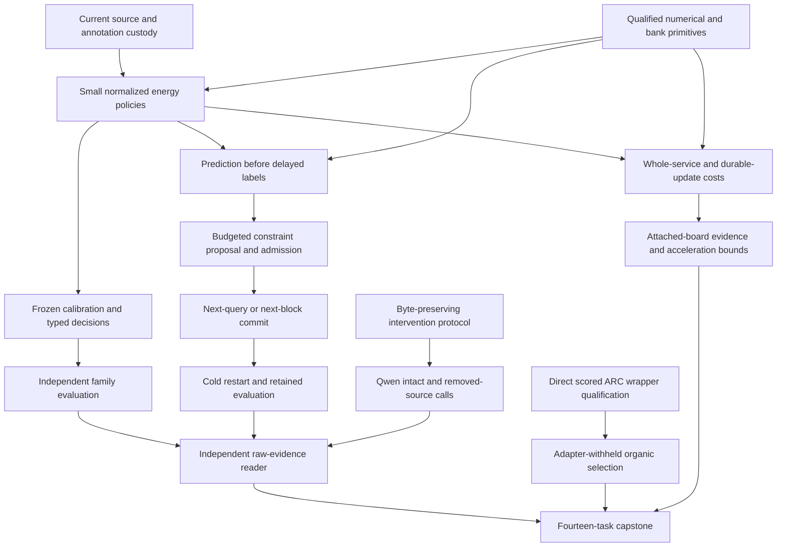

# Carnot Research Roadmap v678: Source-sensitive decisions and retained learning

**Created:** 2026-09-27

**Milestone:** 2026.09.678

**Title:** Source-sensitive decisions, delayed constraint learning, and bounded live evaluation

**Status:** Proposed; not activated

**Supersedes:** 2026.09.677, Exp7781–Exp7794

**Previous design:** [Preserved V677](research-roadmap-v677-preserved-20260927.md)

**Contract:** exactly **14 tasks, exp7795 through exp7808**, in the order below, across **four phases**.

**Requirement:** REQ-REPORT-V678-PLAN; SCENARIO-REPORT-V678-PLAN.

## What V677 proved

The queue completed. Eight declared artifacts exist; six scientific producers
are absent. The completed archive stops at V676. The active V677 roster,
actual artifacts and conductor log supply the current dispositions.
The available log includes completions dated September 28. Preserve those dates.

| Experiments | Observed evidence | Consequence |
|---|---|---|
| 7781 | `complete_circular_positive_v677_contract_methods`; independent contract reader passes | Reuse the reader. Contract checks never gate science. |
| 7782 | Historical imports and fixtures repaired; required whole-suite child exited -15 | Artifact remains disqualified. New source work must test its own complete affected closure. |
| 7784 | Numerical and online fixtures ran; coverage receipts failed and whole-suite child exited -15 | Preserve disqualification. Use uniform coverage settings and durable logs in a current independent runner. |
| 7787 | `complete_null_exposed_pilot`; 48 Qwen calls across 24 families | Transport is usable. Explicit event confidence did not establish a decision benefit. |
| 7790 | Selector format/spec defects repaired; inherited whole-suite execution exited -15 | No qualified organic-selection panel exists. Construct the current scored wrapper directly. |
| 7783, 7785, 7786, 7788, 7791, 7792 | Declared science outputs absent after prerequisite skips | No natural trained-head, learning, ARC or service effect can be inferred. |
| 7789, 7793, 7794 | Terminal blocked reductions preserve absent science | Keep missing producers distinct from queue receipts. |

Exp7787's explicit event prompt parsed 24/24 calls; generic confidence parsed
18/24. Brier scores were 0.16292 and 0.18608 respectively. The paired improvement
interval was [-0.11297, 0.15390]. Decision-cost improvement was 0.16667 with
interval [-0.33333, 0.62500]. These are exposed pilot observations, not a win.
The next Qwen question therefore changes the intervention, not only the wording.

The source and numerical failures have a concrete execution cause. Their
runners added whole-repository execution to planned bounded checks. The old
specifications now require those runs, so their historical failures stay intact.
New entrypoints call low-level preparation, fit and bank functions directly.
They register all affected tests prospectively. They do not wrap old mains,
relabel an old verdict, or omit an affected consumer. Broad health stays explicit.

Exp7784's current temporary coverage files differ from its recorded failed
receipt hashes. They cannot repair that historical receipt. New logs become
immutable before they are referenced by an artifact.

The September 28 corrigendum retracts the old Exp4245/5151/5160/5171
oracle-distinct win. Confidence leakage, self-labeling and seed-level intervals
made that claim unsound. `GAP-ORACLE-DISTINCT` remains open.

## Three biggest gaps to the PRD vision

1. **FR-12: source evidence has not produced reliable calibrated decisions.**
   Syntax and citation validity do not establish factual support. Measure
   source dependence, probability quality and accept/reject/escalate cost
   separately. Use independently annotated families and matched small heads.
2. **FR-11: updates have not shown causal benefit that survives restart.**
   The bank can store constraints. It still needs a natural-data comparison
   against frozen and complete-static controls. Feedback must arrive after
   prediction. Test retention and commit timing at equal update budgets.
3. **FR-05/08, FR-09/10 and NFR-01: execution and deployment evidence are
   incomplete.** Qualification must finish within the conductor budget.
   Measure whole-service cost before selecting an accelerator. For the ARC
   north star, measure actual scored-path behavior with game adapters withheld.

## Research incorporated before design

The [V678 research review](../../research-references.md#v678-planning-review--2026-09-27-recorded-before-design)
was appended before this design. It records all eight topic areas and six
secondary sources, including unavailable pages and review depth.

| Primary work | Experiment translation | Limit |
|---|---|---|
| [CoEV, June 2026](https://arxiv.org/html/2606.18609v1) | Exp7800–7801 compare removal of a predicted witness with unrelated removal | A text adaptation tests dependence; visual-domain accuracy does not transfer. |
| [CCHD, June 2026](https://arxiv.org/abs/2606.08158) | Exp7798–7799 compare constrained view consistency with matched augmentation | Two agreeing views can both be wrong. |
| [HallDetect, August 2026](https://arxiv.org/html/2608.05823v1) | Preserve original claims and traceable source spans | A citation is not an entailment certificate; hold other factors equal. |
| [Memoir, July 2026](https://arxiv.org/abs/2607.20792) | Exp7802 keeps reads fixed within queries and compares commit timing | Its fixed-budget finding does not prove permanent forgetting. |
| [Delayed feedback capacity, June 2026](https://arxiv.org/abs/2606.11711) | Exp7802 records release clocks, capacity and dropped feedback | Convex regret bounds do not automatically cover predicate admission. |
| [Structural/semantic decoding gap, September 2026](https://arxiv.org/abs/2609.23742) | Exp7801 reports syntax separately from intact-source calibration | JSON grammar cannot validate meaning. |
| [Extropic Z1T, September 2026](https://extropic.ai/writing/z1t) | Exp7805–7806 account for digital preparation, sampling and transfer | Vendor estimates remain separate from local service evidence. |

EBT and ARM–EBM support normalized energy modeling, not a correctness theorem.
HardNet++ and neural constraint reasoning remain leads until the existing
pipeline produces measured evidence. KAN retention studies justify retention
controls; another spline sweep is deferred. Sparse Ising hardware remains
relevant, but no unqualified device run or new purchase is scheduled.

Semantic Scholar returned 37 EBT and eight ARM–EBM citing records through
bounded HTTPS, with no next-page markers. These are indexed records, not an
exhaustive census. OpenReview returned browser challenges; indexed PDF snippets
were checked against arXiv methods. GitHub trends were two weeks stale. Hugging
Face supplied discovery leads. Kona supplied vendor framing, not reproducible
new model access. No retired PHASE D scorer or generator-weight training reopens.

## Architecture



The contract task is independent and does not gate science. The Qwen and ARC
branches can run when trained-head science is blocked. Every query pins its
model and bank version. Labels never enter source selection or public features.
All 640 natural source families are historically exposed development data.

## Phase 1 — Qualify bounded reusable prerequisites

**Exp7795–Exp7797.** Exp7795 binds the design to YAML and preserves immutable
V678 authority snapshots. It registers the adopted methods. It never gates
science. Exp7796 qualifies source custody. Exp7797 independently qualifies
numerical training and durable bank behavior.

Exp7796 calls existing preparation and cold-replay functions directly.
It freezes the complete affected test closure and exact child commands before
implementation. An orchestration test rejects an undeclared broad pytest target
or historical qualification main. Historical full-suite failures remain failed.
The prospective contract covers all affected tests, changed code and integration.

The fixed roles are fit256, tune64, policy64, online_update96,
online_admission64, evaluation64 and retention32. Preserve source-family and
duplicate-group identity. View A uses singles and adjacent triples; B uses
singles and adjacent pairs. Both retain every source sentence. Each view permits
128 windows and sixteen answer units. All heads receive the same 132 label-free
features. Invalid or over-budget families retain risk 0.5, Brier 0.25 and
escalation cost 0.25. Temperature cannot change this fallback.
Output-error spans do not identify supporting source sentences. Unknown sentence
labels contribute no local-label loss. Joint-premise fixtures test reachability.

Exp7797 exercises all nine heads on six fixture families, three seeds and two
epochs. It verifies gradients, updates, normalization, duals, serialization,
negative controls and role poisoning. It separately tests pending commits,
overflow, duplicate feedback, rollback and hard-exit recovery. Fixtures grant
circular conformance evidence only. Their weights cannot initialize science.
Coverage shards use one configuration, unique private paths and preserved exits.
All logs move to durable task-owned storage before their hashes enter results.

**Phase gate:** current custody and numerical readiness, with complete affected
validation. A stale fixture pass or a historical disqualified artifact cannot
open the natural fitting branch.

## Phase 2 — Measure useful probabilities and source dependence

**Exp7798–Exp7801.** Exp7798 trains nine small policies; Exp7799 evaluates them.
The Qwen intervention has a separate protocol task and model run.

The nine arms are `response_set`, `local_set`, `augmented_set`,
`constrained_set`, `augmented_mlp`, `constrained_mlp`, `local_logistic`,
`source_erased_constrained_set` and `complete_static_constrained_set`.
Use seeds 67801/67802/67803, sixteen epochs and learning rate 0.01: 27 fits.
Each arm has at most 4096 parameters including sixteen predicates and duals.
MLPs use width sixteen; logistic remains linear. Use the same features and
sentence aggregation. This is a fixed pilot, not a completed old 90-fit study.
Stop fitting at 3000 seconds with complete checkpoint/status accounting.

Local supervision is response NLL plus mean known-sentence NLL. Augmentation
averages the supervised losses over A/B. Constrained heads add symmetric
Bernoulli KL/2 tolerance 0.01 and alternate-view CE tolerance 0.70. Dual step
is 0.01 projected to [0,10]; probabilities clip to [1e-6,1-1e-6]. These are
registered local choices, not universal thresholds derived from the paper.

Average A/B response risk before scaling its logit by one temperature.
Canonical heads use A. Tune64 chooses temperature on the existing [0.25,4]
fixed grid. Freeze decision costs: accept=5p, reject=1-p, escalate=0.25;
ties escalate. Policy64 reports the operating behavior without changing costs.
Evaluation labels stay closed until all checkpoints and policy hashes freeze.

Exp7799 evaluates all 64 evaluation families. Average seeds within each family
before 10000 paired-family bootstrap draws. Primary contrasts compare
constrained_set with augmented_set, constrained_mlp and local_logistic.
Require cost reduction >=0.02, cost and Brier lower95>0, coverage >=0.20 and
Holm-adjusted p<=0.05 across six tests. Source value also requires Brier lower95>0
against the separately fitted erased-source control. Include fit-prevalence and
always-escalate references. Complete, valid but imprecise results are nulls.

Exp7800 freezes 48 families by hash from evaluation64. These are exposed,
independent source families, not new generalization data. The intact prompt
returns unsupported probability and a proposed supporting source sentence for
the first original answer sentence. Follow-up calls retain the whole original
answer. One removes that proposed witness. The other removes a disjoint sentence
within 25% of its token length, selected by seeded hash order. Unmatched and
invalid families remain visible. Neither gold labels nor error spans select edits.

Exp7801 uses `unsloth/Qwen3.8-27B-GGUF` Q4_K_M with actual CUDA offload and
its GGUF tokenizer/template. Use seed 67801, <=256 output tokens per panel call,
8192 context tokens and no silent truncation. Two 32-token canaries plus at most
144 panel calls permit <=36928 output tokens. This is
`model_bounded_generation` (10-second floor). No run is padded to meet a floor.
Stop new calls at 2400 seconds, retaining every unfinished row.

The primary contrast is p(witness removed) minus p(unrelated removed).
Require >=30 matched families, >=0.80 matched coverage, mean shift >=0.05
and paired lower95>0 for the narrow source-sensitivity gate. Intact-source Brier,
cost and syntax validity are separate descriptive outcomes. Modified sources
have no inherited original labels. Sensitivity does not prove entailment,
accuracy improvement, repair or a verifier moat.

**Phase gate:** valid measurement, paired uncertainty, matched controls and
raw-row reproduction. Scientific nulls remain usable evidence. Every private
label-leak, missing-row and wrong-source mutation must be rejected.

## Phase 3 — Test continuous learning and live generalization

**Exp7802–Exp7804.** Exp7802 tests FR-11. Exp7803–7804 independently qualify
and measure the scored ARC path.

The online arms are next-query adaptive, next-block adaptive, frozen,
complete-static and delayed shuffled-feedback, each with three matched seeds.
Adaptive/frozen/shuffled start from constrained_set. Complete-static uses its
own fitted sixteen-predicate checkpoint. Eight blocks each contain twelve update
and eight one-use admission families. Feedback for block b arrives at b+1.
Capacity is twelve pending update labels plus eight sealed admission labels.
Predictions become durable before labels open. Overflow or duplicates cannot
change state. Proposal count is one per block, eight total.

Candidate fitting uses only arrived update labels. Each admission block opens
once. Admission requires Brier reduction >=0.01 and no added false accept.
This is an operational rule, not statistical significance. Accepted proposals
commit either before the next query or at the next block boundary. Both arms
keep state immutable within a query and use equal feedback/compute ceilings.
Restart after block four with pending commits, model, bank, queue, RNG and credits.
Drain final feedback before final freeze.

Use evaluation64 and retention32 after final freeze. Primary adaptive benefit
must beat frozen and complete-static with Brier/cost lower95>0, cost reduction
>=0.02 and four Holm-corrected tests at 0.05. Retention degradation upper95 must
be <=0.02 with no added false accept. At least one admitted predicate must
change a later decision. Shuffled feedback cannot reproduce the benefit.
Timing is secondary. No-admission results are valid nulls, not progress claims.

Exp7803 constructs `make_carnot_agent` / `E3AgentPolicy` directly. It withholds
per-game adapters, stored routes and engines. All LLM tiers stay disabled.
Two real SDK fixture episodes check transitions, organic-versus-replay counters,
selector activation, supervisor outcomes, score inputs and child cancellation.
E2E-009/011/013 CPU checks and the offline E3 smoke qualify the current runner.
Historical qualification mains are not invoked. Fixtures receive no solve credit.

Exp7804 retains cd82, dc22, lf52, m0r0, sk48, tn36, sb26 and sc25. Seeds are
67801/67802; arms are off/total-seen/organic-seen. Run 48 real SDK episodes,
2000 actions and 75 seconds each. Stop launches at 3900 seconds. Preserve
censored and unstarted rows. Use `EnvironmentInfo` human baselines and the
installed SDK formula under both RESET charging conventions. Registry agent
baselines are not human baselines.

Average seeds within game (N=8). Enumerate 256 sign assignments for paired
tests. Continuation requires positive lower95 against both controls under both
RESET conventions, Holm-adjusted p<=0.05, no lost baseline winning seed and
<=10% action regression on shared wins. Incomplete pairs forbid broad benefit.
All progress comes from `live_agent_self_discovery`. Reproduce any claimed new
level through the canonical gate. Registry-known levels earn no new credit.
No game-source reading, hand-built adapter, offline exhaustive solution or
hidden leaderboard claim belongs in this experiment.

**Phase gate:** query/feedback causality, durable restart, retained accuracy
and actual scored-wrapper engagement. A stored model or active selector alone
cannot establish improvement. Production flags remain unchanged.

## Phase 4 — Measure deployment cost and independently reconcile

**Exp7805–Exp7808.** Exp7805 measures complete service cost after current heads
and online mechanics qualify. It includes ingestion, bytes, views, features,
energy, calibration, bank lookup, decision and serialization. Compare the
constrained set, constrained MLP and logistic heads at batch sizes 1/8/32.
Use ten warmups and thirty paired timed blocks, randomizing arm order.
Report cold start separately. Charge updates through fsync and acknowledgement.
Private fixture state measures update cost; learning value comes from Exp7802.

For accelerated fraction f, the optimistic whole-service bound is 1/(1-f),
before transfer cost. If that cannot yield 100x, identify a broader useful
boundary or reject the target. Kernel throughput cannot substitute for service
throughput. Rust 10x and hardware 100x remain goals until actual measurements.

Exp7806 unconditionally preserves evidence for KV260, PolarFire and GateMate.
It reads immutable original transcripts or Git blobs. It performs no probe,
flash, installation or purchase. A missing current service producer yields one
terminal blocked result, while all board evidence and reopen conditions survive.

Exp7807 independently reopens original source records, model checkpoints and
feedback clocks. It recomputes available Exp7799, Exp7801 and Exp7802 evidence
without importing their metric reducers. Private mutations test confidence
leakage, self-labels, wrong resampling units, dropped rows and future feedback.
No GPU generation repeats. Missing branches stay explicit; valid branches survive.

Exp7808 accounts for all fourteen tasks. It separates queue receipts, science
producers, fixtures, development pilots and live-runtime observations. It runs
the unchanged publication G1–G4 reader and records `paper_ready`/`unmet_gates`.
It does not change gates or publish. Every mechanism gets continue, retire or
await_named_prerequisite with a falsifiable trigger. External missing science is
`blocked`; only unfinished owned implementation is `partial`.

## Dependency graph and conductor execution order

Arrows below mean structured readiness gates, not a requirement for a win.
Every gated producer is present earlier in this roadmap. Each also requires
`flagged_adversarial == false` and class in `null`, `circular_positive`, `positive`.
The upstream prompts declare each readiness field verbatim.

```text
7795 contract/methods                         independent, no science gates
7796 source qualification ─┐
7797 numerical/bank ───────┴─> 7798 fit ──> 7799 decision measurement
7797 numerical/bank ─────────> 7802 acquisition <── 7798 fit
7800 intervention protocol ──> 7801 Qwen source-sensitivity pilot
7803 ARC qualification ──────> 7804 ARC organic measurement
7797 numerical/bank ─────────> 7805 service cost <── 7798 fit
7806 board evidence                          unconditional; reads 7805 if valid
7807 independent audit                      unconditional; reads 7799/7801/7802
7808 capstone                               unconditional; accounts for all tasks
```

| Consumer | Exact readiness fields |
|---|---|
| Exp7798 | Exp7796.sentence_protocol_ready_score=1; Exp7796.evidence_view_ready_score=1; Exp7797.training_runtime_ready_score=1 |
| Exp7799 | Exp7798.view_heads_ready_score=1 |
| Exp7801 | Exp7800.counter_evidence_ready_score=1 |
| Exp7802 | Exp7798.view_heads_ready_score=1; Exp7797.online_runtime_ready_score=1 |
| Exp7804 | Exp7803.organic_runner_ready_score=1 |
| Exp7805 | Exp7798.view_heads_ready_score=1; Exp7797.online_runtime_ready_score=1 |

## Hardware requirements

| Tasks | Compute and capacity | Evidence boundary |
|---|---|---|
| 7795–7800, 7802, 7807–7808 | Ryzen CPU, system RAM, existing Python/JAX environment; heads <=4096 parameters | No generator invocation. Batch JAX work on CPU; source corpus remains exposed. |
| 7801 | One available RTX 3090, 24 GB; cached Qwen3.8 Q4_K_M about 16 GB plus measured KV/cache headroom | Real CUDA required; second 3090 remains optional. Block on insufficient measured headroom. |
| 7803–7804 | CPU and installed offline ARC SDK; bounded per-episode processes | Live scored policy with no model tier, adapters or stored routes. No hidden-score claim. |
| 7805 | Same CPU host; disk supporting durable flushes | Complete request and update cost, including persistence. No board speedup claim. |
| 7806: KV260 | Immutable prior fabric records, k_max<=5 | Keep qualified fabric scope; future board use requires actual SSH/device execution evidence. |
| 7806: PolarFire | Immutable Linux CPU-dispatch records | Never re-label CPU dispatch as FPGA acceleration. |
| 7806: GateMate | Existing 0xffffffff physical/JTAG blocker | Reopen only after dated changed physical conditions. No repeated unchanged probe. |
| NPU, TSU, larger FPGA | Wishlist leads only | No acquisition or integration until a measured bottleneck and usable toolchain/device exist. |

Tier 1 counter updates stay on CPU. Tier 2 uses durable RAM/disk state and a
possible FPGA predicate-matching path. Small-head batch work can later use
GPU/Rust. Tier 4 structural updates remain deferred. Exp7805 tests how much
work each hardware path could accelerate; no purchased device is assumed.

## Execution, validation and stopping rules

Every prompt has numbered progress and bounded-write steps. Emit phase lines,
lines before/after long calls and <=60-second in-loop/child status. Keep every
silence gap below 600 seconds. Write files over about 200 lines in <=150-line
tool-call chunks, with progress between calls. Never manufacture elapsed time.
Each resource check precedes expensive work. GPU calls authenticate model bytes.
No external missing prerequisite is retryable `partial` work.

All comparative tasks set `per_unit_rows: true`. All artifacts declare the
closed verdict class, gate diagnostics, actual substrate and model invocation
counts. Each field has a principle. Prior-failure metadata retains exact known
verdicts, changed premises and same-verdict retirement. A queue-only prior is
explicitly `GATE_BLOCKED`; it is not represented as an invented science verdict.
No retired experiment ID or retired upstream chain is reused.

Spec first, tests first, then implementation. Freeze full affected scopes before
code. Require 100% changed-code statement coverage including CLI paths. Run
scoped lint/type/spec checks, actual entrypoint E2E and cold raw reduction.
E2E-007 applies to learning lifecycle; E2E-009/011/013 apply to ARC. Historical
full-suite obligations remain separate and unmet unless their actual runs pass.
No skips, weakened assertions, silent truncation or altered production defaults.

Planning validation uses unchanged schema, failure/exclusion, gate, harness,
ARC-floor and priority readers. Its E2E checks staged-reader rejection with
private contract mutations. Runtime experiments are future work; planning does
not execute them. Existing unrelated repository failures must be reported.

## Exact task contract

| Order | Task ID | Title | Phase | Deliverable |
|---|---|---|---|---|
| 1 | `exp7795-contract-methods` | Bind fourteen tasks and register source dependence methods | 1 | `results/experiment_7795_v678_contract_methods.json` |
| 2 | `exp7796-source-view-qualification` | Qualify source views through an explicit bounded entrypoint | 1 | `results/experiment_7796_v678_source_view_qualification.json` |
| 3 | `exp7797-training-runtime` | Qualify numerical updates and durable memory with isolated validation | 1 | `results/experiment_7797_v678_training_runtime.json` |
| 4 | `exp7798-view-energy-fit` | Train normalized decision energies against matched evidence controls | 2 | `results/experiment_7798_v678_view_energy_fit.json` |
| 5 | `exp7799-decision-measurement` | Measure calibrated decision value and source dependence | 2 | `results/experiment_7799_v678_decision_measurement.json` |
| 6 | `exp7800-counter-evidence-protocol` | Qualify byte-preserving counter-evidence interventions | 2 | `results/experiment_7800_v678_counter_evidence_protocol.json` |
| 7 | `exp7801-qwen-counter-evidence` | Measure Qwen source sensitivity with matched evidence removal | 2 | `results/experiment_7801_v678_qwen_counter_evidence.json` |
| 8 | `exp7802-continuous-acquisition` | Measure delayed constraint additions and retained decision value | 3 | `results/experiment_7802_v678_continuous_acquisition.json` |
| 9 | `exp7803-arc-runner-qualification` | Qualify scored ARC transitions without inherited benchmark orchestration | 3 | `results/experiment_7803_v678_arc_runner_qualification.json` |
| 10 | `exp7804-arc-organic-measurement` | Measure adapter-withheld organic selection on the scored live path | 3 | `results/experiment_7804_v678_arc_organic_measurement.json` |
| 11 | `exp7805-service-cost` | Measure complete decision service and durable update cost | 4 | `results/experiment_7805_v678_service_cost.json` |
| 12 | `exp7806-hardware-evidence` | Bind attached-board continuity to complete service evidence | 4 | `results/experiment_7806_v678_hardware_evidence.json` |
| 13 | `exp7807-independent-evidence-audit` | Independently replay decision calibration and feedback causality | 4 | `results/experiment_7807_v678_independent_evidence_audit.json` |
| 14 | `exp7808-capstone` | Reconcile fourteen outcomes and set falsifiable continuation decisions | 4 | `results/experiment_7808_v678_capstone.json` |

<!-- V678_TASK_CONTRACT_START -->
```json
{"milestone": "2026.09.678", "tasks": [
{"id": "exp7795-contract-methods", "title": "Bind fourteen tasks and register source dependence methods", "phase": 1, "deliverable": "results/experiment_7795_v678_contract_methods.json", "inference_substrate_class": "aggregation", "MODEL_SPECS": [], "gated_on": []},
{"id": "exp7796-source-view-qualification", "title": "Qualify source views through an explicit bounded entrypoint", "phase": 1, "deliverable": "results/experiment_7796_v678_source_view_qualification.json", "inference_substrate_class": "no_model_load", "MODEL_SPECS": [], "gated_on": []},
{"id": "exp7797-training-runtime", "title": "Qualify numerical updates and durable memory with isolated validation", "phase": 1, "deliverable": "results/experiment_7797_v678_training_runtime.json", "inference_substrate_class": "no_model_load", "MODEL_SPECS": [], "gated_on": []},
{"id": "exp7798-view-energy-fit", "title": "Train normalized decision energies against matched evidence controls", "phase": 2, "deliverable": "results/experiment_7798_v678_view_energy_fit.json", "inference_substrate_class": "no_model_load", "MODEL_SPECS": [], "gated_on": [{"upstream": "exp7796-source-view-qualification", "artifact_field": "sentence_protocol_ready_score", "op": "==", "value": 1}, {"upstream": "exp7796-source-view-qualification", "artifact_field": "evidence_view_ready_score", "op": "==", "value": 1}, {"upstream": "exp7797-training-runtime", "artifact_field": "training_runtime_ready_score", "op": "==", "value": 1}, {"upstream": "exp7796-source-view-qualification", "artifact_field": "flagged_adversarial", "op": "==", "value": false}, {"upstream": "exp7796-source-view-qualification", "artifact_field": "verdict_class", "op": "in", "value": ["null", "circular_positive", "positive"]}, {"upstream": "exp7797-training-runtime", "artifact_field": "flagged_adversarial", "op": "==", "value": false}, {"upstream": "exp7797-training-runtime", "artifact_field": "verdict_class", "op": "in", "value": ["null", "circular_positive", "positive"]}]},
{"id": "exp7799-decision-measurement", "title": "Measure calibrated decision value and source dependence", "phase": 2, "deliverable": "results/experiment_7799_v678_decision_measurement.json", "inference_substrate_class": "no_model_load", "MODEL_SPECS": [], "gated_on": [{"upstream": "exp7798-view-energy-fit", "artifact_field": "view_heads_ready_score", "op": "==", "value": 1}, {"upstream": "exp7798-view-energy-fit", "artifact_field": "flagged_adversarial", "op": "==", "value": false}, {"upstream": "exp7798-view-energy-fit", "artifact_field": "verdict_class", "op": "in", "value": ["null", "circular_positive", "positive"]}]},
{"id": "exp7800-counter-evidence-protocol", "title": "Qualify byte-preserving counter-evidence interventions", "phase": 2, "deliverable": "results/experiment_7800_v678_counter_evidence_protocol.json", "inference_substrate_class": "no_model_load", "MODEL_SPECS": [], "gated_on": []},
{"id": "exp7801-qwen-counter-evidence", "title": "Measure Qwen source sensitivity with matched evidence removal", "phase": 2, "deliverable": "results/experiment_7801_v678_qwen_counter_evidence.json", "inference_substrate_class": "model_bounded_generation", "MODEL_SPECS": ["unsloth/Qwen3.8-27B-GGUF"], "gated_on": [{"upstream": "exp7800-counter-evidence-protocol", "artifact_field": "counter_evidence_ready_score", "op": "==", "value": 1}, {"upstream": "exp7800-counter-evidence-protocol", "artifact_field": "flagged_adversarial", "op": "==", "value": false}, {"upstream": "exp7800-counter-evidence-protocol", "artifact_field": "verdict_class", "op": "in", "value": ["null", "circular_positive", "positive"]}]},
{"id": "exp7802-continuous-acquisition", "title": "Measure delayed constraint additions and retained decision value", "phase": 3, "deliverable": "results/experiment_7802_v678_continuous_acquisition.json", "inference_substrate_class": "no_model_load", "MODEL_SPECS": [], "gated_on": [{"upstream": "exp7798-view-energy-fit", "artifact_field": "view_heads_ready_score", "op": "==", "value": 1}, {"upstream": "exp7797-training-runtime", "artifact_field": "online_runtime_ready_score", "op": "==", "value": 1}, {"upstream": "exp7798-view-energy-fit", "artifact_field": "flagged_adversarial", "op": "==", "value": false}, {"upstream": "exp7798-view-energy-fit", "artifact_field": "verdict_class", "op": "in", "value": ["null", "circular_positive", "positive"]}, {"upstream": "exp7797-training-runtime", "artifact_field": "flagged_adversarial", "op": "==", "value": false}, {"upstream": "exp7797-training-runtime", "artifact_field": "verdict_class", "op": "in", "value": ["null", "circular_positive", "positive"]}]},
{"id": "exp7803-arc-runner-qualification", "title": "Qualify scored ARC transitions without inherited benchmark orchestration", "phase": 3, "deliverable": "results/experiment_7803_v678_arc_runner_qualification.json", "inference_substrate_class": "no_model_load", "MODEL_SPECS": [], "gated_on": []},
{"id": "exp7804-arc-organic-measurement", "title": "Measure adapter-withheld organic selection on the scored live path", "phase": 3, "deliverable": "results/experiment_7804_v678_arc_organic_measurement.json", "inference_substrate_class": "no_model_load", "MODEL_SPECS": [], "gated_on": [{"upstream": "exp7803-arc-runner-qualification", "artifact_field": "organic_runner_ready_score", "op": "==", "value": 1}, {"upstream": "exp7803-arc-runner-qualification", "artifact_field": "flagged_adversarial", "op": "==", "value": false}, {"upstream": "exp7803-arc-runner-qualification", "artifact_field": "verdict_class", "op": "in", "value": ["null", "circular_positive", "positive"]}]},
{"id": "exp7805-service-cost", "title": "Measure complete decision service and durable update cost", "phase": 4, "deliverable": "results/experiment_7805_v678_service_cost.json", "inference_substrate_class": "no_model_load", "MODEL_SPECS": [], "gated_on": [{"upstream": "exp7798-view-energy-fit", "artifact_field": "view_heads_ready_score", "op": "==", "value": 1}, {"upstream": "exp7797-training-runtime", "artifact_field": "online_runtime_ready_score", "op": "==", "value": 1}, {"upstream": "exp7798-view-energy-fit", "artifact_field": "flagged_adversarial", "op": "==", "value": false}, {"upstream": "exp7798-view-energy-fit", "artifact_field": "verdict_class", "op": "in", "value": ["null", "circular_positive", "positive"]}, {"upstream": "exp7797-training-runtime", "artifact_field": "flagged_adversarial", "op": "==", "value": false}, {"upstream": "exp7797-training-runtime", "artifact_field": "verdict_class", "op": "in", "value": ["null", "circular_positive", "positive"]}]},
{"id": "exp7806-hardware-evidence", "title": "Bind attached-board continuity to complete service evidence", "phase": 4, "deliverable": "results/experiment_7806_v678_hardware_evidence.json", "inference_substrate_class": "aggregation", "MODEL_SPECS": [], "gated_on": []},
{"id": "exp7807-independent-evidence-audit", "title": "Independently replay decision calibration and feedback causality", "phase": 4, "deliverable": "results/experiment_7807_v678_independent_evidence_audit.json", "inference_substrate_class": "aggregation", "MODEL_SPECS": [], "gated_on": []},
{"id": "exp7808-capstone", "title": "Reconcile fourteen outcomes and set falsifiable continuation decisions", "phase": 4, "deliverable": "results/experiment_7808_v678_capstone.json", "inference_substrate_class": "aggregation", "MODEL_SPECS": [], "gated_on": []}
]}
```
<!-- V678_TASK_CONTRACT_END -->
