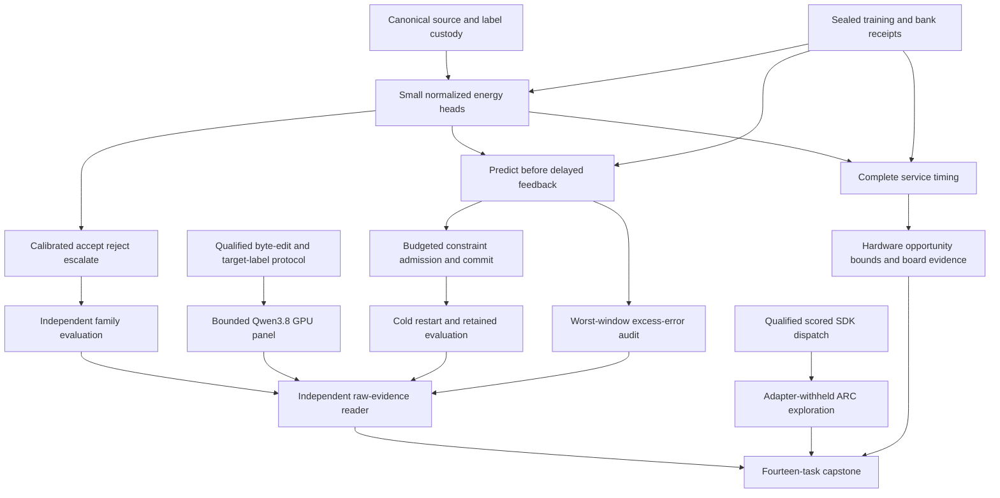

# Carnot Research Roadmap v679: Replayable evidence and retained decisions

**Created:** 2026-09-28
**Milestone:** 2026.09.679
**Title:** Replayable source evidence, calibrated decisions, and retained constraint learning
**Status:** Proposed; not activated
**Supersedes:** 2026.09.678, Exp7795–Exp7808
**Previous design:** [Preserved V678](research-roadmap-v678-preserved-20260928.md)
**Contract:** exactly **14 tasks, exp7809 through exp7822**, in the listed order, across **four phases**.
**Requirement:** REQ-REPORT-V679-PLAN; SCENARIO-REPORT-V679-PLAN.

## What V678 proved

V678 completed its queue, not its scientific program. Eight declared artifacts
exist: one circular-positive contract, six disqualified results and one blocked
capstone. Six scientific producers are absent. The completed archive currently
ends at V677; the active roster, artifacts and conductor log establish V678's
outcomes. The conductor's `OK` rows do not override an artifact verdict.

| Experiments | Evidence | Consequence |
|---|---|---|
| 7795 | Circular-positive agreement between fourteen tasks and their design | Reuse the contract reader; administrative success never gates science. |
| 7796 | Cold replay raised `candidate_roster_mismatch` | Repair producer/reader family custody from actual saved bytes. Another import fix would miss the cause. |
| 7797 | Five log hashes disagree; format check failed; broad-suite child exited -15; first attempt hit 4804 seconds | Seal immutable per-attempt receipts after child exit and test the real command dispatcher. Preserve the historical failures. |
| 7800, 7803 | Intervention and live-path work reached qualification; each required broad-suite child exited -15 | Define complete prospective affected validation and prove the exact runtime command list. No qualified scientific panel exists. |
| 7806 | Pytest could not create a nested temporary directory without its parent; service producer absent | Repair private path ownership and keep missing service evidence terminally blocked. |
| 7807 | Independent audit disqualified; its science inputs absent | Test the reducer's own branches separately from external science readiness. |
| 7808 | `complete_blocked_required_v678_evidence` | Preserve all fourteen dispositions and the six absent producers. |
| 7798, 7799, 7801, 7802, 7804, 7805 | No declared scientific output after prerequisite skips | No new trained-head, Qwen intervention, learning, ARC-selection or service benefit was measured. |

The previous Qwen confidence result, Exp7787, remains a qualified null on
24 exposed families. V679 does not repeat it unchanged. The planned contrast
removes a proposed source witness and compares matched unrelated removal.
Inspection also found that the existing prompt requests first-answer-sentence
risk. Whole-answer labels are not automatically valid sentence labels. V679
makes that alignment explicit before any calibration claim.

## Three biggest gaps to the PRD vision

1. **FR-12: independently grounded, calibrated decisions.** Constraint
   extraction and source alignment still need useful probability and decision
   measurements. A syntax-valid citation or a low learned energy is not proof
   that a claim is true. Train small normalized heads with matched controls,
   then measure independent family labels and typed decision cost.
2. **FR-11: causal, retained self-learning.** A durable constraint bank does
   not establish learning. Added predicates must change later decisions,
   beat frozen and complete-static controls, and survive restart without
   harming retention. Delayed labels also require time-local error accounting.
3. **FR-05/08/09/10 and NFR-01: credible execution and deployment.** Broken
   replay and mutable validation receipts prevent measurement. Correct those
   concrete defects, measure the actual scored ARC path, then time complete
   service work before choosing an accelerator. Runtime generalization remains
   the ARC north-star test; known public solves earn no new solve credit.

## Research incorporated before design

The [V679 literature review](../../research-references.md#v679-planning-review--2026-09-28-recorded-before-design)
was written before this design. It covers all eight requested topics and all
six secondary sources, including access limits and deferred leads.

| Primary source | Local experiment | Boundary |
|---|---|---|
| [CCHD, June 2026](https://arxiv.org/abs/2606.08158) | Exp7812–7813 compare constrained consistency with equal-information augmentation and MLP controls | Agreeing views can share the same error. |
| [CoEV, June 2026](https://arxiv.org/html/2606.18609v1) | Exp7814–7815 compare predicted-witness and unrelated-source deletion | A text adaptation tests sensitivity; it does not inherit visual accuracy or prove entailment. |
| [Memoir, July 2026](https://arxiv.org/abs/2607.20792) and [delayed feedback, June 2026](https://arxiv.org/abs/2606.11711) | Exp7816 compares query-immutable state, commit timing and restart retention | Equal budgets and sealed future labels are required; no generator-weight training. |
| [Noisy constraint values, September 2026](https://arxiv.org/html/2609.06921v1) | Exp7816/7821 measure worst-window excess false accepts beside mean learning benefit | This is a descriptive adaptation, not the paper's convex Ledger algorithm or regret theorem. |
| [FPGA-ASIC co-design, February 2026](https://arxiv.org/abs/2602.15985) and [Z1T, September 2026](https://extropic.ai/writing/z1t) | Exp7819–7820 include host preparation, transfer and dense/digital work in acceleration bounds | Custom ASIC and vendor estimates are not local board results. |

EBT and ARM–EBM remain architectural foundations, not semantic-correctness
proofs. HardNet++, KAN retention studies and primal-dual discrete-diffusion
work remain leads. A new conformal free-energy arm is deferred: first fix the
energy convention and obtain a defensible calibration split. No retired
external-text scorer or generator fine-tuning program is reopened.

Semantic Scholar returned 37 EBT and eight ARM–EBM citation records without
next-page markers. OpenReview's forum challenged the browser; indexed PDFs
and official ICLR proceedings supplied a conformal-method lead. GitHub trend
pages were two weeks stale. Hugging Face supplied discovery leads. Kona's page
established vendor framing, not new reproducible SDK or model access.

## Architecture



The contract is independent. Qwen and ARC have their own prerequisites and
can run when fitting is blocked. Audit, hardware continuity and capstone tasks
run once even when scientific producers are missing. None require a positive
effect to record a useful null. Every query pins its model and bank version.

## Phase 1 — Repair evidence custody and qualify reusable mechanics

**Exp7809–Exp7811.** Exp7809 binds the literal task table, embedded JSON and
YAML, snapshots current authority, and registers literature and validation
ownership. It grants no scientific readiness.

Exp7810 reproduces Exp7796's roster mismatch from the original candidate and
raw rows. Producer and reader must use the same sealed family order. The
complete 640-family cold replay must pass; missing, duplicate, reordered and
changed rows must fail. Invalid families retain their positions and reasons.
Do not normalize a malformed artifact into a pass. Cold readers accept explicit
paths and cannot silently select an old module's default raw directory.

The fixed development roles remain fit256, tune64, policy64, online_update96,
online_admission64, evaluation64 and retention32. All are historically exposed.
Preserve original bytes, family/duplicate-group identity and independent label
custody. View A uses singles and adjacent triples; B uses singles and adjacent
pairs. Both preserve all source sentences. Each allows 128 windows and sixteen
answer units. All heads receive the same 132 label-free features. Invalid
families retain probability 0.5, Brier 0.25 and escalation cost 0.25, including
after calibration. Unknown sentence labels supply no local loss. Output error
spans cannot be used as supporting source witnesses.

Exp7811 reproduces stale receipt hashes, finds their writer, fixes the named
format failure, and validates nine heads on six fixtures, three seeds and two
epochs. Require nonzero gradients, finite changed parameters, normalization,
dual behavior and save/reload equivalence. Test the real constraint bank's
pending commits, overflow, duplicate feedback, rollback and hard-exit recovery.
Fixture checkpoints cannot initialize natural fits. Fixture success is circular.

**Validation ownership is part of the repair.** Before implementation, each
runner specifies its complete affected test/module closure and command list.
A recording executor tests the actual CLI dispatcher, including commands added
after helper calls. Command names, argv and required/diagnostic classification
must match the frozen manifest. Each attempt owns its private paths; pytest
parents exist before launch. After exit and handle closure, logs are copied
once to immutable content-addressed paths and hashed there. A later retry must
not alter the first run's receipts. Byte mutation must fail cold verification.

Historical required full-suite failures remain failed. New scopes include all
affected tests and real integration, with an explicit prospective rationale.
Broad repository health remains a separately recorded bounded diagnostic; it
is never called green from a scoped pass. Invoking an old main inherits its
old full-suite obligation. Removing a failed required check after the run is
forbidden. The actual dispatcher test is the difference from V678's prose-only
promise. Failure keeps current readiness at zero.

## Phase 2 — Measure calibrated decisions and source sensitivity

**Exp7812–Exp7815.** Exp7812 trains `response_set`, `local_set`,
`augmented_set`, `constrained_set`, `augmented_mlp`, `constrained_mlp`,
`local_logistic`, `source_erased_constrained_set` and
`complete_static_constrained_set`. Use seeds 67901/67902/67903, sixteen epochs,
learning rate 0.01 and at most 4096 parameters including predicates and duals.
There are 27 fits; MLP width is sixteen. Preserve identical family weights,
features and aggregation across matched arms. Stop training at 3000 seconds
with resumable per-fit checkpoints, not outcome-dependent arm deletion.

Local loss is response NLL plus mean known-sentence NLL. Augmentation averages
supervision over views A/B. Constrained arms add symmetric Bernoulli KL/2 with
tolerance 0.01 and alternate-view CE tolerance 0.70. Dual step is 0.01,
projected to [0,10]; probabilities clip to [1e-6,1-1e-6]. Erased-source and
complete-static controls train separately. These are fixed pilot settings.

Average A/B risks before temperature scaling the logit; canonical heads use A.
Tune64 alone selects one temperature on the existing fixed [0.25,4] grid.
Freeze accept cost 5p, reject cost 1-p, escalation cost 0.25; ties escalate.
Policy64 reports behavior without altering costs. Freeze all checkpoints before
opening evaluation labels. Readiness means all 27 finite fits and cold equality,
not a positive effect.

Exp7813 scores 64 evaluation families with independent original annotations.
Average seed metrics within each family; use 10000 paired-family bootstrap
samples. Primary comparisons are constrained_set against augmented_set,
constrained_mlp and local_logistic. Require cost reduction >=0.02, positive
lower95 for cost and Brier improvement, coverage >=0.20, and Holm-adjusted
p<=0.05 across six tests. Source-value claims also require Brier lower95>0
against separately fitted erased-source control. Include prevalence and
always-escalate references. Failed/over-budget rows remain. Imprecise, complete
results are nulls. Source-order and irrelevant-window probes are descriptive.

Exp7814 qualifies the independent Qwen intervention branch. Freeze 48 exposed
families by hash from evaluation64, complete original bytes and the first answer
sentence's exact span. The intact prompt elicits unsupported probability for
that sentence and a proposed source witness. Remove that witness for treatment;
remove a disjoint sentence within 25% of its token length for control, selected
by seeded hash. Preserve original source IDs across deletion. Labels never
select witnesses or controls. Unmatched/invalid families remain visible.

The pure protocol uses an injected token-count interface and no model load.
Exp7815 performs actual counting with the authenticated GGUF tokenizer and
rendered template, including system/JSON overhead. UTF-8 bytes are not token
counts. Intact Brier and cost require independent labels for the elicited first
sentence; whole-answer labels cannot substitute. Unknown labels remain unscored
with a reported denominator. Modified-source labels remain null.

Exp7815 uses **unsloth/Qwen3.8-27B-GGUF**, cached Q4_K_M, real CUDA offload,
one seed 67901, 8192 context tokens and <=256 output tokens per panel call.
Two 32-token canaries plus <=144 calls give <=36928 output tokens. Stop new
calls at 2400 seconds. This is **model_bounded_generation**, with a 10-second
floor. Authenticate file bytes, backend, template, offload, calls and tokens.
No artificial delay, CPU fallback or small headline model is allowed.

The primary contrast is p(witness removed)-p(unrelated removed). Require >=30
matched families, >=0.80 coverage of all 48, mean shift >=0.05 and paired
lower95>0. The 10000-draw bootstrap uses matched families. This is a narrow
sensitivity gate. Report syntax and intact calibration separately. It proves
neither entailment nor hallucination repair.

## Phase 3 — Test continuous learning and live generalization

**Exp7816–Exp7818.** Exp7816 is the FR-11 self-learning experiment. Its five
arms are next-query adaptive, next-block adaptive, frozen, complete-static and
delayed shuffled-feedback, with three matched seeds. Adaptive/frozen/shuffled
start from constrained_set; complete-static uses its separately trained
sixteen-predicate checkpoint.

Eight blocks each contain twelve update and eight one-use admission families.
Save predictions before releasing labels at the start of the next block.
Pending capacity is twelve update labels plus eight sealed admission labels.
One proposal per block, eight total, comes from the sixteen-member registered
grammar. Fit only on arrived update labels; open each admission block once.
Admission requires Brier reduction >=0.01 and no added false accept. This is an
operational rule, not significance. Match feedback and proposal-compute budgets.

Keep state immutable within each query. Commit at the next query or next block,
as registered. Restart after block four with pending commits, queue, RNG,
model, bank and credits intact. Drain final feedback before final freeze.
Evaluate 64 fit-withheld evaluation and 32 retention families. These are still
historically exposed development data. Require next-query adaptation to beat
frozen and complete-static by cost >=0.02 and Brier/cost lower95>0, with four
Holm-corrected tests at 0.05. Retention Brier degradation upper95 must be <=0.02
with no added false accept. An admitted predicate must change a later decision;
shuffled feedback must not reproduce benefit. No admission is an honest null.

For each adaptive arm and seed, compute delayed error excess
`g_t = I(adaptive false accept) - I(frozen false accept)` from paired saved
predictions only when the independent label arrives. Track
`B_t = max(0, B_(t-1) + g_t)`. Report `max_t B_t`, its family-time window,
positive-only excess and release clocks. The sequence +1,+1,-1,-1 has final
net zero but peak debt two. This diagnostic does not change admission or grant
a safety/regret theorem. Exp7821 independently enumerates all contiguous windows.
CPU counters provide the immediate hardware path; future predicate matching
could use FPGA and small-head batch work GPU/Rust. Measure service costs first.

Exp7817 qualifies the actual `make_carnot_agent` / `E3AgentPolicy` scored
path, with per-game adapters, stored routes/engines and all LLM tiers disabled.
Two real SDK fixture episodes test transitions, selector activation, organic
versus replay counters, supervisor outcomes, score inputs and child cleanup.
Run E2E-009/011/013 and the offline E3 smoke. Fixtures establish reachability,
not a solve or benefit. Test the real dispatcher before the independent panel.

Exp7818 runs cd82, dc22, lf52, m0r0, sk48, tn36, sb26 and sc25 with seeds
67901/67902 and arms off/total-seen/organic-seen: 48 real SDK episodes.
Each episode allows 2000 actions and 75 seconds. Shuffle game order, then
complete both seeds and all arms for a game before advancing. Stop new launches
at 3900 seconds, charging process overhead and preserving censored/unstarted
rows. No game-source reading, offline ground-truth search or per-game adapter.

Use human action baselines from `EnvironmentInfo` and the installed SDK score
formula under both RESET charging conventions. Average seeds within game,
N=8; enumerate 256 paired sign assignments. Continuation requires positive
lower95 against both controls under both RESET conventions, Holm-adjusted
p<=0.05, no lost baseline winning seed, and <=10% action regression on shared
wins. Incomplete pairs forbid broad benefit. Record
`solve_provenance=live_agent_self_discovery`; registry-known levels earn no
new solve credit. Public exposure forbids hidden-leaderboard claims.

## Phase 4 — Measure deployment cost and independently reconcile evidence

**Exp7819–Exp7822.** Exp7819 compares constrained_set, constrained_mlp and
local_logistic on complete request processing at batch sizes 1/8/32, ten
warmups and thirty paired timed blocks per size, with randomized arm order.
Include ingestion, bytes, views, features, energy, calibration, bank lookup,
decision and serialization. Report cold start separately. Charge accepted and
rejected updates through fsync, acknowledgement and cold reload. Private fixture
update timing does not establish learning benefit. The latency unit is the timed
block. Decisions must match direct model outputs before any speed claim.

For measured accelerable fraction f, `1/(1-f)` is an optimistic whole-service
ceiling before transfer overhead. If it cannot support 100x, reject that target
for the proposed boundary or identify broader work worth accelerating. Rust
10x and hardware 100x remain goals, not measurements. FPGA-ASIC and Z1T leads
motivate preparation/transfer accounting; they do not justify a purchase.

Exp7820 fixes the prior missing pytest-parent defect in private paths and
preserves authenticated board evidence. No flash, installation, purchase or
unchanged availability probe. KV260 remains fabric evidence only at k_max<=5;
PolarFire remains Linux CPU dispatch; GateMate requires dated changed physical
conditions after the 0xffffffff observation. If current service evidence is
absent, preserve board rows and return terminal blocked with the exact operand.

Exp7821 reopens available source records, checkpoints and clocks without
producer metric reducers. Recompute calibration, family intervals, Qwen matching
and target-label alignment, delayed admission and retention, and error-window
maxima. Test leaked features, self-labeling, dropped rows, seed-level intervals,
future feedback and final-net-debt substitution. No repeated GPU generation.
Valid branches remain reportable when another branch is absent.

Exp7822 accounts for all fourteen outcomes with immutable current authority.
Run the unchanged publication G1–G4 reader; report `paper_ready` and
`unmet_gates`. Preserve the oracle-distinct corrigendum. Each mechanism receives
continue, retire or await_named_prerequisite with a falsifiable trigger.
External missing science is blocked, never retryable partial. No publication,
activation, production flag changes or conductor modifications are included.

## Dependency graph and execution order

Arrows are readiness gates, not win gates. All producers occur earlier in this
YAML. Each required producer must also have `flagged_adversarial == false` and
`verdict_class in [null, circular_positive, positive]`. The producer prompts
name their gate fields verbatim.

```text
7809 contract/methods                         independent; no science gates
7810 source replay ─────┐
7811 sealed runtime ───┴─> 7812 fit ──> 7813 decision measurement
7811 sealed runtime ──────> 7816 retained learning <── 7812 fit
7814 intervention protocol ──> 7815 bounded Qwen measurement
7817 scored SDK qualification ──> 7818 organic ARC measurement
7811 sealed runtime ──────> 7819 service cost <── 7812 fit
7820 board continuity                         unconditional; reads 7819 if valid
7821 independent audit                      unconditional; reads 7813/7815/7816
7822 capstone                               unconditional; accounts for all tasks
```

| Consumer | Exact readiness fields |
|---|---|
| Exp7812 | Exp7810.sentence_protocol_ready_score=1; Exp7810.evidence_view_ready_score=1; Exp7811.training_runtime_ready_score=1 |
| Exp7813 | Exp7812.view_heads_ready_score=1 |
| Exp7815 | Exp7814.counter_evidence_ready_score=1 |
| Exp7816 | Exp7812.view_heads_ready_score=1; Exp7811.online_runtime_ready_score=1 |
| Exp7818 | Exp7817.organic_runner_ready_score=1 |
| Exp7819 | Exp7812.view_heads_ready_score=1; Exp7811.online_runtime_ready_score=1 |

## Hardware requirements

| Tasks | Required resources | Evidence limit |
|---|---|---|
| 7809–7814, 7816, 7821–7822 | Existing CPU, system RAM, Python/JAX environment and local corpus | JAX_PLATFORMS=cpu; <=4096-parameter heads; no generator invocation. |
| 7815 | One available 24 GB RTX 3090 and cached Qwen3.8 Q4_K_M, approximately 16 GB plus measured KV/context headroom | Authenticate actual CUDA offload and GGUF bytes. The second 3090 is optional; no dual-GPU integration task. |
| 7817–7818 | CPU and installed offline ARC SDK | Actual scored policy, adapters withheld, zero model calls. |
| 7819 | CPU and persistent storage with working fsync | Measure the full service and durable updates, not just kernels. |
| 7820: KV260 | Immutable prior fabric transcripts | k_max<=5; future work requires authenticated SSH and actual device workload evidence. |
| 7820: PolarFire | Immutable Linux workload transcripts | CPU dispatch is not FPGA acceleration. |
| 7820: GateMate | Existing JTAG/physical blocker record | No repeat detection without dated changed cable/port/power/wiring evidence. |
| NPU, TSU, larger FPGA | Wishlist leads only | Reopen with usable toolchain/device access and a measured service bottleneck. No acquisition in this milestone. |

Tier 1 statistics stay on CPU. Tier 2 constraint memory uses RAM/disk now and
has a future FPGA predicate-matching path. Small learned heads can later use
Rust, GPU or a qualified NPU. Structural energy evolution remains deferred.
Exp7819 tests the possible acceleration boundary; no 100x gain is assumed.

## Execution, validation and stopping rules

Every prompt contains numbered steps requiring flushed phase lines, output
before/after model load, generation, benchmark and subprocess calls, and status
inside loops or child supervision at least every 60 seconds. Keep gaps below
600 seconds. Files over about 200 lines must be written in <=150-line chunks
across tool calls with progress messages between calls. Never pad runtime.

All task prompts declare the closed verdict class and exact failed gate operands.
`partial` means unfinished owned work that can resume; unchanged external
absence means `blocked`. Every comparative task requires raw per-unit rows.
Each field has a stated principle. Prior-failure entries retain exact known
verdicts and all four mandatory fields, including same-verdict retirement.
Queue-only prior outcomes are labeled `GATE_BLOCKED`, not invented science
verdicts. No retired experiment ID or retired upstream chain is reused.

The only LLM task is Exp7815. Its `MODEL_SPECS` includes the mandated model and
its declared substrate is `model_bounded_generation` (10 seconds). No task in
this milestone uses `model_full_generation` (60 seconds) or a load-only model
probe (`model_load_no_generation`, 2 seconds). If an actual future task changes
what it invokes, its substrate must describe that work; a canary remains bounded.
Smoke models cannot replace Qwen3.8 in a headline result.

Spec first, tests first, implementation, scoped lint/type/spec checks, 100%
changed-code statement coverage, real entrypoint E2E and fresh raw reduction.
Coverage includes CLI and affected transitive modules, not just wrappers.
E2E-007 applies to the learning lifecycle; E2E-009/011/013 to ARC. Receipts
bind exact commands, exits and immutable logs. Existing unrelated repository
failures remain explicit. No test skip, weakened assertion, scope edit after an
outcome, altered historical result or guard change is part of this proposal.

Runtime budgets are bounded separately from agent work. Fitting stops at 3000
seconds, Qwen launches at 2400, and ARC launches at 3900, leaving time below
the 4800-second task cap for receipts and shutdown. Checkpoint each independent
unit. No benchmark is rerun merely to make its duration look plausible.
The YAML records per-task wall-time estimates and thinking budgets. Contract,
receipt infrastructure and ARC dispatcher repair use Opus/100; formulaic
repairs use Codex/gpt-6-sol; routine research and reductions use the conductor's
Claude default. No gpt-6-luna experiment is proposed.

Planning validation runs unchanged schema, exclusion/failure-lineage, gate,
harness-fit, ARC-floor and overdue-priority readers. A separate reader compares
the literal table, embedded JSON and YAML and rejects private contract mutations.
This is the planning E2E boundary. Runtime model, ARC and learning experiments
are future work; planning does not claim they ran or change the active roadmap.

## Exact task contract

| Order | Task ID | Title | Phase | Deliverable |
|---|---|---|---|---|
| 1 | `exp7809-contract-methods` | Bind fourteen tasks to immutable validation and research protocols | 1 | `results/experiment_7809_v679_contract_methods.json` |
| 2 | `exp7810-source-view-qualification` | Repair source candidate replay with canonical family custody | 1 | `results/experiment_7810_v679_source_view_qualification.json` |
| 3 | `exp7811-training-runtime` | Seal training receipts and qualify delayed memory mechanics | 1 | `results/experiment_7811_v679_training_runtime.json` |
| 4 | `exp7812-view-energy-fit` | Train calibrated energy heads after replay and receipt qualification | 2 | `results/experiment_7812_v679_view_energy_fit.json` |
| 5 | `exp7813-decision-measurement` | Measure source-grounded probabilities and typed decision cost | 2 | `results/experiment_7813_v679_decision_measurement.json` |
| 6 | `exp7814-counter-evidence-protocol` | Validate evidence interventions through an explicit command allowlist | 2 | `results/experiment_7814_v679_counter_evidence_protocol.json` |
| 7 | `exp7815-qwen-counter-evidence` | Measure bounded Qwen source sensitivity with matched removals | 2 | `results/experiment_7815_v679_qwen_counter_evidence.json` |
| 8 | `exp7816-continuous-acquisition` | Measure retained constraint learning and worst-window error debt | 3 | `results/experiment_7816_v679_continuous_acquisition.json` |
| 9 | `exp7817-arc-runner-qualification` | Qualify scored ARC dispatch with bounded validation commands | 3 | `results/experiment_7817_v679_arc_runner_qualification.json` |
| 10 | `exp7818-arc-organic-measurement` | Measure organic exploration on adapter-withheld live games | 3 | `results/experiment_7818_v679_arc_organic_measurement.json` |
| 11 | `exp7819-service-cost` | Measure complete service cost and acceleration ceilings | 4 | `results/experiment_7819_v679_service_cost.json` |
| 12 | `exp7820-hardware-evidence` | Repair evidence-reader path ownership and preserve board continuity | 4 | `results/experiment_7820_v679_hardware_evidence.json` |
| 13 | `exp7821-independent-evidence-audit` | Independently replay calibration and delayed-feedback error bursts | 4 | `results/experiment_7821_v679_independent_evidence_audit.json` |
| 14 | `exp7822-capstone` | Reconcile fourteen outcomes and retire unchanged failed mechanisms | 4 | `results/experiment_7822_v679_capstone.json` |

<!-- V679_TASK_CONTRACT_START -->
```json
{"milestone": "2026.09.679", "tasks": [
{"id": "exp7809-contract-methods", "title": "Bind fourteen tasks to immutable validation and research protocols", "phase": 1, "deliverable": "results/experiment_7809_v679_contract_methods.json", "inference_substrate_class": "aggregation", "MODEL_SPECS": [], "gated_on": []},
{"id": "exp7810-source-view-qualification", "title": "Repair source candidate replay with canonical family custody", "phase": 1, "deliverable": "results/experiment_7810_v679_source_view_qualification.json", "inference_substrate_class": "no_model_load", "MODEL_SPECS": [], "gated_on": []},
{"id": "exp7811-training-runtime", "title": "Seal training receipts and qualify delayed memory mechanics", "phase": 1, "deliverable": "results/experiment_7811_v679_training_runtime.json", "inference_substrate_class": "no_model_load", "MODEL_SPECS": [], "gated_on": []},
{"id": "exp7812-view-energy-fit", "title": "Train calibrated energy heads after replay and receipt qualification", "phase": 2, "deliverable": "results/experiment_7812_v679_view_energy_fit.json", "inference_substrate_class": "no_model_load", "MODEL_SPECS": [], "gated_on": [{"upstream": "exp7810-source-view-qualification", "artifact_field": "sentence_protocol_ready_score", "op": "==", "value": 1}, {"upstream": "exp7810-source-view-qualification", "artifact_field": "evidence_view_ready_score", "op": "==", "value": 1}, {"upstream": "exp7811-training-runtime", "artifact_field": "training_runtime_ready_score", "op": "==", "value": 1}, {"upstream": "exp7810-source-view-qualification", "artifact_field": "flagged_adversarial", "op": "==", "value": false}, {"upstream": "exp7810-source-view-qualification", "artifact_field": "verdict_class", "op": "in", "value": ["null", "circular_positive", "positive"]}, {"upstream": "exp7811-training-runtime", "artifact_field": "flagged_adversarial", "op": "==", "value": false}, {"upstream": "exp7811-training-runtime", "artifact_field": "verdict_class", "op": "in", "value": ["null", "circular_positive", "positive"]}]},
{"id": "exp7813-decision-measurement", "title": "Measure source-grounded probabilities and typed decision cost", "phase": 2, "deliverable": "results/experiment_7813_v679_decision_measurement.json", "inference_substrate_class": "no_model_load", "MODEL_SPECS": [], "gated_on": [{"upstream": "exp7812-view-energy-fit", "artifact_field": "view_heads_ready_score", "op": "==", "value": 1}, {"upstream": "exp7812-view-energy-fit", "artifact_field": "flagged_adversarial", "op": "==", "value": false}, {"upstream": "exp7812-view-energy-fit", "artifact_field": "verdict_class", "op": "in", "value": ["null", "circular_positive", "positive"]}]},
{"id": "exp7814-counter-evidence-protocol", "title": "Validate evidence interventions through an explicit command allowlist", "phase": 2, "deliverable": "results/experiment_7814_v679_counter_evidence_protocol.json", "inference_substrate_class": "no_model_load", "MODEL_SPECS": [], "gated_on": []},
{"id": "exp7815-qwen-counter-evidence", "title": "Measure bounded Qwen source sensitivity with matched removals", "phase": 2, "deliverable": "results/experiment_7815_v679_qwen_counter_evidence.json", "inference_substrate_class": "model_bounded_generation", "MODEL_SPECS": ["unsloth/Qwen3.8-27B-GGUF"], "gated_on": [{"upstream": "exp7814-counter-evidence-protocol", "artifact_field": "counter_evidence_ready_score", "op": "==", "value": 1}, {"upstream": "exp7814-counter-evidence-protocol", "artifact_field": "flagged_adversarial", "op": "==", "value": false}, {"upstream": "exp7814-counter-evidence-protocol", "artifact_field": "verdict_class", "op": "in", "value": ["null", "circular_positive", "positive"]}]},
{"id": "exp7816-continuous-acquisition", "title": "Measure retained constraint learning and worst-window error debt", "phase": 3, "deliverable": "results/experiment_7816_v679_continuous_acquisition.json", "inference_substrate_class": "no_model_load", "MODEL_SPECS": [], "gated_on": [{"upstream": "exp7812-view-energy-fit", "artifact_field": "view_heads_ready_score", "op": "==", "value": 1}, {"upstream": "exp7811-training-runtime", "artifact_field": "online_runtime_ready_score", "op": "==", "value": 1}, {"upstream": "exp7812-view-energy-fit", "artifact_field": "flagged_adversarial", "op": "==", "value": false}, {"upstream": "exp7812-view-energy-fit", "artifact_field": "verdict_class", "op": "in", "value": ["null", "circular_positive", "positive"]}, {"upstream": "exp7811-training-runtime", "artifact_field": "flagged_adversarial", "op": "==", "value": false}, {"upstream": "exp7811-training-runtime", "artifact_field": "verdict_class", "op": "in", "value": ["null", "circular_positive", "positive"]}]},
{"id": "exp7817-arc-runner-qualification", "title": "Qualify scored ARC dispatch with bounded validation commands", "phase": 3, "deliverable": "results/experiment_7817_v679_arc_runner_qualification.json", "inference_substrate_class": "no_model_load", "MODEL_SPECS": [], "gated_on": []},
{"id": "exp7818-arc-organic-measurement", "title": "Measure organic exploration on adapter-withheld live games", "phase": 3, "deliverable": "results/experiment_7818_v679_arc_organic_measurement.json", "inference_substrate_class": "no_model_load", "MODEL_SPECS": [], "gated_on": [{"upstream": "exp7817-arc-runner-qualification", "artifact_field": "organic_runner_ready_score", "op": "==", "value": 1}, {"upstream": "exp7817-arc-runner-qualification", "artifact_field": "flagged_adversarial", "op": "==", "value": false}, {"upstream": "exp7817-arc-runner-qualification", "artifact_field": "verdict_class", "op": "in", "value": ["null", "circular_positive", "positive"]}]},
{"id": "exp7819-service-cost", "title": "Measure complete service cost and acceleration ceilings", "phase": 4, "deliverable": "results/experiment_7819_v679_service_cost.json", "inference_substrate_class": "no_model_load", "MODEL_SPECS": [], "gated_on": [{"upstream": "exp7812-view-energy-fit", "artifact_field": "view_heads_ready_score", "op": "==", "value": 1}, {"upstream": "exp7811-training-runtime", "artifact_field": "online_runtime_ready_score", "op": "==", "value": 1}, {"upstream": "exp7812-view-energy-fit", "artifact_field": "flagged_adversarial", "op": "==", "value": false}, {"upstream": "exp7812-view-energy-fit", "artifact_field": "verdict_class", "op": "in", "value": ["null", "circular_positive", "positive"]}, {"upstream": "exp7811-training-runtime", "artifact_field": "flagged_adversarial", "op": "==", "value": false}, {"upstream": "exp7811-training-runtime", "artifact_field": "verdict_class", "op": "in", "value": ["null", "circular_positive", "positive"]}]},
{"id": "exp7820-hardware-evidence", "title": "Repair evidence-reader path ownership and preserve board continuity", "phase": 4, "deliverable": "results/experiment_7820_v679_hardware_evidence.json", "inference_substrate_class": "aggregation", "MODEL_SPECS": [], "gated_on": []},
{"id": "exp7821-independent-evidence-audit", "title": "Independently replay calibration and delayed-feedback error bursts", "phase": 4, "deliverable": "results/experiment_7821_v679_independent_evidence_audit.json", "inference_substrate_class": "aggregation", "MODEL_SPECS": [], "gated_on": []},
{"id": "exp7822-capstone", "title": "Reconcile fourteen outcomes and retire unchanged failed mechanisms", "phase": 4, "deliverable": "results/experiment_7822_v679_capstone.json", "inference_substrate_class": "aggregation", "MODEL_SPECS": [], "gated_on": []}
]}
```
<!-- V679_TASK_CONTRACT_END -->
