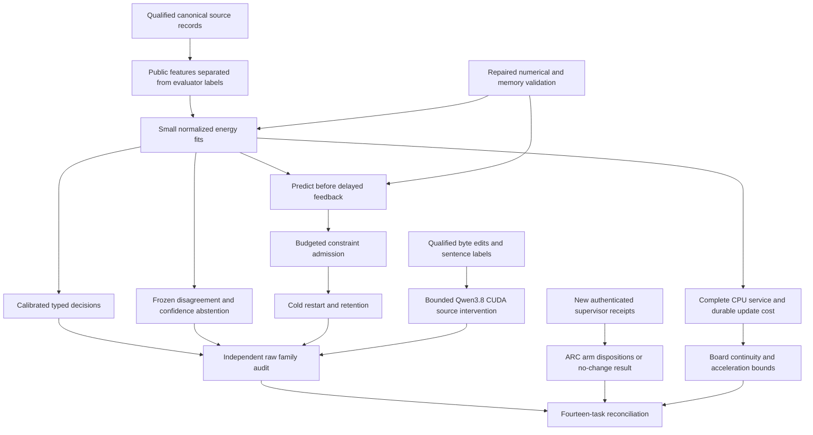

# Carnot Research Roadmap v680: Source-isolated decisions and retained learning

**Created:** 2026-09-28
**Milestone:** 2026.09.680
**Title:** Source-isolated decisions, selective abstention, and causal constraint learning
**Status:** Proposed; not activated
**Supersedes:** 2026.09.679, Exp7809–Exp7822
**Previous design:** [Preserved V679](research-roadmap-v679-preserved-20260928.md)
**Contract:** exactly **14 tasks, exp7823 through exp7836**, in the listed order,
across **four phases**.
**Requirement:** REQ-REPORT-V680-PLAN; SCENARIO-REPORT-V680-PLAN.

## What V679 proved

V679 completed its queue. At planning time, nine declared artifacts exist:
two circular-positive readiness results, four disqualified results and three
blocked reducers. Five scientific producers are absent. The completed archive
ends at V678; the active V679 roster, artifact bytes and conductor log establish
these outcomes. A conductor `OK` is not scientific acceptance.

| Experiments | Recorded evidence | Consequence |
|---|---|---|
| 7809 | Contract comparisons ran; required format check failed on its CLI | Reuse pure readers and retain the named formatting obligation; contract readiness never gates science. |
| 7810 | `complete_circular_positive_source_view_readiness`; both source/view readiness scores equal one | Reuse the canonical 640-family source manifest. Add a different feature-isolation challenge instead of rebuilding custody. |
| 7811 | Numerical and bank fixtures ran; required format check failed on its module | Correct that specific file and retain the full required affected closure before natural fitting. |
| 7814 | Coverage combine says `No data to combine`; report says `No data to report` | Name completed coverage files explicitly, including CLI execution. Do not weaken coverage. |
| 7817 | Repaired runner has readiness one, 161 affected tests and 383/383 changed statements covered | Preserve this reachability result; it establishes no selector benefit. |
| 7818 | Forty-eight episodes exist, but owned coverage is 32%; strict row lint fails on headroom warnings; artifact flagged | Quarantine benefit claims. Its raw reduction loses a baseline win and gives about -0.196 versus replay-off. Do not repeat the unchanged organic selector. |
| 7820–7822 | Correctly blocked by absent or unqualified required science | Independent reducers must retain missing operands and run once, not retry external absence as partial. |
| 7812, 7813, 7815, 7816, 7819 | No declared producer after prerequisite skips | No new natural fit, decision, source-intervention, learning or service-cost result exists. |

The September 28 oracle-distinct corrigendum remains binding: confidence
leakage, self-labeled candidate pools and seed-level intervals invalidated the
old claimed win. Neither a new task number nor a new fixture can repair that
scientific claim. The 640 source families are all historically exposed, even
when withheld from a current fit.

## Three biggest gaps to the PRD vision

1. **FR-12: useful independently grounded verification.** Canonical source
   transport works, but calibrated probability, source dependence and typed
   decision value still need measurement. Scorer features must not contain
   evaluator labels or confidence shortcuts. Learned low energy alone is not
   semantic proof.
2. **FR-11: causal continuous self-learning.** Durable memory is only a
   prerequisite. Constraint additions must alter later decisions, beat frozen
   and complete-static controls, and preserve prior performance after restart.
3. **FR-05/08/09/10 and NFR-01: reliable deployment evidence.** Small concrete
   validation defects keep preventing measurement. Repair those defects, retain
   full affected checks, and measure complete service cost before choosing a
   Rust or hardware boundary. ARC's generalization gap remains separate from
   already-banked public solves.

## Research incorporated before design

The [V680 review](../../research-references.md#v680-planning-review--2026-09-28-recorded-before-design)
was recorded first. It covers the eight requested topics, OpenReview, Extropic,
Semantic Scholar, Hugging Face, GitHub trending and Logical Intelligence, with
access and claim limits.

| Primary source | Adopted local test | Scope limit |
|---|---|---|
| [Distributional EBM, May 2026](https://arxiv.org/html/2605.18871v1) | Exp7824 metadata isolation; Exp7826/7832 frozen disagreement abstention against confidence and random controls | Repeated-seed spread is a heuristic; no heterogeneous-adapter reproduction or retired text-ranking rerun. |
| [Cross-Block DBM, September 2026](https://arxiv.org/abs/2609.14934) | Exp7824 verifies unknown sentence labels contribute zero local loss and gradient | Observed-label masking only; no new DBM implementation. |
| [CCHD](https://arxiv.org/abs/2606.08158) and [CoEV](https://arxiv.org/abs/2606.18609), June 2026 | Exp7826–7827 matched consistency controls; Exp7828–7829 source-witness deletion | Consistent errors remain possible; source sensitivity does not establish entailment. |
| [Memoir](https://arxiv.org/abs/2607.20792), July 2026; [delayed feedback](https://arxiv.org/abs/2606.11711), June 2026; [RECAP](https://arxiv.org/abs/2606.06698), revised August 2026 | Exp7830 query-immutable state, causal admission, commit timing and retention | Reactive delayed learning is not RECAP's proactive setting; no transferred regret theorem. |
| [Pipelined p-computer, July 2026](https://arxiv.org/abs/2607.21077) and [Z1T, September 2026](https://extropic.ai/writing/z1t) | Exp7833–7834 bandwidth, transfer and whole-service accounting | A deterministic decision head is not automatically an Ising sampling workload. |

EBT/ARM–EBM, HardNet++, KAN retention and primal-dual decoding remain useful
architectural references. This milestone does not change the mandated generator,
revive retired importance anchoring or generic text reranking, or assume vendor
hardware access. The new September DBM lead came from the EBT citation scan.
The selective-decision hypothesis revisits a previously background reference
under new source-conditioned controls and the local corrigendum.

## Architecture



The contract, Qwen protocol, ARC ledger and final readers are independent.
Source fitting depends on its own source/numerical gates. Learning, decision
measurement and abstention need valid fits, not a positive decision result.
Board continuity and the capstone retain missing science as terminal blocked.

## Phase 1 — Bind methods and qualify the actual remaining prerequisites

**Exp7823–Exp7825.** Exp7823 binds fourteen literal tasks and snapshots exact
V680 authority. It registers all contrasts before outcomes, using existing
readers. Exp7809's failed CLI formatting is preserved and repaired if that
behavior is reused. Administrative readiness does not gate scientific branches.

Exp7824 reuses Exp7810's successful 640-family replay. It exports a strict
public scorer projection and a separate evaluator sidecar. Gold labels, error
annotations, confidence, generator identity, role names and family IDs cannot
enter feature tensors. Each family undergoes metadata mutation/omission while
public source/answer bytes stay fixed; all 132 features must remain identical.
A fresh scorer process receives only public records and closed unrelated file
descriptors. Unknown sentence labels supply zero local loss/gradient; changing
hidden placeholder labels must have no effect. A known-label fixture verifies
that the local loss is not simply disabled.

Roles remain fit256, tune64, policy64, online_update96, online_admission64,
evaluation64 and retention32. View A contains singles and adjacent triples;
view B contains singles and adjacent pairs. Existing limits of 128 windows and
sixteen answer units remain. Preserve complete sentences, duplicate groups,
invalid families and independently sourced annotations. These are development
roles, not a fresh blind corpus.

Exp7825 corrects the precise Exp7811 formatting failure. It reuses existing
numerical and transactional functions, retaining the full required affected
closure and coverage of CLI paths. Six fixtures, nine heads, three seeds and
two epochs must show finite changed parameters, gradients, normalization,
dual updates and cold-reload equality. Bank fixtures cover duplicate feedback,
overflow, rejection, rollback, queued commits and hard exit. Fixture checkpoints
never initialize natural fits. Both readiness scores remain zero if any required
check fails. Historical diagnostic full-suite failures remain visible.

## Phase 2 — Measure source-grounded decisions and live source sensitivity

**Exp7826–Exp7829.** Exp7826 trains nine heads at seeds 68001/68002/68003:
`response_set`, `local_set`, `augmented_set`, `constrained_set`,
`augmented_mlp`, `constrained_mlp`, `local_logistic`,
`source_erased_constrained_set` and `complete_static_constrained_set`.
That is 27 fits, sixteen epochs, learning rate 0.01, MLP width sixteen,
and at most 4096 parameters per head including predicates and duals.

Use identical features/family weights. Local supervision is response NLL plus
mean known-sentence NLL. Augmentation averages A/B supervision. Constrained
heads add symmetric Bernoulli KL/2 tolerance 0.01 and alternate-view CE tolerance
0.70. Dual step is 0.01, projected to [0,10]; probabilities clip to
[1e-6,1-1e-6]. Erased-source and complete-static controls train separately.
Invalid families retain p=0.5, Brier=0.25 and escalation cost=0.25.

Tune64 selects temperature from the existing [0.25,4] grid. Paired heads average
A/B response risk before logit temperature scaling; canonical heads use A.
Freeze accept cost 5p, reject cost 1-p and escalation cost 0.25; ties escalate.
The fit also freezes the ensemble abstention rules described below using only
policy64. No evaluation labels or outcomes may affect that selection. Stop
training at 3000 seconds with per-fit resumable checkpoints, leaving validation
time. Incomplete owned fitting is partial; missing external input is blocked.

Exp7827 scores all nine arms on evaluation64. Predict before joining evaluator
labels. Average seed metrics within family and use 10000 paired-family bootstrap
draws. Primary contrasts compare constrained_set with augmented_set,
constrained_mlp and local_logistic. Require cost reduction >=0.02, positive
lower95 cost and Brier gains, coverage >=0.20 and Holm p<=0.05 across six tests.
A source-value claim additionally needs positive Brier lower95 against the
separately trained erased-source head. Include prevalence and always-escalate
references. Complete nulls are valid outcomes. These exposed data cannot alone
close GAP-ORACLE-DISTINCT or establish fresh generalization.

Exp7828 repairs Exp7814's coverage collection by naming completed data files,
including the CLI. It transfers the mechanism from repaired Exp7817, not its
fixture success. CPU protocol tests use an injected tokenizer interface and
preserve byte-exact interventions and first-sentence labels.

Exp7829 uses **unsloth/Qwen3.8-27B-GGUF**, cached Q4_K_M, real CUDA offload,
seed 68001, n_ctx=8192 and <=256 generated tokens per call. The fixed roster
is 48 evaluation64 families selected by input hash. Run intact first to propose
a source witness; remove that witness for treatment and a disjoint sentence
within 25% of its actual token length for control. Randomize the two deletion
calls. Keep original source IDs, question, answer and source bytes intact except
for the exact removed sentence. Use the actual GGUF tokenizer and rendered
prompt, not UTF-8 bytes as token counts.

Budget <=144 calls/36864 generated tokens, with a 120-second call deadline and
no new launches after 2400 seconds. Heartbeat supervision and checkpoints are
mandatory. Unmatched witnesses, context overflow, parse failures and censored
calls remain visible. No retry replaces an unfavorable output.

Measure the paired difference between witness-removal and control-removal risk
changes. A directional sensitivity claim requires >=24 valid independent pairs,
mean>=0.05 and positive family-bootstrap lower95. This is not accuracy. Only
intact first-sentence predictions with aligned independent labels receive Brier
and typed-cost scores; modified-source labels remain null. Report all-family
coverage and the exact aligned denominator.

## Phase 3 — Test learning, selective abstention and ARC supervision evidence

**Exp7830–Exp7832.** Exp7830 runs frozen, complete-static, next-query acquisition,
next-block acquisition and shuffled-past-feedback controls at three seeds.
Eight blocks each contain twelve update and eight one-use admission families.
Predictions are durable before labels arrive; block b feedback is released at
b+1. Pending capacity is twelve update plus eight admission labels. Shuffles
stay within already-arrived role/arm labels.

Allow one proposal per block and eight total from the sixteen-member grammar.
Admission requires Brier reduction>=0.01 and no added false accept on that
admission block; this is an operational rule, not a significance claim. The
query pins model/bank state. Timing arms differ only in commit boundary.
Restart after block four with queue, RNG, pending commits and credits intact.
Drain final feedback, freeze, then score evaluation64 and retention32. Do not
read the earlier evaluation task's outcomes during learning.

Require next-query acquisition to improve cost>=0.02 and positive Brier/cost
lower95 over both frozen and complete-static, with four Holm tests at 0.05.
Retention Brier degradation upper95 must be <=0.02 with no added false accept.
At least one admitted predicate must change a later decision; shuffled feedback
must not reproduce the effect. No admission is an honest null. Track maximum
contiguous false-accept excess after labels arrive; final net zero cannot erase
an earlier error burst. Report per-constraint retention and full update cost.
This reactive protocol does not claim RECAP's proactive setting or SMGI's CerCE
certificate. Use the actual bank cold-restart E2E and assess E2E-007 applicability
against its stated contract before execution.

Exp7831 fills the ARC standing slot through the explicit August 22 redirect-ledger
amendment. It inventories newly arrived authenticated `trajectory_supervisor`
receipts after Exp7625's cutoff, deduplicates old evidence and separates applied
from shadow outcomes. `goal_firing` is not a supervisor redirect. Quarantined
Exp7818 data cannot support arm benefit.

Complete new receipts with no firings produce a terminal no-change null; no new
eligible receipts produce a different inventory-backed null. Missing outcome
schema in an otherwise eligible receipt is blocked, not an invented zero.
With real firings, screen for retirement only at >=8 uncensored firings across
>=3 games with zero helped outcomes. Screen priority consideration at the same
sample floor and Wilson helped-rate lower95>0.25. These are recommendations,
not causal promotion. Exhausted arms plus continued stagnation yield a written
mechanism requirement. No new arm, gameplay, generator call, per-game adapter,
game-source RE or solve credit is planned. The amendment permits no-change
work; this slot does not promise a new hidden-game benchmark.

Exp7832 tests selective decisions using Exp7826's frozen policy. Average the
three calibrated constrained_set risks and form the base cost-minimizing
decision. On policy64, separately select disagreement and distance-to-0.5
thresholds from additional-abstention fractions 0/0.10/0.25/0.50 over base
non-escalated rows, minimizing mean cost, ties choosing less abstention.
Input-byte hashes break ranking ties. Freeze both rules before evaluation.

On evaluation64 compare disagreement with base, confidence-distance and a
matched-count random control. Twenty RNG seeds, 68020–68039, choose the same
number of non-escalated rows without labels; average random metrics within
family. Require cost reduction>=0.02 against all three, positive family-bootstrap
lower95, Holm p<=0.05 over three tests and coverage>=0.20. Unchanged decisions
or no base headroom are valid nulls. Abstention cannot improve all-family Brier
by deleting rows. Repeated-seed disagreement has no guaranteed epistemic meaning.

## Phase 4 — Measure deployment cost and independently reconcile claims

**Exp7833–Exp7836.** Exp7833 times constrained_set, constrained_mlp and
local_logistic through the complete CPU service. Batch sizes are 1/8/32 with
ten warmups and thirty paired timed blocks per size, randomized arm order.
Include ingestion, bytes, views, features, energy, calibration, bank lookup,
decision and serialization. Report cold start separately. Accepted/rejected
fixture updates include persistence, fsync, acknowledgement and cold reload.
Stop new timing blocks at 2400 seconds and preserve censoring. No native or
board acceleration is implied by Python measurements.

For accelerable stage fraction f, 1/(1-f) is an optimistic complete-service
ceiling before transfer overhead. Record payload/coupling bytes and update
frequency. If no sampler is invoked, mark sampler applicability false. Reject
an unsupported 100x boundary rather than inventing stochastic work. Rust 10x
and hardware 100x remain goals.

Exp7834 preserves immutable KV260, GateMate and PolarFire evidence and its age.
No unchanged availability probe, flash, installation or purchase is scheduled.
KV260 evidence stays at k_max<=5; PolarFire Linux CPU dispatch is not FPGA
acceleration; GateMate requires dated changed physical conditions after the
0xffffffff blocker. Current service absence is terminal blocked with board rows
intact. TSU/NPU and larger FPGAs remain wishlist leads behind access/toolchain
and workload prerequisites.

Exp7835 independently recomputes raw probability, selective utility, Qwen
interventions and feedback/retention metrics. Mutants include confidence/gold
leakage, unknown-label leakage, self-labels, dropped rows, seed pseudoreplication,
post-evaluation tuning, label-selected random control, future feedback and
final-net-debt substitution. It does not call producer metric reducers or rerun
inference. A missing branch blocks the overall audit but preserves valid branch
findings.

Exp7836 accounts for fourteen outcomes, runs unchanged publication G1–G4,
records `paper_ready`/`unmet_gates`, and assigns continue/retire/await-specific-
prerequisite by mechanism. Exact current authority can be independently captured
if the administrative task failed. No output is its own hashed input. External
absence is blocked rather than retryable partial. No activation or publication.

## Dependency graph and conductor order

Arrows require readiness, not scientific wins. Each listed producer must also
have `flagged_adversarial == false` and an accepted terminal class in
`[null, circular_positive, positive]`. All producers occur earlier in this YAML;
all exact field names occur in their own REQUIRED ARTIFACT FIELDS.

```text
7823 contract and methods                       independent
7824 source feature isolation ─┐
7825 numerical/bank runtime ────┴─> 7826 fits ──> 7827 decisions
7828 intervention qualification ──> 7829 bounded Qwen
7825 online runtime ───────────────> 7830 learning <── 7826 fits
7831 ARC new-outcome refinement                  independent
7826 fits + frozen abstention ─────> 7832 selective decisions
7825 online runtime ───────────────> 7833 service <── 7826 fits
7834 board continuity                           unconditional; reads 7833
7835 independent audit                          unconditional; reads science
7836 capstone                                   unconditional; accounts for all
```

| Consumer | Exact readiness operands |
|---|---|
| Exp7826 | Exp7824.source_isolation_ready_score=1; Exp7825.training_runtime_ready_score=1 |
| Exp7827 | Exp7826.view_heads_ready_score=1 |
| Exp7829 | Exp7828.counter_evidence_ready_score=1 |
| Exp7830 | Exp7826.view_heads_ready_score=1; Exp7825.online_runtime_ready_score=1 |
| Exp7832 | Exp7826.view_heads_ready_score=1; Exp7826.abstention_policy_ready_score=1 |
| Exp7833 | Exp7826.view_heads_ready_score=1; Exp7825.online_runtime_ready_score=1 |

## Hardware requirements

| Work | Required resources | Boundary |
|---|---|---|
| Source checks, fits, learning, selection, audit | Host CPU/RAM, JAX, existing corpus, durable storage | Small-head fitting is CPU work, not an LLM invocation. |
| Exp7829 Qwen panel | One available RTX3090, about 16GB cached Q4_K_M plus context/runtime headroom; owned CUDA lease | Authenticate actual offload and free memory; no silent CPU or small-model replacement. |
| Exp7833 service | CPU, stable thread settings, storage with working fsync | Full request/update timing, no kernel-only speedup. |
| Exp7834 KV260 | Existing authenticated fabric transcripts | Preserve k_max<=5; future execution needs SSH and board-local evidence. |
| Exp7834 PolarFire | Existing hash-verified Linux workload transcripts | CPU-only dispatch remains its claim scope. |
| Exp7834 GateMate | Physical/JTAG blocker history | Reopen after dated wiring/port/power change; no repeated unchanged detection. |
| NPU, TSU, larger FPGA | Wishlist only | Require toolchain/access and a justified measured workload before spending. |

Tier1 counters run on CPU; Tier2 state uses RAM/disk. Future predicate matching
can use FPGA and small-head batches can use GPU/Rust or a qualified NPU. The
service experiment tests whether the proposed acceleration boundary can reach
the 100x objective. No purchase or 100x result is promised.

## Execution, validation and stopping rules

Every task prompt contains numbered steps for flushed progress at phase
boundaries and before/after model load, generation, benchmark and subprocess
calls. Long loops and child supervision report at least every 60 seconds,
keeping silence below 600 seconds. Files over about 200 lines are written in
<=150-line chunks across tool calls with progress between them. No duration
padding. Save independent units and bound shutdown below the 4800-second cap.

Only Exp7829 invokes an LLM. It declares `model_bounded_generation`, whose
floor is 10 seconds, and the mandated GGUF in MODEL_SPECS. A real full-generation
run would require `model_full_generation` (60 seconds); embedding/load-only
work would require `model_load_no_generation` (2 seconds). Neither is planned.
All other tasks use no-model or aggregation classes and empty model lists.
Legacy small models are CPU smoke options only, not headline substitutes.

Task agent routing is explicit `codex` / `gpt-6-sol`, consistent with the active
roster and standing Codex default. Simple reductions use 20–30 turns; numerical
and scientific work uses 50. No Luna research task is proposed. No hardware
integration, conductor patch or bootstrap-artifact-first task is included.

Use spec first, meaningful tests first, complete affected validation, 100%
changed-code/CLI statement coverage, Ruff check/format, mypy, scoped spec
coverage, real entrypoint E2E and independent cold reduction. Retain all required
obligations of reused behavior; a new wrapper is not a way to discard them.
Coverage combines explicitly named completed files with identical settings.
Fix formatting before expensive runs. Logs are sealed after child exit at
unique durable paths; later retries cannot mutate a prior receipt.

Broad Python health runs serially as a separately declared 180-second diagnostic,
with its real timeout/failure preserved. This is not a full-suite pass and does
not remove historical required-suite obligations. No guard or conductor change
is authorized. If strict row lint exposes a headroom problem, preserve the
full rows and report the correct null/qualified scope; do not bypass the reader.

Comparative tasks require per-unit rows. Artifact fields include a reason,
closed verdict class, exact failed gate operands and actual substrate. Fixture
success is circular-positive. External missing evidence is blocked; partial
means only retryable unfinished owned work. All matching prior failures name
the changed premise and retain `retire_if_same_verdict: true`. No retired ID or
dead dependency is reused. Do not reopen unchanged retired mechanisms.

Planning validation uses unchanged schema, failure/exclusion, gate, harness-fit,
ARC-floor and priority readers, plus an independent literal-table/JSON/YAML
comparison and private negative mutations. This is the staged-reader E2E for
planning-only edits. Runtime learning/model/service tests remain future work;
ARC receipt work uses its real reader CLI, with E2E-009/011/013 required only if
live behavior changes. Active roadmap, conductor and production flags remain
untouched. No push, activation, publication or experiment execution is part of
this planning turn.

## Exact task contract

| Order | Task ID | Title | Phase | Deliverable |
|---|---|---|---|---|
| 1 | `exp7823-contract-methods` | Bind fourteen tasks and register shortcut and abstention hypotheses | 1 | `results/experiment_7823_v680_contract_methods.json` |
| 2 | `exp7824-source-feature-isolation` | Challenge source features and missing-label loss with evaluator isolation | 1 | `results/experiment_7824_v680_source_feature_isolation.json` |
| 3 | `exp7825-training-runtime` | Repair the frozen training check and qualify reusable update mechanics | 1 | `results/experiment_7825_v680_training_runtime.json` |
| 4 | `exp7826-view-energy-fit` | Fit normalized source energies and freeze selective decision policies | 2 | `results/experiment_7826_v680_view_energy_fit.json` |
| 5 | `exp7827-decision-measurement` | Measure calibrated decision value and source dependence by family | 2 | `results/experiment_7827_v680_decision_measurement.json` |
| 6 | `exp7828-counter-evidence-protocol` | Repair explicit coverage-file collection for source interventions | 2 | `results/experiment_7828_v680_counter_evidence_protocol.json` |
| 7 | `exp7829-qwen-counter-evidence` | Measure bounded Qwen sensitivity to matched source removal | 2 | `results/experiment_7829_v680_qwen_counter_evidence.json` |
| 8 | `exp7830-continuous-acquisition` | Measure causal constraint additions with delayed feedback and retention | 3 | `results/experiment_7830_v680_continuous_acquisition.json` |
| 9 | `exp7831-arc-supervisor-refinement` | Audit new ARC supervisor outcomes for generalization refinement | 3 | `results/experiment_7831_v680_arc_supervisor_refinement.json` |
| 10 | `exp7832-selective-abstention` | Test disagreement abstention against matched confidence and random controls | 3 | `results/experiment_7832_v680_selective_abstention.json` |
| 11 | `exp7833-service-cost` | Measure full source-decision and durable-update service cost | 4 | `results/experiment_7833_v680_service_cost.json` |
| 12 | `exp7834-hardware-evidence` | Preserve board evidence and bound accelerator opportunities by service cost | 4 | `results/experiment_7834_v680_hardware_evidence.json` |
| 13 | `exp7835-independent-evidence-audit` | Independently reduce source isolation selective decisions and causal learning | 4 | `results/experiment_7835_v680_independent_evidence_audit.json` |
| 14 | `exp7836-capstone` | Reconcile fourteen dispositions and decide continuation by qualified evidence | 4 | `results/experiment_7836_v680_capstone.json` |

<!-- V680_TASK_CONTRACT_START -->
```json
{"milestone": "2026.09.680", "tasks": [{"id": "exp7823-contract-methods", "title": "Bind fourteen tasks and register shortcut and abstention hypotheses", "phase": 1, "deliverable": "results/experiment_7823_v680_contract_methods.json", "inference_substrate_class": "aggregation", "MODEL_SPECS": [], "gated_on": []}, {"id": "exp7824-source-feature-isolation", "title": "Challenge source features and missing-label loss with evaluator isolation", "phase": 1, "deliverable": "results/experiment_7824_v680_source_feature_isolation.json", "inference_substrate_class": "no_model_load", "MODEL_SPECS": [], "gated_on": []}, {"id": "exp7825-training-runtime", "title": "Repair the frozen training check and qualify reusable update mechanics", "phase": 1, "deliverable": "results/experiment_7825_v680_training_runtime.json", "inference_substrate_class": "no_model_load", "MODEL_SPECS": [], "gated_on": []}, {"id": "exp7826-view-energy-fit", "title": "Fit normalized source energies and freeze selective decision policies", "phase": 2, "deliverable": "results/experiment_7826_v680_view_energy_fit.json", "inference_substrate_class": "no_model_load", "MODEL_SPECS": [], "gated_on": [{"upstream": "exp7824-source-feature-isolation", "artifact_field": "source_isolation_ready_score", "op": "==", "value": 1}, {"upstream": "exp7824-source-feature-isolation", "artifact_field": "flagged_adversarial", "op": "==", "value": false}, {"upstream": "exp7824-source-feature-isolation", "artifact_field": "verdict_class", "op": "in", "value": ["null", "circular_positive", "positive"]}, {"upstream": "exp7825-training-runtime", "artifact_field": "training_runtime_ready_score", "op": "==", "value": 1}, {"upstream": "exp7825-training-runtime", "artifact_field": "flagged_adversarial", "op": "==", "value": false}, {"upstream": "exp7825-training-runtime", "artifact_field": "verdict_class", "op": "in", "value": ["null", "circular_positive", "positive"]}]}, {"id": "exp7827-decision-measurement", "title": "Measure calibrated decision value and source dependence by family", "phase": 2, "deliverable": "results/experiment_7827_v680_decision_measurement.json", "inference_substrate_class": "no_model_load", "MODEL_SPECS": [], "gated_on": [{"upstream": "exp7826-view-energy-fit", "artifact_field": "view_heads_ready_score", "op": "==", "value": 1}, {"upstream": "exp7826-view-energy-fit", "artifact_field": "flagged_adversarial", "op": "==", "value": false}, {"upstream": "exp7826-view-energy-fit", "artifact_field": "verdict_class", "op": "in", "value": ["null", "circular_positive", "positive"]}]}, {"id": "exp7828-counter-evidence-protocol", "title": "Repair explicit coverage-file collection for source interventions", "phase": 2, "deliverable": "results/experiment_7828_v680_counter_evidence_protocol.json", "inference_substrate_class": "no_model_load", "MODEL_SPECS": [], "gated_on": []}, {"id": "exp7829-qwen-counter-evidence", "title": "Measure bounded Qwen sensitivity to matched source removal", "phase": 2, "deliverable": "results/experiment_7829_v680_qwen_counter_evidence.json", "inference_substrate_class": "model_bounded_generation", "MODEL_SPECS": ["unsloth/Qwen3.8-27B-GGUF"], "gated_on": [{"upstream": "exp7828-counter-evidence-protocol", "artifact_field": "counter_evidence_ready_score", "op": "==", "value": 1}, {"upstream": "exp7828-counter-evidence-protocol", "artifact_field": "flagged_adversarial", "op": "==", "value": false}, {"upstream": "exp7828-counter-evidence-protocol", "artifact_field": "verdict_class", "op": "in", "value": ["null", "circular_positive", "positive"]}]}, {"id": "exp7830-continuous-acquisition", "title": "Measure causal constraint additions with delayed feedback and retention", "phase": 3, "deliverable": "results/experiment_7830_v680_continuous_acquisition.json", "inference_substrate_class": "no_model_load", "MODEL_SPECS": [], "gated_on": [{"upstream": "exp7826-view-energy-fit", "artifact_field": "view_heads_ready_score", "op": "==", "value": 1}, {"upstream": "exp7826-view-energy-fit", "artifact_field": "flagged_adversarial", "op": "==", "value": false}, {"upstream": "exp7826-view-energy-fit", "artifact_field": "verdict_class", "op": "in", "value": ["null", "circular_positive", "positive"]}, {"upstream": "exp7825-training-runtime", "artifact_field": "online_runtime_ready_score", "op": "==", "value": 1}, {"upstream": "exp7825-training-runtime", "artifact_field": "flagged_adversarial", "op": "==", "value": false}, {"upstream": "exp7825-training-runtime", "artifact_field": "verdict_class", "op": "in", "value": ["null", "circular_positive", "positive"]}]}, {"id": "exp7831-arc-supervisor-refinement", "title": "Audit new ARC supervisor outcomes for generalization refinement", "phase": 3, "deliverable": "results/experiment_7831_v680_arc_supervisor_refinement.json", "inference_substrate_class": "aggregation", "MODEL_SPECS": [], "gated_on": []}, {"id": "exp7832-selective-abstention", "title": "Test disagreement abstention against matched confidence and random controls", "phase": 3, "deliverable": "results/experiment_7832_v680_selective_abstention.json", "inference_substrate_class": "no_model_load", "MODEL_SPECS": [], "gated_on": [{"upstream": "exp7826-view-energy-fit", "artifact_field": "view_heads_ready_score", "op": "==", "value": 1}, {"upstream": "exp7826-view-energy-fit", "artifact_field": "flagged_adversarial", "op": "==", "value": false}, {"upstream": "exp7826-view-energy-fit", "artifact_field": "verdict_class", "op": "in", "value": ["null", "circular_positive", "positive"]}, {"upstream": "exp7826-view-energy-fit", "artifact_field": "abstention_policy_ready_score", "op": "==", "value": 1}]}, {"id": "exp7833-service-cost", "title": "Measure full source-decision and durable-update service cost", "phase": 4, "deliverable": "results/experiment_7833_v680_service_cost.json", "inference_substrate_class": "no_model_load", "MODEL_SPECS": [], "gated_on": [{"upstream": "exp7826-view-energy-fit", "artifact_field": "view_heads_ready_score", "op": "==", "value": 1}, {"upstream": "exp7826-view-energy-fit", "artifact_field": "flagged_adversarial", "op": "==", "value": false}, {"upstream": "exp7826-view-energy-fit", "artifact_field": "verdict_class", "op": "in", "value": ["null", "circular_positive", "positive"]}, {"upstream": "exp7825-training-runtime", "artifact_field": "online_runtime_ready_score", "op": "==", "value": 1}, {"upstream": "exp7825-training-runtime", "artifact_field": "flagged_adversarial", "op": "==", "value": false}, {"upstream": "exp7825-training-runtime", "artifact_field": "verdict_class", "op": "in", "value": ["null", "circular_positive", "positive"]}]}, {"id": "exp7834-hardware-evidence", "title": "Preserve board evidence and bound accelerator opportunities by service cost", "phase": 4, "deliverable": "results/experiment_7834_v680_hardware_evidence.json", "inference_substrate_class": "aggregation", "MODEL_SPECS": [], "gated_on": []}, {"id": "exp7835-independent-evidence-audit", "title": "Independently reduce source isolation selective decisions and causal learning", "phase": 4, "deliverable": "results/experiment_7835_v680_independent_evidence_audit.json", "inference_substrate_class": "aggregation", "MODEL_SPECS": [], "gated_on": []}, {"id": "exp7836-capstone", "title": "Reconcile fourteen dispositions and decide continuation by qualified evidence", "phase": 4, "deliverable": "results/experiment_7836_v680_capstone.json", "inference_substrate_class": "aggregation", "MODEL_SPECS": [], "gated_on": []}]}
```
<!-- V680_TASK_CONTRACT_END -->
