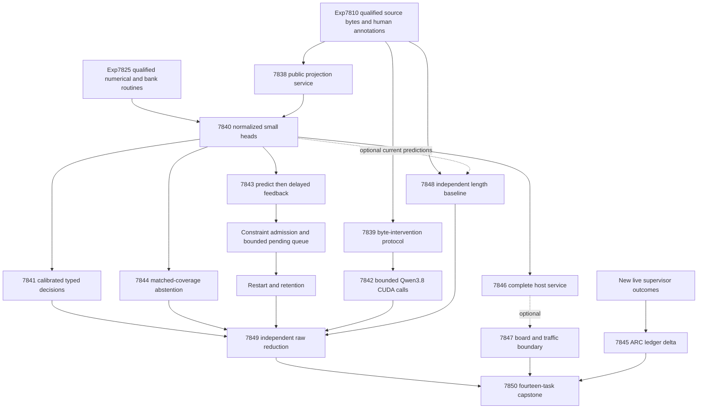
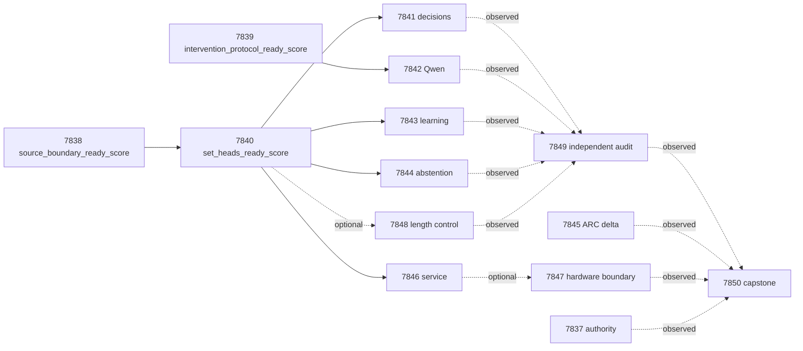

# Carnot Research Roadmap v681: Executable Evidence and Useful Decisions

**Created:** 2026-09-28
**Milestone:** 2026.09.681
**Title:** Executable source boundaries, shortcut-resistant decisions, and delayed constraint learning
**Status:** Proposed; not activated
**Supersedes:** 2026.09.680, Exp7823–Exp7836
**Previous design:** [Preserved V680](research-roadmap-v680-preserved-20260928.md)
**Contract:** exactly **14 tasks, exp7837 through exp7850**, in that order,
across **four phases**. The literal table and embedded JSON below are binding.
**Requirement:** REQ-REPORT-7851; SCENARIO-REPORT-7851.

## What V680 proved

Queue completion did not establish a scientific benefit. At planning time the
archive ends at V679. The active V680 roster, exact producer artifacts and
conductor log establish eight producers: one circular-positive qualification
and seven disqualified results. Six science producers are absent.

| Experiment | Primary observation | Consequence |
|---|---|---|
| 7823 | Contract validation failed because Exp7832 lacked prior failures | Validate the complete proposed plan before emission; administrative agreement does not gate science. |
| 7824 | Source checks ran, but owned coverage was 27%; required full-suite run timed out with failures already visible | Its result stays disqualified. Qualify a small reusable source boundary with complete CLI coverage and an explicit affected closure. |
| 7825 | `complete_circular_positive_training_and_online_runtime`; both readiness scores are 1 | Reuse qualified numerical and bank mechanisms; do not repeat fixture training. |
| 7828 | `worktree_imports` exited 0 and printed `worktree_imports_ok`; the shared reader requires JSON `resolved_imports` | Fix the emitted provenance contract, retaining the actual path check. |
| 7831 | Zero new supervisor sources; required validation failed | Inspect only new receipt hashes. An empty ledger warrants no refinement. |
| 7834 | Coverage failed; current service measurement absent | Keep board facts separate from unmeasured acceleration. |
| 7835 | Integer-versus-task-slug identity mismatch, coverage failure and required full-suite failure | Current readers use numeric experiment_id and a separate exact task_id. |
| 7836 | Own required validation failed with upstream science missing | Preserve all dispositions; missing external evidence is blocked, not retryable partial. |
| 7826/7827/7829/7830/7832/7833 | No declared science producer | No new natural fit, calibration, source sensitivity, retained learning, abstention or cost claim exists. |

Exp7810's successful 640-family canonical custody and Exp7825's qualification
are reusable inputs. Their fixture success does not prove decision quality.
The September oracle-distinct corrigendum remains binding. All 640 families
are historically exposed development data, including evaluation and retention
roles; role separation prevents current training leakage but cannot undo exposure.

## Three biggest gaps to the PRD vision

1. **FR-12: independent, useful verification.** Source transport exists, but
   it has not yet yielded a qualified natural-data probability or decision
   advantage. A source-aware head must beat matched controls and a simple
   length baseline. Low learned energy is not a semantic correctness proof.
2. **FR-11: causal continuous learning.** Durable memory mechanics exist.
   New constraints must change future decisions, improve over frozen and
   complete-static controls, and survive delayed feedback and restart without
   degrading retention. Memory growth alone is not learning benefit.
3. **FR-05/08/09/10 and NFR-01: dependable execution and deployment evidence.**
   Repeated validation-contract errors stop measurement. Small reusable
   boundaries need complete checks and end-to-end cost accounting before a
   Rust or accelerator investment. ARC transfer also remains distinct from
   already-banked public solves and must be measured through the live path.

## Research incorporated before experiment design

The [V681 source review](../../research-references.md#v681-planning-review--2026-09-28-recorded-before-design)
was written first. It covers all eight requested topics and all six secondary
sources, including browser challenges, stale trend pages and successful direct
Semantic Scholar citation reads after browser API failure.

| Primary work | Local experiment | Limit |
|---|---|---|
| [Illusion of Progress](https://arxiv.org/html/2508.08285v2), August 2025 | Exp7848 length-only control and within-length source permutation | Do not use lexical metrics or the evaluated generator to create truth labels. |
| [Input-side evidence alignment](https://arxiv.org/html/2608.15804v1), August 2026 | Exp7839/7842 keep target annotation and witness sensitivity separate | This is a bounded intervention, not reproduction of its trained encoder. |
| [Distributional EBM](https://arxiv.org/html/2605.18871v1), May 2026 | Exp7840/7844 freeze and compare abstention policies | Seed disagreement is a candidate signal, not its heterogeneous adapter architecture. |
| [Cross-block DBM](https://arxiv.org/abs/2609.14934), September 2026 | Exp7838 unknown-label loss/gradient invariance | Observed-label masking only; no new DBM training. |
| [Capacity-constrained delayed feedback](https://arxiv.org/html/2606.11711v1), June 2026; [noisy constraints](https://arxiv.org/abs/2609.06921), September 2026 | Exp7843 finite pending queues and worst-window error accounting | No convex-OCO or regret guarantee is claimed. |
| [Spline-local online KAN](https://arxiv.org/abs/2602.02056), revised June 2026; [pipelined p-computer](https://arxiv.org/abs/2607.21077), July 2026 | Exp7846/7847 measure update bytes and data movement | No hardware speedup is inferred from CPU work or vendor estimates. |

EBT and ARM–EBM remain architecture references. Neural projection, generative
energy descent, generic external-text reranking, importance anchoring and new
sampler sweeps are not reopened. The fixed local generator is unchanged.
This milestone continues the calibrated-decision program with two new controls;
Exp7837 ingests their methods without a large research-agent fan-out.

## Architecture



Administrative contract readiness is independent. Exp7838 and Exp7839 are the
two scientific qualification branches. Training has only its feature gate and
the already-qualified numerical resource. Evaluation and learning need valid
fits, never a positive evaluation result. The independent length baseline,
ARC delta, board record and final readers still run if fitting is blocked.

## Phase 1 — Make the remaining boundaries executable

**Exp7837–Exp7839.** Bind fourteen tasks and their immutable authority, then
register all methods and acceptance tests before science. Exp7837 is the first
infrastructure slot; Exp7839 is the second. Each uses preemptive Opus routing
for schema/preflight work, as requested; other tasks use Codex `gpt-6-sol`.

Exp7838 builds `python/carnot/verify/source_projection.py` from unnumbered
`source_alignment` and `evidence_views` functions. Historical Exp7824 is read
for diagnosis, not imported as a run/validation wrapper. The service receives
only allowed source/answer bytes and structural views. Annotation labels,
confidence, generator identity and role fields live in an evaluator sidecar.
Family IDs are join keys only. Mutating forbidden metadata must leave all
132 features unchanged on all 640 families. Unknown sentence labels must have
zero supervised loss and gradient; known labels need a nonzero control.

Roles remain fit256/tune64/policy64/online_update96/online_admission64/
evaluation64/retention32. View A uses singles and adjacent triples; view B
uses singles and adjacent pairs, capped at 128 windows and sixteen answer
units. Complete sentences, duplicate groups and invalid families remain visible.

This is a new reusable service qualification, not a retroactive pass for
Exp7824. Its failed full-suite obligation stays failed. The current source,
CLI and affected library-consumer closure must be fully tested, including
failure paths and actual CLI coverage. Import inventory must demonstrate that
historical numbered orchestration was not reused. Reusing that path would
inherit its original required checks and keep readiness zero on failure.

Exp7839 repairs the specific import-receipt mismatch without weakening the
shared reader. Emit actual `resolved_imports` paths, reject an empty map and
installed-package imports, and bind completed coverage files explicitly. Pure
source-edit/request/parser functions move to `source_interventions.py` with
behavior-preserving tests. Twenty-four scripted fixture families exercise
three request variants and the failure cases. No model weights load here.

## Phase 2 — Fit once, measure decisions and source sensitivity

**Exp7840–Exp7842.** Exp7840 trains nine arms at seeds 68101/68102/68103:
`response_set`, `local_set`, `augmented_set`, `constrained_set`,
`augmented_mlp`, `constrained_mlp`, `local_logistic`,
`source_erased_constrained_set`, `complete_static_constrained_set`.
That is 27 fresh fits, sixteen epochs, learning rate 0.01, width sixteen for
MLPs and at most 4096 parameters including duals and predicates. Fixture
checkpoints never initialize natural fits. Training stops at 3000 seconds
with resumable per-fit/epoch checkpoints and time reserved for validation.

Local supervision is response NLL plus mean known-sentence NLL. Augmentation
uses both views. Constraints use symmetric Bernoulli KL/2 tolerance 0.01 and
alternate-view CE tolerance 0.70; dual step 0.01 projects to [0,10]. Probability
clipping is [1e-6,1-1e-6]. Same-information controls share budgets and family
weights; source-erased and complete-static heads train separately.

Tune64 selects temperature from the existing [0.25,4] grid. Paired heads
average A/B risks before logit scaling. Fixed expected costs are accept=5p,
reject=1-p, escalate=0.25; ties escalate. Invalid families retain p=0.5,
Brier=0.25 and escalation. Policy64 freezes all abstention thresholds before
any evaluation or retention labels are available to fitting.

Exp7841 seals all evaluation64 predictions before joining human labels.
Average seed metrics within family. Use 10000 paired-family bootstrap draws
and paired randomization tests. Against augmented_set, constrained_mlp and
local_logistic, the constrained head needs cost improvement >=0.02, positive
lower95 gains for cost and Brier, coverage >=0.20 and Holm p<=0.05 across six
primary tests. Source value also needs positive Brier lower95 versus the
separately trained source-erased head. A complete null is a valid outcome.

Exp7842 uses **unsloth/Qwen3.8-27B-GGUF**, cached Q4_K_M, real CUDA offload,
seed 68101, n_ctx8192 and <=256 new tokens per call. It is
**model_bounded_generation**, with the 10-second floor. Resolve the actual
cache and tokenizer, hash model/runtime identity, and own a free suitable GPU
lease. Do not assume a particular slot dictionary or stop another process.

For 48 hash-selected evaluation families, an intact call nominates a source
witness for a first-sentence support judgment. Two randomized deletion calls
remove that witness or a disjoint sentence within 25% of its actual token
length. No eligible control means exclusion, not a replacement family.
Limit: 144 calls, 36864 generated tokens, 120 seconds per call, no new launch
after 2400 seconds and 3000 seconds total owned model service. All three arms
retain raw requests, output, finish reason, token counts and censoring.

Directional sensitivity needs >=24 valid independent pairs, mean witness-minus-
control risk displacement >=0.05 and positive paired lower95. Edited-source
labels remain unknown. Only intact first-sentence judgments with independent
aligned annotations receive Brier/cost evaluation. No sensitivity result is
reported as factual accuracy, and no CPU fixture is reported as live inference.

## Phase 3 — Test causal learning, abstention and live-agent evidence

**Exp7843–Exp7845.** Exp7843 compares frozen, complete-static, next-query
acquisition, next-block acquisition and shuffled-past-feedback at three seeds.
Eight blocks each contain twelve update and eight one-use admission families;
block b labels arrive at b+1. Predictions are durable before release and each
query pins its bank state. Propose at most one predicate/block and eight total
from the fixed sixteen-member grammar. Admission needs Brier gain>=0.01 and
no added false accept on that admission block. This rule is operational.

Restart after block four with queue, RNG, pending commits and credits intact.
Drain eligible feedback, freeze, then score evaluation64 and retention32.
Against frozen and complete-static, next-query acquisition needs cost gain
>=0.02, positive Brier/cost lower95 and four-test Holm p<=0.05. Retention Brier
degradation upper95 must be <=0.02 with no added false accepts. A new predicate
must change a later decision; shuffled past feedback must not reproduce the
causal effect. No admitted constraint is an honest null.

The new exploratory capacity probe compares capacity5 with capacity20 under
five requested feedback slots/block (three update, two admission), alternating
one/two-block delays and hash-random tracking when full. Record selection
probabilities, actual occupancy and permanently lost labels. Requested budgets
are equal; delivered labels may differ. This probe is separate from the main
learning gate. Report worst-window error excess and update/lookup/persistence
cost as well as average performance. No OCO guarantee or generator training
is claimed. Hardware path: CPU counters now, bounded table/predicate lookup
and sparse update traffic as the future Rust/FPGA boundary.

Exp7844 applies frozen disagreement, confidence and hash-random policies at
target coverage .20/.40/.60/.80. Report both threshold and label-free matched-
count comparisons. The .40 target is primary: cost improvement>=.02, positive
lower95 against each control, Holm p<=.05 for two tests, coverage>=.20 and no
added false accepts. Charge escalation cost for every abstention and the
complete three-head service cost. Identically zero disagreement is a null.

Exp7845 satisfies the ARC generalization floor through supervisor refinement
from outcome-bearing receipts. Registry-precheck prevents duplicated solve
credit. Compare new source hashes against Exp7831's inventory; no new firings
means `complete_null_no_new_supervisor_outcomes`, with no selector rerun.
For new data, join redirects, outcomes, game/seeds and censoring. A shadow
retirement recommendation requires >=20 closed firings across >=3 games with
zero progress. Priority changes need consistent association across >=3 games
and comparable exposure. These are observational recommendations, not causal
benefit or new solves. Live defaults remain unchanged; no new arm is generated.

## Phase 4 — Measure full cost and try to falsify the interpretation

**Exp7846–Exp7850.** Exp7846 measures source decoding, view construction,
features, loading, prediction, calibration, decision, serialization and commit.
Compare constrained_set, constrained_mlp and local_logistic on identical
evaluation64 families, randomized order and three timing repetitions. Report
cold/warm p50/p95, paired family intervals, exclusive spans, memory and bytes.
Use qualified natural admissions for update costs, or clearly separate fixture
transactions with natural-update values null. A zero sampler share means zero
sampler opportunity. Amdahl ceilings are bounds, not hardware measurements.

Exp7847 reads existing board transcripts and current service facts directly.
KV260 fabric, host CPU and commercial toolchain remain distinct; k_max<=5.
PolarFire CPU dispatch is not fabric acceleration. GateMate's unchanged
0xffffffff block is retained without another physical probe. NPU/TSU remain
unqualified. No board operation or purchase is needed for this milestone.

Exp7848 can run from qualified source bytes even if energy fitting failed.
Fit a ridge-logistic length-only baseline on fit256: log1p answer/source byte
lengths and their ratio, regularization1.0 and 200 deterministic steps. Tune
temperature on tune64. Define four answer-length bins using fit256 quartiles.
Score evaluation64 against prevalence and always-escalate references.

If current fitted heads qualify, permute sources within those bins and a
source-length caliper25%, using fixed hash derangements. Keep answers fixed,
recompute public features and report risk displacement; altered pairs have
unknown labels. On intact families, an energy/source interpretation needs
cost gain>=.02 and positive Brier/cost lower95 versus length, plus source-erased
control advantage. This veto cannot rescue a failed primary decision test.

Exp7849 independently reduces raw current rows and tests metadata leakage,
future feedback, wrong identities, dropped censoring, mutable logs and seed
pseudoreplication. Exp7850 accounts for all fourteen dispositions and invokes
the unchanged G1–G4 publication reader. Missing required external evidence is
blocked once. No historical publication state upgrades V681 science.

## Dependency graph and exact gate semantics



Each solid edge is exactly three conjunctive YAML checks: named readiness=1,
verdict_class in [positive,circular_positive,null], flagged_adversarial=false.
The upstream prompt declares the readiness field with the identical spelling.
There are six gated consumers and eighteen conditions. Dashed edges are
optional evidence or observations, never conductor launch gates. Historical
qualified Exp7810/7825 resources are checked by path/hash at execution; they
are not cross-roadmap `gated_on` or retired `requires` chains.

## Hardware requirements and execution budgets

| Resource | Planned use | Claim and acquisition boundary |
|---|---|---|
| Host CPU, RAM and local disk | Small JAX heads, source processing, bank updates, rows and validation; JAX_PLATFORMS=cpu | No new hardware purchase. Check free RAM/disk before each task; persist bounded raw data. |
| Existing 2x RTX3090, 24GB each | Exp7842 leases one suitable free device for cached roughly 16GB Q4_K_M and its context/KV cache | Authenticate offload and actual allocation; block if capacity is inadequate. No dual-GPU integration task. |
| Cached unsloth/Qwen3.8-27B-GGUF | The only planned LLM inference, <=144 bounded calls | No small-model headline fallback, no online download or generator training. |
| KV260 | Historical authenticated fabric/host evidence; future low-degree verifier/update mapping | k_max<=5; no new SSH, synthesis, flash or timing claim. |
| PolarFire and GateMate | Preserve current continuity and physical-block evidence | No repeated unchanged probe; Linux CPU work is not FPGA speed. |
| XDNA NPU, Extropic TSU, larger FPGA | Document concrete reopen conditions from the wishlist and measured service share | Access remains unqualified. Vendor numbers and traffic estimates are future-work inputs. |

CPU measurements use no model load and declare `MODEL_SPECS: []`; reducers
declare `aggregation`. Exp7842 declares `model_bounded_generation` (10s).
No full-generation or load-only task is scheduled; if scope changes, the
declaration must change to actual work (full generation 60s, load-only 2s).
No artificial wait may meet a duration floor. Legacy small models are allowed
only as separately labeled CPU smoke tests, never substitutes in this panel.

Per-task estimates appear in YAML and range from 25 to 65 minutes. The
conductor hard cap remains 4800 seconds. Every prompt requires a flushed line
at phase boundaries, before/after long calls and within loops, with a <=60s
heartbeat during children. Every gap stays below 600 seconds. Files over about
200 lines are written in <=150-line tool-call chunks with progress between
calls. GPU launch deadlines and resumable fit checkpoints reserve validation
time instead of trusting the hard cap to complete an oversized run.

## Validation, failure discipline and decision rules

All fourteen prompts include CONTEXT, EXISTING CODE TO READ FIRST, TASK,
numbered CONCRETE STEPS, principle-annotated REQUIRED ARTIFACT FIELDS and the
exact run command. Every comparative task requires per-unit rows. Numeric
experiment_id and separate task_id prevent the observed identity mismatch.
Blocked results must include exact `gate_check_summary` operands. `partial`
is reserved for unfinished owned work, not unavailable external inputs.

The current required roster is worktree_imports, affected_pytest,
changed_coverage, ruff_check, ruff_format, mypy, scoped_spec, cli_e2e,
cold_replay, adversarial_verify and strict_rows. Concrete argv and the full
affected closure are frozen before implementation. Complete coverage includes
the actual CLI and error paths. A single new repository_health_180s diagnostic
does not replace or pass a historical full-suite requirement. Imports/calls
into legacy orchestration inherit its obligations; those cannot be dropped.
Command dispatch tests reject undeclared children or changed classifications.

Scientific execution uses spec-first, meaningful tests-first changes, current
unit/lint/type/spec checks, real entrypoint E2E and fresh raw-row reduction.
ARC changes require E2E-009/011/013 and the LLM-disabled e3 smoke. Bank changes
require durable hard-exit restart checks; E2E-007 applies only if its certified
path changes. Native bindings are not changed, so E2E-003/004 are not planned.
Qwen protocol E2E uses a scripted peer; live CUDA evidence is a separate result.

Every task carries complete prior-failure entries where scope overlaps.
The narrow deliverable/technique and its changed prerequisite are explicit;
`retire_if_same_verdict: true` is retained in every entry. No retired experiment
ID is reused and no operator override is invented. Full-table readers,
prior-failure and exclusion lints must pass before staging finishes.

Continue only on an independently reconstructed effect or a newly diagnosed,
fixable prerequisite. Repeated same-mechanism nulls retire under their listed
scope. Missing evidence cannot justify another identical wrapper, board probe
or ledger restamp. A positive result on exposed development families can
motivate a separately planned fresh cohort, but cannot be called fresh held-out
generalization or used to restore retracted oracle-distinct claims.

The capstone leaves publication, production defaults and active-roadmap
activation unchanged. Planning edits reconcile this document, staged YAML,
research references, planning requirement, traceability and ops records.
The previous V680 design is preserved byte-for-byte for historical readers.

## Exact task contract

| Order | Task ID | Title | Phase | Deliverable |
|---|---|---|---|---|
| 1 | `exp7837-contract-methods` | Bind fourteen tasks and ingest length-confounding and delayed-feedback methods | 1 | `results/experiment_7837_v681_contract_methods.json` |
| 2 | `exp7838-source-boundary` | Qualify a reusable public-source boundary with complete CLI coverage | 1 | `results/experiment_7838_v681_source_boundary.json` |
| 3 | `exp7839-intervention-protocol` | Repair source-intervention import receipts and qualify the real dispatcher | 1 | `results/experiment_7839_v681_intervention_protocol.json` |
| 4 | `exp7840-energy-fit` | Train source-conditioned energies and freeze calibrated decision policies | 2 | `results/experiment_7840_v681_energy_fit.json` |
| 5 | `exp7841-decision-measurement` | Measure calibrated decisions against same-information controls | 2 | `results/experiment_7841_v681_decision_measurement.json` |
| 6 | `exp7842-qwen-counter-evidence` | Measure bounded Qwen source sensitivity with matched deletions | 2 | `results/experiment_7842_v681_qwen_counter_evidence.json` |
| 7 | `exp7843-continuous-acquisition` | Measure delayed constraint additions and finite feedback capacity | 3 | `results/experiment_7843_v681_continuous_acquisition.json` |
| 8 | `exp7844-selective-abstention` | Compare disagreement abstention at matched retained coverage | 3 | `results/experiment_7844_v681_selective_abstention.json` |
| 9 | `exp7845-arc-supervisor-delta` | Refine ARC generalization only from new outcome-bearing supervisor receipts | 3 | `results/experiment_7845_v681_arc_supervisor_delta.json` |
| 10 | `exp7846-service-cost` | Measure complete source-decision and durable-update service cost | 4 | `results/experiment_7846_v681_service_cost.json` |
| 11 | `exp7847-hardware-evidence` | Preserve board continuity and bound traffic-sensitive acceleration | 4 | `results/experiment_7847_v681_hardware_evidence.json` |
| 12 | `exp7848-length-shortcut` | Test a length-only baseline and source permutation before crediting semantics | 4 | `results/experiment_7848_v681_length_shortcut.json` |
| 13 | `exp7849-independent-audit` | Cold-reduce current decisions and feedback with typed producer identities | 4 | `results/experiment_7849_v681_independent_audit.json` |
| 14 | `exp7850-capstone` | Reconcile fourteen outcomes and set evidence-based continuation rules | 4 | `results/experiment_7850_v681_capstone.json` |

<!-- V681_TASK_CONTRACT_START -->
```json
{
  "milestone": "2026.09.681",
  "tasks": [
    {"id": "exp7837-contract-methods", "title": "Bind fourteen tasks and ingest length-confounding and delayed-feedback methods", "phase": 1, "deliverable": "results/experiment_7837_v681_contract_methods.json", "inference_substrate_class": "aggregation", "MODEL_SPECS": [], "gated_on": []},
    {"id": "exp7838-source-boundary", "title": "Qualify a reusable public-source boundary with complete CLI coverage", "phase": 1, "deliverable": "results/experiment_7838_v681_source_boundary.json", "inference_substrate_class": "no_model_load", "MODEL_SPECS": [], "gated_on": []},
    {"id": "exp7839-intervention-protocol", "title": "Repair source-intervention import receipts and qualify the real dispatcher", "phase": 1, "deliverable": "results/experiment_7839_v681_intervention_protocol.json", "inference_substrate_class": "no_model_load", "MODEL_SPECS": [], "gated_on": []},
    {"id": "exp7840-energy-fit", "title": "Train source-conditioned energies and freeze calibrated decision policies", "phase": 2, "deliverable": "results/experiment_7840_v681_energy_fit.json", "inference_substrate_class": "no_model_load", "MODEL_SPECS": [], "gated_on": [{"upstream": "exp7838-source-boundary", "artifact_field": "source_boundary_ready_score", "op": "==", "value": 1}, {"upstream": "exp7838-source-boundary", "artifact_field": "verdict_class", "op": "in", "value": ["positive", "circular_positive", "null"]}, {"upstream": "exp7838-source-boundary", "artifact_field": "flagged_adversarial", "op": "==", "value": false}]},
    {"id": "exp7841-decision-measurement", "title": "Measure calibrated decisions against same-information controls", "phase": 2, "deliverable": "results/experiment_7841_v681_decision_measurement.json", "inference_substrate_class": "no_model_load", "MODEL_SPECS": [], "gated_on": [{"upstream": "exp7840-energy-fit", "artifact_field": "set_heads_ready_score", "op": "==", "value": 1}, {"upstream": "exp7840-energy-fit", "artifact_field": "verdict_class", "op": "in", "value": ["positive", "circular_positive", "null"]}, {"upstream": "exp7840-energy-fit", "artifact_field": "flagged_adversarial", "op": "==", "value": false}]},
    {"id": "exp7842-qwen-counter-evidence", "title": "Measure bounded Qwen source sensitivity with matched deletions", "phase": 2, "deliverable": "results/experiment_7842_v681_qwen_counter_evidence.json", "inference_substrate_class": "model_bounded_generation", "MODEL_SPECS": ["unsloth/Qwen3.8-27B-GGUF"], "gated_on": [{"upstream": "exp7839-intervention-protocol", "artifact_field": "intervention_protocol_ready_score", "op": "==", "value": 1}, {"upstream": "exp7839-intervention-protocol", "artifact_field": "verdict_class", "op": "in", "value": ["positive", "circular_positive", "null"]}, {"upstream": "exp7839-intervention-protocol", "artifact_field": "flagged_adversarial", "op": "==", "value": false}]},
    {"id": "exp7843-continuous-acquisition", "title": "Measure delayed constraint additions and finite feedback capacity", "phase": 3, "deliverable": "results/experiment_7843_v681_continuous_acquisition.json", "inference_substrate_class": "no_model_load", "MODEL_SPECS": [], "gated_on": [{"upstream": "exp7840-energy-fit", "artifact_field": "set_heads_ready_score", "op": "==", "value": 1}, {"upstream": "exp7840-energy-fit", "artifact_field": "verdict_class", "op": "in", "value": ["positive", "circular_positive", "null"]}, {"upstream": "exp7840-energy-fit", "artifact_field": "flagged_adversarial", "op": "==", "value": false}]},
    {"id": "exp7844-selective-abstention", "title": "Compare disagreement abstention at matched retained coverage", "phase": 3, "deliverable": "results/experiment_7844_v681_selective_abstention.json", "inference_substrate_class": "no_model_load", "MODEL_SPECS": [], "gated_on": [{"upstream": "exp7840-energy-fit", "artifact_field": "set_heads_ready_score", "op": "==", "value": 1}, {"upstream": "exp7840-energy-fit", "artifact_field": "verdict_class", "op": "in", "value": ["positive", "circular_positive", "null"]}, {"upstream": "exp7840-energy-fit", "artifact_field": "flagged_adversarial", "op": "==", "value": false}]},
    {"id": "exp7845-arc-supervisor-delta", "title": "Refine ARC generalization only from new outcome-bearing supervisor receipts", "phase": 3, "deliverable": "results/experiment_7845_v681_arc_supervisor_delta.json", "inference_substrate_class": "aggregation", "MODEL_SPECS": [], "gated_on": []},
    {"id": "exp7846-service-cost", "title": "Measure complete source-decision and durable-update service cost", "phase": 4, "deliverable": "results/experiment_7846_v681_service_cost.json", "inference_substrate_class": "no_model_load", "MODEL_SPECS": [], "gated_on": [{"upstream": "exp7840-energy-fit", "artifact_field": "set_heads_ready_score", "op": "==", "value": 1}, {"upstream": "exp7840-energy-fit", "artifact_field": "verdict_class", "op": "in", "value": ["positive", "circular_positive", "null"]}, {"upstream": "exp7840-energy-fit", "artifact_field": "flagged_adversarial", "op": "==", "value": false}]},
    {"id": "exp7847-hardware-evidence", "title": "Preserve board continuity and bound traffic-sensitive acceleration", "phase": 4, "deliverable": "results/experiment_7847_v681_hardware_evidence.json", "inference_substrate_class": "aggregation", "MODEL_SPECS": [], "gated_on": []},
    {"id": "exp7848-length-shortcut", "title": "Test a length-only baseline and source permutation before crediting semantics", "phase": 4, "deliverable": "results/experiment_7848_v681_length_shortcut.json", "inference_substrate_class": "no_model_load", "MODEL_SPECS": [], "gated_on": []},
    {"id": "exp7849-independent-audit", "title": "Cold-reduce current decisions and feedback with typed producer identities", "phase": 4, "deliverable": "results/experiment_7849_v681_independent_audit.json", "inference_substrate_class": "aggregation", "MODEL_SPECS": [], "gated_on": []},
    {"id": "exp7850-capstone", "title": "Reconcile fourteen outcomes and set evidence-based continuation rules", "phase": 4, "deliverable": "results/experiment_7850_v681_capstone.json", "inference_substrate_class": "aggregation", "MODEL_SPECS": [], "gated_on": []}
  ]
}
```
<!-- V681_TASK_CONTRACT_END -->
