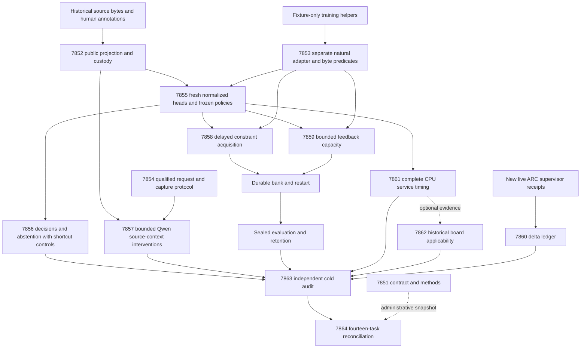
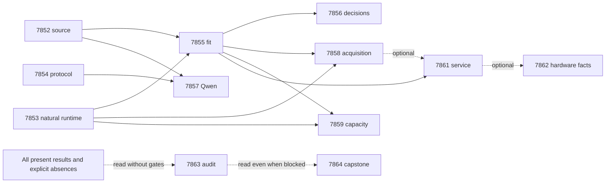

# Carnot Research Roadmap v682: Byte-Grounded Constraint Learning

**Created:** 2026-09-28  
**Milestone:** 2026.09.682  
**Title:** Byte-grounded constraint learning and evidence-sufficient decisions  
**Status:** Proposed; staged for conductor review, not activated  
**Supersedes:** completed 2026.09.681, Exp7837–Exp7850  
**Previous design:** [Preserved V681](research-roadmap-v681-preserved-20260928.md)  
**Requirement:** REQ-REPORT-PLAN-682; SCENARIO-REPORT-PLAN-682-CONTRACT and SCENARIO-REPORT-PLAN-682-RESEARCH.  
**Contract:** exactly **14 tasks, exp7851 through exp7864**, in that order, across **four phases**. The table and embedded JSON agree with `research-roadmap-next.yaml`. Neither the active roadmap nor conductor is changed by this proposal.

## What the completed milestone established

The completed queue did not establish a scientific benefit. The active V681
roster, archived completion record, conductor log and exact result files show
eight producers: **five disqualified and three blocked**. Six science producers
were never emitted. Producer absence and conductor gate receipts are distinct.

| V681 experiment | Observed result | Consequence for V682 |
|---|---|---|
| 7837 contract | Disqualified; `Coverage.report(fail_under=100)` is not supported; a success-prefixed partial candidate contradicted its class | Fix the actual command and terminal-state contract; parameterize the reader while preserving V681 behavior. |
| 7838 source | Blocked on numeric `7810` versus historical `exp7810-source-view-qualification` identity | Add a narrow path/milestone/hash-bound legacy adapter; retain strict current identity. |
| 7839 protocol | Disqualified; combined coverage 60%, orchestration 23%, despite repaired import receipts | Complete dispatcher/CLI coverage before model work. |
| 7840/7841/7842/7843/7844/7846 | Declared science files absent following prerequisite gates | No natural fit, decision, model intervention, learning, abstention or service-cost result exists. |
| 7845 ARC | Disqualified; 69% required coverage and inconsistent candidate class; no new usable supervisor outcomes | Validate the delta reader and permit an honest no-new-outcomes null. |
| 7847 hardware | Disqualified; private test output under `results/` encountered cross-filesystem atomic rename after child-output redirection | Put private candidates and temporary files together under `/tmp`; preserve the guard. |
| 7848 length control | Disqualified; the same output failure and 64% coverage; diagnostic cost gain was zero | Preserve the diagnostic, then freeze a length baseline alongside current fits. |
| 7849 audit / 7850 capstone | Blocked on required V681 evidence | Keep audits ungated; external missing evidence is terminal blocked, never retryable partial. |

Exp7810 retains a useful 640-family custody record. All families are historically
exposed development data. Rechecking role separation does not create a fresh
holdout. Exp7825 establishes fixture conformance only: code inspection found
`training_qualification.make_batch` obtains static features from numeric
`unit_id` bits through `sentence_features`, while `fit_arm` calibrates on its
training batch and chooses a fixed first seed. Those helpers cannot qualify
natural feature learning. V682 introduces a separate natural adapter and actual
public-byte predicates before any scientific fit.

The September 28 oracle-distinct corrigendum remains binding: previously claimed
independent verification had confidence leakage, self-labels, seed-level intervals
or retraining instead of transfer. GAP-ORACLE-DISTINCT remains open. Pending
DiffusionGemma work is not silently marked complete. Historical artifacts remain
unchanged; a successful repair does not rehabilitate an old disqualified result.

## Three biggest gaps to the PRD vision

1. **Independent and useful verification (FR-12).** Source transport and energy
   primitives exist, but natural probability quality and typed decision benefit
   remain unqualified. Byte-derived evidence must beat length, source-erased,
   logistic and matched MLP controls. Context sensitivity is a separate question
   from correctness, and low energy is not a semantic certificate.
2. **Causal continuous self-learning (FR-11).** Durable memory machinery exists,
   but acquisition must change later decisions, beat an equally informed static
   bank, survive delayed or lost feedback, and retain earlier performance. A
   growing bank or a local update is insufficient evidence.
3. **Dependable execution and deployment cost (FR-05/08/09/10, NFR-01).** Validation
   defects repeatedly prevent measurement. Small qualified interfaces, complete
   host-service timing and authenticated board limits must precede accelerator
   investment. Live ARC supervision needs new outcome evidence, not repeated
   banked solves or hand-written game models.

## Literature reviewed before design

The [V682 source review](../../research-references.md#v682-planning-review--2026-09-28-recorded-before-design)
was appended before these experiments were designed. It covers all eight primary
topics and the six requested secondary sources, including access limitations.

| Recent primary work | Local adaptation | Limit |
|---|---|---|
| [Verification Without Sufficiency](https://arxiv.org/html/2608.00585v1), August 2026 | Exp7854/7857 compare full source, nominated witness, neighboring context and matched disjoint context | Edited contexts have no new truth labels; the primary result is risk sensitivity. |
| [RECAP](https://arxiv.org/html/2606.06698v4), June/August 2026 | Exp7853/7858 distinguish predict-before-feedback adaptation from proactive test-time access | Carnot implements reactive delayed supervision, not a reproduction of its architecture. |
| [Retrieval-warmed EBR](https://arxiv.org/abs/2606.26476), June 2026 | Exp7858/7859 preserve aligned, shuffled-past, no-write and frozen controls | Oracle/immediate feedback is diagnostic; a failed deployment gate remains failed. |
| [Distributional EBM](https://arxiv.org/abs/2605.18871), May 2026 | Exp7855/7856 keep energy, analytic constraints and calibration distinct | Small-head disagreement is not its full distributional construction. |
| [Solver-Hard Does Not Mean Model-Hard](https://arxiv.org/abs/2607.17047), July 2026 | Exp7853/7856 prohibit identifier shortcuts and measure length/source controls | Representation sensitivity cannot certify general reasoning. |
| [KAN forgetting](https://arxiv.org/abs/2511.12828), November 2025 | Exp7858 tests retention explicitly | KAN locality provides no automatic forgetting guarantee; no new KAN sweep. |
| [FPGA/ASIC sampler co-design](https://arxiv.org/html/2602.15985v2), revised September 2026 | Exp7861/7862 include orchestration, data movement and persistence | A projected acceleration bound is not measured board speed. |

EBT [2507.02092](https://arxiv.org/abs/2507.02092), ARM–EBM
[2512.15605](https://arxiv.org/abs/2512.15605), constrained neural methods,
energy-guided decoding and pipelined p-computers were checked. Direct Semantic
Scholar citation endpoints returned 37 EBT and eight ARM–EBM citation rows at
lookup; these are returned-index counts, not exhaustive literature totals.
OpenReview/ICLR and HuggingFace led back to primary papers. GitHub trending did
not establish a new relevant ranked repository. Extropic Z1t and scale-up posts
are vendor evidence; Kona's public description does not expose reproducible
weights/methods. None grants local hardware or model capability.

New generative energy descent, generic external-text reranking, retired frozen
certificate heads, importance anchoring and speculative hardware bring-up stay
outside this milestone. This is an evidence-producing research milestone;
production promotion requires qualified benefits that V681 did not deliver.

## Architecture



Labels, source annotations, generator identity, split roles and confidence remain
in an evaluator sidecar. The predictor sees only public source/answer bytes and an
opaque join identifier that cannot enter numeric features. Every prediction is
sealed before labels are joined. The learned component emits risk; a separate
frozen policy emits accept/reject/escalate. Exact support normalization is feasible
inside the bounded source-window set; this is not unrestricted text generation.

## Four phases and decision criteria

### Phase 1 — qualify the actual measurement boundaries (Exp7851–Exp7854)

Exp7851 binds the exact contract and freezes methods using unchanged activation
readers. Its administrative readiness does not gate science. Exp7852 qualifies
legacy source identity narrowly, repeats custody checks and exports public bytes
without labels. The seven development roles remain fit256, tune64, policy64,
online_update96, online_admission64, evaluation64 and retention32. Duplicate-source
groups must not cross roles; a discovered conflict blocks qualification rather
than triggering a favorable reshuffle. At least 128 independent fit groups and
32 tune groups are required before natural fitting.

Exp7853 separates natural training from fixture qualification. The frozen grammar
contains one constant and all fifteen nonempty conjunctions of four public-byte
heuristics: unmatched decimal token, answer negator absent from source, content
Jaccard below 0.20, and a noninitial title-case answer token absent from source.
These are advisory signals, not truth labels. Identifier and annotation changes
must leave them invariant; source erasure applies to every feature. Train, tune
and seed become explicit arguments. Numeric, gradient, calibration, durable-bank,
restart and no-write tests qualify mechanisms only. Exp7854 completes request,
parser and orchestration coverage on 24 fixtures before any model load.

The two dedicated infrastructure slots are Exp7851 and Exp7854. Qualification
work has explicit corrective hypotheses: invalid coverage API, contradictory
candidate state, legacy identity, fixture feature leakage and missing CLI coverage.
A wrapper or new experiment ID cannot erase inherited failed requirements.

### Phase 2 — measure calibrated decisions and evidence context (Exp7855–Exp7857)

Exp7855 trains nine existing arms with three explicitly registered seeds
67801/67802/67803: response_set, local_set, augmented_set, constrained_set,
augmented_mlp, constrained_mlp, local_logistic, source_erased_constrained_set and
complete_static_constrained_set. There are 27 fresh fits, at most sixteen epochs,
learning rate 0.01, MLP width sixteen and 4096 total fitted scalars. The existing
normalized source-support and masked local objectives remain unchanged. Constrained
arms use symmetric Bernoulli KL/2 tolerance 0.01 and alternate-view CE tolerance
0.70, with dual step 0.01 clipped to [0,10]. Temperature is applied after paired
view aggregation. Fit-only prevalence and two-length logistic controls share the
disjoint tune role. Seventeen temperatures on [0.25,4] and policy-role abstention
thresholds are frozen before evaluation. No evaluation or retention labels enter
this process. The typed costs are accept=5p, reject=1-p and escalate=0.25, with
escalation on ties; invalid inputs retain p=0.5 and escalate.

Exp7856 seals all evaluation predictions before label access. Seed metrics are
averaged within source family; 10,000 paired family bootstrap draws and paired
randomization tests support uncertainty. Primary constrained-set comparisons are
against augmented_set, constrained_mlp and local_logistic. A benefit requires cost
gain at least 0.02, positive lower95 cost and Brier gains, retained coverage at
least 0.20 and Holm correction across six tests. Source-specific value additionally
needs a positive lower95 Brier advantage over source-erased and length-only heads.
Within-length source permutation measures sensitivity without refitting. Frozen
abstention at target coverage 0.50 must beat both margin and hash-random policies,
with positive lower95 cost gain, no additional false accepts and actual coverage
difference at most 0.05. Other coverage points are descriptive. A failed empirical
gate is a valid null when measurement itself is complete.

Exp7857 is the sole pretrained-model task. It requires
`MODEL_SPECS: [unsloth/Qwen3.8-27B-GGUF]`, a qualified cached Q4_K_M, owned suitable
CUDA capacity and actual offload receipts. Its class is
**model_bounded_generation**, with a **10-second** authenticity floor: short fixed
token requests remain bounded even when the whole cohort takes minutes.
Forty-eight hash-selected evaluation families receive at most four calls each,
128 new tokens per call including reasoning, n_ctx8192, temperature zero and seed
67801. The first call nominates a witness sentence and unsupported risk for the
first answer sentence. Subsequent conditions are witness only, witness plus
immediate neighbors, and witness plus disjoint context within 25% token length.
Overlong inputs, invalid witnesses, truncated replies and missing controls remain
excluded without replacement. With at least 24 complete independent families,
risk_matched minus risk_neighbors must average at least 0.05 with a positive
paired lower95 for the sensitivity gate. Only the full-source arm may use the
original aligned human annotation for accuracy. No edited-source accuracy is
invented. Maximum generation is 192 calls / 24,576 tokens; each call has a
120-second owned deadline, launch stops at 2400 seconds, service stops at 3000.

### Phase 3 — test causal learning and live outcome evidence (Exp7858–Exp7860)

Exp7858 addresses continuous self-learning directly. Eight blocks each contain
twelve update and eight admission families, with one-block delayed labels.
Predictions and bank hashes are sealed before feedback. Each block can propose
one absent byte predicate, fit its coefficient from released update labels and
admit it only with separate released admission Brier gain at least 0.01 and no
additional false accepts. There are at most eight admitted predicates. Dynamic,
frozen, complete-static, no-write and shuffled-past arms share the schedule and
allowed compute. The complete-static bank receives all sixteen predicates and
the same coefficient-learning opportunity, so acquiring access is not confused
with receiving more supervision. Every arm restarts after block four.

After final feedback, banks freeze before evaluation and retention labels join.
Learning benefit needs cost gain at least 0.02 plus positive lower95 cost and
Brier gains over frozen and complete-static controls, with Holm correction across
four tests; an admitted predicate must change a later decision and beat no-write.
Retention additionally needs upper95 Brier degradation at most 0.02 and no added
false accepts. Wide intervals with 32 families are inconclusive, not proof of
retention. Report prequential loss, rejected proposals, actual commits, changed
coefficients, later effects, write bytes and latency.

Exp7859 tests a separate operational constraint without depending on a positive
Exp7858 result. Five requests per block (three update, two admission) are fixed by
hash, with capacities five/twenty and delays one/two blocks. Release precedes new
arrivals; overflow drops newest requests permanently. Requested supervision is
matched; delivered supervision may differ and is measured. Each condition has
aligned, delivered-past-shuffled and frozen controls. An immediate-label oracle is
only diagnostic. The primary comparison is capacity twenty versus five at delay
two, with source-family intervals, loss, retention and pending/drop accounting.
No realized drops means no capacity-effect claim.

Exp7860 reads only new live ARC supervisor receipts after a recorded cutoff.
It improves the evidence available to self-discovery; it does not launch games,
read hidden game source, add hand-made adapters or re-solve banked levels. Outcome
rows preserve fired/helped, level-up resolution, actions and unredirected
stagnations with provenance. Empty eligible input is an explicit valid null and
requires no tuning. Observational ledger changes are not causal action savings.

### Phase 4 — cost, capability limits and independent reconciliation (Exp7861–Exp7864)

Exp7861 measures the complete CPU verification service on 64 inputs with three
paired cache-on/off orders: projection, energy, calibration, policy, serialization
and durable writes. Cold/JIT and warm p50/p95 are separate; decisions must match.
A bank commit/restart conformance input is labeled accordingly. Qualified natural
commits from Exp7858 are optional separate evidence. Measured component fractions
support explicit Amdahl projections at 2x/10x/infinite component acceleration;
they do not establish board speed or meet PRD latency targets by assertion.

Exp7862 fixes the private-output reader defect and preserves historical scope:
KV260 authenticated quadratic Ising fabric at k<=5; PolarFire Linux CPU execution;
GateMate blocked at JTAG 0xffffffff; NPU/TSU unqualified. It reads new service
requirements when available, keeps vendor claims separate and performs no device
probe, flash or purchase. A missing service result leaves applicability unknown
without erasing established historical board facts.

Exp7863 independently cold-reduces all eleven producers Exp7852–Exp7862, including
valid nulls. It does not reuse their summary functions. Missing/flagged/invalid
producers remain distinct external blockers while available results are audited.
Exp7864 reconciles all fourteen task dispositions, retirement comparisons,
publication G1–G4, specs and ops documentation. Own report completion and milestone
benefit are separate. Neither task is pre-gated, neither treats external absence
as partial, and neither publishes or activates another roadmap.

## Dependency graph and exact gate contracts

Conductor order is the task table order. Structured prerequisites are validity
checks, not positive-benefit filters. Every readiness gate also requires the
upstream `verdict_class` in `[positive, circular_positive, null]` and
`flagged_adversarial == false`. Circular-positive fixture qualification licenses
mechanics only. The producer's own REQUIRED ARTIFACT FIELDS spells each name.

| Consumer | Required current producer fields | Optional inputs |
|---|---|---|
| 7851, 7852, 7853, 7854 | No current pre-gates; perform their own source checks | Historical custody and failure receipts |
| 7855 | 7852.source_boundary_ready_score == 1; 7853.natural_training_ready_score == 1 | None |
| 7856 | 7855.energy_fit_ready_score == 1 | None |
| 7857 | 7852.source_boundary_ready_score == 1; 7854.intervention_protocol_ready_score == 1 | None |
| 7858, 7859 | 7855.energy_fit_ready_score == 1; 7853.natural_online_ready_score == 1 | Neither depends on the other's benefit |
| 7860 | No current pre-gates | New live supervisor receipts; empty is valid |
| 7861 | 7855.energy_fit_ready_score == 1 | Qualified 7858 natural commits |
| 7862 | No current pre-gates | Qualified 7861 service fractions |
| 7863, 7864 | No current pre-gates | Read every present producer; name every absence |



## Hardware and execution requirements

| Resource | Requirement and use | Absence behavior |
|---|---|---|
| CPU/JAX | Existing `.venv`, CPU JAX, bounded 4096-scalar heads; all fits and bank experiments use host CPU | Exact dependency failure blocks its consumer; no fabricated measurement |
| RAM/disk | Existing workstation; stream source records and record actual peak RSS/disk use; private `/tmp` space for tests, candidates and coverage | Preflight records insufficient capacity before compute |
| CUDA/GGUF | Exp7857 only: existing Qwen3.8-27B Q4_K_M cache, embedded tokenizer, compatible llama.cpp and an owned GPU allocation sized from actual bytes plus context overhead | Block with cache/runtime/VRAM operands; no legacy-model headline substitution |
| KV260 / PolarFire | Historical authenticated receipts only; keep measured fabric/CPU scopes distinct | No physical probe in this milestone |
| GateMate / NPU / TSU | Changed physical/operator evidence or qualified tooling would be prerequisites for future work | No repeat unchanged JTAG, speculative SDK install or purchase |
| Network | Read-only primary literature and exact vendor pages | Report unavailable sources rather than inventing updates |

Only Exp7857 loads an LLM. Model-load-only work would have a 2-second floor and
real full generation a 60-second floor; neither describes these fixed 128-token
calls. The selected class is bounded generation (10 seconds). No task sleeps to
satisfy a duration floor. Small legacy models are permitted only in separately
labeled fast CPU smoke tests. A cached pair helper must explicitly choose the
mandated Qwen model for the headline run.

Every prompt contains numbered progress and file-size steps. Emit a flushed line
at every phase boundary and before/after model load, generation, benchmark or
subprocess; supervise long children and loops with at least 60-second heartbeats.
All silence gaps must remain below 600 seconds and individual tool waits at most
60 seconds. Files above about 200 lines are written in at most 150-line chunks
with progress messages between calls. Checkpoints preserve all unfavorable and
unfinished units. Training and generation stop starting work by 2400 seconds and
finish owned compute by 3000 seconds, reserving time under the 4800-second cap for
validation. The CPU service benchmark is capped at 1800 seconds.

The planning estimates total 830 minutes (13 hours 50 minutes) if every branch
runs to its estimate; structured pre-gates skip externally blocked model/agent
work. Estimates are not measurements or runtime permissions. Opus/100 is assigned
to the two schema/protocol infrastructure repairs; formulaic adapters/readers use
Codex gpt-6-sol, and routine experiments/audits use Claude Sonnet. No luna experiment
or unaudited weak-model research claim is proposed.

## Artifact, validation and failure discipline

Every task names one exact JSON deliverable, primitive `rows`, sample-size budget,
source hashes, command receipts, actual substrate/model counts, closed
`verdict_class`, free-text `honest_verdict`, `flagged_adversarial` and principles
for its fields. Comparative rows identify source family, arm, seed, metric and
exclusion status. Confidence intervals use independent source groups, not views
or seeds. `gate_check_summary` names the exact check, path/hash, operand, expected
and observed value on every blocked result.

Terminal classes are positive, circular_positive, null, blocked or disqualified.
Only retryable unfinished owned work is partial, with a `partial_*` verdict.
Deterministic oracle fixture agreement is circular_positive; failed required
checks force disqualified and zero readiness. A success-prefixed partial
candidate is forbidden. Raw log handles close before immutable sealing. Private
candidate output and atomic temporary files stay in the same directory outside
`results/`; the child guard remains enabled.

Execution proceeds spec first, meaningful tests first, implementation, then actual
validation. Freeze the affected closure and inherited obligations before seeing
results. Require complete changed-code statement coverage including real CLI
failure routes, preserve historical branch settings, use explicit completed
coverage files and CLI `coverage report --fail-under=100`. Run scoped Ruff,
strict mypy, spec traceability, a private CLI/cold replay, adversarial verification
and strict row consistency. A separate 180-second repository-health diagnostic
cannot erase an inherited required full-suite failure or be reported as a full
pass. No later wrapper converts a failed required check into an optional one.

Applicable E2E work is explicit: source custody/projection replay (7852), natural
train/save/load/predict plus causal bank restart (7853/7855/7858/7859), request-to-raw
model capture (7854/7857), frozen prediction-to-decision reduction (7856), live
ledger delta (7860), complete durable CPU service (7861), evidence-reader CLI
(7862), and independent contract/evidence reduction (7851/7863/7864). Map each to
`ops/e2e-test-plan.md` before execution. Existing live ARC or hardware smoke checks
apply if those runtime consumers are changed; this plan itself changes no runtime.

Every matching failed scope carries full `prior_failures` metadata with exact
prior verdict, changed prerequisite/technique and `retire_if_same_verdict: true`.
No retired experiment ID or upstream is reused. The capstone compares exact
outcomes and applies the existing retirement workflow; it cannot relax the
exclusion manifest. Publication G1–G4, oracle-distinct verification, fresh holdout
generalization, production activation and generator-weight learning remain
separate future gates. A complete set of nulls is scientifically more useful than
another queue of unqualified positives.

## Exact task contract

The following ordered table and embedded JSON are the binding roster. Prompt
instructions and concrete steps reside in the paired YAML; the count, IDs,
order, titles, phases, deliverables, model choices and structured gates agree.

| Order | ID | Title | Phase | Deliverable |
|---|---|---|---|---|
| 1 | exp7851-contract-methods | Bind fourteen tasks and register sufficiency and causal-learning methods | 1 | `results/experiment_7851_v682_contract_methods.json` |
| 2 | exp7852-source-boundary | Qualify exact legacy source identity and public byte projection | 1 | `results/experiment_7852_v682_source_boundary.json` |
| 3 | exp7853-natural-runtime | Qualify byte-derived predicates and disjoint natural-data training | 1 | `results/experiment_7853_v682_natural_runtime.json` |
| 4 | exp7854-intervention-protocol | Complete intervention-runner coverage and freeze source-sufficiency requests | 1 | `results/experiment_7854_v682_intervention_protocol.json` |
| 5 | exp7855-energy-fit | Train natural source energies and freeze calibrated typed policies | 2 | `results/experiment_7855_v682_energy_fit.json` |
| 6 | exp7856-decision-abstention | Measure calibrated decisions and abstention against length and source controls | 2 | `results/experiment_7856_v682_decision_abstention.json` |
| 7 | exp7857-qwen-sufficiency | Measure bounded Qwen decisions under full and partial source evidence | 2 | `results/experiment_7857_v682_qwen_sufficiency.json` |
| 8 | exp7858-causal-acquisition | Test durable constraint acquisition against equally informed static and no-write controls | 3 | `results/experiment_7858_v682_causal_acquisition.json` |
| 9 | exp7859-feedback-capacity | Measure delayed-feedback loss under bounded online admission capacity | 3 | `results/experiment_7859_v682_feedback_capacity.json` |
| 10 | exp7860-arc-supervisor-delta | Audit new live ARC supervisor outcomes without re-solving banked levels | 3 | `results/experiment_7860_v682_arc_supervisor_delta.json` |
| 11 | exp7861-service-cost | Measure complete CPU verification service and bounded hardware acceleration headroom | 4 | `results/experiment_7861_v682_service_cost.json` |
| 12 | exp7862-hardware-evidence | Preserve authenticated board limits and audit current service-to-hardware fit | 4 | `results/experiment_7862_v682_hardware_evidence.json` |
| 13 | exp7863-independent-audit | Cold-audit V682 primitive evidence and classify every scientific branch | 4 | `results/experiment_7863_v682_independent_audit.json` |
| 14 | exp7864-capstone | Reconcile fourteen V682 outcomes and retire unchanged failed scopes | 4 | `results/experiment_7864_v682_capstone.json` |

<!-- V682_TASK_CONTRACT_START -->
```json
{"milestone": "2026.09.682", "task_count": 14, "tasks": [
{"id": "exp7851-contract-methods", "title": "Bind fourteen tasks and register sufficiency and causal-learning methods", "phase": 1, "deliverable": "results/experiment_7851_v682_contract_methods.json", "MODEL_SPECS": [], "inference_substrate_class": "aggregation", "gated_on": []},
{"id": "exp7852-source-boundary", "title": "Qualify exact legacy source identity and public byte projection", "phase": 1, "deliverable": "results/experiment_7852_v682_source_boundary.json", "MODEL_SPECS": [], "inference_substrate_class": "no_model_load", "gated_on": []},
{"id": "exp7853-natural-runtime", "title": "Qualify byte-derived predicates and disjoint natural-data training", "phase": 1, "deliverable": "results/experiment_7853_v682_natural_runtime.json", "MODEL_SPECS": [], "inference_substrate_class": "no_model_load", "gated_on": []},
{"id": "exp7854-intervention-protocol", "title": "Complete intervention-runner coverage and freeze source-sufficiency requests", "phase": 1, "deliverable": "results/experiment_7854_v682_intervention_protocol.json", "MODEL_SPECS": [], "inference_substrate_class": "no_model_load", "gated_on": []},
{"id": "exp7855-energy-fit", "title": "Train natural source energies and freeze calibrated typed policies", "phase": 2, "deliverable": "results/experiment_7855_v682_energy_fit.json", "MODEL_SPECS": [], "inference_substrate_class": "no_model_load", "gated_on": [{"upstream": "exp7852-source-boundary", "artifact_field": "source_boundary_ready_score", "op": "==", "value": 1}, {"upstream": "exp7852-source-boundary", "artifact_field": "verdict_class", "op": "in", "value": ["positive", "circular_positive", "null"]}, {"upstream": "exp7852-source-boundary", "artifact_field": "flagged_adversarial", "op": "==", "value": false}, {"upstream": "exp7853-natural-runtime", "artifact_field": "natural_training_ready_score", "op": "==", "value": 1}, {"upstream": "exp7853-natural-runtime", "artifact_field": "verdict_class", "op": "in", "value": ["positive", "circular_positive", "null"]}, {"upstream": "exp7853-natural-runtime", "artifact_field": "flagged_adversarial", "op": "==", "value": false}]},
{"id": "exp7856-decision-abstention", "title": "Measure calibrated decisions and abstention against length and source controls", "phase": 2, "deliverable": "results/experiment_7856_v682_decision_abstention.json", "MODEL_SPECS": [], "inference_substrate_class": "no_model_load", "gated_on": [{"upstream": "exp7855-energy-fit", "artifact_field": "energy_fit_ready_score", "op": "==", "value": 1}, {"upstream": "exp7855-energy-fit", "artifact_field": "verdict_class", "op": "in", "value": ["positive", "circular_positive", "null"]}, {"upstream": "exp7855-energy-fit", "artifact_field": "flagged_adversarial", "op": "==", "value": false}]},
{"id": "exp7857-qwen-sufficiency", "title": "Measure bounded Qwen decisions under full and partial source evidence", "phase": 2, "deliverable": "results/experiment_7857_v682_qwen_sufficiency.json", "MODEL_SPECS": ["unsloth/Qwen3.8-27B-GGUF"], "inference_substrate_class": "model_bounded_generation", "gated_on": [{"upstream": "exp7852-source-boundary", "artifact_field": "source_boundary_ready_score", "op": "==", "value": 1}, {"upstream": "exp7852-source-boundary", "artifact_field": "verdict_class", "op": "in", "value": ["positive", "circular_positive", "null"]}, {"upstream": "exp7852-source-boundary", "artifact_field": "flagged_adversarial", "op": "==", "value": false}, {"upstream": "exp7854-intervention-protocol", "artifact_field": "intervention_protocol_ready_score", "op": "==", "value": 1}, {"upstream": "exp7854-intervention-protocol", "artifact_field": "verdict_class", "op": "in", "value": ["positive", "circular_positive", "null"]}, {"upstream": "exp7854-intervention-protocol", "artifact_field": "flagged_adversarial", "op": "==", "value": false}]},
{"id": "exp7858-causal-acquisition", "title": "Test durable constraint acquisition against equally informed static and no-write controls", "phase": 3, "deliverable": "results/experiment_7858_v682_causal_acquisition.json", "MODEL_SPECS": [], "inference_substrate_class": "no_model_load", "gated_on": [{"upstream": "exp7855-energy-fit", "artifact_field": "energy_fit_ready_score", "op": "==", "value": 1}, {"upstream": "exp7855-energy-fit", "artifact_field": "verdict_class", "op": "in", "value": ["positive", "circular_positive", "null"]}, {"upstream": "exp7855-energy-fit", "artifact_field": "flagged_adversarial", "op": "==", "value": false}, {"upstream": "exp7853-natural-runtime", "artifact_field": "natural_online_ready_score", "op": "==", "value": 1}, {"upstream": "exp7853-natural-runtime", "artifact_field": "verdict_class", "op": "in", "value": ["positive", "circular_positive", "null"]}, {"upstream": "exp7853-natural-runtime", "artifact_field": "flagged_adversarial", "op": "==", "value": false}]},
{"id": "exp7859-feedback-capacity", "title": "Measure delayed-feedback loss under bounded online admission capacity", "phase": 3, "deliverable": "results/experiment_7859_v682_feedback_capacity.json", "MODEL_SPECS": [], "inference_substrate_class": "no_model_load", "gated_on": [{"upstream": "exp7855-energy-fit", "artifact_field": "energy_fit_ready_score", "op": "==", "value": 1}, {"upstream": "exp7855-energy-fit", "artifact_field": "verdict_class", "op": "in", "value": ["positive", "circular_positive", "null"]}, {"upstream": "exp7855-energy-fit", "artifact_field": "flagged_adversarial", "op": "==", "value": false}, {"upstream": "exp7853-natural-runtime", "artifact_field": "natural_online_ready_score", "op": "==", "value": 1}, {"upstream": "exp7853-natural-runtime", "artifact_field": "verdict_class", "op": "in", "value": ["positive", "circular_positive", "null"]}, {"upstream": "exp7853-natural-runtime", "artifact_field": "flagged_adversarial", "op": "==", "value": false}]},
{"id": "exp7860-arc-supervisor-delta", "title": "Audit new live ARC supervisor outcomes without re-solving banked levels", "phase": 3, "deliverable": "results/experiment_7860_v682_arc_supervisor_delta.json", "MODEL_SPECS": [], "inference_substrate_class": "aggregation", "gated_on": []},
{"id": "exp7861-service-cost", "title": "Measure complete CPU verification service and bounded hardware acceleration headroom", "phase": 4, "deliverable": "results/experiment_7861_v682_service_cost.json", "MODEL_SPECS": [], "inference_substrate_class": "no_model_load", "gated_on": [{"upstream": "exp7855-energy-fit", "artifact_field": "energy_fit_ready_score", "op": "==", "value": 1}, {"upstream": "exp7855-energy-fit", "artifact_field": "verdict_class", "op": "in", "value": ["positive", "circular_positive", "null"]}, {"upstream": "exp7855-energy-fit", "artifact_field": "flagged_adversarial", "op": "==", "value": false}]},
{"id": "exp7862-hardware-evidence", "title": "Preserve authenticated board limits and audit current service-to-hardware fit", "phase": 4, "deliverable": "results/experiment_7862_v682_hardware_evidence.json", "MODEL_SPECS": [], "inference_substrate_class": "aggregation", "gated_on": []},
{"id": "exp7863-independent-audit", "title": "Cold-audit V682 primitive evidence and classify every scientific branch", "phase": 4, "deliverable": "results/experiment_7863_v682_independent_audit.json", "MODEL_SPECS": [], "inference_substrate_class": "aggregation", "gated_on": []},
{"id": "exp7864-capstone", "title": "Reconcile fourteen V682 outcomes and retire unchanged failed scopes", "phase": 4, "deliverable": "results/experiment_7864_v682_capstone.json", "MODEL_SPECS": [], "inference_substrate_class": "aggregation", "gated_on": []}
]}
```
<!-- V682_TASK_CONTRACT_END -->
