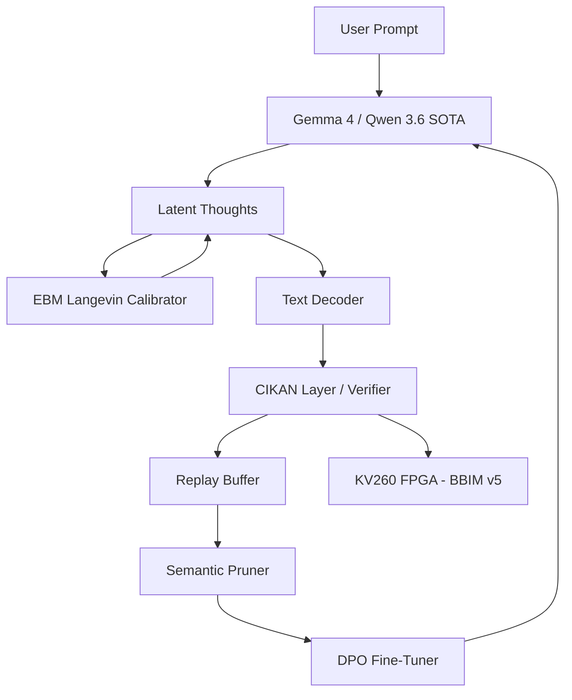

# Milestone 2026.05.140: Latent Reasoning CoT, Hardware Bounce-Bind Dynamics, and Continuous KAN Constraints

**Milestone ID:** `2026.05.140`  
**Status:** Active  
**Sequence:** 140  

## 1. What the Previous Milestone Proved (.139)
Milestone .139 ("Phase-16: Formal KAN Verification, EBM-Guided Reasoning, and Thermodynamic Denoising Simulation") successfully proved the viability of using energy scores for evaluating reasoning traces. 
- Partial-trace energy was implemented.
- A dataset of 2000 verified reasoning traces was generated.
- DPO training successfully adapted models based on reasoning traces.

## 2. Milestone .140 Objectives
This milestone addresses the three largest gaps in the current research:
1. **Dynamic Latent Constraints:** Expanding beyond rigid static rules to Energy-Based Model Chain-of-Thought (EBM-CoT), utilizing Langevin updates on hidden state embeddings (based on arXiv:2511.07124).
2. **Structural Continuous Self-Learning:** Mitigating the catastrophic forgetting in the FR-11 continuous replay loop via Semantic Pruning.
3. **Hardware-Accelerated Bounce-Bind Dynamics (BBIM):** Implementing Bounce-Bind Gibbs/Glauber dynamics to help our FPGA Ising models escape local minima in dense constraint graphs.

## 3. Architecture Diagram



## 4. Phase Descriptions

### Phase 1: EBM-CoT Latent Prototyping
We pivot from discrete step-level verification to continuous latent verification. By applying a pre-trained Energy scorer to calibrate the hidden state thought embeddings before decoding (via Langevin dynamics), we ensure logical consistency during generation.
- **Tasks:** Exp 1803 (Prototype), Exp 1810 (Full Benchmark), Exp 1811 (Early Exit Correlation).

### Phase 2: Constraint Informed KANs (CIKAN)
Expanding our KAN energy tiers. Rather than penalizing constraint violations externally, CIKANs embed them organically, proving utility via perfect symbolic equation extraction.
- **Tasks:** Exp 1804 (Design Layer), Exp 1808 (Symbolic Regression Evaluation).

### Phase 3: Hardware Acceleration & BBIM
Deploying the Bounce-Bind mechanism on the KV260 to overcome local minima convergence issues observed in dense graphs during .139.
- **Tasks:** Exp 1805 (RTL Design), Exp 1809 (Synthesis).

### Phase 4: Continuous Self-Learning Resilience
Stabilizing the continuous training loop (FR-11). The system will now discard structurally redundant constraints through Semantic Pruning, solving the interference issues with the replay buffer.
- **Tasks:** Exp 1806 (Semantic Pruning), Exp 1807 (E2E Loop Eval), Exp 1812 (Dual GPU).

## 5. Dependency Graph

```text
Exp 1803 (EBM-CoT) ---> Exp 1804 (CIKAN) ---> Exp 1808 (Symbolic Reg)
     |                     |
     v                     v
Exp 1810 (GSM8K Bench)  Exp 1811 (Early Exit)

Exp 1805 (BBIM RTL) ---> Exp 1809 (Synthesize)

Exp 1806 (Pruning) ---> Exp 1807 (Continuous Eval)

Exp 1812 (Dual GPU Verification) ---> Exp 1813 (Milestone Retro)
```

## 6. Hardware Requirements
- **Local SOTA Node:** Requires at least 64GB RAM to execute the `unsloth/Qwen3.6-35B-A3B-GGUF` model for EBM-CoT benchmarking.
- **Dual GPU Track:** Dual RTX 3090s via CUDA for the continuous self-learning pipeline and parallel EBM evaluations.
- **KV260 Board:** Required for synthesizing and potentially testing the BBIM v5 Verilog implementation. Vivado 2023.2 must be installed.