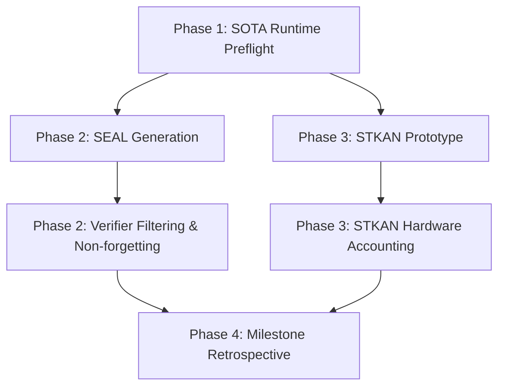

# Carnot Research Roadmap: v158

**Milestone:** 2026.05.158
**Title:** SEAL Self-Adaptive Learning, STKAN Continuous Evaluation, and Live SOTA Repair
**Date:** 2026-05-13

## 1. Executive Summary

Milestone `.157` demonstrated that our internal audit and retrospective pipelines are highly stable, but we faced terminal failures in executing complex multi-turn archive steps and integrating Tier 3 predictive verification, primarily due to CLI idle timeouts and HTTP/websocket instability in the simulated environment. Meanwhile, the literature on continuous self-learning has crystallized around Self-Adaptive Learning (SEAL) architectures (NeurIPS 2025), and Spatio-Temporal Kolmogorov-Arnold Networks (STKAN) (ICLR 2026) have established a strong baseline for modeling sequential data.

Milestone `.158` has three strategic objectives:
1.  **Infrastructure Rescue:** Repair the local SOTA GGUF runtime and bypass the timeout failures that blocked `.157`.
2.  **SEAL Continuous Learning (FR-11):** Implement a SEAL-style self-adaptive learning loop where the deterministic verifier stack acts as the reward filter for continuous memory growth, ensuring zero soundness mistakes.
3.  **STKAN Trajectory Verification:** Design a prototype Spatio-Temporal KAN (STKAN) tier to score sequential constraint reasoning traces, providing a Tier 4 verification mechanism for multi-step trajectories.

## 2. Architecture & Design Shifts

### SEAL Integration
Rather than relying solely on post-hoc error correction, Carnot will transition its Tier 2 continuous constraint memory to a SEAL-inspired self-adaptive learning loop. SOTA models will generate synthetic reasoning traces, the verifier will execute them, and valid traces will be added to the non-forgetting replay buffer to continuously update the policy.

### STKAN for Sequential Traces
Carnot's existing KAN implementations (QuantKAN) evaluate static, single-step constraints. STKAN introduces spatio-temporal decomposition, allowing Carnot to treat a multi-step reasoning plan (e.g., CoT steps) as a temporal sequence. The STKAN tier will evaluate the energy of the *entire sequence* transitioning through constraint states.

## 3. Phase Descriptions

### Phase 1: Infrastructure Rescue & Preflight (Tasks 1-3)
Focus on repairing the local SOTA GGUF runtime and avoiding the timeout/idle failures seen in the `.157` archive task. We will establish a robust live SOTA pipeline using the mandated `unsloth/Qwen3.6-35B-A3B-GGUF` and `unsloth/gemma-4-31B-it-GGUF` models.

### Phase 2: SEAL Continuous Self-Learning (FR-11) (Tasks 4-7)
Implement the core SEAL loop. We will generate synthetic traces, filter them through the Carnot verifier stack, and measure the continuous memory growth. We will enforce strict non-forgetting checks (zero soundness mistakes).

### Phase 3: STKAN Sequential Constraint Energy (Tasks 8-10)
Develop the Spatio-Temporal KAN prototype to evaluate multi-step reasoning traces. Run a bounded hardware accounting sweep on the STKAN design to estimate LUT/BOP requirements without making full FPGA execution claims.

### Phase 4: Retrospective & Synthesis (Tasks 11-13)
The standard milestone pre-retro audit, retrospective analysis, and roadmap archival steps.

## 4. Hardware Requirements
- **Local SOTA Runtime:** Dual RTX 3090 GPUs (for running 35B/31B GGUF models).
- **STKAN Accounting:** CPU only (no Vivado synthesis or KV260 board claims, purely estimating inference complexity).

## 5. Dependency Graph
