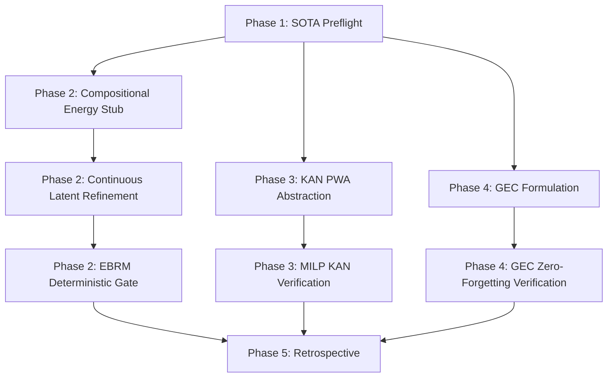

# Carnot Research Roadmap: v159

**Milestone:** 2026.05.159
**Title:** Continuous Latent EBRMs, Formal KAN Verification, and GEC Continual Learning
**Date:** 2026-05-13

## 1. Executive Summary

Milestone `.158` established the SEAL Self-Adaptive Learning loop and explored STKAN sequence evaluation, maintaining a strict zero-soundness-mistake environment. However, Carnot still relies heavily on discrete sequence scoring rather than true continuous-latent optimization, and our KAN layers lack formal mathematical verification.

Milestone `.159` shifts focus to three strategic objectives drawn from the latest 2025-2026 literature:
1.  **Compositional Energy & Continuous Latent Refinement:** Move beyond autoregressive generation to continuous latent reasoning. We will prototype Compositional Energy Minimization (PEM) to iteratively refine reasoning traces via energy gradients.
2.  **Formal KAN Verification (MILP):** Provide rigorous mathematical bounds for KAN tiers by implementing Piecewise Affine (PWA) abstractions and Mixed Integer Linear Programming (MILP) verification.
3.  **GEC Epsilon-Constraint Continual Learning (FR-11):** Upgrade the FR-11 continual learning policy buffer with Gradient-Guided Epsilon Constraints (GEC) to mathematically enforce non-forgetting during policy updates.

## 2. Architecture & Design Shifts

### Continuous Latent Space Optimization
Rather than treating constraints as a pass/fail filter for autoregressive generation, the system will use Continuous Latent Energy-Based Reasoning Models (EBRMs). Reasoning traces are embedded into a continuous latent space where sub-energy functions (Compositional Energy) guide local gradient-based edits, pushing the trace toward constraint satisfaction before decoding.

### Formal Verifiability of KANs
To ensure the Tier 3 and 4 KAN models are trustworthy, we will adopt the MILP abstraction paradigm (arXiv:2602.06737). KAN activations will be bounded by PWA envelopes, allowing deterministic solver oracles to mathematically guarantee the energy manifold.

## 3. Phase Descriptions

### Phase 1: Preflight & Baseline GGUF Runtime (Tasks 1-2)
Archive the previous milestone and verify the `llama.cpp` runtime for the mandated SOTA models (`unsloth/Qwen3.6-35B-A3B-GGUF` and `unsloth/gemma-4-31B-it-GGUF`).

### Phase 2: Compositional Energy and Latent EBRMs (Tasks 3-5)
Implement the Compositional Energy Minimization prototype. Map a constraint problem into separate sub-energies, perform gradient-descent refinement on continuous embeddings, and decode. Verify the outputs strictly with PySAT/Z3 to ensure zero false accepts.

### Phase 3: Formal KAN Verification (Tasks 6-7)
Implement PWA abstractions on existing toy KAN models. Compile the bounds into a MILP specification and use a solver to certify that energy bounds hold across input regions.

### Phase 4: GEC Epsilon-Constraint Continuous Learning (Tasks 8-9)
Introduce the Gradient-Guided Epsilon Constraint (GEC) method to the FR-11 SEAL loop. Update policy parameters by projecting gradients to respect the $\epsilon$-slack of historical memory samples, ensuring `nonforgetting_rate=1.0`.

### Phase 5: Synthesis & Retrospective (Tasks 10-11)
Conduct the pre-retro audit and final retrospective analysis for milestone `.159`.

## 4. Hardware Requirements
- **Local SOTA Runtime:** Dual RTX 3090 GPUs (for GGUF execution).
- **Formal Verification:** CPU-bound deterministic MILP solvers (PySAT, PuLP, or SciPy).

## 5. Dependency Graph
