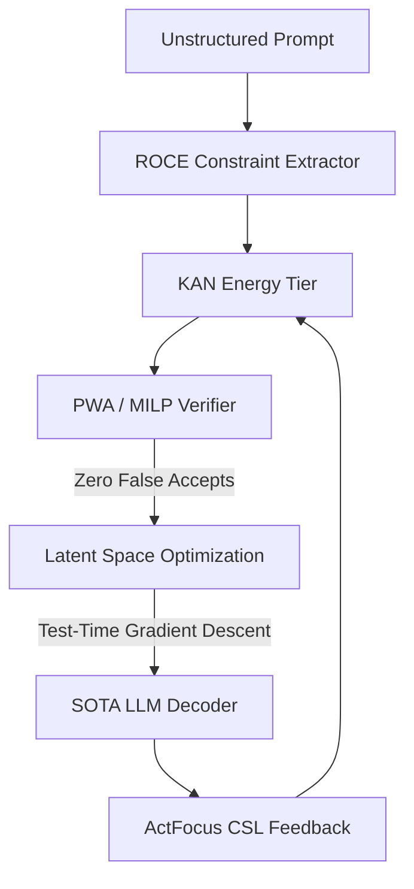

# Carnot Research Roadmap: Milestone 2026.05.205

**Title:** Continuous Latent Reasoning, KAN Formal Verification, and ActFocus Self-Learning
**Status:** DRAFT
**Author:** Research Planning Agent

## 1. Context and Retrospective
Milestone `.204` successfully consolidated the Phase 1 ship-track dashboard, completed the `.198-.203` audits after the Bash environment failure, and enforced citation sweep cadences. However, significant architectural gaps remain between Carnot's current state and its PRD vision, specifically around formal verification of energy tiers and continuous latent trajectory optimization (Kona parity).

### The Three Biggest Gaps
1. **Formal Verification of KANs:** While S2KAN and KANELÉ established the evaluation and hardware mapping for KANs, formal mathematical verification (PRD requirement for zero-false-accept guarantees) is missing.
2. **Continuous Latent Reasoning (Kona Parity):** We are still heavily dependent on discrete autoregressive token generation. Recent advances (EBRM, $\nabla$-Reasoner) demonstrate that test-time gradient descent in continuous latent space is viable and necessary for deep constraint satisfaction.
3. **Robust Continuous Self-Learning:** The FR-11 self-learning loop suffers from catastrophic forgetting. ActFocus (arXiv:2605.14558) provides a mechanism for token-level energy redistribution to solve the credit assignment problem in multi-turn reasoning.

## 2. Milestone Objectives (10-14 Experiments)

This milestone introduces 14 experiments spanning four phases to close these gaps.

### Phase 1: KAN Formal Verification (PWA Abstraction)
- Implement Piecewise Affine (PWA) abstractions for KAN units (arXiv:2602.06737).
- Encode KAN verification as a Mixed Integer Linear Program (MILP).
- Verify constraints strictly using Gurobi/Z3 under the PWA framework.

### Phase 2: Continuous Latent Reasoning ($\nabla$-Reasoner / EBRM)
- Build a prototype latent-space energy minimizer.
- Perform test-time gradient descent over $z_{1:T}$ continuous embeddings.
- Hook the continuous representation to the local SOTA GGUF models.

### Phase 3: ActFocus Continuous Self-Learning
- Implement ActFocus token-level energy redistribution.
- Integrate ActFocus into the FR-11 Continuous Self-Learning loop.
- Establish a "zero-forgetting" promotion gate for self-learned policies.

### Phase 4: SOTA E2E Integration and Retrospective
- End-to-end evaluation using `unsloth/Qwen3.6-35B-A3B-GGUF` and `unsloth/gemma-4-31B-it-GGUF`.
- Verify the zero-false-accept rate over the SATQuest/GSM8K benchmarks.
- Generate operational retrospective.

## 3. Architecture Changes

## 4. Hardware Requirements
- **Local SOTA Runtime:** Dual RTX 3090 (or similar local memory setup) to run the 31B/35B MoE GGUF models.
- **CPU/MILP Backend:** Standard multi-core CPU for Z3/PySAT/MILP formal verification tasks.

## 5. Execution Pre-requisites
- Local SOTA models cached.
- Z3 and PySAT installed.
