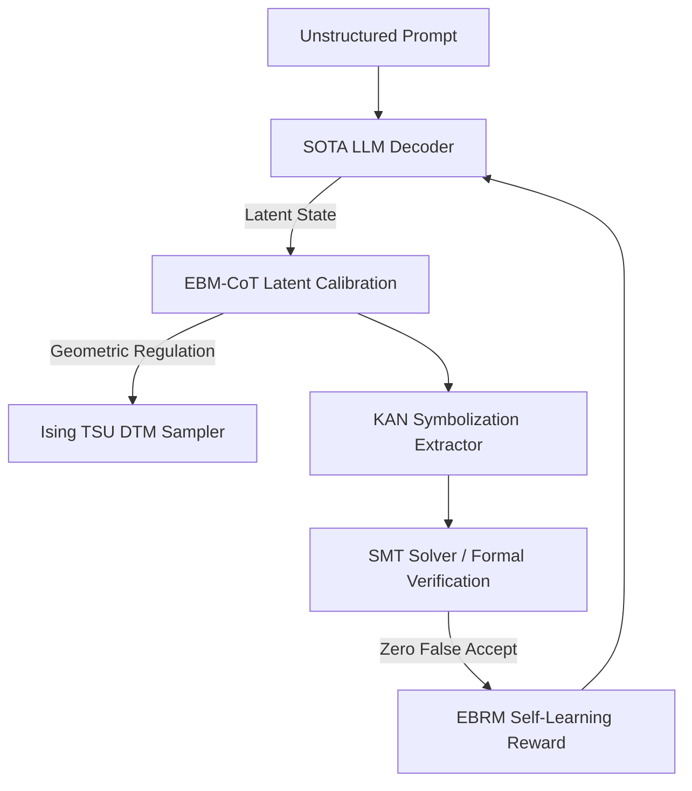

# Carnot Research Roadmap: Milestone 2026.05.206

**Title:** KAN Formal Verification, EBM-CoT Latent Calibration, and Thermodynamic Sampling
**Status:** DRAFT
**Author:** Research Planning Agent
**Date:** 2026-05-16

## 1. Context and Retrospective

Milestone `.205` made significant progress on continuous latent reasoning, KAN formal verification via PWA abstraction, and ActFocus self-learning. However, three critical gaps remain:
1. **Zero-False-Accept Formal Bounds:** PWA abstractions alone are insufficient; we must extract exact symbolic formulas from KANs (KAN4CBC) and integrate SMT-based solvers to formally guarantee safety.
2. **Mode Collapse in Latent Reasoning:** Continuous latent constraint hooks often result in generation mode collapse. Geometric Regulation (Ising) and EBM-CoT latent thought calibration are required to ensure robust generative coherence.
3. **Continuous Self-Learning Forgetting:** The FR-11 continuous self-learning engine needs non-forgetting reward stability, achievable via Energy-Based Reward Models (EBRM) and Extropic Denoising Thermodynamic Models (DTM) algorithms.

## 2. Milestone Objectives

This milestone designs 14 tasks to definitively close the verification gap, stabilize latent reasoning, and lock down the continuous self-learning policy.

### Phase 1: KAN Formal Verification
Move beyond piece-wise affine approximations to full symbolization and SMT formal verification (KAN4CBC), coupled with a simulator for KANELÉ LUT-based KV260 deployment accounting.

### Phase 2: Latent Space Reasoning & EBM-CoT
Calibrate continuous reasoning paths via EBM-CoT. Inject Geometric Regulation via an embedded Ising layer to rescue the trajectory from low-dimensional collapse, and simulate NRGPT gradient-based decoding.

### Phase 3: Continuous Self-Learning & Thermodynamic Sampling
Train a foundational Energy-Based Reward Model (EBRM) to stabilize self-learning feedback. Introduce Denoising Thermodynamic Models (DTM) compatible with Extropic TSUs to drastically improve sampling energy/latency efficiency.

### Phase 4: SOTA Integration & Retrospective
Wire the fully formalized KAN tiers and stable FR-11 loop to the local mandated SOTA GGUFs (`Qwen3.6-35B-A3B-GGUF` and `gemma-4-31B-it-GGUF`), complete end-to-end evaluations, and produce the operational retrospective.

## 3. Architecture Changes

## 4. Hardware Requirements
- **Local SOTA Runtime:** Dual RTX 3090.
- **CPU Backend:** Fast multi-core CPU for SMT solver (Z3).
- **FPGA Track:** (Simulation only) Hardware accounting for LUT deployment.

## 5. Dependency Graph
- Exp 2061 (KAN4CBC SMT) is gated on Exp 2060 (Symbolization).
- Exp 2064 (Geometric Regulation) is gated on Exp 2063 (EBM-CoT Latent Calibration).
- Exp 2068 (Extropic TSU DTM Parity) is gated on Exp 2067 (DTM Sim) and escalates to Opus for hardware integration.
- Exp 2070 and 2071 (SOTA integration) are heavily gated on upstream components.