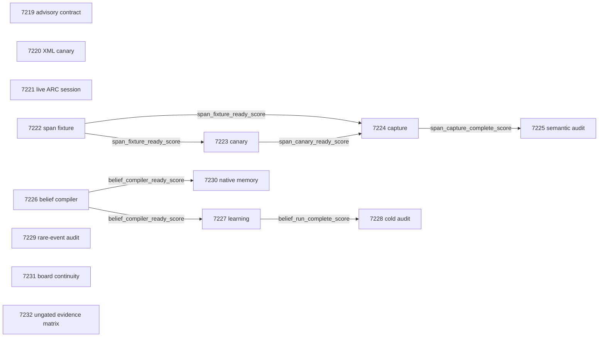

# Carnot Research Roadmap v636: Qualified Source Semantics and Lossless Learning

**Created:** 2026-09-11
**Milestone:** 2026.09.636
**Milestone title:** Qualified source semantics, lossless online constraint memory, and live tool evidence
**Status:** Planned; fourteen tasks, exp7219 through exp7232, in four phases.
**Supersedes:** V635 design for completed milestone 2026.09.635.
**Execution file:** `research-roadmap-next.yaml`; activation is left to the conductor.

## What V635 Proved

Task completion did not establish all scientific goals. This table reads the
actual artifacts, rather than interpreting conductor `OK` as positive science.
The completion archive still ends at V634; the active V635 roster, terminal
artifacts and conductor log establish the more recent outcomes.

| V635 evidence | Finding | Consequence |
|---|---|---|
| Exp7205 source contract | Fourteen contract rows were available, but validation failed on an invented prior-capstone module path. | Validate every existing path and both complete contracts before handoff. Keep this receipt advisory. |
| Exp7206/7207 ARC sessions; Exp7218 capstone | Seven unique induction receipts were reported, with no observed missing-tool demand. No useful-world-model or hidden-score gain was established. Some historical rows predate seed/receipt reducer repairs. | Continue the explicitly requested bounded volume collection using repaired current-session identity. Deduplicate authentic historical rows without rewriting them. |
| Exp7208 fixture; Exp7209 canary | CPU fixture execution took 1.148 seconds. Its unrecognized free-text substrate triggered a 60-second model floor. Exp7209 correctly refused the quarantine before inference. Capture and audit cascade-blocked. | Re-execute the fixture under the existing recognized CPU substrate and validate it; this repairs measurement availability, not model quality. |
| Exp7213 learning; Exp7214 audit | Learned commits affected later predictions and reduced future error versus frozen warmup. The random-query and false-accept CI gates failed. The full version-space comparator was about 9.83 percentage points more accurate than committed predicates. | Test a lossless representation of the stronger learner; retain full information and charge every delayed query/update. |
| Exp7215/7216 down-up sampler | Ninety finite transition cells passed; the joint quality/cost gate did not. Some occupancy probes had positive exact probability but no observed variation. | Diagnose rare-event observability from saved traces. Do not rerun or promote the failed throughput comparison. |
| Exp7217 native readiness | Real interpreter-bound PyO3 execution and state restore worked after rebuilding. No 10x result followed. KV260 graduation, GateMate physical block and PolarFire transcript uncertainty remained separate. | Use the working native recipe for a different lossless-memory core and recover missing board evidence within bounded scope. |
| Exp7218 capstone | Matrix complete; semantic evidence blocked, learning/mixing value null. | External branch absence is terminal `blocked`, never a retryable capstone `partial`. |

## Three Largest Gaps to the PRD Vision

1. **Faithful extraction and independently measured verifier value (FR-12).**
   Exact arithmetic or relation execution cannot repair a wrong representation.
   The next held-out measurement separates syntax, source fidelity, sufficiency
   and decision value, with failed outputs in the full denominator.
2. **Useful continuous learning at inference speed (FR-11).** A persistent
   memory can be causal yet inferior to an available predictor. Compile the
   entire surviving hypothesis set, preserve its decisions, and evaluate
   future error, false accepts, recurrence and total update cost separately.
3. **Live reasoning and deployable computation (FR-05/07/08, NFR-01).**
   Tool engagement, stationary finite kernels and successful native import
   are narrow capabilities. Live model validity, future-query utility and
   measured end-to-end deployment gains remain open.

## Research Inputs and Selection

The V636 refresh in `research-references.md` was written before this design.
It records dates, all eight arXiv topics and all six secondary channels,
including access failures. These are hypotheses and controls, not local results.

| Source | Task use | Boundary |
|---|---|---|
| [Symbolic grounding](https://arxiv.org/abs/2609.05025), [ChopChop](https://arxiv.org/abs/2509.00360), [premise sufficiency](https://arxiv.org/abs/2608.00585) | Exp7222–7225 recover the interrupted source-span experiment and test joint support. | Grammar and exact execution cannot certify source extraction. |
| [Compact constraint networks](https://journals.sagepub.com/doi/10.3233/FAIA250893) and [interactive refinement](https://arxiv.org/abs/2509.24489) | Exp7226–7228 and Exp7230 preserve a full hypothesis vote in compact memory. | Bitset compilation is a local adaptation, not the paper's template-learning algorithm. |
| [Memoir](https://arxiv.org/abs/2607.20792), from the EBT citation trail | Freeze prediction state; delayed feedback commits affect only later queries. | Its negative procedural recall finding motivates a control, not a universal theorem. |
| [Down-up sampling](https://arxiv.org/abs/2609.08873) | Exp7229 separates exact rare-event probability from an observed chain's ESS. | Finite-law correctness and IID reference calculations do not certify MCMC mixing. |
| [KANELÉ](https://arxiv.org/abs/2512.12850), [KAN-SAs](https://arxiv.org/abs/2512.00055), [Extropic Z1T](https://extropic.ai/writing/z1t) | Exp7230/7231 account for bounded table size, host transfers and device placement. | No KAN implementation or vendor speedup is claimed for bitset memory. |
| [vLLM tool calling](https://docs.vllm.ai/en/latest/features/tool_calling/), [GGUF plugin](https://docs.vllm.ai/en/latest/features/quantization/gguf/), [world-model tool use](https://arxiv.org/abs/2601.03905) | Exp7220 fulfils the new local parser directive; Exp7221 separates actual calls from model validity. | Documentation for Qwen3-Coder does not prove Qwen3.8 compatibility. Serving support is measured. |

EBT/ARM–EBM and the OpenReview ICLR records remain architecture references.
Semantic Scholar returned 35 EBT and eight ARM–EBM citation records, with no
next page; these are not exhaustive citation counts. Hugging Face verification
and GitHub weekly discovery were checked. Kona exposes no compatible local
runner on the checked page. MPMMine is retained for later external validation.
Retired external-text scorers, repair-stack variants, public-game re-solves,
ARC token-budget increases and unchanged GateMate physical probes stay closed.

## Architecture

```text
 public source + candidate          private evaluator authority
           |                                   |
 source-only / claim-only Qwen3.8 calls         |
           |                                   |
 bounded spans -> typed relations -> energy/unknown decision
           |                                   |
           +------ independent paired audit ---+

 fresh public event -> read-only hypothesis vote -> prediction receipt
                                                        |
 evaluator releases delayed feedback ------------------+
           |
 transactional survivor/vote update -> packed persistent memory
           |                                  |
       future queries                    Rust/PyO3 parity + costs

 Qwen3.8 GGUF -> vLLM XML canary (isolated serving experiment)
 Qwen3.8 GGUF -> existing llama.cpp -> LIVE E3AgentPolicy
                                         |
                              withheld-adapter session
                                         |
                   tool calls / valid models / banked progress

 saved Ising chains -> rare-event audit       attached-board receipts
                           \                       /
                        independent evidence matrix
```

No parser canary enables a new default. No learned energy supplies its own
hidden labels. CPU lookup and packed updates are the immediate learning path;
Rust SIMD and FPGA table/bit operations are possible acceleration paths with
explicit table-size and transfer costs. A 100x hardware gain is a target to
measure, not a property assumed in the design.

## Exact Task Contract

There are **14 tasks**, **exp7219 through exp7232**, in this exact order.
The table is the contract with the YAML. Gates refer only to earlier tasks in
this milestone. Every named gate field is in its producer's REQUIRED ARTIFACT
FIELDS, at top level. Titles and deliverable paths are literal contract values.

| Order | Task ID | Title | Deliverable | Structured gates |
|---|---|---|---|---|
| 1 | exp7219-source-contract | V636 source delta and exact execution contract | results/experiment_7219_v636_source_contract.json | None |
| 2 | exp7220-xml-canary | Bounded local vLLM Qwen3 XML tool-parser canary | results/experiment_7220_v636_xml_canary.json | None |
| 3 | exp7221-arc-session | Live ARC adapter-withheld cumulative discovery session | results/experiment_7221_v636_arc_session.json | None |
| 4 | exp7222-span-fixture | Recognized-substrate source-span fixture qualification | results/experiment_7222_v636_span_fixture.json | None |
| 5 | exp7223-span-canary | Bounded Qwen3.8 source-span semantic canary | results/experiment_7223_v636_span_canary.json | exp7222-span-fixture.span_fixture_ready_score == 1 |
| 6 | exp7224-span-capture | Qwen3.8 held-out source-span grounding measurement | results/experiment_7224_v636_span_capture.json | exp7222-span-fixture.span_fixture_ready_score == 1; exp7223-span-canary.span_canary_ready_score == 1 |
| 7 | exp7225-semantics-audit | Independent source fidelity and verifier-value audit | results/experiment_7225_v636_semantics_audit.json | exp7224-span-capture.span_capture_complete_score == 1 |
| 8 | exp7226-belief-compiler | Lossless hypothesis-memory compiler and fresh stream | results/experiment_7226_v636_belief_compiler.json | None |
| 9 | exp7227-belief-learning | Continuous self-learning with lossless delayed-feedback memory | results/experiment_7227_v636_belief_learning.json | exp7226-belief-compiler.belief_compiler_ready_score == 1 |
| 10 | exp7228-belief-cold-audit | Cold hypothesis-memory causality and rollback audit | results/experiment_7228_v636_belief_cold_audit.json | exp7227-belief-learning.belief_run_complete_score == 1 |
| 11 | exp7229-rare-event-audit | Fixed-cardinality rare-event observability audit | results/experiment_7229_v636_rare_event_audit.json | None |
| 12 | exp7230-native-belief | Native lossless constraint-memory parity and amortized cost | results/experiment_7230_v636_native_belief.json | exp7226-belief-compiler.belief_compiler_ready_score == 1 |
| 13 | exp7231-board-continuity | KV260 GateMate and PolarFire evidence continuity | results/experiment_7231_v636_board_continuity.json | None |
| 14 | exp7232-capstone | V636 independent evidence matrix and branch decisions | results/experiment_7232_v636_capstone.json | None |

## Phase 1: Qualified Execution and Live Evidence (Exp7219–7221)

Exp7219 checks the complete files, real validators, source deltas and existing
paths. It gates no science. Exp7220 is the separately queued local vLLM XML
canary: four tool-shaped prompts, 256 tokens each, bounded load and server
lifetime. It uses the mandatory GGUF; absent packages/tokenizer support block
honestly. The dated queue's AWQ suggestion does not override this request's
GGUF mandate. Exp7221 runs one fresh adapter-withheld r11l session through the
actual scored policy, using repaired current-session identity and raw receipts.
One or two new inductions are plausible within 3600 seconds; ten remains a
cumulative collection target. There is no new-solve, efficacy or submission claim.

## Phase 2: Source Fidelity and Verifier Value (Exp7222–7225)

Exp7222 reconstructs the interrupted fixture using a recognized CPU substrate
and unchanged artifact checks. It preserves the old quarantine and independent
source authority. Exp7223 uses eight calibration units and separate source/claim
calls. Its fixed readiness gate is at least seven parse-complete and six
semantically correct units, with clean provenance. No repeated tuning is planned.
Exp7224 measures 24 untouched base groups in four conditions, 96 total units,
with fixed per-arm budgets and a 2700-second capture deadline. It writes raw
checkpoints after each completion. Exp7225 independently compares direct,
syntax-only, exact-energy and shuffled-source controls. The primary comparator
is equal-budget direct-decision/self-consistency with a frozen tie-to-unknown
rule; one-shot direct decisions remain secondary. Gold extraction is an
upper bound only. The primary value gate requires positive lower paired CI95
for accuracy, nonpositive upper CI95 for false-accept change, causal source
controls and zero label leakage. Bootstrap bases, not correlated condition rows.
The small pilot cannot support broad model or benchmark claims.

## Phase 3: Lossless Continuous Constraint Learning (Exp7226–7228)

Exp7226 compiles the full hypothesis vote rather than only committing singleton
predicates. Supported-domain prediction, energy, query, tie and rollback
semantics must match the strong reference exactly. It freezes twenty fresh
1024-event streams, 128 warmup events each, with shared delayed-feedback and
128-query ceilings. Exp7227 evaluates frozen, full-reference, packed, old
committed and feedback-withheld arms. A prediction precedes label release.
Primary learning value requires lower future error, controlled false accepts,
recurrence retention and a causal memory effect. Zero packed/reference
mismatches are a separate implementation condition; parity is not superiority.
Exp7228 audits cold restore, hidden-future-label isolation and rollback even if
the primary learning result is null. No model weights or default pipeline change.

## Phase 4: Measured Deployment and Disposition (Exp7229–7232)

Exp7229 audits the old sampler's rare probes from authenticated saved chains;
it cannot rescue the old gate by dropping probes or assigning ESS to constants.
It records a fixed next measurement envelope or an infeasibility decision.
Exp7230 ports only the packed memory core through PyO3, reusing the now-working
interpreter recipe. It checks exact semantics before comparing full boundary
costs for single queries and batches of 32 and 256. Positive speed requires a
paired lower CI95 above one; NFR-01's 10x target is reported separately.
This runs on compiler readiness even when the learning value is null.
Exp7231 records all attached-board states. It preserves KV260 graduation,
issues no unchanged-state GateMate operations and makes one bounded existing
PolarFire CPU dispatch attempt to recover the missing raw transcript.
Exp7232 independently recomputes claims, retains every blocked/null branch and
writes concrete continue/retire/changed-prerequisite decisions.

## Dependency Graph

Solid arrows below are the exact structured field gates. Dotted inputs in prose
are historical evidence or independent optional evidence, never hidden gates.



The capstone reads all fourteen task dispositions without structured gates.
Historical Exp7208/7209/7210/7211 and prior nulls are diagnosis only, never
`requires:` dependencies. Consumers separately reject quarantined artifacts;
the field gate reader alone does not establish authenticity. Every comparative
task has `per_unit_rows: true`. Every prior-failure entry names the real verdict,
what changed and `retire_if_same_verdict: true`. No retired ID is reused.

## Hardware and Runtime Requirements

| Work | Hardware and memory | Budget and requirement |
|---|---|---|
| Exp7220 serving canary | One idle task-owned RTX 3090 on GPU 1; Qwen3.8 Q4_K_M roughly 16 GB plus measured KV headroom; installed vLLM/plugin | 40-minute estimate; 600-second load deadline; at most 1200-second server lifetime. Block on unavailable prerequisite, no install campaign. |
| Exp7221 live session | One idle task-owned RTX 3090; existing native llama.cpp and validated KV allocation | 75-minute estimate; 3600-second session, 2400-second induction cap, 4096 completion tokens. |
| Exp7223/7224 extraction | One idle task-owned RTX 3090; same mandated GGUF; embedded native chat template | 25/65-minute estimates; 1500/2700-second model deadlines respectively. |
| Fixture, learning, audits | CPU and system RAM; finite hypothesis tables and raw/checkpoint disk | 20–45-minute estimates; compact tables and twenty fixed streams, no GPU dependency. |
| Exp7230 native core | CPU, Rust/PyO3 toolchain tied to executing interpreter | 50-minute estimate; 300-second measured timing cap, scoped build. |
| Exp7231 boards | KV260 SSH, unchanged GateMate physical receipt, PolarFire SSH/installed workload | 35-minute estimate; no GateMate operations; one PolarFire smoke <=60 seconds after <=10-second connect. |

The host inventory is two RTX 3090s (48 GB total) and CPU/system memory.
Every run must recheck actual occupancy and ownership. The GPUs are not a
single unrestricted pool: GPU 1's parser trial follows the explicit queue and
must acquire its own lease. No task needs simultaneous model families.
The RX 7900/NPU wishlist has stale blockers and supplies no guaranteed compute.
Extropic Z1 is not an attached execution target. No purchase, vendor contact,
external upload or publication is part of this milestone.

Every prompt requires a flushed line at every phase boundary and before/after
long calls, plus at least 60-second loop/heartbeat updates. Keep every output
gap below 600 seconds, including during source authoring and validation.
Estimates do not change the 4800-second hard cap. No artificial progress or
sleep-to-floor is allowed. `model_full_generation` is reserved for real corpus
or agent generation (60-second floor), `model_bounded_generation` for both
canaries (10-second floor), and load-only work uses `model_load_no_generation`
(2-second floor). CPU work uses the exact recognized CPU substrate and class;
aggregation uses its recognized alias. Executed scope overrides intended scope.

## Verification and Stop Rules

Implementation work must first add a driving REQ and meaningful failing tests.
Use scoped unit/coverage, lint, type and spec checks. Future experiment prompts
require applicable E2E-007 learning rollback, E2E-003/004 binding/serialization,
E2E-009/010 ARC transport plus the real LLM-off environment smoke, and full
source input-to-executor-to-independent-label checks. Preserve every failure.

For this planning-only change, run existing roadmap schema/gate/path tests,
activation lints, scoped spec traceability, independent Markdown/YAML parity and
a temporary file-to-real-gate-evaluator E2E check. No implementation behavior or
model/board experiment is claimed as tested during planning. Record check output
in `/tmp`; reconcile the plan in `_bmad/traceability.md`, `ops/status.md` and
`ops/changelog.md`. The active YAML and conductor source remain unchanged.

Positive infrastructure is not scientific value. Exact authority reused as a
verifier requires `circular_positive`. Completed measured failure is `null`;
external missing, gate-blocked or retired input is terminal `blocked` with the
exact `gate_check_summary`; only unfinished own work is `partial`. New results
never overwrite old terminal evidence. The final matrix stays useful if a
branch stops early, and names the changed prerequisite needed before any rerun.
