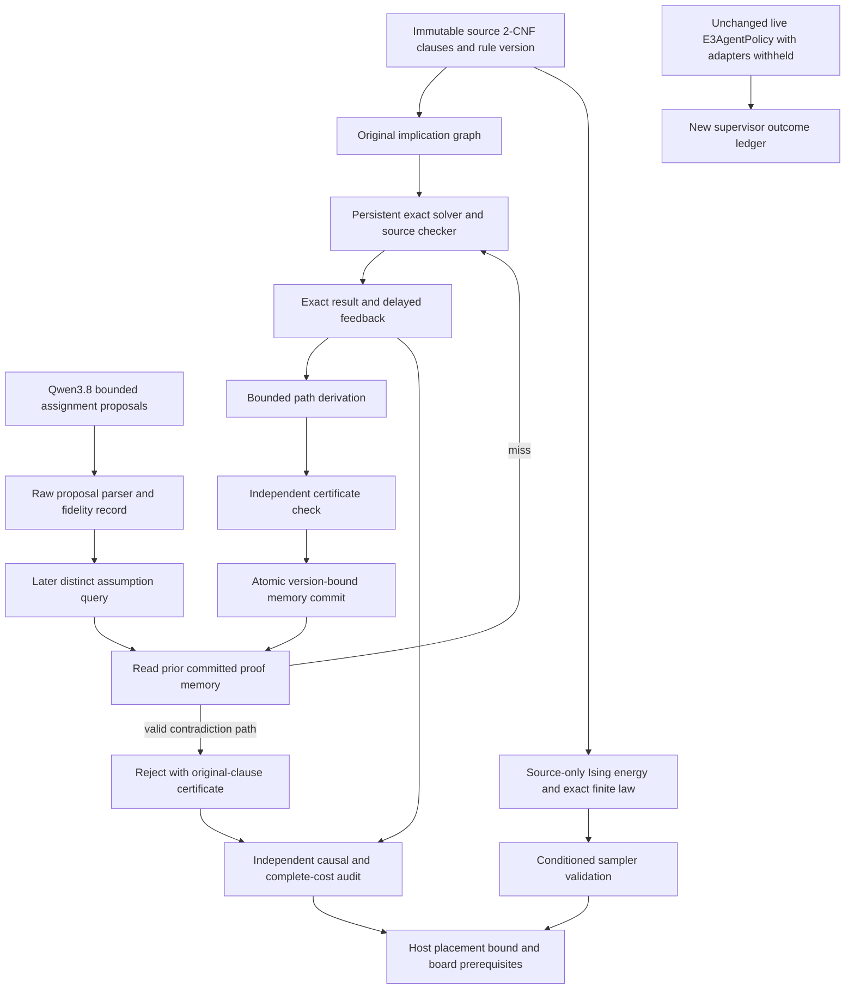
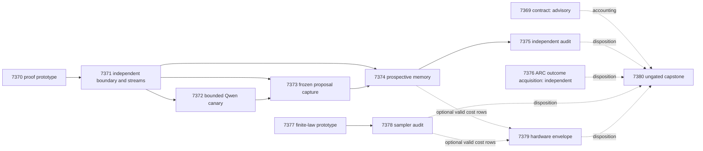

# Carnot Research Roadmap V647: Proof-carrying constraint memory, live generalization evidence, and faithful Ising laws

**Created:** 2026-09-17 UTC
**Milestone:** 2026.09.647
**Status:** Planned, not activated or executed
**Supersedes:** completed milestone 2026.09.646 (exp7357 through exp7368)
**Informed by:** V646 raw artifacts, PRD FR-11/FR-12, and the dated V647 literature scan

The next milestone contains **12 tasks, exp7369 through exp7380**, in the exact
order below. This document and `research-roadmap-next.yaml` are the two task
contract authorities. The active roadmap is unchanged. The stale V645 document
that V646 used is preserved verbatim in
[research-roadmap-v645-preserved-20260917.md](research-roadmap-v645-preserved-20260917.md).
There is one active task table here. Historical designs cannot add task rows.

## What V646 Proved

Completion of a milestone means its tasks reached dispositions. It does not
mean every experiment passed. Direct artifact evidence takes priority over
an `OK` marker in an archive or a prose summary.

| Evidence | Result | Consequence for V647 |
|---|---|---|
| Exp7357 contract | V646 YAML was compared with a V645 Markdown milestone; contract disqualified. | Rewrite both authorities now; compare titles, IDs, order, paths, phases, classes and gates before activation. |
| Exp7358 validation and Exp7359 reducer | Validation-contract and accounting readiness passed; scientific value remained zero. | Reuse their scoped execution and reduction. Do not spend another milestone rebuilding them. |
| Exp7360 safety fixture | Safety/readiness 1, learning value unmeasured. | Safety is necessary and cannot stand in for useful learning. |
| Exp7361 Qwen capture | 128 public-fidelity proposals; the capstone reports six executor-valid proposals. Verdict circular_positive; promotion 0. | The native Qwen path exists. Parser/fidelity counts and actual constraint validity are separate. |
| Exp7362 prospective learning | Disqualified. Required names included an unexecuted `full_python_suite`; scoped checks passed. Also zero erasure witnesses, maximum query-ratio upper bound 0.9205046796 and complete-cost upper bound 74.7622766097. | Fixing validation would not make the science useful. Retain its disposition and change the constraint representation. |
| Exp7363 learning audit | Pre-gated on capture completeness 0; same-input audit scope retired. | Audit only new eligible evidence; let valid null measurements reach the auditor. |
| Exp7364 acquisition adjudication | Preserved prior disqualification and complete-cost upper bound 0.9652615826 against required <0.90. | Do not repeat unchanged Boolean schedule acquisition. |
| Exp7365 / Exp7366 supervisor | Supported-decision count 0; fitted-selector live trial skipped. | Collect new baseline outcomes without fitting an unsupported selector. |
| Exp7367 boards / Exp7368 capstone | GateMate physical change absent; twelve dispositions accounted, required learning science unavailable. | Preserve board state without probing; classify unavailable required work as blocked, not partial. |

These figures are diagnostic historical observations, not new V647 results.
Sources are the corresponding `results/experiment_7357_v646_contract.json`
through `results/experiment_7368_v646_capstone.json`, including canonical
`results/experiment_7363_learning_audit.json` and
`results/experiment_7366_supervisor_live.json` pre-gate records.

## Three Largest Gaps to the PRD

1. **A valid constraint is not necessarily a faithful request interpretation
   (FR-12).** Source-fidelity, formal satisfaction and useful verification have
   been conflated. V647 starts from explicit public formal clauses and records
   raw proposal transcription separately. It can prove a narrow formal claim;
   open-ended natural-language grounding remains an explicit gap.
2. **Stored constraints have not shown causal, affordable future benefit
   (FR-11).** The last prospective result has no individual structural witness.
   V647 learns source-checkable implication paths after feedback, tests later
   different assumptions, and compares with persistent exact solvers and graph
   caching. A memory write or a synthetic fixture is not a learning result.
3. **Research mechanisms lack demonstrated live utility and complete-cost
   acceleration (FR-07, FR-12, NFR-01).** ARC adaptation lacks supported
   outcomes; extra energy terms can silently change an Ising target law; prior
   native tenfold gates failed. V647 collects live action evidence, measures
   conditional finite laws and bounds hardware value from measured costs.

## Research Inputs and Scope Change

The literature was filed in `research-references.md`, section
`2026-09-17 — V647 planning literature delta`, before this design was written.

- [Parameterized logical problems](https://arxiv.org/abs/2602.12665) supply
  controlled contradiction, backbone, bridge and renaming axes. Their use in
  a prospective memory study is a Carnot hypothesis, not a reported paper result.
- [ChopChop](https://arxiv.org/html/2509.00360v1) motivates semantic feasibility
  of a partial structure. V647 uses finite source proofs after proposal
  generation; it does not implement or claim token-level constrained decoding.
- [No Free Checker](https://arxiv.org/abs/2609.09250) motivates explicit
  verifier authority and credible comparator controls.
- [T-Oracle/FastCA](https://arxiv.org/abs/2609.12267) motivates separating
  candidate acquisition from the authority that admits it. V647 uses exact
  clause paths, not a learned oracle.
- EBT, ARM–EBM, KAN-CL and Extropic Z1T remain documented context. They do not
  justify foundation-model training, a new text ranker or an unavailable
  hardware benchmark. The reference ledger records all requested source
  checks, including the Semantic Scholar 429 and OpenReview browser challenge.

The main change is **proof-carrying derived constraints over public formulas**.
It replaces hidden-schedule atom induction, not merely its task name or corpus
size. The memory contains a derived implication plus original-clause witnesses.
It can cheaply reject an inconsistent assumption set. It cannot certify a SAT
answer, modify the source rules or learn a universal rule from one rejection.
Correctness remains oracle-defined; useful results are `circular_positive`.
General verifier superiority remains unproved.

## Architecture

Formal source authority, learned memory and evaluation labels are separate
records. Every arm receives the same source formula. Prediction cannot see
future feedback. Proof checking uses original edges, so cached consequences
cannot recursively certify one another. New energy terms never enter the
finite-temperature target unnoticed.

## Exact Task Contract

There are **12 tasks**, **exp7369 through exp7380**, in this exact conductor
order. Every listed task has a JSON deliverable and an executable entrypoint
in its YAML prompt. All score gates also require an eligible terminal class
and `flagged_adversarial == false`. Contract, ARC acquisition, hardware and
capstone tasks are independent of the main science chain where shown.

| Order | Task ID | Exact title | Deliverable | Phase | Substrate class | Structured gate |
|---|---|---|---|---|---|---|
| 1 | exp7369-contract | Bind V647 literature and the exact twelve-task contract | results/experiment_7369_v647_contract.json | 1 | aggregation | None |
| 2 | exp7370-proof-memory | Prototype versioned implication proofs for later constraint queries | results/experiment_7370_v647_proof_memory.json | 1 | cpu_exact_solver_or_simulator | None |
| 3 | exp7371-proof-boundary | Attack proof authority and seal prospective formula streams | results/experiment_7371_v647_proof_boundary.json | 1 | cpu_exact_solver_or_simulator | exp7370-proof-memory.proof_fixture_ready_score == 1; exp7370-proof-memory.verdict_class in ["positive", "circular_positive", "null"]; exp7370-proof-memory.flagged_adversarial == false |
| 4 | exp7372-qwen-canary | Qualify bounded Qwen3.8 assignment proposals | results/experiment_7372_v647_qwen_canary.json | 2 | model_bounded_generation | exp7371-proof-boundary.proof_boundary_ready_score == 1; exp7371-proof-boundary.verdict_class in ["positive", "circular_positive", "null"]; exp7371-proof-boundary.flagged_adversarial == false |
| 5 | exp7373-proposal-capture | Capture frozen Qwen3.8 proposals for distinct logical requests | results/experiment_7373_v647_proposal_capture.json | 2 | model_bounded_generation | exp7371-proof-boundary.proof_boundary_ready_score == 1; exp7371-proof-boundary.verdict_class in ["positive", "circular_positive", "null"]; exp7371-proof-boundary.flagged_adversarial == false; exp7372-qwen-canary.qwen_assignment_transport_ready_score == 1; exp7372-qwen-canary.verdict_class in ["positive", "circular_positive", "null"]; exp7372-qwen-canary.flagged_adversarial == false |
| 6 | exp7374-prospective-memory | Measure continuous learning from certified implication paths | results/experiment_7374_v647_prospective_memory.json | 2 | cpu_exact_solver_or_simulator | exp7371-proof-boundary.proof_boundary_ready_score == 1; exp7371-proof-boundary.verdict_class in ["positive", "circular_positive", "null"]; exp7371-proof-boundary.flagged_adversarial == false; exp7373-proposal-capture.candidate_capture_complete_score == 1; exp7373-proposal-capture.verdict_class in ["positive", "circular_positive", "null"]; exp7373-proposal-capture.flagged_adversarial == false |
| 7 | exp7375-memory-audit | Independently reduce proof-memory causality and cost | results/experiment_7375_v647_memory_audit.json | 2 | aggregation | exp7374-prospective-memory.proof_learning_capture_complete_score == 1; exp7374-prospective-memory.verdict_class in ["positive", "circular_positive", "null"]; exp7374-prospective-memory.flagged_adversarial == false |
| 8 | exp7376-arc-outcomes | Collect new adapter-withheld ARC supervisor outcomes | results/experiment_7376_v647_arc_outcomes.json | 3 | model_bounded_generation | None |
| 9 | exp7377-ising-law | Compile original-clause Boltzmann laws with entailment controls | results/experiment_7377_v647_ising_law.json | 3 | cpu_exact_solver_or_simulator | None |
| 10 | exp7378-ising-audit | Validate Boltzmann marginals under cached entailment | results/experiment_7378_v647_ising_audit.json | 3 | cpu_exact_solver_or_simulator | exp7377-ising-law.law_fixture_ready_score == 1; exp7377-ising-law.verdict_class in ["positive", "circular_positive", "null"]; exp7377-ising-law.flagged_adversarial == false |
| 11 | exp7379-hardware-envelope | Bound proof-memory placement and preserve board prerequisites | results/experiment_7379_v647_hardware_envelope.json | 4 | aggregation | None |
| 12 | exp7380-capstone | Reconcile twelve outcomes and decide proof-memory continuation | results/experiment_7380_v647_capstone.json | 4 | aggregation | None |

## Phase 1 — A Sound Representation and a Frozen Test

Exp7369 checks the current authorities and ingests the research delta. It is
advisory. Exp7370 implements a bounded proof memory with a development erasure
witness. Exp7371 independently attacks it and freezes all streams, controls,
counts and thresholds. This phase has a runnable prototype, measured safety
criteria and an adversarial boundary before model work begins.

The memory stores at most 128 paths and 64 KiB, with at most eight derived
paths per feedback event. An implication path has at most 2n original edges.
A changed source hash invalidates its proof. Repeated requests alone cannot
satisfy the learning witness. Unsupported renaming transfer must abstain.

## Phase 2 — Live Proposals and Prospective Self-Learning

Exp7372 runs four development canary calls. Exp7373 captures 32 frozen
requests with two proposals each; every malformed or truncated response stays
in the record. Exp7374 uses these sealed bytes plus 32 synthetic streams,
without additional LLM inference. Each synthetic stream has 24 requests across warm-up,
future, recurrence and version-change segments. The live cohort has eight
independent, disjoint formula streams with four requests each: one warm-up,
two future requests and one version change. Each prompt requests a partial
assignment of two to four literals. A frozen label-blind rule selects the first
schema-valid proposal; both model calls count toward cost. No state crosses
from synthetic to live arms. Exp7375 independently reduces
raw evidence even when a complete measurement is null.

The five controls are reset exact solving, persistent incremental solving,
persistent reachability caching, proof memory, and matched-size non-applicable
proof memory. Complete service time includes building, checking, committing,
serialization, final source checks and equally allocated model costs. Do not
handicap the persistent solver by rebuilding it on every query.

The fixed value gate requires zero invalid SAT answers, false proof rejections
or stale-version decisions; no loss of exact decision coverage or valid utility;
at least eight individual erasure witnesses across four streams; a paired
95% upper bound <0.90 on paid-query ratio and <=1.0 on complete-service cost
against both persistent baselines. The bootstrap uses 10000 draws and seed
7371307, clustered by formula family for synthetic data and by independent
formula stream for live data. Synthetic and live cohorts pass separately; one cannot rescue the
other. The small live cohort is exploratory. Oracle-defined truth forbids a
`positive` class. No result automatically enables the memory in production.

## Phase 3 — Live Generalization and Faithful Energy

Exp7376 gathers six NEW adapter-withheld live ARC episodes with the unchanged
curated supervisor. It changes the evidence supply rather than tuning an arm
without support. No firings is an honest null. Three development games and
ten observed decisions per arm remain the support threshold. No offline
counterfactual is invented and no arm priority changes in this milestone.

Exp7377 creates a finite-law prototype. It compares source-only energy,
intentionally appended implied clauses and proof-assisted source-only energy.
A satisfying set can remain unchanged while its finite-temperature law changes.
Exp7378 tests the shipped sampler against exact enumeration with fixed chain
budgets. Energy residual <=1e-12 and exact TV <=1e-10 apply to source-law
preservation; empirical observable error <=0.05 and ESS>=1000 qualify samples.
Every failed cell is retained. These tasks use CPU computation, not TSU/FPGA
measurements, and introduce no new tempering method.

## Phase 4 — Deployment Bound and Research Decision

Exp7379 retains authenticated KV260, GateMate and PolarFire dispositions and
uses eligible new cost rows to bound placement value. It performs no board
operation. An unchanged GateMate physical block is expected and cannot block
the other research. Exp7380 always accounts for all twelve tasks, including
pre-gated tasks and itself. Missing required science is terminal blocked;
failed required validation is disqualified; completed no-benefit science is null.

The canonical publication check remains `scripts/publication_gate.py --json`:
G1 headline measured, G2 independently reproduced, G3 prose narrowing-clean,
G4 numbers trace to artifacts. Its legacy FoVer scope cannot certify V647.
The milestone authorizes no external publication, push or policy promotion.

## Dependency Graph

Solid edges are the literal YAML structured gates. Dotted edges are evidence
accounting and never suppress a task. No `requires:` or gate names a retired
upstream experiment. Every consumed scalar is spelled identically in its
producer's REQUIRED ARTIFACT FIELDS. The audit gates on capture completeness,
not on a positive efficacy verdict.

## Hardware Requirements and Runtime Budgets

| Work | Available compute | Budget and constraint |
|---|---|---|
| Proof prototype, independent checks and prospective stream | Host CPU and system memory | 8–32 Boolean variables; bounded 64 KiB memory; 20–35 minute task estimates. Hardware path is sparse integer/bit operations, with complete-cost measurement before a port. |
| Qwen canary and capture | Cached unsloth/Qwen3.8-27B-GGUF, about 16 GB; an owned RTX 3090 CUDA slot | Four 128-token canary calls; 64 256-token proposal calls; 2400-second capture-work limit. One instance, no assumed second-GPU availability. |
| ARC acquisition | Same mandated GGUF and owned native runtime | Three games times two seeds; 128 actions and two 256-token calls per episode; 1800-second work limit. |
| Finite laws and sampling | CPU; existing Python/JAX and Rust check harness where applicable | n<=12 exact enumeration; 24 formulas, three beta values, four chains per condition, 1000 warm-up + 4000 retained samples. |
| KV260 | Historical fabric graduation retained | No fresh availability/speed claim. Future access remains SSH-only; preserve k_max<=5 architecture. |
| PolarFire | Historical hash-matched CPU dispatch retained | CPU execution is not FPGA sampling; no new integration. |
| GateMate | Physical changed-state receipt still absent | No USB/JTAG/flash retry. Name the exact missing operator receipt after Exp6559. |
| Extropic/NPU/other wishlist hardware | Vendor or blocked future path | No local access assumed, acquisition authorized or performance claimed. |

A 100x complete-service speedup needs an unaccelerated fraction <=0.01 even
with an infinitely fast accelerator. V647 tests that necessary condition from
measured rows; it does not promise the target. Existing native 10x nulls remain.

All actual LLM tasks declare `model_bounded_generation` (10-second floor).
None uses a small legacy smoke model for headline results. `model_full_generation`
(60 seconds) is reserved for real full generation and `model_load_no_generation`
(2 seconds) for load/embedding work; neither describes these bounded calls.
Host tasks declare `cpu_exact_solver_or_simulator` or `aggregation` truthfully.
No task sleeps to reach a duration floor.

Each prompt has a NUMBERED progress step: flush at every phase boundary and
before/after every model load, generation, benchmark and subprocess; print
inside loops and while blocking calls are pending at least every 60 seconds.
Every silence gap must remain below 600 seconds. The 4800-second hard cap is
not reachable reliably without progress after the first 1200 seconds. Reserve
validation time, checkpoint completed units, and cancel only owned work.

## Rerun Discipline, Validation and Reconciliation

Prior-failure blocks name exact recorded verdicts, changed prerequisites or
mechanisms and `retire_if_same_verdict: true`. No operator override is invented.
The retired Exp7363 scope is an audit of disqualified Exp7362; the new auditor
consumes only eligible Exp7374 proof-memory evidence. The Boolean schedule
acquisition, PHASE D text scorer, unsupported fitted supervisor and unchanged
hardware bring-up are not re-proposed.

The experiment validation plan comes from shipped Exp7358/Exp7303 helpers.
Required command names must match commands actually executed. A global suite
requirement cannot be silently appended, deleted after failure or relabeled
as a passed check. Scoped affected tests, full changed-module coverage, Ruff,
mypy, spec coverage, relevant E2E, cold reduction and adversarial/row checks
remain required. Unrelated whole-repository health is recorded separately.

All changes follow spec, failing test, implementation, verification and doc
reconciliation. New requirements belong in existing relevant capabilities
before code changes: continuous-learning, constraint-verification, Ising,
samplers, ARC trust-energy and research-reporting. This planning change does
not mark those future requirements implemented. For ARC, E2E-009/010 and the
actual bounded scored-policy episodes apply; for sampling, E2E-002 applies.
Other isolated experiment tasks use their real entrypoint and cold replay.
No new Rust/PyO3 behavior is planned, so E2E-003/004 are not claimed.

Planning verification uses the repository roadmap schema/prior-failure,
exclusion and gate audits, independent Markdown/YAML parsers, mutation checks,
focused validator tests and scoped spec coverage. There is no applicable
model/board E2E to execute for a documentation-only plan. The future checks
above are requirements, not results. Reconcile `_bmad/traceability.md`,
`ops/status.md` and `ops/changelog.md` as staged planning, not completed science.
