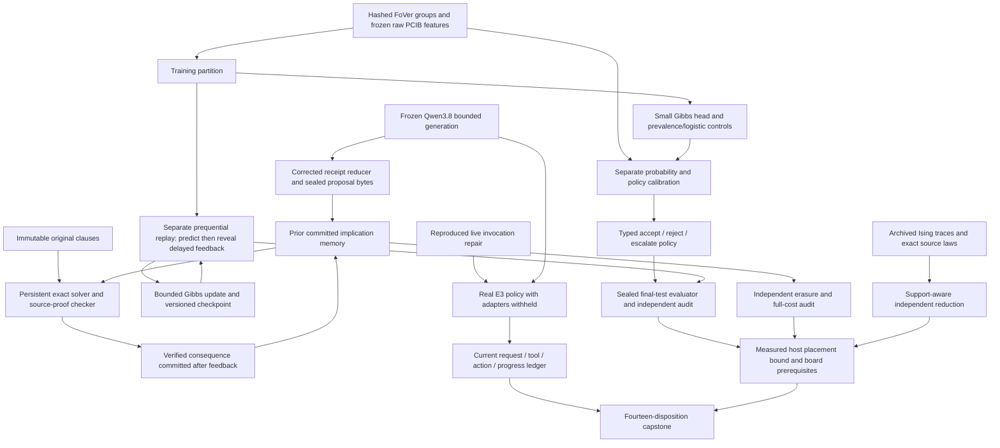
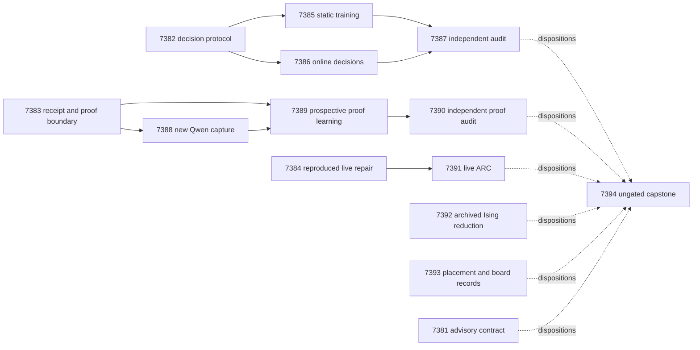

# Research Roadmap V648 — Calibrated Decisions and Prospective Learning

**Milestone:** `2026.09.648`
**Title:** Calibrated energy decisions, prospective proof memory, and reachable live feedback
**Status:** Proposed; staged, not activated or executed
**Planning date:** 2026-09-18
**Predecessor:** `2026.09.647` (exp7369–exp7380, all terminal)
**Execution authority:** `research-roadmap-next.yaml` until activation; then only the active YAML with this exact milestone

## Research Objective

Train and independently measure a small energy-based accept/reject/escalate
policy, test whether verified feedback improves later decisions, and finish the
prospective proof-memory measurement that V647 never reached. An independent
ARC branch must diagnose its missing first action before another live run.
Archived Ising traces and current cost rows support bounded placement analysis.
No foundation-model training, production promotion or hardware bring-up is
implied by a successful prototype.

This follows the calibrated-decision training floor added to CLAUDE.md on
2026-09-18, the ARC generalization floor, and research-program.md priorities.
The existing 17-parameter Gibbs head supplies the trainable mechanism. The
mandated `unsloth/Qwen3.8-27B-GGUF` generator remains frozen. A typed policy is
judged on proper scores and the risk/coverage of its complete behavior, not
AUROC alone or the presence of a confidence number.

## What V647 Proved and What It Did Not

- Exp7369 bound a matching twelve-task plan. Exp7370 and Exp7371 produced a
  versioned implication-proof fixture and attacked its source boundary. Their
  readiness did not establish learning value.
- Exp7372 made four usable real Qwen calls, but its receipt was disqualified:
  `4 == 3` was used instead of `4 >= 3`, promotion was required despite being
  prohibited, the execution venue was a dictionary, and oracle-defined work
  was called positive. The independent validator also found readiness
  disagreement. Keep its original artifact and quarantine intact.
- Exp7373 was blocked; Exp7374 and Exp7375 were pre-gated before producing
  their scheduled JSON files. No prospective proof-memory gain or audit ran.
  Absence of those files is evidence of missing measurement, not a scientific
  null and not permission to invent a producer.
- Exp7376 recorded one load and zero generation calls or environment actions.
  Six rows were censored at the 1800-second aggregate budget. The cause before
  first action remains undiagnosed; the coverage subprocess also reported no
  data. Its disqualified outcome cannot train a supervisor.
- Exp7377 established exact finite source-law fixtures. Exp7378 preserved
  sample evidence but failed venue validation (`host_cpu` is not the closed
  `host` value) and had eighteen empty-support cells. Original all-cell gates
  remain failed. A source law with no zero-energy assignment is not, by that
  fact, an empty finite-temperature distribution.
- Exp7379 retained dated KV260 fabric and PolarFire CPU-dispatch evidence;
  GateMate still lacked an operator-authored changed physical state after
  Exp6559. Exp7380 accounted for all twelve tasks but remained disqualified
  because required producer validation and science were missing.

The planning snapshot's research-complete.yaml ends at V646. V647 terminal
artifacts and conductor pre-gate records therefore supply the latest evidence;
ledger lag does not reopen completed experiments. The old design is preserved
byte-for-byte at `research-roadmap-v647-preserved-20260918.md` in this directory.

## Three Biggest Gaps to the PRD

1. **Verifier signals do not yet establish calibrated decisions (FR-12).**
   The new REQ-AUTO-018 benchmark uses PCIB features and NCE, with AUROC-based
   admission and Brier reporting. No measured typed selection policy has yet
   beaten prevalence and logistic controls. Its 6,548-row archive has only
   114 incorrect labels; comparing with probability 0.5 would be misleading.
   V648 freezes disjoint calibration roles, corrects NCE's changed class prior,
   and measures the whole accept/reject/escalate policy.
2. **Persistent state does not yet show causal future benefit (FR-11).**
   V646 lacked an individual structural witness, and V647's proof experiment
   never ran. V648 measures both delayed-label Gibbs updates and later-query
   source-checkable proof reuse. Prediction precedes feedback; erasure,
   frozen/no-feedback controls and strong persistent baselines test causality.
3. **Mechanisms lack reachable live utility and complete-cost evidence
   (FR-07, FR-12, NFR-01).** V647's ARC path never acted, finite-law evidence
   mixed undefined support and sampler quality, and hardware remains constrained
   by physical prerequisites. V648 diagnoses the live invocation boundary,
   then measures adapter-withheld behavior; it separately audits frozen laws
   and estimates placement from authentic complete-service costs.

## Research Inputs and Selection

The source review was appended to research-references.md before experiment
design, under `2026-09-18 — V648 planning source review`. These are adaptations
for Carnot, not claims that the cited papers proved this specific system.

| Primary source | Adopted idea or bounded disposition | Tasks |
|---|---|---|
| [SHIP, 2608.21748](https://arxiv.org/abs/2608.21748) | Calibrate the deployed policy, freeze a finite policy grid and simultaneous bounds; zero selected groups give no certificate. Its image setting is not our evaluated scope. | Exp7382, Exp7385, Exp7387 |
| [CalArena, 2605.30188](https://arxiv.org/abs/2605.30188) | Proper scoring rules and strong simple calibration controls. | Exp7382, Exp7385, Exp7387 |
| [CalVerT, 2606.21777](https://arxiv.org/abs/2606.21777) | Distinguish confidence, evidence grounding and action selection. | Exp7382, Exp7391 |
| [IM-OCP, 2503.10345](https://arxiv.org/abs/2503.10345) and [online calibration, 2504.09096](https://arxiv.org/abs/2504.09096) | Delayed/intermittent verified feedback and a recent-frequency control. Prediction-set coverage is not a theorem for our selective risk under drift. | Exp7386, Exp7387 |
| [Thermodynamic learning, 2609.04732](https://arxiv.org/abs/2609.04732) | Separate learned couplings from the invariant source target and charge all update costs. New hardware/coupling training deferred. | Exp7392, Exp7393 |
| [EBT, 2507.02092](https://arxiv.org/abs/2507.02092), [ARM-EBM, 2512.15605](https://arxiv.org/abs/2512.15605), KAN-CL and constrained-decoding references in the ledger | Useful architectural context; no generator retraining, new text ranker, KAN architecture search or token-mask decoder without a diagnosed advantage. | Deferral recorded by Exp7381 |

Requested secondary sources were also checked: OpenReview (including EBT's
ICLR 2026 paper), Extropic writing/Z1T, Semantic Scholar, Hugging Face papers,
GitHub monthly Python/Rust trends, and Logical Intelligence Kona. Semantic
Scholar browser access failed, while direct Graph API citation requests returned
HTTP 200: the EBT response contained twenty entries with a next-page pointer,
and ARM-EBM eight. This was a partial citation check, not a census. Vendor pages
are architecture context, not evidence of available local hardware. No new
repository dependency was justified. The reference ledger records URLs,
versions, access boundaries, and the other requested topic searches.

## Architecture

Training, probability calibration, policy selection and final evaluation are
separate reader boundaries. Static policy certificates use one label-blind
representative per group. Online replay is empirical and does not inherit an
IID certificate under constructed shift. The proof branch's public exact
source defines truth: a positive formal result is `circular_positive`.

## Exact Task Contract

There are **14 tasks**, **exp7381 through exp7394**, in exactly this conductor
order. Every row specifies a JSON deliverable and its prompt specifies an
executable entrypoint. The table and YAML are the same contract, including
all field spellings and terminal-class/adversarial gates. No task depends on
the advisory contract score or a scientific-benefit score. Valid null
measurements can therefore reach their auditors.

| Order | Task ID | Exact title | Deliverable | Phase | Substrate class | Structured gate |
|---|---|---|---|---|---|---|
| 1 | exp7381-contract | Bind V648 sources and the exact fourteen-task contract | results/experiment_7381_v648_contract.json | 1 | aggregation | None |
| 2 | exp7382-decision-protocol | Prototype typed energy decisions and seal calibration partitions | results/experiment_7382_v648_decision_protocol.json | 1 | no_model_load | None |
| 3 | exp7383-canary-reducer | Repair assignment receipt reduction without repeating inference | results/experiment_7383_v648_canary_reducer.json | 1 | aggregation | None |
| 4 | exp7384-arc-invocation-boundary | Harden the live ARC child invocation and first-action boundary | results/experiment_7384_v648_arc_invocation_boundary.json | 1 | no_model_load | None |
| 5 | exp7385-decision-training | Train and measure calibrated Gibbs decisions against simple controls | results/experiment_7385_v648_decision_training.json | 2 | no_model_load | exp7382-decision-protocol.decision_protocol_ready_score == 1; exp7382-decision-protocol.verdict_class in ["positive", "circular_positive", "null"]; exp7382-decision-protocol.flagged_adversarial == false |
| 6 | exp7386-online-decisions | Measure continuous decision learning with delayed verified feedback | results/experiment_7386_v648_online_decisions.json | 2 | no_model_load | exp7382-decision-protocol.decision_protocol_ready_score == 1; exp7382-decision-protocol.verdict_class in ["positive", "circular_positive", "null"]; exp7382-decision-protocol.flagged_adversarial == false |
| 7 | exp7387-decision-audit | Audit policy calibration leakage and continuous-learning causality | results/experiment_7387_v648_decision_audit.json | 2 | aggregation | exp7385-decision-training.decision_capture_complete_score == 1; exp7385-decision-training.verdict_class in ["positive", "circular_positive", "null"]; exp7385-decision-training.flagged_adversarial == false; exp7386-online-decisions.online_capture_complete_score == 1; exp7386-online-decisions.verdict_class in ["positive", "circular_positive", "null"]; exp7386-online-decisions.flagged_adversarial == false |
| 8 | exp7388-proposal-capture | Capture bounded Qwen3.8 proposals through the corrected receipt path | results/experiment_7388_v648_proposal_capture.json | 3 | model_bounded_generation | exp7383-canary-reducer.assignment_reducer_ready_score == 1; exp7383-canary-reducer.verdict_class in ["positive", "circular_positive", "null"]; exp7383-canary-reducer.flagged_adversarial == false; exp7383-canary-reducer.proof_boundary_replay_ready_score == 1; exp7383-canary-reducer.verdict_class in ["positive", "circular_positive", "null"]; exp7383-canary-reducer.flagged_adversarial == false |
| 9 | exp7389-proof-learning | Measure prospective implication-memory value on sealed later requests | results/experiment_7389_v648_proof_learning.json | 3 | cpu_exact_solver_or_simulator | exp7388-proposal-capture.candidate_capture_complete_score == 1; exp7388-proposal-capture.verdict_class in ["positive", "circular_positive", "null"]; exp7388-proposal-capture.flagged_adversarial == false; exp7383-canary-reducer.proof_boundary_replay_ready_score == 1; exp7383-canary-reducer.verdict_class in ["positive", "circular_positive", "null"]; exp7383-canary-reducer.flagged_adversarial == false |
| 10 | exp7390-proof-audit | Independently audit proof-memory causality and complete cost | results/experiment_7390_v648_proof_audit.json | 3 | aggregation | exp7389-proof-learning.proof_learning_capture_complete_score == 1; exp7389-proof-learning.verdict_class in ["positive", "circular_positive", "null"]; exp7389-proof-learning.flagged_adversarial == false |
| 11 | exp7391-arc-generalization | Measure adapter-withheld live ARC after first-action repair | results/experiment_7391_v648_arc_generalization.json | 3 | model_bounded_generation | exp7384-arc-invocation-boundary.arc_invocation_ready_score == 1; exp7384-arc-invocation-boundary.verdict_class in ["positive", "circular_positive", "null"]; exp7384-arc-invocation-boundary.flagged_adversarial == false |
| 12 | exp7392-ising-reduction | Recompute frozen Ising evidence with explicit support accounting | results/experiment_7392_v648_ising_reduction.json | 3 | cpu_exact_solver_or_simulator | None |
| 13 | exp7393-hardware-placement | Bound decision-head placement and preserve attached-board prerequisites | results/experiment_7393_v648_hardware_placement.json | 4 | aggregation | None |
| 14 | exp7394-capstone | Reconcile fourteen outcomes and decide calibrated-learning continuation | results/experiment_7394_v648_capstone.json | 4 | aggregation | None |

## Phase 1 — Freeze Decisions and Repair Proven Boundaries

**Exp7381–Exp7384.** The contract check is advisory, with private mutations for
count, order, milestone, title, path, phase, substrate, producer fields and
retirement metadata. Exp7382 prototypes a typed decision reader and freezes the
protocol before fitting. Exp7383 diagnoses and corrects the receipt reduction
using preserved bytes; it neither reruns old inference nor makes the old
artifact eligible. Exp7384 reproduces the actual pre-first-action failure,
then hardens that boundary with scoped coverage and truthful invocation states.
An unresolved cause yields readiness zero and prevents the new live run.

The protocol groups question IDs and normalized duplicate text into connected
components, hashes them with a fixed salt into 40/20/20/20 training/probability-
calibration/policy-calibration/final-test partitions, and requires at least ten
incorrect examples per partition. No score-dependent resplitting is allowed.
The reused archive is not a new independent external test. Five frozen seeds,
500 optimizer steps, a 17-parameter head and five threshold pairs cap capacity
and search. Numeric checkpoint readers reject executable or malformed payloads.

## Phase 2 — Static Calibration and Continuous Decision Learning

**Exp7385–Exp7387.** Train five arms: training prevalence, L2 logistic,
raw balanced-NCE Gibbs, prior-corrected NCE Gibbs, and Gibbs trained with
Bernoulli log loss at natural class prevalence. For NCE, class-balanced loss
changes the prior; explicitly test the training-prior log-odds correction and
separate affine calibration. This is small EBM training, with no LLM calls.

Primary outcomes are grouped Brier and log loss, plus the complete policy's
risk, coverage and utility. Select only from the five frozen accept/reject
threshold pairs. Use one-sided exact binomial bounds with simultaneous
correction across arms, seeds, threshold pairs and actions; risk budgets are
5% incorrect accepts and 10% correct rejects. With no selected groups there is
no certificate; disable that action. A useful static result requires Brier
CI95 upper delta below zero versus BOTH prevalence and logistic, non-worse log
loss, coverage at least 25%, and no coverage loss versus logistic at certified
risk. Report all arms/seeds; all-escalate is not useful. Resample groups with
10,000 fixed-seed paired bootstrap draws. Sparse errors may yield a valid null.

The separate online replay splits only training groups into initialization and
later stream groups. Test feedback delays of zero and eight groups, with every
fourth label withheld by a label-blind schedule. Compare frozen Gibbs, updated
Gibbs, online logistic, recent frequency and no-feedback controls; one update
per feedback event and a 128-item buffer bound learning. A second fixed feature-
quantile ordering is a constructed shift stress test, not historical chronology
or an independent sample. Predict before reveal, retain checkpoint lineage,
and test cold restart, erasure, revoked labels and corruption rollback on
separate development fixtures. Later loss benefit must beat frozen Gibbs AND
online logistic and disappear under the appropriate feedback ablation. Use
10,000 paired moving-block resamples of 32 consecutive groups (64 as a frozen
sensitivity check), average seeds within blocks, and report each ordering and
delay separately. These intervals describe fixed-replay uncertainty, not an IID
population guarantee. This
satisfies the continuous-self-learning requirement even if the proof branch
is externally blocked. A null still completes the experiment.

Exp7387 independently reconstructs both studies from raw rows, attacks split
leakage and temporal leakage, recomputes certificates and intervals, and keeps
capture completion separate from value. Single-archive results can advance,
but cannot close, the general oracle-distinct verifier gap.

## Phase 3 — Prospective Proof Value and Live Reachability

**Exp7388–Exp7392.** Exp7388 uses a new four-call, 128-token bounded canary,
requiring at least three usable outputs. Only then capture two 256-token
proposals for each of the original 32 requests in eight streams. Account for
all failures and original bytes; do not tune decoding or swap the cohort.
The new corrected reducer and replayed proof boundary are both prerequisites.
Budget 2,400 seconds for capture and 900 for validation inside the hard cap.

Exp7389 preserves V647's question and controls: 32 synthetic streams of 24
requests, eight live streams of four requests, reset exact solving, persistent
incremental solving, persistent graph reachability, proof memory, and matched
non-applicable memory. Bound memory to 128 paths/64 KiB, eight additions per
feedback event and 2n original edges per proof. Prediction reads only the
previous committed state. Original-clause certificates can reject a
contradiction; satisfying candidates still require original-source checking.

Value requires zero unsafe decisions, no coverage/utility loss, eight erasure
witnesses across four streams, paid-query-ratio CI95 upper bound below 0.90,
and complete-service-cost-ratio upper bound at most 1.0 versus BOTH persistent
controls. Keep synthetic and live cohorts separate, with 10,000 fixed-seed
stream-block bootstrap draws. Four live requests per stream make that cohort
exploratory. Charge discovery, checking, update, persistence and equally
allocated generation; raw kernel savings alone cannot pass. Exp7390 audits
these claims and attacks forged/stale proofs and omitted cost phases.

Exp7391 is independently gated on the reproduced invocation repair. Select
three games via existing label-blind registry rotation, two seeds each, with
per-game adapters/engines/solver lookups withheld. Use the real E3 policy,
two 256-token calls and 128 actions per episode, 240 seconds per episode and
1,800 seconds total work. The first scheduled episode is a sentinel: require
policy entry, actual generation attempt and first action, else stop and mark
remaining episodes unstarted. Observe complete tool-to-later-action chains.
Current outcomes do not authorize supervisor fitting. Registry-precheck any
new level and credit only `live_agent_self_discovery` after reproduction.
Public adapter-withheld evaluation remains a proxy for hidden-game performance.

Exp7392 reanalyzes immutable Ising traces without new chains. Separate
contradictory clamps (undefined conditional law) from a nonempty law lacking
zero-energy states. Preserve all formulas, temperatures, arms and original
failed gates. Recompute exact energy residual <=1e-12, exact TV <=1e-10,
empirical observable error <=0.05 and ESS >=1,000 where defined. A post hoc
nonempty-support result is labeled as such and cannot repair the original
all-cell outcome. No sampler or hardware claim follows from changing a venue
string.

## Phase 4 — Placement and Fourteen Honest Dispositions

**Exp7393–Exp7394.** The placement task preserves all three board records and
uses eligible new head/proof cost rows where present. Estimate checkpoint bytes
from actual weights. For a 100x complete-service target, unaccelerated work
must be <=1%; distinguish this Amdahl bound from a measured device speedup.
No physical change means GateMate remains terminal blocked, with exact
prerequisite recorded, while board accounting can complete. This branch does
not gate science or the capstone.

The capstone is ungated and accounts for all fourteen tasks, including itself.
Required science comprises static and online decision measurements, their
audit, proof-memory measurement and its audit. Valid no-benefit results count
as completed science. Missing unchanged external inputs are `blocked`, not
retryable `partial`; failed required safety/validation is `disqualified`.
An expected board block or valid ARC no-progress finding does not invalidate
unrelated completed science. Preserve publication G1–G4 and their existing
FoVer scope; the old publication gate does not certify V648. Decide continue,
retire or defer per mechanism from measured evidence, without automatic rollout.

## Dependency Graph

Solid edges are structured gates; dotted edges are ungated reads. Each gated
score requires an eligible `positive`, `circular_positive` or `null` class and
`flagged_adversarial == false`. Every producer names the exact gated scalar in
its REQUIRED ARTIFACT FIELDS. Missing path, missing field and observed zero are
distinct diagnostics. No retired upstream ID appears in a dependency.

## Hardware, Runtime and Execution Requirements

- Host CPU/JAX handles the tiny Gibbs head, trusted numeric evaluation,
  source proofs and finite enumeration (n<=12). No additional hardware or
  dependency installation is required. This training is `no_model_load` with
  zero LLM calls and explicit small-EBM training receipts.
- Exp7388 and Exp7391 require the existing cached Qwen3.8-27B GGUF and owned
  native llama.cpp CUDA runtime on a leased RTX 3090. Verify the actual cached
  quantization, context and VRAM fit; block with measurements if unavailable.
  Do not infer model concurrency from the host's dual-GPU inventory. The two
  tasks run sequentially in conductor order.
- Both LLM tasks are `model_bounded_generation` (10-second floor) because of
  fixed small token budgets. No task declares full generation; a future real
  full-generative run requires its 60-second class. Load-only/embedding work
  would require `model_load_no_generation` (2 seconds), but none is scheduled.
  Never pad runtime. Legacy small models are optional CPU smoke checks only.
- Every current execution venue is the closed string `host`; CPU/CUDA detail
  belongs in inference_substrate. Historical KV260/PolarFire/GateMate records
  retain their actual dated venues. No SSH, flashing, download, board probe,
  purchase or vendor contact is authorized by this plan. Future KV260 access
  remains SSH-only with k_max<=5. Extropic Z1T is not a local resource.
- Each numbered prompt mandates immediate flushed output, every phase boundary,
  before/after any lengthy call, and 60-second loop/pending-call heartbeats.
  Keep gaps below 600 seconds throughout authoring and validation. Silent work
  can die at 1,200 seconds; sustained output permits the 4,800-second hard cap.
  Checkpoint and cancel only owned processes on timeout; never fake progress.
- Nominal estimates sum to 420 minutes, not measured runtime or a
  reservation. Each task stays below the 80-minute hard cap. Opus/100 turns is
  reserved for the contract, receipt reduction and invocation-boundary work;
  the formulaic protocol helper uses Codex gpt-5.6-sol. Routine measurements
  retain default synthesis routing. No planner subprocess launches these tasks.

## Failure Discipline, Validation and Exit Criteria

Every comparative task requires per-unit rows and separate completion/value
scalars. Artifacts use plain top-level fields, truthful invocation counts and
closed verdict classes. Zero promotion is an invariant, not a failed success
gate. Original disqualified artifacts remain immutable historical evidence.
Each reused failed scope declares experiment_id, exact prior verdict,
addressed_by and retire_if_same_verdict=true. No operator override is invented.
If the same verdict recurs, use the existing retirement mechanism for that
exact scope. V646 schedule induction, retired external-text rankers and
re-solving registry-known ARC levels are not revived.

Before implementation, each task must extend the existing relevant REQ-*
capability and add meaningful failing tests. Reuse the Exp7358 scoped command
plan and Exp7303 runner, preserving COVERAGE_FILE. Require affected unit tests,
100% changed-module coverage, scoped Ruff/mypy and spec coverage. Execute
numbered ARC E2E-009/010 for affected live plumbing and the specified real-model
episodes for its scientific boundary. Isolated tasks run their entrypoint and
independent cold artifact replay. Add applicable shared-system E2E checks when
shared code changes; never import an older experiment main or silently require
an unexecuted full-suite check. Run adversarial verification and strict row
consistency before finalization. Reconcile OpenSpec, traceability and ops docs.

Planning acceptance is narrower: parse both authorities independently, compare
all fourteen rows and gates, validate schema/prior failures/exclusions, test
producer field declarations and actual gate behavior using private fixtures,
and run the focused existing roadmap-consumer tests plus spec coverage. No
GPU, scientific experiment or live-agent run occurs during planning. The active
roadmap and conductor source remain byte-for-byte unchanged. The milestone is
successful as an executed research program when its evidence is complete and
honest, including valid nulls; scientific value additionally requires the
registered calibrated-policy or causal-learning gates above.
