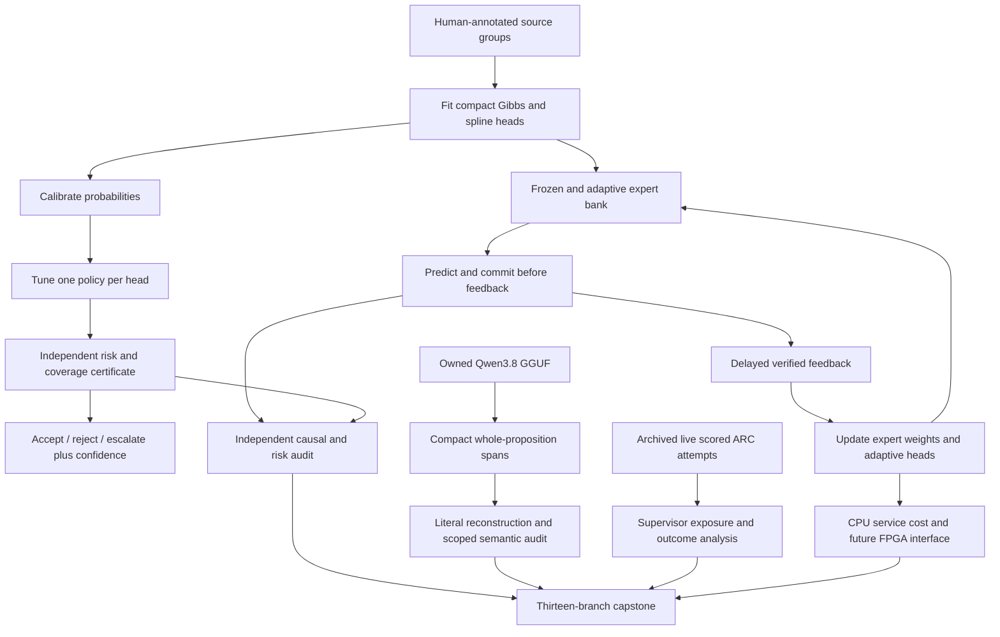
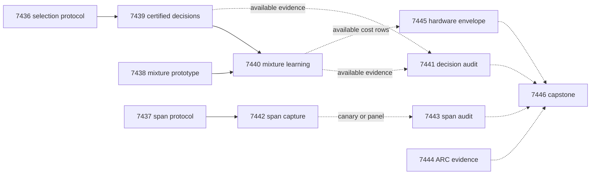

# Carnot Research Roadmap V652: Useful Decisions and Defensive Learning

**Created:** 2026-09-19
**Milestone:** `2026.09.652`
**Title:** Useful risk-controlled decisions, defensive online learning, and complete source extraction
**Status:** Planned; no experiment in this document has run.
**Supersedes:** completed milestone `2026.09.651`, exp7421–exp7433.
**Execution file:** `research-roadmap-next.yaml`

This milestone tests whether useful probability scores can support safe actions,
and whether online learning can avoid harm by retaining frozen experts.
It also tests a smaller extraction representation after a measured output failure.
The live generator remains `unsloth/Qwen3.8-27B-GGUF` with frozen weights.

## What V651 Proved

Completion means terminal disposition, not a positive result. The archive still
ended at V650 when planning began. V651 evidence comes from its active task file,
terminal artifacts, capstone and conductor log. Twelve declared files exist;
the extraction audit has a conductor pre-gate disposition instead.

| Evidence | Finding | Consequence |
|---|---|---|
| Exp7421 and Exp7433 | The markdown authority still named V650. Contract and capstone were disqualified. | Replace the entire document and independently compare the new authorities before activation. |
| Exp7422 | GPU capacity predicates and one owned lease lifecycle passed; readiness is not a reservation. | Reuse this mechanism and acquire a fresh lease for new inference. |
| Exp7423 | RAGTruth human source-support labels and disjoint roles were sealed: 17,617 eligible responses across 2,964 groups. | Preserve annotation authority and group splits. Human support labels are fallible, not formal truth. |
| Exp7425 | Sparse/dense spline parity passed on analytic fixtures. | Keep the fixed-basis logistic equivalence explicit; this is circular numeric evidence. |
| Exp7426 | Registered Brier/log-loss checks passed; the 25 percent certified-coverage gate failed. | Diagnose score support and independent policy certification rather than retraining another unchanged head. |
| Exp7427 and Exp7428 | The online trial and independent audit found no registered benefit on 753 groups. Shifted cases included log-loss harm. | Test a mechanism that can retain a frozen expert. Do not claim that sparse locality ensures useful adaptation. |
| Exp7429 and Exp7430 | Four CUDA development replies all ended at 64 tokens with invalid JSON. The producer also lacked an adversarial_verify receipt; its audit was pre-gated. | Change verbose extraction representation and qualify the terminal reader sequence before inference. |
| Exp7431 | The scored policy reached bp35 and cn04 with adapters disabled. Each took 62 actions, banked zero levels and had zero supervisor firings in shadow mode. | Interpret exposure before another intervention. Reachability is complete; efficacy remains unmeasured. |
| Exp7432 | Fixed-point actions matched, but full-service speed did not improve. Persistence occupied 0.37696053267914603 of measured service. | Bound the complete service. Arithmetic-only acceleration cannot provide 100x. |

Primary evidence is in `results/experiment_7421_v651_contract_ingestion.json`
through the named V651 files, especially `results/experiment_7433_v651_capstone.json`.
No source result is relabeled or rewritten by this plan.

## Three Biggest Gaps to the PRD

1. **Verifiable reasoning does not yet become useful safe decisions.**
   FR-12 needs valid semantics and usable coverage. Better probability scores,
   valid JSON and low constraint energy address different parts of this gap.
   Exp7436/7439/7441 test independent risk certification. Exp7437/7442/7443 test
   completed whole-proposition extraction without declaring syntax to be truth.
2. **Continuous self-learning has no current registered later-query advantage.**
   FR-11 needs beneficial updates and operational continuity. Exp7435 fixes the
   documented research-round lock. Exp7438/7440 test causal online competition
   between frozen and adaptive energy heads, with equal-information controls.
3. **The deployment path lacks a measured general reasoning or service-speed gain.**
   FR-05/07/08 and NFR-01 need full-service and live-path evidence. Exp7444
   preserves the ARC generalization floor through supervisor outcome analysis.
   Exp7445 tests the hardware feasibility bound against actual service stages.
   Board reachability, numeric parity and archived attempts are separate claims.

The PRD's foundation-model vision remains long-term context. The newer
`ops/north-star.md` frames current work as verification around a commodity
generator and runtime hidden-game discovery. This milestone follows that scope.

## Research Basis

The [V652 source review](../../research-references.md#2026-09-19--v652-planning-source-review)
was written before this experiment roster. It covers all eight requested topics
and all six secondary sources, including a partial Semantic Scholar citation walk.

| Source | Decision in this milestone | Limit |
|---|---|---|
| [Joint selective certificate, 2606.08517](https://arxiv.org/html/2606.08517v1) | Separate policy tuning, selected risk and coverage certification. | Retain exact binary bounds; no claim that a different inequality creates signal. |
| [Expert aggregation, 2607.20239](https://arxiv.org/html/2607.20239v1) | Retain frozen experts and learn mixture weights from earlier feedback. | Delayed fixed-share replay inherits no automatic calibration or no-share regret guarantee. |
| [SCoRE, 2603.24704](https://arxiv.org/html/2603.24704v1) | Distinguish deployment risk, selected risk and abstention. | Empty selected sets have undefined risk. |
| [CRANE, 2502.09061](https://arxiv.org/abs/2502.09061) | Separate output representation from semantic quality. | No grammar mask or finite-choice answer-transport rerun. |
| [KAN locality, 2602.02056](https://arxiv.org/abs/2602.02056), [forgetting, 2511.12828](https://arxiv.org/abs/2511.12828) | Preserve a bounded numeric update route and test shift harm. | Kernel speed and local support do not establish service speed or useful learning. |

EBT, ARM–EBM, AS2, ETS, Ising learning, Extropic Z1T and Kona were rechecked.
None supplies a reason to reopen the unchanged failed generator, text-ranker,
proof-memory or hardware-access chains. New perturbation-based hallucination
work stays queued until current extraction has usable outputs.

## Architecture

RAGTruth labels indicate support by supplied text. They do not establish truth
outside that text. The online branch is ordered replay of archived annotations.
The extraction branch invokes a real current local model. These scopes stay distinct.

## Exact Task Contract

**13 tasks, exp7434 through exp7446, in the order below.**
This table is the complete conductor contract. It is not an aspirational list.
`None` means no whole-task structured gate. Historical files can be authenticated
inputs; all structured gates name producers inside this roadmap.

| Order | Task ID | Exact title | Phase | Deliverable | Substrate class | Structured gate |
|---|---|---|---|---|---|---|
| 1 | exp7434-contract-methods | Bind the thirteen-task contract and ingest methods against V651 evidence | 1 | results/experiment_7434_v652_contract_methods.json | aggregation | None |
| 2 | exp7435-round-breaker | Prevent historical rejection streaks from locking future research rounds | 1 | results/experiment_7435_v652_round_breaker.json | no_model_load | None |
| 3 | exp7436-selection-protocol | Diagnose empty decision sets and seal an independent selection protocol | 1 | results/experiment_7436_v652_selection_protocol.json | aggregation | None |
| 4 | exp7437-span-protocol | Prototype compact claim spans and seal the extraction comparison | 1 | results/experiment_7437_v652_span_protocol.json | no_model_load | None |
| 5 | exp7438-mixture-prototype | Prototype delayed expert weighting over frozen and adaptive energy heads | 2 | results/experiment_7438_v652_mixture_prototype.json | no_model_load | None |
| 6 | exp7439-certified-decisions | Train calibrated energy policies and measure independent risk certification | 2 | results/experiment_7439_v652_certified_decisions.json | no_model_load | exp7436-selection-protocol.selection_protocol_ready_score == 1; exp7436-selection-protocol.verdict_class in ["null", "positive"]; exp7436-selection-protocol.flagged_adversarial == false |
| 7 | exp7440-mixture-learning | Measure continuous expert weighting on delayed source-support outcomes | 2 | results/experiment_7440_v652_mixture_learning.json | no_model_load | exp7438-mixture-prototype.mixture_prototype_ready_score == 1; exp7438-mixture-prototype.verdict_class in ["circular_positive", "null", "positive"]; exp7438-mixture-prototype.flagged_adversarial == false; exp7439-certified-decisions.decision_capture_complete_score == 1; exp7439-certified-decisions.verdict_class in ["null", "positive"]; exp7439-certified-decisions.flagged_adversarial == false |
| 8 | exp7441-decision-audit | Independently audit policy risk and delayed learning without benefit gates | 3 | results/experiment_7441_v652_decision_audit.json | aggregation | None |
| 9 | exp7442-span-capture | Measure compact Qwen claim extraction after the representation repair | 3 | results/experiment_7442_v652_span_capture.json | model_bounded_generation | exp7437-span-protocol.span_protocol_ready_score == 1; exp7437-span-protocol.verdict_class in ["null", "positive", "circular_positive"]; exp7437-span-protocol.flagged_adversarial == false |
| 10 | exp7443-span-audit | Audit raw extraction outcomes including a failed development canary | 3 | results/experiment_7443_v652_span_audit.json | aggregation | None |
| 11 | exp7444-arc-supervisor-evidence | Interpret adapter-withheld ARC supervisor outcomes before another intervention | 3 | results/experiment_7444_v652_arc_supervisor_evidence.json | aggregation | None |
| 12 | exp7445-hardware-envelope | Bound complete learning-service acceleration and preserve board prerequisites | 4 | results/experiment_7445_v652_hardware_envelope.json | aggregation | None |
| 13 | exp7446-capstone | Reconcile thirteen outcomes and decide each research branch from evidence | 4 | results/experiment_7446_v652_capstone.json | aggregation | None |

## Phase 1: Establish the Questions and Recover Research Execution

Exp7434 independently binds both authorities and ingests the selected methods.
It is advisory and cannot cascade-block independent science. Contract mutations
must reject stale milestone, count, order, title, substrate, path and field changes.

Exp7435 takes the new dated mandatory priority. It limits the breaker to attempts
inside the current invocation while preserving the local stop threshold and all
history. A private real round must reach evaluation after historical rejections.
Ten new consecutive rejected attempts must still stop that invocation. Tests
cover every affected caller and use no synthesis LLM.

Exp7436 diagnoses why the selected set was empty. It seals three deployed heads,
five-seed probability averaging, separate calibration/tuning halves, and one
candidate pair per head. Certification gets nine simultaneous checks at
delta=0.05/9. Accept/reject harm budgets remain 0.05/0.10; coverage stays >=0.25.
No test label or prospective-stream label can choose the policy.

Exp7437 prototypes compact spans over bounded immutable paragraphs. Its parser
must reject truncation, ambiguity and invalid offsets without filling missing
content. It seals four development paragraphs and 48 evaluation units, with
two arms at 256 tokens per call. The units are 24 real paragraphs and 24 members
of twelve constructed qualifier pairs. The development set is disjoint.

Phase exit requires runnable prototypes, preserved failure evidence and private
adversarial mutations. A ready protocol does not claim predictive benefit.

## Phase 2: Measure Safe Decisions and Continuous Learning

Exp7438 implements a four-expert probability mixture: frozen and adaptive Gibbs,
plus frozen and adaptive spline. It commits predictions before revealed labels.
Weights use stored prediction-time log loss, eta=1 and fixed share 0.01.
Analytic no-share identity, duplicate feedback, revocation and restart controls
test implementation. The delayed fixed-share trial remains an empirical question.

Exp7439 trains the existing compact heads and compares tuned policies with old
fixed thresholds on identical probabilities. One frozen pair per head receives
independent certification. Failed certification disables the policy; no fallback
threshold is tried on certification labels. The test preserves Brier/log loss,
utility, two harm rates, coverage, per-unit rows and source-group intervals.
A claimed energy advantage must beat tuned logistic, not just its own old policy.
An action disabled during tuning has an inapplicable risk check with unspent alpha.
All enabled actions and coverage must pass together or the entire policy escalates.
Because certification labels were used in earlier milestones, these are nominal
feasibility bounds on reused data. `deployment_certificate_valid=false` and
`certificate_scope=exploratory_reused_corpus` forbid a fresh deployment guarantee.
Valid nulls set `decision_capture_complete_score=1` and `decision_value_score=0`.

Exp7440 is the required continuous self-learning experiment. It tests all 753
sealed stream groups in two orderings and delays zero/eight. Uniform random
feedback reveals eight per block of 32 to every arm. Learned weights compete
with frozen spline, adaptive spline and the same experts with equal weights.
No-feedback and shuffled-label controls detect false learning claims.
Adaptive actions are shadow-only; a static certificate cannot travel with
changing probabilities. Benefit requires simultaneous later-loss improvement,
Brier non-inferiority, no higher empirical harm, and unchanged label cost.

All data reuse is disclosed. Re-splitting or re-scoring the public benchmark
does not create pristine confirmation data. These experiments can justify a
new independent trial; they cannot establish a new general verifier headline.

## Phase 3: Challenge the Claims and Finish the Bounded Live Probe

Exp7441 independently recomputes available static and online evidence. It has
no positive-benefit gate. It catches policy leakage, wrong independent units,
false zero risks, future labels, duplicate commits and unsupported guarantees.
Missing producer science yields a terminal blocked branch, not repeated partials.

Exp7442 reacquires one real RTX 3090 lease and invokes the mandated GGUF.
Eight development calls precede the 96-call evaluation. Both arms need at least
three complete, nonempty, reconstructable development outputs of four.
A failed canary is a measured null, with all evaluation units marked unstarted.
The aggregate live budget is 1500 seconds, including a 45-second per-call ceiling.
The 256-token task is `model_bounded_generation` with a 10-second duration floor.
Actual timing determines authenticity; there is no artificial waiting.

Exp7443 audits even a failed canary. It independently parses raw replies and
checks token ceilings, literal spans, paired costs and modifier retention.
Constructed exact semantics and real-paragraph unknowns stay separate.

Exp7444 satisfies the ARC generalization floor through the outcome-ledger
amendment in CLAUDE.md. Zero firings in the two adapter-withheld episodes do not
support arm promotion, retirement or generation of a new arm. The task inspects
whether exposure reached the existing trigger, with unknowns preserved. It
does not run another known public solve or grow a budget to manufacture one.
No current model calls or solve credit are claimed.

## Phase 4: Bound Deployment and Reconcile Every Outcome

Exp7445 reduces actual service-stage costs and retains three board dispositions.
The V651 persistence fraction implies an arithmetic-only ceiling near 2.65x,
even with infinitely fast arithmetic. The 100x goal requires an unaccelerated
fraction below 0.01. Any future redesign must preserve durable acknowledgement
and crash semantics. Missing stage data remain unknown.

Exp7446 enumerates all thirteen dispositions, including itself. It preserves
valid nulls, external blocks and disqualified science as distinct outcomes.
It audits each structured field contract and makes branch-specific continuation
decisions. Only a changed measured cause permits another failed-scope attempt.
It computes the existing G1–G4 publication gate without changing its definition
or publishing anything.

## Dependency Graph and Execution Order

The YAML order is authoritative. These are the only scheduling gates:

Each gated input requires its readiness/capture score, an allowed closed
`verdict_class`, and `flagged_adversarial=false`. All checks are conjunctive.
There are four producer-consumer dependencies and twelve scalar gate checks.
No `requires` chain names a retired experiment. Audits, the ARC task, hardware
dispositions and capstone run without whole-task gates. Missing branches remain
explicit, including the conductor's alternate pre-gate artifact path.

## Hardware Requirements and Runtime Budgets

| Work | Required resource | Budget and claim boundary |
|---|---|---|
| Compact-head fitting and online mixture | Host CPU, JAX/NumPy, external corpus cache | Existing small heads and four-expert state. Record compile, fit, update and persistence separately. |
| Span capture | One owned RTX 3090, cached Qwen3.8-27B Q4_K_M, native CUDA llama.cpp | At most 104 calls and 26,624 generated tokens. One 120-second lease wait; 1500-second live ceiling. |
| Contract, policy and provenance audits | Host CPU and hash-bound shards | No current LLM calls; no fresh hardware execution. |
| KV260 | Existing terminal evidence | Graduation preserved. Any future board access uses SSH, not host storage probes. |
| GateMate | Dated operator physical-change evidence | Documentation-only task while the post-Exp6559 physical prerequisite is unchanged. |
| PolarFire | Existing hash-verified CPU dispatch receipt | Graduation preserved. CPU dispatch is not FPGA sampling. |
| Extropic TSU, photonic, D-Wave, NPU, larger FPGA | Future access and complete cost justification | No procurement or performance claim follows from external papers. |

The host has two RTX 3090s, but only one concurrent model is required. Inventory
does not prove availability. A fresh owned lease is mandatory. Older Qwen and
Gemma models are CPU smoke-only and supply no headline result here.
No task needs `model_full_generation` or `model_load_no_generation`; if a future
scope genuinely needs these, their floors are 60 seconds and 2 seconds.

Every prompt requires immediate flushed progress, phase-boundary lines,
before/after long calls, and truthful 60-second heartbeats inside long work.
Every silence gap must stay below 600 seconds. Per-task estimates stay below
the 4800-second hard cap. Checkpoints stay separate from terminal artifacts.

Routine research uses the user's default Claude routing. The breaker uses
Claude Opus/100 turns because it changes a shared preflight boundary. Formulaic
span parsing uses Codex `gpt-5.6-sol`. Audits use 20–30 turns. These agents are
execution backends; they are distinct from the experiment's local GGUF model.

## Acceptance, Failure Discipline and Deferred Work

- Every comparison keeps per-unit rows, planned counts, exclusions and interval
  assumptions. No seed or repeated response inflates independent sample size.
- Every result declares the closed verdict enum beside the free-text verdict.
  Oracle or analytic fixture positives are `circular_positive`. A failed benefit
  gate produces `null` when validity passes. Upstream absence is `blocked`.
- Every reused failed scope includes the exact prior ID, verdict, changed cause
  and `retire_if_same_verdict: true` in YAML. This includes older supervisor,
  unavailable-audit and hardware-envelope failures, plus V651's failed scopes.
  Exp7443 changes the blocked audit
  into a useful canary-or-panel audit; it does not rerun the absent old producer.
- No broad external-text ranker, finite-choice answer channel, proof-memory
  chain, generic Ising sweep, physical GateMate retry or generator training is
  reopened. The small calibrated-policy floor and source-span extraction have
  their own bounded scopes. They confer no ARC control authority.
- The 2026-09-18 large-file gate belongs inside the forbidden conductor source.
  It remains an explicit unresolved operator task. Shards below 20 MiB and
  external caches reduce this milestone's exposure but do not claim that fix.
- No push, publication, live deployment, roadmap activation, live-log reset,
  model-weight change or modification of `scripts/research_conductor.py` occurs.

## Verification and Reconciliation

Before this plan is delivered, parse YAML with `scripts/roadmap_schema.py`,
compare the exact markdown/YAML contract, and run gate, exclusion and ARC-floor
linters. Mutate the contract and run the real gate reader on private artifacts.
Run the relevant roadmap-consumer unit tests, scoped Ruff and spec coverage.
Planning changes no model, sampler, binding or ARC production code. Thus none of
E2E-001–010 applies to this planning pass; its E2E is staged-plan ingestion by
the real schema and gate consumers without activating the live conductor.

During execution, specs and meaningful failing tests precede implementation.
Affected tests use private outputs and command-local coverage files. Never run
the known mutating full Python suite from these tasks. Each experiment runs its
entrypoint, fresh-process artifact replay and both unchanged artifact readers.
Run numbered E2Es only when the corresponding shared capability changes.

Reconcile this proposal, capability status, `_bmad/traceability.md`,
`ops/status.md` and `ops/changelog.md`. Keep historical results and the active
V651 roadmap intact. The existing stale document is already preserved byte for
byte at `openspec/change-proposals/research-roadmap-v650-preserved-20260919.md`.
It must not be described as a valid V651 design.
