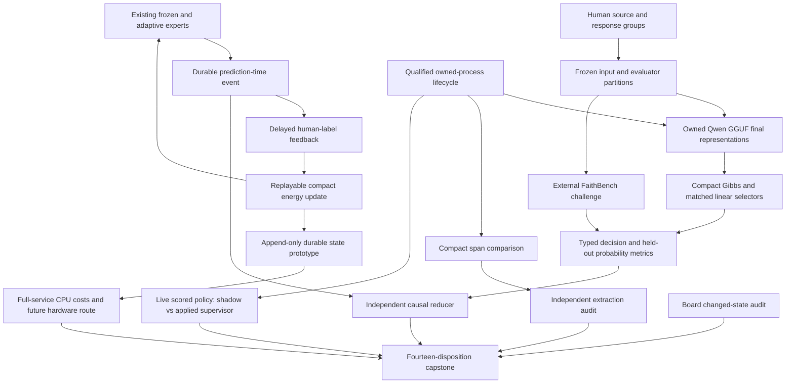
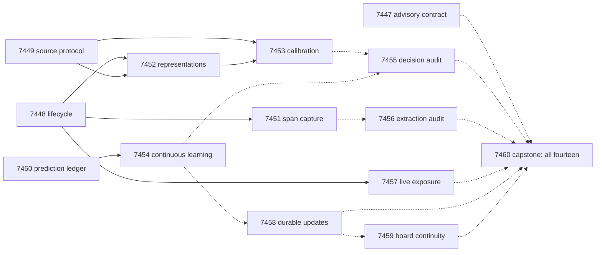

# Carnot Research Roadmap V653: Source Information and Causal Learning

**Created:** 2026-09-20
**Milestone:** `2026.09.653`
**Title:** Source-conditioned energy decisions, replayable continuous learning, and live supervisor exposure
**Status:** Planned; these experiments have not run.
**Supersedes:** completed milestone `2026.09.652`, exp7434–exp7446.
**Execution file:** `research-roadmap-next.yaml`

The central question is whether source-conditioned representations supply useful
information to a compact calibrated energy selector. A separate branch settles
whether the existing continuous-learning mechanism survives a fully independent
causal replay. The local generator stays frozen at `unsloth/Qwen3.8-27B-GGUF`.

## What V652 Proved

Terminal completion is not a positive research result. During planning the
completed archive ended at V651. V652's thirteen declared artifacts and the
conductor log through September 20 are the current evidence. Their classes,
flags and nulls remain unchanged. The old design is preserved as
`research-roadmap-v652-preserved-20260920.md`.

| Evidence | Measured result | Next implication |
|---|---|---|
| Exp7434 | The thirteen-task contract matched and methods were ingested; class null. | Bind the new authorities before execution; keep the contract task advisory. |
| Exp7435 | Invocation-local research breaker recovery passed. | Reuse it; no repeat repair without a new recurrence. |
| Exp7436/7439 | The independent selection protocol ran, but no registered decision benefit emerged. Capture score 1, value 0. | Change source information and external evaluation, not risk thresholds. |
| Exp7438/7440/7441 | The mixture prototype passed exact fixtures; the trial reported no online benefit. The independent audit found missing expert predictions and incomplete weight replay. | The prototype is circular evidence. Preserve immutable prediction-time probabilities before another scientific trial. |
| Exp7437/7442/7443 | One development reply returned valid empty claims on a nonfactual introduction. The producer then hit `KeyError:parse_status`; recovery lacked owned-process/lease continuity. No evaluation units ran; producer and audit were flagged. | Repair callback and cleanup behavior with process faults before new inference. This does not show semantic extraction works or fails. |
| Exp7444 | Both prior episodes had 62 actions and zero supervisor firings. The shipped firing threshold is 120 actions. | Increase exposure, retain the threshold, and distinguish no opportunity from a failed intervention. |
| Exp7445 | The full-service 100x condition failed. Earlier persistence occupied about 0.377 of service; current stage decomposition was incomplete. | Test a concrete durable-storage change and measure every service stage. A faster arithmetic kernel cannot establish 100x service acceleration. |
| Exp7446 | All thirteen dispositions were recorded, but required science remained disqualified. | Finish independent audits even when a branch fails; do not retry a capstone because its inputs are absent. |

Primary paths are the exact `results/experiment_7434_v652_contract_methods.json`
through `results/experiment_7446_v652_capstone.json` deliverables named in the
unchanged V652 task file. No source artifact is rehabilitated by this proposal.

## Three Biggest Gaps to the PRD

1. **FR-12: verified syntax and probability scores do not yet support semantic,
   useful decisions.** The extractor can fail before evidence exists, while the
   calibrated selector lacks useful certified coverage. Exp7448/7451/7456 repair
   and test extraction. Exp7449/7452/7453 test new source-conditioned inputs with
   independent human labels and matched simple controls.
2. **FR-11: beneficial continuous updates lack independent causal evidence.**
   Exp7450/7454/7455 retain every prediction before feedback and reproduce each
   expert update. The mechanism must improve later predictions under its original
   gates; valid repeated nulls retire this unchanged construction.
3. **FR-05/07/08 and NFR-01: live reasoning and full-service acceleration remain
   unproved at the required scope.** Exp7457 measures actual supervisor exposure
   through the scored ARC policy. Exp7458 changes durable persistence while
   preserving acknowledged state. Exp7459 keeps board prerequisites explicit.

The PRD's foundation-model goal remains long-term. These experiments establish
interfaces, evidence and small learned components; they do not train a new
foundation model or alter the mandated generator.

## Research Basis

The [V653 source review](../../research-references.md#2026-09-20--v653-planning-source-review)
was saved before this contract. It covers all eight requested research topics
and the six secondary channels, with access limitations recorded.

| Source | Experiment use | Boundary |
|---|---|---|
| [Quantized hidden-state probes, 2606.02628](https://arxiv.org/abs/2606.02628) | Exp7452/7453: authenticate the representation and compare Gibbs with a linear control. | Only final-layer last-token pooling is planned. This is not a mid-layer NF4 replication. |
| [Cross-block conditioning, 2609.14934v2](https://arxiv.org/abs/2609.14934v2) | Exp7449/7453: separate the value of source conditioning from model capacity. | Borrow the ablation design, not the paper's data-fusion result. |
| [FaithBench, NAACL 2025](https://aclanthology.org/2025.naacl-short.38/) | Exp7449/7453: external human source-support challenge. | Disagreement-selected examples do not estimate deployment prevalence. |
| [Expert aggregation, 2607.20239](https://arxiv.org/abs/2607.20239) | Exp7450/7454/7455: retain sequential expert predictions and independently evaluate delayed losses. | No automatic delayed-feedback regret or calibration theorem is claimed. |
| [CRANE, 2502.09061](https://arxiv.org/abs/2502.09061) | Exp7451/7456: separate output completion from preserved meaning. | No grammar or finite-choice answer-transport sweep. |
| [On-chip spline learning, 2602.02056](https://arxiv.org/abs/2602.02056) | Exp7458: account for the host work around compact numeric updates. | Host durability measurements are not FPGA results. |

EBT, ARM–EBM, neural feasibility, Ising dynamics, Extropic Z1T, OpenReview
submissions and Kona were also checked. They do not reopen retired external-text
rerankers, the MMLU hidden-state sweep, or unchanged physical bring-up attempts.

## Architecture

The source challenge uses archived human labels; the online study is an ordered
replay, not deployed learning. Embedding capture and extraction invoke the
mandated model now. ARC uses the real scored policy in adapter-withheld public
environments. Each evidence type remains separately labeled.

## Exact Task Contract

**14 tasks, exp7447 through exp7460, in the order below.**
This table is the complete conductor task contract. `None` means no whole-task
structured gate; historical evidence still needs authentication. All structured
gates name earlier producers in this same roadmap and fields declared in their
own REQUIRED ARTIFACT FIELDS.

| Order | Task ID | Exact title | Phase | Deliverable | Substrate class | Structured gate |
|---|---|---|---|---|---|---|
| 1 | exp7447-contract-methods | Bind fourteen tasks and ingest source-conditioning methods | 1 | results/experiment_7447_v653_contract_methods.json | aggregation | None |
| 2 | exp7448-capture-lifecycle | Repair extraction callback failure and owned-process cleanup | 1 | results/experiment_7448_v653_capture_lifecycle.json | no_model_load | None |
| 3 | exp7449-source-protocol | Seal source-pair features and an external human challenge set | 1 | results/experiment_7449_v653_source_protocol.json | no_model_load | None |
| 4 | exp7450-prediction-ledger | Preserve prediction-time expert losses under delayed feedback | 1 | results/experiment_7450_v653_prediction_ledger.json | no_model_load | None |
| 5 | exp7451-span-capture | Measure compact Qwen extraction through the repaired lifecycle | 2 | results/experiment_7451_v653_span_capture.json | model_bounded_generation | exp7448-capture-lifecycle.capture_lifecycle_ready_score == 1; exp7448-capture-lifecycle.verdict_class in ["null", "positive"]; exp7448-capture-lifecycle.flagged_adversarial == false |
| 6 | exp7452-source-embeddings | Capture authenticated source-conditioned Qwen representations | 2 | results/experiment_7452_v653_source_embeddings.json | model_load_no_generation | exp7448-capture-lifecycle.capture_lifecycle_ready_score == 1; exp7448-capture-lifecycle.verdict_class in ["null", "positive"]; exp7448-capture-lifecycle.flagged_adversarial == false; exp7449-source-protocol.source_protocol_ready_score == 1; exp7449-source-protocol.verdict_class in ["null", "positive"]; exp7449-source-protocol.flagged_adversarial == false |
| 7 | exp7453-energy-calibration | Train typed energy decisions on source-conditioned features | 2 | results/experiment_7453_v653_energy_calibration.json | no_model_load | exp7449-source-protocol.source_protocol_ready_score == 1; exp7449-source-protocol.verdict_class in ["null", "positive"]; exp7449-source-protocol.flagged_adversarial == false; exp7452-source-embeddings.embedding_capture_ready_score == 1; exp7452-source-embeddings.verdict_class in ["null", "positive"]; exp7452-source-embeddings.flagged_adversarial == false |
| 8 | exp7454-continuous-learning | Measure delayed continuous learning with fully replayable expert events | 2 | results/experiment_7454_v653_continuous_learning.json | no_model_load | exp7450-prediction-ledger.prediction_ledger_ready_score == 1; exp7450-prediction-ledger.verdict_class in ["null", "positive", "circular_positive"]; exp7450-prediction-ledger.flagged_adversarial == false |
| 9 | exp7455-decision-audit | Independently audit source conditioning and continuous learning | 3 | results/experiment_7455_v653_decision_audit.json | aggregation | None |
| 10 | exp7456-extraction-audit | Audit compact extraction coverage and every failed call | 3 | results/experiment_7456_v653_extraction_audit.json | aggregation | None |
| 11 | exp7457-arc-exposure | Measure live supervisor exposure beyond its stagnation threshold | 3 | results/experiment_7457_v653_arc_exposure.json | model_bounded_generation | exp7448-capture-lifecycle.capture_lifecycle_ready_score == 1; exp7448-capture-lifecycle.verdict_class in ["null", "positive"]; exp7448-capture-lifecycle.flagged_adversarial == false |
| 12 | exp7458-durable-updates | Test append-only learning state with unchanged acknowledgement semantics | 4 | results/experiment_7458_v653_durable_updates.json | no_model_load | None |
| 13 | exp7459-board-continuity | Preserve board graduation and check GateMate changed-state evidence | 4 | results/experiment_7459_v653_board_continuity.json | aggregation | None |
| 14 | exp7460-capstone | Reconcile fourteen dispositions and retire unchanged null mechanisms | 4 | results/experiment_7460_v653_capstone.json | aggregation | None |

## Phase 1: Qualify Evidence and Freeze the Questions

Exp7447 binds the contract and ingests the selected methods. It cannot gate all
science. Exp7448 fixes the measured callback contract and cleanup fault with
real short-lived child processes and scripted transport. No model is loaded.
Exp7449 freezes a source-pair protocol, evaluator isolation and an external
challenge set. Exp7450 saves immutable prediction events and qualifies a cold
update replay on analytic fixtures. These last two infrastructure tasks keep
later work small enough for a single execution budget.

The source protocol selects at most 300 RAGTruth groups, one response per group:
180 training, 60 calibration/tuning and 60 internal test. Existing role boundaries
are preserved. Up to 100 FaithBench groups form a separate challenge set. Selection
is hash-based and label-blind. The pinned release is
`cf89797d82812c23b5d5e5c121f1d9b8983bbbce`; detector predictions and annotation
notes are forbidden features. Exact tokenizer eligibility is recorded in Exp7452.
A shortage never licenses role mixing or label-informed replacements.

Prototype acceptance means an executable interface plus adversarial tests. It
does not imply predictive value. Analytic oracle fixtures use circular_positive.

## Phase 2: Execute Three Independent Research Branches

**Extraction, Exp7451.** Reuse the sealed Exp7437 panel: eight development calls
and 96 evaluation calls, two arms, at most 256 tokens each, no retries. Development
readiness gates evaluation within the task. A valid empty result on nonfactual
text can pass syntax checks but supplies no factual recall evidence. The total
generation budget is 1500 seconds. All units retain dispositions if the gate closes.

**Source representation and calibration, Exp7452/7453.** Capture final-layer
last-token vectors for RESPONSE and SOURCE+RESPONSE with a 2048-token complete-input
ceiling. Do not truncate source evidence. Use at most 800 panel forwards plus eight
development/repeat forwards and an 1800-second forward-work ceiling. Authenticate
available pooling before fitting; an unsupported surface blocks this branch.
A fixed random projection yields 32 dimensions. Five compact Gibbs fits are
compared with matched logistic, answer-only, shuffled-source, lexical and prevalence
controls. Train transformations on training groups only. Primary external Brier
contrasts use 10000 group-bootstrap draws and Holm correction, with no external
log-loss harm and no permutation signal. Norm/length controls expose shortcuts.
Minimum independent counts are 150/40/40/60 for train/calibration/internal/external.
Shortfall blocks a confirmatory benefit, not the coverage report. Risk/coverage
intervals stay descriptive; the disagreement-selected challenge is not a safety
certification population. This branch satisfies the calibrated-decision floor.

**Continuous learning, Exp7454.** Reuse the original 753 online groups, five fit
seeds, two orders, delays 0/8 and seven arms. The sole change is complete causal
capture through Exp7450. Save all four expert predictions before each reveal and
reconstruct losses from those values. Preserve original rates, control arms,
block lengths 32/64, 10000 bootstrap draws and success bars. The branch needs no
current LLM and no output from the new embedding study. A repeated valid null
retires this unchanged mixture, rather than launching another parameter sweep.

Each branch writes hash-bound per-unit rows and a separate completion and value
score. No task pads a duration to meet an inference floor.

## Phase 3: Independent Adjudication and Live Exposure

Exp7455 cold-reduces both decision branches, including all expert losses and
weight updates, without importing the producer's update routine as its oracle.
Exp7456 reparses every attempted extraction reply and keeps natural and constructed
semantic evidence separate. Both audits run without a whole-task benefit gate;
a missing branch is recorded once as blocked while available work proceeds.

Exp7457 runs bp35 and cn04 with their adapters, stored engines and banked solutions
disabled. Two seeds and two supervisor arms produce eight episodes. Each receives
180 actions, up to 240 seconds, and the original two 256-token model requests.
The shipped 120-action threshold and curated arm order are unchanged. Interleave
shadow and applied arms; retain exposure, applied redirects, later progress and
censoring. The aggregate live budget is 2400 seconds including load and cleanup.
Zero firing still means no measured intervention. This pilot cannot promote an
arm from eight episodes. Any reached level is on-path live self-discovery and
requires reproduction, but these already registered games earn no new solve credit.

## Phase 4: Durable Updates and Research Disposition

Exp7458 tests append-only event deltas and periodic compact snapshots against
whole-state replacement. Both acknowledge only after durable synchronization.
One fsync per acknowledged event stays mandatory; no acknowledgement batching
creates a spurious speedup. Inject crashes around writes and compaction, then
measure 30 paired blocks of 128 updates, including hashing, storage and replay
cost. The value gate is exact acknowledged-prefix recovery and a paired 95 percent
upper service-time ratio below 0.90. A 900-second benchmark ceiling limits scope.
Recompute the 100x feasibility bound from residual host cost; a failed bound is a
result, not permission to omit durability.

Exp7459 authenticates three board dispositions and any dated GateMate physical
change. No board command runs. Exp7460 records all fourteen outcomes, uses the
independent audits to decide claims, retires unchanged valid null mechanisms and
keeps missing evidence explicit. The established G1–G4 publication gate retains
its FoVer scope and cannot certify this new research.

## Dependency Graph

Solid edges are structured gates; dotted edges are ungated evidence reads.
All gate-producing tasks declare bare readiness fields plus verdict_class and
flagged_adversarial. Clean null readiness is accepted. Flagged/disqualified science
is rejected. No gate depends on scientific value being positive.

Exp7458 can use its fixed numeric fixture if the online producer is absent; it
makes a storage claim only. Exp7459 can finish from board receipts if timing is
absent. Exp7460 reads every task, including tasks omitted from the simplified
fan-in drawing. There are no `requires:` references to retired experiments.

## Hardware Requirements and Decentralization

| Resource | Required use | Claim boundary |
|---|---|---|
| Host CPU, memory, local storage | Compact head fitting, ordered replay, exact reductions, durable-state tests | Measure actual RAM, free disk, CPU and filesystem; avoid assumed sizes. |
| Two RTX 3090s, 24 GB each | One cached Qwen3.8 Q4_K_M session for each live task | Prior evidence used about 16 GB model residency. Recheck capacity and ownership per run. Never add VRAM across boards without a real split configuration. |
| Qwen GGUF cache and native CUDA runner | Exp7451 bounded generation, Exp7452 load/forward only, Exp7457 bounded callbacks | Hash model/tokenizer/runner and actual offload. A cache or supported-API miss is blocked; no smoke-model substitute. |
| KV260 | Preserve authenticated graduation and SSH-only access history | No fresh sampler or speed claim. |
| PolarFire | Preserve authenticated CPU-dispatch graduation | CPU dispatch does not imply FPGA sampling. |
| GateMate | Read dated cable/port/power/board/DirtyJTAG evidence after Exp6559 | No unchanged physical retry; absence remains visible. |
| Extropic, NPU, photonic, D-Wave, larger FPGA | Future routes only | No access, acquisition, delivery or performance claim without local receipts. |

Learning tiers 1/2 remain CPU state updates; compact Gibbs/spline work has a
GPU/FPGA arithmetic route. Exp7454/7458 measure whether host persistence prevents
the 100x target. A measured CPU cost bound is honest progress even if that target
remains infeasible. There is no hardware purchase or vendor contact in this plan.

Decentralization implications: the research uses cached open weights, ordinary
local CPU/CUDA interfaces and portable durable event formats. No closed model
becomes a core dependency. No publication or distribution is authorized here.

## Failure Discipline, Budgets and Validation

Every matched failed scope carries all four prior_failures fields, including
`retire_if_same_verdict: true`. Changed causes are specific: callback and cleanup
repair, full expert prediction capture, new source-conditioned inputs, adequate
ARC exposure, or changed durable storage. The plan does not reuse retired IDs.
No operator override is invented. Environmental absence is terminal blocked; only
unfinished work owned by the current task can be partial.

All prompts have numbered steps requiring flushed progress at phase boundaries
and around long calls, plus at most 60-second heartbeats inside loops, blocking
calls, authoring and validation. No silence gap may reach 600 seconds. Estimates
include implementation and checks; live work has tighter internal ceilings.
The conductor's 4800-second hard cap remains unchanged. The execution file gives
small audits 20/30 turns and routine experiments 50. Schema/lifecycle infrastructure
uses the requested Opus/100 routing; formulaic corpus/storage code uses
Codex/gpt-5.6-sol. These are coding-agent routes, separate from the experiment LLM.
Runtime coercion may still apply the operator's configured backend.

Before implementation, each task extends its existing REQ-bearing capability and
writes meaningful spec-linked tests. Validate only affected files: worktree import,
pytest with private temporary state and no default coverage, separate 100 percent
changed-module coverage, Ruff, mypy and scoped spec coverage. Run each experiment
and a cold terminal replay. Shared training/sampling/binding changes add applicable
E2E-001..004; shared ARC changes add E2E-009/010 and their real environment smoke.
Isolated reporting tasks have no numbered runtime E2E. Preserve baseline failures.

Every task requires per-unit rows, acceptance categories, field principles,
invocation receipts, adversarial verification and strict row-consistency checks.
Only terminal artifacts occupy deliverable paths. Keep row shards below 20 MiB.
No task changes `scripts/research_conductor.py` or the active `research-roadmap.yaml`.
No task pushes, publishes, enables production behavior or changes generator weights.

Planning validation uses the shipped schema, markdown/YAML contract parsers,
exclusion and gate lint, ARC-floor and overdue-priority lint, and relevant existing
unit/spec checks. No experiment or hardware inference is run to validate this plan.
The protected active roadmap and conductor hashes are checked after writing.

## Success Criteria and Reconciliation

A completed milestone has fourteen dispositions and reproducible evidence, not
fourteen positive claims. Scientific advance requires the predeclared paired
selector improvement, verified later-query benefit, supported extraction effect,
or full-service durability-preserving speed gain. ARC exposure is a bounded
mechanism measurement, not a hidden leaderboard result.

Capability mapping: source/extraction work to `verification`; prediction events
and online updates to `autoresearch`; durable state to `continuous-learning`;
ARC exposure to `arc-world-model-trust-energy`; board evidence to `hardware`;
contract and independent reducers to `research-reporting`. Implementation tasks
allocate fresh REQ/SCENARIO IDs before code. This planning-only change creates no
implemented capability. `_bmad/traceability.md`, `ops/status.md` and
`ops/changelog.md` record that distinction.
