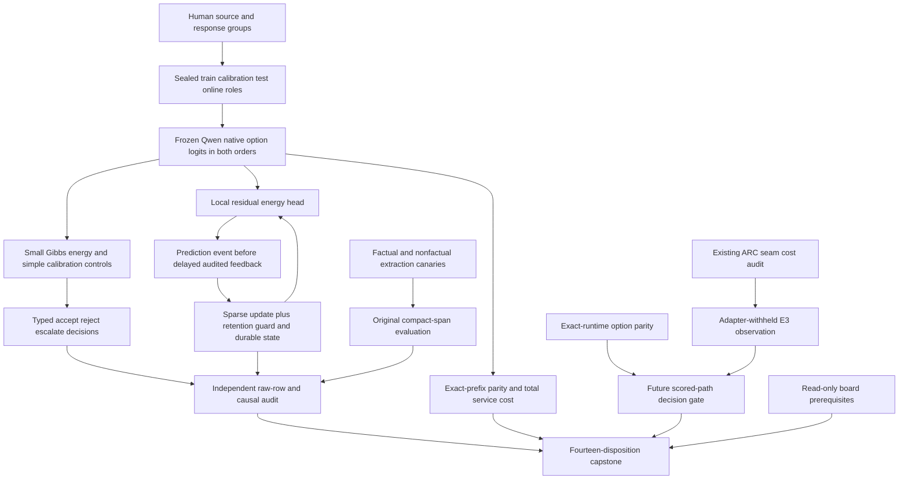
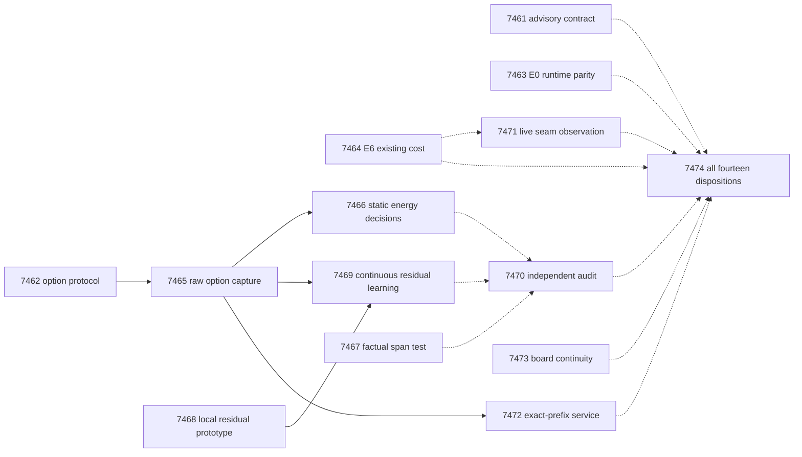

# Carnot Research Roadmap V654: Native Option Energies and Measured Learning

**Created:** 2026-09-20
**Milestone:** `2026.09.654`
**Title:** Native option energies, residual continuous learning, and measured ARC decision cost
**Status:** Planned; no V654 experiment has run.
**Supersedes:** completed `2026.09.653`, exp7447–exp7460.
**Execution file:** `research-roadmap-next.yaml`

The central question is whether native source-support option scores give a small
energy policy useful information, and whether local residual updates improve later
decisions. The frozen generator is `unsloth/Qwen3.8-27B-GGUF`. A separate ARC branch
measures runtime compatibility and the actual cost that typed decisions could replace.

## What V653 Proved

Completion is not scientific success. The completed archive ends at V652 at
planning time; the unchanged V653 YAML, terminal artifacts and conductor log supply
the latest evidence. The prior design is preserved byte-for-byte at
`research-roadmap-v653-preserved-20260920.md`.

| Evidence | Measured finding | Consequence |
|---|---|---|
| Exp7447/7448/7449 | Contract, owned-process lifecycle and human source protocol qualified; no efficacy established. | Reuse the helpers and cohort roles. |
| Exp7451/7456 | Eight development calls completed. Six correctly returned empty claims on nonfactual introductions; only one factual output per arm met the usable criterion. All 96 evaluation calls stayed unstarted. | Replace the development composition, retaining factual-readiness thresholds and the sealed evaluation. |
| Exp7452/7453 | Native embedding context creation raised `ValueError:Failed to create llama_context`; zero of 748 planned feature cells ran. Calibration was pre-gated. | Use a demonstrated non-generation option-logit surface; do not repeat embedding configuration guesses. |
| Exp7450/7454 | Prediction-time ledger worked. The mixture did not beat its equal-weight adaptive control under the registered test. The construction retired. | Replace four-expert weighting with a single residual update mechanism and new source-conditioned inputs. |
| Exp7455 | Independent online replay matched, but the audit itself failed required validation: 711 statements, two uncovered, and a methodology warning. | Preserve disqualification. A small independent aggregation reducer must qualify its own error paths and declaration. |
| Exp7457 | Eight episodes over bp35/cn04 reached the 120-action threshold; drop_goal_bias fired, yet every episode banked zero progress. | No arm promotion. Measure decision seams and cost before proposing a replacement engine. |
| Exp7458 | Full-service delta-journal/whole-state ratio 1.00065; CI95 upper 1.00466. Residual host fraction 0.61209 implies at most about 1.63x from infinitely fast numeric work. | Stop the unchanged journal sweep. Test exact shared prefill and retain service-wide accounting. |
| Exp7459/7460 | KV260 and PolarFire historical scopes persist; GateMate physical prerequisite unchanged. Fourteen dispositions exist, but required science is disqualified. | Read-only board continuity; preserve missing and invalid evidence in the next capstone. |

Each claim above traces to `results/experiment_<id>_v653_*.json` under the exact
paths listed in the unchanged active YAML. The Exp7453 conductor pre-gate artifact
uses `results/experiment_7453_energy_calibration.json`; its alternate basename is
not a missing experiment. No historical artifact is rewritten by this plan.

An additional outer-loop health check in
`results/jevbench_readout_eval_2026_09_20.json` reports a current Qwen option readout:
231 public tasks, 377 seconds, hard-tier accuracy 0.739 and order sensitivity.
It has aggregate metrics, not a reusable raw per-question ledger. It is prerequisite
evidence only, not an independently certified V654 baseline or an ARC result.

## Three Biggest Gaps to the PRD

1. **FR-12: semantic information has not become useful calibrated decisions.**
   Embedding access is blocked and extraction has not reached its evaluation.
   Exp7462/7465/7466 test native source-conditioned scores with simple controls;
   Exp7467 fixes the diagnosed factual-canary mismatch. Learned confidence is not truth.
2. **FR-11: online state changes have not shown added value over matched controls.**
   Exp7468/7469 test local residual learning, causal delayed feedback and retention.
   Frozen, linear, no-feedback and shuffled-feedback controls isolate actual learning.
   The target is later-query improvement with auditable updates, not ledger completion.
3. **FR-05/07/08 and NFR-01: live reasoning value and service acceleration need
   measurements at the actual interface.** Exp7463/7464/7471 measure scored-runtime
   support and adapter-withheld decision cost; Exp7472 measures shared-prefill parity
   and full cost. Exp7473 preserves hardware prerequisites. No kernel-only speedup
   establishes a fast end-to-end verifier or a hidden-game solve.

The long-term EBM foundation-model vision remains outside this bounded milestone.
The calibrated-decision floor trains only small Carnot energy heads. No generator
weight change, default activation, vendor contact or submission is included.

## Research Basis

The [V654 source review](../../research-references.md#2026-09-20--v654-planning-source-review)
was written before this experiment contract. It records all requested topic and
secondary-source checks, including an EBT citation API rate limit and OpenReview
browser challenges.

| Source | Use | Limit |
|---|---|---|
| [SemIf pinned source](https://github.com/TheoLeeCJ/SemIf/tree/ca3ba65f142967030ecb453346e94d6f476a69df) | Exp7462/7463/7465/7472: native option readout, token-boundary and prefix controls. | Its transformers runtime is not the local GGUF runtime; reported speed is not a Carnot result. |
| [KAN forgetting, 2511.12828](https://arxiv.org/abs/2511.12828) | Exp7468/7469: support-overlap diagnostics and explicit retention tests. | Local basis support does not guarantee whole-model nonforgetting. |
| [Limited feedback, 2609.05820](https://arxiv.org/abs/2609.05820) | Exp7469: fixed audit budget, propensities and causal delayed feedback. | Residual fitting is not the paper's routing algorithm; no imported regret bound. |
| [RECAP, 2606.06698](https://arxiv.org/abs/2606.06698) | Exp7469: test retained-domain regression separately from new-domain benefit. | No prompt optimization or generator fine-tuning. |
| [On-chip locality, 2602.02056v4](https://arxiv.org/abs/2602.02056v4) | Exp7468/7472: sparse-update hardware route and full-service denominator. | No local FPGA acceleration without board execution. |
| [ARM–EBM, 2512.15605v4](https://arxiv.org/abs/2512.15605v4) | Exact categorical negative-log-probability energy interface. | A model preference remains correlated with that model's errors. |

EBT, T-SKM-Net, thermodynamic learning, constrained decoding, Extropic Z1T and Kona
remain context. They do not reopen retired generated-text reward scorers or justify
new foundation-model training. The 2026-09-20 SemIf E0 and E6 priorities are picked
up explicitly; Needle/NanoJev cascade rungs E7-E12 remain deferred until their evidence.

## Architecture

The scored ARC policy receives no new readout authority. Its executable world-model
verifier remains authoritative. The source branch is useful even if E0 cannot
access the exact scored wheel. Online work is held-out chronological replay,
separately labeled from live environment actions and current model forwards.

## Exact Task Contract

**14 tasks, exp7461 through exp7474, in the order below.**
This table describes every task in `research-roadmap-next.yaml`. It is generated
from the same task objects as the YAML. `None` means no whole-task pre-gate.
Readiness fields are bare top-level values, declared in the producer's own
REQUIRED ARTIFACT FIELDS. A valid null may provide usable data. Audits and capstone
are unconditional; no positive-benefit gate hides a negative outcome.

| Order | Task ID | Exact title | Phase | Deliverable | Substrate class | Structured gate |
|---|---|---|---|---|---|---|
| 1 | exp7461-contract-methods | Bind fourteen tasks and ingest native decision methods | 1 | results/experiment_7461_v654_contract_methods.json | aggregation | None |
| 2 | exp7462-option-protocol | Prototype typed option energies and seal disjoint source cohorts | 1 | results/experiment_7462_v654_option_protocol.json | no_model_load | None |
| 3 | exp7463-semif-e0-logprob-parity | Measure E0 runtime option-logprob parity and pin scored support | 1 | results/experiment_7463_v654_semif_e0_logprob_parity.json | model_bounded_generation | None |
| 4 | exp7464-semif-e6-decision-cost-profile | Measure E6 decision cost from existing adapter-withheld ARC traces | 1 | results/experiment_7464_v654_semif_e6_decision_cost_profile.json | aggregation | None |
| 5 | exp7465-source-option-capture | Capture raw Qwen source-support options with order controls | 2 | results/experiment_7465_v654_source_option_capture.json | model_load_no_generation | exp7462-option-protocol.option_protocol_ready_score == 1; exp7462-option-protocol.verdict_class in ["null", "positive", "circular_positive"]; exp7462-option-protocol.flagged_adversarial == false |
| 6 | exp7466-typed-energy-calibration | Train source-support energy decisions against matched simple controls | 2 | results/experiment_7466_v654_typed_energy_calibration.json | no_model_load | exp7465-source-option-capture.source_option_capture_ready_score == 1; exp7465-source-option-capture.verdict_class in ["null", "positive"]; exp7465-source-option-capture.flagged_adversarial == false |
| 7 | exp7467-factual-span-canary | Repair factual canary composition and measure compact claim spans | 2 | results/experiment_7467_v654_factual_span_canary.json | model_bounded_generation | None |
| 8 | exp7468-residual-learner | Prototype local residual energy updates with retention controls | 3 | results/experiment_7468_v654_residual_learner.json | no_model_load | None |
| 9 | exp7469-continuous-residual-learning | Measure delayed continuous learning from native source-support errors | 3 | results/experiment_7469_v654_continuous_residual_learning.json | no_model_load | exp7465-source-option-capture.source_option_capture_ready_score == 1; exp7465-source-option-capture.verdict_class in ["null", "positive"]; exp7465-source-option-capture.flagged_adversarial == false; exp7468-residual-learner.residual_learner_ready_score == 1; exp7468-residual-learner.verdict_class in ["null", "positive", "circular_positive"]; exp7468-residual-learner.flagged_adversarial == false |
| 10 | exp7470-independent-audit | Independently audit typed decisions, residual learning, and extraction | 3 | results/experiment_7470_v654_independent_audit.json | aggregation | None |
| 11 | exp7471-arc-seam-observation | Measure missing decision seams on adapter-withheld live ARC episodes | 4 | results/experiment_7471_v654_arc_seam_observation.json | model_bounded_generation | None |
| 12 | exp7472-prefix-service | Measure exact-prefix reuse and complete decision-service cost | 4 | results/experiment_7472_v654_prefix_service.json | model_load_no_generation | exp7465-source-option-capture.source_option_capture_ready_score == 1; exp7465-source-option-capture.verdict_class in ["null", "positive"]; exp7465-source-option-capture.flagged_adversarial == false |
| 13 | exp7473-board-continuity | Preserve board terminal states and dated GateMate prerequisites | 4 | results/experiment_7473_v654_board_continuity.json | aggregation | None |
| 14 | exp7474-capstone | Reconcile fourteen outcomes and decide native-energy continuation | 4 | results/experiment_7474_v654_capstone.json | aggregation | None |

## Phase 1: Prototype the Interfaces and Freeze the Questions

### exp7461-contract-methods: Bind fourteen tasks and ingest native decision methods

V653 ended with a valid extraction-canary null, unavailable embeddings, a retired four-expert mixture, and a disqualified audit. The archive may still end at V652. Read primary artifacts and current flags. This contract check is advisory, not a parent gate for independent science.

1. Resolve the YAML whose milestone is 2026.09.654: research-roadmap-next.yaml before activation, research-roadmap.yaml only after activation. Compare all 14 IDs exp7461 through exp7474 in order with the V654 markdown table, including titles, phases, paths, substrate classes and complete structured gates. Test private count, ID, order, path, field and milestone mutations. Do not use the old V653 constants.
2. Authenticate every V653 disposition from producer or conductor pre-gate bytes. Record the archive lag and the actual exp7453 pre-gate path. Keep exp7455 coverage and methodology failures visible. Preserve the measured nulls, rather than treating conductor OK as positive evidence.
3. Ingest at most six selected primary sources from the V654 references review: native SemIf readout, KAN support overlap, feedback budgets, RECAP, on-chip locality and ARM-EBM. Write docs/research-notes/v654-method-ingestion.md and update research-studying.md. Record source revision, usable mechanism and claim boundary. Correctly attribute the JevBench 72-to-21 reversal to open-alternative-jev, not SemIf.
4. Run schema, gate, exclusion, ARC-floor and overdue-priority checks without changing them. Map the 2026-09-20 E0 and E6 priorities to exp7463 and exp7464. Keep the unresolved conductor artifact-size obligation visible as outside user-authorized edits. Do not activate a roadmap.

Deliverable: `results/experiment_7461_v654_contract_methods.json`. Readiness/value fields: `contract_ready_score`, `method_rows`, `unresolved_obligations`.
### exp7462-option-protocol: Prototype typed option energies and seal disjoint source cohorts

The outer-loop Qwen readout worked on public text decisions, but its aggregate artifact cannot supply per-question training evidence. V653 source embeddings never ran. Build a raw-logit interface and a bounded source-support protocol before model capture.

1. Prototype a reusable option-energy readout with stable option IDs, finite logits, exact round-trip single-token labels, prompt-plus-label boundary checks, and the last evaluated prompt position. Save raw logits before normalization. Mutation tests must catch the known scores[-1] unused-buffer bug, uniform stubs, missing labels, duplicate tokens, nonfinite values and option-ID swaps. Scripted logits qualify an interface only.
2. Freeze at most 560 human-annotated source groups: preserve V653 train/calibration/internal-test roles at 180/60/60; add 160 disjoint RAGTruth groups for ordered online evaluation; retain up to 100 external FaithBench groups. Check group hashes against all previous roles; select by stable hash without outcomes. Preserve pinned licenses, source text and annotation provenance. No detector outputs, labels, notes or response-generator identity enter features.
3. Use the full response as the support unit: supported versus contains unsupported content. Define uncertain/contested annotations before fitting and keep them in separate rows. This is support classification of supplied text, not proof of complete claim extraction. Limit full source-plus-response prompts to 2048 tokens without truncation; overlength groups remain explicit exclusions and are not replaced after scoring.
4. Seal original and reversed option orders for every group. Average distributions after remapping stable IDs as the primary readout; charge both forwards. Register 40 calibration groups for response-only and shuffled-source controls. Freeze five fit seeds 65401..65405, 10000 group bootstrap draws, 0.05 familywise alpha, paired multiclass Brier as primary, and log loss, ECE, coverage, false acceptance and service time as secondary outcomes.
5. Seal exploratory decision costs false_accept=10, false_reject=1, escalate=0.2, plus prespecified sensitivity costs 5 and 20 for false acceptance. These are research costs, not operator-approved deployment policy. Fit thresholds on calibration only. Set minimum usable groups train=150, calibration=40, internal=40, online=120, external=60; shortfall prevents confirmatory benefit and never licenses mixing roles. Write the protocol and scorer before any new empirical fit.

Deliverable: `results/experiment_7462_v654_option_protocol.json`. Readiness/value fields: `option_protocol_ready_score`, `cohort_manifest`, `comparison_plan`, `option_readout_contract`.
### exp7463-semif-e0-logprob-parity: Measure E0 runtime option-logprob parity and pin scored support

Pick up ops/known-issues.md 2026-09-20 SEMIF E0. The scored wrapper neither requests nor preserves all option logprobs. Native local readout is plausible; parity with the exact attached vLLM runtime is unproved. This task cannot gate the independent local source study.

1. Read the staged scored-kernel manifest and attached wheel metadata without changing the submitted path. Pin exact vLLM wheel/version/hash, model representation, tokenizer, request schema and logprob support. A newer upstream API or an ordinary local wheel is not evidence about the mounted scored wheel. Report absent wheel bytes as an exact blocked subcheck.
2. Use MODEL_SPECS=[unsloth/Qwen3.8-27B-GGUF]. Acquire one owned GPU lease at a time. Run eight known-answer positive controls with both label orders on native llama.cpp; require 8/8 correct and nonuniform distributions. Preserve input IDs, raw logits, actual CUDA offload, runner hash and lease continuity. No model download or Blackwell/cloud job is required or authorized by this task.
3. Freeze 64 disjoint two-option development prompts with balanced correct labels. Compare native llama.cpp and an owned local server on identical prompt tokens, reset state, weights and quantization. If HTTP requires generation to return first-token logprobs, cap each call at one emitted token and classify it as bounded generation. Require both option logits; a missing low-ranked option is unavailable, never zero probability. No token logit bias may change the distribution.
4. When the exact vLLM runtime and compatible owned local hardware are available, run the same 64 prompts there. Otherwise finish its branch as blocked with the missing artifact/device and exact proposed request change. Different weights or quantization measure cross-configuration agreement, not engine parity. Report local parity separately from scored-runtime parity.
5. Compute argmax agreement and its 95 percent lower confidence bound plus median TV distance. Use exploratory bounds lower agreement >=0.95 and median TV <=0.05; they authorize no deployment. Emit all raw pairs and proposed minimal wrapper change. Do not implement a scored-path change, submit, or start E7-E12. Bound live work to 900 seconds and at most 160 total one-token server requests.

Deliverable: `results/experiment_7463_v654_semif_e0_logprob_parity.json`. Readiness/value fields: `native_readout_ready_score`, `local_runtime_parity_score`, `scored_runtime_parity_score`, `runtime_manifest`, `proposed_request_change`.
### exp7464-semif-e6-decision-cost-profile: Measure E6 decision cost from existing adapter-withheld ARC traces

Pick up ops/known-issues.md 2026-09-20 SEMIF E6. V653 reached the 120-action supervisor threshold, yet all eight episodes banked zero progress. A typed decision engine can only save the portion of cost that a replaceable decision actually consumes.

1. Cold-read existing adapter-withheld episode shards, request receipts and redirect ledgers. Reconstruct candidate-action selection, hypothesis accept/reject/escalate, supervisor-arm selection and induction timing. Partition elapsed time without double counting nested calls; distinguish current Qwen3.8 runs from old-model histories.
2. For every episode and seam, record elapsed time, input/output tokens, CPU/GPU work, candidate-option presence, invoked or uninvoked status, progress and censoring. Unknown stage durations are missing, never zero. Report the measured fraction of trace time with valid stage attribution.
3. Compute replaceable fraction bounds: assign unclassified time to nonreplaceable for the lower bound and to replaceable for the upper bound. Compute 1/(1-f) only where a finite bound is justified. Use game-cluster intervals; two games remain a sample-limited description, not broad transfer. Include expected readout overhead from measured compatible artifacts only.
4. Write a seam-observation specification for exp7471 that names every missing event and candidate set. Give a go/stop/insufficient_evidence decision for E7-E12; do not queue those interventions before both E0 and E6 report. Complete the cost audit even when no seam is currently attributable. No new environment or model call runs here.

Deliverable: `results/experiment_7464_v654_semif_e6_decision_cost_profile.json`. Readiness/value fields: `decision_profile_complete_score`, `replaceable_share_bounds`, `seam_observation_spec`, `ladder_disposition`.

## Phase 2: Measure Source Decisions and Factual Extraction

### exp7465-source-option-capture: Capture raw Qwen source-support options with order controls

V653 embeddings failed before any forward pass. The outer-loop readout shows a different native surface is usable. Capture source-support logits and complete per-unit evidence; local work does not require E0 scored parity.

1. Acquire one owned RTX 3090 slot using the qualified ownership helper. Resolve cached_sota_pair() and select exactly unsloth/Qwen3.8-27B-GGUF by repo ID and local GGUF path. Hash weights, embedded tokenizer and native runtime; prove actual device offload. Use one forward per readout, no embedding=True, no generated tokens, and no AutoTokenizer on a GGUF repository.
2. Run the eight known-answer native controls and both option orders before the source panel. Stop with invalid-runtime evidence if they fail; record all unstarted groups. Do not require the natural source panel to be accurate to open capture. Use exact label-boundary checks, last evaluated token, state reset and repeated-prompt determinism checks.
3. Run the sealed 560-group maximum roster in both orders, plus the 80 prespecified calibration ablations, for at most 1200 panel forwards and 24 control/repeat forwards. Save prompt hashes, token IDs, full selected logits, normalized probabilities, latency, source hashes and dispositions before scoring. Keep the labels in an evaluator-only sidecar. Do not silently truncate or replace long prompts.
4. Use a 2400-second model-work ceiling including load. Checkpoint every completed source group and reserve time for cleanup and validation. Record planned, attempted, completed, failed, censored and unstarted counts. Capture readiness depends on the frozen minimum group counts and valid evidence, never on Brier improvement.
5. Reduce order shift and source-ablation diagnostics from stored rows. The readout is an uncalibrated conditional model preference; it is neither an independent oracle nor proof of extraction coverage. Preserve the closed embedding route and do not repair or rerun that old mechanism.

Deliverable: `results/experiment_7465_v654_source_option_capture.json`. Readiness/value fields: `source_option_capture_ready_score`, `raw_logit_shards`, `order_shift_rows`, `cohort_eligibility`.
### exp7466-typed-energy-calibration: Train source-support energy decisions against matched simple controls

Advance the calibrated-decision training floor with a compact Gibbs selector and newly captured native option features. A conditional readout is not an oracle-distinct gain. The test must show information beyond simple temperature and linear calibration.

1. Train five compact Gibbs heads on training groups only. Inputs are order-averaged native support log-odds plus frozen existing Carnot verifier signals and missingness. Exclude gold labels, detector annotations, source IDs and outcome metadata from features. Hold generator weights fixed. Record small_ebm_training parameters, optimizer, seed, steps and actual CPU/CUDA placement; MODEL_SPECS=[] for current LLM work.
2. Compare raw readout, scalar temperature, matched regularized logistic, verifier-only Gibbs, and readout-plus-verifier Gibbs. Select hyperparameters on train/calibration only. Add shuffled-label and shuffled-source negative controls. Preserve the source-protocol label unit; do not turn a deterministic checker into a universal factual oracle.
3. Freeze all models before internal and FaithBench evaluation. Primary external multiclass Brier improvement must have paired group-bootstrap CI95 upper <0 against BOTH temperature and logistic after Holm correction, with log-loss CI upper <=0. Report accuracy, ECE, order sensitivity and typed accept/reject/escalate cost/coverage. An all-escalate policy is a cost baseline, not evidence of useful acceptance.
4. For the research cost matrix, require paired cost improvement over the best calibration-selected simple policy with CI95 upper <0 and at least 20 percent non-escalation to claim typed-decision value. Report false-accept counts and intervals, without a deployment safety certificate. Failed valid benefit gates are null. Distinguish probability benefit from decision benefit.
5. Save every group-arm-seed prediction, fitted checkpoint and frozen transforms. Complete the run even if the energy selector ties controls; exp7469 may still test a different online mechanism from the same raw features. Bound all fitting and bootstrap work to 1200 seconds.

Deliverable: `results/experiment_7466_v654_typed_energy_calibration.json`. Readiness/value fields: `static_capture_complete_score`, `static_probability_value_score`, `typed_decision_value_score`, `small_ebm_training`, `frozen_checkpoints`.
### exp7467-factual-span-canary: Repair factual canary composition and measure compact claim spans

Exp7451 completed all eight calls: six correct empty outputs on nonfactual introductions and one usable output per arm. The factual-readiness gate required three per arm and correctly stayed shut. Change the diagnosed development corpus; do not loosen the gate or lengthen decoding.

1. Freeze six separate development paragraphs before inference: four self-contained factual sentences selected using human corpus annotations, and two nonfactual greetings/instructions as empty-output controls. Keep them disjoint from the old 96-call evaluation panel. Record paragraph-selection rules and exact text; do not select canaries by model success.
2. Reuse the repaired owned-process lifecycle and mandatory Qwen GGUF with one GPU lease. Compare the same span-offset and verbatim arms, max_new_tokens=256, no retries, no grammar sweep. Require at least three of four usable factual outputs per arm plus correct empty outputs on both nonfactual controls. A correct empty result is never a factual recall success.
3. If the development gate passes, execute the original sealed 96-call evaluation roster unchanged; otherwise emit terminal null and all 96 unstarted dispositions. At most 108 calls and 1500 seconds of model work. Save every request/reply before parsing, token count, callback error and owned cleanup event.
4. Report paired completed-extraction rate, output tokens, literal reconstruction and explicit qualifier retention, separating constructed exact cases from human natural-language annotations. Benefit needs a paired completion-rate CI95 lower >0 with no qualifier-loss increase and a token-cost CI upper <0. Do not claim factual truth or complete semantic coverage from syntactic span overlap.
5. Expose all failed and empty replies to exp7470. A repeated factual-canary failure retires this extraction construction until another diagnosed cause changes; it does not trigger another parameter sweep.

Deliverable: `results/experiment_7467_v654_factual_span_canary.json`. Readiness/value fields: `span_capture_complete_score`, `factual_development_gate`, `span_value_score`, `raw_reply_shards`.

## Phase 3: Test Continuous Learning and Independently Adjudicate

### exp7468-residual-learner: Prototype local residual energy updates with retention controls

The four-expert fixed-share mixture is retired after V653. Test a different mechanism: a single low-dimensional local residual energy head whose basis coefficients learn from delayed source-support errors. KAN locality is not a retention guarantee.

1. Implement E_bad-E_good = frozen_readout_log_odds + bounded_local_residual, with signs tested against analytic probability cases. Use at most four scalar features, eight fixed cubic-spline coefficients per feature and a bias. Fit knots only on training inputs. Reuse the sparse basis implementation; no fixed-share weights, no mixture of four experts and no generator updates.
2. Make prediction events immutable before label reveal; include feature vector, active support, frozen prediction, residual prediction and state hash. On feedback, apply one clipped gradient update with a learning rate frozen from training/calibration. Compare against a matched linear residual updater, frozen residual and no-feedback control.
3. Qualify duplicate/reordered/missing feedback, delays 0 and 8, checkpoint/restart and rejected update rollback. Independently recompute sparse/dense gradients to <=1e-10. Probe distant points with disjoint basis support; isolate any shared-bias change so local-weight retention is not overstated.
4. Maintain a bounded training-only replay guard. Roll back an update if its guard loss exceeds the preregistered tolerance; report rejection frequency and all guard computation costs. Analytic tests establish circular_positive implementation evidence, never real source-support value.
5. Write a fixed protocol for exp7469: five seeds, two label-blind group orders, delays 0/8, frozen and matched linear controls, uniform audit probability 0.5, and a separate full-feedback diagnostic. Register IPW clipping, moving-block lengths 16/32, 10000 resamples, and no state carry across replicates. No test/online outcome may tune the learner.

Deliverable: `results/experiment_7468_v654_residual_learner.json`. Readiness/value fields: `residual_learner_ready_score`, `online_protocol`, `support_overlap_rows`, `hardware_acceleration_path`.
### exp7469-continuous-residual-learning: Measure delayed continuous learning from native source-support errors

Advance FR-11 with real human source-support outcomes and a new update law. This is chronological held-out replay of genuine data, not deployed learning or fresh LLM generation. Static benefit is not a prerequisite for this separate online test.

1. Initialize only from the sealed training/calibration groups. Keep all online and external outcomes unread by fitting code. Run the new residual learner, matched linear residual, frozen residual, no-feedback control and shuffled-feedback negative control on the same 160-group maximum online roster, five seeds, two orders and delays 0/8.
2. Save every prediction before revealing its scheduled label. Draw the 0.5 audit mask independently of model confidence, share it across arms, and record inclusion probability and delayed reveal index. Use only revealed labels for updates. All held-out labels may be read by the separate evaluator after prediction. Keep a full-feedback diagnostic distinct from the budgeted primary comparison.
3. Compare multiclass Brier and log loss prequentially. Primary improvement requires a corrected CI95 upper <0 against BOTH frozen and matched linear controls for each registered delay, using moving-block sensitivity lengths 16 and 32; report order-specific effects and familywise adjustment. Five seeds do not create additional independent source groups.
4. Before and after each stream, evaluate a frozen retention panel never used for updates. Require retention Brier-delta CI95 upper <=0.01 and zero feedback-order/replay violations. Emit rows for accepted and rejected updates, predictions, labels, audit probabilities, state hashes and source groups. Below 120 eligible online groups is insufficient support, not a positive result.
5. Measure numeric update, selection, audit, guard, serialization, fsync and recovery time. Preserve acknowledged updates across restart. Report the measured 100x service feasibility bound, not a claimed hardware gain. Cap numeric experiments at 1200 seconds; complete valid no-benefit work as null and retire this residual construction if it fails its registered comparison.

Deliverable: `results/experiment_7469_v654_continuous_residual_learning.json`. Readiness/value fields: `online_capture_complete_score`, `online_value_score`, `continuous_self_learning_task`, `causal_event_shards`, `service_stage_rows`.
### exp7470-independent-audit: Independently audit typed decisions, residual learning, and extraction

V653 audit logic reconstructed online events but its own 100-percent coverage and methodology validation failed. This reducer must stay small, declare aggregation accurately, and audit each available branch without whole-task benefit gates.

1. Authenticate each current producer, raw shard, model checkpoint, original class and flag. A conductor pre-gate file may use a different basename: locate it by exact experiment_id and milestone, then record that path and hash. Missing evidence blocks only its branch. Never unwrap a normal mapping as if every dict were a principle wrapper.
2. Independently remap option orders, recompute probabilities from raw logits, fit-free predictions from saved checkpoints, all group-level Brier/cost contrasts and sample denominators. Check group separation, evaluator-only labels, source swaps, all-escalate baselines, full-source eligibility and multiplicity. Do not call the producer reducer to decide its own validity.
3. Replay residual updates from immutable features and prediction-time probabilities with a small independently written scalar reference. Detect label-before-prediction, duplicate feedback, stale state, unaudited updates, nonfrozen controls and seed pooling. Compare every state hash and retained-domain prediction.
4. Reparse all extraction replies, including development empty controls and evaluation calls that never started. Check factual-content counts, completion, literal spans and qualifier losses. Natural annotation uncertainty remains distinct from constructed exact correctness.
5. Run adversarial mutations of option mapping, leaked labels, missing failure rows, a delayed-label timestamp, a changed checkpoint and a fabricated improvement. Resolve failures in this new reducer and its affected tests; do not overwrite V653 artifacts. Report valid-null, missing and disqualified branches independently. No empirical branch gets promoted by an audit passing.

Deliverable: `results/experiment_7470_v654_independent_audit.json`. Readiness/value fields: `independent_audit_complete_score`, `branch_rows`, `independent_update_replay`, `mutation_rows`.

## Phase 4: Measure Live Cost, Hardware Routes and Continuation

### exp7471-arc-seam-observation: Measure missing decision seams on adapter-withheld live ARC episodes

E6 identifies missing decision-stage receipts; this standing ARC generalization task records those events through E3AgentPolicy on real adapter-withheld episodes. It measures live reachability and cost, with no new selector, supervisor arm or solve-rate claim.

1. Use the E6 missing-event specification when present, otherwise derive the same four seam schemas directly from the E3 call sites. Add opt-in observation only in the local development harness; scripted E2E tests must prove identical action and request sequences with observation enabled and disabled. Preserve submitted defaults, supervisor threshold, arm order and request budgets.
2. Registry-precheck and freeze four games other than bp35/cn04 by stable hash from accessible games before seeing outcomes. Disable per-game adapters, stored engines, banked trajectories and cross-game state. Use make_carnot_agent/E3AgentPolicy with only runtime observations. Do not read game source, use ground-truth BFS or create per-game models.
3. Run two seeds per game, eight episodes total, 180 actions, at most two 256-token Qwen3.8 callbacks and 240 seconds per episode. Use the owned request-budget path and a 2400-second total model/environment ceiling including load and cleanup. These small fixed callbacks are model_bounded_generation. If no model is invoked, declare actual no-model simulator work and zero invocations, not phantom generation.
4. Persist a row before and after every callback, action and decision seam: monotonic interval, input/output tokens, candidate IDs when they genuinely exist, reason for missing options, action count, states, levels, supervisor firing, applied redirection and later progress. Charge observation overhead; censor all unfinished units. No reconstructing unlogged candidate sets from outcomes.
5. Report four-game clustered uncertainty, completed/censored episodes, actions-to-progress and replaceable-cost bounds. Zero reached levels or absent opportunities are findings. Any observed level needs live_agent_self_discovery provenance and reproduction before credit; already registered levels earn no new solve credit. This public adapter-withheld pilot cannot imply hidden-game efficacy or enable E7-E12.

Deliverable: `results/experiment_7471_v654_arc_seam_observation.json`. Readiness/value fields: `arc_observation_complete_score`, `per_game_results`, `solve_provenance`, `seam_event_shards`, `public_development_generalization_proxy`.
### exp7472-prefix-service: Measure exact-prefix reuse and complete decision-service cost

V653 durable delta journaling was no faster than whole-state replacement. Its host fraction ruled out a 100x numeric-only gain. Test a different cost center: repeated Qwen source prefill for several decisions sharing exactly one state.

1. Implement a local opt-in exact-prefix cache adapter using the existing native runtime state API, after checking model support. Cache identity binds weight/tokenizer/runner hashes, exact prefix tokens, position, mask and reset epoch. Do not import the SemIf transformers implementation into GGUF unchanged. Unsupported state reuse is a precise terminal blocked result.
2. Use 32 sealed development source groups, four prespecified decision suffixes, three paired repeats, both cold and reused-prefix arms. Freeze this roster without evaluation outcomes. MODEL_SPECS includes the mandatory Qwen; load/forward only, zero generated tokens. Cap live timing work at 1500 seconds and 768 decision forwards. Include cache construction, copy/restore and cleanup.
3. Before timing, attack cross-source contamination, reversed request order, shortened suffixes, different label orders, changed prompts and interrupted restoration. Require every remapped argmax equal and maximum TV <=1e-4 against cold readout; report every mismatch. Failed numeric parity disqualifies a speed benefit. Keep production defaults unchanged.
4. Measure complete per-decision service: tokenize, prefill, forward, verification, selector, cache bookkeeping and durable acknowledgement with unchanged fsync semantics. Compare paired source-block latency with a 95 percent upper ratio <0.80 to claim value. Report memory and p95 latency as well as throughput. Do not compare a warm numerator to a cold denominator without including setup amortization.
5. Combine measured learner stage costs with readout cost only for compatible workloads; otherwise give separate bounds. Derive the residual host fraction and the condition for a future 100x route. A faster prefix path is not a TSU, FPGA or NPU result, and does not reopen the unchanged durable-journal sweep.

Deliverable: `results/experiment_7472_v654_prefix_service.json`. Readiness/value fields: `prefix_parity_score`, `prefix_service_value_score`, `service_stage_rows`, `hardware_acceleration_path`.
### exp7473-board-continuity: Preserve board terminal states and dated GateMate prerequisites

Hardware continuity remains required. KV260 has historical fabric-sampling graduation, PolarFire has hash-matched CPU-dispatch graduation, and GateMate still needs a dated physical change after Exp6559. This is a read-only evidence audit.

1. Authenticate the exact prior board rows and original flags. Record separate current dispositions for KV260, PolarFire and GateMate. Preserve KV260 k_max<=5 and future ssh kria access; preserve PolarFire CPU-dispatch scope without claiming fabric sampling.
2. Search only existing dated operator-authored cable, port, power, board or DirtyJTAG receipts newer than the Exp6559 physical boundary. If none exists, record blocked_unchanged_physical_prerequisite in the GateMate row and name the missing receipt. No detect, flash, power, remote command or repeated physical bring-up runs.
3. Map the new selector and prefix service evidence to the hardware wishlist. Carry forward NPU software and TSU access prerequisites. A vendor paper or published SDK does not prove device availability. No purchase, vendor contact or hardware speed claim is made.
4. Complete a null documentation artifact with all three dispositions and gate_check_summary for each blocked board. Even a new physical receipt authorizes only a future reviewed probe, not an implicit flash in this audit.

Deliverable: `results/experiment_7473_v654_board_continuity.json`. Readiness/value fields: `board_rows`, `gatemate_changed_state_score`, `hardware_operations_issued`.
### exp7474-capstone: Reconcile fourteen outcomes and decide native-energy continuation

All fourteen slots need a disposition. A useful milestone may produce nulls; external missing inputs are blocked, never partial. Neither a passed contract nor the historical publication gate certifies the new science.

1. Resolve the exact 14-task V654 contract and authenticate each declared result or conductor pre-gate artifact. Read both exp7461 and all exp7462..exp7473 dispositions. Record expected and found paths, raw experiment_id, milestone, class, flags, gate values and validation receipts. Missing producer evidence is recorded, not manufactured.
2. Use exp7470 independent reductions to separate probability gains, typed-decision utility, online retention/benefit and extraction coverage. Keep E0 local parity separate from scored parity, E6 cost bounds separate from efficacy, and current ARC self-discovery separate from public proxy history. Source-conditioned option scores do not establish the retired general external-text verifier moat.
3. For each branch declare continue, defer or retire with exact changed prerequisite. Retire repeated valid-null constructions by scope with the four-field prior-failure mechanics; do not retire all learning or all model use because one mechanism failed. Honor the already retired four-expert mixture and no unchanged physical retries.
4. Compute the existing G1-G4 publication gate with scripts/publication_gate.py --json and preserve its FoVer-only scope. Reconcile specs, traceability, status, changelog, verifier gaps and research-studying.md. Preserve the unresolved user-forbidden conductor obligation. Do not publish, submit, activate, push or change generator weights.
5. Emit terminal blocked when required upstream science is unavailable, disqualified when present required evidence is invalid, null for valid no-benefit science, and positive only for independently supported in-scope value. Use partial only when this task own unfinished work can be completed by a retry. All fourteen records and a cold replay remain required regardless of aggregate verdict.

Deliverable: `results/experiment_7474_v654_capstone.json`. Readiness/value fields: `task_dispositions`, `continuation_rows`, `publication_gates`, `capstone_complete_score`, `unresolved_obligations`.

## Dependency Graph

Solid arrows are structured gates; dotted arrows are evidence reads. Each solid
edge also checks the producer class and adversarial flag, as the table specifies.
The prototype gates accept circular_positive only for analytic interface evidence.

Exp7474 reads every task, including intermediate producers not shown in the
simplified fan-in. There are no retired `requires:` chains. Missing E6 output
does not block live observation: Exp7471 can derive its four seams from current
call sites. Missing scored parity does not block native source capture. Failed
static benefit does not block online testing or independent audit.

## Hardware Requirements and Budgets

| Resource | Tasks and requirement | Bound and claim limit |
|---|---|---|
| Host CPU, RAM and local durable storage | Protocols, reducers, small energy fits, replay | Measure available memory/disk; fitting/reduction ceilings are 1200 seconds where specified. |
| One owned RTX 3090, 24 GB | Each Qwen task, sequential sessions with the cached roughly 16 GB Q4_K_M model | Authenticate capacity and actual CUDA placement. Two boards do not form one memory pool. A second GPU is optional; no parallel-model benchmark is required. |
| Exact attached vLLM wheel and compatible local runtime | Exp7463 E0 | Missing bytes or compatible device yield a named blocked branch; no Blackwell cloud launch, wheel upgrade or scored-kernel mutation. |
| Native llama.cpp readout | Exp7465 and Exp7472 | Load/forward only: model_load_no_generation, 2-second floor. 2400 and 1500 seconds model-work ceilings respectively. |
| Tiny fixed-budget Qwen decoding | Exp7463, Exp7467, Exp7471 | model_bounded_generation, 10-second floor: parity at most one token/call; extraction and ARC at most 256/call. 900/1500/2400-second live-work ceilings. |
| KV260 | Exp7473 preserves fabric-sampling graduation | Future access only via ssh kria; k_max<=5. No new RTL or device execution. |
| PolarFire | Exp7473 preserves hash-matched CPU dispatch | This is not FPGA sampling. |
| GateMate | Exp7473 checks dated changed-state receipt after Exp6559 | No repeated detect or flash while the physical prerequisite is unchanged. |
| NPU, Extropic TSU, larger FPGA, D-Wave | Explicit future routes in the wishlist | No acquisition, SDK installation, contact or availability claim in this milestone. |

Estimated total conductor work is about ten hours, including implementation and
validation, distributed over independent tasks. Every task remains under the
4800-second cap; estimates do not increase that cap. Prototype, measurement and
audit are separated to avoid the old single-session benchmark trap.

Continuous learning uses CPU counters/event state and sparse numeric head updates,
with a GPU/FPGA fixed-point path for arithmetic. Exp7469 measures whether the
remaining feedback and durability costs permit a 100x service target. Exp7472
tests a concrete prefill optimization. Neither task can claim that target merely
because a numeric kernel is fast; an infeasible bound is a valid research result.

## Acceptance, Retirement and Validation

Every phase has a runnable prototype, measured criteria and adversarial checks.
Phase 1 tests corrupted option mappings and contract mutations. Phase 2 uses
live known-answer readout controls, source/label ablations and independent
evaluation. Phase 3 cold-replays every update and measures retention. Phase 4
tests unchanged ARC action traces and cache contamination before cost claims.

Analytic fixture success is circular_positive. Source-support labels are human
annotations with uncertainty, not deterministic semantic truth. Report
verifier_is_oracle for each claim; an oracle-backed solve cannot become a general
learned-verifier claim. Static calibration and online learning each need their
own positive gates. Headline numbers must recompute from per-unit rows and
prespecified independent groups; seeds, orders and calls are not extra samples.

The plan does not reopen PHASE D generated-text/logprob reranking against
self-consistency. It uses the 2026-09-18 typed-decision training floor and the
2026-09-20 native-option research lead, with source-grounded binary decisions
and matched calibration controls. No verifier-moat claim follows from merely
writing minus-log-probability as energy.

All matched failed scopes carry prior_failures with experiment_id, exact verdict,
addressed_by and retire_if_same_verdict:true. Environmental absence is terminal
blocked; repeated unchanged null constructions retire. Replacing the entire
four-expert update law is the stated forward difference for learning. The
May .111 scope-reduction directive is historical and its .112 retirements stay
closed; it is not a fresh eight-slot mandate for V654.

Every prompt contains numbered flushed-progress requirements at all phase edges,
before/after long calls and inside loops with at most 60-second heartbeats.
Every silence gap stays below 600 seconds. Execution uses unbuffered output,
checkpoints and owned-process cleanup. Time floors reflect actual work and are
never met by padding. No task uses model_full_generation for a small canary.

Routing follows the current user request: formulaic interface and learner code
uses Codex/gpt-5.6-sol; E0 runtime integration uses Opus/100; routine science and
audits use the conductor default with 20/30/50 turns as scoped. These are coding
agents, distinct from the mandated experiment model. Runtime operator routing
may still select the configured backend.

Before implementation: read the REQ-bearing capability, extend the spec, write
meaningful spec-linked tests, then implement. Verify affected imports, pytest,
100-percent changed-module coverage, Ruff, mypy and exact-test spec coverage.
Use private temporary roots and a command-local coverage file. A full repository
test suite is not a model-load precondition. Preserve unrelated baseline failures.

Run each entrypoint and a cold result replay. Shared training/sampling/binding
changes require applicable E2E-001..004; shared ARC changes require E2E-009/010
and their real offline environment smoke. Read-only reporting has no numbered
runtime E2E. Run adversarial verification and strict row consistency on every
terminal candidate; required validation failure disqualifies it. Never hide a
guard failure or rewrite old results. Keep committed shards below 20 MiB.

This planning change is checked by the shipped roadmap schema, independent
markdown/YAML parser, gate/exclusion/ARC-floor/overdue-priority lint and relevant
existing unit/spec checks. It does not run the planned model or board experiments.
The active roadmap and conductor hashes must remain unchanged.

## Success Criteria and Reconciliation

Completion means fourteen accountable outcomes. Research value means a measured
gain over matched controls, an independently replayable later-query improvement,
better extraction under unchanged evaluation, or a parity-preserving reduction
in total decision-service cost. A precise runtime blocker is useful but is not
scientific efficacy. No new public solve or hidden-score gain is promised.

Capability mapping: option/extraction work to verification, typed calibration to
autoresearch, residual prototype to kan, causal learning to continuous-learning,
ARC work to arc-world-model-trust-energy, boards to hardware, and contract/audits
to research-reporting. Allocate fresh REQ/SCENARIO IDs when implementing; this
proposal marks no new implementation complete. Reconcile OpenSpec, traceability,
ops/status.md and ops/changelog.md at each experiment. Only the operator can
publish or enable a scored submission. Do NOT push. Do NOT modify
scripts/research_conductor.py or research-roadmap.yaml.
