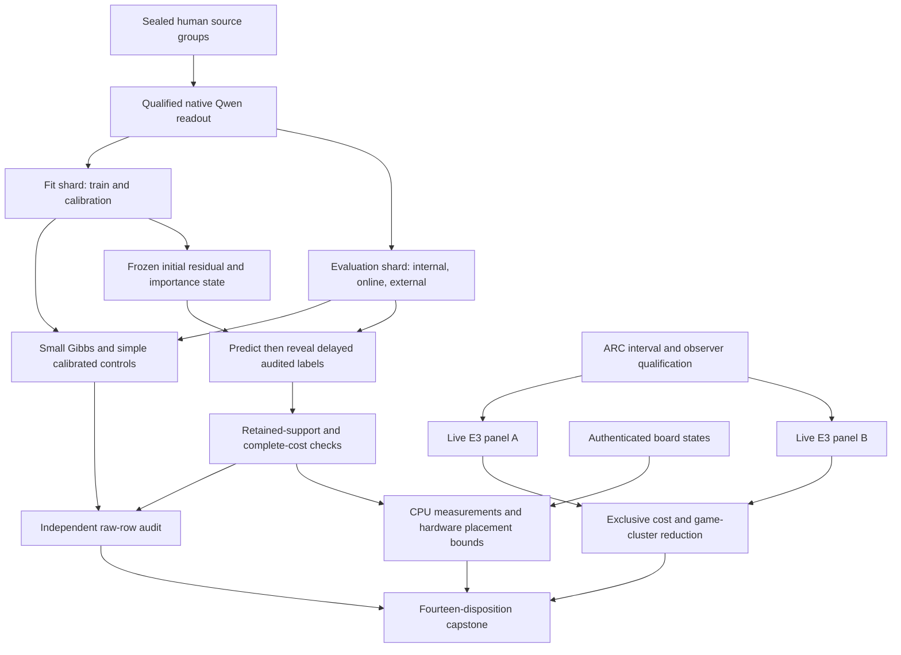
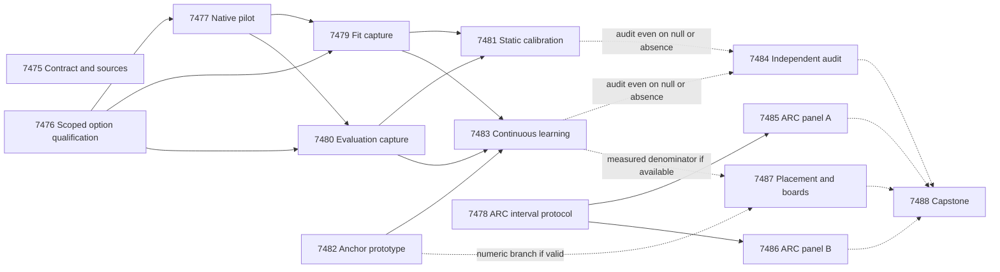

# Carnot Research Roadmap V655: Source Decisions and Retained Learning

**Milestone:** 2026.09.655  
**Title:** Authenticated source decisions, importance-anchored learning, and exclusive ARC cost  
**Created:** 2026-09-21 UTC (2026-09-20 local)  
**Status:** Proposed; not activated  
**Supersedes:** milestone 2026.09.654; its original design is preserved in
`research-roadmap-v654-preserved-20260921.md`.

The headline question is whether authentic source-conditioned Qwen option
scores let a small energy policy make better calibrated decisions, and whether
continuous residual updates retain that value. A separate live ARC branch
measures the cost that a future typed decision could actually remove. It fixes
overlapping timing and obtains a sufficiently broad observational panel before
another intervention. No positive result is assumed.

## What V654 Proved

The terminal artifacts, current source and conductor log take precedence over
the completion archive and older prose. Fourteen task dispositions exist; ten
producer artifacts exist. The other four tasks were blocked downstream of the
option-protocol failure. Completion does not mean all fourteen experiments ran.

| Evidence | Observed result | Consequence for V655 |
|---|---|---|
| Exp7461 | Exact fourteen-task contract and method ingestion completed; null scientific claim. | Reuse the contract pattern without gating independent science on it. |
| Exp7462 | Protocol checks passed, but required `all_python_tests_required_once` failed: 64 failures, 65 collection errors, 6 skips in an interrupted broad run. Artifact remains disqualified. Current code has a scoped repository-health helper. | New qualification must prove affected checks and preserve the failed historical receipt. It must not clear the old flag or repeat the full suite. |
| Exp7463 | Native readout ready; local parity 63/64, lower 95% agreement bound 0.928, median TV 0.009994. Exact scored runtime unavailable. | Do not loosen E0 bounds. Native capture does not require cross-runtime equivalence. No further unchanged Blackwell probe. |
| Exp7464 | Eight archived episodes gave insufficient attribution and game support. | Freeze enough new E6 episodes, with measured exclusive timing. |
| Exp7465/7466/7469/7472 | Source capture pre-gated; static calibration, real continuous learning and prefix-service producer artifacts absent. | Repair the diagnosed prerequisite and split live capture. Prefix optimization waits; do not infer a scientific null from absence. |
| Exp7467 | Factual compact-span canary remained closed; 96/108 evaluation cells unstarted. | Preserve retirement of unchanged compact-span thresholds/decoding. No renamed extraction rerun. |
| Exp7468 | Residual learner, delayed ledger, gradients and recovery qualified on analytic fixtures; circular_positive. | Reuse it, add one retention mechanism, then test actual human-labeled source streams. |
| Exp7470 | Independent audit retained the missing branches and extraction null. | Keep audits unconditional. |
| Exp7471 | Eight live episodes, four games, 16 completed bounded generations, no reproduced progress. Summed seam cost 2996.406 s exceeds live work 1533.540 s. `_cost_bounds` sums intervals. | Investigate nesting/duplicates and use episode-scoped unions. This is evidence of an accounting limitation, not a measured acceleration opportunity. |
| Exp7473 | KV260/PolarFire graduation preserved; GateMate physical prerequisite unchanged. | Keep board continuity; no identical detect or flash attempt. |
| Exp7474 | Fourteen dispositions reported, aggregate science disqualified. | Report completion and scientific success separately. |

Primary local evidence: `results/experiment_7462_v654_option_protocol.json`,
`results/experiment_7463_v654_semif_e0_logprob_parity.json`,
`results/experiment_7468_v654_residual_learner.json`,
`results/experiment_7471_v654_arc_seam_observation.json`, and
`results/experiment_7474_v654_capstone.json`.

## The Three Largest Gaps to the PRD

1. **Source evidence has not become useful, calibrated verification.** The
   program prioritizes real extraction and grounded claims. The latest compact
   extractor is a repeated null, while source-support features never reached
   the main measurement. V655 narrows the claim to support of a supplied full
   response. It measures a typed energy policy against independent human labels
   and simple calibration; it does not claim complete constraint extraction or
   reopen the general external-text verifier moat. Exp7476/7477/7479/7480/7481
   address this gap and advance GAP-ORACLE-DISTINCT/GAP-DETECTOR-AUROC-4208 only
   within that scope.
2. **FR-11 has working mechanisms without demonstrated retained improvement.**
   A prediction ledger and analytic residual learner are not a self-learning
   result. Exp7482/7483 test importance anchoring, delayed feedback, retention
   and complete update cost on later, disjoint source groups. This is Tier 1/2
   learning in a controlled prequential replay, with a CPU implementation and
   an explicit FPGA/TSU placement analysis. It does not update the 27B model.
3. **Runtime and hardware value remain unmeasured at the whole-service level.**
   ARC seam sums overlap, its current observational sample is small, scored
   Blackwell parity is unavailable, and kernel speed says little about feedback
   and persistence. Exp7478/7485/7486 collect exclusive costs on the real live
   path; Exp7487 bounds the new learner's complete service. Hidden-game efficacy
   and a 100x hardware gain remain open questions.

## Research Basis and Scope Decisions

The [V655 source review](../../research-references.md#2026-09-21--v655-planning-source-review)
was appended before this design. It covers all eight requested topics and all
six secondary channels. Semantic Scholar returned 20 EBT citations with a next
page and eight ARM–EBM citations without one. OpenReview's EBT forum was
challenged; readable primary records and author sources are identified there.

| Source | Adopted element | Claim boundary |
|---|---|---|
| [SemIf](https://github.com/TheoLeeCJ/SemIf) | Native final-position option scores; order and token-boundary controls. | GGUF adaptation, not reproduction of its Transformers runtime or public score. |
| [KAN-CL, 2605.12306](https://arxiv.org/html/2605.12306v1) | Importance-weighted per-knot anchoring, tested as a residual-head component. | No backbone training or transfer of the paper's vision gains; uniform and zero-anchor ablations remain required. |
| [Limited-feedback online learning, 2609.05820](https://arxiv.org/abs/2609.05820) | Explicit feedback budget, propensity and availability time. | No imported routing regret bound. |
| [Efficiency Hallucination, 2609.14839](https://arxiv.org/abs/2609.14839) | No-update controls and measured complete-cost claims. | Its code-optimization results are not Carnot measurements. |
| [On-chip spline learning, 2602.02056v4](https://arxiv.org/abs/2602.02056v4) | Account separately for local arithmetic and state movement. | CPU emulation and an Amdahl envelope are not hardware speed evidence. |

EBT/ARM–EBM motivate the energy interface, not a correctness certificate.
T-SKM-Net, DCCD and cross-block Boltzmann fusion stay references because their
next integration would add a new branch before the current question is tested.
Kona remains architectural context. Extropic's Z1T estimates do not grant owned
TSU access. No Needle/NanoJev deployment or prompt-trained alternative generator
is added. The operator's SemIf decisions remain binding: readout is a soft
feature, E0 bounds stay fixed, and scored changes require the full separate gate
ladder. The proposed easier-to-train-engine amendment is not treated as approved.

## V655 Architecture

The semantic labels come from external human annotations. Native confidence is
an input, not an evaluator. Model parameters remain frozen. Online updates see
only already-revealed labels, and the evaluator never supplies future outcomes
to the learner. The ARC policy receives its own frames and actions, without
per-game adapters or stored solutions. Telemetry observes the existing policy.

## Exact Task Contract

**14 tasks, exp7475 through exp7488, in the following conductor order.** This
table is normative. It matches `research-roadmap-next.yaml` exactly, including
IDs, titles, phases, deliverables, substrate classes and structured gates.

| Order | Task ID | Title | Phase | Deliverable | Substrate class | Structured gates |
|---|---|---|---|---|---|---|
| 1 | exp7475-contract-methods | Bind fourteen tasks and ingest methods against terminal V654 evidence | 1 | results/experiment_7475_v655_contract_methods.json | aggregation | None |
| 2 | exp7476-option-qualification | Qualify the existing option protocol with an explicit affected validation scope | 1 | results/experiment_7476_v655_option_qualification.json | no_model_load | None |
| 3 | exp7477-native-readout-pilot | Measure native Qwen option transport before source capture | 1 | results/experiment_7477_v655_native_readout_pilot.json | model_load_no_generation | exp7476-option-qualification.option_protocol_ready_score == 1; exp7476-option-qualification.verdict_class in ["null", "positive", "circular_positive"]; exp7476-option-qualification.flagged_adversarial == false |
| 4 | exp7478-arc-interval-protocol | Qualify exclusive ARC timing and seal two independent live panels | 1 | results/experiment_7478_v655_arc_interval_protocol.json | aggregation | None |
| 5 | exp7479-source-fit-capture | Capture Qwen training and calibration source-option rows | 2 | results/experiment_7479_v655_source_fit_capture.json | model_load_no_generation | exp7476-option-qualification.option_protocol_ready_score == 1; exp7476-option-qualification.verdict_class in ["null", "positive", "circular_positive"]; exp7476-option-qualification.flagged_adversarial == false; exp7477-native-readout-pilot.native_readout_ready_score == 1; exp7477-native-readout-pilot.verdict_class in ["null", "positive"]; exp7477-native-readout-pilot.flagged_adversarial == false |
| 6 | exp7480-source-eval-capture | Capture Qwen internal-test, online and external source-option rows | 2 | results/experiment_7480_v655_source_eval_capture.json | model_load_no_generation | exp7476-option-qualification.option_protocol_ready_score == 1; exp7476-option-qualification.verdict_class in ["null", "positive", "circular_positive"]; exp7476-option-qualification.flagged_adversarial == false; exp7477-native-readout-pilot.native_readout_ready_score == 1; exp7477-native-readout-pilot.verdict_class in ["null", "positive"]; exp7477-native-readout-pilot.flagged_adversarial == false |
| 7 | exp7481-typed-calibration | Train typed energy decisions on authenticated source readouts | 2 | results/experiment_7481_v655_typed_calibration.json | no_model_load | exp7479-source-fit-capture.fit_capture_ready_score == 1; exp7479-source-fit-capture.verdict_class in ["null", "positive"]; exp7479-source-fit-capture.flagged_adversarial == false; exp7480-source-eval-capture.evaluation_capture_ready_score == 1; exp7480-source-eval-capture.verdict_class in ["null", "positive"]; exp7480-source-eval-capture.flagged_adversarial == false |
| 8 | exp7482-importance-anchor | Prototype importance anchoring on the existing delayed residual learner | 3 | results/experiment_7482_v655_importance_anchor.json | no_model_load | None |
| 9 | exp7483-continuous-learning | Measure prequential residual learning with delayed human-source feedback | 3 | results/experiment_7483_v655_continuous_learning.json | no_model_load | exp7479-source-fit-capture.fit_capture_ready_score == 1; exp7479-source-fit-capture.verdict_class in ["null", "positive"]; exp7479-source-fit-capture.flagged_adversarial == false; exp7480-source-eval-capture.evaluation_capture_ready_score == 1; exp7480-source-eval-capture.verdict_class in ["null", "positive"]; exp7480-source-eval-capture.flagged_adversarial == false; exp7482-importance-anchor.importance_anchor_ready_score == 1; exp7482-importance-anchor.verdict_class in ["null", "positive", "circular_positive"]; exp7482-importance-anchor.flagged_adversarial == false |
| 10 | exp7484-decision-audit | Independently reduce source decisions and delayed learning from raw rows | 3 | results/experiment_7484_v655_decision_audit.json | aggregation | None |
| 11 | exp7485-arc-cost-panel-a | Measure exclusive live ARC decision cost on sealed panel A | 4 | results/experiment_7485_v655_arc_cost_panel_a.json | model_bounded_generation | exp7478-arc-interval-protocol.arc_interval_protocol_ready_score == 1; exp7478-arc-interval-protocol.verdict_class in ["null", "positive", "circular_positive"]; exp7478-arc-interval-protocol.flagged_adversarial == false |
| 12 | exp7486-arc-cost-panel-b | Measure exclusive live ARC decision cost on sealed panel B | 4 | results/experiment_7486_v655_arc_cost_panel_b.json | model_bounded_generation | exp7478-arc-interval-protocol.arc_interval_protocol_ready_score == 1; exp7478-arc-interval-protocol.verdict_class in ["null", "positive", "circular_positive"]; exp7478-arc-interval-protocol.flagged_adversarial == false |
| 13 | exp7487-learning-placement | Measure anchor service costs and preserve board prerequisites | 4 | results/experiment_7487_v655_learning_placement.json | no_model_load | None |
| 14 | exp7488-capstone | Reconcile fourteen outcomes and decide each research branch | 4 | results/experiment_7488_v655_capstone.json | aggregation | None |

## Phase 1: Qualify the Existing Interfaces

Protocol and instrumentation prototypes receive scoped validation before live work. The contract task is advisory. Native readout qualification is independent of cross-runtime parity; ARC timing qualification is independent of source readout.

### exp7475-contract-methods: Bind fourteen tasks and ingest methods against terminal V654 evidence

V654 has fourteen dispositions but only ten producer artifacts. Exp7462 is disqualified; four dependent measurements never ran. Exp7467 is a valid extraction null, Exp7468 is analytic circular evidence, and Exp7474 is disqualified. Conductor completion is not scientific success.

**Hypothesis:** An exact contract and a source-to-method map can make the next measurements executable without rehabilitating invalid historical evidence.

1. Resolve only the YAML with milestone 2026.09.655: the next file before activation, the active file only after activation. Compare all fourteen ordered IDs exp7475 through exp7488, titles, phases, deliverables, substrate classes and complete gate triples against the markdown task contract. Mutate count, order, ID, field, path and milestone in private fixtures; every mismatch must fail.

2. Authenticate all fourteen V654 dispositions from producer or conductor pre-gate bytes. Read the capstone paths, including results/experiment_7465_source_option_capture.json when that is the actual pre-gate path. Record absent producers explicitly. Keep original flags, validation failures and the extraction retirement. Do not require the lagging completion archive to be current.

3. Ingest at most six primary methods from the V655 references review: SemIf native readout, KAN-CL anchoring, support-overlap limits, budgeted feedback, efficiency-claim controls and hardware locality. Write docs/research-notes/v655-method-ingestion.md and update research-studying.md with revision, usable component, failure mode and experiment mapping. Distinguish the KAN-CL component study from the full CNN/backbone system. Use low-concurrency source requests; no research-agent fan-out.

4. Run schema, gate, exclusion, ARC-floor and overdue-priority checks unchanged. Map the live E6 follow-up to exp7478/7485/7486, calibration to exp7481, and FR-11 to exp7482/7483. Record the inaccessible scored Blackwell runtime and user-forbidden conductor obligation as deferred. This task is advisory; it is not a parent gate for independent science.

**Deliverable:** `results/experiment_7475_v655_contract_methods.json`. **Measured/ready fields:** `contract_ready_score`, `method_rows`, `v654_dispositions`, `unresolved_obligations`.

### exp7476-option-qualification: Qualify the existing option protocol with an explicit affected validation scope

Exp7462 failed all_python_tests_required_once with unrelated repository errors, despite passing protocol checks. Current source already contains previous_repository_health(), which separates this observation. The terminal artifact remains disqualified; source changes alone do not qualify it.

**Hypothesis:** A fresh, narrowly scoped qualification can validate the real option interface and sealed cohort without rerunning the unrelated full suite or clearing the old artifact.

1. Read the exact failed receipt and current previous_repository_health implementation. First reproduce its classification on frozen receipt fixtures. Reuse the corrected helper if already sufficient; make only the minimal producer-side change if a new failing test shows a defect. Never overwrite results/experiment_7462_v654_option_protocol.json or alter validation guard semantics.

2. Freeze the new affected manifest before running checks. Historical all_python_tests_required_once remains a failed repository-health observation, never relabeled passed. Required checks are current affected unit tests, changed-module coverage, lint, type checks, spec coverage, raw reduction and cold replay. Mutation tests must prove that a failed affected check still closes readiness, while the unrelated old suite failure remains visible.

3. Revalidate exact final evaluated-token position, single-token option labels at their prompt boundary, finite raw logits, missing-option failure, remapping on order reversal and no unused-buffer read. Scripted controls qualify only the interface. No model is loaded.

4. Reauthenticate and preserve the Exp7462 group roles: training 180, calibration 60, internal test 60, online 160, external FaithBench 74 (534 total). Freeze source-text hashes, label provenance, licenses, selected response IDs and the 2048-token no-truncation rule. Development transport probes must use separate disjoint groups. No outcome-based replacement or silent cohort expansion.

5. Seal the V655 statistical protocol before capture: binary Brier, group-level uncertainty, five fitting seeds, calibration-only model choice, untouched external assessment, and the cost grid from the design document. Publish option_protocol_ready_score=1 only if all protocol-validity and current required checks pass. Count overlength and unavailable groups later; failure to meet efficacy sample floors is not an interface failure.

**Deliverable:** `results/experiment_7476_v655_option_qualification.json`. **Measured/ready fields:** `option_protocol_ready_score`, `cohort_manifest`, `comparison_plan`, `repository_health`.

### exp7477-native-readout-pilot: Measure native Qwen option transport before source capture

Exp7463 qualified native readout but cross-runtime parity failed its registered lower confidence bound: 63/64 agreements, Wilson lower 0.928. Scored runtime was unavailable. This study uses one authenticated native runtime and makes no server or Blackwell parity claim.

**Hypothesis:** A bounded no-generation pilot can establish raw-logit transport and per-prompt cost without making predictive accuracy a prerequisite for measuring the model.

1. Build one reusable native readout runner over the existing Qwen helper. Record weight SHA, tokenizer identity, chat-template bytes, llama.cpp build, prompt token IDs and actual last evaluated position. Use fresh KV state for each unrelated prompt. Do not introduce an HTTP adapter or prefix cache.

2. Use twelve disjoint development source groups frozen by hash before outcomes; evaluate both label orders once, plus four deterministic transport controls, for at most 28 forwards. Freeze the prompt before looking at labels. MODEL_SPECS contains the mandated Qwen; call eval/forward only and generate zero tokens. Limit current live work to 600 seconds with one owned lease.

3. Require all requested option logits and token-boundary receipts, finite values and complete invocation accounting. Detect label swaps, token-position mistakes, constant stub vectors and accidental state reuse through explicit controlled fixtures. Record natural uniform or inaccurate predictions as observations, not transport failure. Do not gate on predictive accuracy or on order agreement of real source cases.

4. Measure load and per-prompt prefill distributions to bound the two capture shards. Keep their fixed group roster and hard caps; if the measured throughput cannot finish it, produce a feasibility shortfall with all unstarted cells. Do not lower confidence gates, pad durations or replace Qwen with a small model.

5. Publish native_readout_ready_score=1 only for authenticated transport; a valid predictive null still permits downstream capture. Reconcile E0 as deferred: this native pilot does not reopen scored deployment or certify server parity.

**Deliverable:** `results/experiment_7477_v655_native_readout_pilot.json`. **Measured/ready fields:** `native_readout_ready_score`, `prompt_identity`, `pilot_cost_rows`, `scored_runtime_parity_score`.

### exp7478-arc-interval-protocol: Qualify exclusive ARC timing and seal two independent live panels

Exp7471 reports 2,996.406 seconds of summed seam intervals inside 1,533.540 seconds of live work. Its _cost_bounds sums intervals and does not form their union. Nested spans and repeated decision IDs must be examined before interpreting replaceable cost. Eight episodes across four games are below E6 support floors.

**Hypothesis:** Episode-scoped interval unions and explicit parentage can recover an auditable upper bound without treating nested work or blocked calls as independently replaceable.

1. Independently reduce all eight stored Exp7471 episodes with keys (run, process, episode, decision, seam). Diagnose duplicate IDs, nested spans, retries, cross-process clocks and incomplete intervals. Compute exclusive stage times and interval unions within each episode. Preserve original summed figures as historical facts; do not rewrite the producer artifact.

2. Prototype an observer-only timing reducer and minimally extend default-off telemetry only if the raw fields are insufficient. Keep text-generation, world-model construction, verifier work, dispatch, idle time and observation overhead separate. A generation span is not replaceable just because it is inside a decision seam. Bound uncertainty when attribution is absent.

3. Test nested and crossing intervals, duplicates, zero-duration events, mismatched clocks, absent ends, killed children and per-episode reset. Require 0 <= replaceable_lower <= replaceable_upper <= observed episode duration; require stage-union totals plus unattributed time to reconcile within timestamp resolution. A forged duplicate must not increase time.

4. Prove observer parity for actions, provenance, random state and call order on deterministic scripts and the existing private ARC smoke. This task makes no live-model claim. Record current test-environment calls separately from archived model events.

5. Seal an E6-only roster before new outcomes: twelve games = the nine frozen E4 games plus the next unused hash-ranked game per interface stratum (vc33, g50t, dc22), using the published roster rule. Do not alter the E4 roster. Select the same three fixed episode seeds for all games: 65501, 65502, 65503. Partition six games per shard as defined in the design document: 18 episodes each, 36 total. Each task uses the same driver, 180 actions, two requests of at most 256 new tokens, 240-second episode cap and 3600-second total live cap. Exp7471 episodes took 186.7-191.5 seconds, so a 180-second episode cap would censor every measured precedent. Missing games remain unavailable rows; no replacements.

6. Publish arc_interval_protocol_ready_score for a valid measurement pipeline and raw-field sufficiency only. Archive a 36-row unstarted schedule with hashes and capability E2E receipts. Neither a prior null nor a lack of level progress blocks the scheduled observation. Preserve the operator rule that readout remains a soft feature: no selector control, E4/E5 intervention, scored submission, or extra model is authorized here.

**Deliverable:** `results/experiment_7478_v655_arc_interval_protocol.json`. **Measured/ready fields:** `arc_interval_protocol_ready_score`, `interval_rows`, `arc_schedule_manifest`, `timing_correction`, `observer_parity`.

## Phase 2: Capture Real Source Evidence and Test Typed Decisions

Two capture tasks divide the fixed cohort so model execution stays bounded. They share only qualified transport. The energy head is evaluated against same-information simple models. A valid null still produces useful inputs for the online experiment.

### exp7479-source-fit-capture: Capture Qwen training and calibration source-option rows

Exp7465 never ran because Exp7462 was disqualified. V655 now separates qualification from capture and splits the fixed corpus into two bounded independently gated jobs. No inherited aggregate metric counts as a current model call.

**Hypothesis:** Authenticated native readout can supply training and calibration evidence with source and option-order controls, even if its predictive signal is null.

1. Use the sealed 180 training and 60 calibration groups; no other roles enter this shard. Reuse the native runner from Exp7477 and the pinned human annotations. One chosen response per source group is the independent unit. Keep full source-plus-response within 2048 tokens without truncation; record all overlength exclusions before scoring and retain their original roster position.

2. Evaluate both label orders for every eligible group, with at most 520 forwards: 480 main forwards plus 40 source-shuffle control forwards on twenty preregistered groups. Same prompt, tokens and model build as the pilot. Freeze a label-independent derangement among source groups; shuffled-source rows have no factual gold label and test sensitivity only. One owned Qwen load; zero generated tokens; at most 3300 seconds live work.

3. Save raw two-option logits, token IDs, source/response/prompt hashes, mapped probabilities, order, timing, model receipt, errors and completion state after every group. Correctly remap probabilities before averaging the two orders. Record requested CUDA placement and observed owned PID/GPU UUID/VRAM. Labels and annotation text never enter prompts or feature transforms.

4. Balance planned, attempted, completed, failed, censored and unstarted cells. A budget expiry does not license dropping cells or relabeling partial data complete. Resume only identical hash-bound requests. Empty, missing or nonfinite required outputs close the capture-ready gate; predictive ties or model errors do not.

5. Publish fit_capture_ready_score=1 only when every planned cell has a terminal disposition, all eligible main/order/control calls complete with valid receipts, and the frozen role minima pass. Minima remain train>=150/calibration>=40 or internal>=40/online>=120/external>=60 as applicable. Keep separate completeness and sample-support fields. Do not substitute one role for another. Preserve low-support data for unconditional audit.

**Deliverable:** `results/experiment_7479_v655_source_fit_capture.json`. **Measured/ready fields:** `fit_capture_ready_score`, `role_counts`, `raw_logit_shards`, `capture_complete_score`, `confirmatory_support_score`.

### exp7480-source-eval-capture: Capture Qwen internal-test, online and external source-option rows

Exp7465 never ran because Exp7462 was disqualified. V655 now separates qualification from capture and splits the fixed corpus into two bounded independently gated jobs. No inherited aggregate metric counts as a current model call.

**Hypothesis:** Authenticated native readout can supply internal-test, online and external evidence with source and option-order controls, even if its predictive signal is null.

1. Use the sealed 60 internal-test, 160 online and 74 external FaithBench groups; no other roles enter this shard. Reuse the native runner from Exp7477 and the pinned human annotations. One chosen response per source group is the independent unit. Keep full source-plus-response within 2048 tokens without truncation; record all overlength exclusions before scoring and retain their original roster position.

2. Evaluate both label orders for every eligible group, with at most 628 forwards: 588 main forwards plus 40 source-shuffle control forwards on twenty preregistered groups. Same prompt, tokens and model build as the pilot. Freeze a label-independent derangement among source groups; shuffled-source rows have no factual gold label and test sensitivity only. One owned Qwen load; zero generated tokens; at most 3300 seconds live work.

3. Save raw two-option logits, token IDs, source/response/prompt hashes, mapped probabilities, order, timing, model receipt, errors and completion state after every group. Correctly remap probabilities before averaging the two orders. Record requested CUDA placement and observed owned PID/GPU UUID/VRAM. Labels and annotation text never enter prompts or feature transforms.

4. Balance planned, attempted, completed, failed, censored and unstarted cells. A budget expiry does not license dropping cells or relabeling partial data complete. Resume only identical hash-bound requests. Empty, missing or nonfinite required outputs close the capture-ready gate; predictive ties or model errors do not.

5. Publish evaluation_capture_ready_score=1 only when every planned cell has a terminal disposition, all eligible main/order/control calls complete with valid receipts, and the frozen role minima pass. Minima remain train>=150/calibration>=40 or internal>=40/online>=120/external>=60 as applicable. Keep separate completeness and sample-support fields. Do not substitute one role for another. Preserve low-support data for unconditional audit.

**Deliverable:** `results/experiment_7480_v655_source_eval_capture.json`. **Measured/ready fields:** `evaluation_capture_ready_score`, `role_counts`, `raw_logit_shards`, `capture_complete_score`, `confirmatory_support_score`.

### exp7481-typed-calibration: Train typed energy decisions on authenticated source readouts

The V654 calibration task had no producer evidence. Earlier handcrafted-feature selectors were valid nulls. V655 provides raw native source-conditioned option scores and preserves simple controls and human source labels.

**Hypothesis:** A small Gibbs selector using source-conditioned readout and existing verifier signals improves external probability quality or typed-decision utility over matched simple calibration.

1. Use only training groups to fit five compact Gibbs heads and calibration groups to choose hyperparameters. Input features are remapped order-averaged native log-odds, frozen existing verifier signal and missingness. Never use gold spans, source IDs, response-generator identity, future labels or outcome notes as features. Do not train Qwen.

2. Fit controls: raw readout, scalar-temperature calibration, regularized logistic with identical features, and verifier-only Gibbs. Freeze transforms, architectures, optimizer, fitting seeds 655101 through 655105 and checkpoint hashes before opening test labels. Use a process boundary to keep held-out labels out of fitting. Log small_ebm_training separately from zero LLM calls.

3. Evaluate every frozen group-arm-seed on the internal and external roles. Primary probability gate: external binary Brier delta <= -0.01, with paired source-group bootstrap 95 percent upper bound <0 against both temperature and logistic; use Holm correction across those two tests. Require log-loss noninferiority (upper delta <=0.01). Report AUROC, ECE, class support, failures and coverage; seeds do not multiply group count.

4. Report accept/reject/escalate on the sealed cost grid: false-reject cost 1; false-accept costs 1,5,20; escalation costs 0.1,0.5,1. Choose each policy on calibration only. A typed-decision value claim requires >=20 percent non-escalation and cost improvement with Holm-adjusted group-level upper interval <0 versus the calibration-selected best simple policy on at least one preregistered grid cell. Report the entire grid and no universal deployment certificate.

5. Add shuffled-training-label and source-removal feature ablations. Do not treat source-shuffled responses as gold-negative examples. Record a probability benefit and a decision benefit separately; valid ties or shortfalls are null. Produce frozen initial states for Exp7483 even on valid null. Cap numerical fitting and interval estimation at 1200 seconds.

**Deliverable:** `results/experiment_7481_v655_typed_calibration.json`. **Measured/ready fields:** `calibration_complete_score`, `probability_benefit_score`, `decision_benefit_score`, `small_ebm_training`, `frozen_policy_manifest`.

## Phase 3: Test Retained Continuous Learning

A single paper-derived retention component extends an existing learner. Analytic qualification precedes prequential evaluation, followed by an unconditional independent audit. Static calibration benefit is deliberately absent from the online gates.

### exp7482-importance-anchor: Prototype importance anchoring on the existing delayed residual learner

Exp7468 already qualified delayed prediction records, residual energy signs, restart and local gradients on analytic fixtures. It did not establish learning value. The KAN-CL paper proposes a specific retention mechanism; the current task tests only its head anchoring component.

**Hypothesis:** Per-knot importance anchoring can reduce retained-support drift without preventing adaptation; an overly strong anchor may instead block useful updates.

1. Reuse the current residual head and prediction ledger. Add a bounded diagonal importance estimate and a reference coefficient vector; compute the anchor penalty from previously revealed labels only. Qwen features and generator weights remain frozen. Read the primary KAN-CL method, then document every departure: no CNN, no backbone EWC and a prequential feedback stream.

2. Derive and test the chosen loss and gradient against finite differences. Compare lambda=0, a uniform diagonal anchor, and importance-weighted anchoring with the same parameter count, replay buffer, learning-rate search budget and update opportunities. Cap the head at 256 coefficients. Hyperparameter candidates are frozen here and selected only on training/calibration in the online trial.

3. Use analytic overlapping-support and disjoint-support fixtures, deliberately conflicting labels, an excessive-anchor control, zero-learning-rate control, duplicate/delayed feedback, reordered events and crash recovery. A fixture benefit is circular_positive at most. The observer must retain prediction-time feature vectors and pre-update probabilities.

4. Implement the complete diagonal penalty faithfully, including movement of previously changed but currently inactive coefficients. Do not claim active-basis-only cost if the anchor touches the full vector. Record active data-gradient count and total anchor work separately; optimization such as lazy materialization requires exact dense-reference parity.

5. Publish importance_anchor_ready_score=1 only for implementation and state-lifecycle validity. Keep the historical unanchored residual as an empirical comparator. Do not replace an unchanged four-expert mixture or silently weaken its retirement. Bound fixture fitting at 600 seconds.

**Deliverable:** `results/experiment_7482_v655_importance_anchor.json`. **Measured/ready fields:** `importance_anchor_ready_score`, `anchor_definition`, `active_and_total_work`, `state_replay_checks`.

### exp7483-continuous-learning: Measure prequential residual learning with delayed human-source feedback

Exp7469 had no producer evidence because source capture was blocked. This task uses current Qwen features and historical human labels revealed in a sealed stream. It is a continuous learner experiment, not live deployment feedback or self-generated ground truth.

**Hypothesis:** Importance-anchored residual updates improve later decisions while retaining earlier source-support behavior at a measured feedback and durability cost.

1. Freeze all initial states from training/calibration. The canonical base is temperature-calibrated readout, so online evaluation does not depend on a Gibbs benefit. Independently fit this baseline from the fit shard if Exp7481 is absent; report that branch provenance. Choose anchor strengths and rates using training/calibration pseudo-streams only. The actual online 160 groups and internal retention labels remain unavailable to selection.

2. Replay five prespecified order seeds with source-family blocks and fixed label-independent within-block order. For each stream use delays 0 and 8 and label-audit probability 0.5. Record predictions before label release, event time, propensity, feedback time, accepted/rejected updates and state hashes. Score all groups in an evaluator process; only the randomized revealed labels enter updates. Describe this as controlled prequential replay, not natural chronological deployment.

3. Compare frozen baseline, online affine calibration, unanchored residual with replay, uniform anchor with replay, importance anchor with the identical replay, and shuffled-feedback control. Include zero-rate control. No arm receives more feedback or oracle labels. Use the historical residual implementation rather than redesigning the control to lose.

4. Primary gate: on >=120 eligible independent online groups, the importance arm reduces prequential binary Brier by >=0.01 and has adjusted paired group/block-bootstrap upper delta <0 versus frozen, affine and unanchored residual; apply Holm across three tests. Aggregate the five stream-order replicates within group, not as independent samples. Report each delay separately and require both for the headline.

5. Evaluate the frozen internal retention panel before and after each stream, never for update acceptance. Require retention Brier upper delta <=0.01, zero feedback chronology violations and exact crash replay of acknowledged updates. Compare uniform to importance anchoring to distinguish regularization from importance estimation. A static tie never blocks execution; valid failure of benefit or retention is null.

6. Measure prediction, feedback processing, update, replay guard, serialization, fsync and restart cost, including no-op controls. Save per-event shards and state checkpoints. Cap numeric work at 1500 seconds. If current evidence is invalid declare disqualified; if required capture is absent declare blocked. Retire this exact construction after a valid repeated no-benefit result, preserving broader FR-11 work.

**Deliverable:** `results/experiment_7483_v655_continuous_learning.json`. **Measured/ready fields:** `online_complete_score`, `online_benefit_score`, `feedback_ledger`, `retention_rows`, `service_cost_rows`.

### exp7484-decision-audit: Independently reduce source decisions and delayed learning from raw rows

Exp7470 correctly preserved two missing branches and the extraction null. The V655 audit must run after any upstream outcome, including blocked or disqualified artifacts, and cannot depend on a positive benefit gate.

**Hypothesis:** A cold independent reducer can either reproduce the proposed calibration and learning claims or locate the precise row-level contradiction.

1. Run unconditionally. Resolve each expected producer path or actual conductor pre-gate path; absent and invalid branches get explicit terminal dispositions. Do not infer result fields from similarly named older files. Preserve original bytes and flags.

2. Independently reconstruct token-label remapping, group splits, feature transforms, Brier/log-loss, cost-grid decisions and intervals from raw shards and frozen checkpoints. Do not call producer headline-reduction functions. Check that generation_calls=0 for native readouts and current load/forward counts balance.

3. Cold-replay delayed updates from prediction-time records. Confirm no online/test labels enter fitting, anchor estimates, replay guards or policy choice. Treat stream seeds as repeated measurements of the same source groups. Check support, class balance, exclusions and missing rows against the original roster.

4. Attack private copied evidence with swapped option IDs, one duplicated source group, a future-label update, a missing failed row, a changed checkpoint, a fabricated speedup and an oracle flag mismatch. Every attack must fail its intended check. A valid null remains valid; only actual invalidity becomes disqualified.

5. Write docs/research-notes/v655-decision-audit.md with independent branch dispositions and measured causes. No current LLM or hardware calls. Emit audit_complete_score independent of scientific benefit; external absence is blocked, never partial.

**Deliverable:** `results/experiment_7484_v655_decision_audit.json`. **Measured/ready fields:** `audit_complete_score`, `independent_metric_rows`, `attack_rows`, `branch_dispositions`.

## Phase 4: Measure Live Service Cost and Reconcile

Two independent ARC panels meet the E6 sample budget without a single oversized run. Placement retains all three board states. The capstone independently reduces every branch, including blocked and null ones.

### exp7485-arc-cost-panel-a: Measure exclusive live ARC decision cost on sealed panel A

E6 needs at least 30 attributed episodes across 10 games. Exp7471 had eight across four and overlapping stage costs; the V655 instrument is qualified independently. Two disjoint 18-episode tasks fit under the conductor wall cap. These are live generalization observations, not a new public-game solving campaign.

**Hypothesis:** Correctly attributed live episodes can establish whether any typed seam has replaceable cost worth a later intervention, while preserving actual agent progress and failures.

1. Use exactly panel A games sk48, tr87, s5i5, lp85, lf52, cn04 and seeds 65501,65502,65503 (18 episodes). Reuse the Exp7478 driver; panel B must not depend on panel A success. Resolve real environments, registry-precheck known solved levels for credit accounting only, and withhold registry mechanics from the policy. No unavailable game is replaced after outcomes.

2. Run the actual E3 choose_action/is_done loop from clean per-game state with adapters, stored engines, banked trajectories, cross-game fitted state and game-source reads disabled. Permit only the agent own observations, attempted actions and runtime induction. Keep the AVO-inspired memory/supervision path as currently implemented, and record whether it was actually reached. No offline ground-truth BFS or hand GameAdapter.

3. Use one owned native CUDA Qwen3.8-27B-GGUF runtime; at most two generation requests per episode, 256 new tokens per request, 180 actions, 240 seconds per episode and 3600 seconds current live work. Reserve the remaining task time for the thin wrapper and validation; the qualified driver already exists. These small fixed generation budgets are model_bounded_generation (10-second floor), even if the panel takes an hour. Declare actual model invocation when a call fails or times out; no borrowed historical live receipts.

4. Record exclusive timing, raw options/decision seams, request tokens, failed calls, induction completion, verifier feedback exposure, action outcomes and censored actions-to-progress. Preserve observer parity and flush per-action/checkpoint progress. Stop and join only owned children at budget limits; write all unstarted episodes explicitly.

5. Report per-game and per-seed rows, opportunity to invoke supervision, no-op/delegate decisions, and lower/upper genuinely replaceable cost. A world-model generation or verification interval cannot be counted as removable by a one-token selector without a valid semantic replacement. Reproduce any observed level progress from the current action trace before recording it; solve_provenance is exactly live_agent_self_discovery, and registered public levels receive no new credit.

6. Complete the observation as null unless it supports a narrowly stated measurement finding; do not infer hidden-game improvement, selector efficacy, E0 parity or E4/E5 readiness. Capstone pools both panels only after exact runtime/budget/instrument identity checks. No remote submission or scored-path behavior change.

**Deliverable:** `results/experiment_7485_v655_arc_cost_panel_a.json`. **Measured/ready fields:** `arc_panel_a_complete_score`, `per_game_results`, `solve_provenance`, `offline_reproduced`, `reproduced_levels`, `exclusive_cost_rows`, `generalization_scope`.

### exp7486-arc-cost-panel-b: Measure exclusive live ARC decision cost on sealed panel B

E6 needs at least 30 attributed episodes across 10 games. Exp7471 had eight across four and overlapping stage costs; the V655 instrument is qualified independently. Two disjoint 18-episode tasks fit under the conductor wall cap. These are live generalization observations, not a new public-game solving campaign.

**Hypothesis:** Correctly attributed live episodes can establish whether any typed seam has replaceable cost worth a later intervention, while preserving actual agent progress and failures.

1. Use exactly panel B games tu93, g50t, tn36, vc33, re86, dc22 and seeds 65501,65502,65503 (18 episodes). Reuse the Exp7478 driver; panel B must not depend on panel A success. Resolve real environments, registry-precheck known solved levels for credit accounting only, and withhold registry mechanics from the policy. No unavailable game is replaced after outcomes.

2. Run the actual E3 choose_action/is_done loop from clean per-game state with adapters, stored engines, banked trajectories, cross-game fitted state and game-source reads disabled. Permit only the agent own observations, attempted actions and runtime induction. Keep the AVO-inspired memory/supervision path as currently implemented, and record whether it was actually reached. No offline ground-truth BFS or hand GameAdapter.

3. Use one owned native CUDA Qwen3.8-27B-GGUF runtime; at most two generation requests per episode, 256 new tokens per request, 180 actions, 240 seconds per episode and 3600 seconds current live work. Reserve the remaining task time for the thin wrapper and validation; the qualified driver already exists. These small fixed generation budgets are model_bounded_generation (10-second floor), even if the panel takes an hour. Declare actual model invocation when a call fails or times out; no borrowed historical live receipts.

4. Record exclusive timing, raw options/decision seams, request tokens, failed calls, induction completion, verifier feedback exposure, action outcomes and censored actions-to-progress. Preserve observer parity and flush per-action/checkpoint progress. Stop and join only owned children at budget limits; write all unstarted episodes explicitly.

5. Report per-game and per-seed rows, opportunity to invoke supervision, no-op/delegate decisions, and lower/upper genuinely replaceable cost. A world-model generation or verification interval cannot be counted as removable by a one-token selector without a valid semantic replacement. Reproduce any observed level progress from the current action trace before recording it; solve_provenance is exactly live_agent_self_discovery, and registered public levels receive no new credit.

6. Complete the observation as null unless it supports a narrowly stated measurement finding; do not infer hidden-game improvement, selector efficacy, E0 parity or E4/E5 readiness. Capstone pools both panels only after exact runtime/budget/instrument identity checks. No remote submission or scored-path behavior change.

**Deliverable:** `results/experiment_7486_v655_arc_cost_panel_b.json`. **Measured/ready fields:** `arc_panel_b_complete_score`, `per_game_results`, `solve_provenance`, `offline_reproduced`, `reproduced_levels`, `exclusive_cost_rows`, `generalization_scope`.

### exp7487-learning-placement: Measure anchor service costs and preserve board prerequisites

The prior durable-delta path missed its speed gate, prefix-service never ran, and GateMate still lacks a changed physical prerequisite. A new importance anchor changes the arithmetic and state footprint; it cannot inherit an active-basis-only acceleration estimate.

**Hypothesis:** The measured full cost of a retained-state anchor identifies whether CPU suffices or which fraction would have to move onto an accelerator for a 100x service target.

1. Run the board evidence branch unconditionally. Authenticate the latest KV260 and PolarFire graduation transcripts and preserve their exact scope and dates. Check for an operator-authored GateMate cable/port/power/JTAG change after the last physical failure; absent change means a terminal blocked board row and zero new detect/flash commands. Do not repeatedly probe unchanged hardware. Future KV260 access uses ssh kria only.

2. If Exp7482 provides a valid learner, measure anchor data-gradient, full diagonal penalty, importance update, prediction, serialization, fsync and recovery over 32,64,128,256 coefficients and 1000 updates at three seeds. Compare the correct float64 implementation, float32 and an explicit fixed-point emulation with frozen clipping/rounding; include identical no-update durable-state controls. These are CPU numeric measurements, not FPGA execution. Missing learner evidence blocks only the numeric branch.

3. Check complete replay and decision parity before interpreting any numeric cost reduction. Report per-size/seed costs, prediction error and decision flips; require zero flips and probability error <=1e-4 on the fixed fixture to label an emulation deployable. Do not silently relax the unchanged acknowledgement boundary.

4. Use compatible measured raw-capture and online-service rows to compute the denominator including tokenization, prefill, verifier work, feedback, all updates and durable writes. If these rows are absent, report only a numeric microbenchmark plus symbolic bounds. Do not add incompatible medians or simulated chip latencies into a measured end-to-end speedup.

5. For an accelerated fraction f and kernel speed r, report S=1/((1-f)+f/r), including r approaching infinity. A 100x service path requires the unaccelerated fraction below 1 percent; explicitly report when that is infeasible. Keep sparse arithmetic targets separate from observed service performance. Map candidate operations to CPU counters, GPU batches, and future FPGA/TSU support, respecting KV260 k_max<=5.

6. Write docs/research-notes/v655-learning-placement.md with measured and conditional rows, current board dates, required physical changes, and a continue/defer decision. No new hardware purchase, installation, board flash, vendor access or prefix-cache implementation. A valid no-speedup finding is null; unchanged external board absence never becomes partial.

**Deliverable:** `results/experiment_7487_v655_learning_placement.json`. **Measured/ready fields:** `placement_complete_score`, `numeric_cost_rows`, `service_envelope`, `board_rows`, `hardware_operations_issued`.

### exp7488-capstone: Reconcile fourteen outcomes and decide each research branch

V654 capstone was complete as a report but disqualified as required science. V655 must preserve the difference between fourteen recorded dispositions and a successful scientific milestone. Independent ARC and hardware branches must remain visible if source capture blocks.

**Hypothesis:** Independent aggregation can give a terminal branch decision without converting missing science into a retry loop or valid nulls into successes.

1. Run regardless of all upstream verdicts. Recheck the exact fourteen-task markdown/YAML contract and create fourteen ordered task_dispositions including the capstone itself. Distinguish current producer evidence, conductor pre-gate bytes, absent artifacts, flags and original verdicts. The reporting-complete score does not certify science.

2. Use Exp7484 independent metrics where valid; otherwise independently audit the available source rows and name the missing checks. Report static calibration, typed cost-grid value, prequential improvement, retention and complete service cost separately. Exclude flagged science from positive aggregates without deleting it from dispositions.

3. Pool ARC panels only when model/build, budget, observer schema and clock semantics match. Independently recompute per-episode interval unions and game-cluster intervals. E6 support requires >=30 fully attributed completed episodes and >=10 independent games. Planned 36/12 is not measured 36/12. If censoring or unavailable games miss the floor, report a sample-limited null and retain all rows. Do not borrow older partial episodes to reach the count.

4. Estimate genuinely replaceable cost share and the perfect-removal ceiling only from nonoverlapping eligible intervals. Require a strictly positive 95 percent lower bound before describing a measured opportunity. Separate that opportunity from intervention benefit: no E4/E5, Blackwell parity or hidden efficacy was tested. Preserve actions-to-progress censoring and all observed failures.

5. Give continue/defer/retire for each branch with an exact measured cause and changed prerequisite. Compact-span extraction, the four-expert mixture, general external-text reranking and unchanged GateMate physical retries stay retired/deferred. Do not re-propose them just because this milestone finished. Repeated valid null mechanisms use four-field retirement metadata; external blocks are not evidence that a scientific mechanism failed.

6. Run scripts/publication_gate.py --json and keep its historical FoVer-only scope. Reconcile affected specs, traceability, ops status/changelog, verifier gaps and research-studying. Record the forbidden conductor obligation. No activation, publication, submission or generator-weight change.

7. Emit disqualified when required present evidence is invalid; blocked when required evidence is absent or externally gated; null when valid science lacks the registered benefit; positive only for independently supported in-scope benefit. partial is reserved for this task own retryable unfinished work. Always emit all fourteen dispositions and a cold replay.

**Deliverable:** `results/experiment_7488_v655_capstone.json`. **Measured/ready fields:** `capstone_complete_score`, `task_dispositions`, `arc_combined_reduction`, `continuation_rows`, `publication_gates`, `unresolved_obligations`.

## Dependency Graph and Execution Policy

Solid arrows are readiness gates from this roadmap only. Dashed arrows are
optional evidence inputs or unconditional audit reads. No task requires a
retired experiment to execute. Historical artifacts can be read as immutable
evidence, never as a retired launch dependency. Each gated upstream declares its
exact gate field in REQUIRED ARTIFACT FIELDS and emits a bare 0/1. Gates also
check `verdict_class` and `flagged_adversarial`; no efficacy score is used as a
prerequisite for an audit or independent branch.

The YAML is the serial conductor order. No runtime parallel dispatch is assumed.
The independent capture and ARC jobs may use either available GPU under the
existing ownership mechanism. Never start two 27B copies on one 24GB device or
modify the conductor to create parallelism. Formulaic anchoring code uses
Codex/gpt-5.6-sol. Qualification/instrumentation coordination uses Opus/100;
other tasks retain the conductor's default backend. Agent routing does not
change the experimental Qwen model mandate.

## Statistical Protocol and Stop Rules

- **Source data:** retain the 534 sealed groups (180/60/60/160/74). One source
  group is an independent unit, even when several label orders or fitting seeds
  are evaluated. Role minima are 150/40/40/120/60. No role merging, outcome-based
  replenishment or truncation. RAGTruth and FaithBench licenses/provenance remain
  attached to the exact cached revisions; no new data redistribution is proposed.
- **Capture budget:** 28 pilot forwards; at most 520 fitting-shard and 628
  evaluation-shard forwards. No generated tokens. Every planned cell has a row;
  full eligibility with valid null predictions is still a completed capture.
- **Static primary metric:** binary Brier, minimized. External improvement is
  at least 0.01 and its paired source-group 95% upper delta is below zero versus
  both temperature and logistic, with Holm correction; log-loss upper delta
  must be at most 0.01. Use 2,000 paired bootstrap replicates with seed 655190;
  aggregate fitting seeds within source group. This small external panel permits
  a narrow pilot finding, not general population or deployment certification.
- **Typed decisions:** no operator cost matrix is settled. Report all nine
  cells: false reject=1, false accept in {1,5,20}, escalation in {0.1,0.5,1}.
  Select each threshold on calibration only; use >=20% non-escalation and
  adjusted cost improvement over the best calibration-selected simple policy.
  All-escalate and fixed-decision controls stay visible. A benefit at one grid
  cell is not a global policy recommendation.
- **Online:** the same 160 online groups, five fixed order seeds 655301–655305,
  two delays {0,8}, audit probability 0.5, and equal feedback across arms.
  These are replicated controlled prequential streams over archived human
  annotations. They are not new independent groups or deployed online labels.
  Freeze a moving-block/source-group bootstrap (2,000 replicates, block length
  8, seed 655390), aggregate order replicates within group, and report both delay
  conditions. Benefit must beat frozen/affine/unanchored controls after Holm
  correction and preserve retention (Brier upper delta <=0.01).
- **ARC:** E6-only roster contains twelve games. Panel A: sk48, tr87, s5i5,
  lp85, lf52, cn04. Panel B: tu93, g50t, tn36, vc33, re86, dc22. Each uses seeds
  65501/65502/65503; 18 episodes per task, 36 planned total. This extends only
  the observational E6 roster using the next hash-ranked game per interface
  stratum; the separately frozen nine-game E4 roster stays unchanged. Public
  adapter-withheld episodes are generalization proxies. Policies receive no
  registry mechanics, hand adapter, stored engine, banked solution or game
  source. No duplicate solve credit or hidden-evaluation claim is permitted.
- **ARC support and uncertainty:** require >=30 fully attributed episodes and
  >=10 game clusters for an E6 cost opportunity. Resample games (all their seeds
  together), 2,000 replicates, seed 655590. Censored action-to-progress remains
  censored, never set to the cap as a success. Cost-share lower CI must exceed
  zero; a hypothetical perfect-removal ceiling is conditional, not speedup.
- **Runtime caps:** current live source capture <=3300 seconds per task; ARC
  <=3600 seconds per task with a 240-second episode cap. The eight V654 episodes
  took 186.7–191.5 seconds each, so eighteen at that rate need about 56–58 minutes
  plus setup. This is a feasibility estimate, not a completion guarantee. Numeric
  work stays <=1200–1500 seconds. Remaining time is for checks and cold
  replay under the 4800-second task cap. A 60-second truthful heartbeat runs
  during blocking operations and long loops; every stdout gap stays below 600
  seconds. Never pad duration to satisfy a substrate floor.

## Hardware Requirements

| Work | Available resource | Budget and placement | Boundary |
|---|---|---|---|
| Native pilot and two source captures | One of the two RTX 3090 24GB GPUs, cached Qwen3.8-27B Q4_K_M GGUF (about 16GB) | One owned model instance; observed VRAM and UUID; prompts <=2048 tokens; 600/3300/3300-second live caps | Actual cache/offload receipt required; no CPU or small-model headline substitution. |
| Two live ARC panels | One owned RTX 3090 per task | <=36 bounded generations/task, <=9216 generated tokens/task; <=3600 seconds live work | Both loads/generation and failed calls are current receipts. No Blackwell claim. |
| Gibbs calibration and continual residual | CPU/system RAM; optional existing GPU numeric batches only with receipt | <=256 residual coefficients; bounded replay; <=1500 seconds numeric work | Small head fitting, no 27B weight training. |
| Placement and continuity | CPU float64/float32/fixed-point emulation; historical KV260/PolarFire evidence | Include full anchor vector and fsync in cost; preserve dated board states | No simulated result represented as hardware execution. |
| GateMate | Existing attached board; physical prerequisite unchanged | Zero physical retry absent an operator-authored changed-state receipt | Keep precise cable/port/power/JTAG prerequisite visible. |
| Future acceleration | KV260 k_max<=5, sparse TSU/FPGA arithmetic; wishlist records | Derive Amdahl envelope including prefill, verification, feedback and persistence | A 100x target requires <1% unaccelerated service fraction; no acquisition justified by kernel-only ratios. |

No new hardware is required to execute the unblocked local measurements.
Exact scored vLLM/Blackwell access, GateMate repair and Extropic device access
remain separate unmet prerequisites. The prior private vLLM probes received
Tesla T4 devices and measured no logprob behavior; repeating them unchanged
would not answer E0. Remote probes, installs, purchases, publication and
submissions are not tasks in this plan.

## Verification, Artifact Contract and Reconciliation

Every prompt has numbered progress requirements, exact executable and deliverable
paths, model/substrate identity, per-unit rows, principle-annotated artifact
fields, terminal verdicts, and the prohibition on pushing or changing the
conductor. Model readouts are `model_load_no_generation` (2 s floor); ARC runs
with small fixed output budgets are `model_bounded_generation` (10 s floor).
There are no `model_full_generation` tasks. Numeric and archival work use
`MODEL_SPECS=[]`. No duration floor is a reason to sleep or fabricate work.

Implementations follow spec first, tests first, implement, verify and reconcile.
Scope tests to affected code, require changed-module coverage, Ruff, mypy and
spec coverage. Run capability entrypoint/cold-replay E2E, and numbered E2E checks
only where the shared capability changed. Independent reducers, adversarial
verification and strict row consistency run before atomic terminal publication.
The actual historical broad-suite failure remains visible, separate from new
affected validation; test failures are not relabeled to open a gate.

`verdict_class` is one of positive, circular_positive, null, blocked,
disqualified, partial. Analytic/oracle evaluation cannot establish independent
benefit. External absences and failed prerequisites are blocked, not partial.
Every blocked artifact has `gate_check_summary` naming the failed check and the
observed value. Failed scientific thresholds on valid evidence are null. The
unconditional audit, board accounting and capstone retain all dispositions.

All scope-similar failed attempts have `prior_failures` entries with ID, original
verdict, concrete changed mechanism/prerequisite, and `retire_if_same_verdict:
true`. The plan allocates fresh IDs; it does not fabricate operator overrides.
Retired compact extraction and four-expert constructions are not retried. The
pre-emit exclusion lint remains authoritative for matching mechanics.

Planning changes are this document, the next YAML, the preserved V654 document,
the source review and additive spec/traceability/ops records. Runtime behavior,
the active roadmap and scripts/research_conductor.py are unchanged. Planning
verification exercises the real schema, gates, exclusion/floor lints and the
document/YAML contract without activating the milestone. Experiment execution
and any later deployment remain separate work.
