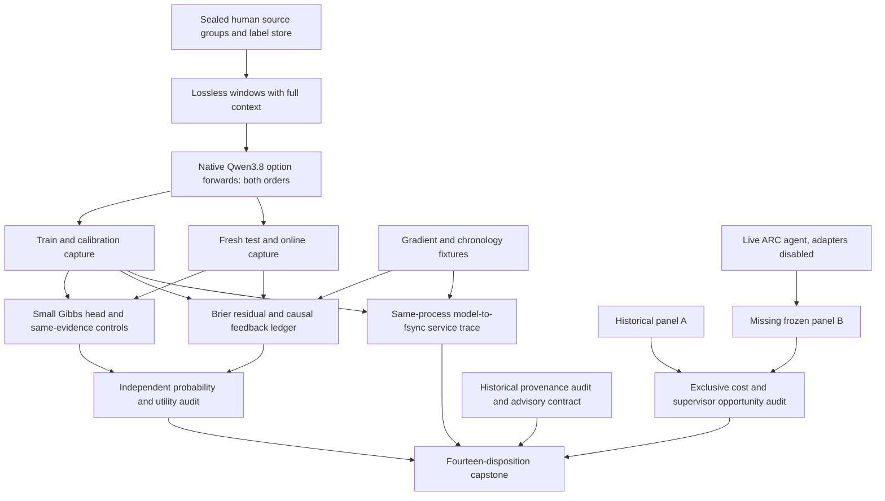
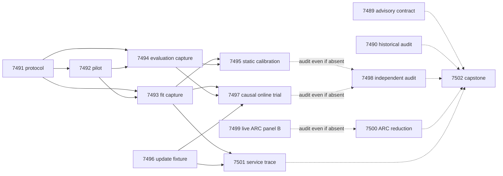

# Carnot Research Roadmap V656: Local Evidence and Causal Learning

**Milestone:** 2026.09.656  
**Title:** Lossless source verification, causal feedback learning, and complete service cost  
**Created:** 2026-09-21  
**Status:** Proposed; not activated  
**Predecessor:** 2026.09.655, preserved in `research-roadmap-v655-preserved-20260921.md`.

The next question is whether lossless local response evidence makes a small
energy verifier more useful, and whether correctly paired feedback improves
later predictions beyond simple calibration. A separate ARC observation finishes
the missing cross-game panel. Whole-service measurement charges actual model
work and durable updates. No positive outcome is assumed.

This is the next planning document, paired with `research-roadmap-next.yaml`.
The active YAML is intentionally untouched; it still describes V655. Do not
activate or execute this proposal as part of planning. The preserved V655 design
is the historical counterpart for that active YAML until an authorized transition.

## What V655 Actually Established

Terminal artifacts and raw evidence take precedence over conductor OK markers
and the lagging completion archive. The fourteen scheduled tasks currently have
**thirteen producer artifacts**; Exp7486 has no producer artifact. Recheck this
inventory at execution because another operator may repair historical evidence.

| Evidence | Observation | Consequence |
|---|---|---|
| Exp7475 | Required overdue-priority check failed; contract artifact disqualified. A resolved circuit-breaker header is associated with a later resolved timing-fallback slug by the parser. | Diagnose the actual obligation in the advisory contract, without bypassing enforcement or changing the conductor. |
| Exp7476/7477 | Sealed source protocol and actual native Qwen readout qualified. Pilot: 28 forwards, zero generation, about 41.19 seconds. Scored-runtime parity remains unavailable. | Reuse the native runner; qualify only the new window prompt and measured capture budget. |
| Exp7479/7480 | Authentic fit and evaluation captures completed in about 519.68 and 608.37 seconds. Eligible fit roles: 176 train/60 calibration; evaluation: 60 internal/159 online/74 FaithBench. | Real native evidence is now available. Preserve its exposure history and obtain fresh evaluation groups for a changed method. |
| Exp7481 | Producer is positive for typed decision utility, with probability_benefit_score=0 and decision_benefit_score=1. FaithBench Brier: Gibbs 0.57837, logistic 0.48536, temperature 0.31798. | Utility at selected registered costs is distinct from probability quality. FaithBench is no longer a fresh test. |
| Exp7482 | Importance-anchor fixtures qualified; circular_positive. | Implementation correctness alone is not FR-11 efficacy. |
| Exp7483 | No registered anchor benefit. Delay-zero Brier: anchor 0.126839, unanchored 0.126615, shuffled feedback 0.126828. Shuffle construction draws from the entire audited stream before replay. | Do not repeat unchanged importance anchoring. Audit the old control and test causal label pairing with a new objective and release-time control. |
| Exp7484 | Raw audit concluded null, but required adversarial validation exited 1: noncanonical aggregation substrate triggered METHODOLOGY_MISSING. Current source contains the corrected spelling; the historical artifact does not. | Fresh canonical replay, not a historical flag reset or fictitious model receipt. |
| Exp7478/7485 | Exclusive interval protocol qualified. Panel A: 18 episodes, 6 games, 36 bounded generations, zero eligible replaceable time in every row and no reproduced progress. | Qualified accounting is reusable. Do not extrapolate zero opportunity to the missing panel. |
| Exp7486 | Absent producer artifact and no completed panel-B result found. | Complete its sealed schedule independently; absence is not a failed scientific verdict. |
| Exp7487 | CPU placement analysis lacks durable write, prefill, tokenization and verifier stages in its denominator. KV260 historical fabric and PolarFire historical CPU evidence retained; GateMate unchanged. | Measure one real replay-service trace. Preserve hardware scope and unchanged physical blockers. |
| Exp7488 | Aggregate disqualified by present invalid evidence and missing panel B. | New capstone preserves all dispositions; unchanged external blocks are terminal blocked, never partial. |

Evidence roots: `results/experiment_7475_v655_contract_methods.json`,
`results/experiment_7481_v655_typed_calibration.json`,
`results/experiment_7483_v655_continuous_learning.json`,
`results/experiment_7484_v655_decision_audit.json`,
`results/experiment_7485_v655_arc_cost_panel_a.json`,
`results/experiment_7487_v655_learning_placement.json`, and
`results/experiment_7488_v655_capstone.json`. Historical numbers are rounded here;
raw rows remain authoritative. A positive producer is not a certified aggregate.

## The Three Largest Gaps to the PRD

1. **Faithful evidence has not become calibrated verification.** The program's
   real-language extraction ambition is much larger than checking a supplied
   response. Generated compact spans repeatedly failed, and the available
   whole-response Gibbs policy worsens external probability quality. Test
   lossless response windows with full source/context, same-feature simple
   controls and fresh evaluation (Exp7491–7495). This advances grounded
   verification within a declared boundary; it does not solve arbitrary
   constraint extraction or reopen retired general text reranking.
2. **FR-11 lacks causal, retained self-learning benefit.** Existing ledgers and
   fixtures work; near-identical shuffled-label performance gives no evidence
   that correct feedback pairing helps. Exp7496/7497 test Brier-gradient local
   updates, chronology-preserving shuffles and prevalence-only controls.
   Historical log loss is already a proper loss; the new objective is a
   component comparison, not repair of an absent property. Exp7498 independently
   verifies causality, retention and support. Qwen weights remain frozen.
3. **Whole-service and live-path value remain unproven.** ARC lacks its second
   panel, and update-kernel placement omits expensive service stages.
   Exp7499/7500 measure cross-game live self-discovery opportunities without
   per-game adapters. Exp7501 measures model-to-fsync replay service and bounds
   placement. Hidden-game efficacy, hardware acceleration and production human
   feedback latency remain open.

## Research Basis

The [V656 source review](../../research-references.md#2026-09-21--v656-planning-source-review)
was appended before experiment design. It covers the eight requested topics and
six secondary discovery channels, including a partial Semantic Scholar citation
walk for EBT and ARM–EBM. It records browser challenges and unreadable pages
explicitly. Primary papers, not discovery snippets, support method choices.

| Primary source | Adopted component | Experiment and boundary |
|---|---|---|
| [HallDetect, 2608.05823](https://arxiv.org/html/2608.05823v1) | Finer response granularity and source evidence. | Exp7491–7495 isolate lossless deterministic windows. No claim to reproduce its extractor/encoder or unmeasured efficiency; its confounded ablation motivates same-information controls. |
| [Input-side alignment, 2608.15804](https://arxiv.org/abs/2608.15804) | Trace a score to response text and source context. | Exp7491 records byte-complete boundaries; separate encoder training is deferred. |
| [PARALLAX, 2605.17028](https://arxiv.org/abs/2605.17028) | Audit label leakage and benchmark shortcuts. | Exp7490/7491 protect annotation and fresh source-group roles. Source documents are legitimate verification inputs; gold explanations are not. |
| [Limited-feedback experts, 2609.05820](https://arxiv.org/abs/2609.05820) | Explicit feedback opportunities and availability. | Exp7496/7497 use common release batches, fixed audit budget and paired controls. No inherited routing regret bound. |
| [KAN forgetting, 2511.12828](https://arxiv.org/abs/2511.12828) | Local support does not guarantee retention. | Exp7497 separately tests retention and causality. KAN-CL anchoring stays closed after its local null. |
| [On-chip spline learning, 2602.02056](https://arxiv.org/abs/2602.02056) | Sparse updates need state-movement accounting. | Exp7501 measures coefficients, bytes and full replay service; no FPGA speed claim from CPU arithmetic. |

EBT/ARM–EBM remain architectural motivation for conditional energies. T-SKM-Net,
Ising learning/codon optimization, DCCD, energy-guided VLM decoding, Memoir and
distributional EBMs are surveyed but deferred. They add unresolved branches or
different substrates. Extropic Z1T and Kona updates establish no owned hardware
or reproducible local checkpoint. No TSU purchase, external contact, model
migration, scored-runtime change or production deployment is part of this plan.

## Architecture

Only feedback available at a batch's release time enters the learner. Test
labels never select hyperparameters or veto updates. A response window is not
an independent data point: the source group is the statistical unit. The online
stream is prequential human-annotation replay, not self-generated ground truth
or a deployed feedback service. ARC observations use the live agent's own
attempts; historical public solves supply no action recipes.

## Exact Task Contract

**14 tasks, exp7489 through exp7502, in the exact order below.** This table is
the execution contract for `research-roadmap-next.yaml`, including complete
structured gate triples. Phase details describe these same tasks, not extra
aspirational work. Historical paths are immutable references, never `requires`
dependencies on retired tasks. All comparative tasks require per-unit rows.

| Order | Task ID | Title | Phase | Deliverable | Substrate class | Structured gates |
|---|---|---|---|---|---|---|
| 1 | exp7489-contract-methods | Bind the V656 contract and disposition terminal V655 evidence | 1 | results/experiment_7489_v656_contract_methods.json | aggregation | None |
| 2 | exp7490-historical-audit | Requalify historical probability and feedback evidence with canonical provenance | 1 | results/experiment_7490_v656_historical_audit.json | aggregation | None |
| 3 | exp7491-window-protocol | Seal lossless response windows and genuinely fresh source-group roles | 1 | results/experiment_7491_v656_window_protocol.json | no_model_load | None |
| 4 | exp7492-window-pilot | Measure native Qwen window readout feasibility before the full capture | 1 | results/experiment_7492_v656_window_pilot.json | model_load_no_generation | exp7491-window-protocol.window_protocol_ready_score == 1; exp7491-window-protocol.verdict_class in ["null", "positive"]; exp7491-window-protocol.flagged_adversarial == false |
| 5 | exp7493-window-fit-capture | Capture lossless native Qwen evidence for fitting | 2 | results/experiment_7493_v656_window_fit_capture.json | model_load_no_generation | exp7491-window-protocol.window_protocol_ready_score == 1; exp7491-window-protocol.verdict_class in ["null", "positive"]; exp7491-window-protocol.flagged_adversarial == false; exp7492-window-pilot.window_native_ready_score == 1; exp7492-window-pilot.verdict_class in ["null", "positive"]; exp7492-window-pilot.flagged_adversarial == false |
| 6 | exp7494-window-eval-capture | Capture lossless native Qwen evidence for fresh evaluation | 2 | results/experiment_7494_v656_window_eval_capture.json | model_load_no_generation | exp7491-window-protocol.window_protocol_ready_score == 1; exp7491-window-protocol.verdict_class in ["null", "positive"]; exp7491-window-protocol.flagged_adversarial == false; exp7492-window-pilot.window_native_ready_score == 1; exp7492-window-pilot.verdict_class in ["null", "positive"]; exp7492-window-pilot.flagged_adversarial == false |
| 7 | exp7495-window-calibration | Test calibrated energy decisions against controls with the same evidence | 2 | results/experiment_7495_v656_window_calibration.json | no_model_load | exp7493-window-fit-capture.window_fit_ready_score == 1; exp7493-window-fit-capture.verdict_class in ["null", "positive"]; exp7493-window-fit-capture.flagged_adversarial == false; exp7494-window-eval-capture.window_evaluation_ready_score == 1; exp7494-window-eval-capture.verdict_class in ["null", "positive"]; exp7494-window-eval-capture.flagged_adversarial == false |
| 8 | exp7496-causal-update-fixture | Qualify Brier updates and chronology-preserving feedback controls | 3 | results/experiment_7496_v656_causal_update_fixture.json | no_model_load | None |
| 9 | exp7497-causal-online-learning | Measure whether correctly paired delayed feedback improves later predictions | 3 | results/experiment_7497_v656_causal_online_learning.json | no_model_load | exp7493-window-fit-capture.window_fit_ready_score == 1; exp7493-window-fit-capture.verdict_class in ["null", "positive"]; exp7493-window-fit-capture.flagged_adversarial == false; exp7494-window-eval-capture.window_evaluation_ready_score == 1; exp7494-window-eval-capture.verdict_class in ["null", "positive"]; exp7494-window-eval-capture.flagged_adversarial == false; exp7496-causal-update-fixture.causal_update_ready_score == 1; exp7496-causal-update-fixture.verdict_class in ["null", "positive", "circular_positive"]; exp7496-causal-update-fixture.flagged_adversarial == false |
| 10 | exp7498-independent-audit | Independently reduce window and causal-learning claims from raw evidence | 3 | results/experiment_7498_v656_independent_audit.json | aggregation | None |
| 11 | exp7499-arc-panel-b | Complete withheld-game live ARC panel B with exclusive timing | 4 | results/experiment_7499_v656_arc_panel_b.json | model_bounded_generation | None |
| 12 | exp7500-arc-opportunity-audit | Reduce cross-game ARC opportunity and supervisor evidence | 4 | results/experiment_7500_v656_arc_opportunity_audit.json | aggregation | None |
| 13 | exp7501-service-placement | Measure durable feedback service and retain honest board continuity | 4 | results/experiment_7501_v656_service_placement.json | model_load_no_generation | exp7493-window-fit-capture.window_fit_ready_score == 1; exp7493-window-fit-capture.verdict_class in ["null", "positive"]; exp7493-window-fit-capture.flagged_adversarial == false; exp7496-causal-update-fixture.causal_update_ready_score == 1; exp7496-causal-update-fixture.verdict_class in ["null", "positive", "circular_positive"]; exp7496-causal-update-fixture.flagged_adversarial == false |
| 14 | exp7502-capstone | Reconcile all fourteen V656 dispositions and retire unchanged failures | 4 | results/experiment_7502_v656_capstone.json | aggregation | None |

## Phase 1: Qualify methods, provenance and the new evidence interface

Four tasks separate historical repair from new protocol readiness. Exp7489 is advisory; Exp7490 is an independent historical audit. Exp7491 and Exp7492 qualify only the new lossless interface and its measured budget. Infrastructure slots are Exp7490/7491, and Exp7489 reserves current-method ingestion.

### exp7489-contract-methods: Bind the V656 contract and disposition terminal V655 evidence

V655 has thirteen producer artifacts for fourteen scheduled tasks. Exp7475 failed a required overdue-priority receipt; Exp7484 used a noncanonical aggregation substrate in its terminal artifact, although current source already contains the canonical spelling. Exp7486 panel B is absent; Exp7488 is disqualified. These are not fourteen successful scientific measurements.

**Hypothesis:** An exact, advisory contract and dated methods map can prevent the previous reporting defects from contaminating independent measurements.

1. Compare the YAML bearing milestone 2026.09.656 (next before activation, active afterward) with the markdown contract: exactly fourteen ordered tasks exp7489 through exp7502, including titles, phases, paths, substrates and full gate triples. Exercise changed ID, order, count, path, gate field and milestone in private fixtures; each must fail.

2. Authenticate fourteen V655 dispositions using exact producer or pre-gate paths and hashes. Record Exp7486 as absent, not an invented null or completed panel. Retain the disqualified capstone, failed receipts, historical flags and absence. Do not require the lagging research-complete archive to have caught up.

3. Ingest at most six primary methods from the V656 references review into docs/research-notes/v656-method-ingestion.md and research-studying.md: response granularity, evidence alignment, corpus leakage controls, budgeted feedback, KAN support limits and on-chip locality. Record paper revision, reusable component, limitation and task mapping. No paper result becomes a Carnot measurement.

4. Disposition the overdue-priority parse against actual headings and Exp7435 evidence. The NEW circuit-breaker entry is already marked addressed; the parser associates the later RESOLVED retro_timing_fallback_wiring slug with it. Inspect the timing-fallback obligation separately and record the actual unresolved callsite and user-forbidden conductor modification. Do not claim that naming a slug or a green lint completes that wiring. Preserve enforcement semantics; no conductor edit or manufactured implementation task.

5. Run schema, gate, exclusion, ARC-floor and overdue-priority checks unchanged. Publish contract_ready_score=1 only if the exact current contract and all required checks pass. This is advisory: no independent science task gates on Exp7489. Record unresolved operator obligations with explicit scope and evidence.

**Deliverable:** `results/experiment_7489_v656_contract_methods.json`. **Required task fields:** `contract_ready_score`, `v655_dispositions`, `method_rows`, `unresolved_obligations`.

### exp7490-historical-audit: Requalify historical probability and feedback evidence with canonical provenance

Exp7484 terminal validation failed with METHODOLOGY_MISSING because its aggregation substrate spelling was not canonical. Current source appears corrected, but that does not repair old artifact bytes. Exp7481 reports typed utility while external Brier is worse than simple calibration. Exp7483 constructs shuffled labels from all audited stream labels before replay.

**Hypothesis:** Independent reduction with truthful canonical aggregation provenance can separate historical scientific limits from the producer-schema defect and identify any future-label use in the shuffled control.

1. Reuse corrected reducer components under a new experiment identity. Require inference_substrate=aggregation_from_upstream_artifacts, MODEL_SPECS=[], model_specs=[], model_invoked=false and zero current loads/forwards/generations. Never fabricate a model receipt to satisfy a reader; preserve old artifacts and reader output.

2. Recompute Brier, log loss, every cost cell, coverage and seed/group counts from raw V655 rows. FaithBench was already evaluated: it is diagnostic history and cannot be relabeled a fresh holdout. Resolve unsupported-versus-supported label polarity from pinned annotation semantics, not a favorable metric.

3. Trace the actual feedback access order and shuffled-label construction in Exp7483 against ledger timestamps. Record whether any assigned shuffled label came from a future event; distinguish an invalid negative control from evidence that the main learner leaked. Test with a future-label mutation and a chronology-preserving block permutation. Do not infer learning efficacy by fixing a control after outcomes.

4. Run unchanged adversarial and row readers against the NEW candidate and independent reducer output. historical_audit_complete_score=1 requires authentic raw rows, reconciled metrics, provenance and all required checks. A fully reduced scientific null is a valid completed audit. Missing external inputs are blocked, not partial.

**Deliverable:** `results/experiment_7490_v656_historical_audit.json`. **Required task fields:** `historical_audit_complete_score`, `historical_probability_rows`, `feedback_chronology_rows`, `historical_claim_limits`.

### exp7491-window-protocol: Seal lossless response windows and genuinely fresh source-group roles

Whole-response native Qwen scores exist, but V655 probability benefit failed. HallDetect motivates finer verification granularity; its full extractor/encoder is not adopted. Compact generated-span extraction remains retired.

**Hypothesis:** Deterministic, lossless response windows can expose localized unsupported content without another extraction model or discarded qualifiers.

1. Preserve the existing 180 training and 60 calibration source-group roster; seal NEW 120 test and 160 online groups from the pinned RAGTruth source. Exclude all source hashes and group aliases used by previous evaluation/online captures and their manifests across milestones, and exclude fit groups. Record the search scope and inaccessible archives. Do not declare freshness if provenance is incomplete; return a diagnosed blocked gate.

2. Assign source groups by a fixed label-blind hash before reading outcomes, one response per source group. Keep annotation text and gold labels in a separate evaluation store; model capture sees only text and opaque IDs. Freeze source family, role, text hashes and split seed 656001. No replacement after outcome inspection. Preserve original fit-role membership; minimum eligible train150/cal40/test100/online120 and at least two labeled classes with 20 examples per class on the test role. Test class support is checked only by the evaluator after prediction freeze.

3. Implement at most three contiguous windows by grouping complete sentences in original order. They must partition every response byte exactly, including whitespace and qualifiers; a single long sentence stays whole. For every focused call include full source and full original response with marked byte-aligned focus, so context is retained. Record boundaries and versions; the original response bytes are retained once, with focus markers added without duplicating content. This is deterministic segmentation, not atomic-claim extraction or a trained entailment encoder.

4. Keep the whole-response baseline prompt unchanged. Focused and whole prompts each use both option orders with the same native score mapping. Maximum eight forwards per group; reject any group whose complete required prompt exceeds 2048 tokens, before label access; never truncate or silently shorten. Freeze features: whole-response log odds, maximum/mean focused unsupported probability, disagreement and the existing numeric verifier/missingness signals. Never include IDs, annotation spans or response-generator identity.

5. Seal control groups and all calls: fit ceiling1960 forwards (240 times8 plus 40 source-derangement controls), evaluation ceiling2240 forwards (280 times8). Source-derangement rows are sensitivity controls without invented gold labels. Bind prompt/tokenizer/checkpoint identities; protocol tests cover negation, pronouns, dates, Unicode, repeated text, empty text and role leakage. window_protocol_ready_score=1 is structural readiness and eligible roster completeness, not predictive benefit.

**Deliverable:** `results/experiment_7491_v656_window_protocol.json`. **Required task fields:** `window_protocol_ready_score`, `role_manifest`, `window_definition`, `request_manifest`, `prior_exposure_exclusions`.

### exp7492-window-pilot: Measure native Qwen window readout feasibility before the full capture

Exp7477 qualified genuine native forwards without generation. The new window prompt needs a fresh transport, label-order and time-budget check; scored-server parity remains unestablished.

**Hypothesis:** The mandated local model can score both whole responses and lossless windows within the frozen per-task capture ceilings.

1. Consume Exp7491 only after its exact structured gate passes. Use eight fixed training groups spanning response lengths and sentence counts, never fresh test or online groups. One owned local model load; at most 72 total forwards, zero generation. Preserve the whole baseline and both label orders.

2. Record native option token IDs and raw logits at the exact final position, KV reset, prompt hashes, normalization and order remapping. Exercise known analytic token-mapping fixtures separately from real semantic observations. Do not require a predictive score or near-equality under label-order permutation to call transport valid; report actual order sensitivity.

3. Measure load, tokenize, prefill and readout times separately. Forecast EACH sealed capture using its planned call lengths and at least 1.25 times the measured per-token p90 estimate plus load, capped by3300 seconds of live work. Publish the full estimate and uncertainty. If either forecast fails, set window_native_ready_score=0 and block the full capture without silently shrinking the roster or truncating text. pilot_complete_score can still be1.

4. Authenticate the cached Qwen3.8-27B GGUF file and exact quantization/hash and native build; record actual owned PID/GPU UUID/peak VRAM and device placement. A load-only failure never counts as successful forwards. Keep native transport independent of unavailable Blackwell/scored-runtime parity; no server deployment change.

**Deliverable:** `results/experiment_7492_v656_window_pilot.json`. **Required task fields:** `window_native_ready_score`, `pilot_complete_score`, `pilot_call_rows`, `capture_budget_forecasts`, `scored_runtime_parity_score`.

## Phase 2: Capture evidence and test calibrated decisions

Two bounded native captures share the same sealed protocol. Fresh held-out source groups prevent retuning on the evaluated FaithBench set. Exp7495 trains an actual small energy head and separates probability benefit from cost-sensitive decision utility.

### exp7493-window-fit-capture: Capture lossless native Qwen evidence for fitting

V655 authenticated whole-response native evidence. This new capture changes only the sealed granularity and preserves complete source context; fresh evaluation identities were selected without outcome access.

**Hypothesis:** Authenticated whole and focused native scores can supply a recheckable feature comparison, even if their predictive signal is null.

1. Load the Exp7491 request manifest and Exp7492 qualified model identity. Execute only the train180/calibration60 role shard, maximum 1960 forwards, one owned model load, zero generated tokens and 3300 seconds of live work. Do not borrow groups across roles. Cache/reuse a pilot call only if every request byte and model identity matches, and report it as archived rather than new inference.

2. Capture both option orders for the whole response and every required focus window. Persist raw logits, remapped probabilities, token IDs, full text and prompt hashes, offsets, source/version, call status and timing after each group. Keep labels and annotations outside model prompts and feature construction. Full context exceeding2048 tokens remains a frozen exclusion; never truncate.

3. Balance planned, attempted, complete, failed, excluded, censored and unstarted calls and groups. Save hash-bound shards below 20 MiB; resume only exact manifest identities. A timeout or error leaves explicit dispositions and closes readiness, rather than publishing missing values as zeros.

4. Publish window_fit_ready_score=1 only when all eligible required calls complete, transport/source identity checks pass, and label-blind role minima pass. Keep capture_complete_score and role_support_score separate. Do not gate on model accuracy, sign of a probability change or class balance that the capture is forbidden to inspect. Fresh evaluation labels stay sealed until all fitted policies are frozen.

**Deliverable:** `results/experiment_7493_v656_window_fit_capture.json`. **Required task fields:** `window_fit_ready_score`, `capture_complete_score`, `role_support_score`, `raw_logit_shards`, `role_counts`.

### exp7494-window-eval-capture: Capture lossless native Qwen evidence for fresh evaluation

V655 authenticated whole-response native evidence. This new capture changes only the sealed granularity and preserves complete source context; fresh evaluation identities were selected without outcome access.

**Hypothesis:** Authenticated whole and focused native scores can supply a recheckable feature comparison, even if their predictive signal is null.

1. Load the Exp7491 request manifest and Exp7492 qualified model identity. Execute only the new test120/online160 role shard, maximum 2240 forwards, one owned model load, zero generated tokens and 3300 seconds of live work. Do not borrow groups across roles. Cache/reuse a pilot call only if every request byte and model identity matches, and report it as archived rather than new inference.

2. Capture both option orders for the whole response and every required focus window. Persist raw logits, remapped probabilities, token IDs, full text and prompt hashes, offsets, source/version, call status and timing after each group. Keep labels and annotations outside model prompts and feature construction. Full context exceeding2048 tokens remains a frozen exclusion; never truncate.

3. Balance planned, attempted, complete, failed, excluded, censored and unstarted calls and groups. Save hash-bound shards below 20 MiB; resume only exact manifest identities. A timeout or error leaves explicit dispositions and closes readiness, rather than publishing missing values as zeros.

4. Publish window_evaluation_ready_score=1 only when all eligible required calls complete, transport/source identity checks pass, and label-blind role minima pass. Keep capture_complete_score and role_support_score separate. Do not gate on model accuracy, sign of a probability change or class balance that the capture is forbidden to inspect. Fresh evaluation labels stay sealed until all fitted policies are frozen.

**Deliverable:** `results/experiment_7494_v656_window_eval_capture.json`. **Required task fields:** `window_evaluation_ready_score`, `capture_complete_score`, `role_support_score`, `raw_logit_shards`, `role_counts`.

### exp7495-window-calibration: Test calibrated energy decisions against controls with the same evidence

V655 Gibbs Brier on already-seen FaithBench was0.57837 versus logistic0.48536 and temperature0.31798; its positive producer verdict came from a typed-decision gate. That result does not establish better probabilities or authorize tuning on that test.

**Hypothesis:** Lossless local evidence gives a small conditional energy head useful information beyond whole-response and same-feature logistic controls.

1. Fit only on the sealed train shard; select transformations and regularization on calibration. Train a small conditional binary Gibbs head with at most 256 spline coefficients and exact normalization, plus whole-only Gibbs, identical-window-feature logistic, raw whole and window scores, and temperature-calibrated whole scores. Use five frozen seeds656101-656105 and identical hyperparameter budgets. Record equation, loss and parameter counts; do not train Qwen.

2. Choose the best simple baseline on calibration only, freeze code/transforms/checkpoints and every policy before opening new test labels in a separate process. For any partial-capture or insufficient-test-class support, retain descriptive rows but close confirmatory support. FaithBench74 stays a historical diagnostic; do not run another tuned claim on it.

3. Primary probability gate: fresh-test source-group Brier improvement at least0.01 with paired group-bootstrap95 percent upper bound below 0 against BOTH identical-feature logistic and whole-only Gibbs, Holm-adjusted across the two contrasts. Require log-loss noninferiority upper delta<=0.01 for each and test>=100 with>=20 per class. Five fit seeds are repeated estimators, not five times the sample. Report all arms and length/source-family slices, AUROC, ECE, coverage and exclusions.

4. Separately report accept/reject/escalate utility at false-reject cost1, false-accept costs1/5/20 and escalation costs0.1/0.5/1. Choose policies on calibration only. A decision benefit requires>=20 percent non-escalation and Holm-adjusted upper paired cost delta<0 over all nine registered cells versus the calibration-selected best simple policy. Never infer universal deployment safety from one cost cell.

5. Publish window_calibration_complete_score=1 after valid fitting, freeze and complete evaluation even when both benefit gates are0. Export frozen temperature baseline and window feature transforms for independent online use. Fit/shuffle-training-label ablations only on train/calibration; label-free source controls have no invented factual gold. Bound numeric work to1200 seconds and include small_ebm_training receipts.

**Deliverable:** `results/experiment_7495_v656_window_calibration.json`. **Required task fields:** `window_calibration_complete_score`, `probability_benefit_score`, `decision_benefit_score`, `confirmatory_support_score`, `frozen_policy_manifest`, `small_ebm_training`.

## Phase 3: Test continuous learning and independently audit it

The fixture and causal online trial change the objective and feedback control together with an explicit existing-log-loss comparator. No importance-anchor rerun is proposed. Static efficacy is not an online prerequisite. The independent audit runs even after a missing upstream branch.

### exp7496-causal-update-fixture: Qualify Brier updates and chronology-preserving feedback controls

The existing residual learner already uses a proper Bernoulli log loss and current-state gradients; do not call those missing. V655 importance anchoring failed its benefit gate and its shuffled-label construction can see future feedback. This task changes the objective to bounded Brier updates and qualifies a causal negative control.

**Hypothesis:** A local Brier-gradient head and release-batch permutation can isolate label-feature learning from prevalence shifts without future-label access.

1. Reuse the prediction ledger and spline basis. Add a Brier-loss option with gradient2*(p-y)*p*(1-p)*basis through the declared bounded residual; finite-difference boundary and clipping cases. Keep the existing log-loss learner as a control. Cap256 coefficients, freeze learning-rate candidates0.001/0.01/0.03 and residual bounds0.5/1.0 on training/calibration, and record clipping/no-op rates. No importance penalty or unchanged four-expert mixture.

2. Define event order before labels: source groups arrive in fixed blocks of8; a seeded25 percent audit mask selects feedback independently of predictions. Release each selected label only after its block end plus delay 0or8 arrivals. Both real and shuffled arms receive the SAME batch at the SAME time. Permute only labels in that released batch, using seeded derangements where possible; singletons and identical-label batches remain explicit no-op controls. No future batch labels may enter memory.

3. Test future-label mutation invariance before release, no-feedback gaps, repeated IDs, duplicate deliveries, out-of-order availability, state rollback, restart and idempotent replay. Record pre-update probabilities and prediction-time features, but compute the optimizer gradient at the current learner state using revealed feedback. Training-only replay guards may reject updates; held-out retention labels may not select or veto them.

4. Publish causal_update_ready_score=1 only for gradient, lifecycle, causal access and replay validity. Analytic fixtures establish circular_positive at most, never real-world learning. Export the sealed update/control configuration and per-event traces; keep numerical fixture work within 600 seconds.

**Deliverable:** `results/experiment_7496_v656_causal_update_fixture.json`. **Required task fields:** `causal_update_ready_score`, `loss_definition`, `release_batch_protocol`, `state_replay_checks`, `small_ebm_training`.

### exp7497-causal-online-learning: Measure whether correctly paired delayed feedback improves later predictions

V655 anchor Brier was essentially tied with shuffled and unanchored feedback. FR-11 needs demonstrable label-conditioned improvement, not simply a state change or lower calibration bias. This is controlled replay of human annotations, not autonomous production feedback.

**Hypothesis:** Brier-trained local residual updates improve prequential predictions beyond prevalence adaptation and causally available shuffled feedback while retaining prior behavior.

1. Prepare all initial states and choose settings using only train/calibration pseudo-streams. Use the temperature-calibrated frozen base and new window features; independently construct these from Exp7493 if the static calibration task is absent or null. Static probability benefit is not a prerequisite. Keep actual online and retention labels outside all tuning.

2. Run the sealed fresh online stream with order/audit seeds656201-656205 and delays0and8. Use identical arrival order, audit mask, common release batches and feedback opportunity in every arm: frozen, intercept-only Brier, affine Brier, local Brier, local Brier with within-released-batch shuffled labels, existing local log loss and zero-step local Brier. No global preshuffle of future labels. Report selected feedback, actual delivered labels, nontrivially permuted labels and no-op batches.

3. Log every group/arm/replicate prediction BEFORE release/update, exact feature/state hashes, feedback origin/availability, update and persistence status. Compute headline prequential Brier on all independently evaluable groups, including unaudited predictions; audit labels govern learning only. Report per-group rows and paired deltas, never aggregate only. Retention test labels score frozen checkpoints afterward, never acceptance during the stream.

4. Primary delay 8 benefit requires online>=120, >=20 completed audited feedback events and>=12 nontrivially permuted label assignments, no chronology violations, Brier delta<=-0.01 versus frozen, and Holm-adjusted95 percent paired upper bounds<0 versus frozen/intercept/affine/shuffled/existing-log-loss controls. Use fixed length16 moving-block bootstrap within each preregistered order with equal replicate weight; show length8/32 sensitivity. Seeds and reused stream groups do not multiply independent n. Dependence and small sample limit generality.

5. Require retention Brier upper delta<=0.01 on the separate test role and exact restart parity. Delay0 is secondary; no picking the better delay. Utility and source-family breakdowns are secondary. Publish causal_online_complete_score=1 for a valid completed null and feedback_benefit_score separately. Inadequate effective shuffle support gives a support-limited null, not a causal win. Bound numeric work to1500 seconds and keep all frozen, log-loss, shuffled and zero-step controls.

**Deliverable:** `results/experiment_7497_v656_causal_online_learning.json`. **Required task fields:** `causal_online_complete_score`, `feedback_benefit_score`, `feedback_support_score`, `prequential_rows`, `retention_rows`, `small_ebm_training`.

### exp7498-independent-audit: Independently reduce window and causal-learning claims from raw evidence

The audit must run even when capture or benefit gates close. V655 showed that plausible reported conclusions can coexist with invalid required provenance receipts.

**Hypothesis:** An independent raw-row reducer can reconstruct all V656 scientific claims and preserve missing branches without cascading away the audit.

1. Enumerate Exp7491-7497 artifacts by the exact current roadmap deliverable paths and hash raw shards/checkpoints. Missing, pre-gated, disqualified and flagged producers remain separate dispositions. Never import a headline verdict as a substitute for raw computation; no new model call or refit.

2. Independently recompute role disjointness, complete response coverage, option mapping, frozen-label boundary, group/seed counts, Brier/log-loss comparisons, nine utility cells and retention. Cross-check the same exact field names from each producer. Use canonical inference_substrate=aggregation_from_upstream_artifacts with empty current model specs.

3. Replay feedback chronology and state transitions without the producer summarizer; mutate one future label and one terminal checkpoint in private fixtures to prove detection. Compare real and shuffled batch availability and actual class-changing permutation support. Rebuild the declared bootstrap/multiplicity decisions from rows.

4. Publish science_audit_complete_score=1 only when every present claim is independently reduced and every absent branch is diagnosed. Missing required scientific inputs make the aggregate verdict_class=blocked; any present required invalid evidence makes it disqualified. Own unfinished reduction alone may be partial. Preserve valid branch findings without upgrading aggregate science.

**Deliverable:** `results/experiment_7498_v656_independent_audit.json`. **Required task fields:** `science_audit_complete_score`, `independent_probability_rows`, `independent_learning_rows`, `claim_dispositions`.

## Phase 4: Complete live ARC observation and measure service cost

Finish only the missing panel, with original games and seeds. Independently audit eligible cost and supervisor exposure. Measure whole controlled replay service, retain accurate per-board continuity, then reconcile all fourteen dispositions.

### exp7499-arc-panel-b: Complete withheld-game live ARC panel B with exclusive timing

Exp7485 completed panel A with18episodes across6games,36 bounded generations and zero eligible replaceable interval in every row. Scheduled Exp7486 panel B has no producer artifact. Absence is neither a scientific null nor a reason to re-solve banked public levels.

**Hypothesis:** The frozen missing half of the cross-game observation can determine whether the zero-opportunity finding extends beyond panel A.

1. Registry-precheck every game and levels_reproduced before running. This is held-out-game generalization measurement with per-game adapters disabled, not another level-bank solve. Read the immutable Exp7478 interval protocol and validate its ready score, class, flags, roster and actual raw timing fields internally; if invalid, block only this branch. No gating on the verification chain or old capstone.

2. Reuse the live driver through a small panel parameter rather than copying its experiment main. Freeze B games tu93,g50t,tn36,vc33,re86,dc22 and seeds65501/65502/65503:18 episodes,180 actions, at most 2 modelrequests of256 newtokens per episode,240second episode cap and 3600second live cap. One owned Qwen load, maximum 36 bounded generations. Preserve missing/censored/unstarted rows with no substitute games.

3. Use E3AgentPolicy/make_carnot_agent and the existing runtime inference path. Disable hand-built per-game adapters and injected action recipes; no game source inspection, outer-loop RE or offline exhaustive BFS. Any level claim must use solve_provenance=live_agent_self_discovery and runtime attempts/replay evidence; development proxies or outer_loop_re never become a headline. Do not claim public-game observations measure hidden-game success.

4. Collect episode/process/clock/decision IDs and exclusive interval unions from the qualified observer. Preserve source generation, world-model/verifier work, dispatch, idle, unattributed and observation overhead. Require0<=replaceable_lower<=replaceable_upper<=episode duration. Duplicate/nested spans cannot increase union cost. Capture supervisor opportunities, arm selection and abstentions even if every count is0.

5. Compare code/model/protocol/build hashes to panel A before allowing any pooled estimate. If live code changed, emit a comparability failure and stratify by version; do not fabricate a36episode homogeneous panel or rerun A automatically. Publish arc_panel_b_complete_score=1 only for every planned episode with valid terminal evidence; support and progress remain separate. Record action-to-progress censoring, no-selector-change evidence and any runtime failures. Stop live work by3600 seconds to leave validation room within 4800.

**Deliverable:** `results/experiment_7499_v656_arc_panel_b.json`. **Required task fields:** `arc_panel_b_complete_score`, `solve_provenance`, `per_game_results`, `panel_comparability`, `supervisor_opportunity_rows`, `arc_support_score`.

### exp7500-arc-opportunity-audit: Reduce cross-game ARC opportunity and supervisor evidence

Panel A found no eligible replaceable time; the missing B panel must remain explicit if its new attempt is unavailable. E6 observation does not authorize E4/E5 interventions or scored changes.

**Hypothesis:** Exclusive, version-aware cost accounting can decide whether any later live intervention has enough eligible work to test.

1. Run unconditionally and read panel A plus Exp7499 by its exact deliverable. Preserve missing/invalid B rather than treating it as18zero episodes. Independently union spans by clock/process/episode and recompute per-game bounds, missingness, censoring and supervisor opportunity counts.

2. Require compatible observer/policy/model/protocol identity and at least30valid episodes across 10 games for a pooled cross-game cost claim. The planned support is36 episodes across 12 games. Version drift or missing games closes pooled support and retains separate panels. A zero lower/upper bound is a result, not permission to assign every generation interval to the proposed optimization.

3. Compare actual supervisor chosen arms with their logged eligibility and reproducible runtime observations; report exposure and abstention. If there are zero triggered opportunities, record an empty intervention ledger and no efficacy estimate. Do not infer arm benefit from observational selection or generate game-specific rules from game source.

4. Report eligible service fractions and an Amdahl upper bound with every omitted stage named. Publish arc_opportunity_audit_complete_score for valid accounting and separate opportunity_present_score only when actual eligible work exists with adequate support. No selector default, E4/E5 gate, submission, registry inflation or hardware acceleration claim follows from this reducer.

**Deliverable:** `results/experiment_7500_v656_arc_opportunity_audit.json`. **Required task fields:** `arc_opportunity_audit_complete_score`, `opportunity_present_score`, `per_game_results`, `solve_provenance`, `supervisor_disposition`.

### exp7501-service-placement: Measure durable feedback service and retain honest board continuity

Exp7487 omitted durable_write, prefill, tokenization and verifier work from its service denominator. KV260 has historical k<=5 fabric evidence, PolarFire has historical CPU dispatch evidence, and GateMate has no dated physical prerequisite change.

**Hypothesis:** A serial whole-service trace can expose whether the small update kernel matters after source scoring, feedback release and durable acknowledgement are charged.

1. Gate only on Exp7493 valid fit evidence and Exp7496 valid updater, not on a positive static/online effect. Choose24frozen training-role groups before timings. In a serial controlled service replay, rerun their actual whole/window Qwen forwards with one owned load, at most 192 forwards, zero generated tokens and 900 seconds of live work. These reused development groups measure engineering cost, not fresh generalization.

2. Trace the same event through text/tokenization, native prefill/readout, numeric verifier, feature assembly, prediction, predefined replay-label release, update, rollback/guard, serialization, WAL/fsync durable write and acknowledgement. Include amortized load and resident-service variants separately. Historical human annotation creation latency is UNKNOWN; report controlled replay service excluding external acquisition, not a complete production feedback SLA.

3. For each event compare actual update service with a no-update control that still scores and acknowledges identically, using predeclared alternating order. Distinguish update compute from persistence by exclusive spans. Record wall/CPUtime, active versus total coefficients, bytes moved and WAL bytes, fsync and recovery evidence. Require stage union+unattributed to equal elapsed within timestamp tolerance. No stitched independent-run sum is called an observed end-to-end speedup.

4. Preserve board-by-board continuity as a host documentary audit: KV260 historical actual fabric sampling only within its recorded small-k scope; PolarFire historical board CPU workload, not fabric; GateMate blocked without dated operator physical change after the last diagnosed miss. Hash the original receipts and mark current reachability untested. No SSH/flash/identical detect attempt, host boot-device write, hardware purchase or invented TSU availability.

5. Compute only a measured CPU/GPU replay-service comparison and explicitly hypothetical placement/Amdahl bounds. No100x or hardware energy claim without a matching full-workload device receipt. Publish service_measurement_complete_score=1 for a valid complete trace even if acceleration headroom is negligible; record missing stages with null estimates rather than zero cost.

**Deliverable:** `results/experiment_7501_v656_service_placement.json`. **Required task fields:** `service_measurement_complete_score`, `service_rows`, `denominator_scope`, `board_rows`, `placement_bounds`, `small_ebm_training`.

### exp7502-capstone: Reconcile all fourteen V656 dispositions and retire unchanged failures

The milestone must end with an honest disposition even if an upstream branch is absent. Prior capstones were retired after incorrectly using partial for unchanged external blocks.

**Hypothesis:** A raw-evidence capstone can distinguish completed planning/execution, valid scientific nulls and supported next actions without reviving retired mechanisms.

1. Resolve exactly fourteen ordered V656 task IDs from the matching YAML/document, including this capstone. For each record actual artifact/pre-gate path, hash, honest_verdict, verdict_class, flags, required-validation status, row availability and support/benefit gates. An external absence is blocked, not partial; failed required present evidence is disqualified. Keep valid independent branches visible.

2. Cross-check Exp7490 historical audit, Exp7498 current scientific reduction, Exp7500 ARC accounting and Exp7501 service scope against producer rows. Distinguish better probabilities, decision utility, causal feedback benefit, retention, ARC generalization observations and hypothetical hardware placement. Do not turn fixture circular_positive into efficacy or treat a typed positive as a probability claim.

3. Apply every declared prior_failures retirement rule using the exact prior honest_verdict and retire_if_same_verdict=true. Record same-verdict retirement in ops/exclusion_manifest.yaml where the conductor has not already done so; preserve stronger existing retirements. A new no-benefit verdict still retires an unchanged mechanism by scientific disposition even when its free-text spelling differs. Never erase an exclusion to get another attempt.

4. Write docs/research-notes/v656-retrospective.md with the three PRD gaps, support limits, dominant actual timings and one concrete reopen condition for each closed branch. Keep importance anchoring, compact generated spans, four-expert reweighting and generic external-text reranking closed unless a separately justified method changes. No next roadmap activation, production-default change or scored submission.

5. Reconcile OpenSpec notes, _bmad/traceability.md, ops/status.md, ops/changelog.md and research-studying.md to actual evidence. Mark capstone_complete_score=1 for a complete disposition ledger even when verdict_class=blocked or disqualified; reserve partial solely for this capstone's own unfinished repair. Do not modify research-roadmap.yaml or scripts/research_conductor.py.

**Deliverable:** `results/experiment_7502_v656_capstone.json`. **Required task fields:** `capstone_complete_score`, `task_dispositions`, `supported_claims`, `retirement_rows`, `next_reopen_conditions`.

## Dependency Graph and Failure Semantics

Solid edges are the exact structured gates in the contract table: ready field=1,
allowed terminal class and flagged_adversarial=false. Circular-positive is
allowed only for implementation fixtures, never scientific benefit. Dotted
edges are inputs to unconditional auditors. There is no global contract gate,
no static-benefit gate before learning and no verification-chain gate before ARC.
Exp7499 validates the historical interval protocol inside its own task; every
structured `gated_on` upstream is an earlier task in THIS milestone.

All tasks declare `verdict_class` next to `honest_verdict`, with the closed enum
positive / circular_positive / null / blocked / disqualified / partial.
`partial` means unfinished own work that another attempt can fix. Absent,
retired or invalid external prerequisites are terminal blocked; failed required
checks on present evidence are disqualified. A completed audit can have a
complete_score of 1 and an aggregate blocked verdict. Readiness is not benefit.
Every blocked result uses `gate_check_summary` with the exact failed check,
upstream field/path, expected and observed value.

Every task has a four-field `prior_failures` entry, including the exact historical
honest_verdict and `retire_if_same_verdict: true`. Some entries document the
limits of a valid null transport result or a failed probability subclaim within
a typed-positive result; they do not retroactively label a working transport
invalid. Exp7486 absence has no invented historical honest_verdict. No retired
ID is reused and no `requires` chain references a retired ID. Unchanged compact
extraction, importance anchoring, four-expert mixtures and external-text rerank
claims remain retired. A repeated null is a stop condition, not a reason to
rename the experiment indefinitely.

## Cohorts, Controls and Acceptance

- Reuse the frozen 180 train / 60 calibration roster for method development.
  New test120 and online160 source groups exclude earlier evaluation/online
  source hashes and all fit groups. Seal roles before outcomes. Search prior
  manifests and fail freshness closed if inaccessible evidence prevents proof.
  Eligible minima are train150/cal40/test100/online120. Test labels additionally
  require at least20 examples of each class. Original FaithBench74 is diagnostic
  history, not an external confirmatory claim in this milestone.
- At most3 response windows partition all bytes, with full response/source
  context retained. Each whole/focus prompt has both label orders and at most
  2048 tokens; no truncation. Windows and five seeds do not multiply sample size.
  Role and call failures remain in rows. Source derangement has no gold label.
- Static primary: at least0.01 Brier improvement with Holm-corrected upper95%
  paired group bound<0 over identical-feature logistic AND whole-only Gibbs;
  log-loss upper delta<=0.01. Utility is a separate nine-cell corrected test,
  with >=20% non-escalation and calibration-only selection.
- Continuous learning: primary delay8, 25% audit mask, common8-arrival release
  blocks and only currently available labels. The frozen, intercept, affine,
  shuffled, old log-loss and zero-step controls remain visible. Require>=120
  groups,>=20 completed audited events and>=12 class-changing shuffled
  assignments,>=0.01 improvement over frozen plus corrected benefit against all
  five substantive controls, retention upper Brier delta<=0.01 and zero causal
  violations. Dependence-aware block intervals and sensitivity are required;
  this small replay cannot certify deployment generality.
- ARC: preserve B's6 games x3 seeds,180 actions,2 requests of256 tokens,
  240-second episode cap. Pool A/B only with compatible policy/model/observer
  identity and>=30 episodes from>=10 games (planned36/12). Zero opportunity is
  valid. No new level-bank target, outer-loop source reading or exhaustive BFS.
  Any level solve must carry `solve_provenance=live_agent_self_discovery` and
  runtime evidence, without claiming duplicate registry credit.

## Hardware, Budgets and Execution Discipline

| Work | Substrate and budget | Evidence boundary |
|---|---|---|
| Exp7492 pilot | One owned local CUDA GPU; one Qwen load, <=72 forwards; estimated25 min task | model_load_no_generation, 2 s floor; measured feasibility before full capture. |
| Exp7493/7494 captures | Cached GGUF on one owned CUDA GPU; <=1960 / <=2240 forwards; <=3300 s live work each; estimated65 min each | Zero generation; full source/context. Pilot forecasts must fit both caps; no hidden roster shrink. |
| Exp7495–7497 fitting | Host CPU/NumPy small heads, <=256 coefficients; numeric1200/600/1500 s respective budgets | no_model_load; measured small_ebm_training. No generator weight training. |
| Exp7499 ARC | One owned GPU, <=36 bounded generations, <=256 tokens/request; <=3600 s live work; estimated75 min | model_bounded_generation, 10 s floor. A small token budget remains bounded even when total runtime is long. |
| Exp7501 service | CPU plus one owned local GPU; <=192 forwards, <=900 s live work; estimated45 min | model_load_no_generation, 2 s floor; actual replay service, no unknown human acquisition latency claim. |
| Reporting/protocol | CPU/filesystem and hash-bound shards; estimated20–35 min each | Canonical aggregation or no_model_load as declared. No current model calls. |
| KV260 | Historical authenticated small-k fabric sampling | Documentary continuity; no claim of current reachability or new head execution. |
| PolarFire | Historical hash-matched CPU dispatch | Board CPU is not FPGA fabric. No new hardware run. |
| GateMate | Physical prerequisite unchanged | Blocked documentary row; no repeated detection without dated physical change. |
| Extropic/ROCm/large FPGA | No authenticated ready substrate for this plan | Deferred. No purchase, flashing, host block-device writes or invented speed/energy receipt. |

Use the locally cached `unsloth/Qwen3.8-27B-GGUF` selected by the qualified native
runner. Historical availability does not reserve a GPU: authenticate runtime
ownership, free memory, quantization, device UUID and model hash. The dual3090
path is known in project history, but this plan needs only one suitable owned
GPU at a time; it adds no dual-GPU or ROCm bring-up. An unavailable suitable
runtime blocks model work with its observed resource reason. CPU smoke using a
legacy small model cannot substitute for a headline result.

The operator's 2026-09-09 mandate supersedes all older model lists. Every LLM task
has the mandated model in `MODEL_SPECS`. No task uses `model_full_generation`;
its60 s floor would misclassify these no-generation forwards and bounded ARC
requests. Duration floors describe measured substrates, never a sleep target.
Historical source/model evidence is separate from current invocation counts.

Each YAML prompt contains a NUMBERED progress requirement: flush immediately,
at every phase edge and before/after a long call; print inside loops and run
truthful pending-operation heartbeats at least every60 s during blocking model
loads, generation, benchmarks and subprocesses. Keep every gap below600 s. Silent
tasks can die at1200 s; progress is necessary to use the4800 s hard cap. Live caps
leave room for implementation and checks; checkpoints are not terminal artifacts.
A budget overrun preserves unstarted/censored rows and closes readiness, never
pads duration or substitutes another model.

Schema/provenance integration (Exp7490) and hardware/service coordination
(Exp7501) route directly to Opus with100 turns. Formulaic dataset/protocol and
update/control implementations (Exp7491/7496) route to Codex gpt-5.6-sol with50
turns. Advisory/retrospective reducers use20–30 turns. Other science uses the
default synthesis backend and50 turns. No Gemini-only or unavailable backend
assumption is introduced. No research-agent fan-out is required by this plan.

## Validation and Reconciliation

Before implementation, each task extends its existing REQ-* capability and
adds meaningful failing tests for new behavior. Requirements map to verification,
KAN/continuous-learning, research-reporting, sampling and ARC trust-energy
capabilities already present. Do not imply that a proposal has implemented them.
The shared YAML instructions require scoped unit tests, changed-module coverage,
Ruff check/format, mypy, focused spec coverage and a fresh-process cold replay.
Run the applicable numbered E2E only when its actual shared runtime surface
changes: E2E-001/002/003/004 for sampler/binding/serialization, E2E-009/010 for ARC
policy/transport, E2E-011 for telemetry, plus the private live environment smoke.
Pure roadmap/reporting has no numbered runtime E2E. Avoid known-red unscoped
repository tests and do not weaken guards to hide failures.

Every claim requires rows, exact schema fields, source hashes, field/gate
principles, actual validation receipts, independent reduction and unchanged
adversarial/strict row checks. Artifacts are atomic terminal writes below 20 MiB;
large raw rows use hashed shards. No bootstrap-only terminal artifact. Preserve
unrelated worktree changes and historical flags. The capstone reconciles actual
findings into OpenSpec, traceability and ops documentation and records scientific
stop/reopen decisions. No push, conductor modification, active-roadmap edit,
activation, external submission or production-default change is authorized here.
