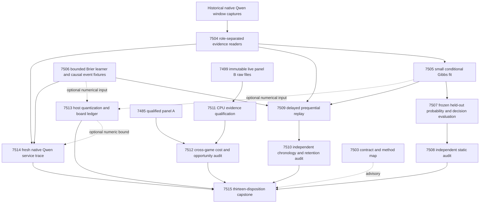
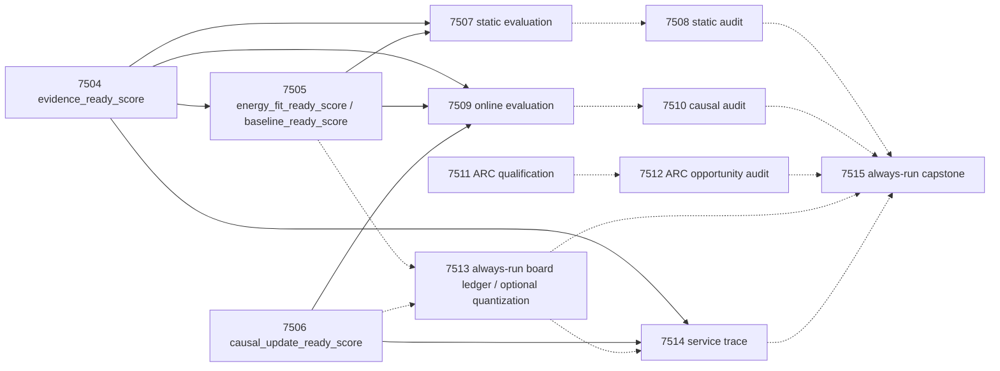

# Carnot Research Roadmap v657: Measured learning from qualified evidence

**Milestone:** `2026.09.657`
**Created:** 2026-09-21
**Status:** Planned; not activated, executed or published
**Milestone title:** Measured window calibration, causal online updates, and recovered live-agent evidence
**Execution authority:** `research-roadmap-next.yaml`
**Predecessor:** 2026.09.656; original design preserved byte-for-byte in [research-roadmap-v656-preserved-20260921.md](research-roadmap-v656-preserved-20260921.md).

This design follows the v7/v8 sequence: previous evidence, architectural gap,
phased experiments, dependencies, hardware and measurable exit criteria.
It schedules **13 tasks, exp7503 through exp7515, in four phases**. The exact
ordered contract below is authoritative, including diagnostic and capstone
work. No unlisted experiment is promised. All measurements described as future
work are hypotheses or acceptance gates, not results.

## What V656 Proved and Left Unmeasured

V656's conductor finished its task queue. Scientific completion differs:
nine producer paths contain terminal artifacts; five do not. The completed
archive has not yet incorporated V656, so this assessment reads the active
roadmap, actual deliverables, raw files and conductor dispositions together.

| Evidence | Established result | Boundary carried into V657 |
|---|---|---|
| Exp7489 contract/methods | Structural contract complete | A planning receipt does not establish science or gate every branch. |
| Exp7490 historical audit | Historical probability benefit remained unproven; 376 future-origin assignments invalidated the old shuffled control | Do not rerun the same historical audit or retain that control. |
| Exp7491 protocol | Lossless full-source/response-window protocol and roles qualified | Planned 520 source groups; nine exclusions; 176 train, 60 calibration, 116 test, 159 online eligible groups. Windows are not independent samples. |
| Exp7492 pilot | 58 native option-forward calls, no generation | Native Qwen evidence is real, but forward availability does not imply calibrated correctness. |
| Exp7493/7494 captures | 1,904 fit and 2,152 evaluation native forwards | Preserve raw hashes, both option orders, role boundaries and exclusion counts; fit/evaluation science remains outstanding. |
| Exp7495/7496 | Three failed authoring attempts each; no terminal producer; orphan tests exist | Conductor status `FAIL`, not a fabricated scientific honest_verdict. The documented Exp7496 replay spent 937 silent seconds composing a huge tool call. Split authoring and responsibilities. |
| Exp7497/7501 | Retired-upstream `GATE_BLOCK`, no terminal producer | No online benefit or durable-service result can be inferred. New same-scope attempts declare prior failures and changed prerequisites. |
| Exp7498/7500/7502 | Honest blocked independent audit, ARC opportunity audit and capstone | Missing science is external `blocked`, not retryable `partial`. |
| Exp7499 raw panel B | Saved owned child finished 18 episodes, six games, 3,284.858 seconds, no child error/timeout; raw candidate and 12 validation receipts exist | Final terminal qualification is absent. Recover immutable evidence under a new ID before any pooled claim; never label the candidate validated by assumption. |

The predecessor also builds on V655: Exp7481 supported selective-decision
utility but not calibrated probability. Its exposed FaithBench sample is not a
fresh primary test. Exp7483's importance-anchor benefit was a registered null;
that unchanged mechanism stays retired. Exp7485 has 18 qualified panel-A
episodes over six games, with zero supervisor opportunities. Exp7487 did not
establish a whole-service 100x improvement. KV260 fabric and PolarFire board-CPU
evidence retain their distinct graduated venues; GateMate retains its physical
blocker. Historical deployment is neither erased nor called a current run.

Sources: [V656 capstone](../../results/experiment_7502_v656_capstone.json),
[historical audit](../../results/experiment_7490_v656_historical_audit.json),
[panel-B raw session](../../results/raw/experiment_7499_v656_arc_panel_b/live_session.json),
[known issues](../../ops/known-issues.md), and [conductor log](../../ops/conductor-log.md).

## Three Largest Gaps to the PRD and Research Program

1. **A small energy verifier has not established calibrated probability value
   on authentic held-out evidence.** FR-03/06 provide models and training;
   the research program requires defensible verification. Evaluate the already
   captured source-conditioned windows against controls with identical access.
   Separate proper probability loss from selective-decision utility.
2. **Continuous learning has not established causal, retained improvement.**
   A local update can work algebraically while useful feedback, chronology or
   retention fails. Qualify a bounded proper-Brier learner, then test real
   delayed human-source labels against intercept, affine, log-loss and legally
   shuffled controls. Evaluation-only retention labels cannot select updates.
3. **End-to-end usefulness remains unproven across live discovery and hardware.**
   ARC's self-discovery path has few qualified cost traces and no supervisor
   opportunity in the current panel; small-kernel placement lacks durable
   service accounting. Recover existing live evidence, audit actual
   opportunities, and measure a bounded machine-service path. Neither a timer
   nor a host quantization result establishes general solving or device speed.

These gaps follow [research-program.md](../../research-program.md),
[PRD](../../_bmad/prd.md), [architecture](../../_bmad/architecture.md),
[current status](../../ops/status.md) and the completed experiment history.
No generator pretraining, fixed-game solver, broad sampler sweep, dependency
migration or new hardware purchase is required.

## Research Ingested Before Design

The dated V657 section of [research-references.md](../../research-references.md)
was appended before task design. It records the arXiv topic sweep, primary
sources, author repositories, partial Semantic Scholar citation walks,
OpenReview access limits, Hugging Face discovery, GitHub trending, Extropic
and Kona. Discovery listings are not evidence of benchmark quality.

| Primary finding | Bounded adaptation | Scheduled task |
|---|---|---|
| [LLM-as-a-Verifier, 2607.05391](https://arxiv.org/abs/2607.05391): expected scoring-token value | Raw binary probability-expectation control from existing option logits; calibration remains separately tested | 7504, 7507 |
| [OpenHalDet, 2606.06959](https://arxiv.org/abs/2606.06959): standardized detector access/settings | Equal-source, equal-window and option-order ledger; no new benchmark dependency | 7504, 7508 |
| [EBT, 2507.02092](https://arxiv.org/abs/2507.02092), [ARM–EBM, 2512.15605v4](https://arxiv.org/abs/2512.15605v4) | Train an exactly normalized binary conditional energy head; do not equate likelihood with truth | 7505, 7507 |
| [RW-EBR, 2606.26476](https://arxiv.org/abs/2606.26476): aligned versus corrupted information controls | Same-release-batch shuffled feedback; this is a control analogy, not a causal-learning theorem | 7506, 7509, 7510 |
| [KAN forgetting, 2511.12828](https://arxiv.org/abs/2511.12828), [KAN-CL, 2605.12306](https://arxiv.org/abs/2605.12306) | Local-support retention test; do not repeat the failed unchanged importance anchor | 7506, 7509 |
| [IsingOOD, 2607.03039](https://arxiv.org/abs/2607.03039), [Memoir, 2607.20792](https://arxiv.org/abs/2607.20792) | Intercept/prevalence controls and immutable predict-before-update records | 7509, 7510 |
| [FPGA decomposition co-design, 2602.15985](https://arxiv.org/abs/2602.15985) | Include conversion, state, data movement and durable acknowledgement in placement boundaries | 7513, 7514 |

Constraint layers T-SKM/PAL, constrained decoding and diffusion automata remain
references: their assumptions do not repair source-label calibration.
Extropic's vendor roadmap does not establish local TSU access; Kona supplies
architectural context without a reproducible local training recipe. State of
Thought remains reference-only under the operator's directive. Exp7503 ingests
3–5 primary method sections into a bounded method map before implementation;
its receipt is advisory, not a universal upstream gate.

## Exact Task Contract

Exactly 13 tasks, exp7503 through exp7515, in this conductor order. Each ready field is a bare numeric 0/1. Gate lists are conjunctive; `none` means the diagnostic always attempts honest accounting.

| Order | Task ID | Exact title | Phase | Deliverable | Substrate class | Structured gate |
|---|---|---|---|---|---|---|
| 1 | exp7503-contract-methods | Bind thirteen tasks and ingest methods against terminal V656 evidence | 1 | results/experiment_7503_v657_contract_methods.json | aggregation | none |
| 2 | exp7504-evidence-interface | Assemble sealed window features and qualify separate fit and evaluation readers | 1 | results/experiment_7504_v657_evidence_interface.json | no_model_load | none |
| 3 | exp7505-energy-fit | Fit a small conditional energy head and freeze matched controls | 1 | results/experiment_7505_v657_energy_fit.json | no_model_load | exp7504-evidence-interface.evidence_ready_score == 1; exp7504-evidence-interface.verdict_class in ["null","positive"]; exp7504-evidence-interface.flagged_adversarial == false |
| 4 | exp7506-causal-prototype | Qualify a bounded local Brier update and chronology-preserving controls | 1 | results/experiment_7506_v657_causal_prototype.json | no_model_load | none |
| 5 | exp7507-static-evaluation | Measure held-out probability and selective-decision value from frozen heads | 2 | results/experiment_7507_v657_static_evaluation.json | no_model_load | exp7504-evidence-interface.evidence_ready_score == 1; exp7504-evidence-interface.verdict_class in ["null","positive"]; exp7504-evidence-interface.flagged_adversarial == false; exp7505-energy-fit.energy_fit_ready_score == 1; exp7505-energy-fit.verdict_class in ["null","positive"]; exp7505-energy-fit.flagged_adversarial == false |
| 6 | exp7508-static-audit | Independently audit probability and decision claims without changing thresholds | 2 | results/experiment_7508_v657_static_audit.json | aggregation | none |
| 7 | exp7509-causal-online | Measure causal delayed-feedback learning and held-out retention | 3 | results/experiment_7509_v657_causal_online.json | no_model_load | exp7504-evidence-interface.evidence_ready_score == 1; exp7504-evidence-interface.verdict_class in ["null","positive"]; exp7504-evidence-interface.flagged_adversarial == false; exp7505-energy-fit.baseline_ready_score == 1; exp7505-energy-fit.verdict_class in ["null","positive"]; exp7505-energy-fit.flagged_adversarial == false; exp7506-causal-prototype.causal_update_ready_score == 1; exp7506-causal-prototype.verdict_class in ["null","positive","circular_positive"]; exp7506-causal-prototype.flagged_adversarial == false |
| 8 | exp7510-causal-audit | Independently audit feedback causality and restart retention | 3 | results/experiment_7510_v657_causal_audit.json | aggregation | none |
| 9 | exp7511-arc-evidence-recovery | Qualify completed live ARC panel B from immutable raw evidence | 4 | results/experiment_7511_v657_arc_evidence_recovery.json | aggregation | none |
| 10 | exp7512-arc-opportunity | Reduce cross-game live-agent cost and supervisor opportunities | 4 | results/experiment_7512_v657_arc_opportunity.json | aggregation | none |
| 11 | exp7513-placement-continuity | Bound small-head placement and retain explicit board continuity | 4 | results/experiment_7513_v657_placement_continuity.json | no_model_load | none |
| 12 | exp7514-service-trace | Measure native Qwen readout through durable feedback acknowledgement | 4 | results/experiment_7514_v657_service_trace.json | model_load_no_generation | exp7504-evidence-interface.evidence_ready_score == 1; exp7504-evidence-interface.verdict_class in ["null","positive"]; exp7504-evidence-interface.flagged_adversarial == false; exp7506-causal-prototype.causal_update_ready_score == 1; exp7506-causal-prototype.verdict_class in ["null","positive","circular_positive"]; exp7506-causal-prototype.flagged_adversarial == false |
| 13 | exp7515-capstone | Reconcile thirteen dispositions and retire unchanged mechanisms | 4 | results/experiment_7515_v657_capstone.json | aggregation | none |

## Architecture

This extends existing capture/readout, Gibbs/KAN, causal replay, ARC event and
reporting code. It introduces neither a replacement conductor nor another
validation framework. The generator stays frozen. A source-conditioned score
becomes a small-head input; feedback changes only bounded residual state.
Original predictions, labels' availability times and checkpoint identities are
immutable. The live ARC agent remains the only credited discovery path.

## Phase 1 — Make the Measurement Small and Executable

**Exp7503, contract and methods.** Bind all thirteen tasks, preserve terminal
versus raw-only dispositions, ingest source-grounded methods, and run unchanged
planning guards. Budget 20 minutes / 20 turns; no scientific branch is gated
on this reporting receipt.

**Exp7504, evidence interface.** Authenticate the 1,904 + 2,152 historical
forwards and 511 eligible source groups. Freeze ten features: mean whole
log-odds; minimum/mean/maximum/population SD of window unsupported probability;
maximum window order disagreement; whole order disagreement; log1p window
count; log1p response bytes; log1p source bytes. Map both option orders by
semantic label and average their probabilities. Train normalization on train
only. Readers expose train/calibration labels for fitting and hide test/online
labels until immutable prediction hashes exist. Unknown prior exposure closes
confirmatory claims. This is a small schema boundary, routed to Opus/100 turns,
35 minutes, with chunked implementation.

**Exp7505, energy fit.** Train `E(0,x)=0`, `E(1,x)=-g_theta(x)`, so the exact
unsupported probability is `sigmoid(g_theta(x))`. Use at most 256 local-spline
coefficients. Compare window Gibbs, whole-only Gibbs, identical-feature
logistic and temperature whole score, plus unchanged raw controls. Log-loss
training uses seeds 656101–656105, regularization 0/0.001/0.01, at most three
settings per arm and 200 optimizer steps. Select by calibration Brier, then
freeze all heads and nine cost policies. No test access and no Qwen load.
This is the required small calibrated-energy training task, not generator
training. Formulaic code routes to Codex `gpt-5.6-sol`, 35 minutes / 50 turns.

**Exp7506, causal prototype.** Independently qualify
`r=b*tanh(u/b)`, `p=sigmoid(logit(p_base)+r)` with the correct Brier gradient,
finite differences, capped local support, immutable predictions and atomic
state/queue/RNG checkpointing. Select only on training/calibration fixtures
from learning rates 0.001/0.01/0.03 and bounds 0.5/1. Permutations use labels
from the same available release batch; singleton/equal-label batches carry no
alignment information. Fixture gains are circular at most. This independent
prototype does not wait for static benefit. Codex `gpt-5.6-sol`, 35 minutes /
50 turns; 300 seconds maximum fixture computation.

## Phase 2 — Measure Probability Separately from Decision Utility

**Exp7507, static evaluation.** Freeze predictions before labels on the 116
held-out groups; require at least 100 eligible groups and 20 per class for the
primary. Average repeated fit-seed losses within source before paired
inference. The window energy must improve Brier by at least 0.01 against both
identical-feature logistic and whole-only Gibbs, with each paired upper 95%
bound below zero after Holm correction across the two contrasts. Log-loss
delta versus the calibration-selected best simple baseline must be at most
0.01. Bootstrap 2,000 source-paired replicates, seed 657007. Use probability
clipping `[1e-6,1-1e-6]` only for log-loss metric computation.

Selective utility is a different score. False-reject cost is 1;
false-accept costs are 1/5/20; escalation costs are 0.1/0.5/1. Policies and
baseline selection freeze on calibration before test. Each reported benefit
needs at least 20% non-escalated coverage and a negative upper 95% cost-delta
bound after Holm over all nine cells. Coverage-matched sensitivity and every
cell remain visible. A valid failure of benefit is `null` with completion 1,
not a blocked downstream learning fixture. Budget 30 minutes / 50 turns.

**Exp7508, static audit.** Run unconditionally; independently reduce rows,
uncertainty, costs and source support. Mutate labels, source identity,
checkpoint, escalation accounting and multiplicity in private fixtures.
Missing producers are blocked; present invalid required receipts are
disqualified. The audit never repairs an upstream artifact to match its
headline. Budget 25 minutes / 20 turns.

## Phase 3 — Test Continuous Self-Learning Under Legal Feedback

**Exp7509, online evaluation.** Replay 159 online groups using the frozen
arrival/drift order, independent audit probability 0.25, release blocks of 8,
primary delay 8 and secondary delay 0, seeds 656201–656205. Compare seven arms:
frozen base, intercept Brier, affine Brier, local Brier, same-batch shuffled
local Brier, matched local log loss and zero-step local Brier. The base is the
frozen temperature score; a static window-head null cannot close this branch.
Readiness gates accept valid nulls and qualified circular fixture results.

Each prediction precedes feedback release and remains immutable. Recompute
update gradients at current parameters using only revealed data. Require at
least 120 source groups, 20 delivered labels and 12 labels in nontrivially
permutable release batches per schedule seed. Do not move future labels into
small batches to meet support. Delayed/censored updates remain in the ledger.

The primary benefit requires mean Brier improvement of at least 0.01 versus
frozen, and paired upper 95% deltas below zero against frozen, intercept,
affine, legal shuffled and matched log-loss controls after Holm over five
contrasts. Average schedule-seed losses within source; seeds do not enlarge N.
Use a paired moving-block bootstrap, 2,000 replicates, block length 16, seed
657009. Block lengths 8/32 and delay 0 are sensitivity analyses, never rescue
criteria. Require zero chronology violations and exact uninterrupted/restored
prediction, pending-queue and update parity.

After online checkpoints freeze, measure retention on the 116 static-test
groups. The paired upper 95% Brier delta versus frozen must be at most 0.01.
These labels cannot choose rollback, settings or checkpoints. Separate causal
information, overall online benefit and completion scores. Unknown exposure
limits claims to exploration. Numerical replay budget 1,200 seconds; task
budget 40 minutes / 50 turns. No unchanged importance anchoring or four-expert
ensemble is reintroduced.

**Exp7510, causal audit.** Run unconditionally, reconstruct label-availability
and update edges, independently reduce all primary/sensitivity/retention rows,
and verify full restart state. Private mutations cover future labels,
cross-batch permutations, retroactive predictions, dropped pending feedback,
seed selection and retention-driven rollback. An insufficient or absent input
stays explicit. Budget 25 minutes / 20 turns.

## Phase 4 — Recover Live Evidence and Measure Service Boundaries

**Exp7511, ARC evidence recovery.** Qualify Exp7499's completed raw panel B on
CPU, using its original session, 18-episode schedule, candidate, event rows and
12 saved validation receipts. Games are tu93/g50t/tn36/vc33/re86/dc22, seeds
65501/65502/65503. Authenticate model/runtime/source identity, owned process
and GPU receipts, exclusive interval accounting and disabled off-path tools.
Run current scoped checks and independent reduction under the new ID. Keep
original bytes untouched. Missing irrecoverable custody is blocked; invalid
custody is disqualified. No new model call, episode, solve or submission.
Inherited live attempts retain `solve_provenance=live_agent_self_discovery`.
Budget 40 minutes / 50 turns. This saves another long live capture without
assuming the previous candidate already passed terminal checks.

**Exp7512, ARC opportunity audit.** Compare panel A and qualified panel B
identities before pooling; otherwise report separate descriptive panels.
At least 30 qualified episodes across 10 games and a complete exclusive
denominator are necessary for numerical cost-share/Amdahl claims. Missing
planner/world-model timers remain unknown. Inspect supervisor eligibility,
firing and outcomes per game. If opportunities remain zero, retain that
result; do not tune a policy that never fires. Registry precheck prevents
re-solving a known level. This satisfies the generalization/supervisor-ledger
floor without adding a source-derived game solver. Always run accounting;
25 minutes / 20 turns.

**Exp7513, placement and continuity.** Always emit the three-board documentary
ledger, even with missing upstream science. With valid heads/prototype, compare
float32, int16 and int8 on train/calibration only: zero overflow, maximum
probability error 0.01, zero decision disagreements on all nine policies.
Record per-group error and at least 30 timed CPU batches including conversion.
Inventory state, operations, transfer and durable storage. This is host
emulation, never fabricated FPGA throughput. No device programming or new
probe is required. Numeric work caps at 300 seconds; Opus/100 turns, 35 minutes.

**Exp7514, current native service trace.** This is the sole new LLM task. Use
`unsloth/Qwen3.8-27B-GGUF` in `MODEL_SPECS`; actual native option-forward calls
have zero generated tokens and class `model_load_no_generation` (2-second
floor). Resolve the cached GGUF, embedded tokenizer, native build, owned PID,
CUDA UUID and real offload. Acquire the existing GPU lease; no silent fallback.

Use 24 frozen training-role requests, at most 192 forward calls, with a
900-second load/readout ceiling. Track text/token preparation, native
readout, features, prediction, supplied-label receipt, update, guard,
serialization, fsync and durable acknowledgement. Compare update/no-update
paths with identical durable semantics and alternating order; shared native
readout is labeled shared. At least 20 paired completed requests are needed
for registered median/p95 overhead summaries. Missing support closes the
claim. Cold load and queue time are separate. Human feedback acquisition is
unknown: this measures a controlled machine-service path, not production SLA.
Only complete timing permits ideal update-kernel Amdahl bounds or qualified
host substitution bounds. Reserve at least 15 minutes for checks inside the
45-minute estimate; Opus/100 turns. No measured device/100x claim is promised.

**Exp7515, capstone.** Always account for all thirteen dispositions. Carry
independent static/causal qualifications and each ARC/hardware boundary.
`capstone_complete_score=1` can coexist with externally blocked science.
Retire changed attempts that repeat the declared prior failure through the
existing mechanism; do not retire an entire research objective. Evaluate
publication gates G1–G4 read-only and reconcile docs. No activation or external
publication. Budget 25 minutes / 20 turns.

## Dependency Graph and Gate Semantics

Solid arrows below are runtime pre-gates; dashed arrows are evidence consumed
by always-running diagnostics or optional placement branches. Every solid
edge names its upstream field in that producer's required artifact contract.
All also require `flagged_adversarial == false` and the exact allowed class
list in the task table. `positive` is never needed merely to run measurement.

No `requires` or `gated_on` chain names a retired historical task. Completed
historical captures are hash-checked data, not instructions to resurrect their
producers. No operator override is asserted. A pre-gate block records the
exact upstream path, field, expected and observed value in
`gate_check_summary`. Pure aggregation spells
`aggregation_from_upstream_artifacts` exactly. Completion/readiness fields do
not authorize a scientific claim.

## Hardware and Resource Requirements

| Resource | Planned use | Honest boundary |
|---|---|---|
| Existing host CPU/RAM and `.venv` | All fitting, replay, reduction, source checks and host quantization | No model load for these tasks; no new package/toolchain requirement. |
| Existing local RTX 3090 CUDA runtime and cached Qwen GGUF | One exclusively leased native readout session in Exp7514 | Verify actual VRAM/offload at runtime; a second GPU is not a prerequisite. No current host availability is assumed from historical receipts. |
| `unsloth/Qwen3.8-27B-GGUF` | Sole required current LLM model; historical captures retain exact receipts | Exp7514 `MODEL_SPECS` includes it; no legacy model supplies a headline. Use `cached_current_model()` and the template's `cached_sota_pair()` pattern. |
| KV260 | Authenticated historical FPGA-fabric continuity | No reflash, new board run, or current reachability claim. |
| PolarFire | Authenticated historical board-CPU continuity | Never relabel as FPGA-fabric execution. |
| GateMate | Explicit documentary physical-blocker row | No repeated unchanged toolchain probe, synthetic success or hidden branch gate. |
| Extropic TSU, NPU, remote accelerator | No required resource | Vendor roadmaps are references; no access, purchase, contact or energy claim. |

All thirteen estimates total **415 minutes** sequentially, before retries or
operator queueing. Estimates include authoring and validation; no task is
scheduled to consume the 4,800-second ceiling. The only fresh LLM capture is
bounded to 900 seconds. Retain committed JSON below 20 MiB with hash-bound
sidecars, private pytest temp roots and no scratch files in the repository
root. Do not run full-suite tests inside a task.

Substrate declarations match actual work: aggregation for saved-artifact
reducers; `no_model_load` for CPU learning/protocol work;
`model_load_no_generation` for native option-forward extraction. No V657 task
claims current bounded/full generation. Future canaries would need
`model_bounded_generation` (10 seconds), and real generation
`model_full_generation` (60 seconds); sleeping never satisfies a floor.

## Execution Contract and Failure Discipline

Every YAML prompt has numbered steps requiring immediate flushed progress,
all phase boundaries, before/after every potentially long model load,
generation, benchmark and subprocess, plus truthful loop/child-operation
heartbeats at least every 60 seconds. Every gap stays below 600 seconds.
Silent work can die at 1,200 seconds regardless of a larger estimate. Any file
over about 200 lines is written in multiple tool calls of roughly 100–150
lines with an agent progress message between calls. A heartbeat process cannot
fix silence while the agent composes an oversized tool invocation.

Each experiment declares exact inputs, a thin script entrypoint, reusable
module, test path and terminal deliverable; the table and YAML agree. Preserve
existing tests, including orphan-test baseline failures. Extend the relevant
REQ/SCENARIO before implementation and meaningful failing tests before code.
Do not duplicate a previous experiment's main or validation framework.
Checkpoints never occupy a terminal artifact path.

The required artifact contract includes per-unit rows, real source hashes,
planned/attempted/completed/excluded/censored budgets, current versus historical
model calls, measured duration, venue, validation receipts and principles for
every field/gate. `verdict_class` is the closed set `positive`,
`circular_positive`, `null`, `blocked`, `disqualified`, `partial`. Oracle
fixtures cannot claim positive scientific evidence. `partial` means this
producer's repairable unfinished work; external retired, missing or gated
inputs are terminal `blocked`. Failed required validation is `disqualified`;
failed measured benefit is `null`.

Every same-scope retry includes `prior_failures` with all four mandatory fields
and `retire_if_same_verdict: true`. In particular:

| New task(s) | Prior scope | Changed condition |
|---|---|---|
| 7504, 7505, 7507 | 7495 window calibration, conductor `FAIL` | Separate data reader, fit and held-out evaluation; bounded authoring after identified silence failure. |
| 7506 | 7496 causal fixture, conductor `FAIL` | Small independently qualified derivative/event module; explicit chunked writes. |
| 7509 | 7497 `GATE_BLOCK`; 7483 anchor null | New qualified prerequisites; Brier versus matched log-loss and legal feedback shuffle, without importance anchoring. |
| 7508, 7510 | 7498 blocked audit | Separate unconditional static and causal accounting. |
| 7511 | 7499 conductor `FAIL` | Qualify already completed raw child evidence on CPU instead of repeating generation. |
| 7512 | 7500 blocked opportunity audit | Consume new qualified panel-B evidence if valid; preserve incompatible/missing panels. |
| 7513, 7514 | 7501 `GATE_BLOCK`; 7487 service-speed null | Separate always-visible boards/quantization from real durable machine-service timing. |
| 7515 | 7502 blocked capstone | Complete thirteen dispositions with correct terminal classes and split branch evidence. |

`FAIL` and `GATE_BLOCK` above are literal conductor outcomes for attempts with
no terminal honest_verdict; their addressed_by explanations make that absence
explicit. No scientific verdict is invented. Unchanged anchoring,
future-origin shuffling, generated-span extraction, off-path ARC solves,
external-text reranking and untriggered supervisor efficacy tuning stay closed.

## Verification and Exit Criteria

Planning verification parses each authority independently and compares all
thirteen ordered rows, exact titles, phases, deliverables, substrate classes
and gate triples. It checks producer field declarations and rejects private
mutations of count/order/ID/title/path/gate/milestone. Run unchanged schema,
prior-failure, exclusion, gate, harness-fit, ARC-floor and overdue-priority
linters; verify all EXISTING CODE paths exist and the protected active roadmap
and conductor hashes are unchanged. Run the relevant existing roadmap guard
unit tests and scoped spec-coverage checks. This planning-only edit changes no
runtime module, so numbered runtime E2E-001 through E2E-011 are not applicable
now; full document-to-YAML-to-gate parsing is its applicable execution check.

During experiments require scoped pytest, changed-module 100% coverage, Ruff,
format, mypy and affected-test spec coverage; exact commands/receipts travel
with artifacts. Use fresh-process cold replay, an independent row reducer,
adversarial verification and strict verdict-row consistency before terminal
publication. Apply runtime checks from `ops/e2e-test-plan.md` when their
capability changes: E2E-001/002 for shared sampling/training; E2E-003/004 for
bindings/serialization; E2E-009/010 for ARC transport/policy, E2E-011 for
telemetry, plus the private LLM-off real-environment smoke. Never report a
historical validation receipt as a new run.

Milestone completion means thirteen honest terminal dispositions, qualified
claim boundaries, updated specs/traceability/status/changelog and unchanged
production defaults. Scientific success is separately the frozen static,
causal/retention, ARC opportunity or machine-service gate it actually meets.
All-null results remain useful closure. Missing evidence remains blocked;
a broken validation receipt remains disqualified. No target is relaxed to
manufacture a positive milestone. G1–G4 publication gates remain independent
of completion. This plan does not activate itself or authorize publication.
