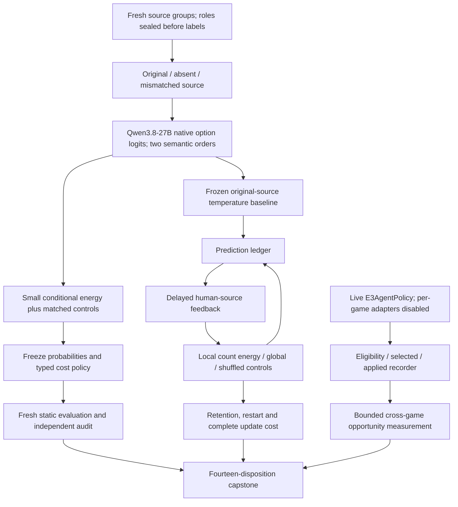
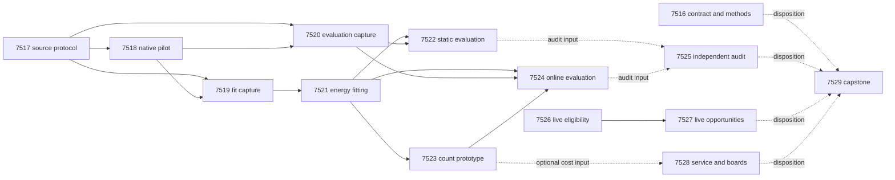

# Carnot Research Roadmap V658: Source Dependence and Causal Learning

**Created:** 2026-09-22 UTC  
**Milestone:** 2026.09.658  
**Title:** Source-dependent energy decisions, count-based continuous learning, and live supervisor evidence  
**Status:** Planned; not activated. No proposed experiment has run.  
**Supersedes:** Completed milestone 2026.09.657. Its design is preserved in
`research-roadmap-v657-preserved-20260922.md`.

## What V657 Proved

Read terminal artifacts and their validation receipts, not just conductor OK
markers. All thirteen tasks produced files; that does not mean all science
passed. `research-complete.yaml` currently ends at V656; the active V657 YAML,
terminal files and conductor log supply the newer evidence.

| Evidence | Measured result | Consequence |
|---|---|---|
| Exp7504/7505 | Qualified role readers and frozen small heads; 176 training and 60 calibration groups | Reuse the numerical and custody infrastructure. Readiness is not benefit. |
| Exp7507 | On 116 previously exposed test groups, window-head Brier 0.128932 versus whole-only energy 0.110146; no registered probability or policy benefit | Do not repeat window pooling on those groups. Treat all prior data as development evidence. |
| Exp7508/7515 | Static audit and capstone disqualified; strict row lint returned nonzero for eight majority-no-headroom advisories | New audits must represent absolute arm costs and honest null context. Keep the old artifacts and unchanged guards. |
| Exp7509/7510 | Online measurement and independent causal audit valid; no registered benefit. Four of five schedules had only 9–11 permutable labels versus the required 12 | Change both the update mechanism and the declared feedback budget before another causal trial. |
| Exp7511/7512 | Recovered 18 historical ARC episodes. The combined audit had 36 shadow selections, zero authenticated eligible choices, and unknown eligibility on 6480 observations | Record eligibility at the real policy seam. A shadow selection is not an applied intervention or an efficacy result. |
| Exp7513/7514 | Qualified host placement and 24 paired durable service requests. Update fraction 0.0000525581; ideal infinite-speed update ceiling 1.0000525609× | No useful whole-service speedup follows from accelerating that kernel. An 81-parameter head cannot substitute for the measured 33-parameter update. |

Separate outer-loop evidence matters: Exp7491/7492 E6 timed profile measured
36 current-Qwen episodes and attributed 96.5532% of timed work to induction
and generation. These are distinct artifacts from V656 experiments with the
same numbers. Use exact paths. Do not pool the qualified E6 exclusive timings
with the V657 panel's unresolved coarse stage labels.

## The Three Largest Gaps

1. **FR-12: reliable source verification remains unproved.** The transport
   works, but exposed evaluation and a weaker window head do not establish
   calibrated decisions on new sources. Test source dependence directly,
   retain same-information controls, and freeze probability and policy roles.
2. **FR-11: persistent state has no qualified causal information gain.**
   Restart parity proves storage, not learning. Test a different, count-based
   conditional energy update with enough declared delayed feedback, a global
   prevalence control, a legal shuffled control and held-out retention.
3. **FR-05/08 and the live-agent north star: deployment value lacks an
   actionable measurement.** ARC supervisor eligibility was unknown, while
   the measured numerical kernel is negligible in service latency. Measure
   the actual live decision boundary and the exact new memory operation.
   Do not infer Rust, FPGA, TSU or whole-service gains from CPU microbenchmarks.

These are experimental gaps, not a claim that the core EBM framework is
missing. The next milestone narrows the unresolved science before adding
another solver, sampler, model family or hardware dependency.

## Research Basis

The 2026-09-22 review was added to `research-references.md` before designing
these tasks. It covers all eight requested topics and six secondary channels.

| Source | Adaptation | Task |
|---|---|---|
| [CCHD consistency constraints](https://arxiv.org/abs/2606.08158), 2026 | Train against semantic option-order disagreement, with an unconstrained equal-capacity control | Exp7521/7522 |
| [Calibration-Aware Uncertainty Cascades](https://arxiv.org/abs/2609.11446), 2026 | Separate probability fitting from a fixed accept/reject/escalate policy | Exp7517/7521/7522 |
| [Optimal Recalibration](https://arxiv.org/abs/2607.19689), 2026 | Measure excess proper loss against input forecasts, not parameter movement | Exp7523/7524 |
| [KAN calibration](https://arxiv.org/abs/2503.01195), 2025 | Keep calibration and matched-capacity controls; locality is not a guarantee | Exp7521/7525 |
| [Thermodynamic AI](https://arxiv.org/abs/2607.00170) and [Extropic Z1T](https://extropic.ai/writing/z1t), 2026 | Preserve operation shape and the complete service boundary | Exp7528 |

The source intervention is Carnot's proposed diagnostic, not a method result
reported by CCHD. The count learner is not the Blackwell recalibration
algorithm and inherits none of that paper's guarantees. The constrained
generation papers do not repair source semantics by making text well formed.
Kona provides architectural context, not a reproducible training recipe here.
New cited EBT/ARM–EBM descendants remain references until a local bottleneck
justifies them. No generator weight update or external-text reranker revival
is included.

## Architecture

The two order views share the original human label after semantic mapping.
Removing or replacing the source is not label-preserving: these readouts
enter as diagnostic features, never as fabricated negative training labels.
The live ARC branch uses runtime observations only. It never consumes the
off-ARC fitted policy or public-game-trained weights.

## Exact Task Contract

**Exactly 14 tasks, exp7516 through exp7529, in the order below.** The
authoritative YAML is `research-roadmap-next.yaml`. IDs, full titles, phases,
deliverable paths, substrate classes and gates below describe that YAML
exactly. No extra experiment is promised elsewhere in this document.

| Order | Task ID | Title | Phase | Deliverable | Substrate class | Structured gates |
|---|---|---|---|---|---|---|
| 1 | exp7516-contract-methods | Bind fourteen tasks and qualify the V657 scientific limits | 1 | results/experiment_7516_v658_contract_methods.json | aggregation | none |
| 2 | exp7517-source-protocol | Seal fresh source interventions and role-separated decision evidence | 1 | results/experiment_7517_v658_source_protocol.json | no_model_load | none |
| 3 | exp7518-source-pilot | Measure Qwen source-intervention feasibility before capture | 1 | results/experiment_7518_v658_source_pilot.json | model_load_no_generation | exp7517-source-protocol.source_protocol_ready_score == 1 |
| 4 | exp7519-source-fit-capture | Capture Qwen intervention evidence for fitting | 2 | results/experiment_7519_v658_source_fit_capture.json | model_load_no_generation | exp7517-source-protocol.source_protocol_ready_score == 1; exp7518-source-pilot.native_source_ready_score == 1; exp7518-source-pilot.fit_capture_feasible_score == 1 |
| 5 | exp7520-source-eval-capture | Capture Qwen intervention evidence for sealed evaluation | 2 | results/experiment_7520_v658_source_eval_capture.json | model_load_no_generation | exp7517-source-protocol.source_protocol_ready_score == 1; exp7518-source-pilot.native_source_ready_score == 1; exp7518-source-pilot.eval_capture_feasible_score == 1 |
| 6 | exp7521-consistency-energy | Fit a source-dependent energy head with option-order constraints | 2 | results/experiment_7521_v658_consistency_energy.json | no_model_load | exp7519-source-fit-capture.fit_capture_ready_score == 1 |
| 7 | exp7522-source-evaluation | Measure fresh probability and typed-decision benefit | 2 | results/experiment_7522_v658_source_evaluation.json | no_model_load | exp7520-source-eval-capture.eval_capture_ready_score == 1; exp7521-consistency-energy.energy_fit_ready_score == 1 |
| 8 | exp7523-count-memory | Prototype a conjugate energy memory for delayed feedback | 3 | results/experiment_7523_v658_count_memory.json | no_model_load | exp7521-consistency-energy.baseline_ready_score == 1 |
| 9 | exp7524-count-online | Measure continuous count learning and retained predictions | 3 | results/experiment_7524_v658_count_online.json | no_model_load | exp7520-source-eval-capture.eval_capture_ready_score == 1; exp7521-consistency-energy.baseline_ready_score == 1; exp7523-count-memory.count_memory_ready_score == 1 |
| 10 | exp7525-decision-audit | Independently audit source decisions and feedback information | 3 | results/experiment_7525_v658_decision_audit.json | aggregation | none |
| 11 | exp7526-arc-eligibility | Bind supervisor eligibility to the live action boundary | 4 | results/experiment_7526_v658_arc_eligibility.json | no_model_load | none |
| 12 | exp7527-arc-opportunities | Measure supervisor opportunities on adapter-withheld live games | 4 | results/experiment_7527_v658_arc_opportunities.json | model_full_generation | exp7526-arc-eligibility.eligibility_receipt_ready_score == 1 |
| 13 | exp7528-service-boundary | Measure count-memory service cost and preserve board continuity | 4 | results/experiment_7528_v658_service_boundary.json | no_model_load | none |
| 14 | exp7529-capstone | Reconcile fourteen outcomes and close unchanged mechanisms | 4 | results/experiment_7529_v658_capstone.json | aggregation | none |

Every structured gate references an earlier task in this roadmap and a bare
numeric field in that producer's REQUIRED ARTIFACT FIELDS. Readiness gates
accept valid nulls. The audit, board disposition and capstone are unconditional
so absent branches still receive an honest record.

## Phase 1 — Seal a Different Scientific Question

**Exp7516** binds both authorities and reads the V657 failure receipts. The
eight strict advisories are not ignored because they were called warnings.
Qualify honest-null artifact shapes before new scientific runs. This task
also reads primary method sections and creates the bounded method map.
It is advisory and does not gate every branch.

**Exp7517** freezes 480 fresh RAGTruth source groups from the pinned official
training release: 160 train, 40 tuning, 40 policy, 120 test and 120 online.
Select one response per group by hash, without label stratification. Exclude
all consumed source/response hashes across prior manifests and captures.
Keep official test untouched. Too few unused groups is a terminal external
block, not permission to recycle exposed evidence.

Each group supplies original, absent and same-role/family mismatched source
conditions in both binary option orders. The 2048-token ceiling applies to
complete text: exclude oversized items before selection; never truncate.
Each view has three clipped log-odds features. The donor map, all formulas,
role readers and seeds are immutable. Cross-role donor selection is forbidden.

**Exp7518** uses twelve exposed development groups for 72 real native
forwards and no generation. It validates only the changed prompt/cost shape.
The p95-based forecast for each 1440-forward capture must fit 3600 seconds,
including 600 seconds for validation. A failed forecast closes the captures;
it cannot lower the declared scientific sample after looking at results.

## Phase 2 — Test Calibrated Source Decisions

**Exp7519/7520** separately capture 240 fitting/policy and 240 test/online
groups, six forwards per group. Use the same owned native CUDA runtime.
Capture processes cannot read labels. Stop collection by 3000 seconds,
checkpoint complete groups, retain failures, and require all registered
groups for a readiness score of one. A null capture-readiness result is not
itself a scientific failure or a reason to discard its valid raw evidence.

**Exp7521** trains a 25-parameter conditional energy head: an intercept and
eight cubic spline coefficients per feature. Exact binary normalization gives
the unsupported probability. Train with mean binary log loss plus a
Bernoulli Jensen-Shannon order-consistency term. Register nine fits from
lambda {0, 0.1, 1} and L2 {0.001, 0.01, 0.1}, 300 steps at rate 0.03.
Select by tuning Brier with deterministic ties. Equal-capacity unconstrained,
same-information linear, original-only, raw, temperature, constant-feature
and label-shuffle controls preserve the explanation of any gain.

Freeze probabilities before opening the independent policy calibration role.
Primary actions minimize expected costs: accept 5p, reject 1-p, escalate 0.2.
Escalation is a paid abstention, not a successful repair. The nine secondary
cost cells are diagnostic. No cell selection can create the primary claim.

**Exp7522** freezes all test predictions before opening labels. Probability
value requires at least 100 complete groups and 20 of each class; Brier must
improve by at least 0.01 over both the preselected strongest comparator and
the original-only energy. Both paired bootstrap upper95 bounds must be below
zero with Holm correction. Log-loss deterioration upper95 must be <=0.01.
Primary typed-decision value separately requires cost improvement >=0.02,
upper95 below zero and accepted coverage >=0.2. Report source-family slices,
every failed unit, and absolute costs when decisions tie.

The small energy fit fulfills the calibrated-decision training floor. It
does not fine-tune the mandated generator or claim that energy is factual
ground truth beyond the supplied source annotation task.

## Phase 3 — Learn from Legal Delayed Feedback

**Exp7523** prototypes a small conjugate count memory. Eight fixed bins of
the frozen temperature-original probability hold success/observation counts.
For a bin's fixed training mean mu and concentration tau, the posterior mean
is r=(tau*mu+s)/(tau+n). Its residual modifies the current forecast as
q=sigmoid(logit(p)+logit(r)-logit(mu)). With no feedback q equals p. The
bin posterior is conjugate; applying its residual to an individual forecast
is a calibration hypothesis, not a statistical guarantee. Select tau from
{4,16,64} on training/tuning only. Keep global pooled counts, frozen and
within-release-batch shuffled arms under exactly the same prior and schedule.

This changes both the failed gradient mechanism and its feedback budget.
All 120 online sources are audited at an explicitly paid reveal probability
of one, with delay eight and release batches of eight. The final unavailable
labels stay censored. A secondary 25-percent schedule is descriptive only.
Record source identity, prediction-time bin, immutable forecast and every
release/update. No feedback from the future, repeated source update or
label-based reordering is permitted.

**Exp7524** measures prequential Brier against frozen, global and shuffled
controls. Support requires >=100 complete groups, >=80 delivered labels,
>=20 labels of each class and >=24 labels in mixed released batches. Every
primary contrast needs >=0.01 mean Brier improvement and Holm-adjusted
upper95 below zero. Use chronological source blocks, length 16, 2000
bootstrap draws, with lengths 8/32 as sensitivity. Alternate seeds do not
multiply the sample size. Retention uses the fixed 120 test groups read-only;
upper95 Brier deterioration must be <=0.01. Exact restart parity and zero
chronology violations are mandatory regardless of benefit.

**Exp7525** independently reduces both scientific branches. It runs even
when an upstream is missing. It reads raw rows rather than trusting producer
headlines, reconstructs predictions, checks source-role leakage and attempts
explicit corruptions. Guard-compatible nulls require truthful absolute costs
and no-headroom context. The existing strict guards stay unchanged.

This phase advances continuous self-learning Tiers 1/2. Its acceleration path
is constant-size counters and lookup tables, without an expensive offline
training loop. The 100x hardware aspiration is a target, not a claimed result.
Do not reopen unchanged importance anchoring or expert reweighting.

## Phase 4 — Connect Evidence to Live Operation

**Exp7526** records enabled, eligible, selected, shadow/applied and actual
state effects at the real supervisor decision boundary. It strengthens an
existing reusable primitive based on a measured cross-game evidence gap.
It does not alter the arm table or act on speculative efficacy. Prove action,
RNG and model/environment call parity with the recorder enabled. Reuse the
outer-loop E6 exclusive timer without editing the historical experiment.

**Exp7527** runs the real Qwen E3 path on six outcome-blind hash-selected E6
games with two seeds and all game adapters disabled. Freeze the shipped
supervisor window, max(840,2*window+40) actions, 180 seconds per episode and
3000 seconds for collection. No new induction budget or sampler settings.
Ten complete episodes covering all six games plus >=90% known eligibility
at observed window boundaries support an opportunity report. Timeouts are
censored, not evidence that an arm cannot help. No efficacy estimate is
licensed by selected-versus-unselected correlation or shadow recommendations.
Any future intervention trial needs twelve eligible choices across three
games and two selectable arms under a reachable application mode.

This supplies the ARC generalization floor and AVO supervision/memory
direction without claiming that a 27B model inherits a frontier reasoner's
strategy-generation ability. The task is live runtime discovery on a public
adapter-withheld proxy, not hidden leaderboard evidence. Existing public
solves receive no duplicate credit. Any incidental solve must reproduce and
carry `solve_provenance=live_agent_self_discovery`.

**Exp7528** measures the exact eight-bin memory service on CPU, including
serialization and durable acknowledgement. Thirty batches of 256 fixture
events and thirty batch-one acknowledgements test cost and restart behavior.
No new model load is needed. Historical native latency cannot become a
measured denominator for a different-shaped operation. Preserve the small
V657 service ceiling and make any composition explicitly hypothetical.

Board dispositions run even if the count learner is blocked. Preserve dated
KV260 fabric and PolarFire CPU graduation separately. GateMate remains
blocked until operator-side cable/power/JTAG evidence changes. Issue no
physical commands on the unchanged branch. Future KV260 access is SSH-only.

**Exp7529** reconciles all fourteen dispositions, independent value scores,
retirement conditions and fixed publication gates G1–G4. A required external
absence is blocked, invalid required evidence is disqualified, and complete
valid null science remains null. None of those is retryable `partial`.
No publication, submission, activation or push occurs.

## Dependency Graph and Conductor Order

Solid edges are structured readiness gates from the contract table. Dashed
edges are read-only inputs, never grounds to skip an audit or board record.
Execution remains the exact numeric task order. No `requires:` references a
retired historical task. Prior code/raw artifacts may be read immutably,
without scheduling their retired producers.

## Hardware, Runtime and Resource Requirements

| Tasks | Available substrate | Bound and claim scope |
|---|---|---|
| 7518–7520 | One admitted RTX 3090, native CUDA llama.cpp, cached Qwen3.8-27B GGUF (about 16 GB) | Native option forwards only; 2-second load/no-generation floor. Observe actual free memory and offload rather than assuming the card is idle. |
| 7527 | One admitted RTX 3090 and official local game environments | Real interactive generation; 60-second full-generation floor. A short canary has the 10-second bounded class instead. |
| Other tasks | Host CPU and system RAM | No LLM load; exact small-head normalization, counts, audits and bounded service measurements. |
| KV260 | Historical authenticated FPGA fabric graduation | Preserve provenance; no fresh sampling/speed measurement proposed. Future access uses `ssh kria`. |
| PolarFire | Historical hash-matched CPU dispatch graduation | This is not FPGA sampling. |
| GateMate | Unchanged physical/JTAG prerequisite unless dated evidence changes | No repeated identical detection probe or flash. |
| Extropic/NPU/larger boards | Wishlist/deferred tracks | No access or performance assumed; no acquisition justified by the current update-service share. |

Two RTX 3090s are recorded in the wishlist; admission is runtime evidence,
not guaranteed availability. These tasks use one generator and do not require
dual-GPU dispatch. GPU contention produces an explicit block without killing
another process. No hardware purchase, package installation or network
publication is part of an experiment.

Budgets in minutes, in task order: 20, 35, 25, 60, 60, 40, 30, 30, 35, 25,
35, 60, 30, 25 (510 minutes total authoring/execution/validation allowance).
The longest science collections stop at 3000 seconds; the per-task hard cap
remains 4800 seconds. Budgets are estimates, not measured performance.

Every prompt has numbered requirements for immediate flushed progress,
phase-boundary output, before/after potentially long calls, and <=60-second
heartbeats inside loops and waits. Keep every gap below 600 seconds. Files
over about 200 lines must be authored across bounded calls with intervening
progress messages. No heartbeat process cures a silent oversized tool call.

## Claim, Failure and Validation Contract

- Each comparative task emits per-unit rows, absolute arm metrics, exclusions
  and failures. A seed, option order, window or forward is not an independent
  source group. Every artifact field and acceptance gate has a principle.
- Every task declares the closed verdict enum. Oracle-defined fixture gains
  are `circular_positive` at most. Infrastructure readiness can be a complete
  null. Claim scores never change merely because a script finished.
- Every scope continuation names the exact prior verdict, the changed
  mechanism/prerequisite, and `retire_if_same_verdict: true`. Review substantive
  repeats too; a renamed verdict does not evade scientific retirement.
  Readiness-only completion and environmental absence are not automatically
  failed scientific mechanisms.
- New capability work is spec first, meaningful failing tests first, then
  implementation. Require focused tests, 100% changed-module coverage, Ruff,
  mypy, spec tracing and applicable E2E. Never use a global test-suite run as
  a model-load precondition. Preserve unrelated baseline failures separately.
- A fresh-process independent reducer, adversarial verifier and unchanged
  strict row lint must pass before terminal publication. Planned capture
  failures stay visible; no checkpoint pretends to be terminal evidence.
- Planning validation compares both authorities, parses the conductor schema,
  checks all producer fields and prior-failure records, and runs exclusion,
  gate, ARC-floor, priority and harness linters plus focused existing tests.
  No numbered model/runtime E2E applies to these planning-only file edits;
  executing the complete plan-validation path is their applicable check.

Relevant capability specs are research-reporting, verification, KAN,
continuous-learning, arc-agi and hardware. Planning requirement
`REQ-REPORT-V658-PLAN` maps the two authorities to FR-10. Future implementation
requirements belong to their owning experiment, not a premature claim of code.

### Decentralization implications

All model work uses the local open-weight mandate. Small models may be CPU
smoke fixtures only. No closed service is required by the research mechanism,
no vendor API enters core code, and there is no external publication in this
milestone. Existing optional integrations and future mirror requirements
remain intact.
