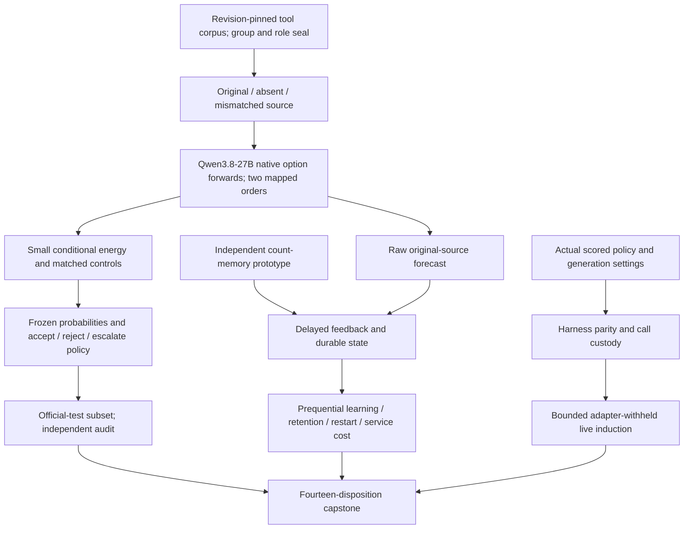

# Carnot Research Roadmap V659: Grounded Decisions and Faithful Induction

**Created:** 2026-09-22 UTC  
**Milestone:** 2026.09.659  
**Title:** Grounded tool decisions, independent count learning, and faithful live induction  
**Status:** Planned; not activated. No V659 experiment has run.  
**Supersedes:** Completed milestone 2026.09.658. Its design is preserved byte
for byte in `research-roadmap-v658-preserved-20260922.md`.

## What V658 Proved

Completion means the conductor reached a terminal disposition, not that every
experiment ran. `research-complete.yaml` currently ends at V657. The active
V658 YAML, terminal artifacts and conductor log supply the newer evidence.

| Evidence | Observed result | Next implication |
|---|---|---|
| Exp7516 | Exact contract and method ingestion qualified | Reuse the contract reader and strict-compatible null artifact shape. |
| Exp7517 | All 2,487 candidate official-training source groups were in the exposure union; zero fresh groups | Another request for 480 unused RAGTruth training groups is structurally blocked. Preserve the exposure determination. |
| Exp7518–7524 | Seven producer artifacts absent after pre-gating | No source-dependent fit, static comparison or count-learning result exists. These mechanisms were not falsified. |
| Exp7525 | Audit completed but required science was missing | Missing results are blocked, not zero-valued observations. |
| Exp7526 | Twelve LLM-off episodes; 40,272 explicit arm observations, 5,568 eligible, 38 selected, zero applied | Eligibility is observable; selection in shadow mode does not establish effect. |
| Exp7527 | Terminal owned-GPU block after a prior hard-cap attempt | Reuse the independently working ownership path and reduce the live task. Do not infer GPU availability from a later monitor. |
| Exp7528/7529 | Board continuity recorded; count service absent; capstone complete but required science blocked | Decouple the count prototype from fresh-data and head-training gates. Keep board reporting unconditional. |

Two outer-loop findings change the plan. Exp7530/7531 already own those IDs,
so V659 starts at Exp7532. Exp7531 completed 56 episodes and recorded 60
induction attempts, but its appended correction shows every attempt emitted
exactly 256 tokens. The harness inherited a seam-probe cap. Its frame-change
proxy also saturated because exploration could move independently of an
induced plan. Preserve both corrections: neither the initial no-headroom
conclusion nor the later induction-reliability interpretation is established.

The corrected Jev Tetris Exp10006 is separate evidence. Its strong candidate
prefilter and public Tetris task do not establish transfer to ARC. E0 scored
vLLM parity still awaits the operator-only submission step. E6's small
candidate-selection time share does not justify reopening that selector ladder.

## Three Largest Gaps Against the PRD

1. **FR-12: source-grounded decisions lack a valid new-source comparison.**
   A calibrated energy head is a probabilistic detector, not a proof of all
   natural-language claims. Test it on a revision-pinned tool-grounding corpus,
   retain source interventions and matched controls, and state the injected-error
   domain. Natural hallucinations and deterministic code correctness remain open.
2. **FR-11: persistent memory has not demonstrated causal predictive gain.**
   V657's qualified online null remains. V658 did not build the alternative
   count learner. Land that small prototype independently, then test legal
   delayed feedback, global and shuffled controls, retention and restart.
3. **FR-05/08 and the live-agent goal: deployment evidence does not yet show
   useful end-to-end decisions.** ARC measurements must use the actual shipped
   generation contract. Count updates need complete service timing before a
   Rust/FPGA claim. The V657 measured update fraction, about 0.0000526, still
   rules out a large whole-service gain from accelerating that operation alone.

## Research Basis and Scope

The dated V659 review was appended to `research-references.md` before this
experiment design. It covers all eight requested topics and the six secondary
channels, including the returned EBT and ARM–EBM citation lists.

| Source | Bounded adaptation | Tasks |
|---|---|---|
| [Beyond Document Grounding](https://arxiv.org/abs/2607.00895), 2026 | Use the released tool-output subset and source groups; do not equate injected edits with organic hallucinations | Exp7533, Exp7535–7539 |
| [CCHD](https://arxiv.org/abs/2606.08158), 2026 | Semantic option-order consistency, compared with an unconstrained equal-capacity head | Exp7538/7539 |
| [Online recalibration](https://arxiv.org/abs/2607.19689), 2026 | Measure excess proper loss from causal feedback; no imported theorem | Exp7534/7540 |
| [Continual Calibration](https://arxiv.org/abs/2604.23987), 2026 | Audit retained Brier and action coverage after updates, not only accuracy | Exp7540/7541 |
| [KAN classifier](https://arxiv.org/abs/2503.21076), 2025 | Treat local basis structure as a hypothesis; retain capacity and calibration controls | Exp7538 |
| [FPGA decomposition](https://arxiv.org/abs/2602.15985) and [Extropic Z1T](https://extropic.ai/writing/z1t), 2026 | Charge movement, orchestration and durability at the measured service boundary | Exp7544 |

Trivia+ is a future long-context, human-label comparator. Its source length and
release terms are different from this workload. PAL, T-SKM-Net, EBT, ARM–EBM,
Cross-Block Conditioning and Ising equilibrium propagation remain method leads,
not new sampler or foundation-model projects. Kona supplies architectural context,
not a reproducible recipe. Generated-span extraction, public-game re-solving,
generic external-text reranking and unchanged importance anchoring stay closed.

## Architecture

The count prototype has no data-capture or static-head prerequisite. Static
head failure does not block the online learner: it uses the registered raw
original-source forecast. ARC never consumes the off-ARC learned policy.

## Phase 1 — Qualify Inputs and an Independent Learner

**Exp7532** binds the exact authorities, ingests primary methods and preserves
V658/B2 determinations. It is advisory, not a global gate. **Exp7533** changes
the exhausted data prerequisite: use only `lettucedetect-tool-output` from
`KRLabsOrg/lettucedetect-code-hallucination` revision
`866a7c5392c3cf87e4fbc2b3808815d524f54331`.

A planning-only inventory found 4,126 train and 308 test instance IDs, with
zero overlap. Exact token fit and connected-component exclusion still need
execution-time qualification. Group by instance ID, normalized context and
normalized answer; remove cross-split components and prior selected/captured
sources. Select without labels, one answer per component. Keep complete text
at `n_ctx=4096`; exclude oversized prompts before selection, never truncate.

Seal 160 fit, 40 tuning, 40 policy and 160 online groups from official train,
and 80 groups from official test. The three source conditions are original,
absent and a same-role/tool-type donor. Two option orders give six forwards
per group. Only the original sample has the released factual target; changed
sources supply features, not automatic negative labels. Predictor fields omit
annotation, injector, corpus and outcome metadata. The injected tool-error
scope cannot establish organic hallucination performance or code correctness.

**Exp7534** independently implements eight-bin conjugate energy memory on
analytical fixtures. It has no corpus, GPU or static-head gate. With prior
mass 8, bin mean mu, posterior r=a/(a+b), it shifts the raw forecast odds by
`logit(r)-logit(mu)`. Binary normalization is exact. Only released labels change
counts. Frozen, global and legal shuffled controls share budgets. Crash/restart
checks preserve predictions and exactly-once updates. Constructed wins are
circular-positive fixtures, not empirical learning.

**Exp7535** uses twelve excluded development groups for 72 native forwards.
The model is the mandated Qwen3.8-27B GGUF. Zero tokens are generated. Require
owned CUDA receipts and a p95-based forecast of at most 3,600 seconds for each
1,440-forward capture, including 600 seconds for validation. A failed forecast
closes collection; it cannot shrink the scientific sample after outcomes.

## Phase 2 — Test Source-Dependent Calibrated Decisions

**Exp7536/7537** separately capture 240 fitting/policy and 240 test/online
groups. Checkpoint each complete group, retain attempt identities and all
missing cells. Stop acquisition by 3,000 seconds after admission, and sooner
if the overall task cap would leave under 600 seconds for validation. Readiness
requires every planned group and forward, plus custody, not favorable scores.

**Exp7538** fits a 25-parameter binary energy head: an intercept and eight
cubic spline coefficients for each of three source logit features. Train on
160 groups, select on 40 tuning groups, then freeze before the policy role.
The treatment uses binary log loss plus option-order Jensen–Shannon consistency,
lambda {0, 0.1, 1}, L2 {0.001, 0.01, 0.1}, 300 steps at rate 0.03. Controls
include unconstrained equal-capacity energy, same-information logistic,
original-only energy, raw and temperature readouts, shuffled labels and constant
features. Main trainable comparators get nine candidates; report unequal
parameter counts and measured compute rather than pretending exact equality.

The primary typed policy minimizes expected costs `5p`, `1-p`, `0.2` for
accept, reject and escalate, with escalation on ties. Escalation is a paid
abstention. Nine secondary cost cells are diagnostic, never a way to select a
winning primary result.

**Exp7539** freezes all predictions before test-label access. Benefit needs
at least 64 complete groups and 12 of each class. Brier must improve by at
least 0.01 against the preselected strongest comparator, original-only energy
and unconstrained equal-capacity energy. Use 2,000 paired component bootstraps
and Holm-corrected one-sided tests at family alpha 0.05; each adjusted upper
bound must be below zero. Log-loss and primary-cost deterioration upper95
bounds must each be <=0.01 against the selected comparator. Otherwise publish
a valid null. Source sensitivity and typed-cost grids remain secondary.

## Phase 3 — Measure Causal Learning and Independently Audit It

**Exp7540** uses the raw original-source forecast, not the learned static head.
It reads fitting features only to freeze eight bin means; labels are not needed
for initialization. Its empirical prerequisites are the two new captures and
the independent count prototype. Run 160 online components in five frozen
label-blind orders with full feedback released in eight-event blocks after an
eight-event delay. Replaying a corpus chronologically for a new learner is
prequential evaluation, not a claim of fresh naturally arriving production data.

Compare frozen, local-count, global-count and release-block shuffled local
arms. The shuffled arm permutes only labels released in the same block, with
no future-origin information. Record every actual changed label binding.
Measure old-domain Brier and typed-action coverage on the 80 sealed test
components at checkpoints 0/40/80/120/160 through an isolated evaluator. Those
labels never feed adaptation or selection. Five orders reuse 160 sources;
they are not 800 independent observations.

Benefit requires >=128 complete source groups, >=12 of each label, >=40 changed
shuffled-label bindings in each order, Brier improvement >=0.005 against all
three controls, and simultaneous upper95 replay-bootstrap differences below
zero. Retention deterioration upper95 must be <=0.01 for Brier and primary
cost, with exact restart parity and zero chronology violations. Use 1,000
component resamples that replay each learner, not an IID bootstrap of correlated
update rows. Externally unchanged absence is blocked; a valid unsuccessful
learning measurement is null.

**Exp7541** independently reduces both branches from raw data and frozen
parameters, including role access, source labels, control construction and
feedback order. It is unconditional, so missing science is recorded. Static
and online qualification fields are separate; a valid null can qualify even
when neither benefit flag is one. The retired V656 historical audit is not
rerun or rehabilitated.
