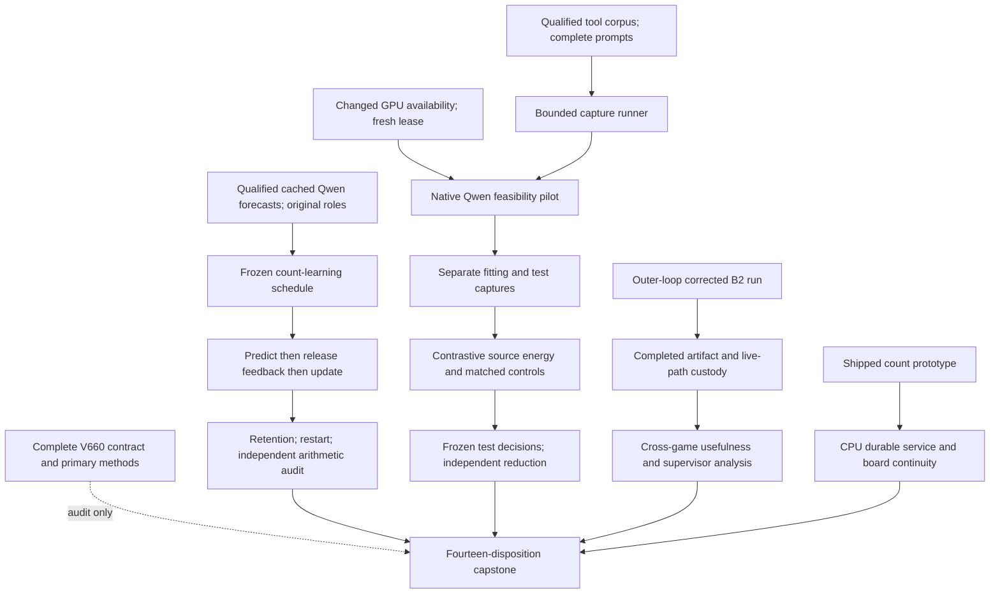
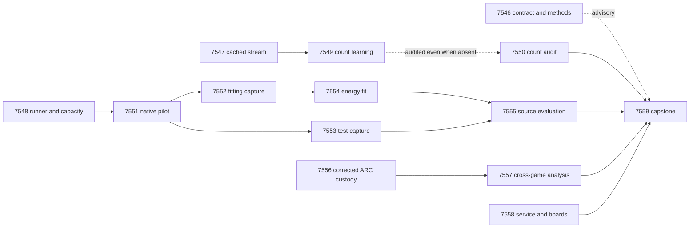

# Carnot Research Roadmap V660: Independent Learning and Grounded Decisions

**Created:** 2026-09-22
**Milestone:** 2026.09.660
**Title:** Independent count learning, contrastive source decisions, and corrected live-agent evidence
**Status:** Planned; not activated. No V660 experiment has run.
**Supersedes:** Completed milestone 2026.09.659. The incomplete prior design
is preserved byte for byte in `research-roadmap-v659-preserved-20260922.md`.

## What V659 Proved and Left Unmeasured

A terminal conductor disposition does not imply successful science. The
completed ledger currently ends at V658; the active YAML, result bytes and
conductor log establish V659's newer state.

| Evidence | Actual finding | Consequence |
|---|---|---|
| Exp7532 | Document promised fourteen tasks; YAML contained eight and the document lacked its task table. Contract readiness was zero. The artifact also used invalid `execution_venue=host_cpu` and was flagged. | Validate the complete pair before staging. Use legal venue `host` and a separate device field. Preserve the old failure. |
| Exp7533 | Tool-output corpus, role grouping and complete-prompt protocol qualified; readiness one, benefit unmeasured. | Reuse sealed inputs instead of changing datasets again. |
| Exp7534 | Independent conjugate count memory passed arithmetic, chronology and restart checks; circular-positive analytical evidence. | Test this shipped learner on real cached forecasts without a GPU or static-fit dependency. |
| Exp7535 | Waited 300 seconds; neither GPU was admissible. Zero current inference calls; all three readiness/feasibility fields zero. | Resource contention remains external. A new pilot requires observed changed availability and a fresh exclusive lease. |
| Exp7536/7537 | Conductor wrote pre-gate diagnostics; planned capture artifacts absent. | No tool-source collection result exists. |
| Exp7538/7539 | Cascade-blocked after missing captures. | No tool energy fit or held-out result exists. |
| Exp7540–7545 | Promised in prose but absent from the executable YAML. | They were never issued. Keep these IDs reserved and begin at Exp7546. |

V657 remains relevant: its independently audited residual-learning experiment
was a valid null. Its static result was exploratory because of prior exposure,
and its static audit was disqualified. None of those findings is reversed.

A read-only planning observation found GPU 0 occupied by a Qwen server and
GPU 1 occupied by the separately running B2 correction in
`/home/ianblenke/carnot-wt-b2c`. Its intended result is
`results/experiment_10008_b2_induction_gate_measurement_v2.json`. A file at that
path can still contain an earlier blocked disposition while a new producer is
running. Presence is not completion. V660 does not duplicate or interrupt it.
Experiment IDs in the 10000 range belong to the separate outer-loop namespace.

## Three Biggest Gaps Against the PRD

1. **FR-12: grounded, calibrated decisions remain unproved on new sources.**
   The tool corpus is qualified, but inference and comparison never ran. Test
   source-dependent energy against controls sharing the same evidence. Keep
   probabilistic calibration distinct from deterministic constraint proof.
2. **FR-11: persistent learning has no demonstrated predictive advantage.**
   The new count prototype is ready; its empirical test was never issued.
   Compare legal delayed feedback, frozen and global controls, and shuffled
   bindings, while measuring retained calibration and restart behavior. The
   available cached corpus permits an exploratory test, not fresh confirmation.
3. **FR-05/08, NFR-01 and the live-agent goal: useful deployment cost is unclear.**
   Token-starved induction and incidental frame movement cannot establish gate
   quality. Qualify the corrected runtime evidence before cross-game analysis.
   Measure complete durable memory service before claiming a Rust/FPGA gain.

## Research Basis and Scope

The V660 source review was appended to `research-references.md` before this
experiment design. It covers all eight requested arXiv topics and six secondary
channels. Semantic Scholar returned HTTP 429 for both requested citation lists;
OpenReview direct retrieval encountered a browser challenge. Those sources
were checked, but no exhaustive new citation or review claim is made.

| Source | Adaptation | Tasks |
|---|---|---|
| [SAFE contrastive probes, 2609.16646](https://arxiv.org/abs/2609.16646), September 2026 | Compare original-source and source-ablated readouts; textual transfer is a hypothesis | Exp7551–7555 |
| [Beyond Document Grounding, 2607.00895](https://arxiv.org/abs/2607.00895), July 2026 | Reuse released tool-output groups and preserve injected-label provenance | Exp7548, Exp7551–7555 |
| [Optimal Recalibration, 2607.19689](https://arxiv.org/abs/2607.19689), July 2026 | Test proper loss against the starting predictor; no imported regret guarantee | Exp7547/7549/7550 |
| [Continual Calibration, 2604.23987](https://arxiv.org/abs/2604.23987), April 2026 | Track retained uncertainty and decision coverage as well as accuracy | Exp7549/7550 |
| [Adversarial world-model sequences, 2602.05903](https://arxiv.org/abs/2602.05903), February 2026 | Challenge whether an induced model connects to actions and progress; chess results do not prove ARC transfer | Exp7556/7557 |
| [KAC, 2503.21076](https://arxiv.org/abs/2503.21076), March 2025 | Local basis functions need capacity and calibration controls; this head is not a KAC reproduction | Exp7554 |
| [FPGA–ASIC co-design, 2602.15985](https://arxiv.org/abs/2602.15985) and [Extropic Z1T](https://extropic.ai/writing/z1t), 2026 | Include readout, movement and durable acknowledgement in service costs | Exp7558 |

EBT, ARM–EBM, PAL, T-SKM-Net, constrained decoding and Ising equilibrium
propagation remain method context. Exact binary normalization needs no sampler
sweep. Kona's public page supplies no reproducible checkpoint or training
recipe. Generated-span extraction, generic external-text reranking, unchanged
importance anchoring and public-game re-solving stay closed. No generator
weight update, new hardware purchase or external publication is scheduled.

## Architecture

The count experiment consumes existing native Qwen forecasts and human-label
roles. It cannot claim current GPU inference. The tool decision policy never
enters the ARC agent. GPU capture failure cannot block count learning, the
ARC custody report, hardware continuity or the capstone.

## Exact Task Contract

**Exactly 14 tasks, exp7546 through exp7559, in this order.**
`research-roadmap-next.yaml` is the staged executable authority. The following
rows match all its task IDs, complete titles, phases, paths, substrates and
gates. No extra experiment is promised elsewhere in this document.

| Order | Task ID | Exact title | Phase | Deliverable | Substrate class | Structured gate |
|---|---|---|---|---|---|---|
| 1 | exp7546-contract-methods | Bind fourteen complete authorities and ingest the new method limits | 1 | results/experiment_7546_v660_contract_methods.json | aggregation | none |
| 2 | exp7547-count-stream | Seal an empirical count-learning stream from qualified cached Qwen evidence | 1 | results/experiment_7547_v660_count_stream.json | no_model_load | none |
| 3 | exp7548-capture-runner | Qualify bounded source collection and observe changed GPU availability | 1 | results/experiment_7548_v660_capture_runner.json | no_model_load | none |
| 4 | exp7549-count-learning | Measure delayed count learning and retained calibrated decisions | 2 | results/experiment_7549_v660_count_learning.json | no_model_load | exp7547-count-stream.cached_stream_ready_score == 1; exp7547-count-stream.verdict_class in ["positive", "null", "circular_positive"]; exp7547-count-stream.flagged_adversarial == false |
| 5 | exp7550-count-audit | Independently test feedback causality and count-learning conclusions | 2 | results/experiment_7550_v660_count_audit.json | aggregation | none |
| 6 | exp7551-native-pilot | Measure source-intervention feasibility after verified resource availability | 2 | results/experiment_7551_v660_native_pilot.json | model_load_no_generation | exp7548-capture-runner.capture_runner_ready_score == 1; exp7548-capture-runner.gpu_capacity_observed_score == 1; exp7548-capture-runner.verdict_class in ["positive", "null", "circular_positive"]; exp7548-capture-runner.flagged_adversarial == false |
| 7 | exp7552-fit-capture | Capture complete tool-source fitting and calibration evidence | 2 | results/experiment_7552_v660_fit_capture.json | model_load_no_generation | exp7548-capture-runner.capture_runner_ready_score == 1; exp7551-native-pilot.native_tool_ready_score == 1; exp7551-native-pilot.fit_capture_feasible_score == 1; exp7548-capture-runner.verdict_class in ["positive", "null", "circular_positive"]; exp7548-capture-runner.flagged_adversarial == false; exp7551-native-pilot.verdict_class in ["positive", "null", "circular_positive"]; exp7551-native-pilot.flagged_adversarial == false |
| 8 | exp7553-test-capture | Capture sealed tool-source test evidence | 2 | results/experiment_7553_v660_test_capture.json | model_load_no_generation | exp7548-capture-runner.capture_runner_ready_score == 1; exp7551-native-pilot.native_tool_ready_score == 1; exp7551-native-pilot.eval_capture_feasible_score == 1; exp7548-capture-runner.verdict_class in ["positive", "null", "circular_positive"]; exp7548-capture-runner.flagged_adversarial == false; exp7551-native-pilot.verdict_class in ["positive", "null", "circular_positive"]; exp7551-native-pilot.flagged_adversarial == false |
| 9 | exp7554-energy-fit | Fit a contrastive source energy head with matched decision controls | 3 | results/experiment_7554_v660_energy_fit.json | no_model_load | exp7552-fit-capture.fit_capture_ready_score == 1; exp7552-fit-capture.verdict_class in ["positive", "null", "circular_positive"]; exp7552-fit-capture.flagged_adversarial == false |
| 10 | exp7555-source-evaluation | Measure and independently challenge source-grounded decision benefit | 3 | results/experiment_7555_v660_source_evaluation.json | no_model_load | exp7553-test-capture.test_capture_ready_score == 1; exp7554-energy-fit.energy_fit_ready_score == 1; exp7554-energy-fit.baseline_ready_score == 1; exp7553-test-capture.verdict_class in ["positive", "null", "circular_positive"]; exp7553-test-capture.flagged_adversarial == false; exp7554-energy-fit.verdict_class in ["positive", "null", "circular_positive"]; exp7554-energy-fit.flagged_adversarial == false |
| 11 | exp7556-arc-corrected-custody | Qualify corrected B2 live-agent evidence without repeating its run | 3 | results/experiment_7556_v660_arc_corrected_custody.json | aggregation | none |
| 12 | exp7557-arc-generalization | Test induction usefulness and supervisor evidence across withheld games | 3 | results/experiment_7557_v660_arc_generalization.json | aggregation | exp7556-arc-corrected-custody.corrected_arc_ready_score == 1; exp7556-arc-corrected-custody.verdict_class in ["positive", "null", "circular_positive"]; exp7556-arc-corrected-custody.flagged_adversarial == false |
| 13 | exp7558-service-boundary | Measure durable count-service cost and preserve all board states | 4 | results/experiment_7558_v660_service_boundary.json | no_model_load | none |
| 14 | exp7559-capstone | Reconcile fourteen dispositions and decide each scientific continuation | 4 | results/experiment_7559_v660_capstone.json | aggregation | none |

## Phase 1 — Qualify Existing Inputs and the Execution Contract

**Exp7546** binds the full contract and ingests method details. Its receipt is
advisory: an unrelated reporting failure cannot erase independent science.
Private task removal, reordering, title/path/substrate and gate-field mutations
must fail. Legal venue `host` prevents recurrence of Exp7532's invalid venue.

**Exp7547** seals the new empirical question using Exp7504's authenticated
features, Exp7509's role readers, Exp7510's provenance qualification and
Exp7534's shipped count learner. Use raw whole-response forecasts, with an
explicit hallucination-label orientation. Do not use the former trained head.
Freeze 176 training-role forecasts for label-free bin means, 159 online groups
and 116 retention groups. These data were previously inspected; the result is
exploratory even if the new method meets its effect threshold.

**Exp7548** builds and tests a small resumable wrapper around the existing
native transport before any model execution. It reuses the Exp7533 sealed
corpus at `KRLabsOrg/lettucedetect-code-hallucination`, revision
`866a7c5392c3cf87e4fbc2b3808815d524f54331`, tool-output subset only. Preserve
connected-component grouping, exposure exclusions and whole prompts.

Freeze 160 training, 40 tuning, 40 policy and 80 official-test groups. The
12 development groups stay excluded from those roles. Do not capture the
separate 160 tool-online groups this milestone. Each group has original,
absent and same-role mismatched source, in two mapped option orders. Changed
sources supply features; they do not create new negative labels.

The same task makes a bounded read-only resource observation after CPU work.
Both GPUs were busy during planning. Report runner readiness and actual idle
capacity separately; at most 300 seconds of observable waiting. No eviction,
foreign endpoint adoption or claim that resource contention has been fixed.
The later pilot rechecks and acquires its own exclusive lease. A stale idle
snapshot cannot authorize a model load.

Phase boundary: arithmetic/role and capture-control mutations must fail before
empirical work. A failed capacity observation only closes the GPU branch.

## Phase 2 — Measure Learning and Conditionally Acquire New Evidence

**Exp7549** is the required continuous self-learning experiment. The local
memory has eight fixed probability bins and prior mass eight, with means
computed from training forecasts only. It updates beta counts after legal
feedback and shifts the baseline odds by `logit(a/(a+b))-logit(bin_mean)`.
Normalization over its two energies is exact. It modifies neither Qwen nor
constraint meaning; it tests Tier 1 across-query calibration and persistent
Tier 2 state. It does not claim to discover new constraint types.

Run five frozen label-blind orders (7549001–7549005), delay eight events and
release blocks of eight with full audit. Predict first, then release, update
and persist. Controls are frozen forecasts, global counts and local counts
with shuffled labels only within the currently released block. Keep the final
short block and unreleased tail explicit. At least 40 label bindings per order
must actually change; a shuffle that preserves labels is not a control.

Primary loss is Brier. Primary actions minimize accept `5p`, reject `1-p`,
escalate `0.2`; escalation wins ties. An isolated evaluator checks 116 retention
groups at arrivals 0/40/80/120/159 without returning labels to adaptation.
Record costs, action coverage, calibration and exact restart parity.

The exploratory effect gate requires at least 128 completed online groups,
12 of each label, Brier improvement at least 0.005 against all three controls,
and simultaneous one-sided upper95 differences below zero. Use 1,000
source-cluster resamples that replay adaptation in all orders, not an IID
bootstrap of dependent event rows. Use Holm family alpha 0.05. Retention Brier
and primary-cost deterioration upper95 must each be at most 0.01. Seeds and
orders do not multiply the 159 independent sources. Confirmatory benefit stays
zero because of prior exposure. **Exp7550** independently reconstructs counts,
causality, uncertainty and cold restart; it runs even if the producer is blocked.

**Exp7551** starts only after the CPU runner and changed-capacity gates pass.
It uses the mandated Qwen GGUF for 72 native option forwards on the 12 excluded
development groups, with zero generated tokens. Require owned CUDA offload,
GGUF-native tokenization, exact option boundaries, clean reset and raw custody.
It forecasts fitting and test collection separately using measured p95 time,
load and checkpoint costs. Each forecast with 900 seconds reserved validation
must be at most 4,200 seconds; acquisition itself is at most 3,000 seconds.
No sample shrinking after seeing costs or outcomes.

**Exp7552** captures 240 fitting/policy groups, 1,440 forwards. **Exp7553**
captures 80 test groups, 480 forwards. Both reuse the tested runner, checkpoint
complete groups, leave labels sealed, recheck exclusive admission and unload
owned resources. Each gets a separate conductor budget. Readiness requires
every planned group, identity and check; unsuccessful predictions do not close
transport readiness. Partial own work is resumable; unchanged external absence
is terminal blocked.

Phase boundary: count conclusions need independent reconstruction, and fresh
source fitting needs complete raw capture. Constructed fixture wins are
circular-positive and cannot supply empirical benefit.

## Phase 3 — Challenge Source Decisions and Corrected ARC Evidence

**Exp7554** trains a small conditional energy decision policy. Features are
`z_original`, `z_original-z_absent`, and `z_original-z_mismatched`. Use an
intercept and eight fixed local cubic basis coefficients per feature: 25
parameters, `E(0)=0`, `E(1)=-f(x)`, exact binary normalization. Train with log
loss and mapped-option-order Jensen–Shannon consistency. Freeze lambda
{0, 0.1, 1}, L2 {0.001, 0.01, 0.1}, 300 steps at rate 0.03 and seed 7554001.
Fit on 160 groups, select each arm by Brier on 40 tuning groups, then freeze
before the 40 policy groups. Average mapped-order probabilities at evaluation.

Controls are unconstrained equal-capacity energy, original-only local-basis
energy, same-information logistic, raw, temperature, constant-feature and
shuffled-label. Main trainable comparators get nine candidates; differing
parameter counts and measured fitting costs remain explicit. Select the
strongest comparator before test access. The same primary cost policy applies;
a cost grid is diagnostic, not a second route to a winning headline. This is
the standing calibrated-decision training slot and does not alter Qwen weights.

**Exp7555** freezes all predictions before opening 80 test-group labels. It
requires at least 64 complete groups and 12 of each label; Brier improvement
at least 0.01 against the preselected strongest comparator, original-only
energy and unconstrained equal-capacity energy; 2,000 paired source bootstraps
and Holm-adjusted one-sided upper95 differences below zero at family alpha
0.05. Log-loss and primary-cost upper95 deterioration against the selected
comparator must each be at most 0.01. Otherwise report a valid null. An
independent fresh-process reducer must agree before positive promotion.

Challenge option swaps, donor changes, source-independent shortcuts, label
leakage and aggregates inconsistent with rows. Source sensitivity is diagnostic:
an absent source is not a known false answer. Claims remain confined to the
selected official-test subset of injected tool errors, with no natural
hallucination, formal-correctness or generic reranking guarantee.

**Exp7556** qualifies the separately executing corrected B2 artifact. It reads
the current worktree first, then the explicit read-only external handoff path
listed above. Require a completed stable producer, valid source/raw hashes,
actual 4096-token requests and full invocation/attempt custody. Never count a
stale blocked artifact or an active producer as completion. A continuing hard
cap or missing provenance remains visible. No new game or model run occurs.

**Exp7557** analyzes adapter-withheld live-agent evidence across games. It
keeps the original frame-change endpoint and plan-linked execution/level
progress separate. If raw provenance cannot establish plan-to-action joins,
that endpoint is unavailable. It cannot be reconstructed from incidental
movement. The analysis-only outcome oracle is an optimistic logged-data
headroom bound, not proof of a causal suppression policy.

Numerical gate-quality fitting requires 1,000 opportunities, 100 real attempts,
both useful and useless outcomes and at least four games contributing each
outcome. Otherwise publish feasibility only. When supported, fit a fixed
L2-logistic rule using pre-attempt stagnation, repeats, observed novelty and
prior rejection, with nested training-game selection of L2. Evaluate
leave-one-game-out against the current trigger and a matched-rate random
suppression control; cluster intervals by game. Outcome tokens, planned state
and later progress are forbidden predictors. Report missed useful attempts
and level gains. `gate_ready_to_ship` remains false without a live intervention.
Supervisor arm fired/helped counts and unredirected stagnations remain visible;
zero firings is a legitimate no-refinement finding.

These two ARC tasks satisfy the generalization floor through corrected
adapter-withheld runtime evidence and supervisor outcomes. They do not re-solve
known public levels, modify a submission or substitute offline ground truth.
Any credited historical solve requires registry precheck and
`solve_provenance=live_agent_self_discovery`. Development proxies and outer-loop
reverse engineering never headline.

Phase boundary: source benefit requires an independent raw reduction; ARC
usefulness requires qualified runtime custody and identifiable endpoints.

## Phase 4 — Measure Durable Service and Reconcile All Outcomes

**Exp7558** uses the already-shipped count prototype independently of every
benefit or GPU gate. Run 30 trials each of batch-one and batch-256 durable
service, with prediction, released feedback, update, serialization, fsync,
acknowledgement and reload. Compare only equal durability semantics; batching
wait counts in acknowledgement latency. Kill only owned test children at
registered crash boundaries and require exactly-once acknowledged replay.

Record update-kernel time and full service time separately. Amdahl bounds use
the measured service denominator. The task does not measure current LLM
service, promise 100x speedup or copy a vendor estimate. Preserve all three
board dispositions unconditionally: historical KV260 fabric graduation,
PolarFire dispatch provenance, and GateMate's dated physical-change gate.
No board operation is part of this CPU experiment.

**Exp7559** records all fourteen dispositions and independently qualified
branch conclusions. Missing externally gated science yields terminal blocked,
not partial. Readiness is not benefit. Preserve earlier flags and corrections,
report stable publication gates G1–G4 and append reconciled specification,
traceability and operations records. No roadmap activation or publication.

## Dependency Graph and Conductor Order

The table is the exact conjunctive gate contract. Solid scientific edges there
require bare numeric readiness, a valid terminal verdict class and no adversarial
flag. Those exact fields are named in each producer prompt. All gates
refer to earlier tasks in this roadmap; historical artifacts are authenticated
inputs, never `requires:` dependencies on retired tasks. Count and capstone
audits are unconditional so a pre-gate cannot erase the disposition record.
Conductor execution is sequential in table order.

## Hardware, Models and Time Budgets

| Resource | Use and constraint |
|---|---|
| Host CPU/RAM/storage | All fitting, count updates, audits and service measurements. Reuse cached data; time persistence and checkpoint size. |
| One RTX 3090 at a time | Only Exp7551–7553 need current inference. Use the cached approximately 16 GB Qwen3.8-27B Q4_K_M through native llama.cpp and verified owned CUDA offload. Two GPUs are installed but were busy; the plan does not assume availability. |
| Existing B2 GPU work | Read only its completed artifact after the producer exits. Never interfere with the running session or count its calls as current V660 work. |
| KV260 | Preserve the authenticated graduated fabric result. Future access, outside this CPU task, is via `ssh kria`. |
| PolarFire | Preserve the authenticated dispatch record and distinguish board CPU work from FPGA sampling. |
| GateMate | Preserve the physical-change blocker and search new operator receipts. Repeated unchanged detection is not scheduled. |
| XDNA/TSU/larger FPGA | Deferred. The wishlist provides no current executable path that removes the measured service bottleneck. No acquisition is required. |

Every new LLM task has `MODEL_SPECS: [unsloth/Qwen3.8-27B-GGUF]` and class
`model_load_no_generation` (2-second floor), because it runs option forwards
and generates no tokens. CPU and aggregation tasks have empty specs and zero
current invocations. If a future task adds a small token canary it must use
`model_bounded_generation` (10-second floor); only a real generative workload
uses `model_full_generation` (60 seconds). Never pad duration to meet a floor.

Reported times are measured, with authoring, validation, historical work and
current calls separate. Each task has a 4,800-second hard cap; estimates range
from 25 to 70 minutes. Source acquisition stops at 3,000 seconds and reserves
900 seconds for validation. No whole-repository test prerequisite precedes a
model load. Schema/resource preflight Exp7548 routes to Opus with 100 turns;
formulaic stream/capture tasks route to Codex gpt-5.6-sol with 30 turns. Other
tasks use the conductor default and 20–50 turns.

## Failure Discipline, Validation and Exit Criteria

Each task names its prior failure, literal verdict or explicitly absent
producer verdict, diagnosed cause, changed prerequisite/method and
`retire_if_same_verdict: true`. Changed availability is observed, not assumed.
The plan does not treat an external GPU block as scientific falsification.
Unknown future resource state remains a material limitation. Repeated unchanged
mechanisms stay closed; no old retired ID or dead prerequisite chain is reused.

Every prompt contains numbered requirements for flushed phase/operation lines,
60-second loop and pending-operation heartbeats, and bounded file writes of
about 100–150 lines per tool call with progress between calls. Keep every gap
under 600 seconds. A task that stays silent can die at 1,200 seconds despite
a longer estimate. Readiness and the closed verdict class accompany all claims;
blocked diagnostics name the exact failed upstream field and observed value.

Implementation tasks first extend the appropriate capability REQ/SCENARIO,
write tests, then implement and verify. Require scoped unit tests, 100 percent
changed-module coverage, Ruff/format, mypy, scoped spec coverage, actual
entrypoint execution, cold replay, independent numerical reduction and strict
artifact checks. Use applicable checks from `ops/e2e-test-plan.md`; a read-only
report has no numbered runtime E2E. Never weaken guards, mutate historical
results during tests or replace a missing measurement with a fixture result.

Planning validation compares both authorities, checks all existing input paths,
mutates private contract copies, runs the unchanged schema/prior/exclusion/gate/
harness/ARC/overdue checks and relevant contract unit tests, and records
unrelated repository debt separately. Planning does not run these experiments.
Successful closeout means fourteen complete, honest dispositions and a clear
continuation decision for each branch; a positive outcome is not required.
