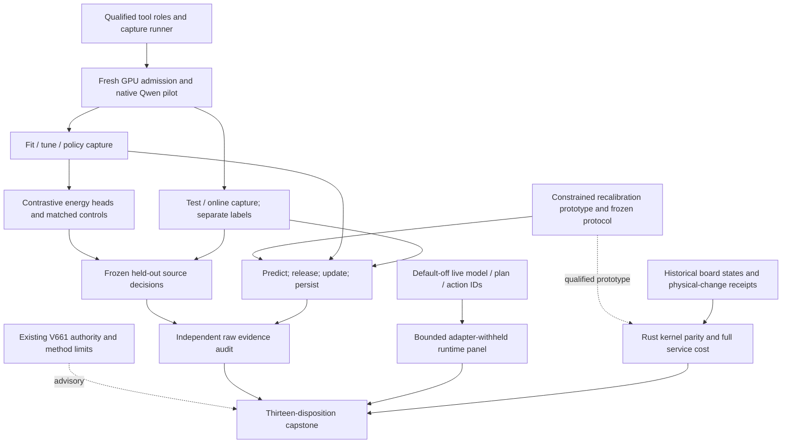

# Carnot Research Roadmap V661: Fresh Decisions and Persistent Recalibration

**Created:** 2026-09-23
**Milestone:** 2026.09.661
**Title:** Fresh source decisions, constrained online recalibration, and attributable live-agent progress
**Status:** Planned; not activated. No V661 experiment has run.
**Supersedes:** Completed milestone 2026.09.660. Its design is preserved
byte for byte in `research-roadmap-v660-preserved-20260923.md`.

## What V660 Proved and Left Unmeasured

V660 has fourteen terminal conductor dispositions and nine producer artifacts.
The completed ledger still ends at V659 during planning. The active roadmap,
conductor log and actual artifact bytes establish the newer terminal state.
All numerical findings below were read through `scripts/summarize_artifact.py`.
A conductor `OK` is not evidence of a positive scientific result.

| Evidence | Finding | Consequence |
|---|---|---|
| Exp7546 | The fourteen-row contract and mutation checks passed. Harness-fit failed because the staged filename had been consumed at activation. Its adversarial flag remains. | Resolve the matching existing authority before running guards. Preserve the historical disqualification. |
| Exp7547 | Cached count stream qualified. | Its previously inspected groups remain exploratory. Do not use them for a new confirmatory claim. |
| Exp7548 | CPU capture runner qualified; GPU capacity was zero. | Reuse the runner. Recheck resource admission immediately before model load. |
| Exp7549/7550 | Independent audit qualified a learning null. Local-count Brier difference versus global counts was +0.00877; both retention gates failed. | Change the learning objective and use fresh source groups. Keep the stronger global-count comparator. |
| Exp7551–7555 | Pilot pre-gate blocked; five planned source producer artifacts are absent. | No source-intervention fit or evaluation was performed. Resource absence did not falsify this scientific hypothesis. |
| Exp7556/7557 | Corrected B2 evidence qualified. There were 35 attempts, below the 100-attempt floor. Plan-linked outcomes were unavailable. | Add model/plan/action IDs before collecting another bounded live panel. Frame movement cannot stand in for useful induction. |
| Exp7558 | Durable count service and board continuity qualified. The ideal update-only service speed ceiling was about 1.0614x. | Measure a new deployment kernel with full service costs. A fast update alone does not justify FPGA work. |
| Exp7559 | Complete inventory, terminal blocked source-science branch, no new retirement rows. | Retain independent branch conclusions and honest missing-data dispositions. |

A read-only planning observation on 2026-09-23 found GPU 1 at 4 MiB, zero
utilization and no compute process. GPU 0 held an existing server. This is a
changed prerequisite from V660, not a GPU reservation. Every proposed live
task must acquire its own fresh exclusive lease. No process was stopped and
no model was loaded during planning.

## Three Biggest Gaps Against the PRD

1. **FR-12: source-grounded, calibrated decisions remain unproved.**
   The corpus and transport exist, but fresh source-dependent comparisons
   never ran. Measure an energy policy against controls with identical
   information. Calibration is probabilistic; it is not a formal proof that
   an extracted statement matches the source or is true in the world.
2. **FR-11: durable learning has no qualified predictive advantage.**
   Chronology and restart work. The local count learner lost to global counts
   and failed retention. Test joint proper-loss recalibration on uninspected
   source groups, with frozen controls and a separate retention evaluator.
3. **FR-05/08, NFR-01 and the live-agent objective: deployment value lacks
   a complete measurement.** ARC has no usable plan-to-action endpoint;
   a small update kernel has little whole-service headroom. Add the missing
   live observation and test an actual Rust kernel with equal durability.
   This milestone does not claim to complete PyO3 integration or Rust training.

## Research Basis and Scope

The V661 review was added to `research-references.md` before task design.
It covers all eight requested arXiv topics and all six secondary channels.
Semantic Scholar citation-list reads failed for both seed papers; the dated
Hugging Face feed also failed. Usable original papers and other channel reads
remain recorded. No exhaustive citation census or vendor capability claim is
made.

| Source | Hypothesis or boundary | Tasks |
|---|---|---|
| [Calibeating Made Simple, 2603.22167](https://arxiv.org/html/2603.22167v1) and [Proper Calibeating, 2605.26703](https://arxiv.org/abs/2605.26703) | Optimize proper loss directly and retain original-forecast and decision-cost controls. Delayed-feedback guarantees do not transfer automatically. | Exp7561/7568/7569 |
| [Optimal Recalibration, 2607.19689](https://arxiv.org/abs/2607.19689) | Bound movement from the starting forecast; measure retention rather than assuming it. | Exp7561/7568 |
| [Beyond Document Grounding, 2607.00895](https://arxiv.org/abs/2607.00895) and [SAFE, 2609.16646](https://arxiv.org/abs/2609.16646) | Test original versus ablated source readouts on released tool-output groups. Textual transfer from visual probes remains a hypothesis. | Exp7563–7567 |
| [KAN calibration, 2503.01195](https://arxiv.org/abs/2503.01195) and [local online KAN learning, 2602.02056v4](https://arxiv.org/abs/2602.02056v4) | Local basis functions need calibration controls and full update-service accounting. | Exp7561/7566/7571 |
| [FPGA–ASIC co-design, 2602.15985v2](https://arxiv.org/abs/2602.15985v2) | Orchestration, movement and persistence belong in hardware cost comparisons. | Exp7571 |

EBT, ARM–EBM, compositional energies, Ising equilibrium propagation and ETS
remain architectural context. Binary decisions use exact normalization, so a
sampler sweep has no present justification. The generic external-text scorer,
unchanged importance anchor, four-expert mixture, compact generated-span
extraction, induction-budget raises and public-game re-solving stay closed.
Kona's inspected page supplies no reproducible training recipe or checkpoint.
No generator weight update, purchase, submission or external publication is
scheduled.

**Decentralization implications:** the plan preserves local open models,
local data custody and CPU/Rust implementations. It adds no closed service to
the core and requires no paid cloud endpoint.

## Architecture



The prototype and ARC observation are CPU work. Fresh online learning uses raw
original-source probabilities, so it has no static-energy benefit dependency.
The contract report, independent audit and capstone are unconditional.
The portability task always records board states even if its kernel branch is
blocked. No off-ARC learned policy is inserted into the live ARC agent.

## Exact Task Contract

**Exactly 13 tasks, exp7560 through exp7572, in this order.**
The YAML and table below have identical full IDs, titles, phases, deliverables,
substrate classes and conjunctive gates. There are no additional experiments
promised outside this table. Conductor execution is sequential.

| Order | Task ID | Exact title | Phase | Deliverable | Substrate class | Structured gate |
|---|---|---|---|---|---|---|
| 1 | exp7560-contract-methods | Bind thirteen tasks and qualify methods against terminal V660 evidence | 1 | results/experiment_7560_v661_contract_methods.json | aggregation | none |
| 2 | exp7561-recalibration-prototype | Qualify monotone proper-loss updates before fresh delayed learning | 1 | results/experiment_7561_v661_recalibration_prototype.json | no_model_load | none |
| 3 | exp7562-arc-plan-lineage | Join live induction attempts to accepted models and executed plans | 1 | results/experiment_7562_v661_arc_plan_lineage.json | no_model_load | none |
| 4 | exp7563-native-pilot | Measure fresh tool-source capture feasibility with current GPU admission | 2 | results/experiment_7563_v661_native_pilot.json | model_load_no_generation | none |
| 5 | exp7564-fit-capture | Capture complete fitting and policy source interventions | 2 | results/experiment_7564_v661_fit_capture.json | model_load_no_generation | exp7563-native-pilot.native_tool_ready_score == 1; exp7563-native-pilot.fit_capture_feasible_score == 1; exp7563-native-pilot.verdict_class in ["null", "positive"]; exp7563-native-pilot.flagged_adversarial == false |
| 6 | exp7565-test-online-capture | Capture sealed test and fresh online source interventions | 2 | results/experiment_7565_v661_test_online_capture.json | model_load_no_generation | exp7563-native-pilot.native_tool_ready_score == 1; exp7563-native-pilot.eval_capture_feasible_score == 1; exp7563-native-pilot.verdict_class in ["null", "positive"]; exp7563-native-pilot.flagged_adversarial == false |
| 7 | exp7566-energy-fit | Fit contrastive source energies and freeze matched decision controls | 3 | results/experiment_7566_v661_energy_fit.json | no_model_load | exp7564-fit-capture.fit_capture_ready_score == 1; exp7564-fit-capture.verdict_class in ["null", "positive"]; exp7564-fit-capture.flagged_adversarial == false |
| 8 | exp7567-source-evaluation | Measure held-out source decisions with frozen calibration and controls | 3 | results/experiment_7567_v661_source_evaluation.json | no_model_load | exp7565-test-online-capture.test_capture_ready_score == 1; exp7565-test-online-capture.verdict_class in ["null", "positive"]; exp7565-test-online-capture.flagged_adversarial == false; exp7566-energy-fit.energy_fit_ready_score == 1; exp7566-energy-fit.baseline_ready_score == 1; exp7566-energy-fit.verdict_class in ["null", "positive"]; exp7566-energy-fit.flagged_adversarial == false |
| 9 | exp7568-continuous-recalibration | Measure fresh delayed recalibration and retained typed decisions | 3 | results/experiment_7568_v661_continuous_recalibration.json | no_model_load | exp7561-recalibration-prototype.recalibration_ready_score == 1; exp7561-recalibration-prototype.learning_compute_feasible_score == 1; exp7561-recalibration-prototype.verdict_class in ["null", "positive", "circular_positive"]; exp7561-recalibration-prototype.flagged_adversarial == false; exp7564-fit-capture.fit_capture_ready_score == 1; exp7564-fit-capture.verdict_class in ["null", "positive"]; exp7564-fit-capture.flagged_adversarial == false; exp7565-test-online-capture.online_capture_ready_score == 1; exp7565-test-online-capture.test_capture_ready_score == 1; exp7565-test-online-capture.verdict_class in ["null", "positive"]; exp7565-test-online-capture.flagged_adversarial == false |
| 10 | exp7569-decision-learning-audit | Independently audit fresh source decisions and feedback causality | 3 | results/experiment_7569_v661_decision_learning_audit.json | aggregation | none |
| 11 | exp7570-arc-live-lineage | Measure plan execution and supervisor outcomes on withheld live games | 4 | results/experiment_7570_v661_arc_live_lineage.json | model_full_generation | exp7562-arc-plan-lineage.plan_lineage_ready_score == 1; exp7562-arc-plan-lineage.verdict_class in ["null", "positive", "circular_positive"]; exp7562-arc-plan-lineage.flagged_adversarial == false |
| 12 | exp7571-portable-calibration | Measure portable calibration kernels and preserve board continuity | 4 | results/experiment_7571_v661_portable_calibration.json | no_model_load | none |
| 13 | exp7572-capstone | Reconcile thirteen dispositions and decide each research continuation | 4 | results/experiment_7572_v661_capstone.json | aggregation | none |

## Phase 1 — Qualify the New Method and Missing Runtime Observation

### Exp7560: contract and method ingestion

Select the staged authority only while it exists and matches this milestone.
After activation, select the matching active authority. Pass that actual path
to guards. Test both states and private row/order/path/field mutations. Do not
recreate a consumed staging file to make a guard pass. This fixes the diagnosed
Exp7546 contract-check failure without rewriting its historical determination.

Read three to five original method sections and write
`docs/research-notes/v661-method-map.md`. Keep the exact V660 inventory,
retired mechanisms, source-access limits and publication G1–G4 separate from
scientific readiness. No whole-suite diagnostic is part of this task.

### Exp7561: constrained proper-loss prototype

Replace local count odds shifts with a nine-knot piecewise-linear probability
map. Knots are `u_j=j/8`; initialize `theta=u`. After legal feedback, minimize

```text
sum_released_i (f_theta(p_i) - y_i)^2 + 8 * ||theta-u||^2
subject to 0 <= theta_0 <= ... <= theta_8 <= 1
           |theta_j-u_j| <= 0.10
```

This is a small convex quadratic program. Its sufficient-statistic matrix and
vector replace repeated training over stored examples. Freeze the solver,
1e-8 convergence tolerance and iteration cap before empirical outcomes.
Compare with an independent solver. Failed convergence closes readiness.
Use `E0=-log(1-q)` and `E1=-log(q)`, clipping only log evaluation at 1e-6.
The map movement bound is exact; predictive non-regression is unproved.

Freeze the later experiment now: 160 fresh online groups, 80 evaluator-only
retention groups, five orders seeded 7568001–7568005, delay eight events and
feedback release blocks of eight. Compare frozen original-source forecasts,
global counts, local counts and a released-block shuffled constrained learner.
Count priors have mass eight and means from fitting forecasts without labels.
Retain the existing three-action costs: accept `5q`, reject `1-q`, escalate
`0.2`; escalation wins ties.

Qualify shift, no-shift, recurrence, future-label, duplicate-update and restart
fixtures. Require parameter changes and numerical sensitivity on a constructed
positive control. These are analytical controls, never empirical efficacy.
Benchmark the full 1,000-resample, five-order replay cost on fixtures. It must
fit 2,400 seconds before empirical learning is allowed; do not shrink its
uncertainty calculation after outcomes arrive.

### Exp7562: live plan lineage

Extend default-off telemetry at actual `E3AgentPolicy` call sites. Bind episode,
induction attempt, model version, verifier outcome, plan and action IDs. Record
transport failure, parse rejection, verifier rejection, accepted/no-plan,
planned/not-executed, executed/no-level-progress, executed/level-progress and
censoring as mutually exclusive dispositions.

A 32-policy-action observation window retains replacement and foreign-action
interleaving. An unavailable join is unknown. A temporal join is observational;
it is not causal evidence that a suppression policy would help. Scripted
positive and negative controls must exercise the real policy. Telemetry on/off
must preserve actions, calls, environment work, prior provenance and RNG state.

Freeze six adapter-withheld E6 games: `sb26`, `vc33`, `su15`, `g50t`, `m0r0`,
`dc22`. Each gets seeds 7570001 and 7570002, at most 600 actions and two
inductions. Preserve the current sampler and 4096-token request ceiling.
Only Exp7570 runs this roster with real generation.

Phase boundary: numerical updates and live observation must pass their own
positive controls. Neither prototype claims a real-model improvement.

## Phase 2 — Acquire Fresh Source Evidence Within Measured Budgets

### Exp7563: current admission and native pilot

Authenticate Exp7533 roles and Exp7548's qualified CPU runner independently of
its blocked resource verdict. The runner readiness is reusable; its old idle
snapshot is not. Extend a thin wrapper to include the already-sealed online
role. Avoid another transport implementation.

Pin `KRLabsOrg/lettucedetect-code-hallucination` at revision
`866a7c5392c3cf87e4fbc2b3808815d524f54331`. Preserve connected-component
source grouping, official-test membership, exposure exclusions and whole
prompts. Roles are 160 fit, 40 tune, 40 policy, 160 online and 80 test groups;
12 development groups stay excluded. Donors remain within their assigned role.

Wait at most 300 observable seconds for current capacity, then acquire an
exclusive lease before CUDA initialization. Do not evict or borrow a foreign
server. Resolve `cached_current_model()` to the mandated Qwen GGUF. Pin file,
tokenizer, template, runtime, process start tick, GPU UUID and owned offload.
A cache or resource failure is blocked, with zero fabricated calls.

The pilot runs 72 native option forwards: 12 groups, three source variants and
two mapped option orders. It generates no tokens. Original, absent and
mismatched sources create features, not synthetic negative labels. Preserve
request/reply bytes, exact option token boundaries and reset identities.

Forecast the fit capture and evaluation capture separately using p95 forward
latency, complete-prompt lengths, load and checkpoint costs. Each contains
1,440 forwards. Each needs predicted collection <=3,000 seconds and total
execution plus a 900-second validation reserve <=4,200 seconds. No outcome-
dependent shrinkage or truncation opens a feasibility gate.

### Exp7564 and Exp7565: separate role captures

Exp7564 captures 240 fit/tune/policy groups, 1,440 forwards. Exp7565 captures
80 test plus 160 online groups, also 1,440 forwards. Each task gets its own
admission check, owned process, checkpoint directory and conductor budget.
Checkpoint complete groups, retain errors and unstarted units, and resume only
identical content-hashed work. Poor scores cannot fail transport readiness.

The forward runner does not read labels. Keep prediction and evaluator-label
sidecars separate. Test and online readiness are distinct fields. Exposure
violations prevent confirmatory use; replacing those groups with inspected
cached forecasts is not allowed.

Phase boundary: only complete authenticated captures open fitting and learning.
A resource block closes those scientific branches without blocking ARC work,
prototype qualification, board continuity or the disposition reports.
