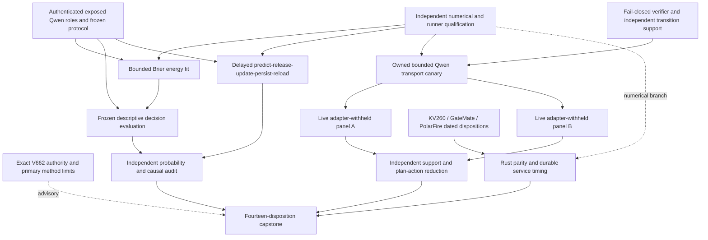

# Carnot Research Roadmap V662: Useful Probabilities and Supported Live Verification

**Created:** 2026-09-23
**Milestone:** 2026.09.662
**Title:** Proper-loss decision learning and support-aware live world-model verification
**Status:** Planned, not activated. No V662 experiment has run.
**Supersedes:** Completed milestone 2026.09.661. Its design is preserved
byte for byte in `research-roadmap-v661-preserved-20260923.md`.

## What V661 Proved and Left Unmeasured

V661 has thirteen terminal conductor dispositions, twelve producer artifacts
and one pre-gate artifact. The completed ledger ends at V660 during planning;
the active roadmap, terminal artifacts and conductor log establish V661 state.
A conductor `OK` is execution status, not a positive scientific finding.
The following findings were checked with `scripts/summarize_artifact.py`,
including acceptance gates, flags, substrate and duration, before metrics.

| Evidence | Qualified finding | Consequence |
|---|---|---|
| Exp7560 | Thirteen-row contract and method ingestion completed. | Reuse matching-authority selection; no new global science gate. |
| Exp7561 | Numerical, fixture lifecycle and compute checks passed. Terminal strict row lint rejected the positive claim: its `brier_delta` rows showed zero wins and three losses under the reader's convention. | Independently recompute losses and correct the producer's claim/metric contract before empirical use. Do not weaken the reader or assume a sign bug without checking. |
| Exp7562 | Live plan-lineage fixtures qualified with `circular_positive`. | Reuse the observation mechanism; fixtures do not prove live plan utility. |
| Exp7563–7565 | Native Qwen transport and both full captures completed. | Reuse their authenticated bytes instead of buying the same data again. |
| Exp7566–7567 | Source-contrast training completed, but probability and decision benefit gates failed. On 80 exposed evaluation groups, candidate Brier was 0.25463 versus raw original 0.14564; action cost was 0.2075 versus raw 0.1725. | Change the objective and capacity; keep raw forecasts as the primary control. These are descriptive comparisons, not fresh population estimates. |
| Exp7567 exposure audit | All 2,487 candidate official-training source groups were previously exposed; fresh eligible count was zero. | Fresh capture bytes cannot reset source exposure. V662 source work stays exploratory. |
| Exp7568–7569 | Learning never started after `recalibration_ready_score=0`. The audit qualified the source null but could not qualify learning. | Fix the numeric producer and keep learning independent of static benefit. No measured learning null exists here. |
| Exp7570 | Flagged and disqualified before inference. The artifact reported unavailable upstream custody; validation logs show absent parents for pytest basetemp paths. | Test explicit absolute-root custody and directory lifecycle before another live panel. Preserve the old flag. |
| Exp7571–7572 | Board continuity was retained; portable calibration remained blocked; capstone retained all thirteen dispositions. | Keep continuity unconditional and test whole-service cost only after numerical qualification. |

The local, currently uncommitted B2 positive-control note dated 2026-09-23
reports additional live-verifier defects: raised rows disappear from graded
metric denominators, mutable engine state can affect scoring, and a one-row
split overlaps its prompt. It also documents hidden-state/HUD limitations.
These are **leads requiring independent reproduction**, not new accepted
Carnot results. Source-derived engines and game-specific masks in that note
must never enter V662 live panels or earn solve credit.

## Three Biggest Gaps Against the PRD

1. **FR-12: useful, calibrated verification decisions.** An energy head can
   fit labels and still lose to the original model forecast. Test a bounded
   proper-loss map and expose both probability quality and action cost.
   Calibration is not a formal guarantee of semantic correctness.
2. **FR-11: measured continuous self-learning.** Durable counters and
   numerical updates exist, but delayed learning has no qualified retained
   advantage. Exercise prediction, legal feedback, update, persistence and
   restart with informative and chronology-preserving corrupted controls.
3. **FR-05/08, NFR-01 and the live-agent objective: deployable value.** Live
   world-model scores need independent observable support and executed-plan
   evidence. Portable speed needs equal durability and a complete service
   denominator. Neither a fixture pass nor a fast isolated kernel closes this gap.

## Research Basis and Deliberate Scope

The dated V662 section in `research-references.md` was written **before** this
experiment design. It covers all eight requested arXiv topics and six
secondary channels. Semantic Scholar citation-list requests failed for both
seed papers; two OpenReview forums returned browser challenges. The review
records these limits rather than asserting an exhaustive literature census.

| Source | Experimental consequence |
|---|---|
| [Calibeating Made Simple](https://arxiv.org/html/2603.22167v1), [Proper Calibeating](https://arxiv.org/abs/2605.26703) | Direct proper-loss fitting, unchanged-forecast control and separately measured delayed-feedback retention in Exp7574–7579. Published guarantees do not automatically cover this delayed protocol. |
| [KAN calibration](https://arxiv.org/abs/2503.01195), [local online KAN learning](https://arxiv.org/abs/2602.02056), [ER-KANs](https://arxiv.org/abs/2608.14773v2) | Small local basis, noise-sensitivity diagnostic and measured complete update service in Exp7576/7578/7585. No claimed replication of ER-KAN's analytic-function results. |
| [Beyond Document Grounding](https://arxiv.org/abs/2607.00895) | Retain tool/source labels and component grouping, with explicit prior-exposure limits in Exp7575–7579. |
| [Draft-conditioned constrained decoding](https://arxiv.org/abs/2603.03305v2), [ETS](https://arxiv.org/abs/2601.21484) | Separate executable syntax, supported verification and useful execution in Exp7580–7584. Defer additional generative passes until a useful endpoint is measured. |
| [FPGA–ASIC co-design](https://arxiv.org/abs/2602.15985), [Extropic Z1T](https://extropic.ai/writing/z1t) | Exp7585 includes transfer, persistence and orchestration. External efficiency estimates do not establish local acceleration. |

EBT, ARM–EBM, neural constraint projection and Ising equilibrium propagation
remain architecture references. This binary policy uses exact normalization;
no sampler sweep is needed. The retired external-text reasoning ranker,
unchanged importance anchor, four-expert mixture, HUD-mask-only ARC retry,
per-game re-solving and generic budget increases stay closed. The learned
policy consumes a verifier forecast; it is not an unrestricted text/logprob
reranker against self-consistency. No generator weights, scored submission,
operator-curated headlines, purchases or external publications change.

## Architecture



The contract, both independent audits, hardware continuity and capstone run
unconditionally. Panels A and B share readiness prerequisites but neither
requires the other's outcome. Online learning has no static-benefit gate.
No off-ARC learned policy is inserted into the ARC agent.

## Exact Task Contract

**Exactly 14 tasks, exp7573 through exp7586, in this order.**
The following table and `research-roadmap-next.yaml` agree on full IDs,
titles, phases, paths, substrate classes and conjunctive gates. This table
is the complete execution contract, not an aspirational task list.

| Order | Task ID | Exact title | Phase | Deliverable | Substrate class | Structured gate |
|---|---|---|---|---|---|---|
| 1 | exp7573-contract-methods | Bind fourteen tasks and ingest methods against terminal V661 evidence | 1 | results/experiment_7573_v662_contract_methods.json | aggregation | none |
| 2 | exp7574-measurement-requalification | Requalify numerical and ARC runners from reproduced validation failures | 1 | results/experiment_7574_v662_measurement_requalification.json | no_model_load | none |
| 3 | exp7575-cached-learning-protocol | Seal descriptive source roles and delayed-feedback decision tests | 1 | results/experiment_7575_v662_cached_learning_protocol.json | no_model_load | none |
| 4 | exp7576-proper-loss-energy | Train an identity-constrained proper-loss energy decision policy | 2 | results/experiment_7576_v662_proper_loss_energy.json | no_model_load | exp7574-measurement-requalification.recalibration_ready_score == 1; exp7574-measurement-requalification.verdict_class in ["null", "positive", "circular_positive"]; exp7574-measurement-requalification.flagged_adversarial == false; exp7575-cached-learning-protocol.cached_roles_ready_score == 1; exp7575-cached-learning-protocol.verdict_class in ["null", "positive"]; exp7575-cached-learning-protocol.flagged_adversarial == false |
| 5 | exp7577-proper-loss-evaluation | Measure frozen probability and decision value without freshness claims | 2 | results/experiment_7577_v662_proper_loss_evaluation.json | no_model_load | exp7576-proper-loss-energy.proper_loss_fit_ready_score == 1; exp7576-proper-loss-energy.baseline_ready_score == 1; exp7576-proper-loss-energy.verdict_class in ["null", "positive"]; exp7576-proper-loss-energy.flagged_adversarial == false; exp7575-cached-learning-protocol.cached_roles_ready_score == 1; exp7575-cached-learning-protocol.verdict_class in ["null", "positive"]; exp7575-cached-learning-protocol.flagged_adversarial == false |
| 6 | exp7578-continuous-proper-loss | Measure delayed proper-loss learning and durable retained decisions | 2 | results/experiment_7578_v662_continuous_proper_loss.json | no_model_load | exp7574-measurement-requalification.recalibration_ready_score == 1; exp7574-measurement-requalification.learning_compute_feasible_score == 1; exp7574-measurement-requalification.verdict_class in ["null", "positive", "circular_positive"]; exp7574-measurement-requalification.flagged_adversarial == false; exp7575-cached-learning-protocol.cached_roles_ready_score == 1; exp7575-cached-learning-protocol.online_protocol_ready_score == 1; exp7575-cached-learning-protocol.verdict_class in ["null", "positive"]; exp7575-cached-learning-protocol.flagged_adversarial == false |
| 7 | exp7579-decision-learning-audit | Independently reduce probability and feedback-learning evidence | 2 | results/experiment_7579_v662_decision_learning_audit.json | aggregation | none |
| 8 | exp7580-arc-verifier-support | Qualify fail-closed world-model scores and independent transition support | 3 | results/experiment_7580_v662_arc_verifier_support.json | no_model_load | none |
| 9 | exp7581-arc-bounded-canary | Qualify owned Qwen transport and live-panel budget with a bounded canary | 3 | results/experiment_7581_v662_arc_bounded_canary.json | model_bounded_generation | exp7574-measurement-requalification.arc_runner_ready_score == 1; exp7574-measurement-requalification.verdict_class in ["null", "positive", "circular_positive"]; exp7574-measurement-requalification.flagged_adversarial == false; exp7580-arc-verifier-support.verifier_support_ready_score == 1; exp7580-arc-verifier-support.verdict_class in ["null", "positive", "circular_positive"]; exp7580-arc-verifier-support.flagged_adversarial == false |
| 10 | exp7582-arc-panel-a | Measure adapter-withheld live verifier integrity on panel A | 3 | results/experiment_7582_v662_arc_panel_a.json | model_full_generation | exp7581-arc-bounded-canary.arc_transport_ready_score == 1; exp7581-arc-bounded-canary.panel_a_feasible_score == 1; exp7581-arc-bounded-canary.verdict_class in ["null", "positive"]; exp7581-arc-bounded-canary.flagged_adversarial == false; exp7580-arc-verifier-support.verifier_support_ready_score == 1; exp7580-arc-verifier-support.verdict_class in ["null", "positive", "circular_positive"]; exp7580-arc-verifier-support.flagged_adversarial == false |
| 11 | exp7583-arc-panel-b | Measure adapter-withheld live verifier integrity on panel B | 3 | results/experiment_7583_v662_arc_panel_b.json | model_full_generation | exp7581-arc-bounded-canary.arc_transport_ready_score == 1; exp7581-arc-bounded-canary.panel_b_feasible_score == 1; exp7581-arc-bounded-canary.verdict_class in ["null", "positive"]; exp7581-arc-bounded-canary.flagged_adversarial == false; exp7580-arc-verifier-support.verifier_support_ready_score == 1; exp7580-arc-verifier-support.verdict_class in ["null", "positive", "circular_positive"]; exp7580-arc-verifier-support.flagged_adversarial == false |
| 12 | exp7584-arc-independent-audit | Reduce live support, plan execution and supervisor evidence independently | 3 | results/experiment_7584_v662_arc_independent_audit.json | aggregation | none |
| 13 | exp7585-portable-service | Measure Rust recalibration service and preserve all board dispositions | 4 | results/experiment_7585_v662_portable_service.json | no_model_load | none |
| 14 | exp7586-capstone | Reconcile fourteen outcomes and decide each mechanism continuation | 4 | results/experiment_7586_v662_capstone.json | aggregation | none |

## Phase 1 — Qualify Measurement and Freeze the Evidence Boundary

**Exp7573 — Contract and methods.** Reuse the matching active/staged authority
resolver. Verify fourteen exact rows and private order/path/gate mutations.
Preserve V661's thirteen dispositions and archive lag. Ingest three to five
primary method sections into `docs/research-notes/v662-method-map.md`.
This task reports readiness; it cannot block unrelated science.

**Exp7574 — Independent numerical and ARC runner qualification.** Recompute
V661 fixture losses before diagnosing the row-lint failure. Correct only the
new producer's metric/claim contract, leaving guards and old evidence intact.
Qualify the existing constrained solver and its independent reference,
delayed-update lifecycle and full 5,000-replay/800,000-event budget. Separately
exercise ARC upstream custody from an alternate working directory and create
private test-directory parents. Test truthful pre-inference blocked artifacts.
Numerical readiness and ARC runner readiness have distinct fields.

**Exp7575 — Frozen descriptive protocol.** Authenticate V661 raw bytes and
role separation: 160 fitting, 40 tuning, 40 policy, 160 online and 80 evaluation
source components. Keep the exact dataset revision and source-group joins.
Persist prior exposure; `fresh_confirmatory_claim_allowed=false` throughout.
Freeze all controls, costs, seeds, retention reads and uncertainty before new
outcomes. Runtime label isolation is required even though historical exposure
precludes a new confirmatory claim.

Phase boundary: qualified inputs and numerical behavior, with no efficacy claim.

## Phase 2 — Proper-Loss Decisions and Continuous Learning

**Exp7576 — Bounded energy fit.** The hypothesis is that an identity-initialized
low-capacity map can preserve useful original forecasts better than V661's
source-contrast log-loss head. Fit nine linear knots at `u_j=j/8`:

```text
min_theta sum_i (f_theta(p_i) - y_i)^2 + 8 ||theta-u||^2
subject to 0 <= theta_0 <= ... <= theta_8 <= 1
           |theta_j-u_j| <= 0.10
q = f_theta(p_original)
E(error) = -log(q); E(correct) = -log(1-q)
```

Only logarithm evaluation clips at 1e-6. The qualified solver tolerance is
1e-8. Controls are raw original probabilities, fitted temperature and a
same-capacity unconstrained nine-knot Brier map. Fit only on fitting rows;
choose the strongest comparator only on tuning rows. Freeze all heads before
evaluation. Input noise levels 0, 0.01 and 0.05 are sensitivity diagnostics,
not new labeled observations. Generator weights remain frozen.

**Exp7577 — Frozen evaluation.** Evaluate all heads on the same 80 groups.
Report per-group Brier, log loss, probability, action, cost and coverage.
The typed policy uses error probability `q`: accept costs `5q`, reject costs
`1-q`, escalate costs `0.2`; escalate wins ties. Require non-escalation >=0.10.
Apply paired source-component uncertainty and Holm adjustment to primary
static contrasts. A directional gate requires improvement lower95 >0 versus
raw and the strongest tune-selected control. Cost benefit is a separate gate.
A positive control must demonstrate that the evaluator can detect a useful
forecast. Every empirical conclusion remains descriptive reuse.

**Exp7578 — Continuous self-learning.** Use the same qualified map, initialized
to identity independently for five fixed orders, seeds 7578001–7578005. Predict
before feedback; release blocks of eight after eight events; update sufficient
statistics, solve, persist and acknowledge once. Compare raw, global counts,
local counts and released-block shuffled feedback. Retention uses the 80-group
evaluator-only role at events 40, 80, 120 and 160; restart at 80 and 120.
Require retained Brier degradation upper95 <=0.005. Run 1,000 full causal
resamples per order, including retraining; never resample only adapted losses.
This is empirical replay with delayed feedback, not a newly acquired live
stream. CPU sufficient statistics provide the immediate hardware path;
Exp7585 tests Rust and quantifies the case for any later FPGA acceleration.

**Exp7579 — Independent audit.** Reconstruct predictions from raw features,
parameters and event logs. Challenge signs, identities, hashes, duplicate
updates and future-label leakage. Emit separate static, causal, retention and
freshness conclusions. A blocked branch does not erase a valid null elsewhere.

Phase boundary: reproducible probability and causal evidence; no automatic
production promotion and no claim that a learned energy equals truth.

## Phase 3 — Supported Verification on the Live ARC Path

**Exp7580 — Fail-closed support.** Reproduce the B2 note's exception, mutable
engine and overlapping-split issues on independent fixtures. Add an opt-in
research wrapper reachable through `E3AgentPolicy`: raised rows remain in all
denominators; use fresh isolated engine state; verify repeated-input purity;
require at least two distinct held-out IDs disjoint from all prompts/refactors.
Contradictory or unsupported transitions cannot pass. Keep the existing exact
1.0 acceptance threshold and production flags. Do not introduce hand-derived
HUD masks, source models or a new game-specific adapter. Test positive and
adversarial fixtures at the actual live call site plus disabled-feature parity.

**Exp7581 — Bounded canary.** Resolve `unsloth/Qwen3.8-27B-GGUF` with
`cached_current_model()`. Acquire a fresh exclusive GPU lease. Make exactly
two neutral 64-token requests and authenticate captured bytes and settings.
This is `model_bounded_generation`, not a test of induction quality. Validate
the future 4096-token proposer/capture ceilings without running the panel.
Forecast each complete panel using historical p95 request timing and current
load/capture costs; require <=3,000 seconds collection and <=4,200 seconds
including a 900-second validation reserve. No post-outcome roster shrinkage.

**Exp7582/7583 — Separate live panels.** Panel A is `su15, sp80, ft09`;
panel B is `sb26, g50t, dc22`. Each has both seeds 7582001/7582002 and two
arms: current verifier versus the integrity guard. This gives twelve episodes
and at most twelve full requests per task. Use 600 actions and one induction
per episode, 4096 completion tokens and a 240-second request timeout. Record
effective no-think, trust, HUD and CEGIS settings; both arms share them.
Withhold adapters and stored solutions, registry-precheck, and capture live
attempt/model/plan/action lineage with a 32-action observation window.

These are bounded full generative experiments. Record every cap hit and
finish reason; truncation cannot establish unconstrained model inability.
Six game clusters and at most 24 attempts across both panels support a pilot,
not the B2 gate-quality claim requiring 100 attempts and 1,000 opportunities.
No source-derived control is credited as a live solve, and known registry
levels are not credited again. Submission defaults stay unchanged.

**Exp7584 — Independent live reduction.** Recompute support denominators and
plan execution from raw evidence. Distinguish motion from useful execution,
unknown/censored from failure, and unsupported transitions from bad induction.
Use paired episode rows and disclose game-level clustering. Read actual
supervisor redirects; no firings means no supported refinement. Do not fit or
ship a timing gate from an under-supported panel.

Phase boundary: qualified live observation and guarded research behavior;
benefit, official-score improvement and supervisor refinement remain separate.
