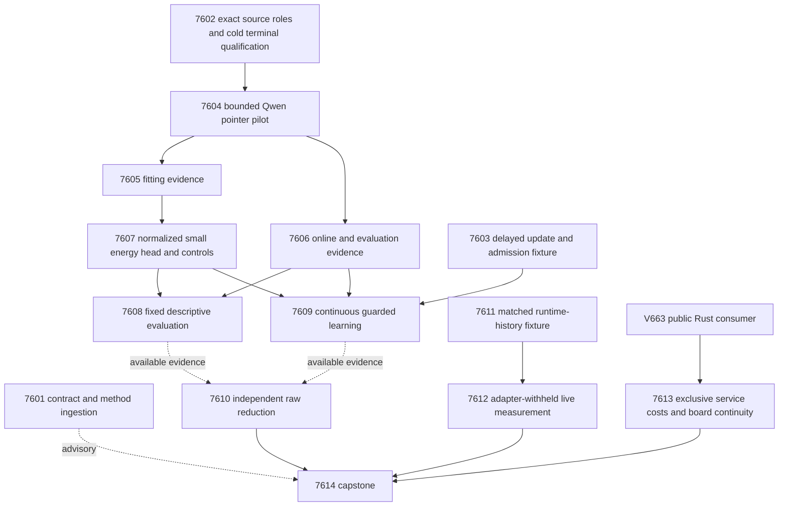

# Carnot Research Roadmap V664: Qualified Evidence and Retained Learning

**Created:** 2026-09-24
**Milestone:** 2026.09.664
**Title:** Qualified evidence decisions, guarded continuous learning, and measured state support
**Status:** Planned; not activated. No V664 experiment has run.
**Supersedes:** Completed milestone 2026.09.663. Its design is preserved byte
for byte in `research-roadmap-v663-preserved-20260924.md`.
**Execution authority:** `research-roadmap-next.yaml` while staged; the
matching `research-roadmap.yaml` after normal conductor activation.

## What V663 Proved

Fourteen tasks reached terminal dispositions. Eight producer artifacts and
one conductor pre-gate artifact exist; five planned producer artifacts are
absent. The completed ledger still ends at V662 at planning time. The V663
capstone and conductor log establish its terminal state. Completion is not
scientific success.

| Evidence | Qualified finding | Consequence |
|---|---|---|
| Exp7587 | The fourteen-task contract and method review were valid. | Reuse contract readers; do not make reporting a science prerequisite. |
| Exp7588 | The saved protocol artifact stopped at `source_group_incomplete`. | Requalify the actual input-to-terminal-artifact boundary before GPU work. |
| Exp7590–7595 | The pilot was pre-gated; fitting/evaluation captures, head, static test and online test have no producer artifacts. | Evidence alignment and guarded updates remain unmeasured, not disproved. Never infer null science from absent experiments. |
| Exp7589 | Private output handling and causal history telemetry passed. | Reuse the valid runtime observer and `/tmp` test paths. |
| Exp7597 | Six games and twelve episodes gave history-zero conflict 14/292; histories 1/2/4 gave 0/214, 0/206, 0/206 on smaller supports. No game passed the matched support floor. | Measure the same current-state/action keys under different histories. Zero conflicts on shrinking support does not prove a Markov state. |
| Exp7598 | Opt-in consumer and restart parity passed on 120 paired blocks. Warm comparator/Rust ratios were 5.66 and 7.21; cold single-request ratio was 0.739. The registered aggregate speed gate failed. | Preserve the aggregate null and report strata. Measure missing exclusive costs before another acceleration claim. |
| Exp7599 | Three dated board scopes were preserved. Separate IPC and persistence costs were absent, so placement was unmeasured. | Add current host-service spans; no physical bring-up retry or acquisition. |
| Exp7596/7600 | Correctly preserved blocked science and valid null branches. | Retain independent auditing and every planned task in reconciliation. |

Planning-only inspection found a concrete change in executable readiness:
`collect_preconditions()` now has no failed checks, and the committed
`select_roles()` restores all 480 source groups and selects the original
240 scored groups plus eight pilots. This did not execute or replace Exp7588.
The historical process state is not established by that check. Exp7602 must
bind current code, data and terminal cold-replay receipts before readiness
can open. It may not invent a historical cause or change the selected corpus.

The separate operator-run Exp10010 think-ON pilot and merged vLLM
answer-channel fix remain outside this milestone's claims. Kaggle confirmation
is still operator-owned. This plan neither reruns capped induction nor changes
the live world-model acceptance threshold.

## Three Biggest Gaps Against the PRD

1. **FR-12 — semantic verification still lacks demonstrated useful evidence.**
   Scalar-only calibration failed; the new sentence-linked information never
   reached measurement. Test lossless evidence features against raw forecasts,
   matched simple controls and evidence removal. Exact pointer validity is
   distinct from predicted semantic support.
2. **FR-11 — continuous learning still lacks retained causal benefit.**
   Correct update chronology alone did not prevent regression. Separate update
   labels, one-use admission labels, old-data anchors and final evaluator labels.
   Compare future predictions with frozen and legal corrupted-feedback controls.
3. **FR-05/08, NFR-01 and operational reasoning — boundary costs and state support
   remain unresolved.** A working native consumer does not satisfy a broad
   speed claim; a history interface with no matched support cannot justify
   accepting a world model. Measure these boundaries independently.

## Research Basis

The V664 section in `research-references.md` was written before this design.
It records searches across all eight requested topics and all six secondary
channels, with access failures disclosed. The completed archive, proposal
history, retirement manifest and current terminal artifacts were consulted.
Older simulation claims and obsolete inventory entries are not current facts.

| Source | Application | Limit |
|---|---|---|
| [EAEV, September 2026](https://arxiv.org/html/2609.08267v1) | Exp7602/7604–7610 test complete-text evidence alignment and counterfactual controls. | Adaptation, not replication; semantic links are predictions. |
| [Proper Calibeating](https://arxiv.org/abs/2605.26703), [U-Calibration](https://arxiv.org/abs/2606.18527), [trust-region continual learning](https://arxiv.org/abs/2602.02417) | Exp7603/7609 separate proper loss, admission and retained decisions. | No imported regret or retention guarantee for this finite delayed stream. |
| [Online KAN locality](https://arxiv.org/html/2602.02056v4) | Bounded local updates have a CPU, Rust and fixed-point path; Exp7613 measures the full service boundary. | No new KAN architecture or unmeasured hardware speed claim. |
| [AS2](https://arxiv.org/abs/2603.18436), [neural certification position](https://arxiv.org/abs/2608.14569), [CRANE](https://proceedings.mlr.press/v267/banerjee25a.html) | Preserve exact validation, semantic uncertainty and bounded-generation censoring as separate outcomes. | Syntactic validity and constraint satisfaction do not certify arbitrary text truth. |
| [FPGA–ASIC co-design](https://arxiv.org/abs/2602.15985), [Extropic Z1T](https://extropic.ai/writing/z1t) | Exp7613 includes transfer, startup, durable storage and acknowledgement. | Vendor estimates and external devices are not local measurements. |
| [September 22 spintronic Ising hardware](https://www.nature.com/articles/s41928-026-01700-6) | New hardware lead for the method map and placement note. | Public data/plotting code excludes the machine implementation; no Carnot access established. |

[EBT](https://arxiv.org/abs/2507.02092) and
[ARM–EBM](https://arxiv.org/abs/2512.15605) motivate conditional compatibility
energies. Binary normalization is exact and needs no sampler. The
[learning-to-sample hardness result](https://arxiv.org/abs/2605.24752) is a
reason not to infer sampling quality from energy fitting. OpenReview's
VFScale is a discovery lead with direct access challenged; Semantic Scholar's
citation lists were inaccessible. No citation census or full-text replication
is claimed. Kona remains architectural context, not an available open recipe.

## Architecture



The solid arrows into measurements are readiness gates, not benefit gates.
The two captures are independent. Static success is not a prerequisite for
online learning. Contract ingestion, the update fixture, independent audit,
ARC fixture, service attribution and capstone do not depend on GPU capture.
Every structured gate checks the exact upstream readiness field, permitted
closed verdict classes and `flagged_adversarial=false`. Fixture
`circular_positive` is accepted only for explicitly named conformance gates.

## Exact Task Contract

**Exactly 14 tasks, exp7601 through exp7614, in this order.**
The following table is generated from the same task data as the YAML. Full
IDs, titles, phases, deliverables, substrate classes and conjunctive gates
are an execution contract, not an aspirational list.

| Order | Task ID | Exact title | Phase | Deliverable | Substrate class | Structured gate |
|---|---|---|---|---|---|---|
| 1 | exp7601-contract-methods | Bind fourteen tasks and ingest qualified evidence methods | 1 | results/experiment_7601_v664_contract_methods.json | aggregation | none |
| 2 | exp7602-evidence-requalification | Requalify complete source roles through terminal cold replay | 1 | results/experiment_7602_v664_evidence_requalification.json | no_model_load | none |
| 3 | exp7603-guarded-update-fixture | Qualify delayed evidence updates and one-use admission checks | 1 | results/experiment_7603_v664_guarded_update_fixture.json | no_model_load | none |
| 4 | exp7604-evidence-pilot | Qualify bounded Qwen evidence pointers and capture feasibility | 2 | results/experiment_7604_v664_evidence_pilot.json | model_bounded_generation | exp7602-evidence-requalification.evidence_protocol_ready_score == 1; exp7602-evidence-requalification.verdict_class in ["null", "positive"]; exp7602-evidence-requalification.flagged_adversarial == false |
| 5 | exp7605-fit-evidence | Capture bounded source links for fitting and policy controls | 2 | results/experiment_7605_v664_fit_evidence.json | model_bounded_generation | exp7604-evidence-pilot.evidence_transport_ready_score == 1; exp7604-evidence-pilot.fit_capture_feasible_score == 1; exp7604-evidence-pilot.verdict_class in ["null", "positive"]; exp7604-evidence-pilot.flagged_adversarial == false; exp7602-evidence-requalification.evidence_protocol_ready_score == 1; exp7602-evidence-requalification.verdict_class in ["null", "positive"]; exp7602-evidence-requalification.flagged_adversarial == false |
| 6 | exp7606-test-online-evidence | Capture sealed source links for evaluation and delayed learning | 2 | results/experiment_7606_v664_test_online_evidence.json | model_bounded_generation | exp7604-evidence-pilot.evidence_transport_ready_score == 1; exp7604-evidence-pilot.eval_capture_feasible_score == 1; exp7604-evidence-pilot.verdict_class in ["null", "positive"]; exp7604-evidence-pilot.flagged_adversarial == false; exp7602-evidence-requalification.evidence_protocol_ready_score == 1; exp7602-evidence-requalification.verdict_class in ["null", "positive"]; exp7602-evidence-requalification.flagged_adversarial == false |
| 7 | exp7607-evidence-energy | Train bounded evidence energies and freeze matched decision controls | 2 | results/experiment_7607_v664_evidence_energy.json | no_model_load | exp7605-fit-evidence.fit_evidence_ready_score == 1; exp7605-fit-evidence.verdict_class in ["null", "positive"]; exp7605-fit-evidence.flagged_adversarial == false |
| 8 | exp7608-decision-evaluation | Measure incremental evidence value on the fixed evaluation groups | 2 | results/experiment_7608_v664_decision_evaluation.json | no_model_load | exp7607-evidence-energy.evidence_head_ready_score == 1; exp7607-evidence-energy.baseline_ready_score == 1; exp7607-evidence-energy.verdict_class in ["null", "positive"]; exp7607-evidence-energy.flagged_adversarial == false; exp7606-test-online-evidence.test_online_evidence_ready_score == 1; exp7606-test-online-evidence.verdict_class in ["null", "positive"]; exp7606-test-online-evidence.flagged_adversarial == false |
| 9 | exp7609-guarded-learning | Measure delayed evidence learning and independent retained decisions | 3 | results/experiment_7609_v664_guarded_learning.json | no_model_load | exp7603-guarded-update-fixture.guarded_update_ready_score == 1; exp7603-guarded-update-fixture.verdict_class in ["null", "circular_positive"]; exp7603-guarded-update-fixture.flagged_adversarial == false; exp7607-evidence-energy.evidence_head_ready_score == 1; exp7607-evidence-energy.baseline_ready_score == 1; exp7607-evidence-energy.verdict_class in ["null", "positive"]; exp7607-evidence-energy.flagged_adversarial == false; exp7606-test-online-evidence.test_online_evidence_ready_score == 1; exp7606-test-online-evidence.verdict_class in ["null", "positive"]; exp7606-test-online-evidence.flagged_adversarial == false |
| 10 | exp7610-evidence-audit | Independently reduce evidence decisions and delayed learning | 3 | results/experiment_7610_v664_evidence_audit.json | aggregation | none |
| 11 | exp7611-arc-matched-support | Qualify matched-history replay from the live agents own attempts | 3 | results/experiment_7611_v664_arc_matched_support.json | no_model_load | none |
| 12 | exp7612-arc-history-measurement | Measure cross-game state aliasing with matched runtime histories | 3 | results/experiment_7612_v664_arc_history_measurement.json | no_model_load | exp7611-arc-matched-support.matched_support_ready_score == 1; exp7611-arc-matched-support.verdict_class in ["null", "circular_positive"]; exp7611-arc-matched-support.flagged_adversarial == false |
| 13 | exp7613-service-attribution | Measure exclusive consumer costs and preserve board prerequisites | 4 | results/experiment_7613_v664_service_attribution.json | no_model_load | none |
| 14 | exp7614-capstone | Reconcile fourteen outcomes and decide evidence and learning continuation | 4 | results/experiment_7614_v664_capstone.json | aggregation | none |

## Phase 1 — Qualify Inputs and the Learning Lifecycle (Exp7601–7603)

**Exp7601** binds the contract and primary method map. It records every V663
terminal disposition, runs activation guards and tests mutations of the two
authorities. It does not edit the conductor, activate a roadmap or gate science.

**Exp7602** exercises current source restoration through actual sidecar
publication and terminal cold replay. It retains the V663 salt and the exact
role counts: fit80, tune20, policy20, online80, evaluation40 and pilot8.
Model-facing records exclude both labels and baseline forecasts. Complete
source/response bytes survive segmentation. Invalid pointers and unlinked
sentences are explicit unknowns. The input parser must reject ambiguous
prompt delimiters and broken source identities rather than silently repairing
or replacing groups. Every group remains historically exposed.

Within fit80, hash-selected 64 groups train the head and 16 form an old-data
anchor. Tune20 selects hyperparameters; policy20 selects the strongest simple
comparator before evaluation. Evaluation40 is evaluator-only. Online80 uses
ten consecutive eight-event blocks: four update events and four admission
events per block, with labels released after lag eight.

**Exp7603** implements only the small guarded-update lifecycle, independently
of model capture. A proposal takes one Brier-gradient step; admission requires
lower Brier and no cost increase on that block's four admission labels, and
anchor Brier increase no greater than 0.002. Admission labels are used once;
anchors may be reused. Final evaluator labels never influence admission.
Durability, duplicate rejection and restart parity must pass both accepting
and rejecting controls. These fixtures cannot establish learning value.

## Phase 2 — Measure Evidence and Decisions (Exp7604–7608)

**Exp7604** runs eight pilot extractions with the mandated local
`unsloth/Qwen3.8-27B-GGUF`, Q4_K_M, through its embedded tokenizer and chat
template. Each request has a fixed 512-token output budget and a task-local
non-thinking extraction template. This is bounded generation, not a full
reasoning run. Freeze settings before the first request; do not increase the
budget or replace failed cases. Require six usable schemas out of eight and
zero accepted invalid pointers for transport readiness. Pilot quality is not
semantic correctness. Project each full capture conservatively against a
3,000-second execution budget before opening its gate.

**Exp7605/7606** independently capture fit/tune/policy120 and online/evaluation120.
Each group gets one bounded extraction. Checkpoint completed requests and resume
only missing ones under identical hashes. A complete roster can include unknown,
invalid or capped extraction; those cases later use the raw forecast and remain
in the denominator. A full capture cannot declare absent-input blockage merely
because extraction quality is poor. Model and evaluator processes have separate
inputs; labels do not appear in transport prompts.

**Exp7607** fits an eight-input/eight-hidden-unit energy residual:

```text
z = logit(clip(p_raw, 1e-6, 1-1e-6)) + 2*tanh(r_theta(features))
E(0) = 0; E(1) = -z; p(unsupported) = sigmoid(z)
```

The residual begins at zero. Four configurations use 200 full-batch Brier-loss
steps: learning rate in {0.01, 0.03}, L2 in {0, 0.001}, one fixed seed. Keep
raw forecasts, temperature scaling, fit prevalence and an eight-feature
logistic residual as controls; add same-capacity evidence-erasure and
fit-label-shuffle controls. Use the same fitting/tuning budget and freeze the
strongest ordinary comparator on policy20. A binary EBM's equivalence to a
logistic probability is disclosed; parameterization alone is not a contribution.

The eight frozen evidence features are supported-sentence fraction,
contradicted fraction, unknown fraction, valid-link fraction, exact named-entity
overlap, numeric agreement, negation mismatch and extraction censoring. Lexical
agreement is a feature, not a semantic proof. Role-local derangement and evidence
erasure challenge whether the head uses source-linked information.

**Exp7608** scores all evaluation40 groups with frozen parameters. Primary
information benefit needs at least 0.005 Brier improvement over both raw and
the preselected strongest comparator, simultaneous paired 95% intervals
excluding zero, and degradation under both evidence removal controls. Use
2,000 source-group bootstrap resamples; report wide intervals and insufficient
power honestly. These are descriptive reused-data estimates, never confirmatory
fresh-corpus claims.

Typed decisions minimize expected cost: accept=5p, reject=1-p, escalate=0.2.
Decision benefit is a separate gate: lower realized cost with interval
excluding zero, non-escalation coverage at least 0.10, and no extra false accepts
versus raw. No post-evaluation threshold or subgroup selection is allowed.
Static readiness remains open after a valid null so continuous learning can run.

## Phase 3 — Test Retained Learning and State Support (Exp7609–7612)

**Exp7609** runs frozen, unguarded-real-feedback, guarded-real-feedback and
guarded-deranged-feedback arms on online80. Five fixed orders measure order
sensitivity; they do not create 400 independent groups. Every prediction
precedes release. One update proposal per fully released eight-event block
uses only its four update labels; the other four test admission. Derangement
permutes only within the fully released block. Flush tail feedback through
virtual event88 without inventing new predictions. Restart at events32 and64
and verify exact prediction/event-ledger parity.

Learning benefit requires Brier improvement at least 0.005 versus frozen and
legal deranged feedback with simultaneous paired intervals excluding zero,
no cost/false-accept worsening and coverage at least 0.10. Average paired
order differences within source groups before cluster resampling. Final
retention on evaluator40 requires upper95 Brier increase at most 0.002,
no realized-cost increase and no extra false accepts. No admitted updates is
a valid null. Retention and benefit are separate; learning lifecycle success
cannot substitute for either.

**Exp7610** independently reconstructs source joins, features, predictions,
losses, intervals, event chronology and retained states from raw evidence.
It runs without pre-gates and preserves missing branches. Private sign,
control-identity, label-leak and denominator mutations must fail. It closes
only fully measured failed constructions, never unmeasured hypotheses.

**Exp7611** builds a generic matched-prefix replay fixture using only the live
agent's own observations and action labels. Two different past histories must
reach the same raw frame, level and legal action. Fresh environment instances
replay each prefix twice. Stable within-prefix outcomes and different
cross-history outcomes provide an aliasing witness; identical repeated prefixes
are merely a positive control. No source inspection, hand adapter, ground-truth
BFS, per-game mask or new solver is permitted.

**Exp7612** collects twelve new adapter-withheld, LLM-off E3 episodes on the
frozen six-game roster. Prefixes come only from those attempts. It selects at
most twenty matched keys per game by hash before next-frame outcomes, with
prefixes capped at 128 actions. It reports natural trajectory support and
replay intervention support separately. Replays are not new independent units.
A cross-game rate requires twenty stable keys in each of three games; otherwise
the honest outcome is insufficient support. An isolated witness is an existence
result, never a prevalence estimate or proof of a Markov state. Incidental
already-registered levels earn no new solve credit. World-model acceptance,
HUD masks, generator settings and the supervisor arm table remain unchanged.

## Phase 4 — Deployment Costs and Reconciliation (Exp7613–7614)

**Exp7613** adds opt-in, exclusive spans to the shipped client and worker:
startup, encoding, arithmetic, journal write, fsync, acknowledgement and reload.
Measure thirty paired blocks for each cold/warm and batch1/batch8 stratum,
using equal durability and the strongest in-process Python comparator.
Ten telemetry-off blocks per stratum estimate instrumentation overhead.
Do not subtract unsynchronized clocks or label the entire caller remainder
pure IPC. Exclusive spans reconcile to the end-to-end total within the
larger of one microsecond and one percent. No new speed gate is being relaxed
or substituted for Exp7598's failed aggregate.

Compute an explicit Amdahl upper bound from measured arithmetic fraction,
with uncertainty and the full durable-request denominator. This is a bound,
not an accelerator benchmark. The task also preserves all three attached-board
dispositions unconditionally, even if stage instrumentation fails. There are
no physical probes, flashes or purchases.

**Exp7614** reconciles exactly fourteen dispositions, including itself,
missing producers, pre-gate receipts and flags. It uses independently validated
science, not producer headlines. A missing required external input is terminal
`blocked`; `partial` is reserved for unfinished work the task owns. It records
fixed publication G1–G4 but neither submits nor publishes.

## Dependency Graph and Failure Containment

```text
7601 ----------------------------------------------> 7614 (report only)
7602 -> 7604 -> 7605 -> 7607 -> 7608 --available--> 7610 -> 7614
   |       +-> 7606 ------------^                     ^
   |              +----------> 7609 --available-------+
   +-> both captures             ^
7603 ----------------------------+ <- 7607
7611 -> 7612 ---------------------------------------> 7614
V663 shipped consumer -> 7613 -----------------------> 7614
```

All structured upstreams are tasks in this roadmap and precede their consumers.
The design table contains the exact conjunctions. Reporting, independent
fixtures, ARC and service attribution can finish if GPU availability blocks
capture. Capture readiness means an auditable outcome roster; predictive
quality has its own tests. New IDs do not erase prior failure lineage:
all similar scopes include complete four-field `prior_failures` entries.
Routine contract/capstone and board-continuity overrides cite only the standing
2026-05-29 authorization. Missing historical producers are recorded as such,
not given an invented scientific verdict.

## Hardware Requirements and Wall-Time Budgets

| Tasks | Current substrate | Memory and access | Estimated task wall time |
|---|---|---|---|
| 7601–7603 | CPU, source-custody checks and small local updates | Existing host RAM and authenticated sidecars; no LLM | 30, 40, 45 minutes |
| 7604 | One leased RTX 3090, Qwen3.8 Q4_K_M | About 16 GB model plus measured KV/runtime headroom; verify UUID/PID offload | 45 minutes, eight bounded calls |
| 7605–7606 | Same owned local GGUF/CUDA route | One model; no need for two-model DualGPURunner | 70 minutes each; capture capped at 3,000 seconds |
| 7607–7610 | CPU for small head, stream and independent reduction | Exact two-state normalization; no sampler or LLM | 50, 40, 55, 45 minutes |
| 7611–7612 | CPU, offline arcade through live policy entrypoint | Private `/tmp` environments and raw frame storage | 45, 60 minutes; measured episodes/replays capped at 1,800 seconds |
| 7613 | Host Rust/Python durable service | Owned subprocesses and local filesystem | 50 minutes |
| 7614 | CPU artifact reduction | Existing terminal artifacts | 35 minutes |

These estimates include authoring and validation, not only benchmark runtime.
No task requests more than the 4,800-second hard cap. Use scoped checks and
small reused modules. A pilot that predicts a capture cannot fit keeps its
feasibility gate closed rather than silently shrinking the registered corpus.

The wishlist's dual RTX 3090 host is the current inference route; current
availability must still be measured. No task assumes a free second GPU.
KV260 retains its graduated FPGA-fabric evidence; any future access is via
`ssh kria` and applicable compositions keep `k_max<=5`. PolarFire's graduated
scope is Linux CPU dispatch, not FPGA sampling. GateMate awaits a documented
cable/port/power change; repeating the same JTAG probe has no new angle.
XDNA needs a usable toolchain and benchmark; Extropic needs authenticated
hardware access; larger FPGA purchases need a measured placement case.
The new spintronic report and Z1T code do not satisfy those prerequisites.

FR-11's hardware path is bounded CPU updates now, equivalent Rust/local
fixed-point operations next, and FPGA deployment only if whole-service costs
justify it. The program's 100x acceleration target remains a target; no
extrapolated hardware figure is a measured result.

## Validation and Claim Boundaries

Every prompt requires a flushed line at each phase boundary and before/after
loads, generations, benchmarks and subprocesses. Long operations and loops
emit truthful progress at least every sixty seconds. Every silence gap stays
below 600 seconds. Files over about 200 lines are authored in several tool
calls of about 100–150 lines with a progress message between calls. No scratch
script belongs at repository root.

Each implementation requires its capability `REQ-*` and failing tests first.
Run scoped unit tests, changed-module coverage, Ruff, mypy and spec coverage;
then the actual entrypoint, fresh-process reduction and relevant E2E checks.
ARC uses applicable E2E-009–013 plus a real LLM-off private-output smoke.
Learning exercises predict/release/update/persist/reload and applicable
E2E-007 safeguards without claiming an unimplemented certificate. Service
work crosses the real durable client boundary; no PyO3 E2E claim without an
actual binding. Read-only reporting has no numbered runtime E2E.

Every comparative artifact includes per-unit rows and sample-size budgets.
Every field has a principle. Every blocked artifact has `gate_check_summary`.
Every task declares the closed verdict enum. Exact fixture positives use
`circular_positive`; learned probabilities never become truth certificates.
ARC artifacts declare solve provenance and preserve the registry boundary.
Terminal adversarial and strict row-consistency readers must consume the exact
candidate that is published. Repository-wide debt is reported separately.

The three LLM tasks declare `model_bounded_generation` (10-second plausibility
floor). None is `model_full_generation` (60-second floor), and none is a
load-only task (`model_load_no_generation`, 2-second floor). No-model tasks
use `no_model_load` or `aggregation` and `MODEL_SPECS=[]`. Record actual calls
and duration; never pad time, count old GPU work or substitute a small model.

No experiment updates the mandated generator, changes production defaults,
reopens retired PHASE D reranking, raises ARC induction budgets, or re-solves
public games for credit. The active roadmap and conductor stay unchanged
during planning. No push, external publication, submission or purchase.
