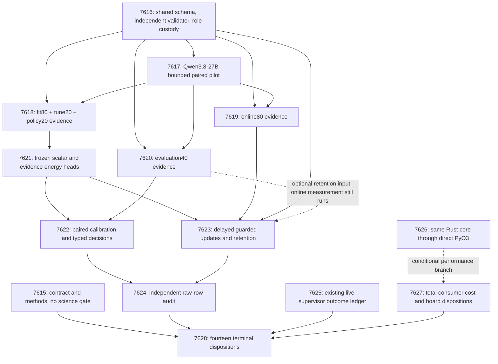

# Carnot Research Roadmap v665: Schema-aligned evidence and retained learning

**Created:** 2026-09-24  
**Milestone:** 2026.09.665  
**Title:** Schema-aligned evidence, retained decision learning, and direct native service calls  
**Status:** Planned; staged only, not activated  
**Supersedes:** 2026.09.664, experiments exp7601–exp7614  
**Execution authority:** `research-roadmap-next.yaml` (or the activated authority bearing this milestone)  
**Previous design:** `research-roadmap-v664-preserved-20260924.md`, preserved before replacing vNEXT  
**Contract:** exactly **14 tasks, exp7615 through exp7628**, in the order below; four phases.

## What v664 proved

The completed archive can lag the active roadmap. The terminal V664 artifacts,
conductor results and `docs/research-notes/v664-capstone.md` establish these limits.
Protocol readiness is separate from an externally measured scientific result.

| Work | Evidence | Established result and limit |
|---|---|---|
| Contract and role custody | Exp7601–7602 | Fourteen-task contract; 480 restored source groups and 240 selected role groups with frozen hashes. The data are historically exposed. |
| Guarded continuous update | Exp7603 | Exact-fixture gradient, delayed release, admission, anchors, persistence and restart passed. `circular_positive`, not external learning benefit. |
| Local Qwen extraction pilot | Exp7604 | Eight real bounded generations, 88.093 seconds total; no transport/truncation failure, but 8/8 outputs rejected with `evidence_output_value_invalid`. |
| Evidence science | Exp7605–7610 | Capture gates blocked; no eligible head, decision or retained-learning measurement. Exp7610 correctly reported unavailable evidence. This is not a semantic null. |
| ARC matched support | Exp7611 | Fixture works; twelve episodes across six games selected zero natural matched keys. No empirical history benefit. |
| ARC history measurement | Exp7612 | `complete_blocked_exp7611_protocol`. Current read-only checks pass, but the historical failed-check cause remains unresolved. No unchanged collector rerun is proposed. |
| Consumer attribution | Exp7613 | 120 paired durable-service blocks plus 40 instrumentation controls. Arithmetic-elimination bounds approximately 1.006–1.098x by stratum; these are bounds, not achieved speedups. Preserves Exp7598's speed null. |
| Closure | Exp7614 | `complete_blocked_required_v664_external_evidence`; fourteen dispositions retained. Existing FoVer G1–G4 eligibility establishes no new V664 claim. |

The concrete new diagnosis is a prompt/parser disagreement. The parser requires
`person`, `organization`, `location`, `date`, `numeric`, `code`, `other` or `none`.
The pilot prompt supplied the key `entity_type` without that enumeration. Every
response invented another value, including `file_path`, `code_behavior` or
`function`. Repair the shared contract and collect new outputs; do not coerce old
invalid responses and then claim the previous experiment succeeded.

The old measured projections were 2930.329 seconds for fit/tune/policy120 and
3071.043 seconds for online80+evaluation40 against a 3000-second capture budget.
The new plan separates online80 and evaluation40, with independently measured
feasibility. It also removes duplicated prompt text losslessly. Neither change
reduces the roster, output budget or scientific gate after observing results.

## Three largest gaps to the PRD vision

1. **Source-dependent verification that improves decisions (FR-01, FR-12).**
   Carnot has exact verifiers and protocol fixtures, but the new externally
   grounded evidence path has no usable measurement. Establish schema agreement,
   then compare semantic evidence against strong scalar calibration and evidence
   controls. A valid JSON response is not evidence of correct reasoning.
2. **Retained continuous learning from actual failures (FR-06, FR-11).**
   Delayed, durable updates exist on fixtures. Measure causal prediction-before-
   release, one-use admission, restart and retained decision quality on external
   evidence. Generator training remains outside this milestone.
3. **Useful performance across the full deployment path (FR-05, FR-08, NFR-01).**
   Existing Rust consumer speed failed its aggregate gate and arithmetic offers
   little headroom. Measure a direct PyO3 call into the same durable Rust core,
   including cold startup and persistence. Do not equate native arithmetic or
   board availability with end-to-end speed.

ARC supervisor outcome refinement remains an independent reserved generalization
activity. It improves the evidence for transferable selection without repeating
already-solved games or requiring unsupported new gameplay.

## Research incorporated before experiment design

The complete dated review, discovery receipts and access limits were appended to
`research-references.md` before this design was authored. Primary sources govern
technical choices; discovery indexes do not establish results or acceptance.

| Source | Adopted or deferred implication | Tasks |
|---|---|---|
| [JSONSchemaBench, 2025](https://arxiv.org/html/2501.10868v1) and [llama.cpp grammar documentation](https://github.com/ggml-org/llama.cpp/blob/master/grammars/README.md) | Separate schema coverage, correctness and latency. Compare explicit-schema prompting against supported constrained decoding with independent validation. | 7616–7617 |
| [EAEV, September 2026](https://arxiv.org/html/2609.08267v1) | Test source dependence using frozen evidence features, semantic erasure and changed source-group pairing; local adaptation, not reproduction. | 7621–7624 |
| [Proper Calibeating, May 2026](https://arxiv.org/html/2605.26703v2) and [trust-region continual learning, February 2026](https://arxiv.org/abs/2602.02417) | Proper-loss comparisons and bounded retained updates motivate controls. Published guarantees do not automatically cover this delayed admission protocol. | 7623 |
| [EBT, 2025](https://arxiv.org/abs/2507.02092), [ARM–EBM, 2025/2026](https://arxiv.org/abs/2512.15605), [ETS, 2026](https://arxiv.org/abs/2601.21484) | Preserve the long-term learned-energy/guided-generation direction. No generator retraining or training-free sampler deployment before evidence is measurable. | Method map; deferred |
| [KAN local updates, 2026](https://arxiv.org/html/2602.02056v4) | Useful sparse/local update direction; retain the already-tested compact head for an identifiable experiment before introducing another architecture. | Deferred |
| [Input-side evidence alignment](https://arxiv.org/abs/2608.15804), [symbolic constraint representations](https://arxiv.org/abs/2609.12267), [parallel Ising sampling](https://arxiv.org/abs/2607.12348) | New abstract-level leads for future span extraction, learned constraints and samplers. Full-method evaluation remains required. | Deferred |
| [FPGA–ASIC decomposition](https://arxiv.org/abs/2602.15985), [Extropic Z1T](https://extropic.ai/writing/z1t), [Kona architecture](https://logicalintelligence.com/kona-ebms-energy-based-models) | Research context; vendor hardware claims are not local measurements or proof of available devices/open training recipes. | 7627 dispositions |

Secondary checks covered OpenReview, Extropic writing, Semantic Scholar citations
for both seed papers, Hugging Face verification papers, GitHub Python/Rust weekly
trending and Logical Intelligence. Semantic Scholar citation endpoints failed;
one OpenReview PDF challenged the browser; feeds/trending were cached. No verified
citation census, fresh trending dependency or uninspected full-paper result is
claimed. These limits do not block the readable primary methods used here.

## v665 architecture



Solid edges into execution tasks represent necessary evidence dependencies;
audit/capstone edges are inputs to account for, not conductor pre-gates. The
machine contract below is authoritative for exact predicates. The science chain
uses named readiness scores, allowed verdict classes and clean terminal-reader
flags. No free-text success-string guess controls a gate.

## Exact Task Contract

The visible table and machine block specify the same fourteen YAML tasks.
All JSON paths below are deliverables, never prerequisites to their own creation.
Task prompts also specify raw sidecars, documentation and thin CLI entrypoints.

| Order | Task ID | Exact title | Phase | Deliverable | Substrate class | Structured gate |
|---|---|---|---|---|---|---|
| 1 | exp7615-contract-methods | Bind fourteen tasks and qualify schema-constrained evidence methods | 1 | results/experiment_7615_v665_contract_methods.json | aggregation | none |
| 2 | exp7616-evidence-schema | Unify evidence prompt, decoder schema and independent validation | 1 | results/experiment_7616_v665_evidence_schema.json | no_model_load | none |
| 3 | exp7617-schema-pilot | Compare explicit-schema prompting and constrained decoding on eight pilot groups | 1 | results/experiment_7617_v665_schema_pilot.json | model_bounded_generation | exp7616-evidence-schema.evidence_schema_ready_score == 1; exp7616-evidence-schema.verdict_class in ["null", "positive"]; exp7616-evidence-schema.flagged_adversarial == false |
| 4 | exp7618-fit-evidence | Capture fixed fit, tune and policy evidence | 2 | results/experiment_7618_v665_fit_evidence.json | model_bounded_generation | exp7616-evidence-schema.role_contract_ready_score == 1; exp7616-evidence-schema.verdict_class in ["null", "positive"]; exp7616-evidence-schema.flagged_adversarial == false; exp7617-schema-pilot.evidence_transport_ready_score == 1; exp7617-schema-pilot.verdict_class in ["null", "positive"]; exp7617-schema-pilot.flagged_adversarial == false; exp7617-schema-pilot.fit_capture_feasible_score == 1; exp7617-schema-pilot.verdict_class in ["null", "positive"]; exp7617-schema-pilot.flagged_adversarial == false |
| 5 | exp7619-online-evidence | Capture the fixed delayed-learning evidence stream | 2 | results/experiment_7619_v665_online_evidence.json | model_bounded_generation | exp7616-evidence-schema.role_contract_ready_score == 1; exp7616-evidence-schema.verdict_class in ["null", "positive"]; exp7616-evidence-schema.flagged_adversarial == false; exp7617-schema-pilot.evidence_transport_ready_score == 1; exp7617-schema-pilot.verdict_class in ["null", "positive"]; exp7617-schema-pilot.flagged_adversarial == false; exp7617-schema-pilot.online_capture_feasible_score == 1; exp7617-schema-pilot.verdict_class in ["null", "positive"]; exp7617-schema-pilot.flagged_adversarial == false |
| 6 | exp7620-evaluation-evidence | Capture the fixed isolated evaluation evidence | 2 | results/experiment_7620_v665_evaluation_evidence.json | model_bounded_generation | exp7616-evidence-schema.role_contract_ready_score == 1; exp7616-evidence-schema.verdict_class in ["null", "positive"]; exp7616-evidence-schema.flagged_adversarial == false; exp7617-schema-pilot.evidence_transport_ready_score == 1; exp7617-schema-pilot.verdict_class in ["null", "positive"]; exp7617-schema-pilot.flagged_adversarial == false; exp7617-schema-pilot.evaluation_capture_feasible_score == 1; exp7617-schema-pilot.verdict_class in ["null", "positive"]; exp7617-schema-pilot.flagged_adversarial == false |
| 7 | exp7621-evidence-energy | Train a compact evidence residual against calibrated controls | 2 | results/experiment_7621_v665_evidence_energy.json | no_model_load | exp7618-fit-evidence.fit_evidence_ready_score == 1; exp7618-fit-evidence.verdict_class in ["null", "positive"]; exp7618-fit-evidence.flagged_adversarial == false |
| 8 | exp7622-decision-evaluation | Measure evidence discrimination and typed decision utility | 3 | results/experiment_7622_v665_decision_evaluation.json | no_model_load | exp7620-evaluation-evidence.evaluation_evidence_ready_score == 1; exp7620-evaluation-evidence.verdict_class in ["null", "positive"]; exp7620-evaluation-evidence.flagged_adversarial == false; exp7621-evidence-energy.evidence_head_ready_score == 1; exp7621-evidence-energy.verdict_class in ["null", "positive"]; exp7621-evidence-energy.flagged_adversarial == false |
| 9 | exp7623-guarded-learning | Test delayed evidence learning with restart and retention guards | 3 | results/experiment_7623_v665_guarded_learning.json | no_model_load | exp7616-evidence-schema.guarded_update_ready_score == 1; exp7616-evidence-schema.verdict_class in ["null", "positive"]; exp7616-evidence-schema.flagged_adversarial == false; exp7619-online-evidence.online_evidence_ready_score == 1; exp7619-online-evidence.verdict_class in ["null", "positive"]; exp7619-online-evidence.flagged_adversarial == false; exp7621-evidence-energy.evidence_head_ready_score == 1; exp7621-evidence-energy.verdict_class in ["null", "positive"]; exp7621-evidence-energy.flagged_adversarial == false |
| 10 | exp7624-evidence-audit | Independently reduce evidence, decision and learning claims | 3 | results/experiment_7624_v665_evidence_audit.json | aggregation | none |
| 11 | exp7625-arc-supervisor-transfer | Refine cross-game supervisor selection from actual redirect outcomes | 3 | results/experiment_7625_v665_arc_supervisor_transfer.json | aggregation | none |
| 12 | exp7626-native-service | Expose the durable recalibration core through a direct PyO3 call | 4 | results/experiment_7626_v665_native_service.json | no_model_load | none |
| 13 | exp7627-native-cost | Measure direct native service cost and preserve board dispositions | 4 | results/experiment_7627_v665_native_cost.json | no_model_load | none |
| 14 | exp7628-capstone | Reconcile fourteen dispositions and select the next scientific question | 4 | results/experiment_7628_v665_capstone.json | aggregation | none |

<!-- V665-TASK-CONTRACT-BEGIN -->
```json
[
{"id": "exp7615-contract-methods", "title": "Bind fourteen tasks and qualify schema-constrained evidence methods", "phase": 1, "deliverable": "results/experiment_7615_v665_contract_methods.json", "inference_substrate_class": "aggregation", "gated_on": []},
{"id": "exp7616-evidence-schema", "title": "Unify evidence prompt, decoder schema and independent validation", "phase": 1, "deliverable": "results/experiment_7616_v665_evidence_schema.json", "inference_substrate_class": "no_model_load", "gated_on": []},
{"id": "exp7617-schema-pilot", "title": "Compare explicit-schema prompting and constrained decoding on eight pilot groups", "phase": 1, "deliverable": "results/experiment_7617_v665_schema_pilot.json", "inference_substrate_class": "model_bounded_generation", "gated_on": [{"upstream": "exp7616-evidence-schema", "artifact_field": "evidence_schema_ready_score", "op": "==", "value": 1}, {"upstream": "exp7616-evidence-schema", "artifact_field": "verdict_class", "op": "in", "value": ["null", "positive"]}, {"upstream": "exp7616-evidence-schema", "artifact_field": "flagged_adversarial", "op": "==", "value": false}]},
{"id": "exp7618-fit-evidence", "title": "Capture fixed fit, tune and policy evidence", "phase": 2, "deliverable": "results/experiment_7618_v665_fit_evidence.json", "inference_substrate_class": "model_bounded_generation", "gated_on": [{"upstream": "exp7616-evidence-schema", "artifact_field": "role_contract_ready_score", "op": "==", "value": 1}, {"upstream": "exp7616-evidence-schema", "artifact_field": "verdict_class", "op": "in", "value": ["null", "positive"]}, {"upstream": "exp7616-evidence-schema", "artifact_field": "flagged_adversarial", "op": "==", "value": false}, {"upstream": "exp7617-schema-pilot", "artifact_field": "evidence_transport_ready_score", "op": "==", "value": 1}, {"upstream": "exp7617-schema-pilot", "artifact_field": "verdict_class", "op": "in", "value": ["null", "positive"]}, {"upstream": "exp7617-schema-pilot", "artifact_field": "flagged_adversarial", "op": "==", "value": false}, {"upstream": "exp7617-schema-pilot", "artifact_field": "fit_capture_feasible_score", "op": "==", "value": 1}, {"upstream": "exp7617-schema-pilot", "artifact_field": "verdict_class", "op": "in", "value": ["null", "positive"]}, {"upstream": "exp7617-schema-pilot", "artifact_field": "flagged_adversarial", "op": "==", "value": false}]},
{"id": "exp7619-online-evidence", "title": "Capture the fixed delayed-learning evidence stream", "phase": 2, "deliverable": "results/experiment_7619_v665_online_evidence.json", "inference_substrate_class": "model_bounded_generation", "gated_on": [{"upstream": "exp7616-evidence-schema", "artifact_field": "role_contract_ready_score", "op": "==", "value": 1}, {"upstream": "exp7616-evidence-schema", "artifact_field": "verdict_class", "op": "in", "value": ["null", "positive"]}, {"upstream": "exp7616-evidence-schema", "artifact_field": "flagged_adversarial", "op": "==", "value": false}, {"upstream": "exp7617-schema-pilot", "artifact_field": "evidence_transport_ready_score", "op": "==", "value": 1}, {"upstream": "exp7617-schema-pilot", "artifact_field": "verdict_class", "op": "in", "value": ["null", "positive"]}, {"upstream": "exp7617-schema-pilot", "artifact_field": "flagged_adversarial", "op": "==", "value": false}, {"upstream": "exp7617-schema-pilot", "artifact_field": "online_capture_feasible_score", "op": "==", "value": 1}, {"upstream": "exp7617-schema-pilot", "artifact_field": "verdict_class", "op": "in", "value": ["null", "positive"]}, {"upstream": "exp7617-schema-pilot", "artifact_field": "flagged_adversarial", "op": "==", "value": false}]},
{"id": "exp7620-evaluation-evidence", "title": "Capture the fixed isolated evaluation evidence", "phase": 2, "deliverable": "results/experiment_7620_v665_evaluation_evidence.json", "inference_substrate_class": "model_bounded_generation", "gated_on": [{"upstream": "exp7616-evidence-schema", "artifact_field": "role_contract_ready_score", "op": "==", "value": 1}, {"upstream": "exp7616-evidence-schema", "artifact_field": "verdict_class", "op": "in", "value": ["null", "positive"]}, {"upstream": "exp7616-evidence-schema", "artifact_field": "flagged_adversarial", "op": "==", "value": false}, {"upstream": "exp7617-schema-pilot", "artifact_field": "evidence_transport_ready_score", "op": "==", "value": 1}, {"upstream": "exp7617-schema-pilot", "artifact_field": "verdict_class", "op": "in", "value": ["null", "positive"]}, {"upstream": "exp7617-schema-pilot", "artifact_field": "flagged_adversarial", "op": "==", "value": false}, {"upstream": "exp7617-schema-pilot", "artifact_field": "evaluation_capture_feasible_score", "op": "==", "value": 1}, {"upstream": "exp7617-schema-pilot", "artifact_field": "verdict_class", "op": "in", "value": ["null", "positive"]}, {"upstream": "exp7617-schema-pilot", "artifact_field": "flagged_adversarial", "op": "==", "value": false}]},
{"id": "exp7621-evidence-energy", "title": "Train a compact evidence residual against calibrated controls", "phase": 2, "deliverable": "results/experiment_7621_v665_evidence_energy.json", "inference_substrate_class": "no_model_load", "gated_on": [{"upstream": "exp7618-fit-evidence", "artifact_field": "fit_evidence_ready_score", "op": "==", "value": 1}, {"upstream": "exp7618-fit-evidence", "artifact_field": "verdict_class", "op": "in", "value": ["null", "positive"]}, {"upstream": "exp7618-fit-evidence", "artifact_field": "flagged_adversarial", "op": "==", "value": false}]},
{"id": "exp7622-decision-evaluation", "title": "Measure evidence discrimination and typed decision utility", "phase": 3, "deliverable": "results/experiment_7622_v665_decision_evaluation.json", "inference_substrate_class": "no_model_load", "gated_on": [{"upstream": "exp7620-evaluation-evidence", "artifact_field": "evaluation_evidence_ready_score", "op": "==", "value": 1}, {"upstream": "exp7620-evaluation-evidence", "artifact_field": "verdict_class", "op": "in", "value": ["null", "positive"]}, {"upstream": "exp7620-evaluation-evidence", "artifact_field": "flagged_adversarial", "op": "==", "value": false}, {"upstream": "exp7621-evidence-energy", "artifact_field": "evidence_head_ready_score", "op": "==", "value": 1}, {"upstream": "exp7621-evidence-energy", "artifact_field": "verdict_class", "op": "in", "value": ["null", "positive"]}, {"upstream": "exp7621-evidence-energy", "artifact_field": "flagged_adversarial", "op": "==", "value": false}]},
{"id": "exp7623-guarded-learning", "title": "Test delayed evidence learning with restart and retention guards", "phase": 3, "deliverable": "results/experiment_7623_v665_guarded_learning.json", "inference_substrate_class": "no_model_load", "gated_on": [{"upstream": "exp7616-evidence-schema", "artifact_field": "guarded_update_ready_score", "op": "==", "value": 1}, {"upstream": "exp7616-evidence-schema", "artifact_field": "verdict_class", "op": "in", "value": ["null", "positive"]}, {"upstream": "exp7616-evidence-schema", "artifact_field": "flagged_adversarial", "op": "==", "value": false}, {"upstream": "exp7619-online-evidence", "artifact_field": "online_evidence_ready_score", "op": "==", "value": 1}, {"upstream": "exp7619-online-evidence", "artifact_field": "verdict_class", "op": "in", "value": ["null", "positive"]}, {"upstream": "exp7619-online-evidence", "artifact_field": "flagged_adversarial", "op": "==", "value": false}, {"upstream": "exp7621-evidence-energy", "artifact_field": "evidence_head_ready_score", "op": "==", "value": 1}, {"upstream": "exp7621-evidence-energy", "artifact_field": "verdict_class", "op": "in", "value": ["null", "positive"]}, {"upstream": "exp7621-evidence-energy", "artifact_field": "flagged_adversarial", "op": "==", "value": false}]},
{"id": "exp7624-evidence-audit", "title": "Independently reduce evidence, decision and learning claims", "phase": 3, "deliverable": "results/experiment_7624_v665_evidence_audit.json", "inference_substrate_class": "aggregation", "gated_on": []},
{"id": "exp7625-arc-supervisor-transfer", "title": "Refine cross-game supervisor selection from actual redirect outcomes", "phase": 3, "deliverable": "results/experiment_7625_v665_arc_supervisor_transfer.json", "inference_substrate_class": "aggregation", "gated_on": []},
{"id": "exp7626-native-service", "title": "Expose the durable recalibration core through a direct PyO3 call", "phase": 4, "deliverable": "results/experiment_7626_v665_native_service.json", "inference_substrate_class": "no_model_load", "gated_on": []},
{"id": "exp7627-native-cost", "title": "Measure direct native service cost and preserve board dispositions", "phase": 4, "deliverable": "results/experiment_7627_v665_native_cost.json", "inference_substrate_class": "no_model_load", "gated_on": []},
{"id": "exp7628-capstone", "title": "Reconcile fourteen dispositions and select the next scientific question", "phase": 4, "deliverable": "results/experiment_7628_v665_capstone.json", "inference_substrate_class": "aggregation", "gated_on": []}
]
```
<!-- V665-TASK-CONTRACT-END -->

## Phase 1 — Establish a measurable evidence protocol (7615–7617)

Exp7615 records methods, prior dispositions and contract guards without creating
a global gate. Exp7616 binds the prompt, supported grammar, independent parser
and frozen role manifest. It also authenticates the shipped update lifecycle.
Exp7617 runs sixteen real requests on eight paired, role-disjoint pilot groups:
explicit-schema prompting versus the identical prompt with constrained decoding.

Select the grammar arm if at least six of eight outputs independently validate
and accepted outputs have no invalid pointers; otherwise select the prompt arm
under the same rule. If neither qualifies, no capture is launched. Report unknown
rate, output completion, schema coverage and latency separately. This is a
transport-readiness rule, deliberately not a factual-correctness threshold.
Feasibility uses measured load plus 1.25 times p90 row latency and reserve,
separately for each fixed roster. Do not raise budgets to rescue a null.

## Phase 2 — Capture fixed roles and freeze learned comparators (7618–7621)

The existing salt `v663-evidence-20260924`, group identities and evaluator-store
separation persist. Capture fit80+tune20+policy20, online80 and evaluation40 in
three tasks. Use one bounded <=512-token generation per group and preserve every
failure. All 240 attempted groups remain in downstream analyses; malformed or
unknown evidence uses frozen baseline fallback. No outcome-conditioned replacement,
retry, role transfer or filtering is allowed. Pilot groups are separate.

Exp7621 reuses the shipped eight-feature/eight-hidden-unit residual energy head.
With error probability p, energies are E0=-log(1-p) and E1=-log(p), as implemented
in Exp7603. Optimize only 64 fit groups, retain 16 anchors, select from four
predeclared configurations on tune20, and freeze policy on policy20. Use raw,
temperature, scalar logistic, semantic residual, evidence-erased and evidence-
deranged comparators. Normalization is fit-only. Readiness depends on valid
training/checkpoints, not a favorable tune score. This small discriminative head
does not satisfy the PRD's full MCMC/generative training ambition by itself.

## Phase 3 — Test utility, continuous learning and generalization (7622–7625)

**Exp7622:** On forty evaluation groups, require Brier reduction >=0.005 and a
simultaneous 95% lower confidence bound above zero versus both raw and the frozen
strongest scalar comparator. Use 2,000 paired source-group bootstrap resamples;
two primary comparisons use Bonferroni-adjusted individual 97.5% intervals.
Controls must change their inputs and predictions, and full evidence must have
strictly lower mean Brier than both altered-evidence controls. Degenerate or
non-degrading erasure/derangement cannot establish source-dependent benefit. Typed decisions use the minimum of
expected costs accept=5p, reject=1-p and escalate=0.2. The separate utility gate
requires positive cost-saving lower bound, automatic-decision coverage >=10%
and no increase in observed false accepts. All roles remain exploratory.

**Exp7623:** Run frozen, guarded and delayed-label-deranged heads on the same
80 groups in five fixed orders. Predict before lag-eight label release. For each
block of eight, four examples supply updates and four supply one-use admission;
propose once only when the whole block is legally released. Derangement never
moves an unreleased label into the past. Preserve sixteen reusable anchors.
Admit under the shipped Brier/cost/anchor<=0.002 guard. Restart at positions 32
and 64; release the tail through tick 88. Average each group over orders before
bootstrap; orders do not create 400 independent samples.

A learning benefit requires >=0.005 prequential Brier improvement with simultaneous
positive lower bounds versus frozen and deranged controls, a nonzero admitted
update, no higher observed cost/false accepts, and retained evaluation performance.
Retention requires an upper95 bound on final-minus-initial Brier <=0.002 on the
forty evaluation groups, plus no observed cost/false-accept increase. Evaluation
labels never enter updates. Missing evaluation evidence blocks the joint claim
while preserving completed online measurement. Static benefit is not a prerequisite
for online learning. The small effective sample and conservative bounds can
legitimately yield inconclusive/null results.

**Exp7624:** Independently rebuild both branches from raw rows and checkpoint
bytes. Exercise corrupt identity, label leakage, sign, checkpoint, duplicate-group
and degenerate-control mutations. Syntax, calibration, semantic attribution,
causal updates and retention remain distinct claims.

**Exp7625:** Read actual outcome-bearing live supervisor redirects; distinguish
shadow proposals from applied/fired actions and preserve censoring. This is the
explicit generalization-floor activity 4 in CLAUDE.md. Authenticated zero firings
means “nothing to refine” and satisfies the slot. At >=20 uncensored firings per
arm across >=3 games, report leave-one-game-out stability and a conservative
curated-selection recommendation. Observational help rates do not prove causality.
Do not change live defaults, propose model-generated arms or claim a new solve.
A missing outcome schema is blocked; an authenticated empty ledger is null.

## Phase 4 — Measure the native boundary and close honestly (7626–7628)

Exp7626 exposes the existing durable Rust service core through a real PyO3
binding, retaining the JSONL caller and exact persistence semantics. Use existing
historical service workloads so unavailable new evidence cannot block this track.
Require actual import, numeric/decision parity, fsync-before-ack, fault handling
and crash/reload receipts. Compilation alone is insufficient.

Exp7627 conditionally measures native performance and always records board
continuity. Freeze 120 paired three-arm blocks, thirty each for cold/warm x
batch1/batch8, and forty telemetry on/off control blocks. Cold cost includes
startup/import. Every arm acknowledges equally durable work. The primary comparator
is in-process Python, declared before timing; old Rust JSONL remains a secondary
comparison. Require equal-stratum geometric speed ratio and lower95 >=1.10,
every stratum lower95>=0.95, exact decisions/state parity and no extra errors.
The PRD's 10x throughput goal remains separately reported and unmet unless measured.
Neither arithmetic-elimination bounds nor selective warm throughput satisfy it.

Exp7628 records all fourteen dispositions and independently eligible claims.
Missing external evidence produces terminal blocked, never partial retries.
Null science stays terminal null. Fixed publication G1–G4 are reported unchanged;
old FoVer eligibility cannot transfer to new evidence. No submission is planned.

## Hardware, execution budgets and routing

| Resource | Required use / boundary |
|---|---|
| Local 2x RTX3090 | Sequential leased Qwen runs in 7617–7620. Authenticate exact GGUF, quantization, template, backend, GPU UUID, PID and offload. Prefer the existing Q4_K_M asset; do not infer availability or evict foreign work. |
| Qwen3.8-27B GGUF | `MODEL_SPECS=[unsloth/Qwen3.8-27B-GGUF]` for every current LLM task. Same mandated generator family. Tiny legacy models are smoke-only, never result substitutes. |
| CPU/RAM/local storage | Compact training, immutable raw rows, bootstrap reductions, durable checkpoints and private native builds. No extra hardware purchase is a prerequisite. |
| KV260 | Preserve graduated FPGA result scope and kmax<=5. No host-SD prerequisite or new placement claim. |
| PolarFire | Preserve graduated Linux CPU dispatch; do not label it FPGA fabric execution. |
| GateMate | Physical-chain operator receipt required before a new probe; preserve 0xffffffff blocker. No blind JTAG rerun. |
| Extropic TSU / AMD XDNA | No newly authenticated local resource established; defer device measurements. |

The four current-model tasks are **model_bounded_generation**, with a 10-second
authenticity floor. A 512-token cap is bounded generation even across many rows.
No task is mislabeled full-generation (60s floor) or load-only (2s floor); there
is no runtime padding. Other tasks declare `no_model_load` or `aggregation` and
`MODEL_SPECS=[]`, distinguishing inherited model receipts from current calls.

Planned serial agent budgets total **670 minutes** (about 11.2 hours), with
45/75/60/60-minute caps for the four current-model tasks. These are ceilings,
not predicted or required durations. Each capture stops generation by 3000s and
reserves validation within 4500s, below the 4800s hard cap. Missing GPU leases
produce blocked receipts. Do not run two model workers concurrently.

Every prompt makes flushed progress a numbered requirement at phase boundaries,
before/after long calls and every 60s inside loops or synchronous-call heartbeat
workers. Every silence gap stays below 600s; a wall-time estimate cannot protect a
silent task from the 1200s rule. Every prompt requires files over about 200 lines
to be written in bounded 100–150-line calls, with progress between calls.

Schema/coordination tasks 7615,7616 and hardware integration 7627 use Claude Opus, 100 turns.
Formulaic PyO3 work 7626 uses Codex/gpt-5.6-sol. Routine measurements use the default
Claude backend; reducers use 20–30 turns where appropriate. Agent routing does not
change the scientific GGUF mandate. No Gemini availability assumption is required.

## Failure discipline and acceptance

All fourteen tasks carry complete prior-failure entries: ID, literal recorded
verdict, changed premise and `retire_if_same_verdict: true`. Captures and later
science reference the failed upstream capture where no prior producer exists;
absence is not assigned an invented scientific verdict. The explicit shared
schema and separated capture budgets are the new premise. ARC changes the
question to actual recorded supervisor outcomes; service work changes the calling
boundary. Routine transition/closure and hardware continuity cite the standing
2026-05-29 directive without reviving retired science or retired IDs.

The closed classes are positive, circular_positive, null, blocked, disqualified
and partial. Exact-fixture/oracle successes are circular_positive; readiness-only
work is null. A positive scientific class requires its benefit gates. Partial
means incomplete work this task can finish, not an absent external input. Every
blocked artifact carries `gate_check_summary` with exact check/path/field/expected/
observed values. Every comparative claim carries per-unit rows and source hashes.

Each prompt specifies spec-first/tests-first implementation, scoped 100% changed-
behavior coverage, Ruff, mypy, spec coverage, applicable Rust checks, cold replay,
independent reduction, adversarial verification and strict row-consistency checks.
Terminal reader outcomes are persisted before atomic publication. New implementation
requirements are added to the named capability before code changes. No experiment
may modify `scripts/research_conductor.py` or push.

Applicable runtime E2E work includes raw model-request/parser replay; durable
learning restart; ARC E2E-011/013 receipt parity; native E2E-003 and applicable
E2E-004 cross-language serialization. The service's JSON persistence is identified
separately from unchanged safetensor checks. Planning itself changes documents and
YAML only: its E2E is schema loading, exact design/YAML contract comparison, gate
resolution and negative contract mutations. It does not claim those future runtime
experiments have already run.

## Exit criteria and planning validation

The milestone is scientifically useful if it establishes either a reproducible
improvement or a sharply localized null for the schema/evidence/learning/native
hypotheses. Completion does not require a positive result. Preserve fixed rosters,
small-sample uncertainty, historical exposure, all failed gates and prior verdicts.
A future unseen-role confirmation is required before a fresh generalization claim.

Planning validation is recorded in `ops/status.md`, `ops/changelog.md` and
`_bmad/traceability.md` after guards, scoped unit tests, specification checks and
independent contract mutation checks. The active roadmap and conductor are
checksum-protected. This document and the staged YAML must remain an exact pair;
if any task changes, update both before activation.
