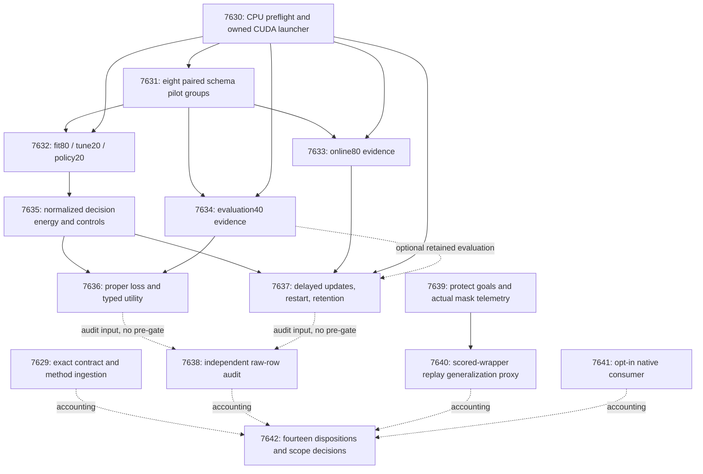

# Carnot Research Roadmap v666: Owned evidence and goal-safe planning

**Created:** 2026-09-24  
**Milestone:** 2026.09.666  
**Title:** Owned evidence capture, retained decision learning, and goal-safe ARC planning  
**Status:** Staged plan; experiments not run or activated  
**Supersedes:** 2026.09.665, exp7615–exp7628  
**Execution authority:** `research-roadmap-next.yaml`, or the activated authority with milestone 2026.09.666  
**Previous design:** `research-roadmap-v665-preserved-20260924.md`, preserved byte-for-byte  
**Contract:** exactly **14 tasks, exp7629 through exp7642**, in the order below, across four phases.

## What v665 proved

Completion means the conductor handled every task. It does not mean each task
ran or established a positive result. The archive currently ends at V664;
V665's artifacts, conductor log and capstone establish its terminal state.

| Work | Evidence | Established result and limit |
|---|---|---|
| Contract and schema | Exp7615–7616 | Fourteen-task contract and shared enum/decoder/parser schema qualified. Source-role custody and the guarded-update fixture passed. |
| Paired schema pilot | Exp7617 | `complete_blocked_exclusive_cuda_capacity`; zero model calls and zero pilot groups. No schema-quality or semantic result exists. |
| Captures | Exp7618–7620 | Actual pre-gate receipts at `results/experiment_7618_fit_evidence.json`, `experiment_7619_online_evidence.json`, and `experiment_7620_evaluation_evidence.json`; planned V665 producer files are absent. |
| Decision and learning science | Exp7621–7624 | No head, decision or learning producers; audit reports `complete_blocked_v665_scientific_producers_unavailable`. Unavailable evidence is not a measured null. |
| ARC supervisor | Exp7625 | Six games, 24 receipts, 20 proposed/shadow redirects, zero actual firings. No outcome-based selection change is justified. |
| Native service | Exp7626 | Real PyO3, JSONL and Python parity plus durable restart qualified; standalone native-test setup was subsequently repaired. |
| Total native cost | Exp7627 | 120 paired three-arm blocks. Python/direct-native ratio 7.8270, CI95 [7.2843, 8.3826]; JSONL/direct-native 2.6493. The 1.10 benefit gate passed; separate 10x NFR failed. |
| Closure | Exp7628 | `complete_blocked_required_v665_external_evidence`; fourteen dispositions preserved. Circular self-input hashing was repaired. |

The pilot selector requires every GPU process to have the current PID. Its
recorded GPU 1 had 23,912 MiB free but another PID held 256 MiB. That process
may have been related to the task; the artifact does not establish ownership.
This plan requires proof of ownership and CPU-isolated preflight, while keeping
the foreign-work veto. Free memory alone cannot justify sharing or eviction.
The new launch test is a changed mechanism, not an assertion that capacity
will be available when a later task runs.

The latest independent ARC review adds a separate measured gap. Exp10013's HUD
mask can drop a state before evaluating its full-grid goal. Its direct harness
also used a wider mask than the live wrapper on ar25: the live-relevant expert
count is 6/10, not 7/10. Novelty tie-breaking lengthened plans without adding
expert wins. Both flags remain off. These findings justify method repair and
wrapper measurement, not an unchanged supervisor-ledger audit or new public
level-solving task.

## Three largest gaps to the PRD vision

1. **Evidence-dependent decisions (FR-01, FR-12).** The framework can enforce
   exact constraints, but its new semantic evidence path has not been measured.
   Qualify transport, then ask whether source-linked features improve proper
   losses and accept/reject/escalate decisions beyond scalar calibration.
2. **Causal, retained self-learning (FR-06, FR-11).** Fixture updates work; the
   new real-evidence stream has no learning result. Test prediction before
   feedback, one-use admission, immutable anchors, persistence and retained
   utility. A no-update result remains useful evidence.
3. **Useful live search under bounded compute (FR-07, FR-12; ARC north star).**
   World-model transition fidelity does not reliably predict plan usefulness.
   A verified goal can also be lost through state merging. Repair the reusable
   planner and test the actual scored wrapper, preserving its masks and costs.

FR-05/FR-08 deployment is an enabling branch: ship an explicit native client for
the already-measured Rust core. This does not reopen the 10x benchmark without a
changed performance mechanism or claim that a learned head has been ported.

## Research adopted before design

The dated V666 review was appended to `research-references.md` before this
contract was designed. It records all eight topics and six secondary channels.

| Source | Adopted method or deferral | Tasks |
|---|---|---|
| [JSONSchemaBench](https://arxiv.org/html/2501.10868v1), 2025 | Separate grammar coverage, generation cost and output quality; independently validate pointers. | 7631–7634 |
| [EAEV](https://arxiv.org/html/2609.08267v1), September 2026 | Compare semantic evidence with erasure and source-group permutation. Local adaptation, not replication. | 7635–7636 |
| [Proper Calibeating](https://arxiv.org/html/2605.26703v2), May 2026; [trust-region continual learning](https://arxiv.org/abs/2602.02417), February 2026 | Proper-loss and decision tests plus bounded retained updates. No theorem claim for delayed admission. | 7635–7637 |
| [Spline-local KAN learning](https://arxiv.org/html/2602.02056v4), 2026 | Sparse update path for future hardware; defer another head architecture until evidence value is known. | Hardware-path accounting, 7637 |
| [FPGA–ASIC co-design](https://arxiv.org/abs/2602.15985), revised September 2026 | Full consumer cost governs deployment; carry prior measured native cost into integration. | 7641 |
| [EBT](https://arxiv.org/abs/2507.02092), 2025; [ARM–EBM](https://arxiv.org/abs/2512.15605), 2025/2026 | Keep conditional energy and exact binary normalization; generator stays frozen. | 7629, 7635 |
| [AS2](https://arxiv.org/abs/2603.18436), [ERM](https://arxiv.org/abs/2607.10128), [EBD](https://arxiv.org/abs/2605.28020), 2026 | New leads for soft constraints, recursive selection and reward tilting. Defer architecture expansion and retired scorer families. | Method map |

The source log also covers constraint acquisition, parallel Ising sampling,
input-side alignment and ETS. OpenReview exposed indexed EBT/workshop methods,
but direct forums challenged the browser. Semantic Scholar citation endpoints
failed. Hugging Face and GitHub trending were cached. Extropic Z1T and Kona
pages were readable; vendor statements establish no local hardware or open
training capability. No exhaustive citing-paper census is claimed.

## v666 architecture



The launcher qualifies code, not durable GPU availability. Each model task
acquires and rechecks its lease. Audit/capstone inputs do not pre-gate those
tasks. ARC and native integration remain independent of evidence transport.

## Phase 1: Qualify the launch and extraction protocol — exp7629–exp7631

**Exp7629** binds the contract and ingests methods. It preserves the distinction
between missing producers and measured results. Negative contract mutations are
part of its E2E. It does not gate the scientific branches.

**Exp7630** reproduces the recorded selector rejection and introduces CPU-only
preflight, explicit child ownership and a per-device lease. PID/start-time
identity, foreign contexts, stale locks and race checks are tested without a
model. A 180-second acquisition limit prevents an indefinite resource wait.
Readiness means the launch mechanism is tested, not that a GPU is reserved.

**Exp7631** runs the first eight paired groups through explicit-schema and
constrained-decoding arms: sixteen fixed requests, at most 512 output tokens
each. Select an arm only if all eight independent validations pass without
truncation. Derive separate fit120/online80/evaluation40 time projections and
freeze the chosen configuration. Failure localizes transport; it says nothing
about downstream evidence quality.

## Phase 2: Capture complete evidence and train decisions — exp7632–exp7635

**Exp7632, Exp7633 and Exp7634** capture the unchanged fit80/tune20/policy20,
online80 and evaluation40 rosters, respectively. The role salt remains
`v663-evidence-20260924`: 480 restored groups, 240 selected groups, and eight
pilot groups outside every measured role. Send complete canonical sentence
arrays exactly once. Model processes never receive evaluator labels. Attempt
every scheduled row; invalid evidence retains a frozen baseline fallback and
explicit missingness. No invalid-row retries or outcome-dependent replacement.

Each capture makes at most one 512-token call per group. Stop generation by
3000 seconds and the task by 4500 seconds. Feasibility is gated per roster;
one role's availability does not prove another role can finish. Resume only
unattempted rows with matching hashes. Missing/censored work is explicit.

**Exp7635** fits the existing eight-feature/eight-hidden-unit residual energy on
64 optimization groups with 16 held-out anchors. Four configurations cross
learning rates 0.01/0.03 and regularization 0/0.001, with 200 steps and seed
7635. Tune20 selects configurations; policy20 freezes deployment choices.
Raw, temperature and scalar-logistic baselines compete with semantic, erased
and source-permuted evidence heads. Readiness never requires a tune-set win.
The generator has no trainable parameters in this milestone.

## Phase 3: Test learning and live-planner correctness — exp7636–exp7640

**Exp7636** measures Brier, log loss, AUROC and typed decisions on forty frozen
evaluation groups. Primary gains over raw and strongest scalar require at
least 0.005 Brier improvement and simultaneous 95% lower bounds above zero.
Use 2000 paired group resamples and Bonferroni-adjusted individual intervals.
Evidence attribution also requires that erasure and permutation change
predictions and worsen mean Brier. The typed policy minimizes accept=5p,
reject=1-p, escalate=0.2, with fixed tie order. Utility requires positive
lower-bound cost savings, coverage at least 0.10 and no extra false accepts.
Probability, semantic attribution and utility have separate gate fields.

**Exp7637** is the continuous self-learning experiment. Five orders over the
same online80 compare frozen, guarded and legally deranged-feedback arms.
Predict before lag-eight feedback. Each block has four gradient examples and
four one-use admission examples; anchors never train. Require improved
admission Brier, no higher admission cost and anchor Brier rise at most 0.002.
Restart at positions 32 and 64 and release the tail through tick 88. Average
orders within source group before inference. Benefit requires improvement
against both controls and a nonzero admitted update. Retention separately
requires upper95 on evaluation Brier deterioration at most 0.002 and no extra
cost or false accepts. Missing retention evidence blocks only the joint claim;
online measurements remain. Report actual CPU update/lookup cost and memory.

**Exp7638** independently reconstructs both branches, with role, denominator,
future-label, no-op-control and checkpoint mutations. Missing evidence yields
one blocked disposition, not a partial retry loop.

**Exp7639** hardens a reusable live primitive from the Exp10013 review. Run the
full-grid goal check before duplicate rejection and make mask telemetry reflect
actual planner use. Preserve flags-off behavior. Test intermediate counter
states too: earlier terminal checks alone do not prove masked-state equivalence.
Preserve goal-relevant state or refuse unsupported merges; document limits.
The task freezes a larger existing-window census without reading arm outcomes.

**Exp7640** compares OFF with guarded HUD_DEDUP through
`E3AgentPolicy._call_plan_in_model`, using the real Stage-2 mask and scored
start/execute semantics. The target is at least 20 additional windows across
8 games, separate from ten exposed expert controls. If the eligible census is
smaller, preserve it and withhold the breadth claim. Keep 20,000 engine calls,
depth80 and novelty off. Count failed plans as waste. Benefit needs no lost OFF
wins, no extra waste, no longer shared-win plans, wall-ratio upper95 <=1.10,
and a positive game-clustered bound on useful-plan gain or engine-call savings.
Stop measurement by 2400 seconds and total work by 4500 seconds.

ARC uses saved generator outputs; it performs no current LLM invocation and
claims no new game-level solve. `solve_provenance=development_proxy` applies to
these fixtures/replays. The reusable live-primitive repair satisfies the ARC
standing floor; a replay benefit is not hidden-game generalization evidence.

## Phase 4: Ship measured native capability and close scope — exp7641–exp7642

**Exp7641** moves the qualified native client from experiment code into an
explicit package API. Preserve typed decisions, feedback custody, exact-once
release, durable acknowledgements, error escalation and existing defaults.
Exercise a real extension, cold reload and interrupted writes. A missing
extension remains unavailable, never a silent Python-native substitute. Add a
small usage example. This is production integration of a proven boundary, not
a repeat benchmark or a claim that the 10x NFR has been met.

**Exp7642** accounts for every task, cold-reduces eligible claims and makes
keep/change/retire decisions. The capstone never hashes its own output as input.
Absent external science yields `blocked`, not `partial`. Stable publication
G1–G4 remains separate from new milestone results.

## Hardware requirements and acceleration path

| Resource | Planned use | Availability and claim boundary |
|---|---|---|
| CPU and system RAM | Schema/ownership tests, compact training, replay, reduction and native integration | Required. Fixed-count CPU work is the immediate learning path; measure update/lookup cost. |
| One RTX 3090, 24 GiB | Tasks 7631–7634, serial Qwen3.8-27B Q4_K_M calls | The host has two cards. Require an owned lease and >=20,000 MiB free on the selected UUID; do not infer that combined 48 GiB is a single device. |
| Native Rust/PyO3 toolchain | Task 7641 package integration | Reuse the tested service core and actual extension. Include startup and persistence in any later speed claim. |
| KV260 | Preserve graduated FPGA-fabric scope | No new board experiment; k_max<=5. Later warranted work uses SSH/scp/xmutil, not a host SD-card prerequisite. |
| PolarFire | Preserve Linux CPU-dispatch scope | No FPGA-fabric speed claim and no repeat continuity probe. |
| GateMate | Preserve the physical-chain block | Reopen only after a dated cable/port/power change and authenticated IDCODE evidence. |
| AMD NPU / Extropic TSU | Future compact prediction/sampling | No qualified current task or assumed device access. SDK/device evidence must precede measurement. |

The hardware wishlist is historical and contains superseded availability notes.
Current terminal board dispositions and authenticated task receipts govern.
No purchase is needed. The compact learner uses CPU counters/small gradients;
local sparse updates offer a future FPGA path, while batch training can use GPU
or NPU after qualification. The requested 100x hardware goal is a target, not a
result. The native measurement is 7.8270x on its own complete workload.

All four LLM tasks declare `model_bounded_generation` and include
`unsloth/Qwen3.8-27B-GGUF` in `MODEL_SPECS`. Each emits a fixed small structured
response, so the 10-second floor applies even when the roster takes minutes.
A future real unbounded reasoning run would use `model_full_generation` (60s);
a load-only probe would use `model_load_no_generation` (2s). Record actual class
separately when blocked before loading. Never pad runtime. CPU reduction uses
`aggregation` or `no_model_load` with `MODEL_SPECS=[]`, naming historical model
identity separately. Legacy small models cannot replace the headline model.

## Dependency and execution rules

Conductor order is the exact contract order. The science chain is
7630→7631→{7632,7633,7634}; 7632→7635; {7634,7635}→7636;
{7630,7633,7635}→7637. Evaluation40 is optional input for the online run but
required for its joint retention claim. ARC is 7639→7640. Tasks 7629, 7638,
7641 and 7642 have no conductor pre-gates. Exact readiness predicates, class
allowlists and adversarial flags are in the machine block below.

Every gate field is declared verbatim in its upstream task's REQUIRED ARTIFACT
FIELDS. Every upstream is earlier in this roadmap. Prior artifacts can be
read-only scientific inputs, but no `requires` chain revives a retired ID.

Agent budget ceilings total **740 minutes**, about **12.3 hours** serially.
They are upper planning allowances, not minimum runtimes or measured estimates.
The four model tasks have 50/75/65/55-minute allowances. The 3000/4500-second
capture limits and measured pilot projections remain stricter execution gates.
Ownership qualification and schema/method infrastructure route to Claude Opus
with 100 turns. Formulaic planner/native work routes to Codex/gpt-5.6-sol.
Routine research uses the requested default backend; audits use 30 turns.
Runtime backend coercion may apply independently of this requested routing.

Every task has numbered steps requiring flushed output at every phase boundary,
before/after long operations and every 60 seconds inside loops or synchronous
waits. Keep all gaps under 600 seconds; a silent task can die at 1200 seconds
regardless of its nominal cap. Files over about 200 lines must be written in
100–150-line tool calls with progress between calls. No root scratch scripts.

## Failure discipline, priorities and claim limits

Every task carries complete prior-failure metadata: actual experiment ID,
literal artifact verdict, changed premise and `retire_if_same_verdict: true`.
Reviewed Exp10013 defects are cited despite its completed measurement verdict.
Captures/head/evaluation name the actual failed upstream where no old producer
exists. V665 source-evidence hypotheses remain unmeasured; repeat resource
blocks do not retire them. Preserve old artifacts without relabeling them.

Standing 2026-05-29 continuation authorization applies only to routine
transition/closure and stated mechanism changes. The full exclusion manifest
was read. No retired experiment ID is reused. Retired external-text ranking,
unchanged importance anchoring, empty supervisor refinement, inert-click
pruning, completion-budget increases and board-probe churn remain closed.

The infrastructure reservation is met by 7629 and 7630, with 7638/7642 adding
independent accounting. Exact contract checks and bounded writes address the
filed roadmap-loss and planner-silence priorities. The ARC standing floor is
met by reusable planner hardening grounded in an observed live-method defect.
The separate calibrated-decision floor is met by 7635–7636; FR-11 by 7637.
Current vLLM answer extraction is resolved in ops; no duplicate repair is queued.
Kaggle/E0 execution and GateMate physical intervention remain operator-held.

Exact truth fixtures use `circular_positive`; protocol readiness uses `null`.
A positive class requires all gates relevant to that claimed benefit. Closed
external prerequisites use `blocked` and exact `gate_check_summary` operands.
Only recoverable unfinished work owned by the task is `partial`. Every
comparison records independent-unit rows; seeds/views are not extra samples.
The existing exposed source groups forbid fresh-confirmatory claims regardless
of a small confidence interval. No publication, push or default promotion.

## Verification and exit criteria

Planning changes documents and YAML only. Run existing schema/gate/exclusion
unit tests, scoped lint/spec coverage, harness-fit, ARC-floor and overdue-priority
guards. Compare the Markdown table, machine contract and staged YAML separately;
mutate task count, order, path and gate spelling in private copies and require
rejection. Verify active roadmap/conductor checksums and preserve the V665 design.
No numbered runtime E2E is applicable to this planning-only change.

Future tasks require spec-first/tests-first changes, scoped 100% changed-code
coverage, Ruff, mypy, applicable Cargo checks, cold reduction and adversarial/row
consistency checks. ARC uses affected E2E-009/011/013 and private CPU smoke;
native integration uses real PyO3 E2E-003 and applicable serialization checks.
Evidence tasks use their own raw-request/parser and durable-learning end-to-end
paths. Record commands and exits, including unrelated repository debt.

The milestone succeeds as research when it produces reproducible benefit or a
localized null, not when every gate turns positive. Blocked branches stay
visible. The capstone must account for all fourteen tasks, preserve the evidence
limits and identify the next changed premise rather than repeat the same block.

## Exact task contract

The table and machine block below are generated from the same task definitions
as the staged YAML. They specify executable scope, not an aspirational list.

| Order | Task ID | Exact title | Phase | Deliverable | Substrate class | Structured gate |
|---|---|---|---|---|---|---|
| 1 | exp7629-contract-methods | Bind fourteen tasks and ingest evidence and planner methods | 1 | results/experiment_7629_v666_contract_methods.json | aggregation | none |
| 2 | exp7630-cuda-ownership | Qualify isolated preflight and process-owned CUDA launch | 1 | results/experiment_7630_v666_cuda_ownership.json | no_model_load | none |
| 3 | exp7631-schema-pilot | Measure paired schema generation through the owned launch path | 1 | results/experiment_7631_v666_schema_pilot.json | model_bounded_generation | exp7630-cuda-ownership.launch_protocol_ready_score == 1; exp7630-cuda-ownership.verdict_class in ["null", "positive"]; exp7630-cuda-ownership.flagged_adversarial == false |
| 4 | exp7632-fit-evidence | Capture complete fitting and policy evidence | 2 | results/experiment_7632_v666_fit_evidence.json | model_bounded_generation | exp7630-cuda-ownership.role_contract_ready_score == 1; exp7630-cuda-ownership.verdict_class in ["null", "positive"]; exp7630-cuda-ownership.flagged_adversarial == false; exp7631-schema-pilot.evidence_transport_ready_score == 1; exp7631-schema-pilot.verdict_class in ["null", "positive"]; exp7631-schema-pilot.flagged_adversarial == false; exp7631-schema-pilot.fit_capture_feasible_score == 1; exp7631-schema-pilot.verdict_class in ["null", "positive"]; exp7631-schema-pilot.flagged_adversarial == false |
| 5 | exp7633-online-evidence | Capture the delayed-learning evidence stream | 2 | results/experiment_7633_v666_online_evidence.json | model_bounded_generation | exp7630-cuda-ownership.role_contract_ready_score == 1; exp7630-cuda-ownership.verdict_class in ["null", "positive"]; exp7630-cuda-ownership.flagged_adversarial == false; exp7631-schema-pilot.evidence_transport_ready_score == 1; exp7631-schema-pilot.verdict_class in ["null", "positive"]; exp7631-schema-pilot.flagged_adversarial == false; exp7631-schema-pilot.online_capture_feasible_score == 1; exp7631-schema-pilot.verdict_class in ["null", "positive"]; exp7631-schema-pilot.flagged_adversarial == false |
| 6 | exp7634-evaluation-evidence | Capture isolated evaluation evidence | 2 | results/experiment_7634_v666_evaluation_evidence.json | model_bounded_generation | exp7630-cuda-ownership.role_contract_ready_score == 1; exp7630-cuda-ownership.verdict_class in ["null", "positive"]; exp7630-cuda-ownership.flagged_adversarial == false; exp7631-schema-pilot.evidence_transport_ready_score == 1; exp7631-schema-pilot.verdict_class in ["null", "positive"]; exp7631-schema-pilot.flagged_adversarial == false; exp7631-schema-pilot.evaluation_capture_feasible_score == 1; exp7631-schema-pilot.verdict_class in ["null", "positive"]; exp7631-schema-pilot.flagged_adversarial == false |
| 7 | exp7635-evidence-energy | Train source-dependent decision energy against matched controls | 2 | results/experiment_7635_v666_evidence_energy.json | no_model_load | exp7632-fit-evidence.fit_evidence_ready_score == 1; exp7632-fit-evidence.verdict_class in ["null", "positive"]; exp7632-fit-evidence.flagged_adversarial == false |
| 8 | exp7636-decision-evaluation | Measure probability improvement and typed decision utility | 3 | results/experiment_7636_v666_decision_evaluation.json | no_model_load | exp7634-evaluation-evidence.evaluation_evidence_ready_score == 1; exp7634-evaluation-evidence.verdict_class in ["null", "positive"]; exp7634-evaluation-evidence.flagged_adversarial == false; exp7635-evidence-energy.evidence_head_ready_score == 1; exp7635-evidence-energy.verdict_class in ["null", "positive"]; exp7635-evidence-energy.flagged_adversarial == false |
| 9 | exp7637-guarded-learning | Measure causal delayed updates and retained decision quality | 3 | results/experiment_7637_v666_guarded_learning.json | no_model_load | exp7630-cuda-ownership.guarded_update_ready_score == 1; exp7630-cuda-ownership.verdict_class in ["null", "positive"]; exp7630-cuda-ownership.flagged_adversarial == false; exp7633-online-evidence.online_evidence_ready_score == 1; exp7633-online-evidence.verdict_class in ["null", "positive"]; exp7633-online-evidence.flagged_adversarial == false; exp7635-evidence-energy.evidence_head_ready_score == 1; exp7635-evidence-energy.verdict_class in ["null", "positive"]; exp7635-evidence-energy.flagged_adversarial == false |
| 10 | exp7638-evidence-audit | Independently reduce source evidence and retained-learning claims | 3 | results/experiment_7638_v666_evidence_audit.json | aggregation | none |
| 11 | exp7639-arc-goal-dedup | Protect goal checks in reusable ARC planner deduplication | 3 | results/experiment_7639_v666_arc_goal_dedup.json | no_model_load | none |
| 12 | exp7640-arc-wrapper-generalization | Measure goal-safe planning through the scored ARC wrapper | 3 | results/experiment_7640_v666_arc_wrapper_generalization.json | no_model_load | exp7639-arc-goal-dedup.planner_goal_guard_ready_score == 1; exp7639-arc-goal-dedup.verdict_class in ["null", "positive"]; exp7639-arc-goal-dedup.flagged_adversarial == false |
| 13 | exp7641-native-consumer | Expose the measured native service as an opt-in typed consumer | 4 | results/experiment_7641_v666_native_consumer.json | no_model_load | none |
| 14 | exp7642-capstone | Reconcile fourteen outcomes and decide evidence and planner scope | 4 | results/experiment_7642_v666_capstone.json | aggregation | none |

<!-- V666-TASK-CONTRACT-BEGIN -->
```json
[
{"id": "exp7629-contract-methods", "title": "Bind fourteen tasks and ingest evidence and planner methods", "phase": 1, "deliverable": "results/experiment_7629_v666_contract_methods.json", "inference_substrate_class": "aggregation", "gated_on": []},
{"id": "exp7630-cuda-ownership", "title": "Qualify isolated preflight and process-owned CUDA launch", "phase": 1, "deliverable": "results/experiment_7630_v666_cuda_ownership.json", "inference_substrate_class": "no_model_load", "gated_on": []},
{"id": "exp7631-schema-pilot", "title": "Measure paired schema generation through the owned launch path", "phase": 1, "deliverable": "results/experiment_7631_v666_schema_pilot.json", "inference_substrate_class": "model_bounded_generation", "gated_on": [{"upstream": "exp7630-cuda-ownership", "artifact_field": "launch_protocol_ready_score", "op": "==", "value": 1}, {"upstream": "exp7630-cuda-ownership", "artifact_field": "verdict_class", "op": "in", "value": ["null", "positive"]}, {"upstream": "exp7630-cuda-ownership", "artifact_field": "flagged_adversarial", "op": "==", "value": false}]},
{"id": "exp7632-fit-evidence", "title": "Capture complete fitting and policy evidence", "phase": 2, "deliverable": "results/experiment_7632_v666_fit_evidence.json", "inference_substrate_class": "model_bounded_generation", "gated_on": [{"upstream": "exp7630-cuda-ownership", "artifact_field": "role_contract_ready_score", "op": "==", "value": 1}, {"upstream": "exp7630-cuda-ownership", "artifact_field": "verdict_class", "op": "in", "value": ["null", "positive"]}, {"upstream": "exp7630-cuda-ownership", "artifact_field": "flagged_adversarial", "op": "==", "value": false}, {"upstream": "exp7631-schema-pilot", "artifact_field": "evidence_transport_ready_score", "op": "==", "value": 1}, {"upstream": "exp7631-schema-pilot", "artifact_field": "verdict_class", "op": "in", "value": ["null", "positive"]}, {"upstream": "exp7631-schema-pilot", "artifact_field": "flagged_adversarial", "op": "==", "value": false}, {"upstream": "exp7631-schema-pilot", "artifact_field": "fit_capture_feasible_score", "op": "==", "value": 1}, {"upstream": "exp7631-schema-pilot", "artifact_field": "verdict_class", "op": "in", "value": ["null", "positive"]}, {"upstream": "exp7631-schema-pilot", "artifact_field": "flagged_adversarial", "op": "==", "value": false}]},
{"id": "exp7633-online-evidence", "title": "Capture the delayed-learning evidence stream", "phase": 2, "deliverable": "results/experiment_7633_v666_online_evidence.json", "inference_substrate_class": "model_bounded_generation", "gated_on": [{"upstream": "exp7630-cuda-ownership", "artifact_field": "role_contract_ready_score", "op": "==", "value": 1}, {"upstream": "exp7630-cuda-ownership", "artifact_field": "verdict_class", "op": "in", "value": ["null", "positive"]}, {"upstream": "exp7630-cuda-ownership", "artifact_field": "flagged_adversarial", "op": "==", "value": false}, {"upstream": "exp7631-schema-pilot", "artifact_field": "evidence_transport_ready_score", "op": "==", "value": 1}, {"upstream": "exp7631-schema-pilot", "artifact_field": "verdict_class", "op": "in", "value": ["null", "positive"]}, {"upstream": "exp7631-schema-pilot", "artifact_field": "flagged_adversarial", "op": "==", "value": false}, {"upstream": "exp7631-schema-pilot", "artifact_field": "online_capture_feasible_score", "op": "==", "value": 1}, {"upstream": "exp7631-schema-pilot", "artifact_field": "verdict_class", "op": "in", "value": ["null", "positive"]}, {"upstream": "exp7631-schema-pilot", "artifact_field": "flagged_adversarial", "op": "==", "value": false}]},
{"id": "exp7634-evaluation-evidence", "title": "Capture isolated evaluation evidence", "phase": 2, "deliverable": "results/experiment_7634_v666_evaluation_evidence.json", "inference_substrate_class": "model_bounded_generation", "gated_on": [{"upstream": "exp7630-cuda-ownership", "artifact_field": "role_contract_ready_score", "op": "==", "value": 1}, {"upstream": "exp7630-cuda-ownership", "artifact_field": "verdict_class", "op": "in", "value": ["null", "positive"]}, {"upstream": "exp7630-cuda-ownership", "artifact_field": "flagged_adversarial", "op": "==", "value": false}, {"upstream": "exp7631-schema-pilot", "artifact_field": "evidence_transport_ready_score", "op": "==", "value": 1}, {"upstream": "exp7631-schema-pilot", "artifact_field": "verdict_class", "op": "in", "value": ["null", "positive"]}, {"upstream": "exp7631-schema-pilot", "artifact_field": "flagged_adversarial", "op": "==", "value": false}, {"upstream": "exp7631-schema-pilot", "artifact_field": "evaluation_capture_feasible_score", "op": "==", "value": 1}, {"upstream": "exp7631-schema-pilot", "artifact_field": "verdict_class", "op": "in", "value": ["null", "positive"]}, {"upstream": "exp7631-schema-pilot", "artifact_field": "flagged_adversarial", "op": "==", "value": false}]},
{"id": "exp7635-evidence-energy", "title": "Train source-dependent decision energy against matched controls", "phase": 2, "deliverable": "results/experiment_7635_v666_evidence_energy.json", "inference_substrate_class": "no_model_load", "gated_on": [{"upstream": "exp7632-fit-evidence", "artifact_field": "fit_evidence_ready_score", "op": "==", "value": 1}, {"upstream": "exp7632-fit-evidence", "artifact_field": "verdict_class", "op": "in", "value": ["null", "positive"]}, {"upstream": "exp7632-fit-evidence", "artifact_field": "flagged_adversarial", "op": "==", "value": false}]},
{"id": "exp7636-decision-evaluation", "title": "Measure probability improvement and typed decision utility", "phase": 3, "deliverable": "results/experiment_7636_v666_decision_evaluation.json", "inference_substrate_class": "no_model_load", "gated_on": [{"upstream": "exp7634-evaluation-evidence", "artifact_field": "evaluation_evidence_ready_score", "op": "==", "value": 1}, {"upstream": "exp7634-evaluation-evidence", "artifact_field": "verdict_class", "op": "in", "value": ["null", "positive"]}, {"upstream": "exp7634-evaluation-evidence", "artifact_field": "flagged_adversarial", "op": "==", "value": false}, {"upstream": "exp7635-evidence-energy", "artifact_field": "evidence_head_ready_score", "op": "==", "value": 1}, {"upstream": "exp7635-evidence-energy", "artifact_field": "verdict_class", "op": "in", "value": ["null", "positive"]}, {"upstream": "exp7635-evidence-energy", "artifact_field": "flagged_adversarial", "op": "==", "value": false}]},
{"id": "exp7637-guarded-learning", "title": "Measure causal delayed updates and retained decision quality", "phase": 3, "deliverable": "results/experiment_7637_v666_guarded_learning.json", "inference_substrate_class": "no_model_load", "gated_on": [{"upstream": "exp7630-cuda-ownership", "artifact_field": "guarded_update_ready_score", "op": "==", "value": 1}, {"upstream": "exp7630-cuda-ownership", "artifact_field": "verdict_class", "op": "in", "value": ["null", "positive"]}, {"upstream": "exp7630-cuda-ownership", "artifact_field": "flagged_adversarial", "op": "==", "value": false}, {"upstream": "exp7633-online-evidence", "artifact_field": "online_evidence_ready_score", "op": "==", "value": 1}, {"upstream": "exp7633-online-evidence", "artifact_field": "verdict_class", "op": "in", "value": ["null", "positive"]}, {"upstream": "exp7633-online-evidence", "artifact_field": "flagged_adversarial", "op": "==", "value": false}, {"upstream": "exp7635-evidence-energy", "artifact_field": "evidence_head_ready_score", "op": "==", "value": 1}, {"upstream": "exp7635-evidence-energy", "artifact_field": "verdict_class", "op": "in", "value": ["null", "positive"]}, {"upstream": "exp7635-evidence-energy", "artifact_field": "flagged_adversarial", "op": "==", "value": false}]},
{"id": "exp7638-evidence-audit", "title": "Independently reduce source evidence and retained-learning claims", "phase": 3, "deliverable": "results/experiment_7638_v666_evidence_audit.json", "inference_substrate_class": "aggregation", "gated_on": []},
{"id": "exp7639-arc-goal-dedup", "title": "Protect goal checks in reusable ARC planner deduplication", "phase": 3, "deliverable": "results/experiment_7639_v666_arc_goal_dedup.json", "inference_substrate_class": "no_model_load", "gated_on": []},
{"id": "exp7640-arc-wrapper-generalization", "title": "Measure goal-safe planning through the scored ARC wrapper", "phase": 3, "deliverable": "results/experiment_7640_v666_arc_wrapper_generalization.json", "inference_substrate_class": "no_model_load", "gated_on": [{"upstream": "exp7639-arc-goal-dedup", "artifact_field": "planner_goal_guard_ready_score", "op": "==", "value": 1}, {"upstream": "exp7639-arc-goal-dedup", "artifact_field": "verdict_class", "op": "in", "value": ["null", "positive"]}, {"upstream": "exp7639-arc-goal-dedup", "artifact_field": "flagged_adversarial", "op": "==", "value": false}]},
{"id": "exp7641-native-consumer", "title": "Expose the measured native service as an opt-in typed consumer", "phase": 4, "deliverable": "results/experiment_7641_v666_native_consumer.json", "inference_substrate_class": "no_model_load", "gated_on": []},
{"id": "exp7642-capstone", "title": "Reconcile fourteen outcomes and decide evidence and planner scope", "phase": 4, "deliverable": "results/experiment_7642_v666_capstone.json", "inference_substrate_class": "aggregation", "gated_on": []}
]
```
<!-- V666-TASK-CONTRACT-END -->
