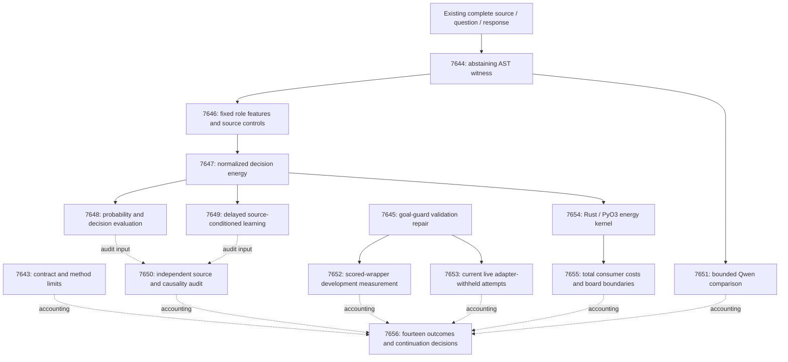

# Carnot Research Roadmap v667: Source witnesses and retained decisions

**Created:** 2026-09-25  
**Milestone:** 2026.09.667  
**Title:** Source-backed constraint witnesses, retained decision learning, and live planner validation  
**Status:** Staged design; experiments not executed or activated  
**Supersedes:** 2026.09.666, exp7629–exp7642  
**Previous design:** `research-roadmap-v666-preserved-20260925.md`, preserved byte for byte  
**Execution authority:** `research-roadmap-next.yaml`, or the activated roadmap with this milestone  
**Contract:** exactly **14 tasks, exp7643 through exp7656**, in the order below, across **four phases**.

## What v666 proved

The conductor handled all fourteen tasks. Seven ran to terminal artifacts;
seven were pre-gated or cascade-skipped. The completed-history file currently
ends at V665; V666's active roadmap, artifacts, conductor log and capstone are
the authority for its terminal state. Conductor `OK` does not mean scientific
success.

| Work | Evidence | Established finding and boundary |
|---|---|---|
| Contract | Exp7629 | Contract and method ingestion completed. This is readiness, not measured model quality. |
| Owned launch | Exp7630 | Ownership, CPU-isolated preflight and launch protocol passed. Current capacity was unavailable. |
| Schema pilot | Exp7631 | `complete_blocked_owned_cuda_capacity`; zero current model calls. An unrelated llama-server occupied about 17.9 GiB on the visible card. The foreign-process veto worked. |
| Capture and learning | Exp7632–7637 | Three pre-gate receipts exist under names without `v666`; head, evaluation and learning producers are absent. There is no measured new evidence or learning null. |
| Independent audit | Exp7638 | `complete_blocked_v666_scientific_producers_unavailable`; it preserved the missing evidence. |
| ARC goal guard | Exp7639 | `complete_disqualified_planner_goal_guard_validation_failed`. Focused validation had three setup errors from missing pytest parent directories; coverage was 72%; a dictionary-valued execution venue triggered a critical reader finding. |
| ARC wrapper | Exp7640 | Pre-gated on invalid Exp7639 evidence; no current wrapper result. |
| Native consumer | Exp7641 | `complete_null_native_consumer_ready`; an opt-in typed client passed package/native and durability checks. No new speed claim. |
| Closure | Exp7642 | `complete_blocked_required_v666_external_evidence`; fourteen dispositions accounted. |

Exp7627's earlier total-cost ratio remains 7.8270x, CI95 [7.2843, 8.3826], on
its dated workload. Its separate 10x requirement failed. It cannot establish
the speed of a new source-verification pipeline.

The natural next step is to measure an available new discriminator. Exp7602
already provides complete numbered source code, questions and responses in
separate predictor/evaluator stores. An AST-based witness can test a narrow
claim about a symbol or line without another model call. It cannot prove
arbitrary prose. That boundary is part of the experiment, not an omission to
hide with a general verifier label.

## Three largest gaps to the PRD vision

1. **Extracted constraints must refer to the supplied evidence (FR-01,
   FR-12).** Existing scalar calibration has valid nulls; generated evidence
   has repeatedly failed before measurement. Test source-derived structural
   witnesses, preserve unknowns, then measure incremental decision value
   against scalar-only and cheap structural controls.
2. **Learning must improve future decisions and survive restart (FR-06,
   FR-11).** A state update is not evidence of learning. Test prediction before
   delayed feedback, source-conditioned updates, independent admission,
   held-back retention and a matched scalar-only learner.
3. **Verified models must lead to useful live search (FR-07, FR-12; ARC
   north star).** Goal-safe dedup has not passed this milestone's terminal
   validation. Requalify its concrete defects, measure the actual wrapper,
   then run a small adapter-withheld live case series with current induction.

FR-05/FR-08 and NFR-01 support these goals: port the small normalized energy
kernel, test real PyO3 parity and measure total consumer costs. A faster exact
kernel cannot establish a learned-verifier advantage.

## Research adopted before design

The dated V667 review was appended to `research-references.md` before these
experiments were designed. It covers the eight requested topics and all six
secondary channels. It distinguishes abstracts, methods read, rechecks and
unavailable citation endpoints.

| Source | Concrete adoption | Experiments |
|---|---|---|
| [Static-analysis study](https://arxiv.org/abs/2604.07755), April 2026; [Hallucination Inspector](https://arxiv.org/abs/2604.20202), April 2026 | New leads. AST/symbol witnesses with explicit coverage and unknowns. Supplied Python source is a local adaptation, not API-migration replication. | 7644, 7646, 7648 |
| [EAEV](https://arxiv.org/html/2609.08267v1), September 2026; [Beyond Document Grounding](https://arxiv.org/abs/2607.00895), July 2026 | Preserve source offsets, injected-label provenance and exposure limits; test erasure and source derangement. | 7646–7650 |
| [Calibeating Made Simple](https://arxiv.org/html/2603.22167v1), March 2026; [Proper Calibeating](https://arxiv.org/abs/2605.26703), May 2026 | Source-conditioned proper-loss updates and scalar-only controls; no theorem claim for delayed admission. | 7647–7650 |
| [JSONSchemaBench](https://arxiv.org/abs/2501.10868), January 2025 | Separate grammar validity, structural correctness, cost and unsupported semantics. | 7651 |
| [EBT](https://arxiv.org/abs/2507.02092), July 2025; [ARM–EBM](https://arxiv.org/abs/2512.15605), December 2025/May 2026 | Small conditional energy, exact binary normalization; generator stays frozen. | 7647, 7654 |
| [FPGA–ASIC co-design](https://arxiv.org/abs/2602.15985), February 2026 | Include source parsing, calls and persistence in the cost denominator. | 7655 |

T-SKM-Net/PAL feasibility layers, KAC/spline-local KAN updates, reward-guided
decoding and the Ising learning-to-sample complexity result stay in the method
map. None justifies a new architecture before source-signal value is measured.
Extropic's September Z1T release remains a vendor claim without local access.
Kona's page redirected; no reproducible checkpoint was verified. Semantic
Scholar citation endpoints failed, and trending/feed pages were cached. No
exhaustive literature or citing-paper census is claimed.

## v667 architecture



Solid arrows are readiness dependencies. Dotted arrows are evidence collection,
not pre-gates. No CPU training, evaluation or learning task depends on Qwen or
GPU availability. The two model tasks each recheck current exclusive capacity;
a historical launch receipt is not a reservation. Neither model task gates any
other experiment.

## Phase 1: Qualify the two reusable methods — exp7643–exp7645

**Exp7643** binds the complete task contract and ingests the source-analysis
methods. It preserves V666's external blocks and validation defects and tests
contract mutations. It is not an upstream science gate.

**Exp7644** builds a narrow source-claim witness. At least 48 independently
annotated adversarial fixtures test lossless numbered-code extraction, scoped
AST symbols, explicit line/raise/call assertions and quoted-code membership.
Comments, strings, duplicate names, partial files, aliases, Unicode and dynamic
lookup must not produce false proof. Only a complete, unambiguous closed scope
permits absence to count as contradiction. Unchecked sentence content remains
unknown. This is exact fixture qualification, so positive fixture evidence is
`circular_positive`.

**Exp7645** reproduces and fixes the two recorded Exp7639 validation defects.
It validates the current goal-before-dedup behavior through the live mask and
cold-directory runner. The old disqualified artifact remains unchanged.
Passing fixture tests enables wrapper and live experiments, not solve credit.

## Phase 2: Measure source information and static decisions — exp7646–exp7648

**Exp7646** uses the existing Exp7602 roster: fit80, tune20, policy20, online80
and evaluation40, plus eight disjoint pilot groups. Fit remains split into 64
optimization and 16 anchor groups. It computes source witnesses on every group
with original-source, erased-source and fixed within-role deranged-source
controls. Unknown or unparsable groups remain in the denominator. Completeness
of rows is readiness; zero structural coverage is a valid scientific null.

**Exp7647** fits a small normalized two-state energy using independent dataset
labels. Its residual is bounded around the inherited probability offset.
Fit64 trains it; tune20 selects at most six prespecified configurations;
policy20 fixes decision thresholds. Identity probability, scalar calibration,
a cheap structural rule and a matched-capacity source-erased head are controls.
No full-answer text ranker or generator update is included. A head with no
useful source feature becomes an explicit identity fallback.

**Exp7648** scores all evaluation40 groups with frozen heads and thresholds.
It reports proper losses, AUROC where defined, cost, coverage and selective
errors. Per-source paired bootstrap intervals use 10,000 fixed-seed resamples.
Probability benefit needs lower CI95 of Brier(control) minus Brier(head)>0.01.
Utility separately needs lower CI95 of cost(control) minus cost(head)>0.01,
at non-escalation coverage>=0.20. Source dependence also requires improvement
over erased and deranged controls. The hierarchy is Brier, then utility;
remaining comparisons are exploratory. Forty previously exposed groups cannot
establish broad or fresh-confirmatory generalization.

## Phase 3: Test retention and real execution — exp7649–exp7653

**Exp7649** is the required continuous self-learning experiment. It conditions
proper-loss updates on source-witness states and compares equal-state-budget
scalar-only learning, a frozen head and a past-released-label control. The
online80 stream preserves the existing 40 update / 40 one-use admission split
and eight-event delay. Admission labels never train. Prediction, release,
candidate, admission, commit and rollback are separately recorded. Frozen
static benefit is not a prerequisite.

The causal Brier gate requires lower CI95 delta>0.01 against both frozen and
scalar-only controls, using blocks of eight events. Utility is a separate
cost/coverage test. Retention requires upper CI95 Brier degradation<=0.01 on
both evaluation40 and fit16 anchors. Restart midway, duplicate feedback and
interrupted writes must preserve acknowledged state. These are descriptive
finite-stream tests, not a calibeating theorem or a new prospective corpus.
Sparse CPU updates have a bounded Rust path; <1 microsecond arithmetic update
and <1 millisecond lookup are measured targets, not promised achievements.

**Exp7650** independently reduces new structural and learning evidence. It
runs even if producers fail, records exact missing evidence once, and attacks
label leakage, wrong-file witnesses, semantic overclaim, future-origin feedback,
role changes and inconsistent aggregate headlines. It does not rerun models.

**Exp7651** is an optional bounded Qwen challenge on eight disjoint pilots:
16 requests, each at most 512 output tokens. Compare explicit-schema prompting,
grammar-constrained generation and CPU structural witnesses. The full source
is retained; overflow is a recorded failure, not truncated evidence. Semantic
relations without independent truth remain unadjudicated. A new available
exclusive-capacity snapshot is mandatory after Exp7631's foreign-server block.
This task opens no downstream gate.

**Exp7652** measures goal-safe search on the complete eligible stall-window
census through E3AgentPolicy with actual live masks and disabled per-game
adapters. Baseline and HUD-dedup arms share start states and 20,000 engine-call
budgets; tie-breaking stays off. Separate runtime-induced engines from expert
controls. Additional induced-engine success without losing a previous success
supports only a development-proxy observation; report game-clustered intervals,
plan lengths, engine calls and costs. No live solve credit follows.

**Exp7653** runs a small current live case series: three identity-selected
games, two planner arms, one matched seed, six episodes. Per-game adapters and
source access are disabled. Each episode allows 128 actions, one actual Qwen
world-model induction up to 4096 output tokens, 20,000 planner calls and 400
seconds. Total episode budget is 2400 seconds plus at most 1200 seconds for
validation. Current induction-to-plan-to-action lineage is required. No
accepted/executed engine means a reachability null, not planner effectiveness.
Only the agent's own runtime discoveries use `live_agent_self_discovery`.
Three games support exploratory evidence, not a leaderboard claim. No current
CUDA capacity means a terminal resource block before loading.

## Phase 4: Measure the deployment boundary and reconcile — exp7654–exp7656

**Exp7654** ports the small normalized energy/decision kernel to Rust/PyO3.
Python retains AST extraction; the Rust input is the canonical numeric witness
vector. At least 64 boundary/random fixtures and 240 corpus rows test actual
extension parity, error behavior and cold head reload. Integer metadata matches
exactly; energy/probability tolerance is 1e-10. A null scientific head can still
qualify functional parity. No speed claim is made here.

**Exp7655** compares whole Python and native consumers at batches 1/8/32,
30 randomized paired process blocks per batch. It measures source parsing,
indexing, lookup, scoring, decisions and persistence as exclusive phases.
Cold and warm caches stay separate; keys bind source bytes, schema, parser and
file scope. Total speed benefit needs lower CI95>1.10; NFR-01 separately needs
lower CI95>=10. A kernel-only ratio cannot meet either consumer gate. Hardware
continuity records all board scopes without repeating unchanged physical work.

**Exp7656** accounts for all fourteen dispositions and independently reduces
eligible results. External missing science is `blocked`, never `partial`.
It gives each mechanism a keep/change/retire decision and a falsifiable reopen
condition. Publication G1–G4 remain unchanged. The capstone neither activates
a new roadmap nor publishes anything externally.

## Hardware requirements and execution budget

| Tasks | Required substrate | Resource and runtime boundary |
|---|---|---|
| 7643–7650, 7652 | Host CPU and existing source/ARC artifacts | No LLM load; JAX CPU for small head fitting. About 25–45 minutes per task including scoped validation. |
| 7651 | One exclusive RTX 3090-class CUDA device and cached Qwen3.8-27B GGUF | At least the qualified launcher's 20,000 MiB free-memory floor and no foreign process; <=180-second lease wait. `model_bounded_generation`, 10-second floor; at most 8192 total output tokens. |
| 7653 | Same owned CUDA runtime plus local ARC SDK | `model_full_generation`, 60-second floor for real generative discovery; six bounded live episodes. No public submission. |
| 7654 | Host Rust toolchain and actual CPython/PyO3 extension | Real extension and serialized-head round trip; no board. |
| 7655 | Host CPU, actual extension and existing durable service | Whole-consumer process-block measurements; no GPU or board execution required. |
| 7656 | Host CPU | Aggregation and unchanged publication gate only. |

The inventory lists two RTX 3090 cards, but visibility and exclusive capacity
are per-task observations. Never infer a usable second device from inventory.
One model is mandated; DualGPURunner is not automatically applicable. Every
LLM task includes `unsloth/Qwen3.8-27B-GGUF` in `MODEL_SPECS`. No legacy model
supplies headline evidence. The model stays frozen.

The classifier follows actual work: small fixed-token probes are bounded;
actual live world-model generation is full generation. Embedding or load-only
probes, if separately proposed later, require `model_load_no_generation` with
its 2-second floor. A task blocked before load reports its actual no-load class
and keeps planned class/models separately. Never sleep to satisfy a floor.

KV260 retains its graduated FPGA-fabric scope and k_max<=5. PolarFire retains
Linux CPU dispatch only. GateMate retains the physical/JTAG `0xffffffff` block
until a dated operator physical-chain change. NPU and TSU remain unqualified.
The wishlist informs placement bounds, but no acquisition, SDK branch or new
bitstream is part of this milestone. FPGA matching is future work conditional
on measured workload size and end-to-end cost; no 100x acceleration is claimed.

## Evidence, retirement and execution rules

- Exact structural predicates are deterministic truth within their declared
  source scope. Dataset hallucination labels are separate evaluator evidence.
  A positive fixture is `circular_positive`. Learned utility cannot be credited
  by relabeling the same witness as both predictor and target.
- Every comparison emits rows for all independent units and arms, absolute
  losses/costs, missingness and provenance. Repeated arms, seeds and timings
  cannot inflate scientific sample size. Unknowns remain in aggregate costs.
- Every blocked result includes `gate_check_summary` with exact operands.
  `partial` is reserved for unfinished owned work. Every producer declares
  each consumed gate field verbatim. Gates admit valid null readiness and
  qualified fixture evidence, never flagged or disqualified artifacts.
- All failed-scope continuations carry four-field `prior_failures`, including
  `retire_if_same_verdict: true`. Standing 2026-05-29 overrides apply only to
  named forward differences or routine transition work. Unchanged importance
  anchoring, external text rankers, four-expert mixtures, empty supervisor
  refinement and retired GPU transport mechanisms remain closed.
- Emit flushed progress at each phase and before/after loads, generations,
  benchmarks and subprocesses. Long loops/waits report at least every 60
  seconds. Keep every gap below 600 seconds. Checkpoint completed units; no
  process except an owned child may be terminated.
- Write files over about 200 lines in multiple bounded tool calls with progress
  between them. Scratch stays in `/tmp`. No root scratch scripts, full-suite
  launch prerequisite, unchanged historical artifact rewrite or default flip.

## Validation and completion criteria

This planning change updates documents and task metadata only. Applicable
planning E2E is a cold read of staged YAML, Markdown table and machine block,
independent contract comparison and private mutation rejection. Numbered
runtime E2Es in `ops/e2e-test-plan.md` execute later: source verification maps
to E2E-005's verification boundary without claiming its generate/repair result;
portable energy maps to E2E-003/004. ARC uses the actual scored entrypoint;
learning tests predict/release/commit/restart through real reusable modules.

Before planning completion, run schema, prior-failure, gate, exclusion,
harness-fit, prompt-path, ARC and overdue-priority checks, scoped existing unit
tests, lint and affected-test spec coverage. Check protected active-roadmap and
conductor hashes. Exp7643 later owns runtime contract checks after activation.

Before each experiment can be accepted, spec-first tests, scoped lint/types,
100 percent changed-behavior coverage, the declared run command, fresh-process
reduction, adversarial verification and strict row consistency must pass.
The private pytest parent must exist. `execution_venue` is one of `host`,
`kv260`, `polarfire`, `gatemate`; details belong in a separate field. These
explicit checks address V666's observed failures.

Completion means fourteen faithfully accounted outcomes. Source benefit,
retained learning, live search usefulness and total speed have independent
acceptance gates. Missing one cannot be hidden by a positive result elsewhere.

## Exact Task Contract

Exactly fourteen tasks, exp7643 through exp7656. Every task remains part of
the contract even when resources or prerequisites block its execution.

| Order | Task ID | Exact title | Phase | Deliverable | Substrate class | Structured gate |
|---|---|---|---|---|---|---|
| 1 | exp7643-contract-methods | Bind fourteen tasks and source-witness method limits | 1 | results/experiment_7643_v667_contract_methods.json | aggregation | none |
| 2 | exp7644-source-witness-prototype | Qualify abstaining structural witnesses from supplied Python source | 1 | results/experiment_7644_v667_source_witness_prototype.json | no_model_load | none |
| 3 | exp7645-arc-validation-requalification | Requalify goal-safe planner checks with valid execution receipts | 1 | results/experiment_7645_v667_arc_validation_requalification.json | no_model_load | none |
| 4 | exp7646-source-feature-corpus | Measure structural coverage on every frozen source group | 2 | results/experiment_7646_v667_source_feature_corpus.json | no_model_load | exp7644-source-witness-prototype.witness_ready_score == 1; exp7644-source-witness-prototype.flagged_adversarial == false; exp7644-source-witness-prototype.verdict_class in ["null", "positive", "circular_positive"] |
| 5 | exp7647-witness-energy | Train a normalized source-witness decision energy | 2 | results/experiment_7647_v667_witness_energy.json | no_model_load | exp7646-source-feature-corpus.source_features_ready_score == 1; exp7646-source-feature-corpus.flagged_adversarial == false; exp7646-source-feature-corpus.verdict_class in ["null", "positive"] |
| 6 | exp7648-decision-evaluation | Measure source-witness probability and decision value | 2 | results/experiment_7648_v667_decision_evaluation.json | no_model_load | exp7647-witness-energy.energy_ready_score == 1; exp7647-witness-energy.flagged_adversarial == false; exp7647-witness-energy.verdict_class in ["null", "positive"] |
| 7 | exp7649-continuous-witness-learning | Measure delayed source-conditioned learning and retained decisions | 3 | results/experiment_7649_v667_continuous_witness_learning.json | no_model_load | exp7647-witness-energy.energy_ready_score == 1; exp7647-witness-energy.flagged_adversarial == false; exp7647-witness-energy.verdict_class in ["null", "positive"] |
| 8 | exp7650-independent-source-audit | Independently audit structural decisions and feedback causality | 3 | results/experiment_7650_v667_independent_source_audit.json | aggregation | none |
| 9 | exp7651-qwen-witness-challenge | Compare bounded Qwen evidence against structural witnesses | 3 | results/experiment_7651_v667_qwen_witness_challenge.json | model_bounded_generation | exp7644-source-witness-prototype.witness_ready_score == 1; exp7644-source-witness-prototype.flagged_adversarial == false; exp7644-source-witness-prototype.verdict_class in ["null", "positive", "circular_positive"] |
| 10 | exp7652-arc-wrapper-measurement | Measure goal-safe search through the scored ARC wrapper | 3 | results/experiment_7652_v667_arc_wrapper_measurement.json | no_model_load | exp7645-arc-validation-requalification.planner_goal_guard_ready_score == 1; exp7645-arc-validation-requalification.flagged_adversarial == false; exp7645-arc-validation-requalification.verdict_class in ["null", "positive", "circular_positive"] |
| 11 | exp7653-arc-live-generalization | Test goal-safe planning on adapter-withheld live attempts | 3 | results/experiment_7653_v667_arc_live_generalization.json | model_full_generation | exp7645-arc-validation-requalification.planner_goal_guard_ready_score == 1; exp7645-arc-validation-requalification.flagged_adversarial == false; exp7645-arc-validation-requalification.verdict_class in ["null", "positive", "circular_positive"] |
| 12 | exp7654-portable-witness-energy | Qualify a portable normalized witness-energy kernel | 4 | results/experiment_7654_v667_portable_witness_energy.json | no_model_load | exp7647-witness-energy.energy_ready_score == 1; exp7647-witness-energy.flagged_adversarial == false; exp7647-witness-energy.verdict_class in ["null", "positive"] |
| 13 | exp7655-consumer-cost-continuity | Measure whole-consumer costs and preserve board boundaries | 4 | results/experiment_7655_v667_consumer_cost_continuity.json | no_model_load | exp7654-portable-witness-energy.portable_kernel_ready_score == 1; exp7654-portable-witness-energy.flagged_adversarial == false; exp7654-portable-witness-energy.verdict_class in ["null", "positive"] |
| 14 | exp7656-capstone | Reconcile fourteen outcomes and decide each research continuation | 4 | results/experiment_7656_v667_capstone.json | aggregation | none |

<!-- V667-TASK-CONTRACT-BEGIN -->
```json
[
{"id": "exp7643-contract-methods", "title": "Bind fourteen tasks and source-witness method limits", "phase": 1, "deliverable": "results/experiment_7643_v667_contract_methods.json", "inference_substrate_class": "aggregation", "MODEL_SPECS": [], "gated_on": []},
{"id": "exp7644-source-witness-prototype", "title": "Qualify abstaining structural witnesses from supplied Python source", "phase": 1, "deliverable": "results/experiment_7644_v667_source_witness_prototype.json", "inference_substrate_class": "no_model_load", "MODEL_SPECS": [], "gated_on": []},
{"id": "exp7645-arc-validation-requalification", "title": "Requalify goal-safe planner checks with valid execution receipts", "phase": 1, "deliverable": "results/experiment_7645_v667_arc_validation_requalification.json", "inference_substrate_class": "no_model_load", "MODEL_SPECS": [], "gated_on": []},
{"id": "exp7646-source-feature-corpus", "title": "Measure structural coverage on every frozen source group", "phase": 2, "deliverable": "results/experiment_7646_v667_source_feature_corpus.json", "inference_substrate_class": "no_model_load", "MODEL_SPECS": [], "gated_on": [{"upstream": "exp7644-source-witness-prototype", "artifact_field": "witness_ready_score", "op": "==", "value": 1}, {"upstream": "exp7644-source-witness-prototype", "artifact_field": "flagged_adversarial", "op": "==", "value": false}, {"upstream": "exp7644-source-witness-prototype", "artifact_field": "verdict_class", "op": "in", "value": ["null", "positive", "circular_positive"]}]},
{"id": "exp7647-witness-energy", "title": "Train a normalized source-witness decision energy", "phase": 2, "deliverable": "results/experiment_7647_v667_witness_energy.json", "inference_substrate_class": "no_model_load", "MODEL_SPECS": [], "gated_on": [{"upstream": "exp7646-source-feature-corpus", "artifact_field": "source_features_ready_score", "op": "==", "value": 1}, {"upstream": "exp7646-source-feature-corpus", "artifact_field": "flagged_adversarial", "op": "==", "value": false}, {"upstream": "exp7646-source-feature-corpus", "artifact_field": "verdict_class", "op": "in", "value": ["null", "positive"]}]},
{"id": "exp7648-decision-evaluation", "title": "Measure source-witness probability and decision value", "phase": 2, "deliverable": "results/experiment_7648_v667_decision_evaluation.json", "inference_substrate_class": "no_model_load", "MODEL_SPECS": [], "gated_on": [{"upstream": "exp7647-witness-energy", "artifact_field": "energy_ready_score", "op": "==", "value": 1}, {"upstream": "exp7647-witness-energy", "artifact_field": "flagged_adversarial", "op": "==", "value": false}, {"upstream": "exp7647-witness-energy", "artifact_field": "verdict_class", "op": "in", "value": ["null", "positive"]}]},
{"id": "exp7649-continuous-witness-learning", "title": "Measure delayed source-conditioned learning and retained decisions", "phase": 3, "deliverable": "results/experiment_7649_v667_continuous_witness_learning.json", "inference_substrate_class": "no_model_load", "MODEL_SPECS": [], "gated_on": [{"upstream": "exp7647-witness-energy", "artifact_field": "energy_ready_score", "op": "==", "value": 1}, {"upstream": "exp7647-witness-energy", "artifact_field": "flagged_adversarial", "op": "==", "value": false}, {"upstream": "exp7647-witness-energy", "artifact_field": "verdict_class", "op": "in", "value": ["null", "positive"]}]},
{"id": "exp7650-independent-source-audit", "title": "Independently audit structural decisions and feedback causality", "phase": 3, "deliverable": "results/experiment_7650_v667_independent_source_audit.json", "inference_substrate_class": "aggregation", "MODEL_SPECS": [], "gated_on": []},
{"id": "exp7651-qwen-witness-challenge", "title": "Compare bounded Qwen evidence against structural witnesses", "phase": 3, "deliverable": "results/experiment_7651_v667_qwen_witness_challenge.json", "inference_substrate_class": "model_bounded_generation", "MODEL_SPECS": ["unsloth/Qwen3.8-27B-GGUF"], "gated_on": [{"upstream": "exp7644-source-witness-prototype", "artifact_field": "witness_ready_score", "op": "==", "value": 1}, {"upstream": "exp7644-source-witness-prototype", "artifact_field": "flagged_adversarial", "op": "==", "value": false}, {"upstream": "exp7644-source-witness-prototype", "artifact_field": "verdict_class", "op": "in", "value": ["null", "positive", "circular_positive"]}]},
{"id": "exp7652-arc-wrapper-measurement", "title": "Measure goal-safe search through the scored ARC wrapper", "phase": 3, "deliverable": "results/experiment_7652_v667_arc_wrapper_measurement.json", "inference_substrate_class": "no_model_load", "MODEL_SPECS": [], "gated_on": [{"upstream": "exp7645-arc-validation-requalification", "artifact_field": "planner_goal_guard_ready_score", "op": "==", "value": 1}, {"upstream": "exp7645-arc-validation-requalification", "artifact_field": "flagged_adversarial", "op": "==", "value": false}, {"upstream": "exp7645-arc-validation-requalification", "artifact_field": "verdict_class", "op": "in", "value": ["null", "positive", "circular_positive"]}]},
{"id": "exp7653-arc-live-generalization", "title": "Test goal-safe planning on adapter-withheld live attempts", "phase": 3, "deliverable": "results/experiment_7653_v667_arc_live_generalization.json", "inference_substrate_class": "model_full_generation", "MODEL_SPECS": ["unsloth/Qwen3.8-27B-GGUF"], "gated_on": [{"upstream": "exp7645-arc-validation-requalification", "artifact_field": "planner_goal_guard_ready_score", "op": "==", "value": 1}, {"upstream": "exp7645-arc-validation-requalification", "artifact_field": "flagged_adversarial", "op": "==", "value": false}, {"upstream": "exp7645-arc-validation-requalification", "artifact_field": "verdict_class", "op": "in", "value": ["null", "positive", "circular_positive"]}]},
{"id": "exp7654-portable-witness-energy", "title": "Qualify a portable normalized witness-energy kernel", "phase": 4, "deliverable": "results/experiment_7654_v667_portable_witness_energy.json", "inference_substrate_class": "no_model_load", "MODEL_SPECS": [], "gated_on": [{"upstream": "exp7647-witness-energy", "artifact_field": "energy_ready_score", "op": "==", "value": 1}, {"upstream": "exp7647-witness-energy", "artifact_field": "flagged_adversarial", "op": "==", "value": false}, {"upstream": "exp7647-witness-energy", "artifact_field": "verdict_class", "op": "in", "value": ["null", "positive"]}]},
{"id": "exp7655-consumer-cost-continuity", "title": "Measure whole-consumer costs and preserve board boundaries", "phase": 4, "deliverable": "results/experiment_7655_v667_consumer_cost_continuity.json", "inference_substrate_class": "no_model_load", "MODEL_SPECS": [], "gated_on": [{"upstream": "exp7654-portable-witness-energy", "artifact_field": "portable_kernel_ready_score", "op": "==", "value": 1}, {"upstream": "exp7654-portable-witness-energy", "artifact_field": "flagged_adversarial", "op": "==", "value": false}, {"upstream": "exp7654-portable-witness-energy", "artifact_field": "verdict_class", "op": "in", "value": ["null", "positive"]}]},
{"id": "exp7656-capstone", "title": "Reconcile fourteen outcomes and decide each research continuation", "phase": 4, "deliverable": "results/experiment_7656_v667_capstone.json", "inference_substrate_class": "aggregation", "MODEL_SPECS": [], "gated_on": []}
]
```
<!-- V667-TASK-CONTRACT-END -->
