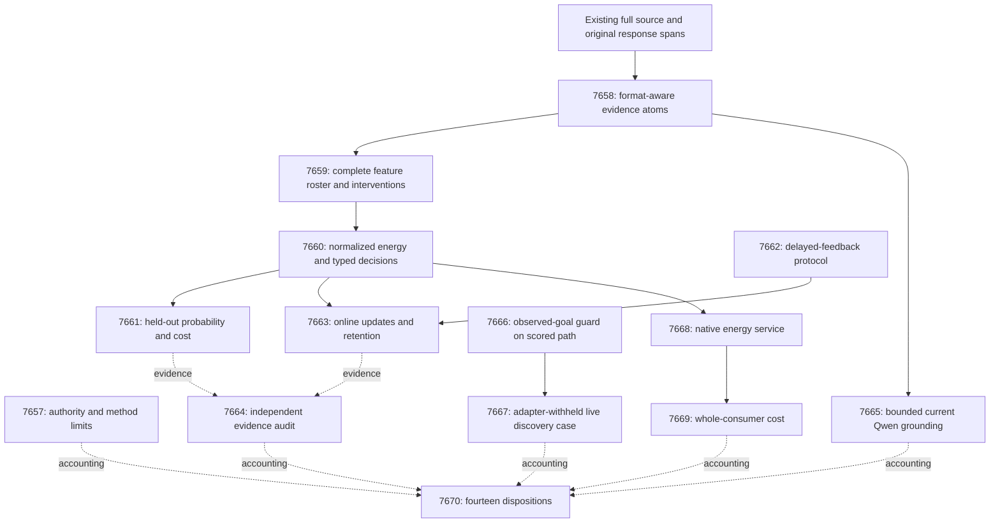

# Carnot Research Roadmap v668: Evidence formats before learned decisions

**Created:** 2026-09-25
**Milestone:** 2026.09.668
**Title:** Format-aware evidence, causal decision learning, and live goal confirmation
**Status:** Planned; not activated or executed
**Supersedes:** 2026.09.667, exp7643–exp7656
**Previous design:** `research-roadmap-v667-preserved-20260925.md`, preserved byte for byte
**Execution authority:** `research-roadmap-next.yaml`, then the activated roadmap with this milestone
**Contract:** exactly **14 tasks, exp7657 through exp7670**, in the order below, across **four phases**.

## What v667 proved

Completion means the conductor handled the task. It does not mean positive
science. Nine tasks have terminal producer artifacts. Exp7647 has a separate
pre-gate receipt. Four downstream producers are absent. The completed archive
currently ends at V666; the active V667 roadmap, artifacts and log establish
its terminal state.

| Work | Evidence | Finding and claim boundary |
|---|---|---|
| Contract | Exp7643 | Disqualified by a prompt-path check against consumed staging. The task list matched, but required validation failed. |
| Source witness | Exp7644 | Qualified exact fixtures only: `circular_positive`. It accepts an invented source/claim grammar. |
| Real corpus | Exp7646 | Raw rows show zero parseable scopes and zero checked predicates across 248 groups. Coverage was 39%; format and methodology checks failed. The artifact is disqualified, not eligible accuracy evidence. |
| Decision/learning chain | Exp7647–7649, Exp7650 | Head pre-gated; evaluation and learning producers absent. The independent audit records an external block. There is no measured learning null. |
| Bounded Qwen pilot | Exp7651 | Sixteen current generations on eight groups completed through owned CUDA. This establishes transport, not semantic verification or calibrated benefit. |
| Goal-safe dedup | Exp7645, Exp7652 | Guard fixtures qualified. Wrapper evidence was disqualified by a failing global suite. Raw induced-engine comparisons showed no extra success. |
| Live ARC | Exp7653 | Six current inductions; none accepted, no plan executed. The planner lever was unreachable. Added global-suite validation also disqualified the result. |
| Native extension/cost | Exp7654–7655 | No producer artifacts after the upstream block. No new portability or speed result. |
| Capstone | Exp7656 | Fourteen dispositions accounted; required external science remains blocked. |

The source failure has a specific cause. The old parser needs
`python file=...` fences, `1 | ...` lines, and a fixed `In ...` claim grammar.
Real pilot inputs include `1: ...` lines, ordinary fences, stack traces, grep
rows and prose. Another head trained on zero features cannot answer the PRD.
The next mechanism indexes real evidence and preserves original claim spans.
It never turns a lexical match into proof of an entire sentence.

## Three biggest gaps to the PRD vision

1. **Ground constraints in actual evidence — FR-01/FR-12.** Qualified toy
   syntax did not cover real sources. Measure typed source atoms, explicit
   unknowns, source interventions and independent answer-label value.
2. **Improve future decisions through learning — FR-06/FR-11.** Neither a
   checkpoint nor better calibration on old data proves self-improvement.
   Test prediction before delayed feedback, one-use admission, restart,
   retention and matched scalar-only learning.
3. **Verify useful live outcomes — FR-07/FR-12.** Correct transitions can
   coexist with a wrong induced win condition. Harden the scored agent's
   observed-goal boundary and measure actual guard opportunities. Keep
   model acceptance, goal prediction and SDK-confirmed completion distinct.

FR-05/FR-08 and NFR-01 support these goals. A native implementation must
preserve the learned head and measure the whole consumer, including parsing
and durability. A fast kernel cannot establish verifier quality.

## Research adopted before design

The V668 review was appended to `research-references.md` before this design.
It covers the eight requested topics and all six secondary channels.
Most useful papers were already logged; their adoption changes because the
local format mismatch is now explicit.

| Source | Adopted experiment component | Tasks |
|---|---|---|
| [EAEV](https://arxiv.org/abs/2609.08267), September 2026; [static-analysis limits](https://arxiv.org/abs/2604.07755), April 2026 | Original evidence spans, narrow propositions, abstention and counterfactual source controls | 7658–7661, 7665 |
| [EBT](https://arxiv.org/abs/2507.02092), July 2025; [ARM–EBM](https://arxiv.org/abs/2512.15605), revised May 2026 | Small conditional energy with exact normalization; frozen generator | 7660, 7668 |
| [Calibeating Made Simple](https://arxiv.org/html/2603.22167v1), March 2026; [intermittent feedback](https://arxiv.org/abs/2503.10345), March 2025 | Proper-loss updates, explicit feedback delays and omissions, separate retention measurement | 7662–7664 |
| [JSONSchemaBench](https://arxiv.org/abs/2501.10868), January 2025 | Separate valid pointers from independently grounded propositions | 7665 |
| [World Action Verifier](https://arxiv.org/abs/2604.01985), April 2026 | Distinguish reachability, predicted state and actual completion; reuse existing cycle verifier | 7666–7667 |
| [FPGA/ASIC co-design](https://arxiv.org/abs/2602.15985), February 2026; [Z1T](https://extropic.ai/writing/z1t), September 2026 | Explicit host/device cost boundaries and deployment limits | 7669 |

T-SKM-Net, KAC/KAN-CL, the Ising sampling complexity result, VFScale and
WorldCycle remain contextual. No unchanged importance-anchor, general text
ranker, new sampler, or reversible-action assumption is introduced. Z1T's
estimates exclude some end-to-end costs and are vendor evidence. Semantic
Scholar citation APIs failed; no exhaustive citing-paper census is claimed.
OpenReview's forum challenged retrieval; its paper PDF was indexed. Kona's
page failed direct retrieval. Cached feeds/trending pages established no new
local dependency or hardware access.

## v668 architecture



Solid arrows are structured readiness gates. Dotted arrows collect evidence
without preventing an audit from explaining missing inputs. CPU learning does
not depend on either GPU task. The causal protocol and ARC guard are independent
of source-head success. Static benefit never gates online measurement.

## Phase 1: Qualify real evidence — exp7657–exp7659

**Exp7657** compares the complete contract and records V667's fourteen
outcomes. It tests both staged and activated authority paths, including the
absence of consumed staging. It ingests method limits and gates no science.

**Exp7658** replaces the invented grammar with typed evidence from real tool
outputs. It supports numbered Python, grep records, stack frames and plain
fences. Original answer spans remain unchanged. At least 64 independently
labelled adversarial fixtures test offsets, file ambiguity, scope, missing
records, negation and unsupported semantics. Four of eight real pilot groups
must yield checked propositions before readiness. Exact fixtures remain
`circular_positive`; whole-answer certification is forbidden.

**Exp7659** measures all 248 groups under original, erased and deranged source.
The existing roles stay fixed: fit80, tune20, policy20, online80, evaluation40,
plus pilot8. Fit has 64 optimization and 16 anchor groups. Label-blind workers
cannot read evaluator sidecars. At least sixteen fit groups need checked,
nonconstant evidence before training readiness. Unknowns remain denominator
rows. Evaluation labels cannot choose this gate or supported claim forms.

## Phase 2: Freeze decisions and causal updates — exp7660–exp7662

**Exp7660** trains a bounded residual two-state energy from independent answer
labels. It normalizes exactly: p(y|x)=exp(-E(x,y))/sum_z exp(-E(x,z)). Fit64
trains; tune20 selects at most six fixed configurations; policy20 fixes action
costs and accept/reject/escalate thresholds. Identity, scalar calibration,
cheap atom rules and a capacity-matched source-erased head are controls.
A valid identity fallback permits evaluation. This meets the calibrated
decision training floor without updating the mandated generator.

**Exp7661** evaluates all forty exposed evaluation groups with frozen heads.
It reports Brier, log loss, discrimination, coverage and cost per group.
Use 10,000 fixed-seed paired bootstrap resamples. Probability benefit needs
lower CI95 Brier reduction >0.01 against every registered control. Utility
separately needs lower CI95 cost reduction >0.01 at non-escalation coverage
>=0.20. Deranged-source comparisons must support source dependence. Tests
follow a fixed hierarchy; no tuning follows evaluation. Findings remain
exploratory because these groups were exposed in earlier milestones.

**Exp7662** qualifies the continuous-learning lifecycle independently of head
availability. It uses at most eight fixed evidence strata with bounded state.
Predictions precede feedback by eight events. Forty online groups train;
forty are one-use admission checks. After each five released update labels,
a candidate uses the next five untouched admission labels once. Those labels
never train. At least 64 event fixtures check missing, duplicate, premature
and out-of-order feedback, acknowledgments, rollback and crash recovery.

## Phase 3: Measure learning and actual execution — exp7663–exp7667

**Exp7663** runs the eighty-event online stream with source-conditioned,
scalar-only, frozen and past-released-label controls. A fixed omission stress
arm withholds every fourth feedback event. No future-origin label is shuffled
into training. Admit only candidates with lower paired admission Brier and
no higher cost. Exhausted admission blocks stop further updates.

Restart after event forty. Compare the final state once on evaluation40 and
fit16 anchors. Causal benefit needs lower block-bootstrap CI95 Brier reduction
>0.01 against frozen and scalar-only controls. Cost/coverage are separate.
Retention needs upper CI95 Brier degradation <=0.01 on both anchor sets.
Eight-event blocks expose the small effective sample. The hardware path is
bounded CPU counters now, native batches next; no 100x gain is assumed.

**Exp7664** independently recomputes current coverage, probabilities, costs,
feedback chronology and retention. Private corruption tests must catch label
leakage, reused admission groups, lost unknowns and altered arms. Absent new
producers produce a blocked record, never a fabricated scientific null.

**Exp7665** tests grounded Qwen proposals. Twenty-four sources comprise eight
historical pilots and sixteen independent fixture sources, reported separately.
Compare source-only schema prompting with the same prompt plus label-free atoms.
Forty-eight calls have a 256-token limit each: at most 12,288 output tokens.
This is **bounded generation**, with independent narrow predicate annotations.
Schema validity, grounded proposition precision, residual semantics and cost
are different metrics. No broad whole-answer benefit is claimed.

**Exp7666** qualifies a reusable observed-goal guard through the scored factory.
It reuses existing checks where present. A predicted plan endpoint is compared
with actual SDK completion after existing animation-settling rules. Confirmed
contradiction returns to existing generic recovery. Unknown observations stay
unknown. At least 48 fixtures cover wrong goals despite correct dynamics,
transitions, stale frames and disabled-flag parity. Defaults and model acceptance
stay unchanged. This satisfies the ARC reusable-method hardening floor.

**Exp7667** measures one adapter-withheld live self-discovery case with current
Qwen induction. A fixed hash salt selects the game before outcomes. No adapters,
stored engines, known routes or game source may enter. Use current live model
settings; do not raise live token budgets or impose the old experiment-only
4,096-token truncation. One real generation may use at most 2,400 seconds.
The episode has 3,000 seconds, 256 actions and 20,000 engine calls; validation
gets 900 seconds. Generation is full, not a canary.

The same observations support a shadow comparison of goal-only and confirmed
goal decisions. They do not support counterfactual solve rates. No accepted
engine or goal assertion means insufficient opportunities. One public game
cannot establish hidden-game generalization. Any actual level solve requires
live-agent provenance, registry precheck and trace reproduction; duplicates
receive no credit.

## Phase 4: Preserve semantics and measure total cost — exp7668–exp7670

**Exp7668** reuses the real Rust/PyO3 decision service for the frozen energy
head. All stored source conditions and 1,000 boundary fixtures require exact
typed actions and probability error <=1e-10. Test real extension loading,
serialization, independent clients and acknowledged feedback after restart.
No head substitution or Python-only proxy can qualify the native result.

**Exp7669** compares whole consumers with identical data and durability.
Twenty randomized paired process blocks cover batches 1/16/64, cold/warm
caches, parsing, indexing, calls, scoring and persistence. Lower CI95 total
speed ratio >1.10 is the local benefit gate; >=10 is the separate NFR-01 gate.
Neither can be met by kernel-only timings. Host bottleneck bounds are labelled
estimates, not FPGA projections presented as measurements.

**Exp7670** reconciles exactly fourteen outcomes and independently reduces
eligible rows. It separates coverage, decision value, retained learning, live
goal opportunities and cost. Each mechanism gets a keep/change/retire decision
and a falsifiable changed premise. Missing external science is `blocked`, not
`partial`. Stable publication G1–G4 remain unchanged; nothing is published.

## Hardware requirements and budgets

| Tasks | Required resources | Boundaries |
|---|---|---|
| 7657–7664, 7666 | Host CPU, existing source artifacts and local SDK for fixtures | No model load. Small JAX heads run on CPU. Typical task budget 25–40 minutes including checks. |
| 7665 | One exclusively owned CUDA device; cached Qwen3.8-27B GGUF | Bounded generation; 1,800 seconds generation plus 600 validation. Lease wait <=180 seconds. |
| 7667 | Same CUDA runtime plus actual ARC SDK | Full generation; 3,000-second episode plus 900 validation. Lease wait <=180 seconds. |
| 7668–7669 | Host Rust toolchain, actual interpreter-specific PyO3 extension | Parity, durability and measured whole-consumer costs. No board run. |
| 7670 | Host CPU | Aggregation only. |

The inventory lists two RTX 3090 cards. Each task must observe current visibility,
capacity and process ownership. Use the qualified launcher's memory requirement,
not a guessed available device. Do not kill or share foreign workloads. One
mandated model does not require DualGPURunner. Both LLM tasks name
`unsloth/Qwen3.8-27B-GGUF`; small legacy models cannot supply headline results.

Classes describe actual work: `model_full_generation` has a 60-second floor,
`model_bounded_generation` 10 seconds, and `model_load_no_generation` 2 seconds.
No load-only experiment is planned. A blocked-before-load task records actual
`blocked_no_run` and retains planned class/models separately. Never pad time.

The hardware wishlist informs deployment, not new purchases. Preserve KV260's
graduated FPGA-fabric scope with k_max<=5, PolarFire's Linux CPU-dispatch scope,
and GateMate's physical/JTAG block until a dated operator change. NPU and TSU
remain unqualified. Native service work supports later acceleration only if
whole-consumer measurements justify it. No repeated unchanged board probes.

## Evidence and failure discipline

All comparative tasks require per-unit rows. Producers declare consumed gate
fields verbatim. Readiness requires current validity; a failed required check
sets readiness to zero. Structured gates also check class and adversarial flags.
Exact fixture truth is circular; independent answer labels govern learned value.
Unknowns, truncations and unfinished cases remain in denominators.

Every failed-scope continuation names its predecessor and changed premise with
`retire_if_same_verdict: true`. Some V667 tasks were cascade-skipped and have no
honest_verdict. Their lineage records `not_emitted_cascade_skipped` explicitly
as a custody state, not an invented producer verdict. Repeated unchanged science
retires; environmental absence is not evidence that the method failed. No retired
ID is reused or required. Unchanged text-reranker, anchoring and transport scopes
remain closed. Any linter false match needs the exact standing-authority rationale.

Every prompt has numbered progress and bounded-write steps. Flush at phase
boundaries and before/after long calls. Print inside loops and waits every sixty
seconds; keep all gaps below 600 seconds. Checkpoint completed units. Write files
over about 200 lines in several calls, with progress between them.

## Validation and completion

This is a planning-only change. Its E2E is independent cold comparison of YAML,
Markdown table and machine contract, plus private deletion, reorder and gate-field
mutations. Run existing roadmap/gate/exclusion unit tests, schema, failure-lineage,
harness-fit, prompt-path, ARC and overdue-priority readers, and affected-test spec
coverage. Check active-roadmap and conductor hashes. No implementation test suite
or live benchmark is implied to have run during planning.

Future tasks freeze affected validation before measurement. They require tests
first, full changed-behavior coverage, scoped lint/types, an actual run, cold row
reduction, adversarial verification and strict row consistency. Preserve global
suite failures separately; do not erase or quietly reclassify any required check.
E2E-003/004 apply to native round trips. E2E-011/013 apply to ARC telemetry and
scored-path parity. Source and learning tasks declare their complete raw-input,
label-isolation, decision, feedback and restart E2Es. Source verification does
not claim E2E-005's separate generate/repair product benefit.

Done means fourteen accounted outcomes, with independent decisions about science,
readiness and deployment. It does not mean all research gates must be positive.

## Exact Task Contract

Exactly fourteen tasks, exp7657 through exp7670, in this conductor order.
Blocked tasks remain part of the contract. The JSON block is machine-readable.

| Order | Task ID | Exact title | Phase | Deliverable | Substrate class |
|---|---|---|---|---|---|
| 1 | exp7657-contract-methods | Bind fourteen tasks and distinguish evidence-format failure from scientific nulls | 1 | results/experiment_7657_v668_contract_methods.json | aggregation |
| 2 | exp7658-evidence-atoms | Qualify source atoms on actual tool-output formats and original claims | 1 | results/experiment_7658_v668_evidence_atoms.json | no_model_load |
| 3 | exp7659-atom-corpus | Measure grounded atom coverage across the complete frozen source roster | 1 | results/experiment_7659_v668_atom_corpus.json | no_model_load |
| 4 | exp7660-atom-energy | Train a normalized evidence-conditioned policy for typed decisions | 2 | results/experiment_7660_v668_atom_energy.json | no_model_load |
| 5 | exp7661-decision-evaluation | Measure incremental source evidence in probabilities and decision costs | 2 | results/experiment_7661_v668_decision_evaluation.json | no_model_load |
| 6 | exp7662-delayed-update-protocol | Qualify causal source-conditioned updates and durable feedback handling | 2 | results/experiment_7662_v668_delayed_update_protocol.json | no_model_load |
| 7 | exp7663-continuous-atom-learning | Measure delayed evidence learning and retention after restart | 3 | results/experiment_7663_v668_continuous_atom_learning.json | no_model_load |
| 8 | exp7664-independent-evidence-audit | Independently audit grounded decisions and delayed feedback causality | 3 | results/experiment_7664_v668_independent_evidence_audit.json | aggregation |
| 9 | exp7665-qwen-grounded-claims | Test Qwen grounded claim proposals against independently checked source atoms | 3 | results/experiment_7665_v668_qwen_grounded_claims.json | model_bounded_generation |
| 10 | exp7666-arc-goal-confirmation | Qualify observed-goal confirmation in the live ARC planning path | 3 | results/experiment_7666_v668_arc_goal_confirmation.json | no_model_load |
| 11 | exp7667-arc-live-goal-observation | Measure goal confirmation during adapter-withheld live self-discovery | 3 | results/experiment_7667_v668_arc_live_goal_observation.json | model_full_generation |
| 12 | exp7668-native-atom-energy | Expose frozen evidence energy through the existing native decision service | 4 | results/experiment_7668_v668_native_atom_energy.json | no_model_load |
| 13 | exp7669-whole-consumer-cost | Measure complete evidence-service cost and preserve hardware boundaries | 4 | results/experiment_7669_v668_whole_consumer_cost.json | no_model_load |
| 14 | exp7670-capstone | Reconcile fourteen outcomes and decide evidence, learning and goal-confirmation scope | 4 | results/experiment_7670_v668_capstone.json | aggregation |

<!-- V668-TASK-CONTRACT-BEGIN -->
```json
[
{"id": "exp7657-contract-methods", "title": "Bind fourteen tasks and distinguish evidence-format failure from scientific nulls", "phase": 1, "deliverable": "results/experiment_7657_v668_contract_methods.json", "inference_substrate_class": "aggregation", "MODEL_SPECS": [], "gated_on": []},
{"id": "exp7658-evidence-atoms", "title": "Qualify source atoms on actual tool-output formats and original claims", "phase": 1, "deliverable": "results/experiment_7658_v668_evidence_atoms.json", "inference_substrate_class": "no_model_load", "MODEL_SPECS": [], "gated_on": []},
{"id": "exp7659-atom-corpus", "title": "Measure grounded atom coverage across the complete frozen source roster", "phase": 1, "deliverable": "results/experiment_7659_v668_atom_corpus.json", "inference_substrate_class": "no_model_load", "MODEL_SPECS": [], "gated_on": [{"upstream": "exp7658-evidence-atoms", "artifact_field": "atom_protocol_ready_score", "op": "==", "value": 1}, {"upstream": "exp7658-evidence-atoms", "artifact_field": "flagged_adversarial", "op": "==", "value": false}, {"upstream": "exp7658-evidence-atoms", "artifact_field": "verdict_class", "op": "in", "value": ["null", "positive", "circular_positive"]}]},
{"id": "exp7660-atom-energy", "title": "Train a normalized evidence-conditioned policy for typed decisions", "phase": 2, "deliverable": "results/experiment_7660_v668_atom_energy.json", "inference_substrate_class": "no_model_load", "MODEL_SPECS": [], "gated_on": [{"upstream": "exp7659-atom-corpus", "artifact_field": "atom_features_ready_score", "op": "==", "value": 1}, {"upstream": "exp7659-atom-corpus", "artifact_field": "flagged_adversarial", "op": "==", "value": false}, {"upstream": "exp7659-atom-corpus", "artifact_field": "verdict_class", "op": "in", "value": ["null", "positive"]}]},
{"id": "exp7661-decision-evaluation", "title": "Measure incremental source evidence in probabilities and decision costs", "phase": 2, "deliverable": "results/experiment_7661_v668_decision_evaluation.json", "inference_substrate_class": "no_model_load", "MODEL_SPECS": [], "gated_on": [{"upstream": "exp7660-atom-energy", "artifact_field": "energy_ready_score", "op": "==", "value": 1}, {"upstream": "exp7660-atom-energy", "artifact_field": "flagged_adversarial", "op": "==", "value": false}, {"upstream": "exp7660-atom-energy", "artifact_field": "verdict_class", "op": "in", "value": ["null", "positive"]}]},
{"id": "exp7662-delayed-update-protocol", "title": "Qualify causal source-conditioned updates and durable feedback handling", "phase": 2, "deliverable": "results/experiment_7662_v668_delayed_update_protocol.json", "inference_substrate_class": "no_model_load", "MODEL_SPECS": [], "gated_on": []},
{"id": "exp7663-continuous-atom-learning", "title": "Measure delayed evidence learning and retention after restart", "phase": 3, "deliverable": "results/experiment_7663_v668_continuous_atom_learning.json", "inference_substrate_class": "no_model_load", "MODEL_SPECS": [], "gated_on": [{"upstream": "exp7660-atom-energy", "artifact_field": "energy_ready_score", "op": "==", "value": 1}, {"upstream": "exp7660-atom-energy", "artifact_field": "flagged_adversarial", "op": "==", "value": false}, {"upstream": "exp7660-atom-energy", "artifact_field": "verdict_class", "op": "in", "value": ["null", "positive"]}, {"upstream": "exp7662-delayed-update-protocol", "artifact_field": "delayed_protocol_ready_score", "op": "==", "value": 1}, {"upstream": "exp7662-delayed-update-protocol", "artifact_field": "flagged_adversarial", "op": "==", "value": false}, {"upstream": "exp7662-delayed-update-protocol", "artifact_field": "verdict_class", "op": "in", "value": ["null", "positive", "circular_positive"]}]},
{"id": "exp7664-independent-evidence-audit", "title": "Independently audit grounded decisions and delayed feedback causality", "phase": 3, "deliverable": "results/experiment_7664_v668_independent_evidence_audit.json", "inference_substrate_class": "aggregation", "MODEL_SPECS": [], "gated_on": []},
{"id": "exp7665-qwen-grounded-claims", "title": "Test Qwen grounded claim proposals against independently checked source atoms", "phase": 3, "deliverable": "results/experiment_7665_v668_qwen_grounded_claims.json", "inference_substrate_class": "model_bounded_generation", "MODEL_SPECS": ["unsloth/Qwen3.8-27B-GGUF"], "gated_on": [{"upstream": "exp7658-evidence-atoms", "artifact_field": "atom_protocol_ready_score", "op": "==", "value": 1}, {"upstream": "exp7658-evidence-atoms", "artifact_field": "flagged_adversarial", "op": "==", "value": false}, {"upstream": "exp7658-evidence-atoms", "artifact_field": "verdict_class", "op": "in", "value": ["null", "positive", "circular_positive"]}]},
{"id": "exp7666-arc-goal-confirmation", "title": "Qualify observed-goal confirmation in the live ARC planning path", "phase": 3, "deliverable": "results/experiment_7666_v668_arc_goal_confirmation.json", "inference_substrate_class": "no_model_load", "MODEL_SPECS": [], "gated_on": []},
{"id": "exp7667-arc-live-goal-observation", "title": "Measure goal confirmation during adapter-withheld live self-discovery", "phase": 3, "deliverable": "results/experiment_7667_v668_arc_live_goal_observation.json", "inference_substrate_class": "model_full_generation", "MODEL_SPECS": ["unsloth/Qwen3.8-27B-GGUF"], "gated_on": [{"upstream": "exp7666-arc-goal-confirmation", "artifact_field": "goal_confirmation_ready_score", "op": "==", "value": 1}, {"upstream": "exp7666-arc-goal-confirmation", "artifact_field": "flagged_adversarial", "op": "==", "value": false}, {"upstream": "exp7666-arc-goal-confirmation", "artifact_field": "verdict_class", "op": "in", "value": ["null", "positive", "circular_positive"]}]},
{"id": "exp7668-native-atom-energy", "title": "Expose frozen evidence energy through the existing native decision service", "phase": 4, "deliverable": "results/experiment_7668_v668_native_atom_energy.json", "inference_substrate_class": "no_model_load", "MODEL_SPECS": [], "gated_on": [{"upstream": "exp7660-atom-energy", "artifact_field": "energy_ready_score", "op": "==", "value": 1}, {"upstream": "exp7660-atom-energy", "artifact_field": "flagged_adversarial", "op": "==", "value": false}, {"upstream": "exp7660-atom-energy", "artifact_field": "verdict_class", "op": "in", "value": ["null", "positive"]}]},
{"id": "exp7669-whole-consumer-cost", "title": "Measure complete evidence-service cost and preserve hardware boundaries", "phase": 4, "deliverable": "results/experiment_7669_v668_whole_consumer_cost.json", "inference_substrate_class": "no_model_load", "MODEL_SPECS": [], "gated_on": [{"upstream": "exp7668-native-atom-energy", "artifact_field": "native_atom_ready_score", "op": "==", "value": 1}, {"upstream": "exp7668-native-atom-energy", "artifact_field": "flagged_adversarial", "op": "==", "value": false}, {"upstream": "exp7668-native-atom-energy", "artifact_field": "verdict_class", "op": "in", "value": ["null", "positive"]}]},
{"id": "exp7670-capstone", "title": "Reconcile fourteen outcomes and decide evidence, learning and goal-confirmation scope", "phase": 4, "deliverable": "results/experiment_7670_v668_capstone.json", "inference_substrate_class": "aggregation", "MODEL_SPECS": [], "gated_on": []}
]
```
<!-- V668-TASK-CONTRACT-END -->
