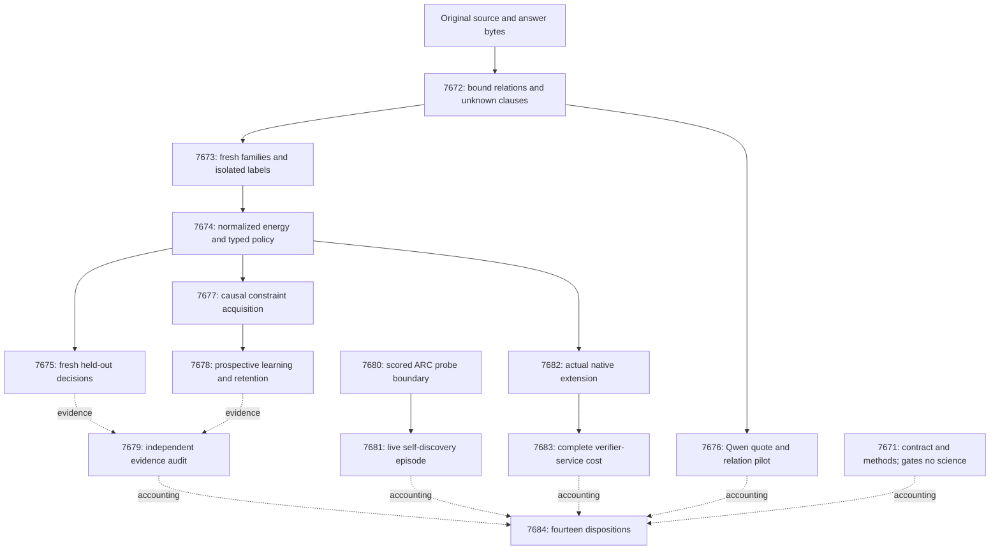

# Carnot Research Roadmap v669: Bound relations and fresh learning

**Created:** 2026-09-25
**Milestone:** 2026.09.669
**Title:** Bound source relations, fresh decision evidence, and acquired constraints
**Status:** Proposed; not activated or executed
**Supersedes:** 2026.09.668, Exp7657–Exp7670
**Previous design:** `research-roadmap-v668-preserved-20260925.md`, preserved byte for byte
**Execution authority:** `research-roadmap-next.yaml`, then the activated roadmap carrying this milestone
**Contract:** exactly **14 tasks, exp7671 through exp7684**, in the order below, across **four phases**.

## What v668 proved

All fourteen tasks were handled, but only ten have producer artifacts. The
completed archive currently ends at V667. V668 artifacts and conductor logs
establish its disposition; archival lag is not a scientific result.

| Work | Evidence | Finding and claim boundary |
|---|---|---|
| Contract | Exp7657 | Valid task accounting and methods; no scientific benefit claim. |
| Evidence atoms | Exp7658 | 72 exact fixtures qualified; circular evidence. Four of eight exposed pilot sources had coverage. |
| Corpus | Exp7659 | 248 source groups, three views, 744 rows; every group previously exposed. Readiness is not fresh evidence. |
| Trained head | Exp7660 | Normalized residual head around inherited Qwen probabilities trained and served. No fresh generalization claim. |
| Decisions | Exp7661 | No registered advantage: non-escalation coverage 0.125; Brier reduction estimate -0.0010338, CI [-0.0110744, 0.0090609]. Utility difference 0.01, CI [-0.01, 0.03]. |
| Delayed protocol | Exp7662 | Causal, durable, one-use feedback qualified; no fresh learning benefit. |
| Continuous learning | Exp7663 | Restart/retention qualified on exposed groups. Brier improvement versus frozen 0.00018548, CI [-0.0002996, 0.0008501]; no registered learning gain. |
| Independent audit | Exp7664 | 66/248 groups covered; 182 censored; 90 checked propositions and 272 unknown claims. No independent benefit. |
| Current Qwen | Exp7665 | 48 bounded calls on 24 exposed/fixture sources completed. Zero exact-supported proposals; valid JSON offsets often failed evidence binding. |
| Goal confirmation | Exp7666 | 48 scripted cases qualified through the scored guard. No hidden-game utility measured. |
| Live ARC/native | Exp7667–7668 | Producers absent after CLI/authentication failures, including HTTP 401. No measured scientific null. |
| Complete service cost | Exp7669 | Skipped after the native upstream retired. No new cost measurement. |
| Capstone | Exp7670 | Producer absent after authentication failures; no retrospective result to invent. |

The existing atom checker mostly checks membership, a definition location,
or a path/line pair. A stack record can contain all expected words but bind
the wrong function to a location. Exact bound relations are a changed premise,
not another run of the same parser. Fresh CPU rows also lack inherited Qwen
probabilities: the new head must train directly from source features and a
fit-only prior. Filling absent margins with zeros would invalidate the design.

V665's separate native result remains 7.827x direct-service speed, CI
[7.2843, 8.3826]. It did not reach NFR-01's 10x gate and did not measure this
new source-bytes-to-durable-decision workload. FoVer 0.9131 remains the
surviving reference headline; V669 does not predeclare a replacement.

## Three biggest gaps to the PRD vision

1. **Evidence must express the claimed relation — FR-01/FR-12.** Formatting
   now works, but membership is weak evidence. Preserve arguments, qualifiers,
   polarity and source completeness; measure unknowns and explicit mismatches
   against whole-answer injected-error labels without conflating the two.
2. **Learning must improve future decisions — FR-06/FR-11.** The previous
   roster was exposed and simple weight updates did not help. Seal fresh
   families, train a small calibrated energy, and acquire reusable relation
   compositions under delayed feedback. Compare a complete static closure,
   matched weight updates, retention and the full cost of acquisition.
3. **Useful mechanisms must be reachable by the live agent — FR-07/FR-12.**
   A correct guard cannot help when the agent never creates a relevant probe.
   Reuse the scored goal contracts to propose bounded probes from the agent's
   own history, including before induced-engine acceptance. Measure actual
   opportunities and SDK outcomes; shadow choices do not imply solved games.

FR-05/FR-08 and NFR-01 support these gaps through native parity and complete
verifier-service cost. Hardware acceleration does not establish correctness.

## Research adopted before design

The dated V669 review in `research-references.md` was recorded before this
plan. It checks the eight requested subjects and all six secondary channels.
The table distinguishes mechanisms adopted from contextual work.

| Source | Local consequence | Tasks |
|---|---|---|
| [Enoki](https://arxiv.org/html/2609.00581v2), September 2026; [HallDetect](https://arxiv.org/abs/2608.05823), August 2026 | Bound arguments/modifiers/polarity and explicit contradiction; a deterministic adaptation, not replication of Enoki's learned entailment verifier | 7672–7676 |
| [EBT](https://arxiv.org/abs/2507.02092), July 2025; [ARM–EBM](https://arxiv.org/abs/2512.15605), December 2025/revised May 2026 | Small conditional energy with exact binary normalization; matched-input logistic control; frozen generator | 7674–7675, 7682 |
| [CRANE](https://arxiv.org/abs/2502.09061), February 2025 | Separate constrained syntax, exact quote resolution and semantic relation support | 7676 |
| [Capacity-constrained delayed learning](https://arxiv.org/abs/2606.11711), June 2026; [experience reuse](https://arxiv.org/abs/2604.27003), April 2026 | Bounded feedback state and new reusable compositions, with a complete static comparator; no inherited convex regret theorem | 7677–7679 |
| [Optimal Recalibration](https://arxiv.org/abs/2607.19689), July 2026; [Calibeating](https://arxiv.org/html/2603.22167v1), March 2026 | Proper loss, prospective prediction and separate utility/retention gates | 7674–7679 |
| [FPGA–ASIC co-design](https://arxiv.org/abs/2602.15985), February 2026; [sparse FPGA Ising machine](https://doi.org/10.1038/s41467-026-75119-0), July 2026; [Z1T](https://extropic.ai/writing/z1t), September 2026 | Measure full service boundaries before hardware adoption; optimization and vendor efficiency are not local sampling or speed evidence | 7683–7684 |

T-SKM-Net, ASP Energised and Ising learning/sampling complexity support
explicit constraint representation and exact binary normalization. KAN-CL
and KAN forgetting results remain context: no unchanged importance-anchor
retry or new spline architecture before informative features beat controls.

OpenReview EBM/verification papers were checked. Semantic Scholar's two
citation endpoints failed; there is no exhaustive citing-paper census.
Hugging Face and cached GitHub trending pages established no new dependency.
Extropic's sparse design is vendor evidence, with excluded system costs.
Kona's direct page failed retrieval; official-site descriptions did not
establish open weights or a reproducible local recipe. No hardware purchase
or new external service is necessary for this milestone.

## Architecture



Labels stay in evaluator stores. Feature extraction cannot read them. The
CPU head uses fit-derived parameters, not historical Qwen margins. Qwen is
frozen and used only in its two actual current-generation experiments.
Continuous learning changes bounded verifier state, never generator weights.

## Phase 1 — Relations and genuinely fresh evidence

**Exp7671–Exp7673.** Establish exact contract/custody, qualify bound record
relations, then seal new source families. Exp7671 is not a science gate.
Exp7672 binds stack function/path/line, grep path/line/text and AST scope
relations, preserving polarity, modifiers and unknown clauses. Its 72 cases
include 24 held outside tuning; eight old pilots remain explicitly exposed.

The pinned LettuceDetect cache has 10,508 training tool-output rows with
8,103 distinct raw contexts and 617 test rows with 519 contexts. These are
inventory counts, not promised eligible fresh families. Exp7673 subtracts
all known exposure and groups source/answer variants and near-duplicate
source templates before deterministic, coverage-blind selection.

The sealed budget is **480 independent families**: fit128, retention32,
tune40, policy40, online-update80, online-admission80 and evaluation80.
The first six roles come from official train; evaluation comes from official
test after cross-split family checks. An underfilled role or uncertain
exposure blocks freshness with actual counts; the agent cannot shrink the
budget after seeing labels. The evaluator alone reads injected-error labels.

## Phase 2 — Calibrated decisions and semantic grounding

**Exp7674–Exp7676.** Train a small normalized binary energy directly from
bound features, then evaluate the frozen accept/reject/escalate policy on
80 fresh families. Controls include fit prior, atom-only, scalar calibration
and matched-input logistic. Five training seeds measure stability, not n.
All heads, thresholds and online-control states freeze before test labels.

Costs are 1 for an incorrect non-escalating decision, 0.2 for escalation,
and 0 for a correct decision. Useful-policy coverage must reach 0.20.
Registered fresh benefit requires lower paired family-bootstrap 95% bounds
above 0.01 for both Brier reduction and decision-cost reduction versus the
strongest control chosen on tune data. Erasure and family derangement test
whether evidence actually affects predictions. Report energy-form benefit
separately from the benefit of better source features.

The independent Qwen pilot changes the binding interface: exact quotes
resolve deterministically before typed propositions are checked. It compares
two arms on 24 diagnostic inputs, 48 calls capped at 256 output tokens each.
Valid pointers, qualifier retention and proposition truth are different
metrics. Its eight old pilots and sixteen fixtures cannot establish fresh
natural-hallucination accuracy. No positive decision result gates the pilot.

## Phase 3 — Acquisition, independent audit and live reachability

**Exp7677–Exp7681.** Qualify and exercise a bounded constraint bank. The
candidate grammar has at most eight primitives and 28 distinct pairwise
compositions. Candidate fitting uses released update labels only; source IDs,
answer IDs and label tokens cannot become memorization keys. Existing
verifier rules are never deleted to manufacture improvement.

Run eight cycles of update10/admission10 with an eight-tick feedback delay.
Explicit empty drain ticks ensure each candidate freezes before admission
predictions; they do not enlarge n or require wall-clock sleeping. At most
16 feedback handles and 36 templates persist. Admission is one-use, with
commit/rollback and a restart after cycle four. Fit/tune controls include
the complete static closure, a read-only bank and matched weight-only updates.
The grammar, fit states, thresholds and statistical rules freeze in Exp7674,
before Exp7675 exposes its evaluation labels.

Primary metrics use the committed bank present before each prediction.
Candidate shadows select admission only; rejected proposals remain in the
ledger, and an accepted candidate cannot be retroactively scored on its
admission examples. The primary prospective cohort is 80 admission families,
with only **eight effective time blocks**. Report weak precision honestly.

Two routes use simultaneous 97.5% block-bootstrap intervals. Quality requires
Brier and cost reductions >0.01 versus read-only and weight-only controls,
plus degradation <=0.01 versus complete static closure. Efficiency requires
Brier/cost degradation <=0.01 versus that closure and >=20% lower execution
cost, including acquisition, admission and durability over the whole stream.
Both require coverage >=0.20, an exercised admitted addition, and retention:
32 anchors with degradation upper 95% bounds <=0.01. Quality and efficiency
are distinct outcomes. The now-exposed evaluation80 can only be secondary
retention evidence. A protocol pass alone cannot establish learning.

Exp7679 is ungated: it independently reduces available rows and preserves
missing-producer reasons. It cannot synthesize zeros or invent verdicts.

The ARC lane reuses goal-confirmation, two-sided contracts and the active
reward-machine frontier. Exp7680 qualifies at least 48 scored-wrapper cases,
including probes before engine acceptance. Exp7681 runs one registry-checked,
adapter-withheld episode with current Qwen and its own runtime observations.
Limits are 16 hypotheses, 256 real actions, 20,000 simulation calls and
3,000 episode seconds, with setup/validation inside the 4,800-second cap.
Current-policy and novelty-only shadows share history but take no actions:
only factual SDK outcomes can establish progress. No source reading, known
routes, per-game hand adapters or offline ground-truth BFS is permitted.

## Exact Task Contract

Exactly fourteen ordered V669 tasks. The table and machine block are independent review surfaces.

| Order | Task ID | Exact title | Phase | Deliverable | Substrate class | Structured gate |
|---|---|---|---|---|---|---|
| 1 | exp7671-contract-methods | Bind the V669 contract and separate prior nulls from missing producers | 1 | results/experiment_7671_v669_contract_methods.json | aggregation | none |
| 2 | exp7672-bound-relations | Check bound record relations without certifying unchecked answer clauses | 1 | results/experiment_7672_v669_bound_relations.json | no_model_load | none |
| 3 | exp7673-fresh-relation-cohort | Seal fresh source families and isolate evaluation labels | 1 | results/experiment_7673_v669_fresh_relation_cohort.json | no_model_load | exp7672-bound-relations.relation_protocol_ready_score == 1; exp7672-bound-relations.flagged_adversarial == false; exp7672-bound-relations.verdict_class in ["positive","null","circular_positive"] |
| 4 | exp7674-relation-energy | Train a fresh relation energy and freeze typed decision policies | 2 | results/experiment_7674_v669_relation_energy.json | no_model_load | exp7673-fresh-relation-cohort.relation_features_ready_score == 1; exp7673-fresh-relation-cohort.flagged_adversarial == false; exp7673-fresh-relation-cohort.verdict_class in ["positive","null"]; exp7673-fresh-relation-cohort.fresh_source_score == 1 |
| 5 | exp7675-fresh-decision-evaluation | Measure fresh relation decisions against simple matched controls | 2 | results/experiment_7675_v669_fresh_decision_evaluation.json | no_model_load | exp7674-relation-energy.relation_energy_ready_score == 1; exp7674-relation-energy.flagged_adversarial == false; exp7674-relation-energy.verdict_class in ["positive","null"] |
| 6 | exp7676-qwen-quote-relations | Test quote-resolved Qwen relations separately from pointer validity | 2 | results/experiment_7676_v669_qwen_quote_relations.json | model_bounded_generation | exp7672-bound-relations.relation_protocol_ready_score == 1; exp7672-bound-relations.flagged_adversarial == false; exp7672-bound-relations.verdict_class in ["positive","null","circular_positive"] |
| 7 | exp7677-constraint-acquisition-protocol | Qualify delayed acquisition and one-use admission of relation constraints | 3 | results/experiment_7677_v669_constraint_acquisition_protocol.json | no_model_load | exp7674-relation-energy.relation_energy_ready_score == 1; exp7674-relation-energy.flagged_adversarial == false; exp7674-relation-energy.verdict_class in ["positive","null"] |
| 8 | exp7678-continuous-relation-learning | Test fresh constraint acquisition against frozen and complete static banks | 3 | results/experiment_7678_v669_continuous_relation_learning.json | no_model_load | exp7677-constraint-acquisition-protocol.acquisition_protocol_ready_score == 1; exp7677-constraint-acquisition-protocol.flagged_adversarial == false; exp7677-constraint-acquisition-protocol.verdict_class in ["positive","null","circular_positive"] |
| 9 | exp7679-independent-evidence-audit | Cold-audit fresh decisions and acquired constraints without requiring a positive result | 3 | results/experiment_7679_v669_independent_evidence_audit.json | aggregation | none |
| 10 | exp7680-arc-probe-protocol | Wire bounded goal-hypothesis probes into the scored ARC policy | 3 | results/experiment_7680_v669_arc_probe_protocol.json | no_model_load | none |
| 11 | exp7681-arc-live-probes | Observe bounded probes during live adapter-withheld ARC self-discovery | 3 | results/experiment_7681_v669_arc_live_probes.json | model_full_generation | exp7680-arc-probe-protocol.arc_probe_protocol_ready_score == 1; exp7680-arc-probe-protocol.flagged_adversarial == false; exp7680-arc-probe-protocol.verdict_class in ["positive","null","circular_positive"] |
| 12 | exp7682-native-relation-energy | Serve the frozen relation policy through the actual native extension | 4 | results/experiment_7682_v669_native_relation_energy.json | no_model_load | exp7674-relation-energy.relation_energy_ready_score == 1; exp7674-relation-energy.flagged_adversarial == false; exp7674-relation-energy.verdict_class in ["positive","null"] |
| 13 | exp7683-whole-service-cost | Measure complete relation-service cost and preserve hardware claim boundaries | 4 | results/experiment_7683_v669_whole_service_cost.json | no_model_load | exp7682-native-relation-energy.native_relation_ready_score == 1; exp7682-native-relation-energy.flagged_adversarial == false; exp7682-native-relation-energy.verdict_class in ["positive","null"] |
| 14 | exp7684-capstone | Reconcile fourteen task dispositions and the next evidence boundary | 4 | results/experiment_7684_v669_capstone.json | aggregation | none |

<!-- V669-TASK-CONTRACT-BEGIN -->
```json
[
{"id":"exp7671-contract-methods","title":"Bind the V669 contract and separate prior nulls from missing producers","phase":1,"deliverable":"results/experiment_7671_v669_contract_methods.json","inference_substrate_class":"aggregation","MODEL_SPECS":[],"gated_on":[]},
{"id":"exp7672-bound-relations","title":"Check bound record relations without certifying unchecked answer clauses","phase":1,"deliverable":"results/experiment_7672_v669_bound_relations.json","inference_substrate_class":"no_model_load","MODEL_SPECS":[],"gated_on":[]},
{"id":"exp7673-fresh-relation-cohort","title":"Seal fresh source families and isolate evaluation labels","phase":1,"deliverable":"results/experiment_7673_v669_fresh_relation_cohort.json","inference_substrate_class":"no_model_load","MODEL_SPECS":[],"gated_on":[{"upstream":"exp7672-bound-relations","artifact_field":"relation_protocol_ready_score","op":"==","value":1},{"upstream":"exp7672-bound-relations","artifact_field":"flagged_adversarial","op":"==","value":false},{"upstream":"exp7672-bound-relations","artifact_field":"verdict_class","op":"in","value":["positive","null","circular_positive"]}]},
{"id":"exp7674-relation-energy","title":"Train a fresh relation energy and freeze typed decision policies","phase":2,"deliverable":"results/experiment_7674_v669_relation_energy.json","inference_substrate_class":"no_model_load","MODEL_SPECS":[],"gated_on":[{"upstream":"exp7673-fresh-relation-cohort","artifact_field":"relation_features_ready_score","op":"==","value":1},{"upstream":"exp7673-fresh-relation-cohort","artifact_field":"flagged_adversarial","op":"==","value":false},{"upstream":"exp7673-fresh-relation-cohort","artifact_field":"verdict_class","op":"in","value":["positive","null"]},{"upstream":"exp7673-fresh-relation-cohort","artifact_field":"fresh_source_score","op":"==","value":1}]},
{"id":"exp7675-fresh-decision-evaluation","title":"Measure fresh relation decisions against simple matched controls","phase":2,"deliverable":"results/experiment_7675_v669_fresh_decision_evaluation.json","inference_substrate_class":"no_model_load","MODEL_SPECS":[],"gated_on":[{"upstream":"exp7674-relation-energy","artifact_field":"relation_energy_ready_score","op":"==","value":1},{"upstream":"exp7674-relation-energy","artifact_field":"flagged_adversarial","op":"==","value":false},{"upstream":"exp7674-relation-energy","artifact_field":"verdict_class","op":"in","value":["positive","null"]}]},
{"id":"exp7676-qwen-quote-relations","title":"Test quote-resolved Qwen relations separately from pointer validity","phase":2,"deliverable":"results/experiment_7676_v669_qwen_quote_relations.json","inference_substrate_class":"model_bounded_generation","MODEL_SPECS":["unsloth/Qwen3.8-27B-GGUF"],"gated_on":[{"upstream":"exp7672-bound-relations","artifact_field":"relation_protocol_ready_score","op":"==","value":1},{"upstream":"exp7672-bound-relations","artifact_field":"flagged_adversarial","op":"==","value":false},{"upstream":"exp7672-bound-relations","artifact_field":"verdict_class","op":"in","value":["positive","null","circular_positive"]}]},
{"id":"exp7677-constraint-acquisition-protocol","title":"Qualify delayed acquisition and one-use admission of relation constraints","phase":3,"deliverable":"results/experiment_7677_v669_constraint_acquisition_protocol.json","inference_substrate_class":"no_model_load","MODEL_SPECS":[],"gated_on":[{"upstream":"exp7674-relation-energy","artifact_field":"relation_energy_ready_score","op":"==","value":1},{"upstream":"exp7674-relation-energy","artifact_field":"flagged_adversarial","op":"==","value":false},{"upstream":"exp7674-relation-energy","artifact_field":"verdict_class","op":"in","value":["positive","null"]}]},
{"id":"exp7678-continuous-relation-learning","title":"Test fresh constraint acquisition against frozen and complete static banks","phase":3,"deliverable":"results/experiment_7678_v669_continuous_relation_learning.json","inference_substrate_class":"no_model_load","MODEL_SPECS":[],"gated_on":[{"upstream":"exp7677-constraint-acquisition-protocol","artifact_field":"acquisition_protocol_ready_score","op":"==","value":1},{"upstream":"exp7677-constraint-acquisition-protocol","artifact_field":"flagged_adversarial","op":"==","value":false},{"upstream":"exp7677-constraint-acquisition-protocol","artifact_field":"verdict_class","op":"in","value":["positive","null","circular_positive"]}]},
{"id":"exp7679-independent-evidence-audit","title":"Cold-audit fresh decisions and acquired constraints without requiring a positive result","phase":3,"deliverable":"results/experiment_7679_v669_independent_evidence_audit.json","inference_substrate_class":"aggregation","MODEL_SPECS":[],"gated_on":[]},
{"id":"exp7680-arc-probe-protocol","title":"Wire bounded goal-hypothesis probes into the scored ARC policy","phase":3,"deliverable":"results/experiment_7680_v669_arc_probe_protocol.json","inference_substrate_class":"no_model_load","MODEL_SPECS":[],"gated_on":[]},
{"id":"exp7681-arc-live-probes","title":"Observe bounded probes during live adapter-withheld ARC self-discovery","phase":3,"deliverable":"results/experiment_7681_v669_arc_live_probes.json","inference_substrate_class":"model_full_generation","MODEL_SPECS":["unsloth/Qwen3.8-27B-GGUF"],"gated_on":[{"upstream":"exp7680-arc-probe-protocol","artifact_field":"arc_probe_protocol_ready_score","op":"==","value":1},{"upstream":"exp7680-arc-probe-protocol","artifact_field":"flagged_adversarial","op":"==","value":false},{"upstream":"exp7680-arc-probe-protocol","artifact_field":"verdict_class","op":"in","value":["positive","null","circular_positive"]}]},
{"id":"exp7682-native-relation-energy","title":"Serve the frozen relation policy through the actual native extension","phase":4,"deliverable":"results/experiment_7682_v669_native_relation_energy.json","inference_substrate_class":"no_model_load","MODEL_SPECS":[],"gated_on":[{"upstream":"exp7674-relation-energy","artifact_field":"relation_energy_ready_score","op":"==","value":1},{"upstream":"exp7674-relation-energy","artifact_field":"flagged_adversarial","op":"==","value":false},{"upstream":"exp7674-relation-energy","artifact_field":"verdict_class","op":"in","value":["positive","null"]}]},
{"id":"exp7683-whole-service-cost","title":"Measure complete relation-service cost and preserve hardware claim boundaries","phase":4,"deliverable":"results/experiment_7683_v669_whole_service_cost.json","inference_substrate_class":"no_model_load","MODEL_SPECS":[],"gated_on":[{"upstream":"exp7682-native-relation-energy","artifact_field":"native_relation_ready_score","op":"==","value":1},{"upstream":"exp7682-native-relation-energy","artifact_field":"flagged_adversarial","op":"==","value":false},{"upstream":"exp7682-native-relation-energy","artifact_field":"verdict_class","op":"in","value":["positive","null"]}]},
{"id":"exp7684-capstone","title":"Reconcile fourteen task dispositions and the next evidence boundary","phase":4,"deliverable":"results/experiment_7684_v669_capstone.json","inference_substrate_class":"aggregation","MODEL_SPECS":[],"gated_on":[]}
]
```
<!-- V669-TASK-CONTRACT-END -->
