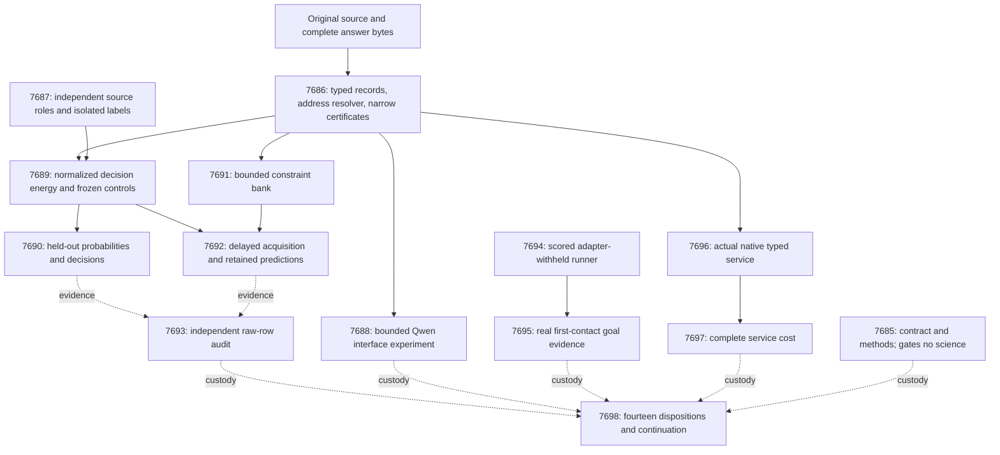

# Carnot Research Roadmap v670: Usable evidence and retained constraints

**Created:** 2026-09-26
**Milestone:** 2026.09.670
**Title:** Usable source relations, retained constraints, and live generalization
**Status:** Proposed; not activated or executed
**Supersedes:** 2026.09.669, Exp7671–Exp7684
**Previous design:** `research-roadmap-v669-preserved-20260926.md`, preserved byte for byte
**Execution authority:** `research-roadmap-next.yaml`, then the activated roadmap with this milestone
**Contract:** exactly **14 tasks, exp7685 through exp7698**, in the order below, across **four phases**.

## What v669 proved

All fourteen tasks were handled. Eight producer artifacts exist; six tasks
were skipped behind gates. The completed archive currently ends at V668.
Producer bytes and conductor receipts establish V669's current disposition.

| Experiment | Evidence and limit |
|---|---|
| Exp7671 | Contract and method ingestion completed; no scientific benefit claim. |
| Exp7672 | Bound tuple protocol qualified on exact fixtures. Evidence is circular; natural-language coverage remains open. |
| Exp7673 | Selected 480 families and emitted 1,440 feature rows, but checked no relations. Required coverage was 92 percent, so the artifact is disqualified. |
| Exp7674–7675 | No trained relation head or static evaluation producer after upstream gate skips. Missing measurements are not null results. |
| Exp7676 | Forty-eight bounded Qwen calls yielded 27 schema-valid proposals and zero unique-evidence matches. Required coverage was 62 percent. These disqualified rows support diagnosis only. |
| Exp7677–7678 | No acquisition protocol or empirical learning producer after gate skips. |
| Exp7679 | Correctly blocked on missing static and online scientific evidence. |
| Exp7680 | Scored-path probe fixtures qualified; no hidden-game utility demonstrated. |
| Exp7681 | Blocked before generation: no uncleared eligible public target. Source also lacks the runner for an eligible target. |
| Exp7682–7683 | No native relation or whole-service cost producer after upstream gate skips. |
| Exp7684 | All fourteen dispositions accounted for; scientific completion remains blocked. |

**Exposure correction:** Exp7673's `prior_exposure_groups=429` counts excluded
families, not contamination among the 480 selected families. This distinction
comes from its source and exclusion ledger. The selected roster has now been
inspected and must join the exposure ledger for V670 selection.

Two interface defects precede another broad science claim. The quote reducer
requires the quote span to equal an entire indexed record. Its `claim_index`
addresses a narrow parser list that the model prompt does not supply. A unique
contained quote can be valid addressing without proving an answer proposition.
The new interface must preserve that distinction.

The separate Exp10015 goal-probe pilot also matters: Probe gained no game
and used more actions. Its null is recorded in the September 26 addition to
`docs/research-notes/goal-induction-design-2026-09-25.md`. Repeating the same
salience bank is not the next experiment. The live runner must first expose
which goal evidence the deployed policy actually obtains.

V668's decision and retained-learning results remain valid nulls. V665's
7.827x direct-service result remains below NFR-01's 10x target and does not
measure this complete source-processing boundary. FoVer 0.9131 remains the
established reference headline; this plan declares no replacement.

## Three biggest gaps to the PRD vision

1. **Usable evidence — FR-01/FR-12.** Exact tuple fixtures work, but actual
   answers rarely reach that checker. Resolve addresses, preserve complete
   answer meaning and distinguish narrow certificates from whole-answer truth.
   Measure evidence information separately from protocol validity.
2. **Improvement from experience — FR-06/FR-11.** Reweighting on exposed
   groups did not establish benefit. Train a normalized typed-decision policy
   on separate source roles, then test bounded constraint additions with legal
   delayed feedback, a complete static comparator and untouched retention data.
3. **Reachable live reasoning at a measured cost — FR-07/FR-08/FR-12.**
   Registry completion must prevent duplicate solve credit while permitting
   adapter-withheld generalization. Execute the real policy, observe goal
   evidence and measure full native service cost. Correct fixtures and fast
   kernels alone cannot establish useful live reasoning.

FR-05 and NFR-01 are tested through actual Rust/PyO3 parity and complete
service timing. Tiny policy training uses CPU because the head is capped at
4,096 parameters; LLM inference uses the owned CUDA path.

## Research incorporated before experiment design

The dated V670 section of `research-references.md` was written before this
plan. It records eight requested topics, all secondary channels, review depth
and access failures. The table maps adopted ideas to actual tasks.

| Source | Local adaptation | Experiments |
|---|---|---|
| [Enoki](https://arxiv.org/html/2609.00581v2), September 2026 | Retain anchored arguments, modifiers and original answer spans. Supply an explicit address/claim interface; exact containment does not establish entailment. | 7686, 7688 |
| [Structural versus semantic decoding gap](https://arxiv.org/html/2609.23742v1), September 20, 2026 | Separate syntax, evidence addressing, proposition binding and truth. Do not transfer small-model results or punctuation normalization to source-byte evidence. | 7688–7690 |
| [EBT](https://arxiv.org/abs/2507.02092) and [ARM–EBM](https://arxiv.org/abs/2512.15605), 2025 | Small conditional energy with exact binary normalization and matched-input logistic/MLP controls; no generator training. | 7689–7690 |
| [Capacity-constrained delayed learning](https://arxiv.org/abs/2606.11711), June 2026 | Bound pending feedback, log loss and preserve chronology. Discrete template selection inherits no convex regret theorem. | 7691–7693 |
| [FPGA–ASIC co-design](https://arxiv.org/abs/2602.15985), revised September 2026; [Extropic Z1T](https://extropic.ai/writing/z1t) | Charge orchestration, parsing, dispatch and persistence before projecting hardware value. Vendor estimates are not local measurements. | 7696–7698 |

T-SKM-Net supports explicit symbolic representation, not a new natural-language
soundness theorem. Ising learning-to-sample hardness supports exact normalization
for this small output space. KAC and KAN forgetting studies motivate empirical
retention checks but not another spline architecture. New decoding and sampler
branches are deferred until the current evidence interface is informative.

OpenReview trace-verification work gives a transfer caution. Both Semantic
Scholar citation endpoints failed; there is no citing-paper census. Hugging
Face and stale GitHub trending views added no verified dependency. Kona's
retrieved page describes a constraint layer but supplies no local training
recipe. The plan needs no new external service, checkpoint or hardware purchase.

## Architecture



## Phase 1 — Qualify the interface and independent data roles

**Exp7685–Exp7687.** Establish exact contract and literature custody, then
qualify a reusable record-address interface. The protocol uses 72 deterministic
cases, including 24 outside tuning. It rejects duplicate, cross-record and
invalid UTF-8 spans. Existing path/line certificates stay narrow. A function
and location must be explicitly linked in the original clause for a bound
relation check. Causal, modal and other unchecked clauses remain unknown.

Exp7687 handles data and validation independently. Close the known missing
coverage branches before sealing. Subtract prior source, answer and family
exposure, including all 480 V669 selected families. Seal **400 families**:
fit128, tune40, policy40, retention32, online_update60, online_admission60,
evaluation40. The first six roles use official train; evaluation uses official
test. Cross-split collisions and uncertain exposure cannot enter either role.
Selection uses frozen hash order, never labels or feature coverage. If any
role is underfilled, report its actual count and block the fresh lane.

The new budget is a prospective pilot choice, not a post-result reduction of
V669's protocol. Every selected family remains in its denominator, including
unknown evidence. Predictor children receive label-free projected fields;
evaluator stores remain separate. Data readiness makes no claim of informative
features. The protocol and hashes freeze before any labels are released.

## Phase 2 — Measure addressing and calibrated decisions

**Exp7688–Exp7690.** The Qwen diagnostic uses eight exposed pilot sources
and sixteen exact fixtures. Two arms receive identical full sources and
answers: opaque indices versus explicit record and claim tables. Each of
48 calls has a 256-token cap. Compare old and containing-record reductions,
with syntax, addressing, binding and truth kept separate. This is
`model_bounded_generation`; its floor is 10 seconds, never padded.

The small decision head trains directly from typed source certificates.
It uses exact binary normalization, a maximum of 4,096 parameters, 500 gradient
steps per arm and five training seeds. Fit prior, atom-only, matched-input
logistic and same-width MLP controls receive the same legal training data.
No inherited Qwen margin, model-generated label or fake zero margin is used.
A zero-information feature set is recorded honestly, not repaired using test
labels. No positive fit result is needed to evaluate a valid head.

Freeze hyperparameters on tune40 and decision thresholds on policy40. Costs
are 0 for a correct decision, 1 for incorrect accept/reject and 0.2 for
escalation. Freeze the online grammar, thresholds and all starting states
before Exp7690 opens evaluation labels. Evaluate all forty test families.
Use 10,000 paired family bootstrap draws. The registered benefit gate requires
lower 95-percent bounds above 0.01 for **both** Brier reduction and decision
cost reduction, with non-escalation coverage at least 0.20. The comparator is
chosen on tune data, never evaluation data. Report the energy-versus-MLP
contrast separately from the gain provided by richer features.

Forty families are a pilot, not a broad accuracy estimate. Dataset labels
mark annotated injected errors. A positive result does not prove natural
hallucination detection or whole-answer certification. Erasure and derangement
are diagnostic views of the same families and do not enlarge sample size.

## Phase 3 — Acquire constraints and observe real first contact

**Exp7691–Exp7695.** Qualify the bounded acquisition bank on 96 lifecycle
fixtures, including 32 untouched admission/retention cases. This branch needs
only the record protocol, not a fitted head. At most eight primitives, 28
pairwise conjunctions and sixteen pending feedback handles may persist.
A candidate is an extra predictive feature/check, never an unproved axiom.

The empirical run uses twelve update5/admission5 cycles: sixty update and
sixty admission families. Update labels arrive eight logical ticks later;
empty drain ticks require no sleeping and add no examples. Each candidate
freezes before admission predictions. Admission labels can authorize one
commit but cannot fit that candidate or test additional candidates. The
primary predictions come from the committed bank present before each query.
Restart every arm after cycle six. Record rejected, dropped and lost updates.

Compare acquisition with a read-only bank, matched weight-only updates and
the full static closure. The complete comparator prevents manufactured gains
from deliberately withholding known rules. Use twelve chronological bootstrap
blocks, not sixty independent time points. Quality requires lower 95-percent
bounds above 0.01 for Brier and cost improvement against both read-only and
weight-only controls. The upper bound on excess cost versus full static
closure must be at most 0.01. At least one acquired template must fire on a
later family. Evaluate retention32 once at the end; its upper loss-increase
bound must be at most 0.01. Retention labels never choose commits. Efficiency
is a separate measured result, not an alternative way to claim quality.

Exp7693 independently reduces raw evidence even when producers are missing.
It is never gated on a positive scientific result. Missing required science
produces a blocked audit with exact custody; a valid null is complete evidence.

For ARC, Exp7694 implements and tests a real runner through the existing
scored `E3AgentPolicy` entrypoint. Hash-select two locally runnable public games
using `v670-arc-20260926`; withhold all per-game adapters, routes, hints and
solver memory. Registry-precheck records existing levels and prohibits new
credit, while permitting generalization measurement. Scripted fixtures must
reach action selection and observation before the live task starts.

Exp7695 runs each episode for at most 1,200 seconds, 128 real actions,
20,000 model-engine calls and two Qwen calls capped at 4,096 tokens each.
The total live budget is 2,400 seconds. This is `model_full_generation` when
generation actually occurs, with a 60-second floor. If no call fires, emit
the actual no-LLM substrate and zero invocations. Never pad time.

Measure goal proposals, accepted models, actual firings and SDK-confirmed
progress. Unobserved positives make recall unknown. Keep experimental probe
policies off. This two-game observational pilot neither estimates hidden-game
solve rate nor establishes causal improvement. Real attempts use
`solve_provenance=live_agent_self_discovery`; fixtures use `development_proxy`.
No game-source reading, hand-built adapter, exhaustive truth BFS or duplicate
registry credit is permitted.

## Phase 4 — Measure the deployed boundary and reconcile

**Exp7696–Exp7698.** Qualify 128 typed-payload cases through the actual
PyO3 extension and existing durable service. Fixed fixture weights establish
conformance, not learned performance. Optional trained weights are a separate
smoke and cannot become a prerequisite that blocks native qualification.
Require probability agreement within 1e-6, identical decisions/errors and
exactly-once durable feedback after restart. Keep the consumer opt-in.

Measure Python, Rust JSONL and direct PyO3 consumers in 30 randomized paired
blocks at batch sizes 1, 8 and 32. Use ten declared warmups and separate cold
starts. Include original source parsing, certificate formation, energy,
decision, serialization and durable commit with identical fsync semantics.
Report exclusive stage timers, total median/p95 and paired intervals. NFR-01
passes only if the lower 95-percent bound for **complete service** speedup is
at least 10x, with parity and durability intact. Otherwise retain the null
and the dominant measured cost. E2E-003/004 and E2E-012 timing principles apply.

The capstone always accounts for fourteen dispositions. It requires eligible
static, online and independent-audit evidence for scientific completion, not
positive effects. Missing external science is blocked once; valid nulls permit
a null capstone. Compute the unchanged G1–G4 publication gate and preserve
FoVer 0.9131. No activation, publication or default promotion is authorized.

## Dependency graph and conductor order

Solid arrows in the architecture are readiness dependencies; dotted arrows
are evidence accounting. The execution YAML is the authoritative order.
The exact structured checks also appear in the machine contract below.

```text
7685                  contract and methods; no science gate
7686 -> 7688          qualified interface -> bounded Qwen diagnostic
7686 + 7687 -> 7689 -> 7690
7686 -> 7691; 7689 + 7691 -> 7692
7690 + 7692 --> 7693   evidence read even when absent; no pre-gate
7694 -> 7695          qualified real runner -> live observations
7686 -> 7696 -> 7697  native conformance independent of learned benefit
all dispositions --> 7698; capstone has no pre-gate
```

Every readiness gate also checks `flagged_adversarial == false` and an exact
allowed `verdict_class` list. Fixture readiness can be `circular_positive`;
training/data readiness is `null`. No gate requires a scientific positive.
Every gate field is spelled identically in its producer's required fields.
There are no references to retired upstream tasks in `gated_on` or `requires`.
Prior-failure IDs are historical custody, not runtime dependencies.

## Hardware requirements and execution budget

| Resource | Use and constraint |
|---|---|
| CPU and host memory | Source parsing, small-head training, bank updates, audits and Rust service measurements. Reserve private scratch and bounded raw-row storage. |
| Existing RTX 3090 CUDA path | Exp7688 and Exp7695 load `unsloth/Qwen3.8-27B-GGUF`. Resolve and hash the cached quantization; record GPU UUID, process ownership, offload and actual tokens. The two GPUs are separate 24 GiB resources, not an assumed unified allocation. |
| Native toolchain | Existing Rust/PyO3 service; use a private build target and verify actual extension origin. No simulated native implementation. |
| KV260 | Preserve qualified quadratic fabric scope `k_max<=5`. A future task needs an authenticated board workload through SSH, not a host SD-card prerequisite. No repeated availability probe here. |
| PolarFire | Preserve Linux CPU-only dispatch; no FPGA-fabric or acceleration claim. |
| GateMate | The unchanged `0xffffffff` JTAG block remains. Reopen only after a changed physical prerequisite. |
| NPU and TSU | Unqualified locally. New hardware is useful only after measured hot phases and executable SDK/workload evidence establish a path. No purchase or installation task. |

Tier 1 updates use counters and bitsets. Tier 2 additions use at most 36
compiled templates. Native batching offers an acceleration path by reducing
Python dispatch and memory traffic. Whether that reaches 100x is unmeasured;
Exp7697 measures the present boundary before any hardware projection.

Estimated per-task budgets are 35–70 minutes; their sum is **780 minutes** if
all tasks run to estimates. Each must stay within the 4,800-second conductor
cap. Live ARC work is capped at 40 minutes inside its 70-minute task budget.
A wall-time estimate is not evidence of elapsed computation.

The contract and data-custody tasks use Claude Opus with 100 turns because
they coordinate schema/preflight checks. Formulaic verifier, lifecycle,
runner and binding work uses Codex `gpt-6-sol`. Routine science uses the
default Claude backend. Independent audit and capstone have 30 turns.
The model used to implement a task is distinct from its experimental model.

Only Exp7688 and Exp7695 need an LLM. Their YAML and prompts name the mandated
Qwen. No legacy model is a headline model. Bounded canaries use the 10-second
class, actual full generation the 60-second class, and a future embeddings or
load-only task would use the 2-second class. None is padded to pass a floor.

## Failure discipline and verification

The plan consulted all manifest entries and the historical roadmap index,
including v7/v8 and recent V650–V669 designs. It avoids closed generated-answer
transport, generic external-text reranking, unchanged importance anchoring,
retired sampler variants and repeated public-game solve credit. New IDs have
no operator override. Every similar failed attempt has all four lineage
fields, including `retire_if_same_verdict: true` and a concrete changed premise.
Absent producers use `not_emitted_*` custody markers; these are not invented
honest verdicts. A repeated resource block is not a scientific negative.

Every task requires spec-first work, meaningful tests first, 100-percent
changed-module coverage, affected-test spec coverage, scoped lint/type checks,
its concrete E2E and applicable checks from `ops/e2e-test-plan.md`. Freeze
scope before measurement; do not append unrelated global debt to acceptance
later. Native tasks add actual extension/Rust checks; ARC runner tasks use
E2E-009, E2E-011 and E2E-013. Planning itself uses the contract readers and
private mutation checks; runtime E2Es remain scheduled, not claimed as run.

All prompts require flushed phase/before/after progress, loop heartbeats at
least every 60 seconds and no silence gap of 600 seconds. A silent task can
die at 1,200 seconds despite a 4,800-second cap. They also require files over
about 200 lines to be written in 100–150-line calls with progress between.
Every comparative artifact carries raw per-unit rows. Every artifact declares
`verdict_class`, current substrate, gate operands and governing principles.

## Exact Task Contract

The table and machine block describe exactly the fourteen YAML tasks. Neither
is an aspirational list. The machine block adds the exact models, substrates
and gates for independent contract checks.

| Order | ID | Phase | Task | Deliverable |
|---|---|---|---|---|
| 1 | `exp7685-contract-methods` | 1 | Bind fourteen tasks and ingest evidence-interface methods | `results/experiment_7685_v670_contract_methods.json` |
| 2 | `exp7686-record-span-protocol` | 1 | Qualify source-record addressing and original-answer binding | `results/experiment_7686_v670_record_span_protocol.json` |
| 3 | `exp7687-sealed-cohort` | 1 | Seal independent source roles and validate label custody | `results/experiment_7687_v670_sealed_cohort.json` |
| 4 | `exp7688-qwen-record-pilot` | 2 | Measure explicit record and claim addressing with bounded Qwen proposals | `results/experiment_7688_v670_qwen_record_pilot.json` |
| 5 | `exp7689-typed-decision-energy` | 2 | Train a normalized decision energy on typed evidence certificates | `results/experiment_7689_v670_typed_decision_energy.json` |
| 6 | `exp7690-heldout-decisions` | 2 | Measure fresh probability and typed-decision value | `results/experiment_7690_v670_heldout_decisions.json` |
| 7 | `exp7691-constraint-bank-protocol` | 3 | Qualify bounded counterexample-driven constraint acquisition | `results/experiment_7691_v670_constraint_bank_protocol.json` |
| 8 | `exp7692-continuous-acquisition` | 3 | Measure prospective constraint additions and retention after restart | `results/experiment_7692_v670_continuous_acquisition.json` |
| 9 | `exp7693-independent-evidence-audit` | 3 | Independently reduce evidence, decision and learning claims | `results/experiment_7693_v670_independent_evidence_audit.json` |
| 10 | `exp7694-arc-generalization-runner` | 3 | Qualify an adapter-withheld ARC runner with reachable episode execution | `results/experiment_7694_v670_arc_generalization_runner.json` |
| 11 | `exp7695-arc-first-contact` | 3 | Measure live goal evidence during adapter-withheld first contact | `results/experiment_7695_v670_arc_first_contact.json` |
| 12 | `exp7696-native-record-contract` | 4 | Qualify typed evidence payloads through the actual native service | `results/experiment_7696_v670_native_record_contract.json` |
| 13 | `exp7697-whole-service-cost` | 4 | Measure complete record-service cost and retain hardware boundaries | `results/experiment_7697_v670_whole_service_cost.json` |
| 14 | `exp7698-capstone` | 4 | Reconcile fourteen dispositions and decide continuation by evidence | `results/experiment_7698_v670_capstone.json` |

```json
{"milestone": "2026.09.670", "task_count": 14, "tasks": [
{"id": "exp7685-contract-methods", "title": "Bind fourteen tasks and ingest evidence-interface methods", "phase": 1, "deliverable": "results/experiment_7685_v670_contract_methods.json", "inference_substrate_class": "aggregation", "MODEL_SPECS": [], "gated_on": []},
{"id": "exp7686-record-span-protocol", "title": "Qualify source-record addressing and original-answer binding", "phase": 1, "deliverable": "results/experiment_7686_v670_record_span_protocol.json", "inference_substrate_class": "no_model_load", "MODEL_SPECS": [], "gated_on": []},
{"id": "exp7687-sealed-cohort", "title": "Seal independent source roles and validate label custody", "phase": 1, "deliverable": "results/experiment_7687_v670_sealed_cohort.json", "inference_substrate_class": "no_model_load", "MODEL_SPECS": [], "gated_on": []},
{"id": "exp7688-qwen-record-pilot", "title": "Measure explicit record and claim addressing with bounded Qwen proposals", "phase": 2, "deliverable": "results/experiment_7688_v670_qwen_record_pilot.json", "inference_substrate_class": "model_bounded_generation", "MODEL_SPECS": ["unsloth/Qwen3.8-27B-GGUF"], "gated_on": [{"upstream": "exp7686-record-span-protocol", "artifact_field": "record_protocol_ready_score", "op": "==", "value": 1}, {"upstream": "exp7686-record-span-protocol", "artifact_field": "flagged_adversarial", "op": "==", "value": false}, {"upstream": "exp7686-record-span-protocol", "artifact_field": "verdict_class", "op": "in", "value": ["circular_positive", "null"]}]},
{"id": "exp7689-typed-decision-energy", "title": "Train a normalized decision energy on typed evidence certificates", "phase": 2, "deliverable": "results/experiment_7689_v670_typed_decision_energy.json", "inference_substrate_class": "no_model_load", "MODEL_SPECS": [], "gated_on": [{"upstream": "exp7686-record-span-protocol", "artifact_field": "record_protocol_ready_score", "op": "==", "value": 1}, {"upstream": "exp7686-record-span-protocol", "artifact_field": "flagged_adversarial", "op": "==", "value": false}, {"upstream": "exp7686-record-span-protocol", "artifact_field": "verdict_class", "op": "in", "value": ["circular_positive", "null"]}, {"upstream": "exp7687-sealed-cohort", "artifact_field": "cohort_ready_score", "op": "==", "value": 1}, {"upstream": "exp7687-sealed-cohort", "artifact_field": "flagged_adversarial", "op": "==", "value": false}, {"upstream": "exp7687-sealed-cohort", "artifact_field": "verdict_class", "op": "in", "value": ["null"]}, {"upstream": "exp7687-sealed-cohort", "artifact_field": "fresh_source_score", "op": "==", "value": 1}, {"upstream": "exp7687-sealed-cohort", "artifact_field": "flagged_adversarial", "op": "==", "value": false}, {"upstream": "exp7687-sealed-cohort", "artifact_field": "verdict_class", "op": "in", "value": ["null"]}]},
{"id": "exp7690-heldout-decisions", "title": "Measure fresh probability and typed-decision value", "phase": 2, "deliverable": "results/experiment_7690_v670_heldout_decisions.json", "inference_substrate_class": "no_model_load", "MODEL_SPECS": [], "gated_on": [{"upstream": "exp7689-typed-decision-energy", "artifact_field": "decision_energy_ready_score", "op": "==", "value": 1}, {"upstream": "exp7689-typed-decision-energy", "artifact_field": "flagged_adversarial", "op": "==", "value": false}, {"upstream": "exp7689-typed-decision-energy", "artifact_field": "verdict_class", "op": "in", "value": ["null"]}]},
{"id": "exp7691-constraint-bank-protocol", "title": "Qualify bounded counterexample-driven constraint acquisition", "phase": 3, "deliverable": "results/experiment_7691_v670_constraint_bank_protocol.json", "inference_substrate_class": "no_model_load", "MODEL_SPECS": [], "gated_on": [{"upstream": "exp7686-record-span-protocol", "artifact_field": "record_protocol_ready_score", "op": "==", "value": 1}, {"upstream": "exp7686-record-span-protocol", "artifact_field": "flagged_adversarial", "op": "==", "value": false}, {"upstream": "exp7686-record-span-protocol", "artifact_field": "verdict_class", "op": "in", "value": ["circular_positive", "null"]}]},
{"id": "exp7692-continuous-acquisition", "title": "Measure prospective constraint additions and retention after restart", "phase": 3, "deliverable": "results/experiment_7692_v670_continuous_acquisition.json", "inference_substrate_class": "no_model_load", "MODEL_SPECS": [], "gated_on": [{"upstream": "exp7689-typed-decision-energy", "artifact_field": "decision_energy_ready_score", "op": "==", "value": 1}, {"upstream": "exp7689-typed-decision-energy", "artifact_field": "flagged_adversarial", "op": "==", "value": false}, {"upstream": "exp7689-typed-decision-energy", "artifact_field": "verdict_class", "op": "in", "value": ["null"]}, {"upstream": "exp7691-constraint-bank-protocol", "artifact_field": "constraint_bank_ready_score", "op": "==", "value": 1}, {"upstream": "exp7691-constraint-bank-protocol", "artifact_field": "flagged_adversarial", "op": "==", "value": false}, {"upstream": "exp7691-constraint-bank-protocol", "artifact_field": "verdict_class", "op": "in", "value": ["circular_positive", "null"]}]},
{"id": "exp7693-independent-evidence-audit", "title": "Independently reduce evidence, decision and learning claims", "phase": 3, "deliverable": "results/experiment_7693_v670_independent_evidence_audit.json", "inference_substrate_class": "aggregation", "MODEL_SPECS": [], "gated_on": []},
{"id": "exp7694-arc-generalization-runner", "title": "Qualify an adapter-withheld ARC runner with reachable episode execution", "phase": 3, "deliverable": "results/experiment_7694_v670_arc_generalization_runner.json", "inference_substrate_class": "no_model_load", "MODEL_SPECS": [], "gated_on": []},
{"id": "exp7695-arc-first-contact", "title": "Measure live goal evidence during adapter-withheld first contact", "phase": 3, "deliverable": "results/experiment_7695_v670_arc_first_contact.json", "inference_substrate_class": "model_full_generation", "MODEL_SPECS": ["unsloth/Qwen3.8-27B-GGUF"], "gated_on": [{"upstream": "exp7694-arc-generalization-runner", "artifact_field": "arc_runner_ready_score", "op": "==", "value": 1}, {"upstream": "exp7694-arc-generalization-runner", "artifact_field": "flagged_adversarial", "op": "==", "value": false}, {"upstream": "exp7694-arc-generalization-runner", "artifact_field": "verdict_class", "op": "in", "value": ["circular_positive", "null"]}]},
{"id": "exp7696-native-record-contract", "title": "Qualify typed evidence payloads through the actual native service", "phase": 4, "deliverable": "results/experiment_7696_v670_native_record_contract.json", "inference_substrate_class": "no_model_load", "MODEL_SPECS": [], "gated_on": [{"upstream": "exp7686-record-span-protocol", "artifact_field": "record_protocol_ready_score", "op": "==", "value": 1}, {"upstream": "exp7686-record-span-protocol", "artifact_field": "flagged_adversarial", "op": "==", "value": false}, {"upstream": "exp7686-record-span-protocol", "artifact_field": "verdict_class", "op": "in", "value": ["circular_positive", "null"]}]},
{"id": "exp7697-whole-service-cost", "title": "Measure complete record-service cost and retain hardware boundaries", "phase": 4, "deliverable": "results/experiment_7697_v670_whole_service_cost.json", "inference_substrate_class": "no_model_load", "MODEL_SPECS": [], "gated_on": [{"upstream": "exp7696-native-record-contract", "artifact_field": "native_record_ready_score", "op": "==", "value": 1}, {"upstream": "exp7696-native-record-contract", "artifact_field": "flagged_adversarial", "op": "==", "value": false}, {"upstream": "exp7696-native-record-contract", "artifact_field": "verdict_class", "op": "in", "value": ["circular_positive", "null"]}]},
{"id": "exp7698-capstone", "title": "Reconcile fourteen dispositions and decide continuation by evidence", "phase": 4, "deliverable": "results/experiment_7698_v670_capstone.json", "inference_substrate_class": "aggregation", "MODEL_SPECS": [], "gated_on": []}
]}
```
