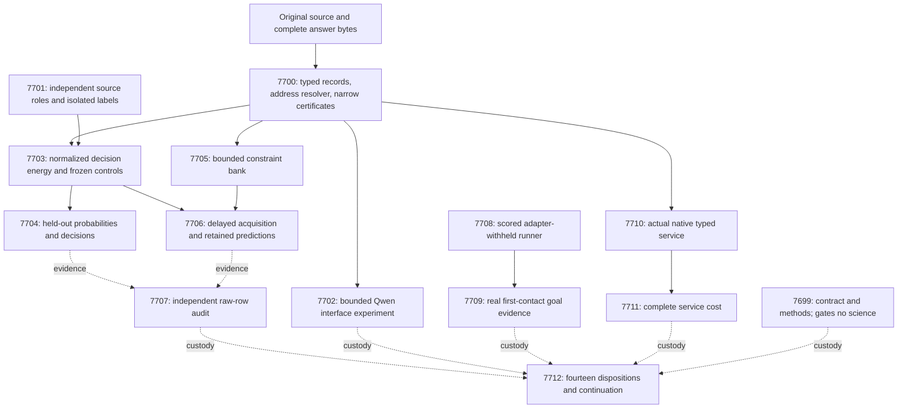

# Carnot Research Roadmap v671: Recover execution and test budgeted learning

**Created:** 2026-09-26
**Milestone:** 2026.09.671
**Title:** Recovering source evidence and testing budgeted constraint learning
**Status:** Proposed; activation depends on verified execution capacity
**Supersedes:** 2026.09.670, Exp7685–Exp7698
**Previous design:** `research-roadmap-v670-preserved-20260926.md`, preserved byte for byte
**Execution authority:** `research-roadmap-next.yaml`, then its matching activated roadmap
**Contract:** exactly **14 tasks, exp7699 through exp7712**, in the order below, across **four phases**.

## What v670 proved and did not measure

The conductor handled all fourteen tasks, but none produced its experiment
artifact. Completion here means the queue drained. It does not mean the
proposed experiments ran, and it establishes no scientific null.

| Previous tasks | Observed disposition | Evidence boundary |
|---|---|---|
| Exp7685, 7686, 7687, 7693, 7694, 7698 | Each launch failed three times with a Codex usage-limit error | No contract, record interface, fresh cohort, audit, runner or capstone implementation is assumed to exist. |
| Exp7688–7692, 7695–7697 | Eight gate skips after upstream retirement | No current Qwen pilot, energy head, decision evaluation, acquisition run or native measurement. |
| Operational retrospective | Zero experiment commits reconstructed; no task timing | Ambient GPU idleness does not measure experiment efficiency. |

Sources: the 2026-09-26 05:38–06:16 UTC entries in `ops/conductor-log.md`,
absence of all fourteen declared result paths, and
`results/operational_retro_2026_09_670.json`. The completed archive ends at
V669 at planning time. Preserve that archive lag as custody; do not fill it
with fabricated producer verdicts. YAML failure lineage uses explicit
`not_emitted_*` log-disposition markers where no honest verdict exists.

The last measured scientific boundary remains V669 and V668. V669's bound
relation fixtures worked, but fresh features and Qwen quote relations failed
required validation. Its 480 selected source families yielded no checked
relations. The 429 previously exposed families were excluded, not selected
contamination. The quote resolver requires full-record equality, and its
claim index is not supplied by the prompt. These are diagnosed interface
problems. V668 found no registered decision or retained-learning benefit.

ARC's V669 runner required an uncleared public target despite all public
games being cleared, then lacked an episode implementation. Generalization
with adapters withheld remains permitted; duplicate solve credit is not.
The separate Exp10015 probe null remains unchanged. The latest known-issues
entry records a scored 0.09, but does not isolate the reasoning-parser fix.
V665's 7.827x native result did not establish the complete-service 10x target.
None of these facts becomes a V670 result by being carried forward.

## Three biggest gaps to the PRD vision

1. **Usable evidence for FR-12.** Exact checks exist, but original answers
   often never reach a sound, meaning-preserving constraint representation.
   Measure addressing, binding and complete-clause coverage separately.
2. **Causal improvement for FR-06/FR-11.** Existing weight changes did not
   establish fresh retained benefit. Test new constraints and the allocation
   of a bounded update budget with legally delayed labels and strong controls.
3. **Reachable reasoning at a measured cost for FR-05/FR-07/FR-08.** Execute
   the actual live ARC policy with adapters withheld, and measure complete
   native-service cost. Fixture success and kernel speed alone are insufficient.

Execution availability is a prerequisite across these gaps. It is not a fourth
research thesis and does not justify another round of unmeasured positives.
The stable FoVer 0.9131 headline and G1–G4 publication definition stay intact.

## Activation prerequisite and failure recovery

V670 already requested Claude for some tasks. Actual launches still used
Codex. Read-only inspection of the dispatcher confirms that
`CODEX_FORCE_EXPERIMENTS=1` can coerce those requests. Changing task metadata
alone cannot fix the measured failure.

Before activation, the operating environment must provide a recent successful
receipt from the **effective** backend that will execute the tasks. Quota
recovery is not verified by this plan. The available planning session is not
proof that the conductor account has capacity. If the prerequisite remains
missing, retain this staged plan rather than deliberately repeating fourteen
failures. This is a documented launch prerequisite, not a new automatic gate
claimed to have been implemented.

Exp7699 records the resolved route and its own successful invocation without
starting a nested coding agent. Every task records effective execution custody.
No prompt edits conductor code, credentials, global settings or operator-only
bypass flags. Formulaic work retains Codex `gpt-6-sol`; schema work requests
Claude Opus/100 turns; routine work uses the user-requested default backend.
Runtime coercion must be disclosed. All experiment IDs are new, and every
structured dependency points to a producer in V671, never a retired V670 ID.

## Research incorporated before design

The dated V671 entry in `research-references.md` precedes this design. It
records all eight requested topics and all secondary channels, review depth,
access failures and limits. Most leads were already indexed. ADOWIP is new.

| Source | Local question | Tasks |
|---|---|---|
| [Enoki](https://arxiv.org/html/2609.00581v2) and [semantic decoding gap](https://arxiv.org/abs/2609.23742) | Does an explicit source/claim interface improve addressing without weakening meaning? | 7700, 7702 |
| [EBT](https://arxiv.org/abs/2507.02092), [ARM–EBM](https://arxiv.org/abs/2512.15605) | Can normalized source-conditioned energy improve calibrated typed decisions over matched controls? | 7703–7704 |
| [Delayed OCO](https://arxiv.org/abs/2606.11711), [ADOWIP](https://arxiv.org/html/2606.25068v1) | Do causal additions help, and does delayed-loss scheduling help under the same proposal ceiling? | 7705–7707 |
| [FPGA/Ising co-design](https://arxiv.org/abs/2602.15985), [Z1T](https://extropic.ai/writing/z1t) | Which complete-service costs remain after native dispatch? | 7710–7712 |

ADOWIP motivates the scheduling control, not a transferred theorem. Carnot's
bank is discrete, its corpus is different, and a six-credit ceiling does not
prove equal realized compute. Retention and rejected proposal costs are measured.
KAN-CL and KAN forgetting work support retention checks; unchanged importance
anchoring stays closed. PAL and T-SKM-Net require correct supplied constraints.
ETS and ERM do not reopen retired text reranking or generator-training scopes.

Semantic Scholar citation endpoints failed again; there is no citation census.
GitHub trending views were stale. OpenReview's accessible PDF is distinguished
from its challenged forum and unrelated spam search results. Hugging Face is a
discovery source. Kona's vendor description supplies no local reproduction
recipe. No new dependency, hardware purchase or external publication is planned.

## Architecture



## Phase 1 — Qualify the interface and independent data roles

**Exp7699–Exp7701.** Establish exact contract and literature custody, then
qualify a reusable record-address interface. The protocol uses 72 deterministic
cases, including 24 outside tuning. It rejects duplicate, cross-record and
invalid UTF-8 spans. Existing path/line certificates stay narrow. A function
and location must be explicitly linked in the original clause for a bound
relation check. Causal, modal and other unchecked clauses remain unknown.

Exp7701 handles data and validation independently. Close the known missing
coverage branches before sealing. Subtract prior source, answer and family
exposure, including all 480 V669 selected families. Seal **400 families**:
fit128, tune40, policy40, retention32, online_update60, online_admission60,
evaluation40. The first six roles use official train; evaluation uses official
test. Cross-split collisions and uncertain exposure cannot enter either role.
Selection uses frozen hash order, never labels or feature coverage. If any
role is underfilled, report its actual count and block the fresh lane.

The new budget is a prospective pilot choice, not a post-result reduction of
V669's protocol. Every selected family remains in its denominator, including
unknown evidence. Predictor children receive label-free projected fields;
evaluator stores remain separate. Data readiness makes no claim of informative
features. The protocol and hashes freeze before any labels are released.

## Phase 2 — Measure addressing and calibrated decisions

**Exp7702–Exp7704.** The Qwen diagnostic uses eight exposed pilot sources
and sixteen exact fixtures. Two arms receive identical full sources and
answers: opaque indices versus explicit record and claim tables. Each of
48 calls has a 256-token cap. Compare old and containing-record reductions,
with syntax, addressing, binding and truth kept separate. This is
`model_bounded_generation`; its floor is 10 seconds, never padded.

The small decision head trains directly from typed source certificates.
It uses exact binary normalization, a maximum of 4,096 parameters, 500 gradient
steps per arm and five training seeds. Fit prior, atom-only, matched-input
logistic and same-width MLP controls receive the same legal training data.
No inherited Qwen margin, model-generated label or fake zero margin is used.
A zero-information feature set is recorded honestly, not repaired using test
labels. No positive fit result is needed to evaluate a valid head.

Freeze hyperparameters on tune40 and decision thresholds on policy40. Costs
are 0 for a correct decision, 1 for incorrect accept/reject and 0.2 for
escalation. Freeze the online grammar, thresholds and all starting states
before Exp7704 opens evaluation labels. Evaluate all forty test families.
Use 10,000 paired family bootstrap draws. The registered benefit gate requires
lower 95-percent bounds above 0.01 for **both** Brier reduction and decision
cost reduction, with non-escalation coverage at least 0.20. The comparator is
chosen on tune data, never evaluation data. Report the energy-versus-MLP
contrast separately from the gain provided by richer features.

Forty families are a pilot, not a broad accuracy estimate. Dataset labels
mark annotated injected errors. A positive result does not prove natural
hallucination detection or whole-answer certification. Erasure and derangement
are diagnostic views of the same families and do not enlarge sample size.

## Phase 3 — Acquire constraints and observe real first contact

**Exp7705–Exp7709.** Qualify the bounded acquisition bank on 96 lifecycle
fixtures, including 32 untouched admission/retention cases. This branch needs
only the record protocol, not a fitted head. At most eight primitives, 28
pairwise conjunctions and sixteen pending feedback handles may persist.
A candidate is an extra predictive feature/check, never an unproved axiom.

The empirical run uses twelve update5/admission5 cycles: sixty update and
sixty admission families. Update labels arrive eight logical ticks later;
empty drain ticks require no sleeping and add no examples. Each candidate
freezes before admission predictions. Admission labels can authorize one
commit but cannot fit that candidate or test additional candidates. The
primary predictions come from the committed bank present before each query.
Restart every arm after cycle six. Record rejected, dropped and lost updates.

Compare fixed-period acquisition with a read-only bank, matched weight-only
updates and the full static closure. A fifth arm uses delayed-loss allocation
under the same proposal ceiling. The complete comparator prevents manufactured gains
from deliberately withholding known rules. Use twelve chronological bootstrap
blocks, not sixty independent time points. Primary fixed-period acquisition quality requires lower 95-percent
bounds above 0.01 for Brier and cost improvement against both read-only and
weight-only controls. The upper bound on excess cost versus full static
closure must be at most 0.01. At least one acquired template must fire on a
later family. Evaluate retention32 once at the end; its upper loss-increase
bound must be at most 0.01. Retention labels never choose commits. Efficiency
is a separate measured result, not an alternative way to claim quality.

The new scheduler comparison freezes a 75th-percentile loss threshold from
fit/tune replay before any evaluation or online labels open. The fixed arm
can propose only at cycles 2,4,6,8,10,12. The priority arm uses released losses.
Each has six proposal credits and at most 50 gradient steps per proposal.
Rejected candidates consume credits. No admission family is reused to test
another candidate. Budget balances survive restart.

Scheduler benefit is separate from primary learning benefit: lower cost
reduction bound above 0.01, Brier excess upper bound at most 0.01, and no extra
actual proposal or gradient spend. Report unequal realized spend honestly.
Apply Holm adjustment across the two benefit families before any positive
headline. Twelve blocks only support a pilot; no ADOWIP theorem is claimed.

Exp7707 independently reduces raw evidence even when producers are missing.
It is never gated on a positive scientific result. Missing required science
produces a blocked audit with exact custody; a valid null is complete evidence.

For ARC, Exp7708 implements and tests a real runner through the existing
scored `E3AgentPolicy` entrypoint. Hash-select two locally runnable public games
using `v671-arc-20260926`; withhold all per-game adapters, routes, hints and
solver memory. Registry-precheck records existing levels and prohibits new
credit, while permitting generalization measurement. Scripted fixtures must
reach action selection and observation before the live task starts.

Exp7709 runs each episode for at most 1,200 seconds, 128 real actions,
20,000 model-engine calls and two Qwen calls capped at 4,096 tokens each.
The total live budget is 2,400 seconds. This is `model_full_generation` when
generation actually occurs, with a 60-second floor. If no call fires, emit
the actual no-LLM substrate and zero invocations. Never pad time.

Measure goal proposals, accepted models, actual firings and SDK-confirmed
progress. Unobserved positives make recall unknown. Keep experimental probe
policies off. This two-game observational pilot neither estimates hidden-game
solve rate nor establishes causal improvement. Real attempts use
`solve_provenance=live_agent_self_discovery`; fixtures use `development_proxy`.
No game-source reading, hand-built adapter, exhaustive truth BFS or duplicate
registry credit is permitted.

## Phase 4 — Measure the deployed boundary and reconcile

**Exp7710–Exp7712.** Qualify 128 typed-payload cases through the actual
PyO3 extension and existing durable service. Fixed fixture weights establish
conformance, not learned performance. Optional trained weights are a separate
smoke and cannot become a prerequisite that blocks native qualification.
Require probability agreement within 1e-6, identical decisions/errors and
exactly-once durable feedback after restart. Keep the consumer opt-in.

Measure Python, Rust JSONL and direct PyO3 consumers in 30 randomized paired
blocks at batch sizes 1, 8 and 32. Use ten declared warmups and separate cold
starts. Include original source parsing, certificate formation, energy,
decision, serialization and durable commit with identical fsync semantics.
Report exclusive stage timers, total median/p95 and paired intervals. NFR-01
passes only if the lower 95-percent bound for **complete service** speedup is
at least 10x, with parity and durability intact. Otherwise retain the null
and the dominant measured cost. E2E-003/004 and E2E-012 timing principles apply.

The capstone always accounts for fourteen dispositions. It requires eligible
static, online and independent-audit evidence for scientific completion, not
positive effects. Missing external science is blocked once; valid nulls permit
a null capstone. Compute the unchanged G1–G4 publication gate and preserve
FoVer 0.9131. No activation, publication or default promotion is authorized.

## Dependency graph and conductor order

Solid arrows in the architecture are readiness dependencies; dotted arrows
are evidence accounting. The execution YAML is the authoritative order.
The exact structured checks also appear in the machine contract below.

```text
7699                  contract and methods; no science gate
7700 -> 7702          qualified interface -> bounded Qwen diagnostic
7700 + 7701 -> 7703 -> 7704
7700 -> 7705; 7703 + 7705 -> 7706
7704 + 7706 --> 7707   evidence read even when absent; no pre-gate
7708 -> 7709          qualified real runner -> live observations
7700 -> 7710 -> 7711  native conformance independent of learned benefit
all dispositions --> 7712; capstone has no pre-gate
```

Every readiness gate also checks `flagged_adversarial == false` and an exact
allowed `verdict_class` list. Fixture readiness can be `circular_positive`;
training/data readiness is `null`. No gate requires a scientific positive. Exp7699 gates no science; its
accounting must not turn an administrative receipt into a global science gate.
Every gate field is spelled identically in its producer's required fields.
There are no references to retired upstream tasks in `gated_on` or `requires`.
Prior-failure IDs are historical custody, not runtime dependencies.

## Hardware requirements and execution budget

| Resource | Use and constraint |
|---|---|
| CPU and host memory | Source parsing, small-head training, bank updates, audits and Rust service measurements. Reserve private scratch and bounded raw-row storage. |
| Existing RTX 3090 CUDA path | Exp7702 and Exp7709 load `unsloth/Qwen3.8-27B-GGUF`. Resolve and hash the cached quantization; record GPU UUID, process ownership, offload and actual tokens. The two GPUs are separate 24 GiB resources, not an assumed unified allocation. |
| Native toolchain | Existing Rust/PyO3 service; use a private build target and verify actual extension origin. No simulated native implementation. |
| KV260 | Preserve qualified quadratic fabric scope `k_max<=5`. A future task needs an authenticated board workload through SSH, not a host SD-card prerequisite. No repeated availability probe here. |
| PolarFire | Preserve Linux CPU-only dispatch; no FPGA-fabric or acceleration claim. |
| GateMate | The unchanged `0xffffffff` JTAG block remains. Reopen only after a changed physical prerequisite. |
| NPU and TSU | Unqualified locally. New hardware is useful only after measured hot phases and executable SDK/workload evidence establish a path. No purchase or installation task. |

Tier 1 updates use counters and bitsets. Tier 2 additions use at most 36
compiled templates. Native batching offers an acceleration path by reducing
Python dispatch and memory traffic. Whether that reaches 100x is unmeasured;
Exp7711 measures the present boundary before any hardware projection.

Estimated per-task budgets are 35–70 minutes; their sum is **780 minutes** if
all tasks run to estimates. Each must stay within the 4,800-second conductor
cap. Live ARC work is capped at 40 minutes inside its 70-minute task budget.
A wall-time estimate is not evidence of elapsed computation.

The contract and data-custody tasks request Claude Opus with 100 turns because
they coordinate schema/preflight checks. Formulaic verifier, lifecycle,
runner and binding work uses Codex `gpt-6-sol`. Routine science uses the
default Claude backend. Independent audit and capstone have 30 turns.
These are requested routes, subject to the activation prerequisite above.
The model used to implement a task is distinct from its experimental model.

Only Exp7702 and Exp7709 need an LLM. Their YAML and prompts name the mandated
Qwen. No legacy model is a headline model. Bounded canaries use the 10-second
class, actual full generation the 60-second class, and a future embeddings or
load-only task would use the 2-second class. None is padded to pass a floor.

## Failure discipline and verification

The plan consulted all manifest entries, the completed-task archive and all
243 proposal documents through a full-text index, with direct reading of
v7/v8 and the recent evidence chain. It avoids closed generated-answer
transport, generic external-text reranking, unchanged importance anchoring,
retired sampler variants and repeated public-game solve credit. New IDs have
no operator override. Every resumed V670 scope and relevant earlier failure has all four lineage
fields, including `retire_if_same_verdict: true` and an explicit execution prerequisite or changed mechanism. Execution recovery
is conditional; it has not been established by writing this plan.
Absent producers use `not_emitted_*` custody markers; these are not invented
honest verdicts. A repeated resource block is not a scientific negative.

Every task requires spec-first work, meaningful tests first, 100-percent
changed-module coverage, affected-test spec coverage, scoped lint/type checks,
its concrete E2E and applicable checks from `ops/e2e-test-plan.md`. Freeze
scope before measurement; do not append unrelated global debt to acceptance
later. Native tasks add actual extension/Rust checks; ARC runner tasks use
E2E-009, E2E-011 and E2E-013. Planning itself uses the contract readers and
private mutation checks; runtime E2Es remain scheduled, not claimed as run.

All prompts require flushed phase/before/after progress, loop heartbeats at
least every 60 seconds and no silence gap of 600 seconds. A silent task can
die at 1,200 seconds despite a 4,800-second cap. They also require files over
about 200 lines to be written in 100–150-line calls with progress between.
Every comparative artifact carries raw per-unit rows. Every artifact declares
`verdict_class`, current substrate, gate operands and governing principles.

## Exact Task Contract

Exactly fourteen tasks, Exp7699–Exp7712, in conductor execution order.
The table and JSON describe the staged YAML, including all structured gates.

| Order | ID | Phase | Task | Deliverable |
|---|---|---|---|---|
| 1 | `exp7699-contract-methods` | 1 | Bind recovery prerequisites, fourteen tasks and research methods | `results/experiment_7699_v671_contract_methods.json` |
| 2 | `exp7700-record-span-protocol` | 1 | Qualify source-record addressing and original-answer binding | `results/experiment_7700_v671_record_span_protocol.json` |
| 3 | `exp7701-sealed-cohort` | 1 | Seal independent source roles and validate label custody | `results/experiment_7701_v671_sealed_cohort.json` |
| 4 | `exp7702-qwen-record-pilot` | 2 | Measure explicit record and claim addressing with bounded Qwen proposals | `results/experiment_7702_v671_qwen_record_pilot.json` |
| 5 | `exp7703-typed-decision-energy` | 2 | Train a normalized decision energy on typed evidence certificates | `results/experiment_7703_v671_typed_decision_energy.json` |
| 6 | `exp7704-heldout-decisions` | 2 | Measure fresh probability and typed-decision value | `results/experiment_7704_v671_heldout_decisions.json` |
| 7 | `exp7705-constraint-bank-protocol` | 3 | Qualify causal constraint acquisition with a hard proposal budget | `results/experiment_7705_v671_constraint_bank_protocol.json` |
| 8 | `exp7706-continuous-acquisition` | 3 | Measure budgeted constraint additions and delayed-loss update allocation | `results/experiment_7706_v671_continuous_acquisition.json` |
| 9 | `exp7707-independent-evidence-audit` | 3 | Independently reduce evidence, decision and learning claims | `results/experiment_7707_v671_independent_evidence_audit.json` |
| 10 | `exp7708-arc-generalization-runner` | 3 | Qualify an adapter-withheld ARC runner with reachable episode execution | `results/experiment_7708_v671_arc_generalization_runner.json` |
| 11 | `exp7709-arc-first-contact` | 3 | Measure live goal evidence during adapter-withheld first contact | `results/experiment_7709_v671_arc_first_contact.json` |
| 12 | `exp7710-native-record-contract` | 4 | Qualify typed evidence payloads through the actual native service | `results/experiment_7710_v671_native_record_contract.json` |
| 13 | `exp7711-whole-service-cost` | 4 | Measure complete record-service cost and retain hardware boundaries | `results/experiment_7711_v671_whole_service_cost.json` |
| 14 | `exp7712-capstone` | 4 | Reconcile fourteen dispositions and decide continuation by evidence | `results/experiment_7712_v671_capstone.json` |

```json
{"milestone": "2026.09.671", "task_count": 14, "tasks": [
{"id": "exp7699-contract-methods", "title": "Bind recovery prerequisites, fourteen tasks and research methods", "phase": 1, "deliverable": "results/experiment_7699_v671_contract_methods.json", "inference_substrate_class": "aggregation", "MODEL_SPECS": [], "gated_on": []},
{"id": "exp7700-record-span-protocol", "title": "Qualify source-record addressing and original-answer binding", "phase": 1, "deliverable": "results/experiment_7700_v671_record_span_protocol.json", "inference_substrate_class": "no_model_load", "MODEL_SPECS": [], "gated_on": []},
{"id": "exp7701-sealed-cohort", "title": "Seal independent source roles and validate label custody", "phase": 1, "deliverable": "results/experiment_7701_v671_sealed_cohort.json", "inference_substrate_class": "no_model_load", "MODEL_SPECS": [], "gated_on": []},
{"id": "exp7702-qwen-record-pilot", "title": "Measure explicit record and claim addressing with bounded Qwen proposals", "phase": 2, "deliverable": "results/experiment_7702_v671_qwen_record_pilot.json", "inference_substrate_class": "model_bounded_generation", "MODEL_SPECS": ["unsloth/Qwen3.8-27B-GGUF"], "gated_on": [{"upstream": "exp7700-record-span-protocol", "artifact_field": "record_protocol_ready_score", "op": "==", "value": 1}, {"upstream": "exp7700-record-span-protocol", "artifact_field": "flagged_adversarial", "op": "==", "value": false}, {"upstream": "exp7700-record-span-protocol", "artifact_field": "verdict_class", "op": "in", "value": ["circular_positive", "null"]}]},
{"id": "exp7703-typed-decision-energy", "title": "Train a normalized decision energy on typed evidence certificates", "phase": 2, "deliverable": "results/experiment_7703_v671_typed_decision_energy.json", "inference_substrate_class": "no_model_load", "MODEL_SPECS": [], "gated_on": [{"upstream": "exp7700-record-span-protocol", "artifact_field": "record_protocol_ready_score", "op": "==", "value": 1}, {"upstream": "exp7700-record-span-protocol", "artifact_field": "flagged_adversarial", "op": "==", "value": false}, {"upstream": "exp7700-record-span-protocol", "artifact_field": "verdict_class", "op": "in", "value": ["circular_positive", "null"]}, {"upstream": "exp7701-sealed-cohort", "artifact_field": "cohort_ready_score", "op": "==", "value": 1}, {"upstream": "exp7701-sealed-cohort", "artifact_field": "flagged_adversarial", "op": "==", "value": false}, {"upstream": "exp7701-sealed-cohort", "artifact_field": "verdict_class", "op": "in", "value": ["null"]}, {"upstream": "exp7701-sealed-cohort", "artifact_field": "fresh_source_score", "op": "==", "value": 1}, {"upstream": "exp7701-sealed-cohort", "artifact_field": "flagged_adversarial", "op": "==", "value": false}, {"upstream": "exp7701-sealed-cohort", "artifact_field": "verdict_class", "op": "in", "value": ["null"]}]},
{"id": "exp7704-heldout-decisions", "title": "Measure fresh probability and typed-decision value", "phase": 2, "deliverable": "results/experiment_7704_v671_heldout_decisions.json", "inference_substrate_class": "no_model_load", "MODEL_SPECS": [], "gated_on": [{"upstream": "exp7703-typed-decision-energy", "artifact_field": "decision_energy_ready_score", "op": "==", "value": 1}, {"upstream": "exp7703-typed-decision-energy", "artifact_field": "flagged_adversarial", "op": "==", "value": false}, {"upstream": "exp7703-typed-decision-energy", "artifact_field": "verdict_class", "op": "in", "value": ["null"]}]},
{"id": "exp7705-constraint-bank-protocol", "title": "Qualify causal constraint acquisition with a hard proposal budget", "phase": 3, "deliverable": "results/experiment_7705_v671_constraint_bank_protocol.json", "inference_substrate_class": "no_model_load", "MODEL_SPECS": [], "gated_on": [{"upstream": "exp7700-record-span-protocol", "artifact_field": "record_protocol_ready_score", "op": "==", "value": 1}, {"upstream": "exp7700-record-span-protocol", "artifact_field": "flagged_adversarial", "op": "==", "value": false}, {"upstream": "exp7700-record-span-protocol", "artifact_field": "verdict_class", "op": "in", "value": ["circular_positive", "null"]}]},
{"id": "exp7706-continuous-acquisition", "title": "Measure budgeted constraint additions and delayed-loss update allocation", "phase": 3, "deliverable": "results/experiment_7706_v671_continuous_acquisition.json", "inference_substrate_class": "no_model_load", "MODEL_SPECS": [], "gated_on": [{"upstream": "exp7703-typed-decision-energy", "artifact_field": "decision_energy_ready_score", "op": "==", "value": 1}, {"upstream": "exp7703-typed-decision-energy", "artifact_field": "flagged_adversarial", "op": "==", "value": false}, {"upstream": "exp7703-typed-decision-energy", "artifact_field": "verdict_class", "op": "in", "value": ["null"]}, {"upstream": "exp7705-constraint-bank-protocol", "artifact_field": "constraint_bank_ready_score", "op": "==", "value": 1}, {"upstream": "exp7705-constraint-bank-protocol", "artifact_field": "flagged_adversarial", "op": "==", "value": false}, {"upstream": "exp7705-constraint-bank-protocol", "artifact_field": "verdict_class", "op": "in", "value": ["circular_positive", "null"]}]},
{"id": "exp7707-independent-evidence-audit", "title": "Independently reduce evidence, decision and learning claims", "phase": 3, "deliverable": "results/experiment_7707_v671_independent_evidence_audit.json", "inference_substrate_class": "aggregation", "MODEL_SPECS": [], "gated_on": []},
{"id": "exp7708-arc-generalization-runner", "title": "Qualify an adapter-withheld ARC runner with reachable episode execution", "phase": 3, "deliverable": "results/experiment_7708_v671_arc_generalization_runner.json", "inference_substrate_class": "no_model_load", "MODEL_SPECS": [], "gated_on": []},
{"id": "exp7709-arc-first-contact", "title": "Measure live goal evidence during adapter-withheld first contact", "phase": 3, "deliverable": "results/experiment_7709_v671_arc_first_contact.json", "inference_substrate_class": "model_full_generation", "MODEL_SPECS": ["unsloth/Qwen3.8-27B-GGUF"], "gated_on": [{"upstream": "exp7708-arc-generalization-runner", "artifact_field": "arc_runner_ready_score", "op": "==", "value": 1}, {"upstream": "exp7708-arc-generalization-runner", "artifact_field": "flagged_adversarial", "op": "==", "value": false}, {"upstream": "exp7708-arc-generalization-runner", "artifact_field": "verdict_class", "op": "in", "value": ["circular_positive", "null"]}]},
{"id": "exp7710-native-record-contract", "title": "Qualify typed evidence payloads through the actual native service", "phase": 4, "deliverable": "results/experiment_7710_v671_native_record_contract.json", "inference_substrate_class": "no_model_load", "MODEL_SPECS": [], "gated_on": [{"upstream": "exp7700-record-span-protocol", "artifact_field": "record_protocol_ready_score", "op": "==", "value": 1}, {"upstream": "exp7700-record-span-protocol", "artifact_field": "flagged_adversarial", "op": "==", "value": false}, {"upstream": "exp7700-record-span-protocol", "artifact_field": "verdict_class", "op": "in", "value": ["circular_positive", "null"]}]},
{"id": "exp7711-whole-service-cost", "title": "Measure complete record-service cost and retain hardware boundaries", "phase": 4, "deliverable": "results/experiment_7711_v671_whole_service_cost.json", "inference_substrate_class": "no_model_load", "MODEL_SPECS": [], "gated_on": [{"upstream": "exp7710-native-record-contract", "artifact_field": "native_record_ready_score", "op": "==", "value": 1}, {"upstream": "exp7710-native-record-contract", "artifact_field": "flagged_adversarial", "op": "==", "value": false}, {"upstream": "exp7710-native-record-contract", "artifact_field": "verdict_class", "op": "in", "value": ["circular_positive", "null"]}]},
{"id": "exp7712-capstone", "title": "Reconcile fourteen dispositions and decide continuation by evidence", "phase": 4, "deliverable": "results/experiment_7712_v671_capstone.json", "inference_substrate_class": "aggregation", "MODEL_SPECS": [], "gated_on": []}
]}
```
