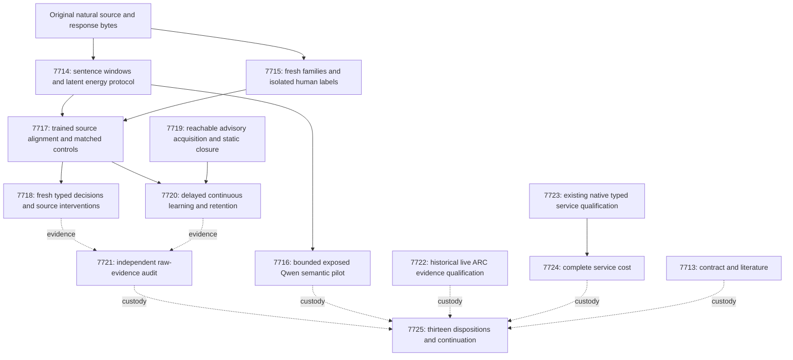

# Carnot Research Roadmap v672: Source alignment and causal acquisition

**Created:** 2026-09-26
**Milestone:** 2026.09.672
**Title:** Learned source alignment, causal constraint acquisition, and qualified service evidence
**Status:** Proposed; staged for conductor activation
**Supersedes:** 2026.09.671, Exp7699–Exp7712
**Previous design:** `research-roadmap-v671-preserved-20260926.md`, preserved byte for byte
**Execution authority:** `research-roadmap-next.yaml`, then the matching activated roadmap
**Contract:** exactly **13 tasks, exp7713 through exp7725**, in the order below, across **four phases**.

## What v671 proved

The queue completed; its scientific results have narrower scopes. The active
roadmap, producer artifacts and conductor log establish the following record.
The completed archive currently ends at V670. That archive lag is preserved.

| Evidence | Finding | What it does not establish |
|---|---|---|
| Exp7699 | Matching fourteen-task contract qualified | An administrative result is not research benefit. |
| Exp7700, Exp7701 | Record-address fixtures qualified; 400 isolated source families sealed | A byte address does not prove semantic support. |
| Exp7702 | 48 bounded Qwen calls completed on 24 exposed/fixture groups | Fixture readiness is not fresh extraction accuracy. |
| Exp7703, Exp7704 | Energy/control training ran; 368/400 families had no checked evidence and no bound tuples were found. All 40 evaluation cases escalated; paired cost reduction was zero. | No registered decision benefit. The unchanged certificate-count head is retired. |
| Exp7705, Exp7706 | Durable fixture mechanics ran; the inspected fixed-period stream rolled back six proposals. Readiness stayed zero and Exp7706 was gate-skipped. | No empirical acquisition or retained-learning null was measured. |
| Exp7707, Exp7712 | Missing science was recorded as blocked | Complete accounting does not supply missing online evidence. |
| Exp7708, Exp7709 | Fixture runner qualified initially; later its test was quarantined. Live history contains 256 actions and four Qwen calls on wa30/lf52, with no observed progress. Exp7709 failed required coverage at 22 percent. | Raw observations do not erase disqualification or estimate hidden-game success. |
| Exp7710, Exp7711 | Actual extension parity and restart work ran, but required coverage/format/Rust checks failed; service timing was skipped. A later standalone-test repair exists. | The later patch does not retroactively change the old verdict or prove complete-service speed. |

The published Exp7705 builder writes its readiness field as a constant zero.
Its fixture stream also fails to exercise a successful commit. Both must be
addressed: replacing the constant alone cannot qualify acquisition. Its
static arm must represent the complete feature closure, not an empty bank.

V665's Exp7627 remains positive for its registered 1.10x cost gate, with a
7.827x estimate that did not meet NFR-01's 10x target. Do not relabel that
artifact as a scientific failure. The FoVer 0.9131 headline and its unchanged
G1–G4 publication definition remain separate from all new hypotheses.

## Three biggest gaps to the PRD vision

1. **Source-dependent evidence for FR-12.** Exact checks work when a narrow
   claim matches their grammar. Most original language never reaches that
   grammar. Learn source-to-answer alignment and test it against controls
   with the same information, rather than fit another sparse-count head.
2. **Causal retained improvement for FR-06/FR-11.** A durable event ledger
   is useful, but a learner must commit a justified addition and improve a
   later prediction. Qualify that path, measure delayed learning, and test
   retention after restart against a complete-static comparator.
3. **Qualified reachable behavior and cost for FR-05/FR-07/FR-08.** Recover
   the actual live-agent evidence and measure the shipped native service
   through durable acknowledgement. Fixture success and kernel timing do
   not answer the end-user question.

## Research incorporated before design

The V672 entry in `research-references.md` was written before this design.
It records all eight requested research topics and all six secondary channels,
review depth, access failures and reasons to adopt or defer each lead.

| Lead | Local test | Tasks |
|---|---|---|
| [HallDetect](https://arxiv.org/html/2608.05823v1), August 2026; [Enoki](https://arxiv.org/abs/2609.00581), September 2026 | Keep original sentences and compare learned source alignment with pooled controls. Isolate representation changes. | 7714–7718 |
| [EBT](https://arxiv.org/abs/2507.02092), July 2025; [ARM–EBM](https://arxiv.org/abs/2512.15605), revised May 2026 | Normalize a small finite conditional energy and marginalize evidence location. Learned energy remains probabilistic. | 7714, 7717–7718 |
| [Structured versus semantic decoding](https://arxiv.org/abs/2609.23742), September 2026 | Separate valid Qwen output syntax and quotes from correct semantic decisions. | 7716 |
| [Delayed capacity-constrained OCO](https://arxiv.org/abs/2606.11711), June 2026; [KAN forgetting](https://arxiv.org/abs/2511.12828), November 2025 | Bound feedback and update budgets; test causality and forgetting directly. | 7719–7721 |
| [FPGA/Ising co-design](https://arxiv.org/abs/2602.15985), February 2026; [Z1T](https://extropic.ai/writing/z1t), September 2026 | Include host work and all service stages in cost accounting. | 7723–7725 |

The latent-alignment model is a **new local hypothesis**, not a reproduction
of HallDetect's pretrained entailment system. Weak response labels do not
identify sentence truth or the correct evidence location. Its latent weights
are explanation hypotheses; exact certificates retain their narrow scope.
No new pretrained encoder, generator training or external-text reranker is
introduced. AS2, ETS, ERM, KAN-CL and new p-bit samplers remain reference leads;
they do not resolve the current representation defect by themselves.

Semantic Scholar citation endpoints failed; there is no citation census.
OpenReview PDFs were challenged or inaccessible in this review. GitHub
trending views were two weeks old. Hugging Face supplied discovery leads.
Kona remains a vendor-described architecture without a local reproduction
recipe in the retrieved pages. Z1T's main projected ratios exclude readout
and movement costs, so they cannot justify a Carnot full-service claim.

## Architecture

Solid arrows are execution prerequisites. Dotted arrows are evidence accounting.
The native typed-record service is a separate existing capability. It does
not implement or accelerate the proposed source-alignment model.

## Phase 1 — Qualify the representation and fresh data

**Exp7713–Exp7715.** Register the exact task contract and paper-to-method
mapping. Administrative readiness never gates all science.

Exp7714 preserves original bytes, segments complete answer sentences, and
builds one- and three-sentence source windows. Fixed signed token/bigram
hashes and overlap, negation and numeric features replace grammar-dependent
certificate counts as the primary input. Use 64 hash bins, at most 128 source
windows and 16 answer units. Over-budget families remain in every denominator
as explicit abstentions. No silent truncation or replacement is permitted.
