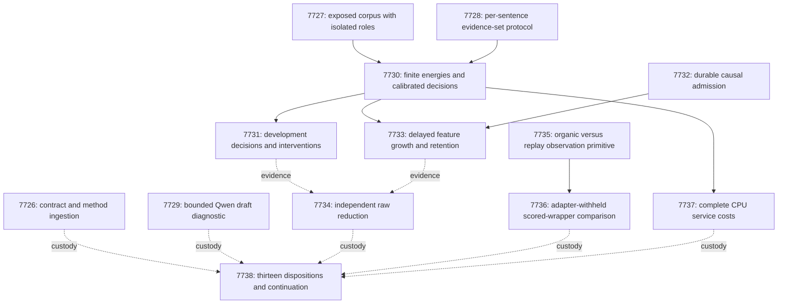

# Carnot Research Roadmap v673: Evidence sets and organic exploration

**Created:** 2026-09-26
**Milestone:** 2026.09.673
**Title:** Evidence-set decisions, causal constraint growth, and organic ARC exploration
**Status:** Proposed; staged for conductor activation
**Supersedes:** 2026.09.672, Exp7713–Exp7725
**Previous design:** `research-roadmap-v672-preserved-20260926.md`, preserved byte for byte
**Execution authority:** `research-roadmap-next.yaml`, then the matching activated roadmap
**Contract:** exactly **13 tasks, exp7726 through exp7738**, in execution order, across **four phases**.

## What v672 proved

Queue completion does not mean every scientific experiment ran. The active
roadmap, terminal artifacts and conductor log provide the following evidence.
At initial planning the completed archive ended at V671. At refusal repair,
it includes V672; its gate skips still do not constitute scientific results.

| Evidence | Observed outcome | Claim limit |
|---|---|---|
| Exp7713 | `complete_blocked_v672_independent_contract`; the design contained neither the expected task table nor machine contract | Administrative qualification failed. This design supplies both sections and validates their exact contents before delivery. |
| Exp7714 | Finite alignment protocol qualified; readiness was 1 | Exact normalization and fixtures do not establish natural-language accuracy. |
| Exp7715 | 2,894 observed families were treated as previously exposed; zero eligible fresh train/test families | The proposed fresh-400 cohort was unavailable. Its blocked verdict remains intact. |
| Exp7716 | 48 Qwen calls on 24 exposed families; 135.29 seconds recorded | Changed-module coverage was 26 percent. The terminal result was disqualified, not a usable positive pilot. |
| Exp7717, Exp7718, Exp7720 | No terminal scientific producers after upstream gate skips | No latent-alignment benefit or retained-learning null was measured. |
| Exp7719 | Five-case acquisition fixtures ran; global Python collection was a required failing gate | The fixture work did not qualify. A new, prospectively complete affected scope is required. |
| Exp7721, Exp7725 | Required scientific evidence remained blocked | Accounting completeness cannot replace missing measurements. |
| Exp7722 | Historical ARC joins and affected checks ran; terminal-reader qualification failed | No new solve or qualified generalization claim. |
| Exp7723, Exp7724 | Native parity reached 136 payloads; validation failed, including missing pytest base-directory parents, coverage and affected Clippy; timing was skipped | No qualified complete-service speedup. Preserve all failed receipts. |

The independent operator-led ARC pilots provide a new mechanism diagnosis.
V7/V8 used `visits - seen` to select an archive cell. Archive replay also
increased `seen`, contaminating the intended exploration signal. V8 gained
no new game and lost the earlier sk48 win. Earlier spacing/cap variants
showed an action tradeoff, including a real cd82 score loss. This milestone
changes observation provenance while holding that selector and replay limits
fixed. It does not repeat inert-click tuning or solve registered routes.

## Three biggest gaps to the PRD vision

1. **FR-12: usable evidence coverage.** Exact constraints cover narrow claim
   forms. The current alignment prototype shares one source location across
   an entire response. A response can need several different passages.
   Test a separate evidence location for each complete answer sentence.
2. **FR-06/FR-11: retained causal improvement.** Persistence and fixture
   mechanics are insufficient. A learned constraint addition must improve
   later decisions against both frozen and complete-static controls.
3. **FR-05/FR-07/FR-08 and NFR-01: useful reachable behavior at measured cost.**
   The live ARC process still loses useful search budget. Native service
   qualification remains incomplete. Test the measured ARC defect and time
   the new CPU consumer before committing to another native or hardware port.

## Research incorporated before design

The V673 review in `research-references.md` precedes this plan. It records
all requested topics and channels, review depth, access limits and deferrals.

| Lead | Local hypothesis or boundary | Tasks |
|---|---|---|
| [SURE-RAG](https://arxiv.org/html/2605.03534v1), 2026; [HalluSpan/EviAlign](https://arxiv.org/html/2608.15804v1), August 2026 | Evidence may be spread across passages. Compare independent sentence locations with a shared location and pooled controls. | 7726, 7728, 7730–7731 |
| [EBT](https://arxiv.org/abs/2507.02092), 2025; [ARM–EBM](https://arxiv.org/abs/2512.15605), revised May 2026 | Use finite normalized decision energy; learned probability is not proof. | 7728, 7730 |
| [DCCD](https://arxiv.org/abs/2603.03305), 2026; [structural/semantic gap](https://arxiv.org/abs/2609.23742), September 2026 | Hold tokens fixed while separating draft conditioning, output structure and semantic decisions. | 7729 |
| [Delayed capacity-constrained learning](https://arxiv.org/abs/2606.11711), 2026; [KAN forgetting](https://arxiv.org/abs/2511.12828), 2025 | Bound feedback, preserve temporal order and test retention. No theorem transfers automatically to discrete feature acquisition. | 7732–7734 |
| [FPGA–ASIC co-design](https://arxiv.org/abs/2602.15985), 2026; [Z1T](https://extropic.ai/writing/z1t) | Include parsing, orchestration, serialization and durable acknowledgement in service cost. | 7737–7738 |

This is a Carnot mechanism study, not a reproduction of a pretrained
entailment encoder. Fixed hash features may still lack semantic information.
The comparison can reject that premise. LagONN, EBD, KAN architecture changes
and new samplers remain research leads, not additional tasks in this contract.
Kona supplies vendor context without a sufficient local reproduction recipe.
Semantic Scholar citation endpoints failed. OpenReview direct pages reached
browser challenges. GitHub trending views were cached. Those gaps are recorded,
not treated as proof that no newer work exists.

## Evidence scope and data decision

V673 uses **exposed development data**. It does not relabel the RAGTruth archive
as fresh. Inventory, evaluator materialization and actual fitting are tracked
separately, but uncertain custody stays exposed. All new artifacts declare
`fresh_generalization_eligible=false`. The fresh-data limitation is unresolved.
SciHal requires registration and includes modified claims; it is not an
already qualified replacement. RAGTruth re-annotation also reuses source families.

Exp7727 freezes 640 distinct source families: fit256, tune64, policy64,
online_update96, online_admission64, evaluation64 and retention32. Evaluation
uses official test; other roles use official train. One label-blind response
per source prevents responses from multiplying independent N. Prior pilot
families and cross-role near-duplicates are excluded. A real shortage blocks
the affected branch. Roles are not shrunk after seeing data.

These roles protect within-run fitting and temporal comparisons. Historical
exposure still limits every result to a development mechanism claim. Positive
results can justify a future fresh-corpus study only. No generator weights,
production defaults, publication gates or live submissions change here.

## Architecture



Solid arrows are readiness dependencies. Dotted arrows are evidence reads
that must still report missing or blocked inputs. Administrative and Qwen
pilot results never gate the main science or ARC branch.

## Phase 1 — Establish the contract, roles and evidence-set prototype

**Exp7726–Exp7728.** Exp7726 tests the complete design against staged or
activated authority. It also maps the literature onto these exact methods.
Exp7727 provides role isolation without pretending that the corpus is fresh.
Both are infrastructure work with no benefit claim.

Exp7728 adds a distinct latent source-window index for each complete answer
sentence. Each pair has two normalized support states. Marginalization uses
`logsumexp`, grouped duplicate priors and a null-evidence state. Response
support is the product of sentence-support probabilities, evaluated in log
space. This conditional-independence assumption is tested, not certified.
Missing evidence is not automatically contradiction.

Keep the existing features and limits: at most 128 source windows and 16
answer sentences. Over-budget inputs abstain and remain in all denominators.
The original shared-location energy, pooled logistic and pooled MLP are
same-input controls. Each head has at most 4,096 trainable parameters.
Use 96 fixture groups with 32 reserved. Exact normalization, byte retention,
reordering, duplicate invariance and boundary handling must pass before fit.
Fixtures are `circular_positive`, never independent scientific positives.

## Phase 2 — Measure semantics, calibrated probabilities and decisions

**Exp7729–Exp7731.** The Qwen pilot is an independent diagnostic. Its three
arms use a 256-token ceiling: direct schema; draft128 plus schema128; and
draft128 plus unconstrained128. The 24 exposed families require at most 120
calls and 18,432 output tokens. Report syntax, valid quotes, unknowns and
binary human-label accuracy separately. The dataset does not certify a
three-way support/contradiction/insufficient label. The actual model is
`unsloth/Qwen3.8-27B-GGUF`; this is bounded generation with a 10-second floor.

Exp7730 fits finite energies with five seeds and a fixed four-configuration
budget, at most 200 epochs. Minimize fit NLL, calibrate temperature on tune,
and freeze policy before evaluation. Typed costs are accept=`5*p`,
reject=`1-p`, escalate=`0.25`, where `p` is unsupported probability.
Ties escalate. Freeze an actual complete-static model containing all at
most 16 advisory conjunctions for the later learning comparison.

Exp7731 opens evaluation labels only after model hashes freeze. A development
benefit needs paired cost reduction lower95>0 and estimate>=0.02 against all
three same-input controls, Brier reduction lower95>0 and coverage>=0.20.
Use 10,000 family bootstrap draws, seeds averaged within family, and Holm
correction across the baseline contrasts. Require Brier benefit against the
separately trained source-erased control too. Source permutations and erasure
of evaluation inputs have no inherited labels; report prediction sensitivity,
not invented counterfactual accuracy. N=64 permits a bounded mechanism study.

## Phase 3 — Qualify causal growth and measure retained learning

**Exp7732–Exp7734.** Exp7732 qualifies the durable advisory bank on 96
fixture families: 32 development, 32 one-use admission and 32 retained.
Exercise beneficial commit, harmful rejection, duplicate feedback, queue
overflow and interrupted writes. Require exactly-once updates and cold
restart parity. Readiness measures lifecycle correctness, not empirical benefit.

Exp7733 runs eight delayed-feedback blocks with at most eight proposals,
one admitted feature per block and 12 pending items. Predictions precede
feedback. Compare adaptive additions against frozen and complete-static
banks; keep shuffled feedback as a separate control. Admission uses eight
independent cases per block, mean Brier reduction>=0.01 and no increase in
false accepts. Retention labels never determine admission.

Retained benefit requires evaluation cost-reduction lower95>0 and estimate
>=0.02 against both controls, plus Brier reduction lower95>0. Average seeds
within family; use 10,000 family bootstrap draws and Holm correction.
Retention Brier-increase upper95 must be<=0.02 without more false accepts.
Zero admissions is a valid null when execution and validation pass.
Exp7734 independently reduces the raw decisions, feedback order and restart
state. Missing external evidence is blocked, never retryable partial work.

## Phase 4 — Measure organic exploration and complete service costs

**Exp7735–Exp7738.** Exp7735 qualifies organic versus replay observation
provenance through `make_carnot_agent` and `E3AgentPolicy`. Preserve existing
defaults, cell representations, tie breaks and replay limits. Test 300
default-parity decisions and ten reset/replay episodes. Use the existing
visits-minus-seen rule with the organic counter substituted. LLM induction
is disabled for this isolated mechanism; no model is loaded.

Exp7736 compares archive-off V0, V8-equivalent selection and organic
selection. Freeze games cd82, dc22, lf52, m0r0, sk48, tn36, sb26 and sc25;
use seeds 673101 and 673102. Withhold per-game adapters, engines, goals and
winning routes. Run 48 episodes, each with 2,000 charged actions and a
75-second child cap. Stop launching after 3,900 seconds. Preserve censored
episodes; incomplete pairs cannot support a benefit claim.

Reduce scores with installed SDK baseline metadata and both reset-charging
conventions until gateway parity is established. Continue only when the
eight-game bootstrap score-delta lower95>0 against both controls under both
conventions, no V0 winning seed is lost, and common-win first-level actions
stay within 10 percent. Registry-known levels earn no new solve credit.
Actual runtime attempts use `solve_provenance=live_agent_self_discovery`;
this public, adapter-withheld comparison is not hidden leaderboard evidence.

Exp7737 measures the frozen CPU service on 64 policy families. Include
parsing, windows, features, normalization, typed decisions, serialization
and durable acknowledgement. Use ten warmups and 30 randomized paired
blocks at batches 1, 8 and 32. Batch 1 is primary: p95<=100ms and <=2x the
pooled-MLP p95, with identical reload semantics. Report valid cost evidence
even when accuracy is null. Online costs require eligible Exp7733 events.

Exp7738 accounts for all thirteen tasks, including blocked and censored
branches. Apply continuation and same-verdict retirement to the measured
scope. Compute unchanged G1–G4 publication gates; make no publication,
submission, default-promotion or new hardware claim.

## Hardware and execution requirements

The existing CPU host and storage cover twelve tasks, including actual ARC
SDK episodes. Exp7729 alone needs the cached `unsloth/Qwen3.8-27B-GGUF`
through llama.cpp on the available RTX 3090 pair. Capture actual offload
and invocation evidence. Its fixed token budget is bounded generation,
with the 10-second floor; do not pad time to meet a floor.

The learning path keeps cheap counters and dictionary lookup on CPU.
Batched fitting has a GPU path; future dictionary matching has an FPGA
path. Measure the <1 microsecond bookkeeping and <1 millisecond lookup
targets separately from fitting and durable writes. No acceleration ratio
is assumed. KV260 remains limited to qualified k<=5 work, PolarFire to
Linux CPU dispatch, and GateMate to its unresolved physical/JTAG block.
NPU and TSU execution remain unqualified. No purchase or board probe is
needed to execute this milestone.

Every YAML prompt mandates flushed phase and long-call progress, loop
heartbeats, checkpoints and several calls for files over about 200 lines.
Each task requires specs and tests before implementation, affected lint,
type and coverage checks, applicable E2E, independent terminal reduction,
and operational reconciliation. ARC tasks retain E2E-009/011/013 and actual
wrapper execution; planning validation does not execute those experiments.

## Activation refusal correction

The 2026-09-26 activation guard refused Exp7736 because five matching
failures lacked structured acknowledgement. Its `prior_failures` now names
Exp5450, Exp7100, Exp7114, Exp7612 and Exp7652 with their exact artifact
verdicts, specific changed premises and `retire_if_same_verdict: true`.
Exp7735 readiness, clean validation and an eligible verdict still gate it.
No operator override is claimed. The task IDs, order, science, gates and
prompts remain those of the quarantined proposal. This document completes
the missing later phases and contract from that same proposal.

The unchanged Exp7730 input list uses the old `python/carnot/models/gibbs.py`
path. Its current package implementation is
`python/carnot/models/gibbs/__init__.py`; use that existing file when reading
the Gibbs model. This path clarification does not change the experiment.

## Exact Task Contract

Exactly 13 tasks, exp7726 through exp7738, execute in the order below.
Each result path is a separate deliverable. The JSON block also binds
experimental models, substrates and all structured prerequisites.

| Order | ID | Phase | Title | Deliverable |
|---|---|---|---|---|
| 1 | `exp7726-contract-methods` | 1 | Bind thirteen tasks and register evidence-set methods | `results/experiment_7726_v673_contract_methods.json` |
| 2 | `exp7727-development-corpus` | 1 | Seal exposed source families without relabeling them fresh | `results/experiment_7727_v673_development_corpus.json` |
| 3 | `exp7728-set-energy-protocol` | 1 | Qualify per-sentence evidence sets and exact finite normalization | `results/experiment_7728_v673_set_energy_protocol.json` |
| 4 | `exp7729-qwen-draft-pilot` | 2 | Compare bounded draft-conditioned evidence decisions | `results/experiment_7729_v673_qwen_draft_pilot.json` |
| 5 | `exp7730-set-energy-fit` | 2 | Train evidence-set probabilities and freeze typed decisions | `results/experiment_7730_v673_set_energy_fit.json` |
| 6 | `exp7731-development-decisions` | 2 | Measure evidence-set decisions and source dependence | `results/experiment_7731_v673_development_decisions.json` |
| 7 | `exp7732-causal-admission` | 3 | Qualify advisory constraint growth with scoped validation | `results/experiment_7732_v673_causal_admission.json` |
| 8 | `exp7733-continuous-set-learning` | 3 | Measure delayed constraint additions and retained decisions | `results/experiment_7733_v673_continuous_set_learning.json` |
| 9 | `exp7734-independent-evidence-audit` | 3 | Cold-reduce development decisions and feedback causality | `results/experiment_7734_v673_independent_evidence_audit.json` |
| 10 | `exp7735-arc-organic-visits` | 4 | Separate organic exploration from archive replay visits | `results/experiment_7735_v673_arc_organic_visits.json` |
| 11 | `exp7736-arc-organic-measurement` | 4 | Measure organic archive selection through the scored wrapper | `results/experiment_7736_v673_arc_organic_measurement.json` |
| 12 | `exp7737-set-service-cost` | 4 | Measure complete evidence-set service and update costs | `results/experiment_7737_v673_set_service_cost.json` |
| 13 | `exp7738-capstone` | 4 | Reconcile thirteen outcomes and bound the next continuation | `results/experiment_7738_v673_capstone.json` |

Every dependency is within this contract and precedes its consumer. Each
readiness gate also requires `flagged_adversarial=false` and `verdict_class`
in `[null, circular_positive, positive]`. Here `null` is the literal string.
Producer prompts require those exact fields. Audits and the capstone are
ungated so that missing inputs still receive terminal accounting.

| Consumer | Producer | Required readiness field |
|---|---|---|
| Exp7730 | Exp7727 | `development_cohort_ready_score == 1` |
| Exp7730 | Exp7728 | `set_protocol_ready_score == 1` |
| Exp7731 | Exp7730 | `set_heads_ready_score == 1` |
| Exp7733 | Exp7730 | `set_heads_ready_score == 1` |
| Exp7733 | Exp7732 | `acquisition_protocol_ready_score == 1` |
| Exp7736 | Exp7735 | `organic_runner_ready_score == 1` |
| Exp7737 | Exp7730 | `set_heads_ready_score == 1` |

```json
{
  "milestone": "2026.09.673",
  "tasks": [
    {"id": "exp7726-contract-methods", "title": "Bind thirteen tasks and register evidence-set methods", "phase": 1, "deliverable": "results/experiment_7726_v673_contract_methods.json", "inference_substrate_class": "aggregation", "MODEL_SPECS": [], "gated_on": []},
    {"id": "exp7727-development-corpus", "title": "Seal exposed source families without relabeling them fresh", "phase": 1, "deliverable": "results/experiment_7727_v673_development_corpus.json", "inference_substrate_class": "no_model_load", "MODEL_SPECS": [], "gated_on": []},
    {"id": "exp7728-set-energy-protocol", "title": "Qualify per-sentence evidence sets and exact finite normalization", "phase": 1, "deliverable": "results/experiment_7728_v673_set_energy_protocol.json", "inference_substrate_class": "no_model_load", "MODEL_SPECS": [], "gated_on": []},
    {"id": "exp7729-qwen-draft-pilot", "title": "Compare bounded draft-conditioned evidence decisions", "phase": 2, "deliverable": "results/experiment_7729_v673_qwen_draft_pilot.json", "inference_substrate_class": "model_bounded_generation", "MODEL_SPECS": ["unsloth/Qwen3.8-27B-GGUF"], "gated_on": []},
    {"id": "exp7730-set-energy-fit", "title": "Train evidence-set probabilities and freeze typed decisions", "phase": 2, "deliverable": "results/experiment_7730_v673_set_energy_fit.json", "inference_substrate_class": "no_model_load", "MODEL_SPECS": [], "gated_on": [{"upstream": "exp7727-development-corpus", "artifact_field": "development_cohort_ready_score", "op": "==", "value": 1}, {"upstream": "exp7727-development-corpus", "artifact_field": "flagged_adversarial", "op": "==", "value": false}, {"upstream": "exp7727-development-corpus", "artifact_field": "verdict_class", "op": "in", "value": ["null", "circular_positive", "positive"]}, {"upstream": "exp7728-set-energy-protocol", "artifact_field": "set_protocol_ready_score", "op": "==", "value": 1}, {"upstream": "exp7728-set-energy-protocol", "artifact_field": "flagged_adversarial", "op": "==", "value": false}, {"upstream": "exp7728-set-energy-protocol", "artifact_field": "verdict_class", "op": "in", "value": ["null", "circular_positive", "positive"]}]},
    {"id": "exp7731-development-decisions", "title": "Measure evidence-set decisions and source dependence", "phase": 2, "deliverable": "results/experiment_7731_v673_development_decisions.json", "inference_substrate_class": "no_model_load", "MODEL_SPECS": [], "gated_on": [{"upstream": "exp7730-set-energy-fit", "artifact_field": "set_heads_ready_score", "op": "==", "value": 1}, {"upstream": "exp7730-set-energy-fit", "artifact_field": "flagged_adversarial", "op": "==", "value": false}, {"upstream": "exp7730-set-energy-fit", "artifact_field": "verdict_class", "op": "in", "value": ["null", "circular_positive", "positive"]}]},
    {"id": "exp7732-causal-admission", "title": "Qualify advisory constraint growth with scoped validation", "phase": 3, "deliverable": "results/experiment_7732_v673_causal_admission.json", "inference_substrate_class": "no_model_load", "MODEL_SPECS": [], "gated_on": []},
    {"id": "exp7733-continuous-set-learning", "title": "Measure delayed constraint additions and retained decisions", "phase": 3, "deliverable": "results/experiment_7733_v673_continuous_set_learning.json", "inference_substrate_class": "no_model_load", "MODEL_SPECS": [], "gated_on": [{"upstream": "exp7730-set-energy-fit", "artifact_field": "set_heads_ready_score", "op": "==", "value": 1}, {"upstream": "exp7730-set-energy-fit", "artifact_field": "flagged_adversarial", "op": "==", "value": false}, {"upstream": "exp7730-set-energy-fit", "artifact_field": "verdict_class", "op": "in", "value": ["null", "circular_positive", "positive"]}, {"upstream": "exp7732-causal-admission", "artifact_field": "acquisition_protocol_ready_score", "op": "==", "value": 1}, {"upstream": "exp7732-causal-admission", "artifact_field": "flagged_adversarial", "op": "==", "value": false}, {"upstream": "exp7732-causal-admission", "artifact_field": "verdict_class", "op": "in", "value": ["null", "circular_positive", "positive"]}]},
    {"id": "exp7734-independent-evidence-audit", "title": "Cold-reduce development decisions and feedback causality", "phase": 3, "deliverable": "results/experiment_7734_v673_independent_evidence_audit.json", "inference_substrate_class": "aggregation", "MODEL_SPECS": [], "gated_on": []},
    {"id": "exp7735-arc-organic-visits", "title": "Separate organic exploration from archive replay visits", "phase": 4, "deliverable": "results/experiment_7735_v673_arc_organic_visits.json", "inference_substrate_class": "no_model_load", "MODEL_SPECS": [], "gated_on": []},
    {"id": "exp7736-arc-organic-measurement", "title": "Measure organic archive selection through the scored wrapper", "phase": 4, "deliverable": "results/experiment_7736_v673_arc_organic_measurement.json", "inference_substrate_class": "no_model_load", "MODEL_SPECS": [], "gated_on": [{"upstream": "exp7735-arc-organic-visits", "artifact_field": "organic_runner_ready_score", "op": "==", "value": 1}, {"upstream": "exp7735-arc-organic-visits", "artifact_field": "flagged_adversarial", "op": "==", "value": false}, {"upstream": "exp7735-arc-organic-visits", "artifact_field": "verdict_class", "op": "in", "value": ["null", "circular_positive", "positive"]}]},
    {"id": "exp7737-set-service-cost", "title": "Measure complete evidence-set service and update costs", "phase": 4, "deliverable": "results/experiment_7737_v673_set_service_cost.json", "inference_substrate_class": "no_model_load", "MODEL_SPECS": [], "gated_on": [{"upstream": "exp7730-set-energy-fit", "artifact_field": "set_heads_ready_score", "op": "==", "value": 1}, {"upstream": "exp7730-set-energy-fit", "artifact_field": "flagged_adversarial", "op": "==", "value": false}, {"upstream": "exp7730-set-energy-fit", "artifact_field": "verdict_class", "op": "in", "value": ["null", "circular_positive", "positive"]}]},
    {"id": "exp7738-capstone", "title": "Reconcile thirteen outcomes and bound the next continuation", "phase": 4, "deliverable": "results/experiment_7738_v673_capstone.json", "inference_substrate_class": "aggregation", "MODEL_SPECS": [], "gated_on": []}
  ]
}
```
