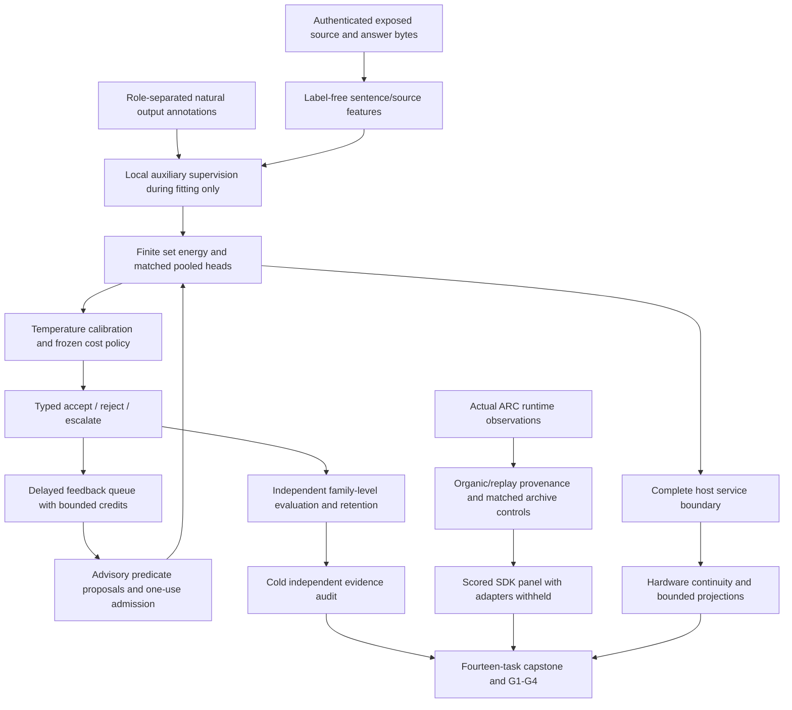
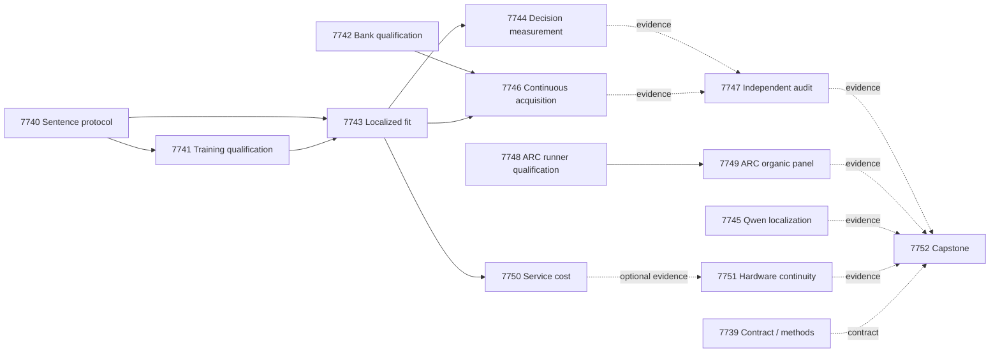

# Carnot Research Roadmap v674: Localized supervision and retained decisions

**Created:** 2026-09-26  
**Milestone:** 2026.09.674  
**Title:** Localized evidence supervision, retained constraint learning, and live exploration value  
**Status:** Proposed; not activated or executed  
**Supersedes:** 2026.09.673, Exp7726–Exp7738  
**Previous design:** [V673 preserved design](research-roadmap-v673-preserved-20260926.md), unchanged bytes  
**Execution authority:** `research-roadmap-next.yaml`, then the matching activated roadmap  
**Contract:** exactly **14 tasks, exp7739 through exp7752**, in execution order, across **four phases**.

## What V673 proved

Queue completion is not scientific qualification. The active roadmap,
terminal artifacts and conductor log establish the following distinctions.
The completed archive may lag the terminal producers; a pre-gate receipt is
not an executed scientific experiment.

| Evidence | Observed outcome | Consequence for V674 |
|---|---|---|
| Exp7726 | Contract table/JSON/YAML comparison passed, but prompt-path validation found nonexistent `python/carnot/models/gibbs.py`; disqualified | Precheck real input paths, including `python/carnot/models/gibbs/__init__.py`; preserve the old verdict. |
| Exp7727 | Qualified development corpus: 640 exposed source families, seven fixed roles | Reuse those bytes and roles. No fresh generalization claim. |
| Exp7728 | Finite sentence-location energy protocol qualified with circular-positive fixture evidence | Exact normalization is usable mathematics, not verified language understanding. |
| Exp7729 | Current Qwen CUDA pilot: 24 paired families, three arms, 347.65s, 9,358 output tokens; no draft benefit | Preserve the null. Test a different information target, localized errors, in a small bounded pilot. |
| Exp7730 | Fit disqualified: four tests covered 134/454 orchestration statements, 30% | Its all-escalate policy and set-energy Brier 0.2443 versus logistic 0.2331 are diagnostics only. Qualify a small numerical runner before new measurements. |
| Exp7732 | Bank qualification disqualified at 99% coverage; two cold-bank exception-handler lines untested | Add meaningful malformed/unreadable-state tests; retain the 100% affected-module requirement. |
| Exp7731/7733/7737 | Conductor gate blocks, no qualified decision, online-learning or cost producers | Do not call the absent experiments scientific nulls. Gate on exact current producer fields. |
| Exp7735/7736 | Organic-visit qualification disqualified; four tests, broad scope 38%, scripted six-action checks insufficient; panel blocked | Qualify actual scored-wrapper transport and observation provenance before the fixed panel. |
| Exp7734/7738 | Terminal blocked accounting of missing required evidence | Run independent audit and capstone unconditionally; external incompleteness remains blocked, not retryable partial. |

Organic-visit archive plumbing now exists. A later replay-landing repair
(`REQ-ARC-WMTE-10024`) also exists and must be reused, not reimplemented.
The previous inert-click, spacing and total-seen pilots did not establish
an overall score benefit. V674 changes the observation provenance of the
selector under matched controls; known public solves earn no new credit.

## Three biggest gaps to the PRD vision

1. **FR-06/FR-12: useful learned verification.** Finite normalization and
   aggregate response labels have not yielded qualified useful decisions.
   Train sentence risks with existing natural output annotations and test
   whether that information improves response probabilities and decisions.
2. **FR-11: retained causal self-learning.** Persistent state alone is not
   learning. Newly admitted advisory predicates must change later decisions,
   outperform frozen and complete-static controls, and preserve retention.
3. **FR-05/FR-07/FR-08 and NFR-01: useful live behavior at measured cost.**
   ARC exploration improvements lack a qualified matched live-path panel;
   service and board acceleration claims lack a complete measured boundary.
   Measure those boundaries before another native or hardware investment.

## Research incorporated before design

The 2026-09-26 V674 entry in `research-references.md` was added before this
design. It records primary sources, review depth and access limits for all
requested topics and discovery channels.

| Lead | Transfer into this milestone | Boundary |
|---|---|---|
| [HalluSpan/EviAlign](https://arxiv.org/html/2608.15804v1), Aug 2026 | Exp7740–7744 compare sentence-supervised and response-only energy/MLP heads; Exp7745 tests explicit error localization | Adapt the supervision idea using existing features; do not claim reproduction of its encoder or invent gold source alignment. |
| [EBT](https://arxiv.org/abs/2507.02092), 2025; [ARM–EBM](https://arxiv.org/abs/2512.15605), 2025/2026 | Normalized finite conditional energy and explicitly calibrated decisions | Learned probability is not a proof; no generator-weight training. |
| [Delayed capacity-constrained learning](https://arxiv.org/abs/2606.11711), Jun 2026 | Exp7742/7746 bound pending feedback and charge real acquisition credits | Continuous optimization regret guarantees do not transfer to discrete predicate admission. |
| [KAN forgetting](https://arxiv.org/abs/2511.12828), 2025; [KAN-CL](https://arxiv.org/abs/2605.12306), 2026 | Preserve retention and complete-static comparisons | KAN does not inherently prevent forgetting; defer architecture reruns with unchanged local failures. |
| [DCCD](https://arxiv.org/abs/2603.03305), 2026; [structural/semantic gap](https://arxiv.org/abs/2609.23742), Sep 2026 | Match Qwen token budgets and separate parsing, quotation and semantic outcomes | Prior draft null remains; small-model findings are not assumed to hold for Qwen27B. |
| [FPGA–ASIC co-design](https://arxiv.org/abs/2602.15985), 2026; [Extropic Z1T](https://extropic.ai/writing/z1t) | Exp7750/7751 include host, feature, readout and durable-ack cost | Vendor projections and excluded dense readout are not local measured acceleration. |

The review also checked neural constraint/sampler work (LagONN), recursive
Hopfield energy guidance, reward-guided decoding, and HalluMix. These are
recorded as deferred until a changed local prerequisite justifies them.
OpenReview primary PDFs and the HuggingFace verification feed were checked.
Semantic Scholar citation endpoint requests for both anchor papers failed;
the citation sweep is incomplete, not evidence of no citations. GitHub's
trending snapshot did not establish a new reproducible dependency.
[Kona](https://logicalintelligence.com/kona) remains vendor-level architecture
information without newly verified local implementation access.

## Architecture and authority boundaries



Exact formal verifiers remain authoritative only inside their supported
semantics. Natural annotation targets supervise advisory probabilities.
Evaluator targets never select source windows or leak into role-specific
training. Fixtures certify mechanics and receive circular-positive claims;
exposed development results cannot be promoted to fresh generalization.

## Phase 1 — Qualify the experiment before collecting outcomes

**Exp7739–Exp7742.** Bind the exact fourteen-task contract, reject private
mutations, ingest the research delta, and precheck every input path. Exp7740
maps natural character annotations to complete sentence targets while
preserving all 640 role assignments and unknown-label cases. Exp7741 tests
actual optimization, gradients, calibration, reload and resume on fixtures.
Exp7742 covers both ordinary and failed durable bank operations, including
the previously missed exception branch. These tasks open execution readiness,
not benefit gates. The contract task does not cascade-block scientific work.

## Phase 2 — Measure the value of local supervision

**Exp7743–Exp7745.** Fit seven matched small heads: local and response-only
set energy, local and response-only pooled MLP, local pooled logistic,
source-erased local set energy, and complete-static local energy. Use five
seeds, four predeclared optimizer configurations, at most 200 epochs and
4,096 trainable parameters including predicate coefficients. The local loss
is response NLL plus mean sentence NLL with coefficient one. Unknown local
targets contribute no local loss; families retain equal weight.

Keep fit256, tune64, policy64, online_update96, online_admission64,
evaluation64 and retention32 unchanged. Select configurations by mean tune
response NLL across seeds; calibrate temperature within [0.25,4]. Freeze
accept cost 5p, reject cost 1-p and escalate cost 0.25 for unsupported risk p;
ties escalate. All-escalate can be a valid null, never useful decision value.

Exp7744 evaluates every family. Seeds are averaged within family before
10,000 paired-family bootstrap draws. A strong decision claim requires
estimated cost reduction at least 0.02 with lower95>0 versus response-only
set energy, local MLP and local logistic, Brier reduction lower95>0 in all
three contrasts, coverage at least 0.20, and Holm-corrected paired tests for
six cost/Brier contrasts. Source value additionally requires Brier advantage
against a trained source-erased control on the original labels. Source
interventions measure probability sensitivity, not inherited ground truth.

Exp7745 is an independent 24-family diagnostic: direct decision/quotation
versus error-localized decision/quotation, 48 current Qwen calls, 256 output
tokens per call, at most 12,288 output tokens. Malformed/truncated answers
remain in the denominator. No pilot promotion or dependent science gate.

## Phase 3 — Test retained learning and live exploration

**Exp7746–Exp7749.** Continuous learning uses eight chronological blocks,
each with 12 update families and eight one-use admission families. Compare
adaptive additions, frozen heads, complete-static predicates and delayed
shuffled feedback under equal budgets. Forecast before feedback; allow at
most eight proposals, one per block, and 12 pending items. A proposal needs
admission Brier reduction at least 0.01 with no additional false accept;
this is an operational rule, not a significance claim. Cold-restart after
block four. Keep evaluation outputs inaccessible until final model freeze.

A retained-development claim requires evaluation cost reduction at least
0.02 with lower95>0 and Brier reduction lower95>0 versus both frozen and
complete-static arms; apply Holm correction across four effects. On
retention32, the upper95 Brier increase must be at most 0.02 with no
additional false accept. No admissions is a valid null. Record exact newly
admitted predicates, when labels became available, later parameter/decision
changes, rejected proposals, durable state and all timing boundaries.

Exp7747 independently recomputes the scientific findings and chronology,
including mutants for empty static controls, leakage and missing rows.
It runs even when producers are absent and reports terminal blocked
scientific eligibility without wasting retries. Exp7748 qualifies the
existing organic-visit mechanism through the real scored wrapper, including
the shipped replay-landing repair. It must prove that total-seen and
organic-seen controls actually differ in observation provenance while all
other selector settings remain matched. It freezes the panel before scores.

Exp7749 measures three arms on cd82, dc22, lf52, m0r0, sk48, tn36, sb26 and
sc25 with two seeds: 48 scheduled episodes, 2,000 charged actions and at
most 75 seconds each. Stop launching at 3,900 seconds; retain every censored
or unstarted row. Compute the installed SDK score from
`EnvironmentInfo.baseline_actions`, with both RESET charging conventions
until parity is established. Independent N is eight games, not 48 episodes.
Continuation needs positive lower95 paired score effects versus both
controls under both RESET conventions, corrected tests, no lost V0 winning
seed and at most 10% first-level action regression on shared wins. Missing
pairs prevent a broad benefit claim. No model calls, stored route solves,
per-game adapter help, new credit for registry-known levels or submission.

## Phase 4 — Measure delivery cost and reconcile the evidence

**Exp7750–Exp7752.** Measure complete host service for every qualified head,
regardless of accuracy outcome. Include input parsing, features, normalized
inference, calibration, typed decision, serialization and any required
durable acknowledgement. After ten warmups, run 30 paired randomized blocks
at batches 1, 8 and 32. The exploratory batch-1 p95 target is at most 100ms
and at most twice the matched local MLP. Report intervals and cold load.
Native speedup remains unmeasured; no Rust port is included.

Exp7751 independently records all boards, original evidence dates, workload
limits and exact reopening conditions. Missing service measurements limit
projections without preventing an honest inventory. Exp7752 runs after all
other tasks, reconciles fourteen dispositions and independently eligible
scientific results, computes unchanged publication gates G1–G4 and preserves
FoVer AUROC 0.9131. Missing required scientific evidence is terminal blocked.
No default change, roadmap activation, public posting or submission follows
from this planning document.

## Dependency graph



Solid edges are structured conductor gates. Each requires the exact upstream
readiness field equal to 1, `flagged_adversarial=false`, and `verdict_class`
in `[null, circular_positive, positive]`. Gate fields appear verbatim in
the producer's required fields. Principle: qualify execution independently
of benefit; an honest null must not suppress the next measurement.
Dashed edges are evidence reads, not pre-gates. Audits, hardware continuity
and capstone execute even when some evidence is unavailable.

## Hardware, resources and execution budget

| Resource | Use and limit |
|---|---|
| Existing host CPU/RAM/storage | Cached feature learning, controlled bank updates, ARC SDK, auditing and timing. No download or new dataset exposure assumed. |
| Two RTX3090 GPUs, 24GB each | Only Exp7745 needs one available owned GPU for cached Qwen3.8-27B GGUF; use actual quantization/hash and measured offload. Roughly 16GB Q4 weights still require runtime headroom. Do not evict another job. |
| KV260 | Existing SSH-accessed quadratic fabric evidence with k_max<=5; finite nonlinear set inference is not automatically supported. No new probe without a changed prerequisite. |
| PolarFire | Existing Linux CPU-only evidence; no fabric acceleration credit. |
| GateMate | Existing 0xffffffff physical/JTAG blocker; requires changed physical access evidence. |
| TSU / NPU | No qualified local access; retain vendor-versus-measurement distinction and complete dense-readout boundary. |

All LLM calls use **unsloth/Qwen3.8-27B-GGUF**. Exp7745 declares
`model_bounded_generation` (10-second floor); its fixed token pilot is not
full generation. Every other task declares no model invocation. No legacy
small model is a headline substitute. Actual failure before loading reports
`no_model_load`; timing is never padded to satisfy a duration check.

Task estimates range from 20 to 75 minutes and stay within the 4,800-second
hard cap. Exp7743/7746 use checkpoints and immutable restart hashes. Every
prompt explicitly mandates immediate flushed progress, phase-edge and
before/after long-call output, 60-second loop heartbeats, child streaming,
and silence gaps below 600 seconds. Files over about 200 lines are written
in several tool calls with progress between them.

Exp7739 uses Claude Opus/100 turns for schema/preflight coordination.
Exp7740–7742 use Codex gpt-6-sol for formulaic dataset, numerical and test
work. Other tasks keep default Claude routing, with reduced turns for
bounded audits. No gpt-6-luna tasks. Exp7751 is an evidence audit, not a
hardware integration task requiring an Opus budget.

## Validation, artifacts and retirement

All tasks emit per-unit evidence, exact denominators, provenance, closed
`verdict_class`, `gate_check_summary` for blocks, source hashes and actual
validation receipts. Each required field has a principle. Implementation
work begins with REQ/SCENARIO additions and meaningful failing tests.
Every new or changed implementation module requires 100% affected coverage;
repository-wide unrelated debt is recorded separately, never used to hide
an affected failure. Thin CLIs, numerical code and orchestration stay small
and separately testable. Cold reduction, adversarial and strict row readers
inspect the exact terminal candidate before publication.

Applicable experiment E2E includes real inference transport for Exp7745,
production train/calibrate/reload for Exp7741/7743, crash/ack bank replay for
Exp7742/7746, and E2E-009/011/013 plus actual scored SDK transitions for ARC.
Planning validation uses the existing schema, exclusion, gate, harness and
ARC readers plus independent table/JSON/YAML comparison and private
mutations. It does not pretend to execute future scientific E2E.

Prior failed scopes carry all four structured fields: exact experiment ID,
actual verdict, changed premise and `retire_if_same_verdict: true`. No retired
ID is reused and no retired producer is a structured prerequisite. Archive
historical bytes. A repeated scope with unchanged external failure is
blocked terminal, never partial. The active roadmap and conductor are not
modified by this plan.

## Exact Task Contract

### Activation-refusal repair — 2026-09-27

The unchanged exclusion guard refused the first V674 proposal because
Exp7751 lacked structured failure lineage. It matched 52 historical hardware
continuity artifacts, including receipts that completed with board blockers.
The repaired YAML records every matched artifact ID and exact verdict.
Each entry includes the changed scope and `retire_if_same_verdict: true`.

Exp7751 remains the registered evidence audit. It reads dated board receipts
and eligible Exp7750 service fractions. It preserves unresolved blockers and
requires changed prerequisites before later device execution. It does not
repeat board probes or claim that this metadata repair fixes physical access.
No operator override is used. The quarantined proposal remains the comparison
source at `ops/roadmap-quarantine/roadmap-2026.09.674-refusal1.yaml`.

The fourteen tasks, prompts, phases, gates, deliverables and model declarations
remain unchanged. The table and JSON contract below still describe them exactly.
The references file records the bounded literature recheck before re-emission.

Repair validation: exclusion, ARC-floor, schema/prior-failure, gate and
harness readers pass. Independent table/JSON/YAML checks and ten private
negative cases pass. Scoped spec coverage and guard-source Ruff pass.
Focused tests report 123 passes and two unchanged failures: the legacy
live-benchmark matcher and the active Exp7735/archive self-match.
These are recorded in ops; no guard, test or active roadmap was changed.

The following table and JSON block are literal contracts, not an aspirational
list. They contain the same fourteen tasks as `research-roadmap-next.yaml`.

| Order | Task ID | Phase | Title | Deliverable | Substrate class | MODEL_SPECS | gated_on |
|---|---|---|---|---|---|---|---|
| 1 | exp7739-contract-methods | 1 | Bind fourteen tasks and ingest localized-supervision methods | results/experiment_7739_v674_contract_methods.json | aggregation | [] | [] |
| 2 | exp7740-sentence-label-protocol | 1 | Bind natural output annotations to complete answer sentences | results/experiment_7740_v674_sentence_label_protocol.json | no_model_load | [] | [] |
| 3 | exp7741-training-qualification | 1 | Qualify normalized energy training and typed-decision execution | results/experiment_7741_v674_training_qualification.json | no_model_load | [] | [{"upstream":"exp7740-sentence-label-protocol","artifact_field":"sentence_protocol_ready_score","op":"==","value":1},{"upstream":"exp7740-sentence-label-protocol","artifact_field":"flagged_adversarial","op":"==","value":false},{"upstream":"exp7740-sentence-label-protocol","artifact_field":"verdict_class","op":"in","value":["null","circular_positive","positive"]}] |
| 4 | exp7742-bank-qualification | 1 | Qualify causal bank failures and durable constraint admission | results/experiment_7742_v674_bank_qualification.json | no_model_load | [] | [] |
| 5 | exp7743-localized-energy-fit | 2 | Train locally supervised energy probabilities and frozen decisions | results/experiment_7743_v674_localized_energy_fit.json | no_model_load | [] | [{"upstream":"exp7740-sentence-label-protocol","artifact_field":"sentence_protocol_ready_score","op":"==","value":1},{"upstream":"exp7740-sentence-label-protocol","artifact_field":"flagged_adversarial","op":"==","value":false},{"upstream":"exp7740-sentence-label-protocol","artifact_field":"verdict_class","op":"in","value":["null","circular_positive","positive"]},{"upstream":"exp7741-training-qualification","artifact_field":"training_runtime_ready_score","op":"==","value":1},{"upstream":"exp7741-training-qualification","artifact_field":"flagged_adversarial","op":"==","value":false},{"upstream":"exp7741-training-qualification","artifact_field":"verdict_class","op":"in","value":["null","circular_positive","positive"]}] |
| 6 | exp7744-decision-measurement | 2 | Measure localized decision value and source dependence | results/experiment_7744_v674_decision_measurement.json | no_model_load | [] | [{"upstream":"exp7743-localized-energy-fit","artifact_field":"localized_heads_ready_score","op":"==","value":1},{"upstream":"exp7743-localized-energy-fit","artifact_field":"flagged_adversarial","op":"==","value":false},{"upstream":"exp7743-localized-energy-fit","artifact_field":"verdict_class","op":"in","value":["null","circular_positive","positive"]}] |
| 7 | exp7745-qwen-localization | 2 | Compare bounded Qwen decisions with explicit error localization | results/experiment_7745_v674_qwen_localization.json | model_bounded_generation | ["unsloth/Qwen3.8-27B-GGUF"] | [] |
| 8 | exp7746-continuous-acquisition | 3 | Measure delayed constraint growth and retained local decisions | results/experiment_7746_v674_continuous_acquisition.json | no_model_load | [] | [{"upstream":"exp7743-localized-energy-fit","artifact_field":"localized_heads_ready_score","op":"==","value":1},{"upstream":"exp7743-localized-energy-fit","artifact_field":"flagged_adversarial","op":"==","value":false},{"upstream":"exp7743-localized-energy-fit","artifact_field":"verdict_class","op":"in","value":["null","circular_positive","positive"]},{"upstream":"exp7742-bank-qualification","artifact_field":"acquisition_protocol_ready_score","op":"==","value":1},{"upstream":"exp7742-bank-qualification","artifact_field":"flagged_adversarial","op":"==","value":false},{"upstream":"exp7742-bank-qualification","artifact_field":"verdict_class","op":"in","value":["null","circular_positive","positive"]}] |
| 9 | exp7747-independent-evidence-audit | 3 | Independently reduce supervision value and feedback causality | results/experiment_7747_v674_independent_evidence_audit.json | aggregation | [] | [] |
| 10 | exp7748-arc-runner-qualification | 3 | Qualify real organic-visit controls through the scored ARC wrapper | results/experiment_7748_v674_arc_runner_qualification.json | no_model_load | [] | [] |
| 11 | exp7749-arc-organic-measurement | 3 | Measure organic replay selection on adapter-withheld public games | results/experiment_7749_v674_arc_organic_measurement.json | no_model_load | [] | [{"upstream":"exp7748-arc-runner-qualification","artifact_field":"organic_runner_ready_score","op":"==","value":1},{"upstream":"exp7748-arc-runner-qualification","artifact_field":"flagged_adversarial","op":"==","value":false},{"upstream":"exp7748-arc-runner-qualification","artifact_field":"verdict_class","op":"in","value":["null","circular_positive","positive"]}] |
| 12 | exp7750-service-cost | 4 | Measure complete host service cost of qualified energy decisions | results/experiment_7750_v674_service_cost.json | no_model_load | [] | [{"upstream":"exp7743-localized-energy-fit","artifact_field":"localized_heads_ready_score","op":"==","value":1},{"upstream":"exp7743-localized-energy-fit","artifact_field":"flagged_adversarial","op":"==","value":false},{"upstream":"exp7743-localized-energy-fit","artifact_field":"verdict_class","op":"in","value":["null","circular_positive","positive"]}] |
| 13 | exp7751-hardware-continuity | 4 | Bound hardware next steps by authenticated service evidence | results/experiment_7751_v674_hardware_continuity.json | aggregation | [] | [] |
| 14 | exp7752-capstone | 4 | Reconcile fourteen terminal results and publication readiness | results/experiment_7752_v674_capstone.json | aggregation | [] | [] |

```json
{
  "milestone": "2026.09.674",
  "tasks": [
    {"id":"exp7739-contract-methods","title":"Bind fourteen tasks and ingest localized-supervision methods","phase":1,"deliverable":"results/experiment_7739_v674_contract_methods.json","inference_substrate_class":"aggregation","MODEL_SPECS":[],"gated_on":[]},
    {"id":"exp7740-sentence-label-protocol","title":"Bind natural output annotations to complete answer sentences","phase":1,"deliverable":"results/experiment_7740_v674_sentence_label_protocol.json","inference_substrate_class":"no_model_load","MODEL_SPECS":[],"gated_on":[]},
    {"id":"exp7741-training-qualification","title":"Qualify normalized energy training and typed-decision execution","phase":1,"deliverable":"results/experiment_7741_v674_training_qualification.json","inference_substrate_class":"no_model_load","MODEL_SPECS":[],"gated_on":[{"upstream":"exp7740-sentence-label-protocol","artifact_field":"sentence_protocol_ready_score","op":"==","value":1},{"upstream":"exp7740-sentence-label-protocol","artifact_field":"flagged_adversarial","op":"==","value":false},{"upstream":"exp7740-sentence-label-protocol","artifact_field":"verdict_class","op":"in","value":["null","circular_positive","positive"]}]},
    {"id":"exp7742-bank-qualification","title":"Qualify causal bank failures and durable constraint admission","phase":1,"deliverable":"results/experiment_7742_v674_bank_qualification.json","inference_substrate_class":"no_model_load","MODEL_SPECS":[],"gated_on":[]},
    {"id":"exp7743-localized-energy-fit","title":"Train locally supervised energy probabilities and frozen decisions","phase":2,"deliverable":"results/experiment_7743_v674_localized_energy_fit.json","inference_substrate_class":"no_model_load","MODEL_SPECS":[],"gated_on":[{"upstream":"exp7740-sentence-label-protocol","artifact_field":"sentence_protocol_ready_score","op":"==","value":1},{"upstream":"exp7740-sentence-label-protocol","artifact_field":"flagged_adversarial","op":"==","value":false},{"upstream":"exp7740-sentence-label-protocol","artifact_field":"verdict_class","op":"in","value":["null","circular_positive","positive"]},{"upstream":"exp7741-training-qualification","artifact_field":"training_runtime_ready_score","op":"==","value":1},{"upstream":"exp7741-training-qualification","artifact_field":"flagged_adversarial","op":"==","value":false},{"upstream":"exp7741-training-qualification","artifact_field":"verdict_class","op":"in","value":["null","circular_positive","positive"]}]},
    {"id":"exp7744-decision-measurement","title":"Measure localized decision value and source dependence","phase":2,"deliverable":"results/experiment_7744_v674_decision_measurement.json","inference_substrate_class":"no_model_load","MODEL_SPECS":[],"gated_on":[{"upstream":"exp7743-localized-energy-fit","artifact_field":"localized_heads_ready_score","op":"==","value":1},{"upstream":"exp7743-localized-energy-fit","artifact_field":"flagged_adversarial","op":"==","value":false},{"upstream":"exp7743-localized-energy-fit","artifact_field":"verdict_class","op":"in","value":["null","circular_positive","positive"]}]},
    {"id":"exp7745-qwen-localization","title":"Compare bounded Qwen decisions with explicit error localization","phase":2,"deliverable":"results/experiment_7745_v674_qwen_localization.json","inference_substrate_class":"model_bounded_generation","MODEL_SPECS":["unsloth/Qwen3.8-27B-GGUF"],"gated_on":[]},
    {"id":"exp7746-continuous-acquisition","title":"Measure delayed constraint growth and retained local decisions","phase":3,"deliverable":"results/experiment_7746_v674_continuous_acquisition.json","inference_substrate_class":"no_model_load","MODEL_SPECS":[],"gated_on":[{"upstream":"exp7743-localized-energy-fit","artifact_field":"localized_heads_ready_score","op":"==","value":1},{"upstream":"exp7743-localized-energy-fit","artifact_field":"flagged_adversarial","op":"==","value":false},{"upstream":"exp7743-localized-energy-fit","artifact_field":"verdict_class","op":"in","value":["null","circular_positive","positive"]},{"upstream":"exp7742-bank-qualification","artifact_field":"acquisition_protocol_ready_score","op":"==","value":1},{"upstream":"exp7742-bank-qualification","artifact_field":"flagged_adversarial","op":"==","value":false},{"upstream":"exp7742-bank-qualification","artifact_field":"verdict_class","op":"in","value":["null","circular_positive","positive"]}]},
    {"id":"exp7747-independent-evidence-audit","title":"Independently reduce supervision value and feedback causality","phase":3,"deliverable":"results/experiment_7747_v674_independent_evidence_audit.json","inference_substrate_class":"aggregation","MODEL_SPECS":[],"gated_on":[]},
    {"id":"exp7748-arc-runner-qualification","title":"Qualify real organic-visit controls through the scored ARC wrapper","phase":3,"deliverable":"results/experiment_7748_v674_arc_runner_qualification.json","inference_substrate_class":"no_model_load","MODEL_SPECS":[],"gated_on":[]},
    {"id":"exp7749-arc-organic-measurement","title":"Measure organic replay selection on adapter-withheld public games","phase":3,"deliverable":"results/experiment_7749_v674_arc_organic_measurement.json","inference_substrate_class":"no_model_load","MODEL_SPECS":[],"gated_on":[{"upstream":"exp7748-arc-runner-qualification","artifact_field":"organic_runner_ready_score","op":"==","value":1},{"upstream":"exp7748-arc-runner-qualification","artifact_field":"flagged_adversarial","op":"==","value":false},{"upstream":"exp7748-arc-runner-qualification","artifact_field":"verdict_class","op":"in","value":["null","circular_positive","positive"]}]},
    {"id":"exp7750-service-cost","title":"Measure complete host service cost of qualified energy decisions","phase":4,"deliverable":"results/experiment_7750_v674_service_cost.json","inference_substrate_class":"no_model_load","MODEL_SPECS":[],"gated_on":[{"upstream":"exp7743-localized-energy-fit","artifact_field":"localized_heads_ready_score","op":"==","value":1},{"upstream":"exp7743-localized-energy-fit","artifact_field":"flagged_adversarial","op":"==","value":false},{"upstream":"exp7743-localized-energy-fit","artifact_field":"verdict_class","op":"in","value":["null","circular_positive","positive"]}]},
    {"id":"exp7751-hardware-continuity","title":"Bound hardware next steps by authenticated service evidence","phase":4,"deliverable":"results/experiment_7751_v674_hardware_continuity.json","inference_substrate_class":"aggregation","MODEL_SPECS":[],"gated_on":[]},
    {"id":"exp7752-capstone","title":"Reconcile fourteen terminal results and publication readiness","phase":4,"deliverable":"results/experiment_7752_v674_capstone.json","inference_substrate_class":"aggregation","MODEL_SPECS":[],"gated_on":[]}
  ]
}
```
