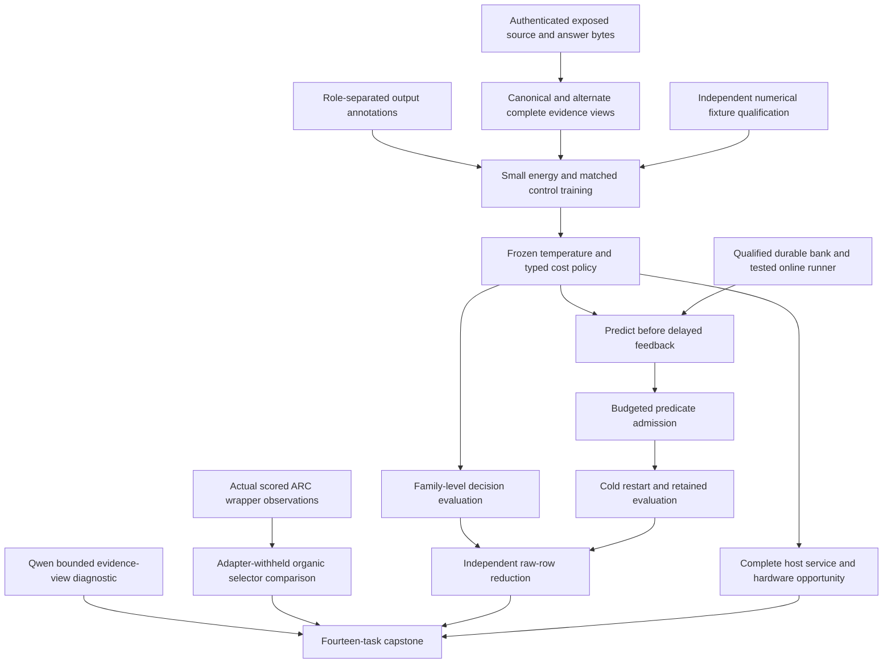
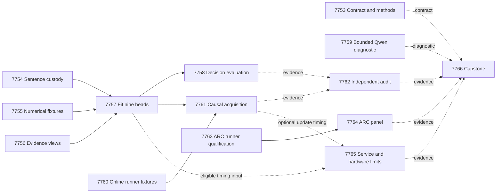

# Carnot Research Roadmap v675: Qualified evidence views and causal learning

**Created:** 2026-09-27
**Milestone:** 2026.09.675
**Title:** Qualified evidence views, calibrated decisions, and causal constraint learning
**Status:** Proposed; no experiments executed or roadmap activated by this plan
**Supersedes:** 2026.09.674, Exp7739–Exp7752
**Previous design:** [Preserved V674 design](research-roadmap-v674-preserved-20260927.md), unchanged bytes
**Execution authority:** matching `research-roadmap-next.yaml`, then matching active roadmap
**Contract:** exactly **14 tasks, exp7753 through exp7766**, in this order, across **four phases**.

## What V674 proved

The queue finished. Scientific qualification did not follow automatically.
The completed archive currently ends at V673. V674's active roster, actual
artifacts and conductor log therefore supply the immediate evidence.

| Evidence | Observed result | Consequence |
|---|---|---|
| Exp7739 | Contract and method checks qualified; `complete_null_v674_contract_methods` | Reuse the contract reader and separate readiness from benefit. |
| Exp7740 | Sentence protocol disqualified. A missing nested pytest basetemp parent caused 21 setup errors. Coverage reached 24%; an affected format check also failed. | Repair child-directory setup and formatting. Repeat required checks before natural fitting. No scientific null was measured. |
| Exp7741/7743/7744 | Training qualification, fit and decision comparison gate-blocked; declared scientific producers absent | Make fixture training independent of natural labels. Gate fitting on qualified current producers. |
| Exp7742 | Durable advisory-bank qualification passed; `complete_circular_positive_bank_lifecycle` | Reuse the bank. Qualify the missing causal learning runner separately. |
| Exp7745 | Current Qwen pilot completed 48 calls across 24 exposed families, 2,764 output tokens and 149.0s. Localization benefit remained null. | Preserve the null. Test evidence presentation sensitivity rather than repeat localization prompting. |
| Exp7746/7747 | Natural acquisition never ran; independent audit correctly blocked on missing decision and learning evidence | Require chronological raw rows from a qualified runner; keep audits unconditional. |
| Exp7748/7749 | Runner had 49 passing functional tests and 100% changed-module coverage, but CLI formatting failed. Coverage execution also recorded a skipped subprocess case. Panel gate-blocked. | Fix the exact format failure. Validate the skipped case outside coverage. Run the previously unexecuted panel only after complete qualification. |
| Exp7750/7751 | Service measurement absent; hardware inventory completed without new acceleration evidence | Measure a full current service when eligible. Preserve dated board boundaries without repeating probes. |
| Exp7752 | New scientific evidence blocked. Stable FoVer G1–G4 passed and `paper_ready=true` for that older headline. | Keep publication scope separate from these new research questions. |

Conductor pre-gate receipts can use paths different from the declared
scientific deliverables. Record both kinds. A pre-gate record explains queue
disposition; it does not provide the missing experiment's measurements.

## Three biggest gaps to the PRD vision

1. **FR-06/FR-12: useful and calibrated verification.** Carnot has finite
   energy normalization and natural annotation data. It still lacks a qualified
   local-supervision comparison that improves decisions against matched controls.
   The next question is whether evidence-view constraints improve useful risk
   estimates beyond ordinary extra-view training.
2. **FR-11: causal continuous self-learning.** Durable bank mechanics work.
   Newly acquired predicates still need to change later decisions, beat a
   complete-static control, and preserve retention through a cold restart.
3. **FR-05/FR-07/FR-08 and NFR-01: live value at measured cost.** The organic
   ARC selector lacks its qualified matched panel. Complete host decision and
   update costs remain unmeasured. These determine whether production or
   accelerator investment can produce useful system-level gains.

The current architecture is a hybrid. The generator proposes; Carnot verifies,
selects or abstains. This plan does not reopen energy-as-generator failures.
Natural labels support probabilistic decisions, not formal proofs of language.

## Research reviewed before design

The V675 review was added to `research-references.md` before these tasks were
designed. It records dates, review depth and limits for all eight requested
research topics and all six secondary discovery channels.

| Source | Planned use | Limit |
|---|---|---|
| [CCHD, June 2026](https://arxiv.org/html/2606.08158v1) | Exp7755–7758 adapt its consistency idea to two views of unchanged source bytes | No generated paraphrase labels or reproduction claim; matched augmentation and MLP controls are mandatory. |
| [HalluSpan, August 2026](https://arxiv.org/abs/2608.15804) | Recover localized output supervision before comparing decision heads | Output error spans are not gold evidence locations. |
| [EBT](https://arxiv.org/abs/2507.02092) and [ARM–EBM, revised May 2026](https://arxiv.org/abs/2512.15605) | Keep normalized finite probabilities and explicit calibration | No 27B generator training or energy-descent generation. |
| [Delayed capacity-constrained learning, June 2026](https://arxiv.org/abs/2606.11711) | Bound feedback queues, credits and chronology in Exp7760/7761 | Convex regret bounds do not apply to discrete predicate admission. |
| [KAN-CL](https://arxiv.org/abs/2605.12306) and [KAN forgetting](https://arxiv.org/abs/2511.12828) | Retain explicit retention controls | Defer another architecture until the base learning comparison qualifies. |
| [DCCD](https://arxiv.org/abs/2603.03305) and [primal-dual decoding](https://arxiv.org/abs/2605.09749) | Separate structure and semantic evidence in the bounded Qwen pilot | Preserve local prompting nulls; no diffusion-specific mechanism is assumed available in GGUF inference. |
| [FPGA–ASIC co-design, revised September 2026](https://arxiv.org/abs/2602.15985) and [Extropic Z1T](https://extropic.ai/writing/z1t) | Include orchestration, feature work, readout and acknowledgement in cost accounting | Vendor estimates and kernel speed do not establish Carnot service acceleration. |

Neural constraint projection and neural-to-Ising mappings remain recorded
leads. Neither resolves the current source-evidence or runtime qualification
problem. OpenReview's EBT PDF returned a browser challenge. Both Semantic
Scholar citation requests failed. GitHub trending views were two weeks old.
Hugging Face and Kona were checked, but supplied no newly verified local
implementation or hardware access. These limits are explicit, not negative
findings about the literature.

## Architecture



Original bytes and corpus roles remain immutable. Evaluation labels never
enter feature selection, model fitting or admission. The source-erased head
is a trained control evaluated against the original response target. A changed
source in a sensitivity probe does not inherit an invented factual label.
Fixtures certify mechanics with `circular_positive`. All natural results use
previously exposed development data; none establishes fresh generalization.

## Phase 1 — Qualify independent prerequisites

**Exp7753–Exp7756.** Bind fourteen exact tasks and ingest methods. Recover the
sentence protocol by correcting the measured child-directory and format
failures. Keep the 640 original source families and seven role assignments.
Qualify a small numerical train/calibrate/reload runner on fixtures, without
gating that work on natural labels. Separately qualify the evidence views.

View A uses existing single sentences and adjacent triples. View B uses
single sentences and adjacent pairs. Both preserve every original source
sentence and the complete answer bytes. The same 132 label-free features,
duplicate-group prior and exact normalization apply. Existing duplicate and
permutation invariance is a regression check, not a novel hypothesis.

Keep 128 source windows and 16 answer units as the maximum in either view.
If either view exceeds its limit, both views abstain and the family stays in
the denominator. No outcome-guided truncation or role reassignment is allowed.

## Phase 2 — Measure useful probabilities and decisions

**Exp7757–Exp7759.** Fit nine small heads: `response_set`, `local_set`,
`augmented_set`, `constrained_set`, `augmented_mlp`, `constrained_mlp`,
`local_logistic`, `source_erased_constrained_set`, and
`complete_static_constrained_set`. This separates local supervision, extra
view data, the constraint objective and energy-specific value.

The roles stay fit256, tune64, policy64, online_update96, online_admission64,
evaluation64 and retention32. Use five seeds, two learning rates (0.01, 0.05),
and at most 40 epochs. Cap total trainable parameters at 4,096, including
predicate coefficients and dual variables. The local supervised objective is
response NLL plus mean known-sentence NLL. Unknown sentence labels supply
no auxiliary loss. Each family keeps equal weight.

Ordinary augmented heads average the supervised loss across A/B views.
Constrained heads add the tested view-divergence and label-preservation
terms. Register symmetric Bernoulli KL/2 tolerance 0.01, alternate-view CE
tolerance 0.70, dual step 0.01, and dual clipping to [0,10]. Loss calculations
clip probabilities to [1e-6,1-1e-6]. These are local hypothesis choices;
fixture qualification must detect no-op updates and unstable gradients.

Select optimizer configuration by mean tune response NLL across seeds.
Calibrate temperature on tune using a frozen grid within [0.25,4]. Policy64
checks the fixed cost rule. It never tunes costs or thresholds. For unsupported
risk p, expected costs are accept=5p, reject=1-p, escalate=0.25. Ties escalate.

Freeze deployment before evaluation: augmented and constrained heads use mean
A/B risk per seed, followed by one decision. Canonical heads use A only.
The logistic control uses averaged features. Preserve per-view diagnostics
separately. All arms force escalation with p=0.5 for shared invalid/over-budget
views, contributing Brier=0.25 and cost=0.25 to overall denominators.
Report eligible-only metrics as secondary results.

Evaluate all 64 registered families. Average seed metrics within family before
10,000 paired-family bootstrap draws. The three primary comparators for
`constrained_set` are `augmented_set`, `constrained_mlp`, and `local_logistic`.
Useful decision value requires cost reduction >=0.02 with lower95>0, Brier
reduction lower95>0, and non-escalation coverage >=0.20. Require Holm-adjusted p<=0.05
for all six paired cost/Brier tests. Also report the localized-supervision
contrast (`local_set` vs `response_set`) and the MLP objective contrast.

Source value additionally requires Brier advantage over the trained erased
control on original labels. A probability change after evidence removal is
only sensitivity. All-escalate, underpowered and no-benefit outcomes are valid
nulls when execution qualifies. Evaluation readiness never requires a gain.

Exp7759 independently uses the same 24 exposed pilot families as Exp7745.
It compares two complete-source presentations and a source-withheld diagnostic:
72 calls maximum, 256 output tokens per call, 18,432 total output tokens.
Use `unsloth/Qwen3.8-27B-GGUF` with authenticated CUDA offload and
`model_bounded_generation` (10s floor). No fresh generalization or repair
claim follows. The source-withheld arm has no new factual-label claim.

## Phase 3 — Measure causal learning and live exploration

**Exp7760–Exp7764.** First qualify the delayed learning runner with the
already qualified bank. This fixture task runs independently of natural
fitting. It must demonstrate a real update, a changed later decision, rejection
paths, complete-static controls, and cold-restart parity.

The natural stream has eight blocks: 12 update families and eight one-use
admission families per block. Save predictions before revealing feedback.
Delay feedback one block, cap pending items at 12, and allow eight proposal
credits total. Each proposal adds an absent predicate from the existing
sixteen-predicate finite grammar. Require admission-block Brier improvement
>=0.01 with no added false accept. This is an operational admission rule.

Compare adaptive additions, frozen, complete-static and delayed shuffled
feedback. The complete-static arm starts with the entire predicate grammar.
Use the predeclared constrained-set base, independent of evaluation results.
Restart after block four; preserve model, bank, queue, credits and RNG.
Measure the complete update through durable acknowledgement.

After final freeze, a separate evaluator opens evaluation64 and retention32.
Learning value needs cost reduction >=0.02 with lower95>0 and Brier reduction
lower95>0 versus frozen and complete-static, with Holm-adjusted p<=0.05 across four
contrasts. At least one admitted predicate must affect later predictions.
Retention requires Brier-increase upper95<=0.02 and no additional false accept.
No admissions is a valid null. These remain exposed-development findings.
CPU counters and bounded batch updates provide the near-term acceleration
path; hypothetical 100x speed is not a result.

Exp7762 cold-reduces both decision and learning claims. It runs with missing
inputs and reports terminal blocked eligibility without retries. The audit
independently rejects label leaks, incomplete static controls, missing rows
and altered chronology. It does not import producer headline reducers.

Exp7763 repairs the exact ARC runner qualification failure. It retains actual
scored-wrapper transitions and organic/replay provenance checks. Exp7764 then
runs the frozen games cd82, dc22, lf52, m0r0, sk48, tn36, sb26 and sc25 with two
seeds and three controls: disabled selector, total-seen, organic-seen. All
per-game adapters, stored routes and LLM tiers are disabled.

The panel has 48 episodes, each bounded to 2,000 charged actions and 75 seconds.
Stop launching at 3,900 seconds. Keep every censored and unstarted row. Use SDK
`baseline_actions` with both RESET charging conventions. Independent N is
eight games. Continuation needs positive lower95 score effects versus both
controls under both conventions, Holm-adjusted paired p<=0.05, no lost baseline
winning seed, and at most 10% first-level action regression on shared wins.

This is live runtime self-discovery on adapter-withheld public games. It is
a generalization proxy, not hidden leaderboard evidence. Registry-precheck
prevents duplicate solve credit. No game-source reading, hand-built adapter,
offline ground-truth BFS or submission is included.

## Phase 4 — Measure service cost and reconcile

**Exp7765–Exp7766.** Service accounting executes even when timing inputs are
missing. Benchmark only qualified current heads, regardless of accuracy.
Measure parsing, all required views, features, inference, calibration,
decision, serialization, and optional update/durable acknowledgement.
After ten warmups, use 30 randomized paired timing blocks at batches 1,8,32.
Report cold load separately. The exploratory batch-1 p95 targets are <=100ms
and <=2x the matched MLP. A missed target is a measured null.

Carry dated evidence for each board. No current board probe or hardware
integration is proposed. Use measured service fractions for Amdahl bounds;
nonlinear set inference is not automatically a quadratic FPGA workload.

The capstone reconciles all fourteen dispositions and independently eligible
findings. It computes unchanged G1–G4 and preserves FoVer AUROC 0.9131.
Missing required science yields terminal `blocked`, not retryable `partial`.
No publication, policy default change or generator-weight training follows.

## Numerical contract shared by fitting, evaluation and service

Compute raw response risk per view. For two-view heads, average those risks
first, apply one response-level temperature to the mean risk logit, then
choose one decision. Tune configuration selection uses uncalibrated deployed
response NLL. Temperature fitting uses the same aggregated tune risk.
Canonical heads use A. The logistic control averages features before its head.
Abstention fallback p=0.5 bypasses temperature and always escalates.

The MLP and logistic controls must support the same local supervision.
Pool the same window features separately for each answer sentence using the
same duplicate-group prior and null window. A shared sentence head outputs
two logits: width 16 for MLP, linear for logistic. Combine sentence support
by the same product as the energy arm. The response-only energy control
uses the same architecture with no auxiliary sentence loss. This avoids
comparing a locally supervised energy against a response-only control by
accident. Qualification tests cover heads, masks and parameter budgets.

## Dependency graph



Solid edges are structured conductor gates: readiness=1, clean
`flagged_adversarial=false`, and class in `[null,circular_positive,positive]`.
Each exact field is required by its current producer. These are execution
validity gates, never positive-result gates. Dashed edges are evidence reads.
The audit, service accounting and capstone still run if evidence is absent.
The training and online fixture tasks have no natural-data gate.

## Hardware requirements and resource budget

| Resource | Use and boundary |
|---|---|
| Existing host CPU, RAM and local storage | Small JAX heads, immutable data, counters, durable bank, SDK episodes and reductions. No new corpus acquisition is assumed. |
| Two RTX3090 GPUs, 24GB each | Exp7759 uses an available owned GPU for cached Qwen27B GGUF. Resolve actual quantization/hash; allow runtime memory beyond weights. Do not evict another job. No simultaneous multi-model run is planned. |
| KV260 | Retain authenticated quadratic fabric scope, k_max<=5, accessed through SSH. A nonlinear finite set head is not an already mapped FPGA workload. |
| PolarFire | Preserve authenticated Linux CPU-dispatch evidence; no fabric speed claim. |
| GateMate | Preserve the 0xffffffff physical/JTAG blocker until the operator changes cable, port or board power conditions. |
| NPU and Extropic TSU | Unqualified local access. Defer integration and buying decisions until a useful measured workload and real runtime access exist. |

The wishlist informs future opportunities, not current availability claims.
CPU counters support immediate Tier-1 updates. Batch feature and head work
can later use GPU/Rust execution. FPGA/TSU mapping needs an explicit compatible
workload and measured host fraction. Report hardware learning targets as
hypotheses; never claim a measured 100x improvement from a projection.

Tasks budget 25–70 minutes each, within the 4,800-second task cap. Numerical
fitting stops launching at 3,900s, the ARC panel at 3,900s, and bounded Qwen at
3,300s. Final validation and atomic reporting need the remaining budget.
Every prompt requires flushed lines at phase edges, before/after long calls,
and within loops at least every 60s. Every silence gap stays below 600s.
Files over about 200 lines are written across tool calls of at most 150 lines,
with progress between them. Duration padding is prohibited.

Exp7753 uses Claude Opus with 100 turns for contract/preflight coordination.
Formulaic protocol, numerical and fixture work uses Codex gpt-6-sol.
Routine experiments and judgment use Claude, with reduced audit budgets.
No gpt-6-luna task is planned. Exp7765 reads hardware evidence; it performs
no hardware integration. Only Exp7759 loads an LLM. Its declared substrate
is bounded generation, with a 10s floor. No full-generation or load-only
experiment is mislabeled to satisfy a duration threshold.

## Validation and retirement

Planning validation uses existing schema, complete prior-failure, exclusion,
gate, harness and ARC readers. A separate parser compares the table, machine
contract and staged YAML. Private mutations must fail. Focused reader tests,
scoped lint, spec coverage and whitespace checks verify this planning change.
Scientific E2E is specified for future execution; it is not claimed complete.

Each task freezes affected scope before implementation, adds REQ/SCENARIO
coverage, writes meaningful failing tests, and requires 100% affected statement
coverage. Required formatting, typing and import checks must pass. Directory
parents are created before child pytest. Private fixtures cannot mutate public
results. Raw-row cold reduction and terminal readers inspect the exact candidate.
Do not hide owned defects in unrelated repository test debt.

ARC execution includes E2E-009/011/013 and actual offline smoke. Training uses
real train/calibrate/save/load/decide. Learning uses actual durable bank updates
and process restart. Qwen tests actual GGUF transport. Service tests complete
requests and durable acknowledgements. Every claim retains its denominator,
raw evidence, source hashes, actual substrate and closed verdict class.

Failed-scope lineages retain exact artifact verdicts and all four fields.
Where no scientific artifact exists, `GATE_BLOCK` is explicitly attributed
to the conductor log. The unchanged matcher also supplies canonical artifact
ids. No retired experiment id is reused or used as a structured prerequisite.
A repeated failed scope with the same verdict is retired. A physical blocker
is not fixed by better metadata; hardware work remains an evidence account.
External incompleteness is terminal `blocked`, not retryable `partial`.

The active roadmap, conductor, exclusion manifest and guard sources remain
unchanged. The V674 document is preserved byte for byte. No experiments,
activation, public posting or push are part of this planning work.

## Exact Task Contract

The table and JSON below are literal contracts for the same fourteen tasks.
The YAML also carries detailed prompts, complete prior-failure lineages,
runtime budgets and task-specific model routing.

| Order | Task ID | Phase | Title | Deliverable | Substrate class | MODEL_SPECS | gated_on |
|---|---|---|---|---|---|---|---|
| 1 | exp7753-contract-methods | 1 | Bind fourteen tasks and register evidence-view methods | results/experiment_7753_v675_contract_methods.json | aggregation | [] | [] |
| 2 | exp7754-sentence-protocol | 1 | Recover sentence annotation custody with real child validation | results/experiment_7754_v675_sentence_protocol.json | no_model_load | [] | [] |
| 3 | exp7755-training-runtime | 1 | Qualify small energy training independently of natural labels | results/experiment_7755_v675_training_runtime.json | no_model_load | [] | [] |
| 4 | exp7756-evidence-view-protocol | 1 | Qualify byte-preserving evidence windows and consistency targets | results/experiment_7756_v675_evidence_view_protocol.json | no_model_load | [] | [] |
| 5 | exp7757-view-energy-fit | 2 | Fit locally supervised and view-consistent decision energies | results/experiment_7757_v675_view_energy_fit.json | no_model_load | [] | [{"upstream":"exp7754-sentence-protocol","artifact_field":"sentence_protocol_ready_score","op":"==","value":1},{"upstream":"exp7754-sentence-protocol","artifact_field":"flagged_adversarial","op":"==","value":false},{"upstream":"exp7754-sentence-protocol","artifact_field":"verdict_class","op":"in","value":["null","circular_positive","positive"]},{"upstream":"exp7755-training-runtime","artifact_field":"training_runtime_ready_score","op":"==","value":1},{"upstream":"exp7755-training-runtime","artifact_field":"flagged_adversarial","op":"==","value":false},{"upstream":"exp7755-training-runtime","artifact_field":"verdict_class","op":"in","value":["null","circular_positive","positive"]},{"upstream":"exp7756-evidence-view-protocol","artifact_field":"evidence_view_ready_score","op":"==","value":1},{"upstream":"exp7756-evidence-view-protocol","artifact_field":"flagged_adversarial","op":"==","value":false},{"upstream":"exp7756-evidence-view-protocol","artifact_field":"verdict_class","op":"in","value":["null","circular_positive","positive"]}] |
| 6 | exp7758-view-decision-measurement | 2 | Measure calibration and decision value across evidence views | results/experiment_7758_v675_view_decision_measurement.json | no_model_load | [] | [{"upstream":"exp7757-view-energy-fit","artifact_field":"view_heads_ready_score","op":"==","value":1},{"upstream":"exp7757-view-energy-fit","artifact_field":"flagged_adversarial","op":"==","value":false},{"upstream":"exp7757-view-energy-fit","artifact_field":"verdict_class","op":"in","value":["null","circular_positive","positive"]}] |
| 7 | exp7759-qwen-evidence-views | 2 | Measure bounded Qwen sensitivity to evidence-window presentation | results/experiment_7759_v675_qwen_evidence_views.json | model_bounded_generation | ["unsloth/Qwen3.8-27B-GGUF"] | [] |
| 8 | exp7760-online-runner | 3 | Qualify prediction-before-feedback learning on the existing bank | results/experiment_7760_v675_online_runner.json | no_model_load | [] | [] |
| 9 | exp7761-continuous-acquisition | 3 | Measure continuous constraint additions and retained decisions | results/experiment_7761_v675_continuous_acquisition.json | no_model_load | [] | [{"upstream":"exp7757-view-energy-fit","artifact_field":"view_heads_ready_score","op":"==","value":1},{"upstream":"exp7757-view-energy-fit","artifact_field":"flagged_adversarial","op":"==","value":false},{"upstream":"exp7757-view-energy-fit","artifact_field":"verdict_class","op":"in","value":["null","circular_positive","positive"]},{"upstream":"exp7760-online-runner","artifact_field":"online_runtime_ready_score","op":"==","value":1},{"upstream":"exp7760-online-runner","artifact_field":"flagged_adversarial","op":"==","value":false},{"upstream":"exp7760-online-runner","artifact_field":"verdict_class","op":"in","value":["null","circular_positive","positive"]}] |
| 10 | exp7762-independent-evidence-audit | 3 | Cold-reduce decision effects and feedback causality | results/experiment_7762_v675_independent_evidence_audit.json | aggregation | [] | [] |
| 11 | exp7763-arc-runner-qualification | 3 | Qualify organic-visit controls after the measured format failure | results/experiment_7763_v675_arc_runner_qualification.json | no_model_load | [] | [] |
| 12 | exp7764-arc-organic-measurement | 3 | Measure organic archive selection on the scored live path | results/experiment_7764_v675_arc_organic_measurement.json | no_model_load | [] | [{"upstream":"exp7763-arc-runner-qualification","artifact_field":"organic_runner_ready_score","op":"==","value":1},{"upstream":"exp7763-arc-runner-qualification","artifact_field":"flagged_adversarial","op":"==","value":false},{"upstream":"exp7763-arc-runner-qualification","artifact_field":"verdict_class","op":"in","value":["null","circular_positive","positive"]}] |
| 13 | exp7765-service-cost | 4 | Measure complete decision service and preserve hardware limits | results/experiment_7765_v675_service_cost.json | no_model_load | [] | [] |
| 14 | exp7766-capstone | 4 | Reconcile fourteen outcomes and bound the next research decision | results/experiment_7766_v675_capstone.json | aggregation | [] | [] |

```json
{
  "milestone": "2026.09.675",
  "tasks": [
    {"order":1,"id":"exp7753-contract-methods","phase":1,"title":"Bind fourteen tasks and register evidence-view methods","deliverable":"results/experiment_7753_v675_contract_methods.json","inference_substrate_class":"aggregation","MODEL_SPECS":[],"gated_on":[]},
    {"order":2,"id":"exp7754-sentence-protocol","phase":1,"title":"Recover sentence annotation custody with real child validation","deliverable":"results/experiment_7754_v675_sentence_protocol.json","inference_substrate_class":"no_model_load","MODEL_SPECS":[],"gated_on":[]},
    {"order":3,"id":"exp7755-training-runtime","phase":1,"title":"Qualify small energy training independently of natural labels","deliverable":"results/experiment_7755_v675_training_runtime.json","inference_substrate_class":"no_model_load","MODEL_SPECS":[],"gated_on":[]},
    {"order":4,"id":"exp7756-evidence-view-protocol","phase":1,"title":"Qualify byte-preserving evidence windows and consistency targets","deliverable":"results/experiment_7756_v675_evidence_view_protocol.json","inference_substrate_class":"no_model_load","MODEL_SPECS":[],"gated_on":[]},
    {"order":5,"id":"exp7757-view-energy-fit","phase":2,"title":"Fit locally supervised and view-consistent decision energies","deliverable":"results/experiment_7757_v675_view_energy_fit.json","inference_substrate_class":"no_model_load","MODEL_SPECS":[],"gated_on":[{"upstream":"exp7754-sentence-protocol","artifact_field":"sentence_protocol_ready_score","op":"==","value":1},{"upstream":"exp7754-sentence-protocol","artifact_field":"flagged_adversarial","op":"==","value":false},{"upstream":"exp7754-sentence-protocol","artifact_field":"verdict_class","op":"in","value":["null","circular_positive","positive"]},{"upstream":"exp7755-training-runtime","artifact_field":"training_runtime_ready_score","op":"==","value":1},{"upstream":"exp7755-training-runtime","artifact_field":"flagged_adversarial","op":"==","value":false},{"upstream":"exp7755-training-runtime","artifact_field":"verdict_class","op":"in","value":["null","circular_positive","positive"]},{"upstream":"exp7756-evidence-view-protocol","artifact_field":"evidence_view_ready_score","op":"==","value":1},{"upstream":"exp7756-evidence-view-protocol","artifact_field":"flagged_adversarial","op":"==","value":false},{"upstream":"exp7756-evidence-view-protocol","artifact_field":"verdict_class","op":"in","value":["null","circular_positive","positive"]}]},
    {"order":6,"id":"exp7758-view-decision-measurement","phase":2,"title":"Measure calibration and decision value across evidence views","deliverable":"results/experiment_7758_v675_view_decision_measurement.json","inference_substrate_class":"no_model_load","MODEL_SPECS":[],"gated_on":[{"upstream":"exp7757-view-energy-fit","artifact_field":"view_heads_ready_score","op":"==","value":1},{"upstream":"exp7757-view-energy-fit","artifact_field":"flagged_adversarial","op":"==","value":false},{"upstream":"exp7757-view-energy-fit","artifact_field":"verdict_class","op":"in","value":["null","circular_positive","positive"]}]},
    {"order":7,"id":"exp7759-qwen-evidence-views","phase":2,"title":"Measure bounded Qwen sensitivity to evidence-window presentation","deliverable":"results/experiment_7759_v675_qwen_evidence_views.json","inference_substrate_class":"model_bounded_generation","MODEL_SPECS":["unsloth/Qwen3.8-27B-GGUF"],"gated_on":[]},
    {"order":8,"id":"exp7760-online-runner","phase":3,"title":"Qualify prediction-before-feedback learning on the existing bank","deliverable":"results/experiment_7760_v675_online_runner.json","inference_substrate_class":"no_model_load","MODEL_SPECS":[],"gated_on":[]},
    {"order":9,"id":"exp7761-continuous-acquisition","phase":3,"title":"Measure continuous constraint additions and retained decisions","deliverable":"results/experiment_7761_v675_continuous_acquisition.json","inference_substrate_class":"no_model_load","MODEL_SPECS":[],"gated_on":[{"upstream":"exp7757-view-energy-fit","artifact_field":"view_heads_ready_score","op":"==","value":1},{"upstream":"exp7757-view-energy-fit","artifact_field":"flagged_adversarial","op":"==","value":false},{"upstream":"exp7757-view-energy-fit","artifact_field":"verdict_class","op":"in","value":["null","circular_positive","positive"]},{"upstream":"exp7760-online-runner","artifact_field":"online_runtime_ready_score","op":"==","value":1},{"upstream":"exp7760-online-runner","artifact_field":"flagged_adversarial","op":"==","value":false},{"upstream":"exp7760-online-runner","artifact_field":"verdict_class","op":"in","value":["null","circular_positive","positive"]}]},
    {"order":10,"id":"exp7762-independent-evidence-audit","phase":3,"title":"Cold-reduce decision effects and feedback causality","deliverable":"results/experiment_7762_v675_independent_evidence_audit.json","inference_substrate_class":"aggregation","MODEL_SPECS":[],"gated_on":[]},
    {"order":11,"id":"exp7763-arc-runner-qualification","phase":3,"title":"Qualify organic-visit controls after the measured format failure","deliverable":"results/experiment_7763_v675_arc_runner_qualification.json","inference_substrate_class":"no_model_load","MODEL_SPECS":[],"gated_on":[]},
    {"order":12,"id":"exp7764-arc-organic-measurement","phase":3,"title":"Measure organic archive selection on the scored live path","deliverable":"results/experiment_7764_v675_arc_organic_measurement.json","inference_substrate_class":"no_model_load","MODEL_SPECS":[],"gated_on":[{"upstream":"exp7763-arc-runner-qualification","artifact_field":"organic_runner_ready_score","op":"==","value":1},{"upstream":"exp7763-arc-runner-qualification","artifact_field":"flagged_adversarial","op":"==","value":false},{"upstream":"exp7763-arc-runner-qualification","artifact_field":"verdict_class","op":"in","value":["null","circular_positive","positive"]}]},
    {"order":13,"id":"exp7765-service-cost","phase":4,"title":"Measure complete decision service and preserve hardware limits","deliverable":"results/experiment_7765_v675_service_cost.json","inference_substrate_class":"no_model_load","MODEL_SPECS":[],"gated_on":[]},
    {"order":14,"id":"exp7766-capstone","phase":4,"title":"Reconcile fourteen outcomes and bound the next research decision","deliverable":"results/experiment_7766_v675_capstone.json","inference_substrate_class":"aggregation","MODEL_SPECS":[],"gated_on":[]}
  ]
}
```
