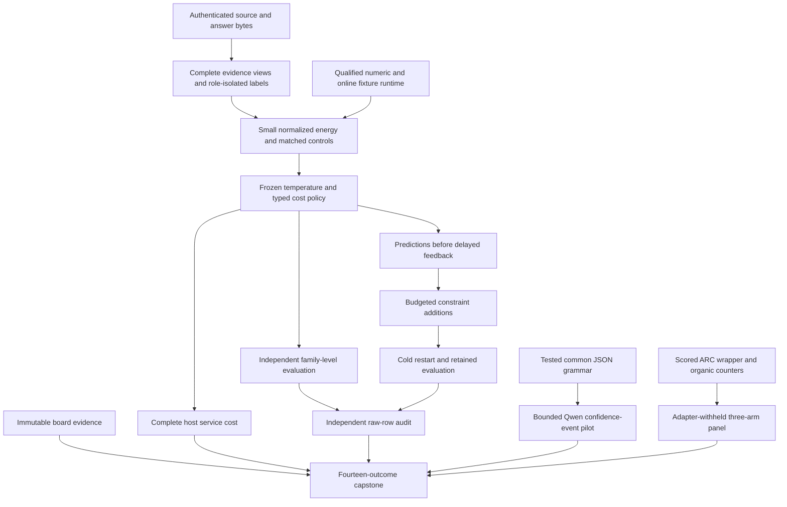
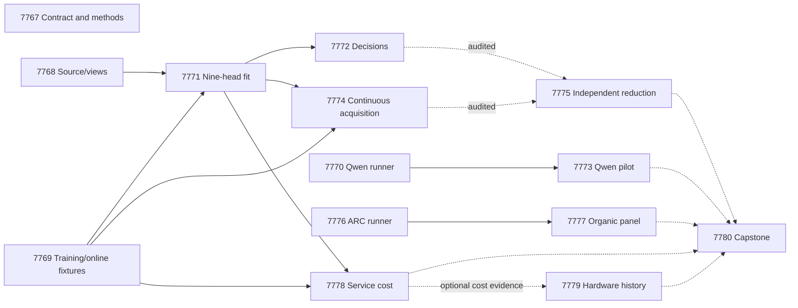

# Carnot Research Roadmap v676: Measured decisions and retained constraints

**Created:** 2026-09-27
**Milestone:** 2026.09.676
**Title:** Measured evidence decisions, causal constraint retention, and qualified live exploration
**Status:** Proposed; planning only
**Supersedes:** 2026.09.675, Exp7753–Exp7766
**Previous design:** [Preserved V675](research-roadmap-v675-preserved-20260927.md)
**Execution authority:** matching staged roadmap, then matching active roadmap
**Contract:** exactly **14 tasks, exp7767 through exp7780**, in the order below, across **four phases**.

## What V675 proved

V675 completed its queue, not its scientific program. Its active roster and
terminal artifacts provide the evidence. The completed archive currently ends
at V674. Preserve that archival lag rather than invent a completed entry.

| Experiments | Actual finding | Consequence |
|---|---|---|
| 7753 | Qualified contract and method reader; `complete_null_v675_contract_methods` | Reuse the reader. Administrative readiness does not gate science. |
| 7754, 7755, 7756 | Focused source, numerical and view checks passed. Required full Python runs stopped at the same 18 historical collection errors. All three are disqualified. | New qualification must define and verify its full affected scope prospectively. Old full-suite contracts remain unmet. |
| 7757, 7758, 7761, 7764 | Four conductor pre-gate skips; declared scientific producers absent | No natural fit, decision, learning or organic-panel null was measured. |
| 7759 | Owned module coverage was 22%. Complete-source parsing succeeded on 1/24 canonical and 2/24 alternate responses; only one family parsed in both. | Test transport and reducers before more GPU work. Conditional scores do not establish panel calibration or view invariance. |
| 7760 | Artifact reports `complete_circular_positive_online_fixture`. Its full-suite receipt failed while its spec required that pass. | Reuse code, preserve the spec mismatch, and obtain current qualification. Do not inherit readiness or fixture-trained state. |
| 7762, 7763, 7766 | Independent audit, ARC runner and capstone also failed their broad validation requirements | Preserve disqualifications. Register new affected closures and independent terminal readers. |
| 7765 | `complete_blocked_missing_qualified_fit`; an old references-file digest also mismatched the appended document | Split complete service cost from historical hardware evidence binding. |

Seven of the ten produced artifacts were disqualified. One was blocked. Two
reported qualified outcomes, with the online fixture mismatch noted above.
The 18 collection errors are observed debt, not repaired by this plan.

The concurrent outer-loop GPU induction panel was stopped incomplete after
about 11h47m. Individual inductions used 46,000–71,000 tokens. No induction
threshold was promoted. This milestone does not repeat that unbounded panel.
The shipped default-off divergence halt stays separate from the organic
exploration experiment.

## Three biggest gaps to the PRD vision

1. **FR-06 and FR-12: evidence that improves decisions.** There is no qualified
   natural comparison of the new energy heads. Complete source extraction,
   calibrated probabilities and useful accept/reject/escalate decisions must
   be tested together against matched controls.
2. **FR-11: causal continuous self-learning.** Bank mechanics are insufficient.
   Earlier feedback must cause new constraints to improve later decisions.
   The gain must exceed a complete-static control and survive a cold restart.
3. **FR-05, FR-07, FR-08 and NFR-01: useful live behavior at measured cost.**
   The organic selector has no qualified panel. Full decision and update costs
   remain unknown. These measurements must precede a new native port or
   accelerator investment.

This is a consolidation and measurement milestone. It retains the hybrid
architecture: generators propose; Carnot verifies, chooses or escalates.
It does not reopen retired external-text rankers or energy-as-generator work.

## Research used before design

The V676 entry in `research-references.md` was written before task design.
It covers all requested topics and discovery channels. It records access
failures, cached feeds, primary-paper versions and review depth.

| Finding | Experiment use | Limit |
|---|---|---|
| [CCHD, June 2026](https://arxiv.org/abs/2606.08158) | 7768/7769/7771/7772 test consistency across unchanged-byte evidence views | Compare with ordinary augmentation and an MLP; consistency alone can be equally wrong. |
| [Catalog faithfulness v3, August 2026](https://arxiv.org/abs/2608.10008v3) | 7770/7773 compare generic confidence with one explicit support event | v1's matcher and calibration conclusions were superseded. This is a language-verification transfer hypothesis. |
| [Verification Without Sufficiency, August 2026](https://arxiv.org/abs/2608.00585) | 7768 includes joint-premise completeness fixtures; 7772 checks source dependence | Keeping bytes does not prove that the feature representation captures their semantics. |
| [Delayed capacity-constrained learning, June 2026](https://arxiv.org/abs/2606.11711) | 7769/7774 enforce queue limits and prediction-before-feedback order | Its convex regret theorem is not a guarantee for discrete predicate admission. |
| [EBT](https://arxiv.org/abs/2507.02092), [ARM–EBM v4](https://arxiv.org/abs/2512.15605v4) | Exact finite normalization and explicit probability calibration | No proof of semantic truth and no generator weight update. |
| [FPGA/Ising co-design](https://arxiv.org/abs/2602.15985), [Extropic Z1T](https://extropic.ai/writing/z1t) | 7778 counts preprocessing, transport and readout; 7779 preserves hardware boundaries | External/vendor results do not establish local service acceleration. |

KAN-CL, KAC, T-SKM-Net, PAL and neural-to-Ising mappings remain recorded
leads. Another architecture is deferred until this base comparison runs.
OpenReview indexed EBT and a residual-energy adaptation submission; the EBT
forum returned a challenge. Semantic Scholar citation requests for both key
papers failed. GitHub trending views were two weeks old. Hugging Face supplied
leads verified on arXiv. Kona's vendor page supplied no new reproducible local
implementation. None of these access limits implies no relevant work exists.

## Architecture



Labels do not enter public feature selection. Original source and answer
bytes remain immutable. Natural results use historically exposed data and
cannot establish fresh generalization. Fixture truth is circular evidence.
The natural verification arm must be distinct from its annotation evaluator.

## Phase 1 — Qualify reusable prerequisites

**Exp7767–Exp7770.** Bind the contract and ingest method sections. Qualify
source custody and evidence views together. Qualify numerical training and
the real natural-head adapter for the online bank. Complete the Qwen runner's
owned tests before any new generation. These tasks run independently.

Each new task freezes its affected modules, direct tests, import dependencies
and transitive consumers before editing. Every affected check must pass.
The experiment records evidence for that closure. Broad repository collection
remains a separately reported diagnostic. This is a prospective bounded
contract, not satisfaction of V675's failed full-suite requirements. Do not
change old specs, old artifacts, guards, assertions or coverage thresholds.
Exp7767 records unresolved collection debt. A newly discovered affected
failure remains mandatory even if fixing it exceeds this milestone.

Keep the original 640 families: fit256, tune64, policy64, online_update96,
online_admission64, evaluation64 and retention32. Roles do not move. Unknown
sentence annotations add no local-label loss. They do not remove families.
Output-error spans are not gold source-evidence locations.

View A uses single sentences plus adjacent triples. View B uses single
sentences plus adjacent pairs. Both retain all source sentences, complete
answer bytes and the null window. Keep the existing 132 label-free features
and duplicate-group prior. Each view permits 128 windows and 16 answer units.
If either exceeds limits, all arms retain the family with p=0.5, Brier=0.25
and forced escalation costing 0.25. No outcome-guided truncation is allowed.
Joint-premise tests establish input reachability, not semantic verification.

Exp7769 qualifies the nine numeric heads, nonzero gradients, dual constraints,
serialization, cold restart and the online natural-head adapter. It must
enumerate all sixteen predicate coefficients in the complete-static arm.
Named fixture arms alone do not prove that this control exists.

## Phase 2 — Measure useful probabilities

**Exp7771–Exp7773.** Train the previously unexecuted comparison and measure
its decisions. Run the independent Qwen confidence-event pilot only after
its own runner qualifies.

The nine arms are `response_set`, `local_set`, `augmented_set`,
`constrained_set`, `augmented_mlp`, `constrained_mlp`, `local_logistic`,
`source_erased_constrained_set` and `complete_static_constrained_set`.
Use five seeds, learning rates 0.01 and 0.05, and at most 40 epochs.
The 4,096-parameter limit includes predicate coefficients and dual variables.
Matched MLPs use width 16 and the same per-sentence pooled features. Logistic
uses a linear head. All combine sentence support by the same product rule.

The local objective is response NLL plus mean known-sentence NLL. Augmented
heads average supervised losses across views. Constrained heads also use
symmetric Bernoulli KL/2 tolerance 0.01 and alternate-view CE tolerance 0.70.
Use dual step 0.01, clip duals to [0,10], and probabilities to [1e-6,1-1e-6].
These are local registered choices, not reproduced paper hyperparameters.

At deployment, calculate raw response risks in each view. Average A/B risks,
then apply one temperature to the average-risk logit, then make one decision.
Canonical heads use A. Logistic averages features before applying its head.
Select learning rate by mean uncalibrated deployed tune NLL across seeds.
Fit temperature on tune using the existing fixed grid in [0.25,4]. Policy64
checks the fixed rule, without tuning it: accept cost=5p, reject cost=1-p,
escalate cost=0.25; ties escalate. Abstention overrides temperature for invalid
families. Checkpoints freeze before evaluation labels open.

Evaluate all 64 evaluation families. Average seed metrics within family
before 10,000 paired-family bootstrap draws. Primary comparisons are
constrained_set versus augmented_set, constrained_mlp and local_logistic.
Useful decisions require cost reduction >=0.02 with lower95>0, Brier reduction
lower95>0, non-escalation coverage >=0.20 and Holm-adjusted p<=0.05 for all six
cost/Brier tests. Report constant fit-prevalence and always-escalate references.
Source value also requires Brier advantage over the trained erased-source
control. Low view disagreement alone does not meet this gate. All-escalate,
no-headroom and underpowered results remain valid bounded nulls.

Exp7773 uses the same 24 historically exposed pilot families as Exp7759.
Both prompts receive identical complete source/answer bytes and the same JSON
grammar. One asks generic correctness confidence; the other asks the
probability that at least one answer claim lacks source support. Convert
correctness confidence to unsupported risk with 1-p. Both emit a `probability`
field, with an optional evidence-id list. The changing target is explicit.
This panel does not tune calibration or thresholds.

Use `unsloth/Qwen3.8-27B-GGUF`, authenticated CUDA offload, one seed and
`model_bounded_generation` (10-second floor). Limit the schema canary to two
32-token calls and the panel to 48 calls of 256 output tokens. Count all
canary tokens separately. Capture is capped at 1,800 seconds. Invalid outputs
stay in primary Brier/cost denominators as p=0.5 and escalation. Report
valid-only metrics separately. Useful pilot evidence requires >=90% parse
coverage in both arms and positive lower95 cost and Brier improvements.
This small exposed pilot cannot establish fresh generalization.

## Phase 3 — Measure learning and live exploration

**Exp7774–Exp7777.** The natural learning task gates on current head and online
runtime qualification. The independent audit runs unconditionally. ARC runner
qualification and measurement form a separate branch.

Use the predeclared constrained_set base, not a head selected by evaluation.
Compare adaptive additions, frozen, complete-static and delayed shuffled
feedback. The complete-static control loads its separately fitted
complete_static_constrained_set checkpoint, with all sixteen coefficients.
Other arms start from their seed-matched constrained_set checkpoint. Keep the same five seeds and compute ceilings. Use eight blocks,
each with 12 update and 8 one-use admission families. Predictions reach durable
storage before feedback. Block b feedback arrives at the start of b+1; drain
the final pending block before final freeze. Update-feedback capacity is 12.
A separate sealed buffer holds eight one-use admission labels, for twenty
pending labels in total. Reject overflow
and duplicate feedback without changing state. Use at most eight proposal
credits, one per block, from the existing sixteen-predicate grammar.

Fit a candidate only on arrived update labels. Open its admission block once.
Require admission Brier reduction >=0.01 and no added false accept. This small
block rule is operational, not a significance test. Restart after block four
with model, bank, queue, credits and RNG preserved. Do not import fixture state.

After final freeze, use a separate evaluator for evaluation64 and retention32.
A retained-learning claim requires Brier and cost improvement over frozen and
complete-static, lower95>0 for both metrics, cost effect>=0.02 and Holm p<=0.05
for four comparisons. Retention requires Brier-degradation upper95<=0.02 and
no added false accept. Require a real admitted predicate that changes a later
decision. The shuffled-feedback arm must not reproduce the claimed benefit.
Report complete update latency through fsync and acknowledgement.

ARC keeps the prior eight games: cd82, dc22, lf52, m0r0, sk48, tn36, sb26,
sc25; seeds 67501 and 67502. Its three arms are off, total-seen and
organic-seen. Preserve the archived panel's other controls. Withhold stored
routes and per-game adapters. Use actual `make_carnot_agent` SDK transitions,
with LLM tiers disabled and zero model calls. Each of 48 scheduled episodes
has 2,000 charged actions and 75 seconds. Stop launches at 3,900 seconds.
Retain every unstarted or censored row. Do not replace a slow game.

Reduce score with installed SDK human baseline actions under both RESET
charging conventions. Average seeds within game: independent N=8. Enumerate
256 sign assignments for paired randomization. Require positive lower95 score
effects versus both controls under both conventions, Holm significance, no
lost baseline winning seed and <=10% action regression on shared wins.
Report low power and ties. All discovered progress must use
`solve_provenance: live_agent_self_discovery`. Registry-known levels earn no
new solve credit. Public exposure prevents a hidden-leaderboard claim.

## Phase 4 — Measure cost and make a continuation decision

**Exp7778–Exp7780.** Measure the complete host service only when current
heads and online mechanics qualify. Measure source ingestion, byte mapping,
features, normalized risk, calibration, decision and serialization together.
Use batch sizes 1, 8 and 32. Run ten fixed warmup batches per arm and size,
then thirty paired blocks per size. Randomize arm order within each block
using a frozen seed. Report paired timing intervals. Keep cold and warm
runs separate. Check output parity before timing. Measure private durable
updates through acknowledgement. A small kernel time cannot establish NFR-01.

The hardware audit runs even when service measurement cannot. It resolves
historical claims to immutable artifacts or Git blobs. An appended reference
file is not expected to retain its old whole-file hash. If historical bytes
cannot be recovered, exclude the unsupported claim and record the gap.
Do not silently substitute current bytes for old evidence.

The capstone accounts for all fourteen dispositions. It independently
recomputes each benefit gate and stable publication G1–G4. The existing FoVer
publication claim remains separate from V676 results. Missing external science
means `blocked`, never retryable `partial`. No task publishes, activates a
roadmap, changes defaults, or pushes.

## Dependencies and gate contract



Solid edges are runtime readiness gates. Dashed edges are unconditional
readers; absence yields explicit blocked evidence, not skipped bookkeeping.
Each readiness gate also requires `flagged_adversarial == false` and
`verdict_class in [null, circular_positive, positive]`. Every gate field
appears in its current producer's REQUIRED ARTIFACT FIELDS. No gate refers to
a retired upstream experiment. Historical artifacts are evidence and code
references, not substitutes for current producers.

| Consumer | Current producer | Required readiness field |
|---|---|---|
| 7771 | 7768 | sentence_protocol_ready_score=1; evidence_view_ready_score=1 |
| 7771 | 7769 | training_runtime_ready_score=1 |
| 7772 | 7771 | view_heads_ready_score=1 |
| 7773 | 7770 | qwen_runner_ready_score=1 |
| 7774 | 7771 and 7769 | view_heads_ready_score=1; online_runtime_ready_score=1 |
| 7777 | 7776 | organic_runner_ready_score=1 |
| 7778 | 7771 and 7769 | view_heads_ready_score=1; online_runtime_ready_score=1 |

## Hardware requirements and acquisition relevance

| Resource | Tasks and use | Boundary |
|---|---|---|
| CPU and system RAM | All qualification, small JAX heads, bank, SDK episodes and reducers | Record memory and complete costs. Small training is `no_model_load`, meaning no LLM load. |
| Existing RTX 3090 pair, 48 GB total | Exp7773 loads the cached Qwen GGUF on available authenticated CUDA capacity | One model only; do not kill unrelated servers or infer run-wide utilization from a snapshot. |
| Rust/PyO3 | Existing production code is context for cost and parity | No native speedup or new port is claimed in this milestone. |
| KV260 | Exp7779 preserves qualified fabric scope, k_max<=5 | No new bitstream, board latency or synthesis claim. Historical board evidence remains scoped. |
| PolarFire | Exp7779 preserves Linux CPU dispatch continuity | Do not recast CPU execution as FPGA acceleration. |
| GateMate | Exp7779 records the unchanged 0xffffffff physical/JTAG block | Reopen only after operator-side physical evidence changes. No repeated identical probe. |
| XDNA NPU, Extropic TSU | Preserve wishlist and availability evidence in Exp7779 | No local execution or hardware speedup. These could help only after measured service fractions justify them. |

No purchase is required. Follow the wishlist's current availability evidence,
not superseded inventory prose. Tier-1 counters use CPU; Tier-2 matching can
map to Rust/SIMD and eventually FPGA. Batched small-head updates can use GPU
or NPU after parity and resource qualification. Report Amdahl upper bounds;
a 100x target is not a measured result. No new board integration task is hidden
inside the continuity audit.

## Execution, validity and stopping rules

- Every prompt contains numbered progress and bounded-write steps. Print with
  flush at phase boundaries and around model load, generation, benchmarks and
  subprocesses. Emit progress inside loops at least every 60 seconds. Keep
  every silence gap below 600 seconds. Never pad duration.
- Write files longer than about 200 lines in several tool calls, with messages
  between calls. Poll children at intervals of at most 60 seconds. Reserve
  time for validation within the conductor's 4,800-second hard cap.
- Freeze specs and meaningful tests before implementation. Run scoped unit,
  lint, type, 100% changed-module statement and spec-coverage checks. Run real
  CLI E2E and fresh-process row reduction. ARC also runs E2E-009/011/013 and
  the offline E3 SDK smoke from `ops/e2e-test-plan.md`.
- `verdict_class` is exactly positive, circular_positive, null, blocked,
  disqualified or partial. Failed owned validation is disqualified. External
  missing, retired or invalid prerequisites are blocked with
  `gate_check_summary` naming exact observed values. Partial is reserved for
  unfinished owned work that another attempt can complete.
- All comparisons emit per-unit rows. Costs, labels, model selection,
  uncertainty, invalids and censoring remain auditable. Exposed development
  data, fixtures, live public discovery and hidden leaderboard results remain
  separate claim scopes.
- Complete four-field `prior_failures` entries record matched historical
  scopes and changed premises. Same-verdict recurrence retires that attempt.
  There is no invented operator override. Do not propose the same chain again
  without a concrete prerequisite or method change.
- Exp7767 uses Claude Opus/100 turns for contract infrastructure, per the
  current operator routing instruction. Formulaic qualification uses Codex
  gpt-6-sol. Science uses Claude Sonnet; audits have reduced turn budgets.
  There are no gpt-6-luna or Gemini tasks.

## Exact task contract

The ordered table and machine-readable block below both describe the YAML.
Artifact files do not exist merely because this plan names them. The matching
experiment must write each file after actual execution and validation.

| # | Task id | Title | Phase | Deliverable | Substrate class | MODEL_SPECS |
|---|---|---|---|---|---|---|
| 1 | exp7767-contract-methods | Bind fourteen tasks and freeze evidence and validation contracts | 1 | results/experiment_7767_v676_contract_methods.json | aggregation | [] |
| 2 | exp7768-source-view-qualification | Qualify sentence custody and complete evidence views together | 1 | results/experiment_7768_v676_source_view_qualification.json | no_model_load | [] |
| 3 | exp7769-training-qualification | Qualify normalized training under a frozen affected scope | 1 | results/experiment_7769_v676_training_qualification.json | no_model_load | [] |
| 4 | exp7770-qwen-runner-qualification | Complete Qwen transport and reducer tests before GPU capture | 1 | results/experiment_7770_v676_qwen_runner_qualification.json | no_model_load | [] |
| 5 | exp7771-view-energy-fit | Train calibrated view energies against matched augmentation | 2 | results/experiment_7771_v676_view_energy_fit.json | no_model_load | [] |
| 6 | exp7772-decision-measurement | Measure source-dependent probabilities and typed decisions | 2 | results/experiment_7772_v676_decision_measurement.json | no_model_load | [] |
| 7 | exp7773-qwen-event-confidence | Compare generic confidence with explicit source-support probability | 2 | results/experiment_7773_v676_qwen_event_confidence.json | model_bounded_generation | ["unsloth/Qwen3.8-27B-GGUF"] |
| 8 | exp7774-continuous-acquisition | Measure delayed constraint addition and retained decision value | 3 | results/experiment_7774_v676_continuous_acquisition.json | no_model_load | [] |
| 9 | exp7775-independent-evidence-audit | Independently reduce calibration and causal learning evidence | 3 | results/experiment_7775_v676_independent_evidence_audit.json | aggregation | [] |
| 10 | exp7776-arc-runner-qualification | Qualify organic exploration with complete affected ARC checks | 3 | results/experiment_7776_v676_arc_runner_qualification.json | no_model_load | [] |
| 11 | exp7777-arc-organic-measurement | Measure adapter-withheld organic selection through the live wrapper | 3 | results/experiment_7777_v676_arc_organic_measurement.json | no_model_load | [] |
| 12 | exp7778-service-cost | Measure complete frozen decision and durable-update service cost | 4 | results/experiment_7778_v676_service_cost.json | no_model_load | [] |
| 13 | exp7779-hardware-evidence | Bind hardware continuity to immutable historical evidence | 4 | results/experiment_7779_v676_hardware_evidence.json | aggregation | [] |
| 14 | exp7780-capstone | Reconcile fourteen outcomes and decide continuation from raw evidence | 4 | results/experiment_7780_v676_capstone.json | aggregation | [] |

<!-- V676_TASK_CONTRACT_BEGIN -->
```json
{
  "milestone": "2026.09.676",
  "tasks": [
    {"id": "exp7767-contract-methods", "title": "Bind fourteen tasks and freeze evidence and validation contracts", "phase": 1, "deliverable": "results/experiment_7767_v676_contract_methods.json", "inference_substrate_class": "aggregation", "MODEL_SPECS": [], "gated_on": []},
    {"id": "exp7768-source-view-qualification", "title": "Qualify sentence custody and complete evidence views together", "phase": 1, "deliverable": "results/experiment_7768_v676_source_view_qualification.json", "inference_substrate_class": "no_model_load", "MODEL_SPECS": [], "gated_on": []},
    {"id": "exp7769-training-qualification", "title": "Qualify normalized training under a frozen affected scope", "phase": 1, "deliverable": "results/experiment_7769_v676_training_qualification.json", "inference_substrate_class": "no_model_load", "MODEL_SPECS": [], "gated_on": []},
    {"id": "exp7770-qwen-runner-qualification", "title": "Complete Qwen transport and reducer tests before GPU capture", "phase": 1, "deliverable": "results/experiment_7770_v676_qwen_runner_qualification.json", "inference_substrate_class": "no_model_load", "MODEL_SPECS": [], "gated_on": []},
    {"id": "exp7771-view-energy-fit", "title": "Train calibrated view energies against matched augmentation", "phase": 2, "deliverable": "results/experiment_7771_v676_view_energy_fit.json", "inference_substrate_class": "no_model_load", "MODEL_SPECS": [], "gated_on": [{"upstream": "exp7768-source-view-qualification", "artifact_field": "sentence_protocol_ready_score", "op": "==", "value": 1}, {"upstream": "exp7768-source-view-qualification", "artifact_field": "flagged_adversarial", "op": "==", "value": false}, {"upstream": "exp7768-source-view-qualification", "artifact_field": "verdict_class", "op": "in", "value": ["null", "circular_positive", "positive"]}, {"upstream": "exp7768-source-view-qualification", "artifact_field": "evidence_view_ready_score", "op": "==", "value": 1}, {"upstream": "exp7768-source-view-qualification", "artifact_field": "flagged_adversarial", "op": "==", "value": false}, {"upstream": "exp7768-source-view-qualification", "artifact_field": "verdict_class", "op": "in", "value": ["null", "circular_positive", "positive"]}, {"upstream": "exp7769-training-qualification", "artifact_field": "training_runtime_ready_score", "op": "==", "value": 1}, {"upstream": "exp7769-training-qualification", "artifact_field": "flagged_adversarial", "op": "==", "value": false}, {"upstream": "exp7769-training-qualification", "artifact_field": "verdict_class", "op": "in", "value": ["null", "circular_positive", "positive"]}]},
    {"id": "exp7772-decision-measurement", "title": "Measure source-dependent probabilities and typed decisions", "phase": 2, "deliverable": "results/experiment_7772_v676_decision_measurement.json", "inference_substrate_class": "no_model_load", "MODEL_SPECS": [], "gated_on": [{"upstream": "exp7771-view-energy-fit", "artifact_field": "view_heads_ready_score", "op": "==", "value": 1}, {"upstream": "exp7771-view-energy-fit", "artifact_field": "flagged_adversarial", "op": "==", "value": false}, {"upstream": "exp7771-view-energy-fit", "artifact_field": "verdict_class", "op": "in", "value": ["null", "circular_positive", "positive"]}]},
    {"id": "exp7773-qwen-event-confidence", "title": "Compare generic confidence with explicit source-support probability", "phase": 2, "deliverable": "results/experiment_7773_v676_qwen_event_confidence.json", "inference_substrate_class": "model_bounded_generation", "MODEL_SPECS": ["unsloth/Qwen3.8-27B-GGUF"], "gated_on": [{"upstream": "exp7770-qwen-runner-qualification", "artifact_field": "qwen_runner_ready_score", "op": "==", "value": 1}, {"upstream": "exp7770-qwen-runner-qualification", "artifact_field": "flagged_adversarial", "op": "==", "value": false}, {"upstream": "exp7770-qwen-runner-qualification", "artifact_field": "verdict_class", "op": "in", "value": ["null", "circular_positive", "positive"]}]},
    {"id": "exp7774-continuous-acquisition", "title": "Measure delayed constraint addition and retained decision value", "phase": 3, "deliverable": "results/experiment_7774_v676_continuous_acquisition.json", "inference_substrate_class": "no_model_load", "MODEL_SPECS": [], "gated_on": [{"upstream": "exp7771-view-energy-fit", "artifact_field": "view_heads_ready_score", "op": "==", "value": 1}, {"upstream": "exp7771-view-energy-fit", "artifact_field": "flagged_adversarial", "op": "==", "value": false}, {"upstream": "exp7771-view-energy-fit", "artifact_field": "verdict_class", "op": "in", "value": ["null", "circular_positive", "positive"]}, {"upstream": "exp7769-training-qualification", "artifact_field": "online_runtime_ready_score", "op": "==", "value": 1}, {"upstream": "exp7769-training-qualification", "artifact_field": "flagged_adversarial", "op": "==", "value": false}, {"upstream": "exp7769-training-qualification", "artifact_field": "verdict_class", "op": "in", "value": ["null", "circular_positive", "positive"]}]},
    {"id": "exp7775-independent-evidence-audit", "title": "Independently reduce calibration and causal learning evidence", "phase": 3, "deliverable": "results/experiment_7775_v676_independent_evidence_audit.json", "inference_substrate_class": "aggregation", "MODEL_SPECS": [], "gated_on": []},
    {"id": "exp7776-arc-runner-qualification", "title": "Qualify organic exploration with complete affected ARC checks", "phase": 3, "deliverable": "results/experiment_7776_v676_arc_runner_qualification.json", "inference_substrate_class": "no_model_load", "MODEL_SPECS": [], "gated_on": []},
    {"id": "exp7777-arc-organic-measurement", "title": "Measure adapter-withheld organic selection through the live wrapper", "phase": 3, "deliverable": "results/experiment_7777_v676_arc_organic_measurement.json", "inference_substrate_class": "no_model_load", "MODEL_SPECS": [], "gated_on": [{"upstream": "exp7776-arc-runner-qualification", "artifact_field": "organic_runner_ready_score", "op": "==", "value": 1}, {"upstream": "exp7776-arc-runner-qualification", "artifact_field": "flagged_adversarial", "op": "==", "value": false}, {"upstream": "exp7776-arc-runner-qualification", "artifact_field": "verdict_class", "op": "in", "value": ["null", "circular_positive", "positive"]}]},
    {"id": "exp7778-service-cost", "title": "Measure complete frozen decision and durable-update service cost", "phase": 4, "deliverable": "results/experiment_7778_v676_service_cost.json", "inference_substrate_class": "no_model_load", "MODEL_SPECS": [], "gated_on": [{"upstream": "exp7771-view-energy-fit", "artifact_field": "view_heads_ready_score", "op": "==", "value": 1}, {"upstream": "exp7771-view-energy-fit", "artifact_field": "flagged_adversarial", "op": "==", "value": false}, {"upstream": "exp7771-view-energy-fit", "artifact_field": "verdict_class", "op": "in", "value": ["null", "circular_positive", "positive"]}, {"upstream": "exp7769-training-qualification", "artifact_field": "online_runtime_ready_score", "op": "==", "value": 1}, {"upstream": "exp7769-training-qualification", "artifact_field": "flagged_adversarial", "op": "==", "value": false}, {"upstream": "exp7769-training-qualification", "artifact_field": "verdict_class", "op": "in", "value": ["null", "circular_positive", "positive"]}]},
    {"id": "exp7779-hardware-evidence", "title": "Bind hardware continuity to immutable historical evidence", "phase": 4, "deliverable": "results/experiment_7779_v676_hardware_evidence.json", "inference_substrate_class": "aggregation", "MODEL_SPECS": [], "gated_on": []},
    {"id": "exp7780-capstone", "title": "Reconcile fourteen outcomes and decide continuation from raw evidence", "phase": 4, "deliverable": "results/experiment_7780_v676_capstone.json", "inference_substrate_class": "aggregation", "MODEL_SPECS": [], "gated_on": []}
  ]
}
```
<!-- V676_TASK_CONTRACT_END -->

## Planning validation

Run the unchanged roadmap schema, prior-failure, exclusion, gate, harness-fit,
ARC-floor and priority readers. Independently compare the literal table, JSON
contract and YAML. Exercise private contract mutations. Check every existing
input path and every gate producer field. Run relevant guard unit tests, scoped
lint and spec coverage. Record exact results in ops and traceability.

Planning E2E is the staged-file reader and rejection path. No model or SDK
experiment runs during planning. Runtime E2E remains required within each
applicable experiment. The active roadmap and conductor must retain their
original hashes.
