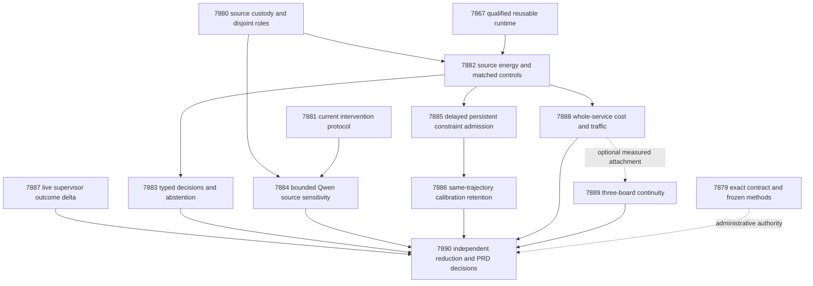
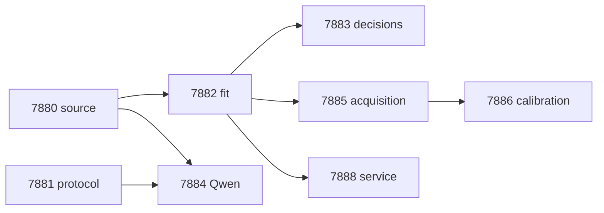

# Carnot Research Roadmap v684: Executable Decisions and Retained Calibration

**Created:** 2026-09-29  
**Milestone:** 2026.09.684  
**Status:** Proposed; staged, not activated  
**Title:** Executable source decisions, retained calibration, and causal constraint learning  
**Supersedes:** completed milestone 2026.09.683, Exp7865–Exp7878  
**Preserved predecessor:** [V683 original design](research-roadmap-v683-preserved-20260929.md)  
**Execution authority:** [research-roadmap-next.yaml](../../research-roadmap-next.yaml)  
**Planning requirement:** REQ-REPORT-PLAN-684 in the research-reporting capability.

This milestone contains **12 tasks, exp7879 through exp7890, in that order,
across four phases**. Six tasks measure science: energy fitting, typed
decisions, bounded Qwen source sensitivity, causal constraint acquisition,
calibration retention and full service cost. The other tasks qualify inputs,
bind methods, preserve ARC/board obligations and independently reconcile results.
Every task has one terminal JSON deliverable named in the exact contract below.

## What V683 proved

The completed archive and conductor log list fourteen tasks: eight producer
artifacts and six `GATE_BLOCKED` dispatches. The artifacts contain **seven
disqualified results and one circular positive**. An `OK` conductor entry
means the agent finished; it does not upgrade the artifact's scientific class.

| Evidence | Finding from actual bytes | Consequence |
|---|---|---|
| Exp7865 contract | Contract mutations, focused tests and changed coverage passed; required whole-suite pytest and global spec coverage failed | Preserve disqualification. Fix new command scope before measurement. |
| Exp7866 source | Source fixtures passed; coverage recorded no data; final venue was illegal `host_cpu`; full suite timed out | Qualify real measured files and emit `host`. No source science was licensed. |
| Exp7867 natural runtime | `complete_circular_positive_fixture_runtime`; training and online readiness both 1 | Reuse numerical/persistence primitives. This is not natural-data benefit. |
| Exp7868 intervention | Code/fixture-hash checkpoint repair and 310-statement unit/CLI coverage exist; required full-suite child timed out | Preserve the disqualified receipt; qualify the current primitive boundary through explicit commands. |
| Exp7869–Exp7873, Exp7875 | Six skipped scientific producers | No fitting, decisions, Qwen study, causal acquisition, scheduling or service measurement was established. |
| Exp7874 ARC delta | Generated argv named a nonexistent test; coverage had no data; terminal validation disqualified the result | Use real paths and inspect genuinely new outcome receipts only. |
| Exp7876 boards | Historical board facts remain; changed coverage and full-suite checks failed | Preserve board facts, not the failed readiness claim. |
| Exp7877/Exp7878 | Repeated full-suite failures; capstone also rejected a legitimate `scripts/` import root | Combine independent reduction and reconciliation once, with valid explicit imports. |

No V683 result closes the verifier or self-learning gap. The September 28
oracle-distinct corrigendum remains binding: Exp4245/5160/5171 do not establish
an independent learned-verifier win. Existing full-suite failures and 1,142
untraced tests reported by Exp7865 remain recorded; this plan does not repair
or relabel them. Historical artifacts are immutable evidence, not editable gates.

## Three biggest gaps to the PRD vision

1. **Useful source-grounded decisions — FR-12.** Extraction and exact structural
   checks exist, but current natural energy comparisons never ran. A calibrated
   risk must beat same-information controls on Brier and actual decision cost,
   survive source/length shortcuts and retain meaningful automated coverage.
   The exposed development corpus can select mechanisms, not close independent
   generalization or certify arbitrary natural-language truth.
2. **Retained autonomous learning — FR-11.** Persistence and a working admission
   API do not show improvement. A new constraint must affect a later decision
   after feedback, beat complete-static/no-write controls and retain old-task
   performance. Confidence retention is a separate question from accuracy.
3. **Complete deployment and live-path evidence — FR-05/FR-08/NFR-01.** A fast
   scorer is insufficient if projection, transfers or durable writes dominate.
   Measure the whole service before a Rust/FPGA investment. ARC supervisor
   evidence must come from the live discovery path; historical board receipts
   and public-game solves cannot stand in for new generalization or speedup.

## Research incorporated before design

The [V684 review](../../research-references.md#v684-planning-review--2026-09-29-recorded-before-design)
was appended before task design. It covers all eight requested topics and all
six secondary sources. Methods are adaptations, not reproductions of papers'
headline results. Most references were already known and were rechecked.

| Source | Concrete use | Boundary |
|---|---|---|
| [Continual Calibration, 2604.23987](https://arxiv.org/abs/2604.23987), April 2026 | Exp7886 holds learned states fixed and compares refreshed versus stale confidence policies | No generator fine-tuning or formal coverage claim. |
| [Memoir, 2607.20792](https://arxiv.org/abs/2607.20792), July 2026 | Exp7885 measures write timing and includes no-write controls | Procedural memory findings motivate controls, not a natural-text effect. |
| [Verification Without Sufficiency, 2608.00585](https://arxiv.org/abs/2608.00585), August 2026 | Exp7884 compares witness, neighboring context and matched filler | Edited contexts have no independent new truth labels. |
| [Structural/semantic decoding gap, 2609.23742](https://arxiv.org/abs/2609.23742), September 2026 | Exp7881/7884 separate syntax, byte fidelity and semantic risk | Small-model findings are not Qwen3.8-27B evidence. |
| [Cross-block DBM, 2609.14934](https://arxiv.org/abs/2609.14934), September 2026 | Exp7882 preserves observed-label masks and matched conditioning | This small selector is not a deep-Boltzmann reproduction. |
| [Delayed OCO, 2602.02634](https://arxiv.org/abs/2602.02634), February 2026 | Exp7885 records feedback release and outstanding observations | Discrete admission inherits no convex regret guarantee. |
| [P-computer, 2607.21077](https://arxiv.org/abs/2607.21077), July 2026; [Z1T](https://extropic.ai/writing/z1t), September 2026 | Exp7888/7889 account for coupling traffic and host service work | Vendor/device claims are not local timings. |

EBT, ARM–EBM, NSVIF, KAN forgetting and guided-decoding work remain context.
Another KAN/importance-anchor sweep, generic external-text reranker, generator
training and unchanged board probes remain out of scope. Semantic Scholar
returned ten EBT citations with pagination incomplete and eight ARM–EBM
citations. OpenReview direct pages hit browser checks; GitHub trending crawls
were stale; a Hugging Face paper page failed. Kona supplied architecture
framing, not a reproducible algorithm. These limits do not become novelty claims.

## Architecture



Raw source/answer bytes feed the risk model; labels remain in role-restricted
evaluator shards. Feedback crosses a time gate before training or admission.
Calibration never selects predicates. The only pretrained-model invocation is
the bounded Qwen study; tiny energy-head fitting is CPU work.


## Phase 1 — Qualified inputs and executable methods

**Exp7879–Exp7881; 135 minutes estimated.** Exp7879 binds the twelve-task
contract and prospectively freezes methods, command paths and affected
regressions. It is administrative and does not gate every scientific branch.
Exp7880 qualifies source custody using real measured coverage and the valid
`host` venue. Exp7881 exercises the repaired intervention/checkpoint library
with 24 CPU fixture families and explicit child commands. Neither qualification
claims a learned verifier benefit.

The source manifest contains 640 unique exposed development families:

| Role | Families | Permitted label use |
|---|---:|---|
| fit | 256 | Head fitting and fixed feature definitions |
| tune | 64 | Frozen temperature grid selection |
| policy_design | 32 | Decision/coverage threshold design |
| calibration_replay | 32 | Exp7886 calibration only; never bank admission |
| online_update | 96 | Coefficients after feedback release |
| online_admission | 64 | Candidate acceptance after feedback release |
| evaluation | 64 | Final fixed-policy comparisons |
| retention | 32 | Final old-task damage measurement |

The two 32-family policy subroles are a hash split of the existing 64-family
policy role, made before looking at outcomes. Group source-plus-answer
duplicates together. Preserve original text, revision, license, annotation and
byte offsets; separate public-byte and evaluator-label shards. Unknown labels
stay unknown. Fewer than 640 eligible families blocks source qualification;
duplicates and invented negatives cannot fill the shortfall. Historical corpus
exposure is explicit even when the current process enforces role isolation.

## Phase 2 — Useful decisions and source sufficiency

**Exp7882–Exp7884; 170 minutes estimated.** Exp7882 runs the natural comparison
that V683 never reached. Nine arms are fixed: `response_set`, `local_set`,
`augmented_set`, `constrained_set`, `augmented_mlp`, `constrained_mlp`,
`local_logistic`, `source_erased_constrained_set`, and
`complete_static_constrained_set`. Use seeds 67801/67802/67803, 132 byte-derived
features, width 16, at most 4,096 parameters, learning rate .01 and at most
16 epochs. Preserve all 27 checkpoints, including losing arms.

Matched information and work are mandatory: A uses singles/triples and B uses
singles/pairs, at most 128 windows and 16 answer units, with identical observed
labels for augmented/constrained comparisons. Use symmetric Bernoulli KL/2
tolerance .01, alternate-view CE limit .70, dual step .01 clipped to [0,10].
Select temperature from 17 logarithmic points in [.25,4] on tune only. Retain
prevalence, length-only, source-erasure and length-matched source-permutation
controls. Freeze the same sixteen advisory conjunctions used by Exp7885 before
labels or fitting; the complete-static arm receives all of them from the start.

Exp7883 maps unsupported probability p to accept/reject/escalate through
expected costs 5p, 1-p and .25; ties escalate. Actual costs are 5y, 1-y and .25.
Primary comparisons are constrained_set versus augmented_set, constrained_mlp
and local_logistic. Average seeds within each of 64 evaluation families;
use 10,000 paired family bootstrap resamples, paired randomization and Holm
adjustment over six Brier/cost comparisons. Benefit requires cost gain >=.02,
95% lower bounds >0 for both cost and Brier against each control, adjusted
p<.05 and automated coverage >=.20. This is a deliberately demanding pilot
gate; valid nulls remain complete evidence.

At target automated coverage .50 compare expected-loss, margin and hash-random
ranking. Fix thresholds on policy_design; a realized coverage difference >.05
invalidates the equal-coverage claim rather than triggering evaluation tuning.
Keep false accepts per intended family and per accepted decision, all failures,
budget abstentions and subgroup counts.

Exp7884 loads **unsloth/Qwen3.8-27B-GGUF** with a pinned revision/GGUF hash and
performs **model_bounded_generation**, whose real duration floor is 10 seconds.
Choose 48 evaluation families by hash before outputs. Four calls per family
use the same original first complete answer sentence: full source with witness
nomination/risk, witness alone, witness plus adjacent complete sentences, and
witness plus disjoint filler of matched length (<=25% mismatch). Maximum
192 calls, 128 generated tokens each, 24,576 generated tokens total;
n_ctx=8192, temperature=0, seed=67801 and `/no_think`.

Syntax validity, source-byte fidelity and semantic sensitivity are separate.
Original human labels support accuracy only on unchanged full-source inputs;
edited contexts have no newly known truth label. Keep malformed, truncated,
ineligible and censored cases without replacements. Require 32 complete paired
families for the sensitivity analysis; fewer produces an underpowered terminal
null after an otherwise valid attempt. Freeze syntax and risk sensitivity
statistics in the protocol; do not infer semantic correctness from JSON parsing.

## Phase 3 — Causal learning and retained confidence

**Exp7885–Exp7887; 150 minutes estimated.** Exp7885 is the required continuous
self-learning experiment. Its finite bank candidates are all sixteen subset
conjunctions (including the empty constant) of four advisory byte predicates:
unmatched decimal, unsupported answer negator, low content overlap and unmatched
noninitial titlecase. This is bounded constraint acquisition, not unrestricted
natural-language rule discovery or proof that those heuristics imply falsehood.

Eight blocks contain 12 update and eight admission families each; feedback is
released one block later. Compare dynamic admission, frozen bank, complete-static
bank, no-write and shuffled-released-past labels, each with three seeds and
independent stores. Trainable arms share released labels and coefficient work.
Only update labels fit coefficients; admission requires >=.01 Brier improvement
and no extra false accepts. Admit at most one predicate per block, eight total.
Calibration and future evaluation labels cannot influence proposal/admission.

Seal predictions before feedback, persist initial plus eight post-release
snapshots (the eighth follows the final delayed flush), and test block-four
crash/restart parity. A credited acquisition must change a later pre-feedback
decision relative to no-write. Primary cost gain must be >=.02 with lower
CI95>0 and adjusted p<.05 against both complete-static and no-write, nonworse
Brier, retention cost-increase upper CI95<=.01, no extra false accepts and a
causal decision change. Empty admissions are a measured null.

Exp7886 holds those exact head/bank snapshots fixed and compares four confidence
policies: frozen initial threshold, refreshed pooled threshold, refreshed
two-stratum thresholds and refreshed temperature with the initial threshold.
Use nonconformity 1-p(y|x), alpha=.10 and rank ceil((n+1)*.90); return both labels
when a finite rank is unavailable. Strata use the fit-only median source length;
fewer than 12 calibration families in a stratum also returns both labels.
Temperature uses the same 17-value grid. Singleton supported means accept,
singleton unsupported reject, and empty/both escalate.

Primary final pooled-versus-frozen benefit requires reduction in absolute
deviation from .90 coverage >=.05 with paired CI95 lower>0, decision-cost
increase CI95 upper<=.01, set-size increase<=.10, no extra false accepts and
automated coverage>=.20. A changed learned trajectory is necessary. Report
all nine snapshots, complete-static negative drift control and underpowered
nulls. Buffer reuse is exposed adaptive development: no exchangeability or
formal conformal-coverage guarantee is claimed.

Exp7887 reduces genuinely new live ARC supervisor receipts after the last
qualified Exp7860 cutoff. Use actual E2E-017 paths, not substituted filenames.
No game launch, source reading, offline BFS or new model run is needed. Require
ten new firings before an arm-effect recommendation. Zero new outcomes is a
terminal null satisfying the existing ARC floor. Any unique level-solve credit
must pass registry precheck and carry `live_agent_self_discovery` provenance.


## Phase 4 — Service feasibility and independent decisions

**Exp7888–Exp7890; 135 minutes estimated.** Exp7888 measures the real CPU
service boundary for constrained_set, augmented_set, constrained_mlp and
local_logistic: 64 families, three seed checkpoints, one cold load and five
paired warm repetitions in rotated order. Count source read/projection,
windows, scoring, calibration, dispatch and serialization. Record wall time,
peak RSS, operation counts and bytes. Qualified Exp7885 state optionally adds
lookup and actual atomic durable-write/fsync measurements; its absence cannot
block the static service comparison.

Require equivalent coverage, no additional false accepts and paired latency
reduction CI95 lower>0 for an efficiency win. Compute cost per correctly
automated decision, not just scorer throughput. For measured fraction f,
report S100=1/((1-f)+f/100) and ceiling 1/(1-f); these are conditional bounds,
not device benchmarks. Do not report joules without calibrated power data.

Exp7889 preserves all three board obligations from immutable qualified receipts
and optionally attaches Exp7888 traffic/work data. Exp7890 independently reduces
all twelve dispositions (eleven inputs plus its own administrative row), checks
current gates, and writes `docs/research-notes/milestone-2026.09.684-decisions.md`.
It must not import scientific headline reducers. Evidence completeness requires
qualified Exp7882/7883/7884/7885/7886/7888 measurements; null is valid evidence.
Benefit remains a different field. External missing/failed evidence is terminal
blocked; incomplete own work alone can be partial. Keep the unchanged publication
G1–G4 within their FoVer scope and GAP-ORACLE-DISTINCT open without new independent
evidence. This milestone does not authorize external publication.

## Dependency graph and gate contract



Each arrow is three conjunctive gates: the producer's exact named readiness
field equals 1, `flagged_adversarial == false`, and `verdict_class in
[positive, circular_positive, null]`. Seven arrows produce **21 gate operands**.
Source readiness is `source_boundary_ready_score`, protocol readiness is
`intervention_protocol_ready_score`, fit readiness is `energy_fit_ready_score`,
and acquisition readiness is `learning_measurement_ready_score`. Each appears
verbatim in its producer's REQUIRED ARTIFACT FIELDS. There are no retired
upstream references or benefit-only gates. Qualification fixtures may open
mechanical gates without becoming scientific benefit.

Exp7879, Exp7887, Exp7889 and Exp7890 have no structured prerequisite gate.
The capstone must account for missing work rather than being pre-skipped.
Exp7885-to-Exp7888 durable updates and Exp7888-to-Exp7889 hardware placement
are optional attachments with explicit absence fields, not extra hidden gates.
All tasks still execute in the exact sequential order below.

## Hardware, resources and stopping rules

| Resource | Use and limit |
|---|---|
| Existing host CPU/RAM | All qualification, small-head fitting, online updates, calibration, analysis and receipts. Record actual CPU, thread count and peak RSS. |
| Existing local GPU/model cache | Exp7884 only; preflight the actual Qwen3.8-27B GGUF revision, quantization, tokenizer/chat template, context and free VRAM. Acquire/release the existing inference lease. Missing capacity/model is an explicit block; no small-model substitution. |
| KV260 | Historical qualified fabric receipt, k_max<=5; no new run or broader sampler claim. |
| PolarFire | Historical Linux CPU dispatch only; no fabricated fabric qualification. |
| GateMate | Preserve unchanged 0xffffffff JTAG blocker and concrete next prerequisite. |
| NPU, Extropic TSU/Z1T, optical systems | Literature/placement context only; no local access, purchase or measured-speed claim. |

Estimated sequential budget is **590 minutes (9 h 50 min)**. Each task remains
below the conductor's 4,800-second hard cap. Exp7882 reserves at most 3,000
seconds for fitting/evaluation. Exp7884 caps load at 300 seconds, each call at
120 seconds, stops starting new calls at elapsed 2,400 seconds and seals
measurement by 3,000 seconds, reserving time for required validation. Record
partial cohorts and censoring rather than inventing samples or padding duration.

The only pretrained model is `unsloth/Qwen3.8-27B-GGUF` with
`inference_substrate_class=model_bounded_generation` (10-second floor).
There are no full-generation or load-only pretrained-model tasks. Tiny local
head checkpoints are `no_model_load`; all eleven other tasks declare empty
MODEL_SPECS and zero LLM invocations. Record actual host venue as `host`.
Smoke-test models cannot become headline models.

Every prompt makes flushed progress a numbered instruction: at phase edges,
before/after load, generation, benchmark and subprocess, plus at least one
heartbeat every 60 seconds inside long loops/owned children. Keep tool waits
<=60 seconds and all output gaps <600 seconds. Any authored file over about
200 lines must be written in tool calls of <=150 lines with intervening progress.
These are execution requirements; changing a wall-time estimate cannot replace
progress or eliminate the 4,800-second hard cap.

## Validation, provenance and retirement

Freeze each new task's affected dependency closure, consumers, exact commands,
module paths, includes and deadlines before results. Collect actual named tests
first. Existing `experiment_7303_validation_scope` provides this authority;
do not modify conductor/validators or demote any old required failure. Do not
call old experiment main/run/validation dispatchers or derive argv by replacing
experiment numbers in strings. Repository-wide health remains unresolved and
separately recorded for these new tasks. Reusing E2E-014 would retain its old
full-suite requirement; V684 instead uses the repaired primitive and E2E-016.

| Task scope | Required existing regressions/E2E boundary |
|---|---|
| 7879 contract | Roadmap schema, contract, exclusion, gate, harness and ARC-floor readers; private mutations and actual/staged authority distinction. |
| 7880 source | `test_source_boundary_7866.py`, `test_source_boundary_7852.py`, E2E-015 and current source consumers. |
| 7881 intervention | `test_experiment_7868_v683_intervention_protocol.py`, E2E-016, code/fixture drift, private fixture CLI and cold replay. |
| 7882–7886 scientific runtime | Natural-runtime 7867/7853 regressions plus new task-owned label-mask, role-leakage, decision, admission, restart and calibration mutations. |
| 7887 ARC receipts | `test_arc_supervisor_delta_7874.py`, E2E-017 success/empty/missing/forged receipts and cold replay; scored agent is unchanged. |
| 7888 service | Real service consumer, cold/warm CLI, corrupt-checkpoint failure and independent row/timing reduction. |
| 7889 boards | `test_experiment_7876_v683_hardware_evidence.py`, custody parse/missing-input CLI and cold replay; no physical E2E is claimed. |
| 7890 capstone | Independent primitive-row mutation tests, actual python/ and scripts/ imports, real CLI and cold replay. |

Every new implementation remains spec first, tests first. Required checks are
affected pytest, scoped Ruff check/format, strict mypy, scoped spec coverage,
nonempty 100% unit-plus-real-CLI coverage, applicable E2Es, cold replay and exact
terminal adversarial/strict row validation. Combine only sealed completed
coverage files with identical includes. Empty measured coverage is failure.
Owned required failures mean disqualified and readiness zero. Seal process logs
after exit/closed handles, and publish the exact checked artifact bytes atomically.

All tasks emit primitive rows, intended/completed/censored denominators,
`honest_verdict`, closed `verdict_class`, actual timing and gate diagnostics.
Oracle/fixture agreement can only be circular_positive. No blocked external
prerequisite becomes partial. Every lineage entry includes experiment_id,
verdict, a concrete changed prerequisite/technique, and
`retire_if_same_verdict: true`. The sole standing continuation override is cited
on Exp7881; it does not override a retired upstream gate. Repeating an identical
prior verdict retires the unchanged scope rather than launching another clone.

The planning-only check compares design/staged YAML against a private prospective
activation copy, then confirms that the real active V683 file does NOT pass as
V684. Activation is not performed here. Preserve the previous design byte for
byte and leave `research-roadmap.yaml` and `scripts/research_conductor.py` intact.

## Exact task contract

Exactly **12 tasks, exp7879 through exp7890**, in conductor order. The visible table and embedded JSON bind the staged YAML.

| Order | Task ID | Title | Phase | Deliverable |
|---:|---|---|---:|---|
| 1 | `exp7879-contract-methods` | Bind twelve tasks and executable validation scopes | 1 | `results/experiment_7879_v684_contract_methods.json` |
| 2 | `exp7880-source-boundary` | Qualify source custody with measured coverage and valid venue | 1 | `results/experiment_7880_v684_source_boundary.json` |
| 3 | `exp7881-intervention-protocol` | Seal the repaired intervention runner under an explicit command manifest | 1 | `results/experiment_7881_v684_intervention_protocol.json` |
| 4 | `exp7882-energy-fit` | Fit calibrated source energies against same-information controls | 2 | `results/experiment_7882_v684_energy_fit.json` |
| 5 | `exp7883-decision-abstention` | Measure typed decision value and abstention at equal coverage | 2 | `results/experiment_7883_v684_decision_abstention.json` |
| 6 | `exp7884-qwen-sufficiency` | Measure bounded Qwen risk under witness and context interventions | 2 | `results/experiment_7884_v684_qwen_sufficiency.json` |
| 7 | `exp7885-causal-acquisition` | Measure persistent constraint acquisition and causal future decisions | 3 | `results/experiment_7885_v684_causal_acquisition.json` |
| 8 | `exp7886-calibration-retention` | Test calibration retention across the same constraint-update trajectory | 3 | `results/experiment_7886_v684_calibration_retention.json` |
| 9 | `exp7887-arc-supervisor-delta` | Reduce new live supervisor outcomes with explicit tested paths | 3 | `results/experiment_7887_v684_arc_supervisor_delta.json` |
| 10 | `exp7888-service-cost` | Measure complete decision-service cost and memory traffic | 4 | `results/experiment_7888_v684_service_cost.json` |
| 11 | `exp7889-hardware-evidence` | Preserve all board obligations and bind current workload evidence | 4 | `results/experiment_7889_v684_hardware_evidence.json` |
| 12 | `exp7890-capstone` | Independently reduce twelve outcomes and decide the three PRD gaps | 4 | `results/experiment_7890_v684_capstone.json` |

<!-- V684_TASK_CONTRACT_START -->
```json
{
  "milestone": "2026.09.684",
  "tasks": [
    {
      "id": "exp7879-contract-methods",
      "title": "Bind twelve tasks and executable validation scopes",
      "phase": 1,
      "deliverable": "results/experiment_7879_v684_contract_methods.json",
      "MODEL_SPECS": [],
      "inference_substrate_class": "no_model_load",
      "gated_on": []
    },
    {
      "id": "exp7880-source-boundary",
      "title": "Qualify source custody with measured coverage and valid venue",
      "phase": 1,
      "deliverable": "results/experiment_7880_v684_source_boundary.json",
      "MODEL_SPECS": [],
      "inference_substrate_class": "no_model_load",
      "gated_on": []
    },
    {
      "id": "exp7881-intervention-protocol",
      "title": "Seal the repaired intervention runner under an explicit command manifest",
      "phase": 1,
      "deliverable": "results/experiment_7881_v684_intervention_protocol.json",
      "MODEL_SPECS": [],
      "inference_substrate_class": "no_model_load",
      "gated_on": []
    },
    {
      "id": "exp7882-energy-fit",
      "title": "Fit calibrated source energies against same-information controls",
      "phase": 2,
      "deliverable": "results/experiment_7882_v684_energy_fit.json",
      "MODEL_SPECS": [],
      "inference_substrate_class": "no_model_load",
      "gated_on": [
        {
          "upstream": "exp7880-source-boundary",
          "artifact_field": "source_boundary_ready_score",
          "op": "==",
          "value": 1
        },
        {
          "upstream": "exp7880-source-boundary",
          "artifact_field": "flagged_adversarial",
          "op": "==",
          "value": false
        },
        {
          "upstream": "exp7880-source-boundary",
          "artifact_field": "verdict_class",
          "op": "in",
          "value": [
            "positive",
            "circular_positive",
            "null"
          ]
        }
      ]
    },
    {
      "id": "exp7883-decision-abstention",
      "title": "Measure typed decision value and abstention at equal coverage",
      "phase": 2,
      "deliverable": "results/experiment_7883_v684_decision_abstention.json",
      "MODEL_SPECS": [],
      "inference_substrate_class": "no_model_load",
      "gated_on": [
        {
          "upstream": "exp7882-energy-fit",
          "artifact_field": "energy_fit_ready_score",
          "op": "==",
          "value": 1
        },
        {
          "upstream": "exp7882-energy-fit",
          "artifact_field": "flagged_adversarial",
          "op": "==",
          "value": false
        },
        {
          "upstream": "exp7882-energy-fit",
          "artifact_field": "verdict_class",
          "op": "in",
          "value": [
            "positive",
            "circular_positive",
            "null"
          ]
        }
      ]
    },
    {
      "id": "exp7884-qwen-sufficiency",
      "title": "Measure bounded Qwen risk under witness and context interventions",
      "phase": 2,
      "deliverable": "results/experiment_7884_v684_qwen_sufficiency.json",
      "MODEL_SPECS": [
        "unsloth/Qwen3.8-27B-GGUF"
      ],
      "inference_substrate_class": "model_bounded_generation",
      "gated_on": [
        {
          "upstream": "exp7880-source-boundary",
          "artifact_field": "source_boundary_ready_score",
          "op": "==",
          "value": 1
        },
        {
          "upstream": "exp7880-source-boundary",
          "artifact_field": "flagged_adversarial",
          "op": "==",
          "value": false
        },
        {
          "upstream": "exp7880-source-boundary",
          "artifact_field": "verdict_class",
          "op": "in",
          "value": [
            "positive",
            "circular_positive",
            "null"
          ]
        },
        {
          "upstream": "exp7881-intervention-protocol",
          "artifact_field": "intervention_protocol_ready_score",
          "op": "==",
          "value": 1
        },
        {
          "upstream": "exp7881-intervention-protocol",
          "artifact_field": "flagged_adversarial",
          "op": "==",
          "value": false
        },
        {
          "upstream": "exp7881-intervention-protocol",
          "artifact_field": "verdict_class",
          "op": "in",
          "value": [
            "positive",
            "circular_positive",
            "null"
          ]
        }
      ]
    },
    {
      "id": "exp7885-causal-acquisition",
      "title": "Measure persistent constraint acquisition and causal future decisions",
      "phase": 3,
      "deliverable": "results/experiment_7885_v684_causal_acquisition.json",
      "MODEL_SPECS": [],
      "inference_substrate_class": "no_model_load",
      "gated_on": [
        {
          "upstream": "exp7882-energy-fit",
          "artifact_field": "energy_fit_ready_score",
          "op": "==",
          "value": 1
        },
        {
          "upstream": "exp7882-energy-fit",
          "artifact_field": "flagged_adversarial",
          "op": "==",
          "value": false
        },
        {
          "upstream": "exp7882-energy-fit",
          "artifact_field": "verdict_class",
          "op": "in",
          "value": [
            "positive",
            "circular_positive",
            "null"
          ]
        }
      ]
    },
    {
      "id": "exp7886-calibration-retention",
      "title": "Test calibration retention across the same constraint-update trajectory",
      "phase": 3,
      "deliverable": "results/experiment_7886_v684_calibration_retention.json",
      "MODEL_SPECS": [],
      "inference_substrate_class": "no_model_load",
      "gated_on": [
        {
          "upstream": "exp7885-causal-acquisition",
          "artifact_field": "learning_measurement_ready_score",
          "op": "==",
          "value": 1
        },
        {
          "upstream": "exp7885-causal-acquisition",
          "artifact_field": "flagged_adversarial",
          "op": "==",
          "value": false
        },
        {
          "upstream": "exp7885-causal-acquisition",
          "artifact_field": "verdict_class",
          "op": "in",
          "value": [
            "positive",
            "circular_positive",
            "null"
          ]
        }
      ]
    },
    {
      "id": "exp7887-arc-supervisor-delta",
      "title": "Reduce new live supervisor outcomes with explicit tested paths",
      "phase": 3,
      "deliverable": "results/experiment_7887_v684_arc_supervisor_delta.json",
      "MODEL_SPECS": [],
      "inference_substrate_class": "no_model_load",
      "gated_on": []
    },
    {
      "id": "exp7888-service-cost",
      "title": "Measure complete decision-service cost and memory traffic",
      "phase": 4,
      "deliverable": "results/experiment_7888_v684_service_cost.json",
      "MODEL_SPECS": [],
      "inference_substrate_class": "no_model_load",
      "gated_on": [
        {
          "upstream": "exp7882-energy-fit",
          "artifact_field": "energy_fit_ready_score",
          "op": "==",
          "value": 1
        },
        {
          "upstream": "exp7882-energy-fit",
          "artifact_field": "flagged_adversarial",
          "op": "==",
          "value": false
        },
        {
          "upstream": "exp7882-energy-fit",
          "artifact_field": "verdict_class",
          "op": "in",
          "value": [
            "positive",
            "circular_positive",
            "null"
          ]
        }
      ]
    },
    {
      "id": "exp7889-hardware-evidence",
      "title": "Preserve all board obligations and bind current workload evidence",
      "phase": 4,
      "deliverable": "results/experiment_7889_v684_hardware_evidence.json",
      "MODEL_SPECS": [],
      "inference_substrate_class": "no_model_load",
      "gated_on": []
    },
    {
      "id": "exp7890-capstone",
      "title": "Independently reduce twelve outcomes and decide the three PRD gaps",
      "phase": 4,
      "deliverable": "results/experiment_7890_v684_capstone.json",
      "MODEL_SPECS": [],
      "inference_substrate_class": "no_model_load",
      "gated_on": []
    }
  ]
}
```
<!-- V684_TASK_CONTRACT_END -->
