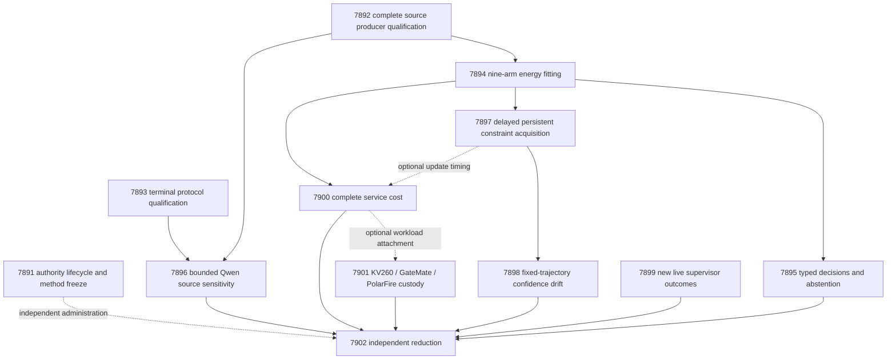

# Carnot Research Roadmap v685: Measured Decisions and Retained Confidence

**Created:** 2026-09-29  
**Milestone:** 2026.09.685  
**Status:** Proposed; staged, not activated  
**Title:** Measured source decisions and causal learning with retained confidence  
**Supersedes:** completed execution of 2026.09.684, Exp7879–Exp7890  
**Preserved predecessor:** [V684 design](research-roadmap-v684-preserved-20260929.md)  
**Execution authority:** [research-roadmap-next.yaml](../../research-roadmap-next.yaml)  
**Planning requirement:** REQ-REPORT-PLAN-685.

This milestone contains **12 tasks, exp7891 through exp7902, in that order,
across four phases**. Six tasks measure source energies, decisions, Qwen
sensitivity, causal learning, confidence retention and complete service cost.
Three repair current prerequisites. The remaining tasks preserve live-agent
and board obligations and independently reduce the results.

## What V684 proved

All twelve dispatches completed. Completion did not establish scientific
success. The conductor log records six skipped science tasks. All six
existing declared artifacts have `verdict_class=disqualified`. This assessment
uses the actual artifact bytes; an `OK` dispatch is not a positive result.
The completion archive currently ends at V683. V684 evidence comes from the
active task list, terminal artifacts and dated conductor log.

| Evidence | Actual finding | Next concrete change |
|---|---|---|
| Exp7879 contract | Missing consumed staging authority; historical V681 tests read live state; required affected tests failed | Bind the complete task digest and test lifecycle with private versioned authorities. |
| Exp7880 source | Helper 23/23 statements; producer 47/295; task ID has an extra `v684` segment | Exercise the full producer and assert the exact current identity. |
| Exp7881 intervention | 302/304 statements; uncovered second terminal-validation pass | Reach that branch and validate both dated CLI routes. |
| Exp7882–7886 and Exp7888 | Six skipped producers; no natural fitting, decisions, Qwen, learning, calibration or cost result | Depend on current repaired prerequisites, not historical dispatchers. |
| Exp7887 ARC | 107/207 owned statements; terminal disqualification and adversarial flag | Cover actual dispatcher paths and examine only genuinely new receipts. |
| Exp7889 boards | 224/225 statements; existing empty coverage database rejection untested | Test the exact branch; preserve historical device scope. |
| Exp7890 capstone | Mutable historical authority fixtures and E2E-016 replay without required `--date` failed | Use immutable fixture authorities and explicit argv; retain expected-error semantics. |

Exp7867's natural runtime remains a reusable circular fixture qualification.
It does not demonstrate source-semantic benefit. Repository-wide test and
spec debt remains open. No historical artifact will be made eligible by
rewriting its verdict. Current measurements receive current identities.

## Three biggest gaps against the PRD

1. **Source-grounded decisions, FR-12.** Extraction and checking exist, but
   the natural calibrated comparisons still have not run. A risk score must
   improve decision cost beyond equally informed controls. Byte addressing,
   schema validity and truth are separate properties. Exposed development
   data cannot close independent generalization or the oracle-distinct gap.
2. **Causal and retained self-learning, FR-11.** A persisted bank does not
   prove learning. Admitted constraints must alter later decisions after
   valid feedback, beat no-write and complete-static controls, and preserve
   old-task quality. Confidence may drift while accuracy stays stable.
3. **Executable evidence and deployment, FR-05/08/09/10 and NFR-01.** Repeated
   wrapper and authority failures prevent measurement. Qualify the actual
   paths before further architecture work. Then measure the complete CPU
   service, including transfers and writes, before investing in Rust or FPGA
   acceleration. Live ARC receipts retain a separate claim boundary.

## Research incorporated before design

The [V685 review](../../research-references.md#v685-planning-review--2026-09-29-recorded-before-design)
was added first. It covers all requested topics and secondary sources.
Methods were rechecked; most were already indexed. None supplies a Carnot
benefit claim or authorization to reopen a retired mechanism unchanged.

| Source | Planned use | Limit |
|---|---|---|
| [TOOD, July 2026](https://arxiv.org/abs/2607.29592) | Exp7898 separates score drift from lost discrimination; tests robust temporal logit alignment | Binary temporal adaptation, not the paper's class-block OOD detector. |
| [Continual Calibration, April 2026](https://arxiv.org/abs/2604.23987) | Exp7897 reserves calibration data; Exp7898 evaluates fixed snapshots | No exchangeability or conformal guarantee on reused development data. |
| [SURE-RAG v2, July 2026](https://arxiv.org/abs/2605.03534) and [sufficiency, August 2026](https://arxiv.org/abs/2608.00585) | Exp7896 compares witness, neighboring context and matched filler | Edited contexts do not inherit original truth labels. |
| [Structural/semantic gap, September 2026](https://arxiv.org/abs/2609.23742) | Exp7893/7896 report schema, byte fidelity and semantics separately | Small-model results do not predict Qwen3.8-27B performance. |
| [Delayed OCO, February 2026](https://arxiv.org/abs/2602.02634) | Exp7897 records pending observations and release order | Predicate admission inherits no convex regret theorem. |
| [FPGA decomposition, February 2026](https://arxiv.org/abs/2602.15985) and [Z1T, September 2026](https://extropic.ai/writing/z1t) | Exp7900/7901 include host, transport and coupling-update work | Vendor efficiency estimates are not local hardware timings. |

EBT, ARM–EBM, neural constraint layers, KAN retention and energy-guided
sampling were screened. Another broad architecture or decoder sweep waits
for useful measured energy. VeriFin is a future source/formula extraction
lead. OpenReview forum access hit a challenge; EBT citations hit HTTP 429.
Semantic Scholar returned eight ARM–EBM citations. GitHub trending crawls
were stale. Direct THRML/KAC/sparse-transformer repositories were accessible.
Kona supplied architecture context without a reproducible implementation.

## Architecture



Public source and answer bytes feed the predictor. Evaluator labels cross
only declared role and feedback boundaries. Calibrators never admit predicates.
Only Exp7896 invokes a pretrained model. All other tasks use CPU primitives,
fitted small heads or existing evidence. No generator weights change.

## Phase 1 — Repair the exact execution boundaries

**Exp7891–Exp7893; 150 minutes estimated.** These are bounded repairs to
identified paths. They do not replace the scientific question with audits.
Exp7891 adds lifecycle-aware authority checks and private historical fixtures.
Exp7892 completes source-producer coverage and exact identity checks.
Exp7893 reaches the two missing intervention terminal statements.

The design binds the entire task list, including prompts, with the digest in
the exact contract below. Before activation, only plan agreement is checked.
After activation, actual active bytes must match that digest. The staging
file can be absent or can belong to a later milestone. Neither condition
invalidates matching activated authority. A V684 active roadmap never counts
as V685 activation. Current tests must create private versioned authorities.

The source cohort stays fixed at 640 exposed development families:

| Role | Families | Label use |
|---|---:|---|
| fit | 256 | Head fitting |
| tune | 64 | Temperature selection |
| policy_design | 32 | Coverage threshold design |
| calibration_replay | 32 | Exp7898 mappings only |
| online_update | 96 | Coefficients after feedback release |
| online_admission | 64 | Predicate admission after feedback release |
| evaluation | 64 | Final sealed comparisons |
| retention | 32 | Old-task damage assessment |

Reuse the existing `v684-policy` hash split, not a favorable new split.
Preserve original bytes, revision, license, annotation scope and offsets.
Group duplicate source-answer copies. Retain source clusters for intervals
when several families share a document. Unknown labels remain unknown.
Fewer eligible families blocks qualification; no invented rows fill the gap.

## Phase 2 — Measure decisions and source sensitivity

**Exp7894–Exp7896; 165 minutes estimated.** Exp7894 fits nine fixed arms:
`response_set`, `local_set`, `augmented_set`, `constrained_set`,
`augmented_mlp`, `constrained_mlp`, `local_logistic`,
`source_erased_constrained_set`, `complete_static_constrained_set`.
Use seeds 67801/67802/67803, width 16, at most 4096 parameters, learning
rate .01 and at most 16 epochs. The base has 132 byte-derived features;
complete-static receives sixteen additional conjunction features from the
start. A views use singles/triples; B views use singles/pairs. Limit each
record to 128 windows and sixteen answer units without silently truncating.

Constrained/augmented pairs see the same observed labels and compute budget.
Use symmetric Bernoulli KL/2 tolerance .01, alternate-view CE limit .70,
dual step .01 clipped to [0,10]. Choose temperature on tune only from
seventeen log-spaced values in [.25,4]. Preserve all 27 checkpoints.
Prevalence, source/answer-length, source-erasure and matched permutation
controls expose shortcuts. Numerical work has a 3000-second budget.

Exp7895 maps unsupported probability p to accept/reject/escalate with expected
costs 5p, 1-p, .25; ties escalate. Actual costs are 5y, 1-y, .25. Compare
constrained_set to augmented_set, constrained_mlp and local_logistic.
Average seeds within family; bootstrap source clusters when required.
Use 10,000 paired bootstrap samples, paired randomization and Holm correction
across six primary Brier/cost tests. Benefit requires cost gain >=.02,
positive lower 95% bounds for cost and Brier against each control,
adjusted p<.05 and automated coverage >=.20. Small effective samples limit
power; an honest null remains useful.

For selective decisions, freeze expected-loss, margin and hash-random
thresholds on policy_design at target coverage .50. Realized coverage gaps
above .05 invalidate the equal-coverage claim. Do not tune on evaluation.
Report false accepts per intended family and per accepted decision.

Exp7896 uses **unsloth/Qwen3.8-27B-GGUF** on an owned GPU runtime. Verify the
actual served model, revision, quantization and GGUF hash before inference.
Never interrupt another workload. Freeze 48 evaluation families by hash,
four calls per family, <=128 output tokens per call and <=24,576 total.
Use n_ctx=8192, temperature=0, seed=67801 and `/no_think`. Overlength inputs
abstain without truncation. Load timeout is 300 seconds; call timeout is 120.
Stop starting calls at 2400 seconds and end measurement by 3000 seconds.

This is **model_bounded_generation**, with the 10-second floor. A short canary
is also bounded. The first call nominates a byte-addressable witness; follow
with witness-only, neighbors and disjoint filler (<=25% length mismatch).
Hold the first complete answer sentence fixed. Sentence accuracy requires
an original independent sentence annotation; whole-answer labels do not
suffice. Edited-view changes measure sensitivity only. Fewer than 32 complete
families yields an underpowered null after the owned budget completes.

## Phase 3 — Test causal learning and retained confidence

**Exp7897–Exp7899; 145 minutes estimated.** Exp7897 is the continuous
self-learning task. Eight blocks each contain twelve update and eight
admission families, with one-block feedback delay. Compare dynamic admission,
frozen bank, complete-static, no-write and shuffled-released-past controls.
Trainable arms receive identical released information and one-pass coefficient
updates at learning rate .01. This uses the actual NaturalBank API; it does
not pretend that repeated epochs exist. Make admission block IDs explicit,
since `tick//8` does not represent these twenty-family blocks.

Candidate predicates are the sixteen predeclared conjunctions of four
advisory byte predicates. Admission requires >=.01 Brier improvement and no
extra false accepts on released admission families. Admit at most one per
block and eight total. Admission labels never fit coefficients. Calibration,
evaluation and retention data cannot affect proposals or admission.

Persist initial plus eight committed states per arm/seed. Test crash/resume
after block four. A benefit requires an admitted predicate changing a later
pre-feedback decision, cost gain >=.02 with CI95 lower>0 against complete-static
and no-write, nonworse Brier, Holm-adjusted cost tests, retention cost increase
CI95 upper<=.01 and no extra false accepts. Flush delayed feedback only after
the last pre-feedback prediction. Empty admission is an honest null.

Exp7898 holds these trajectories fixed. Four calibration policies share the
same 32-family buffer: stale probabilities, temperature refresh, robust
affine logit alignment to the initial buffer, and alignment plus temperature.
Clip p to [1e-6,1-1e-6], then compute z=logit(p). Alignment is
`(z-median_current)*max(MAD_initial,1e-3)/max(MAD_current,1e-3)+median_initial`,
using normal-consistent MAD. Temperature uses the same seventeen-point grid.
All mappings are fixed before final labels are opened.

Report all four policies at nine snapshots, on evaluation and retention.
Common positive monotone maps must preserve within-snapshot AUROC; they can
repair calibration, not discrimination. The primary final contrast is
alignment-plus-temperature versus temperature-only: Brier gain >=.01 with
CI95 lower>0, cost increase CI95 upper<=.01, no extra false accepts and
automated coverage>=.20. No changed bank or drift is a valid null. These
binary temporal controls adapt TOOD's idea, not its class-block algorithm.

Exp7899 fulfills the ARC generalization floor through new supervisor outcomes.
Use receipt IDs and hashes, not mtime, to identify new live evidence. Record
firings, level-up resolutions, action counts and unredirected stagnations.
No new outcomes is a complete null and satisfies the floor. At >=20 new
firings across >=3 games, report intervals and a recommendation; observational
evidence cannot justify a causal claim or automatic production edit.
No game is re-solved. Imported solve provenance must authenticate live-agent
self-discovery. The task invokes no model and earns no new solve credit.

## Phase 4 — Bound deployment cost and reconcile evidence

**Exp7900–Exp7902; 115 minutes estimated.** Exp7900 measures complete service
cost on the four matched deployment arms. Use 64 families, three checkpoints,
one cold call and five warm paired repetitions. Include projection, windows,
scoring, calibration, dispatch and serialization. Qualified learning snapshots
optionally add lookup and durable update/fsync timing. Missing learning does
not block static profiling. Repetitions do not increase the independent n.

For operation fraction f, report the modeled 100x-kernel speedup
`1/((1-f)+f/100)` and ideal whole-service ceiling `1/(1-f)`. Include transfer
bytes and coupling refresh. Measured latency gains require matched coverage,
no added false accepts and a positive paired lower bound. No calibrated power
meter means no joule claim. A later Rust/FPGA task needs a measured bottleneck.

Exp7901 tests the identified empty-coverage branch, then preserves dated
KV260, GateMate and PolarFire evidence. Service data is an optional attachment.
No repeated board probe, flash or installation is planned. Exp7902 independently
reduces twelve dispositions, applies G1–G4 publication gates and reports
`paper_ready` and `unmet_gates`. Missing external science is terminal blocked,
not partial. An owned validation failure remains disqualified.

## Hardware requirements

| Tasks | Required compute | Memory / time boundary | Hardware path or acquisition decision |
|---|---|---|---|
| 7891–7895, 7897–7902 | Owned host CPU and existing Python/JAX environment | Budget <=8 GiB per science child; measured work <=3000 s; task cap 4800 s | No purchase needed. Check actual free memory before running. |
| 7896 | Cached Qwen3.8-27B GGUF; owned CUDA runtime on RTX 3090 | Approx. 16 GB weights plus KV/runtime overhead; one 24 GB GPU only if measured fit permits, otherwise owned dual 3090 capacity | Record real offload and lease. No shared-process disruption, CPU fallback or small headline model. |
| 7897–7898 | Small CPU bank and calibration buffer | Sixteen predicate features; <=8 admissions; 32 calibration families | CPU counters now; batch projection/training on GPU and pattern matching on FPGA remain measured placement options. |
| 7901 KV260 | Existing authenticated receipt | Fabric scope k_max<=5; no new execution | Future reachability uses `ssh kria`. Terminal status derives from the receipt. |
| 7901 PolarFire | Existing authenticated receipt | Linux CPU-only dispatch | Do not claim fabric acceleration. |
| 7901 GateMate | Existing authenticated receipt | Unchanged `0xffffffff` physical/JTAG block | A documented cable/power/port change precedes another physical attempt. |

The wishlist's NPU and TSU paths remain unqualified. No Alveo purchase or
Extropic access is assumed. Vendor hardware specifications are planning inputs.
The self-learning 100x target is evaluated through complete-service ceilings,
not asserted as achieved. Old small models are only optional CPU smoke tools;
none appears in a headline experiment or substitutes for Qwen.

## Validation and evidence contract

- Every prompt has numbered flushed-progress and bounded-file-writing steps.
  Emit at each phase, before/after long operations, and inside loops. Heartbeat
  owned children at least every 60 seconds; keep gaps below 600 seconds.
  Write files over about 200 lines through multiple bounded tool calls.
- Write specs and failing tests before implementation. Freeze exact command
  paths, affected consumers, expected exits, timeouts and measured modules.
  Extend existing coverage; do not create another large copied dispatcher.
- Require 100% combined statement coverage for all changed modules and CLIs.
  Measure unit and real CLI success/failure/replay paths. Empty coverage fails.
  Preserve existing stricter branch obligations where the reused path has them.
  An expected nonzero test passes only with its declared failure reason.
- Run affected pytest, Ruff check/format, strict mypy and scoped spec coverage.
  Preserve required historical failures. Repository-wide health remains a
  separately declared diagnostic for new work. Reuse an unchanged sealed
  diagnostic rather than rerunning it per task. No global-green claim follows.
- E2E-015 applies to source, decision, learning, calibration and service paths.
  E2E-016 applies to intervention and Qwen paths; include `--date {date}` on
  both fixture and cold replay. E2E-017 applies to ARC receipt reduction.
  The capstone exercises all three applicable paths. Declare unrelated E2Es
  inapplicable. No hardware/generation result is implied by planning checks.
- Mutation-test identity, authority, cohort roles, future-label access, missing
  masks, receipt semantics, row denominators and terminal candidate hashes.
  Retain primitive family/arm/seed rows and cluster-aware uncertainty.
- Every artifact declares the closed verdict class, actual substrate and
  principle-annotated fields. CPU tasks have empty model lists; only Exp7896
  declares Qwen and bounded generation. A valid null can be measurement-ready.
- Gate only on producers earlier in this roadmap. Each gate field appears
  identically in its producer's REQUIRED ARTIFACT FIELDS. Gate on readiness,
  eligible class and an unflagged artifact, never on scientific positivity.
  Current authority and exact input checks still apply inside each branch.
- Seal child logs after exit at durable content-addressed locations. Keep
  candidates private, then adversarial-verify and row-lint exact final bytes.
  Reports bind hashes as sidecars. Do not overwrite historical artifacts.
- Reconcile OpenSpec, traceability, status and changelog after each task.
  No task may push, publish externally, activate the plan or modify
  `scripts/research_conductor.py`.

## Dependency graph and stopping rules

Structured gates: 7892→7894; 7894→7895; 7892+7893→7896;
7894→7897; 7897→7898; 7894→7900. Each checks readiness=1,
`flagged_adversarial=false`, and an eligible terminal class.
Exp7891, Exp7899, Exp7901 and Exp7902 have no dispatch gate. Optional
7897→7900 and 7900→7901 attachments cannot block those tasks.

Execution order remains the exact table order. There are no dependencies on
retired task IDs. Prior-failure entries name the old verdict, concrete change
and `retire_if_same_verdict: true`. A missing artifact from a skipped dispatch
uses the recorded `GATE_BLOCKED` status; it is not a fabricated honest verdict.
The intervention continuation cites the standing 2026-05-29 authorization and
its changed validation mechanism. No unchanged retired science is reopened.

If qualification fails, emit a terminal diagnosis and skip only dependent
science. If it passes but the science is null, continue retention and cost
measurements. If it fails again in the same way, retire the scope. Do not
propose another nominally new science chain until that owned defect changes.
The total estimate is **575 minutes**, with independently resumable tasks.

## Exact task contract

The following table and JSON describe exactly the twelve YAML tasks.

| Order | ID | Title | Phase | Deliverable |
|---:|---|---|---:|---|
| 1 | exp7891-authority-lifecycle | Bind the task contract across staging and activation | 1 | results/experiment_7891_v685_authority_lifecycle.json |
| 2 | exp7892-source-boundary | Complete source producer coverage and qualify natural inputs | 1 | results/experiment_7892_v685_source_boundary.json |
| 3 | exp7893-intervention-protocol | Qualify terminal revalidation and source intervention paths | 1 | results/experiment_7893_v685_intervention_protocol.json |
| 4 | exp7894-energy-fit | Fit calibrated source energies with matched observation budgets | 2 | results/experiment_7894_v685_energy_fit.json |
| 5 | exp7895-decision-abstention | Measure typed decision value and source-sensitive abstention | 2 | results/experiment_7895_v685_decision_abstention.json |
| 6 | exp7896-qwen-sufficiency | Measure bounded Qwen witness and context sensitivity | 2 | results/experiment_7896_v685_qwen_sufficiency.json |
| 7 | exp7897-causal-acquisition | Test persistent constraint additions with delayed feedback | 3 | results/experiment_7897_v685_causal_acquisition.json |
| 8 | exp7898-confidence-drift | Separate confidence drift from retained decision quality | 3 | results/experiment_7898_v685_confidence_drift.json |
| 9 | exp7899-arc-supervisor-delta | Assess new live supervisor outcomes for generalization | 3 | results/experiment_7899_v685_arc_supervisor_delta.json |
| 10 | exp7900-service-cost | Measure complete decision and durable-learning service costs | 4 | results/experiment_7900_v685_service_cost.json |
| 11 | exp7901-hardware-evidence | Preserve board evidence and test measured workload fit | 4 | results/experiment_7901_v685_hardware_evidence.json |
| 12 | exp7902-capstone | Independently reduce twelve outcomes and decide the PRD gaps | 4 | results/experiment_7902_v685_capstone.json |

Canonical full-task SHA-256: `59704cb0b0513926d74c40683e7abb2657e7c6c73649291209afa2b3899eef96`.
Hash UTF-8 `json.dumps(tasks, sort_keys=True, separators=(",", ":"), ensure_ascii=False)`.
This binds prompts, lineage and routing as well as the visible contract fields.

<!-- V685_TASK_CONTRACT_START -->
```json
{
  "milestone": "2026.09.685",
  "tasks": [
    {"id": "exp7891-authority-lifecycle", "title": "Bind the task contract across staging and activation", "phase": 1, "deliverable": "results/experiment_7891_v685_authority_lifecycle.json", "MODEL_SPECS": [], "inference_substrate_class": "no_model_load", "gated_on": []},
    {"id": "exp7892-source-boundary", "title": "Complete source producer coverage and qualify natural inputs", "phase": 1, "deliverable": "results/experiment_7892_v685_source_boundary.json", "MODEL_SPECS": [], "inference_substrate_class": "no_model_load", "gated_on": []},
    {"id": "exp7893-intervention-protocol", "title": "Qualify terminal revalidation and source intervention paths", "phase": 1, "deliverable": "results/experiment_7893_v685_intervention_protocol.json", "MODEL_SPECS": [], "inference_substrate_class": "no_model_load", "gated_on": []},
    {"id": "exp7894-energy-fit", "title": "Fit calibrated source energies with matched observation budgets", "phase": 2, "deliverable": "results/experiment_7894_v685_energy_fit.json", "MODEL_SPECS": [], "inference_substrate_class": "no_model_load", "gated_on": [{"upstream": "exp7892-source-boundary", "artifact_field": "source_boundary_ready_score", "op": "==", "value": 1}, {"upstream": "exp7892-source-boundary", "artifact_field": "flagged_adversarial", "op": "==", "value": false}, {"upstream": "exp7892-source-boundary", "artifact_field": "verdict_class", "op": "in", "value": ["positive", "circular_positive", "null"]}]},
    {"id": "exp7895-decision-abstention", "title": "Measure typed decision value and source-sensitive abstention", "phase": 2, "deliverable": "results/experiment_7895_v685_decision_abstention.json", "MODEL_SPECS": [], "inference_substrate_class": "no_model_load", "gated_on": [{"upstream": "exp7894-energy-fit", "artifact_field": "energy_fit_ready_score", "op": "==", "value": 1}, {"upstream": "exp7894-energy-fit", "artifact_field": "flagged_adversarial", "op": "==", "value": false}, {"upstream": "exp7894-energy-fit", "artifact_field": "verdict_class", "op": "in", "value": ["positive", "circular_positive", "null"]}]},
    {"id": "exp7896-qwen-sufficiency", "title": "Measure bounded Qwen witness and context sensitivity", "phase": 2, "deliverable": "results/experiment_7896_v685_qwen_sufficiency.json", "MODEL_SPECS": ["unsloth/Qwen3.8-27B-GGUF"], "inference_substrate_class": "model_bounded_generation", "gated_on": [{"upstream": "exp7892-source-boundary", "artifact_field": "source_boundary_ready_score", "op": "==", "value": 1}, {"upstream": "exp7892-source-boundary", "artifact_field": "flagged_adversarial", "op": "==", "value": false}, {"upstream": "exp7892-source-boundary", "artifact_field": "verdict_class", "op": "in", "value": ["positive", "circular_positive", "null"]}, {"upstream": "exp7893-intervention-protocol", "artifact_field": "intervention_protocol_ready_score", "op": "==", "value": 1}, {"upstream": "exp7893-intervention-protocol", "artifact_field": "flagged_adversarial", "op": "==", "value": false}, {"upstream": "exp7893-intervention-protocol", "artifact_field": "verdict_class", "op": "in", "value": ["positive", "circular_positive", "null"]}]},
    {"id": "exp7897-causal-acquisition", "title": "Test persistent constraint additions with delayed feedback", "phase": 3, "deliverable": "results/experiment_7897_v685_causal_acquisition.json", "MODEL_SPECS": [], "inference_substrate_class": "no_model_load", "gated_on": [{"upstream": "exp7894-energy-fit", "artifact_field": "energy_fit_ready_score", "op": "==", "value": 1}, {"upstream": "exp7894-energy-fit", "artifact_field": "flagged_adversarial", "op": "==", "value": false}, {"upstream": "exp7894-energy-fit", "artifact_field": "verdict_class", "op": "in", "value": ["positive", "circular_positive", "null"]}]},
    {"id": "exp7898-confidence-drift", "title": "Separate confidence drift from retained decision quality", "phase": 3, "deliverable": "results/experiment_7898_v685_confidence_drift.json", "MODEL_SPECS": [], "inference_substrate_class": "no_model_load", "gated_on": [{"upstream": "exp7897-causal-acquisition", "artifact_field": "learning_measurement_ready_score", "op": "==", "value": 1}, {"upstream": "exp7897-causal-acquisition", "artifact_field": "flagged_adversarial", "op": "==", "value": false}, {"upstream": "exp7897-causal-acquisition", "artifact_field": "verdict_class", "op": "in", "value": ["positive", "circular_positive", "null"]}]},
    {"id": "exp7899-arc-supervisor-delta", "title": "Assess new live supervisor outcomes for generalization", "phase": 3, "deliverable": "results/experiment_7899_v685_arc_supervisor_delta.json", "MODEL_SPECS": [], "inference_substrate_class": "no_model_load", "gated_on": []},
    {"id": "exp7900-service-cost", "title": "Measure complete decision and durable-learning service costs", "phase": 4, "deliverable": "results/experiment_7900_v685_service_cost.json", "MODEL_SPECS": [], "inference_substrate_class": "no_model_load", "gated_on": [{"upstream": "exp7894-energy-fit", "artifact_field": "energy_fit_ready_score", "op": "==", "value": 1}, {"upstream": "exp7894-energy-fit", "artifact_field": "flagged_adversarial", "op": "==", "value": false}, {"upstream": "exp7894-energy-fit", "artifact_field": "verdict_class", "op": "in", "value": ["positive", "circular_positive", "null"]}]},
    {"id": "exp7901-hardware-evidence", "title": "Preserve board evidence and test measured workload fit", "phase": 4, "deliverable": "results/experiment_7901_v685_hardware_evidence.json", "MODEL_SPECS": [], "inference_substrate_class": "no_model_load", "gated_on": []},
    {"id": "exp7902-capstone", "title": "Independently reduce twelve outcomes and decide the PRD gaps", "phase": 4, "deliverable": "results/experiment_7902_v685_capstone.json", "MODEL_SPECS": [], "inference_substrate_class": "no_model_load", "gated_on": []}
  ]
}
```
<!-- V685_TASK_CONTRACT_END -->
