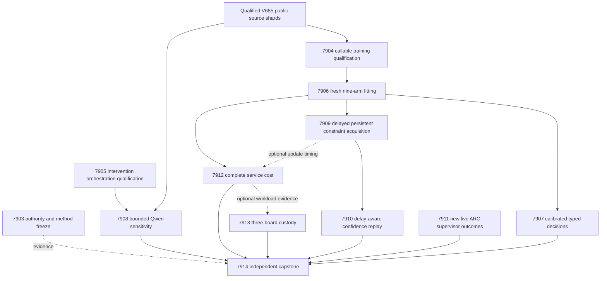

# Carnot Research Roadmap v686: Qualified Energies and Delayed Feedback

**Created:** 2026-09-29  
**Milestone:** 2026.09.686  
**Status:** Proposed; staged, not activated  
**Title:** Qualified source energies and causal learning under delayed feedback  
**Supersedes:** completed execution of 2026.09.685, Exp7891–Exp7902  
**Preserved predecessor:** [V685 design](research-roadmap-v685-preserved-20260929.md)  
**Execution authority:** [research-roadmap-next.yaml](../../research-roadmap-next.yaml)  
**Planning requirement:** REQ-REPORT-PLAN-686.

This milestone contains **12 tasks, exp7903 through exp7914, in that order,
across four phases**. Three tasks qualify authority and runtime prerequisites.
Six measure energy fitting, decisions, Qwen evidence sensitivity, causal
constraint learning, delayed confidence and complete service cost. One task
examines new live ARC outcomes, one preserves board evidence, and one
independently reduces all outcomes. The contract below is the executable list.

## What V685 proved

Twelve dispatches ended: two circular qualifications, one qualified null,
four disqualified producers and five skipped science branches. Conductor
`OK` means dispatch completion, not scientific success. The completion archive
currently ends at V684; V685 findings below come from its active task list,
terminal artifact bytes and conductor log. Do not invent missing archive rows.

| Evidence | Measured result | Consequence for V686 |
|---|---|---|
| Exp7891 authority | Readiness 1; 12 authority mutations and seven required receipts passed | Reuse its lifecycle helper and private immutable authorities. |
| Exp7892 source boundary | Readiness 1; 625/625 owned statements, 17 receipts; 640 intended families, 604 eligible and 36 excluded | Reuse public/evaluator shards directly. Another source-producer rewrite is unnecessary. |
| Exp7893 intervention | Required coverage and format failures; 418/512 statements covered | Exercise the 94 missing orchestration statements before model capture. |
| Exp7894 fitting | 27 heads and 16,308 prediction rows exist; required unscoped spec command failed on 1,142 legacy tests | Preserve disqualification; qualify current commands and all training dependencies, then train fresh heads. |
| Exp7895–7898 and Exp7900 | Five science tasks skipped | No decision, Qwen, learning, drift or service benefit has been measured. |
| Exp7899 ARC | Readiness 1; zero new supervisor outcomes | Reuse the reducer; unchanged input takes a short null path. |
| Exp7901 boards | Five affected tests failed after scratch under results triggered guarded cross-device renames; coverage 141/218 | Use private `/tmp` scratch and retain the guards and assertions. |
| Exp7902 capstone | Required coverage failed at 243/377 statements | Cover actual reducer and CLI terminal routes with private authorities. |

The current fitting source already passes filenames to the spec checker.
That code does not retroactively repair the failed terminal receipt. Its
checkpoint test also authenticates only a narrow subset of training code.
The next qualification binds the full numerical dependency set and supplied
upstream path. Historical heads stay historical; Exp7906 trains new heads.

Repository-wide test and spec debt remains open. A newly frozen affected
scope does not change the meaning of a historical required failure.
The September 28 oracle-distinct corrigendum remains binding. No exposed
source experiment can reinstate that retracted ARC result.

## Three biggest gaps against the PRD

1. **Verifiable source decisions, FR-12.** A working extractor and lower
   energy do not establish calibrated correctness. Natural labels, independent
   source roles and matched controls must show lower decision cost. The current
   source boundary now permits that test, but the old fitted results remain
   disqualified. Exposed development evidence cannot close GAP-ORACLE-DISTINCT.
2. **Causal continuous learning, FR-11.** A persistent bank must improve a
   later prediction after permitted feedback, beat equally informed no-write
   and complete-static controls, and retain earlier quality. Confidence updates
   also need testing when feedback arrives late. Bank growth alone is insufficient.
3. **Executable and deployable evidence, FR-05/08/09/10 and NFR-01.** Repeated
   orchestration, validation and scratch-path failures prevent useful comparisons.
   Qualify those paths once, then measure complete service cost before another
   Rust or hardware port. Live ARC generalization remains a separate obligation.

## Research recorded before design

The [V686 review](../../research-references.md#v686-planning-review--2026-09-29-recorded-before-design)
was appended before experiments were designed. It covers all eight requested
topics and all six secondary sources, with access limits and defer decisions.

| Source | Experiment use | Claim boundary |
|---|---|---|
| [Delayed ACI](https://arxiv.org/abs/2609.07251), September 7, 2026 | Exp7910 compares confidence updates using issued prediction state and delayed labels | A binary empirical adaptation; no forecasting or conformal theorem is claimed. |
| [VEX-Bench](https://arxiv.org/abs/2609.35028), September 28, 2026 | Exp7912 reports verification cost per processed case, accepted case and caught error | No imported LLM-judge labels or new misinformation-generation benchmark. |
| [Continual Calibration](https://arxiv.org/abs/2604.23987), April 2026 | Exp7909 reserves calibration families; Exp7910 holds predictor states fixed | Calibration and constraint admission have separate feedback roles. |
| [KAN-CL](https://arxiv.org/abs/2605.12306), May 2026 | Retain sparse update and retention accounting | No unchanged importance-anchor or KAN architecture sweep. |
| [FPGA decomposition](https://arxiv.org/abs/2602.15985), February 2026; [Z1T](https://extropic.ai/writing/z1t), September 2026 | Exp7912/7913 account for host work, transport and update bytes | Vendor estimates do not establish local hardware speedup. |

EBT, ARM–EBM, neural constraint certification and energy-guided generation
were screened. Verify–repair–reselect is a later candidate after useful source
verification is measured. d-OPD was a fresh ARM–EBM citation but requires a
different generator/training scope and is deferred. Semantic Scholar returned
20 EBT citations with another page available and nine ARM–EBM citations with
no next marker. The EBT OpenReview PDF was readable; the forum was challenged.
GitHub trending crawls were stale. Kona supplied architecture context, without
a reproducible method to adopt. These checks do not establish exhaustive coverage.

## Architecture

Public source and answer bytes feed predictors. Evaluator labels cross only
registered role and feedback boundaries. Only Exp7908 invokes a pretrained
model. Other tasks use CPU libraries, fitted small heads or existing receipts.
The mandated generator's weights and the ARC production policy do not change.

## Phase 1 — Qualify existing execution paths

**Exp7903–Exp7905; 155 estimated minutes.** Exp7903 binds the full task digest,
reads staged and active authorities independently, and reuses qualified source
custody. It does not gate the science branches. An absent consumed staging
file is valid only after actual active authority matches the frozen digest.
A later staged milestone must not invalidate historical authority.

Exp7904 qualifies reusable fitting callables, their CLI, explicit date/paths,
and all checkpoint dependencies. It reproduces the old command failure but
preserves that determination. Private fixtures exercise success, failure,
timeout, replay mismatch and terminal recheck. Natural training is Exp7906.

Exp7905 completes the intervention closure, including formatting and both
terminal-validation passes. Twenty-four private fixture families exercise
four source views and real HTTP construction. Fixture agreement remains
circular. No model loads or semantic result is claimed in qualification.

## Phase 2 — Measure natural energy and source sensitivity

**Exp7906–Exp7908; 175 estimated minutes.** The existing cohort contains
640 intended families with roles fixed before execution:

| Role | Intended families | Permitted use |
|---|---:|---|
| fit | 256 | Fit heads and cheap controls |
| tune | 64 | Select temperature only |
| policy_design | 32 | Freeze decision/abstention thresholds |
| calibration_replay | 32 | Initialize confidence calibration; never train or admit |
| online_update | 96 | Released coefficient updates |
| online_admission | 64 | Released predicate selection; never coefficient updates |
| evaluation | 64 | Final development decisions |
| retention | 32 | Final prior-quality check |

Keep the V685 exclusions visible; do not replace an ineligible family to
improve the result. These are exposed development roles. Prior access prevents
an independent-generalization claim even when runtime separation is sound.

Exp7906 trains the same nine registered arms: response_set, local_set,
augmented_set, constrained_set, augmented_mlp, constrained_mlp, local_logistic,
source_erased_constrained_set and complete_static_constrained_set. Use seeds
67801/67802/67803, width 16, <=4096 parameters, learning rate .01 and 16 epochs.
The base has 132 byte-derived features; complete-static adds all sixteen
conjunctions at initialization. A uses single/triple windows and B single/pair
windows, with <=128 windows and <=16 answer units per family.

Constrained and augmented pairs receive equal observed labels and work.
Use symmetric Bernoulli KL/2 tolerance .01, alternate-view CE limit .70,
dual step .01 clipped to [0,10], and tune-only temperature from 17 log-spaced
values in [.25,4]. Unknown targets have zero loss and gradient. Save all
27 fresh checkpoints and complete training dependency hashes. No historical
checkpoint is silently promoted. Numerical work is bounded at 3000 seconds,
with progress and resumable current checkpoints after each arm/seed.

Exp7907 maps unsupported probability p to accept/reject/escalate expected
costs 5p, 1-p, .25; ties escalate. Actual costs are 5y, 1-y, .25. Compare
constrained_set with augmented_set, constrained_mlp and local_logistic.
Average seeds within family, then use 10,000 paired source-cluster bootstrap
draws and paired randomization. Holm-correct the six Brier/cost tests.
Benefit needs cost gain >=.02, positive CI95 lower bounds for cost and Brier
against every control, adjusted p<.05 and automated coverage >=.20.

Freeze expected-loss, margin and hash-random abstention on policy_design at
coverage .50. Realized gaps >.05 invalidate equal-coverage claims. Report
false accepts per intended and accepted family, along with prevalence,
length-only, source-erased and length-matched source-permutation controls.
A completed null remains measurement-ready.

Exp7908 uses **unsloth/Qwen3.8-27B-GGUF** with an owned CUDA runtime. Verify
revision, file hash, quantization, tokenizer and actual served identity. The
conductor log has seen a different model on shared servers; do not interrupt
those processes. No substitute model or CPU headline fallback is allowed.

Freeze 48 evaluation families by source-group hash, four calls per family,
<=128 output tokens per call and <=24,576 total. Use n_ctx=8192,
temperature=0, seed=67801 and `/no_think`. Tokenize first; overlength inputs
abstain without truncation. Load timeout is 300 seconds, call timeout 120.
Stop starting calls at 2400 seconds and measured work by 3000 seconds.
This is **model_bounded_generation**, with the 10-second floor, including
any canary. Full generation has a 60-second floor and is not planned here;
load-only/embedding work would use model_load_no_generation and its 2-second
floor. Duration is measured, never padded to satisfy a declaration.

Hold the first complete answer sentence fixed through full source,
witness-only, witness plus neighbors and witness plus disjoint filler.
Require exact witness byte addresses and <=25% filler length mismatch.
An unchanged sentence needs its own independent original label for accuracy;
whole-answer labels do not suffice. Edited contexts measure sensitivity only.
Require >=32 complete families for the sensitivity comparison, otherwise a
finished budget is a terminal underpowered null.

## Phase 3 — Learn constraints and test delayed confidence

**Exp7909–Exp7911; 145 estimated minutes.** Exp7909 is the required
continuous self-learning experiment. Use eight logical blocks of twelve
online-update and eight admission slots, one-block feedback delay and three
seeds. Keep excluded slots in place. Compare dynamic admission, frozen bank,
complete-static bank, no-write and shuffled-released-past-label controls.

NaturalBank coefficient updates use .01 after each released update event.
Admission labels select among sixteen immutable conjunctions but do not fit
coefficients. Admit <=1 predicate per logical block and <=8 total, requiring
>=.01 admission Brier gain, no extra false accepts and deterministic ties.
No-write computes the same proposals without installing them; complete-static
has all predicates from the start. Explicit block IDs replace any assumption
that tick//8 represents a 20-event block.

Seal predictions before feedback, never shuffle future labels, and preserve
initial plus eight committed snapshots for each arm/seed. Crash after block
four and require identical resume state, pending feedback and later decisions.
The bank must beat complete-static and no-write by >=.02 cost with positive
paired CI95 lower bounds, Holm-adjusted cost tests, nonworse Brier, retention
cost-increase CI95 upper<=.01, no extra false accepts, and an earlier admitted
write that changes a later pre-feedback decision. No causal effect is a null.

Exp7910 changes confidence feedback while holding that learned trajectory
fixed. This is the new delayed-ACI adaptation, not a claim about a bank trained
under new delays. Use nonconformity 1-p_y and target set coverage .90. Compare
frozen split threshold, rolling released-only quantile (last 32 families),
current-state scalar delayed ACI and phase-indexed delayed ACI. Predeclare
added confidence delays tau=1,4,16, gamma=.01 and initial alpha=.10.

The phase update uses the state saved with the issued prediction:
`alpha[t+tau] = alpha[t] + gamma*(.10 - miss[t])`. Below zero, return the full
binary set; above one, return the empty set. All adaptive arms receive the
same delayed feedback at each tau. Preserve all exclusions and pending tails.
The original model state and point probabilities remain fixed by construction.

Report total and worst 16-event-window coverage error, set size,
empty/full/singleton rates, escalation, false accepts, Brier and typed cost.
Use 10,000 paired contiguous-block bootstrap draws of length 16 as descriptive
uncertainty; average seeds within family and Holm-correct six local-error
comparisons. Benefit requires >=.02 local-error reduction, positive lower
interval, no added false accepts and mean set-size increase <=.10. Fewer than
four complete windows cannot pass. Estimate residual memory only from >=64
released past labels and only if stable; otherwise tau/L is null. No theorem,
physical-time forecast or independent-data claim follows from this replay.

Exp7911 preserves the live ARC generalization floor. Reuse Exp7899's qualified
reducer and content-hash cutoff. At >=20 new outcome-bearing supervisor
firings across >=3 games, report descriptive intervals and a recommendation
among existing curated arms. No new outcomes is an immediate complete null.
Do not grow the arm table, change production defaults or re-solve a banked
level. Imported solves require live-agent self-discovery provenance; this
receipt analysis earns zero new solves and loads no model.
