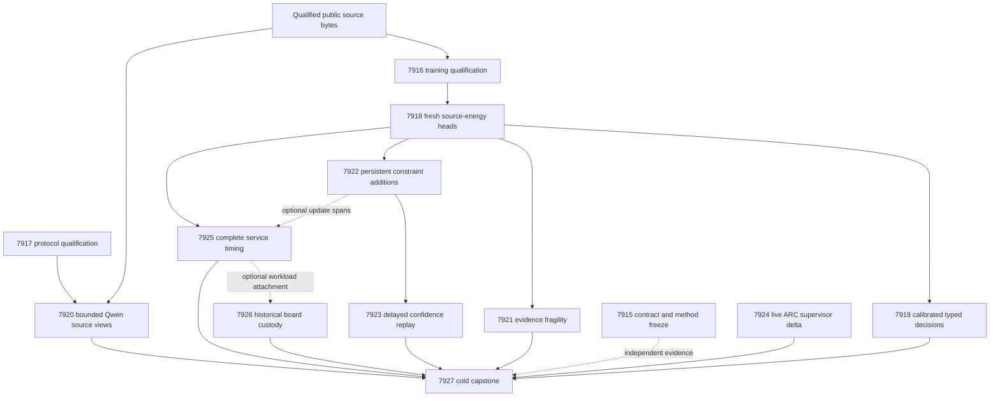

# Carnot Research Roadmap v687: Executable Decisions and Evidence Fragility

**Created:** 2026-09-30
**Milestone:** 2026.09.687
**Status:** Planned; staged for review, not activated
**Title:** Executable source decisions, causal learning, and evidence fragility
**Supersedes:** completed execution of 2026.09.686, Exp7903–Exp7914
**Preserved predecessor:** [V686 design](research-roadmap-v686-preserved-20260930.md)
**Execution authority:** [research-roadmap-next.yaml](../../research-roadmap-next.yaml)
**Planning requirement:** REQ-REPORT-PLAN-687.

This milestone contains **13 tasks, exp7915 through exp7927, in that order,
across four phases**. The exact task contract below is the complete executable
list. It includes three prerequisite qualifications, seven science measurements,
one live ARC receipt analysis, one hardware continuity task and one capstone.

## What V686 proved

Completion means all dispatches ended. It does not mean their science succeeded.
The completion archive ends at V685 during planning. V686 evidence comes from
the active task list, terminal artifacts, raw command logs and conductor log.
Six declared producers are disqualified. Six scientific producers are absent
at their declared paths; separate conductor gate receipts explain their skips.
Never substitute those receipts for a scientific producer.

| Evidence | Observed result | V687 response |
|---|---|---|
| Exp7903 contract | Missing visible table, machine contract and digest; E2E-016 date failure | Supply the complete contract now. Parameterize count while preserving historical twelve-task behavior. |
| Exp7904 training qualification | 290/290 owned statements covered; both required E2E-016 calls failed `run_date_mismatch` | Reuse the runtime; correct the historical fixture argv and requalify current execution. |
| Exp7905 intervention | 697/699 owned statements covered | Test the Exp7893 wrong-date rejection and Exp7905 second terminal-failure branch. |
| Exp7906–7910 and Exp7912 | Six gated science tasks did not produce their declared artifacts | No new fitting, decision, Qwen, learning, confidence or service benefit was established. |
| Exp7911 ARC | Terminal disqualification, including the same E2E date failure | Reuse the reducer and the last accepted cutoff; zero new outcomes remains a valid null. |
| Exp7913 hardware | Historical fixture date caused required failure | Retain private scratch and board custody; no fresh board probe is justified. |
| Exp7914 capstone | Contract sections absent; date failures; 270/271 statements covered | Use the exact contract and cover the real publication-result branch. |

The shared E2E CLI explicitly accepts only `20260929`. Passing `20260930`
caused the failures. V687 uses the historical date on both fixture and replay
routes and records current execution time separately. It preserves all earlier
disqualifications, assertions and date-rejection behavior.

Exp7892 remains the qualified source boundary: 640 intended families, 604
eligible and 36 excluded. V687 authenticates its raw public/evaluator shards.
It does not write another source producer. Exp7894's heads remain historical
and disqualified; the new fitting task trains fresh checkpoints.

Repository-wide test and spec debt stays open. The September 28 oracle-distinct
corrigendum remains binding. A passing historical FoVer publication gate does
not close the retracted ARC verifier claim or qualify new source experiments.

## Three biggest gaps against the PRD

1. **Useful verifiable decisions, FR-12.** Extraction and energy scoring exist,
   but current natural-source decisions lack qualified benefit evidence.
   Train calibrated accept/reject/escalate policies and compare matched controls.
   Test sensitivity to evidence loss separately from original-label correctness.
2. **Causal continuous learning, FR-11.** Persistent constraints must change
   later decisions and improve them under delayed feedback. Bank growth and
   weight movement are insufficient. Use no-write and complete-static controls,
   retained-data checks, crash recovery and explicit feedback release times.
3. **Qualified deployment evidence, FR-05/08/09/10 and NFR-01.** Repeated
   orchestration failures prevent numerical work. Finish the small known repairs,
   then measure complete service cost before a Rust or hardware port. Maintain
   the live ARC generalization and board obligations without duplicate solves.

## Research recorded before design

The [V687 source review](../../research-references.md#v687-planning-review--2026-09-30-recorded-before-design)
was appended before this design. It covers all eight requested topics and all
six secondary sources. Access limits and rechecked references are explicit.

| Method | Application | Limit |
|---|---|---|
| [Counterfactual Fragility Certificates](https://arxiv.org/abs/2609.00366), 2026 | Exp7921 separates removal-based scores from stochastic missing-evidence outcomes | A protocol-specific diagnostic, not a formal guarantee or natural hallucination label. The retrieved date conflicts with its identifier month. |
| [Delayed ACI](https://arxiv.org/abs/2609.07251), September 2026 | Exp7923 compares confidence updates at matched delays on fixed predictions | Binary empirical adaptation; no transferred forecasting theorem. |
| [EBT](https://arxiv.org/abs/2507.02092), 2025; [ARM–EBM](https://arxiv.org/abs/2512.15605), 2025/2026 | Exp7918 fits input-conditioned energies; Exp7919 tests normalized decision risks | Low learned energy is not a correctness proof. |
| [KAN-CL](https://arxiv.org/abs/2605.12306), 2026; [KAC](https://arxiv.org/abs/2503.21076), 2025 | Exp7922 records sparse updates and retention | No unchanged KAN importance-anchor rerun. |
| [FPGA decomposition](https://arxiv.org/abs/2602.15985), 2026; [Z1T](https://extropic.ai/writing/z1t) | Exp7925/7926 include host work, readout and transfer costs | Vendor projections are not local end-to-end measurements. |

Neural constraint layers assume encoded constraints and do not repair extraction.
Energy-guided generation remains premature before useful verification is measured.
The retired PHASE D generated-text reranker is not reopened. Generator weights
remain fixed. Kona describes a direction but supplies no reproducible training
recipe. Speech KAN adapters and diffusion distillation remain deferred.

Semantic Scholar returned nine ARM–EBM citing records; EBT access returned 429.
OpenReview's direct EBT PDF challenged the browser. GitHub trending crawls were
stale. The review claims neither exhaustive citations nor a new trending repo.

## Architecture



Only Exp7920 invokes a pretrained LLM. Public bytes feed the predictors.
Evaluator labels cross only the registered scoring and feedback boundaries.
Contract, ARC, hardware and capstone tasks remain independently runnable.
A valid null opens a measurement-readiness gate; a disqualified artifact does not.

## Phase 1 — Qualify the existing paths

**Exp7915–Exp7917; 130 estimated minutes.** Exp7915 binds all thirteen tasks
and ingests the reviewed methods. The existing lifecycle helper defaults to
twelve tasks; add an explicit count parameter while preserving that default.
Use private staged/active authorities and twelve negative mutations. Missing
staging after activation is acceptable only with matching actual active bytes
and the frozen digest. This receipt does not gate the science branches.

Exp7916 reuses the fitting qualification, complete numerical dependency hashes
and source custody. It corrects the historical fixture argv and exercises the
actual CLI. Exp7917 adds the two missing regression cases before any Qwen call.
Both require 100 percent coverage of affected code and current terminal checks.
No copied dispatcher, new source producer or weakened validator is needed.

**Prototype:** private CPU source and transport fixtures. **Pass criteria:**
all required commands and changed-source coverage pass. **Adversarial checks:**
wrong dates, stale code/input hashes, changed prompts, terminal recheck failure,
missing source and consumed/later staging. No fixture earns scientific benefit.

## Phase 2 — Measure source decisions and evidence dependence

**Exp7918–Exp7921; 220 estimated minutes.** The fixed exposed-development
cohort keeps its existing roles: fit 256, tune 64, policy_design 32,
calibration_replay 32, online_update 96, online_admission 64, evaluation 64
and retention 32. Preserve exclusions in their original slots. Repeated
views, seeds and masks never increase the independent source-family count.

Exp7918 fits nine arms with seeds 67801/67802/67803: response_set, local_set,
augmented_set, constrained_set, augmented_mlp, constrained_mlp, local_logistic,
source_erased_constrained_set and complete_static_constrained_set. Use width
16, at most 4096 parameters, learning rate .01 and 16 epochs. Keep 132 base
features and sixteen added conjunctions for the complete-static arm. Match
labels and work between augmented and constrained pairs. Unknown labels have
zero loss and gradient. Preserve the current A singles/triples and B singles/
pairs views, at most 128 windows and 16 answer units; overbudget rows abstain.

Use symmetric Bernoulli KL/2 tolerance .01, alternate-view CE limit .70 and
dual step .01 clipped to [0,10]. Tune temperature only on the tune role, over
17 log-spaced values in [.25,4]. Save all 27 fresh heads and dependency hashes.
Fit prevalence and length-only controls using fit/tune only. Include source
erasure and length-matched source permutation. Numerical work stops at 3000
seconds with per-arm/seed checkpoints; remaining owned work is partial.

Exp7919 uses unsupported probability p and original label y. Expected costs
are accept=5p, reject=1-p, escalate=.25; actual costs are 5y, 1-y, .25.
Ties escalate. Compare constrained_set with augmented_set, constrained_mlp
and local_logistic. Average seeds within family. Use 10,000 paired source-
cluster bootstrap draws and paired randomization; Holm-correct six cost/Brier
tests. Benefit requires cost gain >=.02, positive CI95 lower bounds for both
metrics against every control, adjusted p<.05 and automated coverage >=.20.
Freeze abstention on policy_design at retained coverage .50. A realized arm
coverage difference >.05 invalidates an equal-coverage claim. No retuning on
evaluation labels is allowed. A completed null is measurement-ready.

Exp7920 uses **unsloth/Qwen3.8-27B-GGUF**, the sole mandated pretrained model.
It authenticates local revision, file hash, quantization, tokenizer, CUDA
offload and served identity. Use the GGUF path and embedded tokenizer through
llama.cpp. Never pass a GGUF repository to AutoTokenizer. Do not disrupt a
shared server or substitute its differently named model. CPU fallback cannot
supply a headline. Legacy small models are smoke-test-only, if used at all.

Freeze 48 evaluation families by source-group hash and four calls per family.
Use <=128 output tokens per call, <=24,576 total, n_ctx=8192, temperature=0,
seed=67801 and `/no_think`. Tokenize first; overlength input abstains without
truncating source bytes. Load timeout is 300 seconds, call timeout 120.
Stop starting calls at 2400 seconds and measured work by 3000 seconds.
This is **model_bounded_generation**, with a 10-second floor. Full generation
uses 60 seconds; load-only or embeddings use 2 seconds. None is padded.

Hold the first complete answer sentence fixed across full source, witness-only,
witness plus neighbors and witness plus disjoint filler. Require exact byte
addresses and <=25 percent filler length mismatch. At least 32 complete families
are needed for the sensitivity comparison. Budget exhaustion without that
sample is a terminal underpowered null. Sentence accuracy needs independent
sentence labels; whole-answer labels and edited contexts do not supply them.

Exp7921 is the new fragility diagnostic. Freeze the actual 132-dimensional
source_alignment feature groups: unigram interactions [0:64], bigrams [64:128],
overlap/uncovered [128,131], and negation/numeric mismatch [129,130]. Impute
removed coordinates with label-free fit-role means. Record availability in
a sidecar; do not add mask dimensions to the frozen head. These are feature
ablations, not literal source deletion or natural missingness claims. A greedy
four-step removal path scores first decision flip and normalized probability-
margin loss. The original modal class is 1 iff p>=.5, including escalation cases.
Use constrained_set and local_logistic heads on 64 intended evaluation families.

A separate channel samples 32 missingness masks per family at rates .25 and
.50 with seed 68721. Pool all 64 trials equally within each seed, then average
flip fractions across seeds. A family is brittle at pooled fraction >=.25.
The sole primary endpoint uses constrained_set and this pooled outcome.
Logistic-head and separate-rate panels are descriptive. Score masks cannot supply evaluation outcomes.
Compare trajectory score, confidence, one-step removal and hash-random review
at exactly 20 percent of eligible families. Report Capture@20, AUROC only when
both classes exist, forward-call cost and all primitive rows. Average model
seeds within family. Use 10,000 paired cluster bootstraps and Holm adjustment
across three primary ranking comparisons, requiring adjusted p<.05. A protocol gain needs >=.10 Capture@20
improvement with CI95 lower>0 against every control, >=32 eligible families
and >=10 brittle families. Otherwise the result is a valid null.

The reference in this diagnostic is the frozen model under another stress
process. Declare verifier_is_oracle=true and circular_positive for protocol
benefit. Natural correctness and formal robustness remain unmeasured. The
prior evidence-shortcut failure, Exp7848, is recorded: scratch under results
caused a guarded rename failure, and coverage was 263/408. Private scratch
and real CLI coverage address that execution defect without rewriting history.

**Prototype:** frozen heads and a bounded Qwen panel. **Pass criteria:** the
predeclared benefit gates above, separately from readiness. **Adversarial
checks:** label leakage, identical arms, all-null rows, length shortcuts,
source permutations, wrong model identity and copied score-path outcomes.
Independent stress draws may repeat mask values; test provenance, not value disjointness.

## Phase 3 — Test causal learning and delayed confidence

**Exp7922–Exp7923; 115 estimated minutes.** Exp7922 is the mandatory continuous
self-learning experiment. Use eight logical blocks of twelve online-update
and eight admission slots, three seeds and exactly 20 intended slots of feedback delay.
For an event issued at t, its label releases at t+20. Process past releases
before the current prediction; never expose the current event's label. Compare
dynamic admission, frozen bank, complete-static, no-write and shuffled-released-
past-label controls. Keep excluded slots and explicit block IDs.

Use sixteen immutable conjunctions. Trainable arms receive coefficient updates
at .01 only after feedback release. Admission labels choose predicates but
never fit coefficients. Admit at most one predicate per block and eight total,
requiring >=.01 admission Brier gain and no extra false accepts. No-write makes
the same proposals without installing them. Complete-static starts with all
predicates. Calibration, evaluation and retention labels cannot select updates.
Seal every prediction before feedback and persist initial plus eight snapshots.
Crash after block four; resumed state, pending feedback and later predictions
must match uninterrupted execution.

Benefit requires >=.02 future cost gain against complete-static and no-write,
positive paired CI95 lower bounds, Holm-adjusted p<.05 for both primary cost
tests, nonworse Brier,
retention cost-increase CI95 upper<=.01 and no extra false accepts. An earlier
committed write must change a later pre-feedback decision. No causal effect is
a valid null. The immediate acceleration path is sparse CPU counters and bank
lookup. Measure lookup/update/fsync times and touched bytes. A 100x-kernel
scenario is an Amdahl estimate, not a promised 100x service speedup.

Exp7923 adapts delayed ACI to the same issued-prediction trajectory. It changes
confidence feedback, not bank training. Initialize from calibration_replay.
Use nonconformity 1-p_y and target coverage .90. Compare frozen split threshold,
rolling quantile over 32 released families, scalar delayed ACI and phase-indexed
ACI. Verify the upstream t+20 release schedule first. Extra confidence delays
tau=1,4,16 give total delays D=21,24,36. Freeze gamma=.01 and initial alpha=.10.
Release confidence feedback at t+D, after its original release. Process past
releases before issuing that tick's prediction. Use D phase queues with the
state saved when the prediction was issued:
`alpha[t+D] = alpha[t] + gamma*(.10 - miss[t])`.
Excluded events advance time without an update. Reject a different upstream
release schedule. Initialize each queue from the same calibration-only state.
Scalar ACI updates current state; phase ACI updates only its matching queue.
All adaptive arms share the same last-32-eligible-family buffer of released
nonconformity scores. Initialize it from calibration_replay under the initial
head; do not rescore those labels under later heads. For n scores, use order
`k=ceil((n+1)*(1-alpha))`: q is negative infinity at k<=0, positive infinity
at k>n, otherwise the kth sorted score. Include y when `1-p_y<=q`.
Frozen split keeps the initial buffer and alpha; rolling keeps alpha=.10.
Map singleton [0] to accept, [1] to reject, and empty/full sets to escalate.
Use Exp7919's actual costs. Record buffer hashes, n, k, q and each issued action.
Below zero return the full binary set; above one return the empty set.

All adaptive arms receive the same delayed labels. Preserve pending tails,
issued-alpha identity, bank hashes and replay order. Report coverage error,
worst 16-event-window error, set size, empty/full/singleton rates, escalation,
false accepts, Brier and typed cost. Point probabilities remain identical by
construction. Use 10,000 paired contiguous-block bootstraps of length 16 as
descriptive uncertainty; Holm-correct six local-error comparisons. Benefit
requires >=.02 local-error reduction with positive interval lower bound and
Holm-adjusted p<.05 for the claimed primary comparison,
no added false accepts and set-size increase <=.10. Fewer than four complete
windows cannot pass. Residual-memory estimates need >=64 released past labels
and stable autocorrelation; otherwise report null. No conformal theorem follows.

**Prototype:** a test-then-learn stream with durable replay. **Pass criteria:**
causal benefit and uncertainty retention remain separate. **Adversarial checks:**
future feedback, duplicate release, swapped issued state, excluded-slot shifts,
no-op writes and crash-induced replay drift.

## Phase 4 — Generalization, deployment cost and independent reduction

**Exp7924–Exp7927; 125 estimated minutes.** Exp7924 checks live supervisor
outcomes against the last accepted inventory, deduplicating later raw receipts
including those read by disqualified tasks. Zero new firings produces a short
null. At >=20 new outcomes across >=3 games, compare curated arms descriptively.
This meets the ARC generalization floor without changing the live agent or
re-solving banked levels. Registry precheck and imported solve provenance are
mandatory. New level solves are zero; no model runs or submissions occur.

Exp7925 times constrained_set, augmented_set, constrained_mlp and local_logistic
on 64 intended evaluation families and three fitted seeds. Use one cold call
and five randomized paired warm repetitions. Require output parity first.
Include source projection, windows, scoring, calibration, dispatch and
serialization. Qualified Exp7922 state adds optional lookup/update/fsync spans;
its absence does not block static service measurement. Join phase spans to
owned-process telemetry rather than interpreting a later GPU snapshot.
Report cost per processed family, accepted family and caught labeled error.
Zero denominators produce null. No calibrated power measurement means no joules.
For measured kernel fraction f, report modeled 100x-kernel service gain
`1 / ((1-f) + f/100)` and ideal ceiling `1/(1-f)`, with boundary handling.
Only matched-coverage timing with no extra false accepts supports a speed claim.

Exp7926 preserves authenticated KV260 fabric scope at k_max<=5, PolarFire
Linux CPU-only dispatch and GateMate's unchanged `0xffffffff` physical block.
NPU and TSU remain unqualified. It performs zero board executions and attaches
service evidence only when qualified. New installs, probes, purchases and RTL
redesign are outside scope. Future KV260 access uses SSH to `kria`.

Exp7927 cold-reduces all thirteen dispositions and their primitive science rows.
Its own validation covers the previously missed publication-result branch.
It reports stable G1–G4, paper_ready and unmet_gates under their existing
historical definition, separately from V687 readiness and the open verifier gap.
Missing external science yields terminal blocked, not partial. It retains all
retirement decisions and writes a standalone experiment report.

**Prototype:** per-family timing, dated board custody and independent reduction.
**Pass criteria:** output parity, complete service spans and exact task accounting.
**Adversarial checks:** changed producer paths, censored timing, duplicated units,
missing ledgers, fabricated firings and historical publication misattribution.

## Dependency graph and gate policy

The solid edges below are structured gates. Every gate also requires
`flagged_adversarial == false` and `verdict_class in [positive, circular_positive, null]`.
Every named readiness field is required by its current producer's own prompt.

| Consumer | Current producer | Readiness field required to equal 1 |
|---|---|---|
| Exp7918 | Exp7916 | training_runtime_ready_score |
| Exp7919 | Exp7918 | energy_fit_ready_score |
| Exp7920 | Exp7917 | intervention_protocol_ready_score |
| Exp7921 | Exp7918 | energy_fit_ready_score |
| Exp7922 | Exp7918 | energy_fit_ready_score |
| Exp7923 | Exp7922 | learning_measurement_ready_score |
| Exp7925 | Exp7918 | energy_fit_ready_score |

Exp7915, Exp7916, Exp7917, Exp7924, Exp7926 and Exp7927 have no structured
gate. Exp7925's learning timing and Exp7926's workload attachment are optional
inputs with explicit absent states. No `requires` chain names a retired task.
Old source evidence is authenticated as an input, never a new gate producer.

## Hardware requirements and execution budgets

| Tasks | Required compute | Resource boundary |
|---|---|---|
| Exp7915–7919, Exp7921–7927 | Host CPU and system memory | Small heads, source shards, counters, receipts and bounded resampling; no pretrained model loads. |
| Exp7920 | Owned CUDA runtime; one free 24 GB RTX 3090, second card if measured fit requires it | Cached Qwen3.8-27B GGUF is about 16 GB; verify actual VRAM plus 8192-token context fit before load. |
| Exp7926 | Existing board artifacts only | No current KV260, PolarFire or GateMate execution. Preserve each board separately. |

The hardware wishlist's later corrections supersede its stale RX7900/Vivado
notes: the development host has two RTX 3090 cards. Do not assume either is
free. Never terminate another workload to obtain VRAM. If the mandated GGUF
or GPU capacity is unavailable, report an explicit external block. No cloud,
NPU, new FPGA or TSU purchase is required. Consider acquisition only after
Exp7925 demonstrates an acceleration opportunity that survives host overhead.

Estimated task budgets total **590 minutes** in conductor order. Each task
stays below the 4800-second hard cap. These are planning estimates, not measured
savings. Progress heartbeats stay at most 60 seconds apart, including long
loops and owned subprocesses. Every output gap must remain below 600 seconds.
Split files over about 200 lines into tool writes of at most 150 lines.

Exp7915 routes to Opus with 100 turns for schema/lifecycle coordination.
Exp7916/7917 use Codex gpt-6.1-sol for bounded implementation and regression
work. Routine science and synthesis use the default Claude route; short ARC
and custody analyses have 20 turns. No Luna task is proposed.

## Verification and continuation rules

Every implementation task starts with requirements and failing tests. It
freezes its exact command manifest before measurements, covers changed code
and real CLI paths at 100 percent, and runs scoped lint, strict typing and
explicit test-to-spec checks. Fixtures and coverage scratch live outside
results. Historical full-suite failures remain recorded and unresolved.

E2E-015 covers source custody; E2E-016 covers transport with the historical
`20260929` date on both routes; E2E-017 covers supervisor reduction.
E2E-018 uses private current-authority fixtures after rollover, retaining its
assertions without invoking historical publication against current inputs.
Planning executes read-only authority/gate checks and private fixture tests.
Model, board and learning runtime E2Es belong to future experiment execution.

Cold replay, adversarial validation and strict row consistency must inspect
final bytes. Use blocked for external incompleteness, disqualified for owned
required-check failures, partial only for retryable unfinished owned work,
and circular_positive for self-oracle evidence. Every comparison emits rows.

All repeated scopes name prior failures, diagnosed changes and true same-
verdict retirement. Unchanged failures retire; renaming an experiment does
not reopen it. Readiness failure blocks dependent measurement without a model
call. A valid null permits downstream diagnostics but not a benefit claim.

Do not broaden to another architecture or benchmark if current source benefit
remains null. First identify a falsifiable extraction or coverage limitation.
Promote continuous learning only after both causal benefit and retention gates.
Promote hardware work only after complete service measurements justify it.
Keep public publication and production defaults unchanged.

## Exact task contract

The table and machine block below describe the same thirteen tasks as the YAML.
The machine block includes complete tasks, including prompts and failure history.
The digest hashes `json.dumps(tasks, sort_keys=True, separators=(",", ":"), ensure_ascii=False)`
as UTF-8. It therefore detects changes outside the short visible table.

Canonical full-task SHA-256: `2a2006223377835ed87c2927aa650432a242083d6029789423e6f27edf1d57aa`

| Order | ID | Title | Phase | Deliverable |
|---|---|---|---|---|
| 1 | `exp7915-contract-methods` | Bind thirteen tasks and freeze executable validation dates | 1 | `results/experiment_7915_v687_contract_methods.json` |
| 2 | `exp7916-training-qualification` | Requalify training through its existing callable runtime | 1 | `results/experiment_7916_v687_training_qualification.json` |
| 3 | `exp7917-intervention-qualification` | Cover the two remaining intervention failure branches | 1 | `results/experiment_7917_v687_intervention_qualification.json` |
| 4 | `exp7918-energy-fit` | Fit fresh calibrated source energies under matched budgets | 2 | `results/experiment_7918_v687_energy_fit.json` |
| 5 | `exp7919-decision-abstention` | Measure source decisions and abstention at equal coverage | 2 | `results/experiment_7919_v687_decision_abstention.json` |
| 6 | `exp7920-qwen-sufficiency` | Measure bounded Qwen decisions under source interventions | 2 | `results/experiment_7920_v687_qwen_sufficiency.json` |
| 7 | `exp7921-evidence-fragility` | Test evidence fragility against an independent stress channel | 2 | `results/experiment_7921_v687_evidence_fragility.json` |
| 8 | `exp7922-causal-acquisition` | Measure causal constraint additions after delayed feedback | 3 | `results/experiment_7922_v687_causal_acquisition.json` |
| 9 | `exp7923-delayed-calibration` | Test delay-aware confidence on a fixed learned trajectory | 3 | `results/experiment_7923_v687_delayed_calibration.json` |
| 10 | `exp7924-arc-supervisor-delta` | Assess new live ARC supervisor outcomes for generalization | 4 | `results/experiment_7924_v687_arc_supervisor_delta.json` |
| 11 | `exp7925-service-cost` | Measure complete decision-service and durable-update costs | 4 | `results/experiment_7925_v687_service_cost.json` |
| 12 | `exp7926-hardware-evidence` | Preserve board custody and bound workload acceleration | 4 | `results/experiment_7926_v687_hardware_evidence.json` |
| 13 | `exp7927-capstone` | Independently reduce thirteen outcomes and decide PRD gaps | 4 | `results/experiment_7927_v687_capstone.json` |

<!-- V687_TASK_CONTRACT_START -->
```json
{"milestone":"2026.09.687","tasks":[
{"MODEL_SPECS":[],"deliverable":"results/experiment_7915_v687_contract_methods.json","estimated_wall_time_min":45,"gated_on":[],"id":"exp7915-contract-methods","inference_substrate_class":"no_model_load","max_turns":100,"milestone":"2026.09.687","model":"opus","per_unit_rows":true,"phase":1,"prior_failures":[{"addressed_by":"V686 omitted its reader-required table, machine contract and digest. This plan supplies all three. Parameterize task count and fixture dates while preserving historical checks. No science depends on this administrative receipt.","experiment_id":"exp7726-contract-methods","retire_if_same_verdict":true,"verdict":"complete_disqualified_v673_contract_validation"},{"addressed_by":"V686 omitted its reader-required table, machine contract and digest. This plan supplies all three. Parameterize task count and fixture dates while preserving historical checks. No science depends on this administrative receipt.","experiment_id":"exp7713-contract-methods","retire_if_same_verdict":true,"verdict":"complete_blocked_v672_independent_contract"},{"addressed_by":"V686 omitted its reader-required table, machine contract and digest. This plan supplies all three. Parameterize task count and fixture dates while preserving historical checks. No science depends on this administrative receipt.","experiment_id":"exp7739-contract-methods","retire_if_same_verdict":true,"verdict":"complete_null_v674_contract_methods"},{"addressed_by":"V686 omitted its reader-required table, machine contract and digest. This plan supplies all three. Parameterize task count and fixture dates while preserving historical checks. No science depends on this administrative receipt.","experiment_id":"exp7532-v659-contract-methods","retire_if_same_verdict":true,"verdict":"complete_blocked_incomplete_v659_authorities"},{"addressed_by":"V686 omitted its reader-required table, machine contract and digest. This plan supplies all three. Parameterize task count and fixture dates while preserving historical checks. No science depends on this administrative receipt.","experiment_id":"exp7713-v672-contract-methods","retire_if_same_verdict":true,"verdict":"complete_blocked_v672_independent_contract"},{"addressed_by":"V686 omitted its reader-required table, machine contract and digest. This plan supplies all three. Parameterize task count and fixture dates while preserving historical checks. No science depends on this administrative receipt.","experiment_id":"exp7781-contract-methods","retire_if_same_verdict":true,"verdict":"complete_circular_positive_v677_contract_methods"},{"addressed_by":"V686 omitted its reader-required table, machine contract and digest. This plan supplies all three. Parameterize task count and fixture dates while preserving historical checks. No science depends on this administrative receipt.","experiment_id":"exp7809-contract-methods","retire_if_same_verdict":true,"verdict":"complete_disqualified_v679_contract_validation"},{"addressed_by":"V686 omitted its reader-required table, machine contract and digest. This plan supplies all three. Parameterize task count and fixture dates while preserving historical checks. No science depends on this administrative receipt.","experiment_id":"exp7823-contract-methods","retire_if_same_verdict":true,"verdict":"complete_disqualified_v680_contract_validation"},{"addressed_by":"V686 omitted its reader-required table, machine contract and digest. This plan supplies all three. Parameterize task count and fixture dates while preserving historical checks. No science depends on this administrative receipt.","experiment_id":"exp7837-contract-methods","retire_if_same_verdict":true,"verdict":"complete_disqualified_v681_contract_validation"},{"addressed_by":"V686 omitted its reader-required table, machine contract and digest. This plan supplies all three. Parameterize task count and fixture dates while preserving historical checks. No science depends on this administrative receipt.","experiment_id":"exp7865-contract-methods","retire_if_same_verdict":true,"verdict":"complete_disqualified_v683_required_validation"},{"addressed_by":"V686 omitted its reader-required table, machine contract and digest. This plan supplies all three. Parameterize task count and fixture dates while preserving historical checks. No science depends on this administrative receipt.","experiment_id":"exp7879-contract-methods","retire_if_same_verdict":true,"verdict":"complete_disqualified_v684_required_validation"},{"addressed_by":"V686 omitted its reader-required table, machine contract and digest. This plan supplies all three. Parameterize task count and fixture dates while preserving historical checks. No science depends on this administrative receipt.","experiment_id":"exp7891-authority-lifecycle","retire_if_same_verdict":true,"verdict":"complete_circular_positive_authority"},{"addressed_by":"V686 omitted its reader-required table, machine contract and digest. This plan supplies all three. Parameterize task count and fixture dates while preserving historical checks. No science depends on this administrative receipt.","experiment_id":"exp7903-contract-methods","retire_if_same_verdict":true,"verdict":"complete_disqualified_required_validation"}],"priority":"high","prompt":"CONTEXT:\nWork in {project_root} on {date} for milestone 2026.09.687. V686 omitted its reader-required table, machine contract and digest. This plan supplies all three. Parameterize task count and fixture dates while preserving historical checks. No science depends on this administrative receipt.\n\nEXISTING CODE TO READ FIRST:\n- {project_root}/CLAUDE.md\n- {project_root}/CODEX.md\n- {project_root}/research-program.md\n- {project_root}/ops/exclusion_manifest.yaml\n- {project_root}/ops/e2e-test-plan.md\n- {project_root}/scripts/experiment_template.py\n- {project_root}/python/carnot/reporting/current_work_receipt.py\n- {project_root}/python/carnot/reporting/experiment_7303_validation_scope.py\n- {project_root}/openspec/capabilities/research-reporting/spec.md\n- {project_root}/openspec/change-proposals/research-roadmap-vNEXT.md\n- {project_root}/python/carnot/reporting/v685_authority_lifecycle.py\n- {project_root}/python/carnot/reporting/roadmap_contract.py\n- {project_root}/scripts/roadmap_schema.py\n- {project_root}/scripts/audit_roadmap_gates.py\n- {project_root}/tests/python/test_experiment_7891_v685_authority_lifecycle.py\n- {project_root}/results/experiment_7891_v685_authority_lifecycle.json\n- {project_root}/results/experiment_7892_v685_source_boundary.json\n- {project_root}/research-references.md\n- {project_root}/python/carnot/reporting/v686_contract_methods.py\n- {project_root}/python/carnot/reporting/v686_contract_validation.py\n- {project_root}/results/experiment_7903_v686_contract_methods.json\n- {project_root}/tests/python/test_experiment_7903_v686_contract_methods.py\n- {project_root}/research-studying.md\n\nTASK:\nBind thirteen tasks and freeze executable validation dates.\nDeliverable: {project_root}/results/experiment_7915_v687_contract_methods.json.\nActual compute: aggregation_from_upstream_artifacts; inference_substrate_class=no_model_load; MODEL_SPECS=[]; execution_venue=host.\n\nCONCRETE STEPS:\n1. Print a flushed start line. Resolve input paths, byte hashes, roles and gate operands before compute. External missing or failed prerequisites end as complete_blocked_* with verdict_class=blocked and gate_check_summary.\n2. Print a flushed progress line at each phase boundary and before and after every model load, generation, benchmark and subprocess. Print elapsed time and completed units inside long loops. Supervise owned children with heartbeats at most 60 seconds apart. Keep every output gap below 600 seconds and each tool wait at most 60 seconds. Silence can end the task at 1200 seconds; regular output permits the 4800-second hard cap. Never pad time.\n3. Write any file over about 200 lines in several tool calls, each at most 150 lines. Emit a progress message between calls. Keep each tool call and analysis segment bounded. Save checkpoints by code/config/input hash. Put scratch in /tmp and real scripts in scripts/experiments/.\n4. Add task-owned REQ-* and SCENARIO-* requirements before implementation. Write failing tests first. Freeze affected dependencies, exact argv, expected exits and failure reasons, deadlines and coverage includes before results. Preserve existing tests and all historical required failures.\n5. Reuse callable libraries behind a small parameterized CLI. Never copy an entire historical dispatcher. Keep pytest basetemp, coverage data and fixture outputs in private /tmp paths outside results. Seal and copy child logs only after exit. Do not disable result guards.\n6. Use roadmap_contract.parse_design with milestone 2026.09.687. Check the visible table, V687_TASK_CONTRACT_START JSON and canonical full-task SHA-256 over all thirteen tasks. Read actual staged and active files separately. Before activation record activation_confirmed=false; after activation require the matching active digest. Missing consumed staging or later staging is acceptable only with matching frozen active authority. Never substitute active bytes for a missing staged observation.\n7. Parameterize the reused v685_authority_lifecycle count with a default of twelve for historical consumers and an explicit count=13 here. Preserve old tests. Add private 12-task and 13-task lifecycle fixtures, consumed/later staging cases and twelve mutations, including task order, prompt, prior_failures, gate field, count, date and digest drift. Do not edit the conductor or activation guards.\n8. Authenticate Exp7892 public/evaluator source hashes directly: 640 intended families, 604 previously eligible, 36 excluded. Keep source custody distinct from contract readiness. Do not rebuild its source producer. Other branches validate these inputs directly, so this administrative task is not a global science gate.\n9. Ingest the V687 reference review and the fragility/Delayed-ACI methods. Recheck at most three primary pages with bounded low-concurrency requests. Freeze grouping, masks, sample budgets and adoption/defer reasons before outcomes. Update research-studying.md with ingestion status. Run E2E-015/016 and E2E-018 private lifecycle tests using historical fixture dates. The historical E2E-018 publishing command is not applicable after rollover; use equivalent private current-authority execution with the same assertions.\n10. Run affected unit and consumer tests with PYTHONPATH=python:. and pytest -n 0 -o addopts= --no-cov. Combine unit and actual CLI success, expected-failure, cold-replay and terminal-recheck coverage with identical includes. Require nonempty data and 100 percent statements for changed modules and CLIs. Preserve stricter existing obligations. Run scoped Ruff check/format, strict mypy and scripts/check_spec_coverage.py with explicit affected test filenames. Record repository-wide debt separately; never call an unscoped spec scan an affected-scope check.\n11. Execute the task-specific E2Es named above. For historical E2E-016 use --date 20260929 on BOTH fixture and cold-replay calls to experiment_7868_v683_intervention_protocol.py. That CLI rejects other dates. Record current {date} separately as execution time; never rewrite the historical fixture date. Use unique private paths. Do not invoke historical publishing CLIs against current authorities. Add a wrong-date rejection test when changing orchestration. Seal raw rows and nonoverlapping phase spans; keep shards below 50 MiB and tracked files below 90 MB.\n12. Cold-reduce every claim from primitive rows. Run scripts/adversarial_verify.py --json and scripts/verdict_row_consistency_lint.py --strict on the exact terminal candidate. Inspect both reports. Required owned failures imply disqualified and readiness zero. Revalidate final bytes after any verdict change. Bind sidecars to candidate hashes and atomically publish only checked bytes. Fixture/oracle agreement is circular_positive, never independent benefit.\n13. Use complete_* with terminal verdict_class positive, circular_positive, null, blocked or disqualified. Reserve partial_* and partial for unfinished owned work that another attempt can finish. External incompleteness is blocked. A valid null may be ready. Reconcile OpenSpec, _bmad/traceability.md, ops/status.md and ops/changelog.md. Retire an unchanged prior verdict under retire_if_same_verdict. Do not activate a roadmap, change production defaults or publish externally.\n\nREQUIRED ARTIFACT FIELDS:\n- experiment_id, task_id, milestone, run_date: Exact producer IDs, 2026.09.687 and {date}. Principle: Evidence belongs to the producer that executed it.\n- honest_verdict, verdict_class: Closed enum positive | circular_positive | null | blocked | disqualified | partial. Use complete_* for terminal outcomes. Principle: External incompleteness cannot be fixed by retries.\n- flagged_adversarial: Actual terminal validator result. Principle: Flagged evidence cannot open a downstream gate.\n- gate_check_summary: Every blocked_* or complete_blocked_* names upstream ID, path/hash, field, op, expected and observed value. Principle: Missing evidence differs from a failed threshold.\n- rows, sample_size_budget: Unit/arm/seed rows with intended, eligible, started, completed, failed, censored, excluded and independent counts. Principle: Headline comparisons must be recomputable without rerunning.\n- acceptance_gate_results: Separate validity, readiness and scientific benefit. Null denotes unmeasured. Principle: Execution success does not prove utility.\n- duration_s, phase_spans, random_seed, reproducibility_checksum: Monotonic times and real code/config/data hashes. Principle: Never infer compute from a model name or pad time.\n- source_artifact_hashes, preconditions_checked, resolved_imports: Paths, hashes and exposure roles. Principle: Evidence custody includes transitive dependencies.\n- validation_receipts, validation_command_manifest_path, observed_child_commands, coverage_statement_counts, historical_required_failures, repository_health: Exact argv, expected/actual exits, deadline, sealed logs and measured files. Principle: New qualification does not erase an earlier failure.\n- verifier_is_oracle, claim_scope: Explicit circularity; natural cohorts remain exposed_development. Principle: Reused development labels cannot establish independent generalization.\n- inference_substrate, inference_substrate_class, execution_venue: Actual TASK compute, host for host execution. Principle: Workload determines the duration floor; no-run artifacts record the planned class separately.\n- MODEL_SPECS, model_specs, target_model, model_invocation_counts, trained_head_specs: Invoked pretrained models or empty lists and zero calls; fitted small heads separately. Principle: Cited models are not invoked models.\n- field_principles: Explain each task-owned field and acceptance gate. Principle: The schema must preserve why a field exists.\n- contract_ready_score: 1 only for matching activated V687 authority and passed owned checks. Principle: Planning alone does not prove activation.\n- contract_rows, mutation_rows, authority_snapshots, canonical_tasks_sha256, source_custody_rows, literature_adoption_decisions: Thirteen ordered task rows, twelve mutation rows and independently read authority/source hashes. Principle: Reuse qualified evidence without granting science credit.\n- historical_fixture_date, execution_date, lifecycle_task_count: 20260929, current {date}, and 13 respectively. Principle: Fixture identity and execution time are separate.\n\nRun command: cd {project_root} && CARNOT_FORCE_LIVE=1 JAX_PLATFORMS=cpu PYTHONPATH=python:. .venv/bin/python -u scripts/experiments/experiment_7915_v687_contract_methods.py --date {date}\nDo NOT push. Do NOT modify scripts/research_conductor.py.\n","requires_gpu":false,"title":"Bind thirteen tasks and freeze executable validation dates","track":"infra"},
{"MODEL_SPECS":[],"agent_type":"codex","deliverable":"results/experiment_7916_v687_training_qualification.json","estimated_wall_time_min":40,"gated_on":[],"id":"exp7916-training-qualification","inference_substrate_class":"no_model_load","max_turns":50,"milestone":"2026.09.687","model":"gpt-6.1-sol","per_unit_rows":true,"phase":1,"prior_failures":[{"addressed_by":"Exp7904 covered 290/290 owned statements. Its only required failures were E2E-016 run_date_mismatch. Qualify the existing training path with the historical fixture date, current execution receipts and complete dependency hashes. Do not rewrite the fitting pipeline.","experiment_id":"exp7730-set-energy-fit","retire_if_same_verdict":true,"verdict":"complete_disqualified_set_energy_fit"},{"addressed_by":"Exp7904 covered 290/290 owned statements. Its only required failures were E2E-016 run_date_mismatch. Qualify the existing training path with the historical fixture date, current execution receipts and complete dependency hashes. Do not rewrite the fitting pipeline.","experiment_id":"exp7730-v673-set-energy-fit","retire_if_same_verdict":true,"verdict":"complete_disqualified_set_energy_fit"},{"addressed_by":"Exp7904 covered 290/290 owned statements. Its only required failures were E2E-016 run_date_mismatch. Qualify the existing training path with the historical fixture date, current execution receipts and complete dependency hashes. Do not rewrite the fitting pipeline.","experiment_id":"exp7743-localized-energy-fit","retire_if_same_verdict":true,"verdict":"GATE_BLOCK"},{"addressed_by":"Exp7904 covered 290/290 owned statements. Its only required failures were E2E-016 run_date_mismatch. Qualify the existing training path with the historical fixture date, current execution receipts and complete dependency hashes. Do not rewrite the fitting pipeline.","experiment_id":"exp7757-view-energy-fit","retire_if_same_verdict":true,"verdict":"blocked_gate_check_failed"},{"addressed_by":"Exp7904 covered 290/290 owned statements. Its only required failures were E2E-016 run_date_mismatch. Qualify the existing training path with the historical fixture date, current execution receipts and complete dependency hashes. Do not rewrite the fitting pipeline.","experiment_id":"exp7771-view-energy-fit","retire_if_same_verdict":true,"verdict":"blocked_gate_check_failed"},{"addressed_by":"Exp7904 covered 290/290 owned statements. Its only required failures were E2E-016 run_date_mismatch. Qualify the existing training path with the historical fixture date, current execution receipts and complete dependency hashes. Do not rewrite the fitting pipeline.","experiment_id":"exp7785-view-energy-fit","retire_if_same_verdict":true,"verdict":"GATE_BLOCKED"},{"addressed_by":"Exp7904 covered 290/290 owned statements. Its only required failures were E2E-016 run_date_mismatch. Qualify the existing training path with the historical fixture date, current execution receipts and complete dependency hashes. Do not rewrite the fitting pipeline.","experiment_id":"exp7798-view-energy-fit","retire_if_same_verdict":true,"verdict":"GATE_BLOCKED"},{"addressed_by":"Exp7904 covered 290/290 owned statements. Its only required failures were E2E-016 run_date_mismatch. Qualify the existing training path with the historical fixture date, current execution receipts and complete dependency hashes. Do not rewrite the fitting pipeline.","experiment_id":"exp7812-view-energy-fit","retire_if_same_verdict":true,"verdict":"GATE_BLOCKED"},{"addressed_by":"Exp7904 covered 290/290 owned statements. Its only required failures were E2E-016 run_date_mismatch. Qualify the existing training path with the historical fixture date, current execution receipts and complete dependency hashes. Do not rewrite the fitting pipeline.","experiment_id":"exp7826-view-energy-fit","retire_if_same_verdict":true,"verdict":"GATE_BLOCKED"},{"addressed_by":"Exp7904 covered 290/290 owned statements. Its only required failures were E2E-016 run_date_mismatch. Qualify the existing training path with the historical fixture date, current execution receipts and complete dependency hashes. Do not rewrite the fitting pipeline.","experiment_id":"exp7840-energy-fit","retire_if_same_verdict":true,"verdict":"GATE_BLOCKED"},{"addressed_by":"Exp7904 covered 290/290 owned statements. Its only required failures were E2E-016 run_date_mismatch. Qualify the existing training path with the historical fixture date, current execution receipts and complete dependency hashes. Do not rewrite the fitting pipeline.","experiment_id":"exp7855-energy-fit","retire_if_same_verdict":true,"verdict":"GATE_BLOCKED"},{"addressed_by":"Exp7904 covered 290/290 owned statements. Its only required failures were E2E-016 run_date_mismatch. Qualify the existing training path with the historical fixture date, current execution receipts and complete dependency hashes. Do not rewrite the fitting pipeline.","experiment_id":"exp7869-energy-fit","retire_if_same_verdict":true,"verdict":"GATE_BLOCKED"},{"addressed_by":"Exp7904 covered 290/290 owned statements. Its only required failures were E2E-016 run_date_mismatch. Qualify the existing training path with the historical fixture date, current execution receipts and complete dependency hashes. Do not rewrite the fitting pipeline.","experiment_id":"exp7882-energy-fit","retire_if_same_verdict":true,"verdict":"GATE_BLOCKED"},{"addressed_by":"Exp7904 covered 290/290 owned statements. Its only required failures were E2E-016 run_date_mismatch. Qualify the existing training path with the historical fixture date, current execution receipts and complete dependency hashes. Do not rewrite the fitting pipeline.","experiment_id":"exp7894-energy-fit","retire_if_same_verdict":true,"verdict":"complete_disqualified_required_checks"},{"addressed_by":"Exp7904 covered 290/290 owned statements. Its only required failures were E2E-016 run_date_mismatch. Qualify the existing training path with the historical fixture date, current execution receipts and complete dependency hashes. Do not rewrite the fitting pipeline.","experiment_id":"exp7904-training-qualification","retire_if_same_verdict":true,"verdict":"complete_disqualified_training_qualification"}],"priority":"high","prompt":"CONTEXT:\nWork in {project_root} on {date} for milestone 2026.09.687. Exp7904 covered 290/290 owned statements. Its only required failures were E2E-016 run_date_mismatch. Qualify the existing training path with the historical fixture date, current execution receipts and complete dependency hashes. Do not rewrite the fitting pipeline.\n\nEXISTING CODE TO READ FIRST:\n- {project_root}/CLAUDE.md\n- {project_root}/CODEX.md\n- {project_root}/research-program.md\n- {project_root}/ops/exclusion_manifest.yaml\n- {project_root}/ops/e2e-test-plan.md\n- {project_root}/scripts/experiment_template.py\n- {project_root}/python/carnot/reporting/current_work_receipt.py\n- {project_root}/python/carnot/reporting/experiment_7303_validation_scope.py\n- {project_root}/openspec/capabilities/research-reporting/spec.md\n- {project_root}/scripts/experiments/experiment_7894_v685_energy_fit.py\n- {project_root}/python/carnot/verify/energy_fit_7894.py\n- {project_root}/python/carnot/verify/natural_training.py\n- {project_root}/python/carnot/verify/training_runtime.py\n- {project_root}/python/carnot/verify/evidence_views.py\n- {project_root}/python/carnot/verify/natural_predicates.py\n- {project_root}/tests/python/test_energy_fit_7894.py\n- {project_root}/tests/python/test_natural_runtime_7867.py\n- {project_root}/scripts/check_spec_coverage.py\n- {project_root}/results/experiment_7894_v685_energy_fit.json\n- {project_root}/results/experiment_7892_v685_source_boundary.json\n- {project_root}/openspec/capabilities/verification/spec.md\n- {project_root}/python/carnot/verify/training_qualification_7904.py\n- {project_root}/scripts/experiments/experiment_7904_v686_training_qualification.py\n- {project_root}/tests/python/test_training_qualification_7904.py\n- {project_root}/results/experiment_7904_v686_training_qualification.json\n\nTASK:\nRequalify training through its existing callable runtime.\nDeliverable: {project_root}/results/experiment_7916_v687_training_qualification.json.\nActual compute: aggregation_from_upstream_artifacts; inference_substrate_class=no_model_load; MODEL_SPECS=[]; execution_venue=host.\n\nCONCRETE STEPS:\n1. Print a flushed start line. Resolve input paths, byte hashes, roles and gate operands before compute. External missing or failed prerequisites end as complete_blocked_* with verdict_class=blocked and gate_check_summary.\n2. Print a flushed progress line at each phase boundary and before and after every model load, generation, benchmark and subprocess. Print elapsed time and completed units inside long loops. Supervise owned children with heartbeats at most 60 seconds apart. Keep every output gap below 600 seconds and each tool wait at most 60 seconds. Silence can end the task at 1200 seconds; regular output permits the 4800-second hard cap. Never pad time.\n3. Write any file over about 200 lines in several tool calls, each at most 150 lines. Emit a progress message between calls. Keep each tool call and analysis segment bounded. Save checkpoints by code/config/input hash. Put scratch in /tmp and real scripts in scripts/experiments/.\n4. Add task-owned REQ-* and SCENARIO-* requirements before implementation. Write failing tests first. Freeze affected dependencies, exact argv, expected exits and failure reasons, deadlines and coverage includes before results. Preserve existing tests and all historical required failures.\n5. Reuse callable libraries behind a small parameterized CLI. Never copy an entire historical dispatcher. Keep pytest basetemp, coverage data and fixture outputs in private /tmp paths outside results. Seal and copy child logs only after exit. Do not disable result guards.\n6. Read Exp7904 receipts: 246/246 library statements and 44/44 CLI statements passed; E2E-016 failed only because current date was sent to a fixed-date fixture CLI. Preserve that disqualification. Reuse training_qualification_7904 and energy_fit_7894 callables. Change only the parameterized current orchestration, historical fixture argv and tests needed for a new producer identity.\n7. Bind checkpoints to source/evaluator role hashes, actual upstream path, natural_training, training_runtime, evidence_views and natural_predicates, arm, seed and hyperparameters. Reject a changed dependency and a different upstream even when wrapper bytes match. Preserve cold/resume equivalence and zero loss/gradient for unknown labels. Old trained heads cannot become current by changing metadata.\n8. Exercise actual CLI success, missing source, timeout, changed checkpoint, cold replay and second terminal-failure paths with private tiny CPU fixtures. Run the full existing training consumer closure and E2E-015/016. Require 100 percent changed-source and CLI coverage. Publish the declared producer JSON, never its .validators.json sidecar as the result. Leave natural training to Exp7918.\n9. Run affected unit and consumer tests with PYTHONPATH=python:. and pytest -n 0 -o addopts= --no-cov. Combine unit and actual CLI success, expected-failure, cold-replay and terminal-recheck coverage with identical includes. Require nonempty data and 100 percent statements for changed modules and CLIs. Preserve stricter existing obligations. Run scoped Ruff check/format, strict mypy and scripts/check_spec_coverage.py with explicit affected test filenames. Record repository-wide debt separately; never call an unscoped spec scan an affected-scope check.\n10. Execute the task-specific E2Es named above. For historical E2E-016 use --date 20260929 on BOTH fixture and cold-replay calls to experiment_7868_v683_intervention_protocol.py. That CLI rejects other dates. Record current {date} separately as execution time; never rewrite the historical fixture date. Use unique private paths. Do not invoke historical publishing CLIs against current authorities. Add a wrong-date rejection test when changing orchestration. Seal raw rows and nonoverlapping phase spans; keep shards below 50 MiB and tracked files below 90 MB.\n11. Cold-reduce every claim from primitive rows. Run scripts/adversarial_verify.py --json and scripts/verdict_row_consistency_lint.py --strict on the exact terminal candidate. Inspect both reports. Required owned failures imply disqualified and readiness zero. Revalidate final bytes after any verdict change. Bind sidecars to candidate hashes and atomically publish only checked bytes. Fixture/oracle agreement is circular_positive, never independent benefit.\n12. Use complete_* with terminal verdict_class positive, circular_positive, null, blocked or disqualified. Reserve partial_* and partial for unfinished owned work that another attempt can finish. External incompleteness is blocked. A valid null may be ready. Reconcile OpenSpec, _bmad/traceability.md, ops/status.md and ops/changelog.md. Retire an unchanged prior verdict under retire_if_same_verdict. Do not activate a roadmap, change production defaults or publish externally.\n\nREQUIRED ARTIFACT FIELDS:\n- experiment_id, task_id, milestone, run_date: Exact producer IDs, 2026.09.687 and {date}. Principle: Evidence belongs to the producer that executed it.\n- honest_verdict, verdict_class: Closed enum positive | circular_positive | null | blocked | disqualified | partial. Use complete_* for terminal outcomes. Principle: External incompleteness cannot be fixed by retries.\n- flagged_adversarial: Actual terminal validator result. Principle: Flagged evidence cannot open a downstream gate.\n- gate_check_summary: Every blocked_* or complete_blocked_* names upstream ID, path/hash, field, op, expected and observed value. Principle: Missing evidence differs from a failed threshold.\n- rows, sample_size_budget: Unit/arm/seed rows with intended, eligible, started, completed, failed, censored, excluded and independent counts. Principle: Headline comparisons must be recomputable without rerunning.\n- acceptance_gate_results: Separate validity, readiness and scientific benefit. Null denotes unmeasured. Principle: Execution success does not prove utility.\n- duration_s, phase_spans, random_seed, reproducibility_checksum: Monotonic times and real code/config/data hashes. Principle: Never infer compute from a model name or pad time.\n- source_artifact_hashes, preconditions_checked, resolved_imports: Paths, hashes and exposure roles. Principle: Evidence custody includes transitive dependencies.\n- validation_receipts, validation_command_manifest_path, observed_child_commands, coverage_statement_counts, historical_required_failures, repository_health: Exact argv, expected/actual exits, deadline, sealed logs and measured files. Principle: New qualification does not erase an earlier failure.\n- verifier_is_oracle, claim_scope: Explicit circularity; natural cohorts remain exposed_development. Principle: Reused development labels cannot establish independent generalization.\n- inference_substrate, inference_substrate_class, execution_venue: Actual TASK compute, host for host execution. Principle: Workload determines the duration floor; no-run artifacts record the planned class separately.\n- MODEL_SPECS, model_specs, target_model, model_invocation_counts, trained_head_specs: Invoked pretrained models or empty lists and zero calls; fitted small heads separately. Principle: Cited models are not invoked models.\n- field_principles: Explain each task-owned field and acceptance gate. Principle: The schema must preserve why a field exists.\n- training_runtime_ready_score: 1 only when current callable runtime, full checkpoint dependency checks and all required validations pass. Principle: Fixture qualification is separate from natural benefit.\n- validation_scope_sha256, training_dependency_hashes, checkpoint_mutation_rows, fixture_prediction_rows, coverage_statement_counts: Explicit nonempty CLI coverage and changed-module rejection. Principle: Source edits cannot inherit stale fitted-head authority.\n\nRun command: cd {project_root} && CARNOT_FORCE_LIVE=1 JAX_PLATFORMS=cpu PYTHONPATH=python:. .venv/bin/python -u scripts/experiments/experiment_7916_v687_training_qualification.py --date {date}\nDo NOT push. Do NOT modify scripts/research_conductor.py.\n","requires_gpu":false,"title":"Requalify training through its existing callable runtime","track":"infra"},
{"MODEL_SPECS":[],"agent_type":"codex","deliverable":"results/experiment_7917_v687_intervention_qualification.json","estimated_wall_time_min":45,"gated_on":[],"id":"exp7917-intervention-qualification","inference_substrate_class":"no_model_load","max_turns":50,"milestone":"2026.09.687","model":"gpt-6.1-sol","per_unit_rows":true,"phase":1,"prior_failures":[{"addressed_by":"Exp7905 covered 697/699 owned statements. Missing branches were the Exp7893 date rejection and Exp7905 second terminal-failure path. Add those exact regressions and use the historical fixture date. No new transport architecture is needed.","experiment_id":"exp7729-qwen-draft-pilot","retire_if_same_verdict":true,"verdict":"complete_null_exposed_draft_pilot"},{"addressed_by":"Exp7905 covered 697/699 owned statements. Missing branches were the Exp7893 date rejection and Exp7905 second terminal-failure path. Add those exact regressions and use the historical fixture date. No new transport architecture is needed.","experiment_id":"exp7716-qwen-semantic-pilot","retire_if_same_verdict":true,"verdict":"complete_disqualified_required_checks"},{"addressed_by":"Exp7905 covered 697/699 owned statements. Missing branches were the Exp7893 date rejection and Exp7905 second terminal-failure path. Add those exact regressions and use the historical fixture date. No new transport architecture is needed.","experiment_id":"exp7745-qwen-localization","retire_if_same_verdict":true,"verdict":"complete_null_exposed_localization_pilot"},{"addressed_by":"Exp7905 covered 697/699 owned statements. Missing branches were the Exp7893 date rejection and Exp7905 second terminal-failure path. Add those exact regressions and use the historical fixture date. No new transport architecture is needed.","experiment_id":"exp7759-qwen-evidence-views","retire_if_same_verdict":true,"verdict":"complete_disqualified_required_checks"},{"addressed_by":"Exp7905 covered 697/699 owned statements. Missing branches were the Exp7893 date rejection and Exp7905 second terminal-failure path. Add those exact regressions and use the historical fixture date. No new transport architecture is needed.","experiment_id":"exp7770-qwen-runner-qualification","retire_if_same_verdict":true,"verdict":"complete_disqualified_required_checks"},{"addressed_by":"Exp7905 covered 697/699 owned statements. Missing branches were the Exp7893 date rejection and Exp7905 second terminal-failure path. Add those exact regressions and use the historical fixture date. No new transport architecture is needed.","experiment_id":"exp7773-qwen-event-confidence","retire_if_same_verdict":true,"verdict":"blocked_gate_check_failed"},{"addressed_by":"Exp7905 covered 697/699 owned statements. Missing branches were the Exp7893 date rejection and Exp7905 second terminal-failure path. Add those exact regressions and use the historical fixture date. No new transport architecture is needed.","experiment_id":"exp7787-qwen-event-confidence","retire_if_same_verdict":true,"verdict":"complete_null_exposed_pilot"},{"addressed_by":"Exp7905 covered 697/699 owned statements. Missing branches were the Exp7893 date rejection and Exp7905 second terminal-failure path. Add those exact regressions and use the historical fixture date. No new transport architecture is needed.","experiment_id":"exp7588-v663-evidence-protocol","retire_if_same_verdict":true,"verdict":"complete_blocked_selected_role_roster"},{"addressed_by":"Exp7905 covered 697/699 owned statements. Missing branches were the Exp7893 date rejection and Exp7905 second terminal-failure path. Add those exact regressions and use the historical fixture date. No new transport architecture is needed.","experiment_id":"exp7800-counter-evidence-protocol","retire_if_same_verdict":true,"verdict":"complete_disqualified_required_checks"},{"addressed_by":"Exp7905 covered 697/699 owned statements. Missing branches were the Exp7893 date rejection and Exp7905 second terminal-failure path. Add those exact regressions and use the historical fixture date. No new transport architecture is needed.","experiment_id":"exp7814-counter-evidence-protocol","retire_if_same_verdict":true,"verdict":"complete_disqualified_required_validation"},{"addressed_by":"Exp7905 covered 697/699 owned statements. Missing branches were the Exp7893 date rejection and Exp7905 second terminal-failure path. Add those exact regressions and use the historical fixture date. No new transport architecture is needed.","experiment_id":"exp7828-counter-evidence-protocol","retire_if_same_verdict":true,"verdict":"complete_disqualified_required_validation"},{"addressed_by":"Exp7905 covered 697/699 owned statements. Missing branches were the Exp7893 date rejection and Exp7905 second terminal-failure path. Add those exact regressions and use the historical fixture date. No new transport architecture is needed.","experiment_id":"exp7839-intervention-protocol","retire_if_same_verdict":true,"verdict":"complete_disqualified_required_checks"},{"addressed_by":"Exp7905 covered 697/699 owned statements. Missing branches were the Exp7893 date rejection and Exp7905 second terminal-failure path. Add those exact regressions and use the historical fixture date. No new transport architecture is needed.","experiment_id":"exp7854-intervention-protocol","retire_if_same_verdict":true,"verdict":"complete_disqualified_required_checks"},{"addressed_by":"Exp7905 covered 697/699 owned statements. Missing branches were the Exp7893 date rejection and Exp7905 second terminal-failure path. Add those exact regressions and use the historical fixture date. No new transport architecture is needed.","experiment_id":"exp7868-intervention-protocol","retire_if_same_verdict":true,"verdict":"complete_disqualified_required_checks"},{"addressed_by":"Exp7905 covered 697/699 owned statements. Missing branches were the Exp7893 date rejection and Exp7905 second terminal-failure path. Add those exact regressions and use the historical fixture date. No new transport architecture is needed.","experiment_id":"exp7881-intervention-protocol","retire_if_same_verdict":true,"verdict":"complete_disqualified_required_checks"},{"addressed_by":"Exp7905 covered 697/699 owned statements. Missing branches were the Exp7893 date rejection and Exp7905 second terminal-failure path. Add those exact regressions and use the historical fixture date. No new transport architecture is needed.","experiment_id":"exp7893-intervention-protocol","retire_if_same_verdict":true,"verdict":"complete_disqualified_required_checks"},{"addressed_by":"Exp7905 covered 697/699 owned statements. Missing branches were the Exp7893 date rejection and Exp7905 second terminal-failure path. Add those exact regressions and use the historical fixture date. No new transport architecture is needed.","experiment_id":"exp7905-intervention-qualification","retire_if_same_verdict":true,"verdict":"complete_disqualified_required_checks"}],"priority":"high","prompt":"CONTEXT:\nWork in {project_root} on {date} for milestone 2026.09.687. Exp7905 covered 697/699 owned statements. Missing branches were the Exp7893 date rejection and Exp7905 second terminal-failure path. Add those exact regressions and use the historical fixture date. No new transport architecture is needed.\n\nEXISTING CODE TO READ FIRST:\n- {project_root}/CLAUDE.md\n- {project_root}/CODEX.md\n- {project_root}/research-program.md\n- {project_root}/ops/exclusion_manifest.yaml\n- {project_root}/ops/e2e-test-plan.md\n- {project_root}/scripts/experiment_template.py\n- {project_root}/python/carnot/reporting/current_work_receipt.py\n- {project_root}/python/carnot/reporting/experiment_7303_validation_scope.py\n- {project_root}/openspec/capabilities/research-reporting/spec.md\n- {project_root}/python/carnot/experiment_7893_v685_intervention_protocol.py\n- {project_root}/python/carnot/experiment_7881_v684_intervention_protocol.py\n- {project_root}/python/carnot/verify/intervention_protocol_7868.py\n- {project_root}/python/carnot/verify/context_sufficiency_7854.py\n- {project_root}/python/carnot/verify/source_interventions.py\n- {project_root}/tests/python/test_experiment_7893_v685_intervention_protocol.py\n- {project_root}/tests/python/test_experiment_7881_v684_intervention_protocol.py\n- {project_root}/tests/python/test_experiment_7868_v683_intervention_protocol.py\n- {project_root}/results/experiment_7893_v685_intervention_protocol.json\n- {project_root}/openspec/capabilities/verification/spec.md\n- {project_root}/python/carnot/experiment_7905_v686_intervention_qualification.py\n- {project_root}/tests/python/test_experiment_7905_v686_intervention_qualification.py\n- {project_root}/results/experiment_7905_v686_intervention_qualification.json\n\nTASK:\nCover the two remaining intervention failure branches.\nDeliverable: {project_root}/results/experiment_7917_v687_intervention_qualification.json.\nActual compute: aggregation_from_upstream_artifacts; inference_substrate_class=no_model_load; MODEL_SPECS=[]; execution_venue=host.\n\nCONCRETE STEPS:\n1. Print a flushed start line. Resolve input paths, byte hashes, roles and gate operands before compute. External missing or failed prerequisites end as complete_blocked_* with verdict_class=blocked and gate_check_summary.\n2. Print a flushed progress line at each phase boundary and before and after every model load, generation, benchmark and subprocess. Print elapsed time and completed units inside long loops. Supervise owned children with heartbeats at most 60 seconds apart. Keep every output gap below 600 seconds and each tool wait at most 60 seconds. Silence can end the task at 1200 seconds; regular output permits the 4800-second hard cap. Never pad time.\n3. Write any file over about 200 lines in several tool calls, each at most 150 lines. Emit a progress message between calls. Keep each tool call and analysis segment bounded. Save checkpoints by code/config/input hash. Put scratch in /tmp and real scripts in scripts/experiments/.\n4. Add task-owned REQ-* and SCENARIO-* requirements before implementation. Write failing tests first. Freeze affected dependencies, exact argv, expected exits and failure reasons, deadlines and coverage includes before results. Preserve existing tests and all historical required failures.\n5. Reuse callable libraries behind a small parameterized CLI. Never copy an entire historical dispatcher. Keep pytest basetemp, coverage data and fixture outputs in private /tmp paths outside results. Seal and copy child logs only after exit. Do not disable result guards.\n6. Read the exact Exp7905 coverage report. Preserve the 697/699 disqualification. Add tests for the historical Exp7893 wrong-date rejection at line 417 and Exp7905 second terminal-validation failure at line 373. Assert the disqualified verdict, readiness zero and failed terminal receipt; executing a line without checking behavior is insufficient.\n7. Reuse the current protocol and small CLI, with explicit input/output/raw-root and producer identity. Preserve 24 independent fixture families and four source views per family. Exercise real CLI success, timeout, missing input, checkpoint reuse/drift, cold replay, second validation and failed final publication. Load zero pretrained models.\n8. Retain first-complete-sentence targets, exact source byte addresses and witness nomination from full source. Compare witness-only, witness plus neighbors and witness plus disjoint filler; enforce <=25 percent filler length mismatch. Missing sentence-level labels forbid accuracy claims. Overlength inputs abstain. Run E2E-016 with --date 20260929 on both routes; retain the date rejection test. Cover every affected protocol and CLI statement before protocol readiness.\n9. Run affected unit and consumer tests with PYTHONPATH=python:. and pytest -n 0 -o addopts= --no-cov. Combine unit and actual CLI success, expected-failure, cold-replay and terminal-recheck coverage with identical includes. Require nonempty data and 100 percent statements for changed modules and CLIs. Preserve stricter existing obligations. Run scoped Ruff check/format, strict mypy and scripts/check_spec_coverage.py with explicit affected test filenames. Record repository-wide debt separately; never call an unscoped spec scan an affected-scope check.\n10. Execute the task-specific E2Es named above. For historical E2E-016 use --date 20260929 on BOTH fixture and cold-replay calls to experiment_7868_v683_intervention_protocol.py. That CLI rejects other dates. Record current {date} separately as execution time; never rewrite the historical fixture date. Use unique private paths. Do not invoke historical publishing CLIs against current authorities. Add a wrong-date rejection test when changing orchestration. Seal raw rows and nonoverlapping phase spans; keep shards below 50 MiB and tracked files below 90 MB.\n11. Cold-reduce every claim from primitive rows. Run scripts/adversarial_verify.py --json and scripts/verdict_row_consistency_lint.py --strict on the exact terminal candidate. Inspect both reports. Required owned failures imply disqualified and readiness zero. Revalidate final bytes after any verdict change. Bind sidecars to candidate hashes and atomically publish only checked bytes. Fixture/oracle agreement is circular_positive, never independent benefit.\n12. Use complete_* with terminal verdict_class positive, circular_positive, null, blocked or disqualified. Reserve partial_* and partial for unfinished owned work that another attempt can finish. External incompleteness is blocked. A valid null may be ready. Reconcile OpenSpec, _bmad/traceability.md, ops/status.md and ops/changelog.md. Retire an unchanged prior verdict under retire_if_same_verdict. Do not activate a roadmap, change production defaults or publish externally.\n\nREQUIRED ARTIFACT FIELDS:\n- experiment_id, task_id, milestone, run_date: Exact producer IDs, 2026.09.687 and {date}. Principle: Evidence belongs to the producer that executed it.\n- honest_verdict, verdict_class: Closed enum positive | circular_positive | null | blocked | disqualified | partial. Use complete_* for terminal outcomes. Principle: External incompleteness cannot be fixed by retries.\n- flagged_adversarial: Actual terminal validator result. Principle: Flagged evidence cannot open a downstream gate.\n- gate_check_summary: Every blocked_* or complete_blocked_* names upstream ID, path/hash, field, op, expected and observed value. Principle: Missing evidence differs from a failed threshold.\n- rows, sample_size_budget: Unit/arm/seed rows with intended, eligible, started, completed, failed, censored, excluded and independent counts. Principle: Headline comparisons must be recomputable without rerunning.\n- acceptance_gate_results: Separate validity, readiness and scientific benefit. Null denotes unmeasured. Principle: Execution success does not prove utility.\n- duration_s, phase_spans, random_seed, reproducibility_checksum: Monotonic times and real code/config/data hashes. Principle: Never infer compute from a model name or pad time.\n- source_artifact_hashes, preconditions_checked, resolved_imports: Paths, hashes and exposure roles. Principle: Evidence custody includes transitive dependencies.\n- validation_receipts, validation_command_manifest_path, observed_child_commands, coverage_statement_counts, historical_required_failures, repository_health: Exact argv, expected/actual exits, deadline, sealed logs and measured files. Principle: New qualification does not erase an earlier failure.\n- verifier_is_oracle, claim_scope: Explicit circularity; natural cohorts remain exposed_development. Principle: Reused development labels cannot establish independent generalization.\n- inference_substrate, inference_substrate_class, execution_venue: Actual TASK compute, host for host execution. Principle: Workload determines the duration floor; no-run artifacts record the planned class separately.\n- MODEL_SPECS, model_specs, target_model, model_invocation_counts, trained_head_specs: Invoked pretrained models or empty lists and zero calls; fitted small heads separately. Principle: Cited models are not invoked models.\n- field_principles: Explain each task-owned field and acceptance gate. Principle: The schema must preserve why a field exists.\n- intervention_protocol_ready_score: 1 only for complete current fixture and real CLI validation. Principle: Protocol readiness does not imply semantic accuracy.\n- protocol_manifest_path, protocol_manifest_sha256, fixture_rows, syntax_valid, source_byte_fidelity, semantic_sensitivity, coverage_statement_counts: Semantic sensitivity stays null for fixtures. Principle: Parsing, byte addressing and semantics differ.\n\nRun command: cd {project_root} && CARNOT_FORCE_LIVE=1 JAX_PLATFORMS=cpu PYTHONPATH=python:. .venv/bin/python -u scripts/experiments/experiment_7917_v687_intervention_qualification.py --date {date}\nDo NOT push. Do NOT modify scripts/research_conductor.py.\n","requires_gpu":false,"title":"Cover the two remaining intervention failure branches","track":"infra"},
{"MODEL_SPECS":[],"deliverable":"results/experiment_7918_v687_energy_fit.json","estimated_wall_time_min":65,"gated_on":[{"artifact_field":"training_runtime_ready_score","op":"==","upstream":"exp7916-training-qualification","value":1},{"artifact_field":"flagged_adversarial","op":"==","upstream":"exp7916-training-qualification","value":false},{"artifact_field":"verdict_class","op":"in","upstream":"exp7916-training-qualification","value":["positive","circular_positive","null"]}],"id":"exp7918-energy-fit","inference_substrate_class":"no_model_load","max_turns":50,"milestone":"2026.09.687","per_unit_rows":true,"phase":2,"prior_failures":[{"addressed_by":"Exp7906 never started because training qualification failed on a historical CLI date. Exp7916 now owns that exact repair. Train fresh energy heads after its current readiness gate; keep Exp7894 disqualified and its heads historical.","experiment_id":"exp7730-set-energy-fit","retire_if_same_verdict":true,"verdict":"complete_disqualified_set_energy_fit"},{"addressed_by":"Exp7906 never started because training qualification failed on a historical CLI date. Exp7916 now owns that exact repair. Train fresh energy heads after its current readiness gate; keep Exp7894 disqualified and its heads historical.","experiment_id":"exp7730-v673-set-energy-fit","retire_if_same_verdict":true,"verdict":"complete_disqualified_set_energy_fit"},{"addressed_by":"Exp7906 never started because training qualification failed on a historical CLI date. Exp7916 now owns that exact repair. Train fresh energy heads after its current readiness gate; keep Exp7894 disqualified and its heads historical.","experiment_id":"exp7743-localized-energy-fit","retire_if_same_verdict":true,"verdict":"GATE_BLOCK"},{"addressed_by":"Exp7906 never started because training qualification failed on a historical CLI date. Exp7916 now owns that exact repair. Train fresh energy heads after its current readiness gate; keep Exp7894 disqualified and its heads historical.","experiment_id":"exp7757-view-energy-fit","retire_if_same_verdict":true,"verdict":"blocked_gate_check_failed"},{"addressed_by":"Exp7906 never started because training qualification failed on a historical CLI date. Exp7916 now owns that exact repair. Train fresh energy heads after its current readiness gate; keep Exp7894 disqualified and its heads historical.","experiment_id":"exp7771-view-energy-fit","retire_if_same_verdict":true,"verdict":"blocked_gate_check_failed"},{"addressed_by":"Exp7906 never started because training qualification failed on a historical CLI date. Exp7916 now owns that exact repair. Train fresh energy heads after its current readiness gate; keep Exp7894 disqualified and its heads historical.","experiment_id":"exp7785-view-energy-fit","retire_if_same_verdict":true,"verdict":"GATE_BLOCKED"},{"addressed_by":"Exp7906 never started because training qualification failed on a historical CLI date. Exp7916 now owns that exact repair. Train fresh energy heads after its current readiness gate; keep Exp7894 disqualified and its heads historical.","experiment_id":"exp7798-view-energy-fit","retire_if_same_verdict":true,"verdict":"GATE_BLOCKED"},{"addressed_by":"Exp7906 never started because training qualification failed on a historical CLI date. Exp7916 now owns that exact repair. Train fresh energy heads after its current readiness gate; keep Exp7894 disqualified and its heads historical.","experiment_id":"exp7812-view-energy-fit","retire_if_same_verdict":true,"verdict":"GATE_BLOCKED"},{"addressed_by":"Exp7906 never started because training qualification failed on a historical CLI date. Exp7916 now owns that exact repair. Train fresh energy heads after its current readiness gate; keep Exp7894 disqualified and its heads historical.","experiment_id":"exp7826-view-energy-fit","retire_if_same_verdict":true,"verdict":"GATE_BLOCKED"},{"addressed_by":"Exp7906 never started because training qualification failed on a historical CLI date. Exp7916 now owns that exact repair. Train fresh energy heads after its current readiness gate; keep Exp7894 disqualified and its heads historical.","experiment_id":"exp7840-energy-fit","retire_if_same_verdict":true,"verdict":"GATE_BLOCKED"},{"addressed_by":"Exp7906 never started because training qualification failed on a historical CLI date. Exp7916 now owns that exact repair. Train fresh energy heads after its current readiness gate; keep Exp7894 disqualified and its heads historical.","experiment_id":"exp7855-energy-fit","retire_if_same_verdict":true,"verdict":"GATE_BLOCKED"},{"addressed_by":"Exp7906 never started because training qualification failed on a historical CLI date. Exp7916 now owns that exact repair. Train fresh energy heads after its current readiness gate; keep Exp7894 disqualified and its heads historical.","experiment_id":"exp7869-energy-fit","retire_if_same_verdict":true,"verdict":"GATE_BLOCKED"},{"addressed_by":"Exp7906 never started because training qualification failed on a historical CLI date. Exp7916 now owns that exact repair. Train fresh energy heads after its current readiness gate; keep Exp7894 disqualified and its heads historical.","experiment_id":"exp7882-energy-fit","retire_if_same_verdict":true,"verdict":"GATE_BLOCKED"},{"addressed_by":"Exp7906 never started because training qualification failed on a historical CLI date. Exp7916 now owns that exact repair. Train fresh energy heads after its current readiness gate; keep Exp7894 disqualified and its heads historical.","experiment_id":"exp7894-energy-fit","retire_if_same_verdict":true,"verdict":"complete_disqualified_required_checks"},{"addressed_by":"Exp7906 never started because training qualification failed on a historical CLI date. Exp7916 now owns that exact repair. Train fresh energy heads after its current readiness gate; keep Exp7894 disqualified and its heads historical.","experiment_id":"exp7906-energy-fit","retire_if_same_verdict":true,"verdict":"blocked_gate_check_failed"}],"priority":"high","prompt":"CONTEXT:\nWork in {project_root} on {date} for milestone 2026.09.687. Exp7906 never started because training qualification failed on a historical CLI date. Exp7916 now owns that exact repair. Train fresh energy heads after its current readiness gate; keep Exp7894 disqualified and its heads historical.\n\nEXISTING CODE TO READ FIRST:\n- {project_root}/CLAUDE.md\n- {project_root}/CODEX.md\n- {project_root}/research-program.md\n- {project_root}/ops/exclusion_manifest.yaml\n- {project_root}/ops/e2e-test-plan.md\n- {project_root}/scripts/experiment_template.py\n- {project_root}/python/carnot/reporting/current_work_receipt.py\n- {project_root}/python/carnot/reporting/experiment_7303_validation_scope.py\n- {project_root}/openspec/capabilities/research-reporting/spec.md\n- {project_root}/python/carnot/verify/energy_fit_7894.py\n- {project_root}/python/carnot/verify/natural_training.py\n- {project_root}/python/carnot/verify/training_runtime.py\n- {project_root}/python/carnot/verify/evidence_views.py\n- {project_root}/python/carnot/verify/natural_predicates.py\n- {project_root}/tests/python/test_energy_fit_7894.py\n- {project_root}/results/experiment_7892_v685_source_boundary.json\n- {project_root}/openspec/capabilities/verification/spec.md\n\nTASK:\nFit fresh calibrated source energies under matched budgets.\nDeliverable: {project_root}/results/experiment_7918_v687_energy_fit.json.\nActual compute: verifier_ensemble_against_cached_candidates; inference_substrate_class=no_model_load; MODEL_SPECS=[]; execution_venue=host.\n\nCONCRETE STEPS:\n1. Print a flushed start line. Resolve input paths, byte hashes, roles and gate operands before compute. External missing or failed prerequisites end as complete_blocked_* with verdict_class=blocked and gate_check_summary.\n2. Print a flushed progress line at each phase boundary and before and after every model load, generation, benchmark and subprocess. Print elapsed time and completed units inside long loops. Supervise owned children with heartbeats at most 60 seconds apart. Keep every output gap below 600 seconds and each tool wait at most 60 seconds. Silence can end the task at 1200 seconds; regular output permits the 4800-second hard cap. Never pad time.\n3. Write any file over about 200 lines in several tool calls, each at most 150 lines. Emit a progress message between calls. Keep each tool call and analysis segment bounded. Save checkpoints by code/config/input hash. Put scratch in /tmp and real scripts in scripts/experiments/.\n4. Add task-owned REQ-* and SCENARIO-* requirements before implementation. Write failing tests first. Freeze affected dependencies, exact argv, expected exits and failure reasons, deadlines and coverage includes before results. Preserve existing tests and all historical required failures.\n5. Reuse callable libraries behind a small parameterized CLI. Never copy an entire historical dispatcher. Keep pytest basetemp, coverage data and fixture outputs in private /tmp paths outside results. Seal and copy child logs only after exit. Do not disable result guards.\n6. Authenticate the current Exp7916 runtime receipt and qualified Exp7892 public/evaluator shards directly. Preserve the existing 640-family cohort roles: fit 256, tune 64, policy_design 32, calibration_replay 32, online_update 96, online_admission 64, evaluation 64 and retention 32. Recompute exclusions without silently replacing them; V685 had 604 eligible and 36 excluded. All families are exposed development, not a newly independent holdout.\n7. Freeze nine arms: response_set, local_set, augmented_set, constrained_set, augmented_mlp, constrained_mlp, local_logistic, source_erased_constrained_set and complete_static_constrained_set. Use seeds 67801/67802/67803, width 16, <=4096 parameters, learning rate .01 and 16 epochs. Use 132 base features and sixteen added conjunction features for complete-static. Keep A singles/triples and B singles/pairs views, <=128 windows and <=16 answer units; reject overbudget examples without truncating source bytes.\n8. Use symmetric Bernoulli KL/2 tolerance .01, alternate-view CE limit .70, dual step .01 clipped to [0,10]. Match observed labels and operation budgets between augmented/constrained pairs. Unknown targets contribute zero loss/gradient. Select temperature on tune only from 17 log-spaced points in [.25,4]. Train 27 fresh heads through the qualified library and persist full traces. Resume only current task checkpoints with the complete dependency hash; historical Exp7894 checkpoints remain historical.\n9. Seal every head before evaluator-role labels are opened. Persist family/arm/seed probabilities, energies, known-label masks, source clusters, exclusions and real times for all roles. Fit prevalence and source/answer-length controls only on fit/tune; include source erasure and length-matched source permutation. Use a single 3000-second compute budget with per-arm/seed progress and checkpoints. A completed null is ready; unfinished owned numerical work is partial. Run E2E-015 and a cold reconstruction from checkpoint plus public bytes.\n10. Run affected unit and consumer tests with PYTHONPATH=python:. and pytest -n 0 -o addopts= --no-cov. Combine unit and actual CLI success, expected-failure, cold-replay and terminal-recheck coverage with identical includes. Require nonempty data and 100 percent statements for changed modules and CLIs. Preserve stricter existing obligations. Run scoped Ruff check/format, strict mypy and scripts/check_spec_coverage.py with explicit affected test filenames. Record repository-wide debt separately; never call an unscoped spec scan an affected-scope check.\n11. Execute the task-specific E2Es named above. For historical E2E-016 use --date 20260929 on BOTH fixture and cold-replay calls to experiment_7868_v683_intervention_protocol.py. That CLI rejects other dates. Record current {date} separately as execution time; never rewrite the historical fixture date. Use unique private paths. Do not invoke historical publishing CLIs against current authorities. Add a wrong-date rejection test when changing orchestration. Seal raw rows and nonoverlapping phase spans; keep shards below 50 MiB and tracked files below 90 MB.\n12. Cold-reduce every claim from primitive rows. Run scripts/adversarial_verify.py --json and scripts/verdict_row_consistency_lint.py --strict on the exact terminal candidate. Inspect both reports. Required owned failures imply disqualified and readiness zero. Revalidate final bytes after any verdict change. Bind sidecars to candidate hashes and atomically publish only checked bytes. Fixture/oracle agreement is circular_positive, never independent benefit.\n13. Use complete_* with terminal verdict_class positive, circular_positive, null, blocked or disqualified. Reserve partial_* and partial for unfinished owned work that another attempt can finish. External incompleteness is blocked. A valid null may be ready. Reconcile OpenSpec, _bmad/traceability.md, ops/status.md and ops/changelog.md. Retire an unchanged prior verdict under retire_if_same_verdict. Do not activate a roadmap, change production defaults or publish externally.\n\nREQUIRED ARTIFACT FIELDS:\n- experiment_id, task_id, milestone, run_date: Exact producer IDs, 2026.09.687 and {date}. Principle: Evidence belongs to the producer that executed it.\n- honest_verdict, verdict_class: Closed enum positive | circular_positive | null | blocked | disqualified | partial. Use complete_* for terminal outcomes. Principle: External incompleteness cannot be fixed by retries.\n- flagged_adversarial: Actual terminal validator result. Principle: Flagged evidence cannot open a downstream gate.\n- gate_check_summary: Every blocked_* or complete_blocked_* names upstream ID, path/hash, field, op, expected and observed value. Principle: Missing evidence differs from a failed threshold.\n- rows, sample_size_budget: Unit/arm/seed rows with intended, eligible, started, completed, failed, censored, excluded and independent counts. Principle: Headline comparisons must be recomputable without rerunning.\n- acceptance_gate_results: Separate validity, readiness and scientific benefit. Null denotes unmeasured. Principle: Execution success does not prove utility.\n- duration_s, phase_spans, random_seed, reproducibility_checksum: Monotonic times and real code/config/data hashes. Principle: Never infer compute from a model name or pad time.\n- source_artifact_hashes, preconditions_checked, resolved_imports: Paths, hashes and exposure roles. Principle: Evidence custody includes transitive dependencies.\n- validation_receipts, validation_command_manifest_path, observed_child_commands, coverage_statement_counts, historical_required_failures, repository_health: Exact argv, expected/actual exits, deadline, sealed logs and measured files. Principle: New qualification does not erase an earlier failure.\n- verifier_is_oracle, claim_scope: Explicit circularity; natural cohorts remain exposed_development. Principle: Reused development labels cannot establish independent generalization.\n- inference_substrate, inference_substrate_class, execution_venue: Actual TASK compute, host for host execution. Principle: Workload determines the duration floor; no-run artifacts record the planned class separately.\n- MODEL_SPECS, model_specs, target_model, model_invocation_counts, trained_head_specs: Invoked pretrained models or empty lists and zero calls; fitted small heads separately. Principle: Cited models are not invoked models.\n- field_principles: Explain each task-owned field and acceptance gate. Principle: The schema must preserve why a field exists.\n- energy_fit_ready_score: 1 only for all 27 current checkpoints, valid per-family rows and passed owned checks, regardless of benefit. Principle: Null results remain analyzable.\n- checkpoint_manifest_path, prediction_rows_path, prediction_rows_sha256, trained_arm_specs, observed_label_masks, shortcut_control_rows, parameter_counts, source_cluster_counts: Preserve each arm and seed plus all exclusions. Principle: Equal information and compute are prerequisites for attributing benefit.\n\nRun command: cd {project_root} && CARNOT_FORCE_LIVE=1 JAX_PLATFORMS=cpu PYTHONPATH=python:. .venv/bin/python -u scripts/experiments/experiment_7918_v687_energy_fit.py --date {date}\nDo NOT push. Do NOT modify scripts/research_conductor.py.\n","requires_gpu":false,"title":"Fit fresh calibrated source energies under matched budgets","track":"research"},
{"MODEL_SPECS":[],"deliverable":"results/experiment_7919_v687_decision_abstention.json","estimated_wall_time_min":40,"gated_on":[{"artifact_field":"energy_fit_ready_score","op":"==","upstream":"exp7918-energy-fit","value":1},{"artifact_field":"flagged_adversarial","op":"==","upstream":"exp7918-energy-fit","value":false},{"artifact_field":"verdict_class","op":"in","upstream":"exp7918-energy-fit","value":["positive","circular_positive","null"]}],"id":"exp7919-decision-abstention","inference_substrate_class":"no_model_load","max_turns":50,"milestone":"2026.09.687","per_unit_rows":true,"phase":2,"prior_failures":[{"addressed_by":"Exp7907 had no producer because the training gate failed. Use newly qualified Exp7918 rows to measure calibrated decision value. Preserve the September 28 oracle-distinct corrigendum and all source-role exclusions.","experiment_id":"exp7731-development-decisions","retire_if_same_verdict":true,"verdict":"blocked_gate_check_failed"},{"addressed_by":"Exp7907 had no producer because the training gate failed. Use newly qualified Exp7918 rows to measure calibrated decision value. Preserve the September 28 oracle-distinct corrigendum and all source-role exclusions.","experiment_id":"exp7744-decision-measurement","retire_if_same_verdict":true,"verdict":"GATE_BLOCK"},{"addressed_by":"Exp7907 had no producer because the training gate failed. Use newly qualified Exp7918 rows to measure calibrated decision value. Preserve the September 28 oracle-distinct corrigendum and all source-role exclusions.","experiment_id":"exp7758-view-decision-measurement","retire_if_same_verdict":true,"verdict":"GATE_BLOCK"},{"addressed_by":"Exp7907 had no producer because the training gate failed. Use newly qualified Exp7918 rows to measure calibrated decision value. Preserve the September 28 oracle-distinct corrigendum and all source-role exclusions.","experiment_id":"exp7772-decision-measurement","retire_if_same_verdict":true,"verdict":"GATE_BLOCK"},{"addressed_by":"Exp7907 had no producer because the training gate failed. Use newly qualified Exp7918 rows to measure calibrated decision value. Preserve the September 28 oracle-distinct corrigendum and all source-role exclusions.","experiment_id":"exp7786-decision-measurement","retire_if_same_verdict":true,"verdict":"GATE_BLOCKED"},{"addressed_by":"Exp7907 had no producer because the training gate failed. Use newly qualified Exp7918 rows to measure calibrated decision value. Preserve the September 28 oracle-distinct corrigendum and all source-role exclusions.","experiment_id":"exp7799-decision-measurement","retire_if_same_verdict":true,"verdict":"GATE_BLOCKED"},{"addressed_by":"Exp7907 had no producer because the training gate failed. Use newly qualified Exp7918 rows to measure calibrated decision value. Preserve the September 28 oracle-distinct corrigendum and all source-role exclusions.","experiment_id":"exp7813-decision-measurement","retire_if_same_verdict":true,"verdict":"GATE_BLOCKED"},{"addressed_by":"Exp7907 had no producer because the training gate failed. Use newly qualified Exp7918 rows to measure calibrated decision value. Preserve the September 28 oracle-distinct corrigendum and all source-role exclusions.","experiment_id":"exp7827-decision-measurement","retire_if_same_verdict":true,"verdict":"GATE_BLOCKED"},{"addressed_by":"Exp7907 had no producer because the training gate failed. Use newly qualified Exp7918 rows to measure calibrated decision value. Preserve the September 28 oracle-distinct corrigendum and all source-role exclusions.","experiment_id":"exp7841-decision-measurement","retire_if_same_verdict":true,"verdict":"GATE_BLOCKED"},{"addressed_by":"Exp7907 had no producer because the training gate failed. Use newly qualified Exp7918 rows to measure calibrated decision value. Preserve the September 28 oracle-distinct corrigendum and all source-role exclusions.","experiment_id":"exp7832-selective-abstention","retire_if_same_verdict":true,"verdict":"GATE_BLOCKED"},{"addressed_by":"Exp7907 had no producer because the training gate failed. Use newly qualified Exp7918 rows to measure calibrated decision value. Preserve the September 28 oracle-distinct corrigendum and all source-role exclusions.","experiment_id":"exp7844-selective-abstention","retire_if_same_verdict":true,"verdict":"GATE_BLOCKED"},{"addressed_by":"Exp7907 had no producer because the training gate failed. Use newly qualified Exp7918 rows to measure calibrated decision value. Preserve the September 28 oracle-distinct corrigendum and all source-role exclusions.","experiment_id":"exp7848-length-shortcut","retire_if_same_verdict":true,"verdict":"complete_disqualified_required_validation"},{"addressed_by":"Exp7907 had no producer because the training gate failed. Use newly qualified Exp7918 rows to measure calibrated decision value. Preserve the September 28 oracle-distinct corrigendum and all source-role exclusions.","experiment_id":"exp7856-decision-abstention","retire_if_same_verdict":true,"verdict":"GATE_BLOCKED"},{"addressed_by":"Exp7907 had no producer because the training gate failed. Use newly qualified Exp7918 rows to measure calibrated decision value. Preserve the September 28 oracle-distinct corrigendum and all source-role exclusions.","experiment_id":"exp7870-decision-abstention","retire_if_same_verdict":true,"verdict":"GATE_BLOCKED"},{"addressed_by":"Exp7907 had no producer because the training gate failed. Use newly qualified Exp7918 rows to measure calibrated decision value. Preserve the September 28 oracle-distinct corrigendum and all source-role exclusions.","experiment_id":"exp7883-decision-abstention","retire_if_same_verdict":true,"verdict":"GATE_BLOCKED"},{"addressed_by":"Exp7907 had no producer because the training gate failed. Use newly qualified Exp7918 rows to measure calibrated decision value. Preserve the September 28 oracle-distinct corrigendum and all source-role exclusions.","experiment_id":"exp7895-decision-abstention","retire_if_same_verdict":true,"verdict":"blocked_gate_check_failed"}],"priority":"high","prompt":"CONTEXT:\nWork in {project_root} on {date} for milestone 2026.09.687. Exp7907 had no producer because the training gate failed. Use newly qualified Exp7918 rows to measure calibrated decision value. Preserve the September 28 oracle-distinct corrigendum and all source-role exclusions.\n\nEXISTING CODE TO READ FIRST:\n- {project_root}/CLAUDE.md\n- {project_root}/CODEX.md\n- {project_root}/research-program.md\n- {project_root}/ops/exclusion_manifest.yaml\n- {project_root}/ops/e2e-test-plan.md\n- {project_root}/scripts/experiment_template.py\n- {project_root}/python/carnot/reporting/current_work_receipt.py\n- {project_root}/python/carnot/reporting/experiment_7303_validation_scope.py\n- {project_root}/openspec/capabilities/research-reporting/spec.md\n- {project_root}/python/carnot/verify/energy_fit_7894.py\n- {project_root}/python/carnot/verify/training_runtime.py\n- {project_root}/python/carnot/verify/evidence_views.py\n- {project_root}/results/experiment_7892_v685_source_boundary.json\n- {project_root}/ops/verifier_gaps.md\n- {project_root}/openspec/capabilities/verification/spec.md\n\nTASK:\nMeasure source decisions and abstention at equal coverage.\nDeliverable: {project_root}/results/experiment_7919_v687_decision_abstention.json.\nActual compute: aggregation_from_upstream_artifacts; inference_substrate_class=no_model_load; MODEL_SPECS=[]; execution_venue=host.\n\nCONCRETE STEPS:\n1. Print a flushed start line. Resolve input paths, byte hashes, roles and gate operands before compute. External missing or failed prerequisites end as complete_blocked_* with verdict_class=blocked and gate_check_summary.\n2. Print a flushed progress line at each phase boundary and before and after every model load, generation, benchmark and subprocess. Print elapsed time and completed units inside long loops. Supervise owned children with heartbeats at most 60 seconds apart. Keep every output gap below 600 seconds and each tool wait at most 60 seconds. Silence can end the task at 1200 seconds; regular output permits the 4800-second hard cap. Never pad time.\n3. Write any file over about 200 lines in several tool calls, each at most 150 lines. Emit a progress message between calls. Keep each tool call and analysis segment bounded. Save checkpoints by code/config/input hash. Put scratch in /tmp and real scripts in scripts/experiments/.\n4. Add task-owned REQ-* and SCENARIO-* requirements before implementation. Write failing tests first. Freeze affected dependencies, exact argv, expected exits and failure reasons, deadlines and coverage includes before results. Preserve existing tests and all historical required failures.\n5. Reuse callable libraries behind a small parameterized CLI. Never copy an entire historical dispatcher. Keep pytest basetemp, coverage data and fixture outputs in private /tmp paths outside results. Seal and copy child logs only after exit. Do not disable result guards.\n6. Use only current Exp7918 eligible checkpoints and primitive rows. Freeze the unsupported probability p and true label y convention. Typed expected costs are accept=5p, reject=1-p, escalate=.25; actual costs are 5y, 1-y, .25. Ties escalate. Do not adjust the loss after seeing evaluation labels.\n7. Compare constrained_set against augmented_set, constrained_mlp and local_logistic. Average seeds within family before paired source-cluster resampling. Use 10000 paired bootstrap draws and paired randomization; Holm-correct six primary cost/Brier tests. Report source counts and effective n separately from arm/seed row counts. Benefit requires cost gain >=.02, CI95 lower>0 for both cost and Brier against every control, adjusted p<.05 and automated coverage >=.20. Harm, low headroom and insufficient power are complete null outcomes.\n8. Freeze expected-loss, margin and hash-random abstention thresholds on policy_design at target retained coverage .50. If realized coverage differs by >.05 across arms, mark the equal-coverage comparison invalid rather than retuning on evaluation. Report false accepts per intended and accepted family, source erasure/permutation and length-only controls. Check all-null predictions, identical arms and zero accepted cases explicitly.\n9. Run E2E-015 and a private full reducer CLI plus cold replay. Keep causal and independent-generalization claims open: these exposed source labels cannot repair the retracted ARC oracle-distinct result. Update verifier_gaps only with bounded current evidence and preserve its 2026-09-28 corrigendum.\n10. Run affected unit and consumer tests with PYTHONPATH=python:. and pytest -n 0 -o addopts= --no-cov. Combine unit and actual CLI success, expected-failure, cold-replay and terminal-recheck coverage with identical includes. Require nonempty data and 100 percent statements for changed modules and CLIs. Preserve stricter existing obligations. Run scoped Ruff check/format, strict mypy and scripts/check_spec_coverage.py with explicit affected test filenames. Record repository-wide debt separately; never call an unscoped spec scan an affected-scope check.\n11. Execute the task-specific E2Es named above. For historical E2E-016 use --date 20260929 on BOTH fixture and cold-replay calls to experiment_7868_v683_intervention_protocol.py. That CLI rejects other dates. Record current {date} separately as execution time; never rewrite the historical fixture date. Use unique private paths. Do not invoke historical publishing CLIs against current authorities. Add a wrong-date rejection test when changing orchestration. Seal raw rows and nonoverlapping phase spans; keep shards below 50 MiB and tracked files below 90 MB.\n12. Cold-reduce every claim from primitive rows. Run scripts/adversarial_verify.py --json and scripts/verdict_row_consistency_lint.py --strict on the exact terminal candidate. Inspect both reports. Required owned failures imply disqualified and readiness zero. Revalidate final bytes after any verdict change. Bind sidecars to candidate hashes and atomically publish only checked bytes. Fixture/oracle agreement is circular_positive, never independent benefit.\n13. Use complete_* with terminal verdict_class positive, circular_positive, null, blocked or disqualified. Reserve partial_* and partial for unfinished owned work that another attempt can finish. External incompleteness is blocked. A valid null may be ready. Reconcile OpenSpec, _bmad/traceability.md, ops/status.md and ops/changelog.md. Retire an unchanged prior verdict under retire_if_same_verdict. Do not activate a roadmap, change production defaults or publish externally.\n\nREQUIRED ARTIFACT FIELDS:\n- experiment_id, task_id, milestone, run_date: Exact producer IDs, 2026.09.687 and {date}. Principle: Evidence belongs to the producer that executed it.\n- honest_verdict, verdict_class: Closed enum positive | circular_positive | null | blocked | disqualified | partial. Use complete_* for terminal outcomes. Principle: External incompleteness cannot be fixed by retries.\n- flagged_adversarial: Actual terminal validator result. Principle: Flagged evidence cannot open a downstream gate.\n- gate_check_summary: Every blocked_* or complete_blocked_* names upstream ID, path/hash, field, op, expected and observed value. Principle: Missing evidence differs from a failed threshold.\n- rows, sample_size_budget: Unit/arm/seed rows with intended, eligible, started, completed, failed, censored, excluded and independent counts. Principle: Headline comparisons must be recomputable without rerunning.\n- acceptance_gate_results: Separate validity, readiness and scientific benefit. Null denotes unmeasured. Principle: Execution success does not prove utility.\n- duration_s, phase_spans, random_seed, reproducibility_checksum: Monotonic times and real code/config/data hashes. Principle: Never infer compute from a model name or pad time.\n- source_artifact_hashes, preconditions_checked, resolved_imports: Paths, hashes and exposure roles. Principle: Evidence custody includes transitive dependencies.\n- validation_receipts, validation_command_manifest_path, observed_child_commands, coverage_statement_counts, historical_required_failures, repository_health: Exact argv, expected/actual exits, deadline, sealed logs and measured files. Principle: New qualification does not erase an earlier failure.\n- verifier_is_oracle, claim_scope: Explicit circularity; natural cohorts remain exposed_development. Principle: Reused development labels cannot establish independent generalization.\n- inference_substrate, inference_substrate_class, execution_venue: Actual TASK compute, host for host execution. Principle: Workload determines the duration floor; no-run artifacts record the planned class separately.\n- MODEL_SPECS, model_specs, target_model, model_invocation_counts, trained_head_specs: Invoked pretrained models or empty lists and zero calls; fitted small heads separately. Principle: Cited models are not invoked models.\n- field_principles: Explain each task-owned field and acceptance gate. Principle: The schema must preserve why a field exists.\n- decision_measurement_ready_score, decision_benefit_score: Measurement ready after complete valid reduction; benefit only under every registered comparison gate. Principle: Calibration and decision benefit differ.\n- paired_family_rows, probability_metrics, decision_cost_rows, coverage_rows, source_control_rows, confidence_intervals, multiplicity_correction: Metrics for each family and every control. Principle: A pooled delta cannot conceal a failing comparator.\n\nRun command: cd {project_root} && CARNOT_FORCE_LIVE=1 JAX_PLATFORMS=cpu PYTHONPATH=python:. .venv/bin/python -u scripts/experiments/experiment_7919_v687_decision_abstention.py --date {date}\nDo NOT push. Do NOT modify scripts/research_conductor.py.\n","requires_gpu":false,"title":"Measure source decisions and abstention at equal coverage","track":"research"},
{"MODEL_SPECS":["unsloth/Qwen3.8-27B-GGUF"],"deliverable":"results/experiment_7920_v687_qwen_sufficiency.json","estimated_wall_time_min":65,"gated_on":[{"artifact_field":"intervention_protocol_ready_score","op":"==","upstream":"exp7917-intervention-qualification","value":1},{"artifact_field":"flagged_adversarial","op":"==","upstream":"exp7917-intervention-qualification","value":false},{"artifact_field":"verdict_class","op":"in","upstream":"exp7917-intervention-qualification","value":["positive","circular_positive","null"]}],"id":"exp7920-qwen-sufficiency","inference_substrate_class":"model_bounded_generation","max_turns":50,"milestone":"2026.09.687","per_unit_rows":true,"phase":2,"prior_failures":[{"addressed_by":"Exp7908 was skipped after intervention coverage failed. Exp7917 addresses the two named missing statements. This task uses only the mandated Qwen3.8-27B GGUF for a fixed small-token source-sensitivity experiment.","experiment_id":"exp7729-qwen-draft-pilot","retire_if_same_verdict":true,"verdict":"complete_null_exposed_draft_pilot"},{"addressed_by":"Exp7908 was skipped after intervention coverage failed. Exp7917 addresses the two named missing statements. This task uses only the mandated Qwen3.8-27B GGUF for a fixed small-token source-sensitivity experiment.","experiment_id":"exp7716-qwen-semantic-pilot","retire_if_same_verdict":true,"verdict":"complete_disqualified_required_checks"},{"addressed_by":"Exp7908 was skipped after intervention coverage failed. Exp7917 addresses the two named missing statements. This task uses only the mandated Qwen3.8-27B GGUF for a fixed small-token source-sensitivity experiment.","experiment_id":"exp7745-qwen-localization","retire_if_same_verdict":true,"verdict":"complete_null_exposed_localization_pilot"},{"addressed_by":"Exp7908 was skipped after intervention coverage failed. Exp7917 addresses the two named missing statements. This task uses only the mandated Qwen3.8-27B GGUF for a fixed small-token source-sensitivity experiment.","experiment_id":"exp7759-qwen-evidence-views","retire_if_same_verdict":true,"verdict":"complete_disqualified_required_checks"},{"addressed_by":"Exp7908 was skipped after intervention coverage failed. Exp7917 addresses the two named missing statements. This task uses only the mandated Qwen3.8-27B GGUF for a fixed small-token source-sensitivity experiment.","experiment_id":"exp7770-qwen-runner-qualification","retire_if_same_verdict":true,"verdict":"complete_disqualified_required_checks"},{"addressed_by":"Exp7908 was skipped after intervention coverage failed. Exp7917 addresses the two named missing statements. This task uses only the mandated Qwen3.8-27B GGUF for a fixed small-token source-sensitivity experiment.","experiment_id":"exp7773-qwen-event-confidence","retire_if_same_verdict":true,"verdict":"blocked_gate_check_failed"},{"addressed_by":"Exp7908 was skipped after intervention coverage failed. Exp7917 addresses the two named missing statements. This task uses only the mandated Qwen3.8-27B GGUF for a fixed small-token source-sensitivity experiment.","experiment_id":"exp7787-qwen-event-confidence","retire_if_same_verdict":true,"verdict":"complete_null_exposed_pilot"},{"addressed_by":"Exp7908 was skipped after intervention coverage failed. Exp7917 addresses the two named missing statements. This task uses only the mandated Qwen3.8-27B GGUF for a fixed small-token source-sensitivity experiment.","experiment_id":"exp7801-qwen-counter-evidence","retire_if_same_verdict":true,"verdict":"GATE_BLOCKED"},{"addressed_by":"Exp7908 was skipped after intervention coverage failed. Exp7917 addresses the two named missing statements. This task uses only the mandated Qwen3.8-27B GGUF for a fixed small-token source-sensitivity experiment.","experiment_id":"exp7815-qwen-counter-evidence","retire_if_same_verdict":true,"verdict":"GATE_BLOCKED"},{"addressed_by":"Exp7908 was skipped after intervention coverage failed. Exp7917 addresses the two named missing statements. This task uses only the mandated Qwen3.8-27B GGUF for a fixed small-token source-sensitivity experiment.","experiment_id":"exp7829-qwen-counter-evidence","retire_if_same_verdict":true,"verdict":"GATE_BLOCKED"},{"addressed_by":"Exp7908 was skipped after intervention coverage failed. Exp7917 addresses the two named missing statements. This task uses only the mandated Qwen3.8-27B GGUF for a fixed small-token source-sensitivity experiment.","experiment_id":"exp7842-qwen-counter-evidence","retire_if_same_verdict":true,"verdict":"GATE_BLOCKED"},{"addressed_by":"Exp7908 was skipped after intervention coverage failed. Exp7917 addresses the two named missing statements. This task uses only the mandated Qwen3.8-27B GGUF for a fixed small-token source-sensitivity experiment.","experiment_id":"exp7857-qwen-sufficiency","retire_if_same_verdict":true,"verdict":"GATE_BLOCKED"},{"addressed_by":"Exp7908 was skipped after intervention coverage failed. Exp7917 addresses the two named missing statements. This task uses only the mandated Qwen3.8-27B GGUF for a fixed small-token source-sensitivity experiment.","experiment_id":"exp7871-qwen-sufficiency","retire_if_same_verdict":true,"verdict":"GATE_BLOCKED"},{"addressed_by":"Exp7908 was skipped after intervention coverage failed. Exp7917 addresses the two named missing statements. This task uses only the mandated Qwen3.8-27B GGUF for a fixed small-token source-sensitivity experiment.","experiment_id":"exp7884-qwen-sufficiency","retire_if_same_verdict":true,"verdict":"GATE_BLOCKED"},{"addressed_by":"Exp7908 was skipped after intervention coverage failed. Exp7917 addresses the two named missing statements. This task uses only the mandated Qwen3.8-27B GGUF for a fixed small-token source-sensitivity experiment.","experiment_id":"exp7896-qwen-sufficiency","retire_if_same_verdict":true,"verdict":"blocked_gate_check_failed"},{"addressed_by":"Exp7908 was skipped after intervention coverage failed. Exp7917 addresses the two named missing statements. This task uses only the mandated Qwen3.8-27B GGUF for a fixed small-token source-sensitivity experiment.","experiment_id":"exp7908-qwen-sufficiency","retire_if_same_verdict":true,"verdict":"blocked_gate_check_failed"}],"priority":"high","prompt":"CONTEXT:\nWork in {project_root} on {date} for milestone 2026.09.687. Exp7908 was skipped after intervention coverage failed. Exp7917 addresses the two named missing statements. This task uses only the mandated Qwen3.8-27B GGUF for a fixed small-token source-sensitivity experiment.\n\nEXISTING CODE TO READ FIRST:\n- {project_root}/CLAUDE.md\n- {project_root}/CODEX.md\n- {project_root}/research-program.md\n- {project_root}/ops/exclusion_manifest.yaml\n- {project_root}/ops/e2e-test-plan.md\n- {project_root}/scripts/experiment_template.py\n- {project_root}/python/carnot/reporting/current_work_receipt.py\n- {project_root}/python/carnot/reporting/experiment_7303_validation_scope.py\n- {project_root}/openspec/capabilities/research-reporting/spec.md\n- {project_root}/python/carnot/verify/intervention_protocol_7868.py\n- {project_root}/python/carnot/verify/context_sufficiency_7854.py\n- {project_root}/python/carnot/verify/source_interventions.py\n- {project_root}/python/carnot/experiment_7893_v685_intervention_protocol.py\n- {project_root}/results/experiment_7892_v685_source_boundary.json\n- {project_root}/openspec/capabilities/verification/spec.md\n\nTASK:\nMeasure bounded Qwen decisions under source interventions.\nDeliverable: {project_root}/results/experiment_7920_v687_qwen_sufficiency.json.\nActual compute: live_llm_inference; inference_substrate_class=model_bounded_generation; MODEL_SPECS=[\"unsloth/Qwen3.8-27B-GGUF\"]; execution_venue=host.\nBounded generation floor: 10 seconds. Full generation uses 60 seconds; embedding/load-only uses 2 seconds. Never misdeclare a canary as full generation.\n\nCONCRETE STEPS:\n1. Print a flushed start line. Resolve input paths, byte hashes, roles and gate operands before compute. External missing or failed prerequisites end as complete_blocked_* with verdict_class=blocked and gate_check_summary.\n2. Print a flushed progress line at each phase boundary and before and after every model load, generation, benchmark and subprocess. Print elapsed time and completed units inside long loops. Supervise owned children with heartbeats at most 60 seconds apart. Keep every output gap below 600 seconds and each tool wait at most 60 seconds. Silence can end the task at 1200 seconds; regular output permits the 4800-second hard cap. Never pad time.\n3. Write any file over about 200 lines in several tool calls, each at most 150 lines. Emit a progress message between calls. Keep each tool call and analysis segment bounded. Save checkpoints by code/config/input hash. Put scratch in /tmp and real scripts in scripts/experiments/.\n4. Add task-owned REQ-* and SCENARIO-* requirements before implementation. Write failing tests first. Freeze affected dependencies, exact argv, expected exits and failure reasons, deadlines and coverage includes before results. Preserve existing tests and all historical required failures.\n5. Reuse callable libraries behind a small parameterized CLI. Never copy an entire historical dispatcher. Keep pytest basetemp, coverage data and fixture outputs in private /tmp paths outside results. Seal and copy child logs only after exit. Do not disable result guards.\n6. Authenticate current Exp7917 protocol and qualified Exp7892 source custody directly. Resolve cached unsloth/Qwen3.8-27B-GGUF revision, GGUF hash, quantization and tokenizer. Acquire an owned GPU lease and verify the actual served model; recent shared servers served a different model. Use a private owned runtime or emit blocked with the observed capacity/identity. Do not disrupt another process, download substitutes or use a small-model/CPU fallback for results.\n7. Freeze the first 48 evaluation families by source-group hash before outputs; retain ineligible families as exclusions. Use four calls per family, <=128 generated tokens each, <=192 calls and <=24576 output tokens, n_ctx=8192, temperature=0, seed=67801 and /no_think. Tokenize before dispatch; overlength inputs abstain without truncation. Bound load at 300 seconds and each call at 120 seconds. Stop starting calls at 2400 seconds and measured work at 3000 seconds; heartbeat during all calls. Record actual CUDA offload, server identity, token and time receipts. Use model_bounded_generation (10-second floor), also for a canary; no fabricated padding.\n8. Hold the first complete answer sentence fixed. The full-source call nominates a byte-addressable complete-sentence witness and unsupported probability. Follow with witness-only, witness plus neighbors and witness plus disjoint filler, using the qualified protocol and <=25 percent filler-length mismatch. Preserve raw outputs, all request hashes, byte ranges, parse errors, truncations and unstarted rows; no result-selected replacements.\n9. Use natural Brier/cost only when that unchanged sentence has an independent original sentence label. Whole-answer labels cannot label the sentence. Edited-context risk differences measure sensitivity, not correctness or sufficient-evidence certification. Compare neighbors versus filler with source-cluster paired intervals at >=32 complete independent families. Below that floor, a finished budget is an underpowered null, not an external block or retryable partial. Run E2E-016 fixture and replay before capture; validate current raw rows afterward.\n10. Run affected unit and consumer tests with PYTHONPATH=python:. and pytest -n 0 -o addopts= --no-cov. Combine unit and actual CLI success, expected-failure, cold-replay and terminal-recheck coverage with identical includes. Require nonempty data and 100 percent statements for changed modules and CLIs. Preserve stricter existing obligations. Run scoped Ruff check/format, strict mypy and scripts/check_spec_coverage.py with explicit affected test filenames. Record repository-wide debt separately; never call an unscoped spec scan an affected-scope check.\n11. Execute the task-specific E2Es named above. For historical E2E-016 use --date 20260929 on BOTH fixture and cold-replay calls to experiment_7868_v683_intervention_protocol.py. That CLI rejects other dates. Record current {date} separately as execution time; never rewrite the historical fixture date. Use unique private paths. Do not invoke historical publishing CLIs against current authorities. Add a wrong-date rejection test when changing orchestration. Seal raw rows and nonoverlapping phase spans; keep shards below 50 MiB and tracked files below 90 MB.\n12. Cold-reduce every claim from primitive rows. Run scripts/adversarial_verify.py --json and scripts/verdict_row_consistency_lint.py --strict on the exact terminal candidate. Inspect both reports. Required owned failures imply disqualified and readiness zero. Revalidate final bytes after any verdict change. Bind sidecars to candidate hashes and atomically publish only checked bytes. Fixture/oracle agreement is circular_positive, never independent benefit.\n13. Use complete_* with terminal verdict_class positive, circular_positive, null, blocked or disqualified. Reserve partial_* and partial for unfinished owned work that another attempt can finish. External incompleteness is blocked. A valid null may be ready. Reconcile OpenSpec, _bmad/traceability.md, ops/status.md and ops/changelog.md. Retire an unchanged prior verdict under retire_if_same_verdict. Do not activate a roadmap, change production defaults or publish externally.\n\nREQUIRED ARTIFACT FIELDS:\n- experiment_id, task_id, milestone, run_date: Exact producer IDs, 2026.09.687 and {date}. Principle: Evidence belongs to the producer that executed it.\n- honest_verdict, verdict_class: Closed enum positive | circular_positive | null | blocked | disqualified | partial. Use complete_* for terminal outcomes. Principle: External incompleteness cannot be fixed by retries.\n- flagged_adversarial: Actual terminal validator result. Principle: Flagged evidence cannot open a downstream gate.\n- gate_check_summary: Every blocked_* or complete_blocked_* names upstream ID, path/hash, field, op, expected and observed value. Principle: Missing evidence differs from a failed threshold.\n- rows, sample_size_budget: Unit/arm/seed rows with intended, eligible, started, completed, failed, censored, excluded and independent counts. Principle: Headline comparisons must be recomputable without rerunning.\n- acceptance_gate_results: Separate validity, readiness and scientific benefit. Null denotes unmeasured. Principle: Execution success does not prove utility.\n- duration_s, phase_spans, random_seed, reproducibility_checksum: Monotonic times and real code/config/data hashes. Principle: Never infer compute from a model name or pad time.\n- source_artifact_hashes, preconditions_checked, resolved_imports: Paths, hashes and exposure roles. Principle: Evidence custody includes transitive dependencies.\n- validation_receipts, validation_command_manifest_path, observed_child_commands, coverage_statement_counts, historical_required_failures, repository_health: Exact argv, expected/actual exits, deadline, sealed logs and measured files. Principle: New qualification does not erase an earlier failure.\n- verifier_is_oracle, claim_scope: Explicit circularity; natural cohorts remain exposed_development. Principle: Reused development labels cannot establish independent generalization.\n- inference_substrate, inference_substrate_class, execution_venue: Actual TASK compute, host for host execution. Principle: Workload determines the duration floor; no-run artifacts record the planned class separately.\n- MODEL_SPECS, model_specs, target_model, model_invocation_counts, trained_head_specs: Invoked pretrained models or empty lists and zero calls; fitted small heads separately. Principle: Cited models are not invoked models.\n- field_principles: Explain each task-owned field and acceptance gate. Principle: The schema must preserve why a field exists.\n- qwen_measurement_ready_score: 1 for authenticated execution and complete honest accounting plus required checks, including an underpowered null. Principle: Readiness is not power or benefit.\n- model_identity_receipt, model_revision, gguf_sha256, quantization, offload_evidence, request_rows, raw_response_shards, sentence_label_eligibility, syntax_valid, source_byte_fidelity, semantic_sensitivity: Exact model and all four views with independent-unit counts. Principle: Syntax and source sensitivity are distinct from truth.\n\nRun command: cd {project_root} && CARNOT_FORCE_LIVE=1 JAX_PLATFORMS=cpu PYTHONPATH=python:. .venv/bin/python -u scripts/experiments/experiment_7920_v687_qwen_sufficiency.py --date {date}\nDo NOT push. Do NOT modify scripts/research_conductor.py.\n","requires_gpu":true,"title":"Measure bounded Qwen decisions under source interventions","track":"research"},
{"MODEL_SPECS":[],"deliverable":"results/experiment_7921_v687_evidence_fragility.json","estimated_wall_time_min":50,"gated_on":[{"artifact_field":"energy_fit_ready_score","op":"==","upstream":"exp7918-energy-fit","value":1},{"artifact_field":"flagged_adversarial","op":"==","upstream":"exp7918-energy-fit","value":false},{"artifact_field":"verdict_class","op":"in","upstream":"exp7918-energy-fit","value":["positive","circular_positive","null"]}],"id":"exp7921-evidence-fragility","inference_substrate_class":"no_model_load","max_turns":50,"milestone":"2026.09.687","per_unit_rows":true,"phase":2,"prior_failures":[{"addressed_by":"The earlier evidence-shortcut diagnostic put pytest scratch under results, causing a guarded cross-device rename; coverage was 263/408. This independent stress-channel diagnostic uses private scratch, actual CLI coverage and qualified current heads. It preserves the earlier failure and does not claim semantic accuracy from removal alone.","experiment_id":"exp7848-length-shortcut","retire_if_same_verdict":true,"verdict":"complete_disqualified_required_validation"}],"priority":"high","prompt":"CONTEXT:\nWork in {project_root} on {date} for milestone 2026.09.687. The V687 literature review adds an independent stress-channel test for evidence fragility. It uses frozen current source-energy heads and CPU features. This measures protocol-specific model brittleness, not factual correctness or a formal robustness certificate.\n\nEXISTING CODE TO READ FIRST:\n- {project_root}/CLAUDE.md\n- {project_root}/CODEX.md\n- {project_root}/research-program.md\n- {project_root}/ops/exclusion_manifest.yaml\n- {project_root}/ops/e2e-test-plan.md\n- {project_root}/scripts/experiment_template.py\n- {project_root}/python/carnot/reporting/current_work_receipt.py\n- {project_root}/openspec/capabilities/research-reporting/spec.md\n- {project_root}/python/carnot/verify/energy_fit_7894.py\n- {project_root}/python/carnot/verify/evidence_views.py\n- {project_root}/python/carnot/verify/source_alignment.py\n- {project_root}/python/carnot/verify/natural_predicates.py\n- {project_root}/python/carnot/verify/training_runtime.py\n- {project_root}/tests/python/test_energy_fit_7894.py\n- {project_root}/openspec/capabilities/verification/spec.md\n- {project_root}/research-references.md\n\nTASK:\nTest evidence fragility against an independent stress channel.\nDeliverable: {project_root}/results/experiment_7921_v687_evidence_fragility.json.\nActual compute: verifier_ensemble_against_cached_candidates; inference_substrate_class=no_model_load; MODEL_SPECS=[]; execution_venue=host.\n\nCONCRETE STEPS:\n1. Print a flushed start line. Resolve input paths, byte hashes, roles and gate operands before compute. External missing or failed prerequisites end as complete_blocked_* with verdict_class=blocked and gate_check_summary.\n2. Print a flushed progress line at each phase boundary and before and after every model load, generation, benchmark and subprocess. Print elapsed time and completed units inside long loops. Supervise owned children with heartbeats at most 60 seconds apart. Keep every output gap below 600 seconds and each tool wait at most 60 seconds. Silence can end the task at 1200 seconds; regular output permits the 4800-second hard cap. Never pad time.\n3. Write any file over about 200 lines in several tool calls, each at most 150 lines. Emit a progress message between calls. Keep each tool call and analysis segment bounded. Save checkpoints by code/config/input hash. Put scratch in /tmp and real scripts in scripts/experiments/.\n4. Add task-owned REQ-* and SCENARIO-* requirements before implementation. Write failing tests first. Freeze affected dependencies, exact argv, expected exits and failure reasons, deadlines and coverage includes before results. Preserve existing tests and all historical required failures.\n5. Reuse callable libraries behind a small parameterized CLI. Never copy an entire historical dispatcher. Keep pytest basetemp, coverage data and fixture outputs in private /tmp paths outside results. Seal and copy child logs only after exit. Do not disable result guards.\n6. Read Counterfactual Fragility Certificates, arXiv:2609.00366, method and non-circular evaluation appendix. Read source_alignment.pair_features and freeze its actual 132-dimensional groups: unigram interactions [0:64], bigram interactions [64:128], overlap/uncovered [128,131], and negation/numeric mismatch [129,130]. Impute removed coordinates with per-coordinate fit-role means computed without labels. Keep an availability sidecar naming every replaced coordinate. The frozen head receives the same 132 dimensions, not new mask features. These are feature ablations, not claims of physical source deletion or natural missingness support.\n7. Use Exp7918 frozen constrained_set and matched local_logistic heads, seeds 67801/67802/67803 and 64 intended evaluation families. Compute a greedy group-removal trajectory with at most four steps. At each step remove the group with the greatest drop in the original modal binary-class probability (class 1 iff p>=.5, even when the typed decision escalates); break ties by name. Record the first typed-decision flip, probability margin trajectory and normalized area. Rank by earliest flip, then greatest margin loss. This is the score channel, with no evaluator labels.\n8. Build a separate label channel before inspecting scores: 32 Bernoulli group-missingness masks per family at each rate .25 and .50, seeded 68721. Keep these seeds separate from scoring and never feed masks or outcomes back into the score. Pool the two rates equally: each family has 64 mask trials per fitted seed. Average flip fractions across the three seeds, then define family brittleness as a pooled flip fraction >=.25. The sole primary endpoint uses constrained_set and this pooled outcome; local_logistic and rate-specific panels are descriptive. Abstention changes count explicitly. Compare score ranking, original confidence, maximum one-step removal and hash-random review at exactly 20 percent of eligible families (floor, hash-stable ties). Average fitted seeds within family.\n9. Report Capture@20, AUROC only with both label classes present, decision-flip rate and total forward-call cost. Preserve every family/head/seed/removal/mask row. Paired source-cluster bootstrap with 10000 draws estimates descriptive uncertainty; Holm-correct the three primary constrained_set ranking comparisons; require adjusted p<.05. Protocol benefit needs Capture@20 gain >=.10 with CI95 lower>0 against all three controls, >=32 eligible families and >=10 brittle families. Otherwise report a completed null, including underpower. No natural-label accuracy claim is allowed for altered evidence.\n10. Independently cold-recompute trajectories and mask outcomes. Mutation tests reject copied score-path draws or outcomes in the evaluation channel, label-derived feature grouping, fabricated availability and duplicate family counts. Independent draws may have coincident mask values: four groups have only sixteen possible masks. Check draw provenance, not value disjointness. Run E2E-015 plus private CPU CLI and replay. Set verifier_is_oracle=true and positive protocol outcomes to circular_positive: the reference is this frozen model under another stress process. Do not claim GAP-ORACLE-DISTINCT closure or certified hallucination detection.\n11. Run affected unit and consumer tests with PYTHONPATH=python:. and pytest -n 0 -o addopts= --no-cov. Combine unit and actual CLI success, expected-failure, cold-replay and terminal-recheck coverage with identical includes. Require nonempty data and 100 percent statements for changed modules and CLIs. Preserve stricter existing obligations. Run scoped Ruff check/format, strict mypy and scripts/check_spec_coverage.py with explicit affected test filenames. Record repository-wide debt separately; never call an unscoped spec scan an affected-scope check.\n12. Execute the task-specific E2Es named above. For historical E2E-016 use --date 20260929 on BOTH fixture and cold-replay calls to experiment_7868_v683_intervention_protocol.py. That CLI rejects other dates. Record current {date} separately as execution time; never rewrite the historical fixture date. Use unique private paths. Do not invoke historical publishing CLIs against current authorities. Add a wrong-date rejection test when changing orchestration. Seal raw rows and nonoverlapping phase spans; keep shards below 50 MiB and tracked files below 90 MB.\n13. Cold-reduce every claim from primitive rows. Run scripts/adversarial_verify.py --json and scripts/verdict_row_consistency_lint.py --strict on the exact terminal candidate. Inspect both reports. Required owned failures imply disqualified and readiness zero. Revalidate final bytes after any verdict change. Bind sidecars to candidate hashes and atomically publish only checked bytes. Fixture/oracle agreement is circular_positive, never independent benefit.\n14. Use complete_* with terminal verdict_class positive, circular_positive, null, blocked or disqualified. Reserve partial_* and partial for unfinished owned work that another attempt can finish. External incompleteness is blocked. A valid null may be ready. Reconcile OpenSpec, _bmad/traceability.md, ops/status.md and ops/changelog.md. Retire an unchanged prior verdict under retire_if_same_verdict. Do not activate a roadmap, change production defaults or publish externally.\n\nREQUIRED ARTIFACT FIELDS:\n- experiment_id, task_id, milestone, run_date: Exact producer IDs, 2026.09.687 and {date}. Principle: Evidence belongs to the producer that executed it.\n- honest_verdict, verdict_class: Closed enum positive | circular_positive | null | blocked | disqualified | partial. Use complete_* for terminal outcomes. Principle: External incompleteness cannot be fixed by retries.\n- flagged_adversarial: Actual terminal validator result. Principle: Flagged evidence cannot open a downstream gate.\n- gate_check_summary: Every blocked_* or complete_blocked_* names upstream ID, path/hash, field, op, expected and observed value. Principle: Missing evidence differs from a failed threshold.\n- rows, sample_size_budget: Unit/arm/seed rows with intended, eligible, started, completed, failed, censored, excluded and independent counts. Principle: Headline comparisons must be recomputable without rerunning.\n- acceptance_gate_results: Separate validity, readiness and scientific benefit. Null denotes unmeasured. Principle: Execution success does not prove utility.\n- duration_s, phase_spans, random_seed, reproducibility_checksum: Monotonic times and real code/config/data hashes. Principle: Never infer compute from a model name or pad time.\n- source_artifact_hashes, preconditions_checked, resolved_imports: Paths, hashes and exposure roles. Principle: Evidence custody includes transitive dependencies.\n- validation_receipts, validation_command_manifest_path, observed_child_commands, coverage_statement_counts, historical_required_failures, repository_health: Exact argv, expected/actual exits, deadline, sealed logs and measured files. Principle: New qualification does not erase an earlier failure.\n- verifier_is_oracle, claim_scope: Explicit circularity; natural cohorts remain exposed_development. Principle: Reused development labels cannot establish independent generalization.\n- inference_substrate, inference_substrate_class, execution_venue: Actual TASK compute, host for host execution. Principle: Workload determines the duration floor; no-run artifacts record the planned class separately.\n- MODEL_SPECS, model_specs, target_model, model_invocation_counts, trained_head_specs: Invoked pretrained models or empty lists and zero calls; fitted small heads separately. Principle: Cited models are not invoked models.\n- field_principles: Explain each task-owned field and acceptance gate. Principle: The schema must preserve why a field exists.\n- fragility_ready_score: 1 after complete protocol measurement and validation, including a valid null. Principle: Readiness is not ranking improvement.\n- grouping_manifest, score_operator, stress_operator, score_seed, stress_seed, trajectory_rows_path, stress_rows_path, independent_channel_checks: Exact public feature and mask identities. Principle: A score cannot supply its own evaluation target.\n- capture_at_20, paired_deltas, confidence_intervals, adjusted_p_values, brittle_family_count, forward_call_counts, protocol_benefit: Per-control and per-family evidence. Principle: Repeated masks do not increase independent sample size.\n\nRun command: cd {project_root} && CARNOT_FORCE_LIVE=1 JAX_PLATFORMS=cpu PYTHONPATH=python:. .venv/bin/python -u scripts/experiments/experiment_7921_v687_evidence_fragility.py --date {date}\nDo NOT push. Do NOT modify scripts/research_conductor.py.\n","requires_gpu":false,"title":"Test evidence fragility against an independent stress channel","track":"research"},
{"MODEL_SPECS":[],"deliverable":"results/experiment_7922_v687_causal_acquisition.json","estimated_wall_time_min":65,"gated_on":[{"artifact_field":"energy_fit_ready_score","op":"==","upstream":"exp7918-energy-fit","value":1},{"artifact_field":"flagged_adversarial","op":"==","upstream":"exp7918-energy-fit","value":false},{"artifact_field":"verdict_class","op":"in","upstream":"exp7918-energy-fit","value":["positive","circular_positive","null"]}],"id":"exp7922-causal-acquisition","inference_substrate_class":"no_model_load","max_turns":50,"milestone":"2026.09.687","per_unit_rows":true,"phase":3,"prior_failures":[{"addressed_by":"Exp7909 was skipped before causal learning ran. Qualified current heads now gate a real test-then-learn stream. Constraint addition, durable state and equal-feedback controls test FR-11; bank growth alone is not improvement.","experiment_id":"exp7733-continuous-set-learning","retire_if_same_verdict":true,"verdict":"blocked_gate_check_failed"},{"addressed_by":"Exp7909 was skipped before causal learning ran. Qualified current heads now gate a real test-then-learn stream. Constraint addition, durable state and equal-feedback controls test FR-11; bank growth alone is not improvement.","experiment_id":"exp7720-continuous-acquisition","retire_if_same_verdict":true,"verdict":"blocked_gate_check_failed"},{"addressed_by":"Exp7909 was skipped before causal learning ran. Qualified current heads now gate a real test-then-learn stream. Constraint addition, durable state and equal-feedback controls test FR-11; bank growth alone is not improvement.","experiment_id":"exp7706-continuous-acquisition","retire_if_same_verdict":true,"verdict":"blocked_gate_check_failed"},{"addressed_by":"Exp7909 was skipped before causal learning ran. Qualified current heads now gate a real test-then-learn stream. Constraint addition, durable state and equal-feedback controls test FR-11; bank growth alone is not improvement.","experiment_id":"exp7746-continuous-acquisition","retire_if_same_verdict":true,"verdict":"GATE_BLOCK"},{"addressed_by":"Exp7909 was skipped before causal learning ran. Qualified current heads now gate a real test-then-learn stream. Constraint addition, durable state and equal-feedback controls test FR-11; bank growth alone is not improvement.","experiment_id":"exp7761-continuous-acquisition","retire_if_same_verdict":true,"verdict":"GATE_BLOCK"},{"addressed_by":"Exp7909 was skipped before causal learning ran. Qualified current heads now gate a real test-then-learn stream. Constraint addition, durable state and equal-feedback controls test FR-11; bank growth alone is not improvement.","experiment_id":"exp7774-continuous-acquisition","retire_if_same_verdict":true,"verdict":"GATE_BLOCK"},{"addressed_by":"Exp7909 was skipped before causal learning ran. Qualified current heads now gate a real test-then-learn stream. Constraint addition, durable state and equal-feedback controls test FR-11; bank growth alone is not improvement.","experiment_id":"exp7788-continuous-acquisition","retire_if_same_verdict":true,"verdict":"GATE_BLOCKED"},{"addressed_by":"Exp7909 was skipped before causal learning ran. Qualified current heads now gate a real test-then-learn stream. Constraint addition, durable state and equal-feedback controls test FR-11; bank growth alone is not improvement.","experiment_id":"exp7802-continuous-acquisition","retire_if_same_verdict":true,"verdict":"GATE_BLOCKED"},{"addressed_by":"Exp7909 was skipped before causal learning ran. Qualified current heads now gate a real test-then-learn stream. Constraint addition, durable state and equal-feedback controls test FR-11; bank growth alone is not improvement.","experiment_id":"exp7816-continuous-acquisition","retire_if_same_verdict":true,"verdict":"GATE_BLOCKED"},{"addressed_by":"Exp7909 was skipped before causal learning ran. Qualified current heads now gate a real test-then-learn stream. Constraint addition, durable state and equal-feedback controls test FR-11; bank growth alone is not improvement.","experiment_id":"exp7830-continuous-acquisition","retire_if_same_verdict":true,"verdict":"GATE_BLOCKED"},{"addressed_by":"Exp7909 was skipped before causal learning ran. Qualified current heads now gate a real test-then-learn stream. Constraint addition, durable state and equal-feedback controls test FR-11; bank growth alone is not improvement.","experiment_id":"exp7843-continuous-acquisition","retire_if_same_verdict":true,"verdict":"GATE_BLOCKED"},{"addressed_by":"Exp7909 was skipped before causal learning ran. Qualified current heads now gate a real test-then-learn stream. Constraint addition, durable state and equal-feedback controls test FR-11; bank growth alone is not improvement.","experiment_id":"exp7858-causal-acquisition","retire_if_same_verdict":true,"verdict":"GATE_BLOCKED"},{"addressed_by":"Exp7909 was skipped before causal learning ran. Qualified current heads now gate a real test-then-learn stream. Constraint addition, durable state and equal-feedback controls test FR-11; bank growth alone is not improvement.","experiment_id":"exp7872-causal-acquisition","retire_if_same_verdict":true,"verdict":"GATE_BLOCKED"},{"addressed_by":"Exp7909 was skipped before causal learning ran. Qualified current heads now gate a real test-then-learn stream. Constraint addition, durable state and equal-feedback controls test FR-11; bank growth alone is not improvement.","experiment_id":"exp7885-causal-acquisition","retire_if_same_verdict":true,"verdict":"GATE_BLOCKED"},{"addressed_by":"Exp7909 was skipped before causal learning ran. Qualified current heads now gate a real test-then-learn stream. Constraint addition, durable state and equal-feedback controls test FR-11; bank growth alone is not improvement.","experiment_id":"exp7897-causal-acquisition","retire_if_same_verdict":true,"verdict":"blocked_gate_check_failed"}],"priority":"high","prompt":"CONTEXT:\nWork in {project_root} on {date} for milestone 2026.09.687. Exp7909 was skipped before causal learning ran. Qualified current heads now gate a real test-then-learn stream. Constraint addition, durable state and equal-feedback controls test FR-11; bank growth alone is not improvement.\n\nEXISTING CODE TO READ FIRST:\n- {project_root}/CLAUDE.md\n- {project_root}/CODEX.md\n- {project_root}/research-program.md\n- {project_root}/ops/exclusion_manifest.yaml\n- {project_root}/ops/e2e-test-plan.md\n- {project_root}/scripts/experiment_template.py\n- {project_root}/python/carnot/reporting/current_work_receipt.py\n- {project_root}/python/carnot/reporting/experiment_7303_validation_scope.py\n- {project_root}/openspec/capabilities/research-reporting/spec.md\n- {project_root}/python/carnot/verify/natural_bank.py\n- {project_root}/python/carnot/verify/natural_predicates.py\n- {project_root}/python/carnot/verify/natural_training.py\n- {project_root}/tests/python/test_natural_runtime_7867.py\n- {project_root}/tests/python/test_natural_runtime_7853.py\n- {project_root}/research-references.md\n- {project_root}/openspec/capabilities/verification/spec.md\n\nTASK:\nMeasure causal constraint additions after delayed feedback.\nDeliverable: {project_root}/results/experiment_7922_v687_causal_acquisition.json.\nActual compute: verifier_ensemble_against_cached_candidates; inference_substrate_class=no_model_load; MODEL_SPECS=[]; execution_venue=host.\n\nCONCRETE STEPS:\n1. Print a flushed start line. Resolve input paths, byte hashes, roles and gate operands before compute. External missing or failed prerequisites end as complete_blocked_* with verdict_class=blocked and gate_check_summary.\n2. Print a flushed progress line at each phase boundary and before and after every model load, generation, benchmark and subprocess. Print elapsed time and completed units inside long loops. Supervise owned children with heartbeats at most 60 seconds apart. Keep every output gap below 600 seconds and each tool wait at most 60 seconds. Silence can end the task at 1200 seconds; regular output permits the 4800-second hard cap. Never pad time.\n3. Write any file over about 200 lines in several tool calls, each at most 150 lines. Emit a progress message between calls. Keep each tool call and analysis segment bounded. Save checkpoints by code/config/input hash. Put scratch in /tmp and real scripts in scripts/experiments/.\n4. Add task-owned REQ-* and SCENARIO-* requirements before implementation. Write failing tests first. Freeze affected dependencies, exact argv, expected exits and failure reasons, deadlines and coverage includes before results. Preserve existing tests and all historical required failures.\n5. Reuse callable libraries behind a small parameterized CLI. Never copy an entire historical dispatcher. Keep pytest basetemp, coverage data and fixture outputs in private /tmp paths outside results. Seal and copy child logs only after exit. Do not disable result guards.\n6. Use current Exp7918 heads and public source rows. Freeze eight logical blocks, each with 12 online_update and 8 online_admission intended families, seeds 67801/67802/67803, and an exact base feedback delay of 20 intended slots: release_tick=tick+20. Process queued past releases before issuing the current prediction. Never expose the current label. Preserve excluded slots without shifting the future schedule. Store separate banks for dynamic admission, frozen bank, complete-static sixteen-feature bank, no-write and shuffled-released-past-label control. This is the continuous_self_learning_task for FR-11.\n7. Use the sixteen immutable conjunctions from natural_predicates. Apply NaturalBank single-pass coefficient updates at learning rate .01 identically across trainable arms after each released update event. Admission labels select predicates but never update coefficients. Admit at most one predicate per logical block and eight total, requiring >=.01 admission Brier gain, no extra false accepts and deterministic name tie-breaks. Implement and test explicit logical block IDs if needed; tick//8 cannot represent 20-event blocks. No-write computes proposals without installing them; complete-static has every predicate from initialization.\n8. Seal each prediction before feedback. Shuffle only labels already released, never future-origin labels. Calibration, final evaluation and retention labels cannot fit, propose, admit or roll back constraints. Persist initial and eight committed snapshots per arm/seed, including calibration-family probabilities without their labels. Crash after block four and require identical pending queue, state and future predictions after restart. Flush final delayed labels only after all predictions are sealed.\n9. Measure future Brier and typed cost against complete-static and no-write, source-cluster paired intervals, and Holm correction over two cost tests. Benefit requires cost gain >=.02 with positive CI95 lower against both, Holm-adjusted p<.05 for both primary cost tests, nonworse Brier, retention cost-increase CI95 upper<=.01, no extra false accepts and a verified earlier write that changes a later pre-feedback decision. No admission or no causal effect is a valid null. Record lookup/update/fsync latency, state bytes and sparse feature touches; CPU counters are the immediate hardware path. Run E2E-015 plus real crash/resume CLI.\n10. Run affected unit and consumer tests with PYTHONPATH=python:. and pytest -n 0 -o addopts= --no-cov. Combine unit and actual CLI success, expected-failure, cold-replay and terminal-recheck coverage with identical includes. Require nonempty data and 100 percent statements for changed modules and CLIs. Preserve stricter existing obligations. Run scoped Ruff check/format, strict mypy and scripts/check_spec_coverage.py with explicit affected test filenames. Record repository-wide debt separately; never call an unscoped spec scan an affected-scope check.\n11. Execute the task-specific E2Es named above. For historical E2E-016 use --date 20260929 on BOTH fixture and cold-replay calls to experiment_7868_v683_intervention_protocol.py. That CLI rejects other dates. Record current {date} separately as execution time; never rewrite the historical fixture date. Use unique private paths. Do not invoke historical publishing CLIs against current authorities. Add a wrong-date rejection test when changing orchestration. Seal raw rows and nonoverlapping phase spans; keep shards below 50 MiB and tracked files below 90 MB.\n12. Cold-reduce every claim from primitive rows. Run scripts/adversarial_verify.py --json and scripts/verdict_row_consistency_lint.py --strict on the exact terminal candidate. Inspect both reports. Required owned failures imply disqualified and readiness zero. Revalidate final bytes after any verdict change. Bind sidecars to candidate hashes and atomically publish only checked bytes. Fixture/oracle agreement is circular_positive, never independent benefit.\n13. Use complete_* with terminal verdict_class positive, circular_positive, null, blocked or disqualified. Reserve partial_* and partial for unfinished owned work that another attempt can finish. External incompleteness is blocked. A valid null may be ready. Reconcile OpenSpec, _bmad/traceability.md, ops/status.md and ops/changelog.md. Retire an unchanged prior verdict under retire_if_same_verdict. Do not activate a roadmap, change production defaults or publish externally.\n\nREQUIRED ARTIFACT FIELDS:\n- experiment_id, task_id, milestone, run_date: Exact producer IDs, 2026.09.687 and {date}. Principle: Evidence belongs to the producer that executed it.\n- honest_verdict, verdict_class: Closed enum positive | circular_positive | null | blocked | disqualified | partial. Use complete_* for terminal outcomes. Principle: External incompleteness cannot be fixed by retries.\n- flagged_adversarial: Actual terminal validator result. Principle: Flagged evidence cannot open a downstream gate.\n- gate_check_summary: Every blocked_* or complete_blocked_* names upstream ID, path/hash, field, op, expected and observed value. Principle: Missing evidence differs from a failed threshold.\n- rows, sample_size_budget: Unit/arm/seed rows with intended, eligible, started, completed, failed, censored, excluded and independent counts. Principle: Headline comparisons must be recomputable without rerunning.\n- acceptance_gate_results: Separate validity, readiness and scientific benefit. Null denotes unmeasured. Principle: Execution success does not prove utility.\n- duration_s, phase_spans, random_seed, reproducibility_checksum: Monotonic times and real code/config/data hashes. Principle: Never infer compute from a model name or pad time.\n- source_artifact_hashes, preconditions_checked, resolved_imports: Paths, hashes and exposure roles. Principle: Evidence custody includes transitive dependencies.\n- validation_receipts, validation_command_manifest_path, observed_child_commands, coverage_statement_counts, historical_required_failures, repository_health: Exact argv, expected/actual exits, deadline, sealed logs and measured files. Principle: New qualification does not erase an earlier failure.\n- verifier_is_oracle, claim_scope: Explicit circularity; natural cohorts remain exposed_development. Principle: Reused development labels cannot establish independent generalization.\n- inference_substrate, inference_substrate_class, execution_venue: Actual TASK compute, host for host execution. Principle: Workload determines the duration floor; no-run artifacts record the planned class separately.\n- MODEL_SPECS, model_specs, target_model, model_invocation_counts, trained_head_specs: Invoked pretrained models or empty lists and zero calls; fitted small heads separately. Principle: Cited models are not invoked models.\n- field_principles: Explain each task-owned field and acceptance gate. Principle: The schema must preserve why a field exists.\n- continuous_self_learning_task: true. Principle: This task tests FR-11 future benefit, not only storage.\n- learning_measurement_ready_score, learning_benefit_score: Ready after full causal accounting and checks; benefit only under every registered learning and retention gate. Principle: Growth of a bank is not sufficient.\n- bank_snapshot_manifest_path, pre_feedback_rows, feedback_release_rows, admission_rows, later_decision_changes, calibration_prediction_rows, update_cost_rows, retention_comparisons: Bind each prediction and write to logical time and source family. Principle: Evidence must establish the direction of causality.\n\nRun command: cd {project_root} && CARNOT_FORCE_LIVE=1 JAX_PLATFORMS=cpu PYTHONPATH=python:. .venv/bin/python -u scripts/experiments/experiment_7922_v687_causal_acquisition.py --date {date}\nDo NOT push. Do NOT modify scripts/research_conductor.py.\n","requires_gpu":false,"title":"Measure causal constraint additions after delayed feedback","track":"research"},
{"MODEL_SPECS":[],"deliverable":"results/experiment_7923_v687_delayed_calibration.json","estimated_wall_time_min":50,"gated_on":[{"artifact_field":"learning_measurement_ready_score","op":"==","upstream":"exp7922-causal-acquisition","value":1},{"artifact_field":"flagged_adversarial","op":"==","upstream":"exp7922-causal-acquisition","value":false},{"artifact_field":"verdict_class","op":"in","upstream":"exp7922-causal-acquisition","value":["positive","circular_positive","null"]}],"id":"exp7923-delayed-calibration","inference_substrate_class":"no_model_load","max_turns":50,"milestone":"2026.09.687","per_unit_rows":true,"phase":3,"prior_failures":[{"addressed_by":"Exp7910 was skipped because its learning producer was absent. Use the current issued-prediction stream for a delayed-ACI adaptation. Confidence feedback changes; the underlying learned trajectory remains fixed.","experiment_id":"exp7733-continuous-set-learning","retire_if_same_verdict":true,"verdict":"blocked_gate_check_failed"},{"addressed_by":"Exp7910 was skipped because its learning producer was absent. Use the current issued-prediction stream for a delayed-ACI adaptation. Confidence feedback changes; the underlying learned trajectory remains fixed.","experiment_id":"exp7720-continuous-acquisition","retire_if_same_verdict":true,"verdict":"blocked_gate_check_failed"},{"addressed_by":"Exp7910 was skipped because its learning producer was absent. Use the current issued-prediction stream for a delayed-ACI adaptation. Confidence feedback changes; the underlying learned trajectory remains fixed.","experiment_id":"exp7706-continuous-acquisition","retire_if_same_verdict":true,"verdict":"blocked_gate_check_failed"},{"addressed_by":"Exp7910 was skipped because its learning producer was absent. Use the current issued-prediction stream for a delayed-ACI adaptation. Confidence feedback changes; the underlying learned trajectory remains fixed.","experiment_id":"exp7746-continuous-acquisition","retire_if_same_verdict":true,"verdict":"GATE_BLOCK"},{"addressed_by":"Exp7910 was skipped because its learning producer was absent. Use the current issued-prediction stream for a delayed-ACI adaptation. Confidence feedback changes; the underlying learned trajectory remains fixed.","experiment_id":"exp7761-continuous-acquisition","retire_if_same_verdict":true,"verdict":"GATE_BLOCK"},{"addressed_by":"Exp7910 was skipped because its learning producer was absent. Use the current issued-prediction stream for a delayed-ACI adaptation. Confidence feedback changes; the underlying learned trajectory remains fixed.","experiment_id":"exp7774-continuous-acquisition","retire_if_same_verdict":true,"verdict":"GATE_BLOCK"},{"addressed_by":"Exp7910 was skipped because its learning producer was absent. Use the current issued-prediction stream for a delayed-ACI adaptation. Confidence feedback changes; the underlying learned trajectory remains fixed.","experiment_id":"exp7788-continuous-acquisition","retire_if_same_verdict":true,"verdict":"GATE_BLOCKED"},{"addressed_by":"Exp7910 was skipped because its learning producer was absent. Use the current issued-prediction stream for a delayed-ACI adaptation. Confidence feedback changes; the underlying learned trajectory remains fixed.","experiment_id":"exp7802-continuous-acquisition","retire_if_same_verdict":true,"verdict":"GATE_BLOCKED"},{"addressed_by":"Exp7910 was skipped because its learning producer was absent. Use the current issued-prediction stream for a delayed-ACI adaptation. Confidence feedback changes; the underlying learned trajectory remains fixed.","experiment_id":"exp7816-continuous-acquisition","retire_if_same_verdict":true,"verdict":"GATE_BLOCKED"},{"addressed_by":"Exp7910 was skipped because its learning producer was absent. Use the current issued-prediction stream for a delayed-ACI adaptation. Confidence feedback changes; the underlying learned trajectory remains fixed.","experiment_id":"exp7830-continuous-acquisition","retire_if_same_verdict":true,"verdict":"GATE_BLOCKED"},{"addressed_by":"Exp7910 was skipped because its learning producer was absent. Use the current issued-prediction stream for a delayed-ACI adaptation. Confidence feedback changes; the underlying learned trajectory remains fixed.","experiment_id":"exp7843-continuous-acquisition","retire_if_same_verdict":true,"verdict":"GATE_BLOCKED"},{"addressed_by":"Exp7910 was skipped because its learning producer was absent. Use the current issued-prediction stream for a delayed-ACI adaptation. Confidence feedback changes; the underlying learned trajectory remains fixed.","experiment_id":"exp7859-feedback-capacity","retire_if_same_verdict":true,"verdict":"GATE_BLOCKED"},{"addressed_by":"Exp7910 was skipped because its learning producer was absent. Use the current issued-prediction stream for a delayed-ACI adaptation. Confidence feedback changes; the underlying learned trajectory remains fixed.","experiment_id":"exp7873-feedback-scheduling","retire_if_same_verdict":true,"verdict":"GATE_BLOCKED"},{"addressed_by":"Exp7910 was skipped because its learning producer was absent. Use the current issued-prediction stream for a delayed-ACI adaptation. Confidence feedback changes; the underlying learned trajectory remains fixed.","experiment_id":"exp7886-calibration-retention","retire_if_same_verdict":true,"verdict":"GATE_BLOCKED"},{"addressed_by":"Exp7910 was skipped because its learning producer was absent. Use the current issued-prediction stream for a delayed-ACI adaptation. Confidence feedback changes; the underlying learned trajectory remains fixed.","experiment_id":"exp7898-confidence-drift","retire_if_same_verdict":true,"verdict":"GATE_BLOCKED"}],"priority":"high","prompt":"CONTEXT:\nWork in {project_root} on {date} for milestone 2026.09.687. Exp7910 was skipped because its learning producer was absent. Use the current issued-prediction stream for a delayed-ACI adaptation. Confidence feedback changes; the underlying learned trajectory remains fixed.\n\nEXISTING CODE TO READ FIRST:\n- {project_root}/CLAUDE.md\n- {project_root}/CODEX.md\n- {project_root}/research-program.md\n- {project_root}/ops/exclusion_manifest.yaml\n- {project_root}/ops/e2e-test-plan.md\n- {project_root}/scripts/experiment_template.py\n- {project_root}/python/carnot/reporting/current_work_receipt.py\n- {project_root}/python/carnot/reporting/experiment_7303_validation_scope.py\n- {project_root}/openspec/capabilities/research-reporting/spec.md\n- {project_root}/python/carnot/verify/natural_bank.py\n- {project_root}/python/carnot/verify/training_runtime.py\n- {project_root}/python/carnot/verify/natural_training.py\n- {project_root}/research-references.md\n- {project_root}/openspec/capabilities/verification/spec.md\n\nTASK:\nTest delay-aware confidence on a fixed learned trajectory.\nDeliverable: {project_root}/results/experiment_7923_v687_delayed_calibration.json.\nActual compute: aggregation_from_upstream_artifacts; inference_substrate_class=no_model_load; MODEL_SPECS=[]; execution_venue=host.\n\nCONCRETE STEPS:\n1. Print a flushed start line. Resolve input paths, byte hashes, roles and gate operands before compute. External missing or failed prerequisites end as complete_blocked_* with verdict_class=blocked and gate_check_summary.\n2. Print a flushed progress line at each phase boundary and before and after every model load, generation, benchmark and subprocess. Print elapsed time and completed units inside long loops. Supervise owned children with heartbeats at most 60 seconds apart. Keep every output gap below 600 seconds and each tool wait at most 60 seconds. Silence can end the task at 1200 seconds; regular output permits the 4800-second hard cap. Never pad time.\n3. Write any file over about 200 lines in several tool calls, each at most 150 lines. Emit a progress message between calls. Keep each tool call and analysis segment bounded. Save checkpoints by code/config/input hash. Put scratch in /tmp and real scripts in scripts/experiments/.\n4. Add task-owned REQ-* and SCENARIO-* requirements before implementation. Write failing tests first. Freeze affected dependencies, exact argv, expected exits and failure reasons, deadlines and coverage includes before results. Preserve existing tests and all historical required failures.\n5. Reuse callable libraries behind a small parameterized CLI. Never copy an entire historical dispatcher. Keep pytest basetemp, coverage data and fixture outputs in private /tmp paths outside results. Seal and copy child logs only after exit. Do not disable result guards.\n6. Read arXiv:2609.07251 Sections 4-5 and the V687 review. Authenticate Exp7922 sealed pre-feedback probabilities, logical order, label-release events and bank hashes. Hold that learned trajectory fixed; this experiment varies only the confidence feedback schedule. Its results do not estimate a bank trained under different delays. Initialize a threshold from the separate calibration_replay role; those labels never admit or train constraints.\n7. Use nonconformity 1-p_y to form binary prediction sets at target coverage .90. Compare frozen split threshold, rolling released-only quantile (last 32 families), current-state scalar delayed ACI and phase-indexed delayed ACI. Verify the upstream release_tick=t+20 contract first. Predeclare extra confidence delays tau=1,4,16, hence total delays D=21,24,36 intended slots, gamma=.01 and initial alpha=.10. Release confidence feedback at t+D, after its original t+20 release. Process these past releases before issuing the prediction at that tick. Use D phase queues. Their update is alpha[t+D]=alpha[t]+gamma*(.10-miss[t]), using the alpha sealed at issuance. An excluded event advances time but has no update. Reject any receipt with a different upstream release schedule; never shift its labels earlier. Define alpha<0 as the full set and alpha>1 as the empty set, rather than silently clipping and claiming the paper theorem. All adaptive arms see identical confidence feedback at each total delay D. Scalar ACI updates its current state; phase ACI updates only the matching D queue. Initialize each queue from the same calibration-only state. All adaptive arms use the same last-32-eligible-family buffer of released nonconformity scores, initialized from calibration_replay scores under the initial head. Never rescore those calibration labels under later heads. For n available scores use order k=ceil((n+1)*(1-alpha)), q=-infinity if k<=0, q=+infinity if k>n, else the kth sorted score. Membership is 1-p_y<=q. Frozen split keeps its initial buffer and alpha; rolling uses fixed alpha=.10. Map set [0] to accept, [1] to reject, and empty or [0,1] to escalate. Use the same 5y, 1-y, .25 actual costs as Exp7919. Store buffer hashes, n, k, q and action for every issued set.\n8. Replay only intended online slots from Exp7922, keeping exclusions and pending tail explicit. Fix schedule before outcomes; do not reorder by error. Never access a future label through a cached evaluator object. Tests must reject future-label access, duplicated release, swapped issued-alpha identity and restart drift. Preserve per-event sets, alpha, issued time, release time, available-buffer hashes, family/seed and bank checkpoint. Point probabilities and accuracy stay identical by construction; explain that equality.\n9. Report overall and worst 16-event-window coverage error, mean set size, empty/full/singleton rates, escalation, false accepts, Brier and typed cost. Compare phase-indexed versus scalar and rolling controls for each delay; average seeds within family. Use paired contiguous-block bootstrap length 16 and 10000 draws as descriptive uncertainty, with Holm adjustment across the six local-error comparisons. Any benefit requires local-error reduction >=.02, positive lower interval, Holm-adjusted p<.05 for the claimed primary comparison, no added false accepts and mean set-size increase <=.10. With fewer than four complete 16-event windows per comparison, no benefit gate may pass. Retain a terminal underpowered null.\n10. Estimate a residual dependence scale only from released past data; emit null if fewer than 64 past labeled families or unstable autocorrelation. Treat D/L as exploratory, not a theorem or tuning variable. Run E2E-015 and a private online CLI with cold restart. Report empirical exposed-development confidence only; no conformal guarantee or independent-generalization claim follows.\n11. Run affected unit and consumer tests with PYTHONPATH=python:. and pytest -n 0 -o addopts= --no-cov. Combine unit and actual CLI success, expected-failure, cold-replay and terminal-recheck coverage with identical includes. Require nonempty data and 100 percent statements for changed modules and CLIs. Preserve stricter existing obligations. Run scoped Ruff check/format, strict mypy and scripts/check_spec_coverage.py with explicit affected test filenames. Record repository-wide debt separately; never call an unscoped spec scan an affected-scope check.\n12. Execute the task-specific E2Es named above. For historical E2E-016 use --date 20260929 on BOTH fixture and cold-replay calls to experiment_7868_v683_intervention_protocol.py. That CLI rejects other dates. Record current {date} separately as execution time; never rewrite the historical fixture date. Use unique private paths. Do not invoke historical publishing CLIs against current authorities. Add a wrong-date rejection test when changing orchestration. Seal raw rows and nonoverlapping phase spans; keep shards below 50 MiB and tracked files below 90 MB.\n13. Cold-reduce every claim from primitive rows. Run scripts/adversarial_verify.py --json and scripts/verdict_row_consistency_lint.py --strict on the exact terminal candidate. Inspect both reports. Required owned failures imply disqualified and readiness zero. Revalidate final bytes after any verdict change. Bind sidecars to candidate hashes and atomically publish only checked bytes. Fixture/oracle agreement is circular_positive, never independent benefit.\n14. Use complete_* with terminal verdict_class positive, circular_positive, null, blocked or disqualified. Reserve partial_* and partial for unfinished owned work that another attempt can finish. External incompleteness is blocked. A valid null may be ready. Reconcile OpenSpec, _bmad/traceability.md, ops/status.md and ops/changelog.md. Retire an unchanged prior verdict under retire_if_same_verdict. Do not activate a roadmap, change production defaults or publish externally.\n\nREQUIRED ARTIFACT FIELDS:\n- experiment_id, task_id, milestone, run_date: Exact producer IDs, 2026.09.687 and {date}. Principle: Evidence belongs to the producer that executed it.\n- honest_verdict, verdict_class: Closed enum positive | circular_positive | null | blocked | disqualified | partial. Use complete_* for terminal outcomes. Principle: External incompleteness cannot be fixed by retries.\n- flagged_adversarial: Actual terminal validator result. Principle: Flagged evidence cannot open a downstream gate.\n- gate_check_summary: Every blocked_* or complete_blocked_* names upstream ID, path/hash, field, op, expected and observed value. Principle: Missing evidence differs from a failed threshold.\n- rows, sample_size_budget: Unit/arm/seed rows with intended, eligible, started, completed, failed, censored, excluded and independent counts. Principle: Headline comparisons must be recomputable without rerunning.\n- acceptance_gate_results: Separate validity, readiness and scientific benefit. Null denotes unmeasured. Principle: Execution success does not prove utility.\n- duration_s, phase_spans, random_seed, reproducibility_checksum: Monotonic times and real code/config/data hashes. Principle: Never infer compute from a model name or pad time.\n- source_artifact_hashes, preconditions_checked, resolved_imports: Paths, hashes and exposure roles. Principle: Evidence custody includes transitive dependencies.\n- validation_receipts, validation_command_manifest_path, observed_child_commands, coverage_statement_counts, historical_required_failures, repository_health: Exact argv, expected/actual exits, deadline, sealed logs and measured files. Principle: New qualification does not erase an earlier failure.\n- verifier_is_oracle, claim_scope: Explicit circularity; natural cohorts remain exposed_development. Principle: Reused development labels cannot establish independent generalization.\n- inference_substrate, inference_substrate_class, execution_venue: Actual TASK compute, host for host execution. Principle: Workload determines the duration floor; no-run artifacts record the planned class separately.\n- MODEL_SPECS, model_specs, target_model, model_invocation_counts, trained_head_specs: Invoked pretrained models or empty lists and zero calls; fitted small heads separately. Principle: Cited models are not invoked models.\n- field_principles: Explain each task-owned field and acceptance gate. Principle: The schema must preserve why a field exists.\n- delayed_calibration_ready_score, delayed_calibration_benefit_score: Readiness after valid completed replay and checks; benefit only for the registered window/size/error gates. Principle: Coverage bought by full sets is not useful improvement.\n- delayed_set_rows, phase_state_rows, feedback_schedule, base_delay, extra_delay, total_delay, quantile_buffer_hashes, quantile_order_rows, typed_action_rows, local_coverage_rows, set_size_rows, delay_memory_diagnostics, paired_intervals, trajectory_sha256: Preserve issued-alpha and feedback timing for each family. Principle: Delayed confidence causality can be tested with fixed predictor states.\n\nRun command: cd {project_root} && CARNOT_FORCE_LIVE=1 JAX_PLATFORMS=cpu PYTHONPATH=python:. .venv/bin/python -u scripts/experiments/experiment_7923_v687_delayed_calibration.py --date {date}\nDo NOT push. Do NOT modify scripts/research_conductor.py.\n","requires_gpu":false,"title":"Test delay-aware confidence on a fixed learned trajectory","track":"research"},
{"MODEL_SPECS":[],"deliverable":"results/experiment_7924_v687_arc_supervisor_delta.json","estimated_wall_time_min":20,"gated_on":[],"id":"exp7924-arc-supervisor-delta","inference_substrate_class":"no_model_load","max_turns":20,"milestone":"2026.09.687","per_unit_rows":true,"phase":4,"prior_failures":[{"addressed_by":"Exp7911 was disqualified by the historical E2E date mismatch. Reuse the existing live-supervisor reducer with a new command receipt. No new outcome means a valid null. This satisfies the live ARC generalization floor without replaying solved games.","experiment_id":"exp7625-arc-supervisor-transfer","retire_if_same_verdict":true,"verdict":"complete_null_no_firings_nothing_to_refine"},{"addressed_by":"Exp7911 was disqualified by the historical E2E date mismatch. Reuse the existing live-supervisor reducer with a new command receipt. No new outcome means a valid null. This satisfies the live ARC generalization floor without replaying solved games.","experiment_id":"exp7818-arc-organic-measurement","retire_if_same_verdict":true,"verdict":"complete_disqualified_required_validation"},{"addressed_by":"Exp7911 was disqualified by the historical E2E date mismatch. Reuse the existing live-supervisor reducer with a new command receipt. No new outcome means a valid null. This satisfies the live ARC generalization floor without replaying solved games.","experiment_id":"exp7831-arc-supervisor-refinement","retire_if_same_verdict":true,"verdict":"complete_disqualified_required_validation"},{"addressed_by":"Exp7911 was disqualified by the historical E2E date mismatch. Reuse the existing live-supervisor reducer with a new command receipt. No new outcome means a valid null. This satisfies the live ARC generalization floor without replaying solved games.","experiment_id":"exp7845-arc-supervisor-delta","retire_if_same_verdict":true,"verdict":"complete_disqualified_required_validation"},{"addressed_by":"Exp7911 was disqualified by the historical E2E date mismatch. Reuse the existing live-supervisor reducer with a new command receipt. No new outcome means a valid null. This satisfies the live ARC generalization floor without replaying solved games.","experiment_id":"exp7874-arc-supervisor-delta","retire_if_same_verdict":true,"verdict":"complete_disqualified_terminal_verification"},{"addressed_by":"Exp7911 was disqualified by the historical E2E date mismatch. Reuse the existing live-supervisor reducer with a new command receipt. No new outcome means a valid null. This satisfies the live ARC generalization floor without replaying solved games.","experiment_id":"exp7887-arc-supervisor-delta","retire_if_same_verdict":true,"verdict":"complete_disqualified_terminal_verification"},{"addressed_by":"Exp7911 was disqualified by the historical E2E date mismatch. Reuse the existing live-supervisor reducer with a new command receipt. No new outcome means a valid null. This satisfies the live ARC generalization floor without replaying solved games.","experiment_id":"exp7899-arc-supervisor-delta","retire_if_same_verdict":true,"verdict":"complete_null_no_new_supervisor_outcomes"},{"addressed_by":"Exp7911 was disqualified by the historical E2E date mismatch. Reuse the existing live-supervisor reducer with a new command receipt. No new outcome means a valid null. This satisfies the live ARC generalization floor without replaying solved games.","experiment_id":"exp7911-arc-supervisor-delta","retire_if_same_verdict":true,"verdict":"complete_disqualified_terminal_verification"}],"priority":"high","prompt":"CONTEXT:\nWork in {project_root} on {date} for milestone 2026.09.687. Exp7911 was disqualified by the historical E2E date mismatch. Reuse the existing live-supervisor reducer with a new command receipt. No new outcome means a valid null. This satisfies the live ARC generalization floor without replaying solved games.\n\nEXISTING CODE TO READ FIRST:\n- {project_root}/CLAUDE.md\n- {project_root}/CODEX.md\n- {project_root}/research-program.md\n- {project_root}/ops/exclusion_manifest.yaml\n- {project_root}/ops/e2e-test-plan.md\n- {project_root}/scripts/experiment_template.py\n- {project_root}/python/carnot/reporting/current_work_receipt.py\n- {project_root}/python/carnot/reporting/experiment_7303_validation_scope.py\n- {project_root}/openspec/capabilities/research-reporting/spec.md\n- {project_root}/python/carnot/reporting/arc_supervisor_v685_delta.py\n- {project_root}/python/carnot/reporting/arc_supervisor_receipt_delta.py\n- {project_root}/scripts/experiments/experiment_7899_v685_arc_supervisor_delta.py\n- {project_root}/tests/python/test_arc_supervisor_delta_7899.py\n- {project_root}/tests/python/test_arc_supervisor_delta_7874.py\n- {project_root}/python/carnot/agentic/arc_competition_agent.py\n- {project_root}/python/carnot/agentic/arc_solver_kit.py\n- {project_root}/ops/arc_solve_registry.yaml\n- {project_root}/results/experiment_7899_v685_arc_supervisor_delta.json\n- {project_root}/openspec/capabilities/arc-world-model-trust-energy/spec.md\n- {project_root}/scripts/experiments/experiment_7911_v686_arc_supervisor_delta.py\n- {project_root}/results/experiment_7911_v686_arc_supervisor_delta.json\n- {project_root}/tests/python/test_arc_supervisor_delta_7911.py\n\nTASK:\nAssess new live ARC supervisor outcomes for generalization.\nDeliverable: {project_root}/results/experiment_7924_v687_arc_supervisor_delta.json.\nActual compute: aggregation_from_upstream_artifacts; inference_substrate_class=no_model_load; MODEL_SPECS=[]; execution_venue=host.\n\nCONCRETE STEPS:\n1. Print a flushed start line. Resolve input paths, byte hashes, roles and gate operands before compute. External missing or failed prerequisites end as complete_blocked_* with verdict_class=blocked and gate_check_summary.\n2. Print a flushed progress line at each phase boundary and before and after every model load, generation, benchmark and subprocess. Print elapsed time and completed units inside long loops. Supervise owned children with heartbeats at most 60 seconds apart. Keep every output gap below 600 seconds and each tool wait at most 60 seconds. Silence can end the task at 1200 seconds; regular output permits the 4800-second hard cap. Never pad time.\n3. Write any file over about 200 lines in several tool calls, each at most 150 lines. Emit a progress message between calls. Keep each tool call and analysis segment bounded. Save checkpoints by code/config/input hash. Put scratch in /tmp and real scripts in scripts/experiments/.\n4. Add task-owned REQ-* and SCENARIO-* requirements before implementation. Write failing tests first. Freeze affected dependencies, exact argv, expected exits and failure reasons, deadlines and coverage includes before results. Preserve existing tests and all historical required failures.\n5. Reuse callable libraries behind a small parameterized CLI. Never copy an entire historical dispatcher. Keep pytest basetemp, coverage data and fixture outputs in private /tmp paths outside results. Seal and copy child logs only after exit. Do not disable result guards.\n6. Use the qualified Exp7899 inventory as the last accepted cutoff, then deduplicate all later receipt hashes, including raw inputs seen by disqualified Exp7911. Never advance the accepted cutoff based only on a disqualified headline. Read the current registry before crediting any imported outcome. No per-game adapters, source reverse engineering, offline BFS or banked-level solve is part of this task.\n7. Reuse arc_supervisor_delta_7874 and the current Exp7911 reducer. Read outcome-bearing trajectory_supervisor receipts from the live E3AgentPolicy/make_carnot_agent path. At zero new firings emit complete_null_no_new_supervisor_outcomes immediately after bounded input validation; do not invent an arm. Missing required ledgers are blocked. At >=20 new firings across >=3 games, describe per-arm progress and uncertainty and recommend only among the curated arm set. Observational arm comparisons are not causal policy evidence.\n8. Run E2E-017 and the frozen affected consumer tests. If the existing validation closure includes E2E-016, use its historical date on both calls. Preserve all required checks and test counterfeit firings, no outcomes and replay mismatch. Report new_level_solves=0, model_invocation_counts=0 and solve_provenance=live_agent_self_discovery for credited imported outcomes only. Do not alter the live agent or submit a scorecard.\n9. Run affected unit and consumer tests with PYTHONPATH=python:. and pytest -n 0 -o addopts= --no-cov. Combine unit and actual CLI success, expected-failure, cold-replay and terminal-recheck coverage with identical includes. Require nonempty data and 100 percent statements for changed modules and CLIs. Preserve stricter existing obligations. Run scoped Ruff check/format, strict mypy and scripts/check_spec_coverage.py with explicit affected test filenames. Record repository-wide debt separately; never call an unscoped spec scan an affected-scope check.\n10. Execute the task-specific E2Es named above. For historical E2E-016 use --date 20260929 on BOTH fixture and cold-replay calls to experiment_7868_v683_intervention_protocol.py. That CLI rejects other dates. Record current {date} separately as execution time; never rewrite the historical fixture date. Use unique private paths. Do not invoke historical publishing CLIs against current authorities. Add a wrong-date rejection test when changing orchestration. Seal raw rows and nonoverlapping phase spans; keep shards below 50 MiB and tracked files below 90 MB.\n11. Cold-reduce every claim from primitive rows. Run scripts/adversarial_verify.py --json and scripts/verdict_row_consistency_lint.py --strict on the exact terminal candidate. Inspect both reports. Required owned failures imply disqualified and readiness zero. Revalidate final bytes after any verdict change. Bind sidecars to candidate hashes and atomically publish only checked bytes. Fixture/oracle agreement is circular_positive, never independent benefit.\n12. Use complete_* with terminal verdict_class positive, circular_positive, null, blocked or disqualified. Reserve partial_* and partial for unfinished owned work that another attempt can finish. External incompleteness is blocked. A valid null may be ready. Reconcile OpenSpec, _bmad/traceability.md, ops/status.md and ops/changelog.md. Retire an unchanged prior verdict under retire_if_same_verdict. Do not activate a roadmap, change production defaults or publish externally.\n\nREQUIRED ARTIFACT FIELDS:\n- experiment_id, task_id, milestone, run_date: Exact producer IDs, 2026.09.687 and {date}. Principle: Evidence belongs to the producer that executed it.\n- honest_verdict, verdict_class: Closed enum positive | circular_positive | null | blocked | disqualified | partial. Use complete_* for terminal outcomes. Principle: External incompleteness cannot be fixed by retries.\n- flagged_adversarial: Actual terminal validator result. Principle: Flagged evidence cannot open a downstream gate.\n- gate_check_summary: Every blocked_* or complete_blocked_* names upstream ID, path/hash, field, op, expected and observed value. Principle: Missing evidence differs from a failed threshold.\n- rows, sample_size_budget: Unit/arm/seed rows with intended, eligible, started, completed, failed, censored, excluded and independent counts. Principle: Headline comparisons must be recomputable without rerunning.\n- acceptance_gate_results: Separate validity, readiness and scientific benefit. Null denotes unmeasured. Principle: Execution success does not prove utility.\n- duration_s, phase_spans, random_seed, reproducibility_checksum: Monotonic times and real code/config/data hashes. Principle: Never infer compute from a model name or pad time.\n- source_artifact_hashes, preconditions_checked, resolved_imports: Paths, hashes and exposure roles. Principle: Evidence custody includes transitive dependencies.\n- validation_receipts, validation_command_manifest_path, observed_child_commands, coverage_statement_counts, historical_required_failures, repository_health: Exact argv, expected/actual exits, deadline, sealed logs and measured files. Principle: New qualification does not erase an earlier failure.\n- verifier_is_oracle, claim_scope: Explicit circularity; natural cohorts remain exposed_development. Principle: Reused development labels cannot establish independent generalization.\n- inference_substrate, inference_substrate_class, execution_venue: Actual TASK compute, host for host execution. Principle: Workload determines the duration floor; no-run artifacts record the planned class separately.\n- MODEL_SPECS, model_specs, target_model, model_invocation_counts, trained_head_specs: Invoked pretrained models or empty lists and zero calls; fitted small heads separately. Principle: Cited models are not invoked models.\n- field_principles: Explain each task-owned field and acceptance gate. Principle: The schema must preserve why a field exists.\n- arc_delta_ready_score, new_live_outcome_count, cutoff_receipt_hashes, outcome_rows, per_game_results, recommendation_rows: Content-hash delta and per-arm observations. Principle: A repeated zero-delta audit cannot become new evidence.\n- solve_provenance, registry_precheck, new_level_solves: Preserve live_agent_self_discovery only for authenticated imported live outcomes; new_level_solves=0. Principle: Receipt analysis does not solve a game.\n\nRun command: cd {project_root} && CARNOT_FORCE_LIVE=1 JAX_PLATFORMS=cpu PYTHONPATH=python:. .venv/bin/python -u scripts/experiments/experiment_7924_v687_arc_supervisor_delta.py --date {date}\nDo NOT push. Do NOT modify scripts/research_conductor.py.\n","requires_gpu":false,"title":"Assess new live ARC supervisor outcomes for generalization","track":"research"},
{"MODEL_SPECS":[],"deliverable":"results/experiment_7925_v687_service_cost.json","estimated_wall_time_min":40,"gated_on":[{"artifact_field":"energy_fit_ready_score","op":"==","upstream":"exp7918-energy-fit","value":1},{"artifact_field":"flagged_adversarial","op":"==","upstream":"exp7918-energy-fit","value":false},{"artifact_field":"verdict_class","op":"in","upstream":"exp7918-energy-fit","value":["positive","circular_positive","null"]}],"id":"exp7925-service-cost","inference_substrate_class":"no_model_load","max_turns":50,"milestone":"2026.09.687","per_unit_rows":true,"phase":4,"prior_failures":[{"addressed_by":"Exp7912 never reached service measurement because heads were absent. Current qualified heads permit paired complete-service timings. Join task phase spans to owned-process telemetry; do not infer active GPU use from a later snapshot.","experiment_id":"exp7737-set-service-cost","retire_if_same_verdict":true,"verdict":"blocked_gate_check_failed"},{"addressed_by":"Exp7912 never reached service measurement because heads were absent. Current qualified heads permit paired complete-service timings. Join task phase spans to owned-process telemetry; do not infer active GPU use from a later snapshot.","experiment_id":"exp7711-whole-service-cost","retire_if_same_verdict":true,"verdict":"blocked_gate_check_failed"},{"addressed_by":"Exp7912 never reached service measurement because heads were absent. Current qualified heads permit paired complete-service timings. Join task phase spans to owned-process telemetry; do not infer active GPU use from a later snapshot.","experiment_id":"exp7724-complete-service-cost","retire_if_same_verdict":true,"verdict":"blocked_gate_check_failed"},{"addressed_by":"Exp7912 never reached service measurement because heads were absent. Current qualified heads permit paired complete-service timings. Join task phase spans to owned-process telemetry; do not infer active GPU use from a later snapshot.","experiment_id":"exp7750-service-cost","retire_if_same_verdict":true,"verdict":"GATE_BLOCK"},{"addressed_by":"Exp7912 never reached service measurement because heads were absent. Current qualified heads permit paired complete-service timings. Join task phase spans to owned-process telemetry; do not infer active GPU use from a later snapshot.","experiment_id":"exp7765-service-cost","retire_if_same_verdict":true,"verdict":"complete_blocked_missing_qualified_fit"},{"addressed_by":"Exp7912 never reached service measurement because heads were absent. Current qualified heads permit paired complete-service timings. Join task phase spans to owned-process telemetry; do not infer active GPU use from a later snapshot.","experiment_id":"exp7778-service-cost","retire_if_same_verdict":true,"verdict":"GATE_BLOCK"},{"addressed_by":"Exp7912 never reached service measurement because heads were absent. Current qualified heads permit paired complete-service timings. Join task phase spans to owned-process telemetry; do not infer active GPU use from a later snapshot.","experiment_id":"exp7792-service-cost","retire_if_same_verdict":true,"verdict":"GATE_BLOCKED"},{"addressed_by":"Exp7912 never reached service measurement because heads were absent. Current qualified heads permit paired complete-service timings. Join task phase spans to owned-process telemetry; do not infer active GPU use from a later snapshot.","experiment_id":"exp7765-v675-service-cost","retire_if_same_verdict":true,"verdict":"complete_blocked_missing_qualified_fit"},{"addressed_by":"Exp7912 never reached service measurement because heads were absent. Current qualified heads permit paired complete-service timings. Join task phase spans to owned-process telemetry; do not infer active GPU use from a later snapshot.","experiment_id":"exp7805-service-cost","retire_if_same_verdict":true,"verdict":"GATE_BLOCKED"},{"addressed_by":"Exp7912 never reached service measurement because heads were absent. Current qualified heads permit paired complete-service timings. Join task phase spans to owned-process telemetry; do not infer active GPU use from a later snapshot.","experiment_id":"exp7819-service-cost","retire_if_same_verdict":true,"verdict":"GATE_BLOCKED"},{"addressed_by":"Exp7912 never reached service measurement because heads were absent. Current qualified heads permit paired complete-service timings. Join task phase spans to owned-process telemetry; do not infer active GPU use from a later snapshot.","experiment_id":"exp7833-service-cost","retire_if_same_verdict":true,"verdict":"GATE_BLOCKED"},{"addressed_by":"Exp7912 never reached service measurement because heads were absent. Current qualified heads permit paired complete-service timings. Join task phase spans to owned-process telemetry; do not infer active GPU use from a later snapshot.","experiment_id":"exp7846-service-cost","retire_if_same_verdict":true,"verdict":"GATE_BLOCKED"},{"addressed_by":"Exp7912 never reached service measurement because heads were absent. Current qualified heads permit paired complete-service timings. Join task phase spans to owned-process telemetry; do not infer active GPU use from a later snapshot.","experiment_id":"exp7861-service-cost","retire_if_same_verdict":true,"verdict":"GATE_BLOCKED"},{"addressed_by":"Exp7912 never reached service measurement because heads were absent. Current qualified heads permit paired complete-service timings. Join task phase spans to owned-process telemetry; do not infer active GPU use from a later snapshot.","experiment_id":"exp7875-service-cost","retire_if_same_verdict":true,"verdict":"GATE_BLOCKED"},{"addressed_by":"Exp7912 never reached service measurement because heads were absent. Current qualified heads permit paired complete-service timings. Join task phase spans to owned-process telemetry; do not infer active GPU use from a later snapshot.","experiment_id":"exp7888-service-cost","retire_if_same_verdict":true,"verdict":"GATE_BLOCKED"},{"addressed_by":"Exp7912 never reached service measurement because heads were absent. Current qualified heads permit paired complete-service timings. Join task phase spans to owned-process telemetry; do not infer active GPU use from a later snapshot.","experiment_id":"exp7900-service-cost","retire_if_same_verdict":true,"verdict":"blocked_gate_check_failed"}],"priority":"high","prompt":"CONTEXT:\nWork in {project_root} on {date} for milestone 2026.09.687. Exp7912 never reached service measurement because heads were absent. Current qualified heads permit paired complete-service timings. Join task phase spans to owned-process telemetry; do not infer active GPU use from a later snapshot.\n\nEXISTING CODE TO READ FIRST:\n- {project_root}/CLAUDE.md\n- {project_root}/CODEX.md\n- {project_root}/research-program.md\n- {project_root}/ops/exclusion_manifest.yaml\n- {project_root}/ops/e2e-test-plan.md\n- {project_root}/scripts/experiment_template.py\n- {project_root}/python/carnot/reporting/current_work_receipt.py\n- {project_root}/python/carnot/reporting/experiment_7303_validation_scope.py\n- {project_root}/openspec/capabilities/research-reporting/spec.md\n- {project_root}/python/carnot/verify/energy_fit_7894.py\n- {project_root}/python/carnot/verify/natural_training.py\n- {project_root}/python/carnot/verify/natural_bank.py\n- {project_root}/python/carnot/verify/evidence_views.py\n- {project_root}/research-hardware-wishlist.md\n- {project_root}/research-references.md\n- {project_root}/openspec/capabilities/verification/spec.md\n\nTASK:\nMeasure complete decision-service and durable-update costs.\nDeliverable: {project_root}/results/experiment_7925_v687_service_cost.json.\nActual compute: verifier_ensemble_against_cached_candidates; inference_substrate_class=no_model_load; MODEL_SPECS=[]; execution_venue=host.\n\nCONCRETE STEPS:\n1. Print a flushed start line. Resolve input paths, byte hashes, roles and gate operands before compute. External missing or failed prerequisites end as complete_blocked_* with verdict_class=blocked and gate_check_summary.\n2. Print a flushed progress line at each phase boundary and before and after every model load, generation, benchmark and subprocess. Print elapsed time and completed units inside long loops. Supervise owned children with heartbeats at most 60 seconds apart. Keep every output gap below 600 seconds and each tool wait at most 60 seconds. Silence can end the task at 1200 seconds; regular output permits the 4800-second hard cap. Never pad time.\n3. Write any file over about 200 lines in several tool calls, each at most 150 lines. Emit a progress message between calls. Keep each tool call and analysis segment bounded. Save checkpoints by code/config/input hash. Put scratch in /tmp and real scripts in scripts/experiments/.\n4. Add task-owned REQ-* and SCENARIO-* requirements before implementation. Write failing tests first. Freeze affected dependencies, exact argv, expected exits and failure reasons, deadlines and coverage includes before results. Preserve existing tests and all historical required failures.\n5. Reuse callable libraries behind a small parameterized CLI. Never copy an entire historical dispatcher. Keep pytest basetemp, coverage data and fixture outputs in private /tmp paths outside results. Seal and copy child logs only after exit. Do not disable result guards.\n6. Use current Exp7918 heads and freeze the four deployment arms constrained_set, augmented_set, constrained_mlp and local_logistic. Use the 64 intended evaluation families, three fitted seeds, one cold call and five randomized paired warm repetitions per eligible family/arm/seed. Repetitions and seeds do not increase independent family n. Refuse any prediction or decision mismatch against stored current rows.\n7. Measure complete source projection, windowing, scoring, calibration, dispatch and serialization, with nonoverlapping spans and whole-process elapsed time. Qualified Exp7922 bank snapshots optionally add lookup, updates and durable fsync; absent learning marks only those spans unmeasured and never blocks static cost. Record bytes moved, peak memory and coupling/feature updates.\n8. Adapt the VEX-Bench capacity lesson without using its judge: report time per processed family, per accepted family and per caught labeled error, beside false accepts, abstentions and coverage. Zero denominators yield null, not zero cost or infinite efficiency. Use independent original labels only; no cost metric turns fixture correctness into natural value.\n9. Join monotonic phase spans to owned-process CPU/GPU telemetry sampled during execution. State any missing telemetry. Never infer a bottleneck or multi-model overlap from end-of-task GPU state. No pretrained model is loaded in this task; report zero model calls.\n10. For measured kernel fraction f compute modeled 100x-kernel whole-service gain 1/((1-f)+f/100) and ideal ceiling 1/(1-f), with explicit boundary handling. These are estimates, not hardware results. A measured speedup claim requires matched coverage, no extra false accepts and a positive paired lower interval on saved time. Without a calibrated power meter make no joule claim. Run E2E-015 and cold-reduce all spans/denominators.\n11. Run affected unit and consumer tests with PYTHONPATH=python:. and pytest -n 0 -o addopts= --no-cov. Combine unit and actual CLI success, expected-failure, cold-replay and terminal-recheck coverage with identical includes. Require nonempty data and 100 percent statements for changed modules and CLIs. Preserve stricter existing obligations. Run scoped Ruff check/format, strict mypy and scripts/check_spec_coverage.py with explicit affected test filenames. Record repository-wide debt separately; never call an unscoped spec scan an affected-scope check.\n12. Execute the task-specific E2Es named above. For historical E2E-016 use --date 20260929 on BOTH fixture and cold-replay calls to experiment_7868_v683_intervention_protocol.py. That CLI rejects other dates. Record current {date} separately as execution time; never rewrite the historical fixture date. Use unique private paths. Do not invoke historical publishing CLIs against current authorities. Add a wrong-date rejection test when changing orchestration. Seal raw rows and nonoverlapping phase spans; keep shards below 50 MiB and tracked files below 90 MB.\n13. Cold-reduce every claim from primitive rows. Run scripts/adversarial_verify.py --json and scripts/verdict_row_consistency_lint.py --strict on the exact terminal candidate. Inspect both reports. Required owned failures imply disqualified and readiness zero. Revalidate final bytes after any verdict change. Bind sidecars to candidate hashes and atomically publish only checked bytes. Fixture/oracle agreement is circular_positive, never independent benefit.\n14. Use complete_* with terminal verdict_class positive, circular_positive, null, blocked or disqualified. Reserve partial_* and partial for unfinished owned work that another attempt can finish. External incompleteness is blocked. A valid null may be ready. Reconcile OpenSpec, _bmad/traceability.md, ops/status.md and ops/changelog.md. Retire an unchanged prior verdict under retire_if_same_verdict. Do not activate a roadmap, change production defaults or publish externally.\n\nREQUIRED ARTIFACT FIELDS:\n- experiment_id, task_id, milestone, run_date: Exact producer IDs, 2026.09.687 and {date}. Principle: Evidence belongs to the producer that executed it.\n- honest_verdict, verdict_class: Closed enum positive | circular_positive | null | blocked | disqualified | partial. Use complete_* for terminal outcomes. Principle: External incompleteness cannot be fixed by retries.\n- flagged_adversarial: Actual terminal validator result. Principle: Flagged evidence cannot open a downstream gate.\n- gate_check_summary: Every blocked_* or complete_blocked_* names upstream ID, path/hash, field, op, expected and observed value. Principle: Missing evidence differs from a failed threshold.\n- rows, sample_size_budget: Unit/arm/seed rows with intended, eligible, started, completed, failed, censored, excluded and independent counts. Principle: Headline comparisons must be recomputable without rerunning.\n- acceptance_gate_results: Separate validity, readiness and scientific benefit. Null denotes unmeasured. Principle: Execution success does not prove utility.\n- duration_s, phase_spans, random_seed, reproducibility_checksum: Monotonic times and real code/config/data hashes. Principle: Never infer compute from a model name or pad time.\n- source_artifact_hashes, preconditions_checked, resolved_imports: Paths, hashes and exposure roles. Principle: Evidence custody includes transitive dependencies.\n- validation_receipts, validation_command_manifest_path, observed_child_commands, coverage_statement_counts, historical_required_failures, repository_health: Exact argv, expected/actual exits, deadline, sealed logs and measured files. Principle: New qualification does not erase an earlier failure.\n- verifier_is_oracle, claim_scope: Explicit circularity; natural cohorts remain exposed_development. Principle: Reused development labels cannot establish independent generalization.\n- inference_substrate, inference_substrate_class, execution_venue: Actual TASK compute, host for host execution. Principle: Workload determines the duration floor; no-run artifacts record the planned class separately.\n- MODEL_SPECS, model_specs, target_model, model_invocation_counts, trained_head_specs: Invoked pretrained models or empty lists and zero calls; fitted small heads separately. Principle: Cited models are not invoked models.\n- field_principles: Explain each task-owned field and acceptance gate. Principle: The schema must preserve why a field exists.\n- service_measurement_ready_score: 1 for complete static service accounting and required checks. Principle: Missing optional update cost does not erase measured static cost.\n- service_rows, timing_spans, useful_work_denominators, memory_traffic_rows, acceleration_ceiling_rows, optional_learning_attachment: Raw paired cost and byte counts. Principle: Fast kernels matter only through whole-service work.\n- service_cost_ready_score: 1 only after complete task-specific measurement and validation. Principle: Valid null evidence may be ready.\n- execution_telemetry, telemetry_gaps, process_overlap: Samples joined to the measured task interval. Principle: A later idle snapshot cannot explain an earlier run.\n\nRun command: cd {project_root} && CARNOT_FORCE_LIVE=1 JAX_PLATFORMS=cpu PYTHONPATH=python:. .venv/bin/python -u scripts/experiments/experiment_7925_v687_service_cost.py --date {date}\nDo NOT push. Do NOT modify scripts/research_conductor.py.\n","requires_gpu":false,"title":"Measure complete decision-service and durable-update costs","track":"research"},
{"MODEL_SPECS":[],"deliverable":"results/experiment_7926_v687_hardware_evidence.json","estimated_wall_time_min":20,"gated_on":[],"id":"exp7926-hardware-evidence","inference_substrate_class":"no_model_load","max_turns":20,"milestone":"2026.09.687","per_unit_rows":true,"phase":4,"prior_failures":[{"addressed_by":"Exp7913 failed required E2E-016 calls on run_date_mismatch. Its private scratch fix is already present. Reuse its board reader with correct fixture dates and retain all three board obligations without repeating probes.","experiment_id":"exp7737-set-service-cost","retire_if_same_verdict":true,"verdict":"blocked_gate_check_failed"},{"addressed_by":"Exp7913 failed required E2E-016 calls on run_date_mismatch. Its private scratch fix is already present. Reuse its board reader with correct fixture dates and retain all three board obligations without repeating probes.","experiment_id":"exp3922-hardware-continuity-consolidated","retire_if_same_verdict":true,"verdict":"success: hardware_continuity_gatemateblocked_gatemate_board_unreachable_pfterminal_hash_verified_soft_cpu_ssh_dispatch_kvnonterminal_carnot_ising_inactive_uio_present_no_fabric_claim"},{"addressed_by":"Exp7913 failed required E2E-016 calls on run_date_mismatch. Its private scratch fix is already present. Reuse its board reader with correct fixture dates and retain all three board obligations without repeating probes.","experiment_id":"exp3931-hardware-continuity-clean-rerun","retire_if_same_verdict":true,"verdict":"success: hardware_continuity_clean_gatemateblocked_gatemate_board_unreachable_pfterminal_hash_verified_soft_cpu_ssh_dispatch_kvnonterminal_carnot_ising_inactive_uio_present_distinct_timers_no_fabric_claim"},{"addressed_by":"Exp7913 failed required E2E-016 calls on run_date_mismatch. Its private scratch fix is already present. Reuse its board reader with correct fixture dates and retain all three board obligations without repeating probes.","experiment_id":"exp3972-hardware-continuity","retire_if_same_verdict":true,"verdict":"complete: hardware_continuity_3972_kvreachable_overlay_absent_gmblocked_gatemate_unreachable_pfreachable_ssh_continuity_recorded"},{"addressed_by":"Exp7913 failed required E2E-016 calls on run_date_mismatch. Its private scratch fix is already present. Reuse its board reader with correct fixture dates and retain all three board obligations without repeating probes.","experiment_id":"exp3983-hardware-continuity","retire_if_same_verdict":true,"verdict":"complete: hardware_continuity_3983_kvreachable_overlay_absent_gmblocked_gatemate_unreachable_pfreachable_ssh_continuity_recorded"},{"addressed_by":"Exp7913 failed required E2E-016 calls on run_date_mismatch. Its private scratch fix is already present. Reuse its board reader with correct fixture dates and retain all three board obligations without repeating probes.","experiment_id":"exp3995-hardware-continuity","retire_if_same_verdict":true,"verdict":"complete: hardware_continuity_3995_kvreachable_overlay_absent_gmblocked_gatemate_unreachable_pfreachable_ssh_continuity_recorded"},{"addressed_by":"Exp7913 failed required E2E-016 calls on run_date_mismatch. Its private scratch fix is already present. Reuse its board reader with correct fixture dates and retain all three board obligations without repeating probes.","experiment_id":"exp4006-hardware-continuity","retire_if_same_verdict":true,"verdict":"complete: hardware_continuity_4006_kvreachable_overlay_absent_gmblocked_gatemate_unreachable_pfreachable_ssh_continuity_recorded"},{"addressed_by":"Exp7913 failed required E2E-016 calls on run_date_mismatch. Its private scratch fix is already present. Reuse its board reader with correct fixture dates and retain all three board obligations without repeating probes.","experiment_id":"exp4017-hardware-continuity","retire_if_same_verdict":true,"verdict":"complete: hardware_continuity_4017_kvreachable_overlay_absent_gmblocked_gatemate_unreachable_pfreachable_ssh_continuity_recorded"},{"addressed_by":"Exp7913 failed required E2E-016 calls on run_date_mismatch. Its private scratch fix is already present. Reuse its board reader with correct fixture dates and retain all three board obligations without repeating probes.","experiment_id":"exp4027-hardware-continuity","retire_if_same_verdict":true,"verdict":"complete: hardware_continuity_4027_kvreachable_overlay_absent_gmblocked_gatemate_unreachable_pfreachable_ssh_continuity_recorded"},{"addressed_by":"Exp7913 failed required E2E-016 calls on run_date_mismatch. Its private scratch fix is already present. Reuse its board reader with correct fixture dates and retain all three board obligations without repeating probes.","experiment_id":"exp4040-hardware-continuity","retire_if_same_verdict":true,"verdict":"complete: hardware_continuity_kv260_overlay_loaded_latency_step_blocked_4040_gmblocked_gatemate_unreachable_pfreachable_ssh_continuity_recorded"},{"addressed_by":"Exp7913 failed required E2E-016 calls on run_date_mismatch. Its private scratch fix is already present. Reuse its board reader with correct fixture dates and retain all three board obligations without repeating probes.","experiment_id":"exp4064-hardware-continuity","retire_if_same_verdict":true,"verdict":"complete: hardware_continuity_gatemate_gatemate_existing_n16_bitstream_post_flash_detect_blocked_polarfire_polarfire_hash_verified_cpu_dispatch_succeeded_kv260_opportunistic_terminal_confirmed_ssh_only"},{"addressed_by":"Exp7913 failed required E2E-016 calls on run_date_mismatch. Its private scratch fix is already present. Reuse its board reader with correct fixture dates and retain all three board obligations without repeating probes.","experiment_id":"exp4074-hardware-continuity","retire_if_same_verdict":true,"verdict":"complete: hardware_continuity_gatemate_blocked_gatemate_unreachable_polarfire_polarfire_hash_verified_cpu_dispatch_succeeded_kv260_opportunistic_terminal_confirmed_ssh_only"},{"addressed_by":"Exp7913 failed required E2E-016 calls on run_date_mismatch. Its private scratch fix is already present. Reuse its board reader with correct fixture dates and retain all three board obligations without repeating probes.","experiment_id":"exp4084-hardware-continuity","retire_if_same_verdict":true,"verdict":"complete: hardware_continuity_gatemate_gatemate_existing_n16_bitstream_flash_blocked_returncode_1_polarfire_polarfire_hash_verified_cpu_dispatch_succeeded_kv260_opportunistic_terminal_confirmed_ssh_only"},{"addressed_by":"Exp7913 failed required E2E-016 calls on run_date_mismatch. Its private scratch fix is already present. Reuse its board reader with correct fixture dates and retain all three board obligations without repeating probes.","experiment_id":"exp4096-hardware-continuity","retire_if_same_verdict":true,"verdict":"complete: hardware_continuity_gatemate_blocked_gatemate_unreachable_polarfire_polarfire_hash_verified_cpu_dispatch_succeeded_kv260_opportunistic_terminal_confirmed_ssh_only"},{"addressed_by":"Exp7913 failed required E2E-016 calls on run_date_mismatch. Its private scratch fix is already present. Reuse its board reader with correct fixture dates and retain all three board obligations without repeating probes.","experiment_id":"exp4104-hardware-continuity","retire_if_same_verdict":true,"verdict":"complete: hardware_continuity_4104_gatemate_gatemate_existing_n16_bitstream_post_flash_detect_blocked_polarfire_polarfire_hash_verified_cpu_dispatch_succeeded_kv260_opportunistic_terminal_confirmed_ssh_only_ssh_usb_detect_only"},{"addressed_by":"Exp7913 failed required E2E-016 calls on run_date_mismatch. Its private scratch fix is already present. Reuse its board reader with correct fixture dates and retain all three board obligations without repeating probes.","experiment_id":"exp4113-hardware-continuity","retire_if_same_verdict":true,"verdict":"complete: hardware_continuity_4113_gatemate_blocked_gatemate_unreachable_polarfire_polarfire_hash_verified_cpu_dispatch_succeeded_kv260_opportunistic_terminal_confirmed_ssh_only_ssh_usb_detect_only"},{"addressed_by":"Exp7913 failed required E2E-016 calls on run_date_mismatch. Its private scratch fix is already present. Reuse its board reader with correct fixture dates and retain all three board obligations without repeating probes.","experiment_id":"exp4123-hardware-continuity","retire_if_same_verdict":true,"verdict":"complete: hardware_continuity_4123_gatemate_blocked_gatemate_unreachable_polarfire_polarfire_hash_verified_cpu_dispatch_succeeded_kv260_opportunistic_terminal_confirmed_ssh_only_ssh_usb_detect_only"},{"addressed_by":"Exp7913 failed required E2E-016 calls on run_date_mismatch. Its private scratch fix is already present. Reuse its board reader with correct fixture dates and retain all three board obligations without repeating probes.","experiment_id":"exp4132-hardware-continuity","retire_if_same_verdict":true,"verdict":"complete: hardware_continuity_4132_gatemate_blocked_gatemate_unreachable_polarfire_polarfire_hash_verified_cpu_dispatch_succeeded_kv260_opportunistic_terminal_confirmed_ssh_only_ssh_usb_detect_only"},{"addressed_by":"Exp7913 failed required E2E-016 calls on run_date_mismatch. Its private scratch fix is already present. Reuse its board reader with correct fixture dates and retain all three board obligations without repeating probes.","experiment_id":"exp4143-hardware-continuity","retire_if_same_verdict":true,"verdict":"complete: hardware_continuity_4143_gatemate_blocked_gatemate_unreachable_polarfire_polarfire_hash_verified_cpu_dispatch_succeeded_kv260_opportunistic_terminal_confirmed_ssh_only_ssh_usb_detect_only"},{"addressed_by":"Exp7913 failed required E2E-016 calls on run_date_mismatch. Its private scratch fix is already present. Reuse its board reader with correct fixture dates and retain all three board obligations without repeating probes.","experiment_id":"exp4154-hardware-continuity","retire_if_same_verdict":true,"verdict":"complete: hardware_continuity_4154_gatemate_blocked_gatemate_unreachable_polarfire_polarfire_hash_verified_cpu_dispatch_succeeded_kv260_opportunistic_terminal_confirmed_ssh_only_ssh_usb_detect_only"},{"addressed_by":"Exp7913 failed required E2E-016 calls on run_date_mismatch. Its private scratch fix is already present. Reuse its board reader with correct fixture dates and retain all three board obligations without repeating probes.","experiment_id":"exp4164-hardware-continuity","retire_if_same_verdict":true,"verdict":"complete: hardware_continuity_4164_gatemate_blocked_gatemate_unreachable_polarfire_polarfire_hash_verified_cpu_dispatch_succeeded_kv260_opportunistic_terminal_confirmed_ssh_only_ssh_usb_detect_only"},{"addressed_by":"Exp7913 failed required E2E-016 calls on run_date_mismatch. Its private scratch fix is already present. Reuse its board reader with correct fixture dates and retain all three board obligations without repeating probes.","experiment_id":"exp4172-hardware-continuity","retire_if_same_verdict":true,"verdict":"complete: hardware_continuity_4172_gatemate_blocked_gatemate_unreachable_polarfire_polarfire_hash_verified_cpu_dispatch_succeeded_kv260_opportunistic_terminal_confirmed_ssh_only_ssh_usb_detect_only"},{"addressed_by":"Exp7913 failed required E2E-016 calls on run_date_mismatch. Its private scratch fix is already present. Reuse its board reader with correct fixture dates and retain all three board obligations without repeating probes.","experiment_id":"exp4182-hardware-continuity","retire_if_same_verdict":true,"verdict":"complete: hardware_continuity_4182_gatemate_blocked_gatemate_unreachable_polarfire_polarfire_hash_verified_cpu_dispatch_succeeded_kv260_opportunistic_terminal_confirmed_ssh_only_ssh_usb_detect_only"},{"addressed_by":"Exp7913 failed required E2E-016 calls on run_date_mismatch. Its private scratch fix is already present. Reuse its board reader with correct fixture dates and retain all three board obligations without repeating probes.","experiment_id":"exp4194-hardware-continuity","retire_if_same_verdict":true,"verdict":"complete: hardware_continuity_4194_gatemate_blocked_gatemate_unreachable_polarfire_polarfire_hash_verified_cpu_dispatch_succeeded_kv260_opportunistic_terminal_confirmed_ssh_only_ssh_usb_detect_only"},{"addressed_by":"Exp7913 failed required E2E-016 calls on run_date_mismatch. Its private scratch fix is already present. Reuse its board reader with correct fixture dates and retain all three board obligations without repeating probes.","experiment_id":"exp4205-hardware-continuity","retire_if_same_verdict":true,"verdict":"complete: hardware_continuity_4205_gatemate_blocked_gatemate_unreachable_polarfire_polarfire_hash_verified_cpu_dispatch_succeeded_kv260_opportunistic_terminal_confirmed_ssh_only_ssh_usb_detect_only"},{"addressed_by":"Exp7913 failed required E2E-016 calls on run_date_mismatch. Its private scratch fix is already present. Reuse its board reader with correct fixture dates and retain all three board obligations without repeating probes.","experiment_id":"exp4217-hardware-continuity","retire_if_same_verdict":true,"verdict":"complete: hardware_continuity_4217_gatemate_blocked_gatemate_unreachable_polarfire_polarfire_hash_verified_cpu_dispatch_succeeded_kv260_opportunistic_terminal_confirmed_ssh_only_ssh_usb_detect_only"},{"addressed_by":"Exp7913 failed required E2E-016 calls on run_date_mismatch. Its private scratch fix is already present. Reuse its board reader with correct fixture dates and retain all three board obligations without repeating probes.","experiment_id":"exp4228-hardware-continuity","retire_if_same_verdict":true,"verdict":"complete: hardware_continuity_4228_gatemate_blocked_gatemate_unreachable_polarfire_polarfire_hash_verified_cpu_dispatch_succeeded_kv260_opportunistic_terminal_confirmed_ssh_only_ssh_usb_detect_only"},{"addressed_by":"Exp7913 failed required E2E-016 calls on run_date_mismatch. Its private scratch fix is already present. Reuse its board reader with correct fixture dates and retain all three board obligations without repeating probes.","experiment_id":"exp4240-hardware-continuity","retire_if_same_verdict":true,"verdict":"complete: hardware_continuity_4240_gatemate_blocked_gatemate_unreachable_polarfire_polarfire_hash_verified_cpu_dispatch_succeeded_kv260_opportunistic_terminal_confirmed_ssh_only_ssh_usb_detect_only"},{"addressed_by":"Exp7913 failed required E2E-016 calls on run_date_mismatch. Its private scratch fix is already present. Reuse its board reader with correct fixture dates and retain all three board obligations without repeating probes.","experiment_id":"exp4253-hardware-continuity","retire_if_same_verdict":true,"verdict":"complete: hardware_continuity_4253_gatemate_blocked_gatemate_unreachable_polarfire_polarfire_hash_verified_cpu_dispatch_succeeded_kv260_opportunistic_terminal_confirmed_ssh_only_ssh_usb_detect_only"},{"addressed_by":"Exp7913 failed required E2E-016 calls on run_date_mismatch. Its private scratch fix is already present. Reuse its board reader with correct fixture dates and retain all three board obligations without repeating probes.","experiment_id":"exp4267-hardware-continuity","retire_if_same_verdict":true,"verdict":"complete: hardware_continuity_4267_kv260_kv260_terminal_xmutil_listapps_blocked_returncode_1_polarfire_polarfire_hash_verified_cpu_dispatch_succeeded_gatemate_blocked_gatemate_unreachable_ssh_usb_reachability_only"},{"addressed_by":"Exp7913 failed required E2E-016 calls on run_date_mismatch. Its private scratch fix is already present. Reuse its board reader with correct fixture dates and retain all three board obligations without repeating probes.","experiment_id":"exp4278-hardware-continuity","retire_if_same_verdict":true,"verdict":"complete: hardware_continuity_4278_kv260_kv260_terminal_xmutil_listapps_blocked_returncode_1_polarfire_polarfire_hash_verified_cpu_dispatch_succeeded_gatemate_blocked_gatemate_unreachable_ssh_usb_reachability_only"},{"addressed_by":"Exp7913 failed required E2E-016 calls on run_date_mismatch. Its private scratch fix is already present. Reuse its board reader with correct fixture dates and retain all three board obligations without repeating probes.","experiment_id":"exp4288-hardware-continuity","retire_if_same_verdict":true,"verdict":"complete: hardware_continuity_4288_kv260_kv260_terminal_xmutil_listapps_blocked_returncode_1_polarfire_polarfire_hash_verified_cpu_dispatch_succeeded_gatemate_blocked_gatemate_unreachable_ssh_usb_reachability_only"},{"addressed_by":"Exp7913 failed required E2E-016 calls on run_date_mismatch. Its private scratch fix is already present. Reuse its board reader with correct fixture dates and retain all three board obligations without repeating probes.","experiment_id":"exp4300-hardware-continuity","retire_if_same_verdict":true,"verdict":"complete: hardware_continuity_4300_kv260_kv260_terminal_xmutil_listapps_blocked_returncode_1_polarfire_polarfire_hash_verified_cpu_dispatch_succeeded_gatemate_blocked_gatemate_unreachable_ssh_usb_reachability_only"},{"addressed_by":"Exp7913 failed required E2E-016 calls on run_date_mismatch. Its private scratch fix is already present. Reuse its board reader with correct fixture dates and retain all three board obligations without repeating probes.","experiment_id":"exp4311-hardware-continuity","retire_if_same_verdict":true,"verdict":"complete: hardware_continuity_4311_kv260_kv260_terminal_xmutil_listapps_blocked_returncode_1_polarfire_polarfire_hash_verified_cpu_dispatch_succeeded_gatemate_blocked_gatemate_unreachable_ssh_usb_reachability_only"},{"addressed_by":"Exp7913 failed required E2E-016 calls on run_date_mismatch. Its private scratch fix is already present. Reuse its board reader with correct fixture dates and retain all three board obligations without repeating probes.","experiment_id":"exp4322-hardware-continuity","retire_if_same_verdict":true,"verdict":"complete: hardware_continuity_4322_kv260_kv260_terminal_xmutil_listapps_blocked_returncode_1_polarfire_polarfire_hash_verified_cpu_dispatch_succeeded_gatemate_blocked_gatemate_unreachable_ssh_usb_reachability_only"},{"addressed_by":"Exp7913 failed required E2E-016 calls on run_date_mismatch. Its private scratch fix is already present. Reuse its board reader with correct fixture dates and retain all three board obligations without repeating probes.","experiment_id":"exp4334-hardware-continuity","retire_if_same_verdict":true,"verdict":"complete: hardware_continuity_4334_kv260_kv260_terminal_xmutil_listapps_blocked_returncode_1_polarfire_polarfire_hash_verified_cpu_dispatch_succeeded_gatemate_blocked_gatemate_unreachable_ssh_usb_reachability_only"},{"addressed_by":"Exp7913 failed required E2E-016 calls on run_date_mismatch. Its private scratch fix is already present. Reuse its board reader with correct fixture dates and retain all three board obligations without repeating probes.","experiment_id":"exp4345-hardware-continuity","retire_if_same_verdict":true,"verdict":"complete: hardware_continuity_4345_kv260_kv260_xmutil_listapps_blocked_returncode_1_gatemate_blocked_gatemate_unreachable_polarfire_polarfire_ssh_reachable_ssh_only_opportunistic"},{"addressed_by":"Exp7913 failed required E2E-016 calls on run_date_mismatch. Its private scratch fix is already present. Reuse its board reader with correct fixture dates and retain all three board obligations without repeating probes.","experiment_id":"exp4428-hardware-continuity","retire_if_same_verdict":true,"verdict":"complete: hardware_continuity_4428_kv260_kv260_latency_transcript_recorded_gatemate_blocked_gatemate_dirtyjtag_unreachable_polarfire_polarfire_sampler_smoke_recorded"},{"addressed_by":"Exp7913 failed required E2E-016 calls on run_date_mismatch. Its private scratch fix is already present. Reuse its board reader with correct fixture dates and retain all three board obligations without repeating probes.","experiment_id":"exp4439-hardware-continuity","retire_if_same_verdict":true,"verdict":"complete: hardware_continuity_4439_kv260_kv260_latency_transcript_recorded_gatemate_blocked_gatemate_dirtyjtag_unreachable_polarfire_polarfire_sampler_smoke_recorded"},{"addressed_by":"Exp7913 failed required E2E-016 calls on run_date_mismatch. Its private scratch fix is already present. Reuse its board reader with correct fixture dates and retain all three board obligations without repeating probes.","experiment_id":"exp4451-hardware-continuity","retire_if_same_verdict":true,"verdict":"complete: hardware_continuity_4451_kv260_kv260_latency_transcript_recorded_gatemate_blocked_gatemate_dirtyjtag_unreachable_polarfire_polarfire_sampler_smoke_recorded"},{"addressed_by":"Exp7913 failed required E2E-016 calls on run_date_mismatch. Its private scratch fix is already present. Reuse its board reader with correct fixture dates and retain all three board obligations without repeating probes.","experiment_id":"exp4463-hardware-continuity","retire_if_same_verdict":true,"verdict":"complete: hardware_continuity_4463_kv260_kv260_latency_transcript_recorded_gatemate_blocked_gatemate_dirtyjtag_unreachable_polarfire_polarfire_sampler_smoke_recorded"},{"addressed_by":"Exp7913 failed required E2E-016 calls on run_date_mismatch. Its private scratch fix is already present. Reuse its board reader with correct fixture dates and retain all three board obligations without repeating probes.","experiment_id":"exp4476-hardware-continuity","retire_if_same_verdict":true,"verdict":"complete: hardware_continuity_4476_kv260_kv260_latency_transcript_recorded_gatemate_blocked_gatemate_dirtyjtag_unreachable_polarfire_polarfire_sampler_smoke_recorded"},{"addressed_by":"Exp7913 failed required E2E-016 calls on run_date_mismatch. Its private scratch fix is already present. Reuse its board reader with correct fixture dates and retain all three board obligations without repeating probes.","experiment_id":"exp4484-hardware-continuity-audit","retire_if_same_verdict":true,"verdict":"complete: hardware_continuity_audit_4484_kv260_kv260_reachable_ssh_gatemate_blocked_gatemate_unreachable_polarfire_polarfire_reachable_ssh"},{"addressed_by":"Exp7913 failed required E2E-016 calls on run_date_mismatch. Its private scratch fix is already present. Reuse its board reader with correct fixture dates and retain all three board obligations without repeating probes.","experiment_id":"exp4497-hardware-continuity-audit","retire_if_same_verdict":true,"verdict":"complete: hardware_continuity_audit_4497_kv260_kv260_reachable_ssh_gatemate_blocked_gatemate_unreachable_polarfire_polarfire_reachable_ssh"},{"addressed_by":"Exp7913 failed required E2E-016 calls on run_date_mismatch. Its private scratch fix is already present. Reuse its board reader with correct fixture dates and retain all three board obligations without repeating probes.","experiment_id":"exp4507-hardware-continuity-audit","retire_if_same_verdict":true,"verdict":"complete: hardware_continuity_audit_4507_kv260_kv260_reachable_ssh_gatemate_blocked_gatemate_unreachable_polarfire_polarfire_reachable_ssh"},{"addressed_by":"Exp7913 failed required E2E-016 calls on run_date_mismatch. Its private scratch fix is already present. Reuse its board reader with correct fixture dates and retain all three board obligations without repeating probes.","experiment_id":"exp4519-hardware-continuity-audit","retire_if_same_verdict":true,"verdict":"complete: hardware_continuity_audit_4519_kv260_kv260_reachable_ssh_gatemate_blocked_gatemate_unreachable_polarfire_polarfire_reachable_ssh"},{"addressed_by":"Exp7913 failed required E2E-016 calls on run_date_mismatch. Its private scratch fix is already present. Reuse its board reader with correct fixture dates and retain all three board obligations without repeating probes.","experiment_id":"exp5093-hardware-continuity-v467","retire_if_same_verdict":true,"verdict":"complete_hardware_continuity_v467_partial_board_blockers"},{"addressed_by":"Exp7913 failed required E2E-016 calls on run_date_mismatch. Its private scratch fix is already present. Reuse its board reader with correct fixture dates and retain all three board obligations without repeating probes.","experiment_id":"exp5166-hardware-continuity-board-timing-v473","retire_if_same_verdict":true,"verdict":"complete_hardware_continuity_board_timing_gatemate:blocked_gatemate_dirtyjtag_idcode_no_speedup_claim"},{"addressed_by":"Exp7913 failed required E2E-016 calls on run_date_mismatch. Its private scratch fix is already present. Reuse its board reader with correct fixture dates and retain all three board obligations without repeating probes.","experiment_id":"exp5179-hardware-continuity-board-timing-v474","retire_if_same_verdict":true,"verdict":"complete_hardware_continuity_board_timing_kv260:reachable_gatemate:blocked_gatemate_dirtyjtag_idcode_unresolved_after_diagnostics_polarfire:reachable_no_speedup_claim"},{"addressed_by":"Exp7913 failed required E2E-016 calls on run_date_mismatch. Its private scratch fix is already present. Reuse its board reader with correct fixture dates and retain all three board obligations without repeating probes.","experiment_id":"exp5201-hardware-continuity-gatemate-diagnostic-v476","retire_if_same_verdict":true,"verdict":"complete_hardware_continuity_gatemate_diagnostic_kv260:reachable_gatemate:blocked_gatemate_dirtyjtag_idcode_unresolved_v476_narrowed_jtag_protocol_level_polarfire:reachable_no_speedup_claim"},{"addressed_by":"Exp7913 failed required E2E-016 calls on run_date_mismatch. Its private scratch fix is already present. Reuse its board reader with correct fixture dates and retain all three board obligations without repeating probes.","experiment_id":"exp5217-hardware-continuity-v477","retire_if_same_verdict":true,"verdict":"complete_hardware_continuity_v477_kv260:reachable_gatemate:blocked_gatemate_dirtyjtag_idcode_unresolved_v477_narrowed_cable_or_port_polarfire:reachable_no_speedup_claim"},{"addressed_by":"Exp7913 failed required E2E-016 calls on run_date_mismatch. Its private scratch fix is already present. Reuse its board reader with correct fixture dates and retain all three board obligations without repeating probes.","experiment_id":"exp5231-hardware-continuity-pbit-boundary-v478","retire_if_same_verdict":true,"verdict":"complete_hardware_continuity_pbit_boundary_v478_kv260:reachable_polarfire:reachable_gatemate:blocked_physical_jtag_no_speedup"},{"addressed_by":"Exp7913 failed required E2E-016 calls on run_date_mismatch. Its private scratch fix is already present. Reuse its board reader with correct fixture dates and retain all three board obligations without repeating probes.","experiment_id":"exp5519-hardware-continuity-methodology-receipts","retire_if_same_verdict":true,"verdict":"complete: hardware continuity receipts collected with blocked devices (cpu,cuda,kv260,gatemate); matched_timing_available=false; speedup_claim_allowed=false"},{"addressed_by":"Exp7913 failed required E2E-016 calls on run_date_mismatch. Its private scratch fix is already present. Reuse its board reader with correct fixture dates and retain all three board obligations without repeating probes.","experiment_id":"exp7751-hardware-continuity","retire_if_same_verdict":true,"verdict":"complete_null_hardware_continuity_only"},{"addressed_by":"Exp7913 failed required E2E-016 calls on run_date_mismatch. Its private scratch fix is already present. Reuse its board reader with correct fixture dates and retain all three board obligations without repeating probes.","experiment_id":"exp7711-whole-service-cost","retire_if_same_verdict":true,"verdict":"blocked_gate_check_failed"},{"addressed_by":"Exp7913 failed required E2E-016 calls on run_date_mismatch. Its private scratch fix is already present. Reuse its board reader with correct fixture dates and retain all three board obligations without repeating probes.","experiment_id":"exp7724-complete-service-cost","retire_if_same_verdict":true,"verdict":"blocked_gate_check_failed"},{"addressed_by":"Exp7913 failed required E2E-016 calls on run_date_mismatch. Its private scratch fix is already present. Reuse its board reader with correct fixture dates and retain all three board obligations without repeating probes.","experiment_id":"exp7750-service-cost","retire_if_same_verdict":true,"verdict":"GATE_BLOCK"},{"addressed_by":"Exp7913 failed required E2E-016 calls on run_date_mismatch. Its private scratch fix is already present. Reuse its board reader with correct fixture dates and retain all three board obligations without repeating probes.","experiment_id":"exp7765-service-cost","retire_if_same_verdict":true,"verdict":"complete_blocked_missing_qualified_fit"},{"addressed_by":"Exp7913 failed required E2E-016 calls on run_date_mismatch. Its private scratch fix is already present. Reuse its board reader with correct fixture dates and retain all three board obligations without repeating probes.","experiment_id":"exp7779-hardware-evidence","retire_if_same_verdict":true,"verdict":"complete_disqualified_required_checks"},{"addressed_by":"Exp7913 failed required E2E-016 calls on run_date_mismatch. Its private scratch fix is already present. Reuse its board reader with correct fixture dates and retain all three board obligations without repeating probes.","experiment_id":"exp7793-hardware-evidence","retire_if_same_verdict":true,"verdict":"complete_blocked_missing_service_evidence"},{"addressed_by":"Exp7913 failed required E2E-016 calls on run_date_mismatch. Its private scratch fix is already present. Reuse its board reader with correct fixture dates and retain all three board obligations without repeating probes.","experiment_id":"exp3160-hardware-sampler-evidence-boundary-v7","retire_if_same_verdict":true,"verdict":"complete: hardware_sampler_evidence_boundary_v7_ready=true; authenticated_speedup_claim_allowed=false; no_hardware_commands_run=true; cuda_status=runtime_ready_no_sampler_speedup_claim_flagged_adversarial; gatemate_status=blocked_operator_evidence_incomplete_no_speedup_claim; extropic_thrml_status=architecture_bounded; kona_status=architecture_bounded"},{"addressed_by":"Exp7913 failed required E2E-016 calls on run_date_mismatch. Its private scratch fix is already present. Reuse its board reader with correct fixture dates and retain all three board obligations without repeating probes.","experiment_id":"exp7793-v677-hardware-evidence","retire_if_same_verdict":true,"verdict":"complete_blocked_missing_service_evidence"},{"addressed_by":"Exp7913 failed required E2E-016 calls on run_date_mismatch. Its private scratch fix is already present. Reuse its board reader with correct fixture dates and retain all three board obligations without repeating probes.","experiment_id":"exp7806-hardware-evidence","retire_if_same_verdict":true,"verdict":"complete_disqualified_required_checks"},{"addressed_by":"Exp7913 failed required E2E-016 calls on run_date_mismatch. Its private scratch fix is already present. Reuse its board reader with correct fixture dates and retain all three board obligations without repeating probes.","experiment_id":"exp7820-hardware-evidence","retire_if_same_verdict":true,"verdict":"complete_blocked_missing_service_evidence"},{"addressed_by":"Exp7913 failed required E2E-016 calls on run_date_mismatch. Its private scratch fix is already present. Reuse its board reader with correct fixture dates and retain all three board obligations without repeating probes.","experiment_id":"exp7834-hardware-evidence","retire_if_same_verdict":true,"verdict":"complete_disqualified_required_checks"},{"addressed_by":"Exp7913 failed required E2E-016 calls on run_date_mismatch. Its private scratch fix is already present. Reuse its board reader with correct fixture dates and retain all three board obligations without repeating probes.","experiment_id":"exp7847-hardware-evidence","retire_if_same_verdict":true,"verdict":"complete_disqualified_required_checks"},{"addressed_by":"Exp7913 failed required E2E-016 calls on run_date_mismatch. Its private scratch fix is already present. Reuse its board reader with correct fixture dates and retain all three board obligations without repeating probes.","experiment_id":"exp7876-hardware-evidence","retire_if_same_verdict":true,"verdict":"complete_disqualified_required_checks"},{"addressed_by":"Exp7913 failed required E2E-016 calls on run_date_mismatch. Its private scratch fix is already present. Reuse its board reader with correct fixture dates and retain all three board obligations without repeating probes.","experiment_id":"exp7889-hardware-evidence","retire_if_same_verdict":true,"verdict":"complete_disqualified_required_checks"},{"addressed_by":"Exp7913 failed required E2E-016 calls on run_date_mismatch. Its private scratch fix is already present. Reuse its board reader with correct fixture dates and retain all three board obligations without repeating probes.","experiment_id":"exp7901-hardware-evidence","retire_if_same_verdict":true,"verdict":"complete_disqualified_required_checks"},{"addressed_by":"Exp7913 failed required E2E-016 calls on run_date_mismatch. Its private scratch fix is already present. Reuse its board reader with correct fixture dates and retain all three board obligations without repeating probes.","experiment_id":"exp7913-hardware-evidence","retire_if_same_verdict":true,"verdict":"complete_disqualified_required_checks"}],"priority":"high","prompt":"CONTEXT:\nWork in {project_root} on {date} for milestone 2026.09.687. Exp7913 failed required E2E-016 calls on run_date_mismatch. Its private scratch fix is already present. Reuse its board reader with correct fixture dates and retain all three board obligations without repeating probes.\n\nEXISTING CODE TO READ FIRST:\n- {project_root}/CLAUDE.md\n- {project_root}/CODEX.md\n- {project_root}/research-program.md\n- {project_root}/ops/exclusion_manifest.yaml\n- {project_root}/ops/e2e-test-plan.md\n- {project_root}/scripts/experiment_template.py\n- {project_root}/python/carnot/reporting/current_work_receipt.py\n- {project_root}/python/carnot/reporting/experiment_7303_validation_scope.py\n- {project_root}/openspec/capabilities/research-reporting/spec.md\n- {project_root}/python/carnot/reporting/experiment_7901_v685_hardware_evidence.py\n- {project_root}/scripts/experiments/experiment_7901_v685_hardware_evidence.py\n- {project_root}/scripts/experiments/experiment_7889_v684_hardware_evidence.py\n- {project_root}/scripts/experiments/experiment_7876_v683_hardware_evidence.py\n- {project_root}/tests/python/test_experiment_7901_v685_hardware_evidence.py\n- {project_root}/tests/python/test_experiment_7889_v684_hardware_evidence.py\n- {project_root}/tests/python/test_experiment_7876_v683_hardware_evidence.py\n- {project_root}/tests/python/test_experiment_7862_v682_hardware_evidence.py\n- {project_root}/results/experiment_7862_v682_hardware_evidence.json\n- {project_root}/results/experiment_7901_v685_hardware_evidence.json\n- {project_root}/research-hardware-wishlist.md\n- {project_root}/scripts/experiments/experiment_7913_v686_hardware_evidence.py\n- {project_root}/results/experiment_7913_v686_hardware_evidence.json\n- {project_root}/tests/python/test_experiment_7913_v686_hardware_evidence.py\n\nTASK:\nPreserve board custody and bound workload acceleration.\nDeliverable: {project_root}/results/experiment_7926_v687_hardware_evidence.json.\nActual compute: aggregation_from_upstream_artifacts; inference_substrate_class=no_model_load; MODEL_SPECS=[]; execution_venue=host.\n\nCONCRETE STEPS:\n1. Print a flushed start line. Resolve input paths, byte hashes, roles and gate operands before compute. External missing or failed prerequisites end as complete_blocked_* with verdict_class=blocked and gate_check_summary.\n2. Print a flushed progress line at each phase boundary and before and after every model load, generation, benchmark and subprocess. Print elapsed time and completed units inside long loops. Supervise owned children with heartbeats at most 60 seconds apart. Keep every output gap below 600 seconds and each tool wait at most 60 seconds. Silence can end the task at 1200 seconds; regular output permits the 4800-second hard cap. Never pad time.\n3. Write any file over about 200 lines in several tool calls, each at most 150 lines. Emit a progress message between calls. Keep each tool call and analysis segment bounded. Save checkpoints by code/config/input hash. Put scratch in /tmp and real scripts in scripts/experiments/.\n4. Add task-owned REQ-* and SCENARIO-* requirements before implementation. Write failing tests first. Freeze affected dependencies, exact argv, expected exits and failure reasons, deadlines and coverage includes before results. Preserve existing tests and all historical required failures.\n5. Reuse callable libraries behind a small parameterized CLI. Never copy an entire historical dispatcher. Keep pytest basetemp, coverage data and fixture outputs in private /tmp paths outside results. Seal and copy child logs only after exit. Do not disable result guards.\n6. Reuse Exp7913 private scratch and board-custody callables. Its required E2E-016 date failure is the diagnosed change. Freeze current validation argv using the fixed historical fixture date; preserve the old disqualification. Run existing board-reader tests, E2E-016 and private CLI/replay validation without touching any board.\n7. Produce separate rows for KV260, PolarFire and GateMate from authenticated historical receipts. Preserve KV260 qualified fabric only with k_max<=5, PolarFire Linux CPU-only dispatch and GateMate physical/JTAG 0xffffffff. Retain NPU/TSU as unqualified. current_device_execution_count=0. No install, flash, purchase or repeated availability probe is scheduled. Any later KV260 access must use ssh kria as its precondition.\n8. Attach Exp7925 whole-service timings only if its current artifact is ready and unflagged. Missing workload rows leave only workload mapping unmeasured and do not block historical board custody. Compare observed byte movement and kernel share to sparse topology and host orchestration. Label every Amdahl or vendor comparison as an estimate. Require new physical evidence before reopening the GateMate block.\n9. Run affected unit and consumer tests with PYTHONPATH=python:. and pytest -n 0 -o addopts= --no-cov. Combine unit and actual CLI success, expected-failure, cold-replay and terminal-recheck coverage with identical includes. Require nonempty data and 100 percent statements for changed modules and CLIs. Preserve stricter existing obligations. Run scoped Ruff check/format, strict mypy and scripts/check_spec_coverage.py with explicit affected test filenames. Record repository-wide debt separately; never call an unscoped spec scan an affected-scope check.\n10. Execute the task-specific E2Es named above. For historical E2E-016 use --date 20260929 on BOTH fixture and cold-replay calls to experiment_7868_v683_intervention_protocol.py. That CLI rejects other dates. Record current {date} separately as execution time; never rewrite the historical fixture date. Use unique private paths. Do not invoke historical publishing CLIs against current authorities. Add a wrong-date rejection test when changing orchestration. Seal raw rows and nonoverlapping phase spans; keep shards below 50 MiB and tracked files below 90 MB.\n11. Cold-reduce every claim from primitive rows. Run scripts/adversarial_verify.py --json and scripts/verdict_row_consistency_lint.py --strict on the exact terminal candidate. Inspect both reports. Required owned failures imply disqualified and readiness zero. Revalidate final bytes after any verdict change. Bind sidecars to candidate hashes and atomically publish only checked bytes. Fixture/oracle agreement is circular_positive, never independent benefit.\n12. Use complete_* with terminal verdict_class positive, circular_positive, null, blocked or disqualified. Reserve partial_* and partial for unfinished owned work that another attempt can finish. External incompleteness is blocked. A valid null may be ready. Reconcile OpenSpec, _bmad/traceability.md, ops/status.md and ops/changelog.md. Retire an unchanged prior verdict under retire_if_same_verdict. Do not activate a roadmap, change production defaults or publish externally.\n\nREQUIRED ARTIFACT FIELDS:\n- experiment_id, task_id, milestone, run_date: Exact producer IDs, 2026.09.687 and {date}. Principle: Evidence belongs to the producer that executed it.\n- honest_verdict, verdict_class: Closed enum positive | circular_positive | null | blocked | disqualified | partial. Use complete_* for terminal outcomes. Principle: External incompleteness cannot be fixed by retries.\n- flagged_adversarial: Actual terminal validator result. Principle: Flagged evidence cannot open a downstream gate.\n- gate_check_summary: Every blocked_* or complete_blocked_* names upstream ID, path/hash, field, op, expected and observed value. Principle: Missing evidence differs from a failed threshold.\n- rows, sample_size_budget: Unit/arm/seed rows with intended, eligible, started, completed, failed, censored, excluded and independent counts. Principle: Headline comparisons must be recomputable without rerunning.\n- acceptance_gate_results: Separate validity, readiness and scientific benefit. Null denotes unmeasured. Principle: Execution success does not prove utility.\n- duration_s, phase_spans, random_seed, reproducibility_checksum: Monotonic times and real code/config/data hashes. Principle: Never infer compute from a model name or pad time.\n- source_artifact_hashes, preconditions_checked, resolved_imports: Paths, hashes and exposure roles. Principle: Evidence custody includes transitive dependencies.\n- validation_receipts, validation_command_manifest_path, observed_child_commands, coverage_statement_counts, historical_required_failures, repository_health: Exact argv, expected/actual exits, deadline, sealed logs and measured files. Principle: New qualification does not erase an earlier failure.\n- verifier_is_oracle, claim_scope: Explicit circularity; natural cohorts remain exposed_development. Principle: Reused development labels cannot establish independent generalization.\n- inference_substrate, inference_substrate_class, execution_venue: Actual TASK compute, host for host execution. Principle: Workload determines the duration floor; no-run artifacts record the planned class separately.\n- MODEL_SPECS, model_specs, target_model, model_invocation_counts, trained_head_specs: Invoked pretrained models or empty lists and zero calls; fitted small heads separately. Principle: Cited models are not invoked models.\n- field_principles: Explain each task-owned field and acceptance gate. Principle: The schema must preserve why a field exists.\n- hardware_evidence_ready_score: 1 for authenticated historical custody and all owned checks; independent of optional service data. Principle: Historical device evidence is not new board execution.\n- board_rows, terminal_receipt_hashes, changed_physical_receipts, workload_feasibility_rows, workload_attachment_operands, current_device_execution_count, hardware_speedup_claimed: Three board dispositions, zero current device operations and no speedup. Principle: Workload estimates cannot expand hardware scope.\n\nRun command: cd {project_root} && CARNOT_FORCE_LIVE=1 JAX_PLATFORMS=cpu PYTHONPATH=python:. .venv/bin/python -u scripts/experiments/experiment_7926_v687_hardware_evidence.py --date {date}\nDo NOT push. Do NOT modify scripts/research_conductor.py.\n","requires_gpu":false,"title":"Preserve board custody and bound workload acceleration","track":"hardware"},
{"MODEL_SPECS":[],"deliverable":"results/experiment_7927_v687_capstone.json","estimated_wall_time_min":45,"gated_on":[],"id":"exp7927-capstone","inference_substrate_class":"no_model_load","max_turns":50,"milestone":"2026.09.687","per_unit_rows":true,"phase":4,"prior_failures":[{"addressed_by":"Exp7914 failed missing design-contract sections, historical fixture dates and one uncovered publication-result branch (270/271 statements). Reuse reducers with the current thirteen-task contract and a real publication CLI receipt. Preserve historical failures.","experiment_id":"exp7738-capstone","retire_if_same_verdict":true,"verdict":"complete_blocked_required_v673_evidence"},{"addressed_by":"Exp7914 failed missing design-contract sections, historical fixture dates and one uncovered publication-result branch (270/271 statements). Reuse reducers with the current thirteen-task contract and a real publication CLI receipt. Preserve historical failures.","experiment_id":"exp7752-capstone","retire_if_same_verdict":true,"verdict":"complete_blocked_required_v674_evidence"},{"addressed_by":"Exp7914 failed missing design-contract sections, historical fixture dates and one uncovered publication-result branch (270/271 statements). Reuse reducers with the current thirteen-task contract and a real publication CLI receipt. Preserve historical failures.","experiment_id":"exp7766-capstone","retire_if_same_verdict":true,"verdict":"complete_disqualified_v675_capstone_validation"},{"addressed_by":"Exp7914 failed missing design-contract sections, historical fixture dates and one uncovered publication-result branch (270/271 statements). Reuse reducers with the current thirteen-task contract and a real publication CLI receipt. Preserve historical failures.","experiment_id":"exp7780-capstone","retire_if_same_verdict":true,"verdict":"complete_disqualified_v676_capstone_validation"},{"addressed_by":"Exp7914 failed missing design-contract sections, historical fixture dates and one uncovered publication-result branch (270/271 statements). Reuse reducers with the current thirteen-task contract and a real publication CLI receipt. Preserve historical failures.","experiment_id":"exp7794-capstone","retire_if_same_verdict":true,"verdict":"complete_disqualified_v677_capstone_validation"},{"addressed_by":"Exp7914 failed missing design-contract sections, historical fixture dates and one uncovered publication-result branch (270/271 statements). Reuse reducers with the current thirteen-task contract and a real publication CLI receipt. Preserve historical failures.","experiment_id":"exp7808-capstone","retire_if_same_verdict":true,"verdict":"complete_blocked_required_v678_evidence"},{"addressed_by":"Exp7914 failed missing design-contract sections, historical fixture dates and one uncovered publication-result branch (270/271 statements). Reuse reducers with the current thirteen-task contract and a real publication CLI receipt. Preserve historical failures.","experiment_id":"exp7822-capstone","retire_if_same_verdict":true,"verdict":"complete_blocked_required_v679_evidence"},{"addressed_by":"Exp7914 failed missing design-contract sections, historical fixture dates and one uncovered publication-result branch (270/271 statements). Reuse reducers with the current thirteen-task contract and a real publication CLI receipt. Preserve historical failures.","experiment_id":"exp7836-capstone","retire_if_same_verdict":true,"verdict":"complete_disqualified_required_validation"},{"addressed_by":"Exp7914 failed missing design-contract sections, historical fixture dates and one uncovered publication-result branch (270/271 statements). Reuse reducers with the current thirteen-task contract and a real publication CLI receipt. Preserve historical failures.","experiment_id":"exp7850-capstone","retire_if_same_verdict":true,"verdict":"complete_blocked_required_v681_evidence"},{"addressed_by":"Exp7914 failed missing design-contract sections, historical fixture dates and one uncovered publication-result branch (270/271 statements). Reuse reducers with the current thirteen-task contract and a real publication CLI receipt. Preserve historical failures.","experiment_id":"exp7864-capstone","retire_if_same_verdict":true,"verdict":"complete_blocked_required_v682_science"},{"addressed_by":"Exp7914 failed missing design-contract sections, historical fixture dates and one uncovered publication-result branch (270/271 statements). Reuse reducers with the current thirteen-task contract and a real publication CLI receipt. Preserve historical failures.","experiment_id":"exp7878-capstone","retire_if_same_verdict":true,"verdict":"complete_disqualified_required_v683_validation"},{"addressed_by":"Exp7914 failed missing design-contract sections, historical fixture dates and one uncovered publication-result branch (270/271 statements). Reuse reducers with the current thirteen-task contract and a real publication CLI receipt. Preserve historical failures.","experiment_id":"exp7734-independent-evidence-audit","retire_if_same_verdict":true,"verdict":"complete_blocked_required_v673_evidence"},{"addressed_by":"Exp7914 failed missing design-contract sections, historical fixture dates and one uncovered publication-result branch (270/271 statements). Reuse reducers with the current thirteen-task contract and a real publication CLI receipt. Preserve historical failures.","experiment_id":"exp7747-independent-evidence-audit","retire_if_same_verdict":true,"verdict":"complete_blocked_required_v674_evidence"},{"addressed_by":"Exp7914 failed missing design-contract sections, historical fixture dates and one uncovered publication-result branch (270/271 statements). Reuse reducers with the current thirteen-task contract and a real publication CLI receipt. Preserve historical failures.","experiment_id":"exp3348-independent-reproducer-pack-evidence-matrix-v40","retire_if_same_verdict":true,"verdict":"blocked_evidence_missing_or_blocked: missing=0, blocked=2"},{"addressed_by":"Exp7914 failed missing design-contract sections, historical fixture dates and one uncovered publication-result branch (270/271 statements). Reuse reducers with the current thirteen-task contract and a real publication CLI receipt. Preserve historical failures.","experiment_id":"exp7679-v669-independent-evidence-audit","retire_if_same_verdict":true,"verdict":"complete_blocked_required_static_online_evidence"},{"addressed_by":"Exp7914 failed missing design-contract sections, historical fixture dates and one uncovered publication-result branch (270/271 statements). Reuse reducers with the current thirteen-task contract and a real publication CLI receipt. Preserve historical failures.","experiment_id":"exp7707-v671-independent-evidence-audit","retire_if_same_verdict":true,"verdict":"complete_blocked_required_evidence"},{"addressed_by":"Exp7914 failed missing design-contract sections, historical fixture dates and one uncovered publication-result branch (270/271 statements). Reuse reducers with the current thirteen-task contract and a real publication CLI receipt. Preserve historical failures.","experiment_id":"exp7721-v672-independent-evidence-audit","retire_if_same_verdict":true,"verdict":"complete_blocked_required_v672_evidence"},{"addressed_by":"Exp7914 failed missing design-contract sections, historical fixture dates and one uncovered publication-result branch (270/271 statements). Reuse reducers with the current thirteen-task contract and a real publication CLI receipt. Preserve historical failures.","experiment_id":"exp7734-v673-independent-evidence-audit","retire_if_same_verdict":true,"verdict":"complete_blocked_required_v673_evidence"},{"addressed_by":"Exp7914 failed missing design-contract sections, historical fixture dates and one uncovered publication-result branch (270/271 statements). Reuse reducers with the current thirteen-task contract and a real publication CLI receipt. Preserve historical failures.","experiment_id":"exp7747-v674-independent-evidence-audit","retire_if_same_verdict":true,"verdict":"complete_blocked_required_v674_evidence"},{"addressed_by":"Exp7914 failed missing design-contract sections, historical fixture dates and one uncovered publication-result branch (270/271 statements). Reuse reducers with the current thirteen-task contract and a real publication CLI receipt. Preserve historical failures.","experiment_id":"exp7762-independent-evidence-audit","retire_if_same_verdict":true,"verdict":"complete_disqualified_required_validation"},{"addressed_by":"Exp7914 failed missing design-contract sections, historical fixture dates and one uncovered publication-result branch (270/271 statements). Reuse reducers with the current thirteen-task contract and a real publication CLI receipt. Preserve historical failures.","experiment_id":"exp7775-independent-evidence-audit","retire_if_same_verdict":true,"verdict":"complete_blocked_required_v676_evidence"},{"addressed_by":"Exp7914 failed missing design-contract sections, historical fixture dates and one uncovered publication-result branch (270/271 statements). Reuse reducers with the current thirteen-task contract and a real publication CLI receipt. Preserve historical failures.","experiment_id":"exp7789-independent-evidence-audit","retire_if_same_verdict":true,"verdict":"complete_blocked_required_v677_evidence"},{"addressed_by":"Exp7914 failed missing design-contract sections, historical fixture dates and one uncovered publication-result branch (270/271 statements). Reuse reducers with the current thirteen-task contract and a real publication CLI receipt. Preserve historical failures.","experiment_id":"exp7775-v676-independent-evidence-audit","retire_if_same_verdict":true,"verdict":"complete_blocked_required_v676_evidence"},{"addressed_by":"Exp7914 failed missing design-contract sections, historical fixture dates and one uncovered publication-result branch (270/271 statements). Reuse reducers with the current thirteen-task contract and a real publication CLI receipt. Preserve historical failures.","experiment_id":"exp7789-v677-independent-evidence-audit","retire_if_same_verdict":true,"verdict":"complete_blocked_required_v677_evidence"},{"addressed_by":"Exp7914 failed missing design-contract sections, historical fixture dates and one uncovered publication-result branch (270/271 statements). Reuse reducers with the current thirteen-task contract and a real publication CLI receipt. Preserve historical failures.","experiment_id":"exp7807-independent-evidence-audit","retire_if_same_verdict":true,"verdict":"complete_disqualified_required_validation"},{"addressed_by":"Exp7914 failed missing design-contract sections, historical fixture dates and one uncovered publication-result branch (270/271 statements). Reuse reducers with the current thirteen-task contract and a real publication CLI receipt. Preserve historical failures.","experiment_id":"exp7821-independent-evidence-audit","retire_if_same_verdict":true,"verdict":"complete_blocked_required_v679_evidence"},{"addressed_by":"Exp7914 failed missing design-contract sections, historical fixture dates and one uncovered publication-result branch (270/271 statements). Reuse reducers with the current thirteen-task contract and a real publication CLI receipt. Preserve historical failures.","experiment_id":"exp7835-independent-evidence-audit","retire_if_same_verdict":true,"verdict":"complete_disqualified_required_validation"},{"addressed_by":"Exp7914 failed missing design-contract sections, historical fixture dates and one uncovered publication-result branch (270/271 statements). Reuse reducers with the current thirteen-task contract and a real publication CLI receipt. Preserve historical failures.","experiment_id":"exp7849-independent-audit","retire_if_same_verdict":true,"verdict":"complete_blocked_required_v681_science"},{"addressed_by":"Exp7914 failed missing design-contract sections, historical fixture dates and one uncovered publication-result branch (270/271 statements). Reuse reducers with the current thirteen-task contract and a real publication CLI receipt. Preserve historical failures.","experiment_id":"exp7863-independent-audit","retire_if_same_verdict":true,"verdict":"complete_blocked_required_v682_science"},{"addressed_by":"Exp7914 failed missing design-contract sections, historical fixture dates and one uncovered publication-result branch (270/271 statements). Reuse reducers with the current thirteen-task contract and a real publication CLI receipt. Preserve historical failures.","experiment_id":"exp7877-independent-audit","retire_if_same_verdict":true,"verdict":"complete_disqualified_required_v683_validation"},{"addressed_by":"Exp7914 failed missing design-contract sections, historical fixture dates and one uncovered publication-result branch (270/271 statements). Reuse reducers with the current thirteen-task contract and a real publication CLI receipt. Preserve historical failures.","experiment_id":"exp7890-capstone","retire_if_same_verdict":true,"verdict":"complete_disqualified_required_v684_validation"},{"addressed_by":"Exp7914 failed missing design-contract sections, historical fixture dates and one uncovered publication-result branch (270/271 statements). Reuse reducers with the current thirteen-task contract and a real publication CLI receipt. Preserve historical failures.","experiment_id":"exp7902-capstone","retire_if_same_verdict":true,"verdict":"complete_disqualified_required_checks"},{"addressed_by":"Exp7914 failed missing design-contract sections, historical fixture dates and one uncovered publication-result branch (270/271 statements). Reuse reducers with the current thirteen-task contract and a real publication CLI receipt. Preserve historical failures.","experiment_id":"exp7914-capstone","retire_if_same_verdict":true,"verdict":"complete_disqualified_required_validation"}],"priority":"high","prompt":"CONTEXT:\nWork in {project_root} on {date} for milestone 2026.09.687. Exp7914 failed missing design-contract sections, historical fixture dates and one uncovered publication-result branch (270/271 statements). Reuse reducers with the current thirteen-task contract and a real publication CLI receipt. Preserve historical failures.\n\nEXISTING CODE TO READ FIRST:\n- {project_root}/CLAUDE.md\n- {project_root}/CODEX.md\n- {project_root}/research-program.md\n- {project_root}/ops/exclusion_manifest.yaml\n- {project_root}/ops/e2e-test-plan.md\n- {project_root}/scripts/experiment_template.py\n- {project_root}/python/carnot/reporting/current_work_receipt.py\n- {project_root}/python/carnot/reporting/experiment_7303_validation_scope.py\n- {project_root}/openspec/capabilities/research-reporting/spec.md\n- {project_root}/python/carnot/reporting/v685_capstone.py\n- {project_root}/python/carnot/reporting/v685_authority_lifecycle.py\n- {project_root}/scripts/experiments/experiment_7902_v685_capstone.py\n- {project_root}/tests/python/test_experiment_7902_v685_capstone.py\n- {project_root}/tests/python/test_experiment_7891_v685_authority_lifecycle.py\n- {project_root}/scripts/publication_gate.py\n- {project_root}/scripts/conductor_gates.py\n- {project_root}/openspec/change-proposals/research-roadmap-vNEXT.md\n- {project_root}/ops/north-star.md\n- {project_root}/ops/verifier_gaps.md\n- {project_root}/results/experiment_7902_v685_capstone.json\n- {project_root}/python/carnot/reporting/v686_capstone.py\n- {project_root}/scripts/experiments/experiment_7914_v686_capstone.py\n- {project_root}/tests/python/test_experiment_7914_v686_capstone.py\n- {project_root}/results/experiment_7914_v686_capstone.json\n\nTASK:\nIndependently reduce thirteen outcomes and decide PRD gaps.\nDeliverable: {project_root}/results/experiment_7927_v687_capstone.json.\nActual compute: aggregation_from_upstream_artifacts; inference_substrate_class=no_model_load; MODEL_SPECS=[]; execution_venue=host.\n\nCONCRETE STEPS:\n1. Print a flushed start line. Resolve input paths, byte hashes, roles and gate operands before compute. External missing or failed prerequisites end as complete_blocked_* with verdict_class=blocked and gate_check_summary.\n2. Print a flushed progress line at each phase boundary and before and after every model load, generation, benchmark and subprocess. Print elapsed time and completed units inside long loops. Supervise owned children with heartbeats at most 60 seconds apart. Keep every output gap below 600 seconds and each tool wait at most 60 seconds. Silence can end the task at 1200 seconds; regular output permits the 4800-second hard cap. Never pad time.\n3. Write any file over about 200 lines in several tool calls, each at most 150 lines. Emit a progress message between calls. Keep each tool call and analysis segment bounded. Save checkpoints by code/config/input hash. Put scratch in /tmp and real scripts in scripts/experiments/.\n4. Add task-owned REQ-* and SCENARIO-* requirements before implementation. Write failing tests first. Freeze affected dependencies, exact argv, expected exits and failure reasons, deadlines and coverage includes before results. Preserve existing tests and all historical required failures.\n5. Reuse callable libraries behind a small parameterized CLI. Never copy an entire historical dispatcher. Keep pytest basetemp, coverage data and fixture outputs in private /tmp paths outside results. Seal and copy child logs only after exit. Do not disable result guards.\n6. Authenticate the thirteen-task table, machine contract and full-task digest against actual activation snapshots. Reserve a self row; read every declared producer once. If absent, inspect exact conductor gate receipts without relabeling them as that producer. Preserve skipped, absent, blocked, disqualified and valid-null outcomes separately.\n7. Reuse v686_capstone primitive reducers in a small parameterized CLI. Qualify all current success, external-block, own-failure, terminal recheck and cold-replay paths. Exp7914 missed the publication-result branch at line 727; execute the real read-only publication_gate.py --json and assert parsed results, plus invalid-output and command-failure cases. Require 100 percent changed-source and CLI coverage; no wholesale dispatcher copy.\n8. Independently recompute decision cost, Brier, source sensitivity, fragility, causal writes, delayed sets and service timings from primitive rows. Check separate scoring/stress channels, future-label exclusion, issued-alpha identity and seed/group denominators. Produce thirteen task disposition rows and three PRD-gap decisions. Complete reduction with absent external science is blocked, never partial.\n9. Keep publication_gate.py G1-G4 and paper_ready under their existing definitions. Report them separately from V687 readiness and GAP-ORACLE-DISTINCT, which remains open after the September 28 corrigendum. Do not reinterpret a historical FoVer publication pass as a new general verifier win. Keep DiffusionGemma pending. Record explicit continue/retire conditions and write docs/research-notes/experiment_7927_v687_capstone.md.\n10. Run E2E-015/016/017 and E2E-018 private lifecycle checks. Use --date 20260929 for historical E2E-016; use current {date} for this task receipt. Preserve historical assertions and required failures. The historical publishing half of E2E-018 is inapplicable after rollover; run equivalent private current-authority execution. Never publish or activate externally.\n11. Run affected unit and consumer tests with PYTHONPATH=python:. and pytest -n 0 -o addopts= --no-cov. Combine unit and actual CLI success, expected-failure, cold-replay and terminal-recheck coverage with identical includes. Require nonempty data and 100 percent statements for changed modules and CLIs. Preserve stricter existing obligations. Run scoped Ruff check/format, strict mypy and scripts/check_spec_coverage.py with explicit affected test filenames. Record repository-wide debt separately; never call an unscoped spec scan an affected-scope check.\n12. Execute the task-specific E2Es named above. For historical E2E-016 use --date 20260929 on BOTH fixture and cold-replay calls to experiment_7868_v683_intervention_protocol.py. That CLI rejects other dates. Record current {date} separately as execution time; never rewrite the historical fixture date. Use unique private paths. Do not invoke historical publishing CLIs against current authorities. Add a wrong-date rejection test when changing orchestration. Seal raw rows and nonoverlapping phase spans; keep shards below 50 MiB and tracked files below 90 MB.\n13. Cold-reduce every claim from primitive rows. Run scripts/adversarial_verify.py --json and scripts/verdict_row_consistency_lint.py --strict on the exact terminal candidate. Inspect both reports. Required owned failures imply disqualified and readiness zero. Revalidate final bytes after any verdict change. Bind sidecars to candidate hashes and atomically publish only checked bytes. Fixture/oracle agreement is circular_positive, never independent benefit.\n14. Use complete_* with terminal verdict_class positive, circular_positive, null, blocked or disqualified. Reserve partial_* and partial for unfinished owned work that another attempt can finish. External incompleteness is blocked. A valid null may be ready. Reconcile OpenSpec, _bmad/traceability.md, ops/status.md and ops/changelog.md. Retire an unchanged prior verdict under retire_if_same_verdict. Do not activate a roadmap, change production defaults or publish externally.\n\nREQUIRED ARTIFACT FIELDS:\n- experiment_id, task_id, milestone, run_date: Exact producer IDs, 2026.09.687 and {date}. Principle: Evidence belongs to the producer that executed it.\n- honest_verdict, verdict_class: Closed enum positive | circular_positive | null | blocked | disqualified | partial. Use complete_* for terminal outcomes. Principle: External incompleteness cannot be fixed by retries.\n- flagged_adversarial: Actual terminal validator result. Principle: Flagged evidence cannot open a downstream gate.\n- gate_check_summary: Every blocked_* or complete_blocked_* names upstream ID, path/hash, field, op, expected and observed value. Principle: Missing evidence differs from a failed threshold.\n- rows, sample_size_budget: Unit/arm/seed rows with intended, eligible, started, completed, failed, censored, excluded and independent counts. Principle: Headline comparisons must be recomputable without rerunning.\n- acceptance_gate_results: Separate validity, readiness and scientific benefit. Null denotes unmeasured. Principle: Execution success does not prove utility.\n- duration_s, phase_spans, random_seed, reproducibility_checksum: Monotonic times and real code/config/data hashes. Principle: Never infer compute from a model name or pad time.\n- source_artifact_hashes, preconditions_checked, resolved_imports: Paths, hashes and exposure roles. Principle: Evidence custody includes transitive dependencies.\n- validation_receipts, validation_command_manifest_path, observed_child_commands, coverage_statement_counts, historical_required_failures, repository_health: Exact argv, expected/actual exits, deadline, sealed logs and measured files. Principle: New qualification does not erase an earlier failure.\n- verifier_is_oracle, claim_scope: Explicit circularity; natural cohorts remain exposed_development. Principle: Reused development labels cannot establish independent generalization.\n- inference_substrate, inference_substrate_class, execution_venue: Actual TASK compute, host for host execution. Principle: Workload determines the duration floor; no-run artifacts record the planned class separately.\n- MODEL_SPECS, model_specs, target_model, model_invocation_counts, trained_head_specs: Invoked pretrained models or empty lists and zero calls; fitted small heads separately. Principle: Cited models are not invoked models.\n- field_principles: Explain each task-owned field and acceptance gate. Principle: The schema must preserve why a field exists.\n- capstone_execution_ready_score: 1 for complete independent reduction and own validation, even if science is terminal blocked. Principle: Audit completion and scientific success differ.\n- outcome_rows, independent_reduction_rows, gap_decisions, retirement_decisions, authority_snapshots, canonical_tasks_sha256: Exactly thirteen task dispositions and separate unit counts. Principle: The design promises only the science the conductor actually queues.\n- G1, G2, G3, G4, paper_ready, unmet_gates, publication_gate_results, report_path: Stable publication operands and linked report. Principle: A changing blocker count is not a finish line.\n\nRun command: cd {project_root} && CARNOT_FORCE_LIVE=1 JAX_PLATFORMS=cpu PYTHONPATH=python:. .venv/bin/python -u scripts/experiments/experiment_7927_v687_capstone.py --date {date}\nDo NOT push. Do NOT modify scripts/research_conductor.py.\n","requires_gpu":false,"title":"Independently reduce thirteen outcomes and decide PRD gaps","track":"research"}
]}
```
<!-- V687_TASK_CONTRACT_END -->
