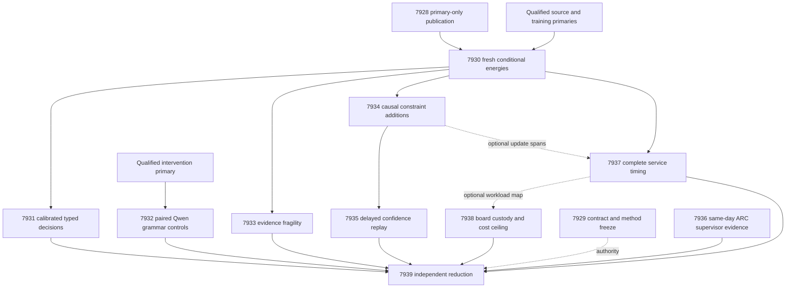

# Carnot Research Roadmap v688: Gate-Safe Decisions and Causal Learning

**Created:** 2026-09-30
**Milestone:** 2026.09.688
**Title:** Gate-safe source decisions and causal learning from qualified evidence
**Status:** Planned; staged, not activated
**Supersedes:** completed execution of 2026.09.687, Exp7915–Exp7927
**Preserved predecessor:** [V687 design](research-roadmap-v687-preserved-20260930.md)
**Execution authority:** [research-roadmap-next.yaml](../../research-roadmap-next.yaml)
**Planning requirement:** REQ-REPORT-PLAN-688.

This milestone has **12 tasks, exp7928 through exp7939, in that order,
across four phases**. Two infrastructure tasks support six decision/learning
experiments, one ARC task, one service-cost task, one board task and one
capstone. The exact contract below is the entire executable task list.

## What V687 proved

All dispatches ended. Six scientific tasks never produced their declared
artifacts. The completion archive currently ends at V686. This review uses
V687's active task list, current primary artifacts, raw evidence and conductor
log. Log entries describe dispatch-time evidence; later bytes cannot rewrite it.

| Evidence | Current observation | Consequence |
|---|---|---|
| Exp7915 contract | Current primary is circular_positive, contract_ready_score=1 | Reuse lifecycle machinery; bind twelve current tasks. Earlier disqualification stays historical. |
| Exp7916 training | Current primary is circular_positive, training_runtime_ready_score=1 | Do not repeat numerical qualification. |
| Actual gate reader | Chooses newer experiment_7916_v687_training_qualification.json.validators.json | Sidecar has no readiness fields. Three missing-field gate checks preceded the fitting skip. |
| Exp7917 intervention | Current primary is circular_positive, intervention_protocol_ready_score=1 | Reuse qualified transport and explicit historical fixture dates. |
| Exp7918/7919/7921/7922/7923/7925 | Six missing declared science producers; gate receipts explain skips | No fitted-head, decision, fragility, learning, calibration or cost result exists for V687. |
| Exp7920 Qwen | Authenticated mandated model; 169 completed calls, 28 complete families; syntax_valid=false | Below the 32-family sensitivity floor. No independent sentence labels; no natural accuracy gain. |
| Exp7924 ARC | Valid null: no new supervisor outcomes | Test same-day receipt exclusion before another unchanged delta scan. |
| Exp7926 boards | Valid null: historical custody, zero current device operations | Add a current workload map if service timing succeeds. |
| Exp7927 capstone | Audit ready; complete_blocked_missing_science | Its historical paper_ready field does not qualify the absent V687 science. |

The gate selector in `scripts/conductor_gates.py` uses the newest matching
`experiment_<number>_*.json`. The document reconciler has the same exposure.
A newer validator sidecar can therefore hide a valid primary artifact. V688
publishes one top-level primary per task and stores sidecars under `results/raw/`.
Tests use the existing consumer functions. The running conductor need not reload
modules. Existing sidecars and historical verdicts remain intact.

Exp7892 remains the qualified source boundary: 640 intended families, 604
previously eligible, 36 excluded. Current primary files and raw dependencies
must pass custody checks before reuse. Training and intervention qualification
are fixture results, not independent predictive evidence.

## Three biggest gaps against the PRD

1. **Reliable, useful verification decisions — FR-12 and FR-06.** Carnot has
   extraction and energy infrastructure, but qualified natural-source decision
   benefit remains unmeasured. Fit small conditional energies and test calibrated
   accept/reject/escalate decisions against equal-information controls.
2. **Causal continuous learning — FR-11.** Persistent state must improve future
   decisions, with delayed labels and retained performance. Compare constraint
   addition with no-write, frozen and complete-static banks. Test issued-state
   confidence updates on the same trajectory.
3. **A trustworthy route to deployment — FR-05/08/09/10 and NFR-01.** Correct
   artifacts still fail at consumer boundaries. Fix publication layout, then
   measure complete service cost and memory traffic. Those measurements decide
   whether a Rust port or board offload has enough potential benefit.

The ARC and hardware obligations remain separate from natural-text accuracy.
The September 28 oracle-distinct corrigendum remains binding. No frozen public
ARC solve, PHASE D reranker, importance-anchor retry or generator fine-tuning is
reopened by this plan.

## Research recorded before design

The [V688 source review](../../research-references.md#v688-planning-review--2026-09-30-recorded-before-design)
was appended first. It covers all eight requested topics and six secondary
sources, with access failures, metadata conflicts and prior discoveries marked.

| Method | Experiment use | Limit |
|---|---|---|
| [EBT](https://arxiv.org/abs/2507.02092), 2025; [ARM–EBM](https://arxiv.org/abs/2512.15605), 2025/2026 | Exp7930/7931: input-conditioned energies and normalized decision risks | Compatibility energy does not certify semantic truth. |
| [Fragility certificates](https://arxiv.org/abs/2609.00366), 2026 | Exp7933: score evidence-removal paths against separate stress draws | Protocol audit only; retrieved submission date conflicts with identifier month. |
| [Memoir](https://arxiv.org/abs/2607.20792), July 2026 | Exp7934: state fixed during a query, matched no-write control | Its memory-write result motivates a control, not a transferred benefit claim. |
| [Delayed ACI](https://arxiv.org/abs/2609.07251), September 2026 | Exp7935: interleaved confidence updates with delayed outcomes | Empirical binary adaptation; no inherited coverage theorem. |
| [Diversion decoding](https://arxiv.org/abs/2607.10476), July/August 2026 | Exp7932: keep response sensitivity separate from correctness | Grammar control tests completion, not a replication of diversion decoding. |
| [FPGA decomposition](https://arxiv.org/abs/2602.15985), 2026; [Z1T](https://extropic.ai/writing/z1t) | Exp7937/7938: include preprocessing, transfer, readout and persistence | Vendor or oscillator results are not local KV260 measurements. |

KAN-CL and KAC remain relevant to sparse update costs, but the unchanged
importance-anchor mechanism stays retired. Neural hard-constraint layers need
an encoded constraint first. Energy-guided token generation remains deferred
until useful verification is measured. Kona offers architectural inspiration,
without a reproducible local training recipe.

Semantic Scholar returned 30 EBT citing records and a next-page marker; ARM–EBM
returned 429. OpenReview challenged direct access. Hugging Face mixed years and
GitHub's retrieved trend page was stale. No exhaustive search or new trend rank
is claimed. Exp7929 ingests the reviewed methods with a small source recheck.

## Architecture and dependency graph



Solid task-to-task edges are required scientific dependencies, except capstone
inputs: the capstone runs even when they are absent. Dashed attachments never
block the receiving task. Exp7929 is not a global science gate. Historical
primaries are read by exact path and hash, not by ambiguous wildcard selection.
A valid null may open a readiness gate; disqualified evidence cannot.

## Phase 1 — Make qualified evidence consumable

**Exp7928–Exp7929; 75 estimated minutes.** Exp7928 qualifies a publication
helper using real gate and document readers. Its negative fixture reproduces
the historical sidecar shadow. Positive fixtures keep newer sidecars nested.
Missing, conflicting, stale, malformed and disqualified primaries must fail
closed. Cold subprocess reads must select the exact published bytes. The
artifact_resolution_ready_score gate is separate from numerical quality.

Exp7929 binds this twelve-task plan across staging and activation, with a
complete-task digest and twelve mutations. Preserve historical twelve-task and
thirteen-task lifecycle tests. Reuse qualified source/training/intervention
primaries. Ingest the reviewed methods. No new corpus or fixture-only training
qualification is required.

**Prototype:** private result directories and current-authority fixtures.
**Acceptance:** unchanged consumers select the exact primary; all owned checks
pass. **Adversarial checks:** newer sidecars, conflicting IDs, mutation of
prompts/gates/history, wrong fixture dates and terminal candidate replacement.

## Phase 2 — Measure calibrated decisions and evidence dependence

**Exp7930–Exp7933; 215 estimated minutes.** Exp7930 authenticates Exp7916 and
Exp7892 directly. Preserve roles: fit 256, tune 64, policy_design 32,
calibration_replay 32, online_update 96, online_admission 64, evaluation 64,
retention 32. Excluded slots stay excluded. Repeated masks, views and model
seeds never increase the independent source-family count.

Train nine arms with seeds 67801/67802/67803: response_set, local_set,
augmented_set, constrained_set, augmented_mlp, constrained_mlp, local_logistic,
source_erased_constrained_set and complete_static_constrained_set. Use width
16, at most 4096 parameters, learning rate .01 and 16 epochs. Keep 132 base
features; complete-static adds sixteen immutable conjunctions. Preserve A
singles/triples and B singles/pairs views, at most 128 windows and 16 answer
units. Overbudget examples abstain without truncation.

Use symmetric Bernoulli KL/2 tolerance .01, alternate-view cross-entropy limit
.70 and dual step .01 clipped to [0,10]. Match observed labels and compute for
augmented/constrained pairs. Unknown labels contribute zero loss/gradient.
Tune temperature only on tune, over 17 logarithmic values in [.25,4]. Save 27
fresh heads and full dependency hashes before evaluation labels are opened.
Prevalence and length controls use fit/tune only. Include source erasure and
length-matched source permutation. Numerical budget: 3000 seconds, with
per-arm/seed checkpoints. Incomplete owned fitting is partial, never a fake null.

Exp7931 uses unsupported probability p and label y. Expected action costs are
accept=5p, reject=1-p, escalate=.25; realized costs are 5y, 1-y, .25. Ties
escalate. Compare constrained_set with augmented_set, constrained_mlp and
local_logistic. Average seeds within family. Use 10000 paired source-cluster
bootstrap draws and paired randomization, with Holm correction for six
cost/Brier tests. Benefit needs cost gain >=.02, positive CI95 lower bounds
for cost and Brier against every control, adjusted p<.05 and automated coverage
>=.20. Freeze equal-coverage abstention on policy_design at .50 retained
coverage. A realized between-arm coverage gap >.05 invalidates that comparison.
Evaluation labels cannot retune the policy. A completed null is ready.

Exp7932 uses **unsloth/Qwen3.8-27B-GGUF**. Freeze 48 intended evaluation families
by group hash, before new outputs or labels. Select a witness by label-free
lexical overlap with the first complete answer sentence, ties by byte offset.
The witness is a proposed slice, not certified entailment. Freeze four views:
full source, witness, witness plus neighbors, witness plus disjoint filler.
Filler length must match within 25 percent. Pre-tokenize; excluded families
remain in the intended denominator. Never replace failures after seeing outputs.

Run plain JSON instructions and backend-enforced grammar on identical messages.
Validate probability bounds and visible citation IDs separately from syntax.
Freeze 8192 context tokens, temperature 0, seed 67801, /no_think and at most 96
output tokens per call. There are at most 384 calls and 36864 output tokens.
Paired arm order uses seed 68832. Load timeout: 300 seconds; call timeout: 120.
Stop starting calls at 2400 seconds; stop measured work by 3000 seconds.
No invalid-output retry or source truncation is allowed.

Primary endpoint: complete-family fraction across all four views, using all 48
intended families. Protocol benefit needs >=.05 gain, paired CI95 lower>0 and
exact paired-discordance p<.05. Use 10000 source-cluster bootstrap draws. Report
eligibility separately. At least 32 families complete in both arms are needed
for descriptive neighbors-minus-filler sensitivity. No natural Brier, cost or
accuracy claim is available without independent sentence labels. Grammar
benefit is circular_positive with verifier_is_oracle=true. Underpowered complete
panels are terminal nulls. This is **model_bounded_generation**, floor 10s;
full generation has floor 60s and load-only/embedding work 2s. Never pad time.

Exp7933 uses four frozen feature groups: unigram interactions [0:64], bigrams
[64:128], overlap/uncovered [128,131], negation/numeric mismatch [129,130].
Impute removed coordinates with label-free fit means. A four-step greedy path
measures first decision flip and normalized margin loss. The modal class is
1 iff p>=.5. Feature ablation is not literal source deletion.

A separate channel samples 32 missingness masks at each of .25 and .50 rates,
seed 68721. Pool 64 trials within seed, then average across model seeds.
Brittle means pooled flip fraction >=.25. Score paths cannot supply outcomes;
independently drawn masks may have equal values. On 64 intended evaluation
families, compare trajectory score, confidence, one-step removal and hash-random
review at exactly 20 percent of eligible families. Primary endpoint:
constrained_set Capture@20; logistic and per-rate panels are descriptive.
Benefit needs >=.10 Capture@20 gain, CI95 lower>0, Holm-adjusted p<.05 against
all three controls, >=32 eligible and >=10 brittle families. Use 10000 paired
source-cluster bootstraps. AUROC needs both classes. The reference is the
frozen model under stress: verifier_is_oracle=true and circular_positive for
protocol benefit. No natural-correctness or formal-robustness claim follows.

**Prototype:** fresh small heads and bounded paired Qwen responses.
**Acceptance:** measurement validity and the separate numerical benefit gates.
**Adversarial checks:** source erasure, information-budget mismatch, label
leakage, identical arms, all-null rows, wrong model, grammar fallback and shared
score/outcome derivations.

## Phase 3 — Test durable learning and delayed confidence

**Exp7934–Exp7935; 115 estimated minutes.** Exp7934 is the mandatory continuous
self-learning task. Eight logical blocks contain twelve online-update and eight
admission slots each. Use three model seeds and delay 20 intended slots:
release_tick=tick+20. Release past labels before the current prediction;
never expose the current label. Excluded slots still advance the clock.

Compare dynamic admission, frozen bank, complete-static sixteen-feature bank,
no-write and shuffled-released-past-label control. Apply coefficient updates at
.01 only on released update labels, equally across trainable arms. Admission
labels select predicates but never fit coefficients. Admit at most one predicate
per block and eight total, requiring >=.01 admission Brier gain and no extra
false accepts. No-write makes the same proposals without installing them.
Keep query state fixed; committed writes affect only later queries.

Calibration, evaluation and retention labels cannot fit or select updates.
Persist initial plus eight snapshots, pending queues and issued predictions.
Crash after block four; resume must match uninterrupted state and predictions.
Flush trailing feedback only after all predictions are sealed. Benefit requires
future cost gain >=.02 against complete-static and no-write, positive CI95
lower bounds and Holm-adjusted p<.05 for both primary costs, nonworse Brier,
retention cost-increase CI95 upper<=.01, no extra false accepts, and a traced
write that changes a later pre-feedback decision. No causal effect is a valid
null. Measure sparse CPU lookup, update, fsync and byte costs.

Exp7935 replays confidence policies on the same issued probabilities. Verify
base delay 20. Extra delays 1,4,16 yield total D=21,24,36. Compare frozen split
threshold, rolling last-32 quantile, scalar delayed ACI and phase-indexed ACI.
Initialize from calibration_replay, alpha=.10, gamma=.01, target coverage .90.
Nonconformity is 1-p_y. Every adaptive arm gets the same released-score buffer.
For phase-indexed updates, preserve the state issued with the prediction:
`alpha[t+D] = alpha[t] + .01*(.10 - miss[t])`.

Use D interleaved queues. Excluded events advance time without an update.
Initialize queues from the same calibration-only state. Scalar ACI updates its
current state. For n scores use k=ceil((n+1)*(1-alpha)); q=-infinity if k<=0,
q=+infinity if k>n, otherwise the kth sorted score. Include y if 1-p_y<=q.
For alpha<0 return the full binary set; alpha>1 returns empty. Frozen split
keeps initial buffer and alpha; rolling keeps alpha=.10. Do not rescore initial
calibration labels under later heads. Singleton [0] accepts, [1] rejects;
empty/full sets escalate. Costs match Exp7931.

Report coverage error, worst 16-event-window error, set sizes, empty/full and
singleton rates, false accepts and typed cost. Probabilities remain identical.
Use 10000 paired contiguous-block bootstrap draws, block length 16, as
descriptive uncertainty. Apply Holm correction across six local-error
comparisons. Benefit requires >=.02 local-error reduction, positive interval
lower, adjusted p<.05, no extra false accepts and set-size increase <=.10.
Fewer than four complete windows cannot pass. Residual dependence estimates
need >=64 released labels and stable autocorrelation; otherwise they are null.

**Prototype:** a durable test-then-learn stream and independent confidence replay.
**Acceptance:** causal benefit and confidence retention, separately.
**Adversarial checks:** future-label shuffling, duplicate release, wrong issued
alpha, no-op writes, excluded-slot clock drift and restart divergence.

## Phase 4 — Generalization, service cost and independent reduction

**Exp7936–Exp7939; 135 estimated minutes.** Exp7936 tests the ARC reader's
same-day exclusion. It replaces calendar-day novelty with authenticated receipt
identity and explicit event order. Hash novelty permits inspection, not a
prospective-gain claim. Missing timestamps or sequences remain unknown. Keep
applied, shadow, malformed, censored and disqualified receipts separate.

Freeze the prior accepted cutoff and complete seen inventory. A private new
same-day receipt must survive the new reader; retries and conflicting IDs must
not. Reduce any recovered live outcomes per game/seed/arm, with shared credit
and action-budget censoring. Compare filter counts, not game performance.
Selection proposals need >=30 uncensored redirects across >=5 games. Use
leave-one-game-out summaries. Zero progress and upper95<.10 can support a
proposal to deprioritize; lower95>.20 with consistent held-out direction can
support a priority proposal. Keep curated arm defaults unchanged. No new arm,
per-game adapter, offline solve or LLM call is scheduled. Zero recovered events
is a valid null for this changed mechanism. It does not justify another
unchanged delta scan.

Exp7937 measures the complete owned CPU service: source processing, energy
scoring, calibration, action selection, and optional durable updates. Reuse
current heads; replay equivalent inputs and actions. Include I/O, serialization,
lookup and fsync where used. Report per-family observations and repeat counts,
not only pooled throughput. Optional learning evidence cannot block baseline
service timing. Separate measured kernel share from a hypothetical 100x-kernel
Amdahl ceiling: S=1/((1-f)+f/100). A ceiling is not a achieved speedup.
Record task-interval telemetry; a later idle GPU snapshot cannot explain a run.
No LLM is loaded for this measurement.

Exp7938 preserves three separate board obligations. KV260 supports only the
qualified historical quadratic fabric scope with k_max<=5; PolarFire evidence
is Linux CPU dispatch; GateMate remains at the unchanged physical/JTAG
0xffffffff block. NPU and TSU are unqualified. Map the current workload's
operations and byte movement to these capabilities. Neural source heads are
not automatically Ising workloads. Missing Exp7937 leaves the workload
attachment unmeasured while custody still completes. No current board operation,
flash, install, purchase or repeated availability probe is scheduled. A future
KV260 task must use SSH via kria. GateMate needs new physical evidence first.

Exp7939 reduces exactly twelve task dispositions and three PRD-gap decisions.
Read primaries by declared path. Missing producers and conductor gate receipts
remain distinct. Recompute numerical claims from rows, including the paired
Qwen completion denominator and recovered ARC receipts. Preserve G1–G4 and
paper_ready under their existing definitions. Historical FoVer publication
readiness cannot close the current oracle-distinct gap. External absent science
is complete_blocked_*, not partial. Keep DiffusionGemma pending.

**Prototype:** actual reader replay, service spans and independent reduction.
**Acceptance:** verified custody, complete accounting and predeclared scientific
gates. **Adversarial checks:** calendar cutoff loss, duplicate receipts, shared
credit inflation, hidden I/O, stale board claims and missing producers.

## Hardware requirements and time bounds

| Work | Required hardware | Memory and bounded execution |
|---|---|---|
| Publication, contract, ARC receipts, capstone | Owned CPU and local disk | Private fixtures and raw shards; no device operation |
| Small energy heads and learning | CPU/JAX; fixed small heads | <=4096 parameters/head; 27 checkpoints; 3000s numerical budget |
| Qwen paired control | Local CUDA RTX 3090 capacity; cache already observed | ~16 GB GGUF, context 8192 plus runtime/KV memory; measure available capacity before load |
| Service timing | Same owned CPU and filesystem across arms | Include persistence/serialization and process-overlap receipts |
| Board workload map | Existing KV260, PolarFire and GateMate receipts | Historical-only; zero device operations |

The available CUDA pair is two RTX 3090s, 24 GB each. Use one owned inference
process; use both devices only if measured capacity requires it. No parallel
multi-model benchmark is planned. Authenticate the mandated revision, GGUF,
quantization, embedded tokenizer, served identity and offload. A different
shared server is not a substitute. CPU small-model smoke tests cannot supply
headline rows. TSU, larger FPGA and NPU acquisition waits for measured service
benefit and local access; no purchase is needed for V688.

Estimated serial task time is **540 minutes**. Estimates include development
and verification, not just numerical work. Each task remains below the 4800s
hard cap; resumable fitting uses its own 3000s compute bound. Every prompt
requires flushed phase lines and before/after long calls, loop heartbeats at
most 60s apart, and no output gap >=600s. Files over about 200 lines must be
written in bounded calls with progress between them.

## Validation, retirement and scope

Every task records per-unit rows, exact validation commands, primitive hashes,
verdict_class and gate_check_summary. Readiness and scientific benefit are
separate. Every gate field appears in its upstream required-fields block.
Structured gates reference only earlier tasks in this roadmap. Qualified
historical inputs are exact-path preconditions, not retired requires chains.

Prior-failure entries name the old verdict, changed mechanism or prerequisite,
and retire_if_same_verdict=true. No retired experiment ID is reused and no
operator override is invented. Historical scope entries remain available for
review. Generator weights, live ARC defaults and publication gates stay fixed.
No broadened repair/reranking or new hardware-integration scope is planned.

Implementation tasks require spec-first, failing tests first, scoped unit/lint/
type/spec checks and 100% changed-source/CLI statement coverage. Preserve
historical required failures. Run applicable private E2E-015–018 checks.
Exp7932 also runs E2E-014 and current bounded live inference; learning tasks run
real crash/resume and cold replay. Historical E2E-016 uses 20260929 on both
routes. Current execution date is separate. Never run an obsolete publishing
CLI against new authorities. Validation reports live below results/raw/.

Before activation, validate both plan files with the existing schema, contract,
gate and retirement readers. Confirm all twelve tasks and the full-task digest.
Run private negative contract mutations and focused existing reader/E2E tests.
The active roadmap and scripts/research_conductor.py must retain their hashes.
No research result, activation, commit, push or external publication is part of
this planning deliverable.

## Exact task contract

The table and machine contract describe the twelve queued tasks. The digest
binds every full task field, including prompts, failure history and routing.
It hashes `json.dumps(tasks, sort_keys=True, separators=(",", ":"), ensure_ascii=False)`
as UTF-8. Machine rows carry the execution fields consumed by the contract reader.

Canonical full-task SHA-256: `0abe9370e04c9b762a418cfd92312209eb579e9face190041e24e111cafdaa01`

| Order | Task ID | Title | Phase | Deliverable |
|---|---|---|---|---|
| 1 | exp7928-primary-publication | Qualify primary-only publication through the real gate readers | 1 | results/experiment_7928_v688_primary_publication.json |
| 2 | exp7929-contract-methods | Bind twelve tasks and reuse qualified evidence with current methods | 1 | results/experiment_7929_v688_contract_methods.json |
| 3 | exp7930-energy-fit | Fit source energies after primary artifact routing is qualified | 2 | results/experiment_7930_v688_energy_fit.json |
| 4 | exp7931-decision-abstention | Measure calibrated source decisions against matched controls | 2 | results/experiment_7931_v688_decision_abstention.json |
| 5 | exp7932-qwen-completion | Measure bounded Qwen decisions with paired grammar controls | 2 | results/experiment_7932_v688_qwen_completion.json |
| 6 | exp7933-evidence-fragility | Test evidence fragility through an independent stress channel | 2 | results/experiment_7933_v688_evidence_fragility.json |
| 7 | exp7934-causal-acquisition | Measure persistent constraint additions after delayed feedback | 3 | results/experiment_7934_v688_causal_acquisition.json |
| 8 | exp7935-delayed-calibration | Compare delay-aware confidence on an issued learning trajectory | 3 | results/experiment_7935_v688_delayed_calibration.json |
| 9 | exp7936-arc-supervisor-refinement | Recover same-day live supervisor evidence for generalization | 4 | results/experiment_7936_v688_arc_supervisor_refinement.json |
| 10 | exp7937-service-cost | Measure complete decision-service and durable-update costs | 4 | results/experiment_7937_v688_service_cost.json |
| 11 | exp7938-hardware-evidence | Map the measured workload to retained board capabilities | 4 | results/experiment_7938_v688_hardware_evidence.json |
| 12 | exp7939-capstone | Independently reduce twelve outcomes and decide the PRD gaps | 4 | results/experiment_7939_v688_capstone.json |

<!-- V688_TASK_CONTRACT_START -->
```json
{
  "milestone": "2026.09.688",
  "tasks": [
    {
      "id": "exp7928-primary-publication",
      "title": "Qualify primary-only publication through the real gate readers",
      "phase": 1,
      "deliverable": "results/experiment_7928_v688_primary_publication.json",
      "MODEL_SPECS": [],
      "inference_substrate_class": "no_model_load",
      "gated_on": []
    },
    {
      "id": "exp7929-contract-methods",
      "title": "Bind twelve tasks and reuse qualified evidence with current methods",
      "phase": 1,
      "deliverable": "results/experiment_7929_v688_contract_methods.json",
      "MODEL_SPECS": [],
      "inference_substrate_class": "no_model_load",
      "gated_on": []
    },
    {
      "id": "exp7930-energy-fit",
      "title": "Fit source energies after primary artifact routing is qualified",
      "phase": 2,
      "deliverable": "results/experiment_7930_v688_energy_fit.json",
      "MODEL_SPECS": [],
      "inference_substrate_class": "no_model_load",
      "gated_on": [
        {
          "upstream": "exp7928-primary-publication",
          "artifact_field": "artifact_resolution_ready_score",
          "op": "==",
          "value": 1
        },
        {
          "upstream": "exp7928-primary-publication",
          "artifact_field": "flagged_adversarial",
          "op": "==",
          "value": false
        },
        {
          "upstream": "exp7928-primary-publication",
          "artifact_field": "verdict_class",
          "op": "in",
          "value": [
            "positive",
            "circular_positive",
            "null"
          ]
        }
      ]
    },
    {
      "id": "exp7931-decision-abstention",
      "title": "Measure calibrated source decisions against matched controls",
      "phase": 2,
      "deliverable": "results/experiment_7931_v688_decision_abstention.json",
      "MODEL_SPECS": [],
      "inference_substrate_class": "no_model_load",
      "gated_on": [
        {
          "upstream": "exp7930-energy-fit",
          "artifact_field": "energy_fit_ready_score",
          "op": "==",
          "value": 1
        },
        {
          "upstream": "exp7930-energy-fit",
          "artifact_field": "flagged_adversarial",
          "op": "==",
          "value": false
        },
        {
          "upstream": "exp7930-energy-fit",
          "artifact_field": "verdict_class",
          "op": "in",
          "value": [
            "positive",
            "circular_positive",
            "null"
          ]
        }
      ]
    },
    {
      "id": "exp7932-qwen-completion",
      "title": "Measure bounded Qwen decisions with paired grammar controls",
      "phase": 2,
      "deliverable": "results/experiment_7932_v688_qwen_completion.json",
      "MODEL_SPECS": [
        "unsloth/Qwen3.8-27B-GGUF"
      ],
      "inference_substrate_class": "model_bounded_generation",
      "gated_on": []
    },
    {
      "id": "exp7933-evidence-fragility",
      "title": "Test evidence fragility through an independent stress channel",
      "phase": 2,
      "deliverable": "results/experiment_7933_v688_evidence_fragility.json",
      "MODEL_SPECS": [],
      "inference_substrate_class": "no_model_load",
      "gated_on": [
        {
          "upstream": "exp7930-energy-fit",
          "artifact_field": "energy_fit_ready_score",
          "op": "==",
          "value": 1
        },
        {
          "upstream": "exp7930-energy-fit",
          "artifact_field": "flagged_adversarial",
          "op": "==",
          "value": false
        },
        {
          "upstream": "exp7930-energy-fit",
          "artifact_field": "verdict_class",
          "op": "in",
          "value": [
            "positive",
            "circular_positive",
            "null"
          ]
        }
      ]
    },
    {
      "id": "exp7934-causal-acquisition",
      "title": "Measure persistent constraint additions after delayed feedback",
      "phase": 3,
      "deliverable": "results/experiment_7934_v688_causal_acquisition.json",
      "MODEL_SPECS": [],
      "inference_substrate_class": "no_model_load",
      "gated_on": [
        {
          "upstream": "exp7930-energy-fit",
          "artifact_field": "energy_fit_ready_score",
          "op": "==",
          "value": 1
        },
        {
          "upstream": "exp7930-energy-fit",
          "artifact_field": "flagged_adversarial",
          "op": "==",
          "value": false
        },
        {
          "upstream": "exp7930-energy-fit",
          "artifact_field": "verdict_class",
          "op": "in",
          "value": [
            "positive",
            "circular_positive",
            "null"
          ]
        }
      ]
    },
    {
      "id": "exp7935-delayed-calibration",
      "title": "Compare delay-aware confidence on an issued learning trajectory",
      "phase": 3,
      "deliverable": "results/experiment_7935_v688_delayed_calibration.json",
      "MODEL_SPECS": [],
      "inference_substrate_class": "no_model_load",
      "gated_on": [
        {
          "upstream": "exp7934-causal-acquisition",
          "artifact_field": "learning_measurement_ready_score",
          "op": "==",
          "value": 1
        },
        {
          "upstream": "exp7934-causal-acquisition",
          "artifact_field": "flagged_adversarial",
          "op": "==",
          "value": false
        },
        {
          "upstream": "exp7934-causal-acquisition",
          "artifact_field": "verdict_class",
          "op": "in",
          "value": [
            "positive",
            "circular_positive",
            "null"
          ]
        }
      ]
    },
    {
      "id": "exp7936-arc-supervisor-refinement",
      "title": "Recover same-day live supervisor evidence for generalization",
      "phase": 4,
      "deliverable": "results/experiment_7936_v688_arc_supervisor_refinement.json",
      "MODEL_SPECS": [],
      "inference_substrate_class": "no_model_load",
      "gated_on": []
    },
    {
      "id": "exp7937-service-cost",
      "title": "Measure complete decision-service and durable-update costs",
      "phase": 4,
      "deliverable": "results/experiment_7937_v688_service_cost.json",
      "MODEL_SPECS": [],
      "inference_substrate_class": "no_model_load",
      "gated_on": [
        {
          "upstream": "exp7930-energy-fit",
          "artifact_field": "energy_fit_ready_score",
          "op": "==",
          "value": 1
        },
        {
          "upstream": "exp7930-energy-fit",
          "artifact_field": "flagged_adversarial",
          "op": "==",
          "value": false
        },
        {
          "upstream": "exp7930-energy-fit",
          "artifact_field": "verdict_class",
          "op": "in",
          "value": [
            "positive",
            "circular_positive",
            "null"
          ]
        }
      ]
    },
    {
      "id": "exp7938-hardware-evidence",
      "title": "Map the measured workload to retained board capabilities",
      "phase": 4,
      "deliverable": "results/experiment_7938_v688_hardware_evidence.json",
      "MODEL_SPECS": [],
      "inference_substrate_class": "no_model_load",
      "gated_on": []
    },
    {
      "id": "exp7939-capstone",
      "title": "Independently reduce twelve outcomes and decide the PRD gaps",
      "phase": 4,
      "deliverable": "results/experiment_7939_v688_capstone.json",
      "MODEL_SPECS": [],
      "inference_substrate_class": "no_model_load",
      "gated_on": []
    }
  ]
}
```
<!-- V688_TASK_CONTRACT_END -->
