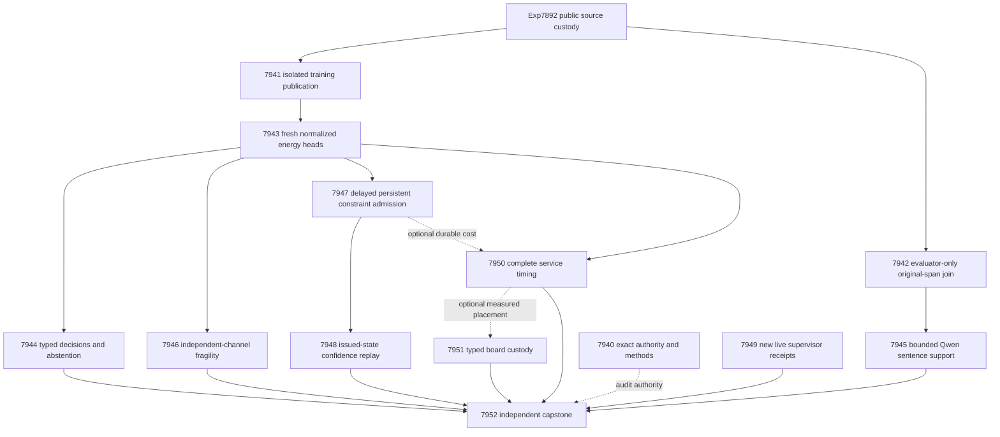

# Carnot Research Roadmap v689: Source Decisions and Causal Learning

**Created:** 2026-09-30
**Milestone:** 2026.09.689
**Title:** Qualified source decisions, sentence-level evidence, and causal constraint learning
**Status:** Planned; staged, not activated
**Supersedes:** completed execution of 2026.09.688, Exp7928–Exp7939
**Preserved predecessor:** [V688 design](research-roadmap-v688-preserved-20260930.md)
**Execution authority:** [research-roadmap-next.yaml](../../research-roadmap-next.yaml)
**Planning requirement:** REQ-REPORT-PLAN-689.

This milestone contains **13 tasks, exp7940 through exp7952, in that order,
across four phases**. The task table and machine contract below are binding.
Phase 1 has three tasks; Phase 2 has three; Phase 3 has four; Phase 4 has three.
No experiment is executed or activated by this planning change.

## What V688 proved

All twelve dispatches ended. Seven declared primary artifacts exist; five
science producers were pre-gated. The completion archive currently ends at
V687. V688 findings below come from its active task list, exact primary files,
raw logs and conductor records. An `OK` dispatch is not a science verdict.

| Experiment | Qualified observation | Consequence |
|---|---|---|
| Exp7928 | Primary publication and reader selection passed; circular_positive | Reuse the helper. Keep sidecars below results/raw/. |
| Exp7929 | Twelve-task authority passed; contract_ready_score=1 | Reuse authority machinery with new count and IDs. |
| Exp7930 | Fitted 27 heads on 604 eligible source families; required CLI checks failed | No qualified fitting or decision claim. Repair the exact publication paths before fresh fitting. |
| Exp7931/7933/7934/7935/7937 | Five declared science producers absent after pre-gates | Decision, fragility, learning, delayed confidence and cost remain unmeasured. |
| Exp7932 | 341 completed bounded calls; grammar 43/48 complete families, plain 40/48; 40 complete pairs | Completion delta .0625, CI95 [0, .145833], exact p=.25: valid null. No sentence-label accuracy evidence. |
| Exp7936 | Current receipt inventory qualified; no recovered live supervisor events | Reuse the hash frontier and stop cheaply on no delta. |
| Exp7938 | Required missing-input CLI raised KeyError: scope | Preserve typed board blockers before constructing a workload map. |
| Exp7939 | Capstone mechanics ready; complete_blocked_missing_science | Its historical publication gate does not qualify missing V688 science. |

The Exp7930 raw failure is specific. Its negative and blocked-success CLI
routes wrote different `experiment_7930_*.json` files into one private directory.
The publisher correctly rejected the second primary with `conflicting_primary`.
Blocked cold replay then failed. This is a validation-fixture namespace error,
not evidence against the learned energy method. V689 gives each route its own
publication directory. Uniqueness rejection remains tested and enforced.

The Exp7938 failure is also specific. `operation_map` indexes `board["scope"]`
on a custody row that represents missing evidence. An absent scope must remain
unknown. It cannot become a fabricated fabric-placement capability.

The retained source boundary is Exp7892. It has 640 intended families and
604 eligible families under the existing budgets. V688 role counts were fit
239, tune 62, policy design 29, calibration replay 29, online update 91,
online admission 61, evaluation 62 and retention 31. These are historically
exposed development groups. New seeds, sentence rows and masks do not make
them a fresh confirmatory holdout.

## Three biggest gaps against the PRD

1. **Useful verification decisions — FR-12 and FR-06.** Source extraction and
   normalized energies exist. Qualified natural decision benefit is still
   missing. The live Qwen study also queried sentence events without sentence
   targets. Fit the existing small energy heads and test calibrated actions.
   Separately qualify human span-to-sentence labels for a bounded Qwen study.
2. **Causal continuous learning — FR-11.** Persistent constraints must change
   later decisions before feedback and improve their cost without forgetting.
   Measure admission against no-write and complete-static controls. Then hold
   the learned trajectory fixed while testing delayed confidence updates.
3. **A credible deployment path — FR-05/08/09/10 and NFR-01.** Valid science
   must survive its actual CLI and artifact readers. Repair the two known
   terminal failures, then measure complete service cost. Use those costs to
   bound useful Rust or hardware acceleration, with unchanged board limits.

The September 28 oracle-distinct corrigendum remains binding. This plan does
not close GAP-ORACLE-DISTINCT, reopen PHASE D reranking, repeat banked ARC solves,
train the mandated generator, or reopen unchanged importance-anchor work.

## Research recorded before design

The [V689 reference review](../../research-references.md#v689-planning-review--2026-09-30-recorded-before-design)
was appended before the experiments were designed. It covers all eight topics
and all six secondary sources. EBT citation access was rate-limited; ARM–EBM
returned nine indexed citations. GitHub trend crawls were two weeks old.
No complete citation census, current trend ranking or local TSU access is claimed.

| Research source | Adoption | Claim boundary |
|---|---|---|
| [First Hallucination Tokens](https://arxiv.org/abs/2507.20836), 2025, and the RAGTruth author schema | Exp7942 preserves original annotation granularity; Exp7945 evaluates the actual sentence event | No token-logit replication or automatic transfer of the paper's results. |
| [CCHD](https://arxiv.org/abs/2606.08158), 2026 | Exp7943/7944 compare constrained and ordinary augmented energies at equal information budgets | Complete-byte window layouts are an adaptation, not verified semantic paraphrases. |
| [EBT](https://arxiv.org/abs/2507.02092) and [ARM–EBM](https://arxiv.org/abs/2512.15605) | Normalized small source-conditioned heads and typed decisions | Learned compatibility is not a truth certificate. |
| [Counterfactual Fragility](https://arxiv.org/abs/2609.00366), retained from V688 | Exp7946 compares public-feature removal scores with a separate stress channel | Model prediction instability remains circular evidence about natural correctness. |
| [Memoir](https://arxiv.org/abs/2607.20792) | Exp7947 pins read state and tests committed writes on later decisions | Bank growth alone is not learning benefit. |
| [Delayed ACI](https://arxiv.org/abs/2609.07251) | Exp7948 preserves issued-state identity and delayed labels | This exposed binary stream does not inherit a forecasting guarantee. |
| [FPGA decomposition](https://arxiv.org/abs/2602.15985) and [Z1T](https://extropic.ai/writing/z1t) | Exp7950/7951 include host work, communication and readout | Acceleration ceilings are estimates, not local board speedups. |

KAN-CL/KAC, neural feasibility layers and energy-guided decoding remain useful
references. They do not justify another architecture sweep before qualified
source decisions. Kona remains an architectural reference without a reproducible
local training recipe. These defer decisions are recorded with the source review.

## Architecture



## Phase 1: Qualify the exact boundaries — Exp7940–Exp7942

### Exp7940: Bind the current contract and methods

Reuse the qualified authority lifecycle. Match thirteen tasks across the visible
table, machine contract, full-task digest, staged YAML and observed active file.
Freeze each validation scope before results. Reject twelve private mutations.
Preserve staged-versus-active provenance and historical fixture dates.

`contract_ready_score` describes authority readiness. It does not gate every
science branch. A documentation failure must not hide independent observations.

### Exp7941: Repair isolated training publication

Reproduce `conflicting_primary` and blocked cold-replay failures. Use a separate
private directory for each expected-failure, blocked-success, fixture-success
and replay route. Keep the two-sibling uniqueness rejection as a regression.
Require a real bounded fixture fit for success. A missing-input route cannot
stand in for successful numerical execution.

Freeze the executable training entrypoint and transitive hashes. Preserve the
qualified numerical implementation. If those dependencies change, require new
measured equivalence and qualification. Emit `training_publication_ready_score`
and `runtime_ready_score` only after required checks pass. Historical Exp7930
weights and verdicts remain historical. This task does not repeat full fitting.

### Exp7942: Qualify sentence-level human targets

Use the already cached, pinned MIT RAGTruth corpus. Join annotations in evaluator
custody using exact response identity and bytes. Verify character positions,
UTF-8 conversion and annotated text. Preserve full sentences, qualifiers and
source bytes. Missing or ambiguous annotation evidence cannot become a negative
label. No positive response label may be copied onto all its sentences.

The target is “contains a human-annotated source-unsupported span.” It is not
“every claim in this sentence is false.” Include `implicit_true` in the primary
source-support label; expose its exclusion only as a named sensitivity analysis.
Complete eligible responses without overlapping annotations supply negative
labels under the corpus's human annotation convention.

Select one sentence per each of the 64 intended evaluation families by a public
hash of family and byte interval. Select before reading labels. Preserve exclusions
without replacements. Require at least 32 eligible distinct source clusters and
eight examples in each class for `sentence_labels_ready_score=1`. No label or
metadata mutation may change the predictor input or selected sentence.

## Phase 2: Measure decisions on the right target — Exp7943–Exp7945

### Exp7943: Fresh source-energy fitting

Gate on both Exp7941 readiness fields, eligible class and an unflagged artifact.
Retain the existing 640-family allocation: fit 256, tune 64, policy design 32,
calibration replay 32, online update 96, online admission 64, evaluation 64 and
retention 32. Recompute all public budget exclusions without replacements.

Train nine arms with seeds 67801/67802/67803: response_set, local_set,
augmented_set, constrained_set, augmented_mlp, constrained_mlp, local_logistic,
source_erased_constrained_set and complete_static_constrained_set. Keep width
16, at most 4096 parameters, learning rate .01 and 16 epochs. Retain 132 base
features and sixteen complete-static conjunctions. Views preserve all source
bytes, with at most 128 windows and sixteen answer units.

Constrained arms use symmetric Bernoulli KL/2 tolerance .01, alternate-view
cross-entropy limit .70 and dual step .01 clipped to [0,10]. Match labels and
operation budgets to augmented controls. Unknown targets contribute zero loss
and gradient. Tune temperature only on tune families over seventeen log-spaced
values in [.25,4]. Seal all 27 current checkpoints before evaluation labels.
Limit numerical work to 3000 seconds with per-arm checkpoints and progress.
A valid null can have `energy_fit_ready_score=1`; incomplete owned fitting cannot.

### Exp7944: Calibrated typed decisions

For unsupported probability p and label y, expected losses are accept=5p,
reject=1-p and escalate=.25. Actual losses are 5y, 1-y and .25. Ties escalate.
Compare constrained_set with augmented_set, constrained_mlp and local_logistic.
Average seeds within family before source-cluster resampling.

Use 10,000 paired bootstrap draws and paired randomization. Holm-correct the
six cost/Brier tests. Development benefit requires cost gain at least .02,
positive lower intervals for cost and Brier against every control, adjusted
p<.05 and automated coverage at least .20. Freeze abstention thresholds on
policy-design families for target retained coverage .50. A realized coverage
difference above .05 invalidates the equal-coverage comparison; never retune
on evaluation labels. Preserve length-only, source-erasure and matched source
permutation controls. A powered null remains a useful finding.

### Exp7945: Bounded Qwen sentence-risk evaluation

Gate only on the new sentence-label boundary. This branch can run even if
energy fitting fails. Load `unsloth/Qwen3.8-27B-GGUF` with authenticated local
CUDA execution. Its substrate is `model_bounded_generation` with the 10-second
floor. No generator weights change.

For each selected sentence, preserve its full answer context. Compare full
original source against source erased. Both arms predict support by the original
source, so this is an information ablation with the same target. Use the existing
fixed grammar, temperature zero, seed 68945 and at most 96 output tokens.
Bound the study to 128 calls, 12,288 output tokens, 6000 input tokens per call,
and 3000 seconds including model load. No retry, truncation, parser repair or
replacement of excluded families is allowed. Alternate arm order by public hash.

Seal both replies before reading the independent human target. Invalid outputs
escalate in the all-intended cost analysis. Complete-pair probability metrics
have their own denominator. Require 32 complete source-cluster pairs and eight
examples per class before benefit tests. Holm-correct Brier and cost comparisons.
A bounded development benefit needs gains of at least .02 for both, positive
lower intervals, adjusted p<.05, coverage at least .20 and no extra false accepts.
First-span versus later-span strata are descriptive only. Syntax completion and
source sensitivity remain secondary; they cannot substitute for accuracy.

## Phase 3: Test robustness, learning and transfer — Exp7946–Exp7949

### Exp7946: Evidence fragility under a separate stress channel

Use current qualified energy heads. Group source-feature columns before labels.
Keep the score operator and stress generator separate, with separate seeds.
Compare removal-path scoring, one-step removal, confidence and hash-random
review at a fixed 20 percent budget. Preserve every feature mask and forward-call
count. Bootstrap source families, not repeated masks. Keep natural labels out of
stress construction. Any successful prediction of the model's own instability
is `circular_positive`, with no hallucination-detection or formal robustness claim.

The exact operators, mask counts, seeds and comparison gates are fixed in the
YAML. No unregistered stress-channel tuning is permitted after results.

### Exp7947: Continuous constraint acquisition

This is the FR-11 continuous self-learning experiment. Use eight logical blocks,
each with twelve online-update and eight online-admission intended families.
Release labels at tick+20 and process past releases before the current prediction.
Excluded slots advance time. They cannot compress the release schedule.

Compare dynamic admission, frozen bank, complete-static sixteen-feature bank,
no-write and shuffled-released-past-label controls. Use existing immutable
conjunctions and learning rate .01 for common coefficient updates. Admission
labels select constraints but never fit coefficients. Admit at most one predicate
per block and eight total, with admission Brier gain at least .01 and no extra
false accepts. Pin bank state during each query.

Seal predictions before feedback. Preserve initial and eight committed snapshots
per arm/seed. Crash after block four and compare pending queues, state and later
predictions after restart. Evaluation and retention labels never train, admit or
roll back constraints. Benefit requires future cost gain at least .02 against
both complete-static and no-write, positive lower intervals, Holm-adjusted p<.05,
nonworse Brier, retention cost-increase upper bound at most .01 and no extra false
accepts. Require an earlier write that changes a later pre-feedback decision.

CPU sparse updates and durable memory are the immediate hardware path. Record
feature touches, state bytes, lookup/update/fsync latency. This supplies a measured
basis for FPGA pattern matching or Rust work; it does not promise a 100x gain.

### Exp7948: Confidence under delayed feedback

Hold Exp7947's probabilities and bank trajectory fixed. Compare frozen split
threshold, rolling released-only quantile, scalar delayed ACI and phase-indexed
ACI. Target coverage is .90; gamma=.01; initial alpha=.10. Extra delays 1/4/16
come after base delay 20, giving total delays 21/24/36. Reject an upstream stream
with a different release schedule. Never release labels earlier than the learner.

Phase updates use alpha at issuance. Scalar updates use current alpha. Preserve
pending queues and the shared last-32-released-family residual buffer. Initialize
from calibration-replay scores under the initial head. Never rescore its labels
under future heads. For n scores use k=ceil((n+1)(1-alpha)); k<=0 gives minus
infinity, k>n gives plus infinity, otherwise use the kth order statistic.
Alpha below zero gives the full set; alpha above one gives the empty set.
Singleton {0} accepts, singleton {1} rejects, other sets escalate.

Report local 16-event-window coverage, set sizes, false accepts and typed cost.
Use descriptive block-bootstrap intervals and six Holm-adjusted local-error
comparisons. Each claim needs at least four complete windows, error reduction
at least .02, positive lower interval, adjusted p<.05, no added false accepts
and set-size increase at most .10. Point probabilities remain identical by design.

### Exp7949: New live supervisor outcomes

Read only new content identities beyond Exp7936's seen-receipt frontier.
A 120-second bounded scan with no new outcome-bearing events ends immediately
with a valid no-change null. Reuse the existing reader instead of creating another
recovery implementation. This satisfies the ARC generalization floor's explicit
empty-ledger rule.

Authenticated new events must come from the live scored wrapper and carry
resolved-by-levelup outcomes and action counts. Observational arm success is
not randomized benefit. A retirement recommendation needs twenty new firings
across five games and zero helped events, with uncertainty reported. No policy
change, model call or new level solve is scheduled. Future primitive changes
need separate evidence and the applicable ARC E2Es.

## Phase 4: Measure deployment costs and decide — Exp7950–Exp7952

### Exp7950: Complete service cost

Measure constrained_set, augmented_set, constrained_mlp and local_logistic on
64 intended evaluation families, three seeds, one cold call and five paired
warm repetitions. Match predictions to sealed current rows. Time projection,
windowing, scoring, calibration, dispatch and serialization. Keep spans disjoint.
Attach durable updates only when Exp7947 qualifies; absent learning does not
block static timing. Report useful-work denominators and zero-denominator nulls.

Join telemetry to the actual execution interval. A later idle GPU snapshot says
nothing about earlier utilization. For measured kernel fraction f, report
1/((1-f)+f/100) and 1/(1-f) as modeled bounds. No power or device speedup claim
follows without measurement. The primary gate field is
`service_measurement_ready_score`.

### Exp7951: Typed board custody and workload fit

Repair the actual missing-scope path before creating any operation map. Missing
required board history becomes an explicit blocked row, not a fabricated scope.
Use exact current service artifact paths. Missing optional service evidence
leaves historical custody measurable and placement unknown.

Preserve KV260 quadratic-Ising fabric at k_max<=5, PolarFire Linux CPU-only
scope, and GateMate's physical/JTAG 0xffffffff blocker. No install, flash,
purchase or device operation is scheduled. NPU and TSU remain unqualified.
A neural source head is not automatically a quadratic Ising workload. Scope,
communication, readout and host costs must all support any proposed placement.

### Exp7952: Independent capstone

Reduce thirteen task dispositions, including absent producers and the self row.
Recompute claims from primitive bytes, not headline fields. Check sentence-target
lineage, source clusters, multiple comparisons, causal writes and issued states.
Decide the three PRD gaps independently. Missing external science is terminal
blocked, not retriable partial. Keep publication G1–G4 and `paper_ready` under
existing definitions, separate from V689 science readiness and the corrigendum.

## Dependency graph and gate contract

| Consumer | Required current producer field | Optional evidence |
|---|---|---|
| Exp7943 | Exp7941.training_publication_ready_score=1 and runtime_ready_score=1 | None |
| Exp7944 | Exp7943.energy_fit_ready_score=1 | None |
| Exp7945 | Exp7942.sentence_labels_ready_score=1 | No dependence on energy fitting |
| Exp7946 | Exp7943.energy_fit_ready_score=1 | None |
| Exp7947 | Exp7943.energy_fit_ready_score=1 | None |
| Exp7948 | Exp7947.learning_measurement_ready_score=1 | None |
| Exp7950 | Exp7943.energy_fit_ready_score=1 | Exp7947 durable-update costs |
| Exp7951 | No science pre-gate | Exp7950 qualified service timings |
| Exp7952 | No science pre-gate | All outcomes, including absent or blocked |

Every required producer also needs `flagged_adversarial=false` and an eligible
class: positive, circular_positive or null. Each named gate field appears in
its producer's REQUIRED ARTIFACT FIELDS. Readiness permits analysis of valid
nulls. It never establishes scientific benefit. Exp7940 and Exp7949 remain
independently runnable. The YAML order is the conductor order even where
branches are independent; no concurrent execution is assumed.

## Hardware requirements and execution bounds

| Work | Required hardware | Budget and limit |
|---|---|---|
| Authority, label join, reduction and receipt repairs | Owned CPU, existing corpus and local disk | Stream corpus files; private fixtures; raw shards below 50 MiB |
| Twenty-seven small energy heads | CPU/JAX, existing numerical runtime | At most 4096 parameters/head; 3000-second compute budget; current checkpoints |
| Qwen sentence study | One owned RTX 3090 lease and cached Qwen3.8-27B GGUF | Roughly 16 GB weights plus context; verify actual free VRAM; bounded 128 calls |
| Online constraint and confidence studies | CPU plus durable local memory | Sparse updates, measured lookup/fsync, restartable event queues |
| Service and board mapping | Owned CPU and authenticated historical board receipts | Zero current physical device operations; estimates explicitly labeled |

The host has two RTX 3090s with 48 GB total VRAM, not a single contiguous
48 GB device. The single-model study needs an authenticated usable lease.
Do not kill another owner's process. A busy GPU produces a typed blocker.
DualGPURunner is unnecessary unless multiple models actually run concurrently.
No AMD NPU SDK, eGPU connection, FPGA flash or TSU acquisition is a prerequisite.

The [hardware wishlist](../../research-hardware-wishlist.md) keeps the longer
acceleration path visible. KV260's future access precondition is SSH to `kria`.
GateMate needs new physical evidence. PolarFire CPU dispatch does not qualify
its fabric. Large-board purchases await a measured compatible workload.
Exp7950 quantifies whether 100x kernel speed could materially change service
latency; no 100x improvement is promised in advance.

Every prompt requires a flushed line at each phase boundary and around each
model load, generation, benchmark and subprocess. Long loops emit progress;
owned children receive at most 60-second heartbeat gaps. All gaps stay below
600 seconds. Each tool wait is at most 60 seconds. Files over about 200 lines
are written across calls of at most 150 lines, with progress between calls.
Tasks never sleep to satisfy an inference duration floor.

## Failure lineage, routing and continuation

The YAML carries full four-field prior-failure records for matching scopes.
Every entry sets `retire_if_same_verdict: true`. New IDs are used throughout;
no operator override or retired upstream dependency is asserted. The concrete
changed premises are the isolated publication routes, typed missing-board data,
and human annotations at the actual queried sentence boundary.

Schema and publication coordination use Opus with 100 turns. The deterministic
annotation pipeline uses Codex with gpt-6.1-sol. Routine research uses default
Claude/Sonnet with at most 50 turns. The read-only ARC scan uses 20 turns; the
reused capstone uses 30. No Luna or speculative multi-agent execution is queued.
The hardware task uses Opus because it combines custody and placement schemas.

If Exp7941 repeats the failed terminal disposition, retire that new scope and
preserve all gated absences. Do not schedule another full fit until the exact
reader/CLI defect changes. If Exp7942 cannot authenticate targets, retain a
blocked target contract and skip GPU calls. A valid Qwen or energy null does
not justify rerunning unchanged controls. If learning has no admission or no
causal effect, retain that null rather than describe storage as intelligence.

## Validation and reconciliation

Before activation, run the unchanged schema, failure-lineage, exclusion, gate,
harness-fit, ARC-floor and priority readers. Independently compare the table,
JSON contract and full-task digest with the YAML. Reject twelve private contract
mutations. Check every read-first path and gate producer. Run relevant existing
unit tests, scoped lint and spec coverage, plus private E2E-015/016/017/018
readers. Historical E2E-016 fixture and replay both use date 20260929.

Planning changes no runtime behavior. Implementation E2Es remain explicit in
each future prompt. Never execute historical publishing commands against new
authorities. Retain repository-wide debt separately from the affected checks.
Append planning status and traceability after validation. Leave the active
roadmap, conductor, result artifacts and guard implementations unchanged.

## Exact task contract

The following table and JSON contain exactly thirteen queued tasks. The digest
binds every complete task field, including prompts, routing and prior failures.
It hashes `json.dumps(tasks, sort_keys=True, separators=(",", ":"), ensure_ascii=False)`
as UTF-8. Machine rows contain the fields consumed by the authority reader.

Canonical full-task SHA-256: `a1e53f80040abae9f32b16d62b9141010003b54ec95d7030d784454b7a7b8386`

| Order | Task ID | Title | Phase | Deliverable |
|---|---|---|---|---|
| 1 | exp7940-contract-methods | Bind thirteen tasks and freeze evidence and validation contracts | 1 | results/experiment_7940_v689_contract_methods.json |
| 2 | exp7941-training-publication | Qualify isolated training CLI publication and blocked cold replay | 1 | results/experiment_7941_v689_training_publication.json |
| 3 | exp7942-sentence-labels | Qualify human span labels at the queried sentence boundary | 1 | results/experiment_7942_v689_sentence_labels.json |
| 4 | exp7943-energy-fit | Fit source energies after isolated publication qualification | 2 | results/experiment_7943_v689_energy_fit.json |
| 5 | exp7944-decision-abstention | Measure calibrated decisions and abstention against matched controls | 2 | results/experiment_7944_v689_decision_abstention.json |
| 6 | exp7945-qwen-sentence-risk | Measure bounded Qwen source support against human sentence labels | 2 | results/experiment_7945_v689_qwen_sentence_risk.json |
| 7 | exp7946-evidence-fragility | Measure evidence fragility against a separate stress channel | 3 | results/experiment_7946_v689_evidence_fragility.json |
| 8 | exp7947-causal-acquisition | Measure persistent constraint additions before delayed feedback | 3 | results/experiment_7947_v689_causal_acquisition.json |
| 9 | exp7948-delayed-calibration | Compare delayed confidence updates on one issued learning trajectory | 3 | results/experiment_7948_v689_delayed_calibration.json |
| 10 | exp7949-arc-supervisor-delta | Assess only new live supervisor outcomes for transferable refinement | 3 | results/experiment_7949_v689_arc_supervisor_delta.json |
| 11 | exp7950-service-cost | Measure complete source decision and durable update service costs | 4 | results/experiment_7950_v689_service_cost.json |
| 12 | exp7951-hardware-evidence | Preserve typed board blockers and map measured workload costs | 4 | results/experiment_7951_v689_hardware_evidence.json |
| 13 | exp7952-capstone | Independently reduce thirteen outcomes and decide the PRD gaps | 4 | results/experiment_7952_v689_capstone.json |

<!-- V689_TASK_CONTRACT_START -->
```json
{
  "milestone": "2026.09.689",
  "tasks": [
    {
      "id": "exp7940-contract-methods",
      "title": "Bind thirteen tasks and freeze evidence and validation contracts",
      "phase": 1,
      "deliverable": "results/experiment_7940_v689_contract_methods.json",
      "MODEL_SPECS": [],
      "inference_substrate_class": "no_model_load",
      "gated_on": []
    },
    {
      "id": "exp7941-training-publication",
      "title": "Qualify isolated training CLI publication and blocked cold replay",
      "phase": 1,
      "deliverable": "results/experiment_7941_v689_training_publication.json",
      "MODEL_SPECS": [],
      "inference_substrate_class": "no_model_load",
      "gated_on": []
    },
    {
      "id": "exp7942-sentence-labels",
      "title": "Qualify human span labels at the queried sentence boundary",
      "phase": 1,
      "deliverable": "results/experiment_7942_v689_sentence_labels.json",
      "MODEL_SPECS": [],
      "inference_substrate_class": "no_model_load",
      "gated_on": []
    },
    {
      "id": "exp7943-energy-fit",
      "title": "Fit source energies after isolated publication qualification",
      "phase": 2,
      "deliverable": "results/experiment_7943_v689_energy_fit.json",
      "MODEL_SPECS": [],
      "inference_substrate_class": "no_model_load",
      "gated_on": [
        {
          "upstream": "exp7941-training-publication",
          "artifact_field": "training_publication_ready_score",
          "op": "==",
          "value": 1
        },
        {
          "upstream": "exp7941-training-publication",
          "artifact_field": "flagged_adversarial",
          "op": "==",
          "value": false
        },
        {
          "upstream": "exp7941-training-publication",
          "artifact_field": "verdict_class",
          "op": "in",
          "value": [
            "positive",
            "circular_positive",
            "null"
          ]
        },
        {
          "upstream": "exp7941-training-publication",
          "artifact_field": "runtime_ready_score",
          "op": "==",
          "value": 1
        },
        {
          "upstream": "exp7941-training-publication",
          "artifact_field": "flagged_adversarial",
          "op": "==",
          "value": false
        },
        {
          "upstream": "exp7941-training-publication",
          "artifact_field": "verdict_class",
          "op": "in",
          "value": [
            "positive",
            "circular_positive",
            "null"
          ]
        }
      ]
    },
    {
      "id": "exp7944-decision-abstention",
      "title": "Measure calibrated decisions and abstention against matched controls",
      "phase": 2,
      "deliverable": "results/experiment_7944_v689_decision_abstention.json",
      "MODEL_SPECS": [],
      "inference_substrate_class": "no_model_load",
      "gated_on": [
        {
          "upstream": "exp7943-energy-fit",
          "artifact_field": "energy_fit_ready_score",
          "op": "==",
          "value": 1
        },
        {
          "upstream": "exp7943-energy-fit",
          "artifact_field": "flagged_adversarial",
          "op": "==",
          "value": false
        },
        {
          "upstream": "exp7943-energy-fit",
          "artifact_field": "verdict_class",
          "op": "in",
          "value": [
            "positive",
            "circular_positive",
            "null"
          ]
        }
      ]
    },
    {
      "id": "exp7945-qwen-sentence-risk",
      "title": "Measure bounded Qwen source support against human sentence labels",
      "phase": 2,
      "deliverable": "results/experiment_7945_v689_qwen_sentence_risk.json",
      "MODEL_SPECS": [
        "unsloth/Qwen3.8-27B-GGUF"
      ],
      "inference_substrate_class": "model_bounded_generation",
      "gated_on": [
        {
          "upstream": "exp7942-sentence-labels",
          "artifact_field": "sentence_labels_ready_score",
          "op": "==",
          "value": 1
        },
        {
          "upstream": "exp7942-sentence-labels",
          "artifact_field": "flagged_adversarial",
          "op": "==",
          "value": false
        },
        {
          "upstream": "exp7942-sentence-labels",
          "artifact_field": "verdict_class",
          "op": "in",
          "value": [
            "positive",
            "circular_positive",
            "null"
          ]
        }
      ]
    },
    {
      "id": "exp7946-evidence-fragility",
      "title": "Measure evidence fragility against a separate stress channel",
      "phase": 3,
      "deliverable": "results/experiment_7946_v689_evidence_fragility.json",
      "MODEL_SPECS": [],
      "inference_substrate_class": "no_model_load",
      "gated_on": [
        {
          "upstream": "exp7943-energy-fit",
          "artifact_field": "energy_fit_ready_score",
          "op": "==",
          "value": 1
        },
        {
          "upstream": "exp7943-energy-fit",
          "artifact_field": "flagged_adversarial",
          "op": "==",
          "value": false
        },
        {
          "upstream": "exp7943-energy-fit",
          "artifact_field": "verdict_class",
          "op": "in",
          "value": [
            "positive",
            "circular_positive",
            "null"
          ]
        }
      ]
    },
    {
      "id": "exp7947-causal-acquisition",
      "title": "Measure persistent constraint additions before delayed feedback",
      "phase": 3,
      "deliverable": "results/experiment_7947_v689_causal_acquisition.json",
      "MODEL_SPECS": [],
      "inference_substrate_class": "no_model_load",
      "gated_on": [
        {
          "upstream": "exp7943-energy-fit",
          "artifact_field": "energy_fit_ready_score",
          "op": "==",
          "value": 1
        },
        {
          "upstream": "exp7943-energy-fit",
          "artifact_field": "flagged_adversarial",
          "op": "==",
          "value": false
        },
        {
          "upstream": "exp7943-energy-fit",
          "artifact_field": "verdict_class",
          "op": "in",
          "value": [
            "positive",
            "circular_positive",
            "null"
          ]
        }
      ]
    },
    {
      "id": "exp7948-delayed-calibration",
      "title": "Compare delayed confidence updates on one issued learning trajectory",
      "phase": 3,
      "deliverable": "results/experiment_7948_v689_delayed_calibration.json",
      "MODEL_SPECS": [],
      "inference_substrate_class": "no_model_load",
      "gated_on": [
        {
          "upstream": "exp7947-causal-acquisition",
          "artifact_field": "learning_measurement_ready_score",
          "op": "==",
          "value": 1
        },
        {
          "upstream": "exp7947-causal-acquisition",
          "artifact_field": "flagged_adversarial",
          "op": "==",
          "value": false
        },
        {
          "upstream": "exp7947-causal-acquisition",
          "artifact_field": "verdict_class",
          "op": "in",
          "value": [
            "positive",
            "circular_positive",
            "null"
          ]
        }
      ]
    },
    {
      "id": "exp7949-arc-supervisor-delta",
      "title": "Assess only new live supervisor outcomes for transferable refinement",
      "phase": 3,
      "deliverable": "results/experiment_7949_v689_arc_supervisor_delta.json",
      "MODEL_SPECS": [],
      "inference_substrate_class": "no_model_load",
      "gated_on": []
    },
    {
      "id": "exp7950-service-cost",
      "title": "Measure complete source decision and durable update service costs",
      "phase": 4,
      "deliverable": "results/experiment_7950_v689_service_cost.json",
      "MODEL_SPECS": [],
      "inference_substrate_class": "no_model_load",
      "gated_on": [
        {
          "upstream": "exp7943-energy-fit",
          "artifact_field": "energy_fit_ready_score",
          "op": "==",
          "value": 1
        },
        {
          "upstream": "exp7943-energy-fit",
          "artifact_field": "flagged_adversarial",
          "op": "==",
          "value": false
        },
        {
          "upstream": "exp7943-energy-fit",
          "artifact_field": "verdict_class",
          "op": "in",
          "value": [
            "positive",
            "circular_positive",
            "null"
          ]
        }
      ]
    },
    {
      "id": "exp7951-hardware-evidence",
      "title": "Preserve typed board blockers and map measured workload costs",
      "phase": 4,
      "deliverable": "results/experiment_7951_v689_hardware_evidence.json",
      "MODEL_SPECS": [],
      "inference_substrate_class": "no_model_load",
      "gated_on": []
    },
    {
      "id": "exp7952-capstone",
      "title": "Independently reduce thirteen outcomes and decide the PRD gaps",
      "phase": 4,
      "deliverable": "results/experiment_7952_v689_capstone.json",
      "MODEL_SPECS": [],
      "inference_substrate_class": "no_model_load",
      "gated_on": []
    }
  ]
}
```
<!-- V689_TASK_CONTRACT_END -->
