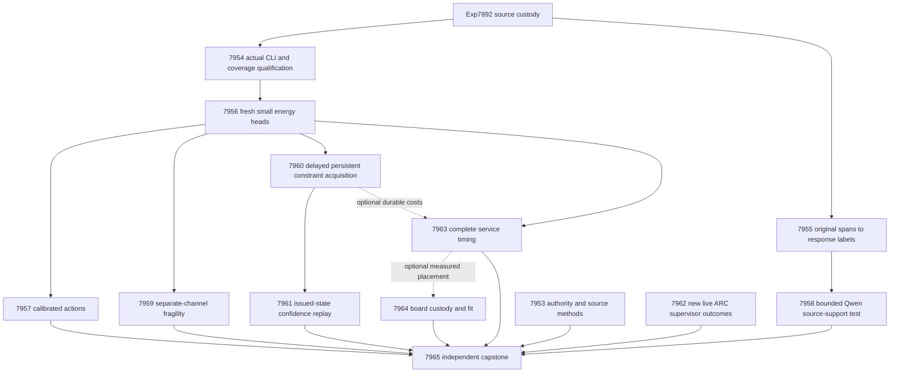

# Carnot Research Roadmap v690: Qualified Decisions and Causal Learning

**Created:** 2026-09-30
**Milestone:** 2026.09.690
**Title:** Qualified source decisions, response-level evidence, and causal learning
**Status:** Planned; staged, not activated
**Supersedes:** completed execution of 2026.09.689, Exp7940–Exp7952
**Preserved predecessor:** [V689 design](research-roadmap-v689-preserved-20260930.md)
**Execution authority:** [research-roadmap-next.yaml](../../research-roadmap-next.yaml)
**Planning requirement:** REQ-REPORT-PLAN-690.

This milestone contains **13 tasks, exp7953 through exp7965, in that order,
across four phases**. Phase counts are 3, 3, 4 and 3. The table, machine
contract and complete-task digest below bind the actual queued work.
Planning does not execute experiments or activate the roadmap.

## What V689 proved

All thirteen dispatches ended. Seven declared primary artifacts exist; six
science producers are absent after gates. The completion archive currently
ends at V688. These findings use the V689 active task list, exact primaries,
validation logs, coverage report and conductor records. Dispatch completion
does not imply scientific success.

| Experiment | Qualified observation | Consequence |
|---|---|---|
| Exp7940 | Required validation passed, but authority was blocked: task three had empty prior history and matching staging was absent | Fix the conditional lineage rule and distinguish observed activation from unknown historical staging. |
| Exp7941 | Isolated publication and numerical fixture paths qualified; runtime_ready_score=1 | Reuse publication. Its other historical training_runtime_ready_score=0 is not the new gate. |
| Exp7942 | Annotation transport passed; selected sentences contained only three positives versus eight required | Preserve this valid null. Evaluate the complete-response event using all original spans. |
| Exp7943 | CLI routes, unit tests, typing, lint and scoped specs passed; late coverage failed at 99 percent | No eligible fit or downstream benefit. Exercise the exact exception handler before new fitting. |
| Exp7944/45/46/47/48/50 | Six declared science producers absent | Decisions, Qwen risk, fragility, learning, delayed confidence and cost remain unanswered. |
| Exp7949 | Authenticated inventory found no new live supervisor outcomes | Reuse the latest receipt frontier and stop cheaply when unchanged. |
| Exp7951 | Typed missing-board evidence qualified; historical scope null | Reuse custody; new workload placement needs new measured costs. |
| Exp7952 | Capstone mechanics qualified, science blocked | Preserve terminal blocked. Historical publication gates do not fill missing science. |

The retained coverage report `/tmp/carnot7930-d16wrcnq/coverage.json` names
exactly lines 51–53 in `scripts/experiments/experiment_7943_v689_energy_fit.py`:
the caught `ValueError`, `OSError` and `KeyError` route. The durable failure
receipt is `results/raw/experiment_7943_v689_energy_fit/logs/02_coverage_json.log`.
The new qualification must recreate coverage from real CLI failures; it must
not depend on that temporary report surviving or reduce the 100 percent gate.

The authority issue is separate. `v685_authority_lifecycle.py` requires a
nonempty prior list for every task, including new scope. V689 also requires a
preserved staged snapshot that was never captured before activation. Inventing
history cannot repair either defect. V690 tests observed active/document
identity and records missing staging as unknown custody, while still rejecting
any contradictory staged or preserved bytes.

Exp7892 remains the source boundary: 640 intended and historically 604 eligible
families. Exp7943 recorded evaluation counts of 43 negatives and 19 positives
among 62 eligible response families. These counts guide feasibility only.
Exp7955 rebuilds its own targets from original annotations. Neither a new seed
nor a new target turns these exposed development groups into a fresh holdout.

## Three biggest gaps against the PRD

1. **Useful verification decisions — FR-12 and FR-06.** Extraction and energy
   machinery exist, but qualified source-sensitive decision benefit is still
   missing. Train the small heads after complete executable qualification and
   evaluate calibrated actions. Independently test the mandated Qwen model on
   a human target that matches the whole response it is asked to judge.
2. **Causal continuous learning — FR-11.** Durable writes must improve future
   decisions before feedback and preserve previous competence. Compare real
   admission with no-write and complete-static banks, then test delayed
   confidence updates on the same sealed learning trajectory.
3. **A measured deployment path — FR-05/08/09/10 and NFR-01.** Valid research
   must survive actual entrypoints, artifact readers and complete service
   costs. Resolve the specific validation defects and measure CPU work before
   projecting Rust or hardware acceleration.

The September 28 oracle-distinct correction remains binding. This plan makes
no prior gap-closure claim, trains no generator weights, reopens no retired
external-text reranker and claims no duplicate ARC solves.

## Literature recorded before design

The [V690 review](../../research-references.md#v690-planning-review--2026-09-30-recorded-before-design)
records all eight topics and six secondary sources. Semantic Scholar citation
requests returned HTTP 429 for both requested papers. OpenReview forums had
browser challenges; an indexed EBT PDF was available. The GitHub trending
page was two weeks old. No complete citation census or current trend rank
is claimed.

| Source | Experiment adoption | Boundary |
|---|---|---|
| [EAEV, September 2026](https://arxiv.org/abs/2609.08267) | Exp7958 source erasure and Exp7959 evidence sensitivity | Bounded adaptation; feature overlap and instability are not correctness certificates. |
| [Span/evidence alignment, August 2026](https://arxiv.org/abs/2608.15804) | Exp7955 original spans to response target; Exp7958 independent labels | No replication of the authors' masked-token model. |
| [EBT](https://arxiv.org/abs/2507.02092), [ARM–EBM](https://arxiv.org/abs/2512.15605) | Exp7956/57 normalized learned energy and calibrated action | Compatibility is not a ground-truth oracle. |
| [DCCD, 2026](https://arxiv.org/abs/2603.03305) | Exp7958 fixes grammar while measuring semantic error | Another formatting comparison would not resolve accuracy. |
| [Delayed ACI, September 2026](https://arxiv.org/abs/2609.07251) | Exp7961 compares issued-state and current-state updates | No automatic transfer of forecasting guarantees. |
| [KAN forgetting, 2025](https://arxiv.org/abs/2511.12828) | Exp7960 measures retention and sparse update costs | Locality alone does not guarantee retained knowledge. |
| [FPGA decomposition](https://arxiv.org/abs/2602.15985), [Z1T](https://extropic.ai/writing/z1t) | Exp7963/64 count host, memory, transfer and readout | Vendor estimates are not local board results. |

Neural constraint solvers, KAC, pipelined Ising sampling and Kona remain useful
references. Their inclusion does not justify another architecture sweep before
the current source-decision question has qualified evidence.

## Architecture and dependency graph



Independent branches do not wait for authority readiness or energy benefit.
The YAML order is conductor execution order; no parallel execution is assumed.

## Phase 1: Qualify the actual boundaries — Exp7953–Exp7955

**Exp7953 — authority and methods.** Reproduce both V689 authority defects.
Require complete failure history where scope matches; accept genuinely new
scope without invented history. Separate staged-only, observed active and
unknown consumed-staging states. Reject contradictory bytes and all twelve
contract mutations. Ingest the source review and freeze methods. Its scope
is task-owned authority; it does not change conductor activation semantics.

**Exp7954 — fitting coverage.** Reuse qualified publication and numerical
libraries. Exercise malformed JSON, missing replay paths and missing-key
artifacts through the actual CLI. Preserve caught exceptions, expected exits,
primary uniqueness and successful fixture numerical execution. Combine unit,
success, blocked, failure, replay and terminal coverage before any natural fit.
Require nonempty 100 percent coverage and current transitive hashes. Emit
`training_coverage_ready_score` and `runtime_ready_score` at top level.

**Exp7955 — response targets.** Reuse the qualified original-span join on all
64 intended evaluation families. The target is any human-annotated unsupported
span in the complete response, including `implicit_true` in the primary
definition. Preserve every sentence and span for audit. Verify Unicode offsets,
text and quality; incomplete annotations never become negatives. Preserve
public eligibility, exclusions and source clusters without label-based
replacement. At least 32 clusters and eight responses in each class are needed
for `response_targets_ready_score=1`. Compare union labels with original
response labels and report any discrepancy. Do not revise the sentence null.

## Phase 2: Measure decisions against matched targets — Exp7956–Exp7958

**Exp7956 — fresh energy fitting.** Gate on both Exp7954 readiness fields.
Retain the 640-family allocation: fit 256, tune 64, policy design 32, calibration
replay 32, online update 96, online admission 64, evaluation 64 and retention 32.
Recompute public exclusions without replacements. Train nine arms with seeds
67801/67802/67803: response_set, local_set, augmented_set, constrained_set,
augmented_mlp, constrained_mlp, local_logistic, source_erased_constrained_set
and complete_static_constrained_set. Keep width 16, at most 4096 parameters,
learning rate .01 and 16 epochs; retain 132 base features and sixteen static
conjunctions. Use complete-byte A singles/triples and B singles/pairs views,
at most 128 windows and sixteen answer units.

Constrained arms use symmetric Bernoulli KL/2 tolerance .01, alternate-view
cross-entropy limit .70 and dual step .01 clipped to [0,10]. Match information
and operation budgets to augmented controls. Unknown targets have zero loss
and gradient. Tune temperature only on tune families over seventeen log-spaced
values in [.25,4]. Seal 27 current checkpoints before evaluator labels.
Current wrapper coverage must pass before fitting as well as at completion.
Bound numerical work to 3000 seconds, leaving validation time inside the task
cap. No historical checkpoint acquires current scientific eligibility.

**Exp7957 — calibrated actions.** For unsupported probability p and label y,
expected losses are accept=5p, reject=1-p, escalate=.25; actual losses are 5y,
1-y and .25. Ties escalate. Compare constrained_set against augmented_set,
constrained_mlp and local_logistic. Average seeds within family before 10,000
paired source-cluster bootstrap draws and paired randomization. Holm-correct
the six cost/Brier tests. Development benefit requires cost gain at least .02,
positive lower intervals for cost and Brier against every control, adjusted
p<.05 and automated coverage at least .20. Freeze equal-coverage abstention
on policy-design families at target .50; realized differences above .05
invalidate that comparison. Retain prevalence, length, erasure and source
permutation controls. A valid null is an answer, not a failed execution.

**Exp7958 — Qwen response risk.** This branch depends only on Exp7955.
Use `MODEL_SPECS=[unsloth/Qwen3.8-27B-GGUF]` with actual local CUDA inference,
fixed weights and an owned lease. The class is `model_bounded_generation`
(10-second floor). Query full response support under full versus erased source
against the same original-source target. Keep the existing grammar, temperature
zero, seed 69058, 96 output tokens, 6000 input tokens and public-hash arm order.
At most 128 calls, 12,288 output tokens and 3000 seconds including load.
No retries, truncation, parser repair or replacement are allowed.

Seal replies before evaluator labels. Invalid outputs escalate in all-intended
cost; complete-pair Brier has its own denominator. Require 32 complete cluster
pairs and eight examples per class for comparative inference. Benefit needs
both Brier and cost gains at least .02, positive CI95 lower bounds, Holm-adjusted
p<.05, coverage at least .20 and no extra false accepts. Keep annotation-type
sensitivity descriptive. Formatting and source sensitivity alone do not prove
correctness. The same exposed-development limit applies to all arms.

## Phase 3: Robustness, learning and transfer — Exp7959–Exp7962

**Exp7959 — fragility.** Use current constrained_set and local_logistic heads.
Freeze feature groups [0:64], [64:128], [128,131] and [129,130]; replace removed
coordinates with fit-only means. A greedy, four-step group-removal score uses
the original modal class (p>=.5), with deterministic ties. Generate a separate
stress channel: 32 masks at each missingness rate .25/.50, seed 68721. Pool
rates and model seeds within family; brittleness means flip fraction >=.25.
Compare removal-path, one-step, confidence and hash-random review at exactly
20 percent of eligible families. Preserve masks and forward-call budgets.
Bootstrap source families, not masks. The YAML fixes capture thresholds and
three corrected tests. Predicting a model's own instability is at most
`circular_positive`; natural-error association is descriptive only.

**Exp7960 — continuous self-learning.** This is the required FR-11 experiment.
Use eight logical blocks of twelve update and eight admission slots. Release
labels at tick+20, process past releases before each prediction, and preserve
excluded slots in logical time. Compare dynamic admission, frozen bank,
complete-static sixteen-feature bank, no-write and shuffled-released-past-label
controls. All trainable arms use the same .01 coefficient update rule.
Admission labels select constraints but never train coefficients. Admit at most
one of the sixteen immutable conjunctions per block and eight total, requiring
admission Brier gain >=.01 and no added false accepts.

Pin state within each query and seal predictions before feedback. Keep initial
and eight committed snapshots per arm/seed. Crash after block four; replay must
reproduce queues, state and future decisions. No evaluation or retention label
may train, admit or roll back. Benefit requires future cost gain >=.02 against
both complete-static and no-write, positive lower intervals, Holm-adjusted
p<.05, nonworse Brier, retention cost-increase upper bound <=.01 and no extra
false accepts. An earlier committed write must change a later pre-feedback
decision. Measure feature touches, state bytes and lookup/update/fsync costs.
Sparse CPU updates and durable memory provide the immediate acceleration path.

**Exp7961 — delayed confidence.** Hold Exp7960 probabilities and bank trajectory
fixed. Compare frozen split threshold, rolling released-only quantile, scalar
ACI and phase-indexed ACI; target coverage .90, gamma .01, initial alpha .10.
Extra delays 1/4/16 follow base delay 20, giving total delays 21/24/36. Phase
updates use issued alpha; scalar updates use current alpha. Use identical
released-only buffers of the last 32 families, initialized with initial-head
calibration-replay scores. Never rescore old labels under future heads.

For n scores, k=ceil((n+1)(1-alpha)): k<=0 gives minus infinity, k>n gives plus
infinity, otherwise use the kth score. Alpha below zero gives the full set;
above one gives the empty set. Singleton {0} accepts, {1} rejects, others
escalate. Measure 16-event-window coverage, set size, false accepts and cost.
Use descriptive block-bootstrap intervals and six corrected local-error tests.
Benefit needs four complete windows, reduction >=.02, positive lower interval,
adjusted p<.05, no extra false accepts and set-size increase <=.10. Point
probabilities are identical; this does not test learning under changed delays.

**Exp7962 — ARC generalization.** Scan only beyond Exp7949's authenticated
seen-receipt frontier. A 120-second scan with no new outcome-bearing events
ends as a valid no-change null, satisfying the floor's empty-ledger rule.
Reuse the reader. New evidence must come from the scored live wrapper with
resolved-by-levelup outcomes and action counts. Observational success is not
randomized benefit. A retirement recommendation needs twenty new firings
across five games and zero helped events with uncertainty. No new game solve,
model call, source inspection, per-game adapter or policy change is scheduled.

## Phase 4: Deployment costs and independent decisions — Exp7963–Exp7965

**Exp7963 — service cost.** Time constrained_set, augmented_set, constrained_mlp
and local_logistic on 64 intended evaluation families, three seeds, one cold
call and five paired warm repetitions. Match stored predictions. Use disjoint
projection, windowing, scoring, calibration, dispatch and serialization spans.
Attach qualified durable-learning costs optionally. Record bytes, memory and
execution-window telemetry; later idle GPU snapshots cannot identify earlier
bottlenecks. Report costs per processed/accepted family and caught error, with
null for zero denominators. These timings do not invoke a pretrained model.

**Exp7964 — hardware continuity.** Reuse qualified Exp7951 custody and typed
missing-scope handling. Preserve KV260 quadratic-Ising fabric at k_max<=5,
PolarFire Linux CPU-only scope and GateMate's physical/JTAG 0xffffffff blocker.
Use qualified Exp7963 measurements only for optional placement estimates.
No device operations, flash, install or purchase are queued. A neural head is
not automatically an Ising workload; host, transfer and readout costs matter.
NPU and TSU remain unqualified. This one task retains all three board duties.

**Exp7965 — independent capstone.** Reduce exactly thirteen dispositions,
including missing producers and the self row. Recompute primitive-row claims,
annotation unions, dependence units, corrected tests, causal writes and issued
states. Decide each PRD gap independently. Missing external science is terminal
blocked, never retriable partial. Keep publication G1–G4, paper_ready and unmet
gates under the existing definitions, separate from current science readiness.

## Gate contract

| Consumer | Required current producer fields | Optional evidence |
|---|---|---|
| Exp7956 | Exp7954.training_coverage_ready_score=1; runtime_ready_score=1 | None |
| Exp7957 | Exp7956.energy_fit_ready_score=1 | None |
| Exp7958 | Exp7955.response_targets_ready_score=1 | Independent of fitting |
| Exp7959 | Exp7956.energy_fit_ready_score=1 | None |
| Exp7960 | Exp7956.energy_fit_ready_score=1 | None |
| Exp7961 | Exp7960.learning_measurement_ready_score=1 | None |
| Exp7963 | Exp7956.energy_fit_ready_score=1 | Exp7960 durable costs |
| Exp7964 | No science pre-gate | Exp7963 timings |
| Exp7965 | No science pre-gate | All dispositions, including absences |

Every structured producer gate also requires `flagged_adversarial=false` and
verdict_class in positive, circular_positive or null. Each gate field is named
identically in the producer's REQUIRED ARTIFACT FIELDS. A valid measured null
may be ready. Readiness never asserts predictive benefit. Every blocked result
records `gate_check_summary` with path/hash, producer, field, expected and
observed value. Missing data and a genuine threshold failure remain distinct.

## Hardware requirements and execution limits

| Work | Owned hardware | Limits |
|---|---|---|
| Authority, labels, reductions | CPU, RAM and local disk | Private fixtures, no model load; stream corpus files |
| Small energy training | CPU/JAX and existing runtime | 27 heads, <=4096 parameters each; 3000 seconds numerical work |
| Qwen source-support study | One available RTX 3090 lease and cached GGUF | About 16 GB weights plus context; verify actual free VRAM; 128 bounded calls |
| Online learning/confidence | CPU and durable memory | Sparse updates, pinned read states, recoverable queues and measured fsync |
| Hardware feasibility | CPU plus authenticated board receipts | Zero current device operations; estimates only |

Two RTX 3090s provide 48 GB total, not one contiguous 48 GB device. Do not
kill another owner's GPU process. A missing lease is a typed blocker.
DualGPURunner is relevant only if multiple models actually run concurrently;
this plan's single-model branch does not need it. Legacy small models are CPU
smokes only. No headline model substitution is permitted.

The [hardware wishlist](../../research-hardware-wishlist.md) informs future
investment. KV260's future access precondition is SSH to `kria`. PolarFire
CPU dispatch does not qualify its fabric; GateMate needs changed physical
evidence. NPU installation and TSU acquisition are not prerequisites. For a
measured compatible kernel fraction f, report modeled service gains
1/((1-f)+f/100) and ideal 1/(1-f). At f=0 both equal one; at f=1 the modeled
gain is 100 and the ideal limit is explicitly unbounded. No measured 100x
gain, joules or board speedup follows from this calculation.

Every prompt includes numbered steps requiring flushed progress at phase
boundaries and before and after model load, generation, benchmarks and
subprocesses. Long loops and owned-child supervision emit progress at most
60 seconds apart. Tool waits stay <=60 seconds; no output gap reaches 600
seconds. Silence can reduce the budget to 1200 seconds; progress preserves
access to the 4800-second cap. Never sleep to meet a substrate duration floor.
Files over about 200 lines are written in several tool calls of at most 150
lines, with a progress message between calls. Scratch work belongs in /tmp.

## Failure lineage, routing and stop rules

The YAML includes the complete four-field prior_failures records for matching
scopes, each with retire_if_same_verdict=true. It uses fresh IDs and no retired
upstream dependency or invented operator override. Changed premises are actual
CLI exception coverage before fitting, activation-aware authority and a
complete-response target. Successful V689 publication and board custody are
reused rather than repaired again. No unchanged scientific null is advertised
as new progress.

Authority, coverage coordination and hardware custody route to Claude Opus
with 100 turns per this request. The deterministic annotation pipeline routes
to Codex gpt-6.1-sol with 50 turns. Routine research retains the default
Claude/Sonnet budget; the read-only ARC scan uses 20 turns and the reused
capstone 30. There are no Luna tasks or concurrent agent assumptions.

If coverage still fails, retire the repeated failed scope and preserve gated
absences; never launch an unqualified full fit. If response targets lack class
capacity, skip model calls and preserve the natural cohort. A scientific null
does not authorize an unchanged rerun. Missing external science gives a
terminal blocked capstone. A partial verdict is reserved for unfinished owned
work that another attempt could complete.

## Validation and reconciliation

Before staging is considered complete, compare task count, IDs, order, phases,
deliverables, models, substrates, gates and full-task digest independently.
Run existing roadmap schema, failure-lineage, exclusion, gate, priority, harness
and ARC-floor readers. Verify every read-first path and current gate producer.
Exercise twelve private contract mutations without altering repository guards.

Run the relevant existing reader unit tests, scoped lint and spec coverage,
plus private E2E-015/016/017/018/019. E2E-016 fixture and replay retain historical
date 20260929. For E2E-018 use private CLI fixtures; the historical publishing
command cannot publish against current authorities. This is a planning-only
change. Runtime repairs and their 100 percent coverage checks remain future
tasks, not accomplishments claimed here. Existing repository-wide health debt
stays explicit; passing scoped checks does not mean the full suite passes.

Append the planning requirement, traceability and ops records. Leave the active
roadmap, conductor, historical results and implementation code unchanged.

## Exact task contract

The following table and JSON contain exactly thirteen queued tasks. The digest
binds every task field, including prompt, routing and failure lineage. It is
SHA-256 of UTF-8 `json.dumps(tasks, sort_keys=True, separators=(",", ":"),
ensure_ascii=False)`. Machine rows use the unchanged authority reader fields.

Canonical full-task SHA-256: `b47fcf5b7381f0117d319a43392b05c0d6b3f17299e5f8a10703b707183640f6`

| Order | Task ID | Title | Phase | Deliverable |
|---|---|---|---|---|
| 1 | exp7953-contract-methods | Bind activation-aware authority and freeze current research methods | 1 | results/experiment_7953_v690_contract_methods.json |
| 2 | exp7954-training-coverage | Qualify the fitting exception routes before numerical execution | 1 | results/experiment_7954_v690_training_coverage.json |
| 3 | exp7955-response-targets | Rebuild full-response support targets from original human spans | 1 | results/experiment_7955_v690_response_targets.json |
| 4 | exp7956-energy-fit | Fit calibrated source energies after complete executable qualification | 2 | results/experiment_7956_v690_energy_fit.json |
| 5 | exp7957-decision-abstention | Measure calibrated decisions against equal-information controls | 2 | results/experiment_7957_v690_decision_abstention.json |
| 6 | exp7958-qwen-response-risk | Measure bounded Qwen response support against human annotations | 2 | results/experiment_7958_v690_qwen_response_risk.json |
| 7 | exp7959-evidence-fragility | Compare evidence fragility and confidence on independent stress masks | 3 | results/experiment_7959_v690_evidence_fragility.json |
| 8 | exp7960-causal-acquisition | Measure causal constraint acquisition with delayed labels and restart | 3 | results/experiment_7960_v690_causal_acquisition.json |
| 9 | exp7961-delayed-calibration | Test issued-state confidence updates on the same learning trajectory | 3 | results/experiment_7961_v690_delayed_calibration.json |
| 10 | exp7962-arc-supervisor-delta | Assess new live ARC supervisor outcomes for generalization | 3 | results/experiment_7962_v690_arc_supervisor_delta.json |
| 11 | exp7963-service-cost | Measure complete verification service and durable learning costs | 4 | results/experiment_7963_v690_service_cost.json |
| 12 | exp7964-hardware-evidence | Preserve board custody and bound compatible workload acceleration | 4 | results/experiment_7964_v690_hardware_evidence.json |
| 13 | exp7965-capstone | Independently reduce thirteen outcomes and decide the three PRD gaps | 4 | results/experiment_7965_v690_capstone.json |

<!-- V690_TASK_CONTRACT_START -->
```json
{
  "milestone": "2026.09.690",
  "tasks": [
    {"id": "exp7953-contract-methods", "title": "Bind activation-aware authority and freeze current research methods", "phase": 1, "deliverable": "results/experiment_7953_v690_contract_methods.json", "MODEL_SPECS": [], "inference_substrate_class": "no_model_load", "gated_on": []},
    {"id": "exp7954-training-coverage", "title": "Qualify the fitting exception routes before numerical execution", "phase": 1, "deliverable": "results/experiment_7954_v690_training_coverage.json", "MODEL_SPECS": [], "inference_substrate_class": "no_model_load", "gated_on": []},
    {"id": "exp7955-response-targets", "title": "Rebuild full-response support targets from original human spans", "phase": 1, "deliverable": "results/experiment_7955_v690_response_targets.json", "MODEL_SPECS": [], "inference_substrate_class": "no_model_load", "gated_on": []},
    {"id": "exp7956-energy-fit", "title": "Fit calibrated source energies after complete executable qualification", "phase": 2, "deliverable": "results/experiment_7956_v690_energy_fit.json", "MODEL_SPECS": [], "inference_substrate_class": "no_model_load", "gated_on": [{"upstream": "exp7954-training-coverage", "artifact_field": "training_coverage_ready_score", "op": "==", "value": 1}, {"upstream": "exp7954-training-coverage", "artifact_field": "flagged_adversarial", "op": "==", "value": false}, {"upstream": "exp7954-training-coverage", "artifact_field": "verdict_class", "op": "in", "value": ["positive", "circular_positive", "null"]}, {"upstream": "exp7954-training-coverage", "artifact_field": "runtime_ready_score", "op": "==", "value": 1}]},
    {"id": "exp7957-decision-abstention", "title": "Measure calibrated decisions against equal-information controls", "phase": 2, "deliverable": "results/experiment_7957_v690_decision_abstention.json", "MODEL_SPECS": [], "inference_substrate_class": "no_model_load", "gated_on": [{"upstream": "exp7956-energy-fit", "artifact_field": "energy_fit_ready_score", "op": "==", "value": 1}, {"upstream": "exp7956-energy-fit", "artifact_field": "flagged_adversarial", "op": "==", "value": false}, {"upstream": "exp7956-energy-fit", "artifact_field": "verdict_class", "op": "in", "value": ["positive", "circular_positive", "null"]}]},
    {"id": "exp7958-qwen-response-risk", "title": "Measure bounded Qwen response support against human annotations", "phase": 2, "deliverable": "results/experiment_7958_v690_qwen_response_risk.json", "MODEL_SPECS": ["unsloth/Qwen3.8-27B-GGUF"], "inference_substrate_class": "model_bounded_generation", "gated_on": [{"upstream": "exp7955-response-targets", "artifact_field": "response_targets_ready_score", "op": "==", "value": 1}, {"upstream": "exp7955-response-targets", "artifact_field": "flagged_adversarial", "op": "==", "value": false}, {"upstream": "exp7955-response-targets", "artifact_field": "verdict_class", "op": "in", "value": ["positive", "circular_positive", "null"]}]},
    {"id": "exp7959-evidence-fragility", "title": "Compare evidence fragility and confidence on independent stress masks", "phase": 3, "deliverable": "results/experiment_7959_v690_evidence_fragility.json", "MODEL_SPECS": [], "inference_substrate_class": "no_model_load", "gated_on": [{"upstream": "exp7956-energy-fit", "artifact_field": "energy_fit_ready_score", "op": "==", "value": 1}, {"upstream": "exp7956-energy-fit", "artifact_field": "flagged_adversarial", "op": "==", "value": false}, {"upstream": "exp7956-energy-fit", "artifact_field": "verdict_class", "op": "in", "value": ["positive", "circular_positive", "null"]}]},
    {"id": "exp7960-causal-acquisition", "title": "Measure causal constraint acquisition with delayed labels and restart", "phase": 3, "deliverable": "results/experiment_7960_v690_causal_acquisition.json", "MODEL_SPECS": [], "inference_substrate_class": "no_model_load", "gated_on": [{"upstream": "exp7956-energy-fit", "artifact_field": "energy_fit_ready_score", "op": "==", "value": 1}, {"upstream": "exp7956-energy-fit", "artifact_field": "flagged_adversarial", "op": "==", "value": false}, {"upstream": "exp7956-energy-fit", "artifact_field": "verdict_class", "op": "in", "value": ["positive", "circular_positive", "null"]}]},
    {"id": "exp7961-delayed-calibration", "title": "Test issued-state confidence updates on the same learning trajectory", "phase": 3, "deliverable": "results/experiment_7961_v690_delayed_calibration.json", "MODEL_SPECS": [], "inference_substrate_class": "no_model_load", "gated_on": [{"upstream": "exp7960-causal-acquisition", "artifact_field": "learning_measurement_ready_score", "op": "==", "value": 1}, {"upstream": "exp7960-causal-acquisition", "artifact_field": "flagged_adversarial", "op": "==", "value": false}, {"upstream": "exp7960-causal-acquisition", "artifact_field": "verdict_class", "op": "in", "value": ["positive", "circular_positive", "null"]}]},
    {"id": "exp7962-arc-supervisor-delta", "title": "Assess new live ARC supervisor outcomes for generalization", "phase": 3, "deliverable": "results/experiment_7962_v690_arc_supervisor_delta.json", "MODEL_SPECS": [], "inference_substrate_class": "no_model_load", "gated_on": []},
    {"id": "exp7963-service-cost", "title": "Measure complete verification service and durable learning costs", "phase": 4, "deliverable": "results/experiment_7963_v690_service_cost.json", "MODEL_SPECS": [], "inference_substrate_class": "no_model_load", "gated_on": [{"upstream": "exp7956-energy-fit", "artifact_field": "energy_fit_ready_score", "op": "==", "value": 1}, {"upstream": "exp7956-energy-fit", "artifact_field": "flagged_adversarial", "op": "==", "value": false}, {"upstream": "exp7956-energy-fit", "artifact_field": "verdict_class", "op": "in", "value": ["positive", "circular_positive", "null"]}]},
    {"id": "exp7964-hardware-evidence", "title": "Preserve board custody and bound compatible workload acceleration", "phase": 4, "deliverable": "results/experiment_7964_v690_hardware_evidence.json", "MODEL_SPECS": [], "inference_substrate_class": "no_model_load", "gated_on": []},
    {"id": "exp7965-capstone", "title": "Independently reduce thirteen outcomes and decide the three PRD gaps", "phase": 4, "deliverable": "results/experiment_7965_v690_capstone.json", "MODEL_SPECS": [], "inference_substrate_class": "no_model_load", "gated_on": []}
  ]
}
```
<!-- V690_TASK_CONTRACT_END -->
