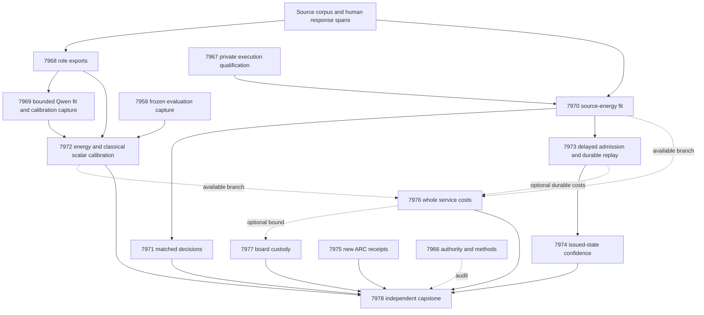
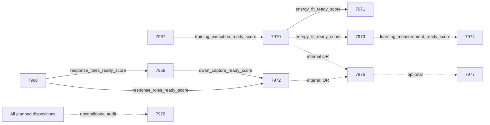

# Research Roadmap v691 — Calibrated source decisions and causal learning

Milestone: **2026.10.691**. Planned 2026-10-01 UTC, following completed
2026.09.690. October follows the actual UTC rollover; sequence 691 increments
the completed milestone. Status: **planned, not activated**.

This is a thirteen-task, four-phase contract: **Exp7966 through Exp7978**, in
the order below. `research-roadmap-next.yaml` contains exactly these tasks.
The active roadmap and conductor are unchanged. The superseded design is
preserved in `research-roadmap-v690-preserved-20261001.md`.

## Research objective

Determine whether learned source energies yield useful calibrated actions,
whether newly admitted constraints improve later decisions without forgetting,
and what the complete service costs. A separately gated Qwen calibration branch
provides another route to source-grounded decision evidence. A working audit,
fitted head, or completed generation is not itself scientific benefit.

The controlling priorities are `research-program.md`, PRD FR-12/FR-06, FR-11,
FR-05/08/09/10 and NFR-01, and the September 28 oracle-distinct corrigendum.
ARC live discovery and real hardware remain north stars. Their tasks audit new
outcomes and existing custody. No generator-weight update is proposed.

## What v690 established

Completed scheduling did not mean completed science: seven declared primary
artifacts exist for thirteen tasks. Six numerical/learning/service tasks lack
their declared primaries. The Exp7956 conductor pre-gate record has a different
path; it remains dispatch evidence rather than a scientific result.

| Evidence | What it establishes | What remains unproved |
|---|---|---|
| Exp7953 contract | Authority can be checked without fabricating consumed staging; fixture agreement is circular | Activation cannot be inferred from staging alone |
| Exp7954 qualification | All measured owned statements covered; 13 affected tests and one E2E test failed | Executable readiness is zero despite coverage |
| Exp7955 targets | Human spans yield 62 eligible evaluation source clusters: 19 positive, 43 negative | Sentence-only targets are insufficient; annotations are fallible and exposed |
| Exp7958 Qwen | 128 bounded calls completed; full-source Brier 0.14810 versus erased-source 0.67742 | Cost-gain interval crosses zero; false accepts 5 versus 2, so no decision-benefit claim |
| Exp7962 ARC | No new supervisor outcomes in its audited frontier | No generalization or new live solve |
| Exp7964 hardware | Historical custody and capabilities are bounded | No new accelerated workload |
| Exp7965 capstone | Missing science is terminal blocked | Same-run-date checks rejected honest upstream dates across midnight |

The qualification defect is mutable test work placed below protected
`results/raw/`: artifact-guard redirection caused missing child fixture paths
or cross-device rename failures. Exp7967 separates scratch from archived
evidence using the existing Exp7942 temporary-directory pattern. It preserves
the guard, assertions, failing receipts, and required checks.

Exp7955 already joins all 640 role slots. Exp7968 exports authenticated role
views instead of rebuilding annotations. Evaluation has been inspected and
remains **exposed development evidence**. Exp7958's source-ablation contrast
does not establish advantage against equal-information controls.

## Three largest gaps to the PRD

1. **Useful independent decisions (FR-12/FR-06).** No qualified learned-energy
   advantage in action cost against matched classical controls. Exp7970–7972
   test this with false-accept limits and source-cluster uncertainty.
2. **Causal continuous self-learning (FR-11).** Durable writes do not establish
   future benefit. Exp7973 admits constraints after delayed past feedback;
   Exp7974 updates confidence from the state that issued each prediction.
   Restart, no-write, shuffled-feedback and full-static controls test causality.
3. **Qualified, measured deployment (FR-05/08/09/10, NFR-01).** Training checks
   failed and full service costs were never measured. Exp7967 qualifies
   execution; Exp7976 measures whole requests and durable commits; Exp7977
   bounds hardware relevance using authenticated capabilities.

## Literature incorporated before experiment design

The dated V691 review at the beginning of `research-references.md` records
primary sources, limitations and all requested secondary checks. These are
hypotheses to test locally, not transferred performance claims.

| Finding | Experiment consequence | Limit |
|---|---|---|
| EBT [2507.02092](https://arxiv.org/abs/2507.02092); ARM-EBM [2512.15605](https://arxiv.org/abs/2512.15605) | Exp7970 conditional source energies; Exp7972 normalized two-state energy | Neither establishes independent verification or Carnot benefit |
| Structured-decoding semantic gap [2609.23742](https://arxiv.org/abs/2609.23742) | Exp7969 validates schema and target semantics separately | Small-model findings do not certify the mandated 27B model |
| BCEA [2606.16667](https://arxiv.org/abs/2606.16667) | Exp7969/7972 calibrate the complete source-conditioned protocol | Design principle, not transfer of a visual-acquisition guarantee |
| Delayed ACI [2609.07251](https://arxiv.org/abs/2609.07251) | Exp7974 exact issued-state updates under delayed feedback | Small dependent windows do not establish formal coverage |
| On-chip spline learning [2602.02056](https://arxiv.org/abs/2602.02056) | Exp7972 local cubic-spline control; Exp7977 compatibility assessment | CPU fitting is not an on-chip demonstration |
| Hard constraints [2505.13858](https://arxiv.org/abs/2505.13858); EBCN [2605.00960](https://arxiv.org/abs/2605.00960) | Exp7970/7971 retain independent targets and matched controls | No verifier-as-oracle headline claims |

OpenReview, Extropic writing, Semantic Scholar, Hugging Face papers, GitHub
trending and Logical Intelligence Kona were checked. ARM-EBM citation lookup
returned nine records; EBT lookup was rate-limited. Trend pages were cached;
Kona lacks a reproducible local recipe. Continual KAN, Ising/FPGA and thermal
sampling findings are documented without reviving retired importance anchoring,
four-expert reweighting, or unsupported device claims.

## Architecture



Qwen calibration consumes one fixed source-conditioned judgment. It does not
rank candidate texts or revive retired PHASE D external reranking. The other
branch uses established source features and predicates. Scalar calibration
alone cannot establish Carnot's independent-verifier moat.

## Phase 1 — Qualify execution and freeze independent input roles

**Exp7966** binds the thirteen-task visible table, machine contract and complete
prompt digest; runs twelve contract mutations and rollover cases; distinguishes
planning readiness, observed activation and unknown consumed-staging custody.
It records a multi-paper methods map. It is not a universal science gate.

**Exp7967** repairs the private execution adapter and qualifies the real fitting
callable with unchanged assertions and artifact protection. Unit and eleven
actual CLI routes share coverage includes and archive evidence only after
children exit. Readiness requires successful affected checks and 100% owned
module/CLI statement coverage, not coverage alone. Qualification budget: 1800s.

**Exp7968** exports role-specific full-response targets from the existing join:
256 fit, 64 tune, 32 policy-design, 32 calibration-replay, 96 online-update,
64 online-admission, 64 evaluation and 32 retention slots. Roles are disjoint
by source cluster. Unsupported spans, including implicit-true/due-to-null
cases, define the whole-response label. Missing annotations remain unknown.
These are intended slots, not a promise of 640 eligible independent units.

**Exp7969** captures only the 384 fit/tune/policy/calibration role slots using
`unsloth/Qwen3.8-27B-GGUF`, the Exp7958 full-source protocol, temperature 0,
seed 69058, input limit 6000 and 96 output tokens per item. Hard limits:
384 calls, 36,864 output tokens and 3000s capture; checkpoints every eight
units. Readiness requires at least 128 valid fit and 32 valid tune clusters.
Targets remain sealed from the generation child. No evaluation regeneration.

## Phase 2 — Measure decisions against same-information controls

**Exp7970** executes the frozen nine-arm, three-seed source-energy plan only
after Exp7967 qualifies it. Preserve 132 source features, 16 static predicates,
width 16, at most 4096 parameters, learning rate .01, 16 epochs, symmetric
Bernoulli KL tolerance .01, CE ceiling .70 and bounded dual updates. Freeze
the 17-point temperature grid over [.25, 4]. Numerical budget: 3000s. Report
actual parameter changes, constraint residuals, convergence and all failures.

**Exp7971** compares constrained set energy with augmented set, constrained MLP
and local logistic controls. With unsupported label y, action costs are
accept=5y, reject=1-y, escalate=.25; ties escalate. Average seed predictions
within source family before inference. Primary paired gains use 10,000
source-cluster bootstrap samples and paired randomization, Holm-adjusting six
cost/Brier comparisons. Require at least 32 clusters and eight per class.
Benefit requires cost improvement >=.02, positive cost/Brier lower bounds and
adjusted p<.05 against every named control, auto-decision coverage >=.20 and
no extra false accepts. Policy-design fixes matched coverage at .50; evaluation
coverage mismatch >.05 invalidates that comparison, not the whole measurement.

**Exp7972** fits five controls on the scalar Qwen unsupported probability:
raw, Platt, isotonic, normalized conditional Gibbs energy with one width-8
tanh hidden layer, and a cubic spline with eight coefficients and internal
knots .2/.4/.6/.8. Source IDs, roles and labels are not inference features.
Platt/Gibbs/spline use 200 full-batch CE steps, learning rate .01, L2=.001,
seeds 69101/2/3. Isotonic fits training only; energy/spline temperature uses
the frozen tune grid. Synthetic distortion is a separate circular control.

Fit needs >=128 clusters and >=16 per class; tune >=32 and >=4 per class;
evaluation >=32 and >=8 per class. Reuse only protocol-matched full-source
Exp7958 evaluation outputs. Gibbs versus raw/Platt/isotonic is primary with
six Holm-adjusted cost/Brier comparisons, the Exp7971 cost rule and no extra
false accepts. Spline is descriptive; no post-hoc winner substitution. A win
over raw alone is calibration benefit, not an energy-method advantage.

## Phase 3 — Continuous self-learning and issued-state confidence

**Exp7973** is the continuous-self-learning experiment (FR-11 Tier 1 + Tier 2).
Sixteen initial predicates remain immutable; admit up to eight new predicates
from delayed past feedback. Replay eight blocks of twelve update and eight
admission slots, with a twenty-event label delay. Before each prediction,
release only eligible earlier labels. Current, evaluation and retention labels
are unavailable to update logic. Admission labels select candidates; they do
not fit coefficients. A block cannot admit until its labels are actually due.

Compare dynamic admission, frozen bank, complete-static bank, no-write and
shuffled-past-label controls on the same stream. Freeze coefficient step .01;
admission requires Brier improvement .01 and no extra false accepts. Crash
after block four and require exact replay of state, pending feedback and future
decisions against uninterrupted execution. Benefit requires a real durable
commit that changes later decisions, cost gain >=.02 with positive lower bounds
against full-static and no-write controls (Holm two), nonworse Brier, retention
cost upper bound <=.01 and no extra false accepts. Minimum 32 future clusters,
eight per class and sixteen retention clusters; 20-event block-bootstrap
intervals preserve source grouping and are descriptive at this small scale.

**Exp7974** holds Exp7973's probability trajectory fixed and compares frozen,
rolling-32, scalar ACI and phase-aware ACI policies. Delays are 20+tau for
tau=1/4/16, target coverage .90, step .01, initial alpha=.10. Update from the
alpha that issued the prediction, not the latest alpha. Initial calibration
uses only the designated role under the initial head. Nonconformity is 1-p_y;
use ceil((n+1)(1-alpha)) order statistics with infinite endpoint handling.
Singleton {0} accepts, {1} rejects; other sets escalate. Point Brier must be
identical across policies. Require four complete 16-event windows; local-error
gain >=.02 with positive descriptive lower bound, adjusted p<.05, no additional
false accepts and mean set-size increase <=.10. Dependence limits the claim.

**Exp7975** audits only new content-hashed live ARC supervisor receipts beyond
Exp7962. Stop with a valid null after a bounded 120s scan if none exist. Count
actual firings, helped outcomes and games, not log mentions. Any inherited
level solve carries live-agent provenance and registry precheck. No live solve
launch, per-game adapter, offline oracle or duplicated solved level is planned.

## Phase 4 — Service costs, hardware scope and scientific decisions

**Exp7976** profiles whichever qualified branch is available: Exp7970 source
energy or Exp7972 Qwen calibration. It intentionally has no conjunctive
conductor gate; explicit internal OR checks emit branch readiness and reasons.
Use up to 64 source families, one warmup and ten paired repetitions. Include
request construction, feature work, scoring, serialization and storage; add
Exp7973 durable commits only when available. Separate cached CPU calibration
latency from end-to-end Qwen cost including actual generation receipts.

**Exp7977** preserves authenticated KV260, PolarFire and GateMate evidence,
then maps any new compatible timing spans from Exp7976. A 100x component
scenario plus transfer cost is an Amdahl bound, never measured acceleration.
No board reprobe, hardware integration, procurement or unsupported KAN mapping.

**Exp7978** independently reduces all thirteen dispositions from primitive
rows, separating science from dispatch stubs and administrative success. It
authenticates each producer against its own invocation date/hash and tests
honest midnight rollover versus tampering. Decide the three PRD gaps; report
publication G1/G2/G3/G4 without changing their rules. Missing required science
is terminal blocked; complete valid nulls are terminal. Record exact reopen
conditions and evidence-bound retirement decisions.

## Execution dependencies and gate contract

Conductor order is the exact table below. Structured edges require upstream
readiness=1, `flagged_adversarial=false`, and verdict class in
`positive`, `circular_positive`, `null`. No downstream task requires a
scientific benefit flag. A valid null may still supply a useful measurement.



Exp7966, 7967, 7968, 7975, 7976, 7977 and 7978 have no structured pre-gate.
Every gate's exact field is declared in the producer's REQUIRED ARTIFACT FIELDS.
Gate absence/None is a contract failure; a valid observed zero is an honest
failed prerequisite. `gate_check_summary` records path/hash, field, operator,
expected and observed values. External absence never triggers `partial` retries.

## Hardware, models and runtime requirements

| Resource | Role and boundary |
|---|---|
| CPU, existing Python/JAX environment | Source-energy fitting, scalar calibration, replay, private tests, reduction and profiling |
| Owned local CUDA allocation on existing 3090 capacity | Exp7969 only; Exp7958 demonstrated the Qwen model at about 16,730 MiB and 66/66 offloaded layers. Acquire a free lease; wait <=60s before blocked availability; never terminate another job |
| Mandated GGUF | `unsloth/Qwen3.8-27B-GGUF`; preserve Exp7958 Q4_K_M revision `fe1e2a23d973adb629709749dc4f6756df66ef10` and file SHA-256 `7e78da5d7e3ae28d178121f58646953305f3e5bd3cb46f4a75584e8b6c6fe169` when matching protocol |
| KV260 | Historical authenticated quadratic Ising capability, kmax<=5; arbitrary learned energy or spline acceleration is unproved |
| PolarFire | Linux CPU evidence only; no fabric acceleration claim |
| GateMate | Existing physical/JTAG 0xffffffff blocker; reopen only with changed external evidence |
| NPU / Extropic TSU / Kona | No qualified local execution path or required new hardware; literature context only |

Exp7969 declares `MODEL_SPECS: [unsloth/Qwen3.8-27B-GGUF]` and
`model_bounded_generation` (10s floor), because each request has a fixed small
token budget. Historical Exp7958 outputs in Exp7972 are cached evidence, not
new LLM calls. All other tasks declare `MODEL_SPECS: []`, `no_model_load` and
zero current pretrained-model calls. Learned small heads are recorded separately.
No legacy small model contributes a headline result. Full generation's 60s
floor and load-only's 2s floor do not apply to these planned calls.

Two schema/execution tasks use Claude Opus, 100 turns (7966/7967). Formulaic
role export uses Codex gpt-6.1-sol, 30 turns (7968). Other tasks retain routine
Claude routing with explicit smaller audit budgets. No luna task is planned.
No task calls for modifying `scripts/research_conductor.py`.

Each prompt has numbered steps requiring flushed output at every phase and
before/after model load, generation, benchmark and subprocess. Long loops and
owned children emit progress at most 60s apart; all gaps remain below 600s.
Silence can terminate a task near 1200s; progress permits the 4800s hard cap.
Tool waits stay <=60s. Files over about 200 lines are written across calls of
at most 150 lines with a progress message between them. Never pad runtime.

## Acceptance, validity and retirement

All comparative tasks require primitive per-unit rows, paired arm membership,
source IDs, predictions, targets, decisions, costs, censoring and denominators.
Seeds/repetitions do not increase independent sample size. Fixed sample floors
can produce valid underpowered nulls; missing upstreams produce blocked results.
Accept positive claims only after independent reduction, adversarial review and
strict row consistency on final published bytes. Failed owned required checks
mean disqualified and readiness zero. Fixture equality is circular_positive.

Reused scopes carry full four-field `prior_failures` entries with
`retire_if_same_verdict: true`. Missing v690 primaries use the observed conductor
`GATE_BLOCK` disposition, not an invented producer verdict. Differences are
specific: scratch ownership, existing-role exports, new calibration controls,
released-feedback causality, available-branch service profiling or per-producer
date authentication. No retired upstream is a new structured dependency.
Unchanged terminal failures retire; a blocked capture does not license a small
model substitution, and a null calibration does not license a new protocol.

Qualification requires spec-first, tests-first implementation, affected units
and consumers, nonempty 100% changed statement coverage including real private
CLI routes, scoped Ruff/format, strict mypy and explicit-path spec coverage.
Applicable E2Es: 015 source custody, 016 current-work fixture/replay, 017 ARC
supervisor, 018 authority lifecycle and 019 response targets. Historical fixture
dates remain fixed; each current producer records its actual UTC date. Archive
immutable receipts after private children finish. One declared primary is
published atomically; sidecars remain nested and bind to its terminal hash.

The plan does not promise publication, production rollout, generator retraining,
hardware acceleration or fresh held-out generalization. Completion means all
thirteen tasks have truthful dispositions and the three gaps have evidence-based
answers, including null or blocked answers with exact reopening conditions.

## Exact task contract

The following table and machine block bind the same thirteen tasks in the
staged YAML. The full-task hash also binds prompts, budgets, routing and prior
failure history. Planning agreement is not observed activation.

Canonical full-task SHA-256: `8e7c624bc03c11409aa48ba3e825288c34ae2649766a85557486e7473a37ee98`

| Order | Task ID | Title | Phase | Deliverable |
|---|---|---|---|---|
| 1 | exp7966-contract-methods | Bind thirteen tasks across UTC rollover and freeze research methods | 1 | results/experiment_7966_v691_contract_methods.json |
| 2 | exp7967-private-training-qualification | Qualify fitting with private scratch and the artifact guard enabled | 1 | results/experiment_7967_v691_private_training_qualification.json |
| 3 | exp7968-response-role-targets | Qualify complete-response labels for disjoint calibration roles | 1 | results/experiment_7968_v691_response_role_targets.json |
| 4 | exp7969-qwen-calibration-capture | Capture bounded Qwen judgments for fitting and calibration | 1 | results/experiment_7969_v691_qwen_calibration_capture.json |
| 5 | exp7970-energy-fit | Fit source energies through the qualified private execution path | 2 | results/experiment_7970_v691_energy_fit.json |
| 6 | exp7971-decision-abstention | Measure source-energy decisions against equal-information controls | 2 | results/experiment_7971_v691_decision_abstention.json |
| 7 | exp7972-qwen-energy-calibration | Train small response-energy calibrators against same-information controls | 2 | results/experiment_7972_v691_qwen_energy_calibration.json |
| 8 | exp7973-causal-acquisition | Measure persistent constraint additions before delayed feedback | 3 | results/experiment_7973_v691_causal_acquisition.json |
| 9 | exp7974-delayed-calibration | Test issued-state confidence updates on a sealed learning trajectory | 3 | results/experiment_7974_v691_delayed_calibration.json |
| 10 | exp7975-arc-supervisor-delta | Assess new live ARC supervisor outcomes for transferable refinement | 3 | results/experiment_7975_v691_arc_supervisor_delta.json |
| 11 | exp7976-service-cost | Measure complete decision-service cost for each qualified branch | 4 | results/experiment_7976_v691_service_cost.json |
| 12 | exp7977-hardware-evidence | Preserve all board obligations and map current measured workload | 4 | results/experiment_7977_v691_hardware_evidence.json |
| 13 | exp7978-capstone | Independently reduce thirteen outcomes and decide the three PRD gaps | 4 | results/experiment_7978_v691_capstone.json |

<!-- V691_TASK_CONTRACT_START -->
```json
{
  "milestone": "2026.10.691",
  "tasks": [
    {"id": "exp7966-contract-methods", "title": "Bind thirteen tasks across UTC rollover and freeze research methods", "phase": 1, "deliverable": "results/experiment_7966_v691_contract_methods.json", "MODEL_SPECS": [], "inference_substrate_class": "no_model_load", "gated_on": []},
    {"id": "exp7967-private-training-qualification", "title": "Qualify fitting with private scratch and the artifact guard enabled", "phase": 1, "deliverable": "results/experiment_7967_v691_private_training_qualification.json", "MODEL_SPECS": [], "inference_substrate_class": "no_model_load", "gated_on": []},
    {"id": "exp7968-response-role-targets", "title": "Qualify complete-response labels for disjoint calibration roles", "phase": 1, "deliverable": "results/experiment_7968_v691_response_role_targets.json", "MODEL_SPECS": [], "inference_substrate_class": "no_model_load", "gated_on": []},
    {"id": "exp7969-qwen-calibration-capture", "title": "Capture bounded Qwen judgments for fitting and calibration", "phase": 1, "deliverable": "results/experiment_7969_v691_qwen_calibration_capture.json", "MODEL_SPECS": ["unsloth/Qwen3.8-27B-GGUF"], "inference_substrate_class": "model_bounded_generation", "gated_on": [{"upstream": "exp7968-response-role-targets", "artifact_field": "response_roles_ready_score", "op": "==", "value": 1}, {"upstream": "exp7968-response-role-targets", "artifact_field": "flagged_adversarial", "op": "==", "value": false}, {"upstream": "exp7968-response-role-targets", "artifact_field": "verdict_class", "op": "in", "value": ["positive", "circular_positive", "null"]}]},
    {"id": "exp7970-energy-fit", "title": "Fit source energies through the qualified private execution path", "phase": 2, "deliverable": "results/experiment_7970_v691_energy_fit.json", "MODEL_SPECS": [], "inference_substrate_class": "no_model_load", "gated_on": [{"upstream": "exp7967-private-training-qualification", "artifact_field": "training_execution_ready_score", "op": "==", "value": 1}, {"upstream": "exp7967-private-training-qualification", "artifact_field": "flagged_adversarial", "op": "==", "value": false}, {"upstream": "exp7967-private-training-qualification", "artifact_field": "verdict_class", "op": "in", "value": ["positive", "circular_positive", "null"]}]},
    {"id": "exp7971-decision-abstention", "title": "Measure source-energy decisions against equal-information controls", "phase": 2, "deliverable": "results/experiment_7971_v691_decision_abstention.json", "MODEL_SPECS": [], "inference_substrate_class": "no_model_load", "gated_on": [{"upstream": "exp7970-energy-fit", "artifact_field": "energy_fit_ready_score", "op": "==", "value": 1}, {"upstream": "exp7970-energy-fit", "artifact_field": "flagged_adversarial", "op": "==", "value": false}, {"upstream": "exp7970-energy-fit", "artifact_field": "verdict_class", "op": "in", "value": ["positive", "circular_positive", "null"]}]},
    {"id": "exp7972-qwen-energy-calibration", "title": "Train small response-energy calibrators against same-information controls", "phase": 2, "deliverable": "results/experiment_7972_v691_qwen_energy_calibration.json", "MODEL_SPECS": [], "inference_substrate_class": "no_model_load", "gated_on": [{"upstream": "exp7968-response-role-targets", "artifact_field": "response_roles_ready_score", "op": "==", "value": 1}, {"upstream": "exp7968-response-role-targets", "artifact_field": "flagged_adversarial", "op": "==", "value": false}, {"upstream": "exp7968-response-role-targets", "artifact_field": "verdict_class", "op": "in", "value": ["positive", "circular_positive", "null"]}, {"upstream": "exp7969-qwen-calibration-capture", "artifact_field": "qwen_capture_ready_score", "op": "==", "value": 1}, {"upstream": "exp7969-qwen-calibration-capture", "artifact_field": "flagged_adversarial", "op": "==", "value": false}, {"upstream": "exp7969-qwen-calibration-capture", "artifact_field": "verdict_class", "op": "in", "value": ["positive", "circular_positive", "null"]}]},
    {"id": "exp7973-causal-acquisition", "title": "Measure persistent constraint additions before delayed feedback", "phase": 3, "deliverable": "results/experiment_7973_v691_causal_acquisition.json", "MODEL_SPECS": [], "inference_substrate_class": "no_model_load", "gated_on": [{"upstream": "exp7970-energy-fit", "artifact_field": "energy_fit_ready_score", "op": "==", "value": 1}, {"upstream": "exp7970-energy-fit", "artifact_field": "flagged_adversarial", "op": "==", "value": false}, {"upstream": "exp7970-energy-fit", "artifact_field": "verdict_class", "op": "in", "value": ["positive", "circular_positive", "null"]}]},
    {"id": "exp7974-delayed-calibration", "title": "Test issued-state confidence updates on a sealed learning trajectory", "phase": 3, "deliverable": "results/experiment_7974_v691_delayed_calibration.json", "MODEL_SPECS": [], "inference_substrate_class": "no_model_load", "gated_on": [{"upstream": "exp7973-causal-acquisition", "artifact_field": "learning_measurement_ready_score", "op": "==", "value": 1}, {"upstream": "exp7973-causal-acquisition", "artifact_field": "flagged_adversarial", "op": "==", "value": false}, {"upstream": "exp7973-causal-acquisition", "artifact_field": "verdict_class", "op": "in", "value": ["positive", "circular_positive", "null"]}]},
    {"id": "exp7975-arc-supervisor-delta", "title": "Assess new live ARC supervisor outcomes for transferable refinement", "phase": 3, "deliverable": "results/experiment_7975_v691_arc_supervisor_delta.json", "MODEL_SPECS": [], "inference_substrate_class": "no_model_load", "gated_on": []},
    {"id": "exp7976-service-cost", "title": "Measure complete decision-service cost for each qualified branch", "phase": 4, "deliverable": "results/experiment_7976_v691_service_cost.json", "MODEL_SPECS": [], "inference_substrate_class": "no_model_load", "gated_on": []},
    {"id": "exp7977-hardware-evidence", "title": "Preserve all board obligations and map current measured workload", "phase": 4, "deliverable": "results/experiment_7977_v691_hardware_evidence.json", "MODEL_SPECS": [], "inference_substrate_class": "no_model_load", "gated_on": []},
    {"id": "exp7978-capstone", "title": "Independently reduce thirteen outcomes and decide the three PRD gaps", "phase": 4, "deliverable": "results/experiment_7978_v691_capstone.json", "MODEL_SPECS": [], "inference_substrate_class": "no_model_load", "gated_on": []}
  ]
}
```
<!-- V691_TASK_CONTRACT_END -->
