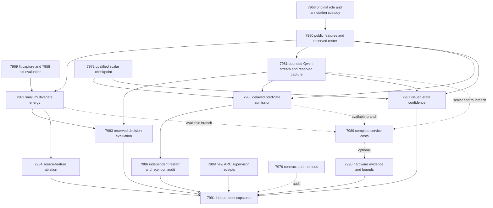

# Research Roadmap v692 — Source evidence and independent continuous learning

**Created:** 2026-10-01. **Milestone:** 2026.10.692.
**Status:** Planned; activation has not been performed by this planning task.
**Supersedes:** completed 2026.10.691. The sequence increments from 691 to 692.
The prior design is preserved in `research-roadmap-v691-preserved-20261001.md`.

The task contract contains **13 tasks, Exp7979 through Exp7991**, in the exact
order below. `research-roadmap-next.yaml` carries the same tasks. This plan
changes neither `research-roadmap.yaml` nor `scripts/research_conductor.py`.

## What v691 proved

Completion of scheduling is separate from successful science. Read terminal
artifacts before the conductor's `OK` labels. The completion archive still
ends at v690 at planning time; the active YAML, terminal artifacts and conductor
log establish the v691 boundary. No archive entry is fabricated here.

| Evidence | Supported finding | Limit |
|---|---|---|
| Exp7966 | Contract and activated authority qualified | Administrative agreement is circular evidence |
| Exp7967 | Private execution work and later repair tests exist | Saved primary is disqualified with training readiness zero; the repair did not qualify natural fitting |
| Exp7968 | 640 role slots; 604 eligible full-response annotations; zero cross-role overlap | Human source-support labels are fallible, exposed development evidence |
| Exp7969 | 358 completed Qwen judgments from 384 intended slots; 25 excluded, one failed | Capture is ready; successful generation is not improved verification |
| Exp7972 | Scalar Gibbs, Platt, isotonic and spline calibration run on 62 eligible evaluation groups | Gibbs cost ties Platt/isotonic; all adjusted benefit comparisons fail. Raw-Qwen cost-gain interval crosses zero |
| Exp7970/7971/7973/7974 | Dispatch evidence explains their blocked chain | No natural source-energy fit, decision benefit or continuous-learning result |
| Exp7975 | Original terminal artifact is disqualified; later scoped health-receipt repair passes | No new live solve or generalization claim |
| Exp7976 | Cached CPU median about 0.115 ms; complete request median about 1.405 s using matched acquisition receipts | These are different cost boundaries; no compatible accelerator kernel was found |
| Exp7977 | Board custody and workload limits retained | No new hardware speedup |
| Exp7978 | Independent reduction records missing science | Its owned negative cold-replay check failed. Historical publication G1–G4 are green; current science is not |

The natural next step is to test information absent from a single probability.
A multivariate head receives public source features plus the existing Qwen
judgment. Classical controls receive the same information. A reserved source
panel reduces repeated use of the exposed evaluation set. Continuous learning
starts from the already qualified scalar head and has separate dependencies.
The blocked source-fitting qualification chain is not copied forward.

## Three largest gaps to the PRD

1. **Useful source-grounded decisions, FR-12 and FR-06.** A calibrated scalar
   does not establish a distinct verifier advantage. Exp7980–7984 test whether
   source features add information and whether energy improves typed decisions.
2. **Causal persistent learning, FR-11.** No qualified result shows that new
   constraints help future cases without forgetting. Exp7985–7987 test delayed
   additions, restart, retention and issued-state confidence separately.
3. **Qualified deployment with a measured cost boundary, FR-05/08/09/10 and
   NFR-01.** Cheap scoring alone does not accelerate a service dominated by
   extraction. Exp7989–7990 measure complete costs and hardware compatibility.
   A Rust port remains contingent on demonstrated utility; none is claimed here.

ARC live hidden-game discovery remains the project destination. Exp7988 meets
its generalization floor through newly authenticated supervisor outcomes.
Source-support research de-risks a verifier component; it does not establish
hidden-game transfer or improve the pinned generator's weights.

## Research recorded before design

The dated V692 review at the start of `research-references.md` records this
session's primary sources and secondary-source access limits.

| Source | Local hypothesis or decision |
|---|---|
| [Input-side evidence alignment, 2608.15804](https://arxiv.org/abs/2608.15804), August 2026 | Exp7980/7982/7984 test public source alignment beyond scalar confidence |
| [HallDetect, 2608.05823](https://arxiv.org/abs/2608.05823), August 2026 | Preserve complete responses and qualifiers; distinguish lexical evidence from entailment |
| [Delayed ACI, 2609.07251](https://arxiv.org/abs/2609.07251), September 2026 | Exp7987 tests state-at-issuance updates on identical probabilities |
| [Local spline learning, 2602.02056v4](https://arxiv.org/abs/2602.02056v4), June 2026 revision | Exp7982 uses a descriptive spline control; Exp7989/7990 count sparse work and bound device relevance |
| [EBT, 2507.02092](https://arxiv.org/abs/2507.02092); [ARM-EBM, 2512.15605](https://arxiv.org/abs/2512.15605) | Small conditional energy training is feasible; neither paper proves independent correctness |
| [ExAUL, 2506.14067v4](https://arxiv.org/abs/2506.14067v4), May 2026 revision | Retain partial-feedback research for a later milestone; this plan first qualifies full delayed-feedback causality |
| [Dual-BRAM Ising hardware, 2602.16143](https://arxiv.org/abs/2602.16143); [Extropic Z1T](https://extropic.ai/writing/z1t) | Count transfer, readout and host work; do not transfer vendor speed estimates |

The scan covered all requested topics and secondary sites. Semantic Scholar
citation endpoint reads failed for both seed papers. GitHub trending pages
were cached. Kona supplies product-level architecture without a reproducible
local recipe. These limits are recorded, not converted into novelty claims.
ETS energy-guided decoding, new foundation-model training, unchanged importance
anchoring, and new sampler sweeps remain deferred until a useful signal or
compatible measured bottleneck exists.

## Architecture



A request has one frozen Qwen judgment, eight public evidence features, and a
small probability head. Typed decisions use explicit costs and abstention.
Labels remain in separate evaluator stores. A second process releases only
past labels for the learning replay. No task trains the generator or ranks
external candidate texts.

## Phase 1 — Bind evidence and obtain missing measurements

**Exp7979: Contract and methods.** Freeze thirteen tasks and the exact prompt
digest. Reuse authority checks with per-producer dates. A negative CLI test
passes only when its wrapper verifies the expected child failure. Preserve
V691 failures. This task is not a universal gate for science.

**Exp7980: Public features and reserved panel.** Reuse all 640 original roles.
For each of four existing lexical pair features, calculate mean and maximum
over deduplicated complete source windows. Export these eight features without
labels. Reserve 96 additional official-training source groups by deterministic
hash order, excluding known historical exposure and normalized duplicates.
Select one response without labels. Seal the panel before target access; retain
shortfalls and unknowns without replacement. Official test data stay sealed.
Freeze sixteen unary predicates and eight candidate conjunctions from fit data.

**Exp7981: Bounded Qwen capture.** Query only the four missing stream roles
(32 calibration, 96 updates, 64 admission, 32 retention), plus the 96 reserved
sources when available. Maximum 320 calls, 96 output tokens each, 6000 input
tokens, and 3000 seconds of measured work. Reuse the qualified protocol and
model identity. Stream and fresh-panel readiness are independent outputs.

Phase gate: runnable public-only extraction and real capture receipts, exact
byte reconstruction, metadata-leakage controls, and separately recorded role
support. A valid capture supplies inputs; it does not prove scientific benefit.

## Phase 2 — Measure information and typed decisions

**Exp7982: Multivariate energy.** Fit a two-label, exactly normalized energy
with eight tanh units from q and the eight source features. Use fit labels for
optimization and tune labels for temperature only. Compare logistic, quadratic
logistic and a sixteen-unit MLP with identical information, tuning choices,
seeds and training budgets. Keep scalar and cubic-spline controls descriptive.
A no-fit sigmoid-of-energy-difference conversion must match predictions. Any
gain concerns these architectures and budgets, not normalization alone.
This uses the qualified Exp7972 numerical path, with its own tests and private
CLI coverage. It does not reuse a failed source-fitting readiness assertion.

**Exp7983: Reserved decisions.** Fit action thresholds only on original
policy-design labels, then seal policies before opening reserved targets.
Cost is `accept=5*y`, `reject=1-y`, `escalate=.25`, where y denotes unsupported
source content. Require 64 eligible independent groups and twelve per class
for a benefit claim. Use six Holm-adjusted cost/Brier comparisons against the
three equal-information classical controls. A primary win requires cost gain
at least .02, positive paired 95% lower bounds and adjusted p<.05 against all
three; no extra false accepts; Brier degradation upper bound at most .01; and
automation at least .50. A zero false-accept count is not a safety guarantee.
The old 64-source panel remains a separate exposed development replication.

**Exp7984: Evidence ablation.** Compare full inputs, q-only and source-only on
original bytes and the old development panel. A donor-source stress arm tests
source reliance, not correctness under unannotated replacement evidence.
Unchanged-source duplicates must reproduce scores. Added source information
needs Brier gain at least .01 with a positive paired lower bound and adjusted
p<.05 against q-only. It does not by itself establish an energy-method advantage.

Phase gate: runnable fitting, source-group uncertainty, unchanged control
information, sealed evaluator access and negative controls. A complete valid
null is a useful result. Do not tune a method after seeing the reserved panel.

## Phase 3 — Continuous learning, confidence and live discovery evidence

**Exp7985: Delayed constraint additions.** Start from the qualified scalar
head, independently of Exp7982. Fit a small energy residual with sixteen
initial predicates; admit at most eight predeclared conjunctions. Replay eight
blocks of twelve update slots and eight admission slots with a twenty-event
label delay. Admission labels select candidates; only update labels fit weights.
Compare dynamic admission, frozen sixteen, adaptive weights, complete-static
24, no-write and shuffled-past-label controls on identical events. Persist the
bank and pending labels. This is an imposed development replay, not a claim
about naturally occurring live chronology.

**Exp7986: Independent learning audit.** Reconstruct primitive outcomes with
a separate reducer. Crash before and after the fourth-block atomic commit;
restart must reproduce the uninterrupted bank, pending labels and decisions.
Require a durable addition that changes a later prediction, at least 32 future
groups with eight per class, cost gain at least .02 against full-static and
no-write with positive lower bounds and Holm p<.05, no extra false accepts,
and nonworse Brier within .01. Disjoint retention needs at least sixteen groups
and four per class, with cost-degradation upper bound at most .01. Report block
bootstrap dependence limits. The fixed 120-event benefit suffix provides at
most six nonoverlapping 20-event blocks. Inferential benefit needs eight, so
this milestone reports finite-replay gain descriptively and keeps generalized
learning_benefit_score zero. It tests a new causal mechanism without promising
a statistically qualified population benefit. A write without future benefit is a null.

**Exp7987: Issued-state confidence.** Use the fixed scalar checkpoint and new
stream capture, independently of constraint-learning success. Compare frozen,
rolling, scalar delayed ACI and phase-interleaved ACI under delays 20/24/36.
All arms share identical point probabilities. The primary delay-20 comparison
requires local coverage-error reduction at least .02, positive paired lower
bound, no extra false accepts and set-size increase at most .10. Keep pending
issue state across restart. Small streams do not establish deployment coverage.

**Exp7988: ARC supervisor outcomes.** Scan at most 120 seconds for new
content-hashed live redirect receipts. An empty ledger yields an honest null
and satisfies the generalization floor. Use the shipped private validation
repair and preserve the old disqualified artifact. Count games and actual
firings; require eight firings across three games for a directional proposal.
No new solve run, per-game adapter, hidden-source reading or live-default
change is planned. Any inherited level solve carries registry and live-path
provenance.

Phase gate: a runnable causal replay, future-label mutation checks, independent
restart/retention reduction, identical confidence trajectories, and live ARC
receipt custody. No new learned-energy success is required to run this phase.

## Phase 4 — Measure deployment limits and decide the next direction

**Exp7989: Complete service cost.** Profile each independently qualified branch
with up to 64 groups, one warmup and ten paired CPU repetitions. Include byte
handling, features, scoring, serialization and storage. Add actual durable
updates when available. Join matching GPU receipts separately; keep setup and
unknown costs visible. An internal OR allows valid branches to run after a
sibling block. Report cached and complete boundaries separately.

**Exp7990: Hardware continuity.** Preserve authenticated KV260, PolarFire and
GateMate evidence. Map only newly measured compatible operations. Report ideal
and 100x-component Amdahl bounds as estimates with transfer assumptions. No
new physical probe, flash or purchase is needed. A scalar or spline head does
not automatically map to the existing quadratic-Ising fabric.

**Exp7991: Independent capstone.** Reduce all thirteen dispositions, including
missing producer and conductor-skip records. Use frozen authorities and each
producer's invocation date. Correctly assert expected-negative CLI exits.
Decide the three PRD gaps from primitive rows. Preserve publication G1–G4 as
defined by `scripts/publication_gate.py`; keep `paper_ready` separate from
`science_ready`. Missing external science is terminal blocked, not partial.

Phase gate: whole-service spans, explicit compatible-operation evidence and
independent claim reconstruction. Administrative success cannot substitute for
measured science. Complete nulls close the milestone with clear reopen criteria.

## Dependency and gate contract

Every structured dependency is a producer in this roadmap. It tests the named
readiness field equal to 1, `flagged_adversarial=false`, and verdict class in
`positive`, `circular_positive`, `null`. The upstream prompt declares the exact
field. A valid observed zero is a failed prerequisite; a missing field is a
contract error. Neither licenses an invented producer or implicit default.

| Task | Structured prerequisites |
|---|---|
| 7979 | None |
| 7980 | None |
| 7981 | 7980.feature_views_ready_score |
| 7982 | 7980.feature_views_ready_score |
| 7983 | 7982.energy_fit_ready_score; 7981.fresh_capture_ready_score |
| 7984 | 7982.energy_fit_ready_score |
| 7985 | 7980.feature_views_ready_score; 7981.stream_capture_ready_score |
| 7986 | 7985.learning_measurement_ready_score |
| 7987 | 7980.feature_views_ready_score; 7981.stream_capture_ready_score |
| 7988 | None |
| 7989 | Internal OR over available qualified work; no conductor conjunction |
| 7990 | None; service mapping optional, board custody required |
| 7991 | None; audit all dispositions |

Qualified historical inputs are hash-checked evidence, not new `requires`
chains to retired tasks. The plan preserves full prior-failure entries for
reused scopes. Each states the changed mechanism and `retire_if_same_verdict:
true`. No retired ID is reused and no operator override is fabricated.

## Hardware and runtime requirements

| Resource | Required scope |
|---|---|
| Host CPU and existing Python environment | Feature extraction, small-head fitting, replay, validation and reductions |
| Owned free RTX 3090 CUDA allocation | Exp7981 only; existing Q4_K_M capture used about 16.7 GiB with 66/66 layers offloaded |
| `unsloth/Qwen3.8-27B-GGUF` | Mandatory current model for Exp7981; exact successful revision and GGUF hash retained |
| KV260 | Existing quadratic Ising evidence, k_max<=5; no claim that a spline or arbitrary energy already executes there |
| PolarFire | Retained Linux CPU dispatch evidence only |
| GateMate | Unchanged physical/JTAG `0xffffffff` blocker |
| NPU, TSU, larger FPGA | No qualified local path or required purchase; reopen only with compatible workload evidence |

Exp7981 is `model_bounded_generation`, with the 10-second floor. It performs
fixed small-budget generation. `model_full_generation` (60 seconds) applies
only to real generative runs; `model_load_no_generation` (2 seconds) applies
to embeddings/load-only work. Neither describes this capture. All other tasks
are `no_model_load`, with empty MODEL_SPECS and zero current pretrained calls.
Their small fitted heads are declared separately. Cached upstream Qwen evidence
is never relabeled as fresh inference. Legacy small models cannot supply
headline results.

Only Exp7979 uses Claude Opus/100 turns for authority/schema coordination.
The formulaic Exp7980 export uses Codex gpt-6.1-sol/50 turns. Routine science
uses the default Claude backend, 50 turns; bounded ARC/hardware audits use 20.
No luna task is scheduled. Exp7990 is an evidence audit, not hardware integration.

Every prompt requires flushed phase and before/after-call progress as numbered
steps, with output at most 60 seconds apart during long work. All gaps stay
below 600 seconds. Files over about 200 lines are written in calls of at most
150 lines, with a progress message between calls. Never pad measured duration.


## Fixed causal and diagnostic details

- The initial bank retains sixteen slots. Zero-variance and duplicate unary
  predicates are marked inert. Candidate conjunctions must have distinct,
  nonconstant fit truth vectors. Fewer than eight candidates leaves vacancies.
- Admission boundaries are events 40/60/80/100/120/140/160. Each uses exactly
  the prior block's eight due admission labels, with origins t-27 through t-20.
  Rank eligible candidates by Brier gain, then predicate ID. Each block is used
  once. No flushing after the last prediction creates a future-benefit claim.
- Learning uses the exact existing action rule: accept p<.05, reject p>.75,
  otherwise escalate. The saved scalar confidence cutoff is descriptive only.
  The benefit mask is events 41–160 for every arm, fixed before additions occur.
- Confidence windows are 33–48, 65–80, 97–112 and 129–144. Average their absolute
  miscoverage deviations from .10 equally. Use paired 20-event moving-block
  bootstrap with 10,000 draws; preserve source grouping and disclose dependence.
  Inferential confidence benefit requires eight complete 20-event blocks;
  lower effective support remains descriptive.
- Before reading natural evaluation outcomes, exercise known-benefit and
  no-headroom fixtures through the decision, learning and coverage reducers.
  A failed positive control prevents a scientific null interpretation.
  Fixture results remain circular and never enter natural-data denominators.

## Validation and acceptance

This is a planning change, not an implemented experiment or activated milestone.
Each execution prompt requires spec-first and tests-first work, affected units
and consumers, scoped Ruff/format/mypy, explicit-path spec coverage, and 100%
nonempty changed-statement coverage including real private CLI routes. Private
scratch remains outside the checkout with artifact protection enabled.

Applicable execution E2Es are 015 (public source custody), 017 (supervisor),
018 (authority) and 019 (annotation replay), plus each producer's real private
success/blocked CLI and cold replay. Historical primary producers are not
rerun as a planning test. Current checked bytes must pass adversarial and strict
row checks and resolve through both conductor artifact readers.

Failed owned validation means disqualified/readiness zero. Missing external
input means blocked, with exact gate_check_summary operands. Underpowered but
complete valid science is null. Only unfinished own work may be partial.
A failed positive control is a broken measurement, not a negative finding.

Milestone completion means thirteen truthful dispositions and evidence-based
answers to the three gaps. It does not promise a new headline, production
rollout, publication, unseen-game solve or measured device acceleration.

## Exact task contract

Canonical full-task SHA-256: `c53339a996d01597404de37a124e14ab34a9e7445bf71990009b3ee6e0332c8d`

| Order | Task ID | Title | Phase | Deliverable |
|---|---|---|---|---|
| 1 | exp7979-contract-methods | Freeze thirteen tasks and separate historical authority from new evidence | 1 | results/experiment_7979_v692_contract_methods.json |
| 2 | exp7980-evidence-features | Join public source features and reserve evaluation sources before label access | 1 | results/experiment_7980_v692_evidence_features.json |
| 3 | exp7981-qwen-stream-capture | Capture bounded Qwen judgments for delayed feedback and reserved evaluation | 1 | results/experiment_7981_v692_qwen_stream_capture.json |
| 4 | exp7982-multivariate-energy | Fit a small conditional energy using Qwen and source evidence | 2 | results/experiment_7982_v692_multivariate_energy.json |
| 5 | exp7983-reserved-decisions | Evaluate typed energy decisions on the reserved source panel | 2 | results/experiment_7983_v692_reserved_decisions.json |
| 6 | exp7984-evidence-ablation | Test whether source features add signal beyond scalar confidence | 2 | results/experiment_7984_v692_evidence_ablation.json |
| 7 | exp7985-delayed-acquisition | Learn persistent constraint additions from delayed past feedback | 3 | results/experiment_7985_v692_delayed_acquisition.json |
| 8 | exp7986-learning-restart-audit | Independently test learning benefit retention and crash recovery | 3 | results/experiment_7986_v692_learning_restart_audit.json |
| 9 | exp7987-issued-confidence | Compare delayed confidence updates on a fixed qualified probability stream | 3 | results/experiment_7987_v692_issued_confidence.json |
| 10 | exp7988-arc-supervisor-delta | Review new live ARC supervisor outcomes for transferable refinement | 3 | results/experiment_7988_v692_arc_supervisor_delta.json |
| 11 | exp7989-service-cost | Measure complete decision and durable learning costs by available branch | 4 | results/experiment_7989_v692_service_cost.json |
| 12 | exp7990-hardware-evidence | Preserve board evidence and bound acceleration of the measured service | 4 | results/experiment_7990_v692_hardware_evidence.json |
| 13 | exp7991-capstone | Independently reduce thirteen outcomes and decide the three PRD gaps | 4 | results/experiment_7991_v692_capstone.json |

<!-- V692_TASK_CONTRACT_START -->
```json
{
  "milestone": "2026.10.692",
  "tasks": [
    {"id": "exp7979-contract-methods", "title": "Freeze thirteen tasks and separate historical authority from new evidence", "phase": 1, "deliverable": "results/experiment_7979_v692_contract_methods.json", "MODEL_SPECS": [], "inference_substrate_class": "no_model_load", "gated_on": []},
    {"id": "exp7980-evidence-features", "title": "Join public source features and reserve evaluation sources before label access", "phase": 1, "deliverable": "results/experiment_7980_v692_evidence_features.json", "MODEL_SPECS": [], "inference_substrate_class": "no_model_load", "gated_on": []},
    {"id": "exp7981-qwen-stream-capture", "title": "Capture bounded Qwen judgments for delayed feedback and reserved evaluation", "phase": 1, "deliverable": "results/experiment_7981_v692_qwen_stream_capture.json", "MODEL_SPECS": ["unsloth/Qwen3.8-27B-GGUF"], "inference_substrate_class": "model_bounded_generation", "gated_on": [{"upstream": "exp7980-evidence-features", "artifact_field": "feature_views_ready_score", "op": "==", "value": 1}, {"upstream": "exp7980-evidence-features", "artifact_field": "flagged_adversarial", "op": "==", "value": false}, {"upstream": "exp7980-evidence-features", "artifact_field": "verdict_class", "op": "in", "value": ["positive", "circular_positive", "null"]}]},
    {"id": "exp7982-multivariate-energy", "title": "Fit a small conditional energy using Qwen and source evidence", "phase": 2, "deliverable": "results/experiment_7982_v692_multivariate_energy.json", "MODEL_SPECS": [], "inference_substrate_class": "no_model_load", "gated_on": [{"upstream": "exp7980-evidence-features", "artifact_field": "feature_views_ready_score", "op": "==", "value": 1}, {"upstream": "exp7980-evidence-features", "artifact_field": "flagged_adversarial", "op": "==", "value": false}, {"upstream": "exp7980-evidence-features", "artifact_field": "verdict_class", "op": "in", "value": ["positive", "circular_positive", "null"]}]},
    {"id": "exp7983-reserved-decisions", "title": "Evaluate typed energy decisions on the reserved source panel", "phase": 2, "deliverable": "results/experiment_7983_v692_reserved_decisions.json", "MODEL_SPECS": [], "inference_substrate_class": "no_model_load", "gated_on": [{"upstream": "exp7982-multivariate-energy", "artifact_field": "energy_fit_ready_score", "op": "==", "value": 1}, {"upstream": "exp7982-multivariate-energy", "artifact_field": "flagged_adversarial", "op": "==", "value": false}, {"upstream": "exp7982-multivariate-energy", "artifact_field": "verdict_class", "op": "in", "value": ["positive", "circular_positive", "null"]}, {"upstream": "exp7981-qwen-stream-capture", "artifact_field": "fresh_capture_ready_score", "op": "==", "value": 1}, {"upstream": "exp7981-qwen-stream-capture", "artifact_field": "flagged_adversarial", "op": "==", "value": false}, {"upstream": "exp7981-qwen-stream-capture", "artifact_field": "verdict_class", "op": "in", "value": ["positive", "circular_positive", "null"]}]},
    {"id": "exp7984-evidence-ablation", "title": "Test whether source features add signal beyond scalar confidence", "phase": 2, "deliverable": "results/experiment_7984_v692_evidence_ablation.json", "MODEL_SPECS": [], "inference_substrate_class": "no_model_load", "gated_on": [{"upstream": "exp7982-multivariate-energy", "artifact_field": "energy_fit_ready_score", "op": "==", "value": 1}, {"upstream": "exp7982-multivariate-energy", "artifact_field": "flagged_adversarial", "op": "==", "value": false}, {"upstream": "exp7982-multivariate-energy", "artifact_field": "verdict_class", "op": "in", "value": ["positive", "circular_positive", "null"]}]},
    {"id": "exp7985-delayed-acquisition", "title": "Learn persistent constraint additions from delayed past feedback", "phase": 3, "deliverable": "results/experiment_7985_v692_delayed_acquisition.json", "MODEL_SPECS": [], "inference_substrate_class": "no_model_load", "gated_on": [{"upstream": "exp7980-evidence-features", "artifact_field": "feature_views_ready_score", "op": "==", "value": 1}, {"upstream": "exp7980-evidence-features", "artifact_field": "flagged_adversarial", "op": "==", "value": false}, {"upstream": "exp7980-evidence-features", "artifact_field": "verdict_class", "op": "in", "value": ["positive", "circular_positive", "null"]}, {"upstream": "exp7981-qwen-stream-capture", "artifact_field": "stream_capture_ready_score", "op": "==", "value": 1}, {"upstream": "exp7981-qwen-stream-capture", "artifact_field": "flagged_adversarial", "op": "==", "value": false}, {"upstream": "exp7981-qwen-stream-capture", "artifact_field": "verdict_class", "op": "in", "value": ["positive", "circular_positive", "null"]}]},
    {"id": "exp7986-learning-restart-audit", "title": "Independently test learning benefit retention and crash recovery", "phase": 3, "deliverable": "results/experiment_7986_v692_learning_restart_audit.json", "MODEL_SPECS": [], "inference_substrate_class": "no_model_load", "gated_on": [{"upstream": "exp7985-delayed-acquisition", "artifact_field": "learning_measurement_ready_score", "op": "==", "value": 1}, {"upstream": "exp7985-delayed-acquisition", "artifact_field": "flagged_adversarial", "op": "==", "value": false}, {"upstream": "exp7985-delayed-acquisition", "artifact_field": "verdict_class", "op": "in", "value": ["positive", "circular_positive", "null"]}]},
    {"id": "exp7987-issued-confidence", "title": "Compare delayed confidence updates on a fixed qualified probability stream", "phase": 3, "deliverable": "results/experiment_7987_v692_issued_confidence.json", "MODEL_SPECS": [], "inference_substrate_class": "no_model_load", "gated_on": [{"upstream": "exp7980-evidence-features", "artifact_field": "feature_views_ready_score", "op": "==", "value": 1}, {"upstream": "exp7980-evidence-features", "artifact_field": "flagged_adversarial", "op": "==", "value": false}, {"upstream": "exp7980-evidence-features", "artifact_field": "verdict_class", "op": "in", "value": ["positive", "circular_positive", "null"]}, {"upstream": "exp7981-qwen-stream-capture", "artifact_field": "stream_capture_ready_score", "op": "==", "value": 1}, {"upstream": "exp7981-qwen-stream-capture", "artifact_field": "flagged_adversarial", "op": "==", "value": false}, {"upstream": "exp7981-qwen-stream-capture", "artifact_field": "verdict_class", "op": "in", "value": ["positive", "circular_positive", "null"]}]},
    {"id": "exp7988-arc-supervisor-delta", "title": "Review new live ARC supervisor outcomes for transferable refinement", "phase": 3, "deliverable": "results/experiment_7988_v692_arc_supervisor_delta.json", "MODEL_SPECS": [], "inference_substrate_class": "no_model_load", "gated_on": []},
    {"id": "exp7989-service-cost", "title": "Measure complete decision and durable learning costs by available branch", "phase": 4, "deliverable": "results/experiment_7989_v692_service_cost.json", "MODEL_SPECS": [], "inference_substrate_class": "no_model_load", "gated_on": []},
    {"id": "exp7990-hardware-evidence", "title": "Preserve board evidence and bound acceleration of the measured service", "phase": 4, "deliverable": "results/experiment_7990_v692_hardware_evidence.json", "MODEL_SPECS": [], "inference_substrate_class": "no_model_load", "gated_on": []},
    {"id": "exp7991-capstone", "title": "Independently reduce thirteen outcomes and decide the three PRD gaps", "phase": 4, "deliverable": "results/experiment_7991_v692_capstone.json", "MODEL_SPECS": [], "inference_substrate_class": "no_model_load", "gated_on": []}
  ]
}
```
<!-- V692_TASK_CONTRACT_END -->
