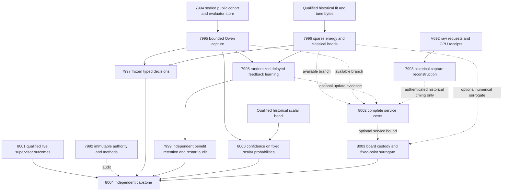

# Carnot Research Roadmap v693 — Sparse energy decisions and selective continuous learning

**Created:** 2026-10-01. **Milestone:** 2026.10.693.
**Status:** Planned; this task does not activate the milestone.
**Supersedes:** completed 2026.10.692. The sequence increments from 692 to 693.
The prior design is preserved in `research-roadmap-v692-preserved-20261001.md`.

The contract contains **13 tasks, Exp7992 through Exp8004**, in the exact order
at the end of this document. `research-roadmap-next.yaml` contains those tasks.
The active roadmap and `scripts/research_conductor.py` remain unchanged.

## What v692 proved

The completion archive ends at V691 at planning time. The active V692 YAML,
terminal artifacts and conductor log establish the completed scheduling boundary.
A conductor `OK` is not evidence that an experiment met its scientific gate.

| Experiment | Evidence | Limit |
|---|---|---|
| Exp7979 | Contract work and validation receipts exist | Required coverage failed; contract readiness is zero |
| Exp7980 | Public feature exports qualified for 604 eligible original responses | No sources entered the 96-slot reserved panel; complete exposure custody was unavailable |
| Exp7981 | Raw receipts record 212 completed Qwen judgments | Contradictory invocation evidence disqualified publication; all capture readiness fields are zero |
| Exp7982 | Small multivariate fitting qualified | Fitting is not a decision benefit |
| Exp7984 | Independent ablation qualified on 62 original evaluation groups | Added-information gate failed; full-feature Brier was worse than q-only in this development panel |
| Exp7983/7985/7986/7987 | Conductor skip records explain the dependency cascade | No reserved decision, causal acquisition, restart-benefit or confidence result |
| Exp7988 | Supervisor reduction recorded its prerequisites | Owned coverage failed; unchanged failed inventory scope is retired |
| Exp7989 | A service-cost primary exists | Post-test edits changed producer hashes; its original measurement cannot attest the changed code |
| Exp7990 | Board limits remain recorded | Stale service custody blocked qualification |
| Exp7991 | Missing and failed science was preserved | The capstone itself failed required validation |

These findings support three changes. Recover authentic raw observations under
a separate historical identity. Stop promising global non-exposure of public
training data. Test a new online-learning mechanism with explicit feedback
selection, while preserving equal-information static controls.

## Three largest gaps to the PRD

1. **Useful independent decisions — FR-06 and FR-12.** Source features did not
   add registered probability benefit. A trained energy head must earn its cost
   against classical controls with the same inputs. Exp7994–7997 test a sparse
   update-capable head on source-disjoint development observations.
2. **Durable causal learning — FR-11.** Recent milestones did not execute a
   qualified learning trajectory. Exp7998–8000 separate feedback acquisition,
   later decision benefit, retention, recovery and confidence. A finite replay
   cannot close the deployment-learning gap.
3. **Reproducible affordable deployment — FR-05/08/09/10 and NFR-01.** Provenance
   and mutable producer hashes repeatedly prevent valid downstream use.
   Exp7992/7993 qualify evidence boundaries. Exp8002/8003 measure full service
   costs and hardware compatibility. No Rust production port is claimed before
   a useful stable policy exists.

ARC remains the hidden-game live discovery destination. Exp8001 satisfies the
standing generalization slot through qualified supervisor outcomes. Response
support does not establish ARC transfer or improve the generator's weights.

## Research recorded before design

The V693 section at the start of `research-references.md` records the current
scan, including access failures and deliberate deferrals.

| Source | Experiment or decision |
|---|---|
| [Verify to Amplify, 2603.03538v5](https://arxiv.org/abs/2603.03538v5), revised September 2026 | Exp7998/7999 distinguish label access, soundness errors and later benefit |
| [ExAUL, 2506.14067v4](https://arxiv.org/abs/2506.14067v4), revised May 2026 | Exp7998 tests partial feedback with recorded propensities; no imported FDR theorem |
| [Local spline learning, 2602.02056v4](https://arxiv.org/abs/2602.02056v4), revised June 2026 | Exp7996/7998 train sparse updates; Exp8002/8003 measure their operation and numerical costs |
| [Delayed ACI, 2609.07251](https://arxiv.org/abs/2609.07251), September 2026 | Exp8000 compares current-state and issued-state confidence on identical point probabilities |
| [EBT, 2507.02092](https://arxiv.org/abs/2507.02092); [ARM–EBM, 2512.15605](https://arxiv.org/abs/2512.15605) | Keep small energy selectors and an algebraically identical classifier control |
| [NSVIF, 2601.17789](https://arxiv.org/abs/2601.17789) | Constraint feasibility does not certify extraction or natural-language truth |
| [Higher-order Ising, 2506.19964](https://arxiv.org/abs/2506.19964); [Extropic Z1T](https://extropic.ai/writing/z1t) | Exp8003 requires actual operation compatibility before device work |

The scan also covered hallucination detectors, constrained generation, KAN
continual learning, OpenReview, Hugging Face, GitHub trending and Kona.
Semantic Scholar citation endpoints failed for both seed papers. GitHub pages
were cached. The inspected Kona page supplies product context, not a local
reproduction recipe. No exhaustive novelty or current trending claim is made.
ETS steering, activation probes, new sampler sweeps and foundation-model
training remain deferred. Unchanged importance anchoring remains retired.

## Architecture

The predictor receives complete source/response bytes, a frozen Qwen judgment
and eight public lexical features. Human annotations reside in an evaluator
store. Only due selected feedback reaches the online learner. The trained
energy produces probabilities; a fixed cost rule produces typed actions.

## Phase 1 — Qualify inputs without a universal dependency

**Exp7992: Contract and methods.** Bind all thirteen executable tasks with
independent table, JSON and YAML readers. Reuse the parameterized authority
reader. Cover negative replay and publication-failure routes before running.
Preserve historical failures using immutable producer snapshots. This task
is not a prerequisite for every science branch.

**Exp7993: Historical capture custody.** Independently reconstruct the 212
recorded completions from source bytes, requests and raw inference receipts.
The new CPU aggregate declares zero current model calls. It preserves the
original disqualification. Missing evidence blocks recovery; a metadata edit
alone cannot qualify it. Test actual provenance classification across current,
historical, resumed and zero-call records.
