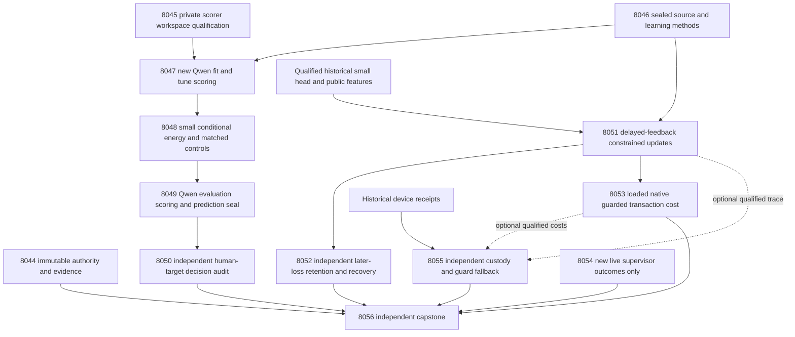
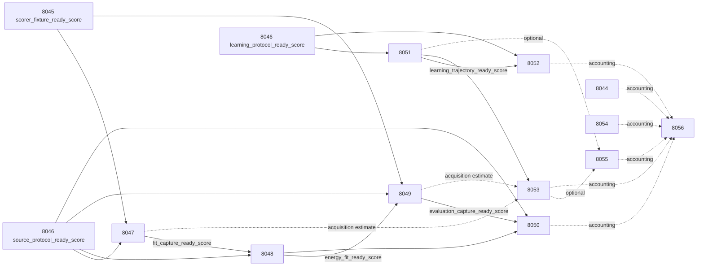

# Carnot Research Roadmap v697 — Qualified source evidence and feedback-constrained energy learning

**Created:** 2026-10-02. **Milestone:** 2026.10.697.
**Status:** Staged for conductor review; no activation or experiment execution by this plan.
**Supersedes:** completed scheduling for 2026.10.696; sequence 696 becomes 697.
**Informed by:** V696 terminal artifacts, failure history, PRD FR-06/11/12 and the dated literature scan.

The contract contains **13 tasks, Exp8044 through Exp8056**, in the exact order
shown below. The visible table, complete executable JSON and canonical task
hash agree with `research-roadmap-next.yaml`. The active roadmap remains V696.
The previous design is preserved byte-for-byte in
`research-roadmap-v696-preserved-20261002.md`.

## What v696 proved

Completion is a task disposition, not a scientific result. Current primary
bytes and terminal sidecars take precedence over intermediate changelog entries.
Earlier failures remain historical evidence; a later repair does not qualify an
old measurement retroactively.

| Experiment | Supported finding | Limit and next step |
|---|---|---|
| Exp8031 | Complete contract and invocation reader qualified | Circular-positive administrative result; preserve full planning authority |
| Exp8032 | Final primary is `complete_null_sealed_methods`, with both input branches ready | Earlier log says disqualified; retain both versions and original data exposure |
| Exp8033 | 128 target passes; fresh_full and reset_chunks each had zero duplicate drift | Owned pytest had 10 missing-parent setup errors; the primary stays disqualified |
| Exp8034–8037 | No source-decision experiment qualified | Exp8034 has a real gate-skip receipt at its shorter path; Exp8035–8037 have no primary or skip artifact |
| Exp8038 | Final primary qualifies delayed four-arm, 20-seed trajectories | Reproducible state changes alone do not establish benefit |
| Exp8039 | Independent audit reproduced learning and restart behavior | Recent64 cost gain 0.0020202 versus the required 0.02; safety and retention gates failed |
| Exp8040 | Native parity and durable transaction measurements qualified | Speedups 1.0476 and 0.9629 have intervals crossing 1 despite arithmetic near 17x |
| Exp8041 | No new authenticated live supervisor outcomes | No ARC gain; inspect only a new event delta |
| Exp8042 | CPU numerical fallback preserved decisions and restart | 221/27040 fallbacks, about 0.817%; no device execution or complete-service benefit |
| Exp8043 | All thirteen dispositions independently accounted for | Science blocked; historical `paper_ready=true` is distinct from `science_ready=false` |

The actual Exp8033 focused log identifies `FileNotFoundError` for
`/tmp/.../pytest/focused`: the parent validation workspace was missing.
Exp8045 repairs this specific cause; Exp8047 still must collect new live evidence.
Reset-only duplicate drift was 0.0335482 and fresh_chunks drift was 0.0003498.
No tolerance is relaxed to rescue those conditions.

The learning audit had 198 eligible later slots on one chronological development
trajectory. Its cost-gain interval was [-0.01840, 0.01960]; five seeds increased
false accepts, and retention cost failed for two recent64 seeds. The new question
is whether explicit acceptance constraints prevent harmful updates while retaining
useful adaptation. Another replay-window sweep is not justified.

## Three biggest gaps to the PRD vision

1. **Useful source-grounded decisions — FR-06/12.** Repeatable source sensitivity
   has not yet established correct typed decisions. Train a small conditional
   energy on qualified measurements and compare against the same-information
   logistic control using independent human targets.
2. **Persistent learning that improves later decisions — FR-11.** Updates and
   durable state work; future benefit and retention do not. Change candidate
   acceptance using released feedback, with an independent audit of later loss.
3. **Useful, reproducible deployment — FR-05/08/09/10, NFR-01.** Fast arithmetic
   has not yielded complete service speed. Charge guard checks, rejected updates,
   FFI, storage, restart and acquisition separately. Preserve device boundaries
   and the live ARC destination without claiming solves or hardware speedups.

A learned energy is a compatibility model. It does not make incomplete source
extraction or noisy human annotation mathematical ground truth. This milestone
advances finite development evidence; it cannot close the generalized verifier
or lifelong-learning claim. All tasks keep `generalized_learning_benefit_score=0`.

## Research recorded before design

The V697 section of `research-references.md` was written before this plan. It
covers all eight requested topics and all secondary channels, including access
limits. Semantic Scholar citation endpoints were inaccessible; GitHub Trending
was cached. No exhaustive citation or current trend ranking is claimed.

| Primary source | Local consequence |
|---|---|
| [GASP, July 2026](https://arxiv.org/abs/2607.04223) | Exp8047–8050 hold answers fixed, perturb sources, check duplicates in both conditions and evaluate independent full-source correctness |
| [LILAC+, May 2026](https://arxiv.org/html/2605.18842v1) | Exp8051 separates a proposed parameter update from an empirical acceptance check; its driving safety theorem does not transfer |
| [FedProTIP, September 2025](https://arxiv.org/html/2509.21606v1) | Constrained motion motivates a bounded small-head study; the local backtracking rule is an adaptation, not a federated-learning reproduction |
| [EBT, 2025](https://arxiv.org/abs/2507.02092) and [ARM–EBM v4, 2026](https://arxiv.org/abs/2512.15605) | Exp8048 compares small energies with matched classifiers and treats exact sigmoid equivalence as a control |
| [KAC, 2025](https://arxiv.org/abs/2503.21076) | Sparse fixed spline support supplies a cheap CPU learning substrate; image results do not establish text verification |
| [FPGA–ASIC co-design, 2026](https://arxiv.org/abs/2602.15985) and [Z1T, September 2026](https://extropic.ai/writing/z1t/) | Exp8053/8055 account for operation compatibility, transfer, guard fallback and storage; published estimates are not local timings |

OpenReview EBT/NRGPT/Energy Matching, ETS, Lagrange ONNs, CiteTracer,
OpenHalDet, KANLib and Kona are recorded leads. New decoder, solver or generator
training programs are deferred until the current decision signal qualifies.
Retired importance anchoring, generic external-text reranking, small-graph
sampler sweeps and repeated public ARC solves are not reopened.

## Architecture



Scoring workers see source bytes and supplied answers, never evaluator labels.
The small energy uses mean full-source NLL and no-source-minus-full NLL.
The CPU learner uses the existing qualified scalar/source feature geometry and
Exp8020 head, independently of the new likelihood branch. Its guard is a separate
set of already released feedback; it is not the future-test or retention set.

## Phase 1 — Qualify the measurement boundary and freeze methods

**Exp8044:** bind the thirteen-task full contract and current invocation. Preserve
V696 final and intermediate dispositions, actual skip receipts, changed validation
code and source bytes. Reuse existing parameterized readers; no scientific branch
depends on an administrative positive.

**Exp8045:** fix private validation parent creation, reproduce the original error,
and run the real scorer fixture from outside the checkout. Keep assertions,
100% changed-code coverage, artifact guards and the 1e-6 numerical gate. Freeze
fresh_full and the exact scorer hashes. This CPU-only task grants fixture
readiness, not model repeatability.

**Exp8046:** seal both scientific protocols before current evaluator access.
Retain original source roles fit64/tune32/evaluation96 and learning
stream256/retention64. All have historical development exposure. Freeze complete
label eligibility, source-cluster separation, budgets, costs and statistical tests.

Phase prototype: actual private CLI and immutable role/method manifests.
Validation: owned test venue, terminal replay and label-access order.
Adversarial controls: missing parent, stale logits, shifted target positions,
changed prompts/gates and future-label mutations.

## Phase 2 — Measure source information and calibrated decisions

**Exp8047:** score64 fit plus32 tune source groups through fresh_full. The first8
fit groups are a pilot within the same budget. Each group gets full_A, full_B,
no_source_A and no_source_B, separated by other sources and independent native
contexts. Cap384 target forwards,147456 target tokens and1800s model work.
Require complete answers of at most384 tokens and contexts of at most4096;
keep excluded slots instead of truncating text. Both duplicate conditions must
meet absolute mean-NLL drift<=1e-6 with exact alignment and normalization.

**Exp8048:** fit intercept, full-NLL-only logistic, two-feature logistic and a
small additive piecewise-linear spline energy. For binary unsupportedness use
E(x,0)=0, E(x,1)=-f(x), p(1|x)=sigmoid(f(x)). Fit-only group cross-validation
selects ridge from [.0001,.001,.01,.1,1]; tune calibrates affine logits. Freeze
knots, parameters and action thresholds before evaluation. Include length-only,
source-permutation and exact energy/sigmoid parity controls. Cap training600s.

**Exp8049:** score the96 reserved development groups with the same four views,
model identity, budgets and numerical checks. Seal all head predictions and
accept/reject/escalate decisions before evaluator access. It is a new measurement
on exposed sources, not a newly unseen external test.

**Exp8050:** independently reconstruct token features and frozen predictions,
then open complete human targets. Test source information and energy architecture
separately. Preserve every original source, exclusion, probability, action and cost.

Phase prototype: loadable small energy/classifier heads and token-level evidence.
Validation: source-disjoint roles, class support, convergence, calibration and
independent reduction. Adversarial controls: no-source duplicates, unknown labels,
source permutation, length-only shortcuts, sign errors and altered prediction seals.
A measured tie or loss qualifies measurement; readiness never requires winning.

## Phase 3 — Continuous self-learning with constrained commits

**Exp8051:** use the original qualified head and256-slot chronological stream.
Predictions reach durable storage before feedback arrives at original slot+20.
Before labels, hash each source ID modulo4: bucket0 is guard-only; other buckets
are update-only. Guard labels never enter gradients. Retention labels remain closed.

Run constrained, unconstrained and frozen arms for seeds101–120. Adaptive arms
share released labels, selected update IDs, step0.01, ridge0.001, four attempted
gradients per16 eligible update-role releases, and a64-step cap. Each arm computes
its candidate from its own current state. No updates start until the released
guard contains8 rows with2/class. Cap numerical work900s.

For the constrained arm, test alpha=[1,.5,.25,.125,0] on the proposed displacement.
On ALL released guard rows, candidate mean Brier and typed cost cannot exceed
the frozen initial head by more than1e-12; no source can become a new false accept.
Commit the largest admissible alpha. If none qualifies after guard expansion,
restore the frozen head. The unconstrained arm computes identical diagnostics
but commits alpha1. Count gradients, rejected steps, guard scans and resets as
work. Passing this finite empirical guard gives no future-safety guarantee.

**Exp8052:** independently reconstruct candidate updates, accepted coefficients
and all later decisions. Score the primary on update-role future slots only;
guard-role future predictions are secondary. Audit retention after sealing final
heads, and exercise process crashes around issue, release, acceptance and commit.

Phase prototype: fixed-support sparse energy updates with durable acceptance state.
Validation: common information and attempted gradients, disjoint guard/training
roles, subsequent loss, independent retention and exactly-once recovery.
Adversarial controls: destructive update, no-op, empty/one-class guard, future-label
mutation and duplicate commits. An always-frozen learner cannot earn benefit credit.

## Phase 4 — Account for deployment and close each evidence branch

**Exp8053:** qualify the actual loaded Rust/PyO3 kernel and atomic-inode regression,
then measure guard scans, line search, accepted/rejected/reset work, FFI, storage
and reload. Use5 warmups plus30 randomized paired repetitions per observed class,
within600s. Absent classes stay absent; synthetic controls are labeled separately.
Require numerical parity1e-10 and exact discrete acceptance/actions/restart.
Acquisition receipts may support an accounting estimate, not an end-to-end claim
across unrelated cohorts. External feedback-provider costs remain unmeasured.

**Exp8054:** read only new authenticated live trajectory-supervisor outcomes after
Exp8041's frontier. Empty delta gives an immediate valid null. A proposed curated
arm selection change needs10 closed firings across3 games. Carry observational
limits, registry status and original solve provenance. No game execution, new arm,
submission or registered-level re-solve occurs.

**Exp8055:** retain each board's independent custody. If a current learning trace
qualifies, extend24-bit state/32-bit accumulator error bounds to guard predicates,
alpha selection and reset as well as typed decisions. Uncertain predicates fall
back to float64 BEFORE commit. Require containment, exact acceptance/action parity,
no unhandled overflow and identical restart. No device execution; absent numeric
inputs block only that sub-study and do not erase authentic historical custody.

**Exp8056:** reduce every actual disposition and primitive result. Decide the
three PRD gaps separately; preserve historical publication gates independently.
Missing external science is terminal blocked, not partial. A qualified reader can
finish while science remains blocked. Write the outcome note and scoped retirement
conditions; no default change or publication follows automatically.

Phase prototype: real native transactions, CPU interval/fallback replay and
independent evidence readers. Validation: normal process exits, complete component
costs, guard/decision parity and exact task accounting. Adversarial controls:
corrupted updates, atomic replacement, threshold ambiguity and absent primaries.

## Scientific acceptance contract

Freeze these choices in Exp8046 before current evaluator reads. The cost of an
unsupported accept is5, a supported reject1, escalation0.5 and a correct decision0.
The predicted probability is unsupportedness: accept below0.1, reject above0.5,
otherwise escalate, including ties. Thresholds are not tuned on evaluation data.

| Primary | Comparison and margin | Additional safeguards |
|---|---|---|
| H1: source information | Two-feature logistic vs full-NLL-only; Brier gain>=.01 | Cost increase<=.01; no added false accepts |
| H2: energy architecture | Spline vs two-feature logistic; cost gain>=.02 | Brier increase<=.01; no added false accepts;>=5 beneficial changed source decisions |
| H3: constrained learning | Constrained vs unconstrained; later cost gain>=.02 | No per-seed false-accept increase vs unconstrained OR frozen;>=5 beneficial changed source decisions; retention gates |

Fit needs48 complete groups with8/class; tune24 with4/class; evaluation72 with8/class.
H3 needs120 eligible later update-role source groups with15/class on common slots,
after the common first update and before each source's label release. Retention
needs48 complete groups with8/class. For BOTH adaptive arms, retention Brier
increase must be<=.01 and cost increase<=.02 relative to frozen. The stricter
support after reserving guard rows may block H3; do not lower floors after seeing it.

Use10000 paired source-group bootstrap draws for H1/H2. H3 uses paired moving
blocks over the original256-slot timeline, length32, with16/64 sensitivity and
all guard/excluded/censored masks retained. Average seeds within sampled source
trajectories. Invert one-sided tests at the nonzero margins; apply Holm .05 over
exactly H1/H2/H3. An absent, disqualified or safety-failing hypothesis has p=1.
Report descriptive intervals even when a claim fails. These are conditional
finite-development uncertainty estimates, not independent deployment replications.
Unknown labels remain unknown. Duplicate calls, seeds and draws add no independent n.

## Dependency graph and execution order

Conductor order is Exp8044–Exp8056. Every solid edge below is a structured gate
with readiness=1, verdict_class in [positive,null], and flagged_adversarial=false.
The producer's REQUIRED ARTIFACT FIELDS names the exact field. Dashed edges are
optional inputs or accounting; they do not cascade-block independent readers.



8044/8045/8046/8054/8055/8056 have no structured upstream gate. A GPU failure
cannot block the learning branch. A numerical failure cannot erase board custody.
Capstone reads failed, skipped and absent tasks as well as completed measurements.
Historical inputs are authenticated data, not retired upstream `requires:` chains.

## Hardware, model and runtime requirements

| Resource | Task and scope | Constraint |
|---|---|---|
| CPU and RAM | Protocols, small-head fitting, replay, audits, guard acceptance | Fixed-size sparse heads and buffers; no generator training |
| Existing RTX3090 pair,24GB each | Exp8047 and Exp8049 | One leased available CUDA device; resolve UUID/index and reserve actual free memory; no forced dual-GPU run |
| `unsloth/Qwen3.8-27B-GGUF`, Q4_K_M | Both LLM tasks | Hash cached GGUF, revision and embedded tokenizer/template; cache miss blocks |
| KV260 | Exp8055 custody | Authenticated SSH-accessed fabric scope, k_max<=5; no board operation |
| PolarFire | Exp8055 custody | Linux CPU-only dispatch remains distinct from fabric |
| GateMate | Exp8055 custody | Unchanged0xffffffff physical/JTAG block; no repeated probe |
| NPU/TSU and wishlist devices | Exp8055 compatibility analysis | No local execution or purchase recommendation without a measured useful bottleneck |

Exp8047/8049 score supplied tokens and declare `model_load_no_generation` with
the2s diagnostic floor, `generated_tokens=0`, and exact MODEL_SPECS. Generation
APIs are prohibited. Any future bounded generation would require the10s class;
real full generation requires60s. Duration is measured, never padded to a floor.
CPU tasks declare `no_model_load` and empty MODEL_SPECS; imported Qwen features
are not current model calls. Legacy small models supply no headline evidence.

Small energy arithmetic and guard scans have a CPU/native SIMD path. Exp8053
measures whether that helps a complete durable numerical transaction. Exp8055
bounds a hypothetical100x compatible-arithmetic accelerator including fallback,
storage and unmeasured transfer. There is no promised100x service gain: if host
or acquisition costs dominate, redesign or defer hardware rather than claim it.

The YAML estimates allocate bounded tasks below the4800s conductor hard cap.
Every task requires flushed phase boundaries, before/after expensive calls and
progress inside loops or while children run at least every60s. Keep gaps below600s.
Write files over about200 lines across several bounded tool calls with progress
between them. Preflight missing resources and exact failing gates produce terminal
`blocked`, never a retryable `partial`. Allow time for required final validation.

## Validation, failure lineage and continuation

All tasks carry four-field `prior_failures`, including
`retire_if_same_verdict: true`. They identify changed mechanism or prerequisite;
old measurements and missing artifacts are not rewritten. Standing2026-05-29
overrides are confined to legitimate transition, board or versioned continuations.
No new ID reuses a retired ID, and no gate references an older milestone task.

Before activation, validate schema, full task equality, digest, count/order,
producer gate-field spelling, source paths, failure lineage, exclusion manifest,
harness fit, ARC generalization floor and overdue priorities. Use existing unit
and private CLI tests, including applicable E2E-018 authority lifecycle routes.
This planning change adds no experiment implementation. Its direct E2E is a
round trip through the real parameterized design/authority readers with matching
and deliberately mismatched staged/activated inputs in private scratch.

For later implementation, every prompt requires spec-first/test-first work,
100% changed statement coverage, scoped lint/type/spec checks, applicable CLI/E2E,
independent raw reduction and validation of terminal published bytes. Repository
health failures are recorded separately from the frozen owned validation manifest.
A substantive repeated failure retires that scope even if its verdict is renamed.
Reopening requires a changed prerequisite or mechanism, not merely another ID.

## Exact task contract

The following table and JSON are generated from the same complete task objects as
`research-roadmap-next.yaml`. The JSON includes full prompts, routing, models,
gates, failure lineage and deliverables; it is not a shortened aspirational list.

| Order | ID | Title | Phase | Deliverable |
|---|---|---|---|---|
| 1 | `exp8044-contract-methods` | Bind thirteen tasks and preserve terminal V696 evidence | 1 | `results/experiment_8044_v697_contract_methods.json` |
| 2 | `exp8045-scorer-workspace` | Qualify scorer validation workspaces before new model calls | 1 | `results/experiment_8045_v697_scorer_workspace.json` |
| 3 | `exp8046-branch-protocols` | Seal source decisions and feedback acceptance before evaluator access | 1 | `results/experiment_8046_v697_branch_protocols.json` |
| 4 | `exp8047-fit-score-capture` | Capture repeatable Qwen fit and tune source likelihoods | 2 | `results/experiment_8047_v697_fit_score_capture.json` |
| 5 | `exp8048-source-energy-fit` | Fit calibrated source energies with identical-information controls | 2 | `results/experiment_8048_v697_source_energy_fit.json` |
| 6 | `exp8049-evaluation-score-capture` | Capture reserved Qwen evaluation scores with frozen heads | 2 | `results/experiment_8049_v697_evaluation_score_capture.json` |
| 7 | `exp8050-source-decision-audit` | Independently test source information and calibrated decisions | 2 | `results/experiment_8050_v697_source_decision_audit.json` |
| 8 | `exp8051-feedback-constrained-learning` | Learn persistent energy updates with released-feedback acceptance checks | 3 | `results/experiment_8051_v697_feedback_constrained_learning.json` |
| 9 | `exp8052-learning-benefit-audit` | Audit future learning benefit retention and crash recovery independently | 3 | `results/experiment_8052_v697_learning_benefit_audit.json` |
| 10 | `exp8053-guarded-transaction-cost` | Measure accepted and rejected update costs through the native binding | 4 | `results/experiment_8053_v697_guarded_transaction_cost.json` |
| 11 | `exp8054-arc-supervisor-delta` | Review new live ARC supervisor outcomes for transferable refinement | 4 | `results/experiment_8054_v697_arc_supervisor_delta.json` |
| 12 | `exp8055-hardware-guard-boundary` | Preserve board custody and bound guarded-update hardware compatibility | 4 | `results/experiment_8055_v697_hardware_guard_boundary.json` |
| 13 | `exp8056-capstone` | Decide source utility retained learning and deployability from primitive evidence | 4 | `results/experiment_8056_v697_capstone.json` |

Canonical full-task SHA-256: `b12e3fa3eeecee5193d1b07d965f4e791941a69e37bae6ec74ce4e1b9dd3b6ca`.

<!-- V697_TASK_CONTRACT_START -->
```json
{"milestone": "2026.10.697", "milestone_title": "Qualified source evidence and feedback-constrained energy learning", "milestone_doc": "openspec/change-proposals/research-roadmap-vNEXT.md","canonical_tasks_sha256":"b12e3fa3eeecee5193d1b07d965f4e791941a69e37bae6ec74ce4e1b9dd3b6ca","tasks":[
{"id":"exp8044-contract-methods","title":"Bind thirteen tasks and preserve terminal V696 evidence","phase":1,"track":"science","priority":"high","requires_gpu":false,"max_turns":100,"estimated_wall_time_min":20,"per_unit_rows":true,"milestone":"2026.10.697","deliverable":"results/experiment_8044_v697_contract_methods.json","inference_substrate_class":"no_model_load","MODEL_SPECS":[],"gated_on":[],"prior_failures":[{"experiment_id":"exp8043-capstone","verdict":"complete_blocked_v696_capstone","addressed_by":"Complete V697 authority and independent task branches preserve the scorer failure without requiring scientific success for administrative readiness.","retire_if_same_verdict":true}],"agent_type":"claude","model":"opus","operator_override":"2026-05-29 operator directive (standing): routine milestone continuation vs exp8043 and exp7992; use complete V697 authority and preserve immutable V696 evidence.","prompt":"CONTEXT:\nWork in {project_root} on {date}. V696 qualified its contract reader but its capstone remained blocked. Current Exp8032 and Exp8038 primaries were repaired to null after earlier disqualified log entries. Read final bytes plus sidecars and preserve both historical dispositions. Planning completion is not science.\nEXISTING CODE TO READ FIRST:\nCLAUDE.md; CODEX.md; ops/e2e-test-plan.md; openspec/capabilities/research-reporting/spec.md; scripts/experiment_template.py; python/carnot/reporting/current_work_receipt.py; python/carnot/reporting/primary_publication.py; python/carnot/reporting/roadmap_contract.py; python/carnot/reporting/v685_authority_lifecycle.py; python/carnot/reporting/v696_capstone.py; results/experiment_8031_v696_contract_methods.json; results/experiment_8043_v696_capstone.json; openspec/change-proposals/research-roadmap-vNEXT.md; openspec/change-proposals/research-roadmap-v696-preserved-20261002.md; research-references.md V697 scan; ops/exclusion_manifest.yaml\nTASK:\nBind thirteen tasks and preserve terminal V696 evidence. Deliver results/experiment_8044_v697_contract_methods.json, durable primitive evidence under results/raw/experiment_8044_v697_contract_methods/ and thin runnable scripts/experiments/experiment_8044_v697_contract_methods.py.\nCONCRETE STEPS:\n0. PRECONDITIONS (before subsequent work): print a flushed start line; verify named local inputs, terminal sidecars, Python environment and required tooling with bounded commands. Missing resources produce complete_blocked_<resource>, verdict_class=blocked and exact gate_check_summary; do not manufacture missing evidence.\n1. Emit a flushed progress line at each phase boundary and before and after any model load, generation, benchmark or subprocess. Use PYTHONUNBUFFERED=1 and print(..., flush=True). Print real elapsed time, completed units and pending work inside long loops and at least every 60 seconds while a child runs; keep every gap under 600 seconds. Bound individual tool calls. Write any file over about 200 lines in several tool calls of at most about 150 lines, with a progress message between calls. Never pad duration or invent progress.\n2. Read the named code and add the applicable REQ-* and SCENARIO-* specification before implementation. Write failing traced tests first. Reuse shipped modules and thin runners. Freeze input identities, code/configuration, statistical methods and bounded budgets before measuring. Private validation children use scratch outside results/ with parent directories created before invocation and the artifact guard enabled. Preserve every original failure and measurement.\n3. Reuse parameterized authority readers with milestone=2026.10.697, first_id=8044, count=13. Compare the visible table, full embedded JSON, canonical tasks digest and immutable actual invocation YAML. Consumed staging is an observation, not a reason to demand a vanished path or manufacture activation.\n4. Snapshot original V696 authority and final primary/terminal sidecar bytes; record prior intermediate verdicts separately. Preserve the real Exp8034 skip path and absent Exp8035–8037 artifacts. Never create retrospective results.\n5. Freeze the exact validation manifest before running checks; reproduce all twelve authority mutations with private fixtures, including altered prompt, gate field, model, date, digest and consumed staging. No scientific task gates on this administrative reader alone.\n6. Map GASP, LILAC+ and FedProTIP to the concrete code steps in this roadmap; list non-transferring assumptions and deferred EBT/ETS/hardware directions. Verify all failure entries against current primaries or actual skip receipts; record absent evidence rather than inventing a verdict.\n7. Run task-owned unit and consumer tests, scoped Ruff check/format, strict mypy and scripts/check_spec_coverage.py on the actual test paths. Require 100% changed statement coverage including real CLI routes and normal process exits. Save argv, expected/actual exit codes, code hashes and durable logs. Use only bounded repository-health diagnostics; record unrelated failures separately from the frozen task-owned acceptance manifest. Rerun affected measurements after a code/configuration change. Applicable E2E: E2E-018 private authority lifecycle tests and parameterized V697 activation/mutation CLI.\n8. Independently cold-reduce raw rows in a fresh process; check candidate and published bytes with scripts/adversarial_verify.py and scripts/verdict_row_consistency_lint.py --strict. Use the existing primary publication helper and a terminal validation sidecar. Keep raw references durable under this task's raw directory, with shards below 90 MB. Reconcile openspec, _bmad/traceability.md, ops/status.md and ops/changelog.md. External missing inputs are terminal blocked, never partial. Preserve production defaults; no external publication.\nREQUIRED ARTIFACT FIELDS:\n- experiment_id, task_id, milestone, schema, run_date={date}, claim_scope: principle: bind the claim to this invocation and its actual evidence boundary.\n- honest_verdict: terminal complete_* string; verdict_class: positive | circular_positive | null | blocked | disqualified | partial. principle: only incomplete owned work is partial; unchanged external blocks are terminal and oracle controls are circular_positive.\n- gate_check_summary: list of upstream ID, path, sha256, check_name, artifact_field, expected, observed and passed. principle: every blocked verdict names the failed operand; missing fields are contract errors, never measured zeros.\n- rows or per_game_results, sample_size_budget, intended_count, eligible_count, completed_count, excluded_count, failed_count, censored_count, independent_count: principle: emit each source/arm/seed/condition metric and exclusion with its numerator and denominator; duplicate calls and seeds do not enlarge independent n.\n- random_seed, reproducibility_checksum, cited_upstream_artifacts, code_config_hashes, raw_shard_hashes, checkpoint_references: principle: reproducibility binds original bytes rather than mutable summaries.\n- acceptance_gate_results, verifier_is_oracle, genuine_headroom, positive_control_results, generalized_learning_benefit_score=0: principle: empirical controls and exposed development evidence cannot certify deployment correctness.\n- validation_receipts, coverage_statement_counts, terminal_validation_sidecar_path, flagged_adversarial, field_principles: principle: the final artifact and process exits must qualify, with the purpose of every added field recorded.\n- preconditions_checked, inference_substrate, inference_substrate_class, MODEL_SPECS, model_specs, model_invocation_counts, trained_head_specs, duration_s, phase_spans: principle: report actual present work separately from imported historical measurements.\n- contract_ready_score: integer 0 or 1. principle: readiness requires qualified measurement and all owned checks; it does not require a scientific win.\n- contract_rows, canonical_tasks_sha256, authority_snapshots, historical_disposition_rows, method_source_map, activation_observation: principle: full prompt authority and authentic historical failures travel with later decisions.\n- substrate_declaration: aggregation_from_upstream_artifacts for reduction, verifier_scoring for CPU numerical work; no_model_load; MODEL_SPECS=[]; zero pretrained model calls. principle: cached features and small-head training do not constitute a new LLM invocation.\nRun command: cd {project_root} && PYTHONUNBUFFERED=1 JAX_PLATFORMS=cpu .venv/bin/python -u scripts/experiments/experiment_8044_v697_contract_methods.py --date {date}\nDo NOT push. Do NOT modify scripts/research_conductor.py.\n"},
{"id":"exp8045-scorer-workspace","title":"Qualify scorer validation workspaces before new model calls","phase":1,"track":"science","priority":"high","requires_gpu":false,"max_turns":100,"estimated_wall_time_min":25,"per_unit_rows":true,"milestone":"2026.10.697","deliverable":"results/experiment_8045_v697_scorer_workspace.json","inference_substrate_class":"no_model_load","MODEL_SPECS":[],"gated_on":[],"prior_failures":[{"experiment_id":"exp8033-scoring-isolation","verdict":"complete_disqualified_scoring_isolation","addressed_by":"Create actual pytest parent workspaces and test external-CWD CLI execution; retain all assertions and the 1e-6 drift gate, then require new live captures.","retire_if_same_verdict":true}],"agent_type":"claude","model":"opus","prompt":"CONTEXT:\nWork in {project_root} on {date}. Exp8033 recorded fresh_full and reset_chunks duplicate drift zero, but focused pytest had 10 FileNotFoundError setup errors because /tmp/.../pytest did not exist. The primary is disqualified. Fix this diagnosed workspace fault before any new live measurement; preserve the old result.\nEXISTING CODE TO READ FIRST:\nCLAUDE.md; CODEX.md; ops/e2e-test-plan.md; openspec/capabilities/research-reporting/spec.md; scripts/experiment_template.py; python/carnot/reporting/current_work_receipt.py; python/carnot/reporting/primary_publication.py; python/carnot/experiment_8033_v696_scoring_isolation.py; python/carnot/inference/scoring_isolation_8033.py; python/carnot/inference/likelihood_isolation_runtime_8033.py; tests/python/test_scoring_isolation_8033.py; results/raw/experiment_8033_v696_scoring_isolation/validation_logs/01_focused_pytest.log; python/carnot/reporting/experiment_7303_validation_scope.py\nTASK:\nQualify scorer validation workspaces before new model calls. Deliver results/experiment_8045_v697_scorer_workspace.json, durable primitive evidence under results/raw/experiment_8045_v697_scorer_workspace/ and thin runnable scripts/experiments/experiment_8045_v697_scorer_workspace.py.\nCONCRETE STEPS:\n0. PRECONDITIONS (before subsequent work): print a flushed start line; verify named local inputs, terminal sidecars, Python environment and required tooling with bounded commands. Missing resources produce complete_blocked_<resource>, verdict_class=blocked and exact gate_check_summary; do not manufacture missing evidence.\n1. Emit a flushed progress line at each phase boundary and before and after any model load, generation, benchmark or subprocess. Use PYTHONUNBUFFERED=1 and print(..., flush=True). Print real elapsed time, completed units and pending work inside long loops and at least every 60 seconds while a child runs; keep every gap under 600 seconds. Bound individual tool calls. Write any file over about 200 lines in several tool calls of at most about 150 lines, with a progress message between calls. Never pad duration or invent progress.\n2. Read the named code and add the applicable REQ-* and SCENARIO-* specification before implementation. Write failing traced tests first. Reuse shipped modules and thin runners. Freeze input identities, code/configuration, statistical methods and bounded budgets before measuring. Private validation children use scratch outside results/ with parent directories created before invocation and the artifact guard enabled. Preserve every original failure and measurement.\n3. Reproduce the missing parent failure on a private fixture, then ensure each owned validation workspace parent exists before its pytest child launches. Do not alter pytest assertions, lower coverage, change duplicate tolerance, or disable the artifact guard.\n4. Exercise the existing fresh_full controller with independent fake contexts, owned copied logits, complete target token alignment and normal child exit. Tests must detect stale native views, shifted positions, missed resets, missing input and corrupted shard hashes. Repair only the changed runner boundary and directly affected tests.\n5. Freeze fresh_full as the sole live condition for Exp8047 and Exp8049; use the embedded GGUF tokenizer and no generation. Record exact scorer and runtime hashes. Do not choose among conditions using new evaluation outcomes.\n6. Run the real CPU fixture CLI from outside the repository with ambient PYTHONPATH removed; pass the original focused suite, consumer suite, combined CLI coverage and replay. scorer_fixture_ready_score certifies only code/fixture qualification, never live repeatability. Current model invocation count is zero.\n7. Run task-owned unit and consumer tests, scoped Ruff check/format, strict mypy and scripts/check_spec_coverage.py on the actual test paths. Require 100% changed statement coverage including real CLI routes and normal process exits. Save argv, expected/actual exit codes, code hashes and durable logs. Use only bounded repository-health diagnostics; record unrelated failures separately from the frozen task-owned acceptance manifest. Rerun affected measurements after a code/configuration change. Applicable E2E: task-owned private CLI valid/null/blocked/tampered paths.\n8. Independently cold-reduce raw rows in a fresh process; check candidate and published bytes with scripts/adversarial_verify.py and scripts/verdict_row_consistency_lint.py --strict. Use the existing primary publication helper and a terminal validation sidecar. Keep raw references durable under this task's raw directory, with shards below 90 MB. Reconcile openspec, _bmad/traceability.md, ops/status.md and ops/changelog.md. External missing inputs are terminal blocked, never partial. Preserve production defaults; no external publication.\nREQUIRED ARTIFACT FIELDS:\n- experiment_id, task_id, milestone, schema, run_date={date}, claim_scope: principle: bind the claim to this invocation and its actual evidence boundary.\n- honest_verdict: terminal complete_* string; verdict_class: positive | circular_positive | null | blocked | disqualified | partial. principle: only incomplete owned work is partial; unchanged external blocks are terminal and oracle controls are circular_positive.\n- gate_check_summary: list of upstream ID, path, sha256, check_name, artifact_field, expected, observed and passed. principle: every blocked verdict names the failed operand; missing fields are contract errors, never measured zeros.\n- rows or per_game_results, sample_size_budget, intended_count, eligible_count, completed_count, excluded_count, failed_count, censored_count, independent_count: principle: emit each source/arm/seed/condition metric and exclusion with its numerator and denominator; duplicate calls and seeds do not enlarge independent n.\n- random_seed, reproducibility_checksum, cited_upstream_artifacts, code_config_hashes, raw_shard_hashes, checkpoint_references: principle: reproducibility binds original bytes rather than mutable summaries.\n- acceptance_gate_results, verifier_is_oracle, genuine_headroom, positive_control_results, generalized_learning_benefit_score=0: principle: empirical controls and exposed development evidence cannot certify deployment correctness.\n- validation_receipts, coverage_statement_counts, terminal_validation_sidecar_path, flagged_adversarial, field_principles: principle: the final artifact and process exits must qualify, with the purpose of every added field recorded.\n- preconditions_checked, inference_substrate, inference_substrate_class, MODEL_SPECS, model_specs, model_invocation_counts, trained_head_specs, duration_s, phase_spans: principle: report actual present work separately from imported historical measurements.\n- scorer_fixture_ready_score: integer 0 or 1. principle: readiness requires qualified measurement and all owned checks; it does not require a scientific win.\n- scorer_code_hashes, fixed_condition=fresh_full, original_failure_log, repaired_workspace_receipts, token_alignment_control_rows, current_model_invocation_count=0: principle: a repaired test venue must not retroactively qualify disqualified model output.\n- substrate_declaration: aggregation_from_upstream_artifacts for reduction, verifier_scoring for CPU numerical work; no_model_load; MODEL_SPECS=[]; zero pretrained model calls. principle: cached features and small-head training do not constitute a new LLM invocation.\nRun command: cd {project_root} && PYTHONUNBUFFERED=1 JAX_PLATFORMS=cpu .venv/bin/python -u scripts/experiments/experiment_8045_v697_scorer_workspace.py --date {date}\nDo NOT push. Do NOT modify scripts/research_conductor.py.\n"},
{"id":"exp8046-branch-protocols","title":"Seal source decisions and feedback acceptance before evaluator access","phase":1,"track":"science","priority":"high","requires_gpu":false,"max_turns":50,"estimated_wall_time_min":25,"per_unit_rows":true,"milestone":"2026.10.697","deliverable":"results/experiment_8046_v697_branch_protocols.json","inference_substrate_class":"no_model_load","MODEL_SPECS":[],"gated_on":[],"prior_failures":[{"experiment_id":"exp8039-learning-benefit-audit","verdict":"complete_null_learning_benefit","addressed_by":"Replace window selection with a disjoint released-feedback acceptance check, explicit backtracking and rollback; retain independent future-loss and retention tests.","retire_if_same_verdict":true},{"experiment_id":"exp8026-learning-retention-audit","verdict":"complete_disqualified_learning_retention_audit","addressed_by":"Seal current evaluator access before use and disclose original exposure instead of calling a previously inspected retention set unseen.","retire_if_same_verdict":true}],"agent_type":"codex","model":"gpt-6.1-sol","prompt":"CONTEXT:\nWork in {project_root} on {date}. Exp8032 now has complete_null_sealed_methods and qualified source/learning custody. V696 learned replay-window trajectories but failed future-cost, per-seed false-accept and retention gates. Reuse the original public source slots and freeze a different update-acceptance rule before opening current evaluator labels. All reused cohorts have historical development exposure.\nEXISTING CODE TO READ FIRST:\nCLAUDE.md; CODEX.md; ops/e2e-test-plan.md; openspec/capabilities/research-reporting/spec.md; scripts/experiment_template.py; python/carnot/reporting/current_work_receipt.py; python/carnot/reporting/primary_publication.py; python/carnot/experiment_8032_v696_sealed_methods.py; python/carnot/experiment_8019_v695_eligible_targets.py; python/carnot/verify/windowed_online_8038.py; python/carnot/verify/learning_benefit_8039.py; results/experiment_8032_v696_sealed_methods.json; results/experiment_8039_v696_learning_benefit_audit.json; results/experiment_8020_v695_qualified_energy_fit.json; research-references.md V697 scan\nTASK:\nSeal source decisions and feedback acceptance before evaluator access. Deliver results/experiment_8046_v697_branch_protocols.json, durable primitive evidence under results/raw/experiment_8046_v697_branch_protocols/ and thin runnable scripts/experiments/experiment_8046_v697_branch_protocols.py.\nCONCRETE STEPS:\n0. PRECONDITIONS (before subsequent work): print a flushed start line; verify named local inputs, terminal sidecars, Python environment and required tooling with bounded commands. Missing resources produce complete_blocked_<resource>, verdict_class=blocked and exact gate_check_summary; do not manufacture missing evidence.\n1. Emit a flushed progress line at each phase boundary and before and after any model load, generation, benchmark or subprocess. Use PYTHONUNBUFFERED=1 and print(..., flush=True). Print real elapsed time, completed units and pending work inside long loops and at least every 60 seconds while a child runs; keep every gap under 600 seconds. Bound individual tool calls. Write any file over about 200 lines in several tool calls of at most about 150 lines, with a progress message between calls. Never pad duration or invent progress.\n2. Read the named code and add the applicable REQ-* and SCENARIO-* specification before implementation. Write failing traced tests first. Reuse shipped modules and thin runners. Freeze input identities, code/configuration, statistical methods and bounded budgets before measuring. Private validation children use scratch outside results/ with parent directories created before invocation and the artifact guard enabled. Preserve every original failure and measurement.\n3. Bind historical source roles fit64/tune32/evaluation96 and learning stream256/retention64 by original source-cluster identity. Freeze all overlaps, public eligibility, unknown-target rules and evaluator access boundaries before current label reads. Do not assert these sources are unseen; no new cohort selection based on errors.\n4. For source scoring freeze full_A/full_B/no_source_A/no_source_B, independent native contexts, complete answer limit384 tokens, prompt context limit4096, no truncation, duplicate absolute mean-NLL tolerance1e-6 in both conditions and valid token normalization. Keep failed/oversized slots in denominators. Freeze fit minimum48 with8/class, tune24 with4/class, evaluation72 with8/class.\n5. For learning retain the qualified Exp8020 head and fixed geometry. Labels release at original slot+20 after durable prediction. Hash each source ID modulo4 before labels: bucket0 is guard-only, others update-only. All adaptive arms see identical released labels, four candidate gradient steps per16 update-role releases, step0.01/ridge0.001, cap64 steps, seeds101–120. Guard data never supplies gradients.\n6. Freeze three arms: unconstrained candidate commit; feedback-constrained commit; frozen no-write. Both adaptive arms compute all identical guard diagnostics. Start updates only after at least8 guard rows including2/class are released. Compare candidates theta+alpha*delta at alpha=[1,.5,.25,.125,0] with the frozen initial head on ALL released guard rows: mean Brier and mean typed cost cannot increase beyond1e-12, and no row may become a new false accept. Pick largest admissible alpha; if none, restore the frozen head. Record reset and rejection distinctly. These checks guarantee only empirical guard behavior.\n7. Freeze unsupported accept cost5, supported reject1, escalate0.5 and correct0; p denotes unsupportedness, so accept p<.1, reject p>.5, else escalate. H1: source-feature logistic Brier improvement>=.01 vs full-NLL-only; H2: spline cost improvement>=.02 vs same-feature logistic; H3: constrained learner later cost improvement>=.02 vs unconstrained. Preserve safety, retention and support gates described in the design.\n8. Freeze 10000 paired source-group draws for H1/H2 and chronological moving-block draws length32 (16/64 sensitivity) for H3; one-sided margin tests and Holm .05 over all three, unavailable/invalid hypothesis p=1. Development uncertainty stays conditional. Verify future-label mutation cannot alter any earlier selection, gradient, candidate acceptance or durable prediction.\n9. Run task-owned unit and consumer tests, scoped Ruff check/format, strict mypy and scripts/check_spec_coverage.py on the actual test paths. Require 100% changed statement coverage including real CLI routes and normal process exits. Save argv, expected/actual exit codes, code hashes and durable logs. Use only bounded repository-health diagnostics; record unrelated failures separately from the frozen task-owned acceptance manifest. Rerun affected measurements after a code/configuration change. Applicable E2E: task-owned private CLI valid/null/blocked/tampered paths.\n10. Independently cold-reduce raw rows in a fresh process; check candidate and published bytes with scripts/adversarial_verify.py and scripts/verdict_row_consistency_lint.py --strict. Use the existing primary publication helper and a terminal validation sidecar. Keep raw references durable under this task's raw directory, with shards below 90 MB. Reconcile openspec, _bmad/traceability.md, ops/status.md and ops/changelog.md. External missing inputs are terminal blocked, never partial. Preserve production defaults; no external publication.\nREQUIRED ARTIFACT FIELDS:\n- experiment_id, task_id, milestone, schema, run_date={date}, claim_scope: principle: bind the claim to this invocation and its actual evidence boundary.\n- honest_verdict: terminal complete_* string; verdict_class: positive | circular_positive | null | blocked | disqualified | partial. principle: only incomplete owned work is partial; unchanged external blocks are terminal and oracle controls are circular_positive.\n- gate_check_summary: list of upstream ID, path, sha256, check_name, artifact_field, expected, observed and passed. principle: every blocked verdict names the failed operand; missing fields are contract errors, never measured zeros.\n- rows or per_game_results, sample_size_budget, intended_count, eligible_count, completed_count, excluded_count, failed_count, censored_count, independent_count: principle: emit each source/arm/seed/condition metric and exclusion with its numerator and denominator; duplicate calls and seeds do not enlarge independent n.\n- random_seed, reproducibility_checksum, cited_upstream_artifacts, code_config_hashes, raw_shard_hashes, checkpoint_references: principle: reproducibility binds original bytes rather than mutable summaries.\n- acceptance_gate_results, verifier_is_oracle, genuine_headroom, positive_control_results, generalized_learning_benefit_score=0: principle: empirical controls and exposed development evidence cannot certify deployment correctness.\n- validation_receipts, coverage_statement_counts, terminal_validation_sidecar_path, flagged_adversarial, field_principles: principle: the final artifact and process exits must qualify, with the purpose of every added field recorded.\n- preconditions_checked, inference_substrate, inference_substrate_class, MODEL_SPECS, model_specs, model_invocation_counts, trained_head_specs, duration_s, phase_spans: principle: report actual present work separately from imported historical measurements.\n- source_protocol_ready_score: integer 0 or 1. principle: readiness requires qualified measurement and all owned checks; it does not require a scientific win.\n- learning_protocol_ready_score: integer 0 or 1. principle: readiness requires qualified measurement and all owned checks; it does not require a scientific win.\n- role_manifests, historical_exposure, sealed_methods_hash, evaluator_access_log, guard_partition_rows, primary_hypotheses, guard_acceptance_rules: principle: method choice precedes current evaluation and future feedback cannot influence its own prediction.\n- substrate_declaration: aggregation_from_upstream_artifacts for reduction, verifier_scoring for CPU numerical work; no_model_load; MODEL_SPECS=[]; zero pretrained model calls. principle: cached features and small-head training do not constitute a new LLM invocation.\nRun command: cd {project_root} && PYTHONUNBUFFERED=1 JAX_PLATFORMS=cpu .venv/bin/python -u scripts/experiments/experiment_8046_v697_branch_protocols.py --date {date}\nDo NOT push. Do NOT modify scripts/research_conductor.py.\n"},
{"id":"exp8047-fit-score-capture","title":"Capture repeatable Qwen fit and tune source likelihoods","phase":2,"track":"science","priority":"high","requires_gpu":true,"max_turns":50,"estimated_wall_time_min":45,"per_unit_rows":true,"milestone":"2026.10.697","deliverable":"results/experiment_8047_v697_fit_score_capture.json","inference_substrate_class":"model_load_no_generation","MODEL_SPECS":[{"hf_id":"unsloth/Qwen3.8-27B-GGUF","quantization":"Q4_K_M","backend":"llama.cpp","gpu_index":0}],"gated_on":[{"upstream":"exp8045-scorer-workspace","artifact_field":"scorer_fixture_ready_score","op":"==","value":1},{"upstream":"exp8045-scorer-workspace","artifact_field":"verdict_class","op":"in","value":["positive","null"]},{"upstream":"exp8045-scorer-workspace","artifact_field":"flagged_adversarial","op":"==","value":false},{"upstream":"exp8046-branch-protocols","artifact_field":"source_protocol_ready_score","op":"==","value":1},{"upstream":"exp8046-branch-protocols","artifact_field":"verdict_class","op":"in","value":["positive","null"]},{"upstream":"exp8046-branch-protocols","artifact_field":"flagged_adversarial","op":"==","value":false}],"prior_failures":[{"experiment_id":"exp8033-scoring-isolation","verdict":"complete_disqualified_scoring_isolation","addressed_by":"Require the repaired workspace gate then collect new fixed-condition measurements, including duplicate absent-source views.","retire_if_same_verdict":true},{"experiment_id":"exp8034-fit-likelihood-capture","verdict":"blocked_gate_check_failed","addressed_by":"Gate on this roadmap's repaired fixture and methods fields; replace absent capture with bounded owned calls.","retire_if_same_verdict":true}],"prompt":"CONTEXT:\nWork in {project_root} on {date}. Exp8034 was gate-blocked at results/experiment_8034_fit_likelihood_capture.json because Exp8033 failed owned checks. This is a NEW measurement through the repaired fixed fresh_full path, with duplicate controls for both full and absent source. Exp8033 historical zero drift is not a readiness receipt.\nEXISTING CODE TO READ FIRST:\nCLAUDE.md; CODEX.md; ops/e2e-test-plan.md; openspec/capabilities/research-reporting/spec.md; scripts/experiment_template.py; python/carnot/reporting/current_work_receipt.py; python/carnot/reporting/primary_publication.py; python/carnot/inference/scoring_isolation_8033.py; python/carnot/inference/likelihood_isolation_runtime_8033.py; python/carnot/inference/fixed_answer_likelihood_8022.py; python/carnot/experiment_8023_v695_likelihood_calibration.py; results/experiment_8045_v697_scorer_workspace.json; results/experiment_8046_v697_branch_protocols.json\nTASK:\nCapture repeatable Qwen fit and tune source likelihoods. Deliver results/experiment_8047_v697_fit_score_capture.json, durable primitive evidence under results/raw/experiment_8047_v697_fit_score_capture/ and thin runnable scripts/experiments/experiment_8047_v697_fit_score_capture.py.\nCONCRETE STEPS:\n0. PRECONDITIONS (before subsequent work): print a flushed start line; verify named local inputs, terminal sidecars, Python environment and required tooling with bounded commands. Missing resources produce complete_blocked_<resource>, verdict_class=blocked and exact gate_check_summary; do not manufacture missing evidence. Verify cached Qwen3.8 GGUF bytes, embedded tokenizer/chat template, llama.cpp CUDA support, GPU lease, real free VRAM and offload evidence. Resolve device UUID to current index; no forced dual-GPU allocation, model download or legacy-model fallback. Use CARNOT_FORCE_LIVE=1; a busy or unavailable device blocks.\n1. Emit a flushed progress line at each phase boundary and before and after any model load, generation, benchmark or subprocess. Use PYTHONUNBUFFERED=1 and print(..., flush=True). Print real elapsed time, completed units and pending work inside long loops and at least every 60 seconds while a child runs; keep every gap under 600 seconds. Bound individual tool calls. Write any file over about 200 lines in several tool calls of at most about 150 lines, with a progress message between calls. Never pad duration or invent progress.\n2. Read the named code and add the applicable REQ-* and SCENARIO-* specification before implementation. Write failing traced tests first. Reuse shipped modules and thin runners. Freeze input identities, code/configuration, statistical methods and bounded budgets before measuring. Private validation children use scratch outside results/ with parent directories created before invocation and the artifact guard enabled. Preserve every original failure and measurement.\n3. Enforce both structured upstream gates. Load the exact mandated Qwen Q4_K_M using the frozen scorer hashes, owned CUDA lease, embedded tokenizer and template. Score supplied answer tokens only; prohibit completion/generation APIs. Record generated_tokens=0, forwards, scored target tokens and conditioning/context tokens separately.\n4. Use the first8 preselected fit sources as the bounded repeatability pilot, with four views each. Separate duplicate calls by other sources and alternate frozen source order across independent native context lifetimes; do not cache outputs. All normalized token distributions, copied operands, full/no-source duplicate drift and emitted hashes must qualify before admitting the remaining fit/tune slots.\n5. Capture64 fit plus32 tune original slots, at most384 target forwards and147456 scored target tokens, within1800s model-work budget. Pilot calls are part of those totals, not extra independent sources. Every call gets before/after progress and owned receipt. Checkpoint each complete source; budget exhaustion retains unstarted slots and blocks readiness if minimum support fails.\n6. Save per-token target likelihoods and positions and derive mean full NLL and no-source-minus-full NLL. Require duplicates within1e-6 in BOTH views and complete source/answer alignment. Any drift failure disqualifies this capture instead of deleting the offending source or relaxing tolerance. Unknown human labels remain evaluator-only.\n7. Seal raw public feature rows before joining fit/tune targets through the declared worker boundary. Require48 fit with8/class and24 tune with4/class, complete known targets and unchanged role identities. Scale readiness describes measurement only. Record actual load/context construction cost rather than claiming latency from generation.\n8. Run task-owned unit and consumer tests, scoped Ruff check/format, strict mypy and scripts/check_spec_coverage.py on the actual test paths. Require 100% changed statement coverage including real CLI routes and normal process exits. Save argv, expected/actual exit codes, code hashes and durable logs. Use only bounded repository-health diagnostics; record unrelated failures separately from the frozen task-owned acceptance manifest. Rerun affected measurements after a code/configuration change. Applicable E2E: task-owned private CLI valid/null/blocked/tampered paths.\n9. Independently cold-reduce raw rows in a fresh process; check candidate and published bytes with scripts/adversarial_verify.py and scripts/verdict_row_consistency_lint.py --strict. Use the existing primary publication helper and a terminal validation sidecar. Keep raw references durable under this task's raw directory, with shards below 90 MB. Reconcile openspec, _bmad/traceability.md, ops/status.md and ops/changelog.md. External missing inputs are terminal blocked, never partial. Preserve production defaults; no external publication.\nREQUIRED ARTIFACT FIELDS:\n- experiment_id, task_id, milestone, schema, run_date={date}, claim_scope: principle: bind the claim to this invocation and its actual evidence boundary.\n- honest_verdict: terminal complete_* string; verdict_class: positive | circular_positive | null | blocked | disqualified | partial. principle: only incomplete owned work is partial; unchanged external blocks are terminal and oracle controls are circular_positive.\n- gate_check_summary: list of upstream ID, path, sha256, check_name, artifact_field, expected, observed and passed. principle: every blocked verdict names the failed operand; missing fields are contract errors, never measured zeros.\n- rows or per_game_results, sample_size_budget, intended_count, eligible_count, completed_count, excluded_count, failed_count, censored_count, independent_count: principle: emit each source/arm/seed/condition metric and exclusion with its numerator and denominator; duplicate calls and seeds do not enlarge independent n.\n- random_seed, reproducibility_checksum, cited_upstream_artifacts, code_config_hashes, raw_shard_hashes, checkpoint_references: principle: reproducibility binds original bytes rather than mutable summaries.\n- acceptance_gate_results, verifier_is_oracle, genuine_headroom, positive_control_results, generalized_learning_benefit_score=0: principle: empirical controls and exposed development evidence cannot certify deployment correctness.\n- validation_receipts, coverage_statement_counts, terminal_validation_sidecar_path, flagged_adversarial, field_principles: principle: the final artifact and process exits must qualify, with the purpose of every added field recorded.\n- preconditions_checked, inference_substrate, inference_substrate_class, MODEL_SPECS, model_specs, model_invocation_counts, trained_head_specs, duration_s, phase_spans: principle: report actual present work separately from imported historical measurements.\n- fit_capture_ready_score: integer 0 or 1. principle: readiness requires qualified measurement and all owned checks; it does not require a scientific win.\n- fixed_condition, model_identity_receipt, gpu_lease_receipt, offload_evidence, forward_pass_counts, scored_tokens, generated_tokens=0, duplicate_drift_rows, token_alignment_checks, feature_rows, support_by_role, public_feature_seal: principle: human-target fitting consumes authenticated source measurements rather than model self-reports.\n- substrate_declaration: live_llm_embedding_extraction; model_load_no_generation (2s floor); MODEL_SPECS includes unsloth/Qwen3.8-27B-GGUF; generated_tokens=0. principle: supplied-token forward scoring is not generation; report measured model loads, forwards, scored tokens, normalization and offload receipts without padding.\nRun command: cd {project_root} && PYTHONUNBUFFERED=1 JAX_PLATFORMS=cpu CARNOT_FORCE_LIVE=1 .venv/bin/python -u scripts/experiments/experiment_8047_v697_fit_score_capture.py --date {date}\nDo NOT push. Do NOT modify scripts/research_conductor.py.\n"},
{"id":"exp8048-source-energy-fit","title":"Fit calibrated source energies with identical-information controls","phase":2,"track":"science","priority":"high","requires_gpu":false,"max_turns":50,"estimated_wall_time_min":35,"per_unit_rows":true,"milestone":"2026.10.697","deliverable":"results/experiment_8048_v697_source_energy_fit.json","inference_substrate_class":"no_model_load","MODEL_SPECS":[],"gated_on":[{"upstream":"exp8047-fit-score-capture","artifact_field":"fit_capture_ready_score","op":"==","value":1},{"upstream":"exp8047-fit-score-capture","artifact_field":"verdict_class","op":"in","value":["positive","null"]},{"upstream":"exp8047-fit-score-capture","artifact_field":"flagged_adversarial","op":"==","value":false},{"upstream":"exp8046-branch-protocols","artifact_field":"source_protocol_ready_score","op":"==","value":1},{"upstream":"exp8046-branch-protocols","artifact_field":"verdict_class","op":"in","value":["positive","null"]},{"upstream":"exp8046-branch-protocols","artifact_field":"flagged_adversarial","op":"==","value":false}],"prior_failures":[{"experiment_id":"exp8034-fit-likelihood-capture","verdict":"blocked_gate_check_failed","addressed_by":"New qualified capture is the explicit prerequisite for training; no dependence on absent or retired V696 task outputs.","retire_if_same_verdict":true},{"experiment_id":"exp8023-likelihood-calibration","verdict":"complete_disqualified_likelihood_calibration","addressed_by":"Separate scoring qualification from fitting and forbid training on a duplicate-drift failure.","retire_if_same_verdict":true}],"prompt":"CONTEXT:\nWork in {project_root} on {date}. V696 Exp8035 never produced a fitted head after the capture gate failed. The present upstream supplies qualified four-view measurements. Test the energy substrate against a matched classifier rather than treating the energy name as an advantage.\nEXISTING CODE TO READ FIRST:\nCLAUDE.md; CODEX.md; ops/e2e-test-plan.md; openspec/capabilities/research-reporting/spec.md; scripts/experiment_template.py; python/carnot/reporting/current_work_receipt.py; python/carnot/reporting/primary_publication.py; python/carnot/verify/sparse_energy_7996.py; python/carnot/experiment_8020_v695_qualified_energy_fit.py; python/carnot/experiment_8023_v695_likelihood_calibration.py; results/experiment_8046_v697_branch_protocols.json; results/experiment_8047_v697_fit_score_capture.json; research-references.md V697 scan\nTASK:\nFit calibrated source energies with identical-information controls. Deliver results/experiment_8048_v697_source_energy_fit.json, durable primitive evidence under results/raw/experiment_8048_v697_source_energy_fit/ and thin runnable scripts/experiments/experiment_8048_v697_source_energy_fit.py.\nCONCRETE STEPS:\n0. PRECONDITIONS (before subsequent work): print a flushed start line; verify named local inputs, terminal sidecars, Python environment and required tooling with bounded commands. Missing resources produce complete_blocked_<resource>, verdict_class=blocked and exact gate_check_summary; do not manufacture missing evidence.\n1. Emit a flushed progress line at each phase boundary and before and after any model load, generation, benchmark or subprocess. Use PYTHONUNBUFFERED=1 and print(..., flush=True). Print real elapsed time, completed units and pending work inside long loops and at least every 60 seconds while a child runs; keep every gap under 600 seconds. Bound individual tool calls. Write any file over about 200 lines in several tool calls of at most about 150 lines, with a progress message between calls. Never pad duration or invent progress.\n2. Read the named code and add the applicable REQ-* and SCENARIO-* specification before implementation. Write failing traced tests first. Reuse shipped modules and thin runners. Freeze input identities, code/configuration, statistical methods and bounded budgets before measuring. Private validation children use scratch outside results/ with parent directories created before invocation and the artifact guard enabled. Preserve every original failure and measurement.\n3. Consume only sealed fit/tune features and complete human labels. Fit the binary conditional energy E(x,0)=0 and E(x,1)=-f(x), p(y=1|x)=sigmoid(f(x)), with an additive piecewise-linear spline f. Fix knots and standardization from fit inputs only. Do not load or train the generator.\n4. Fit intercept-only, full-NLL-only logistic, two-feature logistic and two-feature spline energy under equal label access and declared tuning budgets. Keep answer-length-only and permuted-source-delta controls. Select ridge using fit-only group cross-validation from [.0001,.001,.01,.1,1]; use tune only for affine probability calibration, with no evaluation labels.\n5. Check stable logsumexp, gradient finite differences, convergence residuals, saturation and class support; cap fitting at600s with recorded tolerances. Freeze all parameters, knots, calibration, controls and typed-action thresholds. Exact energy/sigmoid parity is circular-positive control evidence, never architectural superiority.\n6. Require fit>=48 with8/class, tune>=24 with4/class, valid calibration and finite probabilities. Save head hashes and executable loaders before evaluation capture. A converged measured tie or loss qualifies measurement and gets null; a failed optimizer or target contract cannot set readiness.\n7. Run task-owned unit and consumer tests, scoped Ruff check/format, strict mypy and scripts/check_spec_coverage.py on the actual test paths. Require 100% changed statement coverage including real CLI routes and normal process exits. Save argv, expected/actual exit codes, code hashes and durable logs. Use only bounded repository-health diagnostics; record unrelated failures separately from the frozen task-owned acceptance manifest. Rerun affected measurements after a code/configuration change. Applicable E2E: task-owned private CLI valid/null/blocked/tampered paths.\n8. Independently cold-reduce raw rows in a fresh process; check candidate and published bytes with scripts/adversarial_verify.py and scripts/verdict_row_consistency_lint.py --strict. Use the existing primary publication helper and a terminal validation sidecar. Keep raw references durable under this task's raw directory, with shards below 90 MB. Reconcile openspec, _bmad/traceability.md, ops/status.md and ops/changelog.md. External missing inputs are terminal blocked, never partial. Preserve production defaults; no external publication.\nREQUIRED ARTIFACT FIELDS:\n- experiment_id, task_id, milestone, schema, run_date={date}, claim_scope: principle: bind the claim to this invocation and its actual evidence boundary.\n- honest_verdict: terminal complete_* string; verdict_class: positive | circular_positive | null | blocked | disqualified | partial. principle: only incomplete owned work is partial; unchanged external blocks are terminal and oracle controls are circular_positive.\n- gate_check_summary: list of upstream ID, path, sha256, check_name, artifact_field, expected, observed and passed. principle: every blocked verdict names the failed operand; missing fields are contract errors, never measured zeros.\n- rows or per_game_results, sample_size_budget, intended_count, eligible_count, completed_count, excluded_count, failed_count, censored_count, independent_count: principle: emit each source/arm/seed/condition metric and exclusion with its numerator and denominator; duplicate calls and seeds do not enlarge independent n.\n- random_seed, reproducibility_checksum, cited_upstream_artifacts, code_config_hashes, raw_shard_hashes, checkpoint_references: principle: reproducibility binds original bytes rather than mutable summaries.\n- acceptance_gate_results, verifier_is_oracle, genuine_headroom, positive_control_results, generalized_learning_benefit_score=0: principle: empirical controls and exposed development evidence cannot certify deployment correctness.\n- validation_receipts, coverage_statement_counts, terminal_validation_sidecar_path, flagged_adversarial, field_principles: principle: the final artifact and process exits must qualify, with the purpose of every added field recorded.\n- preconditions_checked, inference_substrate, inference_substrate_class, MODEL_SPECS, model_specs, model_invocation_counts, trained_head_specs, duration_s, phase_spans: principle: report actual present work separately from imported historical measurements.\n- energy_fit_ready_score: integer 0 or 1. principle: readiness requires qualified measurement and all owned checks; it does not require a scientific win.\n- head_specs, fitted_parameters, calibration_parameters, optimizer_diagnostics, control_rows, fit_source_ids, tune_source_ids, head_seal, energy_classifier_parity: principle: architecture and source-information contributions are separable only with matched inputs and frozen evaluation behavior.\n- substrate_declaration: aggregation_from_upstream_artifacts for reduction, verifier_scoring for CPU numerical work; no_model_load; MODEL_SPECS=[]; zero pretrained model calls. principle: cached features and small-head training do not constitute a new LLM invocation.\nRun command: cd {project_root} && PYTHONUNBUFFERED=1 JAX_PLATFORMS=cpu .venv/bin/python -u scripts/experiments/experiment_8048_v697_source_energy_fit.py --date {date}\nDo NOT push. Do NOT modify scripts/research_conductor.py.\n"},
{"id":"exp8049-evaluation-score-capture","title":"Capture reserved Qwen evaluation scores with frozen heads","phase":2,"track":"science","priority":"high","requires_gpu":true,"max_turns":50,"estimated_wall_time_min":45,"per_unit_rows":true,"milestone":"2026.10.697","deliverable":"results/experiment_8049_v697_evaluation_score_capture.json","inference_substrate_class":"model_load_no_generation","MODEL_SPECS":[{"hf_id":"unsloth/Qwen3.8-27B-GGUF","quantization":"Q4_K_M","backend":"llama.cpp","gpu_index":0}],"gated_on":[{"upstream":"exp8048-source-energy-fit","artifact_field":"energy_fit_ready_score","op":"==","value":1},{"upstream":"exp8048-source-energy-fit","artifact_field":"verdict_class","op":"in","value":["positive","null"]},{"upstream":"exp8048-source-energy-fit","artifact_field":"flagged_adversarial","op":"==","value":false},{"upstream":"exp8046-branch-protocols","artifact_field":"source_protocol_ready_score","op":"==","value":1},{"upstream":"exp8046-branch-protocols","artifact_field":"verdict_class","op":"in","value":["positive","null"]},{"upstream":"exp8046-branch-protocols","artifact_field":"flagged_adversarial","op":"==","value":false},{"upstream":"exp8045-scorer-workspace","artifact_field":"scorer_fixture_ready_score","op":"==","value":1},{"upstream":"exp8045-scorer-workspace","artifact_field":"verdict_class","op":"in","value":["positive","null"]},{"upstream":"exp8045-scorer-workspace","artifact_field":"flagged_adversarial","op":"==","value":false}],"prior_failures":[{"experiment_id":"exp8034-fit-likelihood-capture","verdict":"blocked_gate_check_failed","addressed_by":"Current upstream qualification supplies the formerly absent scoring path, with frozen heads and duplicates for both views.","retire_if_same_verdict":true},{"experiment_id":"exp8023-likelihood-calibration","verdict":"complete_disqualified_likelihood_calibration","addressed_by":"New independent fresh contexts retain the 1e-6 limit rather than inheriting drifted historical likelihoods.","retire_if_same_verdict":true}],"prompt":"CONTEXT:\nWork in {project_root} on {date}. The original96 evaluation source slots remain historically exposed development data. V696 never scored them under the qualified likelihood path. Collect their supplied-token features with heads already sealed; no new holdout or generation claim follows.\nEXISTING CODE TO READ FIRST:\nCLAUDE.md; CODEX.md; ops/e2e-test-plan.md; openspec/capabilities/research-reporting/spec.md; scripts/experiment_template.py; python/carnot/reporting/current_work_receipt.py; python/carnot/reporting/primary_publication.py; python/carnot/inference/scoring_isolation_8033.py; python/carnot/inference/likelihood_isolation_runtime_8033.py; results/experiment_8047_v697_fit_score_capture.json; results/experiment_8048_v697_source_energy_fit.json; results/experiment_8046_v697_branch_protocols.json\nTASK:\nCapture reserved Qwen evaluation scores with frozen heads. Deliver results/experiment_8049_v697_evaluation_score_capture.json, durable primitive evidence under results/raw/experiment_8049_v697_evaluation_score_capture/ and thin runnable scripts/experiments/experiment_8049_v697_evaluation_score_capture.py.\nCONCRETE STEPS:\n0. PRECONDITIONS (before subsequent work): print a flushed start line; verify named local inputs, terminal sidecars, Python environment and required tooling with bounded commands. Missing resources produce complete_blocked_<resource>, verdict_class=blocked and exact gate_check_summary; do not manufacture missing evidence. Verify cached Qwen3.8 GGUF bytes, embedded tokenizer/chat template, llama.cpp CUDA support, GPU lease, real free VRAM and offload evidence. Resolve device UUID to current index; no forced dual-GPU allocation, model download or legacy-model fallback. Use CARNOT_FORCE_LIVE=1; a busy or unavailable device blocks.\n1. Emit a flushed progress line at each phase boundary and before and after any model load, generation, benchmark or subprocess. Use PYTHONUNBUFFERED=1 and print(..., flush=True). Print real elapsed time, completed units and pending work inside long loops and at least every 60 seconds while a child runs; keep every gap under 600 seconds. Bound individual tool calls. Write any file over about 200 lines in several tool calls of at most about 150 lines, with a progress message between calls. Never pad duration or invent progress.\n2. Read the named code and add the applicable REQ-* and SCENARIO-* specification before implementation. Write failing traced tests first. Reuse shipped modules and thin runners. Freeze input identities, code/configuration, statistical methods and bounded budgets before measuring. Private validation children use scratch outside results/ with parent directories created before invocation and the artifact guard enabled. Preserve every original failure and measurement.\n3. Authenticate the exact model, scorer configuration, role manifests and head seals from current upstreams. Use the same fixed fresh_full context lifecycle and four views. Scoring worker inputs contain public source/answer bytes only; no evaluator path, label or fitted target-derived text.\n4. Capture the96 original evaluation slots with full_A/full_B/no_source_A/no_source_B. Cap384 forwards,147456 scored target tokens and1800s model work. Preserve original oversized, unknown, incomplete and unstarted slots; never substitute easier sources or truncate answers.\n5. Verify both duplicate tolerances1e-6, token alignment, normalization, scorer hashes and actual CUDA offload throughout. Stop on any duplicate failure, preserving its raw operands. A changed runtime requires new qualification, not a relaxed tolerance.\n6. Using frozen heads, write probabilities and accept/reject/escalate actions to a durable sealed shard before evaluator access. Require>=72 complete independent source groups; actual class support is checked by Exp8050. Record load/prefill/scoring/serialization phase costs for the subsequent service study.\n7. Run task-owned unit and consumer tests, scoped Ruff check/format, strict mypy and scripts/check_spec_coverage.py on the actual test paths. Require 100% changed statement coverage including real CLI routes and normal process exits. Save argv, expected/actual exit codes, code hashes and durable logs. Use only bounded repository-health diagnostics; record unrelated failures separately from the frozen task-owned acceptance manifest. Rerun affected measurements after a code/configuration change. Applicable E2E: task-owned private CLI valid/null/blocked/tampered paths.\n8. Independently cold-reduce raw rows in a fresh process; check candidate and published bytes with scripts/adversarial_verify.py and scripts/verdict_row_consistency_lint.py --strict. Use the existing primary publication helper and a terminal validation sidecar. Keep raw references durable under this task's raw directory, with shards below 90 MB. Reconcile openspec, _bmad/traceability.md, ops/status.md and ops/changelog.md. External missing inputs are terminal blocked, never partial. Preserve production defaults; no external publication.\nREQUIRED ARTIFACT FIELDS:\n- experiment_id, task_id, milestone, schema, run_date={date}, claim_scope: principle: bind the claim to this invocation and its actual evidence boundary.\n- honest_verdict: terminal complete_* string; verdict_class: positive | circular_positive | null | blocked | disqualified | partial. principle: only incomplete owned work is partial; unchanged external blocks are terminal and oracle controls are circular_positive.\n- gate_check_summary: list of upstream ID, path, sha256, check_name, artifact_field, expected, observed and passed. principle: every blocked verdict names the failed operand; missing fields are contract errors, never measured zeros.\n- rows or per_game_results, sample_size_budget, intended_count, eligible_count, completed_count, excluded_count, failed_count, censored_count, independent_count: principle: emit each source/arm/seed/condition metric and exclusion with its numerator and denominator; duplicate calls and seeds do not enlarge independent n.\n- random_seed, reproducibility_checksum, cited_upstream_artifacts, code_config_hashes, raw_shard_hashes, checkpoint_references: principle: reproducibility binds original bytes rather than mutable summaries.\n- acceptance_gate_results, verifier_is_oracle, genuine_headroom, positive_control_results, generalized_learning_benefit_score=0: principle: empirical controls and exposed development evidence cannot certify deployment correctness.\n- validation_receipts, coverage_statement_counts, terminal_validation_sidecar_path, flagged_adversarial, field_principles: principle: the final artifact and process exits must qualify, with the purpose of every added field recorded.\n- preconditions_checked, inference_substrate, inference_substrate_class, MODEL_SPECS, model_specs, model_invocation_counts, trained_head_specs, duration_s, phase_spans: principle: report actual present work separately from imported historical measurements.\n- evaluation_capture_ready_score: integer 0 or 1. principle: readiness requires qualified measurement and all owned checks; it does not require a scientific win.\n- model_identity_receipt, offload_evidence, duplicate_drift_rows, token_alignment_checks, scored_tokens, generated_tokens=0, forward_pass_counts, public_feature_seal, prediction_seal, head_hashes, evaluation_source_ids: principle: held predictions must precede human-target scoring and preserve every source exclusion.\n- substrate_declaration: live_llm_embedding_extraction; model_load_no_generation (2s floor); MODEL_SPECS includes unsloth/Qwen3.8-27B-GGUF; generated_tokens=0. principle: supplied-token forward scoring is not generation; report measured model loads, forwards, scored tokens, normalization and offload receipts without padding.\nRun command: cd {project_root} && PYTHONUNBUFFERED=1 JAX_PLATFORMS=cpu CARNOT_FORCE_LIVE=1 .venv/bin/python -u scripts/experiments/experiment_8049_v697_evaluation_score_capture.py --date {date}\nDo NOT push. Do NOT modify scripts/research_conductor.py.\n"},
{"id":"exp8050-source-decision-audit","title":"Independently test source information and calibrated decisions","phase":2,"track":"science","priority":"high","requires_gpu":false,"max_turns":50,"estimated_wall_time_min":35,"per_unit_rows":true,"milestone":"2026.10.697","deliverable":"results/experiment_8050_v697_source_decision_audit.json","inference_substrate_class":"no_model_load","MODEL_SPECS":[],"gated_on":[{"upstream":"exp8049-evaluation-score-capture","artifact_field":"evaluation_capture_ready_score","op":"==","value":1},{"upstream":"exp8049-evaluation-score-capture","artifact_field":"verdict_class","op":"in","value":["positive","null"]},{"upstream":"exp8049-evaluation-score-capture","artifact_field":"flagged_adversarial","op":"==","value":false},{"upstream":"exp8048-source-energy-fit","artifact_field":"energy_fit_ready_score","op":"==","value":1},{"upstream":"exp8048-source-energy-fit","artifact_field":"verdict_class","op":"in","value":["positive","null"]},{"upstream":"exp8048-source-energy-fit","artifact_field":"flagged_adversarial","op":"==","value":false},{"upstream":"exp8046-branch-protocols","artifact_field":"source_protocol_ready_score","op":"==","value":1},{"upstream":"exp8046-branch-protocols","artifact_field":"verdict_class","op":"in","value":["positive","null"]},{"upstream":"exp8046-branch-protocols","artifact_field":"flagged_adversarial","op":"==","value":false}],"prior_failures":[{"experiment_id":"exp8024-likelihood-decision-test","verdict":"blocked_gate_check_failed","addressed_by":"Current gates bind qualified fresh scoring and frozen energy heads; human targets and token-derived features now precede independent comparison.","retire_if_same_verdict":true}],"prompt":"CONTEXT:\nWork in {project_root} on {date}. Exp8037 had no prediction or evaluation artifact. This task tests two distinct hypotheses on the current sealed development predictions and independent human labels; source dependence alone is insufficient.\nEXISTING CODE TO READ FIRST:\nCLAUDE.md; CODEX.md; ops/e2e-test-plan.md; openspec/capabilities/research-reporting/spec.md; scripts/experiment_template.py; python/carnot/reporting/current_work_receipt.py; python/carnot/reporting/primary_publication.py; python/carnot/experiment_8021_v695_typed_decision_test.py; python/carnot/reporting/v696_capstone_reduction.py; results/experiment_8046_v697_branch_protocols.json; results/experiment_8048_v697_source_energy_fit.json; results/experiment_8049_v697_evaluation_score_capture.json\nTASK:\nIndependently test source information and calibrated decisions. Deliver results/experiment_8050_v697_source_decision_audit.json, durable primitive evidence under results/raw/experiment_8050_v697_source_decision_audit/ and thin runnable scripts/experiments/experiment_8050_v697_source_decision_audit.py.\nCONCRETE STEPS:\n0. PRECONDITIONS (before subsequent work): print a flushed start line; verify named local inputs, terminal sidecars, Python environment and required tooling with bounded commands. Missing resources produce complete_blocked_<resource>, verdict_class=blocked and exact gate_check_summary; do not manufacture missing evidence.\n1. Emit a flushed progress line at each phase boundary and before and after any model load, generation, benchmark or subprocess. Use PYTHONUNBUFFERED=1 and print(..., flush=True). Print real elapsed time, completed units and pending work inside long loops and at least every 60 seconds while a child runs; keep every gap under 600 seconds. Bound individual tool calls. Write any file over about 200 lines in several tool calls of at most about 150 lines, with a progress message between calls. Never pad duration or invent progress.\n2. Read the named code and add the applicable REQ-* and SCENARIO-* specification before implementation. Write failing traced tests first. Reuse shipped modules and thin runners. Freeze input identities, code/configuration, statistical methods and bounded budgets before measuring. Private validation children use scratch outside results/ with parent directories created before invocation and the artifact guard enabled. Preserve every original failure and measurement.\n3. Verify prediction seal and timing before evaluator access. Independently reconstruct full/no-source mean NLL from token shards, load frozen parameters, and recompute every probability, action and cost. Do not call the producer's headline reducer as an independent audit.\n4. Require>=72 complete source groups with>=8/class; count all96 original slots including exclusions. Human targets describe original full-source answers; no-source perturbations are diagnostic inputs, not newly relabeled facts.\n5. Evaluate H1 two-feature logistic versus full-NLL-only: Brier gain>=.01, mean cost increase<=.01 and no added false accepts. Evaluate H2 spline versus same-feature logistic: mean cost gain>=.02, Brier increase<=.01, no added false accepts and>=5 beneficial changed source decisions. Include intercept, length-only and source-permutation controls; exact sigmoid equivalence is excluded from benefit comparisons.\n6. Use registered10000 paired source-group draws and one-sided margin tests; capstone combines H1/H2/H3 with Holm .05. Report descriptive intervals and all paired rows even for losses. Evaluate cost and Brier with every safety operand, not AUROC alone. A qualified null can set decision_measurement_ready_score=1; missing support or broken custody cannot.\n7. Run task-owned unit and consumer tests, scoped Ruff check/format, strict mypy and scripts/check_spec_coverage.py on the actual test paths. Require 100% changed statement coverage including real CLI routes and normal process exits. Save argv, expected/actual exit codes, code hashes and durable logs. Use only bounded repository-health diagnostics; record unrelated failures separately from the frozen task-owned acceptance manifest. Rerun affected measurements after a code/configuration change. Applicable E2E: task-owned private CLI valid/null/blocked/tampered paths.\n8. Independently cold-reduce raw rows in a fresh process; check candidate and published bytes with scripts/adversarial_verify.py and scripts/verdict_row_consistency_lint.py --strict. Use the existing primary publication helper and a terminal validation sidecar. Keep raw references durable under this task's raw directory, with shards below 90 MB. Reconcile openspec, _bmad/traceability.md, ops/status.md and ops/changelog.md. External missing inputs are terminal blocked, never partial. Preserve production defaults; no external publication.\nREQUIRED ARTIFACT FIELDS:\n- experiment_id, task_id, milestone, schema, run_date={date}, claim_scope: principle: bind the claim to this invocation and its actual evidence boundary.\n- honest_verdict: terminal complete_* string; verdict_class: positive | circular_positive | null | blocked | disqualified | partial. principle: only incomplete owned work is partial; unchanged external blocks are terminal and oracle controls are circular_positive.\n- gate_check_summary: list of upstream ID, path, sha256, check_name, artifact_field, expected, observed and passed. principle: every blocked verdict names the failed operand; missing fields are contract errors, never measured zeros.\n- rows or per_game_results, sample_size_budget, intended_count, eligible_count, completed_count, excluded_count, failed_count, censored_count, independent_count: principle: emit each source/arm/seed/condition metric and exclusion with its numerator and denominator; duplicate calls and seeds do not enlarge independent n.\n- random_seed, reproducibility_checksum, cited_upstream_artifacts, code_config_hashes, raw_shard_hashes, checkpoint_references: principle: reproducibility binds original bytes rather than mutable summaries.\n- acceptance_gate_results, verifier_is_oracle, genuine_headroom, positive_control_results, generalized_learning_benefit_score=0: principle: empirical controls and exposed development evidence cannot certify deployment correctness.\n- validation_receipts, coverage_statement_counts, terminal_validation_sidecar_path, flagged_adversarial, field_principles: principle: the final artifact and process exits must qualify, with the purpose of every added field recorded.\n- preconditions_checked, inference_substrate, inference_substrate_class, MODEL_SPECS, model_specs, model_invocation_counts, trained_head_specs, duration_s, phase_spans: principle: report actual present work separately from imported historical measurements.\n- decision_measurement_ready_score: integer 0 or 1. principle: readiness requires qualified measurement and all owned checks; it does not require a scientific win.\n- per_source_decisions, primary_hypothesis_results, independent_reduction_rows, label_access_receipt, safety_rows, control_results, source_benefit_score, energy_benefit_score: principle: scientific benefit requires independent targets, matched information and reproducible paired decisions.\n- substrate_declaration: aggregation_from_upstream_artifacts for reduction, verifier_scoring for CPU numerical work; no_model_load; MODEL_SPECS=[]; zero pretrained model calls. principle: cached features and small-head training do not constitute a new LLM invocation.\nRun command: cd {project_root} && PYTHONUNBUFFERED=1 JAX_PLATFORMS=cpu .venv/bin/python -u scripts/experiments/experiment_8050_v697_source_decision_audit.py --date {date}\nDo NOT push. Do NOT modify scripts/research_conductor.py.\n"},
{"id":"exp8051-feedback-constrained-learning","title":"Learn persistent energy updates with released-feedback acceptance checks","phase":3,"track":"science","priority":"high","requires_gpu":false,"max_turns":50,"estimated_wall_time_min":40,"per_unit_rows":true,"milestone":"2026.10.697","deliverable":"results/experiment_8051_v697_feedback_constrained_learning.json","inference_substrate_class":"no_model_load","MODEL_SPECS":[],"gated_on":[{"upstream":"exp8046-branch-protocols","artifact_field":"learning_protocol_ready_score","op":"==","value":1},{"upstream":"exp8046-branch-protocols","artifact_field":"verdict_class","op":"in","value":["positive","null"]},{"upstream":"exp8046-branch-protocols","artifact_field":"flagged_adversarial","op":"==","value":false}],"prior_failures":[{"experiment_id":"exp8039-learning-benefit-audit","verdict":"complete_null_learning_benefit","addressed_by":"Replace unconstrained window-based commits with disjoint released-feedback guard checks, finite backtracking and frozen-head rollback; keep future and retention gates unchanged.","retire_if_same_verdict":true},{"experiment_id":"exp8038-windowed-online-learning","verdict":"complete_null_windowed_trajectories","addressed_by":"Hold common update sampling fixed across arms and vary acceptance; preserve equal attempts and charge rejected gradient/guard work.","retire_if_same_verdict":true}],"prompt":"CONTEXT:\nWork in {project_root} on {date}. Exp8039 found recent64 gained only0.0020202 cost against cumulative replay, below0.02, and increased false accepts for5 seeds. This changes which candidate updates are committed, not which window is replayed. The CPU branch uses Exp8020's qualified historical small head and is independent of current GPU capture.\nEXISTING CODE TO READ FIRST:\nCLAUDE.md; CODEX.md; ops/e2e-test-plan.md; openspec/capabilities/research-reporting/spec.md; scripts/experiment_template.py; python/carnot/reporting/current_work_receipt.py; python/carnot/reporting/primary_publication.py; python/carnot/verify/windowed_online_8038.py; python/carnot/verify/causal_online_8025.py; python/carnot/verify/sparse_energy_7996.py; python/carnot/experiment_8038_v696_windowed_online_learning.py; results/experiment_8020_v695_qualified_energy_fit.json; results/experiment_8046_v697_branch_protocols.json; research-references.md V697 scan\nTASK:\nLearn persistent energy updates with released-feedback acceptance checks. Deliver results/experiment_8051_v697_feedback_constrained_learning.json, durable primitive evidence under results/raw/experiment_8051_v697_feedback_constrained_learning/ and thin runnable scripts/experiments/experiment_8051_v697_feedback_constrained_learning.py.\nCONCRETE STEPS:\n0. PRECONDITIONS (before subsequent work): print a flushed start line; verify named local inputs, terminal sidecars, Python environment and required tooling with bounded commands. Missing resources produce complete_blocked_<resource>, verdict_class=blocked and exact gate_check_summary; do not manufacture missing evidence.\n1. Emit a flushed progress line at each phase boundary and before and after any model load, generation, benchmark or subprocess. Use PYTHONUNBUFFERED=1 and print(..., flush=True). Print real elapsed time, completed units and pending work inside long loops and at least every 60 seconds while a child runs; keep every gap under 600 seconds. Bound individual tool calls. Write any file over about 200 lines in several tool calls of at most about 150 lines, with a progress message between calls. Never pad duration or invent progress.\n2. Read the named code and add the applicable REQ-* and SCENARIO-* specification before implementation. Write failing traced tests first. Reuse shipped modules and thin runners. Freeze input identities, code/configuration, statistical methods and bounded budgets before measuring. Private validation children use scratch outside results/ with parent directories created before invocation and the artifact guard enabled. Preserve every original failure and measurement.\n3. Load the authenticated original head and256 public source slots. Issue durable probability/action/head-hash records before each original-slot+20 feedback release. Enforce the frozen modulo4 guard/update partition; no guard label may enter a gradient and no retention annotation may enter this process. Keep unavailable/unknown labels and pending tail releases explicit.\n4. For each seed101–120 run constrained, unconstrained and frozen arms in the same chronological order. Each adaptive arm gets the same feedback, update-row IDs, optimizer and four attempted gradients per16 eligible update-role releases, step.01/ridge.001, cap64. Generate candidates from each arm's own current state. Log attempted versus committed updates; rejected work remains in compute counts.\n5. After>=8 released guard rows with>=2/class, test alpha=[1,.5,.25,.125,0] against ALL released guard rows and the frozen initial head: Brier and typed cost may not rise by more than1e-12, and no individual guard source may become a new false accept. Choose the largest passing alpha. If even alpha0 fails after guard expansion, restore the frozen head. Unconstrained arm computes the same checks and commits alpha1; it has equal diagnostic work but ignores the checks.\n6. Journal proposed/accepted coefficients, guard operands, rejection reasons and fallback resets; persist the head and partition at every release block. Bound numerical work to900s; complete all scheduled seeds or report owned incomplete work honestly. Record per-slot probabilities/actions/costs after release without allowing those targets to change their earlier decisions.\n7. Test an intentionally destructive gradient, a benign beneficial update, no-op update, empty/one-class guard, duplicate release and future-label mutation. Accepted states must satisfy current empirical guard constraints. Do not infer future safety or performance from passing the guard. A learner that remains frozen is a valid null, never proof of improvement.\n8. Run task-owned unit and consumer tests, scoped Ruff check/format, strict mypy and scripts/check_spec_coverage.py on the actual test paths. Require 100% changed statement coverage including real CLI routes and normal process exits. Save argv, expected/actual exit codes, code hashes and durable logs. Use only bounded repository-health diagnostics; record unrelated failures separately from the frozen task-owned acceptance manifest. Rerun affected measurements after a code/configuration change. Applicable E2E: task-owned private CLI valid/null/blocked/tampered paths.\n9. Independently cold-reduce raw rows in a fresh process; check candidate and published bytes with scripts/adversarial_verify.py and scripts/verdict_row_consistency_lint.py --strict. Use the existing primary publication helper and a terminal validation sidecar. Keep raw references durable under this task's raw directory, with shards below 90 MB. Reconcile openspec, _bmad/traceability.md, ops/status.md and ops/changelog.md. External missing inputs are terminal blocked, never partial. Preserve production defaults; no external publication.\nREQUIRED ARTIFACT FIELDS:\n- experiment_id, task_id, milestone, schema, run_date={date}, claim_scope: principle: bind the claim to this invocation and its actual evidence boundary.\n- honest_verdict: terminal complete_* string; verdict_class: positive | circular_positive | null | blocked | disqualified | partial. principle: only incomplete owned work is partial; unchanged external blocks are terminal and oracle controls are circular_positive.\n- gate_check_summary: list of upstream ID, path, sha256, check_name, artifact_field, expected, observed and passed. principle: every blocked verdict names the failed operand; missing fields are contract errors, never measured zeros.\n- rows or per_game_results, sample_size_budget, intended_count, eligible_count, completed_count, excluded_count, failed_count, censored_count, independent_count: principle: emit each source/arm/seed/condition metric and exclusion with its numerator and denominator; duplicate calls and seeds do not enlarge independent n.\n- random_seed, reproducibility_checksum, cited_upstream_artifacts, code_config_hashes, raw_shard_hashes, checkpoint_references: principle: reproducibility binds original bytes rather than mutable summaries.\n- acceptance_gate_results, verifier_is_oracle, genuine_headroom, positive_control_results, generalized_learning_benefit_score=0: principle: empirical controls and exposed development evidence cannot certify deployment correctness.\n- validation_receipts, coverage_statement_counts, terminal_validation_sidecar_path, flagged_adversarial, field_principles: principle: the final artifact and process exits must qualify, with the purpose of every added field recorded.\n- preconditions_checked, inference_substrate, inference_substrate_class, MODEL_SPECS, model_specs, model_invocation_counts, trained_head_specs, duration_s, phase_spans: principle: report actual present work separately from imported historical measurements.\n- learning_trajectory_ready_score: integer 0 or 1. principle: readiness requires qualified measurement and all owned checks; it does not require a scientific win.\n- guard_partition_rows, issue_release_rows, candidate_update_rows, accepted_update_rows, rejection_rows, reset_rows, guard_check_rows, attempted_gradient_counts, committed_update_counts, head_checkpoints, future_label_mutation_results: principle: learning benefit requires persistent changed state and later independent decisions, not only a passing guard.\n- substrate_declaration: aggregation_from_upstream_artifacts for reduction, verifier_scoring for CPU numerical work; no_model_load; MODEL_SPECS=[]; zero pretrained model calls. principle: cached features and small-head training do not constitute a new LLM invocation.\nRun command: cd {project_root} && PYTHONUNBUFFERED=1 JAX_PLATFORMS=cpu .venv/bin/python -u scripts/experiments/experiment_8051_v697_feedback_constrained_learning.py --date {date}\nDo NOT push. Do NOT modify scripts/research_conductor.py.\n"},
{"id":"exp8052-learning-benefit-audit","title":"Audit future learning benefit retention and crash recovery independently","phase":3,"track":"science","priority":"high","requires_gpu":false,"max_turns":50,"estimated_wall_time_min":35,"per_unit_rows":true,"milestone":"2026.10.697","deliverable":"results/experiment_8052_v697_learning_benefit_audit.json","inference_substrate_class":"no_model_load","MODEL_SPECS":[],"gated_on":[{"upstream":"exp8051-feedback-constrained-learning","artifact_field":"learning_trajectory_ready_score","op":"==","value":1},{"upstream":"exp8051-feedback-constrained-learning","artifact_field":"verdict_class","op":"in","value":["positive","null"]},{"upstream":"exp8051-feedback-constrained-learning","artifact_field":"flagged_adversarial","op":"==","value":false},{"upstream":"exp8046-branch-protocols","artifact_field":"learning_protocol_ready_score","op":"==","value":1},{"upstream":"exp8046-branch-protocols","artifact_field":"verdict_class","op":"in","value":["positive","null"]},{"upstream":"exp8046-branch-protocols","artifact_field":"flagged_adversarial","op":"==","value":false}],"prior_failures":[{"experiment_id":"exp8039-learning-benefit-audit","verdict":"complete_null_learning_benefit","addressed_by":"Audit a new candidate-acceptance mechanism with independent equations and disjoint future scoring, rather than repeating recent64 versus cumulative.","retire_if_same_verdict":true},{"experiment_id":"exp8026-learning-retention-audit","verdict":"complete_disqualified_learning_retention_audit","addressed_by":"Methods and terminal heads are sealed before current retention reads; historical exposure is carried explicitly.","retire_if_same_verdict":true}],"prompt":"CONTEXT:\nWork in {project_root} on {date}. V696's valid learning audit found failed benefit and safety despite reproducible trajectories. V697 introduces an empirical acceptance guard, whose own training checks cannot serve as evidence of future benefit. Independently audit the newly emitted trajectories.\nEXISTING CODE TO READ FIRST:\nCLAUDE.md; CODEX.md; ops/e2e-test-plan.md; openspec/capabilities/research-reporting/spec.md; scripts/experiment_template.py; python/carnot/reporting/current_work_receipt.py; python/carnot/reporting/primary_publication.py; python/carnot/verify/learning_benefit_8039.py; python/carnot/verify/learning_retention_audit_8026.py; python/carnot/reporting/v696_capstone_reduction.py; results/experiment_8046_v697_branch_protocols.json; results/experiment_8051_v697_feedback_constrained_learning.json; results/experiment_8039_v696_learning_benefit_audit.json\nTASK:\nAudit future learning benefit retention and crash recovery independently. Deliver results/experiment_8052_v697_learning_benefit_audit.json, durable primitive evidence under results/raw/experiment_8052_v697_learning_benefit_audit/ and thin runnable scripts/experiments/experiment_8052_v697_learning_benefit_audit.py.\nCONCRETE STEPS:\n0. PRECONDITIONS (before subsequent work): print a flushed start line; verify named local inputs, terminal sidecars, Python environment and required tooling with bounded commands. Missing resources produce complete_blocked_<resource>, verdict_class=blocked and exact gate_check_summary; do not manufacture missing evidence.\n1. Emit a flushed progress line at each phase boundary and before and after any model load, generation, benchmark or subprocess. Use PYTHONUNBUFFERED=1 and print(..., flush=True). Print real elapsed time, completed units and pending work inside long loops and at least every 60 seconds while a child runs; keep every gap under 600 seconds. Bound individual tool calls. Write any file over about 200 lines in several tool calls of at most about 150 lines, with a progress message between calls. Never pad duration or invent progress.\n2. Read the named code and add the applicable REQ-* and SCENARIO-* specification before implementation. Write failing traced tests first. Reuse shipped modules and thin runners. Freeze input identities, code/configuration, statistical methods and bounded budgets before measuring. Private validation children use scratch outside results/ with parent directories created before invocation and the artifact guard enabled. Preserve every original failure and measurement.\n3. Cold-reconstruct every candidate gradient, alpha test, reset and checkpoint from primitive public features and legally released targets using independently written equations. Compare probabilities, actions, head hashes and counts; test that the guard/update roles are disjoint and the retention vault was never read by the learner.\n4. Score H3 on update-role source slots only, after the common first permitted update and before each slot's own target release. Report guard-role future predictions separately. Require>=120 eligible later update-role source groups with>=15/class, common scored slots for every arm and seed, and>=5 beneficial changed source decisions. Insufficient support is terminal blocked, not zero effect or permission to enlarge the panel.\n5. Require constrained-versus-unconstrained later typed-cost gain>=.02 and no increased false accepts for ANY seed against either unconstrained or frozen. Open the frozen64 retention slots only after all terminal states are sealed; require>=48 complete groups with>=8/class. For constrained and unconstrained arms separately require retention Brier increase<=.01 and cost increase<=.02 versus frozen. Report failures even if the guard passes.\n6. Use10000 paired chronological moving-block draws over the original256-slot timeline, block32 with16/64 sensitivity, carrying ineligible/guard/censored masks through resampling. Average seed effects within a sampled source trajectory; do not bootstrap seeds as independent streams. Margin p joins H1/H2 in capstone; any safety/support failure supplies family p=1.\n7. Run private process kill/restart checks before/after durable issue, release, candidate decision and atomic commit. Recovery must preserve prediction order, exactly-once releases/commits, alpha choice and rollback. Report valid null trajectories, finite exposed-data uncertainty and hardware-compatible small-state updates; generalized_learning_benefit_score remains0.\n8. Run task-owned unit and consumer tests, scoped Ruff check/format, strict mypy and scripts/check_spec_coverage.py on the actual test paths. Require 100% changed statement coverage including real CLI routes and normal process exits. Save argv, expected/actual exit codes, code hashes and durable logs. Use only bounded repository-health diagnostics; record unrelated failures separately from the frozen task-owned acceptance manifest. Rerun affected measurements after a code/configuration change. Applicable E2E: task-owned private CLI valid/null/blocked/tampered paths.\n9. Independently cold-reduce raw rows in a fresh process; check candidate and published bytes with scripts/adversarial_verify.py and scripts/verdict_row_consistency_lint.py --strict. Use the existing primary publication helper and a terminal validation sidecar. Keep raw references durable under this task's raw directory, with shards below 90 MB. Reconcile openspec, _bmad/traceability.md, ops/status.md and ops/changelog.md. External missing inputs are terminal blocked, never partial. Preserve production defaults; no external publication.\nREQUIRED ARTIFACT FIELDS:\n- experiment_id, task_id, milestone, schema, run_date={date}, claim_scope: principle: bind the claim to this invocation and its actual evidence boundary.\n- honest_verdict: terminal complete_* string; verdict_class: positive | circular_positive | null | blocked | disqualified | partial. principle: only incomplete owned work is partial; unchanged external blocks are terminal and oracle controls are circular_positive.\n- gate_check_summary: list of upstream ID, path, sha256, check_name, artifact_field, expected, observed and passed. principle: every blocked verdict names the failed operand; missing fields are contract errors, never measured zeros.\n- rows or per_game_results, sample_size_budget, intended_count, eligible_count, completed_count, excluded_count, failed_count, censored_count, independent_count: principle: emit each source/arm/seed/condition metric and exclusion with its numerator and denominator; duplicate calls and seeds do not enlarge independent n.\n- random_seed, reproducibility_checksum, cited_upstream_artifacts, code_config_hashes, raw_shard_hashes, checkpoint_references: principle: reproducibility binds original bytes rather than mutable summaries.\n- acceptance_gate_results, verifier_is_oracle, genuine_headroom, positive_control_results, generalized_learning_benefit_score=0: principle: empirical controls and exposed development evidence cannot certify deployment correctness.\n- validation_receipts, coverage_statement_counts, terminal_validation_sidecar_path, flagged_adversarial, field_principles: principle: the final artifact and process exits must qualify, with the purpose of every added field recorded.\n- preconditions_checked, inference_substrate, inference_substrate_class, MODEL_SPECS, model_specs, model_invocation_counts, trained_head_specs, duration_s, phase_spans: principle: report actual present work separately from imported historical measurements.\n- learning_audit_ready_score: integer 0 or 1. principle: readiness requires qualified measurement and all owned checks; it does not require a scientific win.\n- independent_reduction_rows, primary_hypothesis_results, later_source_rows, per_seed_false_accept_rows, retention_rows, recovery_rows, guard_role_secondary_results, benefit_ready_score: principle: guard behavior, later utility, old-task retention and durability are distinct outcomes.\n- substrate_declaration: aggregation_from_upstream_artifacts for reduction, verifier_scoring for CPU numerical work; no_model_load; MODEL_SPECS=[]; zero pretrained model calls. principle: cached features and small-head training do not constitute a new LLM invocation.\nRun command: cd {project_root} && PYTHONUNBUFFERED=1 JAX_PLATFORMS=cpu .venv/bin/python -u scripts/experiments/experiment_8052_v697_learning_benefit_audit.py --date {date}\nDo NOT push. Do NOT modify scripts/research_conductor.py.\n"},
{"id":"exp8053-guarded-transaction-cost","title":"Measure accepted and rejected update costs through the native binding","phase":4,"track":"science","priority":"high","requires_gpu":false,"max_turns":50,"estimated_wall_time_min":35,"per_unit_rows":true,"milestone":"2026.10.697","deliverable":"results/experiment_8053_v697_guarded_transaction_cost.json","inference_substrate_class":"no_model_load","MODEL_SPECS":[],"gated_on":[{"upstream":"exp8051-feedback-constrained-learning","artifact_field":"learning_trajectory_ready_score","op":"==","value":1},{"upstream":"exp8051-feedback-constrained-learning","artifact_field":"verdict_class","op":"in","value":["positive","null"]},{"upstream":"exp8051-feedback-constrained-learning","artifact_field":"flagged_adversarial","op":"==","value":false}],"prior_failures":[{"experiment_id":"exp8040-native-transaction-cost","verdict":"complete_null_native_transaction_cost","addressed_by":"Measure new guard scans, line search, rejected updates and resets through the actual loaded binding; retain complete durable transaction accounting.","retire_if_same_verdict":true}],"agent_type":"codex","model":"gpt-6.1-sol","prompt":"CONTEXT:\nWork in {project_root} on {date}. Exp8040 qualified native parity but complete numerical transaction speedups were about1.05 and0.96, with intervals crossing1; kernel speed near17x did not become service speed. Measure the changed guarded transaction, including rejected work and all storage.\nEXISTING CODE TO READ FIRST:\nCLAUDE.md; CODEX.md; ops/e2e-test-plan.md; openspec/capabilities/research-reporting/spec.md; scripts/experiment_template.py; python/carnot/reporting/current_work_receipt.py; python/carnot/reporting/primary_publication.py; python/carnot/experiment_8040_v696_native_transaction_cost.py; python/carnot/experiment_8027_v695_native_update_cost.py; crates/carnot-python/src/lib.rs; python/carnot/verify/causal_online_8025.py; results/experiment_8051_v697_feedback_constrained_learning.json; results/experiment_8047_v697_fit_score_capture.json if present; results/experiment_8049_v697_evaluation_score_capture.json if present\nTASK:\nMeasure accepted and rejected update costs through the native binding. Deliver results/experiment_8053_v697_guarded_transaction_cost.json, durable primitive evidence under results/raw/experiment_8053_v697_guarded_transaction_cost/ and thin runnable scripts/experiments/experiment_8053_v697_guarded_transaction_cost.py.\nCONCRETE STEPS:\n0. PRECONDITIONS (before subsequent work): print a flushed start line; verify named local inputs, terminal sidecars, Python environment and required tooling with bounded commands. Missing resources produce complete_blocked_<resource>, verdict_class=blocked and exact gate_check_summary; do not manufacture missing evidence.\n1. Emit a flushed progress line at each phase boundary and before and after any model load, generation, benchmark or subprocess. Use PYTHONUNBUFFERED=1 and print(..., flush=True). Print real elapsed time, completed units and pending work inside long loops and at least every 60 seconds while a child runs; keep every gap under 600 seconds. Bound individual tool calls. Write any file over about 200 lines in several tool calls of at most about 150 lines, with a progress message between calls. Never pad duration or invent progress.\n2. Read the named code and add the applicable REQ-* and SCENARIO-* specification before implementation. Write failing traced tests first. Reuse shipped modules and thin runners. Freeze input identities, code/configuration, statistical methods and bounded budgets before measuring. Private validation children use scratch outside results/ with parent directories created before invocation and the artifact guard enabled. Preserve every original failure and measurement.\n3. First pass the existing atomic-inode replacement regression with normal process exit. Load the actual installed Rust/PyO3 extension, record binary hash, and prove calls reached it. Implement only necessary formulaic binding support for the new guard arithmetic; no timing of an uncalled Rust stub.\n4. Replay the SAME current candidate updates, every alpha/guard test, accepted commit and frozen-head reset in Python and native paths. Require coefficient/probability agreement within1e-10 and exact action/acceptance/reset/restart decisions. Include near-boundary fixtures and failed transactions.\n5. After5 warmups collect30 paired randomized repetitions for each actual accepted, rejected and reset transaction class. If a class is absent, mark it absent and test a separate synthetic fixture with no natural workload credit. Cap numerical benchmark600s; progress on each batch.\n6. Separate feature gathering, gradient arithmetic, guard scans, FFI, serialization, fsync, reload and orchestration. Report total useful decisions per second and charged cost of rejected work. Benchmark both adaptive arms under identical memory/disk settings. Record parameter count, guard-buffer size and update-size scaling without an unbounded sweep.\n7. If current Qwen phase receipts qualify, provide a separately scoped accounting estimate adding their acquisition costs; unrelated source/learning cohorts cannot become a measured end-to-end request. Missing external feedback-provider costs remain missing. Never claim full verification-service or100x hardware speed from the CPU/native kernel.\n8. Run task-owned unit and consumer tests, scoped Ruff check/format, strict mypy and scripts/check_spec_coverage.py on the actual test paths. Require 100% changed statement coverage including real CLI routes and normal process exits. Save argv, expected/actual exit codes, code hashes and durable logs. Use only bounded repository-health diagnostics; record unrelated failures separately from the frozen task-owned acceptance manifest. Rerun affected measurements after a code/configuration change. Applicable E2E: task-owned private CLI valid/null/blocked/tampered paths.\n9. Independently cold-reduce raw rows in a fresh process; check candidate and published bytes with scripts/adversarial_verify.py and scripts/verdict_row_consistency_lint.py --strict. Use the existing primary publication helper and a terminal validation sidecar. Keep raw references durable under this task's raw directory, with shards below 90 MB. Reconcile openspec, _bmad/traceability.md, ops/status.md and ops/changelog.md. External missing inputs are terminal blocked, never partial. Preserve production defaults; no external publication.\nREQUIRED ARTIFACT FIELDS:\n- experiment_id, task_id, milestone, schema, run_date={date}, claim_scope: principle: bind the claim to this invocation and its actual evidence boundary.\n- honest_verdict: terminal complete_* string; verdict_class: positive | circular_positive | null | blocked | disqualified | partial. principle: only incomplete owned work is partial; unchanged external blocks are terminal and oracle controls are circular_positive.\n- gate_check_summary: list of upstream ID, path, sha256, check_name, artifact_field, expected, observed and passed. principle: every blocked verdict names the failed operand; missing fields are contract errors, never measured zeros.\n- rows or per_game_results, sample_size_budget, intended_count, eligible_count, completed_count, excluded_count, failed_count, censored_count, independent_count: principle: emit each source/arm/seed/condition metric and exclusion with its numerator and denominator; duplicate calls and seeds do not enlarge independent n.\n- random_seed, reproducibility_checksum, cited_upstream_artifacts, code_config_hashes, raw_shard_hashes, checkpoint_references: principle: reproducibility binds original bytes rather than mutable summaries.\n- acceptance_gate_results, verifier_is_oracle, genuine_headroom, positive_control_results, generalized_learning_benefit_score=0: principle: empirical controls and exposed development evidence cannot certify deployment correctness.\n- validation_receipts, coverage_statement_counts, terminal_validation_sidecar_path, flagged_adversarial, field_principles: principle: the final artifact and process exits must qualify, with the purpose of every added field recorded.\n- preconditions_checked, inference_substrate, inference_substrate_class, MODEL_SPECS, model_specs, model_invocation_counts, trained_head_specs, duration_s, phase_spans: principle: report actual present work separately from imported historical measurements.\n- native_transaction_ready_score: integer 0 or 1. principle: readiness requires qualified measurement and all owned checks; it does not require a scientific win.\n- loaded_extension_hash, parity_rows, transaction_class_rows, timing_components, rejected_work_cost, complete_numerical_transaction_speedup, missing_service_components, measured_service_scope: principle: useful completed service, not isolated arithmetic, determines deployment value.\n- substrate_declaration: aggregation_from_upstream_artifacts for reduction, verifier_scoring for CPU numerical work; no_model_load; MODEL_SPECS=[]; zero pretrained model calls. principle: cached features and small-head training do not constitute a new LLM invocation.\nRun command: cd {project_root} && PYTHONUNBUFFERED=1 JAX_PLATFORMS=cpu .venv/bin/python -u scripts/experiments/experiment_8053_v697_guarded_transaction_cost.py --date {date}\nDo NOT push. Do NOT modify scripts/research_conductor.py.\n"},
{"id":"exp8054-arc-supervisor-delta","title":"Review new live ARC supervisor outcomes for transferable refinement","phase":4,"track":"science","priority":"high","requires_gpu":false,"max_turns":20,"estimated_wall_time_min":15,"per_unit_rows":true,"milestone":"2026.10.697","deliverable":"results/experiment_8054_v697_arc_supervisor_delta.json","inference_substrate_class":"no_model_load","MODEL_SPECS":[],"gated_on":[],"prior_failures":[{"experiment_id":"exp8041-arc-supervisor-delta","verdict":"complete_null_no_new_outcomes","addressed_by":"Read only events after the qualified Exp8041 frontier; empty delta short-circuits with no rerun or implementation churn.","retire_if_same_verdict":true},{"experiment_id":"exp7988-arc-supervisor-delta","verdict":"complete_disqualified_supervisor_delta_prerequisites","addressed_by":"Use the subsequently qualified Exp8041 scanner and terminal custody, not the retired failed Exp7988 inventory.","retire_if_same_verdict":true}],"operator_override":"2026-05-29 operator directive (standing): versioned continuation vs exp7988; qualified Exp8041 scanner and new-event-only frontier satisfy the ARC generalization floor without replaying the retired inventory.","prompt":"CONTEXT:\nWork in {project_root} on {date}. Exp8041 qualified an empty event delta. The ARC generalization floor permits a null when there are no new outcome-bearing redirects. Preserve its event frontier; do not manufacture a game solve or repeat old inventory as new evidence.\nEXISTING CODE TO READ FIRST:\nCLAUDE.md; CODEX.md; ops/e2e-test-plan.md; openspec/capabilities/research-reporting/spec.md; scripts/experiment_template.py; python/carnot/reporting/current_work_receipt.py; python/carnot/reporting/primary_publication.py; scripts/experiments/experiment_8041_v696_arc_supervisor_delta.py; python/carnot/agentic/arc_competition_agent.py; ops/arc_solve_registry.yaml; results/experiment_8041_v696_arc_supervisor_delta.json; ops/north-star.md; CLAUDE.md AVO-Method Adoption and ARC Generalization-Testing Floor\nTASK:\nReview new live ARC supervisor outcomes for transferable refinement. Deliver results/experiment_8054_v697_arc_supervisor_delta.json, durable primitive evidence under results/raw/experiment_8054_v697_arc_supervisor_delta/ and thin runnable scripts/experiments/experiment_8054_v697_arc_supervisor_delta.py.\nCONCRETE STEPS:\n0. PRECONDITIONS (before subsequent work): print a flushed start line; verify named local inputs, terminal sidecars, Python environment and required tooling with bounded commands. Missing resources produce complete_blocked_<resource>, verdict_class=blocked and exact gate_check_summary; do not manufacture missing evidence.\n1. Emit a flushed progress line at each phase boundary and before and after any model load, generation, benchmark or subprocess. Use PYTHONUNBUFFERED=1 and print(..., flush=True). Print real elapsed time, completed units and pending work inside long loops and at least every 60 seconds while a child runs; keep every gap under 600 seconds. Bound individual tool calls. Write any file over about 200 lines in several tool calls of at most about 150 lines, with a progress message between calls. Never pad duration or invent progress.\n2. Read the named code and add the applicable REQ-* and SCENARIO-* specification before implementation. Write failing traced tests first. Reuse shipped modules and thin runners. Freeze input identities, code/configuration, statistical methods and bounded budgets before measuring. Private validation children use scratch outside results/ with parent directories created before invocation and the artifact guard enabled. Preserve every original failure and measurement.\n3. Authenticate the latest qualified scanner, its validation code hashes and Exp8041 frontier. Scan only new content-addressed trajectory_supervisor receipts with resolved_by_levelup, actions_to_levelup, arm fired/helped and stagnations_unredirected. Bound scanning to120s and count unavailable/tampered inputs explicitly.\n4. If no new authentic outcomes exist, publish complete_null_no_new_outcomes immediately after the existing reader checks; no policy change or new mechanism is warranted. Zero firings is valid evidence, not incomplete owned work.\n5. With new outcomes, stratify per game and curated arm, carry censored redirects, and require at least10 closed firings across3 games before proposing a selection-priority change. Compare later progress/action cost with uncertainty and exposure disclosure; do not present observational association as causal gain.\n6. Any proposed refinement targets reusable selection through E3AgentPolicy/make_carnot_agent and existing curated arms. Do not add model-generated arms, read hidden game source, run games, submit, or re-solve registered levels. Check registry first. Preserve imported solve_provenance=live_agent_self_discovery only when the original receipts support it; development_proxy/outer_loop_re get no live solve credit.\n7. Run task-owned unit and consumer tests, scoped Ruff check/format, strict mypy and scripts/check_spec_coverage.py on the actual test paths. Require 100% changed statement coverage including real CLI routes and normal process exits. Save argv, expected/actual exit codes, code hashes and durable logs. Use only bounded repository-health diagnostics; record unrelated failures separately from the frozen task-owned acceptance manifest. Rerun affected measurements after a code/configuration change. Applicable E2E: E2E-017 private empty/tampered supervisor CLI and current scanner terminal replay.\n8. Independently cold-reduce raw rows in a fresh process; check candidate and published bytes with scripts/adversarial_verify.py and scripts/verdict_row_consistency_lint.py --strict. Use the existing primary publication helper and a terminal validation sidecar. Keep raw references durable under this task's raw directory, with shards below 90 MB. Reconcile openspec, _bmad/traceability.md, ops/status.md and ops/changelog.md. External missing inputs are terminal blocked, never partial. Preserve production defaults; no external publication.\nREQUIRED ARTIFACT FIELDS:\n- experiment_id, task_id, milestone, schema, run_date={date}, claim_scope: principle: bind the claim to this invocation and its actual evidence boundary.\n- honest_verdict: terminal complete_* string; verdict_class: positive | circular_positive | null | blocked | disqualified | partial. principle: only incomplete owned work is partial; unchanged external blocks are terminal and oracle controls are circular_positive.\n- gate_check_summary: list of upstream ID, path, sha256, check_name, artifact_field, expected, observed and passed. principle: every blocked verdict names the failed operand; missing fields are contract errors, never measured zeros.\n- rows or per_game_results, sample_size_budget, intended_count, eligible_count, completed_count, excluded_count, failed_count, censored_count, independent_count: principle: emit each source/arm/seed/condition metric and exclusion with its numerator and denominator; duplicate calls and seeds do not enlarge independent n.\n- random_seed, reproducibility_checksum, cited_upstream_artifacts, code_config_hashes, raw_shard_hashes, checkpoint_references: principle: reproducibility binds original bytes rather than mutable summaries.\n- acceptance_gate_results, verifier_is_oracle, genuine_headroom, positive_control_results, generalized_learning_benefit_score=0: principle: empirical controls and exposed development evidence cannot certify deployment correctness.\n- validation_receipts, coverage_statement_counts, terminal_validation_sidecar_path, flagged_adversarial, field_principles: principle: the final artifact and process exits must qualify, with the purpose of every added field recorded.\n- preconditions_checked, inference_substrate, inference_substrate_class, MODEL_SPECS, model_specs, model_invocation_counts, trained_head_specs, duration_s, phase_spans: principle: report actual present work separately from imported historical measurements.\n- arc_delta_ready_score: integer 0 or 1. principle: readiness requires qualified measurement and all owned checks; it does not require a scientific win.\n- event_frontier, new_firing_count, new_helped_count, per_game_results, candidate_refinement, solve_provenance, current_game_execution_count=0, current_model_invocation_count=0: principle: new authenticated live outcomes may inform generalization while empty ledgers require no change.\n- substrate_declaration: aggregation_from_upstream_artifacts for reduction, verifier_scoring for CPU numerical work; no_model_load; MODEL_SPECS=[]; zero pretrained model calls. principle: cached features and small-head training do not constitute a new LLM invocation.\nRun command: cd {project_root} && PYTHONUNBUFFERED=1 JAX_PLATFORMS=cpu .venv/bin/python -u scripts/experiments/experiment_8054_v697_arc_supervisor_delta.py --date {date}\nDo NOT push. Do NOT modify scripts/research_conductor.py.\n"},
{"id":"exp8055-hardware-guard-boundary","title":"Preserve board custody and bound guarded-update hardware compatibility","phase":4,"track":"science","priority":"high","requires_gpu":false,"max_turns":30,"estimated_wall_time_min":30,"per_unit_rows":true,"milestone":"2026.10.697","deliverable":"results/experiment_8055_v697_hardware_guard_boundary.json","inference_substrate_class":"no_model_load","MODEL_SPECS":[],"gated_on":[],"prior_failures":[{"experiment_id":"exp8042-precision-fallback-boundary","verdict":"complete_null_bounded_fallback_custody","addressed_by":"Extend fallback to the new update-acceptance predicates and alpha/reset choices while preserving each board obligation independently of numeric inputs.","retire_if_same_verdict":true}],"operator_override":"2026-05-29 operator directive (standing): active board continuity vs exp8042; extend numerical predicates to the new guarded workload while preserving authenticated independent board custody.","hardware_targets":["KV260","PolarFire","GateMate"],"prompt":"CONTEXT:\nWork in {project_root} on {date}. Exp8042 proved CPU interval/fallback parity on its prior trajectory, with221/27040 fallbacks and zero remaining action disagreements. It did not run devices or establish service acceleration. The new workload adds guard scans and discrete update acceptance; old inference-only bounds cannot certify those decisions.\nEXISTING CODE TO READ FIRST:\nCLAUDE.md; CODEX.md; ops/e2e-test-plan.md; openspec/capabilities/research-reporting/spec.md; scripts/experiment_template.py; python/carnot/reporting/current_work_receipt.py; python/carnot/reporting/primary_publication.py; python/carnot/reporting/precision_fallback_8042.py; python/carnot/experiment_8042_v696_precision_fallback_boundary.py; results/experiment_8042_v696_precision_fallback_boundary.json; results/experiment_8051_v697_feedback_constrained_learning.json if present; results/experiment_8053_v697_guarded_transaction_cost.json if present; research-hardware-wishlist.md; ops/hardware-bringup-prep.md; research-references.md V697 scan\nTASK:\nPreserve board custody and bound guarded-update hardware compatibility. Deliver results/experiment_8055_v697_hardware_guard_boundary.json, durable primitive evidence under results/raw/experiment_8055_v697_hardware_guard_boundary/ and thin runnable scripts/experiments/experiment_8055_v697_hardware_guard_boundary.py.\nCONCRETE STEPS:\n0. PRECONDITIONS (before subsequent work): print a flushed start line; verify named local inputs, terminal sidecars, Python environment and required tooling with bounded commands. Missing resources produce complete_blocked_<resource>, verdict_class=blocked and exact gate_check_summary; do not manufacture missing evidence.\n1. Emit a flushed progress line at each phase boundary and before and after any model load, generation, benchmark or subprocess. Use PYTHONUNBUFFERED=1 and print(..., flush=True). Print real elapsed time, completed units and pending work inside long loops and at least every 60 seconds while a child runs; keep every gap under 600 seconds. Bound individual tool calls. Write any file over about 200 lines in several tool calls of at most about 150 lines, with a progress message between calls. Never pad duration or invent progress.\n2. Read the named code and add the applicable REQ-* and SCENARIO-* specification before implementation. Write failing traced tests first. Reuse shipped modules and thin runners. Freeze input identities, code/configuration, statistical methods and bounded budgets before measuring. Private validation children use scratch outside results/ with parent directories created before invocation and the artifact guard enabled. Preserve every original failure and measurement.\n3. Independently authenticate historical receipts for KV260, PolarFire and GateMate; record dates, hashes, terminal conditions and missing prerequisites per board. Preserve KV260 SSH-accessed fabric k_max<=5, PolarFire Linux CPU-only scope, and GateMate physical/JTAG0xffffffff block. Do not contact, flash or reprobe unchanged hardware.\n4. If current qualified update trajectories are absent, retain valid board custody and mark numeric_branch_status=blocked with exact missing operands. Otherwise replay the current guard candidate and acceptance decisions under24-bit state/32-bit accumulator emulation within600s numerical budget.\n5. Extend conservative propagated error intervals to EACH Brier/cost/false-accept guard predicate and alpha choice. Any uncertain acceptance predicate, typed-action boundary or overflow falls back to the float64 CPU computation BEFORE committing state. Use analytical rounding bounds, never tune intervals from observed errors or labels.\n6. Require bound containment, identical accept/reject/reset/alpha and typed decisions versus float64, no unhandled overflow and identical restart state. Include destructive-update and threshold-crossing fixtures. Report fallback fraction for guard predicates separately from prediction fallback; identical guard decisions are numerical parity, not future safety.\n7. With qualified cost rows, calculate compatible-arithmetic100x Amdahl upper bounds including guard scans, fallback, storage and hypothetical transfer explicitly labeled unknown where unmeasured. Existing Ising fabric does not execute transformer prefill or arbitrary spline gradients. KV260, PolarFire, GateMate, NPU and TSU capabilities remain separate; no acquisition without a useful measured bottleneck.\n8. Run task-owned unit and consumer tests, scoped Ruff check/format, strict mypy and scripts/check_spec_coverage.py on the actual test paths. Require 100% changed statement coverage including real CLI routes and normal process exits. Save argv, expected/actual exit codes, code hashes and durable logs. Use only bounded repository-health diagnostics; record unrelated failures separately from the frozen task-owned acceptance manifest. Rerun affected measurements after a code/configuration change. Applicable E2E: task-owned private CLI valid/null/blocked/tampered paths.\n9. Independently cold-reduce raw rows in a fresh process; check candidate and published bytes with scripts/adversarial_verify.py and scripts/verdict_row_consistency_lint.py --strict. Use the existing primary publication helper and a terminal validation sidecar. Keep raw references durable under this task's raw directory, with shards below 90 MB. Reconcile openspec, _bmad/traceability.md, ops/status.md and ops/changelog.md. External missing inputs are terminal blocked, never partial. Preserve production defaults; no external publication.\nREQUIRED ARTIFACT FIELDS:\n- experiment_id, task_id, milestone, schema, run_date={date}, claim_scope: principle: bind the claim to this invocation and its actual evidence boundary.\n- honest_verdict: terminal complete_* string; verdict_class: positive | circular_positive | null | blocked | disqualified | partial. principle: only incomplete owned work is partial; unchanged external blocks are terminal and oracle controls are circular_positive.\n- gate_check_summary: list of upstream ID, path, sha256, check_name, artifact_field, expected, observed and passed. principle: every blocked verdict names the failed operand; missing fields are contract errors, never measured zeros.\n- rows or per_game_results, sample_size_budget, intended_count, eligible_count, completed_count, excluded_count, failed_count, censored_count, independent_count: principle: emit each source/arm/seed/condition metric and exclusion with its numerator and denominator; duplicate calls and seeds do not enlarge independent n.\n- random_seed, reproducibility_checksum, cited_upstream_artifacts, code_config_hashes, raw_shard_hashes, checkpoint_references: principle: reproducibility binds original bytes rather than mutable summaries.\n- acceptance_gate_results, verifier_is_oracle, genuine_headroom, positive_control_results, generalized_learning_benefit_score=0: principle: empirical controls and exposed development evidence cannot certify deployment correctness.\n- validation_receipts, coverage_statement_counts, terminal_validation_sidecar_path, flagged_adversarial, field_principles: principle: the final artifact and process exits must qualify, with the purpose of every added field recorded.\n- preconditions_checked, inference_substrate, inference_substrate_class, MODEL_SPECS, model_specs, model_invocation_counts, trained_head_specs, duration_s, phase_spans: principle: report actual present work separately from imported historical measurements.\n- hardware_custody_ready_score: integer 0 or 1. principle: readiness requires qualified measurement and all owned checks; it does not require a scientific win.\n- guard_fallback_ready_score: integer 0 or 1. principle: readiness requires qualified measurement and all owned checks; it does not require a scientific win.\n- board_rows, numeric_branch_status, interval_containment_rows, guard_fallback_rows, acceptance_parity_rows, acceleration_bounds, compatibility_map, missing_cost_components, current_device_execution_count=0, purchase_recommendation: principle: board custody, numerical parity and measured device performance are different claims.\n- substrate_declaration: aggregation_from_upstream_artifacts for reduction, verifier_scoring for CPU numerical work; no_model_load; MODEL_SPECS=[]; zero pretrained model calls. principle: cached features and small-head training do not constitute a new LLM invocation.\nRun command: cd {project_root} && PYTHONUNBUFFERED=1 JAX_PLATFORMS=cpu .venv/bin/python -u scripts/experiments/experiment_8055_v697_hardware_guard_boundary.py --date {date}\nDo NOT push. Do NOT modify scripts/research_conductor.py.\n"},
{"id":"exp8056-capstone","title":"Decide source utility retained learning and deployability from primitive evidence","phase":4,"track":"science","priority":"high","requires_gpu":false,"max_turns":50,"estimated_wall_time_min":35,"per_unit_rows":true,"milestone":"2026.10.697","deliverable":"results/experiment_8056_v697_capstone.json","inference_substrate_class":"no_model_load","MODEL_SPECS":[],"gated_on":[],"prior_failures":[{"experiment_id":"exp8043-capstone","verdict":"complete_blocked_v696_capstone","addressed_by":"Bind newly qualified scorer calls and a changed feedback-constrained update mechanism; independently account for any still-absent branches without retrying external blocks.","retire_if_same_verdict":true}],"operator_override":"2026-05-29 operator directive (standing): routine capstone continuation vs exp8043; complete V697 authority and a changed constrained-update branch replace absent old science.","prompt":"CONTEXT:\nWork in {project_root} on {date}. V696 ended with a qualified reader but blocked science. V697 has13 tasks with independent source, learning, ARC and board branches. Reduce all dispositions without treating completion, an empirical guard or a publication gate as scientific success.\nEXISTING CODE TO READ FIRST:\nCLAUDE.md; CODEX.md; ops/e2e-test-plan.md; openspec/capabilities/research-reporting/spec.md; scripts/experiment_template.py; python/carnot/reporting/current_work_receipt.py; python/carnot/reporting/primary_publication.py; python/carnot/reporting/v696_capstone.py; python/carnot/reporting/v696_capstone_reduction.py; python/carnot/reporting/roadmap_contract.py; python/carnot/reporting/v685_authority_lifecycle.py; scripts/publication_gate.py; scripts/failure_ledger.py; ops/exclusion_manifest.yaml; ops/verifier_gaps.md; results/experiment_8044_v697_contract_methods.json; openspec/change-proposals/research-roadmap-vNEXT.md\nTASK:\nDecide source utility retained learning and deployability from primitive evidence. Deliver results/experiment_8056_v697_capstone.json, durable primitive evidence under results/raw/experiment_8056_v697_capstone/ and thin runnable scripts/experiments/experiment_8056_v697_capstone.py.\nCONCRETE STEPS:\n0. PRECONDITIONS (before subsequent work): print a flushed start line; verify named local inputs, terminal sidecars, Python environment and required tooling with bounded commands. Missing resources produce complete_blocked_<resource>, verdict_class=blocked and exact gate_check_summary; do not manufacture missing evidence.\n1. Emit a flushed progress line at each phase boundary and before and after any model load, generation, benchmark or subprocess. Use PYTHONUNBUFFERED=1 and print(..., flush=True). Print real elapsed time, completed units and pending work inside long loops and at least every 60 seconds while a child runs; keep every gap under 600 seconds. Bound individual tool calls. Write any file over about 200 lines in several tool calls of at most about 150 lines, with a progress message between calls. Never pad duration or invent progress.\n2. Read the named code and add the applicable REQ-* and SCENARIO-* specification before implementation. Write failing traced tests first. Reuse shipped modules and thin runners. Freeze input identities, code/configuration, statistical methods and bounded budgets before measuring. Private validation children use scratch outside results/ with parent directories created before invocation and the artifact guard enabled. Preserve every original failure and measurement.\n3. Bind exact13-task Exp8044–Exp8056 order, full JSON/digest and immutable invocation YAML. Read actual primaries and terminal sidecars or real conductor skip receipts; a log-only cascade disposition is not an invented artifact. Include this capstone once after terminal validation.\n4. Independently reconstruct H1/H2 from source token shards, frozen heads and human targets; reconstruct H3 from public features, permitted feedback releases, candidate gradients, guard checks and committed heads. Reject mismatched seals, invalid targets, failed validation or unqualified support. Preserve all paired primitive rows.\n5. Apply registered margins H1 Brier.01, H2 typed-cost.02 and H3 later-cost.02 with10000 source-group or chronological moving-block draws and one-sided Holm.05. Missing/unqualified/safety-failing hypotheses contribute p=1. H3 compares constrained against unconstrained on update-role future slots; guard rows and seeds add no independent test samples. Carry each retention and false-accept operand.\n6. Decide the three gaps independently: useful source verification FR-06/12; persistent causal self-learning FR-11; useful reproducible deployment FR-05/08/09/10 and NFR-01. All science remains exposed development scope and generalized_learning_benefit_score=0. Preserve ARC nulls and hardware custody without science credit; run scripts/publication_gate.py --json separately for historical G1–G4/paper_ready.\n7. Authenticate every prior failure and retire unchanged substantive failures when the same verdict recurs; do not evade retirement by renaming verdicts. Record concrete changed prerequisites for reopening. A new valid null retires only its tested mechanism/scope, not all future energy learning.\n8. Write docs/research-notes/v697-outcomes.md with all13 dispositions, safety failures, exact exclusions, costs and next prerequisites. External absent or disqualified science makes verdict_class=blocked, not partial. A correct reader may have capstone_execution_ready_score=1 while science_ready=false. A fully qualified scientific negative is null; no external publication.\n9. Run task-owned unit and consumer tests, scoped Ruff check/format, strict mypy and scripts/check_spec_coverage.py on the actual test paths. Require 100% changed statement coverage including real CLI routes and normal process exits. Save argv, expected/actual exit codes, code hashes and durable logs. Use only bounded repository-health diagnostics; record unrelated failures separately from the frozen task-owned acceptance manifest. Rerun affected measurements after a code/configuration change. Applicable E2E: E2E-018 private authority CLI plus capstone valid/null/blocked/missing/tampered cold-replay routes.\n10. Independently cold-reduce raw rows in a fresh process; check candidate and published bytes with scripts/adversarial_verify.py and scripts/verdict_row_consistency_lint.py --strict. Use the existing primary publication helper and a terminal validation sidecar. Keep raw references durable under this task's raw directory, with shards below 90 MB. Reconcile openspec, _bmad/traceability.md, ops/status.md and ops/changelog.md. External missing inputs are terminal blocked, never partial. Preserve production defaults; no external publication.\nREQUIRED ARTIFACT FIELDS:\n- experiment_id, task_id, milestone, schema, run_date={date}, claim_scope: principle: bind the claim to this invocation and its actual evidence boundary.\n- honest_verdict: terminal complete_* string; verdict_class: positive | circular_positive | null | blocked | disqualified | partial. principle: only incomplete owned work is partial; unchanged external blocks are terminal and oracle controls are circular_positive.\n- gate_check_summary: list of upstream ID, path, sha256, check_name, artifact_field, expected, observed and passed. principle: every blocked verdict names the failed operand; missing fields are contract errors, never measured zeros.\n- rows or per_game_results, sample_size_budget, intended_count, eligible_count, completed_count, excluded_count, failed_count, censored_count, independent_count: principle: emit each source/arm/seed/condition metric and exclusion with its numerator and denominator; duplicate calls and seeds do not enlarge independent n.\n- random_seed, reproducibility_checksum, cited_upstream_artifacts, code_config_hashes, raw_shard_hashes, checkpoint_references: principle: reproducibility binds original bytes rather than mutable summaries.\n- acceptance_gate_results, verifier_is_oracle, genuine_headroom, positive_control_results, generalized_learning_benefit_score=0: principle: empirical controls and exposed development evidence cannot certify deployment correctness.\n- validation_receipts, coverage_statement_counts, terminal_validation_sidecar_path, flagged_adversarial, field_principles: principle: the final artifact and process exits must qualify, with the purpose of every added field recorded.\n- preconditions_checked, inference_substrate, inference_substrate_class, MODEL_SPECS, model_specs, model_invocation_counts, trained_head_specs, duration_s, phase_spans: principle: report actual present work separately from imported historical measurements.\n- capstone_execution_ready_score, task_dispositions, independent_reduction_rows, primary_hypothesis_results, gap_decisions, retirement_rows, reopen_conditions, science_ready, paper_ready, g1, g2, g3, g4, unmet_gates: principle: reader execution, finite scientific benefit and historical publication readiness must not be conflated.\n- substrate_declaration: aggregation_from_upstream_artifacts for reduction, verifier_scoring for CPU numerical work; no_model_load; MODEL_SPECS=[]; zero pretrained model calls. principle: cached features and small-head training do not constitute a new LLM invocation.\nRun command: cd {project_root} && PYTHONUNBUFFERED=1 JAX_PLATFORMS=cpu .venv/bin/python -u scripts/experiments/experiment_8056_v697_capstone.py --date {date}\nDo NOT push. Do NOT modify scripts/research_conductor.py.\n"}
]}
```
<!-- V697_TASK_CONTRACT_END -->
