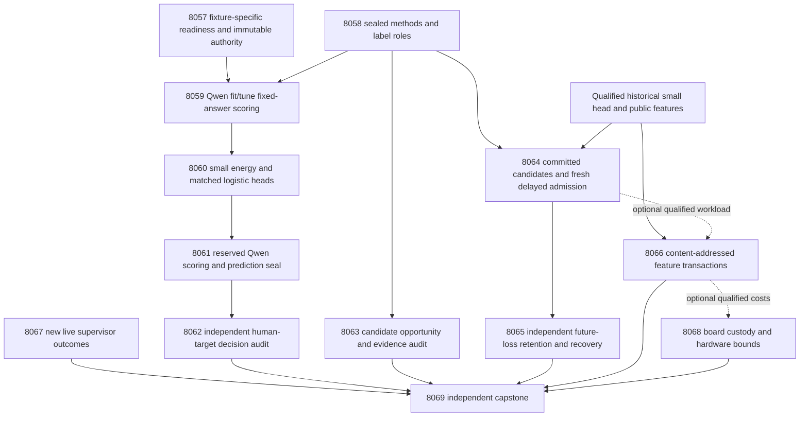
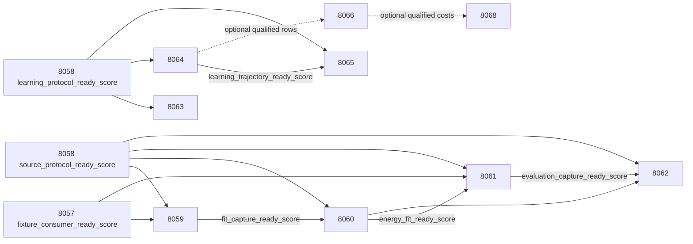

# Carnot Research Roadmap v698 — Source-grounded decisions, fresh admission feedback, and reusable evidence features

**Created:** 2026-10-03. **Milestone:** 2026.10.698.
**Status:** Planned for conductor review; no experiments executed by this plan.
**Supersedes:** scheduling for completed milestone 2026.10.697.
**Informed by:** research-program.md, PRD FR-06/11/12, current architecture,
terminal V697 evidence, previous roadmaps and the dated literature scan.

The contract contains **13 tasks, Exp8057 through Exp8069**, in exactly the
order in the task table and `research-roadmap-next.yaml`. Four phases contain
2, 4, 3 and 4 tasks. Complete executable task JSON is embedded below, including
prompts and gates. The active `research-roadmap.yaml` remains unchanged.
The previous design is preserved byte-for-byte as
`research-roadmap-v697-preserved-20261003.md`.

## What v697 proved

Conductor completion means scheduling finished. It does not mean each scientific
hypothesis passed. These findings use final primaries and their terminal sidecars;
log-only skipped tasks remain log-only. The completed archive had not yet appended
V697 at planning time, so its final task evidence comes from the active roadmap,
conductor log and Exp8056 capstone.

| Experiment | Supported finding | Limit and consequence |
|---|---|---|
| Exp8044 | Complete authority reader qualified; contract readiness 1 | Administrative result is circular-positive, not science |
| Exp8045 | Scorer workspace repaired; fixture readiness 1; circular-positive | Exp8047 wrongly required positive/null and rejected this valid fixture class |
| Exp8046 | Source and learning protocols qualified, both readiness fields 1 | Original development exposure and sealed roles remain binding |
| Exp8047–8050 | Source measurement chain skipped | Real Exp8047 skip receipt is `results/experiment_8047_fit_score_capture.json`; later primaries are absent |
| Exp8051 | Complete delayed feedback learning trajectories | 1,200 constrained proposals accepted, 780 rejected; state change alone is not benefit |
| Exp8052 | Independent future-loss and recovery audit qualified | Constrained versus unconstrained cost gain -0.0213542, 144 eligible later sources; future safety and retention failed |
| Exp8053 | Loaded native parity and complete guarded transactions qualified | Native/Python speed ratios about 0.997 accepted and 0.994 rejected; source-feature gathering dominates |
| Exp8054 | No new authenticated supervisor outcomes | No ARC improvement or solve claim |
| Exp8055 | Historical board custody and guarded fallback qualified | No current device execution or whole-service benefit; arithmetic-only acceleration is negligible on this workload |
| Exp8056 | All thirteen dispositions accounted for | `complete_blocked_v697_capstone`; all three PRD gaps remain open |

Exp8052's primary future cost interval was approximately [-0.03419,-0.00619].
This is a loss on one exposed development trajectory, not twenty independent
worlds. The failure motivates changing admission information, not another replay
window or learning-rate sweep. Exp8053's raw component rows identify feature
extraction as the dominant measured cost; a representative accepted transaction
spent about 1.79 seconds gathering features and microseconds in gradient arithmetic.

## Three biggest gaps to the PRD vision

1. **Useful source-grounded decisions (FR-06/12).** Stable scoring and trained
   heads still have no measured source-decision benefit. Finish new fixed-answer
   source scoring and test independent complete-response human targets. Compare
   energy architecture against a classifier with identical information.
2. **Learning that improves later decisions and retains prior skill (FR-11).**
   Empirical update guards did not protect future performance. Commit candidates
   before fresh admission feedback, consume that evidence once, and measure later
   loss plus retention against reused-feedback, unconditional and frozen controls.
3. **Useful reproducible deployment (FR-05/08/09/10, NFR-01).** Fast arithmetic
   has not improved complete transactions. Change the measured extraction
   bottleneck with content-addressed public features, charge cold/miss costs, and
   retain exact native parity and device scope. Useful decisions remain required
   before a production value claim.

An energy is a learned compatibility score. It is not ground truth for incomplete
extraction or uncertain human labels. All experiments retain
`generalized_learning_benefit_score=0`: existing cohorts are exposed development
material, and algorithm seeds add no independent environments.

## Research recorded before design

The V698 entry in `research-references.md` precedes this design. It covers all
requested topic and secondary-source channels. Semantic Scholar citation endpoints
were inaccessible; the returned GitHub Trending page was cached. These limits
preclude an exhaustive novelty or current-trending claim.

| Primary source | Adopted experiment or explicit boundary |
|---|---|
| [GASP, 2026](https://arxiv.org/abs/2607.04223) | Exp8059–8062: supplied-answer source removal, separated duplicate controls and independently labeled correctness |
| [Admission auditing, September 2026](https://arxiv.org/html/2609.10873v1) | Exp8063–8065: committed candidates, fresh admission evidence and pool-level missed opportunities; no transfer of its iid safety theorem |
| [Delayed-feedback reduction, 2026](https://arxiv.org/abs/2602.02634) | Exp8058/8064/8065: issue, commitment, release, outstanding-feedback and consumption accounting |
| [Optimal online recalibration, 2026](https://arxiv.org/abs/2607.19689) | Separate Brier quality from decision cost; full algorithm deferred |
| [KAN forgetting, 2025/AAAI 2026](https://arxiv.org/abs/2511.12828) | Explicit retention tests; sparse support is not a forgetting guarantee |
| [EBT](https://openreview.net/pdf?id=ZBj3Qp1bYg) and [ARM–EBM](https://arxiv.org/abs/2512.15605) | Exp8060: matched-information heads and exact energy/sigmoid equivalence controls |
| [Thermodynamic AI, 2026](https://arxiv.org/abs/2607.00170), [Extropic Z1T](https://extropic.ai/writing/z1t/) | Exp8068: compatible computation, host bottlenecks and transfer bounds; no local TSU claim |

SIRIN, SURE-RAG, ETS, Lagrange ONNs and Kona remain logged leads. Additional
solvers, generative energy descent, generator fine-tuning, generic external-text
reranking, importance anchoring and public ARC re-solves are outside this plan.

## Architecture



The source worker never sees target labels. The online learner sees only released
update-role feedback; the fresh admission worker receives committed candidates
before its future label block. The independent evaluator sees later/retention
labels after prediction seals. Cache entries contain public features only.

## Phase 1 — Bind consumers and seal methods (Exp8057–8058)

**Exp8057** reproduces V697's fixture-class mismatch and qualifies its actual
consumer. A circular-positive fixture with readiness 1 and clean hashes may
qualify measurement machinery. It cannot satisfy a scientific-benefit gate.
All six classes, missing fields, readiness zero, changed hashes and quarantine
must be exercised through real gate evaluation. Reuse the qualified scorer;
do not relabel Exp8045 or redo model work in this task.

**Exp8058** ingests the literature methods and freezes source roles, learning
roles, opportunity times, costs, margins, labels and statistical tests. Source
and learning readiness remain separate. It uses existing fit64/tune32/evaluation96
and stream256/retention64 roles, explicitly marked historically exposed.

Prototype: private authority/scorer CLI plus immutable method manifests.
Validation: complete task bytes, actual consumer class matrix and label-access
order. Adversarial controls: false scientific promotion from a fixture, missing
parents, missing fields, changed prompts and future-label access.

## Phase 2 — Source information and calibrated decisions (Exp8059–8062)

**Exp8059** collects new Qwen3.8 fit/tune scores using qualified `fresh_full`
contexts. Score full_A/full_B/no_source_A/no_source_B for each group. Duplicates
are separated by other groups. Preserve full source and complete answer;
exclude beyond 4096 context or 384 answer tokens rather than truncate. The first
8 fit groups are the pilot within the same budget. Both source conditions must
satisfy absolute duplicate mean-NLL drift <=1e-6 with exact token alignment and
normalization. Cap 384 forwards, 147456 target tokens and 1800 seconds of model
work including loading. No tolerance changes after measurement.

**Exp8060** fits an intercept, full-NLL-only logistic, two-feature logistic and
additive piecewise-linear spline energy. Features are mean full NLL and
no-source-minus-full NLL. For unsupportedness, E(x,0)=0, E(x,1)=-f(x) and
p(1|x)=sigmoid(f(x)). Fit-only grouped cross-validation chooses ridge from
[.0001,.001,.01,.1,1]; tune-only affine calibration follows. Fit alone determines
normalization and knots. Cap training at 600 seconds. Freeze all heads before
reserved scoring. Length-only, source-permutation and exact sigmoid equivalence
controls distinguish added information from an energy reparameterization.

**Exp8061** repeats the four-view capture on 96 reserved development groups
under identical model/build/execution settings and the same per-task limits.
Seal all probabilities and actions before independent target access.

**Exp8062** reconstructs token features and frozen predictions, then evaluates
complete human targets. It reports source-information and architecture effects
separately. A valid tie/loss qualifies measurement and leaves benefit zero.

Prototype: current token shards and loadable small heads. Validation: independent
reconstruction, class support, convergence and immutable prediction seals.
Adversarial controls: shifted tokens, stale logits, source permutation, unknown
labels, sign inversion and modified heads. No answer generation is performed.

## Phase 3 — Admission evidence and continuous learning (Exp8063–8065)

**Exp8063** reconstructs historical candidate pools and asks whether the guard
rejected useful opportunities or the candidate pool itself lacked useful changes.
Opportunity is counted per proposal pool, not per unchosen alpha. Evaluate
committed alternatives in an isolated retrospective audit. Calculate the label
budget needed by paired-disagreement and bounded-loss certificates. Twelve
fresh labels may be far too few; dependent exposed sources do not satisfy iid
assumptions. This diagnostic does not tune or gate the sealed learner.

**Exp8064** tests four closed-loop arms: frozen, unconditional, reused guard
and fresh admission. It uses original 256-slot chronology, delay 20, seeds
101–120 and source-role hash modulo 4 (bucket 0 admission-only; others update-only).
At slots 64/128/192 each adaptive arm proposes four gradients from its own state,
using up to the latest 32 released update-role sources, minimum 16 and 2/class,
step .01 and ridge .001. At most 12 gradients per seed/arm are attempted.

Commit the candidate and incumbent hashes before selecting the next 12 eligible
admission-role labels in release order. Fresh blocks are consumed once and
never enter gradients. All arms wait to the same decision time. A pending
candidate that cannot obtain its block before the next opportunity or stream
end is deferred. The reused guard uses only its precommit released snapshot.
A guard needs at least 2/class; insufficient support is not replaced selectively.

Both guard arms select the largest alpha in [1,.5,.25,.125,0] satisfying:
no new false accepts versus either incumbent or initial head; Brier drift <=.01
and cost drift <=.02 versus initial; and nonincreasing Brier/cost versus incumbent.
If nothing qualifies, preserve current state. These matched rules isolate the
change in feedback timing/reuse. They are empirical checks, not future-safety
certificates. Always-frozen behavior earns no learning benefit. Cap numerical
work at 1200 seconds and persist issue/release/admission/state events.

**Exp8065** independently reconstructs every transition, later prediction and
consumed label. Later primary evaluation uses common update-role source slots
after the first shared completed admission opportunity and before own-label
release. Retention targets open only after final head seals. Process-death
checks surround candidate commitment, evidence consumption and durable update.

Prototype: persistent small-head learning with committed pending candidates.
Validation: matched clocks/information/gradient budgets, one-use admission,
independent later loss and retention, exact recovery. Adversarial controls:
future-label mutation, duplicated or out-of-order release, destructive update,
empty guard, no-op and all-rejected pools. No pretrained model is modified.

## Phase 4 — Deployment cost and evidence closure (Exp8066–8069)

**Exp8066** tests content-addressed reuse of public features in guarded CPU/native
transactions. Key complete source/answer bytes, extractor code/config and schema;
never cache labels or learned-state decisions. Compare cached/uncached Python
and actual loaded native arms on cold population, warm hits, all misses,
10% predetermined content changes, eviction and restart. Charge hashing,
extraction, guards, FFI, storage and reload. Use 5 warmups and 30 paired randomized
repetitions per observed class within 900 seconds. Preserve all censored rows.
Feature parity is exact; numerical tolerance is 1e-10; discrete state/actions
must match. Speed requires a lower 95% ratio >1.2 and no >5% cold/all-miss
regression. Report break-even use counts and absent acquisition/feedback costs.

**Exp8067** inspects only new authenticated trajectory-supervisor outcomes after
Exp8054. Empty delta exits with a valid null and satisfies the ARC floor.
At least 10 new closed firings across 3 games are needed for a proposed curated
arm-selection refinement. No new arm, default change, game execution, source RE
or solve is planned. Observational outcomes cannot establish causal improvement.

**Exp8068** preserves each board's independent custody and, only when qualified
Exp8066 costs exist, recalculates acceleration bounds for the changed workload.
Missing new costs block that calculation only. No probing, flashing, bitstream
redesign, purchase or TSU/NPU execution is included.

**Exp8069** independently reduces all thirteen actual dispositions and H1–H3,
including missing and gate-skipped work. It decides each PRD gap separately,
reports scoped retirement/reopen conditions and writes the outcome note.
Historical G1–G4 publication readiness is not V698 science readiness.

Prototype: cache-aware durable transactions and independent branch reducers.
Validation: loaded native parity, cold/miss accounting, immutable task authority
and normal process exit. Adversarial controls: stale/corrupt caches, replaced
source/config, missing cost components, forged board receipts and missing primaries.

## Scientific acceptance and sample budgets

Costs: unsupported accept 5, supported reject 1, escalate .5, correct decision 0.
Probability is unsupportedness: accept below .1, reject above .5, else escalate
(including ties). All rules freeze in Exp8058 before current outcome access.

| Hypothesis | Primary contrast | Margin and safeguards |
|---|---|---|
| H1 source information | Two-feature logistic minus full-NLL-only control | Brier reduction >=.01; cost increase <=.01; no added false accepts |
| H2 energy architecture | Spline versus two-feature logistic | Cost reduction >=.02; Brier increase <=.01; no added false accepts; >=5 beneficial changed sources |
| H3 fresh admission | Fresh versus matched reused guard | Later cost reduction >=.02; >=5 beneficial changed sources; no per-seed false-accept increase versus reused, unconditional or frozen; cost noninferiority within .02 versus unconditional/frozen |

Fit requires 48 complete groups and 8/class; tune requires 24 and 4/class;
source evaluation requires 72 and 8/class. H3 requires 80 common later source
groups and 10/class, reflecting its later first completed admission opportunity.
Its smaller planned support is disclosed before measurement; it does not create
new independent environments or justify a generalization claim. Retention needs
48 of 64 groups and 8/class. BOTH guarded arms must stay within .01 Brier and .02
typed cost of frozen. Failing support blocks that hypothesis; failing measured
safety/retention prevents positive benefit. No-op learning is a valid null.

Use 10000 paired source-group bootstrap draws for H1/H2. H3 uses original
256-slot moving blocks of length 32, with 16/64 sensitivity, preserving excluded,
admission and censored slots. Average seeds within each sampled source timeline;
do not pool seeds as independent data. Invert one-sided tests at the stated
nonzero margins. Apply Holm .05 over exactly H1/H2/H3 in Exp8069; missing,
disqualified, unsupported or safety-failing hypotheses get p=1. Report raw tests,
adjusted tests and descriptive intervals. The scope is conditional development
uncertainty. An admission diagnostic or cache benchmark is secondary, not a
fourth opportunity to claim primary verification benefit.

For every comparison, emit primitive per-source/arm/seed/condition rows, numerator,
denominator and status. Readiness records measurement validity and may accompany
a null result. `verifier_is_oracle=true` forbids scientific positive credit.
Every blocked result names the check, upstream, exact field, expected and observed
value in `gate_check_summary`. `partial` is reserved for unfinished owned work;
missing or unchanged external prerequisites produce terminal `blocked`.

## Dependency graph and execution order

Conductor order is Exp8057–Exp8069. Solid edges are structured readiness gates,
also requiring `flagged_adversarial=false`. Scientific/method gates accept only
`positive|null`. **The two Exp8057 fixture-consumer edges additionally accept
`circular_positive`**, explicitly and only for fixture readiness. No downstream
benefit gate accepts fixture success as science. Administrative, ARC, cache,
hardware custody and capstone readers are not gated on scientific success.



Exp8063 does not gate Exp8064: a diagnostic may show insufficient formal
certificate power without invalidating the preregistered empirical comparison.
Exp8066 always has a qualified historical workload available, labeled as such.
Exp8068 reports each board even if its new cost calculation is blocked.
All new structured upstream IDs exist earlier in this roadmap; no retired
`requires` chain is proposed.

## Hardware requirements and operating budgets

| Work | Resource | Requirement and limit |
|---|---|---|
| Exp8059/8061 scoring | One available RTX 3090, 24 GB VRAM; dual-3090 host if needed by the qualified loader | Cached ~16 GB Qwen3.8 GGUF; actual CUDA offload and lease evidence; up to 1800s model work per task |
| Small heads, online learning, audit | CPU and host RAM | Bound training 600s, learning 1200s; prequential CPU updates have a Rust path; no matrix training on the full generator |
| Exp8066 native cache experiment | CPU, loaded PyO3 extension, private storage | 900s measurement cap; charge cold cache population and all durable work; memory bounded and reported |
| KV260 | Historical fabric receipts | SSH `kria` is the mechanism for any future run; k_max<=5, no present execution |
| PolarFire | Historical Linux CPU receipts | No fabric acceleration inferred from Linux dispatch |
| GateMate | Physical/JTAG evidence | Preserve unchanged 0xffffffff blocker until operator changes cable/port/power; no repeated probe |
| TSU, NPU, new accelerators | Deferred | No authenticated local access or useful complete-service case for acquisition |

Headline LLM work MUST include `unsloth/Qwen3.8-27B-GGUF` in MODEL_SPECS and
use CARNOT_FORCE_LIVE=1. Both planned scoring tasks use
`model_load_no_generation` (2s floor), with generated_tokens=0 and explicit
teacher-forced scoring operation. Any subsequently added tiny token canary is
`model_bounded_generation` (10s); real generation uses
`model_full_generation` (60s). No duration padding or small-model substitution.
CPU tasks use `no_model_load`, MODEL_SPECS=[] and separate small-head metadata.

Estimates total about 9.7 serial task-hours including implementation and checks;
individual tasks remain within the conductor's 4800s hard cap. Each numbered
prompt mandates phase-boundary and before/after slow-call progress plus real
60-second loop/child heartbeats, keeping gaps below 600 seconds. Files over about
200 lines are written in calls of at most about 150 lines with progress between.
Missing resources fail quickly; unrelated serving/training processes are preserved.

Exp8057 routes to Opus/100 turns for the schema/consumer work. Exp8066 uses
Codex/gpt-6.1-sol for formulaic cache code. Other research tasks use the conductor
Sonnet default; simple ARC/hardware readers have 20 turns. No Luna or Gemini task
is emitted. The user-requested task routing takes precedence over older defaults.

## Verification, retirement and reconciliation

Relevant existing requirements are REQ-REPORT-7837 (task contract),
REQ-REPORT-7891-V685 (authority lifecycle), REQ-REPORT-8045 (scorer fixture),
REQ-REPORT-8046 (sealed methods), REQ-REPORT-8051/8052 (causal learning/audit),
REQ-REPORT-8053 (complete transactions) and REQ-REPORT-8055/8056 (custody/capstone).
This plan changes no implementation. Each experiment must extend the applicable
REQ/SCENARIO specification and tests before code and reconcile implementation
status only after execution. Traceability records this milestone as planned.

Every task freezes required validation commands and records their actual exits.
Use focused tests and consumers, strict types/lint, changed-code statement
coverage, spec coverage and actual private CLI routes. E2E-018 applies to
contract/capstone authority; E2E-015/016 to source/reader boundaries; E2E-003/004
to native round trips and recovery; E2E-017 to the ARC supervisor reader.
Private copies and temporary directories preserve historical result bytes.
Existing repository-wide failures remain separate health evidence. Do not claim
a global pass from a scoped test or require unrelated health repair as science.

Every repeated scope carries all four prior-failure fields. The Exp8047 blocked
receipt documents the missing V697 downstream results; no honest_verdict is
invented for absent Exp8048–8050 primaries. Standing 2026-05-29 continuation
exceptions are stated only where a real scope change or continuity obligation
applies. A repeated failed mechanism retires under retire_if_same_verdict=true;
mandatory empty-delta monitoring and unchanged valid custody are not scientific
reruns. Retired model-download, external-text reranking, importance-anchor,
small-graph sampler and public-game re-solve mechanisms remain closed.

The capstone emits exactly thirteen task dispositions and three gap decisions.
A blocked source branch cannot erase learning/cost evidence. A qualified fixture,
a cache win or historical publication gate cannot close FR-12 or FR-11.
No default policy promotion, external publication, push or conductor-source
change is authorized by this plan.

## Exact task contract

The table and complete embedded task objects are generated from the same ordered
YAML objects. The canonical digest uses sorted keys, UTF-8, ensure_ascii=false
and JSON separators (comma, colon) with no spaces. Activation must preserve all
prompt bytes and task metadata; it is a future conductor action, not a planning
claim. `research-roadmap.yaml` still identifies V697.

| Order | ID | Title | Phase | Deliverable |
|---|---|---|---|---|
| 1 | `exp8057-fixture-consumer-contract` | Qualify fixture consumers and bind the complete V698 contract | 1 | `results/experiment_8057_v698_fixture_consumer_contract.json` |
| 2 | `exp8058-sealed-evidence-methods` | Seal source tests and fresh-feedback admission methods before outcomes | 1 | `results/experiment_8058_v698_sealed_evidence_methods.json` |
| 3 | `exp8059-fit-source-scoring` | Collect repeatable Qwen fit and tune source scores | 2 | `results/experiment_8059_v698_fit_source_scoring.json` |
| 4 | `exp8060-source-energy-training` | Train calibrated source energies against matched feature controls | 2 | `results/experiment_8060_v698_source_energy_training.json` |
| 5 | `exp8061-evaluation-source-scoring` | Seal reserved Qwen scores and frozen head predictions | 2 | `results/experiment_8061_v698_evaluation_source_scoring.json` |
| 6 | `exp8062-source-decision-audit` | Independently test source information and energy decision utility | 2 | `results/experiment_8062_v698_source_decision_audit.json` |
| 7 | `exp8063-admission-opportunity-audit` | Measure rejected learning opportunities and admission evidence limits | 3 | `results/experiment_8063_v698_admission_opportunity_audit.json` |
| 8 | `exp8064-fresh-feedback-learning` | Learn with committed candidates and one-use delayed admission labels | 3 | `results/experiment_8064_v698_fresh_feedback_learning.json` |
| 9 | `exp8065-fresh-learning-audit` | Independently test fresh-feedback benefit retention and recovery | 3 | `results/experiment_8065_v698_fresh_learning_audit.json` |
| 10 | `exp8066-content-addressed-feature-service` | Test reusable public features in complete guarded transactions | 4 | `results/experiment_8066_v698_content_addressed_feature_service.json` |
| 11 | `exp8067-arc-supervisor-frontier` | Assess new live supervisor outcomes for transferable ARC refinement | 4 | `results/experiment_8067_v698_arc_supervisor_frontier.json` |
| 12 | `exp8068-hardware-feature-boundary` | Preserve board custody and bound acceleration after feature reuse | 4 | `results/experiment_8068_v698_hardware_feature_boundary.json` |
| 13 | `exp8069-capstone` | Decide all thirteen outcomes and the three PRD gaps independently | 4 | `results/experiment_8069_v698_capstone.json` |

Canonical task SHA-256: `573a4fa239e3e42e4a7bb8b14070df44f45e14c29a0eee7e275e110958bf5329`.

<!-- V698_TASK_CONTRACT_START -->
```json
{
  "milestone": "2026.10.698",
  "canonical_tasks_sha256": "573a4fa239e3e42e4a7bb8b14070df44f45e14c29a0eee7e275e110958bf5329",
  "tasks": [
    {
      "id": "exp8057-fixture-consumer-contract",
      "title": "Qualify fixture consumers and bind the complete V698 contract",
      "phase": 1,
      "track": "science",
      "priority": "high",
      "requires_gpu": false,
      "max_turns": 100,
      "estimated_wall_time_min": 30,
      "per_unit_rows": true,
      "milestone": "2026.10.698",
      "deliverable": "results/experiment_8057_v698_fixture_consumer_contract.json",
      "inference_substrate_class": "no_model_load",
      "MODEL_SPECS": [],
      "gated_on": [],
      "prior_failures": [
        {
          "experiment_id": "exp8047-fit-score-capture",
          "verdict": "blocked_gate_check_failed",
          "addressed_by": "The prerequisite is an oracle fixture, so explicitly accept circular_positive only at its scoped readiness boundary and test the actual gate matrix.",
          "retire_if_same_verdict": true
        },
        {
          "experiment_id": "exp7992-contract-methods",
          "verdict": "complete_blocked_authority",
          "addressed_by": "Reuse the parameterized authority reader and freeze complete V698 prompt bytes before activation.",
          "retire_if_same_verdict": true
        }
      ],
      "agent_type": "claude",
      "model": "opus",
      "operator_override": "2026-05-29 operator directive (standing): versioned contract continuation versus exp7992; complete immutable authority and typed fixture-only consumer tests replace the failed gate.",
      "prompt": "CONTEXT:\nWork in {project_root} on {date}. V697 source science was skipped because Exp8045 correctly reported circular_positive but Exp8047 allowed only positive/null. Exp8045 fixture readiness is 1 with clean terminal evidence. Do not reclassify it as non-oracle science or alter V697 history.\nEXISTING CODE TO READ FIRST:\nCLAUDE.md; CODEX.md; ops/e2e-test-plan.md; openspec/capabilities/research-reporting/spec.md; scripts/experiment_template.py; python/carnot/reporting/current_work_receipt.py; python/carnot/reporting/primary_publication.py; ops/exclusion_manifest.yaml; python/carnot/reporting/roadmap_contract.py; python/carnot/reporting/v685_authority_lifecycle.py; scripts/conductor_gates.py; python/carnot/experiment_8045_v697_scorer_workspace.py; results/experiment_8045_v697_scorer_workspace.json; results/experiment_8047_fit_score_capture.json; results/experiment_8056_v697_capstone.json; tests/fixtures/v697/; openspec/change-proposals/research-roadmap-v697-preserved-20261003.md\nTASK:\nQualify fixture consumers and bind the complete V698 contract. Deliver results/experiment_8057_v698_fixture_consumer_contract.json, primitive evidence under results/raw/experiment_8057_v698_fixture_consumer_contract/ and thin runnable scripts/experiments/experiment_8057_v698_fixture_consumer_contract.py.\nCONCRETE STEPS:\n0. PRECONDITIONS: print a flushed start line. Check named inputs, primary hashes, terminal sidecars, the Python environment and required tools with bounded commands. Missing external resources yield complete_blocked_<resource>, verdict_class=blocked and gate_check_summary with the exact failed operand. Do not fabricate absent evidence.\n1. Emit a flushed progress line at each phase boundary and before and after every model load, generation, benchmark and subprocess. Set PYTHONUNBUFFERED=1 and use print(..., flush=True). Inside long loops and while children run, print elapsed time and real completed/pending units at least every 60 seconds; keep every gap below 600 seconds. Bound each tool call. Write files over about 200 lines in several calls of at most about 150 lines, with a progress message between calls. Never pad duration or invent progress.\n2. Read the named sources; add the applicable REQ-* and SCENARIO-* specification before implementation. Write failing tests first with those references, then implement the smallest reusable change. Keep tests in private temporary directories outside protected results paths. Reuse existing receipt and publication helpers; preserve prior artifacts and all existing assertions.\n3. Freeze the complete V698 design, staged YAML and activated invocation YAML using the existing parameterized authority reader. Compare all 13 ordered tasks, all prompt bytes and metadata, the visible task table and canonical digest. Administrative validity must not depend on scientific benefit. Preserve previous complete authority; do not activate or rewrite the live roadmap yourself.\n4. Reproduce the exact V697 gate failure against Exp8045. Test a fixture-only consumer allowing circular_positive together with scorer_fixture_ready_score=1, clean terminal hashes and flagged_adversarial=false. Keep scientific consumers restricted to positive/null and verifier_is_oracle=false. Include all six verdict classes, ready=0, missing field, tampered hash and quarantined-input controls. Do not broaden shared conductor policy.\n5. Qualify the fixed fresh_full scorer fixture using the repaired private workspace and unchanged token-alignment, normalization and 1e-6 drift assertions. Export fixture_consumer_ready_score only for this scoped readiness; it grants permission for new measurements, never source usefulness or current model repeatability. Freeze scorer and dependency hashes.\n6. Preserve the real shorter-path Exp8047 skip receipt and log-only dispositions for Exp8048-8050 without inventing missing primary files. Resolve future artifacts by declared path plus authenticated task ID and reject ambiguous fallback paths. Run private consumer-gate evaluation through scripts/conductor_gates.py.\n9. Freeze the required validation-command manifest before measurement. Run focused unit and consumer tests, Ruff check/format, strict mypy on changed Python, scoped spec coverage, 100% changed-code statement coverage and the applicable E2E cases named below. Native changes also require cargo tests, fmt, clippy and loaded-binding checks. Run actual CLI success, blocked and mutation routes from outside the checkout; unit stubs alone cannot qualify a runner. Record argv, exit code, duration and log hash for each required check. Keep the existing bounded full-suite failure as separate repository-health evidence, not a new scientific gate or a claim of a global pass.\n10. Persist primitive rows, source/config/model/checkpoint hashes, intended/eligible/completed/censored/excluded/failed counts and denominators. Independently cold-replay reductions, run scripts/adversarial_verify.py and scripts/verdict_row_consistency_lint.py in strict mode, then publish through primary_publication only after normal process exit. If required checks fail, readiness is zero and class is disqualified. External missing evidence is blocked, not retryable partial. Reconcile specs, _bmad/traceability.md, ops/status.md and ops/changelog.md without deleting history.\n11. Exercise E2E-018 private authority CLI plus scorer success and mutation CLIs. Keep current execution and historical evidence separate. Read the V698 design's statistical contract and branch-specific acceptance rules before reporting any gain.\nREQUIRED ARTIFACT FIELDS:\n- honest_verdict: terminal complete_* string; principle: terminal results must not trigger accidental retries.\n- verdict_class: positive | circular_positive | null | blocked | disqualified | partial; principle: fixture credit and scientific credit remain distinct; partial is only unfinished work another attempt can fix.\n- verifier_is_oracle and claim_scope; principle: oracle/fixture-derived success cannot become non-circular scientific benefit.\n- flagged_adversarial, required_checks_passed, validation_receipts, terminal_validation_sidecar_path; principle: current evidence must survive owned checks and independent readers.\n- inference_substrate, inference_substrate_class, MODEL_SPECS, model_invocation_counts; principle: duration floors match actual model work, not cited historical models.\n- rows with unit/source/arm/seed, raw numerator/denominator, status and exclusion reason; principle: all comparisons can be recomputed from primitive observations.\n- intended_count, eligible_count, independent_count, completed_count, censored_count, excluded_count, failed_count, sample_size_budget; principle: seeds, duplicate calls and bootstrap draws do not inflate independent sample size.\n- gate_check_summary: check/upstream/path/hash/field/op/expected/observed for every failure; principle: distinguish a failed scientific gate from a missing artifact or misspelled field.\n- random_seed, reproducibility_checksum, source_artifact_hashes, raw_shard_hashes, code_config_hashes, phase_spans; principle: exact inputs and execution remain attributable.\n- generalized_learning_benefit_score: 0; principle: finite historically exposed development studies cannot close generalized lifelong learning.\n- field_principles: one explanatory entry for every additional field; principle: new metrics must name the inference error they prevent.\n- fixture_consumer_ready_score: 0|1; principle: a circular fixture can qualify measurement machinery without qualifying science.\n- contract_ready_score, canonical_tasks_sha256, authority_snapshots, gate_matrix_rows, scorer_code_hashes, historical_disposition_rows; principle: producer classes and complete task authority must survive rollover and actual reader evaluation.\n- substrate_declaration: aggregation_from_upstream_artifacts, no_model_load, MODEL_SPECS=[]; principle: fixture and authority checks perform zero LLM work.\nRun command: cd {project_root} && JAX_PLATFORMS=cpu PYTHONUNBUFFERED=1 .venv/bin/python -u scripts/experiments/experiment_8057_v698_fixture_consumer_contract.py --date {date}\nDo NOT push. Do NOT modify scripts/research_conductor.py."
    },
    {
      "id": "exp8058-sealed-evidence-methods",
      "title": "Seal source tests and fresh-feedback admission methods before outcomes",
      "phase": 1,
      "track": "science",
      "priority": "high",
      "requires_gpu": false,
      "max_turns": 50,
      "estimated_wall_time_min": 30,
      "per_unit_rows": true,
      "milestone": "2026.10.698",
      "deliverable": "results/experiment_8058_v698_sealed_evidence_methods.json",
      "inference_substrate_class": "no_model_load",
      "MODEL_SPECS": [],
      "gated_on": [],
      "prior_failures": [
        {
          "experiment_id": "exp8052-learning-benefit-audit",
          "verdict": "complete_null_learning_benefit",
          "addressed_by": "Replace repeated empirical guard reuse with candidate commitment followed by one-use delayed admission evidence; preserve old margins and future/retention evaluation.",
          "retire_if_same_verdict": true
        }
      ],
      "prompt": "CONTEXT:\nWork in {project_root} on {date}. The three gaps are source decision utility, later learning benefit and useful complete-service cost. V697 learned state changed but later constrained-minus-unconstrained cost gain was -0.0213542 on 144 eligible source slots. All existing 64/32/96 and 256/64 role sets have historical development exposure.\nEXISTING CODE TO READ FIRST:\nCLAUDE.md; CODEX.md; ops/e2e-test-plan.md; openspec/capabilities/research-reporting/spec.md; scripts/experiment_template.py; python/carnot/reporting/current_work_receipt.py; python/carnot/reporting/primary_publication.py; ops/exclusion_manifest.yaml; python/carnot/experiment_8046_v697_branch_protocols.py; python/carnot/experiment_8019_v695_eligible_targets.py; python/carnot/verify/evidence_features_7980.py; python/carnot/verify/learning_benefit_8052.py; results/experiment_8046_v697_branch_protocols.json; research-references.md V698 scan; openspec/change-proposals/research-roadmap-vNEXT.md\nTASK:\nSeal source tests and fresh-feedback admission methods before outcomes. Deliver results/experiment_8058_v698_sealed_evidence_methods.json, primitive evidence under results/raw/experiment_8058_v698_sealed_evidence_methods/ and thin runnable scripts/experiments/experiment_8058_v698_sealed_evidence_methods.py.\nCONCRETE STEPS:\n0. PRECONDITIONS: print a flushed start line. Check named inputs, primary hashes, terminal sidecars, the Python environment and required tools with bounded commands. Missing external resources yield complete_blocked_<resource>, verdict_class=blocked and gate_check_summary with the exact failed operand. Do not fabricate absent evidence.\n1. Emit a flushed progress line at each phase boundary and before and after every model load, generation, benchmark and subprocess. Set PYTHONUNBUFFERED=1 and use print(..., flush=True). Inside long loops and while children run, print elapsed time and real completed/pending units at least every 60 seconds; keep every gap below 600 seconds. Bound each tool call. Write files over about 200 lines in several calls of at most about 150 lines, with a progress message between calls. Never pad duration or invent progress.\n2. Read the named sources; add the applicable REQ-* and SCENARIO-* specification before implementation. Write failing tests first with those references, then implement the smallest reusable change. Keep tests in private temporary directories outside protected results paths. Reuse existing receipt and publication helpers; preserve prior artifacts and all existing assertions.\n3. Ingest the V698 literature scan with primary methods and limitations: GASP 2607.04223, admission auditing 2609.10873, delayed feedback 2602.02634 and KAN forgetting 2511.12828. Record what is adopted, deferred or inapplicable. A focused low-concurrency source check may add new references, but cannot change preregistered comparisons after outcomes.\n4. Seal original source roles fit64/tune32/evaluation96 with complete-response label eligibility and no source-cluster overlap. Keep the original 256 chronological learning slots and retention64, known exposure flags and slot+20 release delay. Source IDs and role hashes precede any current evaluator access. Missing/unknown targets stay unknown; count all exclusions. Freeze cost(unsupported accept)=5, cost(supported reject)=1, escalation=.5 and correct=0; accept p<.1, reject p>.5, else escalate.\n5. Freeze the V698 learning contract exactly: roles sha256(source_id) modulo4, bucket0 admission-only and others update-only; attempts at original slots64/128/192. Each arm proposes four gradients of .01 with ridge .001 on up to its newest32 eligible released update rows (minimum16 and2/class). Commit each candidate before selecting its next12 eligible admission-role labels by release order. Admission rows are never reused by the fresh arm or used for gradients. Wait to the same decision time in all adaptive arms. Insufficient rows mean defer with no relaxation.\n6. Freeze four arms: frozen; unconditional alpha1; reused-guard backtracking over prior released guard rows; fresh-admission backtracking over that next12-row block. Both guarded arms compare candidate to their incumbent and initial head: no new false accepts versus either, mean Brier increase<=.01 and typed cost increase<=.02 versus initial, and nonincreasing Brier and cost versus incumbent. Choose the largest alpha in [1,.5,.25,.125,0]. Each arm has its own state, matched proposal clocks, gradients and available feedback. No outcome-dependent candidate or threshold tuning. Formal paired-binomial bounds are diagnostics only; dependent small batches cannot receive an iid safety certificate.\n7. Seal H1/H2 source comparisons and H3 fresh versus reused guard before new measurements. H3 also requires noninferiority to frozen/unconditional, later support>=80 independent source groups with>=10/class, and retention>=48 with>=8/class. Freeze moving-block32 inference with16/64 sensitivity, all timeline masks and seeds101-120 averaged within sources. Methods readiness reflects a valid protocol, not the prospect of a positive result; keep branches independently runnable.\n9. Freeze the required validation-command manifest before measurement. Run focused unit and consumer tests, Ruff check/format, strict mypy on changed Python, scoped spec coverage, 100% changed-code statement coverage and the applicable E2E cases named below. Native changes also require cargo tests, fmt, clippy and loaded-binding checks. Run actual CLI success, blocked and mutation routes from outside the checkout; unit stubs alone cannot qualify a runner. Record argv, exit code, duration and log hash for each required check. Keep the existing bounded full-suite failure as separate repository-health evidence, not a new scientific gate or a claim of a global pass.\n10. Persist primitive rows, source/config/model/checkpoint hashes, intended/eligible/completed/censored/excluded/failed counts and denominators. Independently cold-replay reductions, run scripts/adversarial_verify.py and scripts/verdict_row_consistency_lint.py in strict mode, then publish through primary_publication only after normal process exit. If required checks fail, readiness is zero and class is disqualified. External missing evidence is blocked, not retryable partial. Reconcile specs, _bmad/traceability.md, ops/status.md and ops/changelog.md without deleting history.\n11. Exercise E2E-015/016 private fixture and cold replay. Keep current execution and historical evidence separate. Read the V698 design's statistical contract and branch-specific acceptance rules before reporting any gain.\nREQUIRED ARTIFACT FIELDS:\n- honest_verdict: terminal complete_* string; principle: terminal results must not trigger accidental retries.\n- verdict_class: positive | circular_positive | null | blocked | disqualified | partial; principle: fixture credit and scientific credit remain distinct; partial is only unfinished work another attempt can fix.\n- verifier_is_oracle and claim_scope; principle: oracle/fixture-derived success cannot become non-circular scientific benefit.\n- flagged_adversarial, required_checks_passed, validation_receipts, terminal_validation_sidecar_path; principle: current evidence must survive owned checks and independent readers.\n- inference_substrate, inference_substrate_class, MODEL_SPECS, model_invocation_counts; principle: duration floors match actual model work, not cited historical models.\n- rows with unit/source/arm/seed, raw numerator/denominator, status and exclusion reason; principle: all comparisons can be recomputed from primitive observations.\n- intended_count, eligible_count, independent_count, completed_count, censored_count, excluded_count, failed_count, sample_size_budget; principle: seeds, duplicate calls and bootstrap draws do not inflate independent sample size.\n- gate_check_summary: check/upstream/path/hash/field/op/expected/observed for every failure; principle: distinguish a failed scientific gate from a missing artifact or misspelled field.\n- random_seed, reproducibility_checksum, source_artifact_hashes, raw_shard_hashes, code_config_hashes, phase_spans; principle: exact inputs and execution remain attributable.\n- generalized_learning_benefit_score: 0; principle: finite historically exposed development studies cannot close generalized lifelong learning.\n- field_principles: one explanatory entry for every additional field; principle: new metrics must name the inference error they prevent.\n- source_protocol_ready_score and learning_protocol_ready_score: separate 0|1; principle: source/GPU failure cannot disable CPU learning methods.\n- role_manifests, eligibility_rules, outcome_access_ledger, method_source_map, method_freeze, hypothesis_family, historical_exposure, sample_size_feasibility; principle: unavailable independent support must limit the claim rather than move its goalposts.\n- substrate_declaration: aggregation_from_upstream_artifacts, no_model_load, MODEL_SPECS=[]; principle: method design consumes no local LLM.\nRun command: cd {project_root} && JAX_PLATFORMS=cpu PYTHONUNBUFFERED=1 .venv/bin/python -u scripts/experiments/experiment_8058_v698_sealed_evidence_methods.py --date {date}\nDo NOT push. Do NOT modify scripts/research_conductor.py."
    },
    {
      "id": "exp8059-fit-source-scoring",
      "title": "Collect repeatable Qwen fit and tune source scores",
      "phase": 2,
      "track": "science",
      "priority": "high",
      "requires_gpu": true,
      "max_turns": 50,
      "estimated_wall_time_min": 60,
      "per_unit_rows": true,
      "milestone": "2026.10.698",
      "deliverable": "results/experiment_8059_v698_fit_source_scoring.json",
      "inference_substrate_class": "model_load_no_generation",
      "MODEL_SPECS": [
        "unsloth/Qwen3.8-27B-GGUF"
      ],
      "gated_on": [
        {
          "upstream": "exp8057-fixture-consumer-contract",
          "artifact_field": "fixture_consumer_ready_score",
          "op": "==",
          "value": 1
        },
        {
          "upstream": "exp8057-fixture-consumer-contract",
          "artifact_field": "verdict_class",
          "op": "in",
          "value": [
            "positive",
            "null",
            "circular_positive"
          ]
        },
        {
          "upstream": "exp8057-fixture-consumer-contract",
          "artifact_field": "flagged_adversarial",
          "op": "==",
          "value": false
        },
        {
          "upstream": "exp8058-sealed-evidence-methods",
          "artifact_field": "source_protocol_ready_score",
          "op": "==",
          "value": 1
        },
        {
          "upstream": "exp8058-sealed-evidence-methods",
          "artifact_field": "verdict_class",
          "op": "in",
          "value": [
            "positive",
            "null"
          ]
        },
        {
          "upstream": "exp8058-sealed-evidence-methods",
          "artifact_field": "flagged_adversarial",
          "op": "==",
          "value": false
        }
      ],
      "prior_failures": [
        {
          "experiment_id": "exp8047-fit-score-capture",
          "verdict": "blocked_gate_check_failed",
          "addressed_by": "Use Exp8057 fixture-specific circular_positive readiness and collect new authenticated model calls; scientific gates stay non-oracle.",
          "retire_if_same_verdict": true
        },
        {
          "experiment_id": "exp8034-fit-likelihood-capture",
          "verdict": "blocked_gate_check_failed",
          "addressed_by": "The missing-parent scorer workspace is repaired and qualified by Exp8045; V698 validates its real consumer contract.",
          "retire_if_same_verdict": true
        }
      ],
      "prompt": "CONTEXT:\nWork in {project_root} on {date}. Exp8047 never started model measurement: an incompatible fixture verdict gate blocked it. V698 corrects that consumer only. Old Exp8033 model rows remain disqualified historical evidence and cannot be promoted. Collect new scoring calls under current owned validation.\nEXISTING CODE TO READ FIRST:\nCLAUDE.md; CODEX.md; ops/e2e-test-plan.md; openspec/capabilities/research-reporting/spec.md; scripts/experiment_template.py; python/carnot/reporting/current_work_receipt.py; python/carnot/reporting/primary_publication.py; ops/exclusion_manifest.yaml; python/carnot/inference/scoring_isolation_8033.py; python/carnot/inference/likelihood_isolation_runtime_8033.py; python/carnot/experiment_8033_v696_scoring_isolation.py; python/carnot/inference/sota_models.py; results/experiment_8045_v697_scorer_workspace.json; V698 Exp8057 and Exp8058 deliverables\nTASK:\nCollect repeatable Qwen fit and tune source scores. Deliver results/experiment_8059_v698_fit_source_scoring.json, primitive evidence under results/raw/experiment_8059_v698_fit_source_scoring/ and thin runnable scripts/experiments/experiment_8059_v698_fit_source_scoring.py.\nCONCRETE STEPS:\n0. PRECONDITIONS: print a flushed start line. Check named inputs, primary hashes, terminal sidecars, the Python environment and required tools with bounded commands. Missing external resources yield complete_blocked_<resource>, verdict_class=blocked and gate_check_summary with the exact failed operand. Do not fabricate absent evidence.\n1. Emit a flushed progress line at each phase boundary and before and after every model load, generation, benchmark and subprocess. Set PYTHONUNBUFFERED=1 and use print(..., flush=True). Inside long loops and while children run, print elapsed time and real completed/pending units at least every 60 seconds; keep every gap below 600 seconds. Bound each tool call. Write files over about 200 lines in several calls of at most about 150 lines, with a progress message between calls. Never pad duration or invent progress.\n2. Read the named sources; add the applicable REQ-* and SCENARIO-* specification before implementation. Write failing tests first with those references, then implement the smallest reusable change. Keep tests in private temporary directories outside protected results paths. Reuse existing receipt and publication helpers; preserve prior artifacts and all existing assertions.\n3. Consume both exact structured readiness gates and terminal hashes. Set CARNOT_FORCE_LIVE=1. Resolve unsloth/Qwen3.8-27B-GGUF through cached_current_model or the current cached_sota_pair selection and load its GGUF path with embedded tokenizer. Acquire an available RTX3090 using existing ownership rules; preserve the live ARC server and unrelated processes. Record quantization, complete file hash, llama.cpp build, actual GPU offload and current process. Missing cache/device blocks; legacy small-model smoke cannot replace the headline run.\n4. Use only the qualified fresh_full execution shape. For each of64 fit and32 tune source groups score full_A, full_B, no_source_A and no_source_B in independent native contexts, with duplicates separated by other groups. Keep full source and complete answer; exclude rather than truncate beyond4096 context or384 answer tokens. The first8 fit groups are the pilot and count in the original budget. Require exact target alignment and normalization and absolute duplicate mean-NLL drift<=1e-6 for BOTH source conditions before continuing. Never retry a drifting group until it happens to pass.\n5. Cap384 target forwards,147456 scored answer tokens and1800s model work; include model loading within the timed budget and keep parent heartbeat active. Append durable token shards per completed group and preserve all intended/excluded/censored slots. If time expires, retain eligible subsets and explicit support; do not claim a full capture.\n6. Reconstruct mean full NLL and no-source-minus-full NLL independently from token rows. Seal source and answer hashes and all public features before any evaluator label access. Fit/tune readiness requires complete qualified48/24 groups with8/4 examples per class checked by the separate eligibility reader, all owned validation passing, and no oracle-derived science. Repeatability is a measurement qualification, not a detection benefit.\n9. Freeze the required validation-command manifest before measurement. Run focused unit and consumer tests, Ruff check/format, strict mypy on changed Python, scoped spec coverage, 100% changed-code statement coverage and the applicable E2E cases named below. Native changes also require cargo tests, fmt, clippy and loaded-binding checks. Run actual CLI success, blocked and mutation routes from outside the checkout; unit stubs alone cannot qualify a runner. Record argv, exit code, duration and log hash for each required check. Keep the existing bounded full-suite failure as separate repository-health evidence, not a new scientific gate or a claim of a global pass.\n10. Persist primitive rows, source/config/model/checkpoint hashes, intended/eligible/completed/censored/excluded/failed counts and denominators. Independently cold-replay reductions, run scripts/adversarial_verify.py and scripts/verdict_row_consistency_lint.py in strict mode, then publish through primary_publication only after normal process exit. If required checks fail, readiness is zero and class is disqualified. External missing evidence is blocked, not retryable partial. Reconcile specs, _bmad/traceability.md, ops/status.md and ops/changelog.md without deleting history.\n11. Exercise E2E-015/016 private fixture and cold replay. Keep current execution and historical evidence separate. Read the V698 design's statistical contract and branch-specific acceptance rules before reporting any gain.\nREQUIRED ARTIFACT FIELDS:\n- honest_verdict: terminal complete_* string; principle: terminal results must not trigger accidental retries.\n- verdict_class: positive | circular_positive | null | blocked | disqualified | partial; principle: fixture credit and scientific credit remain distinct; partial is only unfinished work another attempt can fix.\n- verifier_is_oracle and claim_scope; principle: oracle/fixture-derived success cannot become non-circular scientific benefit.\n- flagged_adversarial, required_checks_passed, validation_receipts, terminal_validation_sidecar_path; principle: current evidence must survive owned checks and independent readers.\n- inference_substrate, inference_substrate_class, MODEL_SPECS, model_invocation_counts; principle: duration floors match actual model work, not cited historical models.\n- rows with unit/source/arm/seed, raw numerator/denominator, status and exclusion reason; principle: all comparisons can be recomputed from primitive observations.\n- intended_count, eligible_count, independent_count, completed_count, censored_count, excluded_count, failed_count, sample_size_budget; principle: seeds, duplicate calls and bootstrap draws do not inflate independent sample size.\n- gate_check_summary: check/upstream/path/hash/field/op/expected/observed for every failure; principle: distinguish a failed scientific gate from a missing artifact or misspelled field.\n- random_seed, reproducibility_checksum, source_artifact_hashes, raw_shard_hashes, code_config_hashes, phase_spans; principle: exact inputs and execution remain attributable.\n- generalized_learning_benefit_score: 0; principle: finite historically exposed development studies cannot close generalized lifelong learning.\n- field_principles: one explanatory entry for every additional field; principle: new metrics must name the inference error they prevent.\n- fit_capture_ready_score: 0|1; principle: only current qualified token evidence can enable fitting.\n- feature_rows and support_by_role; principle: fitting uses intact independent source groups.\n- model_identity_receipt, gpu_lease_receipt, offload_evidence, forward_pass_counts, scored_tokens, generated_tokens: 0, duplicate_drift_rows, token_alignment_checks, public_feature_seal; principle: authenticate current model work and detect cache or token-position artifacts.\n- substrate_declaration: live_llm_embedding_extraction with operation=teacher_forced_token_scoring, inference_mode=live_gpu, model_load_no_generation (2s floor); MODEL_SPECS=[unsloth/Qwen3.8-27B-GGUF]; principle: fixed supplied-token forwards are not autoregressive generation; never pad runtime. Any added canary generation must instead declare model_bounded_generation (10s); full generation alone uses model_full_generation (60s).\nRun command: cd {project_root} && JAX_PLATFORMS=cpu PYTHONUNBUFFERED=1 CARNOT_FORCE_LIVE=1 .venv/bin/python -u scripts/experiments/experiment_8059_v698_fit_source_scoring.py --date {date}\nDo NOT push. Do NOT modify scripts/research_conductor.py."
    },
    {
      "id": "exp8060-source-energy-training",
      "title": "Train calibrated source energies against matched feature controls",
      "phase": 2,
      "track": "science",
      "priority": "high",
      "requires_gpu": false,
      "max_turns": 50,
      "estimated_wall_time_min": 35,
      "per_unit_rows": true,
      "milestone": "2026.10.698",
      "deliverable": "results/experiment_8060_v698_source_energy_training.json",
      "inference_substrate_class": "no_model_load",
      "MODEL_SPECS": [],
      "gated_on": [
        {
          "upstream": "exp8059-fit-source-scoring",
          "artifact_field": "fit_capture_ready_score",
          "op": "==",
          "value": 1
        },
        {
          "upstream": "exp8059-fit-source-scoring",
          "artifact_field": "verdict_class",
          "op": "in",
          "value": [
            "positive",
            "null"
          ]
        },
        {
          "upstream": "exp8059-fit-source-scoring",
          "artifact_field": "flagged_adversarial",
          "op": "==",
          "value": false
        },
        {
          "upstream": "exp8058-sealed-evidence-methods",
          "artifact_field": "source_protocol_ready_score",
          "op": "==",
          "value": 1
        },
        {
          "upstream": "exp8058-sealed-evidence-methods",
          "artifact_field": "verdict_class",
          "op": "in",
          "value": [
            "positive",
            "null"
          ]
        },
        {
          "upstream": "exp8058-sealed-evidence-methods",
          "artifact_field": "flagged_adversarial",
          "op": "==",
          "value": false
        }
      ],
      "prior_failures": [
        {
          "experiment_id": "exp8047-fit-score-capture",
          "verdict": "blocked_gate_check_failed",
          "addressed_by": "The prior energy-fit successor had no primary after this gate cascade; fitting now consumes corrected current capture readiness, not retired outputs.",
          "retire_if_same_verdict": true
        }
      ],
      "prompt": "CONTEXT:\nWork in {project_root} on {date}. The source-information test has not run in V696/V697. Fit small conditional energies on newly qualified token evidence, preserving identical-information controls and frozen source-disjoint roles. The mandated generator weights stay frozen.\nEXISTING CODE TO READ FIRST:\nCLAUDE.md; CODEX.md; ops/e2e-test-plan.md; openspec/capabilities/research-reporting/spec.md; scripts/experiment_template.py; python/carnot/reporting/current_work_receipt.py; python/carnot/reporting/primary_publication.py; ops/exclusion_manifest.yaml; python/carnot/experiment_8020_v695_qualified_energy_fit.py; python/carnot/verify/evidence_features_7980.py; python/carnot/verify/windowed_online_8038.py; python/carnot/experiment_8046_v697_branch_protocols.py; V698 Exp8058 and Exp8059 deliverables\nTASK:\nTrain calibrated source energies against matched feature controls. Deliver results/experiment_8060_v698_source_energy_training.json, primitive evidence under results/raw/experiment_8060_v698_source_energy_training/ and thin runnable scripts/experiments/experiment_8060_v698_source_energy_training.py.\nCONCRETE STEPS:\n0. PRECONDITIONS: print a flushed start line. Check named inputs, primary hashes, terminal sidecars, the Python environment and required tools with bounded commands. Missing external resources yield complete_blocked_<resource>, verdict_class=blocked and gate_check_summary with the exact failed operand. Do not fabricate absent evidence.\n1. Emit a flushed progress line at each phase boundary and before and after every model load, generation, benchmark and subprocess. Set PYTHONUNBUFFERED=1 and use print(..., flush=True). Inside long loops and while children run, print elapsed time and real completed/pending units at least every 60 seconds; keep every gap below 600 seconds. Bound each tool call. Write files over about 200 lines in several calls of at most about 150 lines, with a progress message between calls. Never pad duration or invent progress.\n2. Read the named sources; add the applicable REQ-* and SCENARIO-* specification before implementation. Write failing tests first with those references, then implement the smallest reusable change. Keep tests in private temporary directories outside protected results paths. Reuse existing receipt and publication helpers; preserve prior artifacts and all existing assertions.\n3. Consume qualified current fit/tune scores and sealed role manifests. Use mean full-source NLL and no-source-minus-full NLL only for the primary feature comparison. Keep length-only and source-permutation negative controls separate. No generated explanation, evaluator label text or answer-correctness flag may enter features.\n4. Train intercept, full-NLL-only logistic, two-feature logistic and additive piecewise-linear spline energy with E(x,0)=0, E(x,1)=-f(x), p(unsupported|x)=sigmoid(f(x)). Use fit-only grouped cross-validation over ridge [.0001,.001,.01,.1,1]; knots and normalization use fit only. Tune32 supplies affine calibration. Record gradients, loss, convergence and finite-probability checks. Cap600s numerical work. Preserve an exact energy/sigmoid equivalence test; reparameterizing a classifier is not an independent architecture win.\n5. Serialize loadable heads, fixed knot supports and calibrated parameters; freeze predicted-cost thresholds from Exp8058. Seal heads and source feature schemas before any reserved evaluation capture. Emit each fit/tune source prediction per arm and seed; insufficient support or failed convergence cannot earn readiness.\n6. Exercise label permutation, source permutation, length shortcut, duplicate feature and sign-inversion controls. Fitting readiness may be null scientifically; it does not require an apparent training benefit. Keep experimental trainable parameters separate from MODEL_SPECS=[] because no pretrained model is loaded here.\n9. Freeze the required validation-command manifest before measurement. Run focused unit and consumer tests, Ruff check/format, strict mypy on changed Python, scoped spec coverage, 100% changed-code statement coverage and the applicable E2E cases named below. Native changes also require cargo tests, fmt, clippy and loaded-binding checks. Run actual CLI success, blocked and mutation routes from outside the checkout; unit stubs alone cannot qualify a runner. Record argv, exit code, duration and log hash for each required check. Keep the existing bounded full-suite failure as separate repository-health evidence, not a new scientific gate or a claim of a global pass.\n10. Persist primitive rows, source/config/model/checkpoint hashes, intended/eligible/completed/censored/excluded/failed counts and denominators. Independently cold-replay reductions, run scripts/adversarial_verify.py and scripts/verdict_row_consistency_lint.py in strict mode, then publish through primary_publication only after normal process exit. If required checks fail, readiness is zero and class is disqualified. External missing evidence is blocked, not retryable partial. Reconcile specs, _bmad/traceability.md, ops/status.md and ops/changelog.md without deleting history.\n11. Exercise E2E-015/016 private fixture and cold replay. Keep current execution and historical evidence separate. Read the V698 design's statistical contract and branch-specific acceptance rules before reporting any gain.\nREQUIRED ARTIFACT FIELDS:\n- honest_verdict: terminal complete_* string; principle: terminal results must not trigger accidental retries.\n- verdict_class: positive | circular_positive | null | blocked | disqualified | partial; principle: fixture credit and scientific credit remain distinct; partial is only unfinished work another attempt can fix.\n- verifier_is_oracle and claim_scope; principle: oracle/fixture-derived success cannot become non-circular scientific benefit.\n- flagged_adversarial, required_checks_passed, validation_receipts, terminal_validation_sidecar_path; principle: current evidence must survive owned checks and independent readers.\n- inference_substrate, inference_substrate_class, MODEL_SPECS, model_invocation_counts; principle: duration floors match actual model work, not cited historical models.\n- rows with unit/source/arm/seed, raw numerator/denominator, status and exclusion reason; principle: all comparisons can be recomputed from primitive observations.\n- intended_count, eligible_count, independent_count, completed_count, censored_count, excluded_count, failed_count, sample_size_budget; principle: seeds, duplicate calls and bootstrap draws do not inflate independent sample size.\n- gate_check_summary: check/upstream/path/hash/field/op/expected/observed for every failure; principle: distinguish a failed scientific gate from a missing artifact or misspelled field.\n- random_seed, reproducibility_checksum, source_artifact_hashes, raw_shard_hashes, code_config_hashes, phase_spans; principle: exact inputs and execution remain attributable.\n- generalized_learning_benefit_score: 0; principle: finite historically exposed development studies cannot close generalized lifelong learning.\n- field_principles: one explanatory entry for every additional field; principle: new metrics must name the inference error they prevent.\n- energy_fit_ready_score: 0|1; principle: convergence and custody qualify heads independently of their eventual test performance.\n- head_specs, fitted_parameters, calibration_parameters, optimizer_diagnostics, fit_source_ids, tune_source_ids, head_seal, control_rows; principle: independent readers can reproduce frozen predictions without fitting again.\n- substrate_declaration: verifier_ensemble_against_cached_candidates, no_model_load, MODEL_SPECS=[], trained_head_specs; principle: CPU small-head fitting is not current Qwen inference.\nRun command: cd {project_root} && JAX_PLATFORMS=cpu PYTHONUNBUFFERED=1 .venv/bin/python -u scripts/experiments/experiment_8060_v698_source_energy_training.py --date {date}\nDo NOT push. Do NOT modify scripts/research_conductor.py."
    },
    {
      "id": "exp8061-evaluation-source-scoring",
      "title": "Seal reserved Qwen scores and frozen head predictions",
      "phase": 2,
      "track": "science",
      "priority": "high",
      "requires_gpu": true,
      "max_turns": 50,
      "estimated_wall_time_min": 60,
      "per_unit_rows": true,
      "milestone": "2026.10.698",
      "deliverable": "results/experiment_8061_v698_evaluation_source_scoring.json",
      "inference_substrate_class": "model_load_no_generation",
      "MODEL_SPECS": [
        "unsloth/Qwen3.8-27B-GGUF"
      ],
      "gated_on": [
        {
          "upstream": "exp8057-fixture-consumer-contract",
          "artifact_field": "fixture_consumer_ready_score",
          "op": "==",
          "value": 1
        },
        {
          "upstream": "exp8057-fixture-consumer-contract",
          "artifact_field": "verdict_class",
          "op": "in",
          "value": [
            "positive",
            "null",
            "circular_positive"
          ]
        },
        {
          "upstream": "exp8057-fixture-consumer-contract",
          "artifact_field": "flagged_adversarial",
          "op": "==",
          "value": false
        },
        {
          "upstream": "exp8058-sealed-evidence-methods",
          "artifact_field": "source_protocol_ready_score",
          "op": "==",
          "value": 1
        },
        {
          "upstream": "exp8058-sealed-evidence-methods",
          "artifact_field": "verdict_class",
          "op": "in",
          "value": [
            "positive",
            "null"
          ]
        },
        {
          "upstream": "exp8058-sealed-evidence-methods",
          "artifact_field": "flagged_adversarial",
          "op": "==",
          "value": false
        },
        {
          "upstream": "exp8060-source-energy-training",
          "artifact_field": "energy_fit_ready_score",
          "op": "==",
          "value": 1
        },
        {
          "upstream": "exp8060-source-energy-training",
          "artifact_field": "verdict_class",
          "op": "in",
          "value": [
            "positive",
            "null"
          ]
        },
        {
          "upstream": "exp8060-source-energy-training",
          "artifact_field": "flagged_adversarial",
          "op": "==",
          "value": false
        }
      ],
      "prior_failures": [
        {
          "experiment_id": "exp8047-fit-score-capture",
          "verdict": "blocked_gate_check_failed",
          "addressed_by": "The former evaluation successor never obtained a primary; V698 has a fixture-compatible consumer and independent current fit/evaluation evidence.",
          "retire_if_same_verdict": true
        }
      ],
      "prompt": "CONTEXT:\nWork in {project_root} on {date}. V697 produced no reserved source-score artifact because its producer chain was skipped. V698 uses current qualified fit heads and keeps reserved development labels outside the scoring process. Prior exposure prevents calling this an unseen external test.\nEXISTING CODE TO READ FIRST:\nCLAUDE.md; CODEX.md; ops/e2e-test-plan.md; openspec/capabilities/research-reporting/spec.md; scripts/experiment_template.py; python/carnot/reporting/current_work_receipt.py; python/carnot/reporting/primary_publication.py; ops/exclusion_manifest.yaml; python/carnot/inference/scoring_isolation_8033.py; python/carnot/inference/likelihood_isolation_runtime_8033.py; python/carnot/inference/sota_models.py; V698 Exp8057-8060 deliverables and implementations\nTASK:\nSeal reserved Qwen scores and frozen head predictions. Deliver results/experiment_8061_v698_evaluation_source_scoring.json, primitive evidence under results/raw/experiment_8061_v698_evaluation_source_scoring/ and thin runnable scripts/experiments/experiment_8061_v698_evaluation_source_scoring.py.\nCONCRETE STEPS:\n0. PRECONDITIONS: print a flushed start line. Check named inputs, primary hashes, terminal sidecars, the Python environment and required tools with bounded commands. Missing external resources yield complete_blocked_<resource>, verdict_class=blocked and gate_check_summary with the exact failed operand. Do not fabricate absent evidence.\n1. Emit a flushed progress line at each phase boundary and before and after every model load, generation, benchmark and subprocess. Set PYTHONUNBUFFERED=1 and use print(..., flush=True). Inside long loops and while children run, print elapsed time and real completed/pending units at least every 60 seconds; keep every gap below 600 seconds. Bound each tool call. Write files over about 200 lines in several calls of at most about 150 lines, with a progress message between calls. Never pad duration or invent progress.\n2. Read the named sources; add the applicable REQ-* and SCENARIO-* specification before implementation. Write failing tests first with those references, then implement the smallest reusable change. Keep tests in private temporary directories outside protected results paths. Reuse existing receipt and publication helpers; preserve prior artifacts and all existing assertions.\n3. Check exact fixture readiness, role methods and frozen-head gates. Set CARNOT_FORCE_LIVE=1 and resolve unsloth/Qwen3.8-27B-GGUF with the current cache helper. Require the same tokenizer, GGUF/build hashes, quantization, fresh_full shape and GPU-offload receipts as Exp8059. Respect the existing GPU lease and ARC process ownership.\n4. Score96 original reserved source groups through full_A/full_B/no_source_A/no_source_B with separated duplicates and independent native contexts. Cap384 forwards,147456 scored answer tokens,4096 context tokens,384 complete-answer tokens and1800s model work including loads. Exclude rather than truncate. Absolute duplicate mean-NLL drift<=1e-6 in both conditions and exact target alignment remain mandatory.\n5. The scoring worker receives public source/question/answer inputs and frozen heads only; evaluator targets stay inaccessible. Persist all token shards, reconstructed two-feature rows, arm probabilities, typed actions and a prediction seal before launching an evaluator. Score support>=72 complete groups with>=8/class through a separate target-support reader. Keep label-access receipts and historical exposure flags.\n6. Failed repeatability or support yields zero readiness and exact failed operands. Retain bounded partial measurements without inventing absent rows. Do not change a head, threshold, eligibility rule or duplicate tolerance in response to evaluation observations.\n9. Freeze the required validation-command manifest before measurement. Run focused unit and consumer tests, Ruff check/format, strict mypy on changed Python, scoped spec coverage, 100% changed-code statement coverage and the applicable E2E cases named below. Native changes also require cargo tests, fmt, clippy and loaded-binding checks. Run actual CLI success, blocked and mutation routes from outside the checkout; unit stubs alone cannot qualify a runner. Record argv, exit code, duration and log hash for each required check. Keep the existing bounded full-suite failure as separate repository-health evidence, not a new scientific gate or a claim of a global pass.\n10. Persist primitive rows, source/config/model/checkpoint hashes, intended/eligible/completed/censored/excluded/failed counts and denominators. Independently cold-replay reductions, run scripts/adversarial_verify.py and scripts/verdict_row_consistency_lint.py in strict mode, then publish through primary_publication only after normal process exit. If required checks fail, readiness is zero and class is disqualified. External missing evidence is blocked, not retryable partial. Reconcile specs, _bmad/traceability.md, ops/status.md and ops/changelog.md without deleting history.\n11. Exercise E2E-015/016 private fixture and cold replay. Keep current execution and historical evidence separate. Read the V698 design's statistical contract and branch-specific acceptance rules before reporting any gain.\nREQUIRED ARTIFACT FIELDS:\n- honest_verdict: terminal complete_* string; principle: terminal results must not trigger accidental retries.\n- verdict_class: positive | circular_positive | null | blocked | disqualified | partial; principle: fixture credit and scientific credit remain distinct; partial is only unfinished work another attempt can fix.\n- verifier_is_oracle and claim_scope; principle: oracle/fixture-derived success cannot become non-circular scientific benefit.\n- flagged_adversarial, required_checks_passed, validation_receipts, terminal_validation_sidecar_path; principle: current evidence must survive owned checks and independent readers.\n- inference_substrate, inference_substrate_class, MODEL_SPECS, model_invocation_counts; principle: duration floors match actual model work, not cited historical models.\n- rows with unit/source/arm/seed, raw numerator/denominator, status and exclusion reason; principle: all comparisons can be recomputed from primitive observations.\n- intended_count, eligible_count, independent_count, completed_count, censored_count, excluded_count, failed_count, sample_size_budget; principle: seeds, duplicate calls and bootstrap draws do not inflate independent sample size.\n- gate_check_summary: check/upstream/path/hash/field/op/expected/observed for every failure; principle: distinguish a failed scientific gate from a missing artifact or misspelled field.\n- random_seed, reproducibility_checksum, source_artifact_hashes, raw_shard_hashes, code_config_hashes, phase_spans; principle: exact inputs and execution remain attributable.\n- generalized_learning_benefit_score: 0; principle: finite historically exposed development studies cannot close generalized lifelong learning.\n- field_principles: one explanatory entry for every additional field; principle: new metrics must name the inference error they prevent.\n- evaluation_capture_ready_score: 0|1; principle: only sealed current predictions can enter the independent target audit.\n- public_feature_seal, prediction_seal, head_hashes, evaluation_source_ids, duplicate_drift_rows, token_alignment_checks, scored_tokens, forward_pass_counts; principle: detect changed evidence and predictions after target access.\n- substrate_declaration: live_llm_embedding_extraction with operation=teacher_forced_token_scoring, inference_mode=live_gpu, model_load_no_generation (2s floor), generated_tokens=0, MODEL_SPECS=[unsloth/Qwen3.8-27B-GGUF]; principle: fixed-answer forwards are not generation. Any added bounded token canary uses model_bounded_generation (10s); never declare full generation for this task.\nRun command: cd {project_root} && JAX_PLATFORMS=cpu PYTHONUNBUFFERED=1 CARNOT_FORCE_LIVE=1 .venv/bin/python -u scripts/experiments/experiment_8061_v698_evaluation_source_scoring.py --date {date}\nDo NOT push. Do NOT modify scripts/research_conductor.py."
    },
    {
      "id": "exp8062-source-decision-audit",
      "title": "Independently test source information and energy decision utility",
      "phase": 2,
      "track": "science",
      "priority": "high",
      "requires_gpu": false,
      "max_turns": 50,
      "estimated_wall_time_min": 30,
      "per_unit_rows": true,
      "milestone": "2026.10.698",
      "deliverable": "results/experiment_8062_v698_source_decision_audit.json",
      "inference_substrate_class": "no_model_load",
      "MODEL_SPECS": [],
      "gated_on": [
        {
          "upstream": "exp8061-evaluation-source-scoring",
          "artifact_field": "evaluation_capture_ready_score",
          "op": "==",
          "value": 1
        },
        {
          "upstream": "exp8061-evaluation-source-scoring",
          "artifact_field": "verdict_class",
          "op": "in",
          "value": [
            "positive",
            "null"
          ]
        },
        {
          "upstream": "exp8061-evaluation-source-scoring",
          "artifact_field": "flagged_adversarial",
          "op": "==",
          "value": false
        },
        {
          "upstream": "exp8060-source-energy-training",
          "artifact_field": "energy_fit_ready_score",
          "op": "==",
          "value": 1
        },
        {
          "upstream": "exp8060-source-energy-training",
          "artifact_field": "verdict_class",
          "op": "in",
          "value": [
            "positive",
            "null"
          ]
        },
        {
          "upstream": "exp8060-source-energy-training",
          "artifact_field": "flagged_adversarial",
          "op": "==",
          "value": false
        },
        {
          "upstream": "exp8058-sealed-evidence-methods",
          "artifact_field": "source_protocol_ready_score",
          "op": "==",
          "value": 1
        },
        {
          "upstream": "exp8058-sealed-evidence-methods",
          "artifact_field": "verdict_class",
          "op": "in",
          "value": [
            "positive",
            "null"
          ]
        },
        {
          "upstream": "exp8058-sealed-evidence-methods",
          "artifact_field": "flagged_adversarial",
          "op": "==",
          "value": false
        }
      ],
      "prior_failures": [
        {
          "experiment_id": "exp8047-fit-score-capture",
          "verdict": "blocked_gate_check_failed",
          "addressed_by": "V697 decision evaluation was cascade-skipped; V698 uses fresh sealed predictions after the corrected fixture contract.",
          "retire_if_same_verdict": true
        }
      ],
      "prompt": "CONTEXT:\nWork in {project_root} on {date}. Source sensitivity and energy architecture are different hypotheses. No V697 source decision result exists. Evaluate frozen V698 predictions against complete human labels; neither a stable likelihood nor a trained head is already a verification gain.\nEXISTING CODE TO READ FIRST:\nCLAUDE.md; CODEX.md; ops/e2e-test-plan.md; openspec/capabilities/research-reporting/spec.md; scripts/experiment_template.py; python/carnot/reporting/current_work_receipt.py; python/carnot/reporting/primary_publication.py; ops/exclusion_manifest.yaml; python/carnot/experiment_8021_v695_typed_decision_test.py; python/carnot/experiment_8019_v695_eligible_targets.py; python/carnot/reporting/v697_capstone.py; V698 Exp8058-8061 deliverables\nTASK:\nIndependently test source information and energy decision utility. Deliver results/experiment_8062_v698_source_decision_audit.json, primitive evidence under results/raw/experiment_8062_v698_source_decision_audit/ and thin runnable scripts/experiments/experiment_8062_v698_source_decision_audit.py.\nCONCRETE STEPS:\n0. PRECONDITIONS: print a flushed start line. Check named inputs, primary hashes, terminal sidecars, the Python environment and required tools with bounded commands. Missing external resources yield complete_blocked_<resource>, verdict_class=blocked and gate_check_summary with the exact failed operand. Do not fabricate absent evidence.\n1. Emit a flushed progress line at each phase boundary and before and after every model load, generation, benchmark and subprocess. Set PYTHONUNBUFFERED=1 and use print(..., flush=True). Inside long loops and while children run, print elapsed time and real completed/pending units at least every 60 seconds; keep every gap below 600 seconds. Bound each tool call. Write files over about 200 lines in several calls of at most about 150 lines, with a progress message between calls. Never pad duration or invent progress.\n2. Read the named sources; add the applicable REQ-* and SCENARIO-* specification before implementation. Write failing tests first with those references, then implement the smallest reusable change. Keep tests in private temporary directories outside protected results paths. Reuse existing receipt and publication helpers; preserve prior artifacts and all existing assertions.\n3. Independently reconstruct per-token scores, source features and frozen-head probabilities before opening complete-response human targets. Verify all hashes, source roles and issue-before-evaluate seals. Unknown labels stay excluded, with original source denominators retained.\n4. Test H1 two-feature logistic versus full-NLL-only for Brier gain>=.01, cost increase<=.01 and no added false accepts. Test H2 spline versus two-feature logistic for typed cost gain>=.02, Brier increase<=.01, no added false accepts and>=5 beneficial changed source decisions. Report unconditional rows, coverage, selective risk, calibration and cost, plus length and source-permutation controls.\n5. Use10000 paired source-cluster bootstrap draws and one-sided nonzero-margin tests with the exact Exp8058 family H1/H2/H3; Holm family correction is finalized in the capstone after H3 exists. Count source groups, not duplicate calls or training seeds. Support below72 complete groups or8/class blocks the hypothesis, not an invented null score. Valid ties/losses are terminal null.\n6. Publish decision_audit_ready_score for qualified measurement separately from source_benefit_score. Report development-only uncertainty and whether source information, architecture or neither earned a benefit. No repair, generic reranking, deployment or language-model hallucination-elimination claim follows.\n9. Freeze the required validation-command manifest before measurement. Run focused unit and consumer tests, Ruff check/format, strict mypy on changed Python, scoped spec coverage, 100% changed-code statement coverage and the applicable E2E cases named below. Native changes also require cargo tests, fmt, clippy and loaded-binding checks. Run actual CLI success, blocked and mutation routes from outside the checkout; unit stubs alone cannot qualify a runner. Record argv, exit code, duration and log hash for each required check. Keep the existing bounded full-suite failure as separate repository-health evidence, not a new scientific gate or a claim of a global pass.\n10. Persist primitive rows, source/config/model/checkpoint hashes, intended/eligible/completed/censored/excluded/failed counts and denominators. Independently cold-replay reductions, run scripts/adversarial_verify.py and scripts/verdict_row_consistency_lint.py in strict mode, then publish through primary_publication only after normal process exit. If required checks fail, readiness is zero and class is disqualified. External missing evidence is blocked, not retryable partial. Reconcile specs, _bmad/traceability.md, ops/status.md and ops/changelog.md without deleting history.\n11. Exercise E2E-015/016 private fixture and cold replay. Keep current execution and historical evidence separate. Read the V698 design's statistical contract and branch-specific acceptance rules before reporting any gain.\nREQUIRED ARTIFACT FIELDS:\n- honest_verdict: terminal complete_* string; principle: terminal results must not trigger accidental retries.\n- verdict_class: positive | circular_positive | null | blocked | disqualified | partial; principle: fixture credit and scientific credit remain distinct; partial is only unfinished work another attempt can fix.\n- verifier_is_oracle and claim_scope; principle: oracle/fixture-derived success cannot become non-circular scientific benefit.\n- flagged_adversarial, required_checks_passed, validation_receipts, terminal_validation_sidecar_path; principle: current evidence must survive owned checks and independent readers.\n- inference_substrate, inference_substrate_class, MODEL_SPECS, model_invocation_counts; principle: duration floors match actual model work, not cited historical models.\n- rows with unit/source/arm/seed, raw numerator/denominator, status and exclusion reason; principle: all comparisons can be recomputed from primitive observations.\n- intended_count, eligible_count, independent_count, completed_count, censored_count, excluded_count, failed_count, sample_size_budget; principle: seeds, duplicate calls and bootstrap draws do not inflate independent sample size.\n- gate_check_summary: check/upstream/path/hash/field/op/expected/observed for every failure; principle: distinguish a failed scientific gate from a missing artifact or misspelled field.\n- random_seed, reproducibility_checksum, source_artifact_hashes, raw_shard_hashes, code_config_hashes, phase_spans; principle: exact inputs and execution remain attributable.\n- generalized_learning_benefit_score: 0; principle: finite historically exposed development studies cannot close generalized lifelong learning.\n- field_principles: one explanatory entry for every additional field; principle: new metrics must name the inference error they prevent.\n- decision_audit_ready_score and source_benefit_score: separate 0|1; principle: valid negative results remain usable evidence.\n- primary_hypothesis_results, paired_source_rows, beneficial_changed_groups, false_accept_counts, brier_and_cost_denominators, independent_reduction_hash; principle: pooled claims must follow independent source-level reductions.\n- substrate_declaration: aggregation_from_upstream_artifacts, no_model_load, MODEL_SPECS=[]; principle: no fresh LLM work is claimed by an evaluator.\nRun command: cd {project_root} && JAX_PLATFORMS=cpu PYTHONUNBUFFERED=1 .venv/bin/python -u scripts/experiments/experiment_8062_v698_source_decision_audit.py --date {date}\nDo NOT push. Do NOT modify scripts/research_conductor.py."
    },
    {
      "id": "exp8063-admission-opportunity-audit",
      "title": "Measure rejected learning opportunities and admission evidence limits",
      "phase": 3,
      "track": "science",
      "priority": "high",
      "requires_gpu": false,
      "max_turns": 50,
      "estimated_wall_time_min": 30,
      "per_unit_rows": true,
      "milestone": "2026.10.698",
      "deliverable": "results/experiment_8063_v698_admission_opportunity_audit.json",
      "inference_substrate_class": "no_model_load",
      "MODEL_SPECS": [],
      "gated_on": [
        {
          "upstream": "exp8058-sealed-evidence-methods",
          "artifact_field": "learning_protocol_ready_score",
          "op": "==",
          "value": 1
        },
        {
          "upstream": "exp8058-sealed-evidence-methods",
          "artifact_field": "verdict_class",
          "op": "in",
          "value": [
            "positive",
            "null"
          ]
        },
        {
          "upstream": "exp8058-sealed-evidence-methods",
          "artifact_field": "flagged_adversarial",
          "op": "==",
          "value": false
        }
      ],
      "prior_failures": [
        {
          "experiment_id": "exp8052-learning-benefit-audit",
          "verdict": "complete_null_learning_benefit",
          "addressed_by": "Use all committed candidate alternatives and pool-level opportunity accounting to separate candidate quality from guard failure, without replaying the same benefit claim.",
          "retire_if_same_verdict": true
        }
      ],
      "prompt": "CONTEXT:\nWork in {project_root} on {date}. Exp8051 accepted1200 and rejected780 of1980 constrained proposals, yet Exp8052 found worse later cost and failed safety/retention. Diagnose candidate quality, validation reuse and evidence shortage separately. This retrospective diagnostic must not tune Exp8064.\nEXISTING CODE TO READ FIRST:\nCLAUDE.md; CODEX.md; ops/e2e-test-plan.md; openspec/capabilities/research-reporting/spec.md; scripts/experiment_template.py; python/carnot/reporting/current_work_receipt.py; python/carnot/reporting/primary_publication.py; ops/exclusion_manifest.yaml; python/carnot/verify/feedback_constrained_8051.py; python/carnot/verify/learning_benefit_8052.py; results/experiment_8051_v697_feedback_constrained_learning.json; results/experiment_8052_v697_learning_benefit_audit.json; research-references.md V698 admission paper; V698 Exp8058 frozen methods\nTASK:\nMeasure rejected learning opportunities and admission evidence limits. Deliver results/experiment_8063_v698_admission_opportunity_audit.json, primitive evidence under results/raw/experiment_8063_v698_admission_opportunity_audit/ and thin runnable scripts/experiments/experiment_8063_v698_admission_opportunity_audit.py.\nCONCRETE STEPS:\n0. PRECONDITIONS: print a flushed start line. Check named inputs, primary hashes, terminal sidecars, the Python environment and required tools with bounded commands. Missing external resources yield complete_blocked_<resource>, verdict_class=blocked and gate_check_summary with the exact failed operand. Do not fabricate absent evidence.\n1. Emit a flushed progress line at each phase boundary and before and after every model load, generation, benchmark and subprocess. Set PYTHONUNBUFFERED=1 and use print(..., flush=True). Inside long loops and while children run, print elapsed time and real completed/pending units at least every 60 seconds; keep every gap below 600 seconds. Bound each tool call. Write files over about 200 lines in several calls of at most about 150 lines, with a progress message between calls. Never pad duration or invent progress.\n2. Read the named sources; add the applicable REQ-* and SCENARIO-* specification before implementation. Write failing tests first with those references, then implement the smallest reusable change. Keep tests in private temporary directories outside protected results paths. Reuse existing receipt and publication helpers; preserve prior artifacts and all existing assertions.\n3. Authenticate original candidate, guard, release and state primitives. Reconstruct every candidate and alpha at its historical issue time, with permitted labels only. Group alternatives by (seed, proposal opportunity); preserve source overlap and distinguish common-candidate audit from closed-loop trajectories.\n4. In an isolated evaluator, score committed alternatives on the same predeclared later/retention rows without feeding those outcomes back. Report pools with at least one empirically useful admissible candidate, accepted harmful candidates and pool-level missed opportunities. Undefined denominators remain null. Separate unsupported generalization, weak candidates and guard selection error; do not assume the new method will win.\n5. Calculate fixed-size paired-binomial feasibility for binary false-accept disagreements and bounded-loss interval feasibility for Brier/cost using the source counts actually available. Log alpha spending and effective independent units; no iid certificate is valid on the dependent exposed stream. In particular, the future12-row admission blocks can be too small for a nonzero-margin certificate. Report this plainly and keep formal bounds diagnostic.\n6. Validate opportunity counting with pools containing many acceptable candidates but one selected candidate, all-rejected pools, zero-disagreement and zero-denominator cases. Freeze the report; do not amend the already sealed learner thresholds, attempt schedule or hypothesis. Diagnostic readiness is independent of a scientific positive and does not gate the learning execution.\n9. Freeze the required validation-command manifest before measurement. Run focused unit and consumer tests, Ruff check/format, strict mypy on changed Python, scoped spec coverage, 100% changed-code statement coverage and the applicable E2E cases named below. Native changes also require cargo tests, fmt, clippy and loaded-binding checks. Run actual CLI success, blocked and mutation routes from outside the checkout; unit stubs alone cannot qualify a runner. Record argv, exit code, duration and log hash for each required check. Keep the existing bounded full-suite failure as separate repository-health evidence, not a new scientific gate or a claim of a global pass.\n10. Persist primitive rows, source/config/model/checkpoint hashes, intended/eligible/completed/censored/excluded/failed counts and denominators. Independently cold-replay reductions, run scripts/adversarial_verify.py and scripts/verdict_row_consistency_lint.py in strict mode, then publish through primary_publication only after normal process exit. If required checks fail, readiness is zero and class is disqualified. External missing evidence is blocked, not retryable partial. Reconcile specs, _bmad/traceability.md, ops/status.md and ops/changelog.md without deleting history.\n11. Exercise E2E-015/016 private fixture and cold replay. Keep current execution and historical evidence separate. Read the V698 design's statistical contract and branch-specific acceptance rules before reporting any gain.\nREQUIRED ARTIFACT FIELDS:\n- honest_verdict: terminal complete_* string; principle: terminal results must not trigger accidental retries.\n- verdict_class: positive | circular_positive | null | blocked | disqualified | partial; principle: fixture credit and scientific credit remain distinct; partial is only unfinished work another attempt can fix.\n- verifier_is_oracle and claim_scope; principle: oracle/fixture-derived success cannot become non-circular scientific benefit.\n- flagged_adversarial, required_checks_passed, validation_receipts, terminal_validation_sidecar_path; principle: current evidence must survive owned checks and independent readers.\n- inference_substrate, inference_substrate_class, MODEL_SPECS, model_invocation_counts; principle: duration floors match actual model work, not cited historical models.\n- rows with unit/source/arm/seed, raw numerator/denominator, status and exclusion reason; principle: all comparisons can be recomputed from primitive observations.\n- intended_count, eligible_count, independent_count, completed_count, censored_count, excluded_count, failed_count, sample_size_budget; principle: seeds, duplicate calls and bootstrap draws do not inflate independent sample size.\n- gate_check_summary: check/upstream/path/hash/field/op/expected/observed for every failure; principle: distinguish a failed scientific gate from a missing artifact or misspelled field.\n- random_seed, reproducibility_checksum, source_artifact_hashes, raw_shard_hashes, code_config_hashes, phase_spans; principle: exact inputs and execution remain attributable.\n- generalized_learning_benefit_score: 0; principle: finite historically exposed development studies cannot close generalized lifelong learning.\n- field_principles: one explanatory entry for every additional field; principle: new metrics must name the inference error they prevent.\n- admission_audit_ready_score: 0|1; principle: a complete diagnosis is useful even if evidence is too weak to certify an update.\n- candidate_pool_rows, missed_opportunity_numerator, missed_opportunity_denominator, harmful_admission_rows, certificate_feasibility_rows, iid_assumptions_satisfied: false; principle: empirical opportunity accounting is not a population safety theorem.\n- substrate_declaration: aggregation_from_upstream_artifacts, no_model_load, MODEL_SPECS=[]; principle: retrospective reconstruction performs no new inference.\nRun command: cd {project_root} && JAX_PLATFORMS=cpu PYTHONUNBUFFERED=1 .venv/bin/python -u scripts/experiments/experiment_8063_v698_admission_opportunity_audit.py --date {date}\nDo NOT push. Do NOT modify scripts/research_conductor.py."
    },
    {
      "id": "exp8064-fresh-feedback-learning",
      "title": "Learn with committed candidates and one-use delayed admission labels",
      "phase": 3,
      "track": "science",
      "priority": "high",
      "requires_gpu": false,
      "max_turns": 50,
      "estimated_wall_time_min": 45,
      "per_unit_rows": true,
      "milestone": "2026.10.698",
      "deliverable": "results/experiment_8064_v698_fresh_feedback_learning.json",
      "inference_substrate_class": "no_model_load",
      "MODEL_SPECS": [],
      "gated_on": [
        {
          "upstream": "exp8058-sealed-evidence-methods",
          "artifact_field": "learning_protocol_ready_score",
          "op": "==",
          "value": 1
        },
        {
          "upstream": "exp8058-sealed-evidence-methods",
          "artifact_field": "verdict_class",
          "op": "in",
          "value": [
            "positive",
            "null"
          ]
        },
        {
          "upstream": "exp8058-sealed-evidence-methods",
          "artifact_field": "flagged_adversarial",
          "op": "==",
          "value": false
        }
      ],
      "prior_failures": [
        {
          "experiment_id": "exp8051-feedback-constrained-learning",
          "verdict": "complete_null_feedback_constrained_learning",
          "addressed_by": "Replace accumulated reusable guard feedback with committed candidates and next12 one-use label batches; compare against incumbent as well as initial and isolate timing with a matched reused-guard arm.",
          "retire_if_same_verdict": true
        },
        {
          "experiment_id": "exp8052-learning-benefit-audit",
          "verdict": "complete_null_learning_benefit",
          "addressed_by": "Keep independent future/retention checks and measure the changed causal admission mechanism instead of another window or step-size sweep.",
          "retire_if_same_verdict": true
        }
      ],
      "prompt": "CONTEXT:\nWork in {project_root} on {date}. V697 reused its expanding guard and compared to the initial head; passing that guard did not protect later decisions. V698 tests one-use post-commit feedback and incumbent comparisons. Both changed guard arms use identical comparisons; fresh versus reused isolates admission information timing. The Qwen source branch is not a prerequisite.\nEXISTING CODE TO READ FIRST:\nCLAUDE.md; CODEX.md; ops/e2e-test-plan.md; openspec/capabilities/research-reporting/spec.md; scripts/experiment_template.py; python/carnot/reporting/current_work_receipt.py; python/carnot/reporting/primary_publication.py; ops/exclusion_manifest.yaml; python/carnot/verify/feedback_constrained_8051.py; python/carnot/verify/windowed_online_8038.py; python/carnot/experiment_8051_v697_feedback_constrained_learning.py; results/experiment_8020_v695_qualified_energy_fit.json; results/experiment_8046_v697_branch_protocols.json; V698 Exp8058 frozen methods\nTASK:\nLearn with committed candidates and one-use delayed admission labels. Deliver results/experiment_8064_v698_fresh_feedback_learning.json, primitive evidence under results/raw/experiment_8064_v698_fresh_feedback_learning/ and thin runnable scripts/experiments/experiment_8064_v698_fresh_feedback_learning.py.\nCONCRETE STEPS:\n0. PRECONDITIONS: print a flushed start line. Check named inputs, primary hashes, terminal sidecars, the Python environment and required tools with bounded commands. Missing external resources yield complete_blocked_<resource>, verdict_class=blocked and gate_check_summary with the exact failed operand. Do not fabricate absent evidence.\n1. Emit a flushed progress line at each phase boundary and before and after every model load, generation, benchmark and subprocess. Set PYTHONUNBUFFERED=1 and use print(..., flush=True). Inside long loops and while children run, print elapsed time and real completed/pending units at least every 60 seconds; keep every gap below 600 seconds. Bound each tool call. Write files over about 200 lines in several calls of at most about 150 lines, with a progress message between calls. Never pad duration or invent progress.\n2. Read the named sources; add the applicable REQ-* and SCENARIO-* specification before implementation. Write failing tests first with those references, then implement the smallest reusable change. Keep tests in private temporary directories outside protected results paths. Reuse existing receipt and publication helpers; preserve prior artifacts and all existing assertions.\n3. Load the authenticated historical Exp8020 head, public features and Exp8058 original256-slot stream with64 retention groups. Preserve source-role hashes, slot+20 releases and complete-label eligibility. Run seeds101-120 and four arms: frozen, unconditional, reused guard, fresh admission. All are development-only; generators stay frozen and no model is loaded.\n4. Issue and durably store every prediction before releasing its label. At slots64/128/192, use up to the newest32 eligible released update-only sources (minimum16 and2/class; otherwise defer) to compute four gradients per adaptive arm at step .01 and ridge .001. Each arm starts from its own state. Freeze each candidate/hash before future admission labels become visible. At most12 attempted gradients per seed/arm, independent of accepts; no borrowing extra gradient or label budget.\n5. Select next12 eligible admission-only sources after each commitment, by original release order. Consume each once in the fresh arm, never in gradients; close the attempt at their last release. Other arms wait to the same time. If next scheduled attempt arrives first or stream ends, defer the pending candidate and record censored evidence. Reused guard uses only its precommit released guard snapshot, not these new rows. Empty/one-class (minimum2/class) guard defers both guarded checks without seeking replacement labels.\n6. Apply exactly Exp8058 alpha and incumbent/initial comparison rules. Compare all arms' predictions on the same future slots, retain zeros and deferrals, and keep the initial head when no candidate qualifies. Log rejected candidates and scans as work. No confidence theorem or safety credit is awarded to the empirical guard; an always-frozen result is null, not successful learning.\n7. Implement crash-safe pending candidate, admission consumption and commit records. Verify duplicate release, out-of-order release, future-label mutation, destructive update, all-alpha rejection and process death before/after durable commit. Retention targets remain inaccessible until final head seals. Cap1200s numerical work; emit real progress and resumable shards. Readiness requires complete valid trajectories, not benefit.\n9. Freeze the required validation-command manifest before measurement. Run focused unit and consumer tests, Ruff check/format, strict mypy on changed Python, scoped spec coverage, 100% changed-code statement coverage and the applicable E2E cases named below. Native changes also require cargo tests, fmt, clippy and loaded-binding checks. Run actual CLI success, blocked and mutation routes from outside the checkout; unit stubs alone cannot qualify a runner. Record argv, exit code, duration and log hash for each required check. Keep the existing bounded full-suite failure as separate repository-health evidence, not a new scientific gate or a claim of a global pass.\n10. Persist primitive rows, source/config/model/checkpoint hashes, intended/eligible/completed/censored/excluded/failed counts and denominators. Independently cold-replay reductions, run scripts/adversarial_verify.py and scripts/verdict_row_consistency_lint.py in strict mode, then publish through primary_publication only after normal process exit. If required checks fail, readiness is zero and class is disqualified. External missing evidence is blocked, not retryable partial. Reconcile specs, _bmad/traceability.md, ops/status.md and ops/changelog.md without deleting history.\n11. Exercise E2E-015/016 private fixture and cold replay. Keep current execution and historical evidence separate. Read the V698 design's statistical contract and branch-specific acceptance rules before reporting any gain.\nREQUIRED ARTIFACT FIELDS:\n- honest_verdict: terminal complete_* string; principle: terminal results must not trigger accidental retries.\n- verdict_class: positive | circular_positive | null | blocked | disqualified | partial; principle: fixture credit and scientific credit remain distinct; partial is only unfinished work another attempt can fix.\n- verifier_is_oracle and claim_scope; principle: oracle/fixture-derived success cannot become non-circular scientific benefit.\n- flagged_adversarial, required_checks_passed, validation_receipts, terminal_validation_sidecar_path; principle: current evidence must survive owned checks and independent readers.\n- inference_substrate, inference_substrate_class, MODEL_SPECS, model_invocation_counts; principle: duration floors match actual model work, not cited historical models.\n- rows with unit/source/arm/seed, raw numerator/denominator, status and exclusion reason; principle: all comparisons can be recomputed from primitive observations.\n- intended_count, eligible_count, independent_count, completed_count, censored_count, excluded_count, failed_count, sample_size_budget; principle: seeds, duplicate calls and bootstrap draws do not inflate independent sample size.\n- gate_check_summary: check/upstream/path/hash/field/op/expected/observed for every failure; principle: distinguish a failed scientific gate from a missing artifact or misspelled field.\n- random_seed, reproducibility_checksum, source_artifact_hashes, raw_shard_hashes, code_config_hashes, phase_spans; principle: exact inputs and execution remain attributable.\n- generalized_learning_benefit_score: 0; principle: finite historically exposed development studies cannot close generalized lifelong learning.\n- field_principles: one explanatory entry for every additional field; principle: new metrics must name the inference error they prevent.\n- learning_trajectory_ready_score: 0|1; principle: later evaluators require causal, complete trajectories even for null methods.\n- issued_prediction_rows, feedback_release_rows, candidate_commit_rows, admission_consumption_rows, alpha_check_rows, update_budget_rows, final_head_seals, future_access_tests; principle: one-use evidence and equal gradient clocks must be reconstructed independently.\n- per_seed_false_accept_rows, pending_update_rows, cpu_update_costs, acceptance_certificate: empirical_only; principle: finite guard agreement and state changes do not establish safe future improvement.\n- substrate_declaration: verifier_ensemble_against_cached_candidates, no_model_load, MODEL_SPECS=[], trained_head_specs; principle: continuous learning modifies only the small CPU energy head.\nRun command: cd {project_root} && JAX_PLATFORMS=cpu PYTHONUNBUFFERED=1 .venv/bin/python -u scripts/experiments/experiment_8064_v698_fresh_feedback_learning.py --date {date}\nDo NOT push. Do NOT modify scripts/research_conductor.py."
    },
    {
      "id": "exp8065-fresh-learning-audit",
      "title": "Independently test fresh-feedback benefit retention and recovery",
      "phase": 3,
      "track": "science",
      "priority": "high",
      "requires_gpu": false,
      "max_turns": 50,
      "estimated_wall_time_min": 40,
      "per_unit_rows": true,
      "milestone": "2026.10.698",
      "deliverable": "results/experiment_8065_v698_fresh_learning_audit.json",
      "inference_substrate_class": "no_model_load",
      "MODEL_SPECS": [],
      "gated_on": [
        {
          "upstream": "exp8064-fresh-feedback-learning",
          "artifact_field": "learning_trajectory_ready_score",
          "op": "==",
          "value": 1
        },
        {
          "upstream": "exp8064-fresh-feedback-learning",
          "artifact_field": "verdict_class",
          "op": "in",
          "value": [
            "positive",
            "null"
          ]
        },
        {
          "upstream": "exp8064-fresh-feedback-learning",
          "artifact_field": "flagged_adversarial",
          "op": "==",
          "value": false
        },
        {
          "upstream": "exp8058-sealed-evidence-methods",
          "artifact_field": "learning_protocol_ready_score",
          "op": "==",
          "value": 1
        },
        {
          "upstream": "exp8058-sealed-evidence-methods",
          "artifact_field": "verdict_class",
          "op": "in",
          "value": [
            "positive",
            "null"
          ]
        },
        {
          "upstream": "exp8058-sealed-evidence-methods",
          "artifact_field": "flagged_adversarial",
          "op": "==",
          "value": false
        }
      ],
      "prior_failures": [
        {
          "experiment_id": "exp8052-learning-benefit-audit",
          "verdict": "complete_null_learning_benefit",
          "addressed_by": "Evaluate a new one-use admission trajectory with isolated timing controls; preserve finite-source, future-safety and retention requirements.",
          "retire_if_same_verdict": true
        }
      ],
      "prompt": "CONTEXT:\nWork in {project_root} on {date}. Issuing and accepting updates is not FR-11 benefit. Audit the new learner from primitive data and measure future cost after matched opportunity times, preserving the original chronology and historical exposure.\nEXISTING CODE TO READ FIRST:\nCLAUDE.md; CODEX.md; ops/e2e-test-plan.md; openspec/capabilities/research-reporting/spec.md; scripts/experiment_template.py; python/carnot/reporting/current_work_receipt.py; python/carnot/reporting/primary_publication.py; ops/exclusion_manifest.yaml; python/carnot/verify/learning_benefit_8052.py; python/carnot/verify/learning_retention_audit_8026.py; V698 Exp8058 and Exp8064 deliverables and implementations\nTASK:\nIndependently test fresh-feedback benefit retention and recovery. Deliver results/experiment_8065_v698_fresh_learning_audit.json, primitive evidence under results/raw/experiment_8065_v698_fresh_learning_audit/ and thin runnable scripts/experiments/experiment_8065_v698_fresh_learning_audit.py.\nCONCRETE STEPS:\n0. PRECONDITIONS: print a flushed start line. Check named inputs, primary hashes, terminal sidecars, the Python environment and required tools with bounded commands. Missing external resources yield complete_blocked_<resource>, verdict_class=blocked and gate_check_summary with the exact failed operand. Do not fabricate absent evidence.\n1. Emit a flushed progress line at each phase boundary and before and after every model load, generation, benchmark and subprocess. Set PYTHONUNBUFFERED=1 and use print(..., flush=True). Inside long loops and while children run, print elapsed time and real completed/pending units at least every 60 seconds; keep every gap below 600 seconds. Bound each tool call. Write files over about 200 lines in several calls of at most about 150 lines, with a progress message between calls. Never pad duration or invent progress.\n2. Read the named sources; add the applicable REQ-* and SCENARIO-* specification before implementation. Write failing tests first with those references, then implement the smallest reusable change. Keep tests in private temporary directories outside protected results paths. Reuse existing receipt and publication helpers; preserve prior artifacts and all existing assertions.\n3. Reconstruct every prediction, candidate, role assignment, feedback release, guard check, accepted alpha and consumed admission block independently. Require no admission-label reuse and no gradient access to admission-only/future/retention labels. Check issued-state probabilities rather than rescoring all history with the final head.\n4. Define the later comparison on common eligible update-role slots after the first shared completed admission opportunity, before each slot's own label release. Require>=80 unique source groups and>=10/class. Test H3 fresh versus reused guard for cost gain>=.02,>=5 beneficial changed sources and no per-seed false-accept increase. Require cost noninferiority within .02 versus unconditional and frozen, and no per-seed false-accept increase against either.\n5. Open retention64 only after final prediction seals; require>=48 complete sources and>=8/class. Both guarded arms must retain Brier within .01 and typed cost within .02 of frozen. Use10000 paired moving-block32 draws over the original256 timeline, block16/64 sensitivity and seeds averaged inside each sampled source/block. Record a one-sided test at margin .02, not a zero-null test; support or safety failure fixes H3 p=1 for capstone Holm correction.\n6. Kill and restart a private learner around candidate commitment, label consumption and durable state replacement. Compare recovered bytes, pending IDs, consumed IDs, predictions and next update to uninterrupted execution. Missing external evidence is blocked; owned reconstruction failures are disqualified. A complete null with no benefit is terminal, not partial.\n9. Freeze the required validation-command manifest before measurement. Run focused unit and consumer tests, Ruff check/format, strict mypy on changed Python, scoped spec coverage, 100% changed-code statement coverage and the applicable E2E cases named below. Native changes also require cargo tests, fmt, clippy and loaded-binding checks. Run actual CLI success, blocked and mutation routes from outside the checkout; unit stubs alone cannot qualify a runner. Record argv, exit code, duration and log hash for each required check. Keep the existing bounded full-suite failure as separate repository-health evidence, not a new scientific gate or a claim of a global pass.\n10. Persist primitive rows, source/config/model/checkpoint hashes, intended/eligible/completed/censored/excluded/failed counts and denominators. Independently cold-replay reductions, run scripts/adversarial_verify.py and scripts/verdict_row_consistency_lint.py in strict mode, then publish through primary_publication only after normal process exit. If required checks fail, readiness is zero and class is disqualified. External missing evidence is blocked, not retryable partial. Reconcile specs, _bmad/traceability.md, ops/status.md and ops/changelog.md without deleting history.\n11. Exercise E2E-015/016 private fixture and cold replay. Keep current execution and historical evidence separate. Read the V698 design's statistical contract and branch-specific acceptance rules before reporting any gain.\nREQUIRED ARTIFACT FIELDS:\n- honest_verdict: terminal complete_* string; principle: terminal results must not trigger accidental retries.\n- verdict_class: positive | circular_positive | null | blocked | disqualified | partial; principle: fixture credit and scientific credit remain distinct; partial is only unfinished work another attempt can fix.\n- verifier_is_oracle and claim_scope; principle: oracle/fixture-derived success cannot become non-circular scientific benefit.\n- flagged_adversarial, required_checks_passed, validation_receipts, terminal_validation_sidecar_path; principle: current evidence must survive owned checks and independent readers.\n- inference_substrate, inference_substrate_class, MODEL_SPECS, model_invocation_counts; principle: duration floors match actual model work, not cited historical models.\n- rows with unit/source/arm/seed, raw numerator/denominator, status and exclusion reason; principle: all comparisons can be recomputed from primitive observations.\n- intended_count, eligible_count, independent_count, completed_count, censored_count, excluded_count, failed_count, sample_size_budget; principle: seeds, duplicate calls and bootstrap draws do not inflate independent sample size.\n- gate_check_summary: check/upstream/path/hash/field/op/expected/observed for every failure; principle: distinguish a failed scientific gate from a missing artifact or misspelled field.\n- random_seed, reproducibility_checksum, source_artifact_hashes, raw_shard_hashes, code_config_hashes, phase_spans; principle: exact inputs and execution remain attributable.\n- generalized_learning_benefit_score: 0; principle: finite historically exposed development studies cannot close generalized lifelong learning.\n- field_principles: one explanatory entry for every additional field; principle: new metrics must name the inference error they prevent.\n- learning_audit_ready_score and learning_benefit_score: separate 0|1; principle: valid negative trajectories remain research evidence.\n- primary_hypothesis_results, later_source_rows, retention_rows, per_seed_false_accept_rows, recovery_rows, independent_reduction_hash, admission_reuse_count; principle: only independent future outcomes and retained behavior can support learning benefit.\n- substrate_declaration: aggregation_from_upstream_artifacts, no_model_load, MODEL_SPECS=[]; principle: auditing learning does not count as additional training or inference.\nRun command: cd {project_root} && JAX_PLATFORMS=cpu PYTHONUNBUFFERED=1 .venv/bin/python -u scripts/experiments/experiment_8065_v698_fresh_learning_audit.py --date {date}\nDo NOT push. Do NOT modify scripts/research_conductor.py."
    },
    {
      "id": "exp8066-content-addressed-feature-service",
      "title": "Test reusable public features in complete guarded transactions",
      "phase": 4,
      "track": "science",
      "priority": "high",
      "requires_gpu": false,
      "max_turns": 50,
      "estimated_wall_time_min": 45,
      "per_unit_rows": true,
      "milestone": "2026.10.698",
      "deliverable": "results/experiment_8066_v698_content_addressed_feature_service.json",
      "inference_substrate_class": "no_model_load",
      "MODEL_SPECS": [],
      "gated_on": [],
      "prior_failures": [
        {
          "experiment_id": "exp8053-guarded-transaction-cost",
          "verdict": "complete_null_guarded_transaction_cost",
          "addressed_by": "Target measured redundant public feature extraction with a content-addressed cache and fully charged misses; keep native arithmetic fixed.",
          "retire_if_same_verdict": true
        },
        {
          "experiment_id": "exp8002-service-cost",
          "verdict": "complete_null_service_cost",
          "addressed_by": "Use repaired normal-exit native binding and current paired cache/cold/miss workloads, not unchanged source hashes or repeated kernel-only timing.",
          "retire_if_same_verdict": true
        }
      ],
      "agent_type": "codex",
      "model": "gpt-6.1-sol",
      "operator_override": "2026-05-29 operator directive (standing): versioned service continuation versus exp8002; content-addressed public feature reuse changes the measured bottleneck and charges cold/miss work.",
      "prompt": "CONTEXT:\nWork in {project_root} on {date}. Exp8053 measured native/Python ratios about .997 accepted and .994 rejected; its primitive feature_gather_ns dominates the arithmetic. This experiment changes redundant extraction, not the already qualified sparse kernel. It is independent of whether the new source or learning branches win.\nEXISTING CODE TO READ FIRST:\nCLAUDE.md; CODEX.md; ops/e2e-test-plan.md; openspec/capabilities/research-reporting/spec.md; scripts/experiment_template.py; python/carnot/reporting/current_work_receipt.py; python/carnot/reporting/primary_publication.py; ops/exclusion_manifest.yaml; python/carnot/verify/guarded_transaction_8053.py; python/carnot/verify/evidence_features_7980.py; python/carnot/experiment_8053_v697_guarded_transaction_cost.py; results/experiment_8053_v697_guarded_transaction_cost.json; python/carnot/experiment_8027_v695_native_update_cost.py; V698 Exp8064 optional qualified trace\nTASK:\nTest reusable public features in complete guarded transactions. Deliver results/experiment_8066_v698_content_addressed_feature_service.json, primitive evidence under results/raw/experiment_8066_v698_content_addressed_feature_service/ and thin runnable scripts/experiments/experiment_8066_v698_content_addressed_feature_service.py.\nCONCRETE STEPS:\n0. PRECONDITIONS: print a flushed start line. Check named inputs, primary hashes, terminal sidecars, the Python environment and required tools with bounded commands. Missing external resources yield complete_blocked_<resource>, verdict_class=blocked and gate_check_summary with the exact failed operand. Do not fabricate absent evidence.\n1. Emit a flushed progress line at each phase boundary and before and after every model load, generation, benchmark and subprocess. Set PYTHONUNBUFFERED=1 and use print(..., flush=True). Inside long loops and while children run, print elapsed time and real completed/pending units at least every 60 seconds; keep every gap below 600 seconds. Bound each tool call. Write files over about 200 lines in several calls of at most about 150 lines, with a progress message between calls. Never pad duration or invent progress.\n2. Read the named sources; add the applicable REQ-* and SCENARIO-* specification before implementation. Write failing tests first with those references, then implement the smallest reusable change. Keep tests in private temporary directories outside protected results paths. Reuse existing receipt and publication helpers; preserve prior artifacts and all existing assertions.\n3. Reproduce a bounded uncached transaction from authenticated Exp8053 raw public sources and heads; decompose exclusive feature extraction, gradients, guard scans, FFI, serialization, fsync and restart times. Never substitute old historical latency for a current baseline. Use the current Exp8064 trace only if its terminal qualification passes; otherwise the historical workload remains explicitly a mechanism benchmark.\n4. Implement a bounded content-addressed cache keyed by complete source bytes, answer bytes, extractor code/config/version and feature schema. Cache only label-free public feature vectors; preserve on-disk integrity and deterministic extraction. A changed source, answer, extractor, config, schema or corrupt cache entry must miss and recompute or fail closed. Do not cache labels, verdicts, guard outcomes, learned-state predictions or entire transaction results.\n5. Compare uncached Python, cached Python, uncached loaded native and cached loaded native on identical transaction sequences. Measure cold population, warm hits, all misses,10% predetermined content changes, eviction and crash/restart separately. Count cache creation, hashing, loading, storage, invalidation and memory. Use5 warmups and30 randomized paired repetitions per observed transaction class, capped900s; retain any censored repetitions. Keep synthetic reset controls separate from natural accepted/rejected work.\n6. Require features bit-identical, probabilities/energy within1e-10 and identical typed actions, alpha choices, pending IDs and recovered state. A speed claim needs lower95% paired ratio>1.2 for the complete changed workload AND no>5% cold/all-miss regression. Report cold start and amortized break-even request count; no blanket service speedup is allowed when source acquisition or external feedback cost is absent. Reject stale caches with mutation tests and preserve Exp8027 atomic-inode replacement.\n9. Freeze the required validation-command manifest before measurement. Run focused unit and consumer tests, Ruff check/format, strict mypy on changed Python, scoped spec coverage, 100% changed-code statement coverage and the applicable E2E cases named below. Native changes also require cargo tests, fmt, clippy and loaded-binding checks. Run actual CLI success, blocked and mutation routes from outside the checkout; unit stubs alone cannot qualify a runner. Record argv, exit code, duration and log hash for each required check. Keep the existing bounded full-suite failure as separate repository-health evidence, not a new scientific gate or a claim of a global pass.\n10. Persist primitive rows, source/config/model/checkpoint hashes, intended/eligible/completed/censored/excluded/failed counts and denominators. Independently cold-replay reductions, run scripts/adversarial_verify.py and scripts/verdict_row_consistency_lint.py in strict mode, then publish through primary_publication only after normal process exit. If required checks fail, readiness is zero and class is disqualified. External missing evidence is blocked, not retryable partial. Reconcile specs, _bmad/traceability.md, ops/status.md and ops/changelog.md without deleting history.\n11. Exercise E2E-003/004 actual loaded PyO3 round trip and serialization plus private cache crash/restart CLI. Keep current execution and historical evidence separate. Read the V698 design's statistical contract and branch-specific acceptance rules before reporting any gain.\nREQUIRED ARTIFACT FIELDS:\n- honest_verdict: terminal complete_* string; principle: terminal results must not trigger accidental retries.\n- verdict_class: positive | circular_positive | null | blocked | disqualified | partial; principle: fixture credit and scientific credit remain distinct; partial is only unfinished work another attempt can fix.\n- verifier_is_oracle and claim_scope; principle: oracle/fixture-derived success cannot become non-circular scientific benefit.\n- flagged_adversarial, required_checks_passed, validation_receipts, terminal_validation_sidecar_path; principle: current evidence must survive owned checks and independent readers.\n- inference_substrate, inference_substrate_class, MODEL_SPECS, model_invocation_counts; principle: duration floors match actual model work, not cited historical models.\n- rows with unit/source/arm/seed, raw numerator/denominator, status and exclusion reason; principle: all comparisons can be recomputed from primitive observations.\n- intended_count, eligible_count, independent_count, completed_count, censored_count, excluded_count, failed_count, sample_size_budget; principle: seeds, duplicate calls and bootstrap draws do not inflate independent sample size.\n- gate_check_summary: check/upstream/path/hash/field/op/expected/observed for every failure; principle: distinguish a failed scientific gate from a missing artifact or misspelled field.\n- random_seed, reproducibility_checksum, source_artifact_hashes, raw_shard_hashes, code_config_hashes, phase_spans; principle: exact inputs and execution remain attributable.\n- generalized_learning_benefit_score: 0; principle: finite historically exposed development studies cannot close generalized lifelong learning.\n- field_principles: one explanatory entry for every additional field; principle: new metrics must name the inference error they prevent.\n- feature_service_ready_score and service_speedup_score: separate 0|1; principle: correct caching can qualify even without a speed win.\n- cache_key_schema, cache_hit_miss_rows, invalidation_rows, component_timing_rows, parity_rows, memory_bytes, break_even_requests, complete_workload_ratios, acquisition_cost_status; principle: warm kernel timings cannot stand in for complete request cost.\n- substrate_declaration: verifier_ensemble_against_cached_candidates, no_model_load, MODEL_SPECS=[]; principle: cached public features do not imply a new model or board run.\nRun command: cd {project_root} && JAX_PLATFORMS=cpu PYTHONUNBUFFERED=1 .venv/bin/python -u scripts/experiments/experiment_8066_v698_content_addressed_feature_service.py --date {date}\nDo NOT push. Do NOT modify scripts/research_conductor.py."
    },
    {
      "id": "exp8067-arc-supervisor-frontier",
      "title": "Assess new live supervisor outcomes for transferable ARC refinement",
      "phase": 4,
      "track": "science",
      "priority": "high",
      "requires_gpu": false,
      "max_turns": 20,
      "estimated_wall_time_min": 15,
      "per_unit_rows": true,
      "milestone": "2026.10.698",
      "deliverable": "results/experiment_8067_v698_arc_supervisor_frontier.json",
      "inference_substrate_class": "no_model_load",
      "MODEL_SPECS": [],
      "gated_on": [],
      "prior_failures": [
        {
          "experiment_id": "exp7988-arc-supervisor-delta",
          "verdict": "complete_disqualified_supervisor_delta_prerequisites",
          "addressed_by": "Reuse the now-qualified Exp8054 frontier and its private reader; inspect only newly authenticated outcome events, with an immediate empty-delta exit.",
          "retire_if_same_verdict": true
        }
      ],
      "operator_override": "2026-05-29 operator directive (standing): versioned ARC continuation versus exp7988; the prerequisite reader is qualified and only post-Exp8054 events can change the answer.",
      "prompt": "CONTEXT:\nWork in {project_root} on {date}. Exp8054 reports no new outcomes. The standing ARC generalization floor permits a cheap empty-delta result; it does not require a new solve or arbitrary arm change. Only new authenticated redirect outcomes may justify selection refinement.\nEXISTING CODE TO READ FIRST:\nCLAUDE.md; CODEX.md; ops/e2e-test-plan.md; openspec/capabilities/research-reporting/spec.md; scripts/experiment_template.py; python/carnot/reporting/current_work_receipt.py; python/carnot/reporting/primary_publication.py; ops/exclusion_manifest.yaml; scripts/experiments/experiment_8054_v697_arc_supervisor_delta.py; python/carnot/agentic/arc_competition_agent.py; python/carnot/agentic/arc_solver_kit.py; ops/arc_solve_registry.yaml; results/experiment_8054_v697_arc_supervisor_delta.json; scripts/experiments/experiment_7874_v683_arc_supervisor_delta.py\nTASK:\nAssess new live supervisor outcomes for transferable ARC refinement. Deliver results/experiment_8067_v698_arc_supervisor_frontier.json, primitive evidence under results/raw/experiment_8067_v698_arc_supervisor_frontier/ and thin runnable scripts/experiments/experiment_8067_v698_arc_supervisor_frontier.py.\nCONCRETE STEPS:\n0. PRECONDITIONS: print a flushed start line. Check named inputs, primary hashes, terminal sidecars, the Python environment and required tools with bounded commands. Missing external resources yield complete_blocked_<resource>, verdict_class=blocked and gate_check_summary with the exact failed operand. Do not fabricate absent evidence.\n1. Emit a flushed progress line at each phase boundary and before and after every model load, generation, benchmark and subprocess. Set PYTHONUNBUFFERED=1 and use print(..., flush=True). Inside long loops and while children run, print elapsed time and real completed/pending units at least every 60 seconds; keep every gap below 600 seconds. Bound each tool call. Write files over about 200 lines in several calls of at most about 150 lines, with a progress message between calls. Never pad duration or invent progress.\n2. Read the named sources; add the applicable REQ-* and SCENARIO-* specification before implementation. Write failing tests first with those references, then implement the smallest reusable change. Keep tests in private temporary directories outside protected results paths. Reuse existing receipt and publication helpers; preserve prior artifacts and all existing assertions.\n3. Read the live trajectory_supervisor frontier from Exp8054 and authenticate new receipts after it by run/event ID, byte hash, policy version and closed outcome. Preserve resolved_by_levelup, actions_to_levelup, per-arm fired/helped and stagnations_unredirected. Exclude duplicate/open events and do not count historical offline solves as live evidence.\n4. With zero new authenticated outcomes, emit complete_null_no_new_outcomes and current frontier immediately. This satisfies the standing slot; perform no repeated full-corpus scan, model load, game replay or policy change. With outcomes, emit per-game/arm rows and denominators.\n5. Only if>=10 new closed firings across>=3 games exist, assess reusable curated arm SELECTION, not new arm generation or per-game tuning. Evidence is observational: produce a proposed refinement with a bounded future held-out measurement protocol, not a causal performance claim or automatic default change. Read registry before any proposed target and exclude already-reproduced solves.\n6. Cold-replay through the established private supervisor CLI, including forged firing, duplicate frontier and missing outcome mutations. Preserve original solve_provenance when reporting a historical level outcome and mark no current solve claim. Do not restart, reconfigure or invoke the live generator.\n9. Freeze the required validation-command manifest before measurement. Run focused unit and consumer tests, Ruff check/format, strict mypy on changed Python, scoped spec coverage, 100% changed-code statement coverage and the applicable E2E cases named below. Native changes also require cargo tests, fmt, clippy and loaded-binding checks. Run actual CLI success, blocked and mutation routes from outside the checkout; unit stubs alone cannot qualify a runner. Record argv, exit code, duration and log hash for each required check. Keep the existing bounded full-suite failure as separate repository-health evidence, not a new scientific gate or a claim of a global pass.\n10. Persist primitive rows, source/config/model/checkpoint hashes, intended/eligible/completed/censored/excluded/failed counts and denominators. Independently cold-replay reductions, run scripts/adversarial_verify.py and scripts/verdict_row_consistency_lint.py in strict mode, then publish through primary_publication only after normal process exit. If required checks fail, readiness is zero and class is disqualified. External missing evidence is blocked, not retryable partial. Reconcile specs, _bmad/traceability.md, ops/status.md and ops/changelog.md without deleting history.\n11. Exercise E2E-017 private supervisor delta CLI. Keep current execution and historical evidence separate. Read the V698 design's statistical contract and branch-specific acceptance rules before reporting any gain.\nREQUIRED ARTIFACT FIELDS:\n- honest_verdict: terminal complete_* string; principle: terminal results must not trigger accidental retries.\n- verdict_class: positive | circular_positive | null | blocked | disqualified | partial; principle: fixture credit and scientific credit remain distinct; partial is only unfinished work another attempt can fix.\n- verifier_is_oracle and claim_scope; principle: oracle/fixture-derived success cannot become non-circular scientific benefit.\n- flagged_adversarial, required_checks_passed, validation_receipts, terminal_validation_sidecar_path; principle: current evidence must survive owned checks and independent readers.\n- inference_substrate, inference_substrate_class, MODEL_SPECS, model_invocation_counts; principle: duration floors match actual model work, not cited historical models.\n- rows with unit/source/arm/seed, raw numerator/denominator, status and exclusion reason; principle: all comparisons can be recomputed from primitive observations.\n- intended_count, eligible_count, independent_count, completed_count, censored_count, excluded_count, failed_count, sample_size_budget; principle: seeds, duplicate calls and bootstrap draws do not inflate independent sample size.\n- gate_check_summary: check/upstream/path/hash/field/op/expected/observed for every failure; principle: distinguish a failed scientific gate from a missing artifact or misspelled field.\n- random_seed, reproducibility_checksum, source_artifact_hashes, raw_shard_hashes, code_config_hashes, phase_spans; principle: exact inputs and execution remain attributable.\n- generalized_learning_benefit_score: 0; principle: finite historically exposed development studies cannot close generalized lifelong learning.\n- field_principles: one explanatory entry for every additional field; principle: new metrics must name the inference error they prevent.\n- arc_evidence_ready_score: 0|1; principle: authentic empty evidence is a valid terminal observation.\n- prior_frontier, current_frontier, new_outcome_count, per_game_results, refinement_proposal, current_game_execution_count: 0, current_model_invocation_count: 0; principle: proposed selection changes and historical levels cannot become new live accomplishments.\n- solve_provenance: inherited live_agent_self_discovery | development_proxy | outer_loop_re when a cited level exists, otherwise null; principle: only the live discovery route can receive solve credit.\n- substrate_declaration: aggregation_from_upstream_artifacts, no_model_load, MODEL_SPECS=[]; principle: the ARC generator is not invoked by ledger review.\nRun command: cd {project_root} && JAX_PLATFORMS=cpu PYTHONUNBUFFERED=1 .venv/bin/python -u scripts/experiments/experiment_8067_v698_arc_supervisor_frontier.py --date {date}\nDo NOT push. Do NOT modify scripts/research_conductor.py."
    },
    {
      "id": "exp8068-hardware-feature-boundary",
      "title": "Preserve board custody and bound acceleration after feature reuse",
      "phase": 4,
      "track": "science",
      "priority": "high",
      "requires_gpu": false,
      "max_turns": 20,
      "estimated_wall_time_min": 20,
      "per_unit_rows": true,
      "milestone": "2026.10.698",
      "deliverable": "results/experiment_8068_v698_hardware_feature_boundary.json",
      "inference_substrate_class": "no_model_load",
      "MODEL_SPECS": [],
      "gated_on": [],
      "prior_failures": [
        {
          "experiment_id": "exp8055-hardware-guard-boundary",
          "verdict": "complete_null_guarded_hardware_boundary",
          "addressed_by": "Keep historical board continuity and conditionally quantify the changed feature-reuse workload rather than repeating unchanged quantization or device probes.",
          "retire_if_same_verdict": true
        }
      ],
      "operator_override": "2026-05-29 operator directive (standing): active hardware continuity; preserve each board obligation and evaluate only newly qualified feature-reuse costs.",
      "prompt": "CONTEXT:\nWork in {project_root} on {date}. V697 has qualified historical board custody and CPU fallback, not new board execution or speed. Its measured guarded workload leaves almost no benefit for arithmetic-only acceleration. Re-evaluate that bound only with qualified new feature-service measurements.\nEXISTING CODE TO READ FIRST:\nCLAUDE.md; CODEX.md; ops/e2e-test-plan.md; openspec/capabilities/research-reporting/spec.md; scripts/experiment_template.py; python/carnot/reporting/current_work_receipt.py; python/carnot/reporting/primary_publication.py; ops/exclusion_manifest.yaml; python/carnot/experiment_8055_v697_hardware_guard_boundary.py; python/carnot/reporting/precision_fallback_8042.py; results/experiment_8055_v697_hardware_guard_boundary.json; research-hardware-wishlist.md; ops/hardware-bringup-prep.md; V698 Exp8066 optional measurements; research-references.md V698 hardware sources\nTASK:\nPreserve board custody and bound acceleration after feature reuse. Deliver results/experiment_8068_v698_hardware_feature_boundary.json, primitive evidence under results/raw/experiment_8068_v698_hardware_feature_boundary/ and thin runnable scripts/experiments/experiment_8068_v698_hardware_feature_boundary.py.\nCONCRETE STEPS:\n0. PRECONDITIONS: print a flushed start line. Check named inputs, primary hashes, terminal sidecars, the Python environment and required tools with bounded commands. Missing external resources yield complete_blocked_<resource>, verdict_class=blocked and gate_check_summary with the exact failed operand. Do not fabricate absent evidence.\n1. Emit a flushed progress line at each phase boundary and before and after every model load, generation, benchmark and subprocess. Set PYTHONUNBUFFERED=1 and use print(..., flush=True). Inside long loops and while children run, print elapsed time and real completed/pending units at least every 60 seconds; keep every gap below 600 seconds. Bound each tool call. Write files over about 200 lines in several calls of at most about 150 lines, with a progress message between calls. Never pad duration or invent progress.\n2. Read the named sources; add the applicable REQ-* and SCENARIO-* specification before implementation. Write failing tests first with those references, then implement the smallest reusable change. Keep tests in private temporary directories outside protected results paths. Reuse existing receipt and publication helpers; preserve prior artifacts and all existing assertions.\n3. Independently preserve KV260, PolarFire and GateMate evidence, original execution/receipt dates and hashes. KV260 is historical SSH-authenticated fabric with k_max<=5; PolarFire is Linux CPU dispatch, not fabric; GateMate retains the unchanged0xffffffff physical/JTAG blocker. Name each next missing prerequisite and terminal criterion. No board probing, flashing, purchase or current execution is planned here; record current_device_execution_count=0.\n4. If qualified Exp8066 current timings exist, recompute complete-workload acceleration ceilings per cold/warm/miss condition using measured compatible arithmetic and feature work, serial host/storage/guard work, and unknown transfer shown explicitly. Report hypothetical100x-kernel bounds and break-even transfer/queue budgets; do not report them as measurements or silently set unknown transfer to zero.\n5. Classify public text normalization/extraction and cache integrity as host operations, small-head arithmetic as a potential native CPU path, and quadratic k<=5 kernels as the current FPGA fabric boundary. Existing spline and guarded-update logic do not automatically map to that fabric. Preserve numerical overflow and float64 fallback obligations from Exp8055 without inventing a fresh quantization study.\n6. A missing/unqualified Exp8066 input blocks only the new workload bound; custody remains independently reportable. Identify the exact required operator/device change before any future GateMate attempt. TSU/NPU access and vendor projections remain unqualified. No speed or purchase claim can follow a read-only custody result.\n9. Freeze the required validation-command manifest before measurement. Run focused unit and consumer tests, Ruff check/format, strict mypy on changed Python, scoped spec coverage, 100% changed-code statement coverage and the applicable E2E cases named below. Native changes also require cargo tests, fmt, clippy and loaded-binding checks. Run actual CLI success, blocked and mutation routes from outside the checkout; unit stubs alone cannot qualify a runner. Record argv, exit code, duration and log hash for each required check. Keep the existing bounded full-suite failure as separate repository-health evidence, not a new scientific gate or a claim of a global pass.\n10. Persist primitive rows, source/config/model/checkpoint hashes, intended/eligible/completed/censored/excluded/failed counts and denominators. Independently cold-replay reductions, run scripts/adversarial_verify.py and scripts/verdict_row_consistency_lint.py in strict mode, then publish through primary_publication only after normal process exit. If required checks fail, readiness is zero and class is disqualified. External missing evidence is blocked, not retryable partial. Reconcile specs, _bmad/traceability.md, ops/status.md and ops/changelog.md without deleting history.\n11. Exercise E2E-016 private reader/cold replay with missing-cost and forged-board mutations. Keep current execution and historical evidence separate. Read the V698 design's statistical contract and branch-specific acceptance rules before reporting any gain.\nREQUIRED ARTIFACT FIELDS:\n- honest_verdict: terminal complete_* string; principle: terminal results must not trigger accidental retries.\n- verdict_class: positive | circular_positive | null | blocked | disqualified | partial; principle: fixture credit and scientific credit remain distinct; partial is only unfinished work another attempt can fix.\n- verifier_is_oracle and claim_scope; principle: oracle/fixture-derived success cannot become non-circular scientific benefit.\n- flagged_adversarial, required_checks_passed, validation_receipts, terminal_validation_sidecar_path; principle: current evidence must survive owned checks and independent readers.\n- inference_substrate, inference_substrate_class, MODEL_SPECS, model_invocation_counts; principle: duration floors match actual model work, not cited historical models.\n- rows with unit/source/arm/seed, raw numerator/denominator, status and exclusion reason; principle: all comparisons can be recomputed from primitive observations.\n- intended_count, eligible_count, independent_count, completed_count, censored_count, excluded_count, failed_count, sample_size_budget; principle: seeds, duplicate calls and bootstrap draws do not inflate independent sample size.\n- gate_check_summary: check/upstream/path/hash/field/op/expected/observed for every failure; principle: distinguish a failed scientific gate from a missing artifact or misspelled field.\n- random_seed, reproducibility_checksum, source_artifact_hashes, raw_shard_hashes, code_config_hashes, phase_spans; principle: exact inputs and execution remain attributable.\n- generalized_learning_benefit_score: 0; principle: finite historically exposed development studies cannot close generalized lifelong learning.\n- field_principles: one explanatory entry for every additional field; principle: new metrics must name the inference error they prevent.\n- hardware_custody_ready_score: 0|1; principle: historical provenance survives an unavailable new science branch.\n- board_rows, current_device_execution_count: 0, workload_bound_status, acceleration_bounds, missing_cost_components, compatibility_map; principle: numerical estimates, host work and authenticated device measurements are different evidence classes.\n- substrate_declaration: aggregation_from_upstream_artifacts, no_model_load, MODEL_SPECS=[]; principle: no hardware_smoke or local TSU execution is claimed.\nRun command: cd {project_root} && JAX_PLATFORMS=cpu PYTHONUNBUFFERED=1 .venv/bin/python -u scripts/experiments/experiment_8068_v698_hardware_feature_boundary.py --date {date}\nDo NOT push. Do NOT modify scripts/research_conductor.py."
    },
    {
      "id": "exp8069-capstone",
      "title": "Decide all thirteen outcomes and the three PRD gaps independently",
      "phase": 4,
      "track": "science",
      "priority": "high",
      "requires_gpu": false,
      "max_turns": 50,
      "estimated_wall_time_min": 40,
      "per_unit_rows": true,
      "milestone": "2026.10.698",
      "deliverable": "results/experiment_8069_v698_capstone.json",
      "inference_substrate_class": "no_model_load",
      "MODEL_SPECS": [],
      "gated_on": [],
      "prior_failures": [
        {
          "experiment_id": "exp8056-capstone",
          "verdict": "complete_blocked_v697_capstone",
          "addressed_by": "Fix fixture-class consumption, run new one-use admission and cache workloads, and keep all actual blocked/missing dispositions visible to an independent reducer.",
          "retire_if_same_verdict": true
        }
      ],
      "operator_override": "2026-05-29 operator directive (standing): routine capstone continuation versus exp8056; complete V698 authority and independent scientific branches replace the former blocked chain.",
      "prompt": "CONTEXT:\nWork in {project_root} on {date}. V697 completed scheduling but source science was blocked and learning was null. V698 must account for its exact13 tasks, successful or not, without turning fixture readiness or a warm cache into proof of the PRD vision.\nEXISTING CODE TO READ FIRST:\nCLAUDE.md; CODEX.md; ops/e2e-test-plan.md; openspec/capabilities/research-reporting/spec.md; scripts/experiment_template.py; python/carnot/reporting/current_work_receipt.py; python/carnot/reporting/primary_publication.py; ops/exclusion_manifest.yaml; python/carnot/reporting/v697_capstone.py; python/carnot/reporting/roadmap_contract.py; python/carnot/reporting/v685_authority_lifecycle.py; scripts/publication_gate.py; results/experiment_8056_v697_capstone.json; all V698 task artifacts, terminal sidecars and actual conductor skip receipts; openspec/change-proposals/research-roadmap-vNEXT.md\nTASK:\nDecide all thirteen outcomes and the three PRD gaps independently. Deliver results/experiment_8069_v698_capstone.json, primitive evidence under results/raw/experiment_8069_v698_capstone/ and thin runnable scripts/experiments/experiment_8069_v698_capstone.py.\nCONCRETE STEPS:\n0. PRECONDITIONS: print a flushed start line. Check named inputs, primary hashes, terminal sidecars, the Python environment and required tools with bounded commands. Missing external resources yield complete_blocked_<resource>, verdict_class=blocked and gate_check_summary with the exact failed operand. Do not fabricate absent evidence.\n1. Emit a flushed progress line at each phase boundary and before and after every model load, generation, benchmark and subprocess. Set PYTHONUNBUFFERED=1 and use print(..., flush=True). Inside long loops and while children run, print elapsed time and real completed/pending units at least every 60 seconds; keep every gap below 600 seconds. Bound each tool call. Write files over about 200 lines in several calls of at most about 150 lines, with a progress message between calls. Never pad duration or invent progress.\n2. Read the named sources; add the applicable REQ-* and SCENARIO-* specification before implementation. Write failing tests first with those references, then implement the smallest reusable change. Keep tests in private temporary directories outside protected results paths. Reuse existing receipt and publication helpers; preserve prior artifacts and all existing assertions.\n3. Independently compare all13 tasks Exp8057-8069, full prompts, embedded JSON and canonical digest against immutable activation authority. Include the capstone once after its normal terminal exit. Resolve declared primary paths and actual gate-skip paths by authenticated task ID; missing primaries remain absent. Preserve each final class and all historical dispositions.\n4. Rebuild H1/H2 from raw token shards, frozen heads and human labels, and H3 from permitted issue/release/candidate/admission/state rows. Apply Holm .05 across exactly H1/H2/H3 at their nonzero margins; absent, invalid, support-failing or safety-failing hypotheses receive p=1. Independently reconstruct all sample counts, retained losses and false accepts. Fixture circular_positive is allowed only as measurement machinery and contributes no scientific win.\n5. Decide source verification (FR-06/12), retained causal learning (FR-11) and reproducible deployment (FR-05/08/09/10,NFR-01) separately. A new cache may improve a CPU transaction while source acquisition and external feedback remain unpriced. No generalized-learning score, live solve or board speed credit without its own qualified evidence.\n6. Emit exactly13 task_dispositions, gap_decisions, useful null findings, scoped retirements and concrete reopening conditions. Retire a repeated prior verdict only at its stated mechanism scope; do not retire mandatory empty-frontier monitoring or valid unchanged custody as failed science. External cascade blocks are terminal blocked, never partial. Run scripts/publication_gate.py --json and keep its historical G1-G4/paper_ready separate from V698 science_ready.\n7. Write docs/research-notes/milestone-v698-outcomes.md and reconcile relevant specifications, traceability and operations. Do not publish, submit, activate another milestone or change default model/policy behavior. Current contract readiness and current scientific conclusion must both appear in the final artifact.\n9. Freeze the required validation-command manifest before measurement. Run focused unit and consumer tests, Ruff check/format, strict mypy on changed Python, scoped spec coverage, 100% changed-code statement coverage and the applicable E2E cases named below. Native changes also require cargo tests, fmt, clippy and loaded-binding checks. Run actual CLI success, blocked and mutation routes from outside the checkout; unit stubs alone cannot qualify a runner. Record argv, exit code, duration and log hash for each required check. Keep the existing bounded full-suite failure as separate repository-health evidence, not a new scientific gate or a claim of a global pass.\n10. Persist primitive rows, source/config/model/checkpoint hashes, intended/eligible/completed/censored/excluded/failed counts and denominators. Independently cold-replay reductions, run scripts/adversarial_verify.py and scripts/verdict_row_consistency_lint.py in strict mode, then publish through primary_publication only after normal process exit. If required checks fail, readiness is zero and class is disqualified. External missing evidence is blocked, not retryable partial. Reconcile specs, _bmad/traceability.md, ops/status.md and ops/changelog.md without deleting history.\n11. Exercise E2E-018 authority lifecycle plus independent private capstone CLI and tamper/blocked replay. Keep current execution and historical evidence separate. Read the V698 design's statistical contract and branch-specific acceptance rules before reporting any gain.\nREQUIRED ARTIFACT FIELDS:\n- honest_verdict: terminal complete_* string; principle: terminal results must not trigger accidental retries.\n- verdict_class: positive | circular_positive | null | blocked | disqualified | partial; principle: fixture credit and scientific credit remain distinct; partial is only unfinished work another attempt can fix.\n- verifier_is_oracle and claim_scope; principle: oracle/fixture-derived success cannot become non-circular scientific benefit.\n- flagged_adversarial, required_checks_passed, validation_receipts, terminal_validation_sidecar_path; principle: current evidence must survive owned checks and independent readers.\n- inference_substrate, inference_substrate_class, MODEL_SPECS, model_invocation_counts; principle: duration floors match actual model work, not cited historical models.\n- rows with unit/source/arm/seed, raw numerator/denominator, status and exclusion reason; principle: all comparisons can be recomputed from primitive observations.\n- intended_count, eligible_count, independent_count, completed_count, censored_count, excluded_count, failed_count, sample_size_budget; principle: seeds, duplicate calls and bootstrap draws do not inflate independent sample size.\n- gate_check_summary: check/upstream/path/hash/field/op/expected/observed for every failure; principle: distinguish a failed scientific gate from a missing artifact or misspelled field.\n- random_seed, reproducibility_checksum, source_artifact_hashes, raw_shard_hashes, code_config_hashes, phase_spans; principle: exact inputs and execution remain attributable.\n- generalized_learning_benefit_score: 0; principle: finite historically exposed development studies cannot close generalized lifelong learning.\n- field_principles: one explanatory entry for every additional field; principle: new metrics must name the inference error they prevent.\n- capstone_execution_ready_score, science_ready, task_dispositions, gap_decisions, retirement_rows, reopen_conditions; principle: a finished reader can honestly report externally blocked science.\n- canonical_tasks_sha256, independent_reduction_rows, primary_hypothesis_results, g1, g2, g3, g4, paper_ready, unmet_gates; principle: historical publication readiness and this milestone science cannot be conflated.\n- substrate_declaration: aggregation_from_upstream_artifacts, no_model_load, MODEL_SPECS=[]; principle: aggregation does not generate new measurements.\nRun command: cd {project_root} && JAX_PLATFORMS=cpu PYTHONUNBUFFERED=1 .venv/bin/python -u scripts/experiments/experiment_8069_v698_capstone.py --date {date}\nDo NOT push. Do NOT modify scripts/research_conductor.py."
    }
  ]
}
```
<!-- V698_TASK_CONTRACT_END -->
